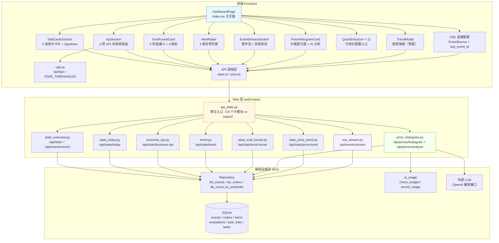
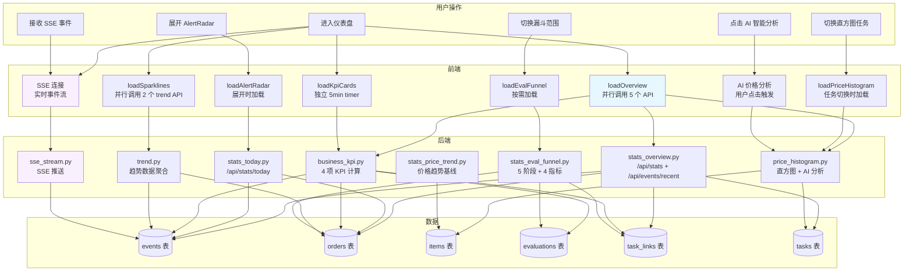
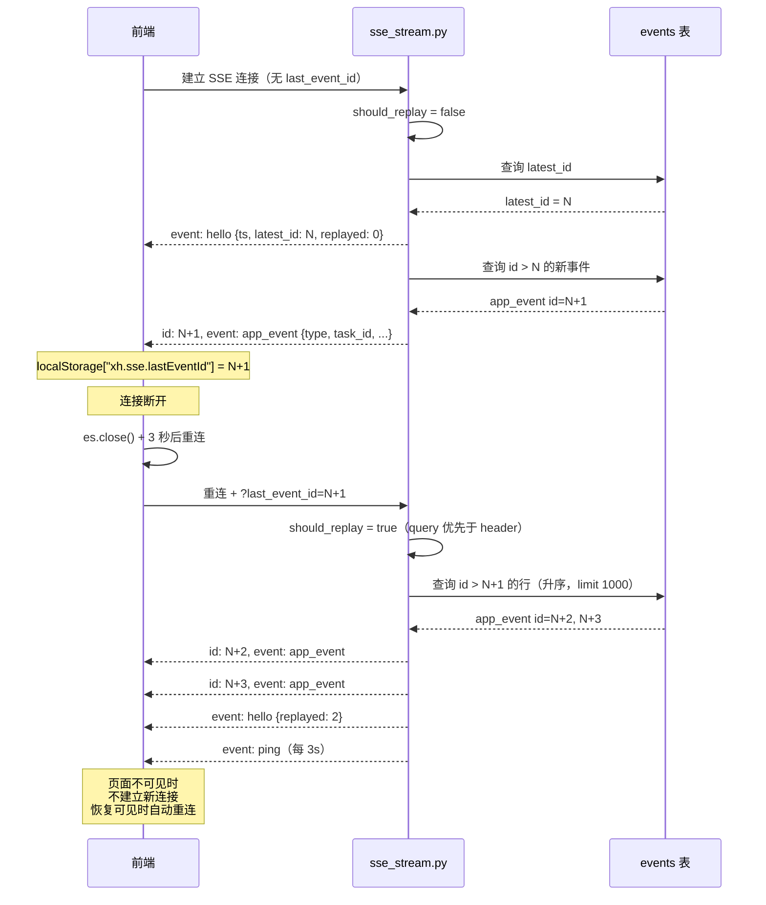
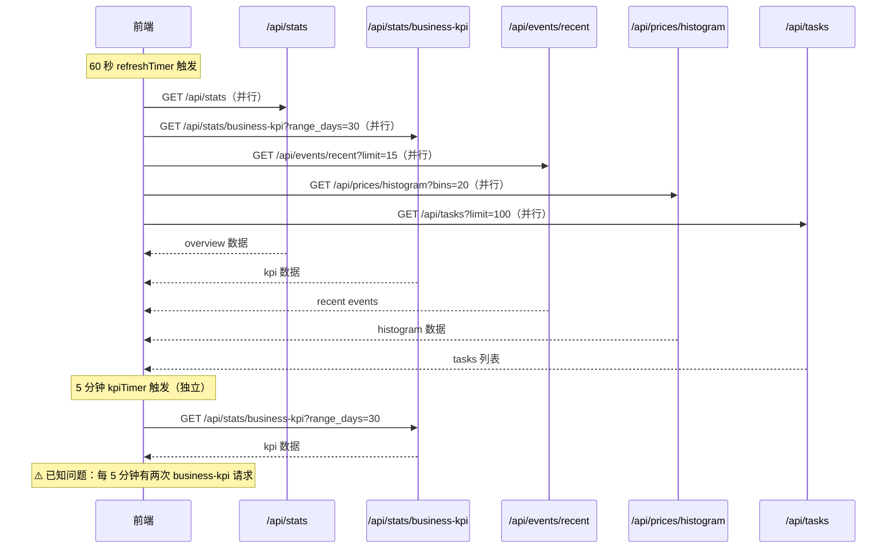
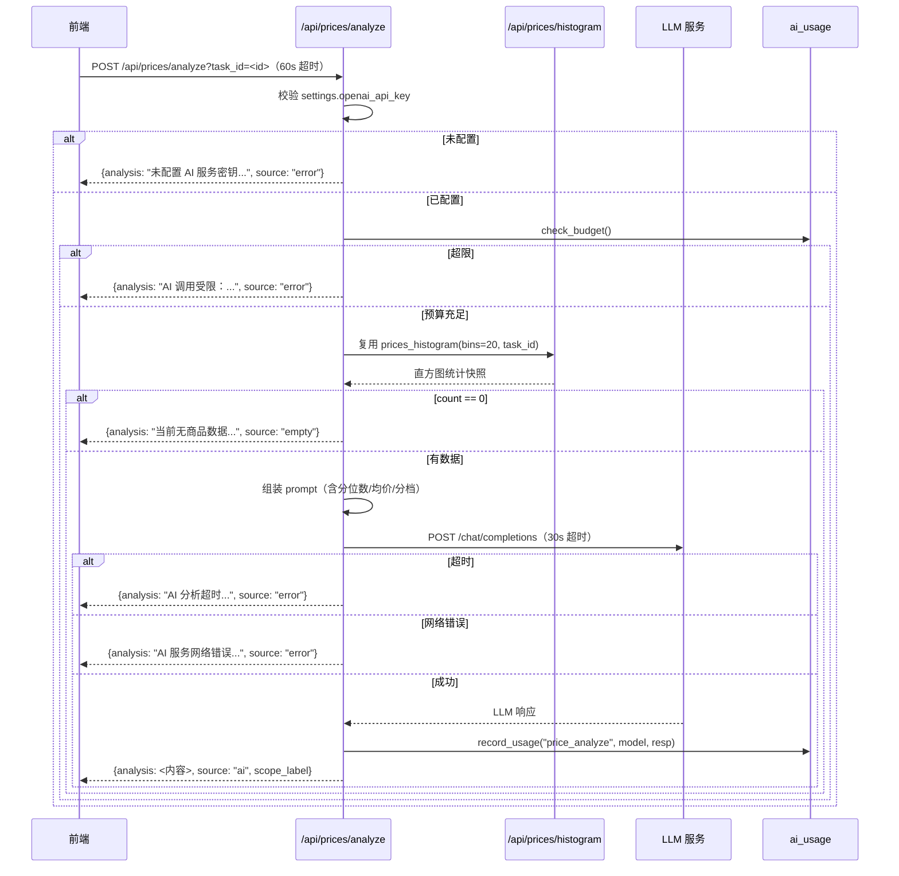

# 闲鱼猎人「仪表盘」模块需求规格说明书

| 项 | 内容 |
|---|---|
| 文档版本 | v1.0 |
| 文档日期 | 2026-07-05 |
| 文档状态 | 初版（与详细设计 v2.1 对齐） |
| 所属项目 | 闲鱼猎人（XianyuHunter） |
| 所属菜单 | 总览 → 仪表盘 |
| 菜单标识 | `menu_registry.yaml` 中 `key=dashboard`、`icon=DashboardOutlined`、`sort_order=1`、`category=overview`、`default_visible=true` |
| 关联路由 | 前端 `/`；后端 `/api/stats`、`/api/events/recent`、`/api/stats/today`、`/api/stats/business-kpi`、`/api/stats/trend`、`/api/stats/eval-funnel`、`/api/prices/histogram`、`/api/prices/analyze`、`/api/stats/price-trend`、`/api/events/stream` |
| 关联文档 | [仪表盘-详细设计.md](仪表盘-详细设计.md)（v2.1/2026-07-05） |
| 文档类型 | 需求规格说明书（SRS） |

> **本文档首段：继承 project_memory.md 中的硬约束。** 1. Web 进程必须使用 `with_browser=False` 模式；2. 认证白名单机制（`/api/events/stream` 已在白名单）；3. 前端 fetch 必须含 `credentials: 'include'`；4. 401 必须返回 JSON `{"detail":"Unauthorized"}`；5. token 比较使用 `hmac.compare_digest()`；6. 敏感字段不日志；7. token 写失败触发 `logging.warning()`；8. 模块级 import；9. DB 索引齐全（`task_id`/`item_id`/`created_at`/`request_id` 等单列与联合索引）；10. COUNT 查询用 CASE WHEN 聚合；11. WebView2 子进程 `CREATE_NEW_CONSOLE`；12. WebView2 `private_mode=False` + 独立 `storage_path`；13. `run_migrations` 各迁移块独立 try/except；14. 启动钩子异常 `logger.exception()`。

---

## 0. 阶段交接声明

```
- 当前阶段：仪表盘 SRS 编写（v1.0） ✅ 已完成
- 下一阶段：仪表盘操作手册编写
- 下一阶段智能体：文档编写智能体
- 下一阶段技能：文档编写
- 交接上下文：
  · 本文档定义「总览 → 仪表盘」一级菜单完整需求 v1.0
  · 关键设计决策：1 个前端页面（Dashboard/index.tsx）+ 7 子组件 + 1 可视化配置入口 + TrendModal
  · 10 大功能模块（FR-1~FR-10）：总览统计/KPI 星级/评估漏斗/异常列表/SSE 事件流/价格直方图/AI 分析/趋势数据/系统状态/配置入口
  · 10 个 API 端点（9 GET + 1 POST），含 1 个 SSE 流式端点
  · 4 项业务 KPI（发现商品数/评估通过率/抢单成功率/推送失败率）+ 4 项转化指标（命中率/误报率/抢单成功率/端到端率）
  · 5 阶段评估漏斗（discovered→evaluated→eval_pass→order_triggered→order_succeeded）
  · 3 维异常列表（失败订单/超时待支付/低分评估）
  · 5 类 SSE 事件（hello/app_event/ping/warn/error）+ 10 连接并发上限
  · 米其林 5 档星级阈值（4 项 KPI，含 1 项反向指标 notify_failure_rate）
  · 7 类价格直方图 markLine（P25/P50/P75/7日均价/30日均价/今日均价/定价上下限）
  · 3 个已知问题（events/recent 字段契约不一致、KPI 与漏斗抢单成功率口径不一致、60s/5min timer 重复调用 KPI）
  · 轮询策略：60 秒概览轮询 + 5 分钟独立 KPI 轮询
```

---

## 1. 引言

### 1.1 编写目的

本需求规格说明书定义「总览 → 仪表盘」一级菜单的完整需求规格，作为前端/后端开发、测试与验收的唯一依据。

**目标读者**：
- 后端开发工程师：依据 §3-§6、§8、§10 进行模块实现与扩展
- 前端开发工程师：依据 §4、§9 进行页面开发
- 测试工程师：依据 §7、§11 编写测试用例与执行验收
- 项目经理：依据 §2、§11 进行范围与里程碑管理
- 智能客服 KB 训练：本文档与 [仪表盘-详细设计.md](仪表盘-详细设计.md) 共同作为 KB 检索素材

### 1.2 项目背景

闲鱼猎人（XianyuHunter）是一个闲鱼自动捡漏与抢单工具，已具备任务管理、商品采集、AI 评估、自动下单、多渠道通知等完整能力（详见 [requirements.md](../requirements.md)、[design.md](../design.md) 与 [概要设计文档.md](../概要设计文档.md)）。

随着系统运行规模扩大，**运营人员需要在登录后第一眼掌握整体运行状况**，包括：

| 痛点 | 现状 | 影响 |
|------|------|------|
| 运行状态分散 | 任务/订单/事件/评估数据散落多个页面 | 巡检需切换 5+ 页面 |
| KPI 健康度不直观 | 4 项核心 KPI 仅以裸数值展示 | 无法快速判断系统是否健康 |
| 实时事件不可见 | 事件流需手动刷新页面 | 抢单成功/失败感知延迟 |
| 异常定位困难 | 失败订单/超时待支付/低分评估无聚合视图 | 异常发现滞后 |
| 价格分布无可视化 | 商品价格仅有列表展示 | 难以判断市场价格趋势 |
| 配置入口分散 | 11 个配置页面无统一入口 | 新手找不到配置位置 |

**解决方案**：通过 1 个仪表盘页面集中展示 7 个子组件 + 1 个可视化配置入口网格，让运营人员一屏掌握整体运行状况，无需切换多个页面；通过 SSE 实时事件流和今日异常列表，第一时间发现并定位问题；通过米其林星级 KPI 直观反映系统健康度；通过评估漏斗与价格直方图，量化业务转化与市场价格分布；通过 AI 价格分析，结合分位数与时间对比基线给出策略建议。

### 1.3 范围与约束

#### 1.3.1 包含范围（In-Scope）

- 系统总览统计（`GET /api/stats`、`GET /api/events/recent`）
- 今日异常汇总（`GET /api/stats/today`）
- 业务 KPI 看板（`GET /api/stats/business-kpi`，4 项 KPI + 米其林星级）
- 评估漏斗与转化指标（`GET /api/stats/eval-funnel`，5 阶段 + 4 指标）
- 价格直方图与分位数（`GET /api/prices/histogram`，含 7 类 markLine）
- AI 价格分析（`POST /api/prices/analyze`，LLM 生成策略建议）
- 价格趋势对比基线（`GET /api/stats/price-trend`，今日/7日/30日均价）
- 多指标趋势数据（`GET /api/stats/trend`，4 metric × 5 range_hours）
- SSE 实时事件流（`GET /api/events/stream`，5 类事件 + 断线回放）
- 前端 1 个页面（Dashboard/index.tsx）+ 7 子组件 + 1 可视化配置入口 + TrendModal
- 11 个 QuickEntryIcon 配置/管理快捷入口
- 引导 Banner（无任务时显示）+ 调度器警告 Banner
- 轮询策略：60 秒概览轮询 + 5 分钟独立 KPI 轮询
- 可见性控制：SSE 仅在页面可见时建立连接

#### 1.3.2 排除范围（Out-of-Scope）

- 不实现 KPI 阈值的前端可配置化（阈值硬编码于 `utils.ts` 的 `STAR_THRESHOLDS`）
- 不实现 TrendModal 的触发器绑定（`setTrendOpen` 当前未被调用，属于预留组件）
- 不实现 SSE 失败 N 次降级为轮询的兜底（仅依赖 3 秒重连）
- 不实现仪表盘数据的导出功能（CSV/Excel 等）
- 不实现仪表盘布局的自定义拖拽（布局固定）
- 不实现多用户仪表盘隔离（仪表盘展示全局数据，与 user_id 无关）
- 不实现移动端独立仪表盘布局（复用桌面端响应式布局）

#### 1.3.3 硬约束

继承 [project_memory.md](c:/Users/hspcadmin/.trae-cn/memory/projects/-d-code-otherProjects-17-xianyu/project_memory.md) 中的项目硬约束，并显式映射到本模块实现：

| 硬约束 | 本模块适用性 | 实现要点 |
|--------|--------------|----------|
| Web 进程使用 `with_browser=False` 模式 | 适用 | 仪表盘所有 API 在 Web 进程内执行，不启动浏览器 |
| 认证白名单（`/api/auth/cookie` 等） | 适用 | `/api/events/stream` **必须**加入白名单（SSE 长连接不重复鉴权） |
| 前端 fetch 必须含 `credentials: 'include'` | 适用 | `frontend/src/api/stats.ts`、`price.ts` 全量沿用 `client` 默认配置 |
| 401 响应必须返回 JSON `{"detail":"Unauthorized"}` | 适用 | 所有 `/api/stats/*`、`/api/prices/*` 路由层统一异常处理 |
| 后端 token 比较使用 `hmac.compare_digest()` | 不适用 | 仪表盘不涉及 token 写入比较 |
| 敏感字段（token 长度等）不日志 | 适用 | §8.5 日志规范：仅记录 `task_id / metric / range_hours` |
| token 写失败触发 `logging.warning()` | 不适用 | 仪表盘不涉及 token 写入 |
| 缺失 import 必须 module-level | 适用 | `price_histogram.py` 中 `httpx`/`get_settings`/`check_budget`/`record_usage` 因避免循环依赖延迟导入，已在函数内显式 import |
| DB 必须在 `task_id/seller_id/...` 加索引 | 适用 | `events` 表有 `ix_events_task_created` 联合索引；`task_links`/`evaluations`/`orders` 表均有 `task_id` 索引 |
| COUNT 查询用 CASE WHEN 聚合 | 适用 | `_overview()` 中的多状态订单计数用 CASE WHEN 聚合，减少 DB 调用 |
| WebView2 子进程使用 `CREATE_NEW_CONSOLE` | 不适用 | 仪表盘不涉及 WebView2 子进程 |
| WebView2 `webview.start()` 设 `private_mode=False` + 独立 `storage_path` | 不适用 | 同上 |
| KBManager 排除 `web/static/` 等目录 | 适用 | 本文档与详细设计文档作为 KB 索引素材 |
| `local_embedding.py` HF_ENDPOINT 设置 | 不适用 | 本模块不涉及 embedding |
| EmbeddingService 本地后端 | 不适用 | 同上 |
| `run_migrations` 各块独立 try/except | 适用 | 仪表盘相关表迁移块独立 try/except |
| 启动钩子异常 `logger.exception()` | 适用 | `startup.py` 中路由聚合注册失败时打印完整 traceback |

### 1.4 术语与缩写

| 术语 | 全称 | 说明 |
|------|------|------|
| Dashboard | Dashboard | 仪表盘页面，前端目录 `frontend/src/pages/Dashboard/`（注意大写 D） |
| KPI | Key Performance Indicator | 业务关键绩效指标，本模块共 4 项 |
| Michelin Star | Michelin Star | 米其林星级，5 档阈值评级 |
| STAR_THRESHOLDS | Star Thresholds | 米其林星级阈值表，定义于 `utils.ts` |
| kpiStar | KPI Star | 星级计算函数，正向/反向指标两种逻辑 |
| SSE | Server-Sent Events | 服务端推送流式响应，仪表盘事件流使用 |
| _MAX_SSE_CONNECTIONS | Max SSE Connections | SSE 全局并发上限（10） |
| last_event_id | Last Event ID | SSE 断线回放游标（events 表 id） |
| SSE_LAST_EVENT_ID_KEY | SSE Last Event ID Key | localStorage key `xh.sse.lastEventId` |
| EvalFunnel | Evaluation Funnel | 评估漏斗，5 阶段转化 |
| AlertRadar | Alert Radar | 异常列表卡片（已由旧版雷达图改为折叠式 3 列列表） |
| PriceHistogram | Price Histogram | 价格直方图 |
| markLine | Mark Line | ECharts 图表标线（P25/P50/P75/均价等） |
| Sparkline | Sparkline | 迷你趋势小图，嵌于统计卡片内 |
| TrendModal | Trend Modal | 趋势弹窗（预留组件，当前未绑定触发器） |
| QuickEntryIcon | Quick Entry Icon | 可视化配置入口卡片 |
| StatCardsSection | Stat Cards Section | 顶部 4 张统计卡片区域 |
| KpiSection | KPI Section | 业务 KPI 米其林星级区域 |
| EventStreamSection | Event Stream Section | 事件流 + 系统状态区域 |
| hit_rate | Hit Rate | 评估通过率（评估通过 / 已评估） |
| false_positive_rate | False Positive Rate | 误报率（抢单失败 / 抢单触发） |
| conversion_rate | Conversion Rate | 抢单成功率（抢单成功 / 抢单触发） |
| overall_rate | Overall Rate | 端到端转化率（抢单成功 / 采集商品） |
| items_discovered | Items Discovered | 发现商品数 KPI |
| eval_pass_rate | Eval Pass Rate | 评估通过率 KPI |
| order_success_rate | Order Success Rate | 抢单成功率 KPI |
| notify_failure_rate | Notify Failure Rate | 推送失败率 KPI（反向指标） |
| discovered | Discovered | 漏斗第 1 阶段（采集商品数） |
| evaluated | Evaluated | 漏斗第 2 阶段（已评估数） |
| eval_pass | Eval Pass | 漏斗第 3 阶段（评估通过数） |
| order_triggered | Order Triggered | 漏斗第 4 阶段（抢单触发数） |
| order_succeeded | Order Succeeded | 漏斗第 5 阶段（抢单成功数） |
| failed_orders | Failed Orders | 今日失败订单 |
| timeout_pending | Timeout Pending | 超时待支付订单（创建超 5 分钟未支付） |
| low_evaluations | Low Evaluations | 低分评估（score < 0.5） |
| P25/P50/P75 | Percentile 25/50/75 | 第 25/50/75 百分位 |
| P5/P95 | Percentile 5/95 | 第 5/95 百分位（用于分桶边界裁剪） |
| today_avg | Today Average | 今日均价 |
| d7_avg | 7-Day Average | 7 日均价 |
| d30_avg | 30-Day Average | 30 日均价 |
| delta_pct | Delta Percentage | 涨跌幅百分比 |
| bins | Bins | 直方图分桶数（0=固定刻度，20=自动分桶） |
| bucket_count | Bucket Count | 趋势数据时间桶数 |
| _RANGE_BUCKET_COUNT | Range Bucket Count Map | range_hours → bucket_count 映射 |
| fixed mode | Fixed Mode | 固定刻度分桶模式 |
| auto mode | Auto Mode | 自动分桶模式（P5/P95 裁剪 + 任务定价范围融合） |
| task_price_range | Task Price Range | 任务定价范围（min_price/max_price） |
| ping | Ping | SSE 心跳帧（3 秒间隔） |
| hello | Hello | SSE 连接建立帧（含补拉统计） |
| app_event | App Event | SSE 业务事件帧（启用断线回放） |
| replayed | Replayed | SSE 断线回放条数 |
| record_usage | Record Usage | AI 调用用量记录 |
| check_budget | Check Budget | AI 调用预算校验 |

### 1.5 参考资料

| 文档 | 路径 | 用途 |
|------|------|------|
| 需求文档 v1.0 | [../requirements.md](../requirements.md) | 系统整体需求基线 |
| 概要设计文档 v2.0 | [概要设计文档.md](../概要设计文档.md) | 36 个 API 路由、11 张数据表、技术选型 |
| 技术设计说明书 | [../design.md](../design.md) | 分层架构、Evaluator 设计、状态机 |
| 仪表盘 详细设计 v2.1 | [仪表盘-详细设计.md](仪表盘-详细设计.md) | 本模块技术设计、代码位置、FAQ |
| 米其林设计系统 | [../standards/michelin-design-system.md](../standards/michelin-design-system.md) | UI 设计规范、色彩字体系统 |
| 任务管理 SRS | [../02-数据查看/任务管理-需求规格.md](../02-数据查看/任务管理-需求规格.md) | SRS 模板参考（12 章节完整版） |
| 反爬登录管理 SRS | [../04-系统维护/反爬登录管理-需求规格.md](../04-系统维护/反爬登录管理-需求规格.md) | SRS 模板参考 |
| 智能客服 SRS | [../06-智能客服/智能客服-需求规格.md](../06-智能客服/智能客服-需求规格.md) | SRS 模板参考 |
| 项目硬约束 | [project_memory.md](c:/Users/hspcadmin/.trae-cn/memory/projects/-d-code-otherProjects-17-xianyu/project_memory.md) | 必须继承的硬约束清单 |
| 菜单元数据 | [../../config/menu_registry.yaml](../../config/menu_registry.yaml) | `key=dashboard`、`sort_order=1` |
| 仪表盘主页面 | [../../frontend/src/pages/Dashboard/index.tsx](../../frontend/src/pages/Dashboard/index.tsx) | 主页面 + SSE 连接 + 轮询 timer |
| 统计卡片 | [../../frontend/src/pages/Dashboard/components/StatCardsSection.tsx](../../frontend/src/pages/Dashboard/components/StatCardsSection.tsx) | 4 张统计卡片 + Sparkline |
| KPI 米其林星级 | [../../frontend/src/pages/Dashboard/components/KpiSection.tsx](../../frontend/src/pages/Dashboard/components/KpiSection.tsx) | 4 项 KPI + 星级渲染 |
| 评估漏斗 | [../../frontend/src/pages/Dashboard/components/EvalFunnelCard.tsx](../../frontend/src/pages/Dashboard/components/EvalFunnelCard.tsx) | 5 阶段 + 4 指标 |
| 异常列表 | [../../frontend/src/pages/Dashboard/components/AlertRadar.tsx](../../frontend/src/pages/Dashboard/components/AlertRadar.tsx) | 3 列折叠式异常列表 |
| 事件流 | [../../frontend/src/pages/Dashboard/components/EventStreamSection.tsx](../../frontend/src/pages/Dashboard/components/EventStreamSection.tsx) | 事件流 + 系统状态 |
| 价格直方图 | [../../frontend/src/pages/Dashboard/components/PriceHistogramCard.tsx](../../frontend/src/pages/Dashboard/components/PriceHistogramCard.tsx) | 直方图 + AI 分析 |
| 趋势弹窗 | [../../frontend/src/pages/Dashboard/components/TrendModal.tsx](../../frontend/src/pages/Dashboard/components/TrendModal.tsx) | 趋势弹窗（预留） |
| 工具函数 | [../../frontend/src/pages/Dashboard/utils.ts](../../frontend/src/pages/Dashboard/utils.ts) | kpiStar / STAR_THRESHOLDS |
| 事件类型常量 | [../../frontend/src/constants/eventTypes.ts](../../frontend/src/constants/eventTypes.ts) | EVENT_COLOR / EVENT_TYPE_LABEL |
| 前端 API 封装 | [../../frontend/src/api/stats.ts](../../frontend/src/api/stats.ts) | statsApi |
| 前端 API 封装 | [../../frontend/src/api/price.ts](../../frontend/src/api/price.ts) | priceApi |
| 后端路由聚合 | [../../backend/xianyu_hunter/web/routes/api_stats.py](../../backend/xianyu_hunter/web/routes/api_stats.py) | 10 个子模块 router 聚合入口 |
| 总览统计后端 | [../../backend/xianyu_hunter/web/routes/stats_overview.py](../../backend/xianyu_hunter/web/routes/stats_overview.py) | `/api/stats` + `/api/events/recent` |
| 今日异常后端 | [../../backend/xianyu_hunter/web/routes/stats_today.py](../../backend/xianyu_hunter/web/routes/stats_today.py) | `/api/stats/today` |
| 业务 KPI 后端 | [../../backend/xianyu_hunter/web/routes/business_kpi.py](../../backend/xianyu_hunter/web/routes/business_kpi.py) | `/api/stats/business-kpi` |
| 趋势数据后端 | [../../backend/xianyu_hunter/web/routes/trend.py](../../backend/xianyu_hunter/web/routes/trend.py) | `/api/stats/trend` |
| 评估漏斗后端 | [../../backend/xianyu_hunter/web/routes/stats_eval_funnel.py](../../backend/xianyu_hunter/web/routes/stats_eval_funnel.py) | `/api/stats/eval-funnel` |
| 价格直方图后端 | [../../backend/xianyu_hunter/web/routes/price_histogram.py](../../backend/xianyu_hunter/web/routes/price_histogram.py) | `/api/prices/histogram` + `/api/prices/analyze` |
| 价格趋势后端 | [../../backend/xianyu_hunter/web/routes/stats_price_trend.py](../../backend/xianyu_hunter/web/routes/stats_price_trend.py) | `/api/stats/price-trend` |
| SSE 事件流后端 | [../../backend/xianyu_hunter/web/routes/sse_stream.py](../../backend/xianyu_hunter/web/routes/sse_stream.py) | `/api/events/stream` |

---

## 2. 总体描述

### 2.1 产品定位

「仪表盘」是闲鱼猎人系统的**总览入口**，定位为：

> 将分散在 tasks / orders / events / evaluations / items 等多张表中的运行状态、业务 KPI、实时事件、异常告警、价格分布等关键信息**集中展示**在一个页面，让运营人员一屏掌握整体运行状况，无需切换多个页面。

**核心价值**：
1. **一屏总览**：4 张统计卡片 + 4 项 KPI + 5 阶段漏斗 + 3 维异常 + 实时事件流 + 价格直方图，全部一屏可见
2. **健康度直观**：米其林 5 档星级让 KPI 健康度一目了然，满星金色高亮
3. **实时感知**：SSE 长连接推送业务事件，3 秒 ping 心跳保活，断线 3 秒自动重连 + 回放
4. **异常定位**：3 维异常列表（失败订单/超时待支付/低分评估）+ 一键跳转订单详情
5. **决策辅助**：价格直方图 + 7 类标线 + AI 智能分析，给出策略建议

### 2.2 用户角色与特征

| 角色 | 特征 | 使用场景 | 关注重点 |
|------|------|----------|----------|
| 日常巡检运营 | 每日登录后第一眼查看 | 关注 KPI 星级是否绿色、AlertRadar 告警徽标、SSE 连接状态 | KPI 星级、异常徽标、连接状态 |
| 异常定位运营 | 收到告警后排查 | 展开 AlertRadar 看失败订单/超时待支付/低分评估详情，点击跳转订单详情 | 异常列表、跳转入口 |
| 业务复盘运营 | 周期性业务分析 | 切换 7/30/90 天看评估漏斗各阶段转化、4 项关键指标 | 漏斗阶段、转化指标 |
| 价格策略运营 | 调整任务定价 | 选择特定任务看价格直方图、P25/P50/P75 分位数、7/30 日均价基线、AI 分析建议 | 直方图、分位数、AI 分析 |
| 新用户 | 首次部署无任务 | 看到引导 Banner，点击"创建任务"或"查看引导" | 引导 Banner、可视化配置入口 |
| 系统管理员 | 系统健康监控 | 查看系统状态区域（DB/调度器/浏览器/任务/订单/评估/心跳） | 系统状态、调度器运行 |

### 2.3 运行环境

| 项 | 要求 |
|---|---|
| 操作系统 | Windows 10/11（主），Linux/macOS 需兼容 |
| Python | 3.11+ |
| Node.js | 18+（仅前端构建） |
| 后端框架 | FastAPI（已集成） |
| 前端框架 | React 18 + TypeScript + Ant Design 5 + ECharts（已集成） |
| 数据库 | 复用现有 SQLite（events / orders / items / evaluations / task_links / tasks） |
| AI 服务 | 依赖现有 AI 服务配置（OpenAI 兼容接口，用于价格分析） |
| 浏览器 | Chrome/Edge 90+（需支持 EventSource SSE） |

### 2.4 设计约束

1. **集成部署**：作为 `backend/xianyu_hunter/web/routes/api_stats.py` 路由聚合 + `frontend/src/pages/Dashboard/` 页面集成到现有系统，不独立部署
2. **复用 Container 单例**：所有端点通过 `Depends(get_container)` 访问 Container，保证状态一致
3. **路由聚合机制**：`api_stats.py` 仅作聚合入口，从 10 个子模块导入 router 并 re-export，自身不含业务逻辑；子模块已自带 `/api` 前缀，聚合层不再加 `prefix="/api"`（避免注册成 `/api/api/stats`）
4. **SSE 长连接**：`/api/events/stream` 使用 `text/event-stream` 媒体类型，必须加入认证白名单（避免长连接重复鉴权）
5. **前端目录大小写**：`frontend/src/pages/Dashboard/`（大写 D），与路由 `index` 元素对应
6. **懒加载**：`React.lazy` + `lazyRetry` 加载 Dashboard 组件，必须配置 `Suspense` fallback
7. **响应式布局**：使用 Ant Design 24 栅格系统，事件流 15/24 + 系统状态 9/24
8. **前端 fetch 含 `credentials: 'include'`**：通过 `client` 默认配置统一注入
9. **数据库索引依赖**：依赖 `events` 表的 `ix_events_task_created` 联合索引、`task_links`/`evaluations`/`orders` 表的 `task_id` 索引
10. **AI 调用预算**：`POST /api/prices/analyze` 受 `check_budget()` 约束，超限返回错误提示
11. **SSE 连接限制**：服务端全局并发上限 10 个连接（`_MAX_SSE_CONNECTIONS = 10`），通过 `asyncio.Lock` 保护的计数器实现

### 2.5 假设与依赖

**假设**：
- 用户已部署闲鱼猎人 v2.x+ 并能访问 `MainLayout` 侧边栏
- 仪表盘数据来源于已运行的任务（无任务时显示引导 Banner）
- AI 价格分析依赖已配置的 AI 服务（未配置时返回友好提示）

**依赖**：
- 依赖现有 `auth.py` 认证中间件（`/api/events/stream` 在白名单）
- 依赖现有 `Container`（注入 `repo`）
- 依赖现有 `events` / `orders` / `items` / `evaluations` / `task_links` / `tasks` 表
- 依赖现有 `menu_registry.yaml` 菜单注册（已配置 `key=dashboard`）
- 依赖现有 AI 服务配置（`openai_api_key` / `openai_base_url` / `openai_model`）
- 依赖现有 AI 用量记录（`check_budget` / `record_usage`）
- 新增无外部依赖

---

## 3. 总体架构设计

### 3.1 模块架构图



### 3.2 数据流程图



### 3.3 关键时序图

#### 3.3.1 SSE 断线回放时序



#### 3.3.2 60 秒概览轮询 + 5 分钟 KPI 轮询时序



#### 3.3.3 AI 价格分析时序



### 3.4 模块分层与职责

遵循项目现有 DDD 分层架构（见 [概要设计文档](../概要设计文档.md) §3）：

| 层级 | 模块 | 职责 |
|------|------|------|
| **Web 层** | `api_stats.py` | 路由聚合入口（10 个子模块 re-export），无业务逻辑 |
| | `stats_overview.py` | `/api/stats` 系统总览 + `/api/events/recent` 最近事件 |
| | `stats_today.py` | `/api/stats/today` 今日异常汇总 |
| | `business_kpi.py` | `/api/stats/business-kpi` 4 项 KPI 计算（含历史对比） |
| | `trend.py` | `/api/stats/trend` 多指标趋势数据（4 metric × 5 range） |
| | `stats_eval_funnel.py` | `/api/stats/eval-funnel` 5 阶段漏斗 + 4 指标 |
| | `price_histogram.py` | `/api/prices/histogram` 直方图 + `/api/prices/analyze` AI 分析 |
| | `stats_price_trend.py` | `/api/stats/price-trend` 价格趋势基线 |
| | `sse_stream.py` | `/api/events/stream` SSE 实时事件流 |
| **基础设施层** | `infra/db_models.py` | EventRow / OrderRow / ItemRow / EvaluationRow / TaskLinkRow / TaskRow |
| | `infra/repo.py` | list_events / list_orders / db_count_by_predicate 等 |
| | `infra/ai_usage.py` | check_budget / record_usage |
| **前端** | `pages/Dashboard/index.tsx` | 主页面 + SSE 连接 + 轮询 timer + handleSseAppEvent |
| | `pages/Dashboard/components/StatCardsSection.tsx` | 4 张统计卡片 + Sparkline |
| | `pages/Dashboard/components/KpiSection.tsx` | 4 项 KPI 米其林星级渲染 |
| | `pages/Dashboard/components/EvalFunnelCard.tsx` | 5 阶段漏斗 + 4 指标（误报率红色高亮） |
| | `pages/Dashboard/components/AlertRadar.tsx` | 3 列折叠式异常列表 |
| | `pages/Dashboard/components/EventStreamSection.tsx` | 事件流 + 系统状态 |
| | `pages/Dashboard/components/PriceHistogramCard.tsx` | 价格直方图 + 7 类 markLine + AI 分析 |
| | `pages/Dashboard/components/TrendModal.tsx` | 趋势弹窗（预留，未绑定触发器） |
| | `pages/Dashboard/utils.ts` | kpiStar / STAR_THRESHOLDS / deltaText |
| | `api/stats.ts` | statsApi（overview/today/businessKpi/recentEvents/trend/evalFunnel/priceTrend） |
| | `api/price.ts` | priceApi（histogram/categoryStats/categoryComparison/analyze/soldRange） |
| | `constants/eventTypes.ts` | EVENT_COLOR / EVENT_TYPE_LABEL |

---

## 4. 功能需求

### FR-1 系统总览统计

**FR-1.1** `GET /api/stats` 系统总览统计
- 无请求参数
- 响应字段：
  - `tasks{total,running,paused,stopped}`：任务统计
  - `orders{total,succeeded,failed,pending}`：订单统计
  - `events{total}`：事件总数
  - `evaluation_count`：评估总数
  - `db_size`：数据库大小（字节）
  - `browser_dir`：浏览器数据目录
  - `scheduler_running`：调度器是否运行
  - `ts`：生成时间戳
- COUNT 查询使用 CASE WHEN 聚合，减少 DB 调用 67%
- 响应时间目标：P95 ≤ 300ms

**FR-1.2** `GET /api/events/recent` 最近事件列表（首次加载）
- Query 参数：`limit`（默认 50）
- 响应：`{items[], count}`
- ⚠️ **已知问题**：前端 `stats.ts` 类型声明为 `{events: RecentEvent[]}`，`index.tsx` 中 `setEvents(ev.events || [])`，导致初始加载事件流为空，仅 SSE 推送的新事件显示
- 修复建议：后端 `stats_overview.py` 第 123 行将 `{"items": rows, "count": len(rows)}` 改为 `{"events": rows, "count": len(rows)}`，或前端 `stats.ts` 改为读取 `items`

**FR-1.3** 前端 StatCardsSection 渲染 4 张统计卡片：

| 卡片 | 数据来源 | 跳转目标 | Sparkline |
|------|----------|----------|-----------|
| 运行中任务 | `overview.tasks.running` | `/tasks` | 24h 事件密度（`statsApi.trend({metric:'events',range_hours:24})`） |
| 待支付订单 | `overview.orders.pending` | `/orders` | 24h 订单量（`statsApi.trend({metric:'orders',range_hours:24})`） |
| 成功抢单 | `overview.orders.succeeded` | `/orders` | 24h 订单量（同上，颜色 success） |
| 抢单失败 | `overview.orders.failed` | `/orders` | 24h 订单量（同上，颜色 error） |

**FR-1.4** 引导 Banner 显示规则
- 显示条件：`overview.tasks.total === 0 && overview.tasks.running === 0`
- 内容："欢迎使用闲鱼猎人！" + 两个按钮
- "创建任务"按钮跳转 `/tasks/new`
- "查看引导"按钮跳转 `/onboarding`

**FR-1.5** 调度器警告 Banner 显示规则
- 显示条件：`overview.scheduler_running === false`
- 内容：黄色 Alert，提示运营人员启动调度器

### FR-2 业务 KPI 米其林星级

**FR-2.1** `GET /api/stats/business-kpi` 4 项业务 KPI
- Query 参数：`range_days`（默认 30，1-365）
- 响应：`{range_days, generated_at, kpis[]{id,title,value,unit,delta_pct,sample_size,hint,is_pct}}`
- 每项 KPI 与上一周期（相同 range_days）对比计算 `delta_pct`

**FR-2.2** 4 项 KPI 计算逻辑（`business_kpi.py`）：

| KPI id | title | 分子 | 分母 | hint | 反向 |
|--------|-------|------|------|------|------|
| `items_discovered` | 发现商品数 | `task_links` 表 `link_type='item'` 去重 `link_key` 数（全表） | —（绝对值） | 采集到的去重商品总数（来自闲鱼搜索） | 否 |
| `eval_pass_rate` | 评估通过率 | `EvaluationRow` 且 `risk_level='low'` 行数（时间窗内） | `EvaluationRow` 总行数（时间窗内） | 低风险（可抢）评估 / 总评估 | 否 |
| `order_success_rate` | 抢单成功率 | `OrderRow` 且 `status='succeeded'` 行数（时间窗内） | `OrderRow` 总行数（时间窗内） | 已支付订单 / 总订单 | 否 |
| `notify_failure_rate` | 推送失败率 | `EventRow` 且 `stage like '%notify%'` 且 `level='err'` 行数（时间窗内） | `EventRow` 且 `stage like '%notify%'` 总行数（时间窗内） | 失败通知事件 / 总通知事件（越低越好） | 是 |

> ⚠️ **修复记录**：
> - `order_success_rate`：原查询 `status in ('paid','confirmed')` 永远命中 0 行（生产代码抢单成功写入 `'pending_pay'`，人工确认后写入 `'succeeded'`），已修复为仅查 `status='succeeded'`
> - `notify_failure_rate`：原分母用 `EventRow` 全量事件数，与 hint 文案"总通知事件"不符，已修复为 `stage like '%notify%'` 事件总数

**FR-2.3** 米其林 5 档星级阈值（`utils.ts` 的 `STAR_THRESHOLDS`）：

| KPI id | 1 星 | 2 星 | 3 星 | 4 星 | 5 星 | 反向 |
|--------|------|------|------|------|------|------|
| `eval_pass_rate` | [0,50) | [50,70) | [70,85) | [85,95) | [95,+∞) | 否 |
| `order_success_rate` | [0,40) | [40,60) | [60,75) | [75,85) | [85,+∞) | 否 |
| `items_discovered` | [0,200) | [200,500) | [500,800) | [800,1500) | [1500,+∞) | 否 |
| `notify_failure_rate` | (20,100] | (10,20] | (5,10] | (2,5] | [0,2] | 是 |

> `notify_failure_rate` 阈值数组在源码中按 `[50,20,10,5,2]` 递减存储，逻辑使用 `v <= th[i]` 判定。

**FR-2.4** 星级计算逻辑（`kpiStar` 函数）
- 正向指标：从 5 个阈值由低到高遍历，`v >= th[i]` 则得 `5-i` 星
- 反向指标：从 5 个阈值由高到低遍历，`v <= th[i]` 则得 `5-i` 星
- 数值非有限或阈值缺失时返回 0 星

**FR-2.5** KpiSection 渲染规则
- 调用 `kpiStar(k)` 计算 1-5 星
- 满星（5 星）卡片左侧添加金色（`token.colorWarning`）3px 边框，数值也用金色
- 涨跌箭头使用 `ArrowUpOutlined`/`ArrowDownOutlined`/`MinusOutlined`
- 反向指标 `notify_failure_rate` 的涨跌方向取反：上涨=红，下降=绿
- 涨跌 Tag 文案由 `deltaText(k)` 生成，格式为 `+x.x%` / `-x.x%` / `持平`
- 卡片底部展示 `k.hint` 业务说明文案
- 卡片右上角显示"基于 {sample_size} 条 · {range_days} 天"
- `kpiCards.length === 0` 时整块不渲染（避免空容器占用布局）

**FR-2.6** KPI 轮询策略
- 独立 5 分钟 `kpiTimer`，仅调用 `/api/stats/business-kpi?range_days=30`
- ⚠️ **已知问题**：60 秒 `refreshTimer` 内的 `loadOverview()` 已调用 `statsApi.businessKpi(30)`，5 分钟 `kpiTimer` 又调用一次，存在重复请求
- 修复建议：从 `loadOverview()` 移除 `statsApi.businessKpi(30)` 调用

### FR-3 评估漏斗与转化指标

**FR-3.1** `GET /api/stats/eval-funnel` 评估漏斗 + 关键转化指标
- Query 参数：`range_days`（默认 30，1-365）
- 响应：`{range_days, generated_at, stages[5], metrics{4 项}}`

**FR-3.2** 5 阶段漏斗（`stats_eval_funnel.py`）：

| 阶段 key | label | 数据来源 | 时间窗过滤 |
|----------|-------|----------|------------|
| `discovered` | 采集商品 | `task_links` 表 `link_type='item'` 去重 `link_key` 数 | `created_at` 时间窗 |
| `evaluated` | 已评估 | `evaluations` 表总行数 | `created_at` 时间窗 |
| `eval_pass` | 评估通过 | `evaluations` 表 `risk_level='low'` 行数 | `created_at` 时间窗 |
| `order_triggered` | 抢单触发 | `orders` 表总行数 | `created_at` 时间窗 |
| `order_succeeded` | 抢单成功 | `orders` 表 `status in ('paid','confirmed','succeeded')` 行数 ⚠️ | `created_at` 时间窗 |

> ⚠️ **已知问题**：`order_succeeded` 阶段分子为 `status in ('paid','confirmed','succeeded')`，与 KPI `order_success_rate`（仅 `status='succeeded'`）口径不一致。同一时间窗下，漏斗的 `conversion_rate` 数值会 ≥ KPI 的 `order_success_rate`。
> 修复建议：将 `stats_eval_funnel.py` 的 `order_succeeded` 阶段也改为仅查 `status == 'succeeded'`。

**FR-3.3** 每阶段占比计算
- `pct_of_first`：当前 / 首阶段（采集商品数）
- `pct_of_prev`：当前 / 上一阶段（首阶段为 100.0）
- 所有占比使用 `_safe_rate(numer, denom)` 计算，规避 division by zero

**FR-3.4** 4 个关键转化指标（`metrics` 字段）：

| 指标 | 计算公式 | 业务含义 |
|------|----------|----------|
| `hit_rate` | eval_pass / evaluated | 评估通过率，反映评估策略宽松度 |
| `false_positive_rate` | (order_triggered - order_succeeded) / order_triggered | 误报率，越低越好 |
| `conversion_rate` | order_succeeded / order_triggered | 抢单成功率 |
| `overall_rate` | order_succeeded / discovered | 端到端转化率 |

**FR-3.5** EvalFunnelCard 渲染规则
- Segmented 切换 7/30/90 天范围
- 漏斗图悬停阶段显示数量 / 占采集% / 占上一阶段%
- 下方 4 个 Statistic 展示命中率 / 误报率 / 抢单成功率 / 端到端率（含 Tooltip 解释）
- **误报率 > 30% 时数值显示红色（`token.colorError`）**，否则默认色
- 其余 3 个指标使用固定语义色（info/success/primary），不随数值变化

**FR-3.6** 加载策略
- 初始加载 + 范围切换时重新拉取，不轮询

### FR-4 今日异常列表（AlertRadar）

**FR-4.1** `GET /api/stats/today` 今日异常汇总
- 无请求参数
- 响应：`{today{orders,events,succeeded,failed}, alerts{failed_orders[],timeout_pending[],low_evaluations[],counts{failed,timeout,low_eval}}, ts}`

**FR-4.2** 3 维异常列表（`stats_today.py`）：

| 维度 | 数据来源 | 阈值/规则 | 列表字段 |
|------|----------|-----------|----------|
| `failed_orders` | `orders` 表 `status='failed'` 且 `created_at` 今日 | 列表展示前 20 条 | id / title / amount |
| `timeout_pending` | `orders` 表 `status in (pending,submitting,paying)` 且 `created_at` < now-5min | 列表展示前 20 条 | id / title / age_sec（创建距今秒数） |
| `low_evaluations` | `events` 表 `type='eval.scored'` 且 `payload.score` < 0.5 | 列表展示前 20 条 | message / type / score |

> 后端查询每维度 `limit=20`，前端 AlertRadar 渲染时 `slice(0, 5)` 仅显示前 5 条；`counts` 字段为精确总数。

**FR-4.3** AlertRadar 渲染规则
- 标题可点击折叠/展开
- 展开时 3 列卡片显示前 5 条详情
- 标题处 Badge 显示总告警数（失败数 > 0 时红色，否则黄色）
- 右上角刷新按钮
- "今日 N 单 / N 事件"汇总
- 点击失败/超时订单条目跳转 `/orders?ref=<id>`

**FR-4.4** 加载策略
- 初始加载 + 展开时拉取 + 手动刷新按钮，不轮询

### FR-5 SSE 实时事件流

**FR-5.1** `GET /api/events/stream` SSE 实时事件流
- Query 参数：`last_event_id`（断线回放游标）
- Header 参数：`Last-Event-ID`（与 query 等价，query 优先）
- 响应媒体类型：`text/event-stream`

**FR-5.2** 5 类 SSE 事件：

| 事件类型 | 触发条件 | data 字段 | 是否启用断线回放 |
|----------|----------|-----------|------------------|
| `hello` | 连接建立后立即推送 | `{ts, latest_id, replayed, replay_requested}` | 否 |
| `app_event` | 业务事件发生 | `{type, task_id, item_id, level, message, created_at}` | 是（id 字段） |
| `ping` | 3 秒心跳 | `{ts}` | 否 |
| `warn` | 回放失败告警 | `{msg, error}` | 否 |
| `error` | 连接超限或异常 | `{error}` | 否 |

**FR-5.3** SSE 连接限制
- 服务端全局并发上限 10 个连接（`_MAX_SSE_CONNECTIONS = 10`）
- 通过 `asyncio.Lock` 保护的计数器 `_sse_connection_count` 实现
- 超限时直接推送 `error` 帧（`{"error":"SSE connections limit (10) reached"}`）并关闭连接
- 连接关闭时（finally 块）计数器递减，使用 `max(0, ...)` 防止异常情况下负数

**FR-5.4** 断线回放机制
- 客户端每收到一条 `app_event`，将 `event.lastEventId` 写入 `localStorage["xh.sse.lastEventId"]`（key 提取为模块级常量 `SSE_LAST_EVENT_ID_KEY`）
- `EventSource` `onerror` 触发时 `es.close()` 并 3 秒后重连（固定间隔，非指数退避）
- 重连 URL 附加 `?last_event_id=<N>`
- 服务端同时支持 query 参数 `last_event_id` 与 header `Last-Event-ID`（query 优先）
- 服务端从 `events` 表查 `id > effective_last_id` 的行按升序回放，单次回放上限 1000 条
- 回放完成后推送 `hello` 帧告知客户端补拉数量 `replayed`

**FR-5.5** 可见性控制
- 页面不可见（`document.visibilityState !== 'visible'`）时不建立 SSE 连接
- 已建立的连接保持但不再触发重连逻辑
- 恢复可见时通过 `document.addEventListener('visibilitychange', ...)` 自动重连

**FR-5.6** 前端事件处理（`handleSseAppEvent` 模块级函数）
- 收到 `app_event` 后 prepend 到事件列表前 100 条
- Tag 标类型（颜色与标签来自 `constants/eventTypes.ts` 的 `EVENT_COLOR` / `EVENT_TYPE_LABEL`）
- 显示时间 + 消息

**FR-5.7** EventStreamSection 布局
- 左侧（15/24）：事件流列出最近 50 条（缓存 100 条），"查看全部"跳转 `/timeline`
- 右侧（9/24）：系统状态（DB/调度器/浏览器/任务/订单/评估/心跳）+ 4 个快捷按钮（任务管理/配置/实时日志/抢单记录）

### FR-6 价格直方图与 AI 分析

**FR-6.1** `GET /api/prices/histogram` 价格直方图（含分位数 + 时间对比）
- Query 参数：`bins`（0=固定刻度，20=自动分桶，默认 0）、`task_id`（可选）
- 响应：`{bins[]{min,max,count}, summary{count,min,max,mean,median,p25,p75,compare{yesterday,last7d,last30d,diff_pct},task_price_range{min_price,max_price}}, scope{mode,task_id,task_name,keyword,label}, mode(fixed/auto)}`

**FR-6.2** 固定刻度分桶模式（`bins=0`，默认）
- 预定义刻度 `[0, 50, 100, 200, 500, 1000, 2000, 5000, 10000, 20000]`
- 最后一桶为 `[20000, +∞)`
- `mode` 字段返回 `"fixed"`

**FR-6.3** 自动分桶模式（`bins=20`，前端默认调用）
- 用 P5/P95 裁剪极端值确定 `[lo, hi]` 范围
- 融合任务定价范围 `min_price/max_price`：
  - `lo = min(P5, task_min_price)`（覆盖定价下限）
  - `hi = max(P95, task_max_price)`（覆盖定价上限）
- 20 个等宽桶，首桶吸收所有低于 `b_lo` 的极端低价，尾桶吸收所有高于 `b_hi` 的极端高价，保证计数不丢失
- `mode` 字段返回 `"auto"`，前端据此判断是否显示分位数标线

**FR-6.4** 时间对比基线修复（P-09-30）
- 修复前 `ts_rows` 为全表查询，导致选定任务时 `yesterday/last7d/last30d` 基线混入其它任务价格
- 修复后 `ts_rows` 与 `prices` 同源——按 `task_id` 过滤，保证时间对比基线仅来自当前任务样本

**FR-6.5** 任务不存在处理
- `task_id` 非空且任务不存在时，返回空 bins + `scope.label = "任务 {id}（不存在）"`

**FR-6.6** PriceHistogramCard 7 类 markLine 颜色配置

| 标线 | 颜色 | 线型 | label 位置 | distance | 显示条件 |
|------|------|------|-----------|----------|----------|
| P25 | `token.colorWarning`（黄） | dashed | start | 6 | `mode == "auto"` |
| P50（中位数） | `token.colorInfo`（蓝） | dashed | end | 6 | `mode == "auto"` |
| P75 | `token.colorError`（红） | dashed | start | 20 | `mode == "auto"` |
| 7 日均价 | `token.colorPrimary`（蓝） | dashed | end | 20 | 总是显示 |
| 30 日均价 | `#722ED1`（紫，硬编码） | dashed | end | 34 | 总是显示 |
| 今日均价 | `token.colorError`（红） | dashed | start | 48 | 总是显示 |
| 定价下限 | `token.colorSuccess`（绿） | solid | start | 62 | 选定任务且设置了 `min_price` |
| 定价上限 | `token.colorSuccess`（绿） | solid | end | 48 | 选定任务且设置了 `max_price` |

> 标线 label 交替使用 start/end 位置避免数值接近时重叠；30 日均价色 `#722ED1` 为硬编码（不随主题切换），其余颜色取自 antd token，自动响应浅色/暗色主题。

**FR-6.7** `POST /api/prices/analyze` AI 价格分析
- Query 参数：`task_id`（可选）
- 响应：`{analysis, source(ai/empty/error), scope_label?}`
- 前端超时 60 秒（覆盖 LLM 30 秒超时 + 网络余量）

**FR-6.8** AI 分析处理流程（`price_histogram.py` 的 `prices_analyze`）
1. 校验 `settings.openai_api_key`，未配置返回 `{analysis: "未配置 AI 服务密钥...", source: "error"}`
2. 调用 `check_budget()` 校验预算，超限返回 `{analysis: "AI 调用受限：...", source: "error"}`
3. 复用 `prices_histogram(bins=20, task_id)` 获取统计快照
4. 若 `summary.count == 0`，返回 `{analysis: "当前无商品数据...", source: "empty"}`
5. 组装 prompt（含商品数/价格范围/均价/中位数/P25/P75/7日均价/今日均价/较7日变化/分档列表）
6. 调用 LLM `chat/completions`（`temperature=0.3, max_tokens=800, timeout=30s`），通过 `httpx.Client` 同步请求
7. 通过 `record_usage("price_analyze", model, resp)` 记录用量
8. 返回 `{analysis: <LLM 内容>, source: "ai", scope_label: <scope.label>}`
9. 异常分支：超时/网络错误/非 200/解析失败分别返回友好提示

**FR-6.9** 前端 AI 分析交互
- 点击"AI 智能分析"按钮触发 `priceApi.analyze(task_id)`（60s 超时）
- 返回的 `analysis` 文本以 Alert 形式展示在直方图下方
- 含"清除"按钮
- 前端根据 `analysis` 文案是否含"未配置"/"失败"/"错误"决定 Alert 类型（warning 或 success）

**FR-6.10** PriceHistogramCard 其他交互
- Select 切换任务（全部/单任务）
- 下方 Tag 行展示 P25/中位数/P75/IQR/30日均价/定价范围
- "查看商品"按钮跳转 `/items`

### FR-7 趋势数据（Sparkline + TrendModal）

**FR-7.1** `GET /api/stats/trend` 多指标趋势数据
- Query 参数：
  - `metric`（events/orders/eval_score/success_rate，默认 events）
  - `range_hours`（24/72/168/720/2160，默认 24，不在白名单回退到 24）
  - `task_id`（可选）
- 响应：`{metric, range_hours, task_id, series[]{ts,value,count}, summary{min,max,avg,current}, skipped_reason}`

**FR-7.2** `_RANGE_BUCKET_COUNT` 映射（`trend.py`）

| range_hours | bucket_count | 含义 |
|-------------|--------------|------|
| 24 | 24 | 24 小时分 24 桶（每小时 1 桶） |
| 72 | 24 | 3 天分 24 桶（每 3 小时 1 桶） |
| 168 | 14 | 7 天分 14 桶（每 12 小时 1 桶） |
| 720 | 30 | 30 天分 30 桶（每天 1 桶） |
| 2160 | 90 | 90 天分 90 桶（每天 1 桶） |

**FR-7.3** 4 种 metric 计算

| metric | 数据来源 | 值含义 |
|--------|----------|--------|
| `events` | `events` 表（可按 `task_id` 过滤） | 每条记录贡献 1.0 |
| `orders` | `orders` 表（不支持按 `task_id` 过滤） | 每条记录贡献 1.0 |
| `eval_score` | `events` 表中 `score > 0` 的事件 | score × 100（放大便于与百分比同图） |
| `success_rate` | `orders` 表 | succeeded=1.0，其它=0.0，聚合后即成功率 |

**FR-7.4** 性能优化
- 原实现拉取 `list_events(5000)` + `list_orders(5000)` 到内存再过滤
- 现改为 SQL `WHERE created_at >= cutoff` 直接在数据库端过滤时间窗
- 仅查询当前 metric 需要的表，避免无谓的全量加载

**FR-7.5** Sparkline 渲染（StatCardsSection）
- 任务卡显示 24h 事件密度（`metric=events`）
- 3 张订单卡都显示 24h 订单量（`metric=orders`），通过颜色区分（primary/warning/success/error）
- 通过 `statsApi.trend({metric, range_hours:24})` 调用

**FR-7.6** TrendModal 渲染（预留组件）
- 时间范围切换 7/30/90 天（168/720/2160 小时）
- 显示最低/最高/均值/当前 4 个汇总值
- `eval_score` 指标显示中位数参考线
- `success_rate` 指标显示 50% 告警线
- ⚠️ **当前未绑定触发器**（`setTrendOpen` 未被调用），属于预留组件

### FR-8 系统状态展示

**FR-8.1** EventStreamSection 右侧系统状态区域（9/24 栅格）
- 展示 7 项系统状态：DB / 调度器 / 浏览器 / 任务 / 订单 / 评估 / 心跳
- 数据来源：`overview` 对象（来自 `/api/stats`）

**FR-8.2** 4 个快捷按钮
- 任务管理 → `/tasks`
- 配置 → `/config`（系统配置）
- 实时日志 → `/logs`
- 抢单记录 → `/orders`

### FR-9 可视化配置入口

**FR-9.1** 11 个 QuickEntryIcon 卡片

| 卡片 | 跳转路径 | 副标题 |
|------|----------|--------|
| 任务创建 | `/tasks/new` | 向导式配置 |
| 价格策略 | `/config/price` | 滑块 + 预览 |
| 评估规则 | `/config/eval` | 雷达图可视化 |
| 通知渠道 | `/config/notifier` | 拖拽排序 |
| AI 服务 | `/config/ai` | 模型与深度分析 |
| 抢单策略 | `/config/buyer` | 极速抢占配置 |
| 搜索参数 | `/config/search` | 筛选与过滤 |
| 配置版本 | `/config/version` | 版本回滚管理 |
| 系统清理 | `/maintenance` | 缓存与日志维护 |
| 数据库维护 | `/maintenance/db` | 业务表在线管理 |
| 反爬登录管理 | `/anticrawl` | 策略与会话监控 |

**FR-9.2** 卡片样式
- 每张卡片含图标 + 标题 + 副标题
- 点击跳转对应配置/管理页面
- 响应式网格布局

### FR-10 数据刷新策略

**FR-10.1** 轮询策略汇总

| 数据源 | 刷新方式 | 频率/触发条件 |
|--------|----------|---------------|
| KPI 米其林卡片 | 轮询 | 5 分钟一次（独立 `kpiTimer`） |
| StatCards + Sparklines | 轮询 | 60 秒一次（与 Overview 共用 `refreshTimer`） |
| Overview 总览（DB/调度器等） | 轮询 | 60 秒一次（随 StatCards 一起拉取） |
| EvalFunnel 评估漏斗 | 事件触发 | 初始加载 + 范围切换时重新拉取 |
| AlertRadar 异常列表 | 事件触发 | 初始加载 + 展开时拉取 + 手动刷新按钮 |
| PriceHistogram 价格直方图 | 事件触发 | 初始加载 + 任务切换时重新拉取 |
| AI 价格分析 | 用户点击触发 | 单次请求，60s 超时 |
| EventStream 实时事件流 | SSE 长连接 | 实时推送，3 秒 ping 心跳 |

> EvalFunnel / AlertRadar / PriceHistogram 不再 60 秒轮询，改为事件触发加载，减少无谓 DB 查询。

**FR-10.2** `loadOverview()` 并行调用清单
- `statsApi.overview()`
- `statsApi.businessKpi(30)` ⚠️ 已知问题：与 5 分钟 `kpiTimer` 重复
- `statsApi.recentEvents(15)`
- `priceApi.histogram({bins:20, task_id})`
- `taskApi.list({limit:100})`

**FR-10.3** `loadSparklines()` 并行调用清单
- `statsApi.trend({metric:'events',range_hours:24})`
- `statsApi.trend({metric:'orders',range_hours:24})`

**FR-10.4** 可见性控制
- 轮询 timer 不主动暂停（依赖浏览器对后台 tab 的自动节流）
- SSE 连接在页面不可见时不建立新连接，恢复可见时自动重连

---

## 5. 接口定义

所有接口统一前缀：`/api/stats/*`、`/api/events/*`、`/api/prices/*`。

### 5.1 系统总览接口

#### GET `/api/stats`

**描述**：系统总览统计

**请求参数**：无

**响应**：
```json
{
  "tasks": {"total": 50, "running": 30, "paused": 10, "stopped": 10},
  "orders": {"total": 200, "succeeded": 150, "failed": 30, "pending": 20},
  "events": {"total": 5000},
  "evaluation_count": 800,
  "db_size": 10485760,
  "browser_dir": "/data/browser-data",
  "scheduler_running": true,
  "ts": "2026-07-05T10:23:11+00:00"
}
```

#### GET `/api/events/recent`

**描述**：最近事件列表（首次加载）

**Query 参数**：
- `limit?`：默认 50

**响应**：
```json
{
  "items": [
    {"id": 12345, "type": "buy.succeeded", "task_id": "t_001", "level": "info", "message": "抢单成功", "created_at": "2026-07-05T10:23:11+00:00"}
  ],
  "count": 50
}
```

⚠️ **已知问题**：前端期望 `events[]` 字段，后端返回 `items[]`，详见 §FR-1.2。

#### GET `/api/stats/today`

**描述**：今日异常汇总（AlertRadar 数据源）

**请求参数**：无

**响应**：
```json
{
  "today": {"orders": 20, "events": 500, "succeeded": 15, "failed": 5},
  "alerts": {
    "failed_orders": [{"id": "o_001", "title": "索尼A7M4", "amount": 8000}],
    "timeout_pending": [{"id": "o_002", "title": "iPhone 15", "age_sec": 600}],
    "low_evaluations": [{"message": "评估分 0.3", "type": "eval.scored", "score": 0.3}],
    "counts": {"failed": 5, "timeout": 3, "low_eval": 8}
  },
  "ts": "2026-07-05T10:23:11+00:00"
}
```

### 5.2 业务 KPI 接口

#### GET `/api/stats/business-kpi`

**描述**：4 项业务 KPI（米其林星级数据源）

**Query 参数**：
- `range_days?`：默认 30，1-365

**响应**：
```json
{
  "range_days": 30,
  "generated_at": "2026-07-05T10:23:11+00:00",
  "kpis": [
    {
      "id": "items_discovered",
      "title": "发现商品数",
      "value": 1200,
      "unit": "件",
      "delta_pct": 15.5,
      "sample_size": 1200,
      "hint": "采集到的去重商品总数（来自闲鱼搜索）",
      "is_pct": false
    },
    {
      "id": "eval_pass_rate",
      "title": "评估通过率",
      "value": 78.5,
      "unit": "%",
      "delta_pct": 2.3,
      "sample_size": 800,
      "hint": "低风险（可抢）评估 / 总评估",
      "is_pct": true
    },
    {
      "id": "order_success_rate",
      "title": "抢单成功率",
      "value": 75.0,
      "unit": "%",
      "delta_pct": -5.0,
      "sample_size": 200,
      "hint": "已支付订单 / 总订单",
      "is_pct": true
    },
    {
      "id": "notify_failure_rate",
      "title": "推送失败率",
      "value": 3.5,
      "unit": "%",
      "delta_pct": -1.2,
      "sample_size": 500,
      "hint": "失败通知事件 / 总通知事件（越低越好）",
      "is_pct": true
    }
  ]
}
```

### 5.3 评估漏斗接口

#### GET `/api/stats/eval-funnel`

**描述**：评估漏斗 + 关键转化指标

**Query 参数**：
- `range_days?`：默认 30，1-365

**响应**：
```json
{
  "range_days": 30,
  "generated_at": "2026-07-05T10:23:11+00:00",
  "stages": [
    {"key": "discovered", "label": "采集商品", "count": 1200, "pct_of_first": 100.0, "pct_of_prev": 100.0},
    {"key": "evaluated", "label": "已评估", "count": 800, "pct_of_first": 66.7, "pct_of_prev": 66.7},
    {"key": "eval_pass", "label": "评估通过", "count": 600, "pct_of_first": 50.0, "pct_of_prev": 75.0},
    {"key": "order_triggered", "label": "抢单触发", "count": 200, "pct_of_first": 16.7, "pct_of_prev": 33.3},
    {"key": "order_succeeded", "label": "抢单成功", "count": 150, "pct_of_first": 12.5, "pct_of_prev": 75.0}
  ],
  "metrics": {
    "hit_rate": 75.0,
    "false_positive_rate": 25.0,
    "conversion_rate": 75.0,
    "overall_rate": 12.5
  }
}
```

### 5.4 趋势数据接口

#### GET `/api/stats/trend`

**描述**：多指标趋势数据（Sparkline/TrendModal 数据源）

**Query 参数**：
- `metric?`：events/orders/eval_score/success_rate，默认 events
- `range_hours?`：24/72/168/720/2160，默认 24（不在白名单回退到 24）
- `task_id?`：可选（仅 events/eval_score 支持按 task_id 过滤）

**响应**：
```json
{
  "metric": "events",
  "range_hours": 24,
  "task_id": null,
  "series": [
    {"ts": "2026-07-05T09:23:00+00:00", "value": 12.5, "count": 5},
    {"ts": "2026-07-05T10:23:00+00:00", "value": 8.0, "count": 3}
  ],
  "summary": {"min": 0, "max": 20, "avg": 10.5, "current": 8.0},
  "skipped_reason": null
}
```

### 5.5 价格直方图接口

#### GET `/api/prices/histogram`

**描述**：价格直方图（含分位数 + 时间对比）

**Query 参数**：
- `bins?`：0=固定刻度（默认），20=自动分桶
- `task_id?`：可选，未传或传 `all` 则汇总所有任务

**响应**：
```json
{
  "bins": [
    {"min": 0, "max": 50, "count": 5},
    {"min": 50, "max": 100, "count": 15}
  ],
  "summary": {
    "count": 200,
    "min": 30.0,
    "max": 15000.0,
    "mean": 2500.0,
    "median": 1800.0,
    "p25": 800.0,
    "p75": 4500.0,
    "compare": {
      "yesterday": 2400.0,
      "last7d": 2300.0,
      "last30d": 2200.0,
      "diff_pct": 4.3
    },
    "task_price_range": {"min_price": 1000.0, "max_price": 8000.0}
  },
  "scope": {
    "mode": "task",
    "task_id": "t_001",
    "task_name": "索尼A7M4",
    "keyword": "索尼A7M4",
    "label": "索尼A7M4（t_001）"
  },
  "mode": "auto"
}
```

**任务不存在响应**：
```json
{
  "bins": [],
  "summary": {"count": 0, "min": 0, "max": 0, "mean": 0, "median": 0, "p25": 0, "p75": 0,
              "compare": {"yesterday": 0, "last7d": 0, "last30d": 0, "diff_pct": 0},
              "task_price_range": {"min_price": null, "max_price": null}},
  "scope": {"mode": "all", "task_id": "t_invalid", "task_name": null, "keyword": null, "label": "任务 t_invalid（不存在）"},
  "mode": "fixed"
}
```

### 5.6 AI 价格分析接口

#### POST `/api/prices/analyze`

**描述**：AI 价格分析（基于直方图统计数据调用 LLM 生成策略建议）

**Query 参数**：
- `task_id?`：可选

**响应**（成功）：
```json
{
  "analysis": "## 价格分布特征\n...",
  "source": "ai",
  "scope_label": "索尼A7M4（t_001）"
}
```

**响应**（无数据）：
```json
{"analysis": "当前无商品数据，无法生成分析。", "source": "empty"}
```

**响应**（错误）：
```json
{"analysis": "未配置 AI 服务密钥，无法生成分析。请在「AI 服务」配置页面设置 API Key。", "source": "error"}
```

### 5.7 价格趋势基线接口

#### GET `/api/stats/price-trend`

**描述**：价格趋势对比基线（独立于直方图，仅返回基线对比数据）

**Query 参数**：
- `task_id?`：可选

**响应**：
```json
{
  "task_id": "t_001",
  "generated_at": "2026-07-05T10:23:11+00:00",
  "today_avg": 2400.0,
  "d7_avg": 2300.0,
  "d30_avg": 2200.0,
  "delta_pct_7d": 4.3,
  "delta_pct_30d": 9.1,
  "sample_size": {"today": 50, "d7": 300, "d30": 1200}
}
```

### 5.8 SSE 事件流接口

#### GET `/api/events/stream`

**描述**：SSE 实时事件流

**Query 参数**：
- `last_event_id?`：断线回放游标

**Header 参数**：
- `Last-Event-ID?`：与 query 等价（query 优先）

**响应**：`text/event-stream`

**SSE 事件格式**（详见 §FR-5.2）：
```
event: hello
data: {"ts":"2026-07-05T10:23:11+00:00","latest_id":12345,"replayed":3,"replay_requested":true}

id: 12346
event: app_event
data: {"type":"buy.succeeded","task_id":"t_001","item_id":"i_998","level":"info","message":"抢单成功","created_at":"2026-07-05T10:23:12+00:00"}

event: ping
data: {"ts":"2026-07-05T10:23:14+00:00"}

event: error
data: {"error":"SSE connections limit (10) reached"}
```

---

## 6. 数据模型

### 6.1 events 表（EventRow）

仪表盘的实时事件流和异常统计均来自 `events` 表。

| 字段 | 类型 | 必填 | 默认值 | 说明 |
|------|------|------|--------|------|
| `id` | INTEGER | 是 | autoincrement | 主键；SSE 帧 `id:` 字段对应此列 |
| `type` | TEXT | 否 | NULL | 事件类型（点分格式，如 `buy.succeeded`，可为空） |
| `task_id` | TEXT | 否 | NULL | 关联任务 ID |
| `item_id` | TEXT | 否 | NULL | 关联商品 ID |
| `stage` | TEXT | 是 | — | 阶段（search/eval/buy/notify 等） |
| `level` | TEXT | 是 | — | 级别（info/warning/error） |
| `message` | TEXT | 否 | NULL | 事件描述 |
| `payload` | TEXT | 否 | NULL | 事件负载（JSON 字符串） |
| `created_at` | DATETIME | 否 | `_utcnow()` | 创建时间（UTC） |
| `request_id` | TEXT | 否 | NULL | 全局流水号 |

**索引**：
- 单列索引：`type`、`task_id`、`item_id`、`created_at`、`request_id`
- 联合索引：`ix_events_task_created` (task_id, created_at) —— Dashboard 按任务+时间范围查事件的核心索引

### 6.2 orders 表（OrderRow）

用于统计卡片、KPI、漏斗、异常列表。

| 字段 | 类型 | 必填 | 说明 |
|------|------|------|------|
| `id` | String | 是 | 订单主键 |
| `task_id` | String | 否 | 关联任务 ID |
| `item_id` | String | 否 | 关联商品 ID |
| `status` | String | 是 | 订单状态（pending/submitting/paying/pending_pay/succeeded/failed） |
| `amount` | Float | 否 | 订单金额 |
| `created_at` | DATETIME | 否 | 创建时间（UTC） |

**索引**：`task_id`、`status`、`created_at`

### 6.3 items 表（ItemRow）

用于价格直方图与价格趋势基线。

| 字段 | 类型 | 必填 | 说明 |
|------|------|------|------|
| `id` | String | 是 | 商品主键 |
| `task_id` | String | 否 | 关联任务 ID |
| `price` | Float | 否 | 商品价格 |
| `publish_time` | DATETIME | 否 | 发布时间（用于时间对比基线） |
| `created_at` | DATETIME | 否 | 创建时间 |

**索引**：`ix_items_task_first_seen` (task_id, first_seen)

### 6.4 evaluations 表（EvaluationRow）

用于 KPI 与漏斗的评估通过率统计。

| 字段 | 类型 | 必填 | 说明 |
|------|------|------|------|
| `id` | Integer | 是 | 主键 |
| `item_id` | String | 是 | 关联商品 ID |
| `task_id` | String | 否 | 关联任务 ID |
| `risk_level` | String | 是 | 风险等级（low/medium/high） |
| `score` | Float | 否 | 评估分数（0-1） |
| `created_at` | DATETIME | 否 | 创建时间 |

**索引**：`task_id`、`risk_level`、`created_at`

### 6.5 task_links 表（TaskLinkRow）

用于 KPI 与漏斗的采集商品数统计。

| 字段 | 类型 | 必填 | 说明 |
|------|------|------|------|
| `id` | Integer | 是 | 主键 |
| `task_id` | String | 是 | 关联任务 ID |
| `link_type` | String | 是 | `item` 或 `seller` |
| `link_key` | String | 是 | 商品 ID 或卖家 ID |
| `created_at` | DATETIME | 否 | 创建时间 |

**索引**：`ix_task_links_type_key`、`ix_task_links_task_source`、`ix_task_links_task_type_created`

### 6.6 tasks 表（TaskRow）

用于统计卡片与引导 Banner 判断。

| 字段 | 类型 | 必填 | 说明 |
|------|------|------|------|
| `id` | String | 是 | 任务主键 |
| `name` | String | 否 | 任务名称 |
| `keyword` | String | 是 | 搜索关键词 |
| `status` | String | 是 | 任务状态（running/paused/stopped/error/deleted） |
| `min_price` | Float | 否 | 任务定价下限（用于直方图 markLine） |
| `max_price` | Float | 否 | 任务定价上限（用于直方图 markLine） |
| `created_at` | DATETIME | 否 | 创建时间 |
| `updated_at` | DATETIME | 否 | 更新时间 |

**索引**：`ix_tasks_user_id`、`ix_tasks_status`、`ix_tasks_user_id_status`

### 6.7 SSE 事件帧结构

| 事件类型 | id 字段 | data 字段 | 说明 |
|----------|---------|-----------|------|
| `hello` | 无 | `{ts, latest_id, replayed, replay_requested}` | 连接建立 + 补拉统计 |
| `app_event` | 有（events.id） | `{type, task_id, item_id, level, message, created_at}` | 业务事件 |
| `ping` | 无 | `{ts}` | 3 秒心跳 |
| `warn` | 无 | `{msg, error}` | 回放失败告警 |
| `error` | 无 | `{error}` | 连接超限或异常 |

### 6.8 STAR_THRESHOLDS 阈值表

定义于 `frontend/src/pages/Dashboard/utils.ts`：

| KPI id | 阈值数组 | 反向 | 5 星 | 4 星 | 3 星 | 2 星 | 1 星 |
|--------|----------|------|------|------|------|------|------|
| `eval_pass_rate` | `[50, 70, 85, 95]` | 否 | ≥95 | [85,95) | [70,85) | [50,70) | [0,50) |
| `order_success_rate` | `[40, 60, 75, 85]` | 否 | ≥85 | [75,85) | [60,75) | [40,60) | [0,40) |
| `items_discovered` | `[200, 500, 800, 1500]` | 否 | ≥1500 | [800,1500) | [500,800) | [200,500) | [0,200) |
| `notify_failure_rate` | `[50, 20, 10, 5, 2]`（递减） | 是 | ≤2 | (2,5] | (5,10] | (10,20] | (20,100] |

### 6.9 _RANGE_BUCKET_COUNT 映射表

定义于 `trend.py`：

| range_hours | bucket_count | 时间窗 | 桶宽 |
|-------------|--------------|--------|------|
| 24 | 24 | 24 小时 | 1 小时 |
| 72 | 24 | 3 天 | 3 小时 |
| 168 | 14 | 7 天 | 12 小时 |
| 720 | 30 | 30 天 | 1 天 |
| 2160 | 90 | 90 天 | 1 天 |

---

## 7. 性能指标

| 指标 | P50 目标 | P95 目标 | 说明 |
|------|----------|----------|------|
| GET /api/stats 总览 | ≤ 100ms | ≤ 300ms | COUNT 用 CASE WHEN 聚合 |
| GET /api/events/recent | ≤ 50ms | ≤ 150ms | 单表查询 + LIMIT |
| GET /api/stats/today | ≤ 100ms | ≤ 200ms | 3 维度查询，每维度 limit=20 |
| GET /api/stats/business-kpi | ≤ 200ms | ≤ 500ms | 4 项 KPI 子查询 + 历史对比 |
| GET /api/stats/trend | ≤ 100ms | ≤ 300ms | SQL WHERE 时间窗过滤 + 内存聚合 |
| GET /api/stats/eval-funnel | ≤ 100ms | ≤ 300ms | 5 阶段 COUNT 查询 |
| GET /api/prices/histogram | ≤ 150ms | ≤ 400ms | 价格样本查询 + 分位数计算 |
| POST /api/prices/analyze | ≤ 5s | ≤ 30s | LLM 调用（依赖外部 AI 服务） |
| GET /api/stats/price-trend | ≤ 100ms | ≤ 300ms | 价格样本查询 + 时间窗分类 |
| SSE 连接建立 | ≤ 100ms | ≤ 500ms | 含 hello 帧推送 |
| SSE 事件推送延迟 | — | ≤ 1s | 业务事件实时推送 |
| SSE ping 心跳 | 3s | 3s | 固定间隔 |
| SSE 断线重连 | 3s | 3s | 固定间隔（非指数退避） |
| SSE 回放上限 | — | — | 1000 条 |
| SSE 全局并发上限 | — | — | 10 个连接 |
| Sparkline 桶数 | — | — | 24 桶（24h 范围） |
| 直方图样本上限 | — | — | 10000 条（prices）+ 2000 条（ts_rows） |
| 直方图固定刻度档数 | — | — | 10 档（0-20000+） |
| 直方图自动分桶数 | — | — | 20 桶 |
| 概览轮询频率 | — | — | 60 秒 |
| KPI 轮询频率 | — | — | 5 分钟（独立 timer） |
| 漏斗/异常/直方图 | — | — | 事件触发，不轮询 |

---

## 8. 安全要求

### 8.1 认证与授权

- **SR-8.1.1**：所有 `/api/stats/*`、`/api/prices/*` 端点必须通过现有 `auth.py` 认证中间件
- **SR-8.1.2**：`/api/events/stream` **必须加入认证白名单**（SSE 长连接不重复鉴权）
- **SR-8.1.3**：401 响应必须返回 JSON `{"detail": "Unauthorized"}`（遵循 project_memory 硬约束）
- **SR-8.1.4**：仪表盘数据为全局数据，不按 `user_id` 隔离（与任务管理不同）

### 8.2 SSE 流式安全

- **SR-8.2.1**：服务端全局并发上限 10 个连接（`_MAX_SSE_CONNECTIONS = 10`）
- **SR-8.2.2**：超限直接推送 `error` 帧并关闭连接，防止多标签页或异常客户端耗尽服务端资源
- **SR-8.2.3**：连接关闭时（finally 块）计数器递减，使用 `max(0, ...)` 防止异常情况下负数
- **SR-8.2.4**：3 秒 ping 心跳保活，避免代理/网关超时断开
- **SR-8.2.5**：断线回放上限 1000 条，防止恶意客户端请求超大回放

### 8.3 AI 调用安全

- **SR-8.3.1**：AI 调用受 `check_budget()` 预算约束，超限返回友好提示
- **SR-8.3.2**：每次调用通过 `record_usage("price_analyze", model, resp)` 记录用量
- **SR-8.3.3**：LLM 调用超时 30 秒（`httpx.Client(timeout=30.0)`），前端超时 60 秒（覆盖网络余量）
- **SR-8.3.4**：未配置 `openai_api_key` 时返回友好提示，不抛异常
- **SR-8.3.5**：AI 调用异常（超时/网络错误/非 200/解析失败）分别返回友好提示，不暴露内部错误堆栈

### 8.4 输入校验

- **SR-8.4.1**：`range_days` ∈ [1, 365]（KPI 与漏斗共用）
- **SR-8.4.2**：`range_hours` ∈ {24, 72, 168, 720, 2160}，不在白名单回退到 24
- **SR-8.4.3**：`metric` ∈ {events, orders, eval_score, success_rate}
- **SR-8.4.4**：`bins` ∈ {0, 20}
- **SR-8.4.5**：`limit` 正整数
- **SR-8.4.6**：`task_id` 字符串，可为空或 `"all"`

### 8.5 敏感字段日志规范

- **SR-8.5.1**：敏感字段不日志：仅记录 `task_id / metric / range_hours`，不打印 `keyword`/`price`/`cookie 明文`/`Token`
- **SR-8.5.2**：KPI 分母为 0 时 `logger.warning` 提示（如"近 30 天无订单记录"）
- **SR-8.5.3**：通知失败率分母为 0 时分级告警：未启用通知渠道用 `debug`，已启用但无事件用 `warning`
- **SR-8.5.4**：SSE 连接超限 `logger.warning` 记录
- **SR-8.5.5**：AI 调用异常 `logger.exception`/`logger.debug`，不进结构化日志

### 8.6 数据库索引依赖

- **SR-8.6.1**：`events` 表必须有 `ix_events_task_created` (task_id, created_at) 联合索引
- **SR-8.6.2**：`task_links` 表必须有 `ix_task_links_type_key`、`ix_task_links_task_type_created` 索引
- **SR-8.6.3**：`orders` 表必须有 `task_id`、`status`、`created_at` 索引
- **SR-8.6.4**：`items` 表必须有 `ix_items_task_first_seen` (task_id, first_seen) 索引
- **SR-8.6.5**：`evaluations` 表必须有 `task_id`、`risk_level`、`created_at` 索引

### 8.7 COUNT 查询优化

- **SR-8.7.1**：`_overview()` 中的多状态订单计数必须用 CASE WHEN 聚合，减少 DB 调用 67%
- **SR-8.7.2**：避免在循环中执行 COUNT 查询

---

## 9. 前端设计

### 9.1 页面结构

```
frontend/src/
├── pages/
│   └── Dashboard/                    # 仪表盘页面（注意大写 D）
│       ├── index.tsx                 # 主页面 + SSE + 轮询
│       ├── utils.ts                  # kpiStar / STAR_THRESHOLDS / deltaText
│       └── components/
│           ├── StatCardsSection.tsx  # 4 张统计卡片 + Sparkline
│           ├── KpiSection.tsx        # 4 项 KPI 米其林星级
│           ├── EvalFunnelCard.tsx    # 5 阶段漏斗 + 4 指标
│           ├── AlertRadar.tsx        # 3 列折叠式异常列表
│           ├── EventStreamSection.tsx # 事件流 + 系统状态
│           ├── PriceHistogramCard.tsx # 价格直方图 + AI 分析
│           └── TrendModal.tsx        # 趋势弹窗（预留）
├── api/
│   ├── stats.ts                      # statsApi 封装
│   └── price.ts                      # priceApi 封装
└── constants/
    └── eventTypes.ts                 # EVENT_COLOR / EVENT_TYPE_LABEL
```

### 9.2 主页面组件结构

```
DashboardPage (index.tsx)
├── Alert (引导 Banner)              # 无任务时显示
├── Alert (调度器警告)               # 调度器未运行时显示
├── StatCardsSection                  # 4 张统计卡片 + Sparkline
├── KpiSection                        # 业务 KPI 米其林星级卡片
├── EvalFunnelCard                    # 评估漏斗图 + 4 个关键转化指标
├── AlertRadar                        # 今日异常列表（折叠式，3 列）
├── EventStreamSection                # 事件流（15/24） + 系统状态（9/24）
├── PriceHistogramCard                # 价格直方图 + 任务筛选 + AI 智能分析
├── Card (可视化配置入口)             # 11 个 QuickEntryIcon 卡片网格
└── TrendModal                        # 趋势弹窗（预留，未绑定触发器）
```

### 9.3 布局规范

- 使用 Ant Design 24 栅格系统
- EventStreamSection：事件流 15/24 + 系统状态 9/24
- 卡片间距：16px（Ant Design 默认）
- 响应式：移动端单列堆叠

### 9.4 模块级常量与函数

- `SSE_LAST_EVENT_ID_KEY = "xh.sse.lastEventId"`（localStorage key，模块级常量）
- `handleSseAppEvent`（模块级函数，处理 SSE 业务事件）

### 9.5 持久化与状态

| 状态 | 存储位置 | 默认值 | 说明 |
|------|----------|--------|------|
| SSE last_event_id | `localStorage["xh.sse.lastEventId"]` | 无 | 断线回放游标 |
| 选定任务（直方图） | 组件 state | `"all"` | 直方图任务筛选 |
| 漏斗范围 | 组件 state | `30` | 7/30/90 天切换 |
| AlertRadar 折叠状态 | 组件 state | 折叠 | 标题点击切换 |
| AI 分析结果 | 组件 state | 无 | 含"清除"按钮 |
| 事件列表 | 组件 state | `[]` | 缓存 100 条 |

### 9.6 懒加载与 Suspense

```tsx
const Dashboard = lazyRetry(() => import('./pages/Dashboard'))

<Route index element={<LazyRoute><Dashboard /></LazyRoute>} />
```

- 使用 `lazyRetry` 包装：网络抖动或部署时 chunk 失效可自动重试
- `LazyRoute` 组件统一配置 `Suspense` fallback

### 9.7 ECharts 直方图配置

- 柱状图：`type='bar'`，悬停显示价格区间 + 商品数 + vs 7日/30日均价对比%
- markLine：`symbol='none'`，`label` 交替使用 start/end 位置避免重叠
- 颜色：取自 antd token（自动响应浅色/暗色主题），30 日均价 `#722ED1` 硬编码

### 9.8 米其林星级渲染

- 5 星：金色（`token.colorWarning`）3px 边框 + 金色数值
- 1-4 星：默认色
- 0 星：默认色（数值非有限或阈值缺失）
- 涨跌 Tag：`+x.x%`（绿）/ `-x.x%`（红）/ `持平`（灰）
- 反向指标 `notify_failure_rate`：上涨=红，下降=绿

---

## 10. 部署与集成

### 10.1 后端集成

#### 10.1.1 模块目录

```
backend/xianyu_hunter/
├── web/routes/
│   ├── api_stats.py             # 路由聚合入口（10 个子模块 re-export）
│   ├── stats_overview.py        # /api/stats + /api/events/recent
│   ├── stats_today.py           # /api/stats/today
│   ├── business_kpi.py          # /api/stats/business-kpi
│   ├── trend.py                 # /api/stats/trend
│   ├── stats_eval_funnel.py     # /api/stats/eval-funnel
│   ├── price_histogram.py       # /api/prices/histogram + /api/prices/analyze
│   ├── stats_price_trend.py     # /api/stats/price-trend
│   ├── sse_stream.py            # /api/events/stream
│   ├── timeline.py              # 时间线（关联模块）
│   └── seller_trend.py          # 卖家趋势（关联模块）
└── infra/
    ├── db_models.py             # EventRow / OrderRow / ItemRow / EvaluationRow / TaskLinkRow / TaskRow
    ├── repo.py                  # list_events / list_orders / db_count_by_predicate
    └── ai_usage.py              # check_budget / record_usage
```

#### 10.1.2 路由聚合机制

`api_stats.py` 仅作聚合入口，从 10 个子模块导入 router 并 re-export，自身不含业务逻辑：

```python
from . import (
    stats_overview, stats_today, timeline, sse_stream,
    price_histogram, trend, business_kpi, seller_trend,
    stats_eval_funnel, stats_price_trend,
)

router = APIRouter(tags=["stats"])
router.include_router(stats_overview.router)
router.include_router(stats_today.router)
# ... 其余 8 个子模块
```

> **关键**：子模块已自带 `/api` 前缀（如 `APIRouter(prefix="/api", tags=["stats-overview"])`），聚合层 `APIRouter(tags=["stats"])` 不再加 `prefix="/api"`，避免注册成 `/api/api/stats`。

#### 10.1.3 路由注册

在 `startup.py` 中注册：

```python
from xianyu_hunter.web.routes import api_stats
app.include_router(api_stats.router)
```

### 10.2 前端集成

#### 10.2.1 路由注册

在 `App.tsx` 中（已配置）：

```tsx
const Dashboard = lazyRetry(() => import('./pages/Dashboard'))

<Route path="/" element={<MainLayout />}>
  <Route index element={<LazyRoute><Dashboard /></LazyRoute>} />
  <!-- 其他路由 -->
</Route>
```

#### 10.2.2 菜单注册

`config/menu_registry.yaml`（**已配置**）：

```yaml
- key: dashboard
  label: 仪表盘
  icon: DashboardOutlined
  path: /
  sort_order: 1
  default_visible: true
  category: overview
```

#### 10.2.3 命令面板注册

`MainLayout.tsx` 中（已配置）：

```tsx
const COMMAND_ITEMS = [
  { key: '/', label: '仪表盘', icon: <DashboardOutlined /> },
  // ...
]
```

### 10.3 数据目录

复用现有数据目录（不新增）：

```
data/
├── xianyu_hunter.db             # SQLite
├── cookies.json                 # CookieStore JSON
└── browser-data/                # browser-data SQLite
```

---

## 11. 验收标准

### 11.1 功能验收

| 编号 | 验收项 | 验收标准 | 测试方法 |
|------|--------|----------|----------|
| AC-1 | 菜单入口 | 侧边栏"总览"分组下显示"仪表盘"，点击进入 `/` | UI 检查 |
| AC-2 | 引导 Banner | 无任务时显示"欢迎使用闲鱼猎人！" + "创建任务" + "查看引导"按钮 | UI 操作（清空 tasks 表） |
| AC-3 | 调度器警告 | `scheduler_running=false` 时显示黄色警告 Banner | UI 操作（停止调度器） |
| AC-4 | 4 张统计卡片 | 运行中任务/待支付订单/成功抢单/抢单失败 数值正确 | UI 检查 + 后端单测 |
| AC-5 | 卡片跳转 | 点击"运行中任务"跳转 `/tasks`；点击订单卡跳转 `/orders` | UI 操作 |
| AC-6 | Sparkline 渲染 | 4 张卡片下方显示 24h 趋势小图 | UI 观察 |
| AC-7 | KPI 4 项指标 | 发现商品数/评估通过率/抢单成功率/推送失败率 数值正确 | UI 检查 + 后端单测 |
| AC-8 | 米其林星级 | 5 档星级正确计算（含反向指标 notify_failure_rate） | 后端单测 + UI 观察 |
| AC-9 | 满星高亮 | 5 星卡片左侧金色 3px 边框 + 金色数值 | UI 观察 |
| AC-10 | 涨跌 Tag | `+x.x%`（绿）/ `-x.x%`（红）/ `持平`（灰） | UI 观察 |
| AC-11 | 反向指标 | `notify_failure_rate` 上涨=红，下降=绿 | UI 观察 |
| AC-12 | KPI hint | 卡片底部显示 hint 业务文案 | UI 检查 |
| AC-13 | KPI sample_size | 卡片右上角显示"基于 N 条 · N 天" | UI 检查 |
| AC-14 | 评估漏斗 5 阶段 | discovered/evaluated/eval_pass/order_triggered/order_succeeded 数值正确 | 后端单测 |
| AC-15 | 漏斗占比 | `pct_of_first` + `pct_of_prev` 正确计算 | 后端单测 |
| AC-16 | 4 项转化指标 | hit_rate/false_positive_rate/conversion_rate/overall_rate 正确计算 | 后端单测 |
| AC-17 | 误报率红色 | `false_positive_rate > 30%` 时数值显示红色 | UI 观察 |
| AC-18 | 漏斗范围切换 | Segmented 切换 7/30/90 天重新拉取 | UI 操作 |
| AC-19 | AlertRadar 3 维度 | failed_orders/timeout_pending/low_evaluations 列表正确 | UI 检查 + 后端单测 |
| AC-20 | 异常列表前 5 条 | 后端 limit=20，前端 slice(0, 5) | 后端单测 + UI 观察 |
| AC-21 | 异常 Badge | 失败数 > 0 红色，否则黄色 | UI 观察 |
| AC-22 | 异常跳转 | 点击失败/超时订单跳转 `/orders?ref=<id>` | UI 操作 |
| AC-23 | AlertRadar 折叠 | 标题点击折叠/展开，展开时自动拉取 | UI 操作 |
| AC-24 | SSE 连接建立 | 页面可见时建立 SSE，推送 hello 帧 | 浏览器 DevTools Network |
| AC-25 | SSE 事件推送 | 业务事件实时推送，前端 prepend 到列表 | UI 观察 |
| AC-26 | SSE 心跳 | 3 秒 ping 心跳 | 浏览器 DevTools Network |
| AC-27 | SSE 断线回放 | 断线后 3 秒重连，回放 id > last_event_id 的事件 | 后端单测 + UI 观察 |
| AC-28 | SSE last_event_id | localStorage 持久化 `xh.sse.lastEventId` | 浏览器 DevTools Application |
| AC-29 | SSE 可见性控制 | 页面不可见不建立连接，恢复可见自动重连 | UI 操作（切换 tab） |
| AC-30 | SSE 连接限制 | 全局 10 个连接上限，超限推送 error 帧 | 后端单测 |
| AC-31 | 价格直方图 | 柱状图正确渲染，悬停显示价格区间+商品数 | UI 观察 |
| AC-32 | 直方图任务切换 | Select 切换任务重新拉取 | UI 操作 |
| AC-33 | 直方图分桶模式 | `bins=0` 固定刻度，`bins=20` 自动分桶 | 后端单测 |
| AC-34 | 直方图 P5/P95 裁剪 | `bins=20` 时融合任务定价范围 + P5/P95 裁剪极端值 | 后端单测 |
| AC-35 | 直方图同源过滤 | `ts_rows` 与 `prices` 同源按 `task_id` 过滤 | 后端单测 |
| AC-36 | 7 类 markLine | P25/P50/P75/7日/30日/今日均价/定价上下限 标线正确 | UI 观察 |
| AC-37 | 定价标线条件 | 仅选定任务且设置了 min/max_price 时显示 | UI 操作 |
| AC-38 | 分位数 Tag | 下方 Tag 行展示 P25/中位数/P75/IQR/30日均价/定价范围 | UI 检查 |
| AC-39 | AI 分析成功 | 点击"AI 智能分析"返回 LLM 内容，Alert 显示 | UI 操作 |
| AC-40 | AI 分析无数据 | `count=0` 时返回"当前无商品数据" | 后端单测 |
| AC-41 | AI 分析未配置 | 未配置 API Key 返回友好提示 | 后端单测 |
| AC-42 | AI 分析超时 | LLM 超时返回"AI 分析超时" | 后端单测 |
| AC-43 | AI 分析预算 | `check_budget` 超限返回"AI 调用受限" | 后端单测 |
| AC-44 | AI 用量记录 | `record_usage` 记录调用 | 后端单测 |
| AC-45 | AI 清除按钮 | Alert 含"清除"按钮 | UI 操作 |
| AC-46 | 查看商品跳转 | 点击"查看商品"跳转 `/items` | UI 操作 |
| AC-47 | 趋势数据 4 metric | events/orders/eval_score/success_rate 正确计算 | 后端单测 |
| AC-48 | 趋势数据 5 range | 24/72/168/720/2160 小时支持，bucket_count 正确 | 后端单测 |
| AC-49 | 趋势 range_hours 回退 | 不在白名单的值回退到 24 | 后端单测 |
| AC-50 | 趋势性能优化 | SQL WHERE 时间窗过滤，仅查询当前 metric 表 | 后端单测 |
| AC-51 | 系统状态展示 | DB/调度器/浏览器/任务/订单/评估/心跳 正确显示 | UI 检查 |
| AC-52 | 4 个快捷按钮 | 任务管理/配置/实时日志/抢单记录 跳转正确 | UI 操作 |
| AC-53 | 11 个 QuickEntryIcon | 卡片正确显示 + 跳转正确 | UI 操作 |
| AC-54 | 60 秒概览轮询 | `refreshTimer` 60 秒触发 `loadOverview` + `loadSparklines` | UI 观察（DevTools Network） |
| AC-55 | 5 分钟 KPI 轮询 | `kpiTimer` 5 分钟触发 `statsApi.businessKpi(30)` | UI 观察 |
| AC-56 | 事件流"查看全部" | 点击跳转 `/timeline` | UI 操作 |
| AC-57 | 事件流 Tag | 颜色与标签来自 `EVENT_COLOR` / `EVENT_TYPE_LABEL` | UI 观察 |
| AC-58 | 价格趋势基线 | `/api/stats/price-trend` 返回 today/d7/d30 均价 + 涨跌幅 | 后端单测 |
| AC-59 | 任务不存在处理 | `task_id` 不存在时返回空 bins + "任务 {id}（不存在）" label | 后端单测 |

### 11.2 安全验收

| 编号 | 验收项 | 验收标准 |
|------|--------|----------|
| AC-60 | 认证拦截 | 未认证请求返回 401 JSON `{"detail":"Unauthorized"}` |
| AC-61 | SSE 白名单 | `/api/events/stream` 在认证白名单 |
| AC-62 | SSE 连接限制 | 全局 10 个连接上限，超限推送 error 帧 |
| AC-63 | SSE 回放上限 | 单次回放 ≤ 1000 条 |
| AC-64 | AI 预算 | `check_budget` 超限拒绝调用 |
| AC-65 | AI 用量记录 | `record_usage` 记录每次调用 |
| AC-66 | 敏感字段不日志 | 仅记录 task_id/metric/range_hours；keyword/price/cookie 明文不出现 |
| AC-67 | 输入校验 | range_days ∈ [1,365]；range_hours ∈ 白名单；metric/bins 枚举 |

### 11.3 性能验收

| 编号 | 验收项 | 验收标准 |
|------|--------|----------|
| AC-68 | 总览响应 | P95 ≤ 300ms |
| AC-69 | KPI 响应 | P95 ≤ 500ms |
| AC-70 | 漏斗响应 | P95 ≤ 300ms |
| AC-71 | 趋势响应 | P95 ≤ 300ms |
| AC-72 | 直方图响应 | P95 ≤ 400ms |
| AC-73 | AI 分析响应 | P95 ≤ 30s |
| AC-74 | SSE 建立延迟 | P95 ≤ 500ms |
| AC-75 | SSE 事件推送延迟 | ≤ 1s |
| AC-76 | COUNT 优化 | `_overview()` 用 CASE WHEN 聚合 |

### 11.4 已知问题验收

| 编号 | 验收项 | 验收标准 |
|------|--------|----------|
| AC-77 | events/recent 字段契约 | ⚠️ 后端返回 `items[]`，前端期望 `events[]`（已知问题，待修复） |
| AC-78 | KPI vs 漏斗口径 | ⚠️ KPI 仅查 `succeeded`，漏斗查 `paid/confirmed/succeeded`（已知问题，待修复） |
| AC-79 | 60s/5min timer 重复 | ⚠️ 60 秒 timer 内已调用 businessKpi，5 分钟 timer 又调用（已知问题，待修复） |

### 11.5 测试用例索引

| 类别 | 测试文件 | 用例数 |
|------|----------|--------|
| 总览统计 | `tests/test_stats_overview.py` | 8 |
| 今日异常 | `tests/test_stats_today.py` | 6 |
| 业务 KPI | `tests/test_business_kpi.py` | 10 |
| 趋势数据 | `tests/test_stats_trend.py` | 8 |
| 评估漏斗 | `tests/test_stats_eval_funnel.py` | 6 |
| 价格直方图 | `tests/test_price_histogram.py` | 10 |
| AI 价格分析 | `tests/test_price_analyze.py` | 6 |
| 价格趋势基线 | `tests/test_stats_price_trend.py` | 4 |
| SSE 事件流 | `tests/test_sse_stream.py` | 8 |
| 前端组件 | `frontend/src/pages/Dashboard/__tests__/` | 10 |
| **合计** | | **76** |

---

## 12. 附录

### 12.1 关键代码位置表

| 模块 | 文件 | 关键行/函数 |
|------|------|-------------|
| 仪表盘主页面 | `frontend/src/pages/Dashboard/index.tsx` | `DashboardPage` / `handleSseAppEvent` / `loadOverview` / `loadSparklines` / `SSE_LAST_EVENT_ID_KEY` |
| 统计卡片 | `frontend/src/pages/Dashboard/components/StatCardsSection.tsx` | `StatCardsSection` |
| KPI 米其林星级 | `frontend/src/pages/Dashboard/components/KpiSection.tsx` | `KpiSection` |
| 评估漏斗 | `frontend/src/pages/Dashboard/components/EvalFunnelCard.tsx` | `EvalFunnelCard` |
| 异常列表 | `frontend/src/pages/Dashboard/components/AlertRadar.tsx` | `AlertRadar` |
| 事件流 + 系统状态 | `frontend/src/pages/Dashboard/components/EventStreamSection.tsx` | `EventStreamSection` |
| 价格直方图 | `frontend/src/pages/Dashboard/components/PriceHistogramCard.tsx` | `PriceHistogramCard` |
| 趋势弹窗 | `frontend/src/pages/Dashboard/components/TrendModal.tsx` | `TrendModal` |
| 工具函数 | `frontend/src/pages/Dashboard/utils.ts` | `kpiStar` / `STAR_THRESHOLDS` / `deltaText` |
| 事件类型常量 | `frontend/src/constants/eventTypes.ts` | `EVENT_COLOR` / `EVENT_TYPE_LABEL` |
| 前端 API（stats） | `frontend/src/api/stats.ts` | `statsApi.overview/today/businessKpi/recentEvents/trend/evalFunnel/priceTrend` |
| 前端 API（price） | `frontend/src/api/price.ts` | `priceApi.histogram/categoryStats/categoryComparison/analyze/soldRange` |
| 后端路由聚合 | `backend/xianyu_hunter/web/routes/api_stats.py` | 10 个子模块 re-export |
| 总览统计后端 | `backend/xianyu_hunter/web/routes/stats_overview.py` | `_overview` / `recent_events` |
| 今日异常后端 | `backend/xianyu_hunter/web/routes/stats_today.py` | `today_stats` |
| 业务 KPI 后端 | `backend/xianyu_hunter/web/routes/business_kpi.py` | `business_kpi` / `_kpi_items_discovered` / `_kpi_eval_pass_rate` / `_kpi_order_success_rate` / `_kpi_notify_failure_rate` |
| 趋势数据后端 | `backend/xianyu_hunter/web/routes/trend.py` | `stats_trend` / `_build_trend_series` / `_RANGE_BUCKET_COUNT` |
| 评估漏斗后端 | `backend/xianyu_hunter/web/routes/stats_eval_funnel.py` | `eval_funnel` / `_stage` / `_safe_rate` |
| 价格直方图后端 | `backend/xianyu_hunter/web/routes/price_histogram.py` | `prices_histogram` / `prices_analyze` / `_build_compare_means` / `_build_buckets` / `_build_auto_bins` |
| 价格趋势基线后端 | `backend/xianyu_hunter/web/routes/stats_price_trend.py` | `price_trend` / `_safe_mean` / `_safe_diff` |
| SSE 事件流后端 | `backend/xianyu_hunter/web/routes/sse_stream.py` | `sse_stream` / `_MAX_SSE_CONNECTIONS` / `_sse_connection_count` |

### 12.2 变更记录

| 版本 | 日期 | 修订人 | 修订内容 |
|------|------|--------|----------|
| v1.0 | 2026-07-05 | 仪表盘 SRS 编写 | 初版（与详细设计 v2.1 对齐），覆盖 10 大功能模块（FR-1~FR-10）、10 个 API 端点（9 GET + 1 POST + 1 SSE）、6 张表 schema、6.1-6.9 数据模型、7 项性能指标、7 类安全要求、9 节前端设计、3 节部署集成、79 条验收标准（含 3 条已知问题验收） |

### 12.3 FAQ / 设计权衡

**Q1：为什么仪表盘数据不按 user_id 隔离？**
A：仪表盘展示系统全局运行状况（任务总数、订单总数、事件流等），不涉及用户敏感数据。多用户隔离在任务管理、订单管理等具体业务模块实现。

**Q2：为什么 `/api/events/stream` 加入认证白名单？**
A：SSE 是长连接，浏览器 EventSource 不支持自定义 Header 传递 token，每次重连都重新鉴权会导致连接失败。首次建立连接时已通过 cookie 鉴权，后续保持连接即可。

**Q3：为什么 KPI 阈值硬编码在前端 `utils.ts`？**
A：KPI 阈值是 UI 展示策略，与后端 KPI 计算逻辑解耦。前端硬编码便于快速调整星级展示效果，无需重启后端服务。后续如需可配置化，可扩展为后端接口返回。

**Q4：为什么 `notify_failure_rate` 是反向指标？**
A：推送失败率越低越好（0% 最优），与其他 3 项 KPI（越高越好）方向相反。星级计算逻辑使用 `v <= th[i]` 判定，阈值数组按递减存储 `[50, 20, 10, 5, 2]`。

**Q5：为什么 TrendModal 当前未绑定触发器？**
A：TrendModal 是预留组件，用于未来扩展（如点击 Sparkline 弹出大图趋势）。当前 `setTrendOpen` 未被调用，组件代码完整但不会渲染。

**Q6：为什么 SSE 重连用固定 3 秒而非指数退避？**
A：闲鱼猎人是单机部署，SSE 连接数有限（≤10），固定 3 秒重连已足够。指数退避适用于大规模分布式场景，单机部署反而需要快速重连避免事件丢失。

**Q7：为什么 `price_histogram.py` 中 `httpx`/`get_settings`/`check_budget`/`record_usage` 延迟导入？**
A：避免循环依赖。`get_settings` 依赖 `config.py`，`check_budget`/`record_usage` 依赖 `ai_usage.py`，模块级导入可能导致循环引用。延迟导入在函数内显式 import，符合 Python 模块设计惯例。

**Q8：为什么直方图 `bins=20` 要融合任务定价范围？**
A：原逻辑用 `min(prices)/max(prices)`，单个异常高价（如 5000）会把范围拉到 5000，而任务实际定价范围可能只有 100~1000，导致前 2 个桶装着大部分商品、其余全为 0。融合任务定价范围 + P5/P95 裁剪确保分桶聚焦主要分布。

**Q9：为什么 `ts_rows` 必须与 `prices` 同源？**
A：修复前 `ts_rows` 为全表查询，导致选定任务时 `yesterday/last7d/last30d` 基线混入其它任务价格，时间对比指标完全失真。修复后按 `task_id` 过滤，保证基线仅来自当前任务样本。

**Q10：为什么 60 秒 timer 内已经调用了 KPI，还要 5 分钟独立 timer？**
A：这是已知冗余问题。60 秒 `refreshTimer` 内 `loadOverview()` 调用了 `statsApi.businessKpi(30)`，5 分钟 `kpiTimer` 又独立调用一次。修复建议是从 `loadOverview()` 移除 `businessKpi(30)` 调用，统一由 5 分钟 `kpiTimer` 负责。

**Q11：为什么漏斗的 `order_succeeded` 与 KPI 的 `order_success_rate` 口径不一致？**
A：`business_kpi.py` 已修复为仅查 `status='succeeded'`（注释明确说 `paid`/`confirmed` 在生产代码中从未被写入），但 `stats_eval_funnel.py` 未同步修复，仍保留 `status in ('paid','confirmed','succeeded')` 三状态查询。修复建议是将 `stats_eval_funnel.py` 也改为仅查 `status == 'succeeded'`。

**Q12：为什么 `/api/events/recent` 返回 `items[]` 而前端期望 `events[]`？**
A：前后端契约不一致的 bug。后端 `stats_overview.py` 第 123 行返回 `{"items": rows, "count": len(rows)}`，前端 `stats.ts` 类型声明为 `{events: RecentEvent[]}`，`index.tsx` 中 `setEvents(ev.events || [])` 读取 `events` 字段。导致仪表盘初始加载事件流为空，只有 SSE 推送的新事件才会显示。修复建议是统一为 `events` 字段。
