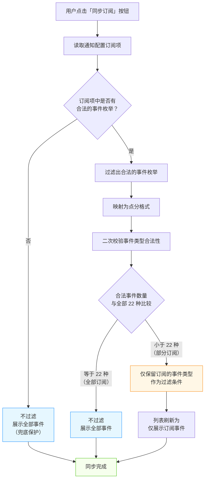

# 闲鱼猎人 事件时间线 操作手册

| 属性         | 值                                       |
| ------------ | ---------------------------------------- |
| 文档版本     | v1.0                                     |
| 文档日期     | 2026-07-05                               |
| 所属项目     | 闲鱼猎人                                 |
| 所属菜单     | 数据查看 → 事件时间线                    |
| 文档类型     | 操作手册                                 |
| 关联路由     | /timeline                                |
| 配套详细设计 | v2.0                                     |
| 目标读者     | 运营 / 管理员                            |

---

## 目录

- [0. 阶段交接声明](#0-阶段交接声明)
- [1. 功能简介](#1-功能简介)
- [2. 入口与导航](#2-入口与导航)
- [3. 界面布局](#3-界面布局)
- [4. 操作指南](#4-操作指南)
  - [4.1 查看事件时间线](#41-查看事件时间线)
  - [4.2 顶部统计说明](#42-顶部统计说明)
  - [4.3 事件类型筛选](#43-事件类型筛选)
  - [4.4 严重程度着色识别](#44-严重程度着色识别)
  - [4.5 任务维度过滤](#45-任务维度过滤)
  - [4.6 时间范围筛选](#46-时间范围筛选)
  - [4.7 订阅同步](#47-订阅同步)
  - [4.8 查看事件详情](#48-查看事件详情)
  - [4.9 客户端分页浏览](#49-客户端分页浏览)
  - [4.10 实时事件流](#410-实时事件流)
  - [4.11 断线回放](#411-断线回放)
- [5. 字段说明](#5-字段说明)
- [6. 常见问题 FAQ](#6-常见问题-faq)
- [7. 注意事项与限制](#7-注意事项与限制)
- [8. 关联功能](#8-关联功能)
- [9. 快捷键与技巧](#9-快捷键与技巧)
- [10. 修订记录](#10-修订记录)
- [11. 附录](#11-附录)

---

## 0. 阶段交接声明

```
- 当前阶段：事件时间线操作手册编写（v1.0） ✅ 已完成
- 下一阶段：实时日志操作手册编写
- 下一阶段智能体：文档编写智能体
- 下一阶段技能：文档编写
- 交接上下文：
  · 文件路径：d:\code\otherProjects\17_xianyu\docs\02-数据查看\事件时间线-操作手册.md
  · 11 章齐全，面向最终用户（运营/管理员）
  · 第 4 章覆盖 11 个子场景（4.1~4.11）
  · 第 5 章字段说明覆盖列表与详情全部可见字段
  · 第 6 章 FAQ 共 12 条
  · 第 7 章注意事项与限制共 8 条
  · 附录含 22 个事件类型 + 5 种严重程度 + 订阅同步三段式流程图
  · 与详细设计 v2.0 / 需求规格 v1.0 对齐
```

---

## 1. 功能简介

事件时间线是闲鱼猎人「数据查看」菜单下的二级功能，定位为**全链路行为追溯的统一视图**。

它将分散在订单状态变更与系统事件中的行为数据，按时间倒序合并到同一条时间线上展示，让运营与管理员**在一个页面内完成全链路追溯、异常定位、实时监控与跨链路关联**。

### 核心能力一览

| 能力         | 说明                                                               |
| ------------ | ------------------------------------------------------------------ |
| 多源聚合     | 订单状态变更与系统事件按时间倒序合并展示                           |
| 类型分类     | 22 个主系统事件类型 Tag 可视化筛选                                 |
| 严重度识别   | 5 种严重程度以圆点颜色区分（info / warning / error / critical / debug） |
| 任务维度过滤 | 按任务快速过滤该任务下的所有事件                                   |
| 订阅同步     | 一键从通知配置同步订阅项到过滤条件，避免两处配置漂移               |
| 实时事件流   | 实时事件流自动推送新事件，无需手动刷新                             |
| 断线回放     | 网络抖动断开后，重连时自动回放断线期间漏看的事件                   |
| 详情展开     | 订单类条目与事件类条目分别以不同布局渲染详情                       |
| 客户端分页   | 一次拉取后客户端分页浏览，翻页瞬时响应                             |

> **提示**：事件时间线是「读视图」，所有操作均为查询与浏览，不会修改任何业务数据。

---

## 2. 入口与导航

### 2.1 菜单入口

事件时间线位于左侧导航栏「数据查看」分组下：

```
数据查看
  ├── 仪表盘
  ├── 任务管理
  ├── 抢单记录
  ├── 卖家评估
  └── 事件时间线   ← 此处
```

| 属性         | 值                  |
| ------------ | ------------------- |
| 菜单名称     | 事件时间线          |
| 菜单图标     | FieldTimeOutlined（时钟图标） |
| 菜单路径     | /timeline           |
| 排序位置     | 14                  |
| 菜单分组     | data_view           |
| 默认可见     | 是                  |

### 2.2 进入方式

| 进入方式             | 操作步骤                                                       |
| -------------------- | -------------------------------------------------------------- |
| 菜单点击             | 展开左侧「数据查看」分组 → 点击「事件时间线」                  |
| 快捷键 `g` + `i`     | 先按 `g`，500ms 内按 `i`，直接跳转至 `/timeline`               |
| 命令面板 `Ctrl+K`    | 打开命令面板 → 输入「事件时间线」或「timeline」 → 回车         |
| 浏览器地址栏         | 直接输入 `/timeline` 路径                                      |

> **提示**：事件时间线支持多 Sheet 页并行打开，可与任务管理、抢单记录等页面同时打开进行数据对比。

---

## 3. 界面布局

事件时间线页面采用「统计卡片 + 过滤区 + 列表区」三段式布局，自上而下依次为：

### 3.1 整体结构

```
┌─────────────────────────────────────────────────────────────┐
│  📡 事件时间线（页面标题）                                  │
├─────────────────────────────────────────────────────────────┤
│  [事件总数]  [今日新增]  [任务数]  [其他统计]               │  ← 统计卡片行
├─────────────────────────────────────────────────────────────┤
│  数据来源: [全部 ▼]   任务: [选择任务 ▼]   [🔄 刷新]        │
│  [🔗 同步订阅]  [清除过滤]                                  │  ← 过滤区
│  已选 N / 22 种                                              │
│  [任务启动] [任务停止] [任务暂停] [任务异常] [搜索完成]      │
│  [商品发现] [商品匹配] [评估通过] [评估拒绝] [评分完成]      │  ← 事件类型 Tag 网格
│  [抢单请求] [抢单成功] [抢单失败] [通知发送] [WAF触发]       │
│  [WAF拦截]  [登录失效] [会话过期] [系统错误] [数据库维护]    │
│  [日志清理] [缓存清理]                                       │
├─────────────────────────────────────────────────────────────┤
│  ● 2026-07-05 12:00:00  🛒 抢单成功   商品标题...  ¥99.00    │
│  ● 2026-07-05 11:59:30  🔴 抢单成功   任务:t1234...          │  ← 时间线列表区
│  ● 2026-07-05 11:58:00  🟠 评估通过   ...                    │
│  ...                                                         │
│                                              [1] 2 3 ... ▶   │  ← 客户端分页
└─────────────────────────────────────────────────────────────┘
```

### 3.2 区域职责

| 区域         | 位置         | 主要职责                                                     |
| ------------ | ------------ | ------------------------------------------------------------ |
| 标题栏       | 顶部         | 展示页面名称「📡 事件时间线」                                |
| 统计卡片行   | 标题下方     | 展示事件总数、今日新增、任务数等关键指标                     |
| 过滤区       | 卡片下方     | 数据来源切换、任务筛选、刷新、同步订阅、事件类型 Tag 筛选    |
| 时间线列表区 | 过滤区下方   | 按时间倒序展示条目，含圆点指示、时间、类型、关键信息         |
| 分页器       | 列表底部     | 客户端分页，每页 30 条                                       |

### 3.3 加载状态

| 状态         | 表现                                                     |
| ------------ | -------------------------------------------------------- |
| 加载中       | 列表区显示加载动画（Spin）与「加载中...」提示            |
| 加载完成无数据 | 列表区显示空状态图与「暂无匹配的时间线数据」           |
| 加载失败     | 列表区显示错误提示，可点击「刷新」按钮重试               |

---

## 4. 操作指南

### 4.1 查看事件时间线

**适用场景**：进入页面查看最近一段时间内的订单状态变更与系统事件。

**操作步骤**：

1. 通过左侧菜单或快捷键进入事件时间线页面；
2. 页面加载完成后，系统会自动拉取最近 500 条记录（订单与事件混合），按时间倒序展示；
3. 默认展示全部 22 种事件类型与全部数据来源（订单 + 事件）；
4. 滚动列表或翻页浏览历史事件。

> **提示**：进入页面时，系统会自动从通知配置同步一次订阅规则到事件类型过滤条件，无需手动操作。如需查看全部事件，可点击「清除过滤」链接。

### 4.2 顶部统计说明

页面顶部展示 3 张统计卡片，**仅展示数字，不可点击过滤**：

| 卡片名称   | 计算口径                                         | 含义                                     |
| ---------- | ------------------------------------------------ | ---------------------------------------- |
| 事件总数   | 当前已加载并经过滤后的事件条目总数               | 反映当前视图下的事件规模                 |
| 今日新增   | 当日 0 点至今产生的事件数量                       | 监控当日活跃度                           |
| 任务数     | 当前可见事件涉及的不同任务数量                    | 反映当前视图涉及的任务范围               |

> **提示**：
> - 统计数字基于当前已加载数据（最多 500 条）与已应用的事件类型过滤条件实时计算，并非全库统计；
> - 若需要查看某类事件的具体数字，请先在事件类型 Tag 区筛选，再观察统计卡片变化。

### 4.3 事件类型筛选

**适用场景**：仅查看特定类型的系统事件（如只看抢单成功、只看 WAF 风控事件）。

**操作步骤**：

1. 在过滤区找到 22 个事件类型 Tag 网格；
2. 点击任一 Tag 即可切换其选中状态：
   - **全部模式**下点击某个 Tag：单选该类型，列表仅展示该类型事件；
   - **非全部模式**下点击某个 Tag：增删该类型到已选集合（多选）；
3. 已选数量实时显示在 Tag 网格上方（如「已选 3 / 22 种」）；
4. 点击「清除过滤」链接可清空全部已选类型，回到全部模式。

**22 个事件类型 Tag 列表**：

| 序号 | Tag 名称     | 说明           | 默认颜色 |
| ---- | ------------ | -------------- | -------- |
| 1    | 任务启动     | 任务正常启动   | 蓝色     |
| 2    | 任务停止     | 任务正常停止   | 蓝色     |
| 3    | 任务暂停     | 任务被暂停     | 蓝色     |
| 4    | 任务异常     | 任务运行异常   | 红色     |
| 5    | 搜索完成     | 任务搜索完成   | 蓝色     |
| 6    | 商品发现     | 发现新商品     | 蓝色     |
| 7    | 商品匹配     | 商品匹配命中   | 蓝色     |
| 8    | 评估通过     | 评估通过       | 橙色     |
| 9    | 评估拒绝     | 评估未通过     | 蓝色     |
| 10   | 评分完成     | 评分计算完成   | 蓝色     |
| 11   | 抢单请求     | 发起抢单请求   | 蓝色     |
| 12   | 抢单成功     | 抢单成功       | 红色     |
| 13   | 抢单失败     | 抢单失败       | 橙色     |
| 14   | 通知发送     | 通知已发送     | 蓝色     |
| 15   | WAF 风控触发 | WAF 风控触发   | 红色     |
| 16   | WAF 风控拦截 | WAF 风控拦截   | 红色     |
| 17   | 登录态失效   | 登录态过期     | 红色     |
| 18   | 会话过期     | 会话过期       | 橙色     |
| 19   | 系统错误     | 系统级错误     | 红色     |
| 20   | 数据库维护   | 数据库维护     | 蓝色     |
| 21   | 日志清理     | 日志清理       | 蓝色     |
| 22   | 缓存清理     | 缓存清理       | 蓝色     |

> **提示**：Tag 颜色与事件严重程度有关，详见 [4.4 严重程度着色识别](#44-严重程度着色识别)。

### 4.4 严重程度着色识别

时间线条目左侧的圆点颜色用于快速识别事件严重程度。系统支持 **5 种严重程度**，对应不同的圆点配色：

| 严重程度 | 圆点颜色 | 色值      | 含义与典型场景                                  |
| -------- | -------- | --------- | ----------------------------------------------- |
| info     | 蓝色     | `#1890ff` | 常规信息（任务启动、商品发现、通知发送等）      |
| warning  | 橙色     | `#faad14` | 警告（评估通过、抢单失败、会话过期等）          |
| error    | 红色     | `#ff4d4f` | 错误（系统错误、抢单成功、WAF 风控等关键事件）  |
| critical | 深红     | `#ff4d4f` | 严重（任务异常、登录态失效等必须立即处理）      |
| debug    | 灰色     | `#8c8c8c` | 调试信息（仅排查问题时可见）                    |

**订单类条目圆点配色规则**：

| 订单状态                             | 圆点颜色 | 图标 |
| ------------------------------------ | -------- | ---- |
| 抢单成功                             | 绿色     | 🛒   |
| 抢单失败                             | 红色     | 🛒   |
| 待处理 / 提交中 / 支付中             | 橙色     | 🛒   |

> **提示**：
> - 严重程度着色仅用于视觉识别，不影响事件的实际处理逻辑；
> - 部分关键事件（如抢单成功）虽为「成功」语义，但因业务重要性高，圆点采用红色标识以引起关注。

### 4.5 任务维度过滤

**适用场景**：排查某个具体任务的全链路行为（如「任务 t1234 这次跑下来发生了什么」）。

**操作步骤**：

1. 在过滤区找到「任务」下拉选择框；
2. 点击下拉框，系统会列出最近 200 个任务（按时间倒序）；
3. 选择目标任务后，列表自动刷新为该任务下的所有事件；
4. 如需清除任务过滤，点击下拉框右侧的 × 按钮即可。

> **提示**：
> - 任务过滤**仅对系统事件生效**，订单类条目不按任务过滤；
> - 任务下拉框最多展示 200 个任务，如目标任务不在列表中，可先在「任务管理」页面定位该任务。

### 4.6 时间范围筛选

**适用场景**：缩小查看时间窗口，仅查看某段时间内的事件。

**当前支持方式**：

事件时间线**当前未提供专门的时间范围选择器**，但可通过以下方式间接缩小时间范围：

| 方式             | 操作                                                               |
| ---------------- | ------------------------------------------------------------------ |
| 任务过滤         | 通过选择特定任务，间接限定到该任务的运行时间窗口                   |
| 事件类型过滤     | 通过筛选特定事件类型，减少无关事件干扰                             |
| 翻页浏览         | 由于按时间倒序展示，前几页即为最近事件                             |

> **提示**：
> - 系统默认一次拉取最近 500 条事件，按时间倒序排列，前几页即为最新事件；
> - 如需查看更早的历史事件，目前需通过任务过滤间接定位，或联系管理员扩展时间窗口过滤能力（规划中）。

### 4.7 订阅同步

**适用场景**：在「通知配置」中调整了订阅规则后，希望时间线页的过滤条件与之保持一致。

**操作步骤**：

1. 先前往「通知配置」页面调整订阅事件清单并保存；
2. 回到事件时间线页面；
3. 点击过滤区的「同步订阅」按钮（带同步图标）；
4. 系统会自动读取通知配置中的订阅项，并应用为事件类型过滤条件；
5. 同步完成后，列表自动刷新为仅展示已订阅事件类型的数据。

**三段式同步逻辑**：

系统采用「三段式」判断来决定同步后的过滤行为，避免出现「同步后所有事件都被过滤掉」的问题：

| 情况                   | 同步结果                                   |
| ---------------------- | ------------------------------------------ |
| 通知配置无合法事件项   | 不过滤（展示全部事件，作为兜底保护）       |
| 全部 22 种事件均订阅   | 不过滤（等同展示全部）                     |
| 仅订阅部分事件         | 仅保留订阅的事件类型作为过滤条件           |

> **提示**：
> - 进入页面时也会自动执行一次订阅同步，无需手动点击；
> - 若通知配置中存在无法识别的事件项，系统会在控制台输出警告，但不影响正常同步。

### 4.8 查看事件详情

**适用场景**：查看某条事件的完整信息（如抢单失败的详细原因、WAF 风控的具体触发条件）。

**操作步骤**：

1. 在时间线列表中找到目标条目；
2. 点击条目右侧的「查看详情」链接；
3. 条目展开后，系统根据条目类型自动分发渲染：
   - **订单类条目**：展示订单详情（订单状态、商品标题、金额等）；
   - **事件类条目**：展示事件详情（事件类型、严重程度、关键指标、负载详情表格）；
4. 详情表格展示负载的前 12 个字段，便于快速浏览关键信息；
5. 点击「收起详情」链接可折叠详情。

**详情分发规则**：

| 条目类型 | 渲染组件     | 主要展示内容                                   |
| -------- | ------------ | ---------------------------------------------- |
| 订单     | 订单详情     | 订单状态、商品标题、金额、创建时间             |
| 事件     | 事件详情     | 事件类型、严重程度、阶段、消息描述、负载详情   |

> **提示**：
> - 负载详情字段因事件类型而异（如抢单成功会展示订单号与金额，WAF 触发会展示风控规则与拦截原因）；
> - 展开的详情仅展示前 12 项字段，如需查看更多字段请联系管理员。

### 4.9 客户端分页浏览

**适用场景**：在已加载的事件列表中翻页浏览。

**操作步骤**：

1. 在列表底部找到分页器；
2. 点击页码或左右箭头切换页面；
3. 每页展示 30 条记录（PAGE_SIZE=30）；
4. 分页器显示总条数（如「共 500 条」）。

**分页机制说明**：

| 项             | 值          | 说明                                                       |
| -------------- | ----------- | ---------------------------------------------------------- |
| 单次拉取条数   | 500 条      | 进入页面或切换过滤条件时一次性拉取                          |
| 每页展示条数   | 30 条       | 客户端分页每页条数（PAGE_SIZE=30）                         |
| 翻页请求       | 无          | 翻页时不发送后端请求，直接切片已加载数据                   |
| 总页数         | ≤17 页      | 500 / 30 向上取整                                          |

> **提示**：
> - 翻页瞬时响应，无网络延迟；
> - 如需查看超过 500 条的历史事件，请通过任务过滤或事件类型过滤缩小范围。

### 4.10 实时事件流

**适用场景**：在不刷新页面的情况下，实时接收新产生的事件推送。

**工作机制**：

系统通过「实时事件流」机制自动推送新事件到前端，无需手动刷新页面：

1. 进入事件时间线页面后，系统会自动建立实时事件流连接；
2. 服务端每 3 秒检测一次是否有新事件产生；
3. 若有新事件，自动推送到前端并追加到列表顶部；
4. 同时每 3 秒发送一次保活心跳，维持连接稳定。

**连接数限制**：

| 项                 | 值      | 说明                                                 |
| ------------------ | ------- | ---------------------------------------------------- |
| 最大并发连接数     | 10      | 同一用户最多同时建立 10 个实时事件流连接             |
| 超限处理           | 拒绝连接 | 超出上限的连接会收到错误提示并关闭                   |

> **提示**：
> - 多标签页打开同一页面会占用多个连接数，建议同一会话仅打开 1-2 个事件时间线页；
> - 实时事件流仅推送新事件，不推送历史订单状态变更。

### 4.11 断线回放

**适用场景**：网络抖动或页面意外刷新后，补看断线期间产生的事件。

**工作机制**：

系统通过 Last-Event-ID 机制实现断线回放，确保关键事件不漏看：

1. 客户端记录最后收到的事件编号（Last-Event-ID）；
2. 网络断开后，客户端在恢复连接时自动携带该编号；
3. 服务端识别到该编号后，会查询断线期间产生的所有事件（最多回放 1000 条）；
4. 服务端按时间正序依次推送回放事件；
5. 回放完成后，进入正常实时推送流程。

**回放机制说明**：

| 项                 | 值          | 说明                                                       |
| ------------------ | ----------- | ---------------------------------------------------------- |
| 触发条件           | 携带 Last-Event-ID | 客户端重连时自动携带，无需手动操作                   |
| 回放条数上限       | 1000 条     | 断线期间事件超过此数量时，仅回放最近 1000 条               |
| 回放顺序           | 时间正序    | 从最早未收到的事件开始依次推送                             |
| 回放完成提示       | hello 帧    | 回放完成后推送连接建立提示，含回放条数                     |

> **提示**：
> - 断线回放为自动机制，无需用户干预；
> - 如断线时间过长（产生事件超过 1000 条），可能存在漏看，建议结合「刷新」按钮手动补查。

---

## 5. 字段说明

### 5.1 时间线列表字段

| 字段名       | 类型     | 适用条目   | 说明                                       |
| ------------ | -------- | ---------- | ------------------------------------------ |
| 圆点指示     | 视觉     | 全部       | 严重程度配色圆点，详见 4.4 节               |
| 时间         | 字符串   | 全部       | 事件产生时间（UTC，按本地时区显示）         |
| 相对时间     | 字符串   | 全部       | 「刚刚 / N 分钟前 / N 小时前 / N 天前」    |
| 类型         | 字符串   | 全部       | 事件类型中文名或订单状态                    |
| 关键信息     | 字符串   | 全部       | 商品标题 / 任务编号 / 事件消息摘要          |
| 金额         | 数字     | 订单       | 订单金额（带 ¥ 前缀）                       |
| 任务编号     | 字符串   | 事件       | 关联的任务 ID（系统级事件可能为空）         |
| 查看详情链接 | 操作     | 全部       | 点击展开 / 收起详情                         |

### 5.2 订单详情字段

| 字段名       | 类型     | 说明                                       |
| ------------ | -------- | ------------------------------------------ |
| 订单编号     | 字符串   | 系统生成的订单唯一编号                     |
| 商品 ID      | 字符串   | 关联商品的唯一标识                         |
| 订单状态     | 字符串   | 待处理 / 提交中 / 支付中 / 抢单成功 / 抢单失败 |
| 金额         | 数字     | 订单成交金额                               |
| 创建时间     | 字符串   | 订单创建时间                               |
| 任务编号     | 字符串   | 关联的任务 ID（如有）                      |
| 商品标题     | 字符串   | 商品名称                                   |

### 5.3 事件详情字段

| 字段名       | 类型     | 说明                                       |
| ------------ | -------- | ------------------------------------------ |
| 事件编号     | 数字     | 事件唯一自增编号（用于断线回放游标）       |
| 事件类型     | 字符串   | 点分格式（如 `buy.succeeded`）             |
| 严重程度     | 字符串   | info / warning / error / critical / debug  |
| 阶段         | 字符串   | search / eval / buy / notify / maintenance |
| 消息描述     | 字符串   | 事件的人类可读描述                         |
| 任务编号     | 字符串   | 关联的任务 ID（系统级事件可能为空）         |
| 商品 ID      | 字符串   | 关联商品 ID（如有）                        |
| 创建时间     | 字符串   | 事件产生时间                               |
| 流水号       | 字符串   | 全局流水号，用于跨模块关联排查             |
| 负载详情     | 表格     | 事件负载的前 12 个字段（结构因类型而异）   |

### 5.4 负载详情常见字段

不同事件类型的负载字段差异较大，常见字段举例如下：

| 事件类型     | 典型负载字段                                               |
| ------------ | ---------------------------------------------------------- |
| 抢单成功     | 订单号、金额、商品标题、卖家 ID、抢单耗时                  |
| 抢单失败     | 失败原因、错误码、商品 ID、重试次数                        |
| 评估通过     | 评估分数、命中规则、商品价格、建议抢单价                   |
| WAF 风控触发 | 风控规则、触发条件、请求 URL、响应状态码                   |
| 任务异常     | 异常类型、堆栈摘要、模块名、操作步骤                       |
| 通知发送     | 通知渠道、接收方、通知内容摘要、发送状态                   |

> **提示**：负载详情仅展示前 12 项字段，超出部分需联系管理员通过日志排查。

---

## 6. 常见问题 FAQ

### Q1：事件时间线展示哪些数据？

**A**：统一展示订单状态变更与系统事件两类数据，按时间倒序合并。默认同时拉取两类数据，可通过「数据来源」下拉框切换为「仅订单」或「仅事件」。

### Q2：事件类型有多少种？为什么过滤选项只有 22 种？

**A**：系统共定义 35 种事件类型（22 个主系统事件 + 13 个智能客服事件）。事件时间线页面的过滤选项仅暴露 22 个主系统事件类型，智能客服事件可在列表中看到但无法通过 Tag 过滤。

### Q3：「数据来源」下拉框的三个选项有什么区别？

**A**：
- **全部**：同时拉取订单与事件（默认）；
- **仅订单**：只看订单状态变更；
- **仅事件**：只看系统事件。
切换后会触发后端重新拉取数据。

### Q4：为什么我点击统计卡片没有反应？

**A**：统计卡片**仅展示数字，不可点击过滤**。这是设计如此，过滤请通过事件类型 Tag 区操作。统计数字会根据当前已应用的事件类型过滤条件实时更新。

### Q5：任务过滤为什么对订单不生效？

**A**：任务过滤**仅对系统事件生效**，订单类条目不按任务过滤。这是设计如此，因为订单可能跨任务存在，强行按任务过滤会导致订单状态变更丢失上下文。

### Q6：为什么同步订阅后看不到某些事件了？

**A**：同步订阅会读取通知配置中的订阅项并应用为过滤条件。如果通知配置中仅订阅了部分事件类型，时间线也会只展示这些类型。如需查看全部事件，点击「清除过滤」链接即可。

### Q7：为什么我打开第 11 个事件时间线标签页时收到「连接数已达上限」的提示？

**A**：实时事件流的**最大并发连接数为 10**，超出上限的连接会被拒绝并关闭。建议同一会话仅打开 1-2 个事件时间线页，避免占用过多连接。

### Q8：网络断开后重新连接，会漏看事件吗？

**A**：系统通过 Last-Event-ID 机制自动回放断线期间的事件（最多 1000 条），通常不会漏看。但若断线时间过长（产生事件超过 1000 条），可能存在漏看，建议点击「刷新」按钮手动补查。

### Q9：为什么翻页时没有任何网络请求？

**A**：事件时间线采用**客户端分页**机制，进入页面时一次性拉取最多 500 条数据，翻页时直接切片已加载数据，不发后端请求。这样翻页瞬时响应，无网络延迟。

### Q10：如何查看超过 500 条的历史事件？

**A**：当前单次拉取上限为 500 条。如需查看更早的历史事件，可通过以下方式：
1. 通过「任务」下拉框选择特定任务，缩小数据范围；
2. 通过事件类型 Tag 筛选特定类型，减少无关事件；
3. 联系管理员扩展时间窗口过滤能力（规划中）。

### Q11：实时事件流会推送订单状态变更吗？

**A**：实时事件流**仅推送系统事件，不推送订单状态变更**。订单状态变更需通过手动点击「刷新」按钮获取最新数据。

### Q12：事件详情里的「流水号」有什么用？

**A**：流水号是全局唯一标识符（格式 `req-<17位数字>-<6位hex>`），用于关联同一请求链路下的所有事件、日志与异常。如需排查一次失败请求的完整调用链，可将流水号提供给管理员在「实时日志」与「错误日志」中检索关联条目。

---

## 7. 注意事项与限制

### 7.1 实时事件流连接数上限

- 同一用户最多同时建立 **10 个**实时事件流连接；
- 超出上限的连接会被立即拒绝并关闭；
- 多标签页打开同一页面会占用多个连接数，建议同会话仅打开 1-2 个事件时间线页。

### 7.2 客户端分页限制

- 单次拉取上限为 **500 条**记录；
- 每页展示 **30 条**（PAGE_SIZE=30），翻页不发后端请求；
- 如需查看超过 500 条的历史事件，需通过任务过滤或事件类型筛选缩小范围；
- 当前未提供专门的时间范围选择器。

### 7.3 订阅同步三段式逻辑

订阅同步采用三段式判断，避免「同步后所有事件都被过滤掉」的回归问题：
1. 通知配置无合法事件项 → **不过滤**（兜底保护）；
2. 全部 22 种事件均订阅 → **不过滤**（等同展示全部）；
3. 仅订阅部分事件 → **仅保留订阅的事件类型**作为过滤条件。

### 7.4 断线回放限制

- 回放条数上限为 **1000 条**；
- 断线时间过长（产生事件超过 1000 条）可能存在漏看；
- 回放仅对系统事件生效，不回放订单状态变更；
- 回放为自动机制，无需用户干预，但极端情况下需手动点击「刷新」补查。

### 7.5 任务过滤范围

- 任务过滤**仅对系统事件生效**，订单类条目不按任务过滤；
- 任务下拉框最多展示 200 个任务（按时间倒序）；
- 如目标任务不在列表中，请先在「任务管理」页面定位。

### 7.6 事件类型过滤范围

- 前端过滤选项仅暴露 **22 个主系统事件类型**；
- 智能客服事件（13 种）可在列表中看到但无法通过 Tag 过滤；
- 如需过滤智能客服事件，需联系管理员扩展前端配置。

### 7.7 统计卡片不可点击

- 统计卡片**仅展示数字，不可点击过滤**；
- 统计数字基于当前已加载数据（最多 500 条）与已应用的事件类型过滤条件实时计算；
- 统计并非全库统计，仅反映当前视图。

### 7.8 详情负载展示限制

- 详情表格仅展示负载的**前 12 个字段**；
- 不同事件类型的负载字段差异较大；
- 如需查看完整负载，请联系管理员通过日志排查。

### 7.9 时间戳时区说明

- 所有时间字段以 UTC 存储与传输，前端按本地时区显示；
- 时间线列表同时展示绝对时间与相对时间（如「刚刚 / N 分钟前」）；
- 不会出现「时间偏移 8 小时」的问题。

---

## 8. 关联功能

事件时间线与以下菜单存在联动关系，便于跨模块排查问题：

| 关联菜单     | 所属分组     | 联动关系                                                       |
| ------------ | ------------ | -------------------------------------------------------------- |
| 实时日志     | 数据查看     | 通过事件详情中的「流水号」关联查询同链路的实时日志条目         |
| 错误日志     | 数据查看     | 通过事件详情中的「流水号」关联查询同链路的错误日志与堆栈       |
| 任务管理     | 数据查看     | 通过任务下拉框跳转或筛选特定任务的事件；事件中可显示任务名     |
| 抢单记录     | 数据查看     | 时间线中的订单类条目与抢单记录页数据一致，可双向定位           |
| 卖家评估     | 数据查看     | 评估通过 / 评估拒绝事件与卖家评估页数据关联                    |
| 通知中心     | 系统维护     | 通知发送事件与通知中心记录对应；订阅规则可同步到时间线过滤     |
| 通知配置     | 系统维护     | 通知配置中的订阅规则可一键同步到时间线事件类型过滤             |
| 智能客服     | 智能客服     | 智能客服事件（13 种）可在时间线列表中查看，但不在过滤选项中    |

> **提示**：跨菜单排查的最佳实践是先在事件时间线定位到目标事件，复制其「流水号」，再到实时日志或错误日志页面按流水号搜索关联条目。

---

## 9. 快捷键与技巧

### 9.1 快捷键

| 快捷键          | 作用                                   | 备注                                   |
| --------------- | -------------------------------------- | -------------------------------------- |
| `g` 然后按 `i`  | 跳转到事件时间线 `/timeline`           | g 前缀序列，500ms 内按第二键           |
| `Ctrl+K`        | 打开命令面板                           | 输入「事件时间线」或「timeline」搜索   |
| `Escape`        | 关闭命令面板                           | 仅在命令面板打开时生效                 |

### 9.2 实用技巧

| 技巧             | 操作步骤                                                       |
| ---------------- | -------------------------------------------------------------- |
| 快速定位异常     | 在事件类型 Tag 中点击「任务异常」或「系统错误」单选过滤        |
| 监控抢单成功率   | 同时选中「抢单成功」与「抢单失败」，观察两者比例               |
| 跨任务对比       | 利用多 Sheet 页同时打开两个事件时间线，分别筛选不同任务        |
| 排查 WAF 风控    | 选中「WAF 风控触发」与「WAF 风控拦截」，展开详情查看风控规则   |
| 同步订阅后查看   | 调整通知配置后，回到时间线点击「同步订阅」按钮即可             |
| 复制流水号       | 在事件详情中长按或选中流水号字段，复制后到实时日志页面搜索     |
| 减少连接占用     | 同一会话仅打开 1-2 个事件时间线页，避免占用过多实时事件流连接  |
| 查看相对时间     | 列表默认展示绝对时间，相对时间（「刚刚 / N 分钟前」）辅助参考  |
| 清空过滤重置     | 点击「清除过滤」链接可一键回到全部模式                         |
| 手动刷新         | 点击「刷新」按钮可强制重新拉取最新数据（用于补查订单状态变更） |

> **提示**：在输入框、下拉框、文本域内不会触发快捷键，避免干扰正常输入。

---

## 10. 修订记录

| 版本 | 日期       | 修订人     | 修订内容                                                                                                 |
| ---- | ---------- | ---------- | -------------------------------------------------------------------------------------------------------- |
| v1.0 | 2026-07-05 | 文档智能体 | 初版：11 章齐全，面向运营/管理员；覆盖 11 个操作场景；附录含 22 个事件类型清单 + 5 种严重程度对照表 + 订阅同步三段式流程图 |

---

## 11. 附录

### 11.1 22 个主系统事件类型清单

| 序号 | 事件类型             | 中文名称       | 严重程度   | 所属阶段     | 说明                       |
| ---- | -------------------- | -------------- | ---------- | ------------ | -------------------------- |
| 1    | task.started         | 任务启动       | info       | 任务管理     | 任务正常启动               |
| 2    | task.stopped         | 任务停止       | info       | 任务管理     | 任务正常停止               |
| 3    | task.paused          | 任务暂停       | info       | 任务管理     | 任务被暂停                 |
| 4    | task.error           | 任务异常       | critical   | 任务管理     | 任务运行异常               |
| 5    | task.search_done     | 搜索完成       | info       | 搜索阶段     | 任务搜索完成（量大，仅参考）|
| 6    | item.discovered      | 商品发现       | info       | 搜索阶段     | 发现新商品                 |
| 7    | item.found           | 商品匹配       | info       | 搜索阶段     | 商品匹配命中（旧枚举兼容） |
| 8    | eval.passed          | 评估通过       | warning    | 评估阶段     | 评估通过                   |
| 9    | eval.rejected        | 评估拒绝       | info       | 评估阶段     | 评估未通过                 |
| 10   | eval.scored          | 评分完成       | info       | 评估阶段     | 评分计算完成               |
| 11   | buy.requested        | 抢单请求       | info       | 抢单阶段     | 发起抢单请求               |
| 12   | buy.succeeded        | 抢单成功       | critical   | 抢单阶段     | 抢单成功（必须立即关注）   |
| 13   | buy.failed           | 抢单失败       | warning    | 抢单阶段     | 抢单失败                   |
| 14   | notify.sent          | 通知发送       | info       | 通知阶段     | 通知已发送                 |
| 15   | waf.triggered        | WAF 风控触发   | critical   | 风控         | WAF 风控触发               |
| 16   | waf.blocked          | WAF 风控拦截   | critical   | 风控         | WAF 风控拦截               |
| 17   | login.expired        | 登录态失效     | critical   | 认证         | 登录态过期                 |
| 18   | auth.expired         | 会话过期       | warning    | 认证         | 会话过期                   |
| 19   | system.error         | 系统错误       | critical   | 系统         | 系统级错误                 |
| 20   | maintenance.database | 数据库维护     | info       | 维护         | 数据库维护                 |
| 21   | maintenance.logs     | 日志清理       | info       | 维护         | 日志清理                   |
| 22   | maintenance.cache    | 缓存清理       | info       | 维护         | 缓存清理                   |

### 11.2 5 种严重程度对照表

| 严重程度 | 圆点颜色 | 色值      | 含义                                       | 典型事件                                   |
| -------- | -------- | --------- | ------------------------------------------ | ------------------------------------------ |
| info     | 蓝色     | `#1890ff` | 常规信息，仅供参考                         | 任务启动、商品发现、通知发送、缓存清理     |
| warning  | 橙色     | `#faad14` | 警告级别，需要关注但非紧急                 | 评估通过、抢单失败、会话过期               |
| error    | 红色     | `#ff4d4f` | 错误级别，需要排查                         | 系统错误、抢单成功（关键事件标识）         |
| critical | 深红     | `#ff4d4f` | 严重级别，必须立即处理                     | 任务异常、登录态失效、WAF 风控触发         |
| debug    | 灰色     | `#8c8c8c` | 调试信息，仅排查问题时可见                 | 详细调试日志（通常不展示）                 |

> **提示**：严重程度着色仅用于视觉识别，不影响事件的实际处理逻辑。部分关键事件（如抢单成功）虽为「成功」语义，但因业务重要性高，采用红色或 critical 级别标识以引起关注。

### 11.3 订阅同步三段式逻辑流程图



**三段式逻辑说明**：

| 阶段 | 判断条件                       | 处理结果                       | 设计意图                                     |
| ---- | ------------------------------ | ------------------------------ | -------------------------------------------- |
| 兜底 | 订阅项中无合法事件枚举         | 不过滤（展示全部事件）         | 避免配置异常导致所有事件被过滤掉             |
| 全量 | 合法事件数量等于 22 种         | 不过滤（展示全部事件）         | 全订阅等同不过滤，避免无意义的过滤开销       |
| 部分 | 合法事件数量小于 22 种         | 仅保留订阅的事件类型作为过滤   | 同步通知配置偏好到时间线视图                 |

---

**文档结束**
