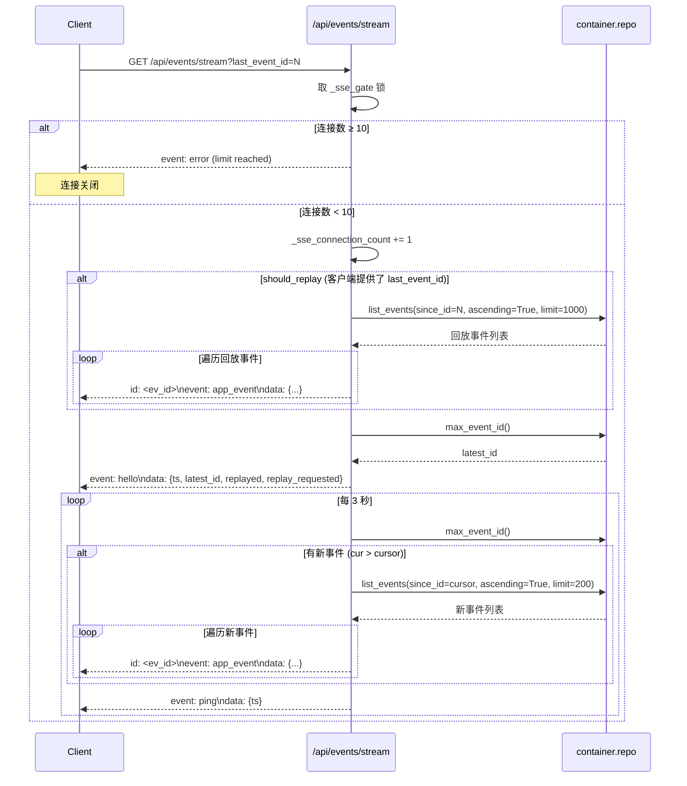
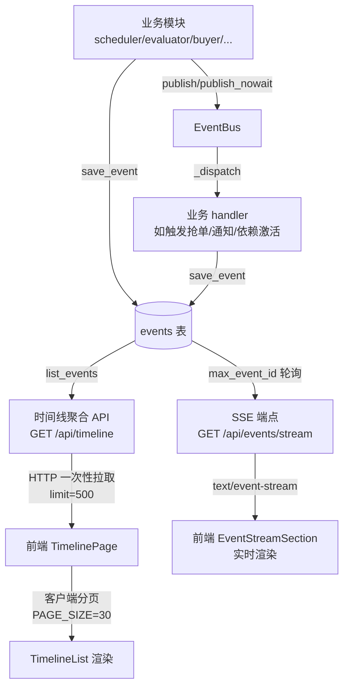
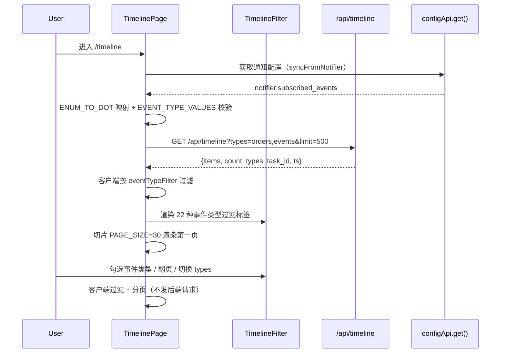

# 事件时间线 详细设计文档

## 1. 文档元信息

| 属性     | 值                                |
| -------- | --------------------------------- |
| 文档名称 | 事件时间线-详细设计               |
| 版本     | v2.0                              |
| 发布日期 | 2026-07-05                        |
| 所属菜单 | 数据查看                          |
| 关联路由 | `/timeline`                       |
| 文档用途 | 开发团队技术指导 / 智能客服向量库训练素材 |
| 维护人   | XianyuHunter 团队                 |

> 本文档基于代码实现重写，与 v1.0 相比主要差异：
> 1. **事件类型修正为 35 种**（v1.0 误写 21 种）：`domain/events.py` 中 `EventType` 枚举共 35 项，含主系统 22 项 + 智能客服（chatbot.*）13 项；前端时间线过滤选项 `EVENT_TYPE_OPTIONS` 仅暴露主系统 22 项。
> 2. **移除虚构的 `before_id` 游标分页**：v1.0 描述的 `before_id`/`has_more`/`next_cursor` 字段在代码中**不存在**。`/api/timeline` 实际仅接收 `types`/`task_id`/`limit`，响应字段为 `items`/`count`/`types`/`task_id`/`ts`，由前端一次性拉取（默认 limit=500）后客户端分页。
> 3. **修正 `ENUM_TO_DOT` 用途**：v1.0 称其为"数据库枚举到点分格式映射"是**错误**的——数据库 `events.type` 字段直接存储点分字符串（如 `buy.succeeded`）。`ENUM_TO_DOT` 实为**前端常量**（`frontend/src/constants/eventTypes.ts`），用于把通知配置中**大写枚举名订阅项**（如 `BUY_SUCCEEDED`）映射为小写点分格式（如 `buy.succeeded`），作为时间线事件类型过滤条件。
> 4. **新增 SSE 实时事件流章节**：补全 `/api/events/stream` 端点（v1.0 完全未覆盖），含连接数上限 10、断线回放基于 `last_event_id`、hello/ping/error 事件协议。
> 5. **新增 EventBus 事件总线章节**：补全 `infra/event_bus.py` 的 asyncio.Queue 订阅/发布机制。
> 6. **新增 request_id 全局流水号章节**：补全 `req-<17位数字>-<6位hex>` 格式与 ContextVar 传递机制。
> 7. **events 表字段补全**：补 `request_id` 字段及全部索引；时间字段类型为 DateTime（非 TEXT）。
> 8. **修正前端实际拉取条数**：v1.0 称 limit=200，实际为 limit=500；PAGE_SIZE=30 不变。

---

## 2. 功能概述

**一句话说明**：聚合 orders 与 events 两类数据按时间倒序统一展示，支持 35 种事件类型分类与 SSE 实时推送，是全链路行为追溯与异常定位的统一视图。

**核心价值**：
- 将订单状态变更（orders）与系统事件（events）统一在一条时间线上按 `created_at` 倒序合并展示，便于全链路追溯；
- 通过 35 种事件类型（主系统 22 + 智能客服 13）精细化分类，前端暴露 22 种主系统事件类型过滤；
- 从通知配置同步事件订阅规则到时间线过滤条件，避免两处配置漂移；
- SSE 实时事件流（`/api/events/stream`）支持断线回放，连接数上限 10 防止资源耗尽；
- EventBus 基于 asyncio.Queue 的进程内事件分发，handler 异步执行异常隔离；
- request_id 全局流水号（`req-<17位数字>-<6位hex>`）贯穿事件/日志/异常链路，便于跨模块关联排查。

---

## 3. 用户场景

### 场景一：全链路追溯
用户对某笔抢单订单有疑问，进入时间线页按 `task_id` 过滤，查看该任务下所有订单与事件，按时间顺序还原完整业务流程（搜索→评估→抢单→通知）。

### 场景二：聚焦异常事件
用户在统计卡片看到"抢单失败"数量异常，点击事件类型过滤区勾选 `buy.failed`，快速过滤出所有抢单失败事件，逐条展开 payload 详情排查失败原因。

### 场景三：订阅规则同步
用户在通知配置页（NotifierChannels）调整了 `subscribed_events` 订阅规则后，回到时间线页点击"同步订阅"按钮，系统通过 `ENUM_TO_DOT` 将大写枚举名映射为小写点分格式后自动应用为过滤条件，无需手动重新勾选。

### 场景四：实时监控事件流
用户在 Dashboard 的 EventStreamSection 或自定义页面建立 SSE 连接（`/api/events/stream`），实时接收新事件推送；网络抖动断开后携带 `last_event_id` 重连，服务端回放断线期间产生的事件，避免漏看。

### 场景五：跨链路排查
运维人员通过事件 `request_id` 字段（如 `req-20260701120000537-a3b2c1`）关联同一请求链路下的所有 events/error_logs/日志条目，定位一次失败请求的完整调用栈。

---

## 4. 菜单元数据

来源：`config/menu_registry.yaml`

```yaml
- key: timeline
  label: 事件时间线
  icon: FieldTimeOutlined
  path: /timeline
  sort_order: 14
  default_visible: true
  category: data_view
```

| 属性           | 值                |
| -------------- | ----------------- |
| key            | `timeline`        |
| label          | 事件时间线        |
| icon           | `FieldTimeOutlined` |
| path           | `/timeline`       |
| sort_order     | 14                |
| default_visible| true              |
| category       | `data_view`       |

---

## 5. 数据模型

### 5.1 events 表（EventRow，`backend/xianyu_hunter/infra/db_models.py:194`）

| 字段        | 类型     | 必填 | 默认值      | 约束 / 说明                                                      |
| ----------- | -------- | ---- | ----------- | ---------------------------------------------------------------- |
| id          | Integer  | 是   | autoincrement| 主键，自增；SSE 断线回放以此作为 `last_event_id` 游标            |
| type        | String   | 否   | NULL        | 事件类型（点分格式字符串，如 `buy.succeeded`）；nullable 兼容旧数据 |
| task_id     | String   | 否   | NULL        | 关联任务 ID（可为空，系统级事件无任务归属）                      |
| item_id     | String   | 否   | NULL        | 关联商品 ID（可为空）                                            |
| stage       | String   | 是   | —           | 阶段（search/eval/buy/notify/maintenance 等）                    |
| level       | String   | 是   | —           | 级别（info/warning/error 等）                                    |
| message     | Text     | 否   | NULL        | 事件描述                                                         |
| payload     | Text     | 否   | NULL        | 事件负载（JSON 字符串，结构因 type 而异）                        |
| created_at  | DateTime | 否   | `_utcnow`   | 创建时间（UTC）；时间线排序核心字段                              |
| request_id  | String   | 否   | NULL        | 全局流水号（`req-<17位数字>-<6位hex>`），关联同链路所有日志/异常 |

> **注意**：`type` 字段在 DB 中直接存储点分格式字符串（如 `buy.succeeded`），**不存储**大写枚举名。`ENUM_TO_DOT` 是前端常量，仅用于把通知配置中的大写枚举名订阅项映射为点分格式。

### 5.2 索引清单

| 索引名                  | 字段组合                  | 用途                                                     |
| ----------------------- | ------------------------- | -------------------------------------------------------- |
| （单列）                | `type`                    | 按事件类型查询                                           |
| （单列）                | `task_id`                 | 按任务过滤事件                                           |
| （单列）                | `item_id`                 | 按商品反查事件                                           |
| （单列）                | `created_at`              | 时间线按时间倒序查询                                     |
| （单列）                | `request_id`              | 按流水号关联查询同链路事件                               |
| `ix_events_task_created` | `task_id`, `created_at`   | Dashboard 时间线核心查询路径：按任务+时间范围查事件      |

---

## 6. 事件类型枚举

来源：`backend/xianyu_hunter/domain/events.py:9` `EventType(str, Enum)`，共 **35 种**。

### 6.1 主系统事件（22 种）

| 枚举名                  | 点分格式                  | 严重度    | 说明                       |
| ----------------------- | ------------------------- | --------- | -------------------------- |
| `TASK_STARTED`          | `task.started`            | info      | 任务启动                   |
| `TASK_STOPPED`          | `task.stopped`            | info      | 任务正常停止               |
| `TASK_PAUSED`           | `task.paused`             | info      | 任务暂停                   |
| `TASK_ERROR`            | `task.error`              | critical  | 任务异常                   |
| `TASK_SEARCH_DONE`      | `task.search_done`        | info      | 搜索完成（量大，仅参考）   |
| `ITEM_DISCOVERED`       | `item.discovered`         | info      | 商品发现                   |
| `ITEM_FOUND`            | `item.found`              | info      | 商品匹配（旧枚举兼容）     |
| `EVAL_PASSED`           | `eval.passed`             | important | 评估通过                   |
| `EVAL_REJECTED`         | `eval.rejected`           | info      | 评估拒绝                   |
| `EVAL_SCORED`           | `eval.scored`             | info      | 评分完成                   |
| `BUY_REQUESTED`         | `buy.requested`           | info      | 抢单请求                   |
| `BUY_SUCCEEDED`         | `buy.succeeded`           | critical  | 抢单成功                   |
| `BUY_FAILED`            | `buy.failed`              | important | 抢单失败                   |
| `NOTIFY_SENT`           | `notify.sent`             | info      | 通知发送                   |
| `WAF_TRIGGERED`         | `waf.triggered`           | critical  | WAF 风控触发               |
| `WAF_BLOCKED`           | `waf.blocked`             | critical  | WAF 风控拦截               |
| `LOGIN_EXPIRED`         | `login.expired`           | critical  | 登录态失效                 |
| `AUTH_EXPIRED`          | `auth.expired`            | important | 会话过期                   |
| `SYSTEM_ERROR`          | `system.error`            | critical  | 系统错误                   |
| `MAINTENANCE_DATABASE`  | `maintenance.database`    | info      | 数据库维护                 |
| `MAINTENANCE_LOGS`      | `maintenance.logs`        | info      | 日志清理                   |
| `MAINTENANCE_CACHE`     | `maintenance.cache`       | info      | 缓存清理                   |

### 6.2 智能客服模块事件（13 种，`chatbot.<域>.<动作>` 命名约定）

| 枚举名                          | 点分格式                          | 严重度    | 说明               |
| ------------------------------- | --------------------------------- | --------- | ------------------ |
| `CHATBOT_SESSION_CREATED`        | `chatbot.session.created`         | info      | 会话创建           |
| `CHATBOT_SESSION_ENDED`          | `chatbot.session.ended`           | info      | 会话结束           |
| `CHATBOT_MESSAGE_SAVED`          | `chatbot.message.saved`           | info      | 消息保存           |
| `CHATBOT_FEEDBACK_RECEIVED`      | `chatbot.feedback.received`       | important | 负反馈（可能转人工）|
| `CHATBOT_FAQ_HIT`                | `chatbot.faq.hit`                 | info      | FAQ 命中           |
| `CHATBOT_INTENT_CLASSIFIED`      | `chatbot.intent.classified`       | info      | 意图分类           |
| `CHATBOT_TOOL_CALLED`            | `chatbot.tool.called`             | info      | 工具调用           |
| `CHATBOT_ESCALATED`              | `chatbot.escalated`               | critical  | 转人工             |
| `CHATBOT_DEGRADED`               | `chatbot.degraded`                | important | 服务降级           |
| `CHATBOT_KB_REBUILT`             | `chatbot.kb.rebuilt`              | important | KB 重建成功        |
| `CHATBOT_KB_UPDATED`             | `chatbot.kb.updated`              | info      | KB 增量更新        |
| `CHATBOT_KB_FAILED`              | `chatbot.kb.failed`               | critical  | KB 构建失败        |
| `CHATBOT_CONFIG_CHANGED`         | `chatbot.config.changed`          | info      | 配置变更           |

### 6.3 事件严重度（`EVENT_SEVERITY`）

三类严重度，用于免打扰时段决策：

| 严重度    | 含义                                       | 典型事件                                   |
| --------- | ------------------------------------------ | ------------------------------------------ |
| critical  | 必须送达（即便免打扰也推送）               | buy.succeeded / waf.* / login.expired / task.error / system.error |
| important | 重要但可延迟（免打扰期降级为摘要）         | eval.passed / buy.failed / auth.expired / chatbot.escalated |
| info      | 仅参考（免打扰期静默）                     | item.* / eval.scored / task.search_done / maintenance.* / chatbot.*（多数）|

> **设计说明**：chatbot 事件严重度通过 `EVENT_SEVERITY.setdefault()` 幂等写入（`events.py:99-111`），保持主字典定义简洁，便于 chatbot 模块独立演进。

### 6.4 前端过滤选项（`EVENT_TYPE_OPTIONS`，22 项）

前端 `frontend/src/constants/eventTypes.ts:62` 中 `EVENT_TYPE_OPTIONS` 仅暴露主系统 22 种事件类型（不含 chatbot 13 种），作为时间线页事件类型过滤的可选项。`EVENT_TYPE_VALUES` 是其 value 集合，用于校验过滤项合法性。

### 6.5 ENUM_TO_DOT 映射（前端常量，22 项）

`frontend/src/constants/eventTypes.ts:96` 定义 `ENUM_TO_DOT: Record<string, string>`，将**大写枚举名**映射为**小写点分格式**，共 22 项（与 `EVENT_TYPE_OPTIONS` 一一对应）。

**用途**：通知配置（`configApi.get().notifier.subscribed_events`）中存储的是大写枚举名数组（如 `["BUY_SUCCEEDED", "EVAL_PASSED"]`）。时间线页"同步订阅"功能通过 `ENUM_TO_DOT` 把这些大写名映射为点分格式后作为 `eventTypeFilter`，再二次校验是否落在 `EVENT_TYPE_VALUES` 内（防止配置漂移导致过滤掉所有事件）。

| 大写枚举名            | 点分格式                |
| --------------------- | ----------------------- |
| `ITEM_DISCOVERED`     | `item.discovered`       |
| `ITEM_FOUND`          | `item.found`            |
| `EVAL_PASSED`         | `eval.passed`           |
| `EVAL_REJECTED`       | `eval.rejected`         |
| `EVAL_SCORED`         | `eval.scored`           |
| `BUY_REQUESTED`       | `buy.requested`         |
| `BUY_SUCCEEDED`       | `buy.succeeded`         |
| `BUY_FAILED`          | `buy.failed`            |
| `NOTIFY_SENT`         | `notify.sent`           |
| `WAF_TRIGGERED`       | `waf.triggered`         |
| `WAF_BLOCKED`         | `waf.blocked`           |
| `LOGIN_EXPIRED`       | `login.expired`         |
| `AUTH_EXPIRED`        | `auth.expired`          |
| `TASK_STARTED`        | `task.started`          |
| `TASK_STOPPED`        | `task.stopped`          |
| `TASK_PAUSED`         | `task.paused`           |
| `TASK_ERROR`          | `task.error`            |
| `TASK_SEARCH_DONE`    | `task.search_done`      |
| `SYSTEM_ERROR`        | `system.error`          |
| `MAINTENANCE_DATABASE`| `maintenance.database`  |
| `MAINTENANCE_LOGS`    | `maintenance.logs`      |
| `MAINTENANCE_CACHE`   | `maintenance.cache`     |

> **注意**：DB `events.type` 字段直接存点分字符串，**不存**大写枚举名。`ENUM_TO_DOT` 不参与 DB 读写，仅用于通知配置订阅项的格式转换。

---

## 7. API 端点清单

| 方法 | 路径                | 文件                              | 用途                              |
| ---- | ------------------- | --------------------------------- | --------------------------------- |
| GET  | `/api/timeline`     | `backend/xianyu_hunter/web/routes/timeline.py`     | 时间线聚合 API（orders + events） |
| GET  | `/api/events/stream`| `backend/xianyu_hunter/web/routes/sse_stream.py`   | SSE 实时事件流（含断线回放）      |

### 7.1 时间线聚合 API：`GET /api/timeline`

**端点签名**（`timeline.py:38`）：

```python
@router.get("/timeline")
def timeline(
    types: str = "orders,events",
    task_id: str | None = None,
    limit: int = 200,
    container: Container = Depends(get_container),
) -> dict[str, Any]:
```

**请求参数**：

| 参数      | 位置  | 类型   | 必填 | 默认值            | 说明                                                         |
| --------- | ----- | ------ | ---- | ----------------- | ------------------------------------------------------------ |
| types     | Query | str    | 否   | `"orders,events"` | 逗号分隔的数据来源，可选值 `orders`/`events`，可组合         |
| task_id   | Query | str    | 否   | None              | 按任务 ID 过滤（仅对 events 生效，orders 不按 task_id 过滤） |
| limit     | Query | int    | 否   | 200               | 返回条数上限（前端实际传 500）                               |

**响应字段**：

| 字段     | 类型     | 说明                                                                 |
| -------- | -------- | -------------------------------------------------------------------- |
| items    | list     | 时间线条目数组，按 `_ts` 倒序；每项带 `_kind`（order/event）与 `_ts` |
| count    | int      | 实际返回条数（`min(len(items), limit)`）                             |
| types    | list[str]| 实际生效的数据来源列表（去重后的 wanted 集合）                       |
| task_id  | str/null | 回显请求的 task_id                                                   |
| ts       | str      | 服务端响应时间（UTC ISO，秒精度）                                    |

> **注意**：响应**不包含** `has_more`/`next_cursor` 字段（v1.0 文档虚构）。前端一次性拉取后客户端分页。

**条目结构**：
- order 条目：原始 OrderRow 字段 + `_kind="order"` + `_ts`（ISO 字符串）
- event 条目：原始 EventRow 字段 + `_kind="event"` + `_ts`（ISO 字符串）

**合并算法**：
1. 解析 `types` 参数，拆分为 `orders` / `events` 两类来源（去重）；
2. 若含 `orders`：`container.repo.list_orders(limit=limit)` 拉取订单，逐条加 `_kind="order"` 与 `_ts`；
3. 若含 `events`：`container.repo.list_events(limit=limit)` 拉取事件，按 `task_id` 过滤（若提供），逐条加 `_kind="event"` 与 `_ts`；
4. 过滤掉 `_ts` 为空的条目；
5. 按 `_ts` 倒序排序；
6. 截取前 `limit` 条返回。

**`_to_utc_iso()` 时间统一函数**（`timeline.py:20`）：

```python
def _to_utc_iso(val: Any) -> str:
    # SQLite 不存时区信息，但 _utcnow() 写入的是 UTC。
    # 不加 'Z' 后缀会让前端 new Date() 把 UTC 当本地时间解析，
    # 导致 UTC+8 用户看到的事件全部"偏移 8 小时"。
    if isinstance(val, datetime):
        if val.tzinfo is None:
            return val.isoformat() + "Z"
        return val.astimezone(timezone.utc).isoformat()
    if isinstance(val, str) and val:
        if val.endswith("Z") or "+" in val[10:]:
            return val
        return val + "Z"
    return ""
```

### 7.2 SSE 实时事件流：`GET /api/events/stream`

详见 §8。

---

## 8. SSE 实时事件流

**端点签名**（`sse_stream.py:53`）：

```python
@router.get("/events/stream")
async def events_stream(
    container: Container = Depends(get_container),
    last_event_id: int | None = Query(default=None, ge=0),
    last_event_id_header: int | None = Header(default=None, alias="Last-Event-ID", ge=0),
) -> StreamingResponse:
```

**请求参数**：

| 参数                | 位置  | 类型 | 必填 | 默认值 | 说明                                                     |
| ------------------- | ----- | ---- | ---- | ------ | -------------------------------------------------------- |
| last_event_id       | Query | int  | 否   | None   | 断线回放游标（≥0），客户端上次收到的最大事件 id          |
| Last-Event-ID       | Header| int  | 否   | None   | 同上，SSE 标准断线重连头（优先级低于 Query 参数）        |

**响应**：`text/event-stream`（`StreamingResponse`）

### 8.1 连接数限制

- 上限：`_MAX_SSE_CONNECTIONS = 10`（`sse_stream.py:22`）
- 实现：全局计数器 `_sse_connection_count` + `asyncio.Lock` 保护
- 超限行为：直接 yield 一条 `event: error` 帧（`{'error': 'SSE connections limit (10) reached'}`）后关闭连接
- 设计意图：防止多标签页或异常客户端耗尽服务端资源

### 8.2 连接建立流程



### 8.3 断线回放机制

- 触发条件：客户端提供了 `last_event_id`（Query）或 `Last-Event-ID`（Header），即 `client_provided_last = True`
- `effective_last_id`：优先 Query 参数，其次 Header，最后 0
- 回放查询：`container.repo.list_events(since_id=effective_last_id, ascending=True, limit=1000)`，再过滤 `id > effective_last_id`
- 回放期间每条事件以 `id: <ev_id>` 帧推送，便于客户端记录最新 id
- 回放完成后推送 `event: hello`，携带 `replayed`（回放条数）与 `replay_requested`（是否请求了回放）

### 8.4 事件推送格式

**业务事件帧**（`_format_sse_event`，`sse_stream.py:27`）：

```
id: 1234
event: app_event
data: {"id":1234,"type":"buy.succeeded","task_id":"t1234abcd",...}

```

**hello 帧**（连接建立后）：

```
event: hello
data: {"ts":"2026-07-05T12:00:00+00:00","latest_id":1234,"replayed":5,"replay_requested":true}

```

**ping 帧**（每 3 秒，保活）：

```
event: ping
data: {"ts":"2026-07-05T12:00:03+00:00"}

```

**error 帧**（异常时）：

```
event: error
data: {"error":"<错误信息>"}

```

**warn 帧**（回放失败时）：

```
event: warn
data: {"msg":"replay_failed","error":"<错误信息>"}

```

### 8.5 增量轮询

- 轮询周期：`await asyncio.sleep(3)`（每 3 秒）
- 每轮查询 `container.repo.max_event_id()`，若 `cur > cursor` 则拉取增量事件（`list_events(since_id=cursor, ascending=True, limit=200)`）
- 每条增量事件推送后更新 `cursor = ev_id`
- 无论是否有新事件，每轮都推送 `event: ping` 保活
- `asyncio.CancelledError`（客户端断开）重新抛出，符合 asyncio 取消标准模式
- 其他异常 yield `event: error` 帧后继续循环（不退出）

---

## 9. EventBus 事件总线

来源：`backend/xianyu_hunter/infra/event_bus.py`

### 9.1 设计

基于 `asyncio.Queue` 的进程内事件分发，单例模式（`get_event_bus()` 返回全局 `_default_bus`）。

| 组件               | 说明                                                          |
| ------------------ | ------------------------------------------------------------- |
| `_subscribers`     | `dict[EventType, list[EventHandler]]`，事件类型→handler 列表  |
| `_queue`           | `asyncio.Queue[Event]`，事件入队/出队                         |
| `_running`         | 主循环运行标志                                                |
| `EventHandler`     | `Callable[[Event], Coroutine[Any, Any, None]]`，async 函数   |

### 9.2 核心 API

| 方法             | 签名                                          | 说明                                                         |
| ---------------- | --------------------------------------------- | ------------------------------------------------------------ |
| `subscribe`      | `(event_type: EventType, handler: EventHandler) -> None` | 订阅某类事件                                                 |
| `unsubscribe`    | `(event_type: EventType, handler: EventHandler) -> None` | 取消订阅                                                     |
| `publish`        | `async (event: Event) -> None`                | 异步入队（await put）                                        |
| `publish_nowait` | `(event: Event) -> None`                      | 同步入队（put_nowait，不阻塞）                               |
| `run_forever`    | `async () -> None`                            | 主循环：`wait_for(queue.get(), timeout=1.0)` → `_dispatch`   |
| `stop`           | `() -> None`                                  | 设置 `_running=False`，主循环下次轮询退出                    |

### 9.3 分发机制（`_dispatch`）

1. **自动注入 request_id**：若 `event.request_id` 为空，从当前 ContextVar `get_request_id()` 读取并注入。
   - 为什么放在 `_dispatch` 而非 `publish`：publish 只是入队，实际分发发生在异步任务恢复后，此时 ContextVar 才是当前请求的作用域。
2. **查找订阅者**：`self._subscribers.get(event.type, [])`，无订阅者则 debug 日志后返回。
3. **并发执行**：`asyncio.gather(*(_safe_call(h, event) for h in handlers))`，所有 handler 并发执行。
4. **异常隔离**：`_safe_call` 捕获单个 handler 的所有异常并记日志，不影响其他 handler。

### 9.4 与 SSE 的关系

> **重要**：当前 SSE 端点（`sse_stream.py`）**不通过 EventBus 订阅事件**，而是直接轮询 `container.repo.max_event_id()` 与 `list_events()`。EventBus 主要用于业务模块间的事件分发（如评估通过触发抢单、订单成功触发下游任务激活等）。两者均消费同一 events 表，但走不同路径。

---

## 10. 业务流程

### 10.1 事件产生→落库→时间线展示



### 10.2 时间线页面加载流程



### 10.3 三段式订阅同步（`syncFromNotifier`，`Timeline/index.tsx:37`）

```python
# 伪代码（实际为 TypeScript）
1. cfg = await configApi.get()
2. subscribed = cfg.notifier.subscribed_events  # 大写枚举名数组
3. validEnums = Set(Object.keys(ENUM_TO_DOT))
4. recognized = subscribed.filter(e => validEnums.has(e))   # 仅保留合法枚举
5. unknown = subscribed.filter(e => !validEnums.has(e))     # 无法识别的枚举
6. if unknown.length > 0: console.warn(...)                 # 提示配置漂移
7. mapped = recognized.map(e => ENUM_TO_DOT[e])             # 大写→点分
             .filter(v => EVENT_TYPE_VALUES.has(v))         # 二次校验
8. if mapped.length == 0: setEventTypeFilter([])            # 不过滤（兜底）
   elif mapped.length >= EVENT_TYPE_OPTIONS.length: setEventTypeFilter([])  # 全订阅=不过滤
   else: setEventTypeFilter(mapped)                         # 部分订阅=过滤
```

**设计意图**：当用户在通知配置页调整订阅规则后，时间线页默认事件类型过滤集合自动同步，避免两处配置不一致。三段式判断（空过滤兜底 / 全订阅不过滤 / 部分订阅过滤）避免"配置映射出无效类型导致所有事件被过滤掉"的回归 bug。

---

## 11. request_id 全局流水号

来源：`backend/xianyu_hunter/infra/request_context.py`

### 11.1 格式

```
req-<17位数字>-<6位hex>
```

- 前缀：`req`（便于日志中肉眼识别与正则提取）
- 17 位数字：UTC 时间 `YYYYMMDDHHMMSSfff`（毫秒级，保证有序性）
- 6 位 hex：`secrets.token_hex(3)` 随机数（16^6=16.7M 分之一的碰撞概率，确保同毫秒内多请求唯一）

**示例**：`req-20260701120000537-a3b2c1`

### 11.2 生成与传递

| 函数                    | 说明                                                                 |
| ----------------------- | -------------------------------------------------------------------- |
| `generate_request_id()` | 生成新流水号，`threading.Lock` 保护时间戳读取防回拨                  |
| `get_request_id()`      | 读取当前上下文流水号（无上下文返回 None）                            |
| `set_request_id(rid)`   | 设置当前上下文流水号                                                 |
| `clear_request_id()`    | 清除当前上下文流水号                                                 |
| `new_request_scope(rid?)`| 生成并设置新流水号，返回 token（用于后台任务/调度器等非 HTTP 场景） |
| `reset_request_scope(token)` | 恢复上下文到 new_request_scope 之前的状态                       |
| `is_valid_request_id(rid)` | 校验格式合法性（防止客户端伪造 X-Request-Id 头注入日志）           |

### 11.3 上下文传递

- 基于 `contextvars.ContextVar`，异步安全（兼容 asyncio / 任意线程）
- loguru 通过 patcher 钩子读取 ContextVar，自动注入到每条日志的 extra 字段
- 中间件在 HTTP 请求入口生成/透传；后台任务在恢复执行上下文时调用 `new_request_scope`
- `EventBus._dispatch` 自动注入到 Event（若 publish 时未显式指定）
- 写入 `events.request_id` 与 `error_logs.request_id` 字段，便于跨表关联查询

---

## 12. 前端组件结构

### 12.1 组件树

```
TimelinePage (frontend/src/pages/Timeline/index.tsx)
├── 标题（📡 事件时间线）
├── 统计卡片行（4 张，基于 filteredItems 实时计算）
│   ├── 订单事件数（_kind === 'order'）
│   ├── 系统事件数（_kind === 'event'）
│   ├── 抢单成功数（order 且 status === 'succeeded'，绿色）
│   └── 抢单失败数（order 且 status === 'failed'，红色）
├── Card
│   ├── TimelineFilter (components/TimelineFilter.tsx)
│   │   ├── 数据来源 Select（全部/仅订单/仅事件）
│   │   ├── 任务筛选 Select（allowClear，列出 taskApi.list limit=200）
│   │   ├── 刷新按钮（ReloadOutlined）
│   │   └── 事件类型过滤区
│   │       ├── "同步订阅"按钮（SyncOutlined，调用 syncFromNotifier）
│   │       ├── "清除过滤"链接（eventTypeFilter 非空时显示）
│   │       ├── 计数提示（已选 N / 22 种 或 显示全部）
│   │       └── 事件类型 Tag 网格（22 个，按 severity 着色：critical=红/important=橙/其他=蓝）
│   └── TimelineList (components/TimelineList.tsx)
│       ├── Spin 加载态
│       ├── Empty 空态（暂无匹配的时间线数据）
│       ├── 时间线条目列表
│       │   └── TimelineItem (components/TimelineItem.tsx)
│       │       ├── OrderDetail（_kind === 'order'：状态+商品标题+金额）
│       │       └── EventDetail（_kind === 'event'：事件类型+严重度+关键指标+可展开 payload）
│       └── Pagination（PAGE_SIZE=30，showTotal，无 showSizeChanger）
└── utils.ts
    ├── parsePayload(item)  # payload 可能是字符串或对象，统一规整
    └── formatRelativeTime(ts)  # 相对时间（刚刚/N 分钟前/N 小时前/N 天前）
```

### 12.2 关键交互

| 区域             | 交互行为                                                                                     |
| ---------------- | -------------------------------------------------------------------------------------------- |
| 数据来源 Select  | 切换 `types`（`orders,events` / `orders` / `events`），触发后端重新拉取                     |
| 任务筛选 Select  | 切换 `taskId`，触发后端重新拉取（仅对 events 生效）                                          |
| 刷新按钮         | 重新调用 `load()`，按当前 `types`/`taskId`/`eventTypeFilter` 拉取                            |
| 事件类型 Tag     | 点击切换选中态：全部模式下单选该类型；非全部模式下增删该类型；清除过滤后回到全部模式          |
| 同步订阅按钮     | 调用 `syncFromNotifier`，从通知配置同步订阅规则到 `eventTypeFilter`                          |
| 统计卡片         | 仅展示数字（基于 `filteredItems` 实时计算），不可点击过滤（v1.0 描述"点击卡片过滤"不准确）   |
| TimelineItem 展开| 点击"查看详情/收起详情"切换 `expandedItems`，展开后显示 payload 的 Descriptions 表格（前 12 项）|
| 分页器           | 客户端分页，切换页码时切片 `filteredItems.slice((p-1)*30, p*30)`，不发后端请求              |

### 12.3 关键常量

| 常量                | 值  | 说明                                   |
| ------------------- | --- | -------------------------------------- |
| `PAGE_SIZE`         | 30  | 前端分页每页条数                       |
| 后端请求 `limit`    | 500 | 一次拉取条数（硬编码在 `load()` 中）   |
| `EVENT_TYPE_OPTIONS`| 22  | 事件类型过滤可选项数量（主系统）       |
| `ENUM_TO_DOT`       | 22  | 大写枚举名→点分格式映射数量           |

### 12.4 圆点配色规则（`TimelineList.tsx:37`）

| 条件                                            | 颜色      | 图标 |
| ----------------------------------------------- | --------- | ---- |
| order 且 status=succeeded                       | `#52c41a` | 🛒   |
| order 且 status=failed                          | `#ff4d4f` | 🛒   |
| order 且 status in [pending, submitting, paying]| `#faad14` | 🛒   |
| event 且 level in [error, err]                  | `#ff4d4f` | 🔴   |
| event 且 level in [warning, warn]               | `#faad14` | 🟠   |
| event 且 type=eval.passed 或 order.paid         | `#52c41a` | 📌   |
| 其他                                            | `#1890ff` | 📌   |

---

## 13. 关键依赖与下游影响

### 13.1 上游依赖

| 依赖                          | 位置                                            | 说明                                                       |
| ----------------------------- | ----------------------------------------------- | ---------------------------------------------------------- |
| `EventType` 枚举              | `backend/xianyu_hunter/domain/events.py`            | 35 种事件类型定义与严重度                                  |
| `Event` dataclass             | `backend/xianyu_hunter/domain/events.py:115`        | EventBus 传递的最小单元（type/task_id/item_id/payload/timestamp/severity/request_id）|
| `container.repo.list_orders`  | `backend/xianyu_hunter/infra/repo_orders.py`        | 时间线 orders 来源                                         |
| `container.repo.list_events`  | `backend/xianyu_hunter/infra/repo_events.py`        | 时间线 events 来源；SSE 增量与回放来源                     |
| `container.repo.max_event_id` | `backend/xianyu_hunter/infra/repo_events.py`        | SSE 增量轮询的游标                                         |
| `configApi.get()`             | 前端 `frontend/src/api/index.ts`                | 获取通知配置 `notifier.subscribed_events`                  |
| `taskApi.list`                | 前端 `frontend/src/api/index.ts`                | 获取任务列表用于任务筛选下拉                              |

### 13.2 下游影响

| 模块                 | 影响                                                                 |
| -------------------- | -------------------------------------------------------------------- |
| Dashboard 时间线     | 复用 `EVENT_TYPE_LABEL`/`EVENT_COLOR` 常量（下划线格式，旧版兼容）   |
| 通知配置页           | `NotifierChannels/constants.ts` 中 `eventTypes` 必须与 `ENUM_TO_DOT` 对齐（测试断言 22 项）|
| 智能客服模块         | chatbot 13 种事件已纳入 EventType 枚举与严重度，但未纳入时间线过滤选项|
| error_logs 表        | 通过 `request_id` 字段与 events 表关联，支持跨表链路排查             |

### 13.3 测试约束

- `frontend/src/pages/Config/NotifierChannels/__tests__/constants.test.ts` 断言：
  - `eventTypes` 数量为 22，与 `ENUM_TO_DOT` 对齐
  - `eventTypes` key 集合 = `ENUM_TO_DOT` key 集合（双向覆盖）

---

## 14. 常见问题 FAQ

### Q1：时间线展示哪些数据？
**A**：统一展示订单状态变更（orders）与系统事件（events）两类数据，按 `created_at` 倒序合并。默认 `types="orders,events"` 同时拉取两类，可通过数据来源 Select 切换为"仅订单"或"仅事件"。

### Q2：有多少种事件类型？
**A**：`domain/events.py` 中 `EventType` 枚举共 **35 种**：主系统 22 种（task.*/item.*/eval.*/buy.*/notify.*/waf.*/login.*/auth.*/system.*/maintenance.*）+ 智能客服 13 种（chatbot.*）。前端时间线页事件类型过滤仅暴露主系统 22 种（`EVENT_TYPE_OPTIONS`），chatbot 事件不在时间线页过滤。

### Q3：types 参数怎么用？
**A**：`types` 为逗号分隔字符串，控制数据来源。`orders` 拉取订单状态变更，`events` 拉取系统事件，默认 `"orders,events"` 同时拉取。`task_id` 参数仅对 events 生效（orders 不按 task_id 过滤）。

### Q4：为什么数据库存的是点分格式，不是大写枚举？
**A**：DB `events.type` 字段直接存储点分字符串（如 `buy.succeeded`），不存大写枚举名。`ENUM_TO_DOT` 是**前端常量**，仅用于把通知配置中存储的大写枚举名订阅项（如 `BUY_SUCCEEDED`）映射为点分格式后作为时间线过滤条件。v1.0 文档称"数据库存大写枚举，对外通过 ENUM_TO_DOT 转点分"是错误的。

### Q5：时间线是怎么分页的？
**A**：**没有后端游标分页**。前端一次性调用 `GET /api/timeline?limit=500` 拉取最多 500 条，然后客户端按 `PAGE_SIZE=30` 分页展示。翻页时不发后端请求，直接切片已加载数据。v1.0 文档描述的 `before_id`/`has_more`/`next_cursor` 在代码中不存在。

### Q6：统计卡片的数字是怎么算的？
**A**：基于当前已加载并经过 `eventTypeFilter` 过滤后的 `filteredItems` 实时计算：订单事件数（`_kind==='order'`）、系统事件数（`_kind==='event'`）、抢单成功数（order 且 status=succeeded）、抢单失败数（order 且 status=failed）。统计卡片**不可点击过滤**（v1.0 描述"点击卡片过滤"不准确），过滤通过事件类型 Tag 区操作。

### Q7：事件订阅规则会和通知配置同步吗？
**A**：会。点击"同步订阅"按钮调用 `syncFromNotifier`，三段式判断：通知配置无合法枚举→不过滤（兜底）；订阅全部 22 种合法类型→不过滤；部分订阅→仅保留 `EVENT_TYPE_VALUES` 中真实存在的值作为过滤项。无法识别的枚举会 `console.warn` 提示配置漂移。

### Q8：SSE 连接数为什么有限制？
**A**：上限 10（`_MAX_SSE_CONNECTIONS = 10`），防止多标签页或异常客户端耗尽服务端资源。超限连接会收到 `event: error` 帧（`{'error': 'SSE connections limit (10) reached'}`）后关闭。

### Q9：SSE 断线后怎么恢复？
**A**：客户端重连时携带 `last_event_id`（Query 参数）或 `Last-Event-ID`（Header），服务端从 `list_events(since_id=effective_last_id, ascending=True, limit=1000)` 拉取断线期间的事件并回放，然后推送 `event: hello` 携带 `replayed` 条数，之后进入 3 秒轮询增量推送。

### Q10：SSE 和 EventBus 是什么关系？
**A**：两者**独立**。SSE 端点直接轮询 `container.repo`（events 表），不通过 EventBus 订阅。EventBus 用于业务模块间的事件分发（如评估通过触发抢单），handler 是 async 函数。两者都消费 events 表，但走不同路径。

### Q11：request_id 是什么？格式如何？
**A**：全局流水号，格式 `req-<17位数字>-<6位hex>`（如 `req-20260701120000537-a3b2c1`）。17 位数字是 UTC 毫秒时间戳，6 位 hex 是随机数。基于 `contextvars.ContextVar` 异步安全传递，EventBus 在 `_dispatch` 时自动注入到 Event，写入 `events.request_id` 与 `error_logs.request_id`，便于跨表关联排查同链路的所有日志/事件/异常。

### Q12：chatbot 事件为什么不在时间线过滤选项里？
**A**：前端 `EVENT_TYPE_OPTIONS` 仅暴露主系统 22 种事件类型，chatbot 13 种事件未纳入。如需展示 chatbot 事件，可直接在时间线看到（DB 中存在即会拉取），但无法通过 Tag 过滤。如需过滤 chatbot 事件，需扩展 `EVENT_TYPE_OPTIONS` 与 `ENUM_TO_DOT`。

### Q13：events 表有哪些索引？
**A**：单列索引 5 个（`type`/`task_id`/`item_id`/`created_at`/`request_id`）+ 联合索引 1 个（`ix_events_task_created` = `task_id`+`created_at`，Dashboard 时间线核心查询路径）。

### Q14：`_to_utc_iso` 为什么要加 'Z' 后缀？
**A**：SQLite 不存储时区信息，但 `_utcnow()` 写入的是 UTC。如果不加 'Z' 后缀，前端 `new Date()` 会把 UTC 时间当作本地时间解析，导致 UTC+8 用户看到的事件全部"偏移 8 小时"。该函数统一把 datetime/字符串/None 转为带 UTC 标记的 ISO 字符串。

---

## 15. 变更记录

| 版本 | 日期       | 变更内容                                                                                                                       |
| ---- | ---------- | ------------------------------------------------------------------------------------------------------------------------------ |
| v1.0 | 2026-06-29 | 初版：21 种事件类型、`before_id` 游标分页、ENUM_TO_DOT 描述为 DB 枚举转换                                                      |
| v2.0 | 2026-07-05 | 基于代码重写：事件类型修正为 35 种（22 主系统 + 13 chatbot）；移除虚构的 `before_id`/`has_more`/`next_cursor`；修正 `ENUM_TO_DOT` 为前端常量（通知配置订阅项映射）；新增 SSE 实时事件流章节（连接数上限 10、断线回放 last_event_id、hello/ping/error 协议）；新增 EventBus 事件总线章节；新增 request_id 全局流水号章节；补全 events 表 `request_id` 字段与全部索引；修正前端拉取条数为 500；补全组件树与交互细节；FAQ 扩充至 14 条 |

---

## 阶段交接声明

- 当前阶段：事件时间线详细设计文档 v2.0 重写 ✅ 已完成
- 下一阶段：实时日志详细设计文档重写
- 下一阶段智能体：文档编写智能体
- 下一阶段技能：文档编写
- 交接上下文：事件时间线文档 v2.0 已完成，涵盖 2 个后端端点（`/api/timeline` 聚合 + `/api/events/stream` SSE 实时流）、35 种事件类型枚举（22 主系统 + 13 chatbot）、events 表全字段与 6 个索引、EventBus asyncio.Queue 订阅/发布机制、request_id `req-<17位数字>-<6位hex>` 格式、前端组件树（TimelinePage + TimelineFilter + TimelineList + TimelineItem + utils）。关键修正：事件类型 21→35；移除 `before_id` 游标分页（实际为 limit=500 一次拉取 + 客户端 PAGE_SIZE=30 分页）；`ENUM_TO_DOT` 用途从"DB 枚举转换"修正为"前端通知配置订阅项映射"；新增 SSE 与 EventBus 两章节；统计卡片不可点击过滤；14 条 FAQ。
