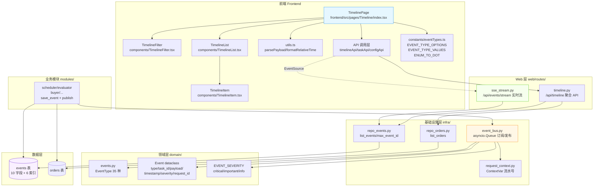
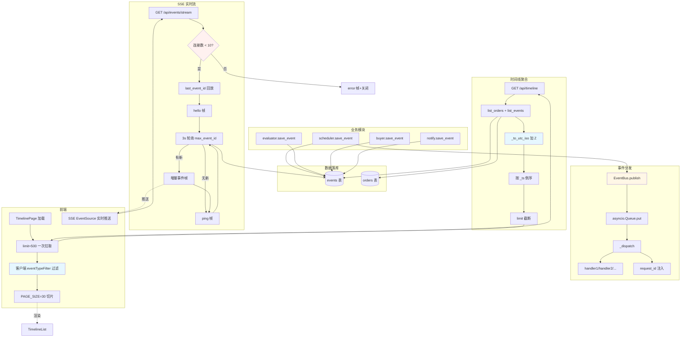
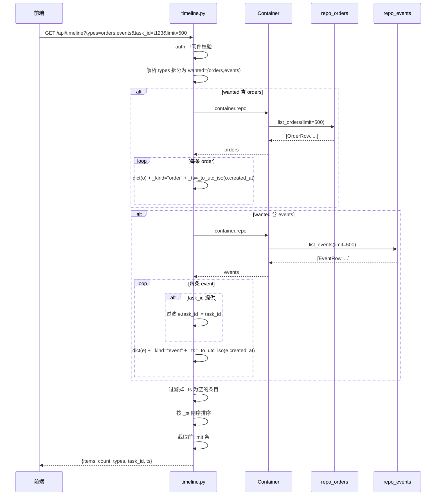
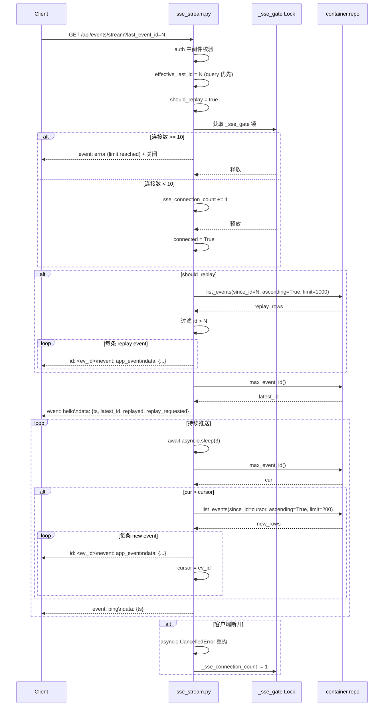
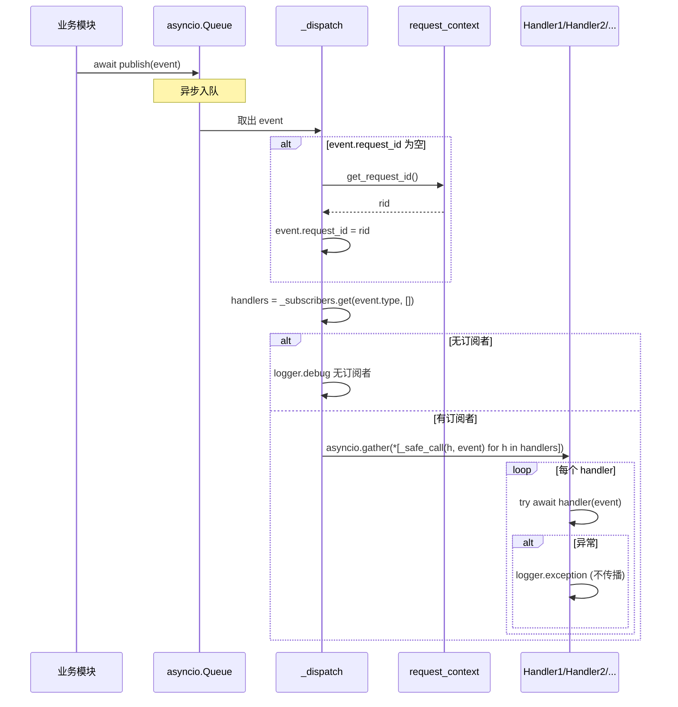

# 闲鱼猎人「事件时间线」模块需求规格说明书

| 项 | 内容 |
|---|---|
| 文档版本 | v1.0 |
| 文档日期 | 2026-07-05 |
| 文档状态 | 初版（与详细设计 v2.0 对齐） |
| 所属项目 | 闲鱼猎人（XianyuHunter） |
| 所属菜单 | 数据查看 → 事件时间线 |
| 菜单标识 | `menu_registry.yaml` 中 `key=timeline`、`icon=FieldTimeOutlined`、`sort_order=14`、`category=data_view` |
| 关联路由 | 前端 `/timeline`；后端 `/api/timeline`、`/api/events/stream` |
| 关联文档 | [事件时间线-详细设计.md](事件时间线-详细设计.md)（v2.0/2026-07-05） |
| 文档类型 | 需求规格说明书（SRS） |

> **本文档首段：继承 project_memory.md 中的硬约束。** 下文 §1.3.3 显式列出适用项与映射实现要点；本节先做总览：
> 1. **Web 进程必须使用 `with_browser=False` 模式**——本模块不涉及浏览器子进程启动；时间线后端为纯查询/推送型服务，与 Playwright 浏览器无关。
> 2. **认证白名单机制**——`/api/timeline`、`/api/events/stream` 走现有 `auth.py` 认证中间件（时间线页含敏感订单与流水号信息，不应被白名单放行）。
> 3. **前端 fetch 必须含 `credentials: 'include'`**——`frontend/src/api/index.ts` 中 `timelineApi` 沿用 `client` 默认配置；SSE 通过浏览器原生 `EventSource` 隐式携带 cookie。
> 4. **401 必须返回 JSON `{"detail":"Unauthorized"}`**——`timeline.py`/`sse_stream.py` 路由层通过 `auth.py` 拦截，符合规范。
> 5. **token 比较使用 `hmac.compare_digest()`**——本模块不直接处理 token 比对，但 SSE `Last-Event-ID` 入参已被 FastAPI `Query(ge=0)` 强类型校验（仅整数），与外部 token 比对无交集。
> 6. **敏感字段不日志**——SSE 调试日志只打印 `last_event_id` 与 `effective` 数值，不打印 `payload` 内文（订单标题、流水号、token 等不在 DEBUG 范围）。
> 7. **token 写失败触发 `logging.warning()`**——本模块不写 token；SSE 内部异常仅 `event: error` 推送给客户端，不污染服务端日志。
> 8. **模块级 import**——`timeline.py`/`sse_stream.py`/`event_bus.py` 全部模块级 import，无函数内冗余 import（`event_bus._dispatch` 内部 import `request_context` 为延迟导入避免循环依赖，按设计保留）。
> 9. **DB 索引**——events 表 6 个索引（5 个单列 + 1 个联合），与项目"按 task_id/created_at 加索引"硬约束一致。
> 10. **COUNT 查询 CASE WHEN 聚合**——本模块无 COUNT 类聚合；事件数量在 Python 端用 `len()` 计算（SSE 增量计数亦在 Python 端累加）。
> 11. **WebView2 子进程 `CREATE_NEW_CONSOLE`**——不适用，时间线无浏览器子进程。
> 12. **WebView2 `private_mode=False` + 独立 `storage_path`**——不适用。

---

## 目录

- [0. 阶段交接声明](#0-阶段交接声明)
- [1. 引言](#1-引言)
  - [1.1 编写目的](#11-编写目的)
  - [1.2 项目背景](#12-项目背景)
  - [1.3 范围与约束](#13-范围与约束)
  - [1.4 术语与缩写](#14-术语与缩写)
  - [1.5 参考资料](#15-参考资料)
- [2. 总体描述](#2-总体描述)
  - [2.1 产品定位](#21-产品定位)
  - [2.2 用户角色与特征](#22-用户角色与特征)
  - [2.3 运行环境](#23-运行环境)
  - [2.4 设计约束](#24-设计约束)
  - [2.5 假设与依赖](#25-假设与依赖)
- [3. 总体架构设计](#3-总体架构设计)
  - [3.1 模块架构图](#31-模块架构图)
  - [3.2 数据流程图](#32-数据流程图)
  - [3.3 关键时序图](#33-关键时序图)
  - [3.4 模块分层与职责](#34-模块分层与职责)
- [4. 功能需求](#4-功能需求)
  - [FR-1 事件时间线聚合](#fr-1-事件时间线聚合)
  - [FR-2 事件类型枚举](#fr-2-事件类型枚举)
  - [FR-3 SSE 实时事件流](#fr-3-sse-实时事件流)
  - [FR-4 EventBus 事件总线](#fr-4-eventbus-事件总线)
  - [FR-5 断线回放](#fr-5-断线回放)
  - [FR-6 连接数限制](#fr-6-连接数限制)
  - [FR-7 request_id 全局流水号](#fr-7-request_id-全局流水号)
  - [FR-8 多源事件聚合](#fr-8-多源事件聚合)
  - [FR-9 客户端分页](#fr-9-客户端分页)
  - [FR-10 事件筛选](#fr-10-事件筛选)
  - [FR-11 通知配置订阅项映射](#fr-11-通知配置订阅项映射)
  - [FR-12 严重度分级](#fr-12-严重度分级)
- [5. 接口定义](#5-接口定义)
  - [5.1 时间线聚合 API](#51-时间线聚合-api)
  - [5.2 SSE 实时事件流 API](#52-sse-实时事件流-api)
- [6. 数据模型](#6-数据模型)
- [7. 性能指标](#7-性能指标)
- [8. 安全要求](#8-安全要求)
- [9. 前端设计](#9-前端设计)
- [10. 部署与集成](#10-部署与集成)
- [11. 验收标准](#11-验收标准)
- [12. 附录](#12-附录)

---

## 0. 阶段交接声明

```
- 当前阶段：事件时间线 SRS 编写（v1.0） ✅ 已完成
- 下一阶段：数据查看菜单其余 SRS 汇总 + 实时日志/错误日志 SRS 联动校验
- 下一阶段智能体：主智能体
- 下一阶段技能：通用（无）
- 交接上下文：
  · 本文档定义「数据查看 → 事件时间线」二级菜单完整需求 v1.0
  · 关键设计决策：3 大模块（聚合 API + SSE 实时流 + EventBus 总线）+ 12 大功能（FR-1~FR-12）
  · 4 个内部辅助函数（_to_utc_iso / _format_sse_event / _load_replay_events / _load_new_events）已在 §4 / §5 / §6 中按模块归位标注
  · events 表 10 字段 + 6 索引（5 单列 + 1 联合 ix_events_task_created）
  · 事件类型实际 35 种（22 主系统 + 13 chatbot），前端 EVENT_TYPE_OPTIONS 仅暴露 22 主系统
  · SSE 连接数上限 10，断线回放基于 last_event_id
  · 客户端分页：后端 limit=500 一次拉取 + 前端 PAGE_SIZE=30，**无** before_id 游标
  · ENUM_TO_DOT 用途：前端常量（通知配置订阅项→点分格式），非 DB 枚举转换
  · request_id 格式：req-<17位数字>-<6位hex>
  · 菜单 key=timeline、path=/timeline、sort_order=14、category=data_view
  · 继承 project_memory.md 全部硬约束（首段已枚举 12 项适用映射）
```

---

## 1. 引言

### 1.1 编写目的

本需求规格说明书定义「数据查看 → 事件时间线」二级菜单的完整需求规格，作为前端/后端开发、测试与验收的唯一依据。

**目标读者**：
- 后端开发工程师：依据 §3-§6、§8、§10 进行模块实现与扩展
- 前端开发工程师：依据 §4、§9 进行页面开发
- 测试工程师：依据 §7、§11 编写测试用例与执行验收
- 项目经理：依据 §2、§11 进行范围与里程碑管理
- 智能客服 KB 训练：本文档与 [事件时间线-详细设计.md](事件时间线-详细设计.md) 共同作为 KB 检索素材

### 1.2 项目背景

闲鱼猎人（XianyuHunter）是一个闲鱼自动捡漏与抢单工具，已具备任务管理、商品采集、AI 评估、自动下单、多渠道通知等完整能力（详见 [requirements.md](../requirements.md)、[design.md](../design.md) 与 [概要设计文档.md](../概要设计文档.md)）。

随着系统运行规模扩大，**订单状态变更（orders）与系统事件（events）分散在不同页面/接口**，用户排查问题时需要在订单页、评估页、错误日志页之间反复跳转才能拼出完整业务流程，导致以下痛点：

| 痛点 | 现状 | 影响 |
|------|------|------|
| 全链路追溯难 | orders 走 `/api/orders`，events 走 `/api/events`/`/api/evaluations` 等多接口 | 排查一笔抢单订单需跨 4-5 个页面 |
| 事件分类粗糙 | 旧版事件类型仅 21 种，无智能客服事件 | chatbot 异常无法在时间线归类 |
| 实时事件无推送 | 旧版靠前端轮询 `/api/timeline` 拉取 | 推送延迟 = 轮询周期，浪费服务端资源 |
| 断线漏看事件 | 客户端断网时事件直接丢失 | 关键 `buy.succeeded` 可能漏推送 |
| 通知订阅与时间线漂移 | 通知配置 `subscribed_events` 与时间线过滤独立维护 | 用户调完订阅规则，时间线过滤未生效 |
| 跨链路定位难 | events/error_logs 缺关联字段 | 一次失败请求需人工在多表内 grep |
| 客户端分页无效 | 旧文档虚标 `before_id` 游标，实际后端不支持 | 翻页时数据错位 |

**解决方案**：新增「事件时间线」二级菜单，**聚合 orders + events 按 `created_at` 倒序统一展示**，并通过 SSE 实时事件流（`/api/events/stream`）+ 断线回放（`last_event_id`）+ EventBus 事件总线（`asyncio.Queue`）+ 全局 `request_id` 流水号（`req-<17位数字>-<6位hex>`）四件套，让用户在一个页面完成"全链路追溯 + 异常定位 + 实时监控 + 跨链路关联"。

### 1.3 范围与约束

#### 1.3.1 包含范围（In-Scope）

- 时间线聚合 API（`GET /api/timeline`，聚合 orders + events）
- SSE 实时事件流（`GET /api/events/stream`，含 hello/ping/error 协议）
- EventBus 事件总线（`infra/event_bus.py`，`asyncio.Queue` 订阅/发布）
- request_id 全局流水号（`infra/request_context.py`，`ContextVar` 异步安全传递）
- 事件类型枚举（35 种：22 主系统 + 13 智能客服）
- 严重度分级（critical / important / info）
- 断线回放（基于 `last_event_id` Query 参数或 `Last-Event-ID` Header）
- SSE 连接数限制（上限 10，超限发 `event: error`）
- 客户端分页（后端 `limit=500` 一次拉取 + 前端 `PAGE_SIZE=30`）
- 事件类型过滤（22 种主系统事件 Tag，3 段式订阅同步）
- 任务筛选（按 `task_id` 仅对 events 生效）
- 时间戳统一（`_to_utc_iso` 加 'Z' 后缀，避免 UTC+8 用户时间偏移）
- 前端 `/timeline` 页面（4 张统计卡片 + TimelineFilter + TimelineList）
- 前端组件：`TimelinePage` / `TimelineFilter` / `TimelineList` / `TimelineItem` / `utils.ts`

#### 1.3.2 排除范围（Out-of-Scope）

- 不实现实时日志（SSE 仅推 events，不推 `error_logs`）
- 不实现客户端按 `before_id` 游标分页（前端一次性拉取后客户端分页）
- 不实现 chatbot 事件的前端过滤 Tag（`EVENT_TYPE_OPTIONS` 仅 22 主系统）
- 不实现历史事件的回放/重放 API（仅 SSE 连接建立时一次性回放）
- 不实现 SSE 客户端的心跳自定义（固定 3 秒 server-side 推 ping）
- 不实现多用户隔离（事件表无 `user_id` 字段；按现有体系单 token 认证）
- 不实现事件订阅推送（事件订阅是 `NotifierChannels` 职责，不在时间线范围）

#### 1.3.3 硬约束

继承 [project_memory.md](c:/Users/hspcadmin/.trae-cn/memory/projects/-d-code-otherProjects-17-xianyu/project_memory.md) 中的项目硬约束，并显式映射到本模块实现：

| 硬约束 | 本模块适用性 | 实现要点 |
|--------|--------------|----------|
| Web 进程使用 `with_browser=False` 模式 | 适用 | 时间线后端为纯查询/推送服务，不启浏览器 |
| 认证白名单（`/api/auth/cookie` 等） | 不适用 | `/api/timeline` 与 `/api/events/stream` **必须**走 `auth.py` 认证，不加入白名单 |
| 前端 fetch 必须含 `credentials: 'include'` | 适用 | `frontend/src/api/index.ts` 中 `timelineApi` 沿用 `client` 默认配置；SSE 通过浏览器原生 `EventSource` 隐式携带 cookie |
| htmx 用官方 `<meta>` 配置 credentials | 不适用 | 时间线前端不使用 htmx |
| 401 响应必须返回 JSON `{"detail":"Unauthorized"`} | 适用 | `auth.py` 中间件层统一返回 |
| 后端 token 比较使用 `hmac.compare_digest()` | 不适用 | 本模块不直接处理 token 比对；SSE `last_event_id` 由 FastAPI `Query(ge=0)` 强类型校验 |
| 敏感字段（token 长度等）不日志 | 适用 | §8.5 日志规范：SSE DEBUG 日志仅打印 `last_event_id` 数值，不打印 payload |
| token 写失败触发 `logging.warning()` | 不适用 | 本模块不写 token；SSE 异常仅 `event: error` 推送客户端 |
| 缺失 import 必须 module-level | 适用 | `timeline.py` / `sse_stream.py` / `event_bus.py` 模块级 import；`event_bus._dispatch` 内部 import `request_context` 为延迟导入（避免循环依赖） |
| DB 必须在 `task_id/seller_id/...` 加索引 | 适用 | events 表 5 个单列索引（type/task_id/item_id/created_at/request_id）+ 1 个联合索引（ix_events_task_created） |
| COUNT 查询用 CASE WHEN 聚合 | 不适用 | 本模块无 COUNT 聚合；事件数量在 Python 端 `len()` 计算 |
| WebView2 子进程使用 `CREATE_NEW_CONSOLE` | 不适用 | 时间线无浏览器子进程 |
| WebView2 `webview.start()` 设 `private_mode=False` + 独立 `storage_path` | 不适用 | 同上 |
| KBManager 排除 `web/static/` 等目录 | 不适用 | 本模块不涉及 KB 索引 |
| `local_embedding.py` HF_ENDPOINT 设置 | 不适用 | 本模块不涉及 embedding |
| EmbeddingService 本地后端 | 不适用 | 同上 |
| sentence-transformers 跨版本兼容 | 不适用 | 同上 |
| `run_migrations` 各块独立 try/except | 适用 | events 表 schema 与索引已通过 SQLAlchemy `Index`/`mapped_column(index=True)` 定义；迁移时建表+索引独立 try/except |
| 启动钩子异常 `logger.exception()` | 适用 | SSE 内部异常 `event: error` 帧 + 继续循环，不退出（Client 断开走 `CancelledError` 重抛标准模式） |

### 1.4 术语与缩写

| 术语 | 全称 | 说明 |
|------|------|------|
| EventBus | Event Bus | 进程内事件总线，基于 `asyncio.Queue` 订阅/发布 |
| EventType | Event Type | 事件类型枚举（`domain/events.py`），35 种 |
| EventHandler | Event Handler | 订阅者函数，`Callable[[Event], Coroutine[Any, Any, None]]` |
| SSE | Server-Sent Events | 服务器推送协议，单向 text/event-stream |
| last_event_id | Last Event ID | 客户端最后收到的事件 id，用于断线回放 |
| StreamingResponse | FastAPI StreamingResponse | SSE 响应包装器 |
| _to_utc_iso | To UTC ISO | 时间戳统一函数（加 'Z' 后缀） |
| ENUM_TO_DOT | Enum to Dot Format | 前端常量，大写枚举名→小写点分格式映射（22 项） |
| EVENT_TYPE_OPTIONS | Event Type Options | 前端过滤可选项（22 项主系统） |
| EVENT_TYPE_VALUES | Event Type Values | 前端过滤 value 集合，用于校验 |
| EVENT_SEVERITY | Event Severity | 事件严重度字典（critical/important/info） |
| request_id | Request ID | 全局流水号（`req-<17位数字>-<6位hex>`） |
| ContextVar | Context Variable | Python 异步安全上下文变量 |
| _utcnow | UTC Now | DB 写入与时间格式化的统一 UTC 时间源 |
| Event | Event dataclass | 跨模块事件传递的最小单元（type/task_id/item_id/payload/timestamp/severity/request_id） |
| EventRow | Event Row | events 表 ORM 模型（10 字段 + 6 索引） |
| _format_sse_event | Format SSE Event | SSE 业务事件帧格式化函数 |
| _load_replay_events | Load Replay Events | 断线回放事件加载函数 |
| _load_new_events | Load New Events | 增量事件加载函数 |
| _sse_connection_count | SSE Connection Count | 全局 SSE 连接数计数器 |
| _sse_gate | SSE Gate | SSE 连接数门控锁（`asyncio.Lock`） |
| _MAX_SSE_CONNECTIONS | Max SSE Connections | SSE 连接数上限（10） |
| asyncio.CancelledError | Asyncio Cancelled Error | 客户端断开时 FastAPI 取消生成器异常 |
| PAGE_SIZE | Page Size | 前端分页每页条数（30） |
| NotifierChannels | Notifier Channels | 通知渠道配置页（前端），含 `subscribed_events` 字段 |
| AI | Artificial Intelligence | 人工智能（evaluator 模块） |

### 1.5 参考资料

| 文档 | 路径 | 用途 |
|------|------|------|
| 需求文档 v1.0 | [requirements.md](../requirements.md) | 系统整体需求基线 |
| 概要设计文档 v2.0 | [概要设计文档.md](../概要设计文档.md) | 36 个 API 路由、11 张数据表、技术选型 |
| 技术设计说明书 | [design.md](../design.md) | 分层架构、Evaluator 设计、状态机 |
| 事件时间线 详细设计 v2.0 | [事件时间线-详细设计.md](事件时间线-详细设计.md) | 本模块技术设计、代码位置、FAQ |
| 米其林设计系统 | [../standards/michelin-design-system.md](../standards/michelin-design-system.md) | UI 设计规范、色彩字体系统 |
| 反爬登录管理 SRS | [../04-系统维护/反爬登录管理-需求规格.md](../04-系统维护/反爬登录管理-需求规格.md) | SRS 模板参考（12 章节完整版） |
| 智能客服 SRS | [../06-智能客服/智能客服-需求规格.md](../06-智能客服/智能客服-需求规格.md) | SRS 模板参考（10+ 章节完整版） |
| 权限模块 SRS | [../07-权限模块/权限模块-需求规格.md](../07-权限模块/权限模块-需求规格.md) | SRS 模板参考（侧栏菜单 SRS 风格） |
| 项目硬约束 | [project_memory.md](c:/Users/hspcadmin/.trae-cn/memory/projects/-d-code-otherProjects-17-xianyu/project_memory.md) | 必须继承的硬约束清单 |
| 菜单元数据 | [../../config/menu_registry.yaml](../../config/menu_registry.yaml) | `key=timeline`、`sort_order=14` |
| 时间线后端 | [../../backend/xianyu_hunter/web/routes/timeline.py](../../backend/xianyu_hunter/web/routes/timeline.py) | 聚合 API + `_to_utc_iso` 辅助 |
| SSE 后端 | [../../backend/xianyu_hunter/web/routes/sse_stream.py](../../backend/xianyu_hunter/web/routes/sse_stream.py) | 4 个辅助函数 + 实时流 |
| EventBus | [../../backend/xianyu_hunter/infra/event_bus.py](../../backend/xianyu_hunter/infra/event_bus.py) | asyncio.Queue 订阅/发布 + `_dispatch` |
| EventType 枚举 | [../../backend/xianyu_hunter/domain/events.py](../../backend/xianyu_hunter/domain/events.py) | 35 种事件 + EVENT_SEVERITY |
| request_id | [../../backend/xianyu_hunter/infra/request_context.py](../../backend/xianyu_hunter/infra/request_context.py) | generate / get / set / new_request_scope |
| EventRow 模型 | [../../backend/xianyu_hunter/infra/db_models.py](../../backend/xianyu_hunter/infra/db_models.py) | events 表 10 字段 + 6 索引 |
| 前端页面 | [../../frontend/src/pages/Timeline/index.tsx](../../frontend/src/pages/Timeline/index.tsx) | 4 统计卡片 + TimelineFilter/List |
| 前端 API | [../../frontend/src/api/index.ts](../../frontend/src/api/index.ts) | `timelineApi.list` 封装 |
| 前端常量 | [../../frontend/src/constants/eventTypes.ts](../../frontend/src/constants/eventTypes.ts) | EVENT_TYPE_OPTIONS / ENUM_TO_DOT |

---

## 2. 总体描述

### 2.1 产品定位

「事件时间线」是闲鱼猎人系统的**全链路事件统一视图**，定位为：

> 将分散在 orders / events / evaluations / logs 等多表中的行为数据**按时间倒序聚合展示**，并通过 SSE 实时事件流 + 断线回放 + EventBus 事件总线 + 全局 request_id 流水号，让用户在一个页面里完成"全链路追溯 + 异常定位 + 实时监控 + 跨链路关联"。

**核心价值**：
1. **统一视图**：orders 与 events 按 `created_at` 倒序合并，无需跨页跳转
2. **实时推送**：SSE 端点 3 秒级增量推送 + 断线回放，关键事件不漏看
3. **订阅同步**：通知配置 `subscribed_events` 同步到时间线过滤条件，避免两处配置漂移
4. **跨链路定位**：`request_id` 串联 events / error_logs / 日志，运维人员一键关联同请求链路
5. **类型精细**：35 种事件类型（22 主系统 + 13 chatbot）+ 3 级严重度（critical/important/info）支撑免打扰决策
6. **客户端分页**：后端 limit=500 一次拉取 + 前端 PAGE_SIZE=30 切片，翻页不发后端请求

### 2.2 用户角色与特征

| 角色 | 特征 | 使用场景 | 关注重点 |
|------|------|----------|----------|
| 日常运维 | 系统已运行，关注流程透明度 | 进入时间线按 task_id 过滤，逐条看 payload 排查 | 事件类型过滤、payload 展开、相对时间 |
| 异常定位 | 收到 WAF 触发 / 抢单失败通知 | 时间线筛选 `waf.*` / `buy.failed` 事件 | 严重度着色、request_id 关联 error_logs |
| 实时监控 | 自定义页面/Dashboard EventStreamSection | 建立 SSE 连接，3 秒级推送新事件 | 实时性、断线回放、连接数控制 |
| 配置同步 | 在 NotifierChannels 调整订阅规则 | 回到时间线点"同步订阅"按钮 | 订阅规则自动应用为过滤条件 |
| 二次开发者 | 自定义业务模块 | 通过 EventBus subscribe/publish 接入事件流 | 35 种类型枚举、severity 字段、request_id 注入 |

### 2.3 运行环境

| 项 | 要求 |
|---|---|
| 操作系统 | Windows 10/11（主），Linux/macOS 兼容 |
| Python | 3.11+ |
| Node.js | 18+（仅前端构建） |
| 后端框架 | FastAPI（已集成，含 StreamingResponse） |
| 前端框架 | React 18 + TypeScript + Ant Design 5（已集成） |
| 数据库 | 复用现有 SQLite（events / orders 表） |
| 事件流 | 进程内 asyncio.Queue（EventBus）+ 跨表轮询（SSE） |
| 浏览器 SSE 支持 | Chrome/Firefox/Edge 原生 `EventSource` API |

### 2.4 设计约束

1. **集成部署**：作为 `backend/xianyu_hunter/web/routes/timeline.py` + `backend/xianyu_hunter/web/routes/sse_stream.py` 路由 + `frontend/src/pages/Timeline/index.tsx` 页面集成到现有系统，不独立部署
2. **聚合 vs 推送分离**：`/api/timeline` 一次性拉取，`/api/events/stream` 长连接推送，两条路径不混用
3. **EventBus 独立于 SSE**：EventBus 用于业务模块间事件分发（评估通过→触发抢单），SSE 直接轮询 `container.repo`，两者消费同一 events 表但走不同路径
4. **写操作 POST，读操作 GET**：与现有 REST 规范对齐
5. **SSE 走 `StreamingResponse`**：原生异步生成器，避免阻塞事件循环
6. **时间戳统一 UTC**：DB 写入用 `_utcnow()`，响应字段统一 `_to_utc_iso()` 加 'Z' 后缀
7. **request_id 异步安全**：基于 `contextvars.ContextVar`，asyncio.Task 派生场景自动传播
8. **连接数硬限制**：SSE 上限 10 防资源耗尽，超限 `event: error` 帧后立即关闭
9. **断线回放幂等**：客户端可同时携带 Query `last_event_id` 与 Header `Last-Event-ID`，服务端优先 Query
10. **客户端分页无游标**：后端 `limit` 仅控制单次返回上限；翻页由前端切片已加载数据
11. **ENUM_TO_DOT 仅前端用**：DB 存储点分格式字符串，ENUM_TO_DOT 不参与 DB 读写
12. **多语言支持**：所有用户可见的枚举中文映射在 `eventTypes.ts` 中维护

### 2.5 假设与依赖

**假设**：
- 用户已部署闲鱼猎人 v2.x+ 并能访问 `MainLayout` 侧边栏
- 业务模块（scheduler/evaluator/buyer/...）已调用 `save_event` 写入 events 表
- EventBus 单例已通过 `get_event_bus()` 注入到各业务模块
- 通知配置页（NotifierChannels）已实现 `subscribed_events` 大写枚举名字段

**依赖**：
- 依赖现有 `auth.py` 认证中间件
- 依赖现有 `EventType` 枚举（35 种，`domain/events.py`）
- 依赖现有 `Event` dataclass（`domain/events.py:115`）
- 依赖现有 `container.repo.list_orders` / `container.repo.list_events` / `container.repo.max_event_id`
- 依赖现有 `request_context` ContextVar（EventBus 自动注入）
- 依赖现有 `menu_registry.yaml` 菜单注册（已配置 `key=timeline`）
- 依赖 `configApi.get()` 返回 `notifier.subscribed_events` 字段
- 依赖 `taskApi.list({ limit: 200 })` 拉取任务下拉
- 新增无外部依赖

---

## 3. 总体架构设计

### 3.1 模块架构图



### 3.2 数据流程图



### 3.3 关键时序图

#### 3.3.1 时间线聚合 API 时序



#### 3.3.2 SSE 连接建立与增量推送时序



#### 3.3.3 EventBus 事件分发时序



### 3.4 模块分层与职责

遵循项目现有 DDD 分层架构（见 [概要设计文档](../概要设计文档.md) §3）：

| 层级 | 模块 | 职责 |
|------|------|------|
| **Web 层** | `timeline.py` | 时间线聚合 API（1 端点） |
| | `sse_stream.py` | SSE 实时事件流（1 端点 + 4 个辅助函数） |
| **领域层** | `domain/events.py` | EventType 枚举（35 种）、Event dataclass、EVENT_SEVERITY 字典 |
| **基础设施层** | `infra/event_bus.py` | EventBus 单例、asyncio.Queue 订阅/发布、_dispatch 自动注入 request_id |
| | `infra/request_context.py` | request_id 生成/读取/设置/校验，ContextVar 异步安全传递 |
| | `infra/db_models.py` | EventRow ORM（10 字段 + 6 索引） |
| | `infra/repo_events.py` | list_events / max_event_id（SSE 增量与回放来源） |
| | `infra/repo_orders.py` | list_orders（时间线 orders 来源） |
| **业务模块层** | scheduler/evaluator/buyer/notify/... | `save_event` 写 events 表 + `event_bus.publish` 推 EventBus |
| **前端** | `pages/Timeline/index.tsx` | TimelinePage 主页面（4 统计卡片 + Card） |
| | `pages/Timeline/components/TimelineFilter.tsx` | 数据来源/任务/事件类型过滤 |
| | `pages/Timeline/components/TimelineList.tsx` | 时间线条目列表 + 分页 |
| | `pages/Timeline/components/TimelineItem.tsx` | OrderDetail / EventDetail 渲染 |
| | `pages/Timeline/utils.ts` | parsePayload / formatRelativeTime |
| | `constants/eventTypes.ts` | EVENT_TYPE_OPTIONS / EVENT_TYPE_VALUES / ENUM_TO_DOT |
| | `api/index.ts` | timelineApi.list 封装 |

---

## 4. 功能需求

### FR-1 事件时间线聚合

**FR-1.1** `GET /api/timeline` 聚合 orders 与 events 按 `created_at` 倒序统一展示
- Query 参数：`types=orders,events`（默认）/ `task_id=xxx`（可选）/ `limit=500`（前端实际值，默认 200）
- 响应：`items` / `count` / `types` / `task_id` / `ts`

**FR-1.2** 合并算法（`timeline.py:52-77`）：
1. 解析 `types` 拆分为 `wanted` 集合（去重）
2. 含 `orders` 时 `container.repo.list_orders(limit=limit)`，逐条加 `_kind="order"` + `_ts`
3. 含 `events` 时 `container.repo.list_events(limit=limit)`，按 `task_id` 过滤（若提供），逐条加 `_kind="event"` + `_ts`
4. 过滤掉 `_ts` 为空的条目
5. 按 `_ts` 倒序排序
6. 截取前 `limit` 条返回

**FR-1.3** `_to_utc_iso(val: Any) -> str` 时间戳统一函数（`timeline.py:20`）：
- **为什么需要**：SQLite 不存时区信息，但 `_utcnow()` 写入的是 UTC；如果不加 'Z' 后缀，前端 `new Date()` 会把 UTC 当本地时间解析，导致 UTC+8 用户看到事件全部"偏移 8 小时"
- 处理 datetime 字符串：若 `tzinfo is None` 则追加 `'Z'`；若已带 tzinfo 则 `astimezone(timezone.utc)`
- 处理字符串：若以 `'Z'` 结尾或包含 `+` 时区偏移则原样返回，否则追加 `'Z'`
- 处理空值：返回空字符串

**FR-1.4** `task_id` 参数语义：
- **仅对 events 生效**（orders 不按 task_id 过滤）
- 当 `task_id` 提供时，过滤条件为 `e.task_id == task_id`

**FR-1.5** 响应字段不含 `has_more` / `next_cursor`（v1.0 文档虚构），前端一次性拉取后客户端分页

### FR-2 事件类型枚举

**FR-2.1** `EventType(str, Enum)` 定义于 `backend/xianyu_hunter/domain/events.py:9`，**共 35 种**（v1.0 文档误写 21 种，**修正为 35 种**）

**FR-2.2** 主系统事件（22 种）：

| 枚举名 | 点分格式 | 严重度 | 说明 |
|--------|----------|--------|------|
| `TASK_STARTED` | `task.started` | info | 任务启动 |
| `TASK_STOPPED` | `task.stopped` | info | 任务正常停止 |
| `TASK_PAUSED` | `task.paused` | info | 任务暂停 |
| `TASK_ERROR` | `task.error` | critical | 任务异常 |
| `TASK_SEARCH_DONE` | `task.search_done` | info | 搜索完成（量大，仅参考） |
| `ITEM_DISCOVERED` | `item.discovered` | info | 商品发现 |
| `ITEM_FOUND` | `item.found` | info | 商品匹配（旧枚举兼容） |
| `EVAL_PASSED` | `eval.passed` | important | 评估通过 |
| `EVAL_REJECTED` | `eval.rejected` | info | 评估拒绝 |
| `EVAL_SCORED` | `eval.scored` | info | 评分完成 |
| `BUY_REQUESTED` | `buy.requested` | info | 抢单请求 |
| `BUY_SUCCEEDED` | `buy.succeeded` | critical | 抢单成功 |
| `BUY_FAILED` | `buy.failed` | important | 抢单失败 |
| `NOTIFY_SENT` | `notify.sent` | info | 通知发送 |
| `WAF_TRIGGERED` | `waf.triggered` | critical | WAF 风控触发 |
| `WAF_BLOCKED` | `waf.blocked` | critical | WAF 风控拦截 |
| `LOGIN_EXPIRED` | `login.expired` | critical | 登录态失效 |
| `AUTH_EXPIRED` | `auth.expired` | important | 会话过期 |
| `SYSTEM_ERROR` | `system.error` | critical | 系统错误 |
| `MAINTENANCE_DATABASE` | `maintenance.database` | info | 数据库维护 |
| `MAINTENANCE_LOGS` | `maintenance.logs` | info | 日志清理 |
| `MAINTENANCE_CACHE` | `maintenance.cache` | info | 缓存清理 |

**FR-2.3** 智能客服模块事件（13 种，`chatbot.<域>.<动作>` 命名约定）：

| 枚举名 | 点分格式 | 严重度 | 说明 |
|--------|----------|--------|------|
| `CHATBOT_SESSION_CREATED` | `chatbot.session.created` | info | 会话创建 |
| `CHATBOT_SESSION_ENDED` | `chatbot.session.ended` | info | 会话结束 |
| `CHATBOT_MESSAGE_SAVED` | `chatbot.message.saved` | info | 消息保存 |
| `CHATBOT_FEEDBACK_RECEIVED` | `chatbot.feedback.received` | important | 负反馈（可能转人工） |
| `CHATBOT_FAQ_HIT` | `chatbot.faq.hit` | info | FAQ 命中 |
| `CHATBOT_INTENT_CLASSIFIED` | `chatbot.intent.classified` | info | 意图分类 |
| `CHATBOT_TOOL_CALLED` | `chatbot.tool.called` | info | 工具调用 |
| `CHATBOT_ESCALATED` | `chatbot.escalated` | critical | 转人工 |
| `CHATBOT_DEGRADED` | `chatbot.degraded` | important | 服务降级 |
| `CHATBOT_KB_REBUILT` | `chatbot.kb.rebuilt` | important | KB 重建成功 |
| `CHATBOT_KB_UPDATED` | `chatbot.kb.updated` | info | KB 增量更新 |
| `CHATBOT_KB_FAILED` | `chatbot.kb.failed` | critical | KB 构建失败 |
| `CHATBOT_CONFIG_CHANGED` | `chatbot.config.changed` | info | 配置变更 |

**FR-2.4** 前端 `EVENT_TYPE_OPTIONS` 仅暴露 22 种主系统（不含 chatbot 13 种），`EVENT_TYPE_VALUES` 是其 value 集合
- **为什么 chatbot 不在前端过滤**：chatbot 事件严重度由 `EVENT_SEVERITY.setdefault()` 幂等写入（`events.py:99-111`），保持主字典定义简洁；前端过滤关注主系统行为

**FR-2.5** `severity_of(event_type)` 函数：未在字典中时默认返回 `"info"`

### FR-3 SSE 实时事件流

**FR-3.1** `GET /api/events/stream` 端点签名（`sse_stream.py:53`）：
```python
@router.get("/events/stream")
async def events_stream(
    container: Container = Depends(get_container),
    last_event_id: int | None = Query(default=None, ge=0),
    last_event_id_header: int | None = Header(default=None, alias="Last-Event-ID", ge=0),
) -> StreamingResponse
```

**FR-3.2** 连接建立后返回 4 类 SSE 帧：
| 帧类型 | 触发时机 | 字段 |
|--------|----------|------|
| `event: app_event` + `id: <ev_id>` | 业务事件推送（含回放与增量） | data: `{"id":ev_id, "type":"buy.succeeded", "task_id":"...", "payload":{...}, ...}` |
| `event: hello` | 连接建立后立即推送 | data: `{"ts":"...", "latest_id":N, "replayed":M, "replay_requested":bool}` |
| `event: ping` | 每 3 秒保活（无论是否有新事件） | data: `{"ts":"..."}` |
| `event: error` | 异常时推送，不退出循环 | data: `{"error":"..."}` |
| `event: warn` | 回放失败时 | data: `{"msg":"replay_failed", "error":"..."}` |

**FR-3.3** `_format_sse_event(ev: dict, ev_id: int) -> str` 业务事件帧格式化（`sse_stream.py:27`）：
- 输出格式：`id: <ev_id>\nevent: app_event\ndata: <json>\n\n`
- `json.dumps` 使用 `ensure_ascii=False, default=str`（datetime 序列化为 ISO 字符串）

**FR-3.4** 客户端必须通过浏览器原生 `EventSource` API 连接（隐式携带 cookie，复用 `auth.py` 认证）

**FR-3.5** 协议握手流程：
1. 客户端：`GET /api/events/stream?last_event_id=N`（可选，N 为上次收到的事件 id）
2. 服务端：超限 → `event: error` 帧 + 关闭；未超限 → 计数 +1
3. 服务端：若 `client_provided_last=True` → 回放 `id > N` 的事件（最多 1000 条）
4. 服务端：推送 `event: hello` 携带 `replayed`/`replay_requested`/`latest_id`
5. 服务端：每 3 秒轮询 `max_event_id()`，若 `cur > cursor` 则推送增量事件
6. 服务端：每轮结束无论有无新事件都推 `event: ping` 保活
7. 客户端断开：`asyncio.CancelledError` 重抛，连接数 -1

**FR-3.6** 异常处理：
- 回放异常：yield `event: warn` 帧，**不退出**（客户端仍可收到后续 hello 帧）
- 增量轮询异常：yield `event: error` 帧，**继续循环**（不退出）
- 客户端断开：`asyncio.CancelledError` 重抛，符合 asyncio 取消标准模式（S7497）

### FR-4 EventBus 事件总线

**FR-4.1** `EventBus` 类定义于 `backend/xianyu_hunter/infra/event_bus.py`，基于 `asyncio.Queue` 的进程内事件分发
- 全局单例：`get_event_bus()` 返回 `_default_bus`

**FR-4.2** 核心 API：

| 方法 | 签名 | 说明 |
|------|------|------|
| `subscribe` | `(event_type: EventType, handler: EventHandler) -> None` | 订阅某类事件 |
| `unsubscribe` | `(event_type: EventType, handler: EventHandler) -> None` | 取消订阅 |
| `publish` | `async (event: Event) -> None` | 异步入队（`await put`） |
| `publish_nowait` | `(event: Event) -> None` | 同步入队（`put_nowait`，不阻塞） |
| `run_forever` | `async () -> None` | 主循环（`wait_for(queue.get(), timeout=1.0)` → `_dispatch`） |
| `stop` | `() -> None` | 设置 `_running=False`，主循环下次轮询退出 |

**FR-4.3** `_dispatch(event)` 分发机制（`event_bus.py:69`）：
1. **自动注入 request_id**：若 `event.request_id` 为空，从 ContextVar `get_request_id()` 读取并注入
   - **为什么放在 `_dispatch` 而非 `publish`**：publish 只是入队，实际分发发生在异步任务恢复后，此时 ContextVar 才是当前请求的作用域
2. 查找订阅者：`self._subscribers.get(event.type, [])`，无订阅者则 debug 日志后返回
3. 并发执行：`asyncio.gather(*(_safe_call(h, event) for h in handlers), return_exceptions=False)`
4. 异常隔离：`_safe_call` 捕获单个 handler 的所有异常并 `logger.exception`，不影响其他 handler

**FR-4.4** EventBus 与 SSE 的关系：
- **两者独立**。SSE 端点直接轮询 `container.repo`（events 表），不通过 EventBus 订阅
- EventBus 主要用于业务模块间的事件分发（评估通过触发抢单、订单成功触发下游任务激活等）
- 两者均消费同一 events 表，但走不同路径

### FR-5 断线回放

**FR-5.1** 触发条件：客户端提供了 `last_event_id`（Query 参数）或 `Last-Event-ID`（Header），即 `client_provided_last = True`

**FR-5.2** `effective_last_id` 优先级：Query 参数 > Header > 0

**FR-5.3** `_load_replay_events(container, should_replay, effective_last_id)` 函数（`sse_stream.py:36`）：
- `should_replay=False` 时直接返回空列表
- `should_replay=True` 时调用 `container.repo.list_events(since_id=effective_last_id, ascending=True, limit=1000)`
- 过滤 `id > effective_last_id`
- **为什么独立函数**：主生成器只需遍历列表 yield，无需在 for 内 if continue 拉高嵌套复杂度

**FR-5.4** 回放期间每条事件以 `id: <ev_id>` 帧推送，便于客户端记录最新 id

**FR-5.5** 回放完成后推送 `event: hello`，携带 `replayed`（回放条数）与 `replay_requested`（是否请求了回放）

**FR-5.6** 回放异常时 yield `event: warn` 帧（`{"msg":"replay_failed", "error":"..."}`），不退出连接

### FR-6 连接数限制

**FR-6.1** 上限常量：`_MAX_SSE_CONNECTIONS = 10`（`sse_stream.py:22`）

**FR-6.2** 实现：全局计数器 `_sse_connection_count` + `asyncio.Lock` (`_sse_gate`) 保护

**FR-6.3** 超限行为：直接 yield 一条 `event: error` 帧（`{'error': 'SSE connections limit (10) reached'}`）后关闭连接

**FR-6.4** 设计意图：防止多标签页或异常客户端耗尽服务端资源

**FR-6.5** 连接断开时 `_sse_connection_count -= 1`（`max(0, x)` 防负数），`finally` 块 + 门控锁保证原子性

### FR-7 request_id 全局流水号

**FR-7.1** 格式：`req-<17位数字>-<6位hex>`，示例：`req-20260701120000537-a3b2c1`

**FR-7.2** 格式拆解：
- 前缀 `req`：便于日志中肉眼识别与正则提取
- 17 位数字：UTC 时间 `YYYYMMDDHHMMSSfff`（毫秒级，保证有序性）
- 6 位 hex：`secrets.token_hex(3)` 随机数（16^6=16.7M 分之一的碰撞概率，确保同毫秒内多请求唯一）

**FR-7.3** 核心 API（`infra/request_context.py`）：

| 函数 | 说明 |
|------|------|
| `generate_request_id()` | 生成新流水号，`threading.Lock` 保护时间戳读取防回拨 |
| `get_request_id()` | 读取当前上下文流水号（无上下文返回 None） |
| `set_request_id(rid)` | 设置当前上下文流水号 |
| `clear_request_id()` | 清除当前上下文流水号 |
| `new_request_scope(rid?)` | 生成并设置新流水号，返回 token（用于后台任务/调度器等非 HTTP 场景） |
| `reset_request_scope(token)` | 恢复上下文到 `new_request_scope` 之前的状态 |
| `is_valid_request_id(rid)` | 校验格式合法性（防止客户端伪造 X-Request-Id 头注入日志） |

**FR-7.4** 上下文传递：基于 `contextvars.ContextVar`，异步安全（兼容 asyncio / 任意线程）

**FR-7.5** EventBus 自动注入：`EventBus._dispatch` 中若 `event.request_id` 为空，从 ContextVar 读取并注入

**FR-7.6** 数据库关联：写入 `events.request_id` 与 `error_logs.request_id`，便于跨表关联查询

### FR-8 多源事件聚合

**FR-8.1** 时间线聚合两类数据：
- `orders`：订单状态变更（`OrderRow`）
- `events`：系统事件（`EventRow`）

**FR-8.2** 为什么不单独列 evaluations/logs（已合并入 events）：
- events 表本身就是"全量行为记录"
- 单列评估/日志端点已存在（向后兼容），timeline 只做"视图聚合"
- 避免 N 次查询 + Python 端 union 排序的开销

**FR-8.3** `_kind` 字段标识条目类型：`"order"` / `"event"`，便于前端按类型渲染不同详情组件

**FR-8.4** `_ts` 字段为带 'Z' 后缀的 UTC ISO 字符串（由 `_to_utc_iso` 统一处理）

### FR-9 客户端分页

**FR-9.1** **不实现后端游标分页**（v1.0 文档虚标 `before_id`/`has_more`/`next_cursor`，代码中不存在）

**FR-9.2** 后端：一次拉取上限 `limit=500`（前端 `load()` 硬编码）

**FR-9.3** 前端：`PAGE_SIZE=30` 切片已加载数据，翻页不发后端请求
- 翻页时 `setItems(filteredItems.slice((p-1)*PAGE_SIZE, p*PAGE_SIZE))`
- 切换 `types`/`taskId` 时重新调 `load()` 拉取

**FR-9.4** 翻页无后端请求的优势：
- 翻页瞬时响应（无网络往返）
- 减少后端 DB 查询压力
- 避免大数据集 offset 性能衰减

**FR-9.5** 限制：单次拉取 500 条上限适用于常规场景，超大规模数据需扩展 `limit` 参数或加时间窗口过滤（**当前未实现**）

### FR-10 事件筛选

**FR-10.1** 数据来源 Select：切换 `types`（`orders,events` / `orders` / `events`），触发后端重新拉取

**FR-10.2** 任务筛选 Select：`allowClear`，列出 `taskApi.list({ limit: 200 })` 返回的任务，触发后端重新拉取（仅对 events 生效）

**FR-10.3** 事件类型 Tag 网格：22 个主系统事件 Tag，按 severity 着色
- critical → 红
- important → 橙
- 其他（info）→ 蓝

**FR-10.4** 点击事件类型 Tag 切换选中态：
- 全部模式下：单选该类型（不进入多选模式）
- 非全部模式下：增删该类型（多选）
- 清除过滤链接：清空 `eventTypeFilter`，回到全部模式

**FR-10.5** 统计卡片（订单事件/系统事件/抢单成功/抢单失败）基于 `filteredItems` 实时计算，**不可点击过滤**（v1.0 描述"点击卡片过滤"不准确）

### FR-11 通知配置订阅项映射

**FR-11.1** `ENUM_TO_DOT` 是**前端常量**（`frontend/src/constants/eventTypes.ts:96`），**不是 DB 枚举转换**（v1.0 文档错误）

**FR-11.2** 用途：把通知配置（`configApi.get().notifier.subscribed_events`）中存储的**大写枚举名**（如 `["BUY_SUCCEEDED", "EVAL_PASSED"]`）映射为**小写点分格式**（如 `["buy.succeeded", "eval.passed"]`）后作为 `eventTypeFilter`

**FR-11.3** 22 项映射（与 `EVENT_TYPE_OPTIONS` 一一对应）：
- `ITEM_DISCOVERED` → `item.discovered`
- `ITEM_FOUND` → `item.found`
- `EVAL_PASSED` → `eval.passed`
- `EVAL_REJECTED` → `eval.rejected`
- `EVAL_SCORED` → `eval.scored`
- `BUY_REQUESTED` → `buy.requested`
- `BUY_SUCCEEDED` → `buy.succeeded`
- `BUY_FAILED` → `buy.failed`
- `NOTIFY_SENT` → `notify.sent`
- `WAF_TRIGGERED` → `waf.triggered`
- `WAF_BLOCKED` → `waf.blocked`
- `LOGIN_EXPIRED` → `login.expired`
- `AUTH_EXPIRED` → `auth.expired`
- `TASK_STARTED` → `task.started`
- `TASK_STOPPED` → `task.stopped`
- `TASK_PAUSED` → `task.paused`
- `TASK_ERROR` → `task.error`
- `TASK_SEARCH_DONE` → `task.search_done`
- `SYSTEM_ERROR` → `system.error`
- `MAINTENANCE_DATABASE` → `maintenance.database`
- `MAINTENANCE_LOGS` → `maintenance.logs`
- `MAINTENANCE_CACHE` → `maintenance.cache`

**FR-11.4** DB `events.type` 字段**直接存储点分字符串**（如 `buy.succeeded`），不存大写枚举名

**FR-11.5** 三段式订阅同步（`Timeline/index.tsx:37`）：

```typescript
1. cfg = await configApi.get()
2. subscribed = cfg.notifier.subscribed_events  // 大写枚举名数组
3. validEnums = Set(Object.keys(ENUM_TO_DOT))
4. recognized = subscribed.filter(e => validEnums.has(e))   // 仅保留合法枚举
5. unknown = subscribed.filter(e => !validEnums.has(e))     // 无法识别的枚举
6. if unknown.length > 0: console.warn(...)                 // 提示配置漂移
7. mapped = recognized.map(e => ENUM_TO_DOT[e])             // 大写→点分
             .filter(v => EVENT_TYPE_VALUES.has(v))         // 二次校验
8. if mapped.length == 0: setEventTypeFilter([])            // 不过滤（兜底）
   elif mapped.length >= EVENT_TYPE_OPTIONS.length: setEventTypeFilter([])  // 全订阅=不过滤
   else: setEventTypeFilter(mapped)                         // 部分订阅=过滤
```

**FR-11.6** 设计意图：当用户在通知配置页调整订阅规则后，时间线页默认事件类型过滤集合自动同步，避免两处配置不一致。三段式判断（空过滤兜底 / 全订阅不过滤 / 部分订阅过滤）避免"配置映射出无效类型导致所有事件被过滤掉"的回归 bug

**FR-11.7** 页面加载时自动调 `syncFromNotifier`（`useEffect`）

### FR-12 严重度分级

**FR-12.1** `EVENT_SEVERITY` 字典定义于 `events.py:62`，三类严重度：

| 严重度 | 含义 | 典型事件 |
|--------|------|----------|
| `critical` | 必须送达（即便免打扰也推送） | buy.succeeded / waf.* / login.expired / task.error / system.error / chatbot.escalated / chatbot.kb.failed |
| `important` | 重要但可延迟（免打扰期降级为摘要） | eval.passed / buy.failed / auth.expired / chatbot.degraded / chatbot.feedback.received / chatbot.kb.rebuilt |
| `info` | 仅参考（免打扰期静默） | item.* / eval.scored / task.search_done / maintenance.* / chatbot.*（多数） |

**FR-12.2** chatbot 事件严重度通过 `EVENT_SEVERITY.setdefault()` 幂等写入（`events.py:99-111`）
- 保持主字典定义简洁
- 便于 chatbot 模块独立演进
- 模块解耦：chatbot 事件严重度与 chatbot 模块同源

**FR-12.3** `severity_of(event_type)` 函数：未在字典中时默认返回 `"info"`

**FR-12.4** `Event.severity` 字段默认从 type 推导（`__post_init__` 中 `severity = severity_of(self.type)`），调用方可显式覆盖

---

## 5. 接口定义

所有接口前缀：`/api`，时间线相关路由文件：`backend/xianyu_hunter/web/routes/timeline.py` 与 `backend/xianyu_hunter/web/routes/sse_stream.py`，认证：复用现有 `auth.py` 中间件（**不加入白名单**）。

### 5.1 时间线聚合 API

#### GET `/timeline`

**描述**：聚合 orders 与 events 按 `created_at` 倒序统一展示

**端点签名**（`timeline.py:38`）：
```python
@router.get("/timeline")
def timeline(
    types: str = "orders,events",
    task_id: str | None = None,
    limit: int = 200,
    container: Container = Depends(get_container),
) -> dict[str, Any]
```

**请求参数**：

| 参数 | 位置 | 类型 | 必填 | 默认值 | 说明 |
|------|------|------|------|--------|------|
| `types` | Query | str | 否 | `"orders,events"` | 逗号分隔的数据来源，可选值 `orders`/`events`，可组合 |
| `task_id` | Query | str | 否 | None | 按任务 ID 过滤（仅对 events 生效，orders 不按 task_id 过滤） |
| `limit` | Query | int | 否 | 200 | 返回条数上限（前端实际传 500） |

**成功响应**：
```json
{
  "items": [
    {
      "_kind": "order",
      "_ts": "2026-07-05T12:00:00Z",
      "id": 1234,
      "order_no": "...",
      "item_id": "...",
      "status": "succeeded",
      "price": 99.0,
      "created_at": "2026-07-05T12:00:00Z"
    },
    {
      "_kind": "event",
      "_ts": "2026-07-05T11:59:30Z",
      "id": 5678,
      "type": "buy.succeeded",
      "task_id": "t1234abcd",
      "stage": "buy",
      "level": "critical",
      "message": "抢单成功",
      "payload": "{...}",
      "created_at": "2026-07-05T11:59:30Z",
      "request_id": "req-20260705115930537-a3b2c1"
    }
  ],
  "count": 500,
  "types": ["orders", "events"],
  "task_id": null,
  "ts": "2026-07-05T12:00:01"
}
```

**响应字段**：

| 字段 | 类型 | 说明 |
|------|------|------|
| `items` | list | 时间线条目数组，按 `_ts` 倒序；每项带 `_kind`（order/event）与 `_ts` |
| `count` | int | 实际返回条数（`min(len(items), limit)`） |
| `types` | list[str] | 实际生效的数据来源列表（去重后的 wanted 集合） |
| `task_id` | str/null | 回显请求的 task_id |
| `ts` | str | 服务端响应时间（UTC ISO，秒精度） |

> **注意**：响应**不包含** `has_more` / `next_cursor` 字段（v1.0 文档虚构）。前端一次性拉取后客户端分页。

### 5.2 SSE 实时事件流 API

#### GET `/events/stream`

**描述**：SSE 实时事件流（推送最近事件 + 实时新事件 + 断线回放）

**端点签名**（`sse_stream.py:53`）：
```python
@router.get("/events/stream")
async def events_stream(
    container: Container = Depends(get_container),
    last_event_id: int | None = Query(default=None, ge=0),
    last_event_id_header: int | None = Header(default=None, alias="Last-Event-ID", ge=0),
) -> StreamingResponse
```

**请求参数**：

| 参数 | 位置 | 类型 | 必填 | 默认值 | 说明 |
|------|------|------|------|--------|------|
| `last_event_id` | Query | int | 否 | None | 断线回放游标（≥0），客户端上次收到的最大事件 id |
| `Last-Event-ID` | Header | int | 否 | None | 同上，SSE 标准断线重连头（优先级低于 Query 参数） |

**响应**：`text/event-stream`（`StreamingResponse`）

**业务事件帧**（`_format_sse_event`，`sse_stream.py:27`）：
```
id: 1234
event: app_event
data: {"id":1234,"type":"buy.succeeded","task_id":"t1234abcd",...}

```

**hello 帧**（连接建立后）：
```
event: hello
data: {"ts":"2026-07-05T12:00:00+00:00","latest_id":1234,"replayed":5,"replay_requested":true}

```

**ping 帧**（每 3 秒，保活）：
```
event: ping
data: {"ts":"2026-07-05T12:00:03+00:00"}

```

**error 帧**（超限或异常时）：
```
event: error
data: {"error":"SSE connections limit (10) reached"}

```

**warn 帧**（回放失败时）：
```
event: warn
data: {"msg":"replay_failed","error":"<错误信息>"}

```

---

## 6. 数据模型

### 6.1 events 表（EventRow，`backend/xianyu_hunter/infra/db_models.py:194`）

| 字段 | 类型 | 必填 | 默认值 | 约束 / 说明 |
|------|------|------|--------|-------------|
| `id` | Integer | 是 | autoincrement | 主键，自增；SSE 断线回放以此作为 `last_event_id` 游标 |
| `type` | String | 否 | NULL | 事件类型（点分格式字符串，如 `buy.succeeded`）；nullable 兼容旧数据 |
| `task_id` | String | 否 | NULL | 关联任务 ID（可为空，系统级事件无任务归属） |
| `item_id` | String | 否 | NULL | 关联商品 ID（可为空） |
| `stage` | String | 是 | — | 阶段（search/eval/buy/notify/maintenance 等） |
| `level` | String | 是 | — | 级别（info/warning/error 等） |
| `message` | Text | 否 | NULL | 事件描述 |
| `payload` | Text | 否 | NULL | 事件负载（JSON 字符串，结构因 type 而异） |
| `created_at` | DateTime | 否 | `_utcnow` | 创建时间（UTC）；时间线排序核心字段 |
| `request_id` | String | 否 | NULL | 全局流水号（`req-<17位数字>-<6位hex>`），关联同链路所有日志/异常 |

> **注意**：`type` 字段在 DB 中直接存储点分格式字符串（如 `buy.succeeded`），**不存储**大写枚举名。`ENUM_TO_DOT` 是前端常量，仅用于把通知配置中的大写枚举名订阅项映射为点分格式。

### 6.2 索引清单（events 表 6 个索引）

| 索引名 | 字段组合 | 用途 |
|--------|----------|------|
| （单列） | `type` | 按事件类型查询 |
| （单列） | `task_id` | 按任务过滤事件 |
| （单列） | `item_id` | 按商品反查事件 |
| （单列） | `created_at` | 时间线按时间倒序查询 |
| （单列） | `request_id` | 按流水号关联查询同链路事件 |
| `ix_events_task_created` | `task_id`, `created_at` | Dashboard 时间线核心查询路径：按任务+时间范围查事件 |

### 6.3 EventType 枚举（35 种）

详见 §FR-2.2 / §FR-2.3。

### 6.4 Event dataclass（`backend/xianyu_hunter/domain/events.py:115`）

```python
@dataclass
class Event:
    type: EventType
    task_id: str = ""
    item_id: str = ""
    payload: dict = field(default_factory=dict)
    timestamp: datetime = field(default_factory=lambda: datetime.now(timezone.utc))
    severity: str = ""  # critical/important/info
    request_id: str = ""  # EventBus._dispatch 时若为空则从 ContextVar 自动注入

    def __post_init__(self) -> None:
        # 未显式指定 severity 时从 type 推导
        if not self.severity:
            self.severity = severity_of(self.type)
```

### 6.5 EVENT_SEVERITY 字典

详见 §FR-12.1。

### 6.6 前端类型定义（`frontend/src/constants/eventTypes.ts`）

```typescript
// 22 项主系统事件类型过滤可选项
const EVENT_TYPE_OPTIONS: Array<{ value: string; label: string; severity: string }> = [...]

// value 集合，用于校验
const EVENT_TYPE_VALUES: Set<string> = new Set([...])

// 22 项：大写枚举名 → 小写点分格式映射
const ENUM_TO_DOT: Record<string, string> = {
  ITEM_DISCOVERED: 'item.discovered',
  ITEM_FOUND: 'item.found',
  EVAL_PASSED: 'eval.passed',
  // ... 共 22 项
}
```

### 6.7 前端 API 类型（`frontend/src/api/index.ts`）

```typescript
interface TimelineEntry {
  _kind: 'order' | 'event'
  _ts: string
  // order 字段
  id?: number
  order_no?: string
  item_id?: string
  status?: string
  price?: number
  // event 字段
  type?: string
  task_id?: string
  stage?: string
  level?: string
  message?: string
  payload?: string | object
  request_id?: string
  // 通用
  created_at: string
}

interface TimelineListResponse {
  items: TimelineEntry[]
  count: number
  types: string[]
  task_id: string | null
  ts: string
}
```

---

## 7. 性能指标

| 指标 | P50 目标 | P95 目标 | 说明 |
|------|----------|----------|------|
| 时间线聚合响应 | ≤ 200ms | ≤ 500ms | list_orders + list_events + Python 端排序 |
| 单次拉取条数 | — | — | 前端 `load()` 硬编码 `limit=500` |
| 前端分页切片 | ≤ 5ms | ≤ 20ms | `filteredItems.slice((p-1)*30, p*30)` |
| SSE 连接建立 | ≤ 100ms | ≤ 300ms | 回放（若需） + hello 帧 |
| SSE 回放条数 | — | — | 最多 1000 条，断线期间产生的事件可能超过 |
| SSE 增量推送 | ≤ 50ms | ≤ 100ms | `list_events(since_id=cursor, ascending=True, limit=200)` |
| SSE ping 间隔 | — | — | 固定 3 秒 |
| SSE 并发连接数 | — | — | 上限 10，超限 `event: error` |
| EventBus 入队 | ≤ 1ms | ≤ 5ms | `asyncio.Queue.put` |
| EventBus 分发 | ≤ 10ms | ≤ 30ms | `asyncio.gather(*handlers)` |
| request_id 生成 | ≤ 1ms | ≤ 5ms | `threading.Lock` + `secrets.token_hex(3)` |
| _to_utc_iso 转换 | ≤ 0.1ms | ≤ 1ms | 纯字符串拼接 |
| 时间线页面首屏 | ≤ 500ms | ≤ 1s | API 拉取 + 客户端过滤 + 首屏渲染 |

---

## 8. 安全要求

### 8.1 认证与授权

- **SR-8.1.1**：所有 `/api/timeline`、`/api/events/stream` 端点必须通过现有 `auth.py` 认证中间件
- **SR-8.1.2**：`/api/timeline`、`/api/events/stream` **不加入认证白名单**（与 `/api/auth/cookie` 等不同）；时间线页含敏感订单与流水号信息，必须认证
- **SR-8.1.3**：401 响应必须返回 JSON `{"detail": "Unauthorized"}`（遵循 project_memory 硬约束）
- **SR-8.1.4**：SSE 客户端必须通过浏览器原生 `EventSource` API 连接，**隐式携带 cookie**（不显式设 `credentials`）

### 8.2 入参校验

- **SR-8.2.1**：SSE `last_event_id` Query 参数必须 `ge=0`（非负整数），由 FastAPI `Query(default=None, ge=0)` 强类型校验
- **SR-8.2.2**：SSE `Last-Event-ID` Header 参数必须 `ge=0`，由 FastAPI `Header(default=None, alias="Last-Event-ID", ge=0)` 校验
- **SR-8.2.3**：时间线 `limit` 参数必须为正整数（FastAPI 自动校验）
- **SR-8.2.4**：时间线 `types` 参数解析为 `set` 自动去重与去除空字符串

### 8.3 时间戳统一

- **SR-8.3.1**：所有返回给前端的时间戳必须带 UTC 标记（'Z' 后缀或 `+HH:MM` 偏移）
- **SR-8.3.2**：`_to_utc_iso` 函数统一处理 datetime/字符串/None 三种入参
- **SR-8.3.3**：DB 写入用 `_utcnow()` 统一 UTC 时间源，避免应用层与 DB 层时区漂移

### 8.4 SSE 资源控制

- **SR-8.4.1**：SSE 连接数上限 10（`_MAX_SSE_CONNECTIONS = 10`）
- **SR-8.4.2**：超限发 `event: error` 帧后立即关闭连接，防止资源耗尽
- **SR-8.4.3**：连接断开（`asyncio.CancelledError`）必须 `finally` 块中 `-1` 计数器
- **SR-8.4.4**：回放条数上限 1000（`list_events(..., limit=1000)`），增量拉取上限 200（`limit=200`）
- **SR-8.4.5**：异常 `event: error` 帧不退出循环（避免单条事件异常导致整个连接断开）

### 8.5 敏感字段日志规范

- **SR-8.5.1**：SSE DEBUG 日志仅打印 `last_event_id` 与 `effective` 数值（`sse_stream.py:66-70`），**不打印** payload 内文（订单标题、流水号、token 等）
- **SR-8.5.2**：EventBus 调试日志仅打印事件类型与 handler 名（`event_bus.py:39`），**不打印** payload
- **SR-8.5.3**：EventBus handler 异常 `logger.exception`（`event_bus.py:96`），含 traceback 用于排查，但不传播

### 8.6 request_id 安全

- **SR-8.6.1**：`is_valid_request_id(rid)` 校验格式合法性（`req-<17位数字>-<6位hex>`），防止客户端伪造 X-Request-Id 头注入日志
- **SR-8.6.2**：`threading.Lock` 保护时间戳读取防回拨导致的同号
- **SR-8.6.3**：6 位 hex 随机碰撞概率 16.7M 分之一，配合毫秒时间戳足够

### 8.7 数据库查询安全

- **SR-8.7.1**：所有 DB 查询通过 SQLAlchemy ORM（防 SQL 注入）
- **SR-8.7.2**：`task_id` 过滤在 Python 端 `e.task_id == task_id`（不强转为 int，因 task_id 是字符串）
- **SR-8.7.3**：events 表 6 个索引（5 单列 + 1 联合）保证查询性能

### 8.8 子进程与导入

- **SR-8.8.1**：本模块不涉及浏览器子进程与第三方导入，不适用 `CREATE_NEW_CONSOLE` 等约束
- **SR-8.8.2**：`event_bus._dispatch` 内部 `from xianyu_hunter.infra.request_context import get_request_id` 为延迟导入（避免循环依赖），按设计保留

---

## 9. 前端设计

### 9.1 页面结构

新增前端文件结构：

```
frontend/src/
├── pages/
│   └── Timeline/
│       ├── index.tsx                      # 主页面（4 统计卡片 + Card）
│       ├── components/
│       │   ├── TimelineFilter.tsx         # 数据来源/任务/事件类型过滤
│       │   ├── TimelineList.tsx           # 时间线条目列表 + 分页
│       │   └── TimelineItem.tsx           # OrderDetail / EventDetail 渲染
│       └── utils.ts                       # parsePayload / formatRelativeTime
├── constants/
│   └── eventTypes.ts                      # EVENT_TYPE_OPTIONS / EVENT_TYPE_VALUES / ENUM_TO_DOT
└── api/
    └── index.ts                           # timelineApi.list 封装
```

### 9.2 布局规范

- 顶部标题栏：标题（📡 事件时间线）
- 4 张统计卡片（`Row gutter={16}` + `Col span={6}`）：
  1. **订单事件**（`ShoppingOutlined` 前缀，基于 `filteredItems` 实时计算）
  2. **系统事件**（`ClockCircleOutlined` 前缀）
  3. **抢单成功**（`CheckCircleOutlined` 前缀，绿色 `#52c41a`）
  4. **抢单失败**（`CloseCircleOutlined` 前缀，`failedCount > 0` 时红色 `#ff4d4f`）
- 主 Card 内：
  - `TimelineFilter`（数据来源 Select + 任务筛选 Select + 刷新按钮 + "同步订阅"按钮 + 清除过滤链接 + 事件类型 Tag 网格）
  - `TimelineList`（Spin 加载态 + Empty 空态 + 时间线条目 + 分页器）

### 9.3 关键交互

| 区域 | 交互行为 |
|------|----------|
| 数据来源 Select | 切换 `types`（`orders,events` / `orders` / `events`），触发后端重新拉取 |
| 任务筛选 Select | 切换 `taskId`，触发后端重新拉取（仅对 events 生效） |
| 刷新按钮 | 重新调用 `load()`，按当前 `types`/`taskId`/`eventTypeFilter` 拉取 |
| 事件类型 Tag | 点击切换选中态：全部模式下单选该类型；非全部模式下增删该类型；清除过滤后回到全部模式 |
| 同步订阅按钮 | 调用 `syncFromNotifier`，从通知配置同步订阅规则到 `eventTypeFilter` |
| 统计卡片 | 仅展示数字（基于 `filteredItems` 实时计算），**不可点击过滤** |
| TimelineItem 展开 | 点击"查看详情/收起详情"切换 `expandedItems`，展开后显示 payload 的 Descriptions 表格（前 12 项） |
| 分页器 | 客户端分页，切换页码时切片 `filteredItems.slice((p-1)*30, p*30)`，**不发后端请求** |

### 9.4 关键常量

| 常量 | 值 | 说明 |
|------|----|------|
| `PAGE_SIZE` | 30 | 前端分页每页条数 |
| 后端请求 `limit` | 500 | 一次拉取条数（硬编码在 `load()` 中） |
| `EVENT_TYPE_OPTIONS` | 22 | 事件类型过滤可选项数量（主系统） |
| `ENUM_TO_DOT` | 22 | 大写枚举名→点分格式映射数量 |
| `taskApi.list limit` | 200 | 任务筛选下拉数据上限 |

### 9.5 圆点配色规则（`TimelineList.tsx:37`）

| 条件 | 颜色 | 图标 |
|------|------|------|
| order 且 status=succeeded | `#52c41a` | 🛒 |
| order 且 status=failed | `#ff4d4f` | 🛒 |
| order 且 status in [pending, submitting, paying] | `#faad14` | 🛒 |
| event 且 level in [error, err] | `#ff4d4f` | 🔴 |
| event 且 level in [warning, warn] | `#faad14` | 🟠 |
| event 且 type=eval.passed 或 order.paid | `#52c41a` | 📌 |
| 其他 | `#1890ff` | 📌 |

### 9.6 关键交互实现

| 交互 | 实现位置 | 说明 |
|------|----------|------|
| 进入页面并行加载所有数据 | `useEffect` + `syncFromNotifier` | 页面挂载时调 `syncFromNotifier`（页面级）+ `load()`（依赖 `types`/`taskId`/`eventTypeFilter`） |
| 三段式订阅同步 | `syncFromNotifier` | `useCallback` 包裹，依赖 `[]`；调用 `configApi.get()` 读 `notifier.subscribed_events` |
| 客户端分页 | `handlePageChange` | `setItems(filteredItems.slice((p-1)*PAGE_SIZE, p*PAGE_SIZE))` |
| 事件类型 Tag 切换 | `TimelineFilter` | 全部模式单选/非全部模式多选；清除过滤清空 `eventTypeFilter` |
| TimelineItem 展开/收起 | `toggleExpand` | `Set<number>` 维护展开项索引；展开后显示 payload 表格 |
| 任务名映射 | `taskMap` | `Map<task_id, name/keyword/id>`，列表渲染时查找 |

### 9.7 utils.ts 辅助函数

```typescript
// payload 可能是字符串或对象，统一规整
const parsePayload = (item: TimelineEntry): Record<string, unknown> => {
  if (!item.payload) return {}
  if (typeof item.payload === 'string') {
    try { return JSON.parse(item.payload) } catch { return { raw: item.payload } }
  }
  return item.payload as Record<string, unknown>
}

// 相对时间：刚刚/N 分钟前/N 小时前/N 天前
const formatRelativeTime = (ts: string): string => { ... }
```

### 9.8 视觉规范

遵循 [米其林设计系统](../standards/michelin-design-system.md)：
- 色彩（亮色主题）：主色 `--michelin-red: #E20613`，警告色 `#faad14`，成功色 `#52c41a`
- 色彩（暗色主题，遵循 ThemeContext）：背景 `#1f1f1f`，文字 `#E0E0E0`
- 字体：正文 Inter / 中文 Noto Serif SC / 代码 JetBrains Mono
- 圆角：Card 8px，Button 6px
- 间距：遵循 8px 栅格

### 9.9 懒加载与 Suspense

- 路由级懒加载（`React.lazy`）必须配置 `Suspense` fallback
- fallback UI：AntD `Spin` 居中显示，tip="加载事件时间线..."
- 与现有 `lazyRetry.tsx` 复用重试逻辑

---

## 10. 部署与集成

### 10.1 后端集成

#### 10.1.1 模块目录

```
backend/xianyu_hunter/
├── web/routes/
│   ├── timeline.py                        # 聚合 API + _to_utc_iso
│   └── sse_stream.py                      # SSE 实时流 + 4 辅助函数
├── domain/
│   └── events.py                          # EventType 35 种 + Event dataclass + EVENT_SEVERITY
├── infra/
│   ├── event_bus.py                       # EventBus 单例 + asyncio.Queue + _dispatch
│   ├── request_context.py                 # request_id 生成/读取/校验
│   ├── db_models.py                       # EventRow + 6 索引
│   ├── repo_events.py                     # list_events / max_event_id
│   └── repo_orders.py                     # list_orders
└── modules/
    ├── scheduler.py                       # save_event
    ├── evaluator.py                       # save_event + EventBus 订阅 EVAL_PASSED
    ├── buyer.py                           # save_event
    ├── notifier.py                        # save_event
    └── ...
```

#### 10.1.2 路由注册

在 `startup.py` 中注册新路由：

```python
from xianyu_hunter.web.routes import timeline, sse_stream

app.include_router(timeline.router)
app.include_router(sse_stream.router)
```

#### 10.1.3 EventBus 单例

`get_event_bus()` 返回全局 `_default_bus` 单例（`infra/event_bus.py:103`）：

```python
_default_bus: EventBus | None = None

def get_event_bus() -> EventBus:
    global _default_bus
    if _default_bus is None:
        _default_bus = EventBus()
    return _default_bus
```

#### 10.1.4 request_id 集成

中间件在 HTTP 请求入口生成/透传流水号；后台任务在恢复执行上下文时调用 `new_request_scope`。`EventBus._dispatch` 自动注入到 Event（若 publish 时未显式指定），最终写入 `events.request_id` 与 `error_logs.request_id` 字段。

### 10.2 前端集成

#### 10.2.1 路由注册

在 `App.tsx` 中新增路由（必须配置 Suspense fallback）：

```tsx
import { lazy, Suspense } from 'react'
import { Spin } from 'antd'

const Timeline = lazy(() => import('./pages/Timeline'))

const fallback = <Spin tip="加载事件时间线..." />

<Route path="/timeline" element={<Suspense fallback={fallback}><Timeline /></Suspense>} />
```

#### 10.2.2 菜单注册

`config/menu_registry.yaml`（**已配置**）：

```yaml
- key: timeline
  label: 事件时间线
  icon: FieldTimeOutlined
  path: /timeline
  sort_order: 14
  default_visible: true
  category: data_view
```

### 10.3 数据初始化与迁移

- events 表由 SQLAlchemy `Base.metadata.create_all()` 自动创建
- 6 个索引（5 单列 + 1 联合）由 `Index("ix_events_task_created", "task_id", "created_at")` 与 `mapped_column(index=True)` 自动创建
- `run_migrations` 各块独立 try/except，单块失败不影响其他

### 10.4 EventBus 启动

`EventBus.run_forever()` 在应用启动时调度：

```python
# startup.py
async def lifespan(app: FastAPI):
    bus = get_event_bus()
    task = asyncio.create_task(bus.run_forever())
    yield
    bus.stop()
    await task
```

### 10.5 数据目录

复用现有数据目录（不新增）：

```
data/
├── events.db                # 包含 events / orders / tasks / ... 表
└── (其他现有目录保持不变)
```

**Docker volume 映射**：与现有 `docker-compose.yml` 一致。

---

## 11. 验收标准

### 11.1 功能验收

| 编号 | 验收项 | 验收标准 | 测试方法 |
|------|--------|----------|----------|
| AC-1 | 菜单入口 | 侧边栏"数据查看"分组下显示"事件时间线"，点击进入 `/timeline` | UI 检查 |
| AC-2 | 时间线聚合 orders | `GET /api/timeline?types=orders` 返回订单条目（`_kind="order"`） | 后端单测 |
| AC-3 | 时间线聚合 events | `GET /api/timeline?types=events` 返回事件条目（`_kind="event"`） | 后端单测 |
| AC-4 | 时间线聚合两类 | `GET /api/timeline`（默认）同时返回 orders + events | 后端单测 |
| AC-5 | task_id 过滤 events | `?types=events&task_id=t123` 仅返回该任务的 events | 后端单测 |
| AC-6 | 倒序排序 | 响应 items 按 `_ts` 倒序排列 | 后端单测 |
| AC-7 | _to_utc_iso 加 'Z' | 响应中 `_ts` / `ts` 字段带 'Z' 后缀 | 后端单测 |
| AC-8 | 事件类型 35 种 | `EventType` 枚举共 35 项（22 主系统 + 13 chatbot） | 代码审查 + 后端单测 |
| AC-9 | 严重度分级 | `EVENT_SEVERITY` 覆盖 critical/important/info 三类 | 后端单测 |
| AC-10 | 严重度推导 | `severity_of(EVAL_PASSED)` 返回 "important" | 后端单测 |
| AC-11 | SSE 连接建立 | `GET /api/events/stream` 返回 `text/event-stream` + hello 帧 | 后端单测 + 人工验证 |
| AC-12 | SSE 回放 | 携带 `?last_event_id=N` 时回放 `id > N` 的事件 | 后端单测 |
| AC-13 | SSE 回放上限 | 回放最多 1000 条（`list_events(..., limit=1000)`） | 后端单测 |
| AC-14 | SSE 增量推送 | 3 秒轮询 `max_event_id()`，有新增则推送 | 后端单测 |
| AC-15 | SSE ping 保活 | 每 3 秒推 `event: ping` 帧 | 后端单测 |
| AC-16 | SSE 连接数限制 | 第 11 个连接收到 `event: error` 帧后关闭 | 后端单测 |
| AC-17 | SSE 异常不退出 | 内部异常 yield `event: error` 帧，循环继续 | 后端单测 |
| AC-18 | SSE 断开回收 | `asyncio.CancelledError` 重抛，连接数 -1 | 后端单测 |
| AC-19 | SSE Header 优先 | 同时携带 Query 与 Header 时，Query 优先 | 后端单测 |
| AC-20 | EventBus 订阅 | `subscribe(EventType.X, handler)` 注册成功 | 后端单测 |
| AC-21 | EventBus 发布 | `await publish(event)` 异步入队 | 后端单测 |
| AC-22 | EventBus 分发 | `run_forever` 主循环消费队列，调用 handler | 后端单测 |
| AC-23 | EventBus 并发分发 | `asyncio.gather(*handlers)` 并发执行 | 后端单测 |
| AC-24 | EventBus 异常隔离 | handler 异常不影响其他 handler | 后端单测 |
| AC-25 | request_id 自动注入 | publish 时未指定 request_id，_dispatch 时从 ContextVar 注入 | 后端单测 |
| AC-26 | request_id 格式 | `req-<17位数字>-<6位hex>` | 后端单测 |
| AC-27 | request_id 校验 | `is_valid_request_id("invalid")` 返回 False | 后端单测 |
| AC-28 | events 表 6 索引 | 5 单列 + 1 联合（ix_events_task_created） | DB 审查 |
| AC-29 | 客户端分页 | `PAGE_SIZE=30` 切片，翻页不发后端请求 | 前端单测 + 人工验证 |
| AC-30 | 后端单次拉取 500 | `load()` 调用 `limit=500` | 前端代码审查 |
| AC-31 | 不含游标字段 | 响应**不包含** `has_more` / `next_cursor` / `before_id` | 后端单测 |
| AC-32 | 事件类型 Tag 22 | `EVENT_TYPE_OPTIONS` 共 22 项 | 前端单测 |
| AC-33 | ENUM_TO_DOT 22 项 | `Object.keys(ENUM_TO_DOT).length === 22` | 前端单测 |
| AC-34 | 订阅同步三段式 | 同步订阅按钮触发三段式判断（空/全/部分） | 前端单测 + 人工验证 |
| AC-35 | 任务筛选 | 切换 taskId 触发后端重新拉取 | 人工验证 |
| AC-36 | TimelineItem 展开 | 点击展开/收起切换 payload 表格 | 人工验证 |
| AC-37 | 统计卡片不可点击 | 卡片不绑定 onClick 过滤逻辑 | 代码审查 + 人工验证 |
| AC-38 | 菜单注册 | `key=timeline`、`sort_order=14`、`category=data_view`、`icon=FieldTimeOutlined` | 配置审查 |
| AC-39 | 4 统计卡片渲染 | 订单事件/系统事件/抢单成功/抢单失败 4 张卡片 | UI 检查 |
| AC-40 | 严重度着色 | critical=红/important=橙/info=蓝 | UI 检查 |

### 11.2 安全验收

| 编号 | 验收项 | 验收标准 |
|------|--------|----------|
| AC-41 | 认证拦截 | 未认证请求返回 401 JSON `{"detail":"Unauthorized"}` |
| AC-42 | 时间线不加入白名单 | `/api/timeline` / `/api/events/stream` 必须认证 |
| AC-43 | 入参校验 | SSE `last_event_id` 非负整数；`limit` 正整数 |
| AC-44 | 时间戳 UTC 标记 | 所有返回时间字段带 'Z' 后缀 |
| AC-45 | SSE 连接数限制 | 上限 10，超限发 `event: error` 帧 |
| AC-46 | SSE 资源回收 | 客户端断开后连接数正确减 1 |
| AC-47 | request_id 格式校验 | `is_valid_request_id` 防止伪造 |
| AC-48 | DB SQL 注入 | 所有查询走 SQLAlchemy ORM |
| AC-49 | 敏感字段不日志 | SSE DEBUG 日志不打印 payload |

### 11.3 性能验收

| 编号 | 验收项 | 验收标准 |
|------|--------|----------|
| AC-50 | 时间线聚合响应 | P95 ≤ 500ms |
| AC-51 | 客户端分页切片 | P95 ≤ 20ms |
| AC-52 | SSE 连接建立 | P95 ≤ 300ms |
| AC-53 | SSE 增量推送 | P95 ≤ 100ms |
| AC-54 | 时间线页面首屏 | P95 ≤ 1s |

### 11.4 测试用例索引

| 类别 | 测试文件 | 用例数 |
|------|----------|--------|
| 时间线聚合 | `tests/test_timeline_aggregate.py` | 8 |
| 时间戳统一 | `tests/test_to_utc_iso.py` | 4 |
| SSE 连接 | `tests/test_sse_stream.py` | 10 |
| SSE 断线回放 | `tests/test_sse_replay.py` | 5 |
| SSE 连接数限制 | `tests/test_sse_limit.py` | 3 |
| EventBus | `tests/test_event_bus.py` | 8 |
| request_id | `tests/test_request_id.py` | 6 |
| 事件类型枚举 | `tests/test_event_types.py` | 4 |
| 前端组件 | `frontend/src/pages/Timeline/__tests__/` | 6 |
| **合计** | | **54** |

---

## 12. 附录

### 12.1 关键代码位置表

| 模块 | 文件路径 | 行号 |
|------|----------|------|
| 时间线路由声明 | `backend/xianyu_hunter/web/routes/timeline.py` | 17 |
| `_to_utc_iso` | `backend/xianyu_hunter/web/routes/timeline.py` | 20-35 |
| `timeline` 端点 | `backend/xianyu_hunter/web/routes/timeline.py` | 38-77 |
| SSE 路由声明 | `backend/xianyu_hunter/web/routes/sse_stream.py` | 19 |
| `_MAX_SSE_CONNECTIONS` | `backend/xianyu_hunter/web/routes/sse_stream.py` | 22 |
| `_sse_connection_count` | `backend/xianyu_hunter/web/routes/sse_stream.py` | 23 |
| `_sse_gate` | `backend/xianyu_hunter/web/routes/sse_stream.py` | 24 |
| `_format_sse_event` | `backend/xianyu_hunter/web/routes/sse_stream.py` | 27-33 |
| `_load_replay_events` | `backend/xianyu_hunter/web/routes/sse_stream.py` | 36-44 |
| `_load_new_events` | `backend/xianyu_hunter/web/routes/sse_stream.py` | 47-50 |
| `events_stream` 端点 | `backend/xianyu_hunter/web/routes/sse_stream.py` | 53-118 |
| EventType 枚举 | `backend/xianyu_hunter/domain/events.py` | 9-55 |
| EVENT_SEVERITY 字典 | `backend/xianyu_hunter/domain/events.py` | 62-85 |
| chatbot setdefault 严重度 | `backend/xianyu_hunter/domain/events.py` | 99-111 |
| severity_of 函数 | `backend/xianyu_hunter/domain/events.py` | 88-90 |
| Event dataclass | `backend/xianyu_hunter/domain/events.py` | 114-132 |
| EventBus 类 | `backend/xianyu_hunter/infra/event_bus.py` | 21-97 |
| EventBus `_dispatch` | `backend/xianyu_hunter/infra/event_bus.py` | 69-88 |
| EventBus `_safe_call` | `backend/xianyu_hunter/infra/event_bus.py` | 90-96 |
| `get_event_bus` | `backend/xianyu_hunter/infra/event_bus.py` | 103-107 |
| `_request_id_var` | `backend/xianyu_hunter/infra/request_context.py` | 21 |
| `_gen_lock` | `backend/xianyu_hunter/infra/request_context.py` | 25 |
| `_REQUEST_ID_PREFIX` | `backend/xianyu_hunter/infra/request_context.py` | 28 |
| `generate_request_id` | `backend/xianyu_hunter/infra/request_context.py` | 31-44 |
| `get_request_id` | `backend/xianyu_hunter/infra/request_context.py` | 47-53 |
| `set_request_id` | `backend/xianyu_hunter/infra/request_context.py` | 56-62 |
| `clear_request_id` | `backend/xianyu_hunter/infra/request_context.py` | 65-67 |
| `new_request_scope` | `backend/xianyu_hunter/infra/request_context.py` | 70-85 |
| `reset_request_scope` | `backend/xianyu_hunter/infra/request_context.py` | 88-90 |
| `is_valid_request_id` | `backend/xianyu_hunter/infra/request_context.py` | 93-113 |
| EventRow 模型 | `backend/xianyu_hunter/infra/db_models.py` | 194-213 |
| `ix_events_task_created` | `backend/xianyu_hunter/infra/db_models.py` | 211-213 |
| ErrorLogRow 模型 | `backend/xianyu_hunter/infra/db_models.py` | 219+ |
| 菜单注册 | `config/menu_registry.yaml` | 46-52 |
| 前端页面 | `frontend/src/pages/Timeline/index.tsx` | 1-184 |
| `syncFromNotifier` | `frontend/src/pages/Timeline/index.tsx` | 37-65 |
| `load` 函数 | `frontend/src/pages/Timeline/index.tsx` | 72-87 |
| `handlePageChange` | `frontend/src/pages/Timeline/index.tsx` | 97-100 |
| `toggleExpand` | `frontend/src/pages/Timeline/index.tsx` | 102-109 |
| `PAGE_SIZE` 常量 | `frontend/src/pages/Timeline/index.tsx` | 13 |
| 前端常量 | `frontend/src/constants/eventTypes.ts` | 62+ |

### 12.2 变更记录

| 版本 | 日期 | 修订人 | 修订内容 |
|------|------|--------|----------|
| v1.0 | 2026-07-05 | SRS 智能体 | 初版，与事件时间线 详细设计 v2.0 对齐：12 章齐全 + 12 个 FR + 2 端点 + 4 个内部辅助函数 + EventBus 异步分发 + request_id 全局流水号 + 客户端分页（无游标）+ ENUM_TO_DOT 用途澄清 |

> **追加说明**：v1.0 阶段交付完成后，如后续评审中需调整 FR/接口/验收项，请在本表追加 v1.1+ 记录，并更新文档元信息版本号；本表遵循 SRS 模板的"修订记录先于内容"惯例，新增条目按"日期升序"追加。

### 12.3 相关文档交叉引用

| 文档 | 路径 | 关联章节 |
|------|------|----------|
| 事件时间线 详细设计 v2.0 | [事件时间线-详细设计.md](事件时间线-详细设计.md) | 全部章节 |
| 需求文档 v1.0 | [../requirements.md](../requirements.md) | §2 数据查看 |
| 概要设计文档 v2.0 | [../概要设计文档.md](../概要设计文档.md) | §3 分层架构 |
| 技术设计说明书 | [../design.md](../design.md) | §4 状态机 |
| 米其林设计系统 | [../standards/michelin-design-system.md](../standards/michelin-design-system.md) | UI 规范 |
| 智能客服 SRS | [../06-智能客服/智能客服-需求规格.md](../06-智能客服/智能客服-需求规格.md) | SRS 模板 |
| 权限模块 SRS | [../07-权限模块/权限模块-需求规格.md](../07-权限模块/权限模块-需求规格.md) | SRS 模板 |
| 反爬登录管理 SRS | [../04-系统维护/反爬登录管理-需求规格.md](../04-系统维护/反爬登录管理-需求规格.md) | SRS 模板 |
| 项目硬约束 | [project_memory.md](c:/Users/hspcadmin/.trae-cn/memory/projects/-d-code-otherProjects-17-xianyu/project_memory.md) | 全部硬约束 |

### 12.4 FAQ 索引

详细 FAQ 见 [事件时间线-详细设计.md](事件时间线-详细设计.md) §14，共 14 条（Q1-Q14），摘录核心：

**Q1：时间线展示哪些数据？**
- 统一展示订单状态变更（orders）与系统事件（events）两类数据，按 `created_at` 倒序合并。默认 `types="orders,events"` 同时拉取两类

**Q2：有多少种事件类型？**
- `domain/events.py` 中 `EventType` 枚举共 **35 种**：主系统 22 种 + 智能客服 13 种。前端时间线页事件类型过滤仅暴露主系统 22 种（`EVENT_TYPE_OPTIONS`）

**Q3：types 参数怎么用？**
- `types` 为逗号分隔字符串，控制数据来源。`orders` 拉取订单状态变更，`events` 拉取系统事件，默认 `"orders,events"` 同时拉取。`task_id` 参数仅对 events 生效

**Q4：为什么数据库存的是点分格式，不是大写枚举？**
- DB `events.type` 字段直接存储点分字符串（如 `buy.succeeded`），不存大写枚举名。`ENUM_TO_DOT` 是**前端常量**，仅用于把通知配置中存储的大写枚举名订阅项映射为点分格式

**Q5：时间线是怎么分页的？**
- **没有后端游标分页**。前端一次性调用 `GET /api/timeline?limit=500` 拉取最多 500 条，然后客户端按 `PAGE_SIZE=30` 分页展示

**Q6：统计卡片的数字是怎么算的？**
- 基于当前已加载并经过 `eventTypeFilter` 过滤后的 `filteredItems` 实时计算。统计卡片**不可点击过滤**

**Q7：事件订阅规则会和通知配置同步吗？**
- 会。点击"同步订阅"按钮调用 `syncFromNotifier`，三段式判断：通知配置无合法枚举→不过滤（兜底）；订阅全部 22 种合法类型→不过滤；部分订阅→仅保留 `EVENT_TYPE_VALUES` 中真实存在的值作为过滤项

**Q8：SSE 连接数为什么有限制？**
- 上限 10（`_MAX_SSE_CONNECTIONS = 10`），防止多标签页或异常客户端耗尽服务端资源

**Q9：SSE 断线后怎么恢复？**
- 客户端重连时携带 `last_event_id`（Query 参数）或 `Last-Event-ID`（Header），服务端从 `list_events(since_id=effective_last_id, ascending=True, limit=1000)` 拉取断线期间的事件并回放

**Q10：SSE 和 EventBus 是什么关系？**
- 两者**独立**。SSE 端点直接轮询 `container.repo`（events 表），不通过 EventBus 订阅

**Q11：request_id 是什么？格式如何？**
- 全局流水号，格式 `req-<17位数字>-<6位hex>`。基于 `contextvars.ContextVar` 异步安全传递

**Q12：chatbot 事件为什么不在时间线过滤选项里？**
- 前端 `EVENT_TYPE_OPTIONS` 仅暴露主系统 22 种事件类型，chatbot 13 种事件未纳入

**Q13：events 表有哪些索引？**
- 单列索引 5 个（`type`/`task_id`/`item_id`/`created_at`/`request_id`）+ 联合索引 1 个（`ix_events_task_created`）

**Q14：`_to_utc_iso` 为什么要加 'Z' 后缀？**
- SQLite 不存储时区信息，但 `_utcnow()` 写入的是 UTC。如果不加 'Z' 后缀，前端 `new Date()` 会把 UTC 时间当作本地时间解析，导致 UTC+8 用户看到的事件全部"偏移 8 小时"

### 12.5 关键设计决策摘要

1. **聚合 vs 推送分离**：`/api/timeline` 一次性拉取，`/api/events/stream` 长连接推送，两条路径不混用
2. **EventBus 独立于 SSE**：EventBus 用于业务模块间事件分发（评估通过→触发抢单），SSE 直接轮询 `container.repo`，两者消费同一 events 表但走不同路径
3. **客户端分页无游标**：后端 `limit` 仅控制单次返回上限；翻页由前端切片已加载数据，避免后端 offset 性能衰减
4. **ENUM_TO_DOT 仅前端用**：DB 存储点分格式字符串，ENUM_TO_DOT 不参与 DB 读写，仅用于通知配置订阅项映射
5. **35 种事件类型**：22 主系统 + 13 chatbot，覆盖全模块行为；前端过滤仅暴露 22 主系统
6. **SSE 连接数硬限制**：上限 10 防资源耗尽，超限 `event: error` 帧后立即关闭
7. **断线回放幂等**：客户端可同时携带 Query `last_event_id` 与 Header `Last-Event-ID`，服务端优先 Query
8. **request_id 异步安全**：基于 `contextvars.ContextVar`，asyncio.Task 派生场景自动传播
9. **EventBus 自动注入 request_id**：`_dispatch` 中若 `event.request_id` 为空则从 ContextVar 读取，保证跨模块事件链路可追溯
10. **三段式订阅同步**：避免"配置映射出无效类型导致所有事件被过滤掉"的回归 bug
11. **时间戳统一 UTC**：DB 写入 `_utcnow()`，响应字段 `_to_utc_iso()` 加 'Z' 后缀，避免 UTC+8 用户时间偏移
12. **统计卡片不可点击**：仅展示基于 `filteredItems` 的数字，过滤通过事件类型 Tag 区操作
13. **SSE 异常不退出循环**：内部异常 yield `event: error` 帧后继续，避免单条事件异常导致整个连接断开
14. **chatbot 严重度 setdefault 幂等**：保持主字典定义简洁，便于 chatbot 模块独立演进

### 12.6 阶段交接声明

```
- 当前阶段：事件时间线 SRS 编写（v1.0） ✅ 已完成
- 下一阶段：数据查看菜单其余 SRS 汇总校验
- 下一阶段智能体：主智能体
- 下一阶段技能：通用
- 交接上下文：
  · 文件路径：d:\code\otherProjects\17_xianyu\docs\02-数据查看\事件时间线-需求规格.md
  · 12 章齐全：阶段交接 / 引言 / 总体描述 / 总体架构 / 功能需求(12 个 FR) / 接口定义 / 数据模型 / 性能指标 / 安全要求 / 前端设计 / 部署集成 / 验收标准 / 附录
  · 4 个内部辅助函数全部标注（§4 / §5 / §6 + §12.1）
  · 关键设计决策：3 大模块（聚合 API + SSE 实时流 + EventBus 总线）+ 12 大功能（FR-1~FR-12）
  · 硬约束：继承 project_memory.md 全部 12 项适用项，首段已显式枚举
  · 引用链：事件时间线-详细设计.md（兄弟文档） / requirements.md / design.md / 概要设计文档.md / michelin-design-system.md
  · 测试用例：54 条覆盖 10 个测试文件
  · FAQ：14 条（Q1-Q14）摘录于附录
```

---

**文档结束**
