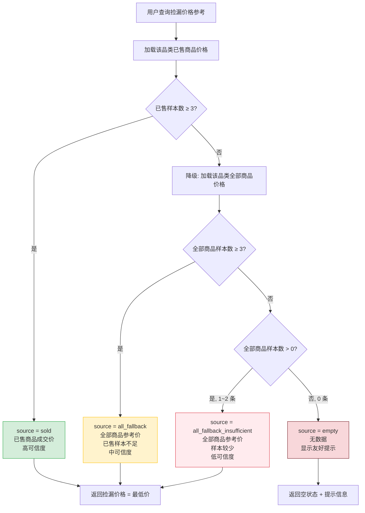

# 闲鱼猎人「价格行情」操作手册

| 属性         | 值                                            |
| ------------ | --------------------------------------------- |
| 文档版本     | v1.0                                          |
| 文档日期     | 2026-07-05                                    |
| 所属项目     | 闲鱼猎人                                      |
| 所属菜单     | 数据查看 → 价格行情                           |
| 文档类型     | 操作手册                                      |
| 关联路由     | /price-dashboard                              |
| 配套详细设计 | v1.0（2026-07-05）                            |
| 目标读者     | 运营 / 管理员                                 |
| 维护人       | XianyuHunter 团队                             |

---

## 目录

- [0. 阶段交接声明](#0-阶段交接声明)
- [1. 功能简介](#1-功能简介)
- [2. 入口与导航](#2-入口与导航)
- [3. 界面布局](#3-界面布局)
- [4. 操作指南](#4-操作指南)
  - [4.1 查看价格行情总览](#41-查看价格行情总览)
  - [4.2 三个功能模块说明](#42-三个功能模块说明)
  - [4.3 品类横向对比](#43-品类横向对比)
  - [4.4 捡漏价格参考](#44-捡漏价格参考)
  - [4.5 品类统计明细](#45-品类统计明细)
  - [4.6 多维度排序](#46-多维度排序)
  - [4.7 时间窗筛选](#47-时间窗筛选)
  - [4.8 解读分位数](#48-解读分位数)
  - [4.9 数据源回退说明](#49-数据源回退说明)
  - [4.10 已售样本不足阈值说明](#410-已售样本不足阈值说明)
- [5. 字段说明](#5-字段说明)
- [6. 常见问题 FAQ](#6-常见问题-faq)
- [7. 注意事项与限制](#7-注意事项与限制)
- [8. 关联功能](#8-关联功能)
- [9. 快捷键与技巧](#9-快捷键与技巧)
- [10. 修订记录](#10-修订记录)
- [11. 附录](#11-附录)

---

## 0. 阶段交接声明

```
- 当前阶段：价格行情操作手册 v1.0 编写 ✅ 已完成
- 下一阶段：全局术语统一与文档间交叉引用校验（数据查看菜单操作手册系列收尾）
- 下一阶段智能体：文档审查智能体
- 下一阶段技能：文档审查
- 交接上下文：
  · 本文档为「数据查看 → 价格行情」二级菜单面向最终用户的操作手册 v1.0
  · 严格遵循 11 章节模板，覆盖 3 个功能模块（品类横向对比 / 捡漏价格参考 / 品类统计明细）
  · 关键内容：9 排序字段、4 级数据源回退、捡漏价格定义、分位数解读、与仪表盘价格直方图卡片边界澄清
  · 已对齐详细设计 v1.0 与需求规格 v1.0，文档日期 2026-07-05
  · 文档路径：d:\code\otherProjects\17_xianyu\docs\02-数据查看\价格行情-操作手册.md
```

---

## 1. 功能简介

### 1.1 一句话说明

「价格行情」是闲鱼猎人系统中按品类（任务）聚合商品价格样本、提供横向对比与捡漏价格参考的独立行情视图，是用户判断"是否值得入手"的核心决策入口。

### 1.2 核心价值

| 价值点             | 说明                                                                 |
| ------------------ | -------------------------------------------------------------------- |
| 跨品类横向对比     | 最多 100 个品类同屏对比，按 9 个统计字段排序，红绿色标注偏离度       |
| 捡漏价格参考       | 基于近期已售商品近似成交价，给出"低于此价可捡漏"的参考阈值           |
| 分位数统计         | P10 / P25 / P50 / P75 / P90 反映价格分布形态而非单一均值            |
| 样本回退           | 已售样本不足时自动回退到全量商品价格，避免无数据可看                 |
| 时间窗筛选         | 7 天 / 30 天 / 90 天支持短期行情波动观察与长期趋势对比               |
| 算法口径统一       | 分位数采用线性插值法，与仪表盘价格直方图卡片口径完全一致            |

### 1.3 适用读者

| 角色         | 主要使用场景                                       |
| ------------ | -------------------------------------------------- |
| 日常运营     | 进入页面看横向对比 + 偏离度，识别高价区/低价区品类 |
| 捡漏玩家     | 选品类 + 时间窗查捡漏价格，作为入手决策参考        |
| 价格分析师   | 品类统计明细表列排序，深入研究品类分布             |
| 任务规划者   | 横向对比 + 时间窗，决定新监控任务的定价范围        |

### 1.4 与仪表盘价格直方图卡片的关系

> **提示**：价格行情菜单（/price-dashboard）与仪表盘的价格直方图卡片（/）是**两个独立的功能**，视角互补：
> - **价格行情菜单**：回答"哪些品类贵 / 便宜"——多品类横向对比
> - **仪表盘价格直方图卡片**：回答"某品类内部价格如何分布"——单品类纵向分布
>
> 两者共用底层分位数算法，但菜单归属、界面、操作完全独立。详见 [11.4 边界对比表](#114-边界对比表)。

---

## 2. 入口与导航

### 2.1 菜单入口

| 属性         | 值                                     |
| ------------ | -------------------------------------- |
| 菜单分组     | 数据查看                               |
| 菜单名称     | 价格行情                               |
| 菜单图标     | 美元符号图标                           |
| 菜单排序     | 第 18 位（数据查看分组内）             |
| 默认可见     | 是                                     |
| 访问路径     | /price-dashboard                       |

### 2.2 进入方式

| 进入方式                  | 操作步骤                                                                 |
| ------------------------- | ------------------------------------------------------------------------ |
| 侧边栏菜单点击            | 展开左侧"数据查看"分组 → 点击"价格行情"菜单项                            |
| 命令面板                  | 按 `Ctrl+K` 打开命令面板 → 输入"价格行情"或"price" → 选中命令回车        |
| 浏览器地址栏直接访问      | 在地址栏输入 `/price-dashboard` 路径回车                                 |
| 多 Sheet 页标签栏切换     | 若已在其他 Sheet 打开过本页，点击左侧标签栏对应标签即可切回              |

### 2.3 权限要求

- 需登录闲鱼猎人系统并通过认证
- 默认对所有可登录用户可见
- 未登录访问将返回未授权提示

---

## 3. 界面布局

### 3.1 整体结构

价格行情页面采用**纵向 Flex 布局**，自上而下依次为：

```
┌─────────────────────────────────────────────────────────┐
│  顶部说明提示条（信息提示）                              │
├─────────────────────────────────────────────────────────┤
│  模块 A：品类横向对比                                    │
│  ┌──────────────────────────────────────────────────┐   │
│  │ 工具栏：排序字段 / 排序方向 / 时间窗 / 刷新按钮   │   │
│  ├──────────────────────────────────────────────────┤   │
│  │ 横向条形图（ECharts）                             │   │
│  ├──────────────────────────────────────────────────┤   │
│  │ 图例说明：红色（贵）/ 绿色（便宜）/ 蓝色（接近）  │   │
│  └──────────────────────────────────────────────────┘   │
├─────────────────────────────────────────────────────────┤
│  模块 B：捡漏价格参考                                    │
│  ┌──────────────────────────────────────────────────┐   │
│  │ 工具栏：品类下拉 / 时间窗下拉 / 刷新按钮          │   │
│  ├──────────────────────────────────────────────────┤   │
│  │ 4 个统计卡片：捡漏价格 / 最低价 / 中位数 / 最高价 │   │
│  ├──────────────────────────────────────────────────┤   │
│  │ 底部标签：样本数 + 数据来源                       │   │
│  └──────────────────────────────────────────────────┘   │
├─────────────────────────────────────────────────────────┤
│  模块 C：品类统计明细                                    │
│  ┌──────────────────────────────────────────────────┐   │
│  │ 工具栏：共 N 件商品 · M 个品类 + 刷新按钮         │   │
│  ├──────────────────────────────────────────────────┤   │
│  │ 10 列表格（支持列排序 + 分页）                    │   │
│  └──────────────────────────────────────────────────┘   │
└─────────────────────────────────────────────────────────┘
```

### 3.2 三个模块说明

| 模块 | 名称             | 主要用途                                 | 核心交互                       |
| ---- | ---------------- | ---------------------------------------- | ------------------------------ |
| A    | 品类横向对比     | 多品类均价条形图 + 偏离度颜色标记        | 排序字段/方向/时间窗切换       |
| B    | 捡漏价格参考     | 单品类已售商品价格区间 + 捡漏价格阈值    | 品类下拉/时间窗切换            |
| C    | 品类统计明细     | 全品类价格统计明细表                     | 列排序/分页                    |

### 3.3 顶部说明提示条

进入页面后，顶部显示一条信息提示：

> **价格行情看板**：按品类聚合的商品价格统计与横向对比。捡漏价格参考基于近期已售商品，低于该价格可视为捡漏机会。

### 3.4 视觉规范

| 元素         | 颜色                              | 含义                       |
| ------------ | --------------------------------- | -------------------------- |
| 主色         | `#1890ff`（蓝色）                 | 接近均价的品类条形         |
| 成功色       | `#52c41a`（绿色）                 | 低于均价 5% 以上的品类条形 |
| 错误色       | `#ff4d4f`（红色）                 | 高于均价 5% 以上的品类条形 |
| 警告色       | `#faad14`（黄色）                 | 警告/提示                  |
| 捡漏价格卡片 | 绿色                              | 突出显示捡漏价格           |
| 样本数标签   | 蓝色                              | 标注样本数量               |
| 数据来源标签 | 紫色                              | 标注数据来源类型           |

---

## 4. 操作指南

### 4.1 查看价格行情总览

**适用场景**：首次进入页面，快速了解全平台价格行情概况。

**操作步骤**：

1. 通过侧边栏「数据查看 → 价格行情」进入页面
2. 页面挂载后，系统**并行拉取**三个模块的数据：
   - 品类横向对比（默认按均价降序，前 20 个品类）
   - 捡漏价格参考（默认全部任务，近 30 天）
   - 品类统计明细（全品类，按样本数降序）
3. 等待三个模块的数据加载完成（各自独立的加载状态，互不阻塞）
4. 浏览三个模块的内容，掌握整体行情

> **提示**：三个模块互相独立，任一模块加载失败不会影响其他模块展示。每个模块右上角均有独立的刷新按钮，可单独重新拉取数据。

### 4.2 三个功能模块说明

价格行情页面包含三个**完全独立**的功能模块，各自维护筛选状态、各自刷新、互不影响：

| 模块 | 数据视角           | 核心指标                                             | 适用读者           |
| ---- | ------------------ | ---------------------------------------------------- | ------------------ |
| A    | 跨品类横向对比     | 均价 / 中位数 / 9 排序字段 / 偏离度                  | 日常运营、任务规划 |
| B    | 单品类已售价格区间 | 最低价 / 中位数 / 最高价 / 捡漏价格 / 样本数 / 来源  | 捡漏玩家           |
| C    | 全品类统计明细     | 9 个分位数 + 样本数 + 最低价 / 最高价                | 价格分析师         |

> **提示**：三个模块的刷新按钮相互独立，刷新模块 A 不会影响模块 B 和 C 的数据状态。

### 4.3 品类横向对比

**适用场景**：横向对比不同品类的均价/中位数等指标，识别"高价区"与"低价区"品类。

**操作步骤**：

1. 在模块 A「品类横向对比」卡片中，查看默认加载的横向条形图
   - 默认按**均价降序**展示前 20 个品类
   - y 轴为品类名（截断 12 字符），x 轴为均价（大于 1000 时用 k 简写，如 `¥1.2k`）
2. 观察条形颜色判断偏离度：
   - **红色条**：该品类均价高于全体均价 5% 以上（偏贵）
   - **绿色条**：该品类均价低于全体均价 5% 以下（偏便宜）
   - **蓝色条**：该品类均价接近全体均价（在 ±5% 以内）
3. 查看图中的**全体均价基线**（虚线 + 文本标注）
4. 鼠标悬停在任一条形上，查看详细 tooltip：
   - 样本数
   - 均价
   - 中位数
   - 最低价 / 最高价
   - P25 ~ P75 分位数
   - 偏离度百分比
5. 通过工具栏调整排序字段、排序方向、时间窗（详见 [4.6 多维度排序](#46-多维度排序) 和 [4.7 时间窗筛选](#47-时间窗筛选)）
6. 点击右上角「刷新」按钮重新拉取数据

> **提示**：偏离度 = (品类均价 − 全体均价) / 全体均价 × 100%。全体均价采用"品类等权"算法（每个品类最多取 100 个样本），避免大品类压倒小品类。

### 4.4 捡漏价格参考

**适用场景**：查询某品类近期的捡漏价格阈值，作为监控任务命中商品时判断"是否值得入手"的参考。

**核心概念**：

> **捡漏价格 = 已售商品最低价**
>
> 当监控任务命中的在售商品价格**低于此价**时，可视为捡漏机会。

**操作步骤**：

1. 在模块 B「捡漏价格参考」卡片中，先选择查询条件：
   - **品类下拉**：从全部任务列表中选择目标品类（最多展示 200 个任务），可清空选择（统计全部任务）
   - **时间窗下拉**：选择 7 天 / 30 天 / 90 天（默认 30 天，不支持"全部时间"——捡漏参考需要时间窗才有意义）
2. 查看四个统计卡片：
   | 卡片       | 颜色 | 说明                                       |
   | ---------- | ---- | ------------------------------------------ |
   | 捡漏价格   | 绿色 | 已售商品最低价，低于此价可捡漏             |
   | 最低价     | 默认 | 已售商品最低价（与捡漏价格同值）           |
   | 中位数     | 默认 | 已售商品价格中位数                         |
   | 最高价     | 默认 | 已售商品最高价                             |
3. 查看底部标签：
   - **样本数标签**（蓝色）：参与统计的已售商品样本数
   - **数据来源标签**（紫色）：标注数据来源类型（详见 [4.9 数据源回退说明](#49-数据源回退说明)）
4. 若显示空状态（样本数为 0），按提示信息操作（通常是先执行实时搜索采集更多商品）

> **提示**：闲鱼不公开实际成交价，"已售"指商品被买家拍下后的状态，其标价近似视为成交价。

### 4.5 品类统计明细

**适用场景**：查阅全品类价格统计明细，深入研究品类分布形态。

**操作步骤**：

1. 在模块 C「品类统计明细」卡片中，查看工具栏摘要：
   - "共 N 件商品 · M 个品类"
2. 浏览 10 列表格：

   | 列名     | 说明                                       |
   | -------- | ------------------------------------------ |
   | 品类     | 品类名（任务名，无任务的商品归入"未分类"） |
   | 样本数   | 该品类的商品样本数                         |
   | 最低价   | 历史最低价                                 |
   | 最高价   | 历史最高价                                 |
   | 均价     | 平均价格                                   |
   | 中位数   | P50 分位数                                 |
   | P25      | 25 分位数                                  |
   | P75      | 75 分位数                                  |
   | P10      | 10 分位数（低端价位参考）                  |
   | P90      | 90 分位数（高端价位参考）                  |

3. 点击列标题进行**前端排序**（前 6 列支持排序：品类 / 样本数 / 最低价 / 最高价 / 均价 / 中位数）
4. 通过分页器翻页（每页固定 10 条，不支持切换页大小）
5. 价格显示规则：
   - 小于 1000 元：显示 `¥xxx`（如 `¥980`）
   - 大于等于 1000 元：显示 `¥x.xk`（如 `¥1.2k`）
   - 空值或异常值：显示 `—`

> **提示**：品类统计明细表始终统计**全量数据**，不接受时间窗筛选。如需时间窗筛选，请使用模块 A 品类横向对比。

### 4.6 多维度排序

**适用场景**：从不同维度筛选"最贵/最便宜/样本最多"的品类。

**支持的 9 个排序字段**：

| 排序字段 | 含义         | 典型用途                           |
| -------- | ------------ | ---------------------------------- |
| 均值     | 平均价格     | 找出最贵/最便宜的品类              |
| 中位数   | P50 分位数   | 找出价格中枢最高/最低的品类        |
| 最小值   | 历史最低价   | 找出出现过最低价的品类             |
| 最大值   | 历史最高价   | 找出存在异常高价的品类             |
| P10      | 10 分位数    | 找出低端价位段最高的品类           |
| P25      | 25 分位数    | 找出低位段最高的品类               |
| P75      | 75 分位数    | 找出高位段最高的品类               |
| P90      | 90 分位数    | 找出高端价位段最高的品类           |
| 样本数   | 商品数量     | 找出市场流通量最大的品类           |

**操作步骤**：

1. 在模块 A 工具栏点击「排序字段」下拉框
2. 从 9 个选项中选择目标字段（默认"均值"）
3. 选择排序方向：
   - **升序**：从小到大排列（适合找最便宜/样本最少）
   - **降序**：从大到小排列（适合找最贵/样本最多，默认值）
4. 选择完成后，条形图自动按新条件刷新

> **提示**：排序字段非法值会自动回退到"均值"，不会报错。空样本根据方向推到队尾，不会干扰排序结果。

### 4.7 时间窗筛选

**适用场景**：观察品类在不同时间范围内的行情变化，识别短期波动。

**支持的时间窗**：

| 时间窗  | 说明                       | 适用场景                         |
| ------- | -------------------------- | -------------------------------- |
| 全部时间 | 不做时间过滤（默认）       | 长期行情观察                     |
| 近 7 天 | 仅统计最近 7 天发布的商品  | 短期行情波动观察                 |
| 近 30 天 | 仅统计最近 30 天发布的商品 | 月度行情对比                     |
| 近 90 天 | 仅统计最近 90 天发布的商品 | 季度行情对比                     |

**操作步骤**：

1. 在模块 A 工具栏点击「时间窗」下拉框
2. 选择目标时间窗（默认"全部时间"）
3. 条形图自动按新条件刷新，仅统计符合时间窗的样本

**模块 B 时间窗**：

模块 B「捡漏价格参考」的时间窗略有不同：
- 仅支持 7 天 / 30 天 / 90 天（不支持"全部时间"）
- 默认 30 天
- 原因：捡漏参考需要时间窗才有意义，过老的已售数据对当前捡漏决策参考价值有限

> **提示**：时间窗筛选基于商品的发布时间。模块 C 品类统计明细表不接受时间窗筛选，始终统计全量数据。

### 4.8 解读分位数

**适用场景**：理解 P10 / P25 / P50 / P75 / P90 等分位数的含义，准确判断价格分布形态。

**分位数含义对照表**：

| 分位数 | 含义                                   | 业务解读                                   |
| ------ | -------------------------------------- | ------------------------------------------ |
| P5     | 5% 的商品价格低于此值                  | 极端低价参考（仅自动分桶使用，列表不展示） |
| P10    | 10% 的商品价格低于此值                 | 低端价位参考，低于此价可能捡漏             |
| P25    | 25% 的商品价格低于此值                 | 低位段价位                                 |
| P50    | 50% 的商品价格低于此值（即中位数）     | 价格中枢，比均值更抗极端值干扰             |
| P75    | 75% 的商品价格低于此值                 | 高位段价位                                 |
| P90    | 90% 的商品价格低于此值                 | 高端价位参考，高于此价属于偏贵             |
| P95    | 95% 的商品价格低于此值                 | 极端高价参考（仅自动分桶使用，列表不展示） |

**算法说明**：

分位数采用**线性插值法**（与 NumPy 默认算法一致）：

1. 将所有价格样本从小到大排序
2. 计算目标位次：`位次 = 百分比 × (样本数 − 1)`
3. 取位次前后两个样本值，按小数部分线性插值

**示例**：4 个商品价格 `[100, 200, 300, 400]` 求 P50：
- 位次 = 0.5 × (4 − 1) = 1.5
- 取第 1 位（200）和第 2 位（300）
- 插值 = 200 × 0.5 + 300 × 0.5 = 250
- P50 = 250

> **提示**：分位数算法在价格行情菜单与仪表盘价格直方图卡片中**完全一致**，保证同一商品在不同页面看到的分位数值相同。

### 4.9 数据源回退说明

**适用场景**：理解捡漏价格参考卡片的"数据来源"标签含义，判断数据可信度。

捡漏价格参考采用**4 级数据源回退**策略，确保新接入品类也能获得参考价：

| 回退级别 | 数据来源标识                    | 中文标签                           | 触发条件                                 | 数据可信度 |
| -------- | ------------------------------- | ---------------------------------- | ---------------------------------------- | ---------- |
| 1        | sold                            | 已售商品成交价                     | 已售商品样本数 ≥ 3                       | 高         |
| 2        | all_fallback                    | 全部商品参考价（已售样本不足）     | 已售样本数 < 3，但全部商品样本数 ≥ 3     | 中         |
| 3        | all_fallback_insufficient       | 全部商品参考价（样本较少）         | 已售样本数 < 3，且 0 < 全部商品样本数 < 3 | 低         |
| 4        | empty                           | （无标签，显示友好提示）           | 已售样本数 = 0 且全部商品样本数 = 0      | 无数据     |

**回退流程**：

1. 优先从已售商品中提取价格（已售 = 商品被买家拍下，标价近似视为成交价）
2. 若已售样本不足（< 3 条），回退到该品类全部商品价格作为参考
3. 若全部商品样本也不足，仍返回（"有总比无好"）
4. 若两者均无数据，返回空状态 + 友好提示

> **提示**：通过"数据来源"标签可以快速判断捡漏价格的可信度。绿色"已售商品成交价"标签最可信，紫色"全部商品参考价"标签仅供参考。详见 [11.2 数据源回退流程图](#112-数据源回退流程图)。

### 4.10 已售样本不足阈值说明

**适用场景**：理解为何某些品类显示"全部商品参考价"而非"已售商品成交价"。

**阈值定义**：

- **已售样本不足阈值 = 3**
- 当某品类的已售商品数量**少于 3 条**时，系统认为已售样本不足以稳定计算捡漏价格，自动降级到全量商品价格参考

**为什么是 3**：

- 样本数过少时，最低价/中位数等指标容易被单个异常值主导，统计意义不足
- 3 条是最低限度，能保证至少有少量数据分散
- 阈值过低（如 1）会导致新接入品类仅有 1 条已售记录就给出捡漏价格，参考价值低
- 阈值过高（如 10）会导致大量新品类无法获得捡漏参考

**降级行为**：

| 已售样本数 | 全部商品样本数 | 数据来源                          | 行为               |
| ---------- | -------------- | --------------------------------- | ------------------ |
| ≥ 3        | —              | sold                              | 正常显示捡漏价格   |
| < 3        | ≥ 3            | all_fallback                      | 降级到全量参考     |
| < 3        | 1 ~ 2          | all_fallback_insufficient         | 降级并标注样本较少 |
| < 3        | 0              | empty                             | 显示空状态提示     |

> **提示**：新接入的品类通常没有已售记录，会自动降级到"全部商品参考价"。随着系统采集到更多已售数据，会自动升级到"已售商品成交价"。

---

## 5. 字段说明

### 5.1 品类横向对比字段

| 字段名     | 类型  | 说明                                                       |
| ---------- | ----- | ---------------------------------------------------------- |
| 品类名     | 文本  | 任务名称（无任务的商品归入"未分类"）                       |
| 关键词     | 文本  | 搜索关键词                                                 |
| 样本数     | 整数  | 该品类的商品样本数                                         |
| 最低价     | 数值  | 历史最低价                                                 |
| 最高价     | 数值  | 历史最高价                                                 |
| 均价       | 数值  | 平均价格                                                   |
| 中位数     | 数值  | P50 分位数                                                 |
| P10        | 数值  | 10 分位数（低端价位参考）                                  |
| P25        | 数值  | 25 分位数                                                  |
| P75        | 数值  | 75 分位数                                                  |
| P90        | 数值  | 90 分位数（高端价位参考）                                  |
| 偏离度     | 数值  | 相对全体均价的偏离度百分比（正=高于均价，负=低于均价）     |
| 全体均价   | 数值  | 全体品类的加权均价（每品类最多 100 样本，避免大品类压倒）  |

### 5.2 捡漏价格参考字段

| 字段名       | 类型     | 说明                                                            |
| ------------ | -------- | --------------------------------------------------------------- |
| 捡漏价格     | 数值/空  | 已售商品最低价，低于此价视为捡漏机会（等于最低价）              |
| 最低价       | 数值/空  | 已售商品最低价                                                  |
| 中位数       | 数值/空  | 已售商品价格中位数                                              |
| 最高价       | 数值/空  | 已售商品最高价                                                  |
| 样本数       | 整数     | 参与统计的商品样本数                                            |
| 数据来源     | 文本     | 数据源标识：sold / all_fallback / all_fallback_insufficient / empty |
| 数据来源标签 | 文本     | 数据源中文标签                                                  |
| 提示信息     | 文本     | 无数据时的友好提示（仅 empty 时返回）                           |

### 5.3 品类统计明细字段

| 字段名   | 类型  | 说明                                                |
| -------- | ----- | --------------------------------------------------- |
| 品类     | 文本  | 品类名（任务名，无任务的商品归入"未分类"）          |
| 样本数   | 整数  | 该品类的商品样本数                                  |
| 最低价   | 数值  | 历史最低价                                          |
| 最高价   | 数值  | 历史最高价                                          |
| 均价     | 数值  | 平均价格                                            |
| 中位数   | 数值  | P50 分位数                                          |
| P10      | 数值  | 10 分位数                                           |
| P25      | 数值  | 25 分位数                                           |
| P75      | 数值  | 75 分位数                                           |
| P90      | 数值  | 90 分位数                                           |
| 商品总数 | 整数  | 所有品类的样本总数（工具栏摘要展示）                |
| 品类总数 | 整数  | 品类数量（工具栏摘要展示）                          |

### 5.4 排序字段对照

详见 [11.1 9 排序字段对照表](#111-9-排序字段对照表)。

---

## 6. 常见问题 FAQ

### Q1：价格行情菜单和仪表盘的价格直方图卡片有什么区别？

**A**：两者是独立的功能，视角互补：
- **价格行情菜单**（/price-dashboard）：关注**跨品类横向对比**与**捡漏价格参考**，回答"哪些品类贵 / 便宜"
- **仪表盘价格直方图卡片**（/）：关注**单品类纵向分布**与 **AI 分析**，回答"某品类内部价格如何分布"

两者共用底层分位数算法，但菜单归属、界面、操作完全独立。

### Q2：为什么条形图有些是红色、有些是绿色、有些是蓝色？

**A**：颜色基于偏离度自动标注：
- **红色**：该品类均价高于全体均价 5% 以上（偏贵）
- **绿色**：该品类均价低于全体均价 5% 以下（偏便宜）
- **蓝色**：该品类均价接近全体均价（在 ±5% 以内）

### Q3：捡漏价格是怎么算出来的？可信吗？

**A**：捡漏价格 = 已售商品最低价。闲鱼不公开实际成交价，"已售"指商品被买家拍下后的状态，其标价近似视为成交价。数据来源标签透明标注可信度：
- **已售商品成交价**（绿色标签）：高可信度
- **全部商品参考价（已售样本不足）**（紫色标签）：中等可信度
- **全部商品参考价（样本较少）**（紫色标签）：低可信度

### Q4：为什么某些品类显示"全部商品参考价"而不是"已售商品成交价"？

**A**：当某品类的已售商品数量少于 3 条时，系统自动降级到全量商品价格作为参考。新接入的品类通常没有已售记录，会先经历这个降级阶段，随着系统采集到更多已售数据，会自动升级到"已售商品成交价"。

### Q5：9 个排序字段分别适合什么场景？

**A**：
- **均值 / 中位数**：找出最贵/最便宜的品类（中位数更抗极端值干扰）
- **最小值 / 最大值**：找出出现过最低价/存在异常高价的品类
- **P10 / P25**：找出低端价位段最高的品类
- **P75 / P90**：找出高端价位段最高的品类
- **样本数**：找出市场流通量最大的品类

### Q6：分位数 P50 和均值有什么区别？

**A**：
- **P50（中位数）**：将价格排序后处于中间位置的值，50% 的商品价格低于此值
- **均值**：所有价格的平均值

当存在少量异常高价商品时，均值会被拉高，但中位数不受影响。因此**中位数更能反映价格中枢**，均值更适合反映总体规模。

### Q7：时间窗筛选在三个模块中的行为一致吗？

**A**：**不一致**：
- **模块 A 品类横向对比**：支持全部时间 / 7 天 / 30 天 / 90 天
- **模块 B 捡漏价格参考**：仅支持 7 天 / 30 天 / 90 天（不支持"全部时间"，捡漏参考需要时间窗才有意义）
- **模块 C 品类统计明细**：不接受时间窗筛选，始终统计全量数据

### Q8：为什么全体均价不是简单的全平台价格平均？

**A**：全体均价采用"品类等权"算法——每个品类最多取 100 个样本参与计算。这是为了避免大品类（如样本数 5000）压倒小品类（如样本数 20），让偏离度指标对小品类更公平。

### Q9：什么是"未分类"品类？

**A**：当商品没有关联任何任务时（任务标识为空），归入"未分类"类别。该类别仅在**全量查询**时出现，指定具体品类查询时不返回"未分类"。

### Q10：捡漏价格参考显示"暂无数据"怎么办？

**A**：当某品类完全没有已售商品且没有任何商品价格时，会显示空状态。建议：
1. 先到「任务管理」菜单确认该任务已启用并正常采集
2. 到「商品中心」查看是否有该品类的商品数据
3. 执行一次实时搜索采集更多商品
4. 等待系统采集到已售数据后再回来查看

### Q11：刷新按钮刷新的是整个页面还是单个模块？

**A**：**单个模块**。三个模块各有独立的刷新按钮，互不影响。刷新模块 A 不会影响模块 B 和 C 的数据状态。

### Q12：为什么价格有时显示 `¥980`，有时显示 `¥1.2k`？

**A**：价格格式化规则：
- 小于 1000 元：显示完整金额，如 `¥980`
- 大于等于 1000 元：用 k 简写，如 `¥1.2k`（表示 1200 元）
- 空值或异常值：显示 `—`

### Q13：排序字段下拉框输入非法值会报错吗？

**A**：不会。排序字段使用白名单校验，非法值会自动回退到"均值"，不抛错。这是为了让前端传错参数时仍能展示数据，而非阻断用户体验。

### Q14：条形图最多能展示多少个品类？

**A**：最多 100 个品类（通过工具栏的 limit 参数控制，默认 20，范围 1~100）。超过 100 个品类的需求建议拆分多个任务查询。

---

## 7. 注意事项与限制

### 7.1 排序字段白名单

- 横向对比的排序字段仅支持 **9 个白名单字段**：均值 / 中位数 / 最小值 / 最大值 / P10 / P25 / P75 / P90 / 样本数
- 非法值会自动回退到"均值"，不会报错
- 排序方向仅支持升序 / 降序，非法值回退到升序

### 7.2 4 级数据源回退

- 捡漏价格参考采用 4 级回退：sold → all_fallback → all_fallback_insufficient → empty
- 回退通过数据来源标签透明标注，用户可判断数据可信度
- 详见 [4.9 数据源回退说明](#49-数据源回退说明)

### 7.3 已售样本不足阈值

- 已售样本不足阈值 = 3
- 已售样本数少于 3 条时自动降级到全量商品价格参考
- 详见 [4.10 已售样本不足阈值说明](#410-已售样本不足阈值说明)

### 7.4 捡漏价格定义

- 捡漏价格 = 已售商品最低价
- 低于此价的在售商品可视为捡漏机会
- 不使用 P10 / P25 等分位数作为捡漏阈值，因为最低价是最保守的捡漏阈值，确保一定有成交记录支撑

### 7.5 与仪表盘价格直方图卡片的边界

- 价格行情菜单（/price-dashboard）**不等于**仪表盘价格直方图卡片（/）
- 两者菜单归属、界面、操作完全独立
- 详见 [11.4 边界对比表](#114-边界对比表)

### 7.6 时间窗筛选限制

- 模块 A 横向对比：支持 7 天 / 30 天 / 90 天 / 全部时间
- 模块 B 捡漏价格参考：**仅支持 7 天 / 30 天 / 90 天**，不支持"全部时间"
- 模块 C 品类统计明细：**不支持时间窗筛选**，始终统计全量数据

### 7.7 品类数量限制

- 横向对比最多展示 100 个品类（默认 20）
- 品类统计明细表每页固定 10 条，不支持切换页大小
- 品类下拉最多展示 200 个任务

### 7.8 数据来源说明

- 已售数据来源于闲鱼搜索接口返回的"已售"状态商品，标价近似视为成交价
- 闲鱼不公开实际成交价，捡漏价格仅供参考
- 价格统计完全基于商品标价，不涉及评估维度的价格评分

### 7.9 分位数算法口径

- 分位数采用线性插值法（与 NumPy 默认算法一致）
- 算法在价格行情菜单与仪表盘价格直方图卡片中完全一致
- 保证同一商品在不同页面看到的分位数值相同

### 7.10 全体均价计算规则

- 全体均价采用"品类等权"算法：每个品类最多取 100 个样本
- 避免大品类压倒小品类，让偏离度指标对小品类更公平
- 不是简单的全平台价格平均

---

## 8. 关联功能

### 8.1 与商品中心的联动

| 联动点         | 说明                                                                 |
| -------------- | -------------------------------------------------------------------- |
| 商品数据来源   | 价格行情的所有商品价格样本来自商品中心采集的商品标价                 |
| 已售状态同步   | 商品中心的已售状态检测影响捡漏价格参考的样本数                       |
| 孤儿商品       | 未关联任务的商品在价格行情中归入"未分类"类别                         |

### 8.2 与任务管理的联动

| 联动点         | 说明                                                                 |
| -------------- | -------------------------------------------------------------------- |
| 品类维度       | 价格行情以"任务"作为品类维度，每个任务对应一个品类                  |
| 任务定价范围   | 任务管理中配置的定价上下限用于仪表盘直方图分桶范围校准               |
| 任务列表       | 捡漏价格参考的品类下拉框从任务管理拉取（最多 200 个）                |
| 新增任务       | 新增监控任务后，价格行情会自动出现对应品类（需要有商品数据）         |

### 8.3 与仪表盘的联动

| 联动点                  | 说明                                                                 |
| ----------------------- | -------------------------------------------------------------------- |
| 价格直方图卡片          | 仪表盘的价格直方图卡片与本菜单**视角互补**，详见 [11.4 边界对比表](#114-边界对比表) |
| 分位数算法口径          | 两者共用线性插值分位数算法，保证数值一致                             |
| 数据来源独立            | 两者调用独立的数据接口，互不影响                                     |

### 8.4 与价格策略的联动

| 联动点         | 说明                                                                 |
| -------------- | -------------------------------------------------------------------- |
| 捡漏价格参考   | 捡漏价格可作为价格策略中"入手阈值"的参考                             |
| 任务定价范围   | 价格行情的均价/中位数可作为任务定价范围调整的依据                    |

### 8.5 与事件时间线的联动

| 联动点         | 说明                                                                 |
| -------------- | -------------------------------------------------------------------- |
| 抢单事件       | 价格行情的捡漏价格参考可作为抢单事件的"是否值得抢"判断依据           |

---

## 9. 快捷键与技巧

### 9.1 通用快捷键

| 快捷键               | 作用                                   |
| -------------------- | -------------------------------------- |
| `Ctrl+K`（或 `⌘+K`） | 打开命令面板，输入"价格行情"快速跳转   |
| `Escape`             | 关闭命令面板                           |

### 9.2 实用技巧

#### 技巧 1：用命令面板快速跳转

按 `Ctrl+K` 打开命令面板，输入"价格行情"或"price"模糊搜索，回车即可快速跳转，无需展开侧边栏菜单。

#### 技巧 2：多 Sheet 页对比查看

在多 Sheet 页工作区中同时打开"价格行情"和"商品中心"，便于一边查看行情一边核对商品明细。详见《多 Sheet 页工作区使用说明》。

#### 技巧 3：用偏离度颜色快速识别高价区

进入页面后先看条形图颜色分布：
- 红色条密集的区域是高价区品类
- 绿色条密集的区域是低价区品类
- 蓝色条是接近均价的品类

#### 技巧 4：用 P90 找出高端品类

在模块 A 工具栏选择"P90 + 降序"，可以快速找出高端价位段最高的品类，适合监控高端市场。

#### 技巧 5：用样本数排序找主流品类

在模块 A 工具栏选择"样本数 + 降序"，可以快速找出市场流通量最大的品类，这些品类的统计指标最稳定。

#### 技巧 6：关注数据来源标签

捡漏价格参考的"数据来源"标签是判断可信度的关键：
- 绿色"已售商品成交价"：高可信度，可放心参考
- 紫色"全部商品参考价"：仅供参考，建议等待更多已售数据

#### 技巧 7：用时间窗观察行情波动

切换模块 A 的时间窗（7 天 / 30 天 / 90 天），对比同一品类在不同时间窗的均价变化，识别短期行情波动。

#### 技巧 8：中位数比均值更抗干扰

当存在少量异常高价商品时，均值会被拉高，但中位数不受影响。建议**优先参考中位数**判断价格中枢。

#### 技巧 9：刷新按钮独立作用

三个模块的刷新按钮相互独立，只刷新对应模块，不会影响其他模块的筛选状态。如果某个模块数据异常，单独刷新即可。

#### 技巧 10：品类下拉支持清空

模块 B 捡漏价格参考的品类下拉支持清空选择（点击下拉框右侧的 × 按钮），清空后统计全部任务的捡漏价格。

---

## 10. 修订记录

| 版本 | 日期       | 修订人             | 修订内容                                                                 |
| ---- | ---------- | ------------------ | ------------------------------------------------------------------------ |
| v1.0 | 2026-07-05 | 文档编写智能体     | 初版发布。覆盖 3 个功能模块（品类横向对比 / 捡漏价格参考 / 品类统计明细），含 9 排序字段、4 级数据源回退、分位数解读、与仪表盘价格直方图卡片边界澄清，共 11 章节齐全。 |

---

## 11. 附录

### 11.1 9 排序字段对照表

| 序号 | 排序字段 | 中文含义   | 业务解读                       | 典型场景                       |
| ---- | -------- | ---------- | ------------------------------ | ------------------------------ |
| 1    | mean     | 均值       | 所有价格的平均值               | 找出最贵/最便宜的品类          |
| 2    | median   | 中位数     | P50 分位数，价格中枢           | 找出价格中枢最高/最低的品类    |
| 3    | min      | 最小值     | 历史最低价                     | 找出出现过最低价的品类         |
| 4    | max      | 最大值     | 历史最高价                     | 找出存在异常高价的品类         |
| 5    | p10      | P10 分位数 | 10% 的商品价格低于此值         | 找出低端价位段最高的品类       |
| 6    | p25      | P25 分位数 | 25% 的商品价格低于此值         | 找出低位段价位最高的品类       |
| 7    | p75      | P75 分位数 | 75% 的商品价格低于此值         | 找出高位段价位最高的品类       |
| 8    | p90      | P90 分位数 | 90% 的商品价格低于此值         | 找出高端价位段最高的品类       |
| 9    | count    | 样本数     | 该品类的商品样本数             | 找出市场流通量最大的品类       |

> **提示**：9 个排序字段均支持升序 / 降序两种方向。非法值自动回退到"均值"。

### 11.2 数据源回退流程图



### 11.3 分位数算法说明

**算法名称**：线性插值法（与 NumPy 默认算法一致）

**算法步骤**：

1. 将所有价格样本从小到大排序
2. 计算目标位次：`位次 = 百分比 × (样本数 − 1)`
3. 取位次整数部分 `lo` 和向上取整 `hi`
4. 若 `lo == hi`，返回排序后第 `lo` 位的值
5. 否则按小数部分 `frac = 位次 − lo` 线性插值：
   `结果 = 第 lo 位值 × (1 − frac) + 第 hi 位值 × frac`

**边界处理**：

| 场景             | 处理方式                       |
| ---------------- | ------------------------------ |
| 空列表           | 返回 0.0（避免空值引发异常）   |
| 单元素列表       | 返回该元素值                   |
| 偶数样本求 P50   | 通过线性插值计算（如 `[1,2,3,4]` 的 P50 = 2.5） |

**算法一致性**：

价格行情菜单与仪表盘价格直方图卡片的分位数算法**完全一致**，保证同一商品在不同页面看到的分位数值相同。

### 11.4 边界对比表

价格行情菜单与仪表盘价格直方图卡片的边界对照：

| 维度         | 价格行情菜单                          | 仪表盘价格直方图卡片                    |
| ------------ | ------------------------------------- | --------------------------------------- |
| 访问路径     | /price-dashboard                      | /（仪表盘主页）                         |
| 菜单分组     | 数据查看                              | 仪表盘（首页）                          |
| 视角         | **多品类横向对比**（跨任务）          | **单品类纵向分布**（单任务或全部）      |
| 核心图表     | 横向条形图（品类 × 均价）             | 纵向直方图（价格区间 × 商品数）         |
| 是否含 AI    | 否                                    | 是（AI 价格分析）                       |
| 是否含捡漏   | 是（捡漏价格参考）                    | 否                                      |
| 是否含趋势   | 否                                    | 是（时间对比基线）                      |
| 主要功能     | 品类横向对比 / 捡漏价格参考 / 品类统计明细 | 价格分布直方图 / AI 分析建议            |
| 适用场景     | 判断"哪些品类贵/便宜"                 | 判断"某品类内部价格如何分布"            |

> **关键澄清**：两者**完全独立**，菜单归属、界面、操作均不重叠。两者共用底层分位数算法（线性插值法），保证口径一致。

### 11.5 P5/P95 自动分桶说明

> 本节描述的自动分桶算法用于**仪表盘价格直方图卡片**，价格行情菜单**不直接使用**。此处仅作算法说明，便于理解系统整体设计。

**自动分桶算法**（用于仪表盘直方图）：

1. 计算 P5 / P95 百分位，作为分桶范围的初始上下界
2. 融合任务定价范围（任务管理中配置的定价上下限）：
   - 下界 = min(P5, 任务定价下限)，确保覆盖任务定价下限
   - 上界 = max(P95, 任务定价上限)，确保覆盖任务定价上限
3. 下界不能为负（强制设为 0）
4. 若上界 ≤ 下界，强制上界 = 下界 + 1
5. 等宽分为 20 个桶
6. 首桶吸收所有低于下界的极端低价
7. 尾桶吸收所有高于上界的极端高价
8. 保证商品计数不丢失

**为什么用 P5/P95 而不是 min/max**：

- 旧逻辑用 min/max 作为分桶范围，单个异常高价（如 5000）会把范围拉到 5000
- 而任务实际定价范围可能只有 100~1000，导致前 2 个桶装着大部分商品、其余全为 0
- 新逻辑用 P5/P95 裁剪极端值，并融合任务定价范围确定边界，分桶更合理

---

**文档结束**
