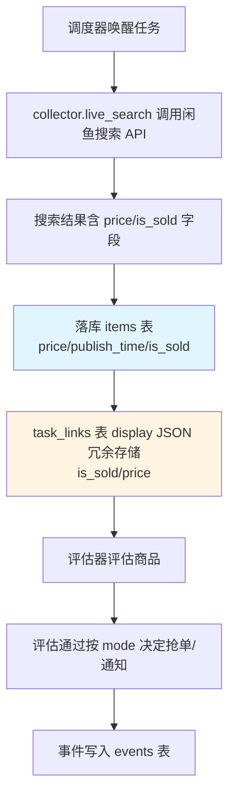
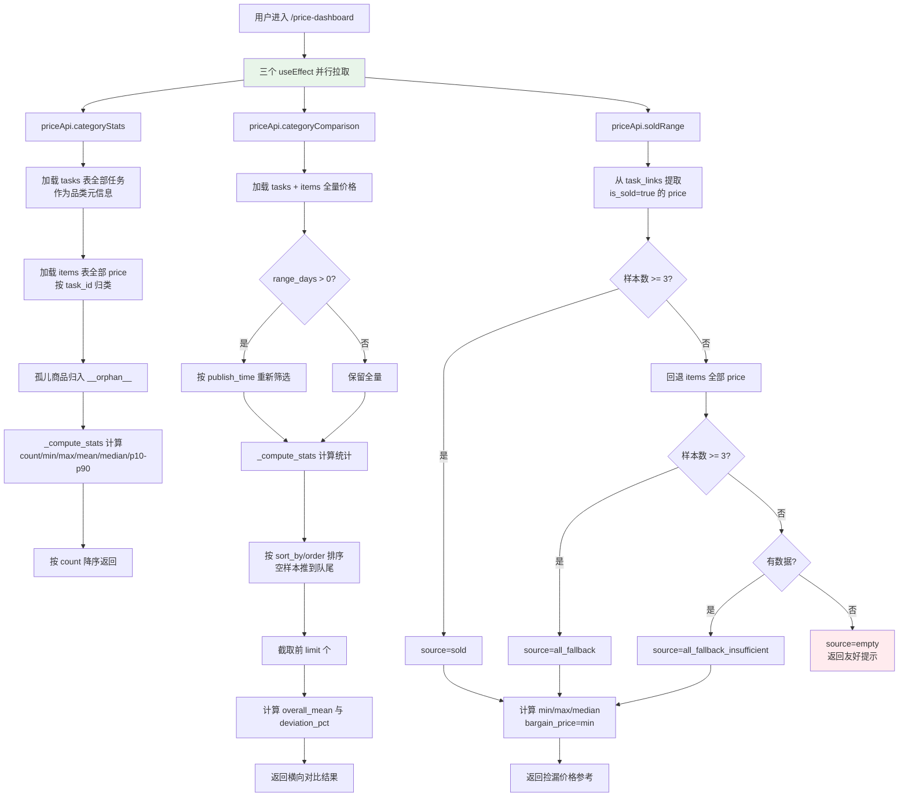
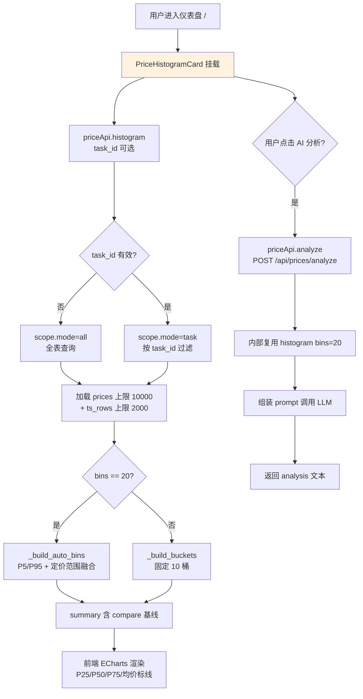

# 价格行情 详细设计文档

## 1. 文档元信息

| 属性     | 值                                       |
| -------- | ---------------------------------------- |
| 文档名称 | 价格行情-详细设计                        |
| 版本     | v1.0                                     |
| 发布日期 | 2026-07-05                               |
| 所属菜单 | 数据查看                                 |
| 关联路由 | `/price-dashboard`                       |
| 文档用途 | 开发团队技术指导 / 智能客服向量库训练素材 |
| 维护人   | XianyuHunter 团队                        |

> 本文档为首次发布版本。价格行情相关 API 分布在 3 个后端路由文件中：`price_dashboard.py`（3 端点，本菜单专属）、`price_histogram.py`（2 端点，仪表盘卡片复用）、`stats_price_trend.py`（1 端点，独立趋势基线）。本文档对全部 6 个端点统一描述，并在 §12 澄清"价格行情菜单"与"仪表盘价格直方图卡片"的边界。

---

## 2. 功能概述

**一句话说明**：按品类（任务）聚合商品价格样本，提供横向对比、分位数统计与捡漏价格参考，是用户判断"是否值得入手"的核心决策入口。

**核心价值**：
- 以任务为品类维度，将分散在 `items` 表中的商品价格聚合成可视化的行情视图；
- 提供均值 / 中位数 / P10/P25/P75/P90 等分位数指标，反映价格分布形态而非单一均值；
- 多品类横向对比，按均价 / 中位数 / 最低价 / 样本数等 9 个维度排序，标注偏离度；
- 捡漏价格参考：基于 `task_links` 中 `is_sold=true` 的已售商品近似成交价，给出"低于此价可捡漏"的参考阈值；
- 时间窗筛选（7/30/90 天）支持短期行情波动观察与长期趋势对比；
- 已售样本不足时自动回退到全量商品价格，避免无数据可看；
- 与仪表盘价格直方图卡片共用底层统计算法（线性插值分位数），保证口径一致。

---

## 3. 用户场景

### 场景一：横向对比品类价位
用户进入价格行情页面，默认按"均价降序"查看前 20 个品类的横向条形图。红色条表示该品类均价高于全体均价 5% 以上（偏贵），绿色表示低于 5% 以下（偏便宜），蓝色表示接近均价。用户据此判断哪些品类属于"高价区"，哪些品类值得加大监控力度。

### 场景二：捡漏价格查询
用户在"捡漏价格参考"卡片中选择某个品类（如"二手相机"），时间窗选"近 30 天"。系统从 `task_links` 中提取该品类下 `is_sold=true` 的已售商品价格，返回最低价/中位数/最高价/样本数。最低价即"捡漏价格"——后续监控任务命中的商品若低于此价，可视为捡漏机会。

### 场景三：品类统计明细查阅
用户展开"品类统计明细"表格，查看每个品类的样本数、最低价、最高价、均价、中位数、P10/P25/P75/P90 分位数。表格支持列排序，用户可按 P90 找出"高端价位段"品类，或按样本数找出"市场流通量大"的品类。

### 场景四：短期行情观察
用户在"品类横向对比"卡片中将时间窗从"全部时间"切换为"近 7 天"，观察哪些品类短期均价发生显著偏移。系统通过 `range_days` 参数基于 `publish_time` 重新筛选样本，保证统计口径与时间过滤一致。

### 场景五：已售样本不足时的回退
某新接入的品类尚无已售记录，`task_links` 中 `is_sold=true` 样本数为 0。系统自动回退到 `items` 表全部商品价格作为参考，并在响应中通过 `source_label` 标注"全部商品参考价（已售样本不足）"，让用户知晓数据来源。

---

## 4. 菜单元数据

菜单元数据单一事实源位于 `config/menu_registry.yaml`，`price_dashboard` 条目定义如下：

```yaml
- key: price_dashboard
  label: 价格行情
  icon: DollarOutlined
  path: /price-dashboard
  sort_order: 18
  default_visible: true
  category: data_view
```

| 属性           | 值                 | 说明                                  |
| -------------- | ------------------ | ------------------------------------- |
| key            | `price_dashboard`  | 全局唯一菜单标识                      |
| label          | 价格行情           | 侧边栏展示文本                        |
| icon           | `DollarOutlined`   | Ant Design 图标组件名                 |
| path           | `/price-dashboard` | 前端路由路径                          |
| sort_order     | 18                 | 在 `data_view` 分组内的排序权重       |
| default_visible| true               | 默认对所有用户可见                    |
| category       | `data_view`        | 所属分组（数据查看）                  |

> 菜单通过 `/api/menu` 接口动态下发，前端无需硬编码。新增/调整菜单只需修改 `config/menu_registry.yaml`，无需改后端代码。

---

## 5. 数据模型

价格行情 API 的数据来源是 `items` 表与 `task_links` 表（冗余的 `display` JSON），辅以 `tasks` 表提供品类元信息。`evaluations` 表的 `dimension_scores` JSON 中可能含"价格合理性"维度评分，但本组 API **未直接读取** evaluations 表——价格统计完全基于商品标价（`items.price`）与已售近似成交价（`task_links.display.price`）。

### 5.1 items 表价格相关字段（`db_models.py:98`）

| 字段           | 类型      | 必填 | 默认值    | 说明                                                     |
| -------------- | --------- | ---- | --------- | -------------------------------------------------------- |
| id             | String    | 是   | —         | 商品主键（闲鱼商品 ID）                                  |
| task_id        | String    | 否   | NULL      | 所属任务 ID（NULL 表示孤儿商品，归入"未分类"）          |
| price          | Float     | 是   | —         | 商品标价（单位：元），价格统计的核心数据源               |
| publish_time   | DateTime  | 否   | NULL      | 商品发布时间，用于时间窗筛选与趋势基线                   |
| first_seen     | DateTime  | 是   | `_utcnow` | 系统首次采集到该商品的时间                               |
| is_sold        | Integer   | 是   | 0         | 销售状态（0=在售，1=已售），由 buyer/collector 检测写入  |
| sold_detected_at | DateTime | 否   | NULL      | 检测到已售的时间戳                                       |
| data_source    | Text      | 是   | `search`  | 采集来源（search/official/live）                          |

**索引**：`ix_items_task_first_seen`（task_id + first_seen）、`ix_items_publish_time`、`ix_items_seller`。

### 5.2 task_links 表 display JSON 中的价格字段（`db_models.py:256`）

`task_links` 表本身不直接存储价格列，但 `display` 字段是 JSON 文本，冗余存储了采集时闲鱼搜索 API 返回的商品信息，其中包含：

| JSON 路径      | 类型   | 说明                                            |
| -------------- | ------ | ----------------------------------------------- |
| `$.is_sold`    | int    | 商品是否已售（1=已售，0=在售），SQLite `json_extract` 返回 1/0 |
| `$.price`      | number | 商品标价，近似视为成交价                         |

> **设计说明**：闲鱼不公开实际成交价。`is_sold=true` 表示商品已被买家拍下，其标价即近似成交价。`/api/prices/sold-range` 端点通过 `func.json_extract` 直接在 SQL 层提取这两个字段，避免全表加载到 Python 内存。

### 5.3 tasks 表品类元信息字段（`db_models.py:50`）

价格行情 API 用以下字段构造"品类"概念：

| 字段       | 类型    | 说明                                                  |
| ---------- | ------- | ----------------------------------------------------- |
| id         | String  | 任务 ID，作为品类标识                                  |
| name       | String  | 任务名称，作为品类展示名（fallback 到 keyword 或 id） |
| keyword    | String  | 搜索关键词，作为品类展示名的次要 fallback              |
| min_price  | Float   | 任务定价下限，用于直方图分桶范围校准                   |
| max_price  | Float   | 任务定价上限，用于直方图分桶范围校准                   |

### 5.4 evaluations 表（`db_models.py:154`，本组 API 未直接读取）

| 字段              | 类型    | 说明                                                       |
| ----------------- | ------- | ---------------------------------------------------------- |
| id                | Integer | 主键                                                       |
| item_id           | String  | 关联 items.id                                              |
| seller_id         | String  | 关联 sellers.id                                            |
| score             | Integer | 综合评分（0-100）                                          |
| risk_level        | String  | 风险等级                                                   |
| dimension_scores  | Text    | JSON，各维度评分（可能含"价格合理性"维度，但本组 API 未用）|

> 价格行情 API 的统计完全基于商品标价，不涉及评估维度的价格评分。该表此处仅作数据模型完整性说明。

---

## 6. API 端点清单

价格行情相关 API 分布在 3 个后端路由文件中，共 6 个端点：

| 文件                      | prefix  | tag              | 端点数 | 本菜单直接使用 |
| ------------------------- | ------- | ---------------- | ------ | -------------- |
| `price_dashboard.py`      | `/api`  | `price-dashboard`| 3      | 是（全部 3 个）|
| `price_histogram.py`      | `/api`  | `prices`         | 2      | 否（仪表盘复用）|
| `stats_price_trend.py`    | `/api`  | `price-trend`    | 1      | 否（独立趋势） |

### 6.1 端点总览

| 方法 | 路径                              | 文件                   | 用途                              | 本菜单使用 |
| ---- | --------------------------------- | ---------------------- | --------------------------------- | ---------- |
| GET  | `/api/prices/category-stats`      | `price_dashboard.py`   | 单品类或全品类价格统计            | ✅         |
| GET  | `/api/prices/category-comparison` | `price_dashboard.py`   | 多品类横向对比                    | ✅         |
| GET  | `/api/prices/sold-range`          | `price_dashboard.py`   | 同类物品已售价格区间（捡漏参考）  | ✅         |
| GET  | `/api/prices/histogram`           | `price_histogram.py`   | 价格分档直方图（含分位数+时间对比）| ❌（仪表盘）|
| POST | `/api/prices/analyze`             | `price_histogram.py`   | LLM 生成价格分析建议              | ❌（仪表盘）|
| GET  | `/api/stats/price-trend`          | `stats_price_trend.py` | 今日/7日/30日均价 + 涨跌幅        | ❌（独立）|

> **关键说明**：本菜单（`/price-dashboard`）前端 `PriceDashboard/index.tsx` **仅调用前 3 个端点**（`categoryStats`/`categoryComparison`/`soldRange`）。后 3 个端点（`histogram`/`analyze`/`price-trend`）由仪表盘（`/`）的 `PriceHistogramCard` 组件复用，详见 §12 边界澄清。

---

### 6.2 GET `/api/prices/category-stats` —— 单品类或全品类价格统计

**文件**：`src/xianyu_hunter/web/routes/price_dashboard.py`

**请求参数**：

| 参数    | 位置  | 类型   | 必填 | 默认值 | 说明                                       |
| ------- | ----- | ------ | ---- | ------ | ------------------------------------------ |
| task_id | Query | string | 否   | None   | 任务 ID；不传则返回全部品类的统计          |

**响应字段**：

```json
{
  "categories": [
    {
      "task_id": "t1234abcd",
      "name": "二手相机监控",
      "keyword": "相机",
      "count": 156,
      "min": 80.0,
      "max": 8500.0,
      "mean": 1250.5,
      "median": 980.0,
      "p10": 150.0,
      "p25": 480.0,
      "p75": 1850.0,
      "p90": 3200.0
    }
  ],
  "total_count": 156
}
```

| 字段                  | 类型    | 说明                                              |
| --------------------- | ------- | ------------------------------------------------- |
| categories            | array   | 品类统计列表，按样本数降序                        |
| categories[].task_id  | string  | 任务 ID（"未分类"孤儿商品归入 `__orphan__`，返回时为 null）|
| categories[].name     | string  | 品类名（任务 name，fallback 到 keyword 或 id）    |
| categories[].keyword  | string  | 搜索关键词                                        |
| categories[].count    | int     | 样本数                                            |
| categories[].min      | float   | 历史最低价                                        |
| categories[].max      | float   | 历史最高价                                        |
| categories[].mean     | float   | 均价                                              |
| categories[].median   | float   | 中位数（P50）                                     |
| categories[].p10      | float   | 10 分位数（低端价位参考）                         |
| categories[].p25      | float   | 25 分位数                                         |
| categories[].p75      | float   | 75 分位数                                         |
| categories[].p90      | float   | 90 分位数（高端价位参考）                         |
| total_count           | int     | 所有品类的样本总数                                |

**业务规则**：
- 分位数采用**线性插值法**（`_percentile` 函数），与 `price_histogram.py` 算法一致；
- `task_id` 为 NULL 或任务不存在的商品归入"未分类"类别（`__orphan__`），仅在全量查询时出现；
- `task_id` 参数非空时只返回该单一品类的统计（不返回"未分类"）；
- 列表按 `count` 降序排列，便于前端优先展示主流品类。

---

### 6.3 GET `/api/prices/category-comparison` —— 多品类横向对比

**文件**：`src/xianyu_hunter/web/routes/price_dashboard.py`

**请求参数**：

| 参数       | 位置  | 类型   | 必填 | 默认值 | 校验                           | 说明                                  |
| ---------- | ----- | ------ | ---- | ------ | ------------------------------ | ------------------------------------- |
| sort_by    | Query | string | 否   | `mean` | 白名单见下                     | 排序字段                              |
| order      | Query | string | 否   | `asc`  | `asc` / `desc`                 | 排序方向                              |
| limit      | Query | int    | 否   | 20     | ge=1, le=100                   | 最多返回品类数                        |
| range_days | Query | int    | 否   | 0      | ge=0                           | 仅统计最近 N 天商品；0=全部           |

**`sort_by` 白名单**（`_ALLOWED_COMPARISON_SORT`）：`mean` / `median` / `min` / `max` / `p10` / `p25` / `p75` / `p90` / `count`，共 9 个字段。非法值回退到 `mean`，不抛错。

**响应字段**：

```json
{
  "categories": [
    {
      "task_id": "t1234abcd",
      "name": "二手相机监控",
      "keyword": "相机",
      "count": 156,
      "min": 80.0, "max": 8500.0,
      "mean": 1250.5, "median": 980.0,
      "p10": 150.0, "p25": 480.0, "p75": 1850.0, "p90": 3200.0,
      "deviation_pct": 12.3
    }
  ],
  "overall_mean": 1113.5,
  "sort_by": "mean",
  "order": "desc",
  "range_days": 0,
  "total_categories": 20
}
```

| 字段                          | 类型   | 说明                                                  |
| ----------------------------- | ------ | ----------------------------------------------------- |
| categories                    | array  | 排序后的前 `limit` 个品类                             |
| categories[].deviation_pct    | float  | 相对全体均价的偏离度百分比（正=高于均价，负=低于均价）|
| overall_mean                  | float  | 全体品类均价（按每个品类均值加权，单品类最多 100 样本）|
| sort_by / order / range_days  | —      | 回显请求参数                                          |
| total_categories              | int    | 实际返回的品类数（截取后）                            |

**业务规则**：
- `range_days > 0` 时基于 `publish_time` 重新筛选样本（`_filter_category_prices_by_range` 原地清空 prices 后重填，保证口径一致）；
- 排序时空样本根据方向推到队尾（升序→`+inf`，降序→`-inf`），避免 0 值干扰排序；
- `overall_mean` 计算时每个品类最多取 100 个样本（避免大品类压倒小品类）。

---

### 6.4 GET `/api/prices/sold-range` —— 同类物品已售价格区间（捡漏参考）

**文件**：`src/xianyu_hunter/web/routes/price_dashboard.py`

**请求参数**：

| 参数       | 位置  | 类型   | 必填 | 默认值 | 校验     | 说明                                  |
| ---------- | ----- | ------ | ---- | ------ | -------- | ------------------------------------- |
| task_id    | Query | string | 否   | None   | —        | 任务 ID；不传则统计全部任务           |
| range_days | Query | int    | 否   | 30     | ge=0     | 仅统计最近 N 天；0=全部，默认 30 天   |

**响应字段**（有数据时）：

```json
{
  "min_price": 120.0,
  "max_price": 5800.0,
  "median_price": 950.0,
  "bargain_price": 120.0,
  "sample_size": 42,
  "source": "sold",
  "source_label": "已售商品成交价",
  "task_id": "t1234abcd",
  "range_days": 30
}
```

**响应字段**（无数据时）：

```json
{
  "min_price": null,
  "max_price": null,
  "median_price": null,
  "bargain_price": null,
  "sample_size": 0,
  "source": "empty",
  "task_id": null,
  "range_days": 30,
  "message": "暂无同类物品的已售价格数据，建议先执行实时搜索采集更多商品"
}
```

| 字段          | 类型    | 说明                                                                |
| ------------- | ------- | ------------------------------------------------------------------- |
| min_price     | float   | 已售商品最低价                                                      |
| max_price     | float   | 已售商品最高价                                                      |
| median_price  | float   | 已售商品中位数                                                      |
| bargain_price | float   | 捡漏价格 = `min_price`（低于此价视为捡漏机会）                      |
| sample_size   | int     | 样本数                                                              |
| source        | string  | 数据源标识：`sold`/`all_fallback`/`all_fallback_insufficient`/`empty`|
| source_label  | string  | 数据源中文标签（`source != empty` 时返回）                          |
| message       | string  | 无数据时的友好提示（`source == empty` 时返回）                      |

**数据来源策略**（`_MIN_SOLD_SAMPLES = 3`）：
1. **优先**从 `task_links` 表加载 `is_sold=true` 的商品价格（近似成交价），SQL 限制 5000 行防止全表扫描撑爆内存；
2. 已售样本不足（<3）时**回退**到 `items` 表全部商品价格（市场参考价），`source=all_fallback`；
3. 全部商品样本也不足时仍返回，`source=all_fallback_insufficient`；
4. 两者均无数据时返回 `source=empty` 与友好提示。

---

### 6.5 GET `/api/prices/histogram` —— 价格分档直方图（仪表盘复用）

**文件**：`src/xianyu_hunter/web/routes/price_histogram.py`

> 本端点由仪表盘（`/`）的 `PriceHistogramCard` 组件调用，**不属于本菜单前端直接使用**，但因其属于价格行情相关 API 且与本菜单统计口径一致，故在此描述。详见 §12 边界澄清。

**请求参数**：

| 参数    | 位置  | 类型   | 必填 | 默认值 | 说明                                                       |
| ------- | ----- | ------ | ---- | ------ | ---------------------------------------------------------- |
| bins    | Query | int    | 否   | 0      | 0=固定刻度分桶；20=自动分桶（P5/P95 裁剪 + 任务定价范围融合）|
| task_id | Query | string | 否   | None   | 任务 ID；`all` 或不传=全部任务                              |

**响应字段**：

```json
{
  "bins": [
    { "min": 0, "max": 50, "count": 12 },
    { "min": 50, "max": 100, "count": 28 }
  ],
  "summary": {
    "count": 156,
    "min": 80.0, "max": 8500.0,
    "mean": 1250.5, "median": 980.0,
    "p25": 480.0, "p75": 1850.0,
    "compare": { "yesterday": 1180.0, "last7d": 1220.0, "last30d": 1190.0, "diff_pct": -3.3 },
    "task_price_range": { "min_price": 500.0, "max_price": 2000.0 }
  },
  "scope": { "mode": "task", "task_id": "t1234abcd", "task_name": "相机", "keyword": "相机", "label": "相机（t1234abcd）" },
  "mode": "fixed"
}
```

| 字段                     | 类型   | 说明                                              |
| ------------------------ | ------ | ------------------------------------------------- |
| bins                     | array  | 分桶列表，每项含 `min`/`max`/`count`              |
| bins[].max               | number | 桶上界；尾桶为 `null` 表示开区间（≥min）          |
| summary.count            | int    | 样本总数                                          |
| summary.min / max        | float  | 真实最低/最高价（非分桶边界）                     |
| summary.mean / median    | float  | 均价 / 中位数                                     |
| summary.p25 / p75        | float  | 25 / 75 分位数                                    |
| summary.compare          | object | 时间对比基线：`yesterday`/`last7d`/`last30d`/`diff_pct` |
| summary.task_price_range | object | 任务定价范围（min_price/max_price，可空）         |
| scope                    | object | 查询范围：`mode`（all/task）+ 任务元信息 + `label`|
| mode                     | string | `fixed`（固定刻度）或 `auto`（自动分桶）          |

**业务规则**：
- **固定刻度分桶**（`bins=0`，默认）：使用预定义的 `_PRICE_TICKS = [0, 50, 100, 200, 500, 1000, 2000, 5000, 10000, 20000]` 共 10 个桶；
- **自动分桶**（`bins=20`）：用 P5/P95 裁剪极端值，融合任务定价范围（min_price/max_price）确定分桶边界 [lo, hi]，首尾桶吸收范围外极端值，保证商品计数不丢失；
- **时间对比基线**：基于 `publish_time` 计算"昨日 / 7 日 / 30 日"均价，`diff_pct` = (今日 - 7日) / 7日 × 100；
- **任务不存在**时返回空 bins，scope.label 标注"任务 {id}（不存在）"；
- **样本上限**：`prices` 限制 10000 行，`ts_rows` 限制 2000 行，防止大表撑爆内存。

---

### 6.6 POST `/api/prices/analyze` —— LLM 生成价格分析建议（仪表盘复用）

**文件**：`src/xianyu_hunter/web/routes/price_histogram.py`

> 本端点由仪表盘的 `PriceHistogramCard` 组件调用，**不属于本菜单前端直接使用**。

**请求参数**：

| 参数    | 位置  | 类型   | 必填 | 默认值 | 说明                |
| ------- | ----- | ------ | ---- | ------ | ------------------- |
| task_id | Query | string | 否   | None   | 任务 ID             |

**请求体**：无（POST 但 body 为 null，参数走 Query）。

**响应字段**：

```json
{
  "analysis": "价格分布右偏，存在少量高价商品拉高均值...",
  "source": "ai",
  "scope_label": "相机（t1234abcd）"
}
```

| 字段        | 类型   | 说明                                                        |
| ----------- | ------ | ----------------------------------------------------------- |
| analysis    | string | LLM 生成的中文分析建议                      |
| source      | string | `ai` / `error` / `empty`                                    |
| scope_label | string | 数据范围标签（`source=ai` 时返回）                          |

**业务规则**：
- 内部复用 `prices_histogram(bins=20)` 获取统计数据；
- 检查 `openai_api_key` 配置，未配置返回 `source=error` 提示；
- 检查 AI 预算（`check_budget`），超限返回 `source=error`；
- 调用 LLM 时 `temperature=0.3`、`max_tokens=800`、超时 30s；
- 网络错误/超时/格式异常均返回 `source=error` 与友好提示，不抛异常；
- 成功时记录 AI 用量（`record_usage("price_analyze", ...)`）。

---

### 6.7 GET `/api/stats/price-trend` —— 价格趋势对比基线（独立）

**文件**：`src/xianyu_hunter/web/routes/stats_price_trend.py`

> 本端点独立于 `/api/prices/*` 命名空间，归在 `/api/stats/*` 下，供未来独立趋势图组件或第三方集成使用。本菜单前端未直接调用。

**请求参数**：

| 参数    | 位置  | 类型   | 必填 | 默认值 | 说明                                       |
| ------- | ----- | ------ | ---- | ------ | ------------------------------------------ |
| task_id | Query | string | 否   | None   | 任务 ID；`all` 或不传=全部任务              |

**响应字段**：

```json
{
  "task_id": "t1234abcd",
  "generated_at": "2026-07-05T12:34:56",
  "today_avg": 1180.0,
  "d7_avg": 1220.0,
  "d30_avg": 1190.0,
  "delta_pct_7d": -3.3,
  "delta_pct_30d": -0.8,
  "sample_size": { "today": 28, "d7": 156, "d30": 480 }
}
```

| 字段            | 类型   | 说明                                          |
| --------------- | ------ | --------------------------------------------- |
| task_id         | string | 任务 ID（回显）                               |
| generated_at    | string | 生成时间（ISO 8601，秒精度）                  |
| today_avg       | float  | 今日均价（基于 publish_time ≥ now-1d）         |
| d7_avg          | float  | 7 日均价                                      |
| d30_avg         | float  | 30 日均价                                     |
| delta_pct_7d    | float  | 今日相对 7 日均价的涨跌幅（%）                |
| delta_pct_30d   | float  | 今日相对 30 日均价的涨跌幅（%）               |
| sample_size     | object | 各时间窗样本数：`today`/`d7`/`d30`            |

**业务规则**：
- 数据源：`items` 表 `publish_time` 字段（商品发布时间）；
- 拉取最近 2000 条带时间的价格样本，与 `price_histogram._build_compare_means` 口径一致；
- 涨跌幅计算规避 division by zero（`baseline <= 0` 或 `current <= 0` 时返回 0.0）；
- 透明返回各时间窗样本数，让调用方判断数据可信度。

---

## 7. 价格行情概览

本菜单（`/price-dashboard`）的概览数据由三个独立请求并行拉取，分别支撑三个卡片模块：

| 模块 | 卡片标题           | 调用 API                          | 数据组成                                                |
| ---- | ------------------ | --------------------------------- | ------------------------------------------------------- |
| A    | 品类横向对比       | `priceApi.categoryComparison`     | 前 20 个品类的统计指标 + 偏离度 + 全体均价基线          |
| B    | 捡漏价格参考       | `priceApi.soldRange`              | 已售商品最低价/中位数/最高价 + 数据来源标签            |
| C    | 品类统计明细       | `priceApi.categoryStats`          | 全部品类的统计明细（不排序，前端表格分页）             |

> 三个模块**互相独立**，无依赖关系，前端通过三个 `useEffect` 并行拉取，互不阻塞。模块 A/B 的工具栏各自维护筛选状态（`sortBy`/`order`/`rangeDays` 与 `soldTaskId`/`soldRangeDays`）。

---

## 8. 价格直方图

> 本节描述的直方图端点（`/api/prices/histogram`）由**仪表盘**的 `PriceHistogramCard` 调用，**本菜单前端未直接使用**。此处仅作算法说明，便于理解本菜单与仪表盘的统计口径一致性。

### 8.1 固定刻度分桶（bins=0，默认）

使用预定义的 `_PRICE_TICKS = [0, 50, 100, 200, 500, 1000, 2000, 5000, 10000, 20000]` 共 10 个桶，桶边界固定便于不同次请求对比。每个桶统计落入 `[lo, hi)` 区间的商品数；尾桶为开区间 `[20000, +∞)`，响应中 `max=null`。

### 8.2 自动分桶（bins=20）

`_compute_auto_bins_bounds` 算法：
1. 计算 P5/P95 百分位，作为分桶范围的初始上下界；
2. 融合任务定价范围（`min_price`/`max_price`）：
   - 下界 = `min(P5, task.min_price)`，确保覆盖任务定价下限；
   - 上界 = `max(P95, task.max_price)`，确保覆盖任务定价上限；
3. 下界 `lo = max(0.0, lo)`，避免负值；
4. 若 `hi <= lo`，强制 `hi = lo + 1`；
5. 等宽分为 20 桶，首桶吸收所有 `< b_hi` 的极端低价，尾桶吸收所有 `>= b_lo` 的极端高价，保证商品计数不丢失。

### 8.3 分位数算法

`_percentile(sorted_prices, p)` 采用**线性插值法**（per NumPy 默认算法）：
- `rank = p * (n - 1)`；
- `lo = floor(rank)`，`hi = ceil(rank)`；
- 若 `lo == hi` 返回 `sorted_prices[lo]`；
- 否则返回 `sorted_prices[lo] * (1 - frac) + sorted_prices[hi] * frac`，`frac = rank - lo`。

> 该算法在 `price_dashboard.py` 与 `price_histogram.py` 中**完全一致**（两文件各自实现，但代码相同），保证品类统计与直方图分位数口径统一。

### 8.4 时间对比基线

`_build_compare_means(all_rows_with_ts)`：
- 按 `publish_time` 将样本分到"昨日（≥now-1d）"、"7 日（≥now-7d）"、"30 日（≥now-30d）"三个桶；
- 各桶独立计算均价；
- `diff_pct = (yesterday - last7d) / last7d × 100`，仅当两者均 > 0 时计算，否则为 0.0。

> **关键修复（P-09-30）**：`ts_rows` 必须与 `prices` 同源——按 `task_id` 过滤。修复前 `ts_rows` 为全表查询，导致选定任务时基线混入其它任务价格，时间对比指标完全失真。

---

## 9. 价格趋势

> 本节描述的端点（`/api/stats/price-trend`）独立于 `/api/prices/*`，本菜单前端未直接调用。

### 9.1 时间序列聚合

`stats_price_trend.py` 的 `price_trend` 函数：
1. 计算 `now`、`yesterday_start = now - 1d`、`week_start = now - 7d`、`month_start = now - 30d`；
2. 从 `items` 表拉取最近 2000 条带 `publish_time` 的价格样本（`task_id` 非空且非 `all` 时按任务过滤）；
3. 遍历样本，按 `publish_time` 分到 `today_prices`/`week_prices`/`month_prices` 三个列表（一个样本可能同时落入多个时间窗）；
4. 各列表独立计算均值（`_safe_mean`，空列表返回 0.0）；
5. 涨跌幅 `_safe_diff(current, baseline)`：`baseline <= 0` 或 `current <= 0` 时返回 0.0，否则 `round((current - baseline) / baseline * 100, 1)`。

### 9.2 与直方图 compare 字段的关系

| 来源                          | 字段               | 用途                                  |
| ----------------------------- | ------------------ | ------------------------------------- |
| `/api/prices/histogram`       | `summary.compare`  | 仪表盘 PriceHistogramCard 复用        |
| `/api/stats/price-trend`      | 顶层字段           | 独立趋势图组件或第三方集成            |

> 两者算法与口径**完全一致**（都基于 `publish_time` 分桶 + 均值），区别仅在响应结构。`stats_price_trend.py` 文件头注释明确："`PriceHistogramCard` 继续复用 histogram 的 compare 字段，避免重复查询"。

---

## 10. 业务流程

### 10.1 数据采集与价格提取流程



### 10.2 价格行情统计流程（本菜单）



### 10.3 仪表盘价格直方图流程（不属于本菜单，仅供参考）



---

## 11. 前端组件结构

### 11.1 组件树

```
PriceDashboard (frontend/src/pages/PriceDashboard/index.tsx)
├── 顶部说明 Alert
│   └── "价格行情看板" 提示文案
├── 模块 A：品类横向对比 Card
│   ├── 工具栏（sort_by 下拉 / order 下拉 / range_days 下拉 / 刷新按钮）
│   ├── ReactECharts 横向条形图
│   │   ├── y 轴：品类名（截断 12 字符）
│   │   ├── x 轴：均价（>1000 用 k 简写）
│   │   ├── 条形颜色：红（>+5%）/ 绿（<-5%）/ 蓝（接近均价）
│   │   └── markLine：全体均价基线（虚线）
│   └── 图例说明（红/绿/蓝色含义）
├── 模块 B：捡漏价格参考 Card
│   ├── 工具栏（品类下拉 / 时间窗下拉 / 刷新按钮）
│   ├── 4 个 Statistic 卡片
│   │   ├── 捡漏价格（绿色，附"低于此价可捡漏"说明）
│   │   ├── 最低价
│   │   ├── 中位数
│   │   └── 最高价
│   └── 底部标签（样本数 + 数据来源）
└── 模块 C：品类统计明细 Card
    ├── 工具栏（共 N 件商品 · M 个品类 + 刷新按钮）
    └── Table（10 列：品类/样本数/最低价/最高价/均价/中位数/P25/P75/P10/P90）
        ├── 列排序（前 6 列支持 sorter）
        └── 分页（pageSize=10，不支持切换页大小）
```

### 11.2 主要交互

| 区域             | 交互行为                                                                                  |
| ---------------- | ----------------------------------------------------------------------------------------- |
| 模块 A 工具栏    | `sort_by`/`order`/`range_days` 任一变化触发 `useEffect` 重新拉取对比数据                  |
| 模块 A 条形图    | 鼠标悬停 tooltip 显示该品类的样本数/均价/中位数/最低最高/P25~P75/偏离度                    |
| 模块 A 颜色映射  | `deviation_pct > 5` 红色（贵）/ `< -5` 绿色（便宜）/ 其余蓝色（接近均价）                 |
| 模块 B 品类下拉  | 从 `taskApi.list({limit:200})` 拉取任务列表，`allowClear` 支持清空（统计全部任务）         |
| 模块 B 时间窗    | 仅展示 7/30/90 天选项（过滤掉"全部时间"），因捡漏参考需要时间窗才有意义                   |
| 模块 B 空状态    | `sample_size == 0` 时显示 Empty + `message` 字段提示                                      |
| 模块 C 表格      | `rowKey` 使用 `task_id || '__orphan__'`；列排序在前端完成（非服务端排序）                 |
| 价格格式化       | `formatPrice`：`<1000` 显示 `¥xxx`，`≥1000` 显示 `¥x.xk`；null/NaN 显示 `—`              |
| 刷新按钮         | 三个模块各自独立刷新，互不影响                                                            |

### 11.3 前端 API 封装

前端 API 定义在 `frontend/src/api/price.ts`，导出 `priceApi` 对象：

| 方法              | 路径                              | 用途                |
| ----------------- | --------------------------------- | ------------------- |
| `histogram`       | `GET /api/prices/histogram`       | 直方图（仪表盘用）  |
| `categoryStats`   | `GET /api/prices/category-stats`  | 品类统计（本菜单）  |
| `categoryComparison` | `GET /api/prices/category-comparison` | 横向对比（本菜单）|
| `analyze`         | `POST /api/prices/analyze`        | AI 分析（仪表盘用，超时 60s） |
| `soldRange`       | `GET /api/prices/sold-range`      | 捡漏参考（本菜单）  |

> 价格趋势端点 `/api/stats/price-trend` 封装在 `frontend/src/api/stats.ts` 的 `statsApi.priceTrend`，不在 `priceApi` 中。

---

## 12. 价格行情 vs Dashboard 价格直方图卡片 边界澄清

### 12.1 边界对照表

| 维度         | 价格行情菜单                          | 仪表盘价格直方图卡片                    |
| ------------ | ------------------------------------- | --------------------------------------- |
| 路由         | `/price-dashboard`                    | `/`（仪表盘主页）                       |
| 菜单 key     | `price_dashboard`                     | `dashboard`                             |
| 前端组件     | `pages/PriceDashboard/index.tsx`      | `pages/Dashboard/components/PriceHistogramCard.tsx` |
| 调用 API     | `categoryStats` / `categoryComparison` / `soldRange` | `histogram` / `analyze`        |
| 视角         | **多品类横向对比**（跨任务）          | **单品类纵向分布**（单任务或全部）      |
| 核心图表     | 横向条形图（品类 × 均价）             | 纵向直方图（价格区间 × 商品数）         |
| 是否含 AI    | 否                                    | 是（`/api/prices/analyze`）             |
| 是否含捡漏   | 是（`/api/prices/sold-range`）        | 否                                      |
| 是否含趋势   | 否（本菜单前端未直接调用 price-trend）| 是（复用 histogram 的 compare 字段）    |

### 12.2 关键澄清

1. **本菜单（`/price-dashboard`）是独立的价格行情页面**，关注"跨品类的横向对比"与"捡漏价格参考"，不展示单品类的价格分布直方图；
2. **仪表盘（`/`）中的 `PriceHistogramCard` 是仪表盘的组成部分**，关注"单品类的价格分布形态"与"AI 分析建议"，**不属于本菜单**；
3. 两者共用底层统计算法（线性插值分位数、`_percentile` 函数代码相同），但 API 端点、前端组件、菜单归属完全独立；
4. `/api/stats/price-trend` 是独立的价格趋势基线端点，目前**无前端组件直接调用**（`PriceHistogramCard` 复用 `histogram` 的 `compare` 字段），供未来独立趋势图或第三方集成使用。

---

## 13. 关键依赖与下游影响

### 13.1 上游依赖

| 依赖项                          | 说明                                                                 |
| ------------------------------- | -------------------------------------------------------------------- |
| `items` 表                      | 价格样本核心数据源（`price`/`publish_time`/`task_id`/`is_sold`）     |
| `task_links` 表 `display` JSON  | 已售商品近似成交价来源（`$.is_sold`/`$.price`）                      |
| `tasks` 表                      | 品类元信息（`name`/`keyword`）与定价范围（`min_price`/`max_price`）  |
| `config/menu_registry.yaml`     | 菜单元数据单一事实源                                                 |
| `xianyu_hunter.container.Container` | 依赖注入容器，提供 `repo.engine` 数据库引擎                     |
| `xianyu_hunter.config.get_settings` | AI 分析端点依赖全局配置（`openai_api_key`/`openai_base_url`/`openai_model`）|
| `xianyu_hunter.infra.ai_usage`  | AI 预算检查（`check_budget`）与用量记录（`record_usage`）            |

### 13.2 下游影响

| 下游模块                  | 影响说明                                                                |
| ------------------------- | ----------------------------------------------------------------------- |
| 仪表盘 `PriceHistogramCard`| 复用 `price_histogram.py` 的 `histogram`/`analyze` 端点，本菜单改动不影响|
| 前端 `api/price.ts`       | 共用 `priceApi` 对象，新增端点需在此文件追加                            |
| 前端 `api/stats.ts`       | `statsApi.priceTrend` 独立封装，与 `priceApi` 解耦                      |
| AI 用量统计               | `/api/prices/analyze` 调用会记录到 `ai_usage` 表，影响 AI 预算统计      |

### 13.3 关键代码位置

| 模块                  | 文件路径                                                                                                |
| --------------------- | ------------------------------------------------------------------------------------------------------- |
| 品类统计 API          | `src/xianyu_hunter/web/routes/price_dashboard.py`                                                       |
| 价格直方图 API        | `src/xianyu_hunter/web/routes/price_histogram.py`                                                       |
| 价格趋势 API          | `src/xianyu_hunter/web/routes/stats_price_trend.py`                                                     |
| DB 模型               | `src/xianyu_hunter/infra/db_models.py`（ItemRow:98 / TaskRow:50 / TaskLinkRow:256）                     |
| 菜单元数据            | `config/menu_registry.yaml`（`price_dashboard` 条目）                                                   |
| 前端主页面            | `frontend/src/pages/PriceDashboard/index.tsx`                                                           |
| 仪表盘直方图卡片      | `frontend/src/pages/Dashboard/components/PriceHistogramCard.tsx`                                        |
| 前端 price API        | `frontend/src/api/price.ts`                                                                             |
| 前端 stats API        | `frontend/src/api/stats.ts`                                                                             |

---

## 14. 常见问题 FAQ

### Q1：价格行情菜单和仪表盘的价格直方图卡片有什么区别？
**A**：价格行情菜单（`/price-dashboard`）关注**跨品类横向对比**与**捡漏价格参考**，调用 `category-stats`/`category-comparison`/`sold-range` 三个端点；仪表盘的价格直方图卡片（`/` 路径下）关注**单品类纵向分布**与 **AI 分析**，调用 `histogram`/`analyze` 端点。两者共用底层分位数算法但 API、组件、菜单归属完全独立。详见 §12。

### Q2：分位数是怎么计算的？
**A**：采用**线性插值法**（per NumPy 默认算法）：`rank = p * (n - 1)`，在 `sorted_prices[lo]` 与 `sorted_prices[hi]` 之间按 `frac = rank - lo` 线性插值。该算法在 `price_dashboard.py` 与 `price_histogram.py` 中代码完全一致，保证口径统一。

### Q3：捡漏价格的"已售"数据从哪来？
**A**：从 `task_links` 表的 `display` JSON 字段中提取。闲鱼搜索 API 返回的 `is_sold` 字段冗余存储在 `display` 中，通过 SQLite `func.json_extract(display, '$.is_sold')` 在 SQL 层提取。`is_sold=true` 的商品标价近似视为成交价。闲鱼不公开实际成交价。

### Q4：已售样本不足时怎么办？
**A**：当已售样本数 < 3（`_MIN_SOLD_SAMPLES`）时，自动回退到 `items` 表全部商品价格作为参考，响应中 `source` 字段标注 `all_fallback`（样本充足）或 `all_fallback_insufficient`（样本仍不足）。两者均无数据时返回 `source=empty` 与友好提示。

### Q5：为什么 `category-comparison` 的 `overall_mean` 不是简单全局均值？
**A**：`overall_mean` 计算时每个品类最多取 100 个样本（`min(c["count"], 100)`），避免大品类（如样本数 5000）压倒小品类（如样本数 20）。这是一种"品类等权"的近似，让偏离度指标对小品类更公平。

### Q6：`sort_by` 参数支持哪些字段？
**A**：白名单共 9 个字段：`mean`/`median`/`min`/`max`/`p10`/`p25`/`p75`/`p90`/`count`。非法值回退到 `mean`，不抛错——这是为了让前端传错参数时仍能展示数据，而非返回 422 阻断用户体验。

### Q7：`range_days` 参数在 `category-stats` 和 `category-comparison` 中行为一致吗？
**A**：**不一致**。`category-stats` 端点**不接受** `range_days` 参数（始终统计全量）；`category-comparison` 端点接受 `range_days`，`>0` 时通过 `_filter_category_prices_by_range` 基于 `publish_time` 重新筛选样本。前端 `priceApi.categoryStats` 的 TS 签名中虽含 `range_hours`，但后端实际忽略。

### Q8：直方图的 `bins=20` 自动分桶为什么用 P5/P95 而不是 min/max？
**A**：旧逻辑用 `min(prices)`/`max(prices)` 作为分桶范围，单个异常高价（如 5000）会把范围拉到 5000，而任务实际定价范围可能只有 100~1000，导致前 2 个桶装着大部分商品、其余全为 0。新逻辑用 P5/P95 裁剪极端值，并融合任务定价范围确定边界，首尾桶吸收范围外的极端值保证计数不丢失。

### Q9：`/api/stats/price-trend` 端点为什么归在 `/api/stats` 而不是 `/api/prices`？
**A**：该端点设计为独立的趋势基线，供未来独立趋势图组件或第三方集成使用，不依赖直方图数据结构。文件头注释明确："`PriceHistogramCard` 继续复用 histogram 的 compare 字段，避免重复查询"——即仪表盘不会调用此端点，避免冗余查询。

### Q10：AI 分析端点为什么会失败？
**A**：失败场景有四种，均返回 `source=error` 与友好提示，不抛异常：
1. 未配置 `openai_api_key`（提示去"AI 服务"配置页设置）；
2. AI 预算超限（`check_budget` 返回 false）；
3. 网络超时（30s）或 HTTP 错误；
4. LLM 返回格式异常（`choices[0].message.content` 缺失或 JSON 解析失败）。

### Q11：孤儿商品（task_id 为 NULL）如何处理？
**A**：`category-stats` 与 `category-comparison` 在全量查询时，将 `task_id` 为 NULL 或任务不存在的商品归入 `__orphan__` 类别，展示名为"未分类"。响应中该类别的 `task_id` 字段为 `null`。指定 `task_id` 查询时不返回"未分类"。

### Q12：前端 `PriceDashboard` 为什么不调用 `histogram` 端点？
**A**：本菜单定位是"跨品类横向对比 + 捡漏参考"，单品类纵向分布由仪表盘的 `PriceHistogramCard` 承担。两个页面视角互补：本菜单回答"哪些品类贵/便宜"，仪表盘回答"某品类内部价格如何分布"。

---

## 15. 变更记录

| 版本 | 日期       | 变更内容                                                                                      |
| ---- | ---------- | --------------------------------------------------------------------------------------------- |
| v1.0 | 2026-07-05 | 首版发布。覆盖 3 个后端路由文件共 6 个端点（`price_dashboard.py` 3 个 + `price_histogram.py` 2 个 + `stats_price_trend.py` 1 个）；描述 `items`/`task_links`/`tasks`/`evaluations` 四张表的价格相关字段；澄清价格行情菜单与仪表盘价格直方图卡片的边界；包含 3 张 mermaid 流程图与 12 条 FAQ。 |

---

## 阶段交接声明

- 当前阶段：价格行情详细设计文档 v1.0 新建 ✅ 已完成
- 下一阶段：全局术语统一与文档间交叉引用校验（数据查看菜单文档系列收尾）
- 下一阶段智能体：文档审查智能体
- 下一阶段技能：文档审查
- 交接上下文：价格行情文档 v1.0 已完成，覆盖 `/price-dashboard` 菜单的全部前端模块（品类横向对比/捡漏价格参考/品类统计明细）与 3 个直接调用端点（`category-stats`/`category-comparison`/`sold-range`），并附带描述了仪表盘复用的 3 个端点（`histogram`/`analyze`/`price-trend`）以澄清边界。关键修正：`category-stats` 端点不接受 `range_days`（前端 TS 签名含 `range_hours` 但后端忽略）；分位数算法采用线性插值法在两个文件中代码一致；捡漏价格数据源策略含三级回退（sold → all_fallback → all_fallback_insufficient → empty）；`/api/stats/price-trend` 独立于 `/api/prices/*` 命名空间。
