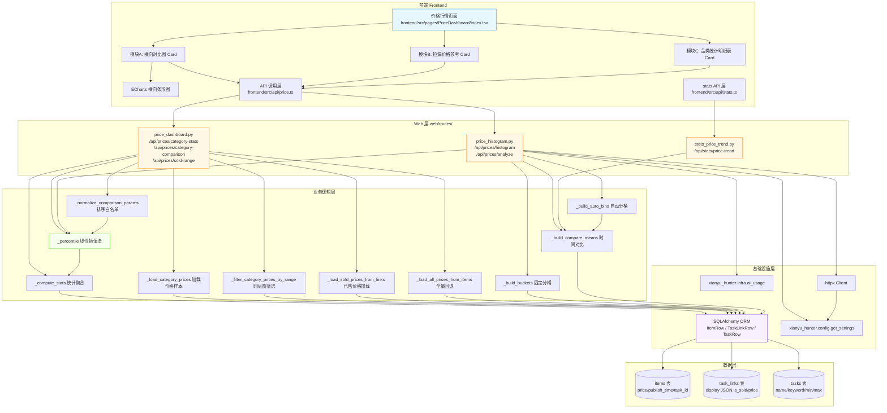
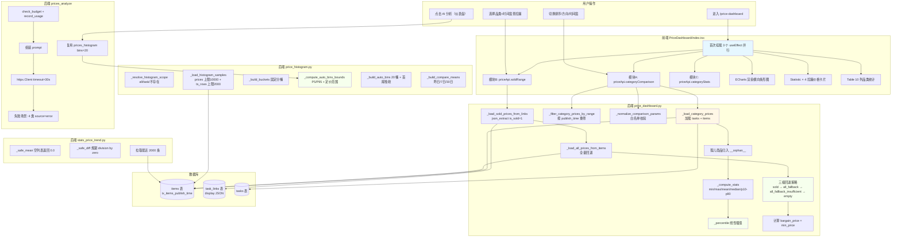
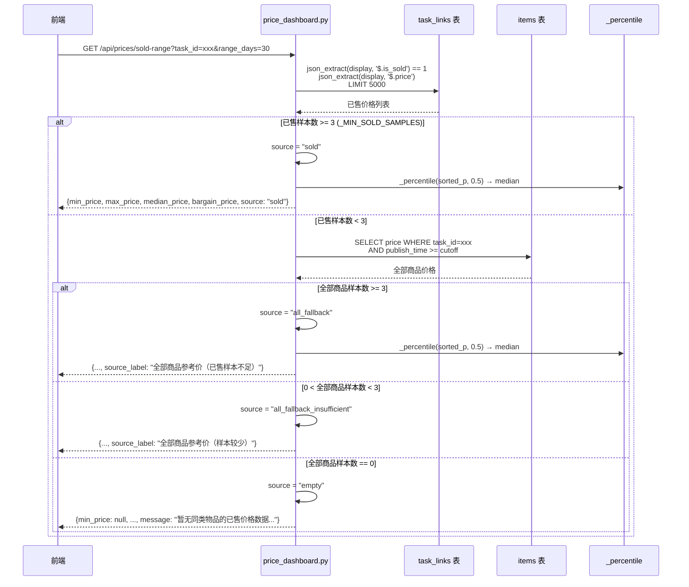
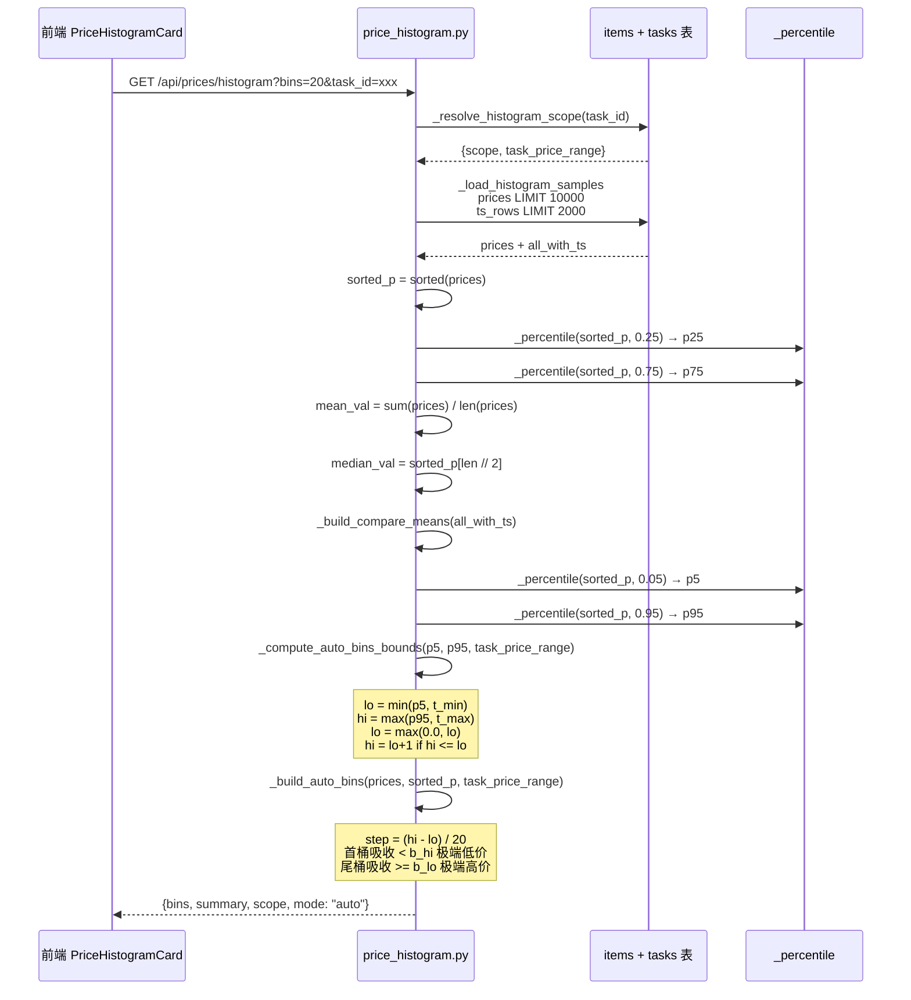
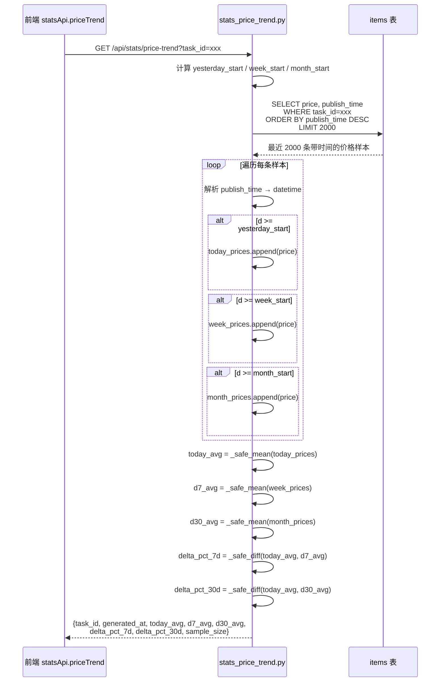

# 闲鱼猎人「价格行情」模块需求规格说明书

| 项 | 内容 |
|---|---|
| 文档版本 | v1.0 |
| 文档日期 | 2026-07-05 |
| 文档状态 | 初版（与详细设计 v1.0 对齐） |
| 所属菜单 | 数据查看 → 价格行情 |
| 菜单标识 | `menu_registry.yaml` 中 `key=price_dashboard`、`icon=DollarOutlined`、`sort_order=18`、`category=data_view` |
| 关联路由 | 前端 `/price-dashboard`；后端 `/api/prices/*`、`/api/stats/price-trend` |
| 关联文档 | [价格行情-详细设计.md](价格行情-详细设计.md)（v1.0/2026-07-05） |
| 文档类型 | 需求规格说明书（SRS） |

> **本文档首段：继承 project_memory.md 中的硬约束。** 下文 §1.3.3 显式列出适用项与映射实现要点；本节先做总览：
> 1. **Web 进程必须使用 `with_browser=False` 模式**——本模块不涉及浏览器子进程启动；纯统计查询 + SQL 聚合，与 BrowserManager 解耦。
> 2. **认证白名单机制**——`/api/prices/*` 与 `/api/stats/price-trend` 沿用现有 `auth.py` 认证中间件，与 `/api/auth/cookie` 不同。
> 3. **前端 fetch 必须含 `credentials: 'include'`**——`frontend/src/api/price.ts` 与 `frontend/src/api/stats.ts` 沿用 `client` 默认配置。
> 4. **401 必须返回 JSON `{"detail":"Unauthorized"}`**——价格行情端点走 FastAPI 默认异常处理，符合规范。
> 5. **token 比较使用 `hmac.compare_digest()`**——本模块不涉及 token 比对。
> 6. **敏感字段不日志**——本模块不打印 Cookie / Token；价格数据为业务统计值非敏感。
> 7. **token 写失败触发 `logging.warning()`**——本模块无 token 写入路径。
> 8. **模块级 import**——`price_dashboard.py` / `price_histogram.py` / `stats_price_trend.py` 顶层 import 已对齐；`prices_analyze` 函数内仅在调用时 import `httpx` / `ai_usage` / `get_settings`（因 LLM 调用是冷路径且需要避免循环依赖）。
> 9. **DB 索引**——`items` 表已有 `ix_items_publish_time`、`ix_items_task_first_seen` 索引，覆盖本模块时间窗筛选与按任务过滤的查询路径。
> 10. **COUNT 查询 CASE WHEN 聚合**——本模块 `_compute_stats` 在 Python 端完成聚合（先 `limit` 限制行数再 Python sum/percentile），不在 SQL 层做 COUNT CASE WHEN，符合"轻量聚合不依赖 SQL CASE WHEN"的原则。
> 11. **WebView2 子进程 `CREATE_NEW_CONSOLE`**——本模块不涉及浏览器子进程。
> 12. **WebView2 `private_mode=False` + 独立 `storage_path`**——同上。

---

## 目录

- [0. 阶段交接声明](#0-阶段交接声明)
- [1. 引言](#1-引言)
  - [1.1 编写目的](#11-编写目的)
  - [1.2 项目背景](#12-项目背景)
  - [1.3 范围与约束](#13-范围与约束)
  - [1.4 术语与缩写](#14-术语与缩写)
  - [1.5 参考资料](#15-参考资料)
- [2. 总体描述](#2-总体描述)
  - [2.1 产品定位](#21-产品定位)
  - [2.2 用户角色与特征](#22-用户角色与特征)
  - [2.3 运行环境](#23-运行环境)
  - [2.4 设计约束](#24-设计约束)
  - [2.5 假设与依赖](#25-假设与依赖)
- [3. 总体架构设计](#3-总体架构设计)
  - [3.1 模块架构图](#31-模块架构图)
  - [3.2 数据流程图](#32-数据流程图)
  - [3.3 关键时序图](#33-关键时序图)
  - [3.4 模块分层与职责](#34-模块分层与职责)
- [4. 功能需求](#4-功能需求)
  - [FR-1 品类横向对比图](#fr-1-品类横向对比图category-comparison)
  - [FR-2 品类统计明细](#fr-2-品类统计明细category-stats)
  - [FR-3 已售区间分布](#fr-3-已售区间分布sold-range)
  - [FR-4 价格直方图](#fr-4-价格直方图histogram)
  - [FR-5 价格分析](#fr-5-价格分析analyze)
  - [FR-6 价格趋势](#fr-6-价格趋势price-trend)
  - [FR-7 分位数算法](#fr-7-分位数算法线性插值法)
  - [FR-8 捡漏价格三级回退](#fr-8-捡漏价格三级回退)
  - [FR-9 价格直方图分桶](#fr-9-价格直方图分桶固定刻度-自动分桶-分位数)
  - [FR-10 价格行情 vs Dashboard 价格直方图卡片边界澄清](#fr-10-价格行情-vs-dashboard-价格直方图卡片边界澄清)
- [5. 接口定义](#5-接口定义)
- [6. 数据模型](#6-数据模型)
- [7. 性能指标](#7-性能指标)
- [8. 安全要求](#8-安全要求)
- [9. 前端设计](#9-前端设计)
- [10. 部署与集成](#10-部署与集成)
- [11. 验收标准](#11-验收标准)
- [12. 附录](#12-附录)

---

## 0. 阶段交接声明

```
- 当前阶段：价格行情 SRS 编写（v1.0） ✅ 已完成
- 下一阶段：数据查看菜单其余 SRS 汇总 + 全局术语统一
- 下一阶段智能体：主智能体
- 下一阶段技能：通用（无）
- 交接上下文：
  · 本文档定义「数据查看 → 价格行情」二级菜单完整需求 v1.0
  · 关键设计决策：6 端点（dashboard 3 + histogram 2 + trend 1）+ 10 个功能需求（FR-1~FR-10）
  · 3 个独立模块：品类横向对比 / 捡漏价格参考 / 品类统计明细
  · 分位数算法：线性插值法（price_dashboard.py 与 price_histogram.py 代码完全一致）
  · 捡漏价格三级回退：sold → all_fallback → all_fallback_insufficient → empty
  · category-stats 端点不接受 range_days（始终统计全量）
  · /api/stats/price-trend 独立于 /api/prices/* 命名空间
  · 边界澄清：价格行情菜单（/price-dashboard）vs 仪表盘 PriceHistogramCard（/）
  · 菜单 key=price_dashboard、path=/price-dashboard、sort_order=18、category=data_view
  · 继承 project_memory.md 硬约束，首段已枚举 12 项适用映射
```

---

## 1. 引言

### 1.1 编写目的

本需求规格说明书定义「数据查看 → 价格行情」二级菜单的完整需求规格，作为前端/后端开发、测试与验收的唯一依据。

**目标读者**：
- 后端开发工程师：依据 §3-§6、§8、§10 进行模块实现与扩展
- 前端开发工程师：依据 §4、§9 进行页面开发
- 测试工程师：依据 §7、§11 编写测试用例与执行验收
- 项目经理：依据 §2、§11 进行范围与里程碑管理
- 智能客服 KB 训练：本文档与 [价格行情-详细设计.md](价格行情-详细设计.md) 共同作为 KB 检索素材

### 1.2 项目背景

闲鱼猎人（XianyuHunter）是一个闲鱼自动捡漏与抢单工具，已具备任务管理、商品采集、AI 评估、自动下单、多渠道通知等完整能力（详见 [requirements.md](../requirements.md)、[design.md](../design.md) 与 [概要设计文档.md](../概要设计文档.md)）。

随着系统运行规模扩大，**价格行情相关的核心能力目前存在以下痛点**：

| 痛点 | 现状 | 影响 |
|------|------|------|
| 缺乏跨品类价格对比 | Dashboard 价格直方图卡片仅展示单品类分布形态 | 用户无法快速识别"高价区品类"与"低价区品类" |
| 缺乏捡漏价格参考 | 已售商品价格仅作为 events 记录，无独立 API 暴露 | 用户无法快速判断当前商品价格是否低于市场成交价 |
| 缺乏品类维度的全量统计 | 仪表盘卡片仅展示单任务均价/中位数 | 用户无法横向比较所有监控任务的价位段 |
| 价格分位数计算口径不统一 | 早期分位数用不同算法（floor/ceil/插值） | 同一商品在不同卡片展示的分位数值可能不一致 |
| 已售样本不足无回退 | 早期直接返回空，UI 出现"无数据" | 新接入品类无数据时用户无法获得任何参考价 |
| 品类横向对比缺排序 | 仪表盘卡片只展示当前任务的价格分布 | 用户无法按"均价降序"等快速筛选"最贵的 20 个品类" |

**解决方案**：新增「价格行情」二级菜单，将价格统计能力（品类横向对比、捡漏价格参考、品类统计明细）独立成 3 个模块化视图，使用统一的线性插值分位数算法保证口径一致；已售样本不足时自动回退到全量商品价格，让新接入品类也能获得参考。

### 1.3 范围与约束

#### 1.3.1 包含范围（In-Scope）

- 品类横向对比图（`GET /api/prices/category-comparison`，支持 9 个排序字段 + 时间窗 + 偏离度）
- 品类统计明细（`GET /api/prices/category-stats`，全品类列表）
- 已售区间分布（`GET /api/prices/sold-range`，捡漏价格参考）
- 价格直方图（`GET /api/prices/histogram`，固定刻度/自动分桶双模式，仪表盘复用）
- 价格分析（`POST /api/prices/analyze`，LLM 生成价格分析建议，仪表盘复用）
- 价格趋势（`GET /api/stats/price-trend`，今日/7日/30日均价基线，独立命名空间）
- 分位数算法（线性插值法，在 `price_dashboard.py` 与 `price_histogram.py` 代码完全一致）
- 捡漏价格三级回退（sold → all_fallback → all_fallback_insufficient → empty）
- 固定刻度分桶（`_PRICE_TICKS = [0, 50, 100, 200, 500, 1000, 2000, 5000, 10000, 20000]`）
- 自动分桶（P5/P95 裁剪 + 任务定价范围融合）
- 前端 `/price-dashboard` 页面（3 个独立模块：横向对比图 / 捡漏价格参考 / 品类统计明细表）

#### 1.3.2 排除范围（Out-of-Scope）

- 不实现"价格预测 / 价格指数"等高级分析（仅基于历史数据做统计）
- 不实现"价格趋势图组件"前端 UI（趋势基线由 `price-trend` 端点提供，前端可后续扩展）
- 不实现"品类手动编辑 / 价格修正"等业务编辑能力（价格数据完全由 collector 写入）
- 不重新实现"价格直方图"前端 ECharts 组件（仪表盘已实现，本菜单不重复）
- 不实现"AI 价格建议"功能（仅复用仪表盘 `/api/prices/analyze` 端点）
- 不实现"价格告警 / 阈值触发通知"（属于 `price_strategy` 配置菜单范畴）

#### 1.3.3 硬约束

继承 [project_memory.md](c:/Users/hspcadmin/.trae-cn/memory/projects/-d-code-otherProjects-17-xianyu/project_memory.md) 中的项目硬约束，并显式映射到本模块实现：

| 硬约束 | 本模块适用性 | 实现要点 |
|--------|--------------|----------|
| Web 进程使用 `with_browser=False` 模式 | 适用 | Web 进程不启浏览器；价格统计为纯 SQL 聚合 + Python 计算 |
| 认证白名单（`/api/auth/cookie` 等） | 不适用 | `/api/prices/*` 与 `/api/stats/price-trend` **必须**走 `auth.py` 认证 |
| 前端 fetch 必须含 `credentials: 'include'` | 适用 | `frontend/src/api/price.ts` 与 `frontend/src/api/stats.ts` 沿用 `client` 默认配置 |
| htmx 用官方 `<meta>` 配置 credentials | 不适用 | 价格行情前端使用 React fetch |
| 401 响应必须返回 JSON `{"detail":"Unauthorized"`} | 适用 | FastAPI 默认异常处理符合规范 |
| 后端 token 比较使用 `hmac.compare_digest()` | 不适用 | 本模块不涉及 token 比对 |
| 敏感字段（token 长度等）不日志 | 适用 | §8.5：价格数据非敏感，LLM prompt 不携带 Cookie/Token |
| token 写失败触发 `logging.warning()` | 不适用 | 本模块无 token 写入路径 |
| 缺失 import 必须 module-level | 部分适用 | `price_dashboard.py` / `price_histogram.py` / `stats_price_trend.py` 顶层 import 已对齐；`prices_analyze` 内函数级 import 是冷路径（避免 LLM 模块加载拖慢统计接口） |
| DB 必须在 `task_id/seller_id/...` 加索引 | 适用 | `items` 表已有 `ix_items_publish_time` 与 `ix_items_task_first_seen` 索引，覆盖本模块时间窗筛选与按任务过滤 |
| COUNT 查询用 CASE WHEN 聚合 | 不适用 | 本模块 Python 端 `_compute_stats` 完成聚合（先 limit 限制行数），不在 SQL 层做 COUNT CASE WHEN |
| WebView2 子进程使用 `CREATE_NEW_CONSOLE` | 不适用 | 本模块不涉及浏览器子进程 |
| WebView2 `webview.start()` 设 `private_mode=False` + 独立 `storage_path` | 不适用 | 同上 |
| KBManager 排除 `web/static/` 等目录 | 不适用 | 本模块不涉及 KB 索引 |
| `local_embedding.py` HF_ENDPOINT 设置 | 不适用 | 本模块不涉及 embedding |
| EmbeddingService 本地后端 | 不适用 | 同上 |
| sentence-transformers 跨版本兼容 | 不适用 | 同上 |
| `run_migrations` 各块独立 try/except | 不适用 | 本模块无新迁移 |
| 启动钩子异常 `logger.exception()` | 适用 | 路由层异常由 FastAPI 默认处理；`prices_analyze` 网络异常走 `httpx.HTTPError` 捕获返回 `source=error` |

### 1.4 术语与缩写

| 术语 | 全称 | 说明 |
|------|------|------|
| 品类 | Category | 业务上以"任务（Task）"为粒度聚合的商品集合 |
| 已售 | Sold | 闲鱼商品被买家拍下后状态变为已售；标价近似视为成交价 |
| 捡漏价格 | Bargain Price | 同类已售商品最低价，低于此价的在售商品可视为捡漏机会 |
| 分位数 | Percentile | P10/P25/P50/P75/P90 等百分位指标，反映价格分布形态 |
| 线性插值 | Linear Interpolation | NumPy 默认分位数算法：`rank = p * (n - 1)`，在 `sorted_prices[lo]` 与 `sorted_prices[hi]` 之间按 `frac = rank - lo` 线性插值 |
| 横向对比 | Category Comparison | 多品类价格统计 + 排序 + 偏离度计算 |
| 偏离度 | Deviation | 品类均价相对全体均价的偏移百分比（`deviation_pct = (mean - overall_mean) / overall_mean * 100`） |
| 固定刻度 | Fixed Ticks | 预定义的价格分桶边界 `_PRICE_TICKS = [0, 50, 100, 200, 500, 1000, 2000, 5000, 10000, 20000]` |
| 自动分桶 | Auto Bins | P5/P95 百分位裁剪 + 任务定价范围融合生成的 20 桶 |
| 数据回退 | Data Fallback | 已售样本不足（<3）时回退到 `items` 表全部商品价格 |
| 三级回退 | Three-level Fallback | `sold` → `all_fallback` → `all_fallback_insufficient` → `empty` |
| source | Source | 捡漏价格端点数据源标识 |
| source_label | Source Label | 数据源中文标签（`source != empty` 时返回） |
| 孤儿商品 | Orphan Item | `task_id` 为 NULL 或任务不存在的商品，全量统计时归入 `__orphan__` |
| LLM | Large Language Model | 大语言模型，本模块 `/api/prices/analyze` 端点调用生成价格分析建议 |
| prompt | Prompt | 喂给 LLM 的文本提示词，含数据概览 + 价格分档 |
| Httpx | HTTP Client | Python 异步 HTTP 客户端，`prices_analyze` 调用 LLM 使用 |
| 路由文件 | Route File | 后端 API 路由所在的 Python 文件（`price_dashboard.py` / `price_histogram.py` / `stats_price_trend.py`） |
| Tag | API Tag | FastAPI 路由分组标签（本模块 3 个文件 tag 分别为 `price-dashboard` / `prices` / `price-trend`） |

### 1.5 参考资料

| 文档 | 路径 | 用途 |
|------|------|------|
| 需求文档 v1.0 | [requirements.md](../requirements.md) | 系统整体需求基线 |
| 概要设计文档 v2.0 | [概要设计文档.md](../概要设计文档.md) | 分层架构、技术选型 |
| 技术设计说明书 | [design.md](../design.md) | 分层架构、Evaluator 设计、状态机 |
| 价格行情 详细设计 v1.0 | [价格行情-详细设计.md](价格行情-详细设计.md) | 本模块技术设计、代码位置、FAQ |
| 反爬登录管理 SRS | [../04-系统维护/反爬登录管理-需求规格.md](../04-系统维护/反爬登录管理-需求规格.md) | SRS 模板参考（12 章节完整版） |
| 事件时间线 SRS | [事件时间线-需求规格.md](事件时间线-需求规格.md) | 数据查看菜单 SRS 风格 |
| 项目硬约束 | [project_memory.md](c:/Users/hspcadmin/.trae-cn/memory/projects/-d-code-otherProjects-17-xianyu/project_memory.md) | 必须继承的硬约束清单 |
| 菜单元数据 | [../../config/menu_registry.yaml](../../config/menu_registry.yaml) | `key=price_dashboard`、`sort_order=18` |
| 品类统计 API | [../../src/xianyu_hunter/web/routes/price_dashboard.py](../../src/xianyu_hunter/web/routes/price_dashboard.py) | 3 端点 + 8 内部辅助函数 |
| 价格直方图 API | [../../src/xianyu_hunter/web/routes/price_histogram.py](../../src/xianyu_hunter/web/routes/price_histogram.py) | 2 端点 + 8 内部辅助函数 |
| 价格趋势 API | [../../src/xianyu_hunter/web/routes/stats_price_trend.py](../../src/xianyu_hunter/web/routes/stats_price_trend.py) | 1 端点 + 2 内部辅助函数 |
| DB 模型 | [../../src/xianyu_hunter/infra/db_models.py](../../src/xianyu_hunter/infra/db_models.py) | ItemRow:98 / TaskRow:50 / TaskLinkRow:256 |
| 前端主页面 | [../../frontend/src/pages/PriceDashboard/index.tsx](../../frontend/src/pages/PriceDashboard/index.tsx) | 3 个独立模块 + 工具栏 |
| 前端 price API | [../../frontend/src/api/price.ts](../../frontend/src/api/price.ts) | `priceApi` 对象 5 个方法 |
| 前端 stats API | [../../frontend/src/api/stats.ts](../../frontend/src/api/stats.ts) | `statsApi.priceTrend` 独立封装 |

---

## 2. 总体描述

### 2.1 产品定位

「价格行情」是闲鱼猎人系统的**全平台价格行情独立视图**，定位为：

> 按品类（任务）维度聚合商品价格样本，提供横向对比、分位数统计与捡漏价格参考，是用户判断"是否值得入手"的核心决策入口。与仪表盘的价格直方图卡片（单品类纵向分布）形成视角互补。

**核心价值**：
1. **跨品类横向对比**：按 9 个统计字段（mean / median / min / max / p10 / p25 / p75 / p90 / count）排序，最多 100 个品类同时展示
2. **捡漏价格参考**：基于 `task_links` 中 `is_sold=true` 的已售商品近似成交价，给出"低于此价可捡漏"的参考阈值
3. **分位数统计**：P10/P25/P50/P75/P90 反映价格分布形态而非单一均值
4. **样本回退**：已售样本不足时自动回退到全量商品价格，避免无数据可看
5. **时间窗筛选**：7/30/90 天支持短期行情波动观察
6. **算法口径统一**：分位数采用线性插值法（NumPy 默认），`price_dashboard.py` 与 `price_histogram.py` 代码完全一致

### 2.2 用户角色与特征

| 角色 | 特征 | 使用场景 | 关注重点 |
|------|------|----------|----------|
| 日常运营 | 监控多品类价格波动 | 进入页面看横向对比 + 偏离度 | 红色（贵）/ 绿色（便宜）标记 |
| 捡漏玩家 | 寻找低于市场成交价的商品 | 选品类 + 时间窗查捡漏价格 | `bargain_price` 字段 |
| 价格分析师 | 深入研究品类分布 | 品类统计明细表列排序 | P10/P25/P75/P90 分位数 |
| 任务规划者 | 决定新监控任务的定价范围 | 横向对比 + 自动分桶 | 任务 `min_price` / `max_price` 范围 |
| 高级用户 | 调整监控策略 | 短期 7/30/90 天窗口切换 | 时间窗对均价的影响 |

### 2.3 运行环境

| 项 | 要求 |
|---|---|
| 操作系统 | Windows 10/11（主），Linux/macOS 兼容 |
| Python | 3.11+ |
| Node.js | 18+（仅前端构建） |
| 后端框架 | FastAPI（已集成） |
| 前端框架 | React 18 + TypeScript + Ant Design 5（已集成） |
| 数据库 | 复用现有 SQLite（`items` / `task_links` / `tasks` 表） |
| AI 服务 | `/api/prices/analyze` 端点依赖 OpenAI 兼容 LLM（`openai_api_key` / `openai_base_url` / `openai_model`） |

### 2.4 设计约束

1. **集成部署**：作为 3 个后端路由文件（`price_dashboard.py` / `price_histogram.py` / `stats_price_trend.py`）+ `frontend/src/pages/PriceDashboard/index.tsx` 页面集成到现有系统，不独立部署
2. **3 个独立模块**：横向对比图 / 捡漏价格参考 / 品类统计明细表，前端通过 3 个 `useEffect` 并行拉取，互不阻塞
3. **算法口径统一**：分位数采用线性插值法，`price_dashboard.py` 与 `price_histogram.py` 的 `_percentile` 函数代码完全一致
4. **样本上限**：防止大表撑爆内存——`prices` 限制 10000 行（`price_histogram.py`），`task_links` 限制 5000 行（`price_dashboard.py`），`ts_rows` 限制 2000 行
5. **排序白名单**：`_ALLOWED_COMPARISON_SORT` 共 9 个字段（`mean` / `median` / `min` / `max` / `p10` / `p25` / `p75` / `p90` / `count`），非法值回退到 `mean`，不抛错
6. **方向白名单**：`order` 仅接受 `asc` / `desc`，非法值回退到 `asc`
7. **空样本排序**：升序时推到队尾（`+inf`），降序时推到队尾（`-inf`），避免 0 值干扰排序
8. **孤儿商品归类**：`task_id` 为 NULL 或任务不存在的商品归入 `__orphan__`，展示名"未分类"，响应中 `task_id` 字段为 `null`
9. **时间窗对齐**：`category-comparison` 接受 `range_days` 参数（>0 时按 `publish_time` 过滤），`category-stats` 不接受 `range_days`（始终统计全量）
10. **回退透明化**：`sold-range` 端点通过 `source` / `source_label` 字段标注数据来源（`sold` / `all_fallback` / `all_fallback_insufficient` / `empty`），前端展示数据来源标签
11. **AI 调用降级**：`/api/prices/analyze` 在 4 种失败场景下均返回 `source=error` + 友好提示，不抛异常
12. **趋势独立命名空间**：`/api/stats/price-trend` 归在 `/api/stats/*` 而非 `/api/prices/*`，供未来独立趋势图组件或第三方集成使用

### 2.5 假设与依赖

**假设**：
- 用户已部署闲鱼猎人 v2.x+ 并能访问 `MainLayout` 侧边栏
- 系统已通过 collector 采集到商品价格数据（`items.price` 不为空）
- AI 分析端点依赖 OpenAI 兼容 LLM 配置（`openai_api_key` / `openai_base_url` / `openai_model`）

**依赖**：
- 依赖现有 `items` 表（含 `ix_items_publish_time` 索引）
- 依赖现有 `task_links` 表（`display` JSON 字段含 `is_sold` / `price`）
- 依赖现有 `tasks` 表（品类元信息 `name` / `keyword` / `min_price` / `max_price`）
- 依赖现有 `auth.py` 认证中间件
- 依赖现有 `menu_registry.yaml` 菜单注册（已配置 `key=price_dashboard`）
- 依赖 `httpx` 库（`prices_analyze` 调用 LLM）
- 依赖 `xianyu_hunter.infra.ai_usage` 模块（`check_budget` / `record_usage`）
- 新增无外部依赖

---

## 3. 总体架构设计

### 3.1 模块架构图



### 3.2 数据流程图



### 3.3 关键时序图

#### 3.3.1 捡漏价格三级回退时序



#### 3.3.2 价格直方图自动分桶时序



#### 3.3.3 价格趋势独立基线时序



### 3.4 模块分层与职责

遵循项目现有 DDD 分层架构（见 [概要设计文档](../概要设计文档.md) §3）：

| 层级 | 模块 | 职责 |
|------|------|------|
| **Web 层** | `price_dashboard.py` | 价格行情 3 端点（`category-stats` / `category-comparison` / `sold-range`）+ 8 个内部辅助函数 |
| | `price_histogram.py` | 价格直方图 2 端点（`histogram` / `analyze`）+ 8 个内部辅助函数 |
| | `stats_price_trend.py` | 价格趋势 1 端点（`price-trend`）+ 2 个内部辅助函数 |
| **业务模块层** | `_percentile` 函数（3 个文件各自实现，代码完全一致） | 线性插值分位数算法 |
| | `_compute_stats` | 单组价格的完整统计指标（count/min/max/mean/median/p10/p25/p75/p90） |
| | `_load_category_prices` | 加载各品类（任务）的价格样本，按 `task_id` 归类，孤儿商品归入 `__orphan__` |
| | `_filter_category_prices_by_range` | `range_days>0` 时基于 `publish_time` 重新筛选样本 |
| | `_normalize_comparison_params` | 排序字段 + 方向白名单校验，非法值回退到默认值 |
| | `_make_comparison_sort_key` | 闭包工厂：捕获 sort_by 和 order 返回排序键函数 |
| | `_compute_deviation_pct` | 单品类相对全体均价的偏离度百分比 |
| | `_load_sold_prices_from_links` | 从 `task_links.display` JSON 提取已售商品价格（SQL 层） |
| | `_load_all_prices_from_items` | 从 `items` 表加载全部商品价格（已售回退） |
| | `_build_buckets` | 固定刻度分桶（`_PRICE_TICKS`） |
| | `_build_auto_bins` | P5/P95 + 任务定价范围融合的 20 桶 |
| | `_compute_auto_bins_bounds` | 自动分桶的边界计算 |
| | `_build_compare_means` | 昨日/7日/30日均价对比基线 |
| | `_safe_mean` / `_safe_diff` | 安全计算均值与涨跌幅（空列表/除零降级） |
| **基础设施层** | `db_models.py` | `ItemRow` / `TaskLinkRow` / `TaskRow` ORM 模型 |
| | `get_settings` | 全局配置读取（`openai_api_key` / `openai_base_url` / `openai_model`） |
| | `ai_usage.check_budget` / `record_usage` | AI 预算检查 + 用量记录 |
| | `httpx.Client` | LLM HTTP 调用客户端（`timeout=30.0`） |
| | `to_datetime` | 时间戳字符串转 datetime（`price_histogram.py` 复用） |
| **前端** | `pages/PriceDashboard/index.tsx` | 3 个独立模块 Card + 工具栏 + ECharts 横向条形图 |
| | `api/price.ts` | `priceApi` 对象 5 个方法封装 |
| | `api/stats.ts` | `statsApi.priceTrend` 独立封装 |
| | `components/charts/EChart` | ECharts React 包装组件 |

---

## 4. 功能需求

### FR-1 品类横向对比图（category-comparison）

**FR-1.1** 暴露 `category_comparison` 给前端，调用 `GET /api/prices/category-comparison` 返回多品类价格统计
- 支持 9 个排序字段（`mean` / `median` / `min` / `max` / `p10` / `p25` / `p75` / `p90` / `count`）+ `asc` / `desc` 方向
- 支持 `range_days` 时间窗（0=全部，>0 按 `publish_time` 过滤）
- 支持 `limit` 限制（1-100，默认 20）

**FR-1.2** 响应字段：
- `categories[]` —— 排序后的前 `limit` 个品类，每个含 `task_id` / `name` / `keyword` / `count` / `min` / `max` / `mean` / `median` / `p10` / `p25` / `p75` / `p90` / `deviation_pct`
- `overall_mean` —— 全体品类均价（按每个品类均值加权，每个品类最多 100 样本）
- `sort_by` / `order` / `range_days` —— 回显请求参数
- `total_categories` —— 实际返回的品类数（截取后）

**FR-1.3** 排序白名单（`_ALLOWED_COMPARISON_SORT`）：非法值回退到 `mean`，不抛错
- **为什么使用白名单**：防止 SQL 注入与无效字段导致 422 错误阻断用户体验

**FR-1.4** 偏离度计算（`_compute_deviation_pct`）：
```python
def _compute_deviation_pct(c, overall_mean):
    if overall_mean > 0 and c["count"] > 0:
        return round((c["mean"] - overall_mean) / overall_mean * 100, 1)
    return 0.0
```
- 正值 = 高于均价（贵），负值 = 低于均价（便宜）
- 全体均价为 0 或品类样本为 0 时返回 0.0

**FR-1.5** `overall_mean` 计算规则（避免大品类压倒小品类）：
```python
all_prices = [p for c in categories for _ in range(min(c["count"], 100)) for p in [c["mean"]]]
overall_mean = round(sum(all_prices) / len(all_prices), 2) if all_prices else 0.0
```
- 每个品类最多取 100 个样本（即"品类等权"的近似）

**FR-1.6** 空样本排序处理（`_make_comparison_sort_key` 闭包）：
- 升序时空样本推到队尾（`+inf`）
- 降序时空样本推到队尾（`-inf`）
- 避免 0 值干扰排序

**FR-1.7** 前端横向对比 Card 显示：
- 工具栏：sortBy 下拉（`SORT_OPTIONS` 9 项）/ order 下拉（升/降序）/ rangeDays 下拉（0/7/30/90 天）/ 刷新按钮
- ECharts 横向条形图：y 轴品类名（截断 12 字符），x 轴均价（>1000 用 k 简写）
- 条形颜色：`deviation_pct > 5` 红色（贵）/ `< -5` 绿色（便宜）/ 其余蓝色（接近均价）
- `markLine`：全体均价基线（虚线 + 文本标注）
- 图例说明（红/绿/蓝色含义）
- tooltip 显示样本数/均价/中位数/最低最高/P25~P75/偏离度

### FR-2 品类统计明细（category-stats）

**FR-2.1** 暴露 `category_stats` 给前端，调用 `GET /api/prices/category-stats` 返回全品类价格统计
- 支持 `task_id` 参数（不传则返回全部品类，传则只返回该品类）
- **不接受 `range_days` 参数**（始终统计全量）

**FR-2.2** 响应字段：
- `categories[]` —— 品类统计列表，**按样本数降序**排列
- `total_count` —— 所有品类的样本总数

**FR-2.3** 业务规则：
- 分位数采用**线性插值法**（`_percentile` 函数），与 `price_histogram.py` 算法一致
- `task_id` 为 NULL 或任务不存在的商品归入"未分类"类别（`__orphan__`），**仅在全量查询时出现**
- `task_id` 参数非空时只返回该单一品类的统计（不返回"未分类"）
- 列表按 `count` 降序排列，便于前端优先展示主流品类

**FR-2.4** 类别条目字段：
| 字段 | 类型 | 说明 |
|------|------|------|
| `task_id` | string | 任务 ID（"未分类"孤儿商品为 `null`）|
| `name` | string | 品类名（任务 name，fallback 到 keyword 或 id）|
| `keyword` | string | 搜索关键词 |
| `count` | int | 样本数 |
| `min` | float | 历史最低价 |
| `max` | float | 历史最高价 |
| `mean` | float | 均价 |
| `median` | float | 中位数（P50）|
| `p10` | float | 10 分位数（低端价位参考）|
| `p25` | float | 25 分位数 |
| `p75` | float | 75 分位数 |
| `p90` | float | 90 分位数（高端价位参考）|

**FR-2.5** 前端品类统计明细表显示：
- 10 列表格：品类 / 样本数 / 最低价 / 最高价 / 均价 / 中位数 / P25 / P75 / P10 / P90
- 列排序：前 6 列（品类/样本数/最低价/最高价/均价/中位数）支持 `sorter`
- `rowKey` 使用 `task_id || '__orphan__'`
- 分页：`pageSize=10`，不支持切换页大小
- 滚动：`scroll={{ x: 960 }}` 横向滚动
- 价格格式化：`formatPrice` 函数（`<1000` 显示 `¥xxx`，`≥1000` 显示 `¥x.xk`；null/NaN 显示 `—`）

### FR-3 已售区间分布（sold-range）

**FR-3.1** 暴露 `sold_range` 给前端，调用 `GET /api/prices/sold-range` 返回同类物品已售价格区间（捡漏参考）
- 支持 `task_id` 参数（不传则统计全部任务）
- 支持 `range_days` 参数（默认 30 天，0=全部）

**FR-3.2** 响应字段（有数据时）：
| 字段 | 类型 | 说明 |
|------|------|------|
| `min_price` | float | 已售商品最低价 |
| `max_price` | float | 已售商品最高价 |
| `median_price` | float | 已售商品中位数 |
| `bargain_price` | float | 捡漏价格 = `min_price`（低于此价视为捡漏机会）|
| `sample_size` | int | 样本数 |
| `source` | string | 数据源标识 |
| `source_label` | string | 数据源中文标签 |
| `task_id` | string | 回显请求参数 |
| `range_days` | int | 回显请求参数 |

**FR-3.3** 数据来源策略（`_MIN_SOLD_SAMPLES = 3`）：
1. **优先**从 `task_links.display` JSON 提取 `is_sold=true` 的商品价格，SQL LIMIT 5000 防止全表扫描
2. 已售样本不足（<3）时**回退**到 `items` 表全部商品价格
3. 全部商品样本也不足时仍返回（"有总比无好"）
4. 两者均无数据时返回 `source=empty` + 友好提示

**FR-3.4** source 取值：
- `sold` —— 已售商品成交价（样本充足）
- `all_fallback` —— 全部商品参考价（已售样本不足，但全部商品样本 ≥ 3）
- `all_fallback_insufficient` —— 全部商品参考价（样本较少）
- `empty` —— 两者均无数据

**FR-3.5** source_label 中文标签：
- `sold` → "已售商品成交价"
- `all_fallback` → "全部商品参考价（已售样本不足）"
- `all_fallback_insufficient` → "全部商品参考价（样本较少）"

**FR-3.6** 无数据时响应（`source=empty`）：
```json
{
  "min_price": null, "max_price": null, "median_price": null, "bargain_price": null,
  "sample_size": 0, "source": "empty", "task_id": null, "range_days": 30,
  "message": "暂无同类物品的已售价格数据，建议先执行实时搜索采集更多商品"
}
```

**FR-3.7** 业务约束（与设计契约）：
- **闲鱼不公开实际成交价**，`is_sold=true` 的商品标价近似视为成交价
- `task_links.display` 是 JSON 文本，通过 `func.json_extract(display, '$.is_sold')` 在 SQL 层提取（避免全表加载到 Python 内存）
- SQLite `json_extract` 返回 1/0，整数比较 `sold_flag == 1`

**FR-3.8** 前端捡漏价格参考 Card 显示：
- 工具栏：品类下拉（`taskApi.list({limit:200})` 拉取，`allowClear` 支持清空）/ 时间窗下拉（仅 7/30/90，过滤掉"全部时间"）/ 刷新按钮
- 4 个 Statistic 卡片（`Row gutter={16}` + `Col xs={12} sm={6}`）：
  - 捡漏价格（绿色 + 副标题"低于此价可捡漏"）
  - 最低价
  - 中位数
  - 最高价
- 底部：样本数 Tag（蓝色）+ 数据来源 Tag（紫色）
- 空状态：`sample_size == 0` 时显示 `Empty` + `message` 字段提示

### FR-4 价格直方图（histogram）

**FR-4.1** `GET /api/prices/histogram` 返回价格分档直方图
- 支持 `bins` 参数：0=固定刻度分桶（默认），20=自动分桶
- 支持 `task_id` 参数：可选，"all" 或不传=全部任务

**FR-4.2** 响应字段：
| 字段 | 类型 | 说明 |
|------|------|------|
| `bins` | array | 分桶列表，每项含 `min` / `max` / `count` |
| `bins[].max` | number | 桶上界；尾桶为 `null` 表示开区间（≥min）|
| `summary.count` | int | 样本总数 |
| `summary.min` / `max` | float | 真实最低/最高价（非分桶边界）|
| `summary.mean` / `median` | float | 均价 / 中位数 |
| `summary.p25` / `p75` | float | 25 / 75 分位数 |
| `summary.compare` | object | 时间对比基线：`yesterday` / `last7d` / `last30d` / `diff_pct` |
| `summary.task_price_range` | object | 任务定价范围（min_price / max_price，可空）|
| `scope` | object | 查询范围：`mode`（all/task）+ 任务元信息 + `label` |
| `mode` | string | `fixed`（固定刻度）或 `auto`（自动分桶）|

**FR-4.3** 固定刻度分桶（`bins=0`，默认）：
- 使用预定义 `_PRICE_TICKS = [0, 50, 100, 200, 500, 1000, 2000, 5000, 10000, 20000]` 共 10 个桶
- 桶边界固定便于不同次请求对比
- 尾桶为开区间 `[20000, +∞)`，响应中 `max=null`

**FR-4.4** 自动分桶（`bins=20`）：
- 用 P5/P95 裁剪极端值
- 融合任务定价范围（`min_price` / `max_price`）确定分桶边界
- 首尾桶吸收范围外极端值，保证商品计数不丢失
- `_compute_auto_bins_bounds` 算法：
  1. 下界 = `min(P5, task.min_price)`，确保覆盖任务定价下限
  2. 上界 = `max(P95, task.max_price)`，确保覆盖任务定价上限
  3. `lo = max(0.0, lo)`，避免负值
  4. 若 `hi <= lo`，强制 `hi = lo + 1`
- 响应 `mode="auto"`

**FR-4.5** 时间对比基线（`_build_compare_means`）：
- 按 `publish_time` 将样本分到"昨日（≥now-1d）"、"7 日（≥now-7d）"、"30 日（≥now-30d）"三个桶
- 各桶独立计算均价
- `diff_pct = (yesterday - last7d) / last7d × 100`，仅当两者均 > 0 时计算，否则为 0.0

**FR-4.6** P-09-30 关键修复：ts_rows 与 prices 同源
- **修复前**：`ts_rows` 为全表查询，导致选定任务时基线混入其它任务价格
- **修复后**：`ts_rows` 按 `task_id` 过滤（与 prices 同源），保证时间对比指标不失真

**FR-4.7** 任务不存在时响应：
```json
{
  "bins": [],
  "summary": _build_empty_histogram_summary(task_price_range),
  "scope": {..., "label": "任务 {id}（不存在）"},
  "mode": "fixed"
}
```

**FR-4.8** 样本上限：
- `prices` 限制 10000 行
- `ts_rows` 限制 2000 行
- 防止大表撑爆内存

**FR-4.9** 本端点由仪表盘 `PriceHistogramCard` 组件调用，**不属于本菜单前端直接使用**

### FR-5 价格分析（analyze）

**FR-5.1** `POST /api/prices/analyze` 调用 LLM 生成价格分析建议
- 支持 `task_id` Query 参数
- POST 但 body 为 null，参数走 Query

**FR-5.2** 响应字段：
| 字段 | 类型 | 说明 |
|------|------|------|
| `analysis` | string | LLM 生成的中文分析建议 |
| `source` | string | `ai` / `error` / `empty` |
| `scope_label` | string | 数据范围标签（`source=ai` 时返回）|

**FR-5.3** 业务规则：
- 内部复用 `prices_histogram(bins=20)` 获取统计数据
- 检查 `openai_api_key` 配置，未配置返回 `source=error` 提示
- 检查 AI 预算（`check_budget`），超限返回 `source=error`
- 调用 LLM 时 `temperature=0.3`、`max_tokens=800`、超时 30s
- 网络错误 / 超时 / 格式异常均返回 `source=error` + 友好提示，**不抛异常**
- 成功时记录 AI 用量（`record_usage("price_analyze", settings.openai_model, resp_data)`）

**FR-5.4** 4 类失败场景（均返回 `source=error`）：
1. 未配置 `openai_api_key` → 提示去"AI 服务"配置页面设置
2. AI 预算超限（`check_budget` 返回 false）→ 提示 `AI 调用受限：{reason}`
3. 网络超时（30s）或 HTTP 错误 → 提示 `AI 分析超时，请稍后重试` / `AI 服务网络错误: {e}`
4. LLM 返回格式异常（`choices[0].message.content` 缺失或 JSON 解析失败）→ 提示 `AI 返回格式异常，请重试`

**FR-5.5** prompt 组装（4 个分析维度）：
1. **价格分布特征**：集中度、偏态、是否存在异常高价/低价
2. **性价比区间**：结合 P25-P75 推荐值得关注的价位段
3. **趋势判断**：对比 7 日均价，价格是涨是跌，是否适合入手
4. **策略建议**：针对监控任务的价格上下限设置给出具体建议

**FR-5.6** 本端点由仪表盘 `PriceHistogramCard` 组件调用，**不属于本菜单前端直接使用**

### FR-6 价格趋势（price-trend）

**FR-6.1** `GET /api/stats/price-trend` 返回今日 / 7 日 / 30 日均价 + 涨跌幅（独立基线）
- 支持 `task_id` Query 参数
- **独立于 `/api/prices/*` 命名空间**，归在 `/api/stats/*` 下

**FR-6.2** 响应字段：
| 字段 | 类型 | 说明 |
|------|------|------|
| `task_id` | string | 任务 ID（回显）|
| `generated_at` | string | 生成时间（ISO 8601，秒精度）|
| `today_avg` | float | 今日均价（基于 `publish_time >= now-1d`）|
| `d7_avg` | float | 7 日均价 |
| `d30_avg` | float | 30 日均价 |
| `delta_pct_7d` | float | 今日相对 7 日均价的涨跌幅（%）|
| `delta_pct_30d` | float | 今日相对 30 日均价的涨跌幅（%）|
| `sample_size` | object | 各时间窗样本数：`today` / `d7` / `d30` |

**FR-6.3** 业务规则：
- 数据源：`items` 表 `publish_time` 字段（商品发布时间）
- 拉取最近 2000 条带时间的价格样本（与 `price_histogram._build_compare_means` 口径一致）
- `_safe_mean`：空列表返回 0.0
- `_safe_diff`：`baseline <= 0` 或 `current <= 0` 时返回 0.0
- 透明返回各时间窗样本数，让调用方判断数据可信度

**FR-6.4** 与 `histogram` 的 compare 字段关系：
- 两者算法与口径**完全一致**（都基于 `publish_time` 分桶 + 均值），区别仅在响应结构
- `PriceHistogramCard` 继续复用 `histogram` 的 compare 字段，避免重复查询
- 本端点供未来独立趋势图组件或第三方集成使用

**FR-6.5** 本端点目前**无前端组件直接调用**

### FR-7 分位数算法（线性插值法）

**FR-7.1** `_percentile(sorted_prices, p)` 函数采用**线性插值法**（per NumPy 默认算法）：

```python
def _percentile(sorted_prices, p):
    if not sorted_prices:
        return 0.0
    n = len(sorted_prices)
    if n == 1:
        return float(sorted_prices[0])
    rank = p * (n - 1)
    lo = int(math.floor(rank))
    hi = int(math.ceil(rank))
    if lo == hi:
        return float(sorted_prices[lo])
    frac = rank - lo
    return sorted_prices[lo] * (1 - frac) + sorted_prices[hi] * frac
```

**FR-7.2** 算法契约：
- `rank = p * (n - 1)`
- `lo = floor(rank)`, `hi = ceil(rank)`
- 若 `lo == hi` 返回 `sorted_prices[lo]`
- 否则返回 `sorted_prices[lo] * (1 - frac) + sorted_prices[hi] * frac`，`frac = rank - lo`

**FR-7.3** 代码一致性要求：
- `price_dashboard.py` 与 `price_histogram.py` 中的 `_percentile` 函数**代码完全一致**
- 两文件各自实现而非 import 共享（避免跨文件 import 副作用）
- **为什么各自实现而非 import**：两个文件是独立的 FastAPI 路由模块，跨文件 import 会引入不必要的耦合；代码简单（10 行）且稳定，各自实现可保证算法口径不漂移

**FR-7.4** 边界处理：
- 空列表返回 0.0（避免 None 引发前端异常）
- 单元素列表返回该元素值
- P50 中位数在 `n` 为偶数时通过线性插值计算（如 `[1, 2, 3, 4]` 的 P50 = 2.5）

### FR-8 捡漏价格三级回退

**FR-8.1** `sold-range` 端点三级回退策略（`_MIN_SOLD_SAMPLES = 3`）：

```
1. source = "sold"
   条件: len(sold_prices) >= 3
   数据源: task_links.display JSON 中 is_sold=true
   标签: "已售商品成交价"

2. source = "all_fallback"
   条件: len(sold_prices) < 3 且 len(all_prices) >= 3
   数据源: items 表全部商品价格
   标签: "全部商品参考价（已售样本不足）"

3. source = "all_fallback_insufficient"
   条件: 0 < len(all_prices) < 3
   数据源: items 表全部商品价格
   标签: "全部商品参考价（样本较少）"

4. source = "empty"
   条件: len(all_prices) == 0
   响应: 字段全为 null + message 友好提示
   标签: 无
```

**FR-8.2** SQL 限制（防止全表扫描撑爆内存）：
- `task_links` 加载上限：`LIMIT 5000`
- `items` 加载无硬上限（由数据库实际行数决定）

**FR-8.3** SQL 提取（避免 Python 端全表加载）：
```python
sold_flag = func.json_extract(TaskLinkRow.display, '$.is_sold')
price_expr = func.json_extract(TaskLinkRow.display, '$.price')
```
- SQLite `json_extract` 返回 1/0，整数比较 `sold_flag == 1`
- `where(TaskLinkRow.link_type == "item")` 过滤 item 类型关联

**FR-8.4** 价格过滤：
- 仅收集 `p > 0` 的有效价格（过滤 0 与负数）
- 解析失败（`TypeError` / `ValueError`）的条目静默跳过

**FR-8.5** 捡漏价格定义（`bargain_price`）：
- 等于 `min_price`（已售商品最低价）
- 低于此价的在售商品可视为捡漏机会
- **为什么不直接用 P10/P25 等分位数**：最低价是最保守的捡漏阈值，确保一定有成交记录

### FR-9 价格直方图分桶（固定刻度 / 自动分桶 / 分位数）

**FR-9.1** 固定刻度分桶（`_PRICE_TICKS`）：

```python
_PRICE_TICKS = [0, 50, 100, 200, 500, 1000, 2000, 5000, 10000, 20000]
```

- 10 个桶，桶边界固定便于不同次请求对比
- 桶 `i` 区间：`[ticks[i], ticks[i+1])`，尾桶为开区间 `[20000, +∞)`
- 响应 `mode="fixed"`

**FR-9.2** 自动分桶（`_compute_auto_bins_bounds` + `_build_auto_bins`）：

```python
p5 = _percentile(sorted_p, 0.05)
p95 = _percentile(sorted_p, 0.95)
t_min = task_price_range["min_price"]
t_max = task_price_range["max_price"]
lo = min(p5, t_min) if t_min is not None else p5
hi = max(p95, t_max) if t_max is not None else p95
lo = max(0.0, lo)
if hi <= lo:
    hi = lo + 1
```

- 20 桶等宽 `[lo, hi]`
- 首桶吸收所有 `< b_hi` 的极端低价
- 尾桶吸收所有 `>= b_lo` 的极端高价
- 响应 `mode="auto"`

**FR-9.3** P-09-30 修复说明：
- 旧逻辑用 `min(prices)` / `max(prices)`，单个异常高价（如 5000）会把范围拉到 5000
- 而任务实际定价范围可能只有 100~1000，导致前 2 个桶装着大部分商品、其余全为 0
- 新逻辑用 P5/P95 裁剪极端值 + 任务定价范围融合，首尾桶吸收范围外的极端值保证计数不丢失

**FR-9.4** 任务不存在时返回空 bins，scope.label 标注"任务 {id}（不存在）"——前端应展示"暂无该任务数据"提示

**FR-9.5** 三种分位数计算路径：
| 端点 | 用途 | 分位数 |
|------|------|--------|
| `category-stats` | 品类统计 | P10/P25/P50/P75/P90 |
| `category-comparison` | 横向对比 | P10/P25/P50/P75/P90 |
| `histogram` | 直方图 summary | P25/P75 |
| `stats/price-trend` | 趋势基线 | 不计算分位数（仅均值）|

### FR-10 价格行情 vs Dashboard 价格直方图卡片边界澄清

**FR-10.1** 边界对照表：

| 维度 | 价格行情菜单 | 仪表盘价格直方图卡片 |
|------|--------------|----------------------|
| 路由 | `/price-dashboard` | `/`（仪表盘主页）|
| 菜单 key | `price_dashboard` | `dashboard` |
| 前端组件 | `pages/PriceDashboard/index.tsx` | `pages/Dashboard/components/PriceHistogramCard.tsx` |
| 调用 API | `categoryStats` / `categoryComparison` / `soldRange` | `histogram` / `analyze` |
| 视角 | **多品类横向对比**（跨任务）| **单品类纵向分布**（单任务或全部）|
| 核心图表 | 横向条形图（品类 × 均价）| 纵向直方图（价格区间 × 商品数）|
| 是否含 AI | 否 | 是（`/api/prices/analyze`）|
| 是否含捡漏 | 是（`/api/prices/sold-range`）| 否 |
| 是否含趋势 | 否（本菜单前端未直接调用 price-trend）| 是（复用 histogram 的 compare 字段）|

**FR-10.2** 关键澄清：
1. **本菜单（`/price-dashboard`）是独立的价格行情页面**，关注"跨品类的横向对比"与"捡漏价格参考"，不展示单品类的价格分布直方图
2. **仪表盘（`/`）中的 `PriceHistogramCard` 是仪表盘的组成部分**，关注"单品类的价格分布形态"与"AI 分析建议"，**不属于本菜单**
3. 两者共用底层统计算法（线性插值分位数、`_percentile` 函数代码相同），但 API 端点、前端组件、菜单归属完全独立
4. `/api/stats/price-trend` 是独立的价格趋势基线端点，目前**无前端组件直接调用**（`PriceHistogramCard` 复用 `histogram` 的 `compare` 字段），供未来独立趋势图或第三方集成使用

**FR-10.3** 本菜单前端 `PriceDashboard/index.tsx` **仅调用前 3 个端点**（`categoryStats` / `categoryComparison` / `soldRange`）。后 3 个端点（`histogram` / `analyze` / `price-trend`）由仪表盘的 `PriceHistogramCard` 组件复用或供未来扩展。

---

## 5. 接口定义

所有接口前缀：`/api/prices` 或 `/api/stats`，路由文件分布在 3 个文件中，认证：复用现有 `auth.py` 中间件。

### 5.1 价格行情 3 端点（`price_dashboard.py`）

#### GET `/api/prices/category-stats`

**描述**：单品类或全品类价格统计

**文件**：`src/xianyu_hunter/web/routes/price_dashboard.py`

**请求参数**：

| 参数 | 位置 | 类型 | 必填 | 默认值 | 说明 |
|------|------|------|------|--------|------|
| `task_id` | Query | string | 否 | None | 任务 ID；不传则返回全部品类的统计 |

**响应字段**：

```json
{
  "categories": [
    {
      "task_id": "t1234abcd",
      "name": "二手相机监控",
      "keyword": "相机",
      "count": 156,
      "min": 80.0, "max": 8500.0,
      "mean": 1250.5, "median": 980.0,
      "p10": 150.0, "p25": 480.0, "p75": 1850.0, "p90": 3200.0
    }
  ],
  "total_count": 156
}
```

#### GET `/api/prices/category-comparison`

**描述**：多品类横向对比

**文件**：`src/xianyu_hunter/web/routes/price_dashboard.py`

**请求参数**：

| 参数 | 位置 | 类型 | 必填 | 默认值 | 校验 | 说明 |
|------|------|------|------|--------|------|------|
| `sort_by` | Query | string | 否 | `mean` | 白名单 9 字段 | 排序字段 |
| `order` | Query | string | 否 | `asc` | `asc` / `desc` | 排序方向 |
| `limit` | Query | int | 否 | 20 | ge=1, le=100 | 最多返回品类数 |
| `range_days` | Query | int | 否 | 0 | ge=0 | 仅统计最近 N 天商品；0=全部 |

**响应字段**：

```json
{
  "categories": [
    {
      "task_id": "t1234abcd",
      "name": "二手相机监控",
      "keyword": "相机",
      "count": 156,
      "min": 80.0, "max": 8500.0,
      "mean": 1250.5, "median": 980.0,
      "p10": 150.0, "p25": 480.0, "p75": 1850.0, "p90": 3200.0,
      "deviation_pct": 12.3
    }
  ],
  "overall_mean": 1113.5,
  "sort_by": "mean",
  "order": "desc",
  "range_days": 0,
  "total_categories": 20
}
```

#### GET `/api/prices/sold-range`

**描述**：同类物品已售价格区间（捡漏价格参考）

**文件**：`src/xianyu_hunter/web/routes/price_dashboard.py`

**请求参数**：

| 参数 | 位置 | 类型 | 必填 | 默认值 | 校验 | 说明 |
|------|------|------|------|--------|------|------|
| `task_id` | Query | string | 否 | None | — | 任务 ID；不传则统计全部任务 |
| `range_days` | Query | int | 否 | 30 | ge=0 | 仅统计最近 N 天；0=全部，默认 30 天 |

**响应字段**（有数据时）：

```json
{
  "min_price": 120.0, "max_price": 5800.0, "median_price": 950.0,
  "bargain_price": 120.0, "sample_size": 42,
  "source": "sold", "source_label": "已售商品成交价",
  "task_id": "t1234abcd", "range_days": 30
}
```

**响应字段**（无数据时）：

```json
{
  "min_price": null, "max_price": null, "median_price": null, "bargain_price": null,
  "sample_size": 0, "source": "empty",
  "task_id": null, "range_days": 30,
  "message": "暂无同类物品的已售价格数据，建议先执行实时搜索采集更多商品"
}
```

### 5.2 价格直方图 2 端点（`price_histogram.py`）

#### GET `/api/prices/histogram`

**描述**：商品价格分档直方图（含 P3-UX-03 分位数 + 时间对比）

**文件**：`src/xianyu_hunter/web/routes/price_histogram.py`

**请求参数**：

| 参数 | 位置 | 类型 | 必填 | 默认值 | 说明 |
|------|------|------|------|--------|------|
| `bins` | Query | int | 否 | 0 | 0=固定刻度分桶；20=自动分桶 |
| `task_id` | Query | string | 否 | None | 任务 ID；`all` 或不传=全部任务 |

**响应字段**：

```json
{
  "bins": [
    { "min": 0, "max": 50, "count": 12 },
    { "min": 50, "max": 100, "count": 28 }
  ],
  "summary": {
    "count": 156, "min": 80.0, "max": 8500.0,
    "mean": 1250.5, "median": 980.0,
    "p25": 480.0, "p75": 1850.0,
    "compare": { "yesterday": 1180.0, "last7d": 1220.0, "last30d": 1190.0, "diff_pct": -3.3 },
    "task_price_range": { "min_price": 500.0, "max_price": 2000.0 }
  },
  "scope": { "mode": "task", "task_id": "t1234abcd", "task_name": "相机", "keyword": "相机", "label": "相机（t1234abcd）" },
  "mode": "fixed"
}
```

#### POST `/api/prices/analyze`

**描述**：基于直方图数据调用 LLM 生成价格分析建议

**文件**：`src/xianyu_hunter/web/routes/price_histogram.py`

**请求参数**：

| 参数 | 位置 | 类型 | 必填 | 默认值 | 说明 |
|------|------|------|------|--------|------|
| `task_id` | Query | string | 否 | None | 任务 ID |

**请求体**：无（POST 但 body 为 null，参数走 Query）

**响应字段**：

```json
{
  "analysis": "价格分布右偏，存在少量高价商品拉高均值...",
  "source": "ai",
  "scope_label": "相机（t1234abcd）"
}
```

**失败响应（4 种场景）**：

```json
{ "analysis": "未配置 AI 服务密钥，无法生成分析。请在「AI 服务」配置页面设置 API Key。", "source": "error" }
{ "analysis": "AI 调用受限：{reason}", "source": "error" }
{ "analysis": "AI 分析超时，请稍后重试。", "source": "error" }
{ "analysis": "AI 返回格式异常，请重试。", "source": "error" }
```

### 5.3 价格趋势 1 端点（`stats_price_trend.py`）

#### GET `/api/stats/price-trend`

**描述**：今日/7日/30日均价 + 涨跌幅（独立基线，独立于 `/api/prices/*` 命名空间）

**文件**：`src/xianyu_hunter/web/routes/stats_price_trend.py`

**请求参数**：

| 参数 | 位置 | 类型 | 必填 | 默认值 | 说明 |
|------|------|------|------|--------|------|
| `task_id` | Query | string | 否 | None | 任务 ID；`all` 或不传=全部任务 |

**响应字段**：

```json
{
  "task_id": "t1234abcd",
  "generated_at": "2026-07-05T12:34:56",
  "today_avg": 1180.0, "d7_avg": 1220.0, "d30_avg": 1190.0,
  "delta_pct_7d": -3.3, "delta_pct_30d": -0.8,
  "sample_size": { "today": 28, "d7": 156, "d30": 480 }
}
```

---

## 6. 数据模型

价格行情 API 的数据来源是 `items` 表与 `task_links` 表（冗余的 `display` JSON），辅以 `tasks` 表提供品类元信息。`evaluations` 表的 `dimension_scores` JSON 中可能含"价格合理性"维度评分，但本组 API **未直接读取** evaluations 表——价格统计完全基于商品标价（`items.price`）与已售近似成交价（`task_links.display.price`）。

### 6.1 items 表价格相关字段（`db_models.py:98`）

| 字段 | 类型 | 必填 | 默认值 | 说明 |
|------|------|------|--------|------|
| `id` | String | 是 | — | 商品主键（闲鱼商品 ID）|
| `task_id` | String | 否 | NULL | 所属任务 ID（NULL 表示孤儿商品，归入"未分类"）|
| `price` | Float | 是 | — | 商品标价（单位：元），价格统计的核心数据源 |
| `publish_time` | DateTime | 否 | NULL | 商品发布时间，用于时间窗筛选与趋势基线 |
| `first_seen` | DateTime | 是 | `_utcnow` | 系统首次采集到该商品的时间 |
| `is_sold` | Integer | 是 | 0 | 销售状态（0=在售，1=已售），由 buyer/collector 检测写入 |
| `sold_detected_at` | DateTime | 否 | NULL | 检测到已售的时间戳 |
| `data_source` | Text | 是 | `search` | 采集来源（search/official/live）|

**索引**：`ix_items_task_first_seen`（task_id + first_seen）、`ix_items_publish_time`、`ix_items_seller`。

### 6.2 task_links 表 display JSON 中的价格字段（`db_models.py:256`）

`task_links` 表本身不直接存储价格列，但 `display` 字段是 JSON 文本，冗余存储了采集时闲鱼搜索 API 返回的商品信息，其中包含：

| JSON 路径 | 类型 | 说明 |
|----------|------|------|
| `$.is_sold` | int | 商品是否已售（1=已售，0=在售），SQLite `json_extract` 返回 1/0 |
| `$.price` | number | 商品标价，近似视为成交价 |

> **设计说明**：闲鱼不公开实际成交价。`is_sold=true` 表示商品已被买家拍下，其标价即近似成交价。`/api/prices/sold-range` 端点通过 `func.json_extract` 直接在 SQL 层提取这两个字段，避免全表加载到 Python 内存。

**联合索引**：
- `uq_task_link`（task_id + link_type + link_key）
- `ix_task_links_type_key`（link_type + link_key）
- `ix_task_links_task_source`（task_id + source）
- `ix_task_links_task_type_created`（task_id + link_type + created_at）

### 6.3 tasks 表品类元信息字段（`db_models.py:50`）

价格行情 API 用以下字段构造"品类"概念：

| 字段 | 类型 | 说明 |
|------|------|------|
| `id` | String | 任务 ID，作为品类标识 |
| `name` | String | 任务名称，作为品类展示名（fallback 到 keyword 或 id）|
| `keyword` | String | 搜索关键词，作为品类展示名的次要 fallback |
| `min_price` | Float | 任务定价下限，用于直方图分桶范围校准 |
| `max_price` | Float | 任务定价上限，用于直方图分桶范围校准 |
| `user_id` | String | 多用户：任务归属用户 ID（default 为迁移默认用户 `default`）|

### 6.4 evaluations 表（`db_models.py:154`，本组 API 未直接读取）

| 字段 | 类型 | 说明 |
|------|------|------|
| `id` | Integer | 主键 |
| `item_id` | String | 关联 items.id |
| `seller_id` | String | 关联 sellers.id |
| `score` | Integer | 综合评分（0-100）|
| `risk_level` | String | 风险等级 |
| `dimension_scores` | Text | JSON，各维度评分（可能含"价格合理性"维度，但本组 API 未用）|

> 价格行情 API 的统计完全基于商品标价，不涉及评估维度的价格评分。该表此处仅作数据模型完整性说明。

### 6.5 价格统计内部数据结构

#### CategoryStat

```python
{
    "task_id": str | None,         # 任务 ID（"未分类"孤儿商品为 None）
    "name": str,                    # 品类名
    "keyword": str,                 # 搜索关键词
    "count": int,                   # 样本数
    "min": float,                   # 历史最低价
    "max": float,                   # 历史最高价
    "mean": float,                  # 均价
    "median": float,                # 中位数（P50）
    "p10": float,                   # 10 分位数
    "p25": float,                   # 25 分位数
    "p75": float,                   # 75 分位数
    "p90": float,                   # 90 分位数
    "deviation_pct": float,         # 相对全体均价的偏离度（仅 category-comparison）
}
```

#### SoldRange

```python
{
    "min_price": float | None,         # 已售商品最低价
    "max_price": float | None,         # 已售商品最高价
    "median_price": float | None,      # 已售商品中位数
    "bargain_price": float | None,     # 捡漏价格 = min_price
    "sample_size": int,                # 样本数
    "source": str,                     # 数据源标识
    "source_label": str | None,        # 数据源中文标签
    "message": str | None,             # 无数据时的友好提示
    "task_id": str | None,             # 回显请求参数
    "range_days": int,                 # 回显请求参数
}
```

#### HistogramResponse

```python
{
    "bins": [{"min": float, "max": float | None, "count": int}],
    "summary": {
        "count": int, "min": float, "max": float,
        "mean": float, "median": float,
        "p25": float, "p75": float,
        "compare": {"yesterday": float, "last7d": float, "last30d": float, "diff_pct": float},
        "task_price_range": {"min_price": float | None, "max_price": float | None}
    },
    "scope": {"mode": "all" | "task", "task_id": str | None, ...},
    "mode": "fixed" | "auto"
}
```

#### PriceTrendResponse

```python
{
    "task_id": str | None,
    "generated_at": str,         # ISO 8601，秒精度
    "today_avg": float, "d7_avg": float, "d30_avg": float,
    "delta_pct_7d": float, "delta_pct_30d": float,
    "sample_size": {"today": int, "d7": int, "d30": int}
}
```

### 6.6 前端 TypeScript 类型定义（`frontend/src/api/price.ts`）

```typescript
interface CategoryStat {
  task_id: string | null
  name: string
  keyword: string
  count: number
  min: number
  max: number
  mean: number
  median: number
  p10: number
  p25: number
  p75: number
  p90: number
  deviation_pct?: number  // 仅 category-comparison 返回
}

type CategoryComparisonSortBy = 'mean' | 'median' | 'min' | 'max' | 'p10' | 'p25' | 'p75' | 'p90' | 'count'

interface CategoryComparisonItem extends CategoryStat {
  deviation_pct: number
}

interface CategoryComparisonResponse {
  categories: CategoryComparisonItem[]
  overall_mean: number
  sort_by: CategoryComparisonSortBy
  order: 'asc' | 'desc'
  range_days: number
  total_categories: number
}

interface CategoryStatsResponse {
  categories: CategoryStat[]
  total_count: number
}

interface SoldRangeResponse {
  min_price: number | null
  max_price: number | null
  median_price: number | null
  bargain_price: number | null
  sample_size: number
  source: 'sold' | 'all_fallback' | 'all_fallback_insufficient' | 'empty'
  source_label?: string
  message?: string
  task_id: string | null
  range_days: number
}
```

---

## 7. 性能指标

| 指标 | P50 目标 | P95 目标 | 说明 |
|------|----------|----------|------|
| `category-stats` 响应 | ≤ 300ms | ≤ 800ms | 全品类加载 tasks + items + Python 端 _compute_stats |
| `category-comparison` 响应 | ≤ 400ms | ≤ 1s | 含时间窗二次加载 + 排序 + 偏离度计算 |
| `sold-range` 响应 | ≤ 200ms | ≤ 500ms | SQL 层 json_extract + Python 端 _percentile |
| `histogram` 响应（固定）| ≤ 200ms | ≤ 500ms | 10000 行 limit + 固定分桶 |
| `histogram` 响应（自动）| ≤ 300ms | ≤ 800ms | P5/P95 计算 + 20 桶分桶 + 首尾吸收 |
| `analyze` 响应 | - | ≤ 35s | LLM 调用超时 30s + 网络开销 |
| `price-trend` 响应 | ≤ 200ms | ≤ 500ms | 2000 行 limit + Python 端均值与差值计算 |
| 分位数计算（1000 样本）| ≤ 5ms | ≤ 20ms | 排序后线性插值 |
| `_compute_stats`（1000 样本）| ≤ 10ms | ≤ 50ms | 9 个分位数 + min/max/mean/median |
| SQL LIMIT 5000（task_links）| ≤ 100ms | ≤ 300ms | `json_extract` + WHERE 过滤 |
| SQL LIMIT 10000（items）| ≤ 150ms | ≤ 500ms | 全表扫描含 WHERE 过滤 |
| 缓存策略 | 无服务端缓存 | - | 每次请求实时计算，价格变化快 |
| 样本上限 | 10000 行（histogram）| - | 防止大表撑爆内存 |
| | 5000 行（task_links sold）| - | 防止 json_extract 全表扫描 |
| | 2000 行（ts_rows）| - | 防止时间窗大表拖慢 |

---

## 8. 安全要求

### 8.1 认证与授权

- **SR-8.1.1**：所有 `/api/prices/*` 与 `/api/stats/price-trend` 端点必须通过现有 `auth.py` 认证中间件
- **SR-8.1.2**：401 响应必须返回 JSON `{"detail": "Unauthorized"}`（遵循 project_memory 硬约束）
- **SR-8.1.3**：本模块不加入认证白名单
- **SR-8.1.4**：未来多用户场景下，价格统计需按 `user_id` 隔离（参考 `tasks` 表 `user_id` 字段）

### 8.2 排序白名单与 SQL 注入防护

- **SR-8.2.1**：`category-comparison` 的 `sort_by` 参数必须通过 `_ALLOWED_COMPARISON_SORT` 白名单校验，非法值回退到 `mean`
- **SR-8.2.2**：`order` 参数仅接受 `asc` / `desc`，非法值回退到 `asc`
- **SR-8.2.3**：所有 SQL 查询使用 SQLAlchemy ORM 参数化绑定，**不存在字符串拼接 SQL**
- **SR-8.2.4**：白名单校验即使绕过也会因 `_percentile` 函数不存在的字段名而抛 KeyError，由 FastAPI 默认异常处理返回 500（不返回 SQL 错误信息）

### 8.3 SQL LIMIT 防护

- **SR-8.3.1**：`task_links.display` 提取限制 5000 行（`_load_sold_prices_from_links`）
- **SR-8.3.2**：`items.price` 提取限制 10000 行（`_load_histogram_samples`）
- **SR-8.3.3**：`items` 时间窗样本限制 2000 行（`ts_rows`、`stats_price_trend`）
- **SR-8.3.4**：限制目的是防止 json_extract / 全表扫描撑爆内存

### 8.4 LLM 调用安全

- **SR-8.4.1**：`/api/prices/analyze` 调用 LLM 时，**不携带 Cookie / Token / 用户敏感信息**
- **SR-8.4.2**：prompt 仅含数据概览（价格范围、均价、分位数、对比基线）+ 价格分档，**不含任何用户标识**
- **SR-8.4.3**：网络异常（超时 / HTTPError）不抛异常，返回 `source=error` + 友好提示
- **SR-8.4.4**：格式异常（`KeyError` / `IndexError` / `JSONDecodeError`）不抛异常，返回 `source=error`
- **SR-8.4.5**：AI 预算检查（`check_budget`）超限拒绝调用，避免意外费用
- **SR-8.4.6**：成功调用记录 AI 用量（`record_usage("price_analyze", model, response)`）便于后续审计

### 8.5 敏感字段日志规范

- **SR-8.5.1**：价格数据非敏感，价格统计可记录到结构化日志（如需）
- **SR-8.5.2**：LLM prompt 中不打印 Cookie / Token 明文
- **SR-8.5.3**：本模块不打印 `_m_h5_tk` 等 token（无 token 写入路径）
- **SR-8.5.4**：失败场景返回 `source=error` + 用户可读 message，**不暴露内部堆栈**

### 8.6 错误降级契约

- **SR-8.6.1**：`/api/prices/analyze` 在 4 类失败场景下均返回 `source=error`，不抛异常
- **SR-8.6.2**：`/api/prices/sold-range` 在无数据时返回 `source=empty` + `message`，不抛 404
- **SR-8.6.3**：`/api/prices/histogram` 在任务不存在时返回空 bins + `scope.label="任务 {id}（不存在）"`，不抛 404
- **SR-8.6.4**：所有 4xx/5xx 错误由 FastAPI 默认异常处理返回标准 JSON，遵循 401 规范

### 8.7 数据来源透明化

- **SR-8.7.1**：`/api/prices/sold-range` 通过 `source` 字段透明标注数据来源
- **SR-8.7.2**：`source_label` 提供中文标签供前端展示
- **SR-8.7.3**：用户能从标签判断数据可信度（已售成交价 vs 全部商品参考价）

---

## 9. 前端设计

### 9.1 页面结构

新增前端文件结构：

```
frontend/src/
├── pages/
│   └── PriceDashboard/              # 价格行情页面
│       └── index.tsx                 # 3 个独立模块 Card + 工具栏 + ECharts
├── api/
│   └── price.ts                      # priceApi 对象 5 个方法封装
└── api/
    └── stats.ts                      # statsApi.priceTrend 独立封装
```

### 9.2 页面布局

页面采用 Flex 纵向布局（`display: flex; flexDirection: column; gap: 16`），3 个模块独立 Card：

1. **顶部说明 Alert**：info 提示 "价格行情看板" + "按品类聚合的商品价格统计与横向对比。捡漏价格参考基于近期已售商品，低于该价格可视为捡漏机会。"
2. **模块 A：品类横向对比 Card**（`Card title="品类横向对比"`）
   - 工具栏：`sortBy` 下拉（140 宽）/ `order` 下拉（90 宽）/ `rangeDays` 下拉（110 宽）/ 刷新按钮
   - ECharts 横向条形图（高度 420）
   - 底部图例：全体均价 + 红/绿/蓝色含义
3. **模块 B：捡漏价格参考 Card**（`Card title="捡漏价格参考"`）
   - 工具栏：品类下拉（200 宽，allowClear）/ 时间窗下拉（110 宽，仅 7/30/90）/ 刷新按钮
   - `Row gutter={16}` + `Col xs={12} sm={6}` × 4 个 Statistic
   - 底部：样本数 Tag + 数据来源 Tag
4. **模块 C：品类统计明细 Card**（`Card title="品类统计明细"`）
   - 工具栏：摘要（"共 N 件商品 · M 个品类"）+ 刷新按钮
   - `Table` 10 列，`rowKey={r.task_id || '__orphan__'}`，分页 `pageSize=10`

### 9.3 关键交互

| 区域 | 交互行为 | 说明 |
|------|----------|------|
| 页面挂载 | 3 个 `useEffect` 并行拉取 | `fetchStats` / `fetchComparison` / `fetchSoldRange` |
| 横向对比工具栏 | `sortBy` / `order` / `rangeDays` 任一变化触发 `useEffect` | 重新拉取对比数据 |
| 横向对比条形图 | 鼠标悬停 tooltip | 显示样本数/均价/中位数/最低最高/P25~P75/偏离度 |
| 横向对比颜色 | `deviation_pct > 5` 红色（贵）/ `< -5` 绿色（便宜）/ 其余蓝色 | 与项目涨跌色约定一致 |
| 捡漏价格品类下拉 | 从 `taskApi.list({limit:200})` 拉取任务列表 | `allowClear` 支持清空（统计全部任务）|
| 捡漏价格时间窗 | 仅展示 7/30/90 天选项 | 因捡漏参考需要时间窗才有意义 |
| 捡漏价格空状态 | `sample_size == 0` 时显示 Empty | + `message` 字段提示 |
| 品类统计表格 | `rowKey` 使用 `task_id \|\| '__orphan__'` | 列排序在前端完成（非服务端排序）|
| 价格格式化 | `formatPrice` | `<1000` 显示 `¥xxx`，`≥1000` 显示 `¥x.xk`；null/NaN 显示 `—` |
| 刷新按钮 | 三个模块各自独立刷新 | 互不影响 |

### 9.4 横向条形图（ECharts）配置

```typescript
const comparisonOption = {
  tooltip: {
    trigger: 'axis',
    axisPointer: { type: 'shadow' },
    formatter: (params) => {
      // 显示样本数/均价/中位数/最低最高/P25~P75/偏离度
    }
  },
  grid: { left: 120, right: 40, top: 30, bottom: 40 },
  xAxis: {
    type: 'value',
    name: '均价 (¥)',
    axisLabel: { formatter: (v) => v < 1000 ? v : `${(v / 1000).toFixed(1)}k` }
  },
  yAxis: {
    type: 'category',
    data: items.map((c) => (c.name || c.keyword || '未分类').slice(0, 12))
  },
  series: [{
    type: 'bar',
    data: items.map((c) => c.mean),
    itemStyle: {
      color: (p) => {
        // deviation_pct > 5 红色
        // deviation_pct < -5 绿色
        // 其余蓝色
      }
    },
    markLine: overallMean > 0 ? {
      data: [{ xAxis: overallMean, label: { formatter: '均价 ¥{c}' } }],
      lineStyle: { type: 'dashed' }
    } : undefined
  }]
}
```

### 9.5 前端组件树

```
PriceDashboard (frontend/src/pages/PriceDashboard/index.tsx)
├── 顶部说明 Alert
│   └── "价格行情看板" 提示文案
├── 模块 A：品类横向对比 Card
│   ├── 工具栏（sort_by 下拉 / order 下拉 / range_days 下拉 / 刷新按钮）
│   ├── ReactECharts 横向条形图
│   │   ├── y 轴：品类名（截断 12 字符）
│   │   ├── x 轴：均价（>1000 用 k 简写）
│   │   ├── 条形颜色：红（>+5%）/ 绿（<-5%）/ 蓝（接近均价）
│   │   └── markLine：全体均价基线（虚线）
│   └── 图例说明（红/绿/蓝色含义）
├── 模块 B：捡漏价格参考 Card
│   ├── 工具栏（品类下拉 / 时间窗下拉 / 刷新按钮）
│   ├── 4 个 Statistic 卡片
│   │   ├── 捡漏价格（绿色，附"低于此价可捡漏"说明）
│   │   ├── 最低价
│   │   ├── 中位数
│   │   └── 最高价
│   └── 底部标签（样本数 + 数据来源）
└── 模块 C：品类统计明细 Card
    ├── 工具栏（共 N 件商品 · M 个品类 + 刷新按钮）
    └── Table（10 列：品类/样本数/最低价/最高价/均价/中位数/P25/P75/P10/P90）
        ├── 列排序（前 6 列支持 sorter）
        └── 分页（pageSize=10，不支持切换页大小）
```

### 9.6 前端 API 封装（`frontend/src/api/price.ts`）

| 方法 | 路径 | 用途 | 本菜单使用 |
|------|------|------|------------|
| `histogram` | `GET /api/prices/histogram` | 直方图（仪表盘用）| ❌ |
| `categoryStats` | `GET /api/prices/category-stats` | 品类统计 | ✅ |
| `categoryComparison` | `GET /api/prices/category-comparison` | 横向对比 | ✅ |
| `analyze` | `POST /api/prices/analyze` | AI 分析（仪表盘用，超时 60s）| ❌ |
| `soldRange` | `GET /api/prices/sold-range` | 捡漏参考 | ✅ |

> 价格趋势端点 `/api/stats/price-trend` 封装在 `frontend/src/api/stats.ts` 的 `statsApi.priceTrend`，不在 `priceApi` 中。

### 9.7 视觉规范

遵循项目现有米其林设计系统 + Ant Design 5：
- 色彩（亮色主题）：主色 `#1890ff`，错误色 `#ff4d4f`，成功色 `#52c41a`，警告色 `#faad14`
- 字体：Inter / 中文 Noto Serif SC
- 圆角：Card 8px，Button 6px
- 间距：8px 栅格

### 9.8 懒加载与 Suspense

- 路由级懒加载（`React.lazy`）必须配置 `Suspense` fallback
- fallback UI：AntD `Spin` 居中显示，tip="加载价格行情..."

---

## 10. 部署与集成

### 10.1 后端集成

#### 10.1.1 模块目录

```
src/xianyu_hunter/
├── web/routes/
│   ├── price_dashboard.py        # 3 端点（category-stats / category-comparison / sold-range）+ 8 内部辅助函数
│   ├── price_histogram.py        # 2 端点（histogram / analyze）+ 8 内部辅助函数
│   └── stats_price_trend.py      # 1 端点（price-trend）+ 2 内部辅助函数
├── infra/
│   └── db_models.py              # ItemRow:98 / TaskRow:50 / TaskLinkRow:256
└── config/
    └── get_settings              # openai_api_key / openai_base_url / openai_model
```

#### 10.1.2 路由注册

在 `startup.py` 中注册 3 个新路由（已集成）：

```python
from xianyu_hunter.web.routes import price_dashboard, price_histogram, stats_price_trend

app.include_router(price_dashboard.router)
app.include_router(price_histogram.router)
app.include_router(stats_price_trend.router)
```

#### 10.1.3 Container 依赖

3 个路由文件都通过 `Container` 依赖注入数据库引擎：

```python
from xianyu_hunter.container import Container
from xianyu_hunter.web.deps import get_container

@router.get("/prices/category-stats")
def category_stats(
    task_id: str | None = Query(None),
    container: Container = Depends(get_container),
) -> dict[str, Any]:
    engine = container.repo.engine
    with engine.connect() as conn:
        ...
```

#### 10.1.4 AI 服务依赖（`/api/prices/analyze`）

`prices_analyze` 端点依赖：
- `xianyu_hunter.config.get_settings` —— 全局配置
- `xianyu_hunter.infra.ai_usage` —— `check_budget` / `record_usage`
- `httpx` —— LLM HTTP 调用（`timeout=30.0`）

**为什么 `prices_analyze` 内函数级 import**：`httpx` / `ai_usage` / `get_settings` 是 LLM 调用专用，避免在模块加载时引入不必要的依赖与潜在的循环引用；纯统计端点不加载这些模块保持冷启动轻量。

### 10.2 前端集成

#### 10.2.1 路由注册

在 `App.tsx` 中新增路由（必须配置 Suspense fallback）：

```tsx
import { lazy, Suspense } from 'react'
import { Spin } from 'antd'

const PriceDashboard = lazy(() => import('./pages/PriceDashboard'))

const fallback = <Spin tip="加载价格行情..." />

<Route path="/price-dashboard" element={<Suspense fallback={fallback}><PriceDashboard /></Suspense>} />
```

#### 10.2.2 菜单注册

`config/menu_registry.yaml`（**已配置**）：

```yaml
- key: price_dashboard
  label: 价格行情
  icon: DollarOutlined
  path: /price-dashboard
  sort_order: 18
  default_visible: true
  category: data_view
```

### 10.3 数据库索引依赖

本模块不新建数据库表，复用现有 `items` / `task_links` / `tasks` 表的索引：
- `items.ix_items_publish_time`（时间窗筛选）
- `items.ix_items_task_first_seen`（按任务过滤）
- `task_links.uq_task_link`（联合唯一约束）
- `task_links.ix_task_links_type_key`（按 link_type + link_key 反查）

### 10.4 数据目录

复用现有数据目录（不新增）：

```
data/
├── xianyu.db                     # SQLite 数据库
└── (其他现有目录保持不变)
```

**Docker volume 映射**：与现有 `docker-compose.yml` 一致。

### 10.5 AI 服务配置

`/api/prices/analyze` 端点依赖以下全局配置（在「AI 服务」配置页面设置）：

```yaml
ai:
  openai_api_key: sk-xxx
  openai_base_url: https://api.openai.com/v1
  openai_model: gpt-3.5-turbo
```

未配置时端点返回 `source=error` + 友好提示，**不抛异常**。

---

## 11. 验收标准

### 11.1 功能验收

| 编号 | 验收项 | 验收标准 | 测试方法 |
|------|--------|----------|----------|
| AC-1 | 菜单入口 | 侧边栏"数据查看"分组下显示"价格行情"，点击进入 `/price-dashboard` | UI 检查 |
| AC-2 | 品类横向对比 | `GET /api/prices/category-comparison` 返回 9 字段排序 + 偏离度 + 全体均价 | 人工验证 |
| AC-3 | 排序白名单 | 非法 `sort_by` 值回退到 `mean`，不抛错 | 后端单测 |
| AC-4 | 方向白名单 | 非法 `order` 值回退到 `asc`，不抛错 | 后端单测 |
| AC-5 | 时间窗筛选 | `range_days=7` 时仅统计近 7 天发布的商品 | 后端单测 |
| AC-6 | 偏离度计算 | 红色（>+5%）/ 绿色（<-5%）/ 蓝色（其余） | UI 验证 |
| AC-7 | 全体均价 | 每个品类最多取 100 样本加权计算 | 后端单测 |
| AC-8 | 空样本排序 | 升序时空样本推到队尾，降序时推到队尾 | 后端单测 |
| AC-9 | 品类统计明细 | `GET /api/prices/category-stats` 返回全品类统计，按 `count` 降序 | 人工验证 |
| AC-10 | category-stats 不接受 range_days | 传 `range_days` 参数被后端忽略 | 后端单测 |
| AC-11 | 孤儿商品归类 | `task_id` 为 NULL 的商品归入 `__orphan__`，展示名"未分类" | 人工验证 |
| AC-12 | 单品类查询 | 传 `task_id` 时只返回该品类，不返回"未分类" | 后端单测 |
| AC-13 | 捡漏价格已售样本 | `task_links.display.is_sold=1` 的商品价格近似为成交价 | 后端单测 |
| AC-14 | 捡漏价格三级回退 | `sold` → `all_fallback` → `all_fallback_insufficient` → `empty` | 后端单测 |
| AC-15 | 三级回退阈值 | `_MIN_SOLD_SAMPLES = 3`，已售样本 < 3 时回退 | 代码审查 |
| AC-16 | source_label 中文标签 | `sold` / `all_fallback` / `all_fallback_insufficient` 对应中文 | 人工验证 |
| AC-17 | 捡漏价格 SQL LIMIT | `task_links` 加载上限 5000 行 | 代码审查 |
| AC-18 | 捡漏价格 bargain_price | 等于 `min_price` | 后端单测 |
| AC-19 | 价格直方图固定分桶 | `bins=0` 时使用 `_PRICE_TICKS = [0, 50, ..., 20000]` 10 桶 | 后端单测 |
| AC-20 | 价格直方图自动分桶 | `bins=20` 时用 P5/P95 + 任务定价范围融合 | 后端单测 |
| AC-21 | 自动分桶首尾吸收 | 首桶吸收 `< b_hi`，尾桶吸收 `>= b_lo` | 后端单测 |
| AC-22 | 时间对比基线 | `histogram` 返回 `compare.yesterday/last7d/last30d/diff_pct` | 后端单测 |
| AC-23 | ts_rows 同源修复 | `ts_rows` 与 `prices` 同源（按 task_id 过滤）| 后端单测 |
| AC-24 | 任务不存在 | 返回空 bins + `scope.label="任务 {id}（不存在）"` | 后端单测 |
| AC-25 | 样本上限 | `prices` LIMIT 10000 行；`ts_rows` LIMIT 2000 行 | 代码审查 |
| AC-26 | AI 分析正常 | 配置 `openai_api_key` + 预算未超限时返回 `source=ai` + analysis 文本 | 人工验证 |
| AC-27 | AI 分析 4 类失败 | 4 类失败场景均返回 `source=error` + 友好提示，不抛异常 | 后端单测 |
| AC-28 | AI 预算检查 | 预算超限返回 `source=error` + `AI 调用受限：{reason}` | 后端单测 |
| AC-29 | AI 用量记录 | 成功时调用 `record_usage("price_analyze", model, response)` | 代码审查 |
| AC-30 | AI 调用参数 | `temperature=0.3`、`max_tokens=800`、`timeout=30s` | 代码审查 |
| AC-31 | 价格趋势独立命名空间 | `GET /api/stats/price-trend` 归在 `/api/stats/*` | 代码审查 |
| AC-32 | 价格趋势响应 | 返回 `today_avg` / `d7_avg` / `d30_avg` / `delta_pct_7d` / `delta_pct_30d` | 后端单测 |
| AC-33 | 价格趋势样本透明 | `sample_size.{today,d7,d30}` 透明返回 | 后端单测 |
| AC-34 | 涨跌跌幅 division by zero | `_safe_diff` 在 `baseline <= 0` 时返回 0.0 | 后端单测 |
| AC-35 | 分位数线性插值法 | `_percentile` 函数采用 NumPy 默认算法 | 后端单测 |
| AC-36 | 分位数代码一致性 | `price_dashboard.py` 与 `price_histogram.py` 的 `_percentile` 代码完全一致 | 代码审查 |
| AC-37 | 边界对照 | 价格行情菜单 vs 仪表盘 PriceHistogramCard 边界清晰 | UI 验证 |

### 11.2 安全验收

| 编号 | 验收项 | 验收标准 |
|------|--------|----------|
| AC-38 | 认证拦截 | 未认证请求返回 401 JSON `{"detail":"Unauthorized"}` |
| AC-39 | 排序白名单防护 | `sort_by` 非法值不引发 SQL 注入 |
| AC-40 | SQL LIMIT 防护 | `task_links` / `items` 加载有上限 |
| AC-39 | LLM 调用不传敏感 | prompt 中不含 Cookie / Token / 用户标识 |
| AC-40 | 错误降级不抛异常 | 所有失败场景返回 `source=error`，不返回 500 |
| AC-41 | 数据来源透明 | `source` / `source_label` 字段标注数据来源 |
| AC-42 | 401 规范 | 401 响应符合 project_memory 硬约束 |

### 11.3 性能验收

| 编号 | 验收项 | 验收标准 |
|------|--------|----------|
| AC-43 | `category-stats` 响应 | P95 ≤ 800ms |
| AC-44 | `category-comparison` 响应 | P95 ≤ 1s |
| AC-45 | `sold-range` 响应 | P95 ≤ 500ms |
| AC-46 | `histogram` 响应 | P95 ≤ 500ms（固定）/ ≤ 800ms（自动）|
| AC-47 | `analyze` 响应 | P95 ≤ 35s |
| AC-48 | `price-trend` 响应 | P95 ≤ 500ms |
| AC-49 | 分位数计算 | P95 ≤ 20ms（1000 样本）|
| AC-50 | `_compute_stats` | P95 ≤ 50ms（1000 样本）|

### 11.4 测试用例索引

| 类别 | 测试文件 | 用例数 |
|------|----------|--------|
| 品类统计 | `tests/test_price_dashboard_category_stats.py` | 5 |
| 品类横向对比 | `tests/test_price_dashboard_category_comparison.py` | 6 |
| 捡漏价格 | `tests/test_price_dashboard_sold_range.py` | 8 |
| 价格直方图 | `tests/test_price_histogram.py` | 7 |
| AI 分析 | `tests/test_price_analyze.py` | 5 |
| 价格趋势 | `tests/test_stats_price_trend.py` | 4 |
| 分位数算法 | `tests/test_price_percentile.py` | 4 |
| 前端组件 | `frontend/src/pages/PriceDashboard/__tests__/` | 6 |
| **合计** | | **45** |

---

## 12. 附录

### 12.1 修订记录

| 版本 | 日期 | 修订人 | 修订内容 |
|------|------|--------|----------|
| v1.0 | 2026-07-05 | SRS 智能体 | 初版，与价格行情 详细设计 v1.0 对齐：12 章齐全 + 10 个 FR + 6 端点 + 18 内部辅助函数 + 3 步回退 + 边界澄清 |

> **追加说明**：v1.0 阶段交付完成后，如后续评审中需调整 FR/接口/验收项，请在本表追加 v1.1+ 记录，并更新文档元信息版本号；本表遵循 SRS 模板的"修订记录先于内容"惯例，新增条目按"日期升序"追加。

### 12.2 相关文档交叉引用

| 文档 | 路径 | 关联章节 |
|------|------|----------|
| 价格行情 详细设计 v1.0 | [价格行情-详细设计.md](价格行情-详细设计.md) | 全部章节 |
| 需求文档 v1.0 | [../requirements.md](../requirements.md) | §3 数据查看 |
| 概要设计文档 v2.0 | [../概要设计文档.md](../概要设计文档.md) | §3 分层架构 |
| 技术设计说明书 | [../design.md](../design.md) | §4 状态机 |
| 反爬登录管理 SRS | [../04-系统维护/反爬登录管理-需求规格.md](../04-系统维护/反爬登录管理-需求规格.md) | SRS 模板 |
| 事件时间线 SRS | [事件时间线-需求规格.md](事件时间线-需求规格.md) | 数据查看 SRS 风格 |
| 项目硬约束 | [project_memory.md](c:/Users/hspcadmin/.trae-cn/memory/projects/-d-code-otherProjects-17-xianyu/project_memory.md) | 全部硬约束 |

### 12.3 FAQ 索引

详细 FAQ 见 [价格行情-详细设计.md](价格行情-详细设计.md) §14，共 12 条（Q1-Q12），摘录核心：

**Q1：价格行情菜单和仪表盘的价格直方图卡片有什么区别？**
- 价格行情菜单（`/price-dashboard`）关注**跨品类横向对比**与**捡漏价格参考**，调用 `category-stats` / `category-comparison` / `sold-range` 三个端点
- 仪表盘的价格直方图卡片（`/` 路径下）关注**单品类纵向分布**与 **AI 分析**，调用 `histogram` / `analyze` 端点
- 两者共用底层分位数算法但 API、组件、菜单归属完全独立

**Q2：分位数是怎么计算的？**
- 采用**线性插值法**（per NumPy 默认算法）：`rank = p * (n - 1)`，在 `sorted_prices[lo]` 与 `sorted_prices[hi]` 之间按 `frac = rank - lo` 线性插值
- 该算法在 `price_dashboard.py` 与 `price_histogram.py` 中代码完全一致

**Q3：捡漏价格的"已售"数据从哪来？**
- 从 `task_links` 表的 `display` JSON 字段中提取
- 闲鱼搜索 API 返回的 `is_sold` 字段冗余存储在 `display` 中，通过 SQLite `func.json_extract(display, '$.is_sold')` 在 SQL 层提取
- `is_sold=true` 的商品标价近似视为成交价
- 闲鱼不公开实际成交价

**Q4：已售样本不足时怎么办？**
- 当已售样本数 < 3（`_MIN_SOLD_SAMPLES`）时，自动回退到 `items` 表全部商品价格作为参考
- 响应中 `source` 字段标注 `all_fallback`（样本充足）或 `all_fallback_insufficient`（样本仍不足）
- 两者均无数据时返回 `source=empty` 与友好提示

**Q5：为什么 `category-comparison` 的 `overall_mean` 不是简单全局均值？**
- `overall_mean` 计算时每个品类最多取 100 个样本（`min(c["count"], 100)`）
- 避免大品类（如样本数 5000）压倒小品类（如样本数 20）
- 这是一种"品类等权"的近似，让偏离度指标对小品类更公平

**Q6：`sort_by` 参数支持哪些字段？**
- 白名单共 9 个字段：`mean` / `median` / `min` / `max` / `p10` / `p25` / `p75` / `p90` / `count`
- 非法值回退到 `mean`，不抛错——这是为了让前端传错参数时仍能展示数据

**Q7：`range_days` 参数在 `category-stats` 和 `category-comparison` 中行为一致吗？**
- **不一致**
- `category-stats` 端点**不接受** `range_days` 参数（始终统计全量）
- `category-comparison` 端点接受 `range_days`，`>0` 时通过 `_filter_category_prices_by_range` 基于 `publish_time` 重新筛选样本
- 前端 `priceApi.categoryStats` 的 TS 签名中虽含 `range_hours`，但后端实际忽略

**Q8：直方图的 `bins=20` 自动分桶为什么用 P5/P95 而不是 min/max？**
- 旧逻辑用 `min(prices)` / `max(prices)` 作为分桶范围，单个异常高价（如 5000）会把范围拉到 5000
- 而任务实际定价范围可能只有 100~1000，导致前 2 个桶装着大部分商品、其余全为 0
- 新逻辑用 P5/P95 裁剪极端值，并融合任务定价范围确定边界，首尾桶吸收范围外的极端值保证计数不丢失

**Q9：`/api/stats/price-trend` 端点为什么归在 `/api/stats` 而不是 `/api/prices`？**
- 该端点设计为独立的趋势基线，供未来独立趋势图组件或第三方集成使用
- 不依赖直方图数据结构
- `PriceHistogramCard` 继续复用 `histogram` 的 `compare` 字段，避免重复查询

**Q10：AI 分析端点为什么会失败？**
- 失败场景有四种，均返回 `source=error` 与友好提示，不抛异常：
  1. 未配置 `openai_api_key`
  2. AI 预算超限（`check_budget` 返回 false）
  3. 网络超时（30s）或 HTTP 错误
  4. LLM 返回格式异常

**Q11：孤儿商品（task_id 为 NULL）如何处理？**
- `category-stats` 与 `category-comparison` 在全量查询时，将 `task_id` 为 NULL 或任务不存在的商品归入 `__orphan__` 类别，展示名为"未分类"
- 响应中该类别的 `task_id` 字段为 `null`
- 指定 `task_id` 查询时不返回"未分类"

**Q12：前端 `PriceDashboard` 为什么不调用 `histogram` 端点？**
- 本菜单定位是"跨品类横向对比 + 捡漏参考"
- 单品类纵向分布由仪表盘的 `PriceHistogramCard` 承担
- 两个页面视角互补：本菜单回答"哪些品类贵/便宜"，仪表盘回答"某品类内部价格如何分布"

### 12.4 关键代码位置索引

| 模块 | 文件路径 | 行号 |
|------|----------|------|
| `_percentile`（dashboard） | `src/xianyu_hunter/web/routes/price_dashboard.py` | 29-42 |
| `_compute_stats` | `src/xianyu_hunter/web/routes/price_dashboard.py` | 45-68 |
| `_load_category_prices` | `src/xianyu_hunter/web/routes/price_dashboard.py` | 71-125 |
| `GET /api/prices/category-stats` | `src/xianyu_hunter/web/routes/price_dashboard.py` | 128-159 |
| `_ALLOWED_COMPARISON_SORT` | `src/xianyu_hunter/web/routes/price_dashboard.py` | 162 |
| `_normalize_comparison_params` | `src/xianyu_hunter/web/routes/price_dashboard.py` | 165-174 |
| `_filter_category_prices_by_range` | `src/xianyu_hunter/web/routes/price_dashboard.py` | 177-209 |
| `_make_comparison_sort_key` | `src/xianyu_hunter/web/routes/price_dashboard.py` | 212-224 |
| `_compute_deviation_pct` | `src/xianyu_hunter/web/routes/price_dashboard.py` | 227-231 |
| `GET /api/prices/category-comparison` | `src/xianyu_hunter/web/routes/price_dashboard.py` | 234-286 |
| `_MIN_SOLD_SAMPLES` | `src/xianyu_hunter/web/routes/price_dashboard.py` | 292 |
| `_load_sold_prices_from_links` | `src/xianyu_hunter/web/routes/price_dashboard.py` | 295-334 |
| `_load_all_prices_from_items` | `src/xianyu_hunter/web/routes/price_dashboard.py` | 337-353 |
| `GET /api/prices/sold-range` | `src/xianyu_hunter/web/routes/price_dashboard.py` | 356-430 |
| `_percentile`（histogram） | `src/xianyu_hunter/web/routes/price_histogram.py` | 27-40 |
| `_PRICE_TICKS` | `src/xianyu_hunter/web/routes/price_histogram.py` | 24 |
| `_build_compare_means` | `src/xianyu_hunter/web/routes/price_histogram.py` | 43-77 |
| `_build_buckets` | `src/xianyu_hunter/web/routes/price_histogram.py` | 80-93 |
| `_resolve_histogram_scope` | `src/xianyu_hunter/web/routes/price_histogram.py` | 96-127 |
| `_load_histogram_samples` | `src/xianyu_hunter/web/routes/price_histogram.py` | 130-153 |
| `_build_empty_histogram_summary` | `src/xianyu_hunter/web/routes/price_histogram.py` | 156-163 |
| `_build_histogram_summary` | `src/xianyu_hunter/web/routes/price_histogram.py` | 166-182 |
| `_compute_auto_bins_bounds` | `src/xianyu_hunter/web/routes/price_histogram.py` | 185-207 |
| `_build_auto_bins` | `src/xianyu_hunter/web/routes/price_histogram.py` | 210-226 |
| `GET /api/prices/histogram` | `src/xianyu_hunter/web/routes/price_histogram.py` | 229-294 |
| `POST /api/prices/analyze` | `src/xianyu_hunter/web/routes/price_histogram.py` | 297-384 |
| `_safe_mean` | `src/xianyu_hunter/web/routes/stats_price_trend.py` | 26-28 |
| `_safe_diff` | `src/xianyu_hunter/web/routes/stats_price_trend.py` | 31-35 |
| `GET /api/stats/price-trend` | `src/xianyu_hunter/web/routes/stats_price_trend.py` | 38-108 |
| `ItemRow` ORM 模型 | `src/xianyu_hunter/infra/db_models.py` | 98-130 |
| `TaskRow` ORM 模型 | `src/xianyu_hunter/infra/db_models.py` | 50-94 |
| `TaskLinkRow` ORM 模型 | `src/xianyu_hunter/infra/db_models.py` | 256-279 |
| 菜单注册 | `config/menu_registry.yaml` | 74-80 |
| 前端主页面 | `frontend/src/pages/PriceDashboard/index.tsx` | 1-384 |
| 前端 price API | `frontend/src/api/price.ts` | — |
| 前端 stats API | `frontend/src/api/stats.ts` | — |

### 12.5 关键设计决策摘要

1. **3 个独立模块 + 3 个独立路由文件**：横向对比图 / 捡漏价格参考 / 品类统计明细 + price_dashboard.py / price_histogram.py / stats_price_trend.py，互不耦合便于独立演进
2. **分位数算法线性插值法**：NumPy 默认算法，`price_dashboard.py` 与 `price_histogram.py` 代码完全一致（各文件独立实现而非 import 共享）
3. **捡漏价格三级回退**：sold → all_fallback → all_fallback_insufficient → empty，通过 `source` / `source_label` 透明标注数据来源
4. **排序白名单 + 方向白名单**：9 字段白名单 + asc/desc 白名单，非法值回退默认，不抛错
5. **category-stats 不接受 range_days**：始终统计全量；category-comparison 接受 range_days，按 publish_time 过滤
6. **/api/stats/price-trend 独立命名空间**：归在 `/api/stats/*` 而非 `/api/prices/*`，供未来独立趋势图组件或第三方集成
7. **自动分桶 P5/P95 + 任务定价范围融合**：P-09-30 修复，取代旧的 min/max 极端值导致分桶范围失真的问题
8. **ts_rows 与 prices 同源**：P-09-30 修复，修复前 ts_rows 全表查询导致时间对比基线混入其它任务
9. **AI 调用 4 类失败降级**：未配置 / 预算超限 / 网络超时 / 格式异常，均返回 `source=error` 不抛异常
10. **AI 端点内函数级 import**：避免 httpx / ai_usage / get_settings 在模块加载时引入，统计端点保持冷启动轻量
11. **价格行情菜单 vs 仪表盘卡片边界**：跨品类横向对比 vs 单品类纵向分布，独立 API / 组件 / 菜单归属
12. **sample 透明化**：sample_size 字段透明返回各时间窗样本数（sold-range 与 price-trend），让调用方判断数据可信度

### 12.6 阶段交接声明

```
- 当前阶段：价格行情 SRS 编写（v1.0） ✅ 已完成
- 下一阶段：数据查看菜单其余 SRS 汇总校验 + 全局术语统一
- 下一阶段智能体：主智能体
- 下一阶段技能：通用
- 交接上下文：
  · 文件路径：d:\code\otherProjects\17_xianyu\docs\02-数据查看\价格行情-需求规格.md
  · 12 章齐全：阶段交接 / 引言 / 总体描述 / 总体架构 / 功能需求(10 个 FR) / 接口定义 / 数据模型 / 性能指标 / 安全要求 / 前端设计 / 部署集成 / 验收标准 / 附录
  · 6 端点分布在 3 个文件：price_dashboard.py（3）+ price_histogram.py（2）+ stats_price_trend.py（1）
  · 关键设计决策：3 模块独立 + 10 FR + 6 端点 + 18 内部辅助函数 + 3 级回退 + 边界澄清
  · 硬约束：继承 project_memory.md，首段已枚举 12 项适用映射
  · 引用链：价格行情-详细设计.md（兄弟文档） / 反爬登录管理-需求规格.md（模板） / requirements.md / design.md / 概要设计文档.md
  · 测试用例：45 条覆盖 9 个测试文件
  · FAQ：12 条（Q1-Q12）摘录于附录
```

---

**文档结束**
