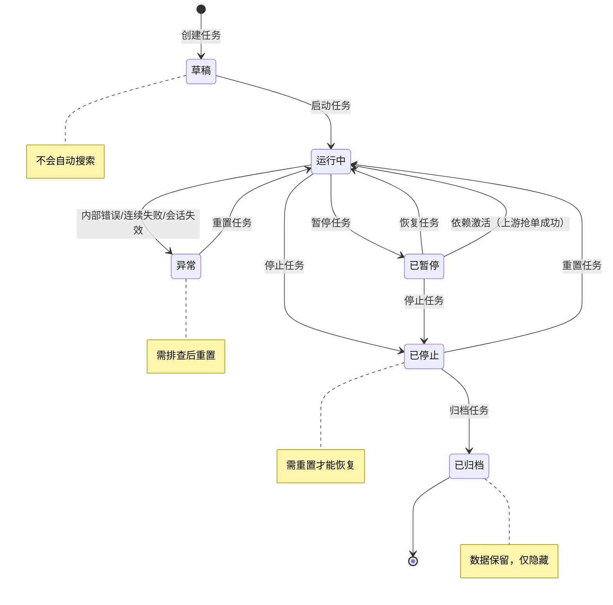

# 闲鱼猎人「任务管理」操作手册

| 属性     | 值                            |
| -------- | ----------------------------- |
| 文档版本 | v1.0                          |
| 文档日期 | 2026-07-05                    |
| 所属项目 | 闲鱼猎人                      |
| 所属菜单 | 数据查看 → 任务管理           |
| 文档类型 | 操作手册                      |
| 关联路由 | /tasks                        |
| 配套详细设计 | v2.0                      |
| 目标读者 | 运营 / 管理员                 |

---

## 目录

- [0. 阶段交接声明](#0-阶段交接声明)
- [1. 功能简介](#1-功能简介)
- [2. 入口与导航](#2-入口与导航)
- [3. 界面布局](#3-界面布局)
- [4. 操作指南](#4-操作指南)
  - [4.1 创建新任务（draft 状态）](#41-创建新任务draft-状态)
  - [4.2 启动任务（draft→running）](#42-启动任务draft→running)
  - [4.3 暂停任务（running→paused）](#43-暂停任务running→paused)
  - [4.4 恢复任务（paused→running）](#44-恢复任务paused→running)
  - [4.5 停止任务（running/paused→stopped）](#45-停止任务runningpaused→stopped)
  - [4.6 归档任务（stopped→archived）](#46-归档任务stopped→archived)
  - [4.7 编辑任务配置](#47-编辑任务配置)
  - [4.8 删除任务](#48-删除任务)
  - [4.9 查看任务详情（7 个 Tab）](#49-查看任务详情7-个-tab)
  - [4.10 重置任务状态](#410-重置任务状态)
  - [4.11 配置任务依赖（前置/后置任务）](#411-配置任务依赖前置后置任务)
  - [4.12 依赖激活机制说明](#412-依赖激活机制说明)
- [5. 字段说明](#5-字段说明)
- [6. 常见问题 FAQ](#6-常见问题-faq)
- [7. 注意事项与限制](#7-注意事项与限制)
- [8. 关联功能](#8-关联功能)
- [9. 快捷键与技巧](#9-快捷键与技巧)
- [10. 修订记录](#10-修订记录)
- [11. 附录](#11-附录)

---

## 0. 阶段交接声明

```
- 当前阶段：任务管理操作手册编写（v1.0） ✅ 已完成
- 下一阶段：商品中心操作手册编写
- 下一阶段智能体：文档编写智能体
- 下一阶段技能：文档编写
- 交接上下文：任务管理操作手册 v1.0 已完成，面向运营/管理员，覆盖 12 个操作场景（创建/启动/暂停/恢复/停止/归档/编辑/删除/详情/重置/依赖配置/依赖激活）、任务字段说明、12 条 FAQ、8 条注意事项、6 个关联功能、快捷键与技巧、任务状态机流程图与运行模式对比表。严格规避 API 路径/数据库表名/代码文件名等技术细节。
```

---

## 1. 功能简介

「任务管理」是闲鱼猎人系统的**任务生命周期管理入口**，位于「数据查看」一级菜单下，是日常运营最核心的操作页面。

通过本菜单，运营/管理员可以完成以下工作：

- **创建与配置监控任务**：通过 6 步向导快速创建闲鱼商品监控任务，设置关键词、价格区间、筛选标签、调度策略等
- **控制任务运行状态**：单个或批量启停任务，支持暂停、恢复、停止、归档等状态切换
- **查看任务运行详情**：在详情页查看任务概览、采集到的商品与卖家、事件流、运行记录、依赖关系与配置设置
- **编排任务依赖关系**：配置前置/后置任务，实现"上游抢单成功 → 下游自动激活"的组合捡漏工作流
- **使用智能建任务**：用自然语言描述需求，由 AI 自动解析为任务配置
- **复用任务模板**：从模板市场选择预置或私有模板，一键创建任务

> **提示**：任务管理是整个系统的运行入口，所有闲鱼监控、采集、评估、抢单行为都由任务驱动。建议新用户先阅读本手册第 4 章操作指南。

---

## 2. 入口与导航

### 2.1 菜单入口

任务管理位于系统左侧导航栏的「数据查看」分组下：

```
数据查看
  └── 任务管理   （图标：列表图标，排序：第 10 位）
```

### 2.2 进入方式

| 方式 | 操作 | 说明 |
|------|------|------|
| 菜单点击 | 展开左侧「数据查看」→ 点击「任务管理」 | 默认入口，推荐 |
| 快捷键 | 按 `g` 键，500ms 内按 `t` 键 | 快速跳转到任务管理 |
| 命令面板 | 按 `Ctrl+K` → 输入"任务" → 选择对应命令 | 模糊搜索，支持任意关键词 |
| URL 直接访问 | 在浏览器地址栏输入任务管理路径 | 刷新页面后自动恢复 |

### 2.3 子页面导航

任务管理包含 3 个子页面：

| 页面 | 路径 | 用途 |
|------|------|------|
| 任务列表 | `/tasks` | 默认入口，展示所有任务，支持创建/批量控制/关联浏览 |
| 任务编辑器 | `/tasks/new`（新建）或 `/tasks/{任务ID}/edit`（编辑） | 6 步向导，配置任务参数 |
| 任务详情 | `/tasks/{任务ID}` | 查看任务运行情况、关联数据、依赖关系等 |

> **提示**：在任务列表中点击任务名称可进入编辑器，点击「关联」列的按钮可进入详情页。

---

## 3. 界面布局

### 3.1 任务列表页

任务列表页自上而下分为 4 个区域：

```
┌─────────────────────────────────────────────────────────────┐
│  标题栏：任务管理 + [智能建任务] [模板市场] [新增任务]        │
├─────────────────────────────────────────────────────────────┤
│  工具栏：[全部启动] [自动实时搜索开关] [状态筛选] [视图切换]  │
├─────────────────────────────────────────────────────────────┤
│  批量操作条（勾选任务后显示）：                                │
│  [暂停] [恢复] [停止] [删除] [清除选择]                       │
├─────────────────────────────────────────────────────────────┤
│  任务表格 / 卡片视图                                          │
│  ┌──────┬──────┬──────┬──────┬──────┬──────┬──────┬──────┐  │
│  │任务名│关键词│价格  │模式  │状态  │采集  │下次  │操作  │  │
│  │      │      │区间  │      │      │周期  │搜索  │      │  │
│  ├──────┼──────┼──────┼──────┼──────┼──────┼──────┼──────┤  │
│  │ ...  │ ...  │ ...  │ ...  │ ...  │ ...  │ ...  │ ...  │  │
│  └──────┴──────┴──────┴──────┴──────┴──────┴──────┴──────┘  │
├─────────────────────────────────────────────────────────────┤
│  闲鱼内容关联面板（可折叠）                                   │
└─────────────────────────────────────────────────────────────┘
```

### 3.2 任务表格列说明

| 列名 | 内容 | 说明 |
|------|------|------|
| 任务名 | 任务名称（可点击） | 点击进入编辑器 |
| 关键词 | 搜索关键词 | 闲鱼搜索的关键词 |
| 价格区间 | ¥最低 ~ ¥最高 | 未设置时显示"不限" |
| 模式 | 全自动/半自动/需确认/仅通知 | 任务执行模式 |
| 状态 | 运行中/已暂停/已停止/已删除 | 彩色徽标，运行中为绿色 |
| 采集周期 | ⏱ 秒数 或 📅 Cron 表达式 | 当前生效的调度方式 |
| 下次搜索 | 倒计时秒数 | 运行中任务显示，<10 秒时变警示色 |
| 沉默指标 | 沉默 30d+/沉默 7d+/活跃/无活动 | 根据更新时间计算 |
| 关联 | 关联数量（可点击） | 点击进入详情页 |
| 操作 | 编辑/启停/停止/复制/另存为模板/删除 | 行内操作按钮 |

### 3.3 视图切换

- **表格视图**（桌面端默认）：信息密度高，适合批量操作
- **卡片视图**（移动端默认）：单任务信息更直观，适合触屏操作
- 切换后偏好会自动保存，刷新页面后保留

### 3.4 任务编辑器布局

任务编辑器采用 **6 步向导**布局，左侧为步骤导航，右侧为表单内容：

| 步骤 | 名称 | 主要配置 |
|------|------|----------|
| 1 | 基础信息 | 关键词、任务名、运行模式、实时预览搜索链接 |
| 2 | 价格与过滤 | 价格区间（双滑块）、最大发布天数、闲鱼筛选标签、排除词、地区 |
| 3 | 搜索参数 | 任务级搜索参数覆盖（每页条数、排序方式、超时、地区、筛选标签） |
| 4 | AI 评估 | 评估阈值、AI 评估提示词、自动采集官方商品开关、单次采集上限 |
| 5 | 反检测 | 全局配置只读概览（任务级不可覆盖） |
| 6 | 调度与确认 | 调度模式（固定间隔/Cron）、Cron 表达式、配置预览 |

> **提示**：编辑器会自动保存草稿到浏览器本地（防抖 500ms），意外关闭后再次进入可恢复。

### 3.5 任务详情页布局

任务详情页自上而下分为 3 个区域：

1. **任务基本信息卡**：展示任务名、关键词、状态、采集周期等，右侧为控制按钮（暂停/恢复/停止/编辑）
2. **趋势概览卡**：评估分、事件密度的迷你趋势图，支持 24 小时/3 天/7 天切换
3. **7 个 Tab 页签**：概览 / 商品 / 卖家 / 事件 / 运行记录 / 依赖 / 设置（详见 4.9 节）

---

## 4. 操作指南

### 4.1 创建新任务（draft 状态）

#### 操作步骤

1. 进入任务管理页面（左侧菜单「数据查看」→「任务管理」）
2. 点击页面右上角「新增任务」按钮
3. 进入 6 步向导，依次填写各步骤参数（见下方参数说明）
4. 完成第 6 步后，点击「确认创建」按钮
5. 任务以草稿状态创建，自动跳转到任务列表

#### 参数说明

| 步骤 | 参数 | 含义 | 示例 | 必填 |
|------|------|------|------|------|
| 1 基础信息 | 关键词 | 闲鱼搜索关键词（1-80 字符） | 索尼A7M4 | 是 |
| 1 基础信息 | 任务名 | 任务显示名称 | 上海二手相机 | 否 |
| 1 基础信息 | 运行模式 | 抢单自动化程度 | 仅通知 | 否 |
| 2 价格与过滤 | 最低价格 | 价格区间下限 | 5000 | 否 |
| 2 价格与过滤 | 最高价格 | 价格区间上限 | 12000 | 否 |
| 2 价格与过滤 | 最大发布天数 | 仅展示最近 N 天内商品 | 7 | 否 |
| 2 价格与过滤 | 闲鱼筛选标签 | 8 个标签多选 | 验货宝、包邮 | 否 |
| 2 价格与过滤 | 排除词 | 标题包含则过滤 | 翻新、维修 | 否 |
| 2 价格与过滤 | 地区 | 商品所在地区 | 上海 | 否 |
| 3 搜索参数 | 任务级覆盖 | 覆盖全局搜索参数 | 自定义排序 | 否 |
| 4 AI 评估 | 评估阈值 | 0-100，达标才进入抢单 | 75 | 否 |
| 4 AI 评估 | AI 评估提示词 | 任务级评估指引 | 优先检查快门次数 | 否 |
| 6 调度与确认 | 调度模式 | 固定间隔 / Cron 定时 | 固定间隔 | 是 |
| 6 调度与确认 | 固定间隔 | 30-3600 秒 | 60 | 否 |
| 6 调度与确认 | Cron 表达式 | 5 字段 Cron | `*/5 * * * *` | 否 |

#### 操作结果

- 任务创建成功，列表中出现新任务，状态显示为「草稿」
- 系统提示"任务创建成功"
- 草稿状态的任务不会自动开始搜索，需要手动启动

> **提示**：也可点击「智能建任务」按钮，输入自然语言描述（如"监控上海二手相机，5000-12000 元"），由 AI 自动解析并预填参数。

---

### 4.2 启动任务（draft→running）

#### 操作步骤

1. 在任务列表找到状态为「草稿」的任务
2. 在操作列点击「启动」按钮（▶ 图标）
3. 任务状态变为「运行中」（绿色徽标）
4. 调度器开始按配置的间隔或 Cron 表达式执行搜索

#### 参数说明

| 参数 | 含义 | 取值 |
|------|------|------|
| 启动方式 | 单个启动 / 批量启动 | 单个：操作列按钮；批量：勾选后点击工具栏「全部启动」 |
| 生效时间 | 启动后立即生效 | 草稿/已暂停状态可启动 |

#### 操作结果

- 任务状态变为「运行中」
- 「下次搜索」列开始倒计时
- 系统按调度策略自动执行搜索 → 评估 → 抢单流程

> **提示**：批量启动使用「全部启动」按钮，单次最多支持 200 个任务。

---

### 4.3 暂停任务（running→paused）

#### 操作步骤

1. 在任务列表找到状态为「运行中」的任务
2. 在操作列点击「暂停」按钮（⏸ 图标）
3. 任务状态变为「已暂停」（橙色徽标）
4. 当前正在执行的搜索轮次会跑完，下一轮不再开始

#### 参数说明

| 参数 | 含义 | 取值 |
|------|------|------|
| 暂停方式 | 单个暂停 / 批量暂停 | 单个：操作列；批量：勾选后点击批量操作条「暂停」 |
| 生效时机 | 当前轮跑完后暂停 | 不会中断正在进行的搜索 |

#### 操作结果

- 任务状态变为「已暂停」
- 「下次搜索」列停止倒计时
- 任务配置保持不变，恢复后继续按原调度执行

> **提示**：批量暂停适用于夜间维护场景，单次最多 200 个任务。

---

### 4.4 恢复任务（paused→running）

#### 操作步骤

1. 在任务列表找到状态为「已暂停」的任务
2. 在操作列点击「恢复」按钮（▶ 图标）
3. 任务状态变为「运行中」（绿色徽标）
4. 调度器重新开始按配置执行搜索

#### 参数说明

| 参数 | 含义 | 取值 |
|------|------|------|
| 恢复条件 | 登录态有效且不在冷却期 | 登录态失效或 5 分钟冷却期内会被拒绝 |
| 冷却期提示 | 剩余等待秒数 | "请 N 秒后重试，或重新登录后再恢复" |

#### 操作结果

- 任务状态变为「运行中」
- 「下次搜索」列恢复倒计时
- 如登录态失效，系统返回提示，需重新登录闲鱼后再恢复

> **提示**：如果任务因会话失效被系统自动暂停，恢复前请先到「反爬登录管理」确认登录态有效。

---

### 4.5 停止任务（running/paused→stopped）

#### 操作步骤

1. 在任务列表找到状态为「运行中」或「已暂停」的任务
2. 在操作列点击「停止」按钮（⏹ 图标）
3. 按钮变为「确认停止」+「取消」（行内二次确认，5 秒内未确认自动撤销）
4. 点击「确认停止」，任务状态变为「已停止」（灰色徽标）

#### 参数说明

| 参数 | 含义 | 取值 |
|------|------|------|
| 二次确认 | 5 秒超时自动撤销 | 防止误操作 |
| 停止方式 | 单个停止 / 批量停止 | 批量：勾选后点击批量操作条「停止」 |
| 当前轮处理 | 等待当前轮结束（最长 30 秒） | 不会强制中断进行中的搜索 |

#### 操作结果

- 任务状态变为「已停止」
- 调度器移除该任务的调度
- 任务配置与历史数据保留，可通过「重置」重新启动

> **提示**：停止是较重的操作，如只是临时不想搜索，建议使用「暂停」而非「停止」。

---

### 4.6 归档任务（stopped→archived）

#### 操作步骤

1. 在任务列表找到状态为「已停止」的任务
2. 在操作列点击「归档」按钮（📦 图标）
3. 弹出确认对话框，提示归档后任务将从列表隐藏
4. 点击「确认归档」，任务状态变为「已归档」

#### 参数说明

| 参数 | 含义 | 取值 |
|------|------|------|
| 前置状态 | 仅「已停止」状态可归档 | 运行中/已暂停需先停止 |
| 列表显示 | 归档后默认不在列表显示 | 可通过状态筛选查看 |

#### 操作结果

- 任务状态变为「已归档」
- 任务从默认列表中隐藏（可通过状态筛选查看）
- 任务数据保留，可随时取消归档恢复

> **提示**：归档适用于已完成或长期不用的任务，避免列表过于臃肿。归档不会删除任何数据。

---

### 4.7 编辑任务配置

#### 操作步骤

1. 在任务列表找到目标任务
2. 点击任务名称（蓝色链接）或操作列「编辑」按钮
3. 进入 6 步向导编辑器，左侧步骤导航可快速跳转
4. 修改需要调整的参数
5. 点击底部「保存修改」按钮
6. 系统提示"保存成功"，返回任务列表

#### 参数说明

| 参数 | 含义 | 取值 |
|------|------|------|
| 可编辑状态 | 所有状态均可编辑 | 运行中编辑不影响当前轮，下一轮生效 |
| 草稿恢复 | 自动保存到浏览器本地 | 防抖 500ms，意外关闭可恢复 |
| 配置覆盖 | 任务级配置覆盖全局配置 | 留空=沿用全局；填写=覆盖 |

#### 操作结果

- 任务配置更新成功
- 运行中任务在下一轮调度时应用新配置
- 修改调度模式（固定间隔↔Cron）后立即生效

> **提示**：如需清除某个任务级覆盖配置（恢复使用全局值），在编辑器中将对应字段留空并保存即可。

---

### 4.8 删除任务

#### 操作步骤

1. 在任务列表找到目标任务
2. 在操作列点击「删除」按钮（🗑 图标）
3. 按钮变为「确认删除」+「取消」（行内二次确认，5 秒内未确认自动撤销）
4. 点击「确认删除」
5. 任务及其关联数据被清除

#### 参数说明

| 参数 | 含义 | 取值 |
|------|------|------|
| 二次确认 | 5 秒超时自动撤销 | 防止误操作 |
| 删除方式 | 单个删除 / 批量删除 | 批量：勾选后点击批量操作条「删除」 |
| 关联清理 | 自动清理商品、卖家、事件、抢单、依赖、评估数据 | 不可恢复 |

#### 操作结果

- 任务及其所有关联数据被清除
- 任务从列表中消失
- 删除操作不可撤销，请谨慎操作

> **警告**：删除任务会同时删除该任务采集的所有商品、卖家、事件、抢单记录、依赖关系和评估数据。如需保留数据，请使用「归档」而非「删除」。

---

### 4.9 查看任务详情（7 个 Tab）

#### 操作步骤

1. 在任务列表找到目标任务
2. 点击「关联」列的按钮，或点击任务名后切换到详情视图
3. 进入任务详情页，顶部显示任务基本信息卡与趋势概览卡
4. 下方为 7 个 Tab 页签，点击切换查看不同维度信息

#### 7 个 Tab 说明

| Tab 名称 | 内容 | 用途 |
|----------|------|------|
| 概览 | 任务基本信息、评估分趋势、事件密度迷你图 | 快速了解任务整体运行情况 |
| 商品 | 该任务采集到的所有商品列表 | 浏览商品详情、手动添加、实时查询 |
| 卖家 | 该任务关联的所有卖家列表 | 浏览卖家信息、手动添加 |
| 事件 | 该任务的事件流时间线 | 排查任务执行问题、追踪抢单过程 |
| 运行记录 | 按 5 分钟聚合的运行统计 | 分析任务运行密度、空闲间隔 |
| 依赖 | 前置/后置任务依赖关系 | 编排任务依赖、查看依赖链 |
| 设置 | 任务配置参数（同编辑器） | 快速查看与修改任务配置 |

#### 参数说明

| Tab | 可选操作 | 时间窗 |
|-----|----------|--------|
| 概览 | 切换 24 小时/3 天/7 天趋势 | 默认 24 小时 |
| 商品 | 实时查询、手动添加、解除关联、查看被过滤结果 | 支持关键词/地区/品牌筛选 |
| 卖家 | 手动添加、解除关联 | — |
| 事件 | 按事件类型/级别筛选 | 默认 24 小时 |
| 运行记录 | 切换 24 小时/3 天/7 天 | 默认 24 小时，最大 30 天 |
| 依赖 | 添加/删除上游依赖、查看下游依赖 | — |
| 设置 | 编辑任务配置 | — |

#### 操作结果

- 可全面了解任务运行情况
- 支持在详情页直接执行控制操作（暂停/恢复/停止/编辑）
- 商品 Tab 中的「实时查询」按钮可触发实时搜索并显示 7 阶段进度

> **提示**：运行记录 Tab 中的"空闲间隔"表示任务超过 30 分钟未运行的时间段，可用于排查任务是否被异常暂停。

---

### 4.10 重置任务状态

#### 操作步骤

1. 在任务列表找到状态为「已停止」或「异常」的任务
2. 在操作列点击「重置」按钮（↻ 图标）
3. 弹出确认对话框，提示重置会清除运行上下文
4. 点击「确认重置」
5. 任务状态变为「运行中」

#### 参数说明

| 参数 | 含义 | 取值 |
|------|------|------|
| 前置状态 | 已停止/异常状态可重置 | 草稿/已暂停不可重置 |
| 运行上下文 | 清除错误计数、冷却期等运行时状态 | 任务配置不变 |
| 重置后状态 | 直接进入「运行中」 | 等同于停止后启动 |

#### 操作结果

- 任务运行上下文被清除（错误计数、冷却期等）
- 任务状态变为「运行中」
- 调度器重新注册并开始调度

> **提示**：任务因连续失败被自动暂停或进入异常状态后，建议先排查原因（查看事件 Tab），修复后再重置。

---

### 4.11 配置任务依赖（前置/后置任务）

#### 操作步骤

1. 进入目标任务详情页
2. 切换到「依赖」Tab
3. 上方显示「上游依赖」列表（本任务依赖哪些任务）
4. 下方显示「下游依赖」列表（哪些任务依赖本任务）
5. 在「上游依赖」区域点击「添加依赖」按钮
6. 在弹出的输入框中选择或输入前置任务
7. 点击「确认添加」

#### 参数说明

| 参数 | 含义 | 取值 |
|------|------|------|
| 上游依赖 | 本任务依赖的前置任务 | 可添加多个 |
| 下游依赖 | 依赖本任务的后置任务 | 只读展示 |
| 循环依赖检测 | 自动检测 A→B→A 循环 | 形成循环时拒绝添加 |
| 自依赖 | 不能依赖自身 | 自动拒绝 |

#### 操作结果

- 依赖关系添加成功，上游依赖列表出现新项
- 当上游任务的抢单订单变为「成功」状态时，本任务若处于「已暂停」状态会被自动激活
- 删除依赖：点击上游依赖项右侧的「删除」按钮

> **提示**：依赖激活仅对「已暂停」状态的下游任务生效。如果下游任务处于「已停止」状态，不会被自动激活，避免误启动用户主动停止的任务。

---

### 4.12 依赖激活机制说明

#### 激活流程

当任务 A 依赖任务 B（A 是下游，B 是上游）时：

1. 任务 B 正常运行，搜索到商品并抢单成功
2. 抢单订单状态变为「成功」
3. 系统自动检查任务 B 的所有下游依赖任务
4. 如果任务 A 处于「已暂停」状态，自动将其状态切换为「运行中」
5. 任务 A 开始按自己的调度策略执行搜索

#### 参数说明

| 参数 | 含义 | 取值 |
|------|------|------|
| 触发条件 | 上游任务的订单状态变为「成功」 | 仅此一个触发点 |
| 激活对象 | 仅「已暂停」状态的下游任务 | 运行中/已停止/异常状态不激活 |
| 激活后状态 | 「运行中」 | 自动切换 |
| 事件记录 | 在下游任务的事件流中记录"依赖触发" | 可在事件 Tab 查看 |

#### 操作结果

- 下游任务自动从「已暂停」变为「运行中」
- 下游任务的事件 Tab 中出现"依赖触发"事件，记录上游任务信息
- 下游任务开始独立执行搜索，与上游任务无运行时耦合

> **提示**：依赖激活是"一次性触发"，不会形成持续联动。下游任务被激活后，其后续状态切换（暂停/停止）需要手动操作。

#### 典型应用场景

**组合捡漏工作流**：

- 任务 A：监控"索尼 A7M4 相机机身"，找到合适商品后抢单
- 任务 B：监控"索尼 FE 24-70 镜头"，初始状态为「已暂停」
- 配置：任务 B 依赖任务 A
- 效果：当任务 A 抢单成功（买到相机机身），任务 B 自动激活开始监控镜头

---

## 5. 字段说明

### 5.1 任务列表字段

| 字段名 | 含义 | 示例 | 可编辑 |
|--------|------|------|--------|
| 任务名称 | 任务的显示名称 | 上海二手相机 | 是 |
| 关键词 | 闲鱼搜索关键词 | 索尼A7M4 | 是 |
| 价格区间 | 最低价 ~ 最高价 | ¥5000 ~ ¥12000 | 是 |
| 运行模式 | 抢单自动化程度 | 仅通知 | 是 |
| 任务状态 | 当前生命周期状态 | 运行中 | 是（通过控制按钮） |
| 采集周期 | 调度方式与间隔 | ⏱ 60秒 / 📅 `*/5 * * * *` | 是 |
| 下次搜索 | 距离下次搜索的倒计时 | 23秒 | 否（自动计算） |
| 沉默指标 | 任务活跃度分类 | 活跃 | 否（自动计算） |
| 关联数 | 关联的商品与卖家数量 | 150 | 否（自动统计） |

### 5.2 任务配置字段

| 字段名 | 含义 | 示例 | 可编辑 |
|--------|------|------|--------|
| 关键词 | 闲鱼搜索关键词（1-80 字符） | 索尼A7M4 | 是 |
| 任务名称 | 任务显示名称 | 上海二手相机 | 是 |
| 最低价格 | 价格区间下限 | 5000 | 是 |
| 最高价格 | 价格区间上限 | 12000 | 是 |
| 最大发布天数 | 仅展示最近 N 天内发布的商品 | 7 | 是 |
| 排除词 | 标题包含则过滤的词 | 翻新、维修 | 是 |
| 地区 | 商品所在地区 | 上海 | 是 |
| 闲鱼筛选标签 | 8 个标签多选 | 验货宝、包邮 | 是 |
| 运行模式 | auto/semi_auto/confirm/notify | 仅通知 | 是 |
| 调度模式 | 固定间隔 / Cron 定时 | 固定间隔 | 是 |
| 固定间隔 | 调度循环秒数（30-3600） | 60 | 是 |
| Cron 表达式 | 5 字段定时表达式 | `*/5 * * * *` | 是 |
| 评估阈值 | 0-100，达标才进入抢单 | 75 | 是 |
| AI 评估提示词 | 任务级评估指引 | 优先检查快门次数 | 是 |
| 通知渠道 | 通知推送渠道 | 邮件、微信 | 是 |
| 搜索配置 | 任务级搜索参数覆盖 | 自定义排序方式 | 是 |
| 价格策略配置 | 任务级价格策略覆盖 | 自定义砍价幅度 | 是 |
| 评估配置 | 任务级评估参数覆盖 | 自动采集官方商品 | 是 |
| 创建时间 | 任务创建的时间戳 | 2026-07-05 10:00 | 否 |
| 更新时间 | 最近一次修改时间 | 2026-07-05 14:30 | 否 |

### 5.3 闲鱼筛选标签

| 标签名 | 含义 |
|--------|------|
| 个人闲置 | 仅展示个人发布的闲置商品 |
| 验货宝 | 官方验真商品 |
| 验号担保 | 验号担保商品 |
| 包邮 | 包邮商品 |
| 超赞鱼小铺 | 超赞鱼小铺商品 |
| 全新 | 全新成色商品 |
| 严选 | 严选商品 |
| 转卖 | 转卖类商品 |

### 5.4 运行模式说明

| 模式 | 名称 | 行为 | 适用场景 |
|------|------|------|----------|
| 全自动 | auto | 评估通过后直接抢单 | 高置信度商品，抢时间 |
| 半自动 | semi_auto | 评估通过后推送通知，用户确认后抢单 | 需要人工复核的高价值商品 |
| 需确认 | confirm | 仅推送通知，不抢单（默认最保守） | 监控为主，手动下单 |
| 仅通知 | notify | 仅推送商品信息 | 纯信息收集 |

---

## 6. 常见问题 FAQ

### Q1：新建任务后为什么不立即开始搜索？

**A**：新建任务默认处于「草稿」状态，需要手动点击「启动」按钮才会进入「运行中」状态并开始调度。这样设计是为了让用户在创建后有机会再次核对配置。

### Q2：任务被自动暂停，提示"会话失效冷却期内"怎么办？

**A**：任务因闲鱼会话失效（如登录掉线、被反爬拦截）会被系统自动暂停，并进入 5 分钟冷却期。请等待冷却期结束（提示中会显示剩余秒数），并到「反爬登录管理」确认登录态有效后，再点击「恢复」按钮。

### Q3：批量操作最多支持多少个任务？

**A**：批量暂停/恢复/停止/删除单次最多支持 200 个任务。如果勾选超过 200 个，系统会提示超出限制。批量操作仅修改任务状态，不会中断正在执行的搜索轮次。

### Q4：删除任务后数据还能恢复吗？

**A**：不能。删除任务会清除该任务的所有关联数据，包括采集的商品、卖家、事件、抢单记录、依赖关系和评估记录。如需保留数据，请使用「归档」而非「删除」。归档仅隐藏任务，不删除任何数据。

### Q5：Cron 表达式和固定间隔可以同时设置吗？

**A**：可以同时填写，但同一时间只有一个生效。通过「调度模式」开关决定使用哪个：选择「固定间隔」则按间隔秒数调度，选择「Cron 定时」则按 Cron 表达式调度。这样设计是为了方便用户随时切换调度方式而不丢失另一方的配置。

### Q6：任务依赖的下游任务为什么没有被自动激活？

**A**：依赖激活仅对「已暂停」状态的下游任务生效。如果下游任务处于「已停止」或「异常」状态，不会被自动激活。这是为了避免误启动用户主动停止的任务。请将下游任务手动切换到「已暂停」状态，下次上游抢单成功时就会自动激活。

### Q7：实时查询时提示"闲鱼登录 Cookie 已过期"怎么办？

**A**：请到「反爬登录管理」菜单重新登录闲鱼，登录成功后回到任务管理重新点击「实时查询」。系统会自动检测登录态，缺失/过期/陈旧三类问题都会被识别并提示。

### Q8：任务运行记录中的"空闲间隔"是什么意思？

**A**：空闲间隔指任务超过 30 分钟未运行的时间段。可能是任务被暂停、调度异常或系统重启导致。运行记录 Tab 中会展示前 5 条空闲间隔，帮助排查任务运行异常。

### Q9：价格区间留空和不留空有什么区别？

**A**：留空表示不限制价格（搜索所有价格区间的商品）；填写后系统会自动过滤超出区间的商品。价格区间采用双滑块设置，最低价留空表示无下限，最高价留空表示无上限。

### Q10：任务级配置覆盖和全局配置有什么关系？

**A**：任务级配置优先于全局配置。如果任务级配置留空，则完全沿用全局配置；如果任务级配置填写了部分字段，则与全局配置深度合并，任务级字段优先。这样可以针对单个任务做个性化调整而不影响其他任务。

### Q11：智能建任务解析失败怎么办？

**A**：智能建任务依赖 AI 服务，解析失败可能是网络问题或 AI 服务未配置。请尝试：1）重新描述需求，尽量明确（如包含关键词、价格、地区）；2）检查 AI 服务配置；3）解析失败时可手动进入 6 步向导填写。

### Q12：任务状态有哪些？分别是什么含义？

**A**：任务共 6 个状态：草稿（新建未启动）、运行中（正在执行搜索）、已暂停（临时停止，可恢复）、已停止（永久停止，需重置）、已归档（隐藏不删除）、异常（内部错误，需排查）。状态切换遵循生命周期，部分操作不可逆（如删除）。

### Q13：固定间隔最短可以设置多少秒？

**A**：固定间隔最短 30 秒，最长 3600 秒（1 小时）。过短的间隔可能触发闲鱼反爬机制，建议根据商品热门程度合理设置。冷门商品可设置较长间隔（5-10 分钟），热门抢手商品可设置较短间隔（1-2 分钟）。

### Q14：如何让一个任务只搜索一次而不持续监控？

**A**：有两种方式：1）创建任务后不启动，使用详情页「商品」Tab 的「实时查询」按钮手动触发单次搜索；2）将固定间隔设置为较大值（如 3600 秒），启动后搜索一轮立即停止任务。

---

## 7. 注意事项与限制

### 7.1 抢单冷却限制

同一商品 **30 秒内不能重复抢单**。这是为了避免对闲鱼下单接口的冲击，也是反爬策略的一部分。如果抢单失败后想重试，请等待 30 秒。

### 7.2 实时搜索数据缓存

实时搜索结果会缓存 **60 秒**。60 秒内再次点击「实时查询」会直接返回缓存结果，不会真正访问闲鱼。如需强制刷新，请等待缓存过期后再查询。

### 7.3 登录态失效检测

系统会自动检测闲鱼登录态，包括三类问题：缺失（关键 Cookie 丢失）、过期（Cookie 已失效）、陈旧（Cookie 值与登录态不一致）。检测到问题时，实时搜索会被拒绝并提示对应错误码。请到「反爬登录管理」重新登录。

### 7.4 任务状态机部分不可逆

任务状态切换遵循生命周期规则，部分操作不可逆：
- **删除**：不可恢复，所有关联数据被清除
- **归档**：可取消归档，但建议长期不用的任务才归档
- 「已停止」状态不能直接「恢复」，需要使用「重置」重新启动

### 7.5 批量操作上限

批量暂停/恢复/停止/删除单次最多 **200 个任务**。批量操作仅修改任务状态，不会立即同步到调度器内存，下一轮调度时自动生效。如需立即生效，请逐个操作。

### 7.6 任务恢复冷却期

任务因会话失效被自动暂停后，进入 **5 分钟冷却期**。冷却期内点击「恢复」会被拒绝，提示剩余等待秒数。这是为了避免用户反复点击恢复触发闲鱼反爬封禁。

### 7.7 关键词长度限制

任务关键词长度限制为 **1-80 字符**。超出范围系统会拒绝创建或修改。关键词过短可能导致搜索结果过多噪音，过长可能匹配不到商品，建议使用具体商品型号或品牌+型号组合。

### 7.8 评估阈值范围

任务级评估阈值范围为 **0-100**。设置为 0 表示所有商品都通过评估，设置为 100 表示几乎无商品通过。建议初始设置为 60-75，根据评估准确度逐步调整。

### 7.9 全局并发限制

系统同一时间只允许 **一个任务执行搜索**（全局并发锁）。多任务并发时会串行排队，避免同时打开多个浏览器页面触发反爬。这不是bug，而是反爬策略。

### 7.10 行内二次确认超时

停止/删除操作采用行内二次确认，**5 秒内未点击确认会自动撤销**。这是为了防止误操作。如果撤销后仍需操作，请重新点击对应按钮。

---

## 8. 关联功能

任务管理与以下菜单存在联动关系：

| 关联菜单 | 联动关系 | 说明 |
|----------|----------|------|
| 商品中心 | 数据联动 | 任务采集的商品会同步到商品中心，可在商品中心查看所有任务采集的商品汇总 |
| 卖家评估 | 数据联动 | 任务关联的卖家可在卖家评估菜单查看详细信息与历史评估记录 |
| 抢单记录 | 数据联动 | 任务的抢单订单在抢单记录菜单统一管理，订单状态变更触发依赖激活 |
| 事件时间线 | 数据联动 | 任务执行过程中产生的事件（搜索/评估/抢单）在事件时间线菜单统一展示 |
| 实时日志 | 运行监控 | 任务运行时的日志在实时日志菜单查看，用于排查任务异常 |
| 价格行情 | 配置参考 | 任务的价格区间配置可参考价格行情菜单的市场价格数据 |
| 反爬登录管理 | 前置依赖 | 任务实时搜索依赖闲鱼登录态，登录态失效时需到反爬登录管理重新登录 |
| 系统配置 | 全局默认 | 任务级配置留空时沿用系统配置菜单中的全局默认值 |

> **提示**：任务管理是数据查看菜单的核心，理解它与其他菜单的联动关系有助于高效运维。

---

## 9. 快捷键与技巧

### 9.1 快捷键

| 快捷键 | 作用 | 备注 |
|--------|------|------|
| `Ctrl+K`（或 `⌘+K`） | 打开命令面板 | 可模糊搜索任意菜单或命令 |
| `Escape` | 关闭命令面板 | 仅在命令面板打开时生效 |
| `g` 然后按 `t` | 跳转到任务管理 | g 前缀序列，500ms 内按第二键 |
| `g` 然后按 `o` | 跳转到抢单记录 | 查看任务抢单订单 |
| `g` 然后按 `e` | 跳转到卖家评估 | 查看关联卖家 |
| `g` 然后按 `i` | 跳转到事件时间线 | 查看任务事件 |
| `g` 然后按 `l` | 跳转到实时日志 | 查看运行日志 |

> 输入框、文本域、下拉框内不触发快捷键，避免干扰正常输入。

### 9.2 实用技巧

**技巧 1：智能建任务快速起步**

新用户不知如何配置任务参数时，点击「智能建任务」，用自然语言描述需求（如"监控上海地区二手相机，5000-12000 元，只要验货宝商品"），AI 会自动解析并预填参数。

**技巧 2：模板市场复用配置**

将常用任务配置保存为私有模板，下次创建类似任务时从模板市场一键应用，避免重复填写。预置模板覆盖相机、游戏、球鞋、票务、数码等常见品类。

**技巧 3：批量操作夜间维护**

夜间维护时，勾选多个任务（最多 200 个），使用批量操作条一次性暂停/停止，无需逐个点击。维护完成后批量恢复。

**技巧 4：依赖编排组合捡漏**

配置"上游抢单成功 → 下游自动激活"的依赖链，实现组合捡漏。例如：监控到相机身后自动激活镜头监控任务，无需人工干预。

**技巧 5：运行记录排查异常**

任务运行异常时，查看详情页「运行记录」Tab，关注"空闲间隔"（超过 30 分钟未运行的时间段）和错误数趋势，快速定位问题时间点。

**技巧 6：实时查询验证配置**

新建任务后先不启动，在详情页「商品」Tab 点击「实时查询」，验证关键词和筛选条件是否匹配到预期商品，避免启动后空跑浪费资源。

**技巧 7：视图切换适应场景**

桌面端用表格视图批量操作，移动端用卡片视图浏览，偏好自动保存。批量勾选时表格视图更高效。

**技巧 8：草稿自动恢复**

任务编辑器意外关闭（如刷新页面）后再次进入，草稿会自动恢复，无需重新填写。系统每 500ms 自动保存一次。

---

## 10. 修订记录

| 版本 | 日期 | 修订人 | 修订内容 |
|------|------|--------|----------|
| v1.0 | 2026-07-05 | 文档编写智能体 | 初版操作手册，覆盖 12 个操作场景、任务字段说明、14 条 FAQ、10 条注意事项、8 个关联功能、快捷键与技巧、任务状态机流程图与运行模式对比表 |

---

## 11. 附录

### 11.1 任务状态机流程图



**状态说明**：

| 状态 | 颜色 | 含义 | 可执行操作 |
|------|------|------|------------|
| 草稿 | 灰色 | 新建未启动 | 启动、编辑、删除 |
| 运行中 | 绿色 | 正在执行搜索 | 暂停、停止、编辑 |
| 已暂停 | 橙色 | 临时停止 | 恢复、停止、编辑 |
| 已停止 | 灰色 | 永久停止 | 重置、归档、编辑、删除 |
| 已归档 | 灰色 | 隐藏保留 | 取消归档、删除 |
| 异常 | 红色 | 内部错误 | 重置、编辑、删除 |

### 11.2 任务运行模式对比表

系统支持三种运行模式，适用于不同场景：

| 维度 | 实时模式（realtime） | 单次模式（once） | 定时模式（scheduled） |
|------|----------------------|------------------|----------------------|
| **执行方式** | 持续搜索，固定间隔循环 | 单次采集，手动触发 | 按 Cron 表达式定时执行 |
| **配置方式** | 调度模式选「固定间隔」，间隔设置较短（30-120 秒） | 不启动任务，使用详情页「实时查询」按钮 | 调度模式选「Cron 定时」，填写 Cron 表达式 |
| **资源占用** | 高（频繁搜索） | 低（仅一次） | 中（按计划执行） |
| **反爬风险** | 较高（需合理设置间隔） | 低 | 低 |
| **适用场景** | 热门抢手商品，需快速响应 | 验证关键词效果，临时查询 | 常规监控，按计划采集 |
| **数据缓存** | 60 秒缓存，避免重复搜索 | 60 秒缓存 | 60 秒缓存 |
| **抢单冷却** | 30 秒冷却，避免重复抢单 | 30 秒冷却 | 30 秒冷却 |
| **登录态检测** | 自动检测，失效自动暂停 | 自动检测，失效拒绝查询 | 自动检测，失效自动暂停 |
| **典型示例** | 监控限量球鞋，60 秒间隔 | 验证"索尼A7M4"关键词匹配度 | 每天 9 点采集一次相机商品，Cron `0 9 * * *` |

**模式选择建议**：

- **新关键词验证**：先用「单次模式」实时查询，确认匹配效果
- **热门商品抢购**：用「实时模式」短间隔监控，搭配全自动模式
- **常规信息收集**：用「定时模式」Cron 调度，搭配仅通知模式
- **高价值商品复核**：用「定时模式」+ 半自动模式，人工确认后抢单

### 11.3 任务调度模式对照

| 调度模式 | 配置字段 | 取值范围 | 默认值 |
|----------|----------|----------|--------|
| 固定间隔 | 间隔秒数 | 30-3600 秒 | 60 秒 |
| Cron 定时 | Cron 表达式 | 5 字段标准 Cron | `*/5 * * * *`（每 5 分钟） |

**常用 Cron 表达式示例**：

| 表达式 | 含义 |
|--------|------|
| `*/5 * * * *` | 每 5 分钟 |
| `*/30 * * * *` | 每 30 分钟 |
| `0 * * * *` | 每小时整点 |
| `0 9 * * *` | 每天 9:00 |
| `0 9,12,18 * * *` | 每天 9:00、12:00、18:00 |
| `0 9 * * 1-5` | 工作日 9:00 |
| `0 0 * * *` | 每天 0:00 |
