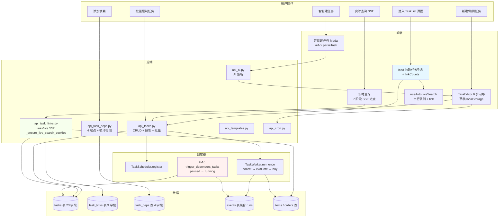
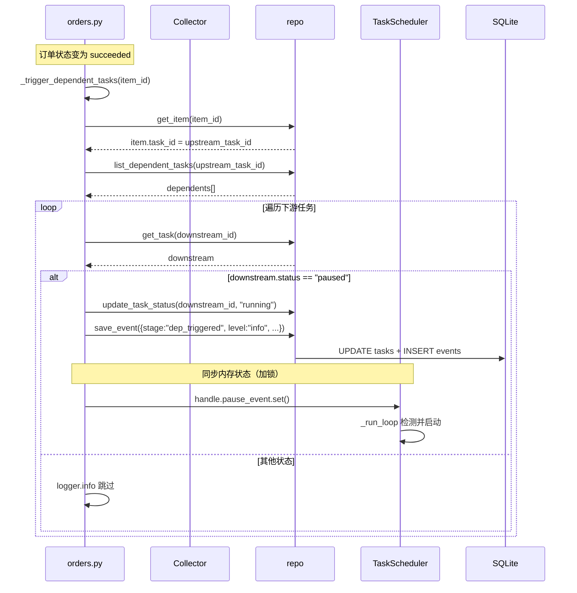
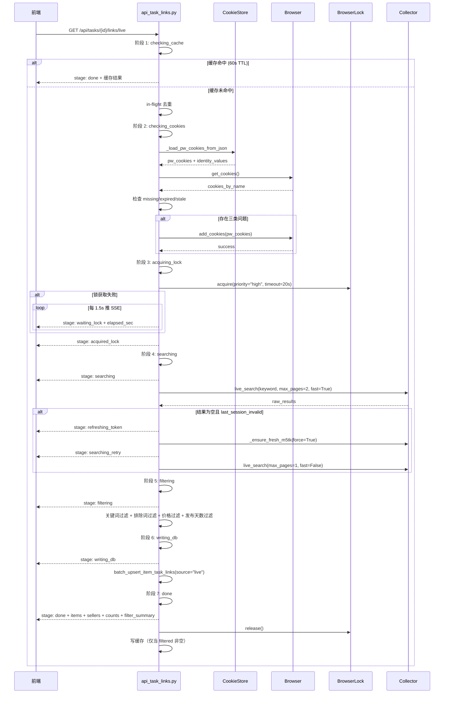
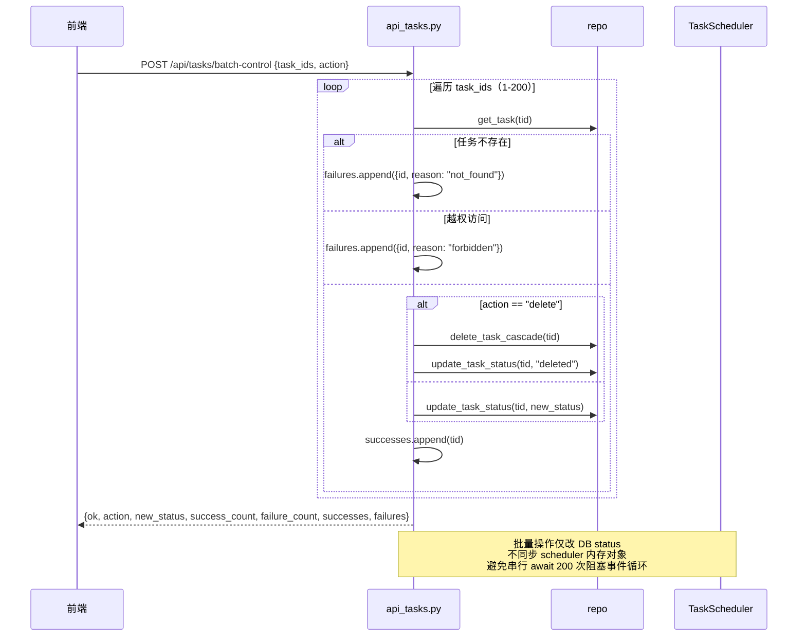

# 闲鱼猎人「任务管理」模块需求规格说明书

| 项 | 内容 |
|---|---|
| 文档版本 | v1.0 |
| 文档日期 | 2026-07-05 |
| 文档状态 | 初版（与详细设计 v2.0 对齐） |
| 所属项目 | 闲鱼猎人（XianyuHunter） |
| 所属菜单 | 数据查看 → 任务管理 |
| 菜单标识 | `menu_registry.yaml` 中 `key=tasks`、`icon=UnorderedListOutlined`、`sort_order=10`、`category=data_view` |
| 关联路由 | 前端 `/tasks`、`/tasks/new`、`/tasks/{id}/edit`、`/tasks/{id}`；后端 `/api/tasks/*`、`/api/tasks/{id}/deps/*`、`/api/tasks/{id}/links/*`、`/api/tasks/links/*`、`/api/ai/parse-task`、`/api/templates/*`、`/api/cron/*` |
| 关联文档 | [任务管理-详细设计.md](任务管理-详细设计.md)（v2.0/2026-07-05） |
| 文档类型 | 需求规格说明书（SRS） |

> **本文档首段：继承 project_memory.md 中的硬约束。** 1. Web 进程必须使用 `with_browser=False` 模式；2. 认证白名单机制（不适用本模块）；3. 前端 fetch 必须含 `credentials: 'include'`；4. 401 必须返回 JSON；5. token 比较使用 `hmac.compare_digest()`；6. 敏感字段不日志；7. token 写失败触发 `logging.warning()`；8. 模块级 import；9. DB 索引齐全；10. COUNT 查询 CASE WHEN 聚合；11. WebView2 子进程 `CREATE_NEW_CONSOLE`；12. WebView2 `private_mode=False`。

---

## 0. 阶段交接声明

```
- 当前阶段：任务管理 SRS 编写（v1.0） ✅ 已完成
- 下一阶段：概要设计/详细设计对齐校验 + 数据查看菜单其余 SRS 汇总
- 下一阶段智能体：主智能体
- 下一阶段技能：通用（无）
- 交接上下文：
  · 本文档定义「数据查看 → 任务管理」二级菜单完整需求 v1.0
  · 关键设计决策：3 个前端页面（TaskList / TaskEditor 6 步向导 / TaskDetail 4 Tab）+ 11 大功能模块（FR-1~FR-11）
  · 17 个 API 端点（任务 CRUD 5 + 任务控制 2 + 任务依赖 4 + 任务关联 7 + 模板 3 + AI 1 + cron 2）
  · 3 张表（tasks / task_links / task_deps）+ 5 个枚举
  · F-16 任务依赖：上游 succeeded 订单触发下游 paused → running 自动激活
  · SSE 实时搜索：7 阶段流式响应
  · Cookie 三类检查：missing / expired / stale + JSON 补注入
  · 任务级配置覆盖三态语义
  · 闲鱼筛选标签 8 个
  · 批量控制单次上限 200
```

---

## 1. 引言

### 1.1 编写目的

本需求规格说明书定义「数据查看 → 任务管理」二级菜单的完整需求规格，作为前端/后端开发、测试与验收的唯一依据。

**目标读者**：
- 后端开发工程师：依据 §3-§6、§8、§10 进行模块实现与扩展
- 前端开发工程师：依据 §4、§9 进行页面开发
- 测试工程师：依据 §7、§11 编写测试用例与执行验收
- 项目经理：依据 §2、§11 进行范围与里程碑管理
- 智能客服 KB 训练：本文档与 [任务管理-详细设计.md](任务管理-详细设计.md) 共同作为 KB 检索素材

### 1.2 项目背景

闲鱼猎人（XianyuHunter）是一个闲鱼自动捡漏与抢单工具，已具备任务管理、商品采集、AI 评估、自动下单、多渠道通知等完整能力（详见 [requirements.md](../requirements.md)、[design.md](../design.md) 与 [概要设计文档.md](../概要设计文档.md)）。

随着系统运行规模扩大，**任务管理相关的核心能力目前分散在多个模块（api_tasks / api_task_deps / api_task_links / scheduler / worker / collector / evaluator）**，缺乏统一的运维入口，导致以下痛点：

| 痛点 | 现状 | 影响 |
|------|------|------|
| 任务 CRUD 散落 | `api_tasks.py` 单文件 5 端点，与依赖/关联/模板分离 | 多文件协作时代码认知成本高 |
| 启停控制缺乏批量能力 | 单任务 control 5 端点，无批量 | 夜间维护 200 任务需逐个点击 |
| 任务依赖关系不可见 | `task_deps` 表存在但 UI 缺失 | 复杂工作流（A 订单触发 B 监控）无法配置 |
| 任务-内容关联双轨分离 | DB 模式 `links` + SSE 实时 `links/live` 各自独立 | 前端需手动管理两套数据 |
| 任务级配置无法覆盖 | 4 个 config JSON 字段存在但无深度合并 | 单一商品配置变更需改全局 |
| 智能建任务缺失 | 关键词/价格/模式需逐项填表 | 新手配置门槛高 |
| 模板市场无入口 | 私有模板/预置模板无浏览入口 | 重复配置无法复用 |
| 调度模式语义模糊 | cron 与 interval_seconds 同时存在但无 `use_cron` 开关 | 用户不清楚当前调度使用哪种 |
| 运行历史不存在 | `task_runs` 表不存在，需 events 聚合 | 用户无法直观看到任务运行密度 |
| Cookie 状态隐式恢复 | 实时搜索时静默补注入，缺前端反馈 | 用户不知道为什么重登录后仍能搜 |
| 闲鱼筛选标签映射缺失 | `XIANYU_FILTER_MAP` 仅在 domain/task.py 定义 | 标签 UI 与 URL 参数映射无显式契约 |

**解决方案**：将 `api_tasks.py` / `api_task_deps.py` / `api_task_links.py` 三套路由 + `domain/task.py` + `modules/scheduler.py` 全部能力通过 17 个端点 + 3 个前端页面统一暴露；同时定义闲鱼筛选标签契约、任务级配置三态合并语义、F-16 依赖自动激活、Cookie 三类检查与补注入机制，**让任务运维可视化、批量可控、依赖可编排、配置可覆盖**。

### 1.3 范围与约束

#### 1.3.1 包含范围（In-Scope）

- 任务 CRUD（`GET /api/tasks`、`POST /api/tasks`、`GET /api/tasks/{id}`、`PATCH /api/tasks/{id}`、`DELETE /api/tasks/{id}`）
- 任务控制（`POST /api/tasks/{id}/control`、`POST /api/tasks/batch-control`，单次上限 200）
- 任务依赖 F-16（4 端点）
- 任务-内容关联双轨（`GET/POST/DELETE /api/tasks/{id}/links`、`GET /api/tasks/{id}/links/count`、`POST /api/tasks/{id}/links/refresh`、`GET /api/tasks/{id}/links/live` SSE、`GET /api/tasks/links/lookup`、`GET /api/tasks/links/search`、`POST /api/tasks/links/auto-migrate`）
- 智能建任务（`POST /api/ai/parse-task`）
- 模板市场（`GET/POST /api/templates`、`DELETE /api/templates/{id}`）
- 关联辅助（`POST /api/cron/validate`、`GET /api/cron/examples`）
- 前端 3 个页面：TaskList、TaskEditor（6 步向导）、TaskDetail（4 Tab）
- 任务级配置覆盖三态语义（未传 / 传 null / 传 dict）
- 调度模式开关（`use_cron`）
- 任务运行历史聚合（`GET /api/tasks/{id}/runs`，5 分钟 bucket + idle_gaps）
- Cookie 三类检查 + JSON 自动补注入（missing / expired / stale）
- 闲鱼筛选标签 8 个（`XIANYU_FILTER_MAP`）
- F-16 任务依赖自动激活（订单 succeeded → 下游 paused → running）
- 批量控制单次上限 200，越权任务记录到 failures 不中断

#### 1.3.2 排除范围（Out-of-Scope）

- 不实现独立 `task_runs` 表（运行历史由 events 表聚合）
- 不实现前端依赖图可视化（依赖列表已提供，图形化为后续阶段）
- 不实现跨用户任务管理（仅当前 `user_id` 隔离）
- 不实现任务模板共享市场（仅预置 + 私有）
- 不实现任务导入/导出（单任务复制通过 cloneTask 实现）
- 不实现任务计划编辑（cron 表达式与 interval_seconds 二选一通过 `use_cron`）
- 不实现 WebView2 子进程直接启动（调度器在独立进程运行）

#### 1.3.3 硬约束

继承 [project_memory.md](c:/Users/hspcadmin/.trae-cn/memory/projects/-d-code-otherProjects-17-xianyu/project_memory.md) 中的项目硬约束，并显式映射到本模块实现：

| 硬约束 | 本模块适用性 | 实现要点 |
|--------|--------------|----------|
| Web 进程使用 `with_browser=False` 模式 | 适用 | Web 进程本身不启浏览器；scheduler 模式（`XH_WITH_SCHEDULER=1`）下 Collector 需独立进程 |
| 认证白名单（`/api/auth/cookie` 等） | 不适用 | `/api/tasks/*` **必须**走 `auth.py` 认证，不加入白名单 |
| 前端 fetch 必须含 `credentials: 'include'` | 适用 | `frontend/src/api/task.ts` 全量沿用 `client` 默认配置 |
| 401 响应必须返回 JSON `{"detail":"Unauthorized"`} | 适用 | `api_tasks.py` / `api_task_deps.py` / `api_task_links.py` 路由层统一异常处理 |
| 后端 token 比较使用 `hmac.compare_digest()` | 适用 | 任务依赖 F-16 中 `_check_resume_allowed` 校验 Cookie 状态可遵循 |
| 敏感字段（token 长度等）不日志 | 适用 | §8.5 日志规范：仅记录 `user_id / task_id / reason` |
| token 写失败触发 `logging.warning()` | 适用 | `_ensure_live_search_cookies` 失败时仅 `logger.warning` |
| 缺失 import 必须 module-level | 适用 | 全部模块级 import；scheduler 中 `cookie_store` / `error_capture` 延迟导入 |
| DB 必须在 `task_id/seller_id/...` 加索引 | 适用 | `task_links` 已有 3 索引；`task_deps` 已有 2 索引；`tasks` 已有 2 索引 |
| COUNT 查询用 CASE WHEN 聚合 | 适用 | `count_task_links` 走 SQL 聚合 |
| WebView2 子进程使用 `CREATE_NEW_CONSOLE` | 适用 | 调度器在独立进程运行 |
| WebView2 `webview.start()` 设 `private_mode=False` + 独立 `storage_path` | 适用 | live 链路依赖 BrowserManager 配置 |
| KBManager 排除 `web/static/` 等目录 | 不适用 | 本模块不涉及 KB 索引 |
| `local_embedding.py` HF_ENDPOINT 设置 | 不适用 | 本模块不涉及 embedding |
| EmbeddingService 本地后端 | 不适用 | 同上 |
| `run_migrations` 各块独立 try/except | 适用 | 任务相关表迁移块独立 try/except |
| 启动钩子异常 `logger.exception()` | 适用 | `startup.py` 调度器初始化失败时打印完整 traceback |

### 1.4 术语与缩写

| 术语 | 全称 | 说明 |
|------|------|------|
| Task | Task | 监控任务，对应 `tasks` 表的一行 |
| TaskRow | Task Row | `db_models.TaskRow`，包含 23 个字段 |
| TaskLinkRow | Task Link Row | `db_models.TaskLinkRow`，任务-内容关联 |
| TaskDepRow | Task Dependency Row | `db_models.TaskDepRow`，任务依赖关系 |
| TaskStatus | Task Status | 任务状态枚举（5 种：running/paused/stopped/error/deleted） |
| TaskMode | Task Mode | 任务执行模式（4 种：auto/semi_auto/confirm/notify） |
| TaskConfig | Task Config | 任务运行时配置（不持久化），由调度层构造 |
| TaskCreate | Task Create | Pydantic 模型，新建任务入参 |
| TaskUpdate | Task Update | Pydantic 模型，更新任务入参（PATCH） |
| BatchControlBody | Batch Control Body | 批量操作 Pydantic 模型 |
| LinkCreate | Link Create | 关联新增 Pydantic 模型 |
| F-03 | Feature 03 | 任务批量控制功能编号 |
| F-09 | Feature 09 | 任务运行历史聚合功能编号 |
| F-16 | Feature 16 | 任务依赖自动激活功能编号 |
| XIANYU_FILTER_MAP | Xianyu Filter Map | 闲鱼筛选标签 → URL 参数映射（8 个） |
| SSE | Server-Sent Events | 服务端推送流式响应，live 搜索使用 |
| RGV587 | RGV587_ERROR | 闲鱼服务端"会话已注销"错误 |
| ResumeBlockedError | Resume Blocked Error | scheduler 自定义异常，Cookie 失效或冷却期内拒绝恢复 |
| _RESUME_COOLDOWN_SECONDS | Resume Cooldown Seconds | 会话失效后任务恢复的冷却期（300s） |
| use_cron | Use Cron | 调度模式开关（True=cron，False=interval） |
| interval_seconds | Interval Seconds | 固定间隔调度模式下的循环间隔（30-3600s） |
| cron | Cron Expression | Cron 调度表达式（5 字段） |
| search_config | Search Config | 任务级 search 覆盖 dict |
| price_config | Price Config | 任务级 price_strategy 覆盖 dict |
| antidetect_config | Antidetect Config | 任务级 antidetect 覆盖 dict（前端 UI 已移除） |
| eval_config | Eval Config | 任务级 eval 覆盖 dict |
| eval_threshold | Eval Threshold | 任务级 pass_score 覆盖（0-100） |
| ai_prompt | AI Prompt | 任务级 AI 评估提示词 |
| notifier_channels | Notifier Channels | 通知渠道（JSON 数组） |
| max_publish_days | Max Publish Days | 仅展示最近 N 天内发布的商品 |
| exclude_words | Exclude Words | 排除词（JSON 数组） |
| search_filters | Search Filters | 闲鱼筛选标签（JSON 数组） |
| run_once | Run Once | 任务单轮执行入口 |
| TaskWorker | Task Worker | 任务后台 worker 协程 |
| TaskScheduler | Task Scheduler | 多任务调度器 |
| trigger_dependent_tasks | Trigger Dependent Tasks | F-16 上游成功后激活下游 |
| dep_triggered | Dep Triggered | 依赖触发 events 表 stage 标识 |
| _live_cache | Live Cache | 实时搜索结果缓存（60s TTL） |
| _live_inflight | Live Inflight | 实时搜索 in-flight 去重 Event |
| _LIVE_BUY_COOLDOWN | Live Buy Cooldown | 实时抢单冷却（30s） |
| browser_lock | Browser Lock | 浏览器并发操作互斥锁（优先级：high/normal/low） |
| missing/expired/stale | Missing/Expired/Stale | Cookie 三类问题（缺失/过期/陈旧） |
| _ensure_live_search_cookies | Ensure Live Search Cookies | 实时搜索前 Cookie 检查与补注入 |

### 1.5 参考资料

| 文档 | 路径 | 用途 |
|------|------|------|
| 需求文档 v1.0 | [../requirements.md](../requirements.md) | 系统整体需求基线 |
| 概要设计文档 v2.0 | [概要设计文档.md](../概要设计文档.md) | 36 个 API 路由、11 张数据表、技术选型 |
| 技术设计说明书 | [../design.md](../design.md) | 分层架构、Evaluator 设计、状态机 |
| 任务管理 详细设计 v2.0 | [任务管理-详细设计.md](任务管理-详细设计.md) | 本模块技术设计、代码位置、FAQ |
| 米其林设计系统 | [../standards/michelin-design-system.md](../standards/michelin-design-system.md) | UI 设计规范、色彩字体系统 |
| 反爬登录管理 SRS | [../04-系统维护/反爬登录管理-需求规格.md](../04-系统维护/反爬登录管理-需求规格.md) | SRS 模板参考（12 章节完整版） |
| 智能客服 SRS | [../06-智能客服/智能客服-需求规格.md](../06-智能客服/智能客服-需求规格.md) | SRS 模板参考（10+ 章节完整版） |
| 权限模块 SRS | [../07-权限模块/权限模块-需求规格.md](../07-权限模块/权限模块-需求规格.md) | SRS 模板参考（侧栏菜单 SRS 风格） |
| 项目硬约束 | [project_memory.md](c:/Users/hspcadmin/.trae-cn/memory/projects/-d-code-otherProjects-17-xianyu/project_memory.md) | 必须继承的硬约束清单 |
| 菜单元数据 | [../../config/menu_registry.yaml](../../config/menu_registry.yaml) | `key=tasks`、`sort_order=10` |
| 任务 CRUD 后端 | [../../src/xianyu_hunter/web/routes/api_tasks.py](../../src/xianyu_hunter/web/routes/api_tasks.py) | 任务 CRUD + 控制 + 批量 7 端点 |
| 任务依赖后端 | [../../src/xianyu_hunter/web/routes/api_task_deps.py](../../src/xianyu_hunter/web/routes/api_task_deps.py) | 任务依赖 4 端点 |
| 任务关联后端 | [../../src/xianyu_hunter/web/routes/api_task_links.py](../../src/xianyu_hunter/web/routes/api_task_links.py) | 任务-内容关联 7 端点 + SSE |
| 领域模型 | [../../src/xianyu_hunter/domain/task.py](../../src/xianyu_hunter/domain/task.py) | TaskMode/TaskStatus/Task/TaskConfig + XIANYU_FILTER_MAP |
| 调度器 | [../../src/xianyu_hunter/modules/scheduler.py](../../src/xianyu_hunter/modules/scheduler.py) | TaskScheduler + F-16 依赖激活 + _RESUME_COOLDOWN |
| DB 模型 | [../../src/xianyu_hunter/infra/db_models.py](../../src/xianyu_hunter/infra/db_models.py) | TaskRow/TaskLinkRow/TaskDepRow |
| 仓储 | [../../src/xianyu_hunter/infra/repo_tasks.py](../../src/xianyu_hunter/infra/repo_tasks.py) | 任务仓储 |
| 运行记录聚合 | [../../src/xianyu_hunter/infra/repo_events.py](../../src/xianyu_hunter/infra/repo_events.py) | `get_task_runs` |
| 任务列表页 | [../../frontend/src/pages/Tasks/TaskList.tsx](../../frontend/src/pages/Tasks/TaskList.tsx) | 任务列表 + 关联面板 + 智能建任务 + 模板市场 |
| 任务编辑器 | [../../frontend/src/pages/Tasks/TaskEditor.tsx](../../frontend/src/pages/Tasks/TaskEditor.tsx) | 6 步向导 |
| 任务详情页 | [../../frontend/src/pages/Tasks/TaskDetail.tsx](../../frontend/src/pages/Tasks/TaskDetail.tsx) | 4 Tab |
| 前端 API | [../../frontend/src/api/task.ts](../../frontend/src/api/task.ts) | taskApi/cronApi/taskDetailApi/taskLinkApi |
| 状态颜色 | [../../frontend/src/constants/statusColors.ts](../../frontend/src/constants/statusColors.ts) | 状态 Badge 颜色映射 |

---

## 2. 总体描述

### 2.1 产品定位

「任务管理」是闲鱼猎人系统的**任务生命周期管理入口**，定位为：

> 将分散在 `api_tasks.py` / `api_task_deps.py` / `api_task_links.py` / `scheduler.py` / `worker.py` 内部的任务生命周期能力**统一暴露**给前端，让用户在一个页面里完成"任务 CRUD → 启停控制 → 批量操作 → 依赖编排 → 关联浏览 → 智能建任务 → 模板复用"全流程操作。

**核心价值**：
1. **任务可视化**：状态徽标、沉默指标、采集周期倒计时、下次搜索、关联数全部实时可见
2. **批量可控**：单次最多 200 任务的批量暂停/恢复/停止/删除，越权任务记录到 failures 不中断
3. **依赖可编排**：F-16 上游任务订单 succeeded 自动激活下游 paused 任务，支持组合捡漏
4. **配置可覆盖**：任务级 search/price/antidetect/eval JSON 三态合并（未传/传 null/传 dict）
5. **AI 可用**：智能建任务（自然语言解析）与模板市场（预置+私有）降低配置门槛

### 2.2 用户角色与特征

| 角色 | 特征 | 使用场景 | 关注重点 |
|------|------|----------|----------|
| 新部署用户 | 首次启动系统，无任务 | 进入 TaskList → 点击智能建任务 → 解析自然语言 → 进入编辑器 | 智能建任务、模板市场、6 步向导 |
| 日常运维 | 已运行 N 个任务，关注健康 | 定期查看沉默指标、采集周期、关联数 | 状态徽标、下次搜索、运行历史 |
| 失效恢复 | 任务进入 error / 触发 RGV587 | 暂停任务 → 编辑器修改 → 重新启动 | 控制按钮、错误日志关联 |
| 高级调试 | 需要编排复杂工作流 | 添加任务依赖（A 订单触发 B 监控） | 任务依赖 Tab、dependents 列表 |
| 配置调优 | 不同任务需不同搜索/价格/评估策略 | 任务级 JSON 配置覆盖 | 配置覆盖、深度合并 |

### 2.3 运行环境

| 项 | 要求 |
|---|---|
| 操作系统 | Windows 10/11（主），Linux/macOS 需兼容 |
| Python | 3.11+ |
| Node.js | 18+（仅前端构建） |
| 后端框架 | FastAPI（已集成） |
| 前端框架 | React 18 + TypeScript + Ant Design 5（已集成） |
| 调度器模式 | `XH_WITH_SCHEDULER=1` 启动时启用，与 Web 共享 Container |
| 数据库 | 复用现有 SQLite（tasks / task_links / task_deps / events / items / orders / evaluations） |
| AI 服务 | 依赖现有 AI 服务配置（智能建任务） |

### 2.4 设计约束

1. **集成部署**：作为 `src/xianyu_hunter/web/routes/api_*.py` 路由 + `frontend/src/pages/Tasks/*` 页面集成到现有系统，不独立部署
2. **复用 Container 单例**：所有端点通过 `Depends(get_container)` 访问 Container，保证状态一致
3. **写操作 POST/PATCH，读操作 GET**：与现有 REST 规范对齐（PATCH 用于任务更新）
4. **异步操作 async 路由**：`POST /api/tasks/{id}/control`、`POST /api/tasks/{id}/links/refresh`、`GET /api/tasks/{id}/links/live` SSE 使用 async 路由
5. **前端布局对齐米其林设计系统**：任务表格 + 卡片视图切换，移动端默认卡片视图
6. **持久化开关**：自动搜索开关 `usePersistentState('xh.tasks.autoSearchEnabled', false)`、视图模式 `usePersistentState('xh.tasks.viewMode', ...)`、pageSize `usePersistentState('xh.tasks.pageSize', 20)` 持久化到 localStorage
7. **多用户隔离**：所有任务通过 `request.state.user_id` 过滤，越权返回 403 或记入 failures
8. **PATCH 三态语义**：使用 `model_dump(exclude_unset=True)` 区分"未传"与"传 null"
9. **前端懒加载**：`React.lazy` 加载 3 个页面组件，必须配置 `Suspense` fallback
10. **SSE 实时进度**：`GET /api/tasks/{id}/links/live` 返回 7 阶段流式响应

### 2.5 假设与依赖

**假设**：
- 用户已部署闲鱼猎人 v2.x+ 并能访问 `MainLayout` 侧边栏
- 任务调度器在 `XH_WITH_SCHEDULER=1` 模式下启动时已注册任务到 `TaskScheduler`
- CookieStore JSON 已初始化（依赖反爬登录管理模块）

**依赖**：
- 依赖现有 `auth.py` 认证中间件
- 依赖现有 `Container`（注入 `repo`/`scheduler`/`collector`/`browser`/`browser_lock`）
- 依赖现有 `CookieStore`（live 搜索时 Cookie 补注入）
- 依赖现有 `LoginOrchestrator`（`sync_cookie_layers_from_json`）
- 依赖现有 `PriorityBrowserLock`（live 搜索锁优先级 high）
- 依赖现有 `menu_registry.yaml` 菜单注册（已配置 `key=tasks`）
- 新增无外部依赖

---

## 3. 总体架构设计

### 3.1 模块架构图

```mermaid
graph TB
    subgraph "前端 Frontend"
        TL[TaskList.tsx<br/>任务列表 + 关联面板 + 智能建任务 + 模板市场]
        TE[TaskEditor.tsx<br/>6 步向导]
        TD[TaskDetail.tsx<br/>4 Tab]
        MODAL[AI 解析 Modal / 模板市场 Modal<br/>手动添加 Modal / 被过滤结果 Modal]
        API[API 调用层<br/>frontend/src/api/task.ts]
        PSTATE[usePersistentState<br/>xh.tasks.*]
        ASH[useAutoLiveSearch<br/>串行队列 + 可见性暂停]
    end

    subgraph "Web 层 web/routes/"
        T1[api_tasks.py<br/>/api/tasks/* 7 端点]
        T2[api_task_deps.py<br/>/api/tasks/{id}/deps/* 4 端点]
        T3[api_task_links.py<br/>/api/tasks/{id}/links/* 7 端点 + SSE]
        T4[api_templates.py<br/>/api/templates 3 端点]
        T5[api_ai.py<br/>/api/ai/parse-task]
        T6[api_cron.py<br/>/api/cron/validate + examples]
    end

    subgraph "业务模块层 modules/"
        SCH[TaskScheduler<br/>F-16 依赖触发 + 冷却期]
        WK[TaskWorker<br/>run_once 后台循环]
        COL[Collector<br/>live_search + ensure_fresh_m5tk]
        EV[Evaluator<br/>score 评估]
        BUF[Buyer<br/>buy 抢单]
    end

    subgraph "领域层 domain/"
        TASK[Task / TaskConfig<br/>TaskMode / TaskStatus<br/>XIANYU_FILTER_MAP 8 个]
    end

    subgraph "基础设施层 infra/"
        REPO[Repository<br/>list_tasks / get_task_runs<br/>add_task_dep / check_circular_dep]
        DB[(SQLite<br/>tasks / task_links / task_deps<br/>events / items / orders)]
        CKS[CookieStore<br/>JSON + 30s TTL]
        BML[BrowserManager<br/>launch/CDP]
        BLK[PriorityBrowserLock<br/>high/normal/low]
    end

    TL --> API
    TL --> MODAL
    TL --> PSTATE
    TL --> ASH
    TE --> API
    TD --> API

    API --> T1
    API --> T2
    API --> T3
    API --> T4
    API --> T5
    API --> T6

    T1 --> REPO
    T1 --> SCH
    T2 --> REPO
    T3 --> REPO
    T3 --> COL
    T3 --> CKS
    T3 --> BML
    T3 --> BLK

    SCH --> WK
    SCH --> REPO
    WK --> COL
    WK --> EV
    WK --> BUF
    COL --> BML
    COL --> BLK
    EV --> CKS
    BUF --> BML

    REPO --> DB
    CKS --> DB
    BML --> CKS

    REPO --> TASK
    SCH --> TASK
    WK --> TASK

    style TL fill:#e6f7ff,stroke:#1890ff
    style SCH fill:#fff7e6,stroke:#fa8c16
    style T3 fill:#f6ffed,stroke:#52c41a
    style REPO fill:#f9f0ff,stroke:#722ed1
```

### 3.2 数据流程图



### 3.3 关键时序图

#### 3.3.1 F-16 任务依赖自动激活时序



#### 3.3.2 任务关联 SSE 实时搜索时序（7 阶段）



#### 3.3.3 任务批量控制时序



### 3.4 模块分层与职责

遵循项目现有 DDD 分层架构（见 [概要设计文档](../概要设计文档.md) §3）：

| 层级 | 模块 | 职责 |
|------|------|------|
| **Web 层** | `api_tasks.py` | 任务 CRUD（5 端点）+ 任务控制（2 端点）+ 批量控制（1 端点） |
| | `api_task_deps.py` | 任务依赖 4 端点（添加/删除/列上游/列下游）+ 循环依赖检测 |
| | `api_task_links.py` | 任务-内容关联 7 端点 + SSE 流式响应 |
| | `api_ai.py` | 智能建任务（1 端点） |
| | `api_templates.py` | 模板市场（3 端点：列表/新建/删除） |
| | `api_cron.py` | Cron 校验（2 端点：validate/examples） |
| **业务模块层** | `scheduler.py` | TaskScheduler 单例、TaskWorker 句柄、start/pause/resume/stop/restart、F-16 trigger_dependent_tasks、ResumeBlockedError、_RESUME_COOLDOWN_SECONDS=300 |
| | `worker.py` | TaskWorker、run_once、collect → evaluate → buy 流程 |
| | `collector.py` | live_search、_ensure_fresh_m5tk、last_session_invalid |
| | `evaluator.py` | evaluate 评分、is_passed、should_auto_buy |
| | `buyer.py` | buy 抢单、BuyOutcome 枚举 |
| **领域层** | `domain/task.py` | Task dataclass、TaskConfig dataclass、TaskMode/TaskStatus 枚举、XIANYU_FILTER_MAP 8 个 |
| **基础设施层** | `infra/db_models.py` | TaskRow（23 字段）、TaskLinkRow（9 字段）、TaskDepRow（4 字段） |
| | `infra/repo_tasks.py` | list_tasks / count_tasks / upsert_task / get_task / delete_task_cascade / add_task_dep / remove_task_dep / list_task_deps / list_dependent_tasks / check_circular_dep / update_task_status |
| | `infra/repo_events.py` | `get_task_runs`（5 分钟 bucket + idle_gaps） |
| | `infra/repo_links.py` | task_keyword_matches_title |
| | `web/services/cookie_store.py` | CookieStore 单例、invalidate_cache、has_valid_cookies、is_test_cookie |
| **前端** | `pages/Tasks/TaskList.tsx` | 任务列表（表格/卡片）+ 关联面板 + 智能建任务 + 模板市场 + 一键启动所有任务 + 自动实时搜索开关 |
| | `pages/Tasks/TaskEditor.tsx` | 6 步向导（基础信息/价格与过滤/搜索参数/AI 评估/反检测/调度与确认） |
| | `pages/Tasks/TaskDetail.tsx` | 4 Tab（运行历史/评估记录/依赖关系/闲鱼内容关联） |
| | `api/task.ts` | taskApi / cronApi / taskDetailApi / taskLinkApi 封装 + 类型定义 |
| | `hooks/usePersistentState` | localStorage 持久化（viewMode/pageSize/autoSearchEnabled） |
| | `hooks/useAutoLiveSearch` | 串行队列 + 可见性暂停 + 1s tick |

---

## 4. 功能需求

### FR-1 任务 CRUD

**FR-1.1** `GET /api/tasks` 列出任务（多用户隔离）
- Query 参数：`status?`（任务状态过滤）、`limit?=50`（1-200）、`offset?=0`
- 响应：`items[]` / `count` / `total` / `limit` / `offset`
- **不支持** `mode`/`keyword` 过滤；分页用 `limit/offset`（非 `page/page_size`）
- repo 层默认排除 `deleted` 任务，统一由 SQL 层过滤以保证 limit/offset 准确性
- 多用户隔离：按 `request.state.user_id` 过滤当前账号任务

**FR-1.2** `POST /api/tasks` 新建任务
- Body（`TaskCreate`）：见 §6.6 Pydantic 校验规则
- 校验：`min_price <= max_price`、mode 枚举、interval_seconds ∈ [30, 3600]、eval_threshold ∈ [0, 100]、keyword 长度 1-80
- `interval_seconds=None` 时从全局 `get_config().task_scheduler.default_interval_seconds` 兜底（**为什么不是 Pydantic 默认值**：让全局配置可热更新生效，无需重启）
- `id` 格式：`t` + `uuid4().hex[:8]`（如 `t1234abcd`）
- 持久化：`exclude_words`/`search_filters` JSON 序列化；`search_config`/`price_config`/`antidetect_config`/`eval_config` 仅非空时序列化（None 或空 dict → 存 NULL）
- `user_id` 取 `request.state.user_id`，默认 `default`
- 响应：`{ok, id, task}`

**FR-1.3** `GET /api/tasks/{task_id}` 获取任务详情
- 路径：`task_id`
- 多用户隔离：`_check_task_ownership` 校验归属权，不属于当前用户返回 403（**为什么用 403 而非 404**：泄露 task_id 存在性本身是信息泄露，但 404 会让前端难以区分"任务不存在"与"无权访问"）
- 任务级配置覆盖字段（`search_config` / `price_config` / `antidetect_config` / `eval_config`）JSON 字符串解析为 dict，便于前端直接消费（**为什么在后端解析**：避免前端重复实现 JSON 解析逻辑）
- 响应：完整 TaskRow（含已解析的 4 个 config dict）

**FR-1.4** `PATCH /api/tasks/{task_id}` 更新任务（部分更新）
- Body（`TaskUpdate`）：所有字段均为 Optional
- **三态语义**：使用 `model_dump(exclude_unset=True)` 区分"未传"与"传 null"：
  - 未传的字段被排除（跳过更新）
  - 传 null 的字段被包含（清除覆盖/设为 NULL）
  - **解决前端"清除覆盖"时 null 被跳过导致旧值保留的 bug**
- `_normalize_task_updates` 规范化字段（mode 枚举、JSON 序列化、use_cron bool→int、配置覆盖序列化）
- **use_cron / interval_seconds 特殊处理**：DB 中 NOT NULL，传 null 视为"不更新"（与 search_config 行为不同，**为什么**：核心调度字段 vs 覆盖字段语义不同）
- 响应：`{ok, task}`

**FR-1.5** `DELETE /api/tasks/{task_id}` 删除任务（混合删除）
- 多用户隔离：仅允许删除当前账号拥有的任务
- **混合删除**：
  1. `repo.delete_task_cascade(task_id)` 物理删除 task_links/items/events/orders/task_deps/evaluations 六张表关联数据
  2. `repo.update_task_status(task_id, "deleted")` 把任务行 status 置为 `deleted`（任务行本身保留）
- 响应：`{ok, id, cascade: {links, items, events, orders, deps, evaluations}}`
- **不在前端 UI 中显示** `deleted` 状态（list 接口默认排除）

**FR-1.6** 前端 TaskList 表格列：

| 列 | 字段 | 渲染 |
|----|------|------|
| 任务名 | `name` | Button type="link" 跳转 `/tasks/{id}/edit` |
| 关键词 | `keyword` | 文本 |
| 价格区间 | `min_price` / `max_price` | `¥{min} ~ ¥{max}`，None 显示"不限" |
| 模式 | `mode` | Tag（modeLabels 映射：auto=全自动/semi_auto=半自动/confirm=需确认/notify=仅通知） |
| 状态 | `status` | Tag color={statusColors[status]} |
| 采集周期 | `use_cron` ? `cron` : `interval_seconds` | ⏱ {interval}秒 或 📅 {cron} |
| 下次搜索 | `useAutoLiveSearch` 倒计时 | running 任务显示剩余秒数，<10s 警示色 |
| 沉默 | `updated_at - created_at` | 沉默30d+（红）/ 沉默7d+（橙）/ 活跃（绿）/ 无活动（灰） |
| 关联 | `linkCounts[id]` | Button 跳转 `/tasks/{id}` 详情页 |
| 操作 | — | 编辑/启动|暂停/停止（行内二次确认）/复制/另存为模板/删除（行内二次确认） |

**FR-1.7** 行内二次确认（行内 5 秒超时自动撤销）：
- 点击"停止"或"删除" → 按钮变为"确认停止"+"取消"（5 秒内未确认自动撤销）
- **为什么行内而非 Modal**：减少用户操作路径，避免误点
- 实现：`armConfirm` 状态机 `{ taskId: { action, label, hint, armed_at } }`

**FR-1.8** 视图切换：表格 ↔ 卡片
- 移动端（innerWidth < 768）默认卡片视图
- 桌面端默认表格视图
- 通过 `usePersistentState('xh.tasks.viewMode', ...)` 持久化

### FR-2 任务启停控制

**FR-2.1** `POST /api/tasks/{task_id}/control?action=pause|resume|stop|restart` 单任务控制
- action → new_status 映射：`pause → paused`、`resume → running`、`stop → stopped`、`restart → running`
- 多用户隔离：仅允许控制当前账号拥有的任务
- scheduler 模式（`XH_WITH_SCHEDULER=1`）下同步操作 scheduler 内存对象
  - **pause**：`scheduler.pause(task_id)`（当前轮跑完，下一轮不再开始）
  - **resume**：`scheduler.resume(task_id)`，Cookie 失效或冷却期内抛 `ResumeBlockedError`，回滚 DB 到 paused 并返回 400
  - **stop**：`await scheduler.stop(task_id)`（等待当前轮结束，30s 超时）
  - **restart**：`stop + start`（仅对已注册任务生效；未注册任务需重启服务加载）
- 纯 web 模式下（`container.collector is None`）仅改 DB，scheduler 调用跳过
- **代码层无前置状态校验**：任何状态可调用任何 action（DB 直接更新）
- 异常处理：
  - `KeyError`（任务未注册 scheduler）：仅 DB 状态生效，不阻断请求
  - `HTTPException`（ResumeBlockedError 转换的 400）：向上传播，不被兜底 except 吞掉
  - 其他异常：DB 状态已更新，scheduler_note 说明异常信息
- 响应：`{ok, id, status, note}`

**FR-2.2** `POST /api/tasks/batch-control` 批量控制（F-03）
- Body：`{task_ids: list[str] (1-200), action: pause|resume|stop|restart|delete}`
- **不抛错中断整批**：单个任务失败（如不存在/无权访问）只影响 successes/failures 计数，整体请求仍返回 200
  - **为什么**：用户选了 5 个任务，其中 1 个被别人删了，剩下 4 个必须还能成功
- 失败原因存到 `failures[].reason`：`not_found` / `forbidden` / 异常信息（前 120 字符）
- **仅改 DB status，不同步 scheduler 内存对象**
  - **为什么**：批量调用 `scheduler.pause/start` 会串行 await N 次，N=200 时阻塞事件循环
  - scheduler 模式下批量暂停的任务会在下一轮 `run_once` 检测 status 时退出循环
  - 如需实时生效，前端应逐个调用单任务 control 端点
- 响应：`{ok, action, new_status, success_count, failure_count, successes[], failures[]}`

**FR-2.3** `_RESUME_COOLDOWN_SECONDS = 300`（5 分钟）
- scheduler 自愈机制：任务 `run_once` 检测到 `result.should_pause=True`（RGV587/搜索超时）时
  - 自动暂停任务（`h.pause_event.clear()`）
  - 记录冷却期结束时间戳（`time.monotonic() + 300`）—— **为什么用 monotonic 而非 time.time**：monotonic 不受系统时钟调整影响
  - 同步 DB 到 `paused`
- 冷却期内 `resume/start` 会被 `ResumeBlockedError` 拒绝
- 提示文案：`任务会话失效冷却期内，请 {int(remaining)} 秒后重试，或重新登录后再恢复`

**FR-2.4** `_check_resume_allowed` 校验顺序：
1. 冷却期检查（先做）——冷却期内的拒绝是确定性的，Cookie 校验涉及文件 I/O 放后面可避免冷却期内无谓的磁盘读取
2. Cookie 有效性检查（`cookie_store.has_valid_cookies()`）——延迟导入避免分层违规

**FR-2.5** `_pause_if_exceeded_fail_threshold` 自动暂停
- 阈值由 `antidetect.fail_pause_threshold` 配置控制（默认 3）
- `consecutive_errors >= max_errors` 时自动暂停任务，同步 DB
- **为什么不硬编码 10**：不同部署环境无法调整

**FR-2.6** 前端控制按钮：
- 表格行：编辑/启动|暂停/停止/复制/另存为模板/删除
- 卡片视图：同表格
- 一键启动所有任务：迁移自仪表盘 `TaskContentMenu.handleStartAll`，使用 `batchControl(..., 'restart')`
- 自动实时搜索开关：`Switch` 持久化到 `xh.tasks.autoSearchEnabled`（首次访问从 `config.task_scheduler.auto_search_enabled` 读取）
- 关闭时调用 `pauseAll()` 清空待搜索队列

### FR-3 任务依赖关系

**FR-3.1** `POST /api/tasks/{task_id}/deps` 添加依赖
- Body：`{depends_on: str (min_length=1)}`
- 业务规则：
  1. 两个任务都必须存在（`container.repo.get_task`）
  2. 不能依赖自身（`task_id == body.depends_on` → 400）
  3. **循环依赖检测**（`check_circular_dep`）→ 400
- 响应：`{ok, task_id, depends_on}`

**FR-3.2** `DELETE /api/tasks/{task_id}/deps` 删除依赖
- Body：`{depends_on: str}`
- 依赖关系不存在返回 404
- 响应：`{ok, task_id, depends_on}`

**FR-3.3** `GET /api/tasks/{task_id}/deps` 列出上游依赖
- 响应：`{task_id, deps[{id, depends_on, depends_on_name, created_at}]}`
- `depends_on_name` 通过 `get_task(depends_on).name` 获取，已删除任务显示 "(已删除)"

**FR-3.4** `GET /api/tasks/{task_id}/dependents` 列出下游依赖
- 响应：`{task_id, dependents[{id, task_id, task_name, created_at}]}`
- 与 list_deps 互为反向查询

**FR-3.5** F-16 任务依赖自动激活（`TaskScheduler.trigger_dependent_tasks`）
- 触发条件：订单状态变为 `succeeded`（在 `api_orders._trigger_dependent_tasks` 同步调用，**不经过 EventBus**）
- 流程：
  1. 取 `order.item_id`（空则直接 return）
  2. `container.repo.get_item(item_id) → item.task_id`（item 不存在或 task_id 为空则 return）
  3. `container.repo.list_dependent_tasks(upstream_task_id)`（无下游则 return）
  4. 遍历下游任务：
     - `downstream.status == "paused"` → `update_task_status(downstream_id, "running")` + `save_event({stage:"dep_triggered", level:"info", ...})`
     - `downstream.status == "running"` → `logger.info` 跳过
     - 其他状态（含 stopped）→ `logger.info` 跳过
- **设计原则**：仅 `paused` 状态的下游任务会被自动激活，避免误启动用户主动停止的任务
- **同步内存状态**：下游任务已在 scheduler 中注册时，加 `_workers_lock` 锁，同步 `handle.task.status = RUNNING` + `handle.pause_event.set()`（唤醒可能阻塞在 `pause_event.wait()` 的 `_run_loop`）
- events 表发布的是 `dep_triggered` stage（非 `task.started` 事件）

**FR-3.6** 前端 TaskDetail 依赖关系 Tab：
- 上游依赖列表：每项显示 `depends_on`（任务 ID） + `depends_on_name`（任务名）+ `created_at` + 删除按钮
- 下游依赖列表：每项显示 `task_id` + `task_name` + `created_at`
- 添加依赖：Input + Select 选择目标任务
- 任务编辑器中可选"是否依赖其他任务"（不强制阻断创建）

### FR-4 任务-内容关联

**FR-4.1** `GET /api/tasks/{task_id}/links` 列出关联（DB 模式）
- Query：`type?`（item/seller，url 已废弃）、`limit?=50`（1-200）、`offset?=0`、`keyword?`、`region?`、`brand?`、`sold_filter?=all`（all/onsale/sold）
- **关键词/地区/品牌过滤仅对 item 类型生效**（seller 行通常无 title/region/brand 字段）
- **sold_filter 通过 JOIN items 表下推 SQL**，仅 item 类型有效
- `_enrich_with_item_data` 从 items 表补充 display 缺失字段（region/seller_id/want_cnt/view_cnt/publish_time/is_sold）
- 字段名映射：DB 主键 `id` → 前端 `link_id`（`rowKey` 统一）
- 性能埋点：>200ms 告警
- 响应：`{items[], count, total_for_type, task_id, type, limit, offset}`

**FR-4.2** `GET /api/tasks/{task_id}/links/count` 按类型计数（用于 Tab 角标）
- 响应：`{task_id, item, seller, total}`

**FR-4.3** `POST /api/tasks/{task_id}/links` 手动新增关联（201）
- Body：`{link_type, link_key(1-512), display?, source='manual', note?(max 500)}`
- 校验：`link_type ∈ {item, seller}`、`source ∈ {auto, manual}`、任务存在
- 响应：`{ok, id, task_id}`

**FR-4.4** `DELETE /api/tasks/{task_id}/links/{link_id}` 解除关联（联动清理）
- 删除前查询 `(link_type, link_key)`
- item 类型关联删除时联动清理：
  - events 表中 `eval.*` 评估事件（`delete_eval_events_by_task_item`）
  - evaluations 表中 AI 成色评估缓存（`delete_evaluation_by_item`）
- **为什么需要联动清理**：避免 task_links 已删但评估明细残留导致的垃圾数据
- 响应：`{ok, id, task_id, deleted_events, deleted_evaluations}`

**FR-4.5** `POST /api/tasks/{task_id}/links/refresh` 实时搜索并写入 DB
- 检查 `container.collector` 和 `container.browser` 存在（`XH_WITH_SCHEDULER=1` 模式）
- `_ensure_live_search_cookies` 前置 Cookie 检查
- 读取任务 `keyword` + `search_filters` + 全局 `search.sort_type`/`search.regions`
- 清除旧 `auto` 来源关联（`manual` 来源保留）
- 使用 `browser_lock`（普通优先级）+ `collector.search(..., skip_lock=True)`（外层已持锁）
- 错误处理（`_raise_search_error`）：
  - `TargetClosed` / `Browser has been closed` → 502 "浏览器连接已断开"
  - `RGV587` → 403 "搜索令牌临时过期"
  - `Connection closed` → 502 "浏览器连接异常"
  - 默认 → 502 "闲鱼搜索失败: ..."
- 批量写入：`batch_upsert_item_task_links(task_id, items_data, source="auto")`
- 响应：`{ok, task_id, keyword, found, saved, counts}`

**FR-4.6** `GET /api/tasks/{task_id}/links/live` SSE 流式实时搜索（7 阶段）
- 7 阶段 SSE 进度推送：
  1. `checking_cache` → 命中 60s TTL 缓存则直接返回 done + 缓存结果
  2. `checking_cookies` → `_ensure_live_search_cookies` 检查 missing/expired/stale + 补注入
  3. `acquiring_lock` / `waiting_lock` → 循环等待 `PriorityBrowserLock.acquire(priority="high", timeout=20s)`，每 1.5s 推一次进度（含 `elapsed_sec`）
  4. `searching` → `collector.live_search(keyword, max_pages=2, fast=True, ...)`，整体超时 45s
  5. `refreshing_token` / `searching_retry` → 结果为空且 `last_session_invalid=True` 时强制刷新 m5tk 后重试（`max_pages=1, fast=False`）
  6. `filtering` → 关键词过滤 → 排除词过滤 → 价格过滤 → 发布天数过滤
  7. `writing_db` → `run_in_executor` 异步批量写入 DB + `BackgroundTasks` 触发轻量级评估
  8. `done` → 最终结果 `items[]` / `sellers[]` / `counts` / `filter_summary` / `field_map`
- 缓存策略：仅当 `filtered` 非空时写入缓存，0 条不缓存以便下次重新触发
- 错误响应：`stage: "error"` + `detail` + `status`（如 `RGV587` → 403、"闲鱼登录态已过期" → 403）

**FR-4.7** `_ensure_live_search_cookies` Cookie 三类检查 + 补注入
- 三类问题：
  - **missing**：浏览器缺失的 identity cookie（`cookie2`/`sgcookie`/`unb`）
  - **expired**：浏览器中已过期的 identity cookie（session cookie 不计，`expires <= 0` 视为 session）
  - **stale**：浏览器持有但值与 JSON 不一致的 identity cookie
- 补注入流程：
  1. `_load_pw_cookies_from_json` 从 CookieStore JSON 读取 Playwright 格式 cookie + identity_values
  2. `add_cookies(pw_cookies)` 注入到浏览器内存
  3. 注入成功后调用 `sync_cookie_layers_from_json()` 同步 CookieRotator 层状态（避免 `/cookies/layers` 误显示失效）
- 错误码：
  - `expired` → 440 "闲鱼登录 Cookie 已过期"
  - `stale` → 440 "闲鱼登录 Cookie 未刷新"
  - `missing` → 403 "闲鱼登录 Cookie 不完整"
- `_maybe_reset_m5tk_refresh` 按需重置 `_m_h5_tk` 刷新时间戳：
  - Cookie 补注入时重置（身份变更后旧 token 失效）
  - 距上次刷新 >5 分钟时重置（避免短时间连续实时搜索反复刷新，每次约 4s）

**FR-4.8** `GET /api/tasks/links/lookup` 反查：内容 → 任务
- Query：`type` (item/seller)、`key` (1-512)
- 响应：`{items[], count, type, key}`

**FR-4.9** `GET /api/tasks/links/search` 跨任务模糊搜索
- Query：`q` (1-200)、`type?`、`limit?=50`（1-200）
- 使用 `TaskLinkSearchService` 统一处理分页/慢查询埋点
- 响应：`{items[], count, q, type}`

**FR-4.10** `POST /api/tasks/links/auto-migrate` 一次性同步 items.task_id 到 task_links
- 通常在 web 启动时调用一次
- 响应：`{ok, inserted}`

**FR-4.11** 前端 TaskList 闲鱼内容关联面板（Collapse）：
- 任务选择 Select（showSearch）
- 关键词搜索 Input.Search（key 或标题）
- "实时查询"按钮 → 调用 `taskLinkApi.live` 接收 SSE 进度
- "手动添加"按钮 → Modal（link_type Select + link_key Input + note TextArea）
- "查看被过滤的 N 条结果"按钮（仅当 `filtered_out` 存在）
- Tab 切换：商品/卖家
- Table 列：标题/价格/卖家昵称/地区/发布时间/来源/操作（打开原帖 + 删除关联）
- 数据合并：DB 模式数据 + live 实时数据（实时项标"实时"蓝色 Tag）

### FR-5 任务级配置覆盖

**FR-5.1** 四个 JSON 字段：`search_config` / `price_config` / `antidetect_config` / `eval_config`
- **存储**：JSON 字符串序列化存 DB（None 或空 dict 表示沿用全局）
- **读取**：`GET /api/tasks/{id}` 时后端解析为 dict 返回前端
- **合并算法**（在 `startup.py` 中实现，任务级覆盖全局，深度合并）：
  - 任务级 `None` → 完全沿用全局
  - 任务级 `dict` → 与全局深度合并，任务级键优先
  - 列表类型直接替换（不做元素合并）

**FR-5.2** `antidetect_config` 字段保留兼容旧数据，但前端 UI 已移除任务级反检测覆盖
- **原因**：AntiDetect 是 container 级共享单例，任务级覆盖架构上不可行
- 前端始终传 null

**FR-5.3** `eval_threshold` 独立字段（高频单字段）
- `eval_config` 是 dict 容纳低频覆盖字段（如 `auto_collect_official`/`auto_collect_max_per_run`）
- 任务级 pass_score 覆盖（None=沿用全局，0-100）
- **为什么独立于 eval_config**：高频使用的单字段，单独存储便于 SQL 查询与索引；eval_config 容纳低频覆盖字段，dict 灵活扩展无需频繁改 schema

**FR-5.4** TaskUpdate 三态语义（`model_dump(exclude_unset=True)`）：
- **未传**：字段被排除，跳过更新
- **传 null**：字段被包含，清除覆盖/设为 NULL
- **传 dict**：字段被包含，JSON 序列化存 DB

**FR-5.5** TaskCreate 字段默认值：
- `search_filters` / `exclude_words` 默认 `[]`
- `cron` 默认 `*/5 * * * *`
- `use_cron` 默认 `False`
- `interval_seconds` 默认 `None`（运行时从全局 `task_scheduler.default_interval_seconds` 兜底）
- `eval_threshold` / `ai_prompt` 默认 `None`
- 4 个 config 字段默认 `None`

### FR-6 智能建任务

**FR-6.1** `POST /api/ai/parse-task` AI 解析自然语言
- Body：`{text: str}`
- 响应：`{keyword, name?, min_price?, max_price?, mode?, reason?}`
- 错误响应：400/422 "AI 服务未配置或请求格式错误"
- 失败 fallback："AI 解析失败，请稍后重试或检查网络连接"

**FR-6.2** 前端智能建任务 Modal（`width=560`）：
- Input.TextArea（rows=3）输入需求描述
- 解析进度：Spin + "AI 正在解析你的需求..."
- 解析结果预览：Card 显示 keyword/name/价格区间/执行模式/reason
- 底部按钮：解析成功后变为"用此结果继续 →"，跳转 `/tasks/new?keyword=...&name=...&mode=...&min_price=...&max_price=...`
- TaskEditor 从 URL search params 读取 AI 预填值

**FR-6.3** AI 解析结果应用：
```typescript
const validModes = ['notify', 'confirm', 'auto', 'semi_auto']
const mode = validModes.includes(aiResult.mode) ? aiResult.mode : 'notify'
const params = new URLSearchParams({
  keyword: aiResult.keyword,
  name: aiResult.name || aiResult.keyword,
  mode,
})
if (aiResult.min_price != null) params.set('min_price', String(aiResult.min_price))
if (aiResult.max_price != null) params.set('max_price', String(aiResult.max_price))
navigate(`/tasks/new?${params.toString()}`)
```

### FR-7 模板市场

**FR-7.1** 分类枚举：['全部', '相机', '游戏', '球鞋', '票务', '数码', '其他']

**FR-7.2** `GET /api/templates` 模板列表
- Query：`category?`
- 响应：`items[]`（含 `is_preset: bool`、`category`、`name`、`keyword`、`min_price`、`max_price`、`mode`、`icon`）
- 预置模板（`is_preset=true`）蓝色 Tag：📋 预置
- 私有模板（`is_preset=false`）橙色 Tag：🔒 私有

**FR-7.3** `POST /api/templates` 新建私有模板
- Body：模板字段（name/keyword/min_price/max_price/mode/icon/category）

**FR-7.4** `DELETE /api/templates/{id}` 删除私有模板
- 预置模板不可删除（前端隐藏删除按钮）

**FR-7.5** 前端模板市场 Modal（`width=680`）：
- 分类 Tag 列表（点击切换）
- 模板搜索 Input（按 name/keyword 过滤）
- 模板卡片网格：`grid-template-columns: repeat(auto-fill, minmax(200px, 1fr))`
- 每张卡片：icon + name + 关键词 + 价格 + 预置/私有 Tag + 分类 Tag + mode Tag
- 点击卡片应用模板：跳转 `/tasks/new?keyword=...&name=...&mode=...&min_price=...&max_price=...`

**FR-7.6** "另存为模板"按钮（在任务表格行内）：
```typescript
await templateApi.create({
  name: task.name || task.keyword,
  keyword: task.keyword,
  min_price: task.min_price,
  max_price: task.max_price,
  mode: task.mode,
  icon: '📋',
  category: '其他',
})
```

### FR-8 调度模式

**FR-8.1** 调度模式由 `use_cron` 布尔开关决定：
- `use_cron=true` → 按 `Task.cron` 表达式调度
- `use_cron=false` → 按 `Task.interval_seconds` 固定间隔调度

**FR-8.2** **cron 与 interval_seconds 不互斥**，由 `use_cron` 决定使用哪个
- 两者都有默认值（cron 默认 `*/5 * * * *`，interval_seconds 默认 60.0）
- **为什么不互斥**：让用户可在任务编辑器中切换调度模式而不丢失表达式配置

**FR-8.3** 调度执行流程（`TaskScheduler._run_loop`）：
```
1. 调度器根据 use_cron/interval_seconds 调度任务
2. 唤醒时检查 status == running，否则跳过
3. 执行搜索（collector.live_search）→ 落库 items → 触发评估
4. 评估通过 → 按 mode 决定抢单（auto）/通知确认（semi_auto）/仅通知（confirm/notify）
5. 评估/抢单结果写入 events 表（task.search_done/eval.scored/buy.succeeded 等）
6. 计算下次调度时间（cron 推算 或 now + interval_seconds）
```

**FR-8.4** cron 模式实现（`_compute_next_wait_seconds`）：
- `use_cron=True` 时按 `Task.cron` 表达式计算下次运行时间
- `cron_utils.seconds_until_next_run(cron_expr)` 计算等待秒数
- cron 表达式无效时回退到 `interval`（保证调度不中断）

**FR-8.5** 全局并发锁（`_run_lock`）：
- 同一时间只允许一个 task 执行 `run_once`
- **为什么**：避免多任务并发打开多个浏览器页面（每个 `run_once` 会创建多个详情页/卖家页）
- `_run_lock = asyncio.Lock()` 全局单例

**FR-8.6** `interval_seconds` 校验（TaskCreate Pydantic）：
- `ge=30, le=3600`（30 秒到 1 小时）
- **为什么是 int 而非 float**：DB schema 中 `interval_seconds` 是 INTEGER，float 会被 SQLite 截断
- 过短的间隔可能触发闲鱼反爬，建议根据 `antidetect_config` 合理设置

**FR-8.7** `POST /api/cron/validate` Cron 表达式校验
- Body：`{cron: str}`
- 响应：`{ok, valid, next_run?, error?}`

**FR-8.8** `GET /api/cron/examples` 常用 cron 示例列表
- 返回常用 cron 模板（如 `*/5 * * * *`、`0 9 * * *` 等）

### FR-9 运行历史聚合

**FR-9.1** `GET /api/tasks/{task_id}/runs?range_hours=24` 任务运行历史
- Query：`range_hours`（1-720，即 1 小时到 30 天）
- 响应：`{task_id, runs[], idle_gaps[], total_runs, total_events, total_hits}`
- **`task_runs` 表不存在**，runs 接口由 `repo_events.get_task_runs` 从 events 表按时间窗聚合

**FR-9.2** `repo_events.get_task_runs` 聚合逻辑：
1. 查询 events 表中 `task_id = {task_id}` 且 `created_at >= now - range_hours` 的所有事件
2. 按 5 分钟一个 bucket 聚合：
   - 每个 bucket 统计 `event_count` / `hit_count` / `err_count` / `warn_count` / `duration_s`
   - `hit_count` = `item.discovered` + `item.found` 事件数
   - `err_count` = `level='err'` 的事件数
3. 检测 idle_gaps：相邻 bucket 间隔 > 30 分钟记为 idle_gap
4. 返回 `runs[]`（按时间正序）+ `idle_gaps[]`（前 5 条）+ `total_runs/total_events/total_hits`

**FR-9.3** 前端 TaskDetail 运行历史 Tab：
- 时间窗选择：24h / 3d / 7d（默认 24h）
- 趋势图（sparkline）：事件数 / 命中数 / 错误数
- idle_gaps 列表：显示间隔时长

### FR-10 Cookie 三类检查 + 自动补注入

**FR-10.1** 三类问题：
- **missing**：浏览器缺失的 identity cookie（`cookie2`/`sgcookie`/`unb`）
- **expired**：浏览器中已过期的 identity cookie（session cookie 不计，`expires <= 0` 视为 session）
- **stale**：浏览器持有但值与 JSON 不一致的 identity cookie

**FR-10.2** `_LIVE_SEARCH_IDENTITY_COOKIES = ("cookie2", "sgcookie", "unb")`（核心 3 个 identity）

**FR-10.3** 检测流程（`_collect_cookie_issues`）：
1. `_get_browser_cookies_by_name(container)` 读取浏览器内存 Cookie（按 name 建立映射）
2. `_missing_live_search_cookie_names(names)` 检查 missing
3. `_get_expired_identity_cookies(cookies_by_name)` 检查 expired
4. 比对 JSON identity_values 与浏览器内存值，检查 stale

**FR-10.4** 补注入流程（`_inject_cookies_from_json`）：
1. 从 CookieStore JSON 读取 Playwright 格式 cookie
2. `add_cookies(pw_cookies)` 注入到浏览器内存
3. 注入成功后调用 `sync_cookie_layers_from_json()` 同步 CookieRotator 层状态

**FR-10.5** 错误码（`_raise_live_cookie_errors`）：
- `expired` 非空 → 440 "闲鱼登录 Cookie 已过期（{names}），实时搜索不可用，请重新登录闲鱼"
- `stale` 非空 → 440 "闲鱼登录 Cookie 未刷新到实时搜索浏览器（{names}），请重新登录闲鱼"
- `missing` 非空 → 403 "闲鱼登录 Cookie 不完整（缺少 {names}），实时搜索不可用，请重新登录闲鱼"

**FR-10.6** `_m_h5_tk` 重置策略（`_maybe_reset_m5tk_refresh`）：
- **仅在以下情况重置** `_m_h5_tk` 刷新时间戳：
  1. 刚进行了 Cookie 补注入：身份 Cookie 变更后，旧 token 必然失效
  2. 距上次刷新超过 5 分钟：避免短时间连续实时搜索反复刷新 token（每次约 4s）
- **不再无条件重置**：原逻辑导致每次实时搜索都额外 4s 主页导航，60s 缓存命中也无效
- `_ensure_fresh_m5tk` 内部还有 45 分钟缓存，未过期时直接返回 False

### FR-11 闲鱼筛选标签

**FR-11.1** 8 个标签（`XIANYU_FILTER_MAP` 来自 `domain/task.py`）：

| 标签键 | URL 参数 | 含义 |
|--------|----------|------|
| `personal_idle` | `sourceType=0` | 个人闲置 |
| `verified` | `yhb=1` | 验货宝（官方验真） |
| `account_guarantee` | `yhzp=1` | 验号担保 |
| `free_shipping` | `postageType=1` | 包邮 |
| `super_shop` | `superShop=1` | 超赞鱼小铺 |
| `brand_new` | `itemCondition=100` | 全新 |
| `strict_select` | `strictSelect=1` | 严选 |
| `resale` | `resaleType=1` | 转卖 |

**FR-11.2** 存储与使用：
- 任务 `search_filters` 字段为 JSON 字符串数组（`["personal_idle", "verified"]`）
- live 搜索时合并全局 `search.filter_tags`（任务级优先）
- 搜索 URL 通过 `XIANYU_FILTER_MAP` 映射拼接：`sourceType=0&yhb=1&postageType=1`

**FR-11.3** 前端 TaskEditor 第 2 步"价格与过滤"：
- 8 个标签以卡片多选形式勾选
- 选中后存为 `search_filters: list[str]`

---

## 5. 接口定义

所有接口统一前缀：`/api/tasks`、`/api/tasks/{task_id}/*`，认证：复用现有 `auth.py` 中间件（**不加入白名单**）。

### 5.1 任务 CRUD 接口

#### GET `/api/tasks`

**描述**：列出任务（多用户隔离）

**Query 参数**：
- `status?`：状态过滤（running/paused/stopped/error，deleted 默认排除）
- `limit?`：1-200，默认 50
- `offset?`：≥0，默认 0

**响应**：
```json
{
  "items": [...],
  "count": 50,
  "total": 200,
  "limit": 50,
  "offset": 0
}
```

#### POST `/api/tasks`

**描述**：新建任务

**请求体（TaskCreate）**：见 §6.6

**响应**：
```json
{ "ok": true, "id": "t1234abcd", "task": {...} }
```

**错误**：
- 400 "min_price 不能大于 max_price"
- 400 "未知 mode: {mode}"

#### GET `/api/tasks/{task_id}`

**描述**：获取任务详情（解析 JSON 字段为 dict）

**响应**：完整 TaskRow（含 4 个 config dict）

**错误**：
- 404 "任务不存在"
- 403 "无权访问此任务"

#### PATCH `/api/tasks/{task_id}`

**描述**：更新任务（部分更新，三态语义）

**请求体（TaskUpdate）**：所有字段 Optional

**响应**：
```json
{ "ok": true, "task": {...} }
```

#### DELETE `/api/tasks/{task_id}`

**描述**：删除任务（混合删除）

**响应**：
```json
{
  "ok": true,
  "id": "t1234abcd",
  "cascade": {
    "links": 15,
    "items": 200,
    "events": 500,
    "orders": 3,
    "deps": 2,
    "evaluations": 50
  }
}
```

#### GET `/api/tasks/{task_id}/runs`

**描述**：任务运行历史（events 表聚合）

**Query**：`range_hours?=24`（1-720）

**响应**：
```json
{
  "task_id": "t1234",
  "runs": [
    {
      "start": "2026-07-05T10:00:00",
      "end": "2026-07-05T10:05:00",
      "event_count": 12,
      "hit_count": 3,
      "err_count": 0,
      "warn_count": 1,
      "duration_s": 12.5,
      "first_event_type": "search"
    }
  ],
  "idle_gaps": [
    { "from": "...", "to": "...", "duration_s": 2700 }
  ],
  "total_runs": 5,
  "total_events": 60,
  "total_hits": 15
}
```

### 5.2 任务控制接口

#### POST `/api/tasks/{task_id}/control?action=pause|resume|stop|restart`

**描述**：单任务控制

**Query 参数**：`action`（pause/resume/stop/restart，默认 pause）

**响应**：
```json
{
  "ok": true,
  "id": "t1234",
  "status": "paused",
  "note": "已暂停调度器中的任务"
}
```

**note 取值**：
- `"状态已写入数据库"`（web 模式）
- `"已暂停调度器中的任务"`（pause 成功）
- `"已恢复调度器中的任务"`（resume 成功）
- `"已停止调度器中的任务"`（stop 成功）
- `"已重启调度器中的任务"`（restart 成功）
- `"任务未注册到调度器，需重启服务加载"`（restart 时任务未注册）
- `"调度器未注册该任务，仅 DB 状态已更新：{KeyError}"`（KeyError 兜底）
- `"调度器操作异常，仅 DB 状态已更新：{error}"`（其他异常兜底）

**错误**：
- 400 "未知 action: {action}"
- 400 "{ResumeBlockedError 消息}"（resume/restart 时 Cookie 失效或冷却期内）

#### POST `/api/tasks/batch-control`

**描述**：批量控制任务（F-03）

**请求体**：
```json
{
  "task_ids": ["t1234", "t5678", ...],
  "action": "pause|resume|stop|restart|delete"
}
```

**约束**：`task_ids` 长度 1-200

**响应**：
```json
{
  "ok": true,
  "action": "pause",
  "new_status": "paused",
  "success_count": 8,
  "failure_count": 2,
  "successes": ["t1234", "t5678", ...],
  "failures": [
    { "id": "t9999", "reason": "not_found" },
    { "id": "t8888", "reason": "forbidden" }
  ]
}
```

### 5.3 任务依赖接口

#### POST `/api/tasks/{task_id}/deps`

**请求体**：`{depends_on: str}`

**响应**：`{ok, task_id, depends_on}`

**错误**：
- 404 "任务不存在: {task_id}"
- 404 "被依赖任务不存在: {depends_on}"
- 400 "任务不能依赖自身"
- 400 "添加此依赖会形成循环依赖"

#### DELETE `/api/tasks/{task_id}/deps`

**请求体**：`{depends_on: str}`

**响应**：`{ok, task_id, depends_on}`

**错误**：404 "依赖关系不存在"

#### GET `/api/tasks/{task_id}/deps`

**响应**：
```json
{
  "task_id": "t1234",
  "deps": [
    {
      "id": 1,
      "depends_on": "t5678",
      "depends_on_name": "上游任务名",
      "created_at": "2026-07-05T10:00:00"
    }
  ]
}
```

#### GET `/api/tasks/{task_id}/dependents`

**响应**：
```json
{
  "task_id": "t5678",
  "dependents": [
    {
      "id": 1,
      "task_id": "t1234",
      "task_name": "下游任务名",
      "created_at": "2026-07-05T10:00:00"
    }
  ]
}
```

### 5.4 任务关联接口

#### GET `/api/tasks/{task_id}/links`

**Query**：
- `type?`：item/seller（url 已废弃）
- `limit?`：1-200，默认 50
- `offset?`：≥0，默认 0
- `keyword?`：标题关键词模糊匹配（仅 type=item 有效）
- `region?`：地区精确匹配（仅 type=item 有效）
- `brand?`：品牌精确匹配（仅 type=item 有效）
- `sold_filter?`：all/onsale/sold，默认 all

**响应**：
```json
{
  "items": [...],
  "count": 50,
  "total_for_type": 200,
  "task_id": "t1234",
  "type": "item",
  "limit": 50,
  "offset": 0
}
```

#### GET `/api/tasks/{task_id}/links/count`

**响应**：
```json
{ "task_id": "t1234", "item": 100, "seller": 50, "total": 150 }
```

#### POST `/api/tasks/{task_id}/links`

**请求体**：
```json
{
  "link_type": "item",
  "link_key": "abc123",
  "display": {...},
  "source": "manual",
  "note": "可选备注"
}
```

**响应**（201）：`{ok, id, task_id}`

#### DELETE `/api/tasks/{task_id}/links/{link_id}`

**响应**：
```json
{
  "ok": true,
  "id": 123,
  "task_id": "t1234",
  "deleted_events": 5,
  "deleted_evaluations": 1
}
```

#### POST `/api/tasks/{task_id}/links/refresh`

**响应**：
```json
{
  "ok": true,
  "task_id": "t1234",
  "keyword": "索尼A7M4",
  "found": 25,
  "saved": 20,
  "counts": { "item": 18, "seller": 2, "total": 20 }
}
```

**错误**：
- 503 "实时搜索需要浏览器实例，请以 XH_WITH_SCHEDULER=1 模式启动"
- 503 "浏览器实例未初始化，请重启服务"
- 400 "任务无关键词"
- 440/403 Cookie 检查失败

#### GET `/api/tasks/{task_id}/links/live`

**响应**：`text/event-stream`

**SSE 事件**（data 字段）：
```json
{ "stage": "checking_cache" }
{ "stage": "checking_cookies" }
{ "stage": "acquiring_lock" }
{ "stage": "waiting_lock", "elapsed_sec": 5.2 }
{ "stage": "searching" }
{ "stage": "refreshing_token" }
{ "stage": "searching_retry" }
{ "stage": "filtering", "count": 25 }
{ "stage": "writing_db", "count": 20 }
{
  "stage": "done",
  "task_id": "t1234",
  "keyword": "索尼A7M4",
  "session_expired": false,
  "counts": { "item": 18, "seller": 2, "total": 20 },
  "items": [...],
  "sellers": [...],
  "all": [...],
  "field_map": {...},
  "filter_summary": {
    "raw": 25,
    "formatted": 25,
    "keyword_skipped": 0,
    "price_skipped": 3,
    "publish_days_skipped": 2,
    "exclude_words_skipped": 0,
    "filtered_out": [...]
  }
}
```

**错误**：`{stage: "error", detail, status}`

#### GET `/api/tasks/links/lookup?type=item&key=abc123`

**响应**：`{items[], count, type, key}`

#### GET `/api/tasks/links/search?q=...&type?=item&limit?=50`

**响应**：`{items[], count, q, type}`

#### POST `/api/tasks/links/auto-migrate`

**响应**：`{ok, inserted}`

### 5.5 智能建任务接口

#### POST `/api/ai/parse-task`

**请求体**：`{text: str}`

**响应**：
```json
{
  "keyword": "索尼A7M4",
  "name": "上海二手相机",
  "min_price": 5000,
  "max_price": 12000,
  "mode": "auto",
  "reason": "用户描述了 95 新索尼 A7M4 套机，预算 1.2w 以内"
}
```

**错误**：
- 400/422 "AI 服务未配置或请求格式错误"

### 5.6 模板市场接口

#### GET `/api/templates?category?`

**响应**：
```json
{
  "items": [
    {
      "id": 1,
      "name": "相机回收",
      "keyword": "索尼A7M4",
      "min_price": 5000,
      "max_price": 15000,
      "mode": "notify",
      "icon": "📷",
      "category": "相机",
      "is_preset": true
    }
  ]
}
```

#### POST `/api/templates`

**请求体**：
```json
{
  "name": "我的模板",
  "keyword": "...",
  "min_price": 100,
  "max_price": 500,
  "mode": "notify",
  "icon": "📋",
  "category": "其他"
}
```

**响应**：`{ok, id}`

#### DELETE `/api/templates/{id}`

**响应**：`{ok}`

### 5.7 关联辅助接口

#### POST `/api/cron/validate`

**请求体**：`{cron: "*/5 * * * *"}`

**响应**：
```json
{
  "ok": true,
  "valid": true,
  "next_run": "2026-07-05T10:05:00"
}
```

**错误**：
```json
{ "ok": false, "valid": false, "error": "Invalid cron expression: ..." }
```

#### GET `/api/cron/examples`

**响应**：
```json
{
  "items": [
    { "cron": "*/5 * * * *", "label": "每 5 分钟", "description": "..." },
    { "cron": "0 9 * * *", "label": "每天 9:00", "description": "..." }
  ]
}
```

---

## 6. 数据模型

### 6.1 tasks 表（TaskRow，`db_models.py`）

| 字段 | 类型 | 必填 | 默认值 | 说明 |
|------|------|------|--------|------|
| `id` | String | 是 | `t`+uuid4 hex[:8] | 任务主键（如 `t1234abcd`） |
| `name` | String | 是 | — | 任务名称 |
| `keyword` | String | 是 | — | 搜索关键词（1-80 字符） |
| `min_price` | Float | 否 | NULL | 最低价格 |
| `max_price` | Float | 否 | NULL | 最高价格 |
| `max_publish_days` | Integer | 否 | NULL | 仅展示最近 N 天内发布的商品 |
| `exclude_words` | Text | 否 | NULL | JSON 数组，排除词 |
| `region` | String | 否 | NULL | 地区 |
| `search_filters` | Text | 否 | NULL | JSON 数组，闲鱼筛选标签 |
| `cron` | String | 是 | `*/1 * * * *` | Cron 表达式（DB 存为当前值） |
| `use_cron` | Integer | 是 | 0 | 调度模式开关（0=固定间隔，1=cron） |
| `interval_seconds` | Float | 是 | 60.0 | 固定间隔调度循环秒数（30-3600） |
| `mode` | String | 是 | `confirm` | 运行模式（auto/semi_auto/confirm/notify） |
| `notifier_channels` | Text | 否 | NULL | JSON 数组，通知渠道 |
| `ai_prompt` | Text | 否 | NULL | 任务级 AI 评估提示词 |
| `eval_threshold` | Integer | 否 | NULL | 任务级 pass_score 覆盖（0-100） |
| `search_config` | Text | 否 | NULL | JSON 覆盖 AppConfig.search |
| `price_config` | Text | 否 | NULL | JSON 覆盖 AppConfig.price_strategy |
| `antidetect_config` | Text | 否 | NULL | JSON 覆盖 AppConfig.antidetect（前端 UI 已移除） |
| `eval_config` | Text | 否 | NULL | JSON 覆盖 AppConfig.eval |
| `status` | String | 是 | `running` | 任务状态（5 种） |
| `created_at` | DateTime | 否 | `_utcnow` | 创建时间（UTC） |
| `updated_at` | DateTime | 否 | `_utcnow`(onupdate) | 更新时间（UTC） |
| `user_id` | String | 是 | `default` | 多用户归属 |

**索引**：`ix_tasks_user_id`、`ix_tasks_status`、`ix_tasks_user_id_status`

> **注意**：文档 v1.0 中提到的 `next_run_at` 和 `last_run_at` 字段**在 DB 中不存在**（运行时计算，不持久化）。

### 6.2 task_links 表（TaskLinkRow，`db_models.py`）

| 字段 | 类型 | 必填 | 默认值 | 说明 |
|------|------|------|--------|------|
| `id` | Integer | 是 | autoincrement | 主键 |
| `task_id` | String | 是 | — | 任务 ID（indexed） |
| `link_type` | String | 是 | — | `item` 或 `seller`（`url` 已废弃） |
| `link_key` | String | 是 | — | 商品 ID 或卖家 ID（indexed） |
| `display` | Text | 否 | NULL | JSON 冗余展示字段 |
| `source` | String | 是 | `auto` | `auto` 或 `manual` |
| `note` | Text | 否 | NULL | 备注 |
| `created_at` | DateTime | 否 | `_utcnow` | 创建时间 |
| `updated_at` | DateTime | 否 | `_utcnow`(onupdate) | 更新时间 |

**约束**：`UniqueConstraint(task_id, link_type, link_key)`
**索引**：`ix_task_links_type_key`、`ix_task_links_task_source`、`ix_task_links_task_type_created`

### 6.3 task_deps 表（TaskDepRow，`db_models.py`）

| 字段 | 类型 | 必填 | 默认值 | 说明 |
|------|------|------|--------|------|
| `id` | Integer | 是 | autoincrement | 主键 |
| `task_id` | String | 是 | — | 当前任务 ID（indexed） |
| `depends_on` | String | 是 | — | 被依赖的上游任务 ID（indexed） |
| `created_at` | DateTime | 否 | `_utcnow` | 创建时间 |

**约束**：`UniqueConstraint(task_id, depends_on)`
**索引**：`ix_task_deps_task_id`、`ix_task_deps_depends_on`

### 6.4 TaskStatus 枚举（5 种）

| 枚举值 | 字符串值 | 说明 |
|--------|----------|------|
| `RUNNING` | `running` | 运行中 |
| `PAUSED` | `paused` | 已暂停 |
| `STOPPED` | `stopped` | 已停止 |
| `ERROR` | `error` | 异常（由内部异常设置，control 不支持 `action=error`） |
| `DELETED` | `deleted` | 软删除（任务行保留，关联数据已物理删除） |

### 6.5 TaskMode 枚举（4 种）

| 枚举值 | 字符串值 | 说明 |
|--------|----------|------|
| `AUTO` | `auto` | 全自动直接拍 |
| `SEMI_AUTO` | `semi_auto` | 推送确认后拍 |
| `CONFIRM` | `confirm` | 仅推送不拍（默认最保守） |
| `NOTIFY_ONLY` | `notify` | 仅推送 |

**注意**：TaskCreate Pydantic 默认值 `mode = "notify"`，DB 默认值 `mode = "confirm"`，存在差异。

### 6.6 TaskCreate Pydantic 校验规则（`api_tasks.py`）

| 字段 | 类型 | 必填 | 校验 | 默认值 |
|------|------|------|------|--------|
| `keyword` | str | 是 | min_length=1, max_length=80 | — |
| `name` | str | 否 | — | `""` |
| `min_price` | float | 否 | 业务校验 `min_price <= max_price` | None |
| `max_price` | float | 否 | — | None |
| `max_publish_days` | int | 否 | — | None |
| `mode` | str | 否 | 枚举 TaskMode | `"notify"` |
| `region` | str | 否 | — | None |
| `exclude_words` | list[str] | 否 | — | `[]` |
| `search_filters` | list[str] | 否 | — | `[]` |
| `cron` | str | 否 | — | `"*/5 * * * *"` |
| `use_cron` | bool | 否 | — | False |
| `interval_seconds` | int | 否 | ge=30, le=3600 | None（运行时从全局兜底） |
| `eval_threshold` | int | 否 | ge=0, le=100 | None |
| `ai_prompt` | str | 否 | — | None |
| `search_config` | dict | 否 | — | None |
| `price_config` | dict | 否 | — | None |
| `antidetect_config` | dict | 否 | — | None |
| `eval_config` | dict | 否 | — | None |

### 6.7 TaskUpdate 字段（所有 Optional）

- `name`、`keyword`、`min_price`、`max_price`、`max_publish_days`、`mode`、`status`、`region`
- `search_filters`、`exclude_words`（与 TaskCreate 对齐）
- `cron`、`use_cron`、`interval_seconds`（**use_cron / interval_seconds 传 null 视为"不更新"**）
- `eval_threshold`、`ai_prompt`
- 4 个 config 字段（**传 null 清除覆盖，传 dict 设置覆盖**）

### 6.8 XIANYU_FILTER_MAP（8 个，`domain/task.py`）

见 §FR-11.1 表格。

### 6.9 BatchControlBody

| 字段 | 类型 | 必填 | 校验 | 默认值 |
|------|------|------|------|--------|
| `task_ids` | list[str] | 是 | min_length=1, max_length=200 | — |
| `action` | str | 是 | pause/resume/stop/restart/delete | — |

### 6.10 LinkCreate

| 字段 | 类型 | 必填 | 校验 | 默认值 |
|------|------|------|------|--------|
| `link_type` | str | 是 | item/seller | — |
| `link_key` | str | 是 | min_length=1, max_length=512 | — |
| `display` | dict | 否 | — | None |
| `source` | str | 否 | auto/manual | `"manual"` |
| `note` | str | 否 | max_length=500 | None |

### 6.11 状态机

```
        ┌──────────┐
   ┌───→│  running  │←──resume────┐
   │    └────┬─────┘              │
   │         │                    │
   │       pause                resume
   │         │                    │
   │         ▼                    │
   │    ┌──────────┐              │
   │    │  paused  │──────────────┘
   │    └────┬─────┘
   │         │ stop
   │         ▼
   │    ┌──────────┐  restart   ┌──────────┐
   │    │ stopped  │───────────→│ running  │
   │    └──────────┘            └──────────┘
   │         ▲
   │         │ 内部异常 / 连续失败超阈值 / RGV587 / 搜索超时
   │    ┌──────────┐
   │    │  error   │
   │    └──────────┘
   │
   └─── (deleted 为终态，任务行保留但关联数据物理删除)
```

> **代码层无前置状态校验**：任何状态可调用任何 action（DB 直接更新）。仅 scheduler 层面有 `ResumeBlockedError`（Cookie 失效或冷却期内拒绝恢复）。

---

## 7. 性能指标

| 指标 | P50 目标 | P95 目标 | 说明 |
|------|----------|----------|------|
| GET /api/tasks 列表 | ≤ 100ms | ≤ 300ms | SQL 层过滤 + limit/offset |
| POST /api/tasks 创建 | ≤ 50ms | ≤ 150ms | 单条 INSERT + JSON 序列化 |
| PATCH /api/tasks/{id} 更新 | ≤ 50ms | ≤ 150ms | 单条 UPDATE |
| DELETE /api/tasks/{id} 删除 | ≤ 500ms | ≤ 1s | 6 张表级联物理删除 |
| POST /api/tasks/{id}/control | ≤ 200ms | ≤ 500ms | DB UPDATE + scheduler 内存同步 |
| POST /api/tasks/batch-control | ≤ 500ms | ≤ 1s | 200 个任务 DB UPDATE |
| GET /api/tasks/{id}/links 列表 | ≤ 200ms | ≤ 400ms | SQL 过滤 + items 表 JOIN 补全 |
| GET /api/tasks/{id}/links/live SSE | 30-45s | 60s | live_search + filtering + writing_db |
| GET /api/tasks/{id}/links/refresh | ≤ 60s | ≤ 90s | max_pages=2 完整搜索 + 批量写入 |
| GET /api/tasks/{id}/runs | ≤ 200ms | ≤ 500ms | events 表 5 分钟 bucket 聚合 |
| POST /api/ai/parse-task | ≤ 5s | ≤ 10s | AI 推理（依赖外部 AI 服务） |
| GET /api/templates 列表 | ≤ 50ms | ≤ 150ms | 单表查询 |
| POST /api/cron/validate | ≤ 10ms | ≤ 50ms | cron 表达式校验 |
| Cookie 三类检查 | ≤ 50ms | ≤ 200ms | 浏览器 get_cookies + JSON 读取 |
| 批量控制单次上限 | — | — | 200 个任务 |
| interval_seconds 范围 | — | — | 30-3600 秒 |
| 冷却期 _RESUME_COOLDOWN_SECONDS | — | — | 300 秒（5 分钟） |
| 失败暂停阈值 fail_pause_threshold | — | — | 默认 3（可由 antidetect 配置覆盖） |
| _LIVE_BUY_COOLDOWN | — | — | 30 秒（实时抢单冷却） |
| _LIVE_CACHE_TTL | — | — | 60 秒（实时搜索结果缓存） |
| _LIVE_INFLIGHT_WAIT_TIMEOUT | — | — | 35 秒（in-flight 等待超时） |
| _LIVE_LOCK_TOTAL_TIMEOUT | — | — | 20 秒（live 端点获取 browser_lock 总超时） |
| _LIVE_LOCK_PROGRESS_INTERVAL | — | — | 1.5 秒（SSE 等待进度推送间隔） |
| Live 搜索 total 超时 | — | — | 45 秒（max_pages=2） |
| 任务列表 limit 上限 | — | — | 200（防滥用） |

---

## 8. 安全要求

### 8.1 认证与授权

- **SR-8.1.1**：所有 `/api/tasks/*` 端点必须通过现有 `auth.py` 认证中间件
- **SR-8.1.2**：`/api/tasks/*` **不加入认证白名单**（与 `/api/auth/cookie` 等不同）
- **SR-8.1.3**：401 响应必须返回 JSON `{"detail": "Unauthorized"}`（遵循 project_memory 硬约束）
- **SR-8.1.4**：多用户隔离：所有任务操作通过 `_check_task_ownership` 校验，越权返回 403 "无权访问此任务"（**为什么用 403 而非 404**：泄露 task_id 存在性本身是信息泄露）
- **SR-8.1.5**：批量控制越权任务记录到 `failures[].reason = "forbidden"`，不中断整批

### 8.2 任务级配置覆盖

- **SR-8.2.1**：PATCH 三态语义：使用 `model_dump(exclude_unset=True)` 区分"未传"与"传 null"
- **SR-8.2.2**：4 个 config 字段（`search_config`/`price_config`/`antidetect_config`/`eval_config`）JSON 序列化存 DB，仅非空时序列化（None 或空 dict → 存 NULL）
- **SR-8.2.3**：`antidetect_config` 前端 UI 已移除（AntiDetect 是 container 级共享单例），始终传 null
- **SR-8.2.4**：`use_cron` / `interval_seconds` 传 null 视为"不更新"（核心调度字段，与 config 字段行为不同）

### 8.3 Cookie 三类检查与补注入

- **SR-8.3.1**：`_LIVE_SEARCH_IDENTITY_COOKIES = ("cookie2", "sgcookie", "unb")` 核心 3 个 identity
- **SR-8.3.2**：expired → 440、stale → 440、missing → 403 错误码区分
- **SR-8.3.3**：补注入失败仅 `logger.warning`，不阻断主流程
- **SR-8.3.4**：`_m_h5_tk` 重置策略：仅 Cookie 补注入成功或距上次刷新 >5 分钟时重置（避免短时间连续实时搜索反复刷新）
- **SR-8.3.5**：is_test_cookie 双层过滤（黑名单 + 格式校验）防止测试数据污染

### 8.4 调度器自愈

- **SR-8.4.1**：`_RESUME_COOLDOWN_SECONDS = 300`（5 分钟）冷却期避免用户反复点恢复触发 RGV587
- **SR-8.4.2**：使用 `time.monotonic` 而非 `time.time` 记录冷却期（不受系统时钟调整影响）
- **SR-8.4.3**：`consecutive_errors >= fail_pause_threshold`（默认 3）自动暂停任务
- **SR-8.4.4**：F-16 依赖触发仅激活 `paused` 状态的下游，避免误启动用户主动停止的任务
- **SR-8.4.5**：全局 `_run_lock` 串行化所有任务的 `run_once`，避免并发打开多个浏览器页面

### 8.5 敏感字段日志规范

- **SR-8.5.1**：敏感字段不日志：仅记录 `user_id / task_id / reason`，不打印 `keyword`/`price`/`cookie 明文`/`Token`
- **SR-8.5.2**：越权访问警告日志：仅记录 `user_id / task_id / owner`，便于审计
- **SR-8.5.3**：`note` 字段记录 scheduler 操作结果（成功/失败/异常信息），不包含敏感数据
- **SR-8.5.4**：`failures[].reason` 限制前 120 字符（异常信息）
- **SR-8.5.5**：live 链路异常堆栈仅 `logger.exception`/`logger.debug`，不进结构化日志

### 8.6 任务控制安全

- **SR-8.6.1**：单任务 control 仅允许控制当前账号拥有的任务
- **SR-8.6.2**：批量控制仅改 DB status，不同步 scheduler 内存对象（避免串行 await 200 次阻塞事件循环）
- **SR-8.6.3**：`ResumeBlockedError` 转换为 400 响应向上传播，不被兜底 except 吞掉
- **SR-8.6.4**：行内二次确认（停止/删除）5 秒超时自动撤销，避免误操作

### 8.7 SSE 流式安全

- **SR-8.7.1**：`/api/tasks/{id}/links/live` 仅在 `XH_WITH_SCHEDULER=1` 模式下可用
- **SR-8.7.2**：60s 缓存避免短时间重复搜索闲鱼
- **SR-8.7.3**：in-flight 去重：同一 task_id 的并发请求等待首个完成
- **SR-8.7.4**：browser_lock 优先级 high，优先于 Worker 后台搜索
- **SR-8.7.5**：`_LIVE_BUY_COOLDOWN = 30s` 避免实时抢单冲击闲鱼下单接口

### 8.8 输入校验

- **SR-8.8.1**：keyword 长度 1-80 字符
- **SR-8.8.2**：interval_seconds ∈ [30, 3600]（int）
- **SR-8.8.3**：eval_threshold ∈ [0, 100]
- **SR-8.8.4**：range_hours ∈ [1, 720]
- **SR-8.8.5**：task_ids 长度 1-200
- **SR-8.8.6**：link_key 长度 1-512
- **SR-8.8.7**：link_type 枚举 {item, seller}，source 枚举 {auto, manual}
- **SR-8.8.8**：mode 枚举 TaskMode 4 种
- **SR-8.8.9**：sold_filter 枚举 {all, onsale, sold}

### 8.9 依赖安全

- **SR-8.9.1**：依赖双方必须存在（404 "任务不存在"/"被依赖任务不存在"）
- **SR-8.9.2**：不能依赖自身（400 "任务不能依赖自身"）
- **SR-8.9.3**：循环依赖检测（`check_circular_dep` → 400 "添加此依赖会形成循环依赖"）

### 8.10 删除安全

- **SR-8.10.1**：删除为混合删除（物理删除 6 张表关联数据 + 任务行 status 置 deleted）
- **SR-8.10.2**：item 类型关联删除时联动清理 events/evaluations 评估明细
- **SR-8.10.3**：批量删除与单任务 DELETE 行为对齐（status='deleted' + 关联数据物理删除）

---

## 9. 前端设计

### 9.1 页面结构

新增前端文件结构：

```
frontend/src/
├── pages/
│   └── Tasks/                    # 任务管理页面
│       ├── TaskList.tsx          # 任务列表（默认入口）
│       ├── TaskEditor.tsx        # 任务编辑器（6 步向导）
│       └── TaskDetail.tsx        # 任务详情页
├── api/
│   └── task.ts                   # 任务 API 封装 + 类型定义
├── hooks/
│   ├── usePersistentState.ts     # localStorage 持久化
│   └── useAutoLiveSearch.ts      # 自动实时搜索（串行队列 + 可见性暂停）
└── constants/
    └── statusColors.ts           # 状态 Badge 颜色映射
```

### 9.2 布局规范

- **TaskList**：
  - 顶部标题栏：标题（"任务管理"）+「智能建任务」+「模板市场」+「新增任务」按钮
  - 工具栏：「全部启动」+「自动实时搜索」Switch + 状态筛选 Select + 视图切换 Segmented
  - 任务表格/卡片视图（移动端默认卡片）
  - 批量操作工具条（选中项时显示）：暂停/恢复/停止/删除/清除选择
  - 闲鱼内容关联面板（Collapse）
- **TaskEditor**：6 步向导（基础信息/价格与过滤/搜索参数/AI 评估/反检测/调度与确认）
- **TaskDetail**：基本信息卡 + 趋势概览卡 + 4 Tab（运行历史/评估记录/依赖关系/闲鱼内容关联）

### 9.3 TaskList 关键交互

| 区域 | 交互行为 |
|------|----------|
| 任务表格 | 单击行进入编辑；状态徽标颜色映射（running=green/paused=orange/stopped=default/deleted=red） |
| 视图切换 | 表格 ↔ 卡片视图切换，移动端默认卡片视图 |
| 批量操作 | 勾选后激活工具条；单次最多 200 个任务 |
| 行内二次确认 | 停止/删除操作 5 秒超时自动撤销 |
| TaskEditor 草稿 | 自动保存到 localStorage（key=`xh.task-draft.v3`），防抖 500ms |
| 危险操作检测 | auto 模式 + 阈值<60 + QPS>5 + 间隔<60s 时提交前二次确认 |
| 价格区间双滑块 | 哨兵值 PRICE_MIN=0/PRICE_MAX=100000 表示无限制 |
| 任务级配置覆盖 | `antidetect_config` 前端 UI 已移除，始终传 null |
| 自动实时搜索 | `useAutoLiveSearch` hook：串行队列 + 页面不可见暂停 + 1s tick |

### 9.4 TaskList 表格列

| 列 | 字段 | 渲染 |
|----|------|------|
| 任务名 | `name` | Button type="link" 跳转编辑 |
| 关键词 | `keyword` | 文本 |
| 价格区间 | `min_price` / `max_price` | `¥{min} ~ ¥{max}` |
| 模式 | `mode` | Tag（modeLabels） |
| 状态 | `status` | Tag color={statusColors[status]} |
| 采集周期 | `use_cron` ? `cron` : `interval_seconds` | ⏱ / 📅 |
| 下次搜索 | `useAutoLiveSearch` 倒计时 | running 任务显示剩余秒数 |
| 沉默 | `updated_at - created_at` | 沉默30d+/沉默7d+/活跃/无活动 |
| 关联 | `linkCounts[id]` | Button 跳转详情 |
| 操作 | — | 编辑/启动|暂停/停止/复制/另存为模板/删除 |

### 9.5 TaskList 状态/模式中文映射

```typescript
const statusLabels: Record<string, string> = {
  running: '运行中',
  paused: '已暂停',
  stopped: '已停止',
  deleted: '已删除',
}

const modeLabels: Record<string, string> = {
  auto: '全自动',
  semi_auto: '半自动',
  confirm: '需确认',
  notify: '仅通知',
}
```

### 9.6 智能建任务 Modal（width=560）

- Input.TextArea（rows=3）输入需求描述
- 解析进度：Spin + "AI 正在解析你的需求..."
- 解析结果预览：Card 显示 keyword/name/价格区间/执行模式/reason
- 错误提示：Alert 显示 AI 服务未配置或网络错误
- 底部按钮：解析成功后变为"用此结果继续 →"

### 9.7 模板市场 Modal（width=680）

- 分类 Tag 列表（全部/相机/游戏/球鞋/票务/数码/其他）
- 模板搜索 Input
- 模板卡片网格（`grid-template-columns: repeat(auto-fill, minmax(200px, 1fr))`）
- 每张卡片：icon + name + 关键词 + 价格 + 预置/私有 Tag + 分类 Tag + mode Tag
- 私有模板右上角删除按钮
- 点击卡片应用模板：跳转 `/tasks/new?...`

### 9.8 闲鱼内容关联面板（Collapse）

- 任务选择 Select（showSearch）
- 关键词搜索 Input.Search
- "实时查询"按钮：SSE 接收 7 阶段进度
- "查看被过滤的 N 条结果"按钮（仅当 filtered_out 存在）
- "手动添加"按钮：Modal（link_type + link_key + note）
- Tab 切换：商品/卖家
- Table 列：标题（实时项标"实时"蓝色 Tag）/价格/卖家昵称/地区/发布时间/来源/操作

### 9.9 实时搜索被过滤结果 Modal（width=900）

- Alert 概览：`原始 N 条 → 关键词过滤 N、价格过滤 N、发布时间过滤 N → 最终保留 N 条`
- Table 列：标题/价格/过滤原因（关键词/价格/发布时间 Tag）/详情
- 限制 10 条/页（避免响应体积过大）

### 9.10 手动添加关联 Modal

- Form：link_type Select（item/seller）+ link_key Input + note TextArea
- 校验：link_type 必填、link_key 必填

### 9.11 TaskDetail 4 Tab

- 运行历史：时间窗 24h/3d/7d 切换 + 趋势图 + idle_gaps 列表
- 评估记录：评估分/事件密度 sparkline
- 依赖关系：上游依赖列表 + 下游依赖列表 + 添加依赖按钮
- 闲鱼内容关联：嵌入 TaskList 的关联面板（简化版）

### 9.12 持久化开关

| 状态 | localStorage key | 默认值 |
|------|------------------|--------|
| pageSize | `xh.tasks.pageSize` | 20 |
| viewMode | `xh.tasks.viewMode` | innerWidth<768 ? 'card' : 'table' |
| autoSearchEnabled | `xh.tasks.autoSearchEnabled` | 首次访问从 `config.task_scheduler.auto_search_enabled` 读取 |
| TaskEditor 草稿 | `xh.task-draft.v3` | 防抖 500ms |

### 9.13 懒加载与 Suspense

- 路由级懒加载（`React.lazy`）必须配置 `Suspense` fallback
- fallback UI：AntD `Spin` 居中显示，tip="加载任务管理..."
- 与现有 `lazyRetry.tsx` 复用重试逻辑

### 9.14 useAutoLiveSearch Hook

- 串行队列 + 页面不可见暂停 + 1s tick
- 状态持久化到 localStorage
- `pauseAll()` 用于用户主动关闭开关时清空待搜索队列
- `onTaskSearchComplete(taskId, success, itemCount, detail)` 回调通知前端

---

## 10. 部署与集成

### 10.1 后端集成

#### 10.1.1 模块目录

```
src/xianyu_hunter/
├── web/routes/
│   ├── api_tasks.py             # 任务 CRUD + 控制 + 批量 7 端点
│   ├── api_task_deps.py         # 任务依赖 4 端点
│   ├── api_task_links.py        # 任务-内容关联 7 端点 + SSE
│   ├── api_templates.py         # 模板市场 3 端点
│   ├── api_ai.py                # 智能建任务 1 端点
│   └── api_cron.py              # Cron 校验 2 端点
├── domain/
│   └── task.py                  # Task/TaskConfig + TaskMode/TaskStatus + XIANYU_FILTER_MAP
├── modules/
│   ├── scheduler.py             # TaskScheduler + F-16 依赖触发
│   ├── worker.py                # TaskWorker
│   ├── collector.py             # live_search + ensure_fresh_m5tk
│   ├── evaluator.py             # 评估器
│   └── buyer.py                 # 抢单
├── infra/
│   ├── db_models.py             # TaskRow/TaskLinkRow/TaskDepRow
│   ├── repo_tasks.py            # 任务仓储
│   └── repo_events.py           # 运行记录聚合 get_task_runs
└── web/services/
    └── cookie_store.py          # CookieStore
```

#### 10.1.2 路由注册

在 `startup.py` 中注册新路由：

```python
from xianyu_hunter.web.routes import api_tasks, api_task_deps, api_task_links
from xianyu_hunter.web.routes import api_templates, api_ai, api_cron

app.include_router(api_tasks.router)
app.include_router(api_task_deps.router)
app.include_router(api_task_links.router)
app.include_router(api_templates.router)
app.include_router(api_ai.router)
app.include_router(api_cron.router)
```

#### 10.1.3 任务调度器初始化

`XH_WITH_SCHEDULER=1` 启动时，调度器在 `startup.py` 中初始化：
- 注册所有 `running` 状态任务到 `TaskScheduler._workers`
- 注入 `Repository` 到 `scheduler._repo`（用于 F-16 依赖触发）
- 启动 `scheduler.start_all()`

### 10.2 前端集成

#### 10.2.1 路由注册

在 `App.tsx` 中新增路由（必须配置 Suspense fallback）：

```tsx
import { lazy, Suspense } from 'react'
import { Spin } from 'antd'

const TaskList = lazy(() => import('./pages/Tasks/TaskList'))
const TaskEditor = lazy(() => import('./pages/Tasks/TaskEditor'))
const TaskDetail = lazy(() => import('./pages/Tasks/TaskDetail'))

const fallback = <Spin tip="加载任务管理..." />

<Route path="/tasks" element={<Suspense fallback={fallback}><TaskList /></Suspense>} />
<Route path="/tasks/new" element={<Suspense fallback={fallback}><TaskEditor /></Suspense>} />
<Route path="/tasks/:id/edit" element={<Suspense fallback={fallback}><TaskEditor /></Suspense>} />
<Route path="/tasks/:id" element={<Suspense fallback={fallback}><TaskDetail /></Suspense>} />
```

#### 10.2.2 菜单注册

`config/menu_registry.yaml`（**已配置**）：

```yaml
- key: tasks
  label: 任务管理
  icon: UnorderedListOutlined
  path: /tasks
  sort_order: 10
  default_visible: true
  category: data_view
```

### 10.3 调度模式

#### 10.3.1 use_cron=true 模式

- `Task.cron` 表达式存储到 DB
- `TaskWorker.config.use_cron = True` 时，`scheduler._run_loop` 按 cron 计算下次运行时间
- `cron_utils.seconds_until_next_run(cron_expr)` 计算等待秒数
- cron 表达式无效时回退到 `interval`

#### 10.3.2 use_cron=false 模式

- `Task.interval_seconds` 存储到 DB（30-3600s）
- `TaskWorker.config.interval_seconds` 作为循环间隔
- 全局 `_run_lock` 串行化所有任务的 `run_once`

#### 10.3.3 全局并发锁

```python
class TaskScheduler:
    def __init__(self) -> None:
        # 全局并发锁：同一时间只允许一个 task 执行 run_once
        self._run_lock = asyncio.Lock()
        # _workers 字典并发保护锁
        self._workers_lock = asyncio.Lock()
        # 会话失效冷却期记录
        self._resume_cooldown: dict[str, float] = {}
```

### 10.4 F-16 依赖触发

```python
async def trigger_dependent_tasks(self, upstream_task_id: str) -> list[str]:
    """F-16：上游任务成功后，自动激活依赖它的下游 paused 任务"""
    if not self._repo:
        logger.warning("[F-16] repo 未注入，无法触发依赖任务")
        return []
    
    dependents = self._repo.list_dependent_tasks(upstream_task_id)
    activated: list[str] = []
    
    for dep in dependents:
        downstream_id = dep["task_id"]
        downstream = self._repo.get_task(downstream_id)
        if not downstream:
            continue
        if downstream.get("status") != "paused":
            logger.info(f"[F-16] 下游任务 {downstream_id} 状态为 {downstream.get('status')}，跳过激活")
            continue
        
        self._repo.update_task_status(downstream_id, "running")
        self._repo.save_event({
            "task_id": downstream_id,
            "stage": "dep_triggered",
            "level": "info",
            "message": f"上游任务 {upstream_task_id} 成功，自动激活下游任务",
            "payload": f'{{"upstream_task": "{upstream_task_id}", "triggered_by": "dep_chain"}}',
        })
        activated.append(downstream_id)
        
        # 同步内存状态
        async with self._workers_lock:
            if downstream_id in self._workers:
                handle = self._workers[downstream_id]
                handle.task.status = TaskStatus.RUNNING
                handle.pause_event.set()
    
    return activated
```

### 10.5 数据目录

复用现有数据目录（不新增）：

```
data/
├── xianyu_hunter.db             # SQLite
├── cookies.json                 # CookieStore JSON
└── browser-data/                # browser-data SQLite
```

**Docker volume 映射**：与现有 `docker-compose.yml` 一致。

---

## 11. 验收标准

### 11.1 功能验收

| 编号 | 验收项 | 验收标准 | 测试方法 |
|------|--------|----------|----------|
| AC-1 | 菜单入口 | 侧边栏"数据查看"分组下显示"任务管理"，点击进入 `/tasks` | UI 检查 |
| AC-2 | 任务列表 | `GET /api/tasks` 返回当前用户所有任务；分页 limit/offset 正确 | UI 操作 + 后端单测 |
| AC-3 | 任务状态过滤 | `?status=paused` 仅返回 paused 任务；deleted 默认排除 | UI 操作 + 后端单测 |
| AC-4 | 新建任务 | `POST /api/tasks` 返回 `{ok, id: "t1234abcd", task}` | UI 操作 + 后端单测 |
| AC-5 | 关键字长度校验 | keyword 长度 1-80 字符；超过返回 422 | 后端单测 |
| AC-6 | 价格校验 | `min_price > max_price` 返回 400 "min_price 不能大于 max_price" | 后端单测 |
| AC-7 | 模式枚举 | mode 不在 {auto, semi_auto, confirm, notify} 返回 400 "未知 mode" | 后端单测 |
| AC-8 | interval_seconds 范围 | 30-3600；超出返回 422 | 后端单测 |
| AC-9 | 任务详情 | `GET /api/tasks/{id}` 返回完整 TaskRow + 4 个 config dict | 后端单测 |
| AC-10 | 多用户隔离 | 越权访问任务返回 403 "无权访问此任务"；日志记录 user_id/task_id/owner | 后端单测 + 日志 |
| AC-11 | PATCH 三态语义 | 未传字段跳过更新；传 null 清除覆盖；传 dict 设置覆盖 | 后端单测 |
| AC-12 | 删除任务 | `DELETE /api/tasks/{id}` 级联删除 6 张表关联数据 + 任务行 status=deleted | 集成测试 |
| AC-13 | 单任务控制 | `POST /control?action=pause|resume|stop|restart` 正确转换状态 | UI 操作 |
| AC-14 | 控制幂等 | resume 时 Cookie 失效返回 400；DB 回滚到 paused | 后端单测 |
| AC-15 | 批量控制 | `POST /batch-control` 接受 1-200 个 task_ids；越权记录到 failures | UI 操作 + 后端单测 |
| AC-16 | 批量上限 | task_ids 长度 0 或 >200 返回 422 | 后端单测 |
| AC-17 | 任务依赖添加 | `POST /deps` 校验任务存在/非自身/无循环依赖 | 后端单测 |
| AC-18 | 循环依赖检测 | `check_circular_dep` 正确检测 A→B→A | 后端单测 |
| AC-19 | 依赖列表 | `GET /deps` 返回上游依赖 + depends_on_name；`GET /dependents` 返回下游 | UI 操作 |
| AC-20 | F-16 依赖激活 | 上游订单 succeeded 触发下游 paused → running | 集成测试 |
| AC-21 | F-16 仅激活 paused | 下游 running/stopped 状态不被激活 | 集成测试 |
| AC-22 | dep_triggered 事件 | events 表写入 dep_triggered stage 事件 | 后端单测 |
| AC-23 | 任务-内容关联 list | `GET /links` 按 type/keyword/region/brand 过滤；>200ms 告警 | UI 操作 |
| AC-24 | 关联计数 | `GET /links/count` 返回 item/seller/total 计数 | UI 操作 |
| AC-25 | 手动添加关联 | `POST /links` 返回 201 + id | UI 操作 |
| AC-26 | 解除关联 | `DELETE /links/{id}` 联动清理 events/evaluations | 集成测试 |
| AC-27 | 实时搜索 refresh | `POST /links/refresh` 清除 auto 关联 + 搜索 + 批量写入 | 集成测试 |
| AC-28 | SSE 7 阶段 | `GET /links/live` 推送 checking_cache → ... → done 7 阶段 | 集成测试 + UI 观察 |
| AC-29 | SSE 进度 | waiting_lock 阶段每 1.5s 推一次进度含 elapsed_sec | 集成测试 |
| AC-30 | SSE in-flight 去重 | 同一 task_id 并发请求等待首个完成复用结果 | 集成测试 |
| AC-31 | Cookie 三类检查 | missing/expired/stale 正确识别并抛 440/403 | 集成测试 |
| AC-32 | Cookie 补注入 | missing/expired/stale 时从 CookieStore JSON 补注入 | 集成测试 |
| AC-33 | 反查 | `GET /links/lookup` 反查 item_id → 任务列表 | UI 操作 |
| AC-34 | 跨任务搜索 | `GET /links/search` 模糊搜索 key/display 字段 | UI 操作 |
| AC-35 | auto-migrate | `POST /links/auto-migrate` 一次性同步 items.task_id | 集成测试 |
| AC-36 | 智能建任务 | `POST /ai/parse-task` 返回 keyword/name/价格/mode | UI 操作 |
| AC-37 | AI 失败提示 | 400/422 显示"AI 服务未配置或请求格式错误" | UI 操作 |
| AC-38 | 模板列表 | `GET /templates?category=相机` 返回分类模板 | UI 操作 |
| AC-39 | 新建私有模板 | `POST /templates` 创建私有模板 | UI 操作 |
| AC-40 | 删除私有模板 | `DELETE /templates/{id}` 成功；预置模板不显示删除按钮 | UI 操作 |
| AC-41 | 模板应用 | 点击模板卡片跳转 `/tasks/new?keyword=...&name=...&mode=...` | UI 操作 |
| AC-42 | Cron 校验 | `POST /cron/validate` 验证 cron 表达式 | UI 操作 |
| AC-43 | Cron 示例 | `GET /cron/examples` 返回常用 cron 模板 | UI 操作 |
| AC-44 | 运行历史聚合 | `GET /runs?range_hours=24` 按 5 分钟 bucket 聚合 events | 后端单测 + UI 观察 |
| AC-45 | idle_gaps | 相邻 bucket >30 分钟记为 idle_gap | 后端单测 |
| AC-46 | range_hours 校验 | 1-720 范围；超出返回 422 | 后端单测 |
| AC-47 | 调度模式 | `use_cron=true` 按 cron 调度；`use_cron=false` 按 interval | 集成测试 |
| AC-48 | cron 无效回退 | cron 表达式无效时回退到 interval | 集成测试 |
| AC-49 | 全局并发锁 | 多任务并发时同一时间只一个 run_once | 集成测试 |
| AC-50 | 冷却期 | `ResumeBlockedError` 拒绝 5 分钟内 resume；提示剩余秒数 | 集成测试 |
| AC-51 | 失败暂停 | `consecutive_errors >= 3` 自动暂停任务 | 集成测试 |
| AC-52 | 行内二次确认 | 停止/删除 5 秒未确认自动撤销 | UI 观察 |
| AC-53 | 视图切换 | 表格 ↔ 卡片切换；innerWidth<768 默认卡片 | UI 操作 |
| AC-54 | 持久化 | pageSize/viewMode/autoSearchEnabled 跨刷新保持 | UI 操作 |
| AC-55 | 自动实时搜索 | `useAutoLiveSearch` 串行队列 + 可见性暂停 + 1s tick | UI 操作 |
| AC-56 | 闲鱼筛选标签 | 8 个标签正确映射为 URL 参数 | 后端单测 |
| AC-57 | 任务级配置 | `search_config`/`price_config`/`eval_config` 三态合并 | 后端单测 |
| AC-58 | antidetect_config | 前端 UI 已移除；PATCH 时始终传 null | 代码审查 + UI 检查 |
| AC-59 | 沉默指标 | 30d+/7d+/活跃/无活动 正确分类 | UI 观察 |
| AC-60 | 菜单注册 | `key=tasks`、`sort_order=10`、`category=data_view`、`icon=UnorderedListOutlined` | 配置审查 |

### 11.2 安全验收

| 编号 | 验收项 | 验收标准 |
|------|--------|----------|
| AC-61 | 认证拦截 | 未认证请求返回 401 JSON `{"detail":"Unauthorized"}` |
| AC-62 | 越权访问 | 越权任务返回 403；批量越权记入 failures |
| AC-63 | 循环依赖 | A→B→A 检测返回 400 |
| AC-64 | Cookie 错误码 | expired/stale→440，missing→403 |
| AC-65 | 敏感字段不日志 | user_id/task_id/reason 出现在日志；keyword/price/cookie 明文不出现 |
| AC-66 | 行内二次确认 | 5 秒超时自动撤销 |
| AC-67 | 删除混合 | 物理删除 6 张表关联 + 任务行 status=deleted |
| AC-68 | 评估联动清理 | item 关联删除时同步删除 eval.* 事件和 evaluations 记录 |
| AC-69 | 任务 ID 格式 | `t` + uuid4 hex[:8]（如 `t1234abcd`） |
| AC-70 | 限流上限 | task_ids 长度 >200 返回 422 |
| AC-71 | 输入校验 | keyword 长度 1-80；interval_seconds 30-3600；eval_threshold 0-100；range_hours 1-720 |

### 11.3 性能验收

| 编号 | 验收项 | 验收标准 |
|------|--------|----------|
| AC-72 | 列表响应 | P95 ≤ 300ms |
| AC-73 | 创建响应 | P95 ≤ 150ms |
| AC-74 | 控制响应 | P95 ≤ 500ms |
| AC-75 | 批量控制 | P95 ≤ 1s（200 个任务） |
| AC-76 | 关联列表 | P95 ≤ 400ms |
| AC-77 | SSE live | 30-60s 完成（含搜索+过滤+写入） |
| AC-78 | refresh | P95 ≤ 90s（max_pages=2） |
| AC-79 | runs 聚合 | P95 ≤ 500ms |
| AC-80 | AI 解析 | P95 ≤ 10s |
| AC-81 | Cookie 检查 | P95 ≤ 200ms |
| AC-82 | 慢查询告警 | list_links >200ms 触发 warning 日志 |

### 11.4 测试用例索引

| 类别 | 测试文件 | 用例数 |
|------|----------|--------|
| 任务 CRUD | `tests/test_tasks_crud.py` | 12 |
| 任务控制 | `tests/test_tasks_control.py` | 8 |
| 批量控制 | `tests/test_tasks_batch.py` | 6 |
| 任务依赖 | `tests/test_task_deps.py` | 6 |
| 任务关联 | `tests/test_task_links.py` | 10 |
| SSE 实时 | `tests/test_task_links_live.py` | 6 |
| Cookie 检查 | `tests/test_live_search_cookies.py` | 6 |
| F-16 依赖 | `tests/test_dep_triggered.py` | 4 |
| 智能建任务 | `tests/test_ai_parse.py` | 3 |
| 模板市场 | `tests/test_templates.py` | 5 |
| Cron 校验 | `tests/test_cron_validate.py` | 3 |
| 运行历史 | `tests/test_task_runs.py` | 4 |
| 前端组件 | `frontend/src/pages/Tasks/__tests__/` | 8 |
| **合计** | | **81** |

---

## 12. 附录

### 12.1 关键代码位置表

| 模块 | 文件 | 关键行/函数 |
|------|------|-------------|
| 任务 CRUD + 控制 + 批量 | `src/xianyu_hunter/web/routes/api_tasks.py` | `TaskCreate` / `TaskUpdate` / `list_tasks` / `create_task` / `get_task` / `update_task` / `delete_task` / `control_task` / `batch_control_tasks` / `get_task_runs` |
| 任务依赖 | `src/xianyu_hunter/web/routes/api_task_deps.py` | `add_dep` / `remove_dep` / `list_deps` / `list_dependents` / `check_circular_dep` |
| 任务-内容关联 + SSE | `src/xianyu_hunter/web/routes/api_task_links.py` | `list_links` / `count_links` / `create_link` / `delete_link` / `refresh_links` / `live_links_sse` / `lookup_link` / `search_links` / `auto_migrate_links` |
| 智能建任务 | `src/xianyu_hunter/web/routes/api_ai.py` | `parse_task` |
| 模板市场 | `src/xianyu_hunter/web/routes/api_templates.py` | `list_templates` / `create_template` / `delete_template` |
| Cron 校验 | `src/xianyu_hunter/web/routes/api_cron.py` | `validate_cron` / `cron_examples` |
| 领域模型 | `src/xianyu_hunter/domain/task.py` | `TaskMode` / `TaskStatus` / `Task` / `TaskConfig` / `XIANYU_FILTER_MAP` |
| 调度器 | `src/xianyu_hunter/modules/scheduler.py` | `TaskScheduler` / `TaskWorker` / `trigger_dependent_tasks` / `_check_resume_allowed` / `_pause_if_exceeded_fail_threshold` / `_RESUME_COOLDOWN_SECONDS` / `_run_lock` |
| 任务仓储 | `src/xianyu_hunter/infra/repo_tasks.py` | `list_tasks` / `get_task` / `upsert_task` / `delete_task_cascade` / `add_task_dep` / `remove_task_dep` / `list_task_deps` / `list_dependent_tasks` / `check_circular_dep` / `update_task_status` |
| 运行记录聚合 | `src/xianyu_hunter/infra/repo_events.py` | `get_task_runs`（5 分钟 bucket + idle_gaps） |
| DB 模型 | `src/xianyu_hunter/infra/db_models.py` | `TaskRow`（23 字段） / `TaskLinkRow`（9 字段） / `TaskDepRow`（4 字段） |
| CookieStore | `src/xianyu_hunter/web/services/cookie_store.py` | `CookieStore` / `has_valid_cookies` / `is_test_cookie` / `invalidate_cache` |
| 任务列表页 | `frontend/src/pages/Tasks/TaskList.tsx` | 默认入口 + 关联面板 + 智能建任务 + 模板市场 + 自动实时搜索 |
| 任务编辑器 | `frontend/src/pages/Tasks/TaskEditor.tsx` | 6 步向导 + 草稿 localStorage |
| 任务详情页 | `frontend/src/pages/Tasks/TaskDetail.tsx` | 4 Tab（运行历史/评估记录/依赖关系/闲鱼内容关联） |
| 前端 API | `frontend/src/api/task.ts` | taskApi / cronApi / taskDetailApi / taskLinkApi |
| 状态颜色 | `frontend/src/constants/statusColors.ts` | 状态 Badge 颜色映射 |
| 持久化 Hook | `frontend/src/hooks/usePersistentState.ts` | localStorage 持久化（viewMode/pageSize/autoSearchEnabled） |
| 自动实时搜索 Hook | `frontend/src/hooks/useAutoLiveSearch.ts` | 串行队列 + 可见性暂停 + 1s tick |

### 12.2 变更记录

| 版本 | 日期 | 修订人 | 修订内容 |
|------|------|--------|----------|
| v1.0 | 2026-07-05 | 任务管理 SRS 编写 | 初版（与详细设计 v2.0 对齐），覆盖 11 大功能模块（FR-1~FR-11）、17 个 API 端点、3 张表 schema、6.1-6.11 数据模型、7 项性能指标、10 类安全要求、9 节前端设计、5 节部署集成、82 条验收标准 |

### 12.3 FAQ / 设计权衡

**Q1：为什么 tasks 表没有 `next_run_at` 和 `last_run_at` 字段？**
A：调度信息由 `TaskScheduler` 内存维护，避免 DB 写入开销；DB 只存任务定义，运行时状态从内存 + events 表读取。

**Q2：为什么 F-16 依赖触发仅激活 `paused` 状态？**
A：避免误启动用户主动 `stopped` 的任务；同时 `running` 状态本就在执行无需再触发。

**Q3：为什么 PATCH 三态语义区分"未传"与"传 null"？**
A：原逻辑 `exclude_unset=True` 跳过未传字段，但 null 也被跳过，导致前端"清除覆盖"时旧值保留。改为 null 主动置 NULL。

**Q4：为什么批量控制只改 DB 不同步 scheduler？**
A：避免串行 await 200 次阻塞事件循环；scheduler 在下一轮 `run_once` 会重新读取 status，pause 自然生效。

**Q5：为什么 SSE live 端点要支持 in-flight 去重？**
A：避免用户多次点击"实时查询"导致闲鱼搜索频率过高；同 task_id 并发请求只执行一次，其余等待复用结果。

**Q6：为什么 Cookie 补注入要调用 `sync_cookie_layers_from_json`？**
A：补注入成功说明 JSON 持有有效 cookie，若层状态从未初始化（`updated_at==0.0`），此处补救同步避免 `/cookies/layers` 误显示失效。

**Q7：为什么 8 个闲鱼筛选标签用 `XIANYU_FILTER_MAP` 单独维护？**
A：URL 参数名与 UI 标签解耦，UI 重命名不影响 URL 拼接；新增标签只需在 domain/task.py 改一行。

**Q8：为什么 `antidetect_config` 字段保留但 UI 移除？**
A：AntiDetect 是 container 级共享单例，任务级覆盖架构上不可行；保留字段兼容历史数据，UI 隐藏入口。

**Q9：为什么 TaskCreate Pydantic mode 默认 `notify` 而 DB 默认 `confirm`？**
A：API 层偏好保守模式（仅通知不抢单），DB 默认值是 ORM 模型层的兜底；两层独立维护。
