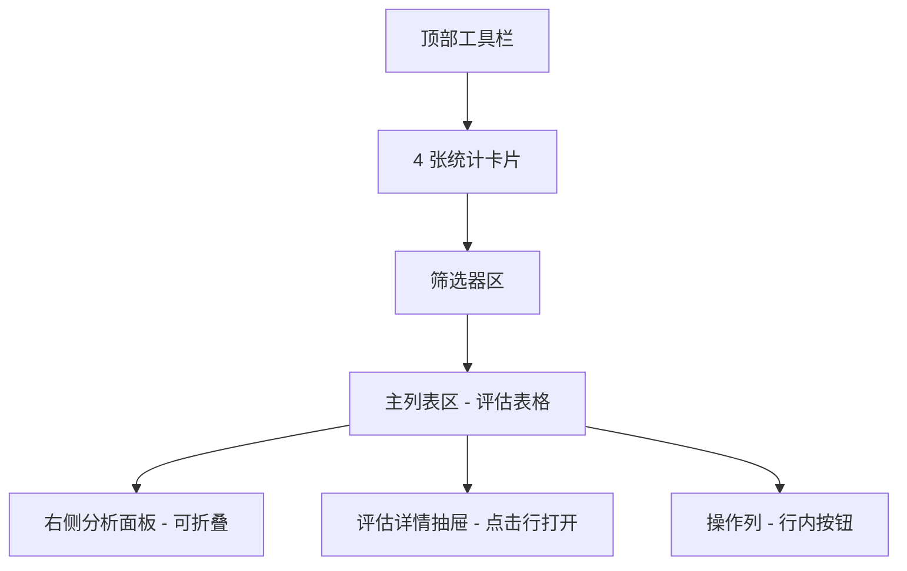
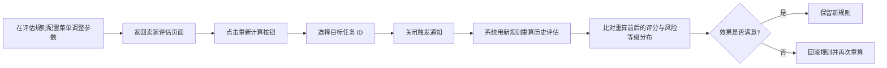

# 卖家评估 操作手册

| 属性         | 值                              |
| ------------ | ------------------------------- |
| 文档版本     | v1.0                            |
| 文档日期     | 2026-07-05                      |
| 所属项目     | 闲鱼猎人                        |
| 所属菜单     | 数据查看 → 卖家评估             |
| 文档类型     | 操作手册                        |
| 关联路由     | /evaluations                    |
| 配套详细设计 | v2.0                            |
| 目标读者     | 运营/管理员                     |

---

## 目录

- [0. 阶段交接声明](#0-阶段交接声明)
- [1. 功能简介](#1-功能简介)
- [2. 入口与导航](#2-入口与导航)
- [3. 界面布局](#3-界面布局)
- [4. 操作指南](#4-操作指南)
  - [4.1 查看评估列表](#41-查看评估列表)
  - [4.2 4 张统计卡片筛选](#42-4-张统计卡片筛选)
  - [4.3 查看评估详情](#43-查看评估详情)
  - [4.4 手动单条评估](#44-手动单条评估)
  - [4.5 批量评估](#45-批量评估)
  - [4.6 规则测试（评估规则验证）](#46-规则测试评估规则验证)
  - [4.7 重新评估](#47-重新评估)
  - [4.8 查看 4 维评分明细](#48-查看-4-维评分明细)
  - [4.9 解读风险等级](#49-解读风险等级)
  - [4.10 解读数据质量](#410-解读数据质量)
- [5. 字段说明](#5-字段说明)
- [6. 常见问题 FAQ](#6-常见问题-faq)
- [7. 注意事项与限制](#7-注意事项与限制)
- [8. 关联功能](#8-关联功能)
- [9. 快捷键与技巧](#9-快捷键与技巧)
- [10. 修订记录](#10-修订记录)
- [11. 附录](#11-附录)

---

## 0. 阶段交接声明

```
- 当前阶段：卖家评估操作手册 v1.0 编写 ✅ 已完成
- 下一阶段：抢单记录操作手册编写
- 下一阶段智能体：文档编写智能体
- 下一阶段技能：文档编写
- 交接上下文：卖家评估操作手册 v1.0 已完成，面向运营/管理员，涵盖 11 个章节，包括功能简介、入口与导航、界面布局、操作指南（10 个场景）、字段说明、FAQ（15 条）、注意事项与限制（10 条）、关联功能、快捷键与技巧、修订记录、附录（4 维评分体系说明 + 5 档风险等级对照表 + 7 类关键词库清单）。文档与详细设计 v2.0、需求规格 v1.0 完全对齐：4 维评分（professional / credit / dispute / price，权重 30/30/25/15）、5 档风险等级（low / medium / high / extreme / unknown，小写枚举）、3 级数据质量（full / partial / insufficient）、7 类成色关键词库（含 completeness_missing）。
```

---

## 1. 功能简介

**卖家评估**是闲鱼猎人「数据查看」菜单下最复杂的多维量化页面，对每条商品调用 4 维加权评分模型，输出 0-100 综合分、5 档风险等级、3 档数据质量分级，辅以官方采集、批量重算、反馈闭环与阈值建议能力，是「评估质量调控」的中枢页面。

### 核心价值

| 能力           | 说明                                                                                                  |
| -------------- | ----------------------------------------------------------------------------------------------------- |
| 4 维量化评分   | 职业度（30）+ 信用（30）+ 纠纷（25）+ 价格（15）= 100，量化卖家与商品风险                            |
| 5 档风险等级   | low / medium / high / extreme / unknown，配合颜色徽标快速识别风险档位                                |
| 3 级数据质量   | full / partial / insufficient，缺失数据时按策略降级评估，避免误判                                     |
| AI 双引擎      | 规则评估 + AI 评估（成色评估 7 类关键词库 + 多模态鉴伪），AI 不可用时自动降级为规则评估              |
| 官方采集闭环   | 访问闲鱼官方详情页 + 卖家主页 + 评价后重新评估，将数据质量升级为 full                                |
| 批量操作       | 批量评估未评估商品、批量官方采集、按任务重新计算历史评估                                              |
| 阈值建议       | 基于近 7 天评估分布二分查找使通过率最接近目标值（默认 75%）                                          |
| 评估反馈闭环   | 用户标记评估准确/不准确/部分准确，用于模型优化与准确率统计                                            |

> **提示**：本页面是评估结果观测与调控的中枢，不替代「评估规则」配置菜单（负责权重/阈值/关键词管理）。

---

## 2. 入口与导航

### 2.1 菜单入口

| 项           | 值                                     |
| ------------ | -------------------------------------- |
| 所属分组     | 数据查看                              |
| 菜单名称     | 卖家评估                              |
| 菜单图标     | 审计图标（AuditOutlined）             |
| 菜单排序     | 12（在「数据查看」分组中）            |
| 路由路径     | /evaluations                          |
| 默认可见     | 是                                    |

### 2.2 进入方式

| 序号 | 方式                     | 操作说明                                                                  |
| ---- | ------------------------ | ------------------------------------------------------------------------- |
| 1    | 侧边栏菜单点击           | 展开左侧「数据查看」分组 → 点击「卖家评估」                               |
| 2    | Command Palette          | 按 `Ctrl+K` 打开命令面板 → 输入「卖家评估」或「评估」 → 选中命令          |
| 3    | 快捷键                   | 先按 `g`，500ms 内按 `e`（`g+e` 跳转到 `/evaluations`）                   |
| 4    | URL 直接访问             | 浏览器地址栏输入 `/evaluations` 路径                                      |
| 5    | 多 Sheet 工作区          | 在已打开的页面旁新增一个 Sheet 加载本页面，支持与其他页面并行查看          |

> **提示**：本页面支持多 Sheet 工作区，可与「任务管理」「商品中心」等页面并行打开，便于数据对比。详见《多 Sheet 页工作区使用说明》。

---

## 3. 界面布局

### 3.1 整体结构



### 3.2 区域说明

| 区域             | 位置         | 说明                                                                                  |
| ---------------- | ------------ | ------------------------------------------------------------------------------------- |
| 顶部工具栏       | 页面顶部     | 标题 + 列设置按钮 + 重新计算按钮 + 批量官方采集按钮 + 导出按钮                        |
| 4 张统计卡片     | 工具栏下方   | 风险等级 / 评分分布 / 数据质量 / 卖家活跃度，点击可一键过滤                            |
| 筛选器区         | 统计卡片下方 | 任务 ID / 商品 ID / 品牌 / 评分区间 / 风险等级 / 数据质量 / 反馈状态 / 时间范围 / 价格区间 |
| 主列表区         | 页面中部     | 评估表格，18 列可配置，支持横向滚动                                                   |
| 右侧分析面板     | 页面右侧     | 可折叠侧栏，含评估分×价格热力图、结果柱状图、价格直方图、阈值建议面板                  |
| 评估详情抽屉     | 列表右侧弹出 | 点击行打开，展示 4 维评分明细、拒绝原因、AI 评估结果、深度鉴伪报告、反馈表单          |
| 操作列           | 列表最右侧   | 根据状态显示「抢单」「官方采集」「重算」「反馈」按钮                                  |

### 3.3 列设置

主列表共 18 列可配置，支持拖拽排序与显示/隐藏，配置持久化到浏览器本地。固定列（标题、评分）禁止隐藏。

| 列名       | 说明                       | 是否固定 |
| ---------- | -------------------------- | -------- |
| 任务 ID    | 任务标识                   | 否       |
| 图片       | 商品缩略图                 | 否       |
| 标题       | 商品标题                   | 是       |
| 价格       | 商品价格                   | 否       |
| 卖家       | 卖家昵称                   | 否       |
| 地区       | 商品地区                   | 否       |
| 品牌       | 商品品牌                   | 否       |
| 想要       | 想要数                     | 否       |
| 浏览       | 浏览数                     | 否       |
| 发布时间   | 商品发布时间               | 否       |
| 状态       | 在售/已售                  | 否       |
| 成色       | 综合成色标签               | 否       |
| 成色标签   | 命中的成色关键词标签       | 否       |
| 评分       | 综合评分（0-100）          | 是       |
| 风险       | 风险等级徽标               | 否       |
| AI         | AI 评估 + 深度鉴伪按钮     | 否       |
| 官方采集   | 触发官方采集按钮           | 否       |
| 反馈       | 反馈表单入口               | 否       |

---

## 4. 操作指南

### 4.1 查看评估列表

**场景**：浏览所有商品的评估结果，按需筛选目标商品。

**操作步骤**：

1. 通过菜单或快捷键进入「卖家评估」页面。
2. 页面默认按评估时间倒序展示，每页 20 条。
3. 在筛选器区按需设置过滤条件：
   - **任务 ID**：模糊匹配，输入部分关键字即可。
   - **商品 ID**：模糊匹配。
   - **品牌**：精确匹配。
   - **评分区间**：设置最低分与最高分。
   - **风险等级**：选择 low / medium / high / extreme / unknown 之一。
   - **数据质量**：选择 full / partial / insufficient 之一。
   - **反馈状态**：选择已反馈准确 / 不准确 / 部分准确 / 未反馈 之一。
   - **时间范围**：设置起始时间与结束时间。
   - **价格区间**：设置最低价与最高价（未设置时自动从任务配置读取价格范围）。
4. 点击「查询」按钮应用筛选条件。
5. 列表下方使用分页器翻页，可调整每页条数（1-200）。

> **提示**：列表数据来源于评估完成事件，包含任务关联、采集来源等元信息。商品标题、价格、地区等字段会自动用最新数据覆盖，避免展示过时快照。

### 4.2 4 张统计卡片筛选

**场景**：快速按风险等级、评分分布、数据质量、卖家活跃度筛选商品。

页面顶部提供 4 张统计卡片，每张卡片展示对应维度的分布统计，点击卡片可一键应用过滤条件。

#### 4.2.1 风险等级卡片

| 操作               | 效果                                            |
| ------------------ | ----------------------------------------------- |
| 点击「低风险」     | 筛选 risk_level=low 的商品（可全自动拍下）     |
| 点击「中风险」     | 筛选 risk_level=medium 的商品（需人工复核）    |
| 点击「高风险」     | 筛选 risk_level=high 的商品（谨慎抢单）        |
| 点击「严重风险」   | 筛选 risk_level=extreme 的商品（禁止抢单）     |
| 点击「数据不足」   | 筛选 risk_level=unknown 的商品（无法评估）     |

#### 4.2.2 评分分布卡片

展示 5 档分数区间的商品数量：

| 分数区间   | 说明                       |
| ---------- | -------------------------- |
| 0-20       | 极低分，一票否决或严重风险 |
| 20-40      | 低分，禁止抢单             |
| 40-60      | 中低分，需人工审查         |
| 60-80      | 中高分，可推送通知         |
| 80-100     | 高分，可全自动拍下         |

点击对应区间可按该分数范围筛选。

#### 4.2.3 数据质量卡片

展示 3 级数据质量的商品数量：

| 数据质量   | 说明                                       |
| ---------- | ------------------------------------------ |
| 充足       | 3+ 维度有效，正常 4 维加权评估             |
| 部分       | 1-2 维度有效，仅有效维度归一化 + 0.8 系数  |
| 不足       | 0 维度有效，仅价格+热度评估，上限 65 分    |

点击对应级别可按数据质量筛选。**「不足」级别的商品建议触发官方采集补全数据**。

#### 4.2.4 卖家活跃度卡片

展示卖家活跃度分布，点击可按活跃度筛选：

| 活跃度     | 说明                                       |
| ---------- | ------------------------------------------ |
| 高活跃     | 在售数多、30 天发布数多，疑似职业卖家     |
| 中活跃     | 正常卖家                                   |
| 低活跃     | 在售数少、发布数少，个人卖家               |

> **提示**：点击统计卡片后，筛选器会同步更新对应条件，可继续叠加其他过滤条件缩小范围。

### 4.3 查看评估详情

**场景**：查看单条商品的完整评估结果，包括 4 维评分明细、拒绝原因、AI 评估结果等。

**操作步骤**：

1. 在评估列表中点击任意一行。
2. 页面右侧弹出评估详情抽屉，展示以下内容：
   - **商品基本信息**：标题、图片、价格、卖家、地区、品牌、发布时间等。
   - **4 维评分明细**：professional（职业度）/ credit（信用）/ dispute（纠纷）/ price（价格）四个维度的得分与权重。
   - **拒绝原因列表**：评估过程中命中的所有拒绝原因（如「信用分过低」「职业卖家」「价格异常」等）。
   - **AI 成色评估结果**：AI 评估的成色结论（accept / caution / reject）、成色评分（1-10）、鉴伪评分（0-10）。
   - **深度鉴伪报告**：盗图检测、损坏检测、一致性检测、模板检测的详细结果。
   - **反馈表单**：标记本次评估准确/不准确/部分准确，可选填备注。
3. 在反馈表单中选择反馈类型：
   - **准确**：评分与实际一致。
   - **不准确**：评分偏差大。
   - **部分准确**：方向对但幅度偏。
4. （可选）在备注框中填写详细说明。
5. 点击「提交反馈」按钮。

> **提示**：反馈数据用于评估系统准确率统计与模型优化，请如实标记。提交后不可修改。

### 4.4 手动单条评估

**场景**：对单条商品触发官方采集 + 重新评估，补全卖家数据后获得更准确的评分。

**操作步骤**：

1. 在评估列表中找到目标商品。
2. 在操作列点击「官方采集」按钮。
3. 系统启动浏览器子进程，访问闲鱼官方详情页 + 卖家主页 + 评价页。
4. 采集完成后自动重新评估，结果以「数据来源=官方」标记写入。
5. 列表自动刷新，展示最新评分与风险等级。

**采集状态提示**：

| 状态           | 说明                                                  |
| -------------- | ----------------------------------------------------- |
| 采集中         | 按钮显示加载动画，预计 30-60 秒完成                   |
| 采集成功       | 提示「采集成功」，评分与风险等级更新                  |
| 采集失败       | 提示具体错误原因（见下表）                            |

**错误提示对照**：

| 错误提示                                       | 原因与处理                                                    |
| ---------------------------------------------- | ------------------------------------------------------------- |
| 浏览器实例未启动，请以调度模式启动服务         | 服务未以调度模式启动，联系管理员                              |
| 闲鱼登录已过期，请重新登录闲鱼                 | Cookie 失效，前往「Cookie 注入」页面重新登录                  |
| 触发闲鱼反爬限制，请稍后重试或手动完成验证     | 触发反爬，稍后重试                                            |
| 商品详情页加载失败或已下架，请稍后重试         | 商品已下架或页面加载异常，稍后重试                            |
| 浏览器连接异常，请重启服务后重试               | 浏览器子进程异常，联系管理员重启服务                          |
| 官方采集超时，请稍后重试或检查网络             | 网络缓慢，稍后重试                                            |

> **提示**：临时性错误（详情页加载失败、反爬限制、浏览器连接异常、超时）会自动重试 1 次，无需手动重试。永久错误（登录失效、浏览器未启动）不重试，需处理后再操作。

### 4.5 批量评估

**场景**：批量评估商品库中尚未评估的商品，适用于新接入的商品或历史遗漏商品。

**操作步骤**：

1. 在顶部工具栏点击「批量评估」按钮。
2. 在弹出的对话框中设置参数：
   - **任务 ID**（可选）：限定某个任务范围，不填则全量。
   - **数量上限**：单次评估数量上限（默认 200，最大 1000）。
   - **触发通知**（可选）：评估通过的商品是否触发钉钉等通知（默认开启）。
3. 点击「开始评估」按钮。
4. 系统逐条评估未评估商品，进度条实时显示已完成数量。
5. 评估完成后弹出结果汇总：「已评估 X 个商品（跳过 Y，错误 Z）」。

**注意事项**：

- 与搜索流水线一致，超范围商品（价格门禁不通过）会跳过，不写入评估记录。
- 批量评估默认触发通知，因为这是用户主动触发的新评估，通过的商品值得通知。
- 单次评估数量上限 1000，避免单次请求过重。

> **提示**：批量评估结果以「数据来源=批量评估」标记，可在筛选器中按数据来源过滤查看。

### 4.6 规则测试（评估规则验证）

**场景**：调整评估规则（权重、阈值、关键词等）后，验证规则对历史商品的影响，确保调优方向正确。

**操作流程**：



**操作步骤**：

1. 前往「评估规则」配置菜单，调整权重、阈值或关键词。
2. 返回「卖家评估」页面。
3. 在顶部工具栏点击「重新计算」按钮。
4. 在弹出的对话框中设置参数：
   - **任务 ID**（可选）：限定重算范围，不填则全量。
   - **触发通知**：务必关闭（默认关闭），避免批量回算刷爆通知群。
5. 点击「开始重算」按钮。
6. 系统用当前配置重算该任务下所有历史评估记录。
7. 重算完成后，在右侧分析面板查看：
   - **评估分×价格热力图**：观察评分分布变化。
   - **结果柱状图**：观察可抢/通过/驳回/数据不足的数量变化。
   - **阈值建议面板**：查看当前通过率与建议阈值。
8. 如效果不满意，前往「评估规则」配置菜单回滚参数，再次重算验证。

> **提示**：重算不会删除旧评估记录，超范围商品会跳过（保留旧记录供审计）。重算结果以「数据来源=重算」标记。

### 4.7 重新评估

**场景**：对单条或多条商品重新评估，更新评分与风险等级。

#### 4.7.1 单条重新评估

1. 在评估列表中找到目标商品。
2. 在操作列点击「重算」按钮（仅在数据来源非「重算」时显示）。
3. 系统用当前配置重新评估该商品。
4. 评估完成后，列表中该行的评分与风险等级更新。

#### 4.7.2 批量重新评估

1. 在顶部工具栏点击「重新计算」按钮。
2. 设置任务 ID 与触发通知参数（参见 4.6 节）。
3. 点击「开始重算」按钮。
4. 系统逐条重算该任务下所有历史评估记录。
5. 重算完成后弹出结果汇总：「已重新计算 X 条评估记录（跳过 Y，错误 Z）」。

**重新评估与批量评估的区别**：

| 操作         | 重新评估（重算）                       | 批量评估                                |
| ------------ | -------------------------------------- | --------------------------------------- |
| 适用对象     | 已存在评估记录的商品                   | 商品库中尚未评估的商品                  |
| 数据来源标记 | 重算                                   | 批量评估                                |
| 默认通知     | 关闭（历史回算，避免刷爆群）           | 开启（新评估，通过的商品值得通知）      |
| 超范围处理   | 跳过，保留旧记录供审计                 | 跳过，不写入评估记录                    |

> **提示**：重新评估适用于配置变更后验证历史商品的新评分；批量评估适用于补全未评估商品。两者均与搜索流水线的价格门禁一致。

### 4.8 查看 4 维评分明细

**场景**：查看单条商品 4 个维度的得分明细，理解评分构成。

**操作步骤**：

1. 在评估列表中点击目标商品行，打开评估详情抽屉。
2. 在「4 维评分明细」区域查看以下信息：

| 维度            | 中文名 | 权重 | 评分范围 | 说明                                       |
| --------------- | ------ | ---- | -------- | ------------------------------------------ |
| professional    | 职业度 | 30   | 0-100    | 在售数、30 天发布数、类目集中度、关键词、贩子信号 |
| credit          | 信用   | 30   | 0-100    | 信用分、注册天数、已售数                   |
| dispute         | 纠纷   | 25   | 0-100    | 差评数（闲鱼不公开，通常满分）             |
| price           | 价格   | 15   | 0-100    | 引流价格、异常低价、价格诱饵、邮费陷阱、无图风险 |

3. 综合评分计算公式：综合评分 = Σ(维度得分 × 权重 / 100)，再施加防高分掩盖缓冲。

**防高分掩盖机制**：

- 各维度分数接近时（标准差小）→ 缓冲大（最高 50），允许高分。
- 某维度远低于其他时（标准差大）→ 缓冲小（最低 30），严格拉低总分。
- 计算公式：缓冲 = max(30, 50 - 标准差 × 0.4)，综合评分 = min(加权总分, 最低维度分 + 缓冲)。

> **提示**：防高分掩盖机制避免单维度高分掩盖其他维度低分，确保风险暴露充分。例如某卖家信用极低但价格正常，综合评分会被信用维度拉低。

### 4.9 解读风险等级

**场景**：根据 5 档风险等级徽标快速判断商品风险档位。

风险等级根据综合评分自动划分，共 5 档：

| 风险等级   | 颜色 | 评分区间                           | 含义                       | 行为                       |
| ---------- | ---- | ---------------------------------- | -------------------------- | -------------------------- |
| low        | 绿   | 评分 ≥ 全自动拍下分（默认 80）     | 低风险，可全自动拍下       | 自动抢单                   |
| medium     | 黄   | 通过分 ≤ 评分 < 全自动拍下分（默认 60-80） | 中等风险，需人工复核       | 推送通知，可手动抢单       |
| high       | 橙   | 40 ≤ 评分 < 通过分（默认 40-60）   | 高风险，谨慎抢单           | 不推送，需用户手动审查     |
| extreme    | 红   | 评分 < 40 或一票否决               | 极高风险，禁止抢单         | 直接拒绝                   |
| unknown    | 灰   | 评分=null（数据不足）              | 数据不足，无法评估         | 需官方采集补全数据         |

**一票否决场景**：

- 卖家在平台黑名单中。
- 卖家信用分低于阈值（默认 600）。
- 命中一票否决即直接 0 分 + 风险等级=严重。

> **提示**：通过分与全自动拍下分可在「评估规则」配置菜单中调整，调整后所有历史评估不会自动更新，需手动触发重新评估。风险等级枚举值统一小写。

### 4.10 解读数据质量

**场景**：根据 3 级数据质量分级判断评估结果可信度，决定是否需要补采数据。

数据质量根据卖家数据有效性划分，共 3 级：

| 数据质量   | 条件                | 评估策略                                          | 评分上限 |
| ---------- | ------------------- | ------------------------------------------------- | -------- |
| full       | 3+ 维度有效         | 正常 4 维加权 + 防高分掩盖                        | 100      |
| partial    | 1-2 维度有效        | 仅有效维度归一化加权 + 0.8 系数                   | 80       |
| insufficient | 0 维度有效（仅价格）| 价格(60%) + 热度(40%)，热度基于想要数             | 65       |

**维度有效性判定**：

| 维度         | 有效条件                                       |
| ------------ | ---------------------------------------------- |
| 职业度       | 在售数 ≥ 1 或 30 天发布数 ≥ 1                  |
| 信用         | 信用分 ≥ 400 或 注册天数 ≥ 1                   |
| 纠纷         | 在售数 ≥ 1 或 注册天数 ≥ 1（闲鱼不公开差评）   |
| 价格         | 始终有效（来自商品信息）                       |

**设计意图**：

- **partial 模式 0.8 系数**：数据不完整时施加惩罚，满分卖家在 partial 模式下最高得 80 分（不会触发自动下单），有区分度。
- **insufficient 模式上限 65 分**：可通过（60）但不能自动拍下（80），确保数据不足的卖家不会触发自动下单，但允许用户手动审查。

> **提示**：数据质量为「不足」的商品建议触发官方采集补全数据，采集后数据质量可升级为「充足」，评分更准确。

---

## 5. 字段说明

### 5.1 评估列表字段

| 字段名       | 类型        | 说明                                                       |
| ------------ | ----------- | ---------------------------------------------------------- |
| 任务 ID      | 字符串      | 关联的任务标识                                             |
| 商品 ID      | 字符串      | 商品唯一标识                                               |
| 商品标题     | 字符串      | 商品标题（自动用最新数据覆盖）                             |
| 商品图片     | URL         | 商品缩略图（无图时显示占位符）                             |
| 商品价格     | 数字        | 商品价格（单位：元）                                       |
| 卖家 ID      | 字符串      | 卖家唯一标识                                               |
| 卖家昵称     | 字符串      | 卖家昵称（自动清洗脏数据）                                 |
| 地区         | 字符串      | 商品地区                                                   |
| 品牌         | 字符串      | 商品品牌                                                   |
| 想要数       | 数字        | 商品想要数                                                 |
| 浏览数       | 数字        | 商品浏览数                                                 |
| 发布时间     | 日期时间    | 商品发布时间                                               |
| 销售状态     | 枚举        | 在售 / 已售                                                |
| 成色标签     | 字符串      | 综合成色标签（如「全新」「9 成新」「故障」等）             |
| 成色关键词   | 数组        | 命中的成色关键词类别（如「全新」「配件齐全」等）           |
| 综合评分     | 数字        | 0-100 综合评分（数据不足时为空）                           |
| 风险等级     | 枚举        | low / medium / high / extreme / unknown                    |
| 数据质量     | 枚举        | full / partial / insufficient                              |
| 数据来源     | 枚举        | 搜索 / 官方采集 / 重算 / 批量评估                          |
| 4 维评分     | 对象        | 职业度 / 信用 / 纠纷 / 价格 四个维度的得分                 |
| 拒绝原因     | 数组        | 评估过程中命中的拒绝原因列表                               |
| 评估时间     | 日期时间    | 评估完成时间（UTC）                                        |
| 反馈类型     | 枚举        | 准确 / 不准确 / 部分准确 / 未反馈                          |
| 反馈备注     | 字符串      | 反馈备注文本                                               |
| 反馈时间     | 日期时间    | 反馈提交时间                                               |
| 订单状态     | 枚举        | 已下单 / 未下单 / 下单失败                                 |

### 5.2 评估详情字段

| 字段名             | 类型        | 说明                                                       |
| ------------------ | ----------- | ---------------------------------------------------------- |
| 商品基本信息       | 对象        | 标题、图片、价格、卖家、地区、品牌、发布时间等             |
| 4 维评分明细       | 对象        | 每个维度的得分、权重、子项扣分明细                         |
| 拒绝原因列表       | 数组        | 所有命中的拒绝原因（中文描述）                             |
| 数据质量           | 枚举        | full / partial / insufficient                              |
| 数据来源           | 枚举        | 搜索 / 官方采集 / 重算 / 批量评估                          |
| AI 成色结论        | 枚举        | accept / caution / reject                                  |
| AI 成色评分        | 数字        | 1-10 分（1=严重损坏，10=全新）                             |
| AI 鉴伪评分        | 数字        | 0-10 分（10=正品）                                         |
| 深度鉴伪报告       | 对象        | 盗图检测、损坏检测、一致性检测、模板检测结果               |
| 综合结论           | 枚举        | recommend（推荐）/ caution（谨慎）/ reject（拒绝）         |
| 反馈表单           | 对象        | 反馈类型 + 备注                                            |

---

## 6. 常见问题 FAQ

### Q1：评估的 4 个维度分别是什么？权重是多少？

**A**：4 维评分：职业度（权重 30）、信用（权重 30）、纠纷（权重 25）、价格（权重 15）。4 维权重之和为 100，综合评分 = Σ(维度得分 × 权重 / 100)，再施加防高分掩盖缓冲。

### Q2：综合评分是怎么算出来的？

**A**：先按 4 维加权求和得到加权总分，再施加防高分掩盖缓冲：缓冲 = max(30, 50 - 标准差 × 0.4)，综合评分 = min(加权总分, 最低维度分 + 缓冲)。设计意图是避免单维度高分掩盖其他维度低分，确保风险暴露充分。

### Q3：风险等级是怎么划分的？

**A**：5 档风险等级（小写枚举）：
- low（绿）：评分 ≥ 全自动拍下分（默认 80），可全自动拍下。
- medium（黄）：通过分 ≤ 评分 < 全自动拍下分（默认 60-80），需人工复核。
- high（橙）：40 ≤ 评分 < 通过分（默认 40-60），谨慎抢单。
- extreme（红）：评分 < 40 或一票否决，禁止抢单。
- unknown（灰）：数据不足，无法评估。

一票否决场景（黑名单 / 信用分低于阈值）直接判定为 extreme。

### Q4：数据质量 full / partial / insufficient 是什么意思？

**A**：
- **full（充足）**：3+ 维度有效，正常 4 维加权评估（上限 100）。
- **partial（部分）**：1-2 维度有效，仅有效维度归一化加权 + 0.8 系数（上限 80）。
- **insufficient（不足）**：0 维度有效（仅价格），用价格+热度两维度评估（上限 65）。

设计意图：insufficient 上限 65 可通过（60）但不能自动拍下（80），确保数据不足的卖家不会触发自动下单。

### Q5：什么是 AI 双引擎？

**A**：AI 双引擎 = 规则评估 + AI 评估。
- **规则评估**：基于 4 维加权评分模型，使用 7 类成色关键词库识别商品成色。
- **AI 评估**：包括 AI 成色评估（多模态图像+文本，1-10 分制）与 AI 多模态鉴伪（盗图/损坏/一致性/模板检测）。

AI 评估结果会集成到规则评分中：
- AI 拒绝（reject）→ 总分降至 0，风险等级=严重。
- AI 谨慎（caution）→ 总分 × 0.85，风险等级至少为中。
- AI 评分 ≥ 8 → 总分 +5（最高 100）。
- AI 评分 ≤ 3 → 总分 × 0.7。

AI 客户端不可用时自动降级为规则评估，不阻断主流程。

### Q6：什么是官方采集？什么时候需要用？

**A**：官方采集是访问闲鱼官方详情页 + 卖家主页 + 评价页的浏览器自动化补采功能，采集完整数据后重新评估，将数据质量升级为 full。

**使用场景**：
- 数据质量为「不足」的商品，需补全卖家数据。
- 数据质量为「部分」的商品，需补全缺失维度。
- 怀疑搜索结果数据不准确，需用官方数据校准。

### Q7：批量评估和重新计算有什么区别？

**A**：
- **批量评估**：评估商品库中**尚未评估**的商品，新建评估记录（数据来源=批量评估）。默认触发通知（用户主动触发的新评估，通过的商品值得通知）。
- **重新计算**：重新计算**已存在**的历史评估记录，更新评分字段（数据来源=重算）。默认不触发通知（历史回算，避免刷爆通知群）。

两者均与搜索流水线的价格门禁一致，超范围商品跳过。

### Q8：重新计算时为什么有些商品被跳过？

**A**：重新计算前会用价格门禁过滤，超范围商品（价格超出任务配置的范围）跳过，不删除旧评估记录（保留供审计）。跳过的商品可通过筛选器勾选「包含超范围商品」选项查看。

### Q9：阈值建议是怎么计算的？

**A**：基于近 7 天评估分布，从高分到低分累加，找到达到目标通过率（默认 75%）对应的分数即为建议阈值。在命中区间内线性插值估算精确阈值，并计算当前配置阈值对应的实际通过率。可在右侧分析面板的「阈值建议」区域调整目标通过率（10%-90%）后点击「计算」按钮获取建议值。

### Q10：评估反馈有什么用？提交后能修改吗？

**A**：评估反馈用于：
- 统计评估系统准确率（准确数 / 总反馈数）。
- 为模型优化与配置调优提供数据支撑。

反馈类型：
- **准确**：评分与实际一致。
- **不准确**：评分偏差大。
- **部分准确**：方向对但幅度偏。

**提交后不可修改**，避免恶意刷反馈。请如实标记。

### Q11：成色关键词库有哪些？怎么影响评分？

**A**：共 7 类成色关键词库，每类有对应的加分/扣分：

| 类别             | 中文       | 加分/扣分 |
| ---------------- | ---------- | --------- |
| newness          | 全新       | +1        |
| newness_worn     | 轻度使用   | 0         |
| used             | 中度使用   | -1        |
| worn             | 明显使用   | -2        |
| broken           | 故障/维修  | -3        |
| completeness     | 配件齐全   | +1        |
| completeness_missing | 配件缺失 | -1        |

每个类别只算一次（避免同类别多关键词重复扣分）。综合成色标签优先级：故障 > 明显使用 > 正常使用 > 近全新 > 全新 > 未注明。

### Q12：为什么有些商品评分显示为空？

**A**：评分显示为空表示数据质量为「不足」（卖家数据全缺失，仅价格维度有效），系统无法给出有效评分，风险等级标记为 unknown。建议触发官方采集补全数据后重新评估。

### Q13：什么是防高分掩盖？为什么需要它？

**A**：防高分掩盖是基于维度方差的动态缓冲机制：
- 各维度分数接近时（标准差小）→ 缓冲大（最高 50），允许高分。
- 某维度远低于其他时（标准差大）→ 缓冲小（最低 30），严格拉低总分。

**设计意图**：避免单维度高分掩盖其他维度低分。例如某卖家信用极低但价格正常，若不施加缓冲，综合评分可能偏高，掩盖信用风险。

### Q14：什么是 seller_nick 脏数据清洗？

**A**：历史数据中卖家昵称字段可能被错误写入了地区、信用度、发布时间、成色关键词等脏数据。系统自动识别 5 种污染类型（地区/信用/发布时间/成色/复合），将污染字段迁移到正确字段（地区/卖家信用/发布时间/成色标签），并清空卖家昵称。该清洗在评估列表展示时自动执行，无需用户干预。

### Q15：手动抢单与自动抢单有什么区别？

**A**：
- **自动抢单**：搜索流水线中评分 ≥ 全自动拍下分（默认 80）且风险等级=低的商品，系统全自动拍下。
- **手动抢单**：评估列表操作列的「抢单」按钮，仅通过分 ≤ 评分 < 全自动拍下分（中等风险）的商品可触发，由用户主动点击。

手动抢单与自动抢单共享同一套抢单代码路径，区别仅在触发方式。

---

## 7. 注意事项与限制

### 7.1 AI 调用预算

- AI 评估依赖外部 AI 服务（OpenAI / Claude 兼容接口），请确保 API 额度充足。
- AI 客户端不可用时自动降级为规则评估，不阻断主流程，但会损失成色评估与鉴伪能力。
- 建议在「AI 配置」菜单中设置合理的超时时间（默认 30 秒）与图片大小上限（默认 1024px），避免单次调用耗时过长。

### 7.2 双引擎降级策略

- **AI 成色评估**：AI 不可用时跳过成色评估，仅依赖规则评分。
- **AI 多模态鉴伪**：AI 不可用时跳过鉴伪（盗图/损坏/一致性/模板检测），仅依赖规则评分。
- **降级不影响主流程**：评估仍会完成，只是缺少 AI 增强部分。

### 7.3 关键词库覆盖范围

- 7 类成色关键词库覆盖常见成色描述，但无法覆盖所有非标准表述（如「99 新」「9.9 成新」等变体）。
- 关键词命中即扣分，每个类别只算一次（避免同类别多关键词重复扣分）。
- 关键词库可在「评估规则」配置菜单中扩展，新增关键词需测试避免误判。

### 7.4 评估维度含义

- **职业度（professional）**：识别职业卖家，子项包括在售数、30 天发布数、类目集中度、关键词、贩子信号。注意维度名为 professional（不是 professionalism）。
- **信用（credit）**：信用分、注册天数、已售数。闲鱼不公开信用分时扣 10 分。
- **纠纷（dispute）**：差评数。闲鱼不公开差评数，本维度通常满分。
- **价格（price）**：引流价格、异常低价、价格诱饵、邮费陷阱、无图风险。配件类商品（壳/膜/线/充等）低价正常，不扣分。

### 7.5 官方采集限制

- 单条官方采集预计耗时 30-60 秒（含详情页+卖家主页+评价页加载）。
- 批量官方采集单次最多 50 条，串行执行（避免并发触发反爬）。
- Cookie 失效类错误（403/440/441）会立即中断批量采集，避免后续商品逐个失败。
- 浏览器子进程未启动时返回 503，需以调度模式启动服务。

### 7.6 批量操作限制

- 批量评估单次最多 1000 条，避免单次请求过重。
- 重新计算默认关闭通知，避免批量回算刷爆通知群。
- 批量官方采集单次最多 50 条，串行执行。
- 超范围商品（价格门禁不通过）在批量评估与重新计算中均跳过。

### 7.7 数据质量降级限制

- partial 模式施加 0.8 系数，最高不超过 80 分（不会触发自动下单）。
- insufficient 模式上限 65 分（可通过但不能自动拍下）。
- 数据质量为「不足」的商品建议触发官方采集补全数据。

### 7.8 评估反馈限制

- 反馈提交后不可修改，避免恶意刷反馈。
- 反馈备注不做内容审查，由用户自负责任。
- 反馈数据用于准确率统计与模型优化，请如实标记。

### 7.9 列设置限制

- 固定列（标题、评分）禁止隐藏，确保核心信息始终可见。
- 列设置持久化到浏览器本地，不同浏览器或设备需分别配置。
- 列拖拽排序后自动保存，无需手动确认。

### 7.10 性能限制

- 评估明细列表查询 P95 ≤ 800ms（含多维筛选与联表）。
- 单条官方采集 P95 ≤ 60 秒（含重试退避）。
- 批量官方采集 10 条 P95 ≤ 10 分钟（含断点续传）。
- 反馈统计 P95 ≤ 1500ms（5 万条评估扫描）。

---

## 8. 关联功能

### 8.1 任务管理

- **联动关系**：评估明细按任务 ID 过滤，每个任务可独立查看评估结果。
- **数据流**：任务搜索结果触发评估，评估通过的商品写入抢单候选。
- **操作**：在评估列表筛选器中输入任务 ID，可查看该任务下所有评估结果。

### 8.2 商品中心

- **联动关系**：评估明细关联商品库的商品信息（标题、价格、卖家、地区等）。
- **数据流**：商品库的最新数据自动覆盖评估时的快照，确保展示信息准确。
- **操作**：在评估详情抽屉中可查看商品完整信息，部分字段可跳转到商品中心详情页。

### 8.3 抢单记录

- **联动关系**：评估通过的商品可触发抢单（自动或手动），抢单记录写入抢单记录菜单。
- **数据流**：评估列表的「订单状态」字段显示是否已下单，避免重复触发抢单。
- **操作**：在评估列表操作列点击「抢单」按钮触发手动抢单（仅中等风险商品可用）。

### 8.4 评估规则配置

- **联动关系**：评估规则配置菜单管理权重、阈值、关键词等参数，本页面消费这些配置。
- **数据流**：规则变更后，历史评估不会自动更新，需手动触发重新计算。
- **操作**：在评估规则配置菜单调整参数后，返回本页面点击「重新计算」按钮验证效果。

### 8.5 Cookie 注入

- **联动关系**：官方采集依赖闲鱼登录态，Cookie 失效时无法采集。
- **数据流**：Cookie 过期会返回 403/440 错误，提示用户重新登录。
- **操作**：官方采集失败提示「闲鱼登录已过期」时，前往 Cookie 注入页面重新登录。

### 8.6 事件时间线

- **联动关系**：评估完成事件（评估打分）与评估通过事件（评估通过）写入事件时间线。
- **数据流**：事件时间线可追溯评估历史变化，本页面的评估明细即从评估打分事件读取。
- **操作**：在事件时间线菜单中可查看所有评估相关事件，按时间倒序排列。

### 8.7 价格策略

- **联动关系**：价格策略配置菜单管理价格门禁（最低价/最高价），本页面的批量评估与重新计算遵循价格门禁。
- **数据流**：超范围商品（价格超出任务配置范围）在批量评估与重新计算中跳过。
- **操作**：在筛选器中勾选「包含超范围商品」可查看被跳过的历史商品。

### 8.8 通知推送

- **联动关系**：评估通过的商品可触发钉钉等通知推送。
- **数据流**：批量评估默认开启通知，重新计算默认关闭通知。
- **操作**：在批量操作对话框中可调整「触发通知」参数。

---

## 9. 快捷键与技巧

### 9.1 快捷键

| 快捷键                  | 作用                           | 备注                                  |
| ----------------------- | ------------------------------ | ------------------------------------- |
| `Ctrl+K`（或 `⌘+K`）    | 打开 Command Palette           | 输入框聚焦时可直接模糊搜索命令        |
| `Escape`                | 关闭 Command Palette           | 仅在 Command Palette 打开时生效       |
| `g` 然后按 `e`          | 跳转到卖家评估 `/evaluations`  | g 前缀序列，500ms 内按第二键          |
| `g` 然后按 `t`          | 跳转到任务管理 `/tasks`        | 同上                                  |
| `g` 然后按 `o`          | 跳转到抢单记录 `/orders`       | 同上                                  |
| `g` 然后按 `i`          | 跳转到事件时间线 `/timeline`   | 同上                                  |

> **提示**：输入框、文本域、下拉框内不触发快捷键，避免干扰正常输入。

### 9.2 实用技巧

#### 技巧 1：多 Sheet 并行对比

打开多个 Sheet，分别加载「卖家评估」与「商品中心」，便于对比评估结果与商品详情。

#### 技巧 2：列设置优化视野

- 桌面端：隐藏不常用列（如想要数、浏览数），保留核心列（标题、价格、卖家、评分、风险）。
- 移动端：自动降级为横向滚动 + 列隐藏，优先展示标题与评分。

#### 技巧 3：统计卡片快速定位

点击 4 张统计卡片可一键过滤，比手动设置筛选器更快。例如点击「数据不足」卡片可快速找到需要官方采集的商品。

#### 技巧 4：阈值建议辅助调优

在右侧分析面板的「阈值建议」区域，拖动目标通过率滑块（10%-90%），点击「计算」按钮获取建议阈值。结合当前通过率与建议阈值的差异，判断是否需要调整通过分。

#### 技巧 5：反馈表单提升准确率

定期对评估结果提交反馈（准确/不准确/部分准确），系统会统计准确率，为模型优化提供数据支撑。反馈统计可在「反馈统计」入口查看。

#### 技巧 6：批量评估分批处理

批量评估单次上限 1000 条，建议分批处理（每批 200-500 条），避免单次请求过重。批量官方采集单次上限 50 条，串行执行避免触发反爬。

#### 技巧 7：重新计算关闭通知

重新计算是历史回算，务必关闭「触发通知」选项（默认关闭），避免批量回算刷爆通知群。批量评估则默认开启通知（新评估，通过的商品值得通知）。

#### 技巧 8：包含超范围商品审计

在筛选器中勾选「包含超范围商品」选项，可查看被价格门禁跳过的历史商品，用于审计与排查。

---

## 10. 修订记录

| 版本 | 日期       | 修订人           | 修订内容                                                                                                                                                             |
| ---- | ---------- | ---------------- | -------------------------------------------------------------------------------------------------------------------------------------------------------------------- |
| v1.0 | 2026-07-05 | 文档编写智能体   | 初版操作手册，与详细设计 v2.0、需求规格 v1.0 对齐。涵盖 11 个章节：阶段交接声明 / 功能简介 / 入口与导航 / 界面布局 / 操作指南（10 个场景）/ 字段说明 / FAQ（15 条）/ 注意事项与限制（10 条）/ 关联功能 / 快捷键与技巧 / 修订记录 / 附录（4 维评分体系 + 5 档风险等级 + 7 类关键词库）。关键内容：4 维评分（professional 30 + credit 30 + dispute 25 + price 15 = 100）、5 档风险等级（low / medium / high / extreme / unknown，小写枚举）、3 级数据质量（full / partial / insufficient）、7 类成色关键词库（含 completeness_missing）、AI 双引擎（规则 + AI）、官方采集闭环、批量操作、阈值建议、评估反馈闭环、防高分掩盖机制、partial 0.8 系数、insufficient 65 上限。 |

---

## 11. 附录

### 11.1 4 维评分体系说明

#### 11.1.1 维度权重

| 维度            | 中文名 | 权重 | 数据来源                                                       |
| --------------- | ------ | ---- | -------------------------------------------------------------- |
| professional    | 职业度 | 30   | 在售数、30 天发布数、类目集中度、关键词、贩子信号              |
| credit          | 信用   | 30   | 信用分、注册天数、已售数                                       |
| dispute         | 纠纷   | 25   | 差评数（闲鱼不公开，通常满分）                                 |
| price           | 价格   | 15   | 引流价格、异常低价、价格诱饵、邮费陷阱、无图风险                |

> 4 维权重之和 = 100。综合评分 = Σ(维度得分 × 权重 / 100)，再施加防高分掩盖缓冲。

#### 11.1.2 维度子项说明

**职业度（professional，权重 30）**

| 子项                  | 算法                                      | 说明                                                        |
| --------------------- | ----------------------------------------- | ----------------------------------------------------------- |
| 在售数 Sigmoid 扣分   | 阈值 30，最大扣 40 分                     | 在售数=10 扣约 1 分，在售数=30 扣 20 分                     |
| 30 天发布数扣分       | 阈值 15，最大扣 30 分                     | 30 天发布数多视为职业卖家                                   |
| 类目集中度扣分        | 比例 > 0.8 扣 20 分                       | 类目集中度高视为职业卖家                                    |
| 关键词命中扣分        | 命中即扣 15 分                            | 命中「批发/代理/代购/大量/店铺/厂家/直发/一手/现货/大量有货」等 |
| 贩子信号扣分          | 贩子检测，含图像盗图检测                  | 多个商品共享同一图片高度疑似盗图                            |

**信用（credit，权重 30）**

| 子项                | 算法                                  | 说明                                              |
| ------------------- | ------------------------------------- | ------------------------------------------------- |
| 信用分未知          | 信用分为空时扣 10 分                  | 闲鱼不公开信用分                                  |
| 信用分中等          | 600 ≤ 信用分 < 700 扣 5 分            | 信用 600-700 略降分                               |
| 注册天数不足        | 注册天数 < 30 天扣 20 分              | 新注册卖家风险较高                                |
| 已售数低            | 已售数 < 5 扣 10 分                   | 低已售数扣分                                      |

> **一票否决**：信用分 < 600（默认阈值）→ 直接 0 分 + 风险等级=严重。

**纠纷（dispute，权重 25）**

| 子项                | 算法                                  | 说明                                              |
| ------------------- | ------------------------------------- | ------------------------------------------------- |
| 差评数超阈值        | 差评数 > 3 扣 50 分                   | 默认阈值 3                                        |
| 差评数较少          | 0 < 差评数 ≤ 3，每条扣 5 分           | 每条差评扣 5 分                                   |

> 闲鱼不公开差评数，本维度通常满分。

**价格（price，权重 15）**

| 子项                | 算法                                  | 说明                                                              |
| ------------------- | ------------------------------------- | ----------------------------------------------------------------- |
| 引流价格            | 价格 < 1 元扣 50 分                   | 疑似虚假商品                                                      |
| 异常低价            | 1 ≤ 价格 < 10 元且非配件类扣 30 分    | 配件类（壳/膜/线/充等）低价正常，不扣分                           |
| 价格诱饵            | 标题含「不单卖/打包/不拆卖/套装/一起出/搭配」扣 20 分 | 可能不是真实售价                                       |
| 邮费陷阱            | 标题或描述含「到付/邮费自理/运费到付/邮费自付」扣 15 分 | 实际成本更高                                           |
| 无图风险            | 图片为空扣 10 分                      | 无图商品成色无法判断                                              |

#### 11.1.3 防高分掩盖机制

基于维度方差的动态缓冲：

- 缓冲 = max(30, 50 - 标准差 × 0.4)
- 综合评分 = min(加权总分, 最低维度分 + 缓冲)
- 标准差范围 0-50，映射到缓冲 50→30

**效果**：
- 各维度分数接近时（标准差小）→ 缓冲=50，允许高分。
- 某维度远低于其他时（标准差大）→ 缓冲=30，严格拉低总分。

### 11.2 5 档风险等级对照表

| 风险等级   | 颜色 | 评分区间                           | 含义                       | 行为                       | 一票否决？ |
| ---------- | ---- | ---------------------------------- | -------------------------- | -------------------------- | ---------- |
| low        | 绿   | 评分 ≥ 全自动拍下分（默认 80）     | 低风险，可全自动拍下       | 自动抢单                   | 否         |
| medium     | 黄   | 通过分 ≤ 评分 < 全自动拍下分（默认 60-80） | 中等风险，需人工复核       | 推送通知，可手动抢单       | 否         |
| high       | 橙   | 40 ≤ 评分 < 通过分（默认 40-60）   | 高风险，谨慎抢单           | 不推送，需用户手动审查     | 否         |
| extreme    | 红   | 评分 < 40 或一票否决               | 极高风险，禁止抢单         | 直接拒绝                   | 是         |
| unknown    | 灰   | 评分=null（数据不足）              | 数据不足，无法评估         | 需官方采集补全数据         | 否         |

**一票否决场景**：

| 场景                     | 处理                                |
| ------------------------ | ----------------------------------- |
| 卖家在平台黑名单中       | 直接 0 分 + 风险等级=严重           |
| 卖家信用分低于阈值（默认 600） | 直接 0 分 + 风险等级=严重       |

> 阈值非硬编码：通过分与全自动拍下分可在「评估规则」配置菜单中调整，调整后所有历史评估不会自动更新，需手动触发重新评估。风险等级枚举值统一小写。

### 11.3 7 类关键词库清单

| 关键词库键                | 中文名     | 加分/扣分 | 示例                                                     |
| ------------------------- | ---------- | --------- | -------------------------------------------------------- |
| newness                   | 全新       | +1        | 全新 / 未拆封 / 99 新 / 95 新 / 原装 / 未激活            |
| newness_worn              | 轻度使用   | 0         | 9.5 新 / 9.9 新 / 轻微使用 / 保养好 / 成色新             |
| used                      | 中度使用   | -1        | 8 成新 / 8.5 新 / 正常使用 / 使用过 / 有使用痕迹          |
| worn                      | 明显使用   | -2        | 7 成新 / 成色一般 / 外观磨损 / 有划痕 / 磕碰 / 老化       |
| broken                    | 故障/维修  | -3        | 维修 / 拆修 / 故障 / 损坏 / 不能用 / 已坏 / 进水 / 摔过   |
| completeness              | 配件齐全   | +1        | 全套 / 配件齐全 / 原盒 / 带发票 / 带保修 / 在保          |
| completeness_missing      | 配件缺失   | -1        | 无包装 / 无配件 / 裸机 / 无发票 / 配件不全 / 缺包装      |

**计算规则**：

- 每个类别只算一次（避免同类别多关键词重复扣分）。
- 综合成色标签优先级：故障 > 明显使用 > 正常使用 > 近全新 > 全新 > 未注明。

**示例**：

- 标题「全新未拆封原装」→ 命中 newness（+1），成色标签=全新。
- 标题「9 成新，配件齐全」→ 命中 used（-1）+ completeness（+1），综合成色标签=正常使用。
- 标题「维修过，无包装」→ 命中 broken（-3）+ completeness_missing（-1），综合成色标签=故障。

> 关键词库可在「评估规则」配置菜单中扩展，新增关键词需测试避免误判。

---

**文档结束**
