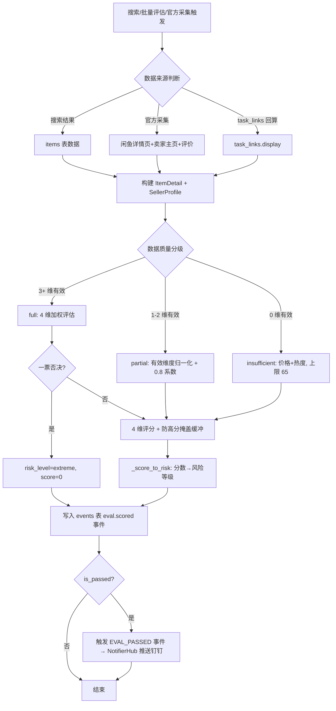
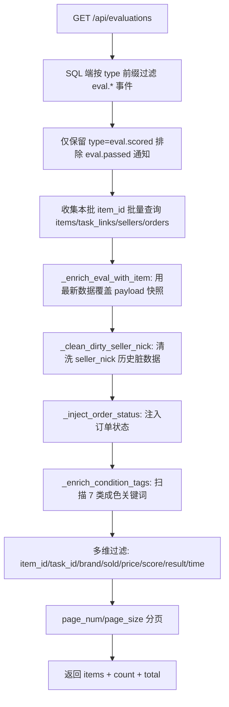
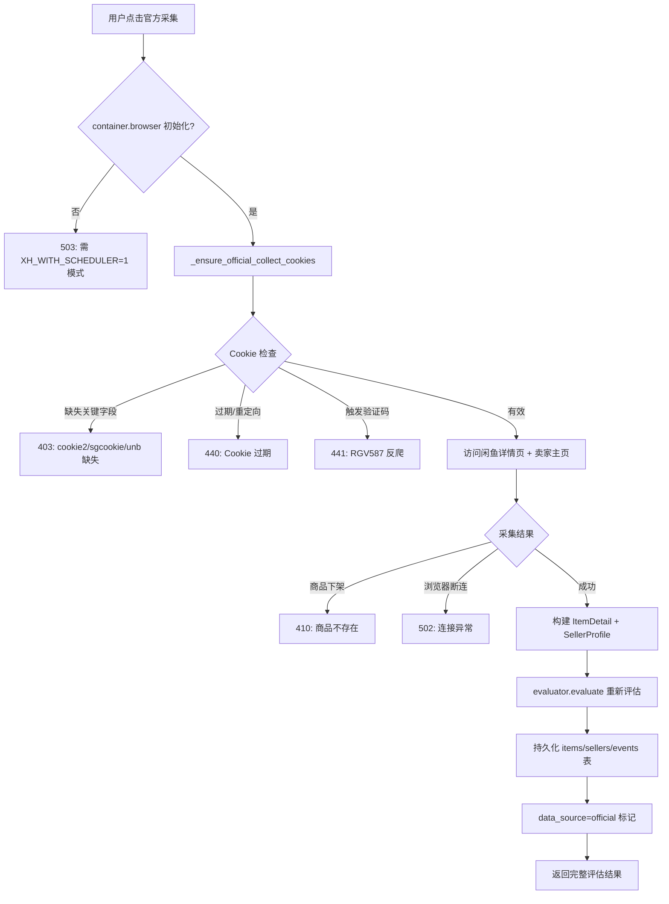
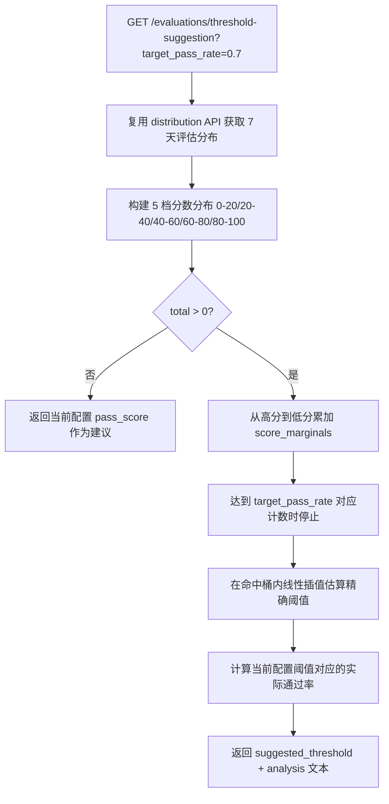

# 卖家评估 详细设计文档

## 1. 文档元信息

| 属性     | 值                                |
| -------- | --------------------------------- |
| 文档名称 | 卖家评估-详细设计                 |
| 版本     | v2.0                              |
| 发布日期 | 2026-07-05                        |
| 所属菜单 | 数据查看                          |
| 关联路由 | `/evaluations`                    |
| 文档用途 | 开发团队技术指导 / 智能客服向量库训练素材 |
| 维护人   | XianyuHunter 团队                 |

> 本文档基于代码实现重写，与 v1.0 相比主要差异：
> 1. **维度 key 修正**：`professionalism` → `professional`（与 `domain/evaluation.py`、`evaluator.py` 一致）。
> 2. **权重修正**：25/30/20/25 → **30/30/25/15**（professional+credit+dispute+price=100）。
> 3. **风险等级大小写修正**：`LOW/MEDIUM/HIGH/EXTREME/UNKNOWN` → `low/medium/high/extreme/unknown`（`RiskLevel` 枚举值为小写）。
> 4. **数据质量分级条件修正**：`full` 改为「3+ 维度有效」（不是「4 维均有效」），`insufficient` 改为「仅价格维度有效（卖家数据全缺失）」。
> 5. **数据存储位置澄清**：评估明细列表从 `events` 表的 `eval.scored` 事件读取，**不读 `evaluations` 表**；`evaluation_feedback` 表**不存在**，反馈数据写入 `events.payload.feedback` 字段。
> 6. **evaluations 表字段修正**：移除 v1.0 中虚构的 `ai_condition`/`ai_auth`/`data_quality`/`updated_at` 字段（实际仅 7 个字段）。
> 7. **API 端点补全**：从 7 个补全至 **13 个**（新增 `latest/{item_id}`、`auto-collect-stats`、`seller-price-trend`、`{item_id}/seller-trend`、`feedback/stats`、`batch-evaluate-unevaluated`）。
> 8. **关键词库修正**：6 类 → **7 类**（新增 `completeness_missing` 配件缺失）。
> 9. **ai_context 双格式说明**：`ai_context_json`/`ai_context_md` 属于 `error_logs` 表（错误日志 AI 诊断上下文），不是评估表字段；评估流程中发生异常时会写入该表。
> 10. **文件路径修正**：`xianyu_hunter/api/evaluations.py` → `src/xianyu_hunter/web/routes/api_evaluations.py`；`xianyu_hunter/models/evaluation.py` → `src/xianyu_hunter/domain/evaluation.py`。

---

## 2. 功能概述

**一句话说明**：展示商品 AI 评估结果与卖家风险画像，提供评估分分布、阈值建议、官方采集、批量重算与反馈闭环能力，是系统中评估质量调控的核心页面。

**核心价值**：

- **4 维加权评分**：professional(30) + credit(30) + dispute(25) + price(15) = 100，量化卖家与商品风险；
- **数据质量三级降级**：full(3+ 维有效) / partial(1-2 维有效) / insufficient(仅价格有效)，缺失数据时按策略降级评估避免误判；
- **AI 双引擎**：成色评估（7 类关键词库）+ 多模态鉴伪（盗图/损坏/一致性/模板检测），识别商品真实状况；
- **官方采集闭环**：访问闲鱼官方详情页+卖家主页+评价，采集权威数据后重新评估，将 `data_quality` 升级为 `full`；
- **阈值建议算法**：基于历史评估分布反推建议阈值，二分查找使通过率最接近目标值（默认 75%）；
- **批量重算与批量评估**：支持按 `task_id` 重新计算历史评估，或批量评估 items 表中未评估商品，与 worker.py 价格门禁保持一致；
- **评估反馈闭环**：用户标记评估准确/不准确/部分准确，写入 `events.payload.feedback`，用于模型优化与准确率统计。

---

## 3. 用户场景

### 场景一：浏览评估结果并按多维筛选
用户进入卖家评估页面，默认按时间倒序展示。通过工具栏多维过滤（`task_id`/`item_id`/`brand`/`min_score`-`max_score`/`result_category`/`sold_filter`/时间范围/价格区间）筛选目标商品。点击统计卡片可一键过滤「可抢/通过/驳回/数据不足」四类结果。

### 场景二：触发官方采集补全数据
用户对某条 `data_quality=insufficient` 的商品点击「官方采集」按钮，系统调用 `POST /api/evaluations/{item_id}/collect-official`，访问闲鱼官方详情页+卖家主页+评价后重新评估，结果以 `data_source=official` 标记写入 `eval.scored` 事件。

### 场景三：调优阈值
用户在右侧分析面板查看「评估分×价格」热力图与 5 档分数分布，点击「计算建议阈值」按钮，系统基于近 7 天评估分布二分查找使通过率最接近 75% 的分数作为建议值。用户参考建议在任务配置中调整 `eval_threshold`。

### 场景四：批量重算历史评估
配置变更后（如调整权重或阈值），用户点击「重新计算」按钮调用 `POST /api/evaluations/recompute?task_id=xxx`，系统用当前配置重算该任务下所有 `eval.scored` 事件，超范围商品跳过（不删除旧事件，便于审计）。

### 场景五：提交评估反馈
用户在评估详情中标记评估结果「准确/不准确/部分准确」，系统调用 `POST /api/evaluations/{item_id}/feedback`，将反馈写入 `events.payload.feedback` 字段。后续可通过 `GET /api/evaluations/feedback/stats` 查询准确率统计。

---

## 4. 菜单元数据

引用 `config/menu_registry.yaml` 中 `evaluations` 条目：

```yaml
- key: evaluations
  label: 卖家评估
  icon: AuditOutlined
  path: /evaluations
  sort_order: 12
  default_visible: true
  category: data_view
```

| 属性           | 值              |
| -------------- | --------------- |
| key            | `evaluations`   |
| label          | 卖家评估         |
| icon           | `AuditOutlined` |
| path           | `/evaluations`  |
| sort_order     | 12              |
| default_visible| true            |
| category       | `data_view`     |

---

## 5. 数据模型

### 5.1 evaluations 表（EvaluationRow，`infra/db_models.py:154`）

| 字段              | 类型     | 必填 | 默认值      | 说明                                                              |
| ----------------- | -------- | ---- | ----------- | ----------------------------------------------------------------- |
| id                | Integer  | 是   | autoincrement | 评估主键                                                          |
| item_id           | String   | 是   | —           | 关联商品 ID（indexed）                                            |
| seller_id         | String   | 否   | NULL        | 卖家 ID                                                           |
| score             | Integer  | 是   | —           | 综合评分（0-100）                                                 |
| risk_level        | String   | 是   | —           | 风险等级（`low`/`medium`/`high`/`extreme`/`unknown`，**小写**）   |
| dimension_scores  | Text     | 否   | NULL        | JSON 字符串，4 维评分（`professional`/`credit`/`dispute`/`price`）|
| reject_reasons    | Text     | 否   | NULL        | JSON 字符串，拒绝原因数组                                         |
| created_at        | DateTime | 否   | `_utcnow`   | 创建时间（UTC）                                                   |

**索引**：`ix_evaluations_seller`（seller_id）、`ix_evaluations_created`（created_at）、`item_id` 字段索引。

> **重要**：本表为评估结果的持久化快照，但**评估明细列表 API 不读此表**。`GET /api/evaluations` 从 `events` 表的 `eval.scored` 事件读取（payload 中包含完整评分信息），原因是评估事件还携带任务关联、官方采集数据源标记等元信息，且支持按事件时间范围过滤。

### 5.2 evaluation_feedback 表（不存在）

**`evaluation_feedback` 表在 DB 中不存在**。评估反馈数据写入 `events` 表中对应 `eval.scored` 事件的 `payload` 字段，结构如下：

```json
{
  "feedback": "accurate",           // accurate / inaccurate / partial
  "feedback_note": "用户备注文本",   // 可选
  "feedback_at": "2026-07-05T..."   // ISO 时间戳
}
```

反馈通过 `repo.update_eval_payload_by_keys(task_id, item_id, event_type, payload_updates)` 更新到 events 表，按 `task_id + item_id + type=eval.scored` 精确定位记录。

### 5.3 events 表（评估相关字段，`infra/db_models.py:194`）

评估明细实际存储位置，关键 payload 字段：

| payload 字段         | 类型    | 说明                                                       |
| -------------------- | ------- | ---------------------------------------------------------- |
| task_id              | string  | 任务 ID                                                    |
| item_id              | string  | 商品 ID                                                    |
| item_title           | string  | 商品标题（enrich 后由 items 表覆盖最新值）                 |
| item_price           | float   | 商品价格（enrich 后由 items 表覆盖最新值）                 |
| seller_id            | string  | 卖家 ID                                                    |
| seller_nick          | string  | 卖家昵称（脏数据清洗后可能为空字符串）                     |
| score                | int/null| 评分（0-100，null 表示数据不足）                           |
| risk_level           | string  | 风险等级（小写）                                           |
| dimension_scores     | object  | 4 维评分字典                                               |
| reject_reasons       | array   | 拒绝原因数组                                               |
| is_passed            | bool    | 是否通过 pass_score 门槛                                   |
| data_quality         | string  | 数据质量分级（`full`/`partial`/`insufficient`）            |
| data_source          | string  | 数据来源（`official`/`batch_unevaluated`/`recompute`/空）  |
| feedback             | string  | 反馈类型（`accurate`/`inaccurate`/`partial`，可选）        |
| feedback_note        | string  | 反馈备注（可选）                                           |
| feedback_at          | string  | 反馈时间 ISO 字符串（可选）                                |
| recomputed_at        | string  | 重算时间 ISO 字符串（recompute 时写入）                    |

**events 表索引**：`ix_events_task_created`（task_id+created_at 联合）、`type`/`task_id`/`item_id`/`created_at`/`request_id` 单字段索引。

### 5.4 error_logs 表的 ai_context 双格式（`infra/db_models.py:219`）

评估流程中若发生异常（如官方采集失败、浏览器断连），错误日志写入 `error_logs` 表，其中包含 AI 诊断上下文双格式字段：

| 字段              | 类型 | 说明                                                          |
| ----------------- | ---- | ------------------------------------------------------------- |
| ai_context_json   | Text | 结构化 JSON 格式的 AI 诊断上下文（含请求参数/headers/环境）   |
| ai_context_md     | Text | Markdown 格式的 AI 诊断报告（人类可读，供运维排查）           |

> 由 `web/middleware/error_capture.py` 自动捕获异常并生成双格式上下文，与评估表无直接关联，但评估相关 API 异常会写入此表。

---

## 6. 枚举定义

### 6.1 RiskLevel（`domain/evaluation.py:9`）

```python
class RiskLevel(str, Enum):
    LOW = "low"            # >= auto_buy_score（默认 80）
    MEDIUM = "medium"      # [pass_score, auto_buy_score)（默认 [60, 80)）
    HIGH = "high"          # [40, pass_score)（默认 [40, 60)）
    EXTREME = "extreme"    # < 40 或一票否决
    UNKNOWN = "unknown"    # 数据不足，无法评估
```

| 枚举值     | 颜色 | 评分区间                           | 说明                       |
| ---------- | ---- | ---------------------------------- | -------------------------- |
| `low`      | 绿   | score ≥ auto_buy_score（默认 80）  | 低风险，可全自动拍下       |
| `medium`   | 黄   | [pass_score, auto_buy_score)       | 中等风险，需人工复核       |
| `high`     | 橙   | [40, pass_score)                   | 高风险，谨慎抢单           |
| `extreme`  | 红   | score < 40 或一票否决              | 极高风险，禁止抢单         |
| `unknown`  | 灰   | score=null（数据不足）             | 数据不足，无法评估         |

> **阈值非硬编码**：`auto_buy_score`/`pass_score` 从 `config.yaml` 的 `eval` 段读取，可通过配置页面热更新。

### 6.2 评估维度 key（`evaluator.py:103`）

| 维度 key        | 中文名 | 权重 | 子项说明                                                                 |
| --------------- | ------ | ---- | ------------------------------------------------------------------------ |
| `professional`  | 职业度 | 30   | 在售数 Sigmoid 扣分 + 30 天发布数 + 类目集中度 + 关键词 + 贩子信号       |
| `credit`        | 信用   | 30   | 信用分（闲鱼不公开则扣 10）+ 注册天数 + 已售数                            |
| `dispute`       | 纠纷   | 25   | 差评数（闲鱼不公开，按 bad_review_count 调整）                            |
| `price`         | 价格   | 15   | 引流价格 + 异常低价 + 价格诱饵 + 邮费陷阱 + 无图风险                      |

> **权重之和 = 100**。综合评分 = Σ(维度得分 × 权重 / 100)，再施加防高分掩盖缓冲。

### 6.3 数据质量分级（`evaluator.py:114`）

| 分级          | 条件                | 评估策略                                          | 评分上限     |
| ------------- | ------------------- | ------------------------------------------------- | ------------ |
| `full`        | 3+ 维度有效         | 正常 4 维加权 + 防高分掩盖（buffer=50-std×0.4）   | 100          |
| `partial`     | 1-2 维度有效        | 仅有效维度归一化加权 + 0.8 系数 + buffer=30       | 80           |
| `insufficient`| 0 维度有效（仅价格）| 价格(60%) + 热度(40%)，热度基于 want_cnt           | 65           |

**维度有效性判定**（`_get_valid_dimensions`）：

- `professional`：`on_sale_count >= 1` 或 `post_count_30d >= 1`
- `credit`：`credit_score >= 400` 或 `register_days >= 1`
- `dispute`：`on_sale_count >= 1` 或 `register_days >= 1`（闲鱼不公开差评，需有基础数据）
- `price`：始终有效（来自 item）

> **设计意图**：`insufficient` 上限 65 分可 pass(60) 但不能 auto_buy(80)，确保数据不足的卖家不会触发自动下单，但允许用户手动审查。

### 6.4 成色关键词库（`api_evaluations.py:699`，共 7 类）

| 关键词库键              | 说明       | score_bonus | 示例                                       |
| ----------------------- | ---------- | ----------- | ------------------------------------------ |
| `newness`               | 全新       | +1          | 全新/未拆封/99新/95新/原装/未激活           |
| `newness_worn`          | 轻度使用   | 0           | 9.5新/9.9新/轻微使用/保养好/成色新          |
| `used`                  | 中度使用   | -1          | 8成新/8.5新/正常使用/使用过/有使用痕迹      |
| `worn`                  | 明显使用   | -2          | 7成新/成色一般/外观磨损/有划痕/磕碰/老化    |
| `broken`                | 故障/维修  | -3          | 维修/拆修/故障/损坏/不能用/已坏/进水/摔过   |
| `completeness`          | 配件齐全   | +1          | 全套/配件齐全/原盒/带发票/带保修/在保       |
| `completeness_missing`  | 配件缺失   | -1          | 无包装/无配件/裸机/无发票/配件不全/缺包装  |

**综合成色标签优先级**（`_resolve_base_condition_label`）：故障 > 明显使用 > 正常使用 > 近全新 > 全新 > 未注明。

### 6.5 反馈类型枚举（`api_evaluations.py:1613`）

| 反馈类型     | 含义                       |
| ------------ | -------------------------- |
| `accurate`   | 评估准确（评分与实际一致） |
| `inaccurate` | 评估不准确（评分偏差大）   |
| `partial`    | 部分准确（方向对但幅度偏） |

### 6.6 结果分类枚举（`api_evaluations.py:578`，用于 `result_category` 过滤）

| 分类          | 条件                                       |
| ------------- | ------------------------------------------ |
| `auto`        | score ≥ auto_buy_score（可全自动拍下）     |
| `pass`        | [pass_score, auto_buy_score)（通过门槛）   |
| `fail`        | score < pass_score（驳回）                 |
| `insufficient`| score=null（数据不足）                     |

---

## 7. API 端点清单

### 7.1 端点总览（`api_evaluations.py`，prefix=`/api/evaluations`，tags=`evaluations`）

| 方法 | 路径                                      | 说明                          | 请求参数                                                                                                                                                       | 响应字段                                                                                                |
| ---- | ----------------------------------------- | ----------------------------- | -------------------------------------------------------------------------------------------------------------------------------------------------------------- | ------------------------------------------------------------------------------------------------------- |
| GET  | `/api/evaluations`                        | 评估列表（从 events 表读取）  | Query: `item_id?`, `task_id?`, `min_score?`(0-100), `max_score?`(0-100), `start_time?`, `end_time?`, `brand?`, `sold_filter?=all`(all/onsale/sold), `result_category?`(auto/pass/fail/insufficient), `min_price?`, `max_price?`, `include_out_of_range?=false`, `page_num?=1`, `page_size?=20`(1-200), `limit?=200`, `offset?=0` | `{items[], count, total}`                                                                                |
| GET  | `/api/evaluations/latest/{item_id}`       | 商品最新评估                  | Path: `item_id`                                                                                                                                                | EvaluationRow 或 404                                                                                    |
| GET  | `/api/evaluations/auto-collect-stats`     | 自动官方采集统计              | Query: `range_hours?=24`(枚举 1/6/24/168)                                                                                                                      | `{range_hours, total, success, failed, success_rate, is_paused, fail_pause_threshold, top_failures[]}`  |
| GET  | `/api/evaluations/distribution`           | 评估分×价格二维分布           | Query: `range_hours?=168`(枚举 24/72/168/720), `price_bin_count?=10`(4-20), `score_bin_count?=10`(5-20)                                                       | `{range_hours, price_bin_count, score_bin_count, price_range, score_range, buckets[][], marginals, total, insufficient_count, distribution[], suggested_threshold, thresholds}` |
| GET  | `/api/evaluations/seller-price-trend`     | 卖家历史价格趋势              | Query: `seller_id`(必填), `range_days?=30`(7-90)                                                                                                              | `{seller_id, items_count, price_points[], current_avg, trend}`                                          |
| GET  | `/api/evaluations/threshold-suggestion`   | 阈值建议                      | Query: `target_pass_rate?=0.7`(0.1-0.95)                                                                                                                      | `{suggested_threshold, target_pass_rate, current_pass_rate, distribution, analysis}`                    |
| GET  | `/api/evaluations/{item_id}/seller-trend` | 通过 item_id 查卖家价格趋势   | Path: `item_id`; Query: `range_days?=30`(7-90)                                                                                                                | 同 `/seller-price-trend`                                                                                |
| POST | `/api/evaluations/{item_id}/feedback`     | 评估反馈                      | Path: `item_id`; Query: `feedback`(accurate/inaccurate/partial), `note?`, `task_id?`                                                                          | `{ok, item_id, feedback}`                                                                               |
| GET  | `/api/evaluations/feedback/stats`         | 反馈统计                      | 无                                                                                                                                                             | `{stats{accurate,inaccurate,partial,no_feedback}, total_feedback, accuracy_rate}`                       |
| POST | `/api/evaluations/recompute`              | 重新计算历史评估              | Query: `task_id?`, `notify?=false`                                                                                                                            | `{ok, recomputed, notified, skipped, errors, total, message}`                                           |
| POST | `/api/evaluations/batch-evaluate-unevaluated` | 批量评估未评估商品        | Query: `task_id?`, `limit?=200`(1-1000), `notify?=true`                                                                                                       | `{ok, evaluated, notified, skipped, errors, total, message}`                                            |
| POST | `/api/evaluations/batch-collect-official` | 批量官方采集                  | Body: `item_ids: list[str]`(1-50)                                                                                                                             | `{ok, total, succeeded, failed, results[], message}`                                                    |
| POST | `/api/evaluations/{item_id}/collect-official` | 单条官方采集               | Path: `item_id`; Query: `task_id?`                                                                                                                            | `{ok, item_id, collected, item{}, seller{}, reviews[], evaluation{}}`                                   |

### 7.2 GET /api/evaluations（评估列表）

**核心逻辑**：

1. 调用 `repo.list_events_by_type_prefix(type_prefix="eval.")` 从 events 表 SQL 端按 type 前缀过滤；
2. 仅保留 `type == "eval.scored"` 事件（排除 `eval.passed` 等通知事件，避免无 score 数据的记录被误算为 insufficient）；
3. 收集本批事件涉及的所有 `item_id`，批量查询 `items` 表 + `task_links.display` + `sellers` 表 + `orders` 表；
4. `_enrich_eval_with_item`：用 items 表最新值覆盖 payload 中的标题/价格/地区/图片等字段（评估时的快照已过时），并执行 seller_nick 脏数据清洗；
5. `_inject_order_status`：注入订单状态（含失败订单），避免用户重复触发抢单；
6. `_enrich_condition_tags`：基于标题+描述扫描 7 类成色关键词，生成 `condition_tags`/`condition_label`/`condition_score`/`is_branded_new`/`has_repair`；
7. 多维过滤（item_id/task_id 模糊匹配 + brand 精确 + sold_filter + price_range + score_range + result_category + time_range）；
8. `page_num/page_size` 分页（优先于旧版 limit/offset）。

**关键参数说明**：

- `min_price`/`max_price`：未传但传了 `task_id` 时自动从 `task.min_price`/`task.max_price` 读取（任务级价格回退）；
- `include_out_of_range=true`：跳过价格过滤，用于审计历史超范围商品；
- `result_category`：按配置阈值精确分类，解决前端只过滤当前页导致「点击统计卡片查不到记录」的问题；
- `sold_filter`：在 Python 端过滤（events 表不存 is_sold，需从 items 表批量查询）。

### 7.3 GET /api/evaluations/latest/{item_id}

调用 `repo.get_latest_evaluation(item_id)` 从 evaluations 表读取最新一条评估记录，找不到返回 404。

### 7.4 GET /api/evaluations/auto-collect-stats

聚合两类事件统计自动官方采集情况：

- 成功：`eval.scored` 且 `payload.data_source='official'`（用 `json_extract` SQL 精确查询）；
- 失败：`collect.official.failed`（加载 payload 聚合 top_failures）；
- 退避状态：取最近一条 `collect.official.failed` 的 `consecutive_failures` 字段，若 ≥ `auto_collect_fail_pause_threshold` 则 `is_paused=true`。

`range_hours` 限定为 `{1, 6, 24, 168}` 之一（其他值兜底为 24）。

### 7.5 GET /api/evaluations/distribution

**返回字段说明**：

- `buckets[score_idx][price_idx]`：10×10 二维桶，每桶含 `{count, pass, auto, fail}`；
- `marginals.price`：10 个价格桶总数（对数刻度，闲鱼商品价格跨 4 个数量级）；
- `marginals.score`：10 个分数桶总数（每桶 10 分）；
- `marginals.result`：`{pass, auto, fail}` 三类结果总数；
- `distribution`：5 档分布（0-20/20-40/40-60/60-80/80-100）；
- `suggested_threshold`：`{score, pass_rate}`，二分查找使通过率最接近 75% 的分数；
- `thresholds`：当前生效的 `{pass_score, auto_buy_score}`（前端据此动态显示分类标签）；
- `insufficient_count`：score=null 的评估数（不计入 total）。

### 7.6 GET /api/evaluations/seller-price-trend

聚合该卖家所有在售商品价格分布，按发布日期分组：

- 优先用 `publish_time`，缺失时用 `first_seen`；
- 每组计算 `avg_price`/`min_price`/`max_price`/`count`；
- 比较首尾 1/3 均价判断 `trend`（`up`/`down`/`stable`，变化超过 5% 才判定为趋势）。

### 7.7 GET /api/evaluations/threshold-suggestion

复用 `distribution` API 数据，从高分到低分累加找到达到 `target_pass_rate` 的分数即为建议阈值。响应包含 `analysis` 文本（如「当前阈值 60 导致 70% 通过率，建议调至 65 分可达到 75% 通过率」）。

### 7.8 GET /api/evaluations/{item_id}/seller-trend

通过 `item_id` 反查 `seller_id` 后复用 `seller_price_trend`：

1. 优先从 `items` 表查询（数据更完整）；
2. items 表无记录时回退到 `events.payload.seller_id`；
3. 都找不到返回 404。

### 7.9 POST /api/evaluations/{item_id}/feedback

将反馈写入 `events.payload` 的 `feedback`/`feedback_note`/`feedback_at` 字段：

- 传 `task_id` 时按 `task_id + item_id + type=eval.scored` 精确更新；
- 不传 `task_id` 时先查最新评估事件获取 `task_id`，再更新；
- 找不到评估记录返回 404。

### 7.10 GET /api/evaluations/feedback/stats

遍历所有 `eval.scored` 事件（limit=50000）统计各反馈类型数量，计算 `accuracy_rate = accurate / (accurate + inaccurate + partial)`。

### 7.11 POST /api/evaluations/recompute

用当前配置重新计算历史评估：

1. 拉取所有 `eval.*` 事件（按 `task_id` 过滤）；
2. 无事件时从 `task_links` 生成评估（覆盖旧版本 live_search 写入 task_links 但未触发评估的场景）；
3. 每条事件重建 `ItemDetail` + `SellerProfile`，调用 `evaluator.evaluate()` 重新评分；
4. 价格门禁：与 worker.py 一致，超范围商品跳过（保留旧事件供审计，不删除）；
5. `notify=true` 且评估通过时触发 `EVAL_PASSED` 事件（默认 false，避免批量回算刷爆通知群）；
6. 同步补写 items 表（避免孤儿数据）。

### 7.12 POST /api/evaluations/batch-evaluate-unevaluated

批量评估 items 表中未评估的商品：

1. 收集所有已评估的 `item_id` 集合；
2. 查询 items 表中不在该集合的商品（按 `task_id` 过滤）；
3. 限制单次评估数量（`limit` 默认 200，最大 1000）；
4. 价格门禁 + 评估 + 写入 `eval.scored` 事件（`data_source=batch_unevaluated`）；
5. `notify=true`（默认）且评估通过时触发 `EVAL_PASSED` 事件。

### 7.13 POST /api/evaluations/batch-collect-official

批量官方采集（串行，避免并发触发反爬）：

- Body：`item_ids: list[str]`（1-50 个）；
- 单个失败不中断整体流程，最终汇总 `succeeded`/`failed`；
- Cookie 失效类错误（403/440/441）立即中断，避免后续商品逐个失败浪费时间；
- 不检查 401（项目规范要求闲鱼会话失效统一用 403/440/441，401 会触发前端 axios 全局登出）。

### 7.14 POST /api/evaluations/{item_id}/collect-official

单条官方采集+评估：

1. 检查 `container.collector` 和 `container.browser` 是否初始化（未初始化返回 503）；
2. 调用 `ItemCollectionService.collect(item_id, task_id, mode=OFFICIAL_FULL, source="official")`；
3. 采集商品详情+卖家主页+评价，重新评估；
4. 持久化到 items/sellers/events 表，`data_source=official`。

---

## 8. 业务流程

### 8.1 评估触发→采集→评估→存储主流程



### 8.2 评估明细列表读取流程



### 8.3 官方采集闭环



### 8.4 评估反馈闭环

```mermaid
flowchart LR
    A[用户标记评估准确/不准确/部分准确] --> B[POST /evaluations/{item_id}/feedback]
    B --> C[update_eval_payload_by_keys 写入 events.payload.feedback]
    C --> D[GET /evaluations/feedback/stats 聚合统计]
    D --> E[accuracy_rate = accurate / total_feedback]
    E --> F[监控评估系统整体表现]
```

### 8.5 阈值建议算法



---

## 9. 评估维度详解

### 9.1 professional（职业度，权重 30）

| 子项                          | 算法                                  | 说明                                                              |
| ----------------------------- | ------------------------------------- | ----------------------------------------------------------------- |
| 在售数 Sigmoid 扣分           | `_sigmoid_deduction(on_sale, 30, 40)` | 阈值 30，最大扣 40 分；on_sale=10 扣 ~1 分，on_sale=30 扣 20 分   |
| 30 天发布数 Sigmoid 扣分      | `_sigmoid_deduction(post_30d, 15, 30)`| 阈值 15，最大扣 30 分                                              |
| 类目集中度硬阈值扣分          | `top_category_ratio > 0.8 → 扣 20`    | ratio 是比例值，0.8 是明确的职业信号                              |
| 关键词命中硬扣分              | `professional_keywords 命中 → 扣 15`  | 命中即提前返回（跳过贩子检测，避免重复扣分）                       |
| 贩子信号扣分（O-10-26/O-13-26）| `detect_dealer(seller, item)`         | 包含图像盗图检测（DB 查询相同 image_url）                          |

### 9.2 credit（信用，权重 30）

| 子项                | 算法                                  | 说明                                              |
| ------------------- | ------------------------------------- | ------------------------------------------------- |
| 信用分未知          | `credit_score is None → 扣 10`        | 闲鱼不公开信用分                                  |
| 信用分中等          | `600 <= credit_score < 700 → 扣 5`    | 信用 600-700 略降分（不会到一票否决）             |
| 注册天数不足        | `register_days < register_days_min → 扣 20` | 默认阈值 30 天                              |
| 已售数低            | `sold_count < 5 → 扣 10`              | 低已售数扣分                                      |

> **一票否决**：`credit_score < credit_score_min`（默认 600）→ 直接 0 分 + `risk_level=extreme`。

### 9.3 dispute（纠纷，权重 25）

| 子项                    | 算法                                                | 说明                                  |
| ----------------------- | --------------------------------------------------- | ------------------------------------- |
| 差评数超阈值            | `bad_review_count > bad_review_max → 扣 50`         | 默认阈值 3                            |
| 差评数较少              | `0 < bad_review_count <= bad_review_max → 扣 count × 5` | 每条差评扣 5 分                  |

> 闲鱼不公开差评数，`bad_review_count` 通常为 0，dispute 维度多数情况下得满分。

### 9.4 price（价格，权重 15）

| 子项                | 算法                                  | 说明                                                              |
| ------------------- | ------------------------------------- | ----------------------------------------------------------------- |
| 引流价格            | `price < 1.0 → 扣 50`                 | 疑似虚假商品                                                      |
| 异常低价            | `1.0 <= price < 10.0 且非配件类 → 扣 30` | 配件类（壳/膜/线/充等）低价正常，不扣分                       |
| 价格诱饵            | 标题含「不单卖/打包/不拆卖/套装/一起出/搭配」→ 扣 20 | 可能不是真实售价                                       |
| 邮费陷阱            | 标题或描述含「到付/邮费自理/运费到付/邮费自付」→ 扣 15 | 实际成本更高                                           |
| 无图风险            | `image_urls 为空 → 扣 10`             | 无图商品成色无法判断                                              |

### 9.5 防高分掩盖机制（P1 优化）

基于维度方差的动态缓冲：

```python
min_dim = min(scores.values())
std = sqrt(variance(scores))
buffer = max(30, int(50 - std * 0.4))  # std 范围 0-50，映射到 buffer 50→30
total = min(weighted_total, min_dim + buffer)
```

- 各维度分数接近时（std 小）→ buffer=50，允许高分；
- 某维度远低于其他时（std 大）→ buffer=30，严格拉低总分。

### 9.6 AI 评估集成（`apply_ai_eval`）

将 AI 成色评估结果集成到规则评估结果中：

| AI verdict   | 调整规则                                            |
| ------------ | --------------------------------------------------- |
| `reject`     | 总分降至 0，风险等级 EXTREME                        |
| `caution`    | 总分 × 0.85，风险等级至少 MEDIUM                    |
| ai_score ≥ 8 | 总分 +5（最高 100）                                 |
| ai_score ≤ 3 | 总分 × 0.7                                          |

---

## 10. 前端组件结构

### 10.1 组件树

```
EvaluationsPage (frontend/src/pages/Evaluations/index.tsx, ~2355 行)
├── 工具栏
│   ├── 多维过滤（item_id/task_id/brand/min_score-max_score/result_category/sold_filter/time_range/price_range）
│   ├── 列设置按钮（ColumnSettingsModal）
│   ├── 重新计算按钮（recompute）
│   ├── 批量官方采集
│   └── 导出按钮（ExportButton）
├── 统计卡片（4 类结果分类计数 + total）
├── 评估表格（18 列可配置）
│   ├── 固定列：title(locked) / score(locked)
│   ├── 商品信息列：task_id/thumb/price/seller/region/brand/want/view/publish/is_sold
│   ├── 成色列：condition/condition_tags
│   ├── 评估列：score/risk
│   └── 操作列：ai/collect/feedback
├── 右侧分析面板（AnalysisPanel）
│   ├── CollapsibleRail         # 折叠态窄竖条
│   ├── EvalHeatmap             # 评估分×价格热力图
│   ├── ResultBarChart          # 结果分类柱状图（pass/auto/fail）
│   ├── PriceHistogram          # 价格直方图
│   └── 阈值建议面板            # 目标通过率滑块 + 计算按钮
├── 评估详情抽屉
│   ├── 商品基本信息
│   ├── 4 维评分明细
│   ├── 拒绝原因列表
│   ├── AI 成色评估结果
│   ├── 深度鉴伪报告（DeepCheckPanel）
│   └── 反馈表单
└── 子组件
    ├── ColumnSettingsModal     # 列设置（拖拽排序 + 显示/隐藏）
    ├── CollapsibleRail         # 可折叠侧栏
    ├── EvalHeatmap             # 评估热力图
    ├── ResultBarChart          # 结果柱状图
    ├── PriceHistogram          # 价格直方图
    ├── TrendSparkline          # 趋势迷你图
    ├── DeepCheckPanel          # 深度鉴伪单维度展示
    └── VerdictTag              # 综合结论 Tag（recommend/caution/reject）
```

### 10.2 关键交互

| 区域             | 交互行为                                                                                       |
| ---------------- | ---------------------------------------------------------------------------------------------- |
| 多维过滤         | item_id/task_id 模糊匹配 + brand 精确 + score_range + result_category + sold_filter + 时间范围 + 价格区间 |
| 列设置           | 18 列支持拖拽排序 + 显示/隐藏，固定列（title/score）禁止隐藏；配置持久化到 localStorage         |
| 统计卡片         | 点击一键过滤 result_category（auto/pass/fail/insufficient）                                     |
| 评估表格         | 横向滚动 SCROLL_X=2060px；移动端走横向滚动 + 列隐藏                                            |
| 风险等级徽标     | 颜色映射（low=绿/medium=黄/high=橙/extreme=红/unknown=灰）                                     |
| 官方采集重试     | 仅对临时性错误（410/441/502/超时）重试 1 次，退避时间按状态码映射（410=1s/441=3s/502=1s/timeout=2s） |
| 错误提示映射     | COLLECT_OFFICIAL_ERROR_MESSAGES：503/403/440/441/410/502 各有场景化文案                        |
| 手动抢单         | MANUAL_TAKEOVER_ERROR_MESSAGES：与官方采集区分文案，让用户能区分错误来源                        |
| 401 不触发登出   | 闲鱼会话失效统一用 403/440/441，避免触发 axios 全局 401 登出逻辑                                |
| 阈值建议         | 滑块设置目标通过率（10%-90%），点击按钮计算建议阈值                                             |
| 反馈表单         | 三选一（accurate/inaccurate/partial）+ 可选备注，提交后写入 events.payload                      |
| 缩略图兜底       | URL 为空或加载失败时显示 PictureOutlined 占位符；url 变化时重置错误状态                         |

### 10.3 列定义（COLUMN_DEFINITIONS，共 18 列）

| key               | label    | locked | 说明                          |
| ----------------- | -------- | ------ | ----------------------------- |
| task_id           | 任务ID   | -      | 任务 ID                       |
| thumb             | 图片     | -      | 缩略图（ThumbCell 组件）      |
| title             | 标题     | ✅     | 商品标题（固定列）            |
| price             | 价格     | -      | 商品价格                      |
| seller            | 卖家     | -      | 卖家昵称                      |
| region            | 地区     | -      | 商品地区                      |
| brand             | 品牌     | -      | 商品品牌                      |
| want              | 想要     | -      | want_cnt 想要数               |
| view              | 浏览     | -      | view_cnt 浏览数               |
| publish           | 发布时间 | -      | formatPublishTime 格式化      |
| is_sold           | 状态     | -      | 在售/已售                     |
| condition         | 成色     | -      | condition_label               |
| condition_tags    | 成色标签 | -      | condition_tags 数组           |
| score             | 评分     | ✅     | 综合评分（固定列）            |
| risk              | 风险     | -      | risk_level 徽标               |
| ai                | AI       | -      | AI 评估 + 深度鉴伪按钮        |
| collect           | 官方采集 | -      | 触发官方采集按钮              |
| feedback          | 反馈     | -      | 反馈表单入口                  |

---

## 11. 关键依赖与下游影响

### 11.1 上游依赖

| 模块                    | 依赖关系                                                                 |
| ----------------------- | ------------------------------------------------------------------------ |
| `modules/evaluator.py`  | 评估核心逻辑，4 维评分 + 数据质量分级 + 防高分掩盖                       |
| `modules/dealer_detector.py` | 贩子识别（O-10-26/O-13-26），用于 professional 维度的贩子信号扣分   |
| `modules/collection_service.py` | 官方采集服务，`ItemCollectionService.collect(mode=OFFICIAL_FULL)`  |
| `domain/evaluation.py`  | EvalResult/RiskLevel 领域模型                                            |
| `domain/item.py`        | ItemDetail 商品详情                                                      |
| `domain/seller.py`      | SellerProfile 卖家画像                                                   |
| `infra/yaml_config.py`  | 配置读取（pass_score/auto_buy_score/weights/thresholds/professional_keywords） |
| `container.py`          | Container 提供 evaluator/collector/browser/browser_lock/repo/event_bus   |

### 11.2 下游影响

| 模块                    | 影响方式                                                                 |
| ----------------------- | ------------------------------------------------------------------------ |
| `web/routes/api_orders.py` | 评估通过后触发抢单流程（auto 模式直接拍，semi_auto 推送确认）          |
| `modules/notifier_hub.py` | EVAL_PASSED 事件触发钉钉等通知推送（写入 `eval.passed` 通知事件）       |
| `modules/worker.py`      | 搜索流水线调用 evaluator.evaluate，写入 eval.scored 事件                 |
| `infra/repo_events.py`  | 提供 `list_events_by_type_prefix`/`update_eval_payload_by_keys` 等方法   |
| `web/middleware/error_capture.py` | 评估 API 异常时写入 error_logs 表（含 ai_context_json/ai_context_md） |

### 11.3 关键配置项（`config.yaml` 的 `eval` 段）

| 配置项                                | 默认值 | 说明                                          |
| ------------------------------------- | ------ | --------------------------------------------- |
| `pass_score`                          | 60     | 通过门槛                                      |
| `auto_buy_score`                      | 80     | 全自动拍下门槛                                |
| `weights.professional`                | 30     | 职业度权重                                    |
| `weights.credit`                      | 30     | 信用权重                                      |
| `weights.dispute`                     | 25     | 纠纷权重                                      |
| `weights.price`                       | 15     | 价格权重                                      |
| `thresholds.on_sale_count`            | 30     | 职业卖家在售数阈值                            |
| `thresholds.post_count_30d`           | 15     | 30 天发布数阈值                               |
| `thresholds.top_category_ratio`       | 0.8    | 类目集中度阈值                                |
| `thresholds.credit_score_min`         | 600    | 信用分一票否决阈值                            |
| `thresholds.bad_review_max`           | 3      | 差评数阈值                                    |
| `thresholds.register_days_min`        | 30     | 注册天数阈值                                  |
| `auto_collect_fail_pause_threshold`   | 3      | 自动采集退避阈值（连续失败次数）              |
| `professional_keywords`               | []     | 职业卖家关键词列表                            |

---

## 12. 常见问题 FAQ

### Q1：评估的 4 个维度分别是什么？权重是多少？
**A**：4 维评分：职业度（`professional`，权重 30）、信用（`credit`，权重 30）、纠纷（`dispute`，权重 25）、价格（`price`，权重 15）。4 维权重之和为 100，综合评分 = Σ(维度得分 × 权重 / 100)，再施加防高分掩盖缓冲。

### Q2：维度 key 是 `professionalism` 还是 `professional`？
**A**：**`professional`**（与 `domain/evaluation.py`、`evaluator.py`、`config.yaml` 一致）。v1.0 文档中的 `professionalism` 是错误的，已修正。

### Q3：风险等级是怎么划分的？大小写如何？
**A**：`low`（≥auto_buy_score，绿）、`medium`（[pass_score, auto_buy_score)，黄）、`high`（[40, pass_score)，橙）、`extreme`（<40 或一票否决，红）、`unknown`（数据不足，灰）。**枚举值统一小写**（`RiskLevel` 是 `str, Enum` 子类，value 为小写字符串）。一票否决场景（黑名单/信用分过低）直接判定为 `extreme`。

### Q4：数据质量分级 full/partial/insufficient 是什么意思？
**A**：`full` 表示 3+ 维度有效，正常 4 维加权评估（上限 100）；`partial` 表示 1-2 维度有效，仅有效维度归一化加权 + 0.8 系数（上限 80）；`insufficient` 表示 0 维度有效（仅价格），用价格+热度两维度评估（上限 65）。设计意图：insufficient 上限 65 可 pass(60) 但不能 auto_buy(80)，确保数据不足的卖家不会触发自动下单。

### Q5：评估明细列表从哪个表读取？
**A**：从 **`events` 表的 `eval.scored` 事件**读取，**不是 evaluations 表**。原因是评估事件还携带任务关联、官方采集数据源标记等元信息，且支持按事件时间范围过滤。仅保留 `type=eval.scored` 事件，排除 `eval.passed` 等通知事件（避免无 score 数据的记录被误算为 insufficient）。

### Q6：evaluation_feedback 表存在吗？反馈数据存哪？
**A**：**`evaluation_feedback` 表不存在**。评估反馈数据写入 `events` 表中对应 `eval.scored` 事件的 `payload` 字段（`feedback`/`feedback_note`/`feedback_at` 三个字段）。通过 `repo.update_eval_payload_by_keys(task_id, item_id, event_type, payload_updates)` 按 `task_id + item_id + type=eval.scored` 精确定位更新。

### Q7：官方采集会采集哪些数据？
**A**：访问闲鱼官方商品详情页+卖家主页+评价（reviews），采集完整数据后重新评估，结果以 `data_source=official` 标记写入 `eval.scored` 事件，并持久化到 items/sellers 表。

### Q8：Cookie 同步检查的 403/440/441/503/410/502 分别是什么意思？
**A**：
- **403**：Cookie 缺失关键字段（cookie2/sgcookie/unb）；
- **440**：Cookie 过期或被重定向到登录页；
- **441**：触发验证码（RGV587 反爬）；
- **503**：浏览器实例未初始化（需以 `XH_WITH_SCHEDULER=1` 模式启动）；
- **410**：商品已下架或详情页加载失败；
- **502**：浏览器连接异常（TargetClosed/Connection closed）。

### Q9：ai_context_json 和 ai_context_md 是评估表的字段吗？
**A**：**不是**。这两个字段属于 `error_logs` 表（错误日志表），由 `web/middleware/error_capture.py` 自动生成。评估流程中若发生异常（如官方采集失败、浏览器断连），错误日志会写入 error_logs 表，其中包含 AI 诊断上下文双格式：`ai_context_json`（结构化 JSON）+ `ai_context_md`（Markdown 报告）。

### Q10：成色判断的关键词库有哪些？
**A**：共 **7 类**（v1.0 文档错写为 6 类）：`newness`（全新，+1）、`newness_worn`（轻度使用，0）、`used`（中度使用，-1）、`worn`（明显使用，-2）、`broken`（故障/维修，-3）、`completeness`（配件齐全，+1）、`completeness_missing`（配件缺失，-1）。每个 category 只算一次（避免同类别多关键词重复加分）。

### Q11：阈值建议是怎么计算的？
**A**：基于近 7 天评估分布，复用 distribution API 的 `marginals.score` 数据，从高分到低分累加，找到达到 `target_pass_rate`（默认 0.7）对应的分数即为建议阈值。在命中桶内线性插值估算精确阈值，并计算当前配置阈值对应的实际通过率。

### Q12：批量重算和批量评估有什么区别？
**A**：
- **`recompute`**：重新计算**已存在**的 `eval.scored` 事件，更新 payload 中的评分字段。默认 `notify=false`（历史回算，避免刷爆通知群）。超范围商品跳过（保留旧事件供审计）。
- **`batch-evaluate-unevaluated`**：评估 items 表中**未评估**的商品，新建 `eval.scored` 事件（`data_source=batch_unevaluated`）。默认 `notify=true`（用户主动触发的新评估，通过的商品值得通知）。

### Q13：seller_nick 脏数据清洗是做什么的？
**A**：历史 bug 导致 seller_nick 字段被写入了「地区\n信用度」、「几乎全新」、「一周内发布」等脏数据。`_clean_dirty_seller_nick` 通过白名单+模式识别检测污染，并分离到正确字段：地区 → `region`、信用度 → `seller_credit`、发布时间 → `publish_time_text`、成色关键词 → `condition_label_override`。

### Q14：recompute 时为什么有些商品被跳过？
**A**：与 `worker.py` 搜索流水线一致，recompute 在评估前用 `PriceStrategy.check` 做价格门禁，超范围商品不重新评估（避免污染评估明细菜单）。**跳过而非删除旧事件**：recompute 语义是「重算」而非「清理」，保留旧事件供 `include_out_of_range=true` 审计。

### Q15：partial 模式为什么有 0.8 系数？
**A**：数据不完整时施加 0.8 系数，最高不超过 80 分。这样满分卖家在 partial 模式下得 80 分（不会触发 auto_buy），有区分度。避免数据不足的卖家因有效维度恰好高分而触发自动下单。

---

## 13. 关键代码位置

| 模块                    | 文件路径                                                                                                   |
| ----------------------- | ---------------------------------------------------------------------------------------------------------- |
| 评估 API（13 个端点）   | `src/xianyu_hunter/web/routes/api_evaluations.py`                                                          |
| 评估器核心逻辑          | `src/xianyu_hunter/modules/evaluator.py`                                                                   |
| 贩子识别                | `src/xianyu_hunter/modules/dealer_detector.py`                                                             |
| 官方采集服务            | `src/xianyu_hunter/modules/collection_service.py`                                                          |
| EvalResult/RiskLevel    | `src/xianyu_hunter/domain/evaluation.py`                                                                   |
| ItemDetail              | `src/xianyu_hunter/domain/item.py`                                                                         |
| SellerProfile           | `src/xianyu_hunter/domain/seller.py`                                                                       |
| EvaluationRow DB 模型   | `src/xianyu_hunter/infra/db_models.py`（第 154 行）                                                        |
| EventRow DB 模型        | `src/xianyu_hunter/infra/db_models.py`（第 194 行）                                                        |
| ErrorLogRow + ai_context| `src/xianyu_hunter/infra/db_models.py`（第 219 行）                                                        |
| 错误捕获中间件          | `src/xianyu_hunter/web/middleware/error_capture.py`                                                        |
| 评估明细主页面          | `frontend/src/pages/Evaluations/index.tsx`                                                                 |
| 维度标签映射            | `frontend/src/pages/Evaluations/dimensionLabels.ts`                                                        |
| 评估工具函数            | `frontend/src/pages/Evaluations/utils.ts`                                                                  |
| 可折叠侧栏              | `frontend/src/pages/Evaluations/components/CollapsibleRail.tsx`                                            |
| 评估热力图              | `frontend/src/pages/Evaluations/components/EvalHeatmap.tsx`                                                |
| 结果柱状图              | `frontend/src/pages/Evaluations/components/ResultBarChart.tsx`                                             |
| 价格直方图              | `frontend/src/pages/Evaluations/components/PriceHistogram.tsx`                                             |
| 趋势迷你图              | `frontend/src/pages/Evaluations/components/TrendSparkline.tsx`                                             |
| 列设置弹窗              | `frontend/src/pages/Evaluations/components/ColumnSettingsModal.tsx`                                        |
| 风险等级配置            | `frontend/src/constants/riskLevels.ts`                                                                     |
| 菜单注册                | `config/menu_registry.yaml`                                                                                |

---

## 14. 变更记录

| 版本 | 日期       | 变更内容                                                                                                                                                             |
| ---- | ---------- | -------------------------------------------------------------------------------------------------------------------------------------------------------------------- |
| v1.0 | 2026-06-29 | 初始版本：7 个 API、4 维评分体系（错误 key `professionalism`）、5 档风险等级（错误大写）、3 级数据质量、6 类关键词库、AI 双引擎、官方采集流程与 Cookie 检查响应码。   |
| v2.0 | 2026-07-05 | 基于代码实现全面重写：维度 key 修正为 `professional`；权重修正为 30/30/25/15；风险等级修正为小写；API 补全至 13 个；澄清评估明细从 events 表读取；澄清 evaluation_feedback 表不存在；关键词库补全至 7 类；补全 ai_context 双格式说明（属于 error_logs 表）；补全数据质量分级条件（full=3+维，insufficient=0维）；新增 seller_nick 脏数据清洗、防高分掩盖、partial 0.8 系数、recompute/batch-evaluate 价格门禁等关键逻辑；新增 15 条 FAQ；新增 mermaid 流程图 5 个。 |

---

## 阶段交接声明

- 当前阶段：卖家评估详细设计文档 v2.0 重写 ✅ 已完成
- 下一阶段：抢单记录详细设计文档重写
- 下一阶段智能体：文档编写智能体
- 下一阶段技能：文档编写
- 交接上下文：卖家评估文档 v2.0 已完成，涵盖 13 个 API 端点（评估列表/最新评估/采集统计/二维分布/卖家价格趋势/阈值建议/卖家趋势反查/反馈提交/反馈统计/重算/批量评估/批量采集/单条采集）、evaluations 表 7 字段 + events 表 payload 完整字段、5 档风险等级（小写）、4 维评分（professional 30 + credit 30 + dispute 25 + price 15 = 100）、3 级数据质量分级（full/partial/insufficient）、7 类成色关键词库、ai_context 双格式说明（error_logs 表）、5 个 mermaid 流程图、15 条 FAQ。关键修正：路径全部更正为 `src/xianyu_hunter/web/routes/api_evaluations.py` 与 `src/xianyu_hunter/domain/evaluation.py`；澄清 evaluation_feedback 表不存在（反馈写入 events.payload）；澄清评估明细从 events 表读取（非 evaluations 表）；维度 key professionalism → professional；权重 25/30/20/25 → 30/30/25/15；风险等级大写 → 小写；关键词库 6 类 → 7 类。
