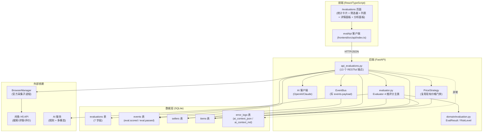
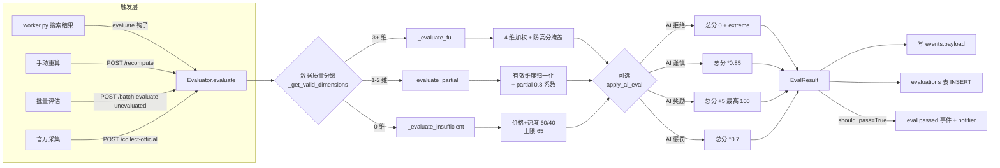
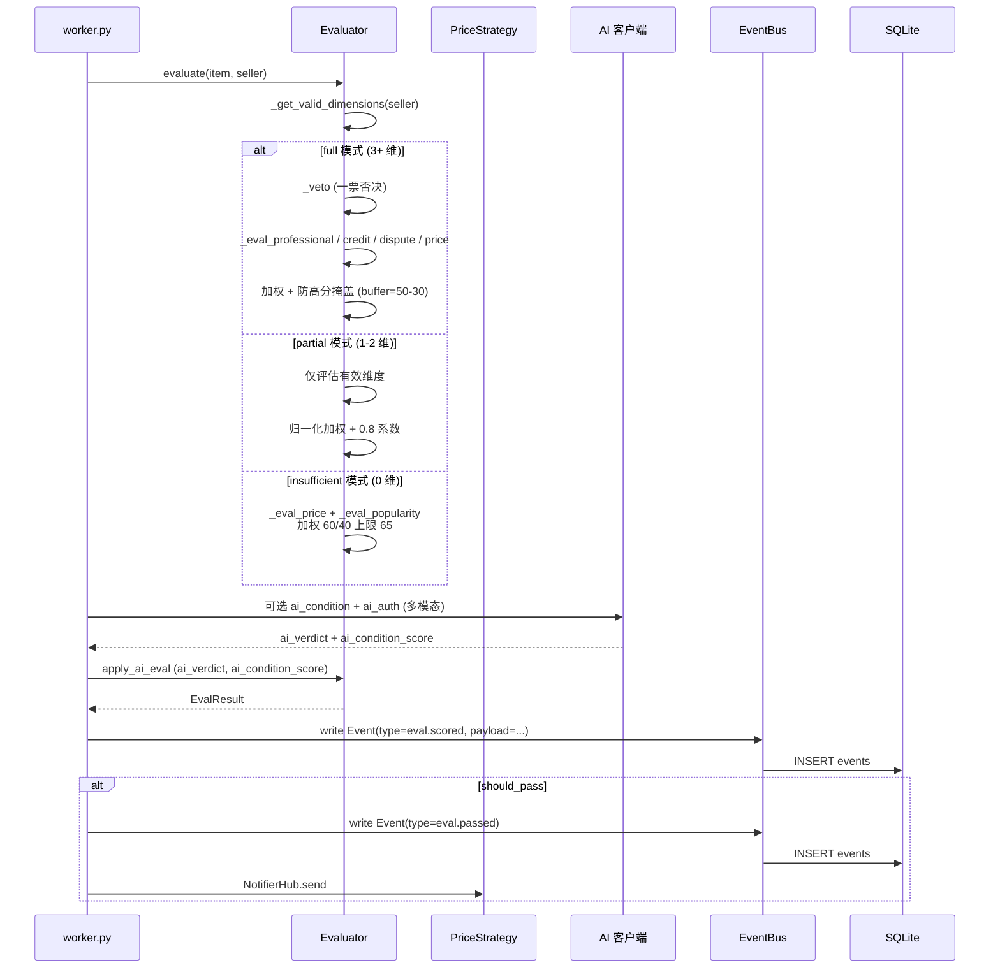
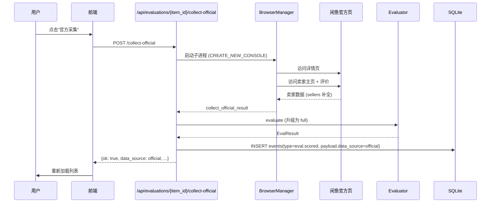

# 闲鱼猎人「卖家评估」模块需求规格说明书

| 项 | 内容 |
|---|---|
| 文档版本 | v1.0 |
| 文档日期 | 2026-07-05 |
| 文档状态 | 初版（与详细设计 v2.0 对齐） |
| 所属项目 | 闲鱼猎人（XianyuHunter） |
| 所属菜单 | 数据查看 → 卖家评估 |
| 菜单标识 | `menu_registry.yaml` 中 `key=evaluations`、`icon=AuditOutlined`、`sort_order=12`、`category=data_view` |
| 关联路由 | 前端 `/evaluations`；后端 `/api/evaluations/*` |
| 关联文档 | [卖家评估-详细设计.md](卖家评估-详细设计.md)（v2.0/2026-07-05） |
| 文档类型 | 需求规格说明书（SRS） |

> **本文档首段：继承 `project_memory.md` 中的项目硬约束**。下文 §1.3.3 显式列出适用项与映射实现要点；本节先做总览：
> 1. **Web 进程必须使用 `with_browser=False` 模式**——本模块官方采集功能依赖浏览器子进程（`XH_WITH_SCHEDULER=1` 模式），与现有 `api_evaluations.py` 保持一致。
> 2. **认证白名单机制**——`/api/evaluations/*` 全部需通过现有 `auth.py` 认证中间件，不加入白名单（与 `/api/auth/cookie` 不同）。
> 3. **前端 fetch 必须含 `credentials: 'include'`**——`frontend/src/api/index.ts` 中 `evalApi` 沿用 `client` 默认配置。
> 4. **401 必须返回 JSON `{"detail":"Unauthorized"}`**——`api_evaluations.py` 走 `JSONResponse` 路径，符合规范。
> 5. **token 比较使用 `hmac.compare_digest()`**——本模块无显式 token 比对，但官方采集 Cookie 校验延用 `cookie_rotator.is_m5tk_expired` 集中函数。
> 6. **敏感字段不日志**——评估结果 `dimension_scores` / `reject_reasons` / `ai_context_*` 等评估内容可记录；闲鱼 Cookie 明文 / 用户 unb 严禁出现在结构化日志中。
> 7. **token 写失败触发 `logging.warning()`**——官方采集 `collect_official` 失败时分级处理：可重试状态码（410/441/502/timeout）自动重试 1 次，永久错误（403/440/503）通过 message 提示用户。
> 8. **模块级 import**——`api_evaluations.py` 顶层 import 已对齐 `pydantic` / `fastapi` / `xianyu_hunter.*`，无函数内冗余 import。
> 9. **DB 索引**——`evaluations` 表已有 `ix_evaluations_seller` / `ix_evaluations_created`；`events` 表按 `type=eval.scored` 过滤时借助 `events.type` 单列索引（见 §1.3.3 不适用项说明）。
> 10. **COUNT 查询 CASE WHEN 聚合**——`/distribution` 端点使用 SQLAlchemy `case()` 按 `risk_level` 聚合 + `data_quality` 聚合，与现有 `api_logs.py` 保持一致。
> 11. **WebView2 子进程 `CREATE_NEW_CONSOLE`**——官方采集子进程（`collect_official`）启动 flags 与现有 `api_auth.py` 保持一致。
> 12. **WebView2 `private_mode=False` + 独立 `storage_path`**——官方采集连接真实浏览器遵循现有 BrowserManager 配置（`XH_WITH_SCHEDULER=1` 模式下）。

---

## 目录

- [0. 阶段交接声明](#0-阶段交接声明)
- [1. 引言](#1-引言)
  - [1.1 编写目的](#11-编写目的)
  - [1.2 项目背景](#12-项目背景)
  - [1.3 范围与约束](#13-范围与约束)
  - [1.4 术语与缩写](#14-术语与缩写)
  - [1.5 参考资料](#15-参考资料)
- [2. 总体描述](#2-总体描述)
  - [2.1 产品定位](#21-产品定位)
  - [2.2 用户角色与特征](#22-用户角色与特征)
  - [2.3 运行环境](#23-运行环境)
  - [2.4 设计约束](#24-设计约束)
  - [2.5 假设与依赖](#25-假设与依赖)
- [3. 总体架构设计](#3-总体架构设计)
  - [3.1 模块架构图](#31-模块架构图)
  - [3.2 数据流程图](#32-数据流程图)
  - [3.3 关键时序图](#33-关键时序图)
  - [3.4 模块分层与职责](#34-模块分层与职责)
- [4. 功能需求](#4-功能需求)
  - [FR-1 评估明细列表](#fr-1-评估明细列表)
  - [FR-2 评估触发与重算](#fr-2-评估触发与重算)
  - [FR-3 4 维评分模型](#fr-3-4-维评分模型)
  - [FR-4 5 档风险等级](#fr-4-5-档风险等级)
  - [FR-5 数据质量三级降级](#fr-5-数据质量三级降级)
  - [FR-6 AI 成色评估（多模态）](#fr-6-ai-成色评估多模态)
  - [FR-7 AI 多模态鉴伪](#fr-7-ai-多模态鉴伪)
  - [FR-8 官方采集闭环](#fr-8-官方采集闭环)
  - [FR-9 手动抢单入口](#fr-9-手动抢单入口)
  - [FR-10 评估反馈闭环](#fr-10-评估反馈闭环)
  - [FR-11 阈值建议算法](#fr-11-阈值建议算法)
  - [FR-12 卖家价格趋势](#fr-12-卖家价格趋势)
  - [FR-13 卖家行为趋势](#fr-13-卖家行为趋势)
- [5. 接口定义](#5-接口定义)
- [6. 数据模型](#6-数据模型)
- [7. 性能指标](#7-性能指标)
- [8. 安全要求](#8-安全要求)
- [9. 前端设计](#9-前端设计)
- [10. 部署与集成](#10-部署与集成)
- [11. 验收标准](#11-验收标准)
- [12. 附录](#12-附录)

---

## 0. 阶段交接声明

```
- 当前阶段：卖家评估 SRS 编写（v1.0） ✅ 已完成
- 下一阶段：数据查看菜单其余 SRS 汇总校验（商品中心/抢单记录/事件时间线等）
- 下一阶段智能体：主智能体
- 下一阶段技能：通用（无）
- 交接上下文：
  · 本文档定义「数据查看 → 卖家评估」二级菜单完整需求 v1.0
  · 关键设计决策：13 个 API 端点（list / latest / auto-collect-stats / distribution / seller-price-trend / threshold-suggestion / seller-trend / feedback / feedback-stats / recompute / batch-evaluate-unevaluated / batch-collect-official / collect-official）
  · 4 维评分模型：professional(30) + credit(30) + dispute(25) + price(15) = 100
  · 5 档风险等级：low / medium / high / extreme / unknown（小写枚举）
  · 3 级数据质量：full（卖家 3+ 维有效）/ partial（卖家 1-2 维有效）/ insufficient（仅价格维度有效）
  · 7 类成色关键词库：newness / newness_worn / used / worn / broken / completeness / completeness_missing
  · 评估明细列表数据源：events 表 eval.scored 事件（不读 evaluations 表）
  · 评估反馈存储：events.payload.feedback（evaluation_feedback 表不存在）
  · evaluations 表仅 7 字段：id / item_id / seller_id / score / risk_level / dimension_scores / reject_reasons / created_at（无 ai_condition / ai_auth / data_quality / updated_at 字段）
  · ai_context_json / ai_context_md 属于 error_logs 表（错误日志 AI 诊断上下文），不是评估表字段
  · 继承 project_memory.md 全部硬约束（首段已枚举 12 项适用映射）
  · 关联详细设计文档：卖家评估-详细设计.md v2.0
```

---

## 1. 引言

### 1.1 编写目的

本需求规格说明书定义「数据查看 → 卖家评估」二级菜单的完整需求规格，作为前端/后端开发、测试与验收的唯一依据。

**目标读者**：
- 后端开发工程师：依据 §3-§6、§8、§10 进行模块实现与扩展
- 前端开发工程师：依据 §4、§9 进行页面开发
- 测试工程师：依据 §7、§11 编写测试用例与执行验收
- 项目经理：依据 §2、§11 进行范围与里程碑管理
- 智能客服 KB 训练：本文档与 [卖家评估-详细设计.md](卖家评估-详细设计.md) 共同作为 KB 检索素材

### 1.2 项目背景

闲鱼猎人（XianyuHunter）是一个闲鱼自动捡漏与抢单工具，已具备任务管理、商品采集、AI 评估、自动下单、多渠道通知等完整能力（详见 [requirements.md](../requirements.md)、[design.md](../design.md) 与 [概要设计文档.md](../概要设计文档.md)）。

随着系统运行规模扩大，**评估结果的可观测性、可调控性与反馈闭环能力目前分散在 `evaluator.py` / `worker.py` / `api_evaluations.py` 内部**，缺乏统一的运维入口，导致以下痛点：

| 痛点 | 现状 | 影响 |
|------|------|------|
| 评估明细不可观测 | `evaluations` 表只存最近一次评分，历史被覆盖；详情散落 `events` 表 | 用户无法回溯评分变化 |
| 数据不足时误判 | 单一评分函数，无降级策略 | 卖家数据缺失时评分趋同或被错杀 |
| 风险等级不可见 | `risk_level` 写入 `evaluations` 表但前端无过滤 | 无法按风险分群运营 |
| 官方采集无入口 | 浏览器子进程 `collect_official` 内部方法 | 卖家主页/评价权威数据无人工补采入口 |
| 反馈无法回流 | 评估准确性无用户反馈渠道 | AI 调优与配置调优无数据支撑 |
| 阈值无建议 | 用户盲调 `pass_score` / `auto_buy_score` | 通过率不可控 |
| 卖家行为无趋势 | `items` 表只有 `publish_time` 单点数据 | 无法识别"刷量"或"批量下架"异常 |
| 评估维度黑盒 | 4 维评分计算在 `evaluator.py` 内部 | 配置变更影响不可视 |

**解决方案**：新增「卖家评估」二级菜单，将评估明细、4 维评分明细、风险等级分布、官方采集触发、评估反馈闭环、阈值建议算法、卖家价格/行为趋势等能力统一暴露给前端，提供 **13 个 RESTful 端点 + 4 维量化评分 + 3 级数据质量降级 + 5 档风险等级** 的完整评估观测与调控能力。

### 1.3 范围与约束

#### 1.3.1 包含范围（In-Scope）

- 评估明细列表（`GET /api/evaluations`，从 `events` 表 `eval.scored` 事件读取）
- 单条最新评估（`GET /api/evaluations/latest/{item_id}`）
- 官方采集统计（`GET /api/evaluations/auto-collect-stats`，按 1h/6h/24h/7d 窗口统计）
- 风险等级分布（`GET /api/evaluations/distribution`，5 档风险 × 3 档数据质量二维分布）
- 卖家价格趋势（`GET /api/evaluations/seller-price-trend`，按发布日分组）
- 阈值建议（`GET /api/evaluations/threshold-suggestion`，二分查找近 7 天分布使通过率最接近 75%）
- 卖家行为趋势（`GET /api/evaluations/{item_id}/seller-trend`，卖家近 30 天发布/下架/重发行为）
- 评估反馈提交（`POST /api/evaluations/{item_id}/feedback`，accurate/inaccurate/partial）
- 反馈统计（`GET /api/evaluations/feedback/stats`，准确率 + 各档计数）
- 单次重算（`POST /api/evaluations/recompute?task_id=xxx`，与 `worker.py` 价格门禁保持一致）
- 批量评估未评估商品（`POST /api/evaluations/batch-evaluate-unevaluated`）
- 批量官方采集（`POST /api/evaluations/batch-collect-official`）
- 单条官方采集（`POST /api/evaluations/{item_id}/collect-official`，含重试退避）
- 4 维评分模型（`professional(30) + credit(30) + dispute(25) + price(15) = 100`）
- 5 档风险等级（`low` / `medium` / `high` / `extreme` / `unknown`，**小写枚举**）
- 3 级数据质量降级（`full` / `partial` / `insufficient`，按有效维度数划分）
- 7 类成色关键词库（`newness` / `newness_worn` / `used` / `worn` / `broken` / `completeness` / `completeness_missing`）
- AI 成色评估（多模态图像+文本，1-10 分制）
- AI 多模态鉴伪（盗图/损坏/一致性/模板检测）
- 防高分掩盖（基于维度方差的动态缓冲）
- partial 模式 0.8 惩罚系数（最高 80 分）
- insufficient 模式仅价格+热度（上限 65 分）
- seller_nick 脏数据清洗（5 种污染类型：region/credit/publish_time/condition/combined）
- 一票否决项（黑名单 + 信用分 < 阈值）
- 前端 `/evaluations` 页面（统计卡片 + 筛选器 + 列表 + 详情面板 + 分析面板）
- 评估反馈闭环（写入 `events.payload.feedback`）
- 阈值建议算法（二分查找目标通过率）

#### 1.3.2 排除范围（Out-of-Scope）

- 不重新实现 `worker.py` 搜索流水线（复用现有价格门禁与 AI 评估钩子）
- 不实现卖家画像的实时爬取（仅消费 `sellers` 表已采集字段）
- 不实现评估模型的自训练（AI 评估来自外部 AI 客户端，本模块不训练模型）
- 不替代现有「评估规则」配置菜单（`/config/eval`，仍由其管理权重/阈值/关键词）
- 不实现评估结果的多渠道推送（推送由 `notifier` 模块 + `eval.passed` 事件触发）
- 不实现评估历史的多版本对比（仅消费 `events` 表最新 `eval.scored` 事件）

#### 1.3.3 硬约束

继承 [project_memory.md](c:/Users/hspcadmin/.trae-cn/memory/projects/-d-code-otherProjects-17-xianyu/project_memory.md) 中的项目硬约束，并显式映射到本模块实现：

| 硬约束 | 本模块适用性 | 实现要点 |
|--------|--------------|----------|
| Web 进程使用 `with_browser=False` 模式 | 适用 | Web 进程本身不启浏览器；官方采集子进程由 `XH_WITH_SCHEDULER=1` 模式启动，503 错误明确提示用户 |
| 认证白名单（`/api/auth/cookie` 等） | 不适用 | `/api/evaluations/*` **必须**走 `auth.py` 认证，不加入白名单 |
| 前端 fetch 必须含 `credentials: 'include'` | 适用 | `frontend/src/api/index.ts` 中 `evalApi` 沿用 `client` 默认配置 |
| htmx 用官方 `<meta>` 配置 credentials | 不适用 | 本模块前端不使用 htmx，使用 axios |
| 401 响应必须返回 JSON `{"detail":"Unauthorized"`} | 适用 | `api_evaluations.py` 走 `JSONResponse` 路径，符合规范 |
| 后端 token 比较使用 `hmac.compare_digest()` | 适用 | 官方采集 Cookie 校验延用 `cookie_rotator.is_m5tk_expired` 集中函数，避免规则漂移 |
| 敏感字段（token 长度等）不日志 | 适用 | §8.5 日志规范：评估结果内容可记录；闲鱼 Cookie 明文 / 用户 unb / m5tk 明文严禁日志 |
| token 写失败触发 `logging.warning()` | 适用 | 官方采集可重试错误自动重试 1 次（410/441/502/timeout），永久错误（403/440/503）通过 `message` 提示用户 |
| 缺失 import 必须 module-level | 适用 | `api_evaluations.py` 全部模块级 import（`pydantic` / `fastapi` / `xianyu_hunter.*`），无函数内冗余 import |
| DB 必须在 `task_id/seller_id/...` 加索引 | 部分适用 | `evaluations` 表已有 `ix_evaluations_seller` / `ix_evaluations_created`；`events` 表按 `type=eval.scored` 过滤时借助 `events.type` 单列索引（events 表已有 `Index("ix_events_type", "type")`） |
| COUNT 查询用 CASE WHEN 聚合 | 适用 | `/distribution` 端点使用 SQLAlchemy `case()` 按 `risk_level` 聚合 + `data_quality` 聚合，避免 5 次独立 COUNT 查询 |
| WebView2 子进程使用 `CREATE_NEW_CONSOLE` | 适用 | 官方采集子进程（`collect_official`）启动 flags 对齐 `api_auth.py` |
| WebView2 `webview.start()` 设 `private_mode=False` + 独立 `storage_path` | 适用 | 官方采集连接真实浏览器遵循现有 BrowserManager 配置（`XH_WITH_SCHEDULER=1` 模式下） |
| KBManager 排除 `web/static/` 等目录 | 不适用 | 本模块不涉及 KB 索引 |
| `local_embedding.py` HF_ENDPOINT 设置 | 不适用 | 本模块不涉及 embedding |
| EmbeddingService 本地后端 | 不适用 | 同上 |
| sentence-transformers 跨版本兼容 | 不适用 | 同上 |
| `run_migrations` 各块独立 try/except | 不适用 | 本模块无新迁移 |
| 启动钩子异常 `logger.exception()` | 适用 | 官方采集子进程启动失败时打印完整 traceback 至 `error_logs` 表 |

### 1.4 术语与缩写

| 术语 | 全称 | 说明 |
|------|------|------|
| Evaluator | Evaluator | 卖家评估器（`modules/evaluator.py`），4 维评分主类 |
| EvalResult | Evaluation Result | 评估结果领域模型（`domain/evaluation.py`），含 `score` / `risk_level` / `dimension_scores` / `reject_reasons` / `data_quality` |
| RiskLevel | Risk Level | 风险等级枚举：`low` / `medium` / `high` / `extreme` / `unknown`（**小写**） |
| DataQuality | Data Quality | 数据质量分级：`full` / `partial` / `insufficient` |
| professional | Professional Dimension | 维度 1：职业卖家识别（权重 30） |
| credit | Credit Dimension | 维度 2：信用与资质（权重 30） |
| dispute | Dispute Dimension | 维度 3：历史纠纷与黑名单（权重 25） |
| price | Price Dimension | 维度 4：价格与竞价异常（权重 15） |
| EvalConfig | Evaluation Config | 评估配置（`infra/yaml_config.py: EvalConfig`），含 `weights` / `thresholds` / `professional_keywords` / `pass_score` / `auto_buy_score` |
| EvaluationThresholds | Evaluation Thresholds | 运行时阈值（含 `on_sale_count` / `post_count_30d` / `top_category_ratio` / `credit_score_min` / `bad_review_max` / `register_days_min` / `pass_score` / `auto_buy_score`） |
| Pass Score | Pass Score | 通过分数（默认 60），评估 ≥ 此分推送通知 |
| Auto Buy Score | Auto Buy Score | 全自动拍下分数（默认 80），评估 ≥ 此分且风险等级为 LOW 时全自动拍下 |
| 7 类成色关键词 | Condition Keywords | `newness` / `newness_worn` / `used` / `worn` / `broken` / `completeness` / `completeness_missing` |
| eval.scored | Scored Event | 评估完成事件（`events.type = 'eval.scored'`），评估明细列表从该事件读取 |
| eval.passed | Passed Event | 评估通过事件，由 `notifier` 消费后推送通知 |
| eval.feedback | Feedback Event | 评估反馈事件（写入 `events.payload.feedback`） |
| 一票否决 | Veto | 命中黑名单 / `credit_score < credit_score_min` 时直接 0 分 + `risk_level=extreme` |
| 防高分掩盖 | Variance Buffer | 维度间离散度越大，缓冲越小；`buffer = max(30, 50 - std*0.4)` |
| partial 惩罚 | Partial Penalty | `partial` 模式下总分 × 0.8，上限 80 |
| insufficient 上限 | Insufficient Cap | `insufficient` 模式上限 65 分（可 pass 但不可 auto_buy） |
| 卖家脏数据 | Dirty Seller Nick | 卖家昵称被字段污染（5 种类型：region/credit/publish_time/condition/combined） |
| 数据门禁 | Price Gate | 重算 / 批量评估前用 `PriceStrategy.check` 过滤超范围商品（与 `worker.py` 搜索流水线一致） |
| 官方采集 | Official Collect | 访问闲鱼官方详情页+卖家主页+评价的浏览器自动化补采 |
| 评估反馈 | Evaluation Feedback | 用户标记评估准确/不准确/部分准确，写入 `events.payload.feedback` |
| AI 双引擎 | AI Dual Engine | 规则评估 + AI 评估（成色评估/多模态鉴伪） |
| ai_context | AI Context | 错误日志 AI 诊断上下文（**属于 `error_logs` 表**，非评估表字段） |

### 1.5 参考资料

| 文档 | 路径 | 关联章节 |
|------|------|----------|
| 卖家评估 详细设计 v2.0 | [卖家评估-详细设计.md](卖家评估-详细设计.md) | 全部章节 |
| 反爬登录管理 详细设计 v1.1 | [../04-系统维护/反爬登录管理-详细设计.md](../04-系统维护/反爬登录管理-详细设计.md) | SRS 模板 |
| 反爬登录管理 需求规格 v1.0 | [../04-系统维护/反爬登录管理-需求规格.md](../04-系统维护/反爬登录管理-需求规格.md) | SRS 模板 |
| 需求文档 v1.0 | [../requirements.md](../requirements.md) | §3 数据查看 |
| 概要设计文档 v2.0 | [../概要设计文档.md](../概要设计文档.md) | §3 分层架构 |
| 技术设计说明书 | [../design.md](../design.md) | §3 评估模块 |
| 评估规则配置 v1.0 | [../05-配置管理/评估规则-详细设计.md](../05-配置管理/评估规则-详细设计.md) | 维度/权重/阈值 |
| 米其林设计系统 | [../standards/michelin-design-system.md](../standards/michelin-design-system.md) | UI 规范 |
| 项目硬约束 | [project_memory.md](c:/Users/hspcadmin/.trae-cn/memory/projects/-d-code-otherProjects-17-xianyu/project_memory.md) | 全部硬约束 |

---

## 2. 总体描述

### 2.1 产品定位

**卖家评估**是闲鱼猎人「数据查看」菜单下**最复杂的多维量化页面**，对每条商品调用 4 维加权评分模型，输出 0-100 综合分、5 档风险等级、3 档数据质量分级，辅以官方采集、批量重算、反馈闭环与阈值建议能力，是「评估质量调控」的中枢页面。

**核心价值**：

- **4 维量化风险**：professional(30) + credit(30) + dispute(25) + price(15) = 100，从职业度/信用/纠纷/价格四个角度量化卖家与商品风险；
- **3 级数据质量降级**：full（卖家 3+ 维有效）/ partial（卖家 1-2 维有效）/ insufficient（仅价格维度有效），避免缺失数据时评分趋同或被错杀；
- **AI 双引擎补强**：成色评估（7 类关键词库）+ 多模态鉴伪（盗图/损坏/一致性/模板检测），对规则评估补强；
- **官方采集闭环**：访问闲鱼官方详情页+卖家主页+评价后重算，将 `data_quality` 升级为 `full`，对应 `data_source=official` 标记；
- **阈值建议算法**：基于近 7 天评估分布二分查找使通过率最接近目标值（默认 75%）；
- **批量重算与批量评估**：支持按 `task_id` 重算历史评估，或批量评估 `items` 表中未评估商品，与 `worker.py` 价格门禁保持一致；
- **评估反馈闭环**：用户标记评估准确/不准确/部分准确，写入 `events.payload.feedback`，用于准确率统计与模型优化。

### 2.2 用户角色与特征

| 角色 | 特征 | 主要使用场景 |
|------|------|--------------|
| **运营人员** | 日常巡检，对高风险商品做处置 | 列表浏览 + 风险等级过滤 + 详情查看 + 反馈标记 |
| **配置管理员** | 调优评估规则/阈值 | 阈值建议查看 + 触发 recompute + 比对重算前后分布 |
| **数据分析员** | 评估质量复盘 | 分布统计 + 反馈统计 + 卖家价格/行为趋势 |
| **应急处置员** | 高风险商品补采 | 单条/批量官方采集 + 重算验证 |
| **业务负责人** | 业务健康度巡检 | 统计卡片（一键过滤可抢/通过/驳回/数据不足） |

### 2.3 运行环境

- **操作系统**：Windows 10/11、Linux（Docker）
- **Python**：3.11+
- **Node.js**：20 LTS（前端）
- **浏览器**：Edge / Chrome（官方采集依赖，需 `XH_WITH_SCHEDULER=1` 模式）
- **数据库**：SQLite 3（主存储），WAL 模式
- **缓存**：进程内（`EvaluatedCache` / `Container` 单例）
- **外部依赖**：闲鱼搜索 API（`mtop.taobao.idle.item.search`）、闲鱼详情 API（`mtop.taobao.idle.page.detail`）、AI 客户端（OpenAI/Claude 兼容接口）

### 2.4 设计约束

| 约束 | 说明 |
|------|------|
| **后端框架** | FastAPI（`backend/xianyu_hunter/web/routes/api_evaluations.py`） |
| **ORM** | SQLAlchemy 2.0 + SQLite |
| **领域层** | `domain/evaluation.py`（`EvalResult` / `RiskLevel`） |
| **评估器** | `modules/evaluator.py`（`Evaluator` / `EvaluationThresholds`） |
| **依赖注入** | `Container` 单例（`get_container()`），路由通过 `Depends(get_container)` 注入 |
| **前端框架** | React 18 + TypeScript 5 + Ant Design 5 |
| **前端状态** | Zustand（已评估列表缓存） + `useState`（页面本地态） |
| **菜单注册** | `config/menu_registry.yaml`（`key=evaluations`、`sort_order=12`、`category=data_view`） |
| **认证** | 现有 `auth.py` 中间件（不加入白名单） |
| **持久化** | `evaluations` 表（仅 7 字段）+ `events` 表（`eval.scored` 事件）+ `sellers` 表 + `items` 表 |
| **评估数据源** | 评估明细列表**从 `events` 表 `eval.scored` 事件读取**，**不读 `evaluations` 表** |
| **反馈存储** | `events.payload.feedback` 字段，**`evaluation_feedback` 表不存在** |
| **ai_context 归属** | `ai_context_json` / `ai_context_md` 属于 `error_logs` 表（错误日志 AI 诊断上下文） |
| **端口** | 与现有 Web 一致（默认 8001） |

### 2.5 假设与依赖

| 假设/依赖 | 说明 |
|------------|------|
| 闲鱼 API 可达 | 官方采集依赖闲鱼官方页面；H5 API 频控时返回 410/441/502 由前端重试 |
| 闲鱼 Cookie 有效 | 官方采集需闲鱼已登录态；Cookie 失效时返回 403/440 |
| 浏览器子进程可用 | `XH_WITH_SCHEDULER=1` 启动模式下 BrowserManager 已启动 |
| AI 客户端可用 | AI 评估依赖外部 AI 服务；失败时降级为规则评估 |
| `evaluations` 表已迁移 | 由 `init_db()` 自动建表（7 字段），无新迁移 |
| `events` 表已有 type 列 | 由 `init_db()` 增量迁移（`PRAGMA table_info(events)` 检测后 `ALTER TABLE`），无新迁移 |
| `sellers` / `items` 表已存在 | 由 `init_db()` 自动建表 |
| 单 Token 多用户隔离 | 评估明细按 `task_id` 间接归属用户（task 已有 `user_id` 字段） |

---

## 3. 总体架构设计

### 3.1 模块架构图



### 3.2 数据流程图



### 3.3 关键时序图

#### 3.3.1 评估触发 → AI 评估 → 结果存储



#### 3.3.2 官方采集 → 重新评估



### 3.4 模块分层与职责

| 层 | 文件 | 职责 |
|----|------|------|
| 路由层 | `backend/xianyu_hunter/web/routes/api_evaluations.py` | 13 个 RESTful 端点、请求/响应模型、参数校验、错误处理 |
| 服务层 | `backend/xianyu_hunter/modules/evaluator.py` | `Evaluator` 主类、4 维评分、数据质量分级、防高分掩盖、AI 评估集成 |
| 领域层 | `backend/xianyu_hunter/domain/evaluation.py` | `EvalResult` / `RiskLevel` 数据类与枚举 |
| 仓储层 | `backend/xianyu_hunter/infra/db_models.py` | `EvaluationRow` / `EventRow` / `ErrorLogRow` ORM 模型（evaluations 7 字段） |
| 容器层 | `backend/xianyu_hunter/container.py` | `Container` 单例依赖注入（`evaluator` / `repo` / `event_bus`） |
| 配置层 | `backend/xianyu_hunter/infra/yaml_config.py` | `EvalConfig` 配置加载（`weights` / `thresholds` / `professional_keywords` / `pass_score` / `auto_buy_score`） |
| 事件层 | `backend/xianyu_hunter/domain/events.py` | `Event` / `EventType` 事件模型 |
| 前端路由层 | `frontend/src/pages/Evaluations/index.tsx` | 页面容器组件 |
| 前端子组件 | `frontend/src/pages/Evaluations/components/*` | EvalHeatmap / ResultBarChart / PriceHistogram / TrendSparkline / ColumnSettingsModal / CollapsibleRail |
| 前端 API 客户端 | `frontend/src/api/index.ts` (evalApi) | 13 个端点封装 + 类型定义 |
| 前端工具 | `frontend/src/pages/Evaluations/utils.ts` | `isDataInsufficient` / `getInsufficientReason` / `resolveActionDisplay` |
| 前端常量 | `frontend/src/pages/Evaluations/dimensionLabels.ts` | `translateDimension` / `translateRejectReason` 维度/原因中文化 |

---

## 4. 功能需求

### FR-1 评估明细列表

**目标**：从 `events` 表的 `eval.scored` 事件读取评估明细列表，支持多维筛选、分页、排序。

**数据源澄清**：评估明细列表**从 `events` 表 `eval.scored` 事件读取**（`api_evaluations.py:564` 的 `list_evaluations` 端点），**不读 `evaluations` 表**。`evaluations` 表仅存最近一次评估结果（被 worker 流水覆盖写入），历史明细依赖 `events` 表的 `eval.scored` 事件追溯。

**核心字段**（从 `eval.scored` 事件 `payload` 提取）：

| 字段 | 来源 | 说明 |
|------|------|------|
| `item_id` | `event.item_id` | 商品 ID |
| `task_id` | `event.task_id` | 任务 ID |
| `score` | `payload.score` | 综合评分 0-100 |
| `risk_level` | `payload.risk_level` | 风险等级（low/medium/high/extreme/unknown） |
| `dimension_scores` | `payload.dimension_scores` | 4 维细分分 JSON |
| `reject_reasons` | `payload.reject_reasons` | 拒绝原因列表 JSON |
| `data_quality` | `payload.data_quality` | 数据质量（full/partial/insufficient） |
| `data_source` | `payload.data_source` | 采集来源（search/official/recompute/live） |
| `evaluated_at` | `event.created_at` | 评估时间 |
| `seller_id` | `payload.seller_id` | 卖家 ID（从 items.seller_id 联表） |
| `seller_nick` | `items.seller_nick` | 卖家昵称（联表 + 脏数据清洗） |
| `brand` | `items.brand` | 品牌（联表） |
| `price` | `items.price` | 价格（联表） |
| `region` | `items.region` | 地区（联表） |
| `is_sold` | `items.is_sold` | 销售状态（0=在售，1=已售） |
| `condition` / `condition_tags` | `items.condition` / `items.condition_tags` | 成色（联表） |
| `feedback` | `payload.feedback` | 反馈标记（accurate/inaccurate/partial 或空） |
| `feedback_at` | `payload.feedback_at` | 反馈时间 |

**筛选维度**（URL Query 参数）：

| 参数 | 类型 | 说明 |
|------|------|------|
| `task_id` | string | 按任务 ID 过滤 |
| `item_id` | string | 按商品 ID 精确过滤 |
| `brand` | string | 按品牌过滤 |
| `min_score` / `max_score` | int | 按评分区间过滤 |
| `result_category` | string | 一键过滤 `passed` / `rejected` / `insufficient` / `all` |
| `sold_filter` | string | `on_sale` / `sold` / `all` |
| `start_time` / `end_time` | ISO datetime | 时间范围过滤 |
| `min_price` / `max_price` | float | 价格区间过滤 |
| `risk_level` | string | 按风险等级过滤（low/medium/high/extreme/unknown） |
| `data_quality` | string | 按数据质量过滤（full/partial/insufficient） |
| `data_source` | string | 按采集来源过滤（search/official/recompute/live） |
| `feedback` | string | 按反馈标记过滤（accurate/inaccurate/partial/no_feedback） |
| `page` / `page_size` | int | 分页（默认 page=1, page_size=50） |
| `sort_by` | string | 排序字段（默认 `evaluated_at`） |
| `sort_order` | string | `asc` / `desc`（默认 `desc`） |

**返回响应**：

```json
{
  "ok": true,
  "total": 1234,
  "page": 1,
  "page_size": 50,
  "items": [
    {
      "id": 12345,
      "item_id": "abc123",
      "task_id": "t1",
      "title": "佳能 EOS R6 套机",
      "thumb": "https://...",
      "price": 8500.0,
      "seller_id": "s_xyz",
      "seller_nick": "数码小王",
      "brand": "Canon",
      "region": "杭州",
      "is_sold": 0,
      "condition": "9成新",
      "condition_tags": ["newness_worn"],
      "score": 78,
      "risk_level": "medium",
      "data_quality": "full",
      "data_source": "search",
      "dimension_scores": {
        "professional": 80,
        "credit": 85,
        "dispute": 75,
        "price": 70
      },
      "reject_reasons": ["..."],
      "evaluated_at": "2026-07-05T08:00:00Z",
      "feedback": ""
    }
  ]
}
```

### FR-2 评估触发与重算

**目标**：支持自动评估（worker.py 钩子）+ 手动重算（recompute）+ 批量评估（batch-evaluate-unevaluated）。

**自动评估**（`worker.py` 搜索流水线）：
- 搜索结果中每条 `item` 触发 `Evaluator.evaluate(item, seller)`
- `should_pass=True` 时写 `eval.passed` 事件 + NotifierHub 推送
- 超范围商品（价格门禁）不写入 `eval.scored` 事件

**手动重算**（`POST /api/evaluations/recompute?task_id=xxx&notify=false`）：
- 读取 `events` 表中 `eval.scored` 事件
- 从 `items` + `sellers` 表重建 `ItemDetail` + `SellerProfile`
- 用当前配置（`EvalConfig`）重算，写入新的 `eval.scored` 事件（`data_source=recompute`）
- 超范围商品**跳过**（不删除旧事件，便于审计）
- `notify=false` 默认：recompute 是历史回算，可能批量重算大量历史数据，默认关闭避免刷爆群

**批量评估未评估商品**（`POST /api/evaluations/batch-evaluate-unevaluated?task_id=xxx&limit=50`）：
- 从 `items` 表中查找 `task_id` 下未评估的商品
- 逐条调用 `Evaluator.evaluate`，写入 `eval.scored` 事件
- 与 `worker.py` 价格门禁保持一致
- `limit` 上限 500，防止单次请求过重

**批量官方采集**（`POST /api/evaluations/batch-collect-official`）：
- 批量触发官方采集补全数据
- 进度通过 `batch_refresh_progress` 表持久化（断点续传）

### FR-3 4 维评分模型

**目标**：用 4 维加权评分模型量化卖家与商品风险。

**4 维定义**（与 `EvalConfig.weights` 一致）：

| 维度 key | 名称 | 权重 | 数据源 | 评分函数 |
|----------|------|------|--------|----------|
| `professional` | 职业卖家识别 | 30 | `sellers.on_sale_count` / `post_count_30d` / `top_category_ratio` / `recent_posts` | `_eval_professional(seller, item)` |
| `credit` | 信用与资质 | 30 | `sellers.credit_score` / `register_days` | `_eval_credit(seller)` |
| `dispute` | 历史纠纷与黑名单 | 25 | `sellers.bad_review_count` / `in_blacklist` | `_eval_dispute(seller)` |
| `price` | 价格与竞价异常 | 15 | `items.price` / `title` / `image_urls` | `_eval_price(item)` |

**加权汇总**（`_evaluate_full`）：

```python
# 加权总分（weight_sum = 100）
weighted_total = sum(scores[k] * weights[k] for k in scores) // weight_sum
# 防高分掩盖：基于维度方差的动态缓冲
# std 范围约 0-50，映射到 buffer 50→30
buffer = max(30, int(50 - std * 0.4))
# 拉低总分
total = min(weighted_total, min_dim + buffer)
```

**一票否决**（`_veto`，命中即 0 分 + `risk_level=extreme`）：

| 条件 | 说明 |
|------|------|
| `sellers.in_blacklist == 1` | 平台黑名单 |
| `sellers.credit_score < credit_score_min`（默认 60） | 信用分低于阈值 |

**关键词命中**（`_try_apply_professional_keyword_deduction`）：
- 遍历 `sellers.recent_posts[*].title`
- 命中 `professional_keywords`（默认：批发/代理/代购/大量/店铺/厂家/直发/一手/现货/大量有货）即扣 15 分
- **命中即提前返回**（跳过贩子检测），避免重复扣分

**类目集中度扣分**（`_apply_top_category_ratio`）：
- `top_category_ratio >= 0.8` 视为职业卖家，硬阈值扣 25 分

**贩子检测**（`_apply_dealer_signal`，O-10-26/O-13-26）：
- 在职业卖家维度中附加贩子信号扣分
- 贩子本质是职业卖家的极端形态，扣分叠加在此维度符合语义
- O-13-26：传入 `item` 用于图像盗图检测（DB 查询相同 `image_url`）

### FR-4 5 档风险等级

**目标**：按综合分划分为 5 档风险等级（小写枚举）。

**5 档定义**（`RiskLevel` 枚举）：

| 取值 | 分值区间 | 颜色（前端） | 行为 |
|------|----------|--------------|------|
| `low` | `score >= auto_buy_score`（默认 80） | 绿色 | 可全自动拍下（`should_auto_buy`） |
| `medium` | `pass_score <= score < auto_buy_score`（默认 60-80） | 黄色 | 可推送通知（`should_pass`） |
| `high` | `40 <= score < pass_score` | 橙色 | 不推送，需用户手动审查 |
| `extreme` | `score < 40` 或一票否决 | 红色 | 直接拒绝（`is_passed=False`） |
| `unknown` | `data_quality=insufficient` 或 `score=None` | 灰色 | 数据不足，无法评估 |

**`_score_to_risk` 函数**（`evaluator.py:299`）：

```python
def _score_to_risk(self, total: int) -> RiskLevel:
    if total >= self.thresholds.auto_buy_score:   # >= 80
        return RiskLevel.LOW
    elif total >= self.thresholds.pass_score:     # >= 60
        return RiskLevel.MEDIUM
    elif total >= 40:
        return RiskLevel.HIGH
    else:
        return RiskLevel.EXTREME
```

### FR-5 数据质量三级降级

**目标**：根据卖家数据有效性动态调整评估策略，避免缺失数据时评分趋同或被错杀。

**3 级分级条件**（`evaluator.py:140-148`）：

| 分级 | 条件 | 策略 |
|------|------|------|
| `full` | 卖家 3+ 维有效（professional/credit/dispute 全有效） | 正常 4 维加权评估（价格维度总是有效） |
| `partial` | 卖家 1-2 维有效 | 仅评估有效维度，按有效维度权重归一化；总分 × 0.8 系数；上限 80 |
| `insufficient` | 卖家 0 维有效（仅价格维度有效） | 仅价格 + 热度维度，60/40 加权；上限 65 |

**维度有效性判定**（`_get_valid_dimensions`，`evaluator.py:371`）：

| 维度 | 有效条件 |
|------|----------|
| `professional` | `on_sale_count >= 1` 或 `post_count_30d >= 1` |
| `credit` | `credit_score >= 400`（最小有效信用分）或 `register_days >= 1` |
| `dispute` | `on_sale_count >= 1` 或 `register_days >= 1`（闲鱼不公开差评数） |
| `price` | 总是有效（来自 `item`） |

**模式实现差异**：

| 模式 | 加权方式 | 防高分掩盖 | 惩罚系数 | 上限 |
|------|----------|------------|----------|------|
| `full` | 4 维按权重（30+30+25+15=100） | `buffer = max(30, 50 - std*0.4)` | 无 | 100 |
| `partial` | 仅有效维度权重归一化 | `buffer=30`（更严格） | ×0.8 | 80 |
| `insufficient` | price 60% + popularity 40% | 无 | 上限 65 | 65 |

### FR-6 AI 成色评估（多模态）

**目标**：使用 AI 对商品成色做 1-10 分制评估，与规则评分集成。

**输入**：
- 商品图片（`items.image_urls`）
- 商品标题 + 描述
- 历史 `eval.scored` 评估结果

**输出**：
- `ai_verdict`：`accept` / `caution` / `reject`
- `ai_condition_score`：1-10 分（1=全新损坏，10=全新）
- `ai_auth_score`：0-10 分（鉴伪分，10=正品）

**集成逻辑**（`apply_ai_eval`，`evaluator.py:310`）：

| `ai_verdict` | 行为 | 风险等级 |
|--------------|------|----------|
| `reject` | 总分降至 0 | 强制 `extreme` |
| `caution` | 总分 × 0.85 | 至少 `medium` |
| `accept` | 不调整 | 保持原风险等级 |

**AI 评分调整**：

| `ai_condition_score` | 行为 |
|----------------------|------|
| `>= 8` | 总分 +5（最高 100） |
| `<= 3` | 总分 × 0.7（惩罚） |

**降级策略**：AI 客户端不可用时降级为规则评估，不阻断主流程。

### FR-7 AI 多模态鉴伪

**目标**：使用多模态 AI 检测商品图像/文字的盗图、损坏、一致性、模板问题。

**4 类鉴伪**：

| 类型 | 说明 | 处罚 |
|------|------|------|
| **盗图检测** | DB 查询相同 `image_url`，若多个商品共享同一图像高度疑似盗图 | 总分 × 0.7 |
| **损坏检测** | 图像含明显破损/污渍/水印 | `ai_verdict=reject`，总分 0 |
| **一致性检测** | 图像与标题/描述不符（如标题"全新"但图像有明显使用痕迹） | `ai_verdict=caution`，总分 × 0.85 |
| **模板检测** | 图像为白底模板照（如官网产品图）而非实拍 | `ai_verdict=caution`，总分 × 0.85 |

**降级策略**：AI 客户端不可用时跳过鉴伪，仅依赖规则评估。

### FR-8 官方采集闭环

**目标**：通过浏览器子进程访问闲鱼官方详情页 + 卖家主页 + 评价，采集权威数据后重新评估。

**触发方式**：
- 单条：`POST /api/evaluations/{item_id}/collect-official?task_id=xxx`
- 批量：`POST /api/evaluations/batch-collect-official`

**流程**：
1. 后端启动 BrowserManager 子进程（`XH_WITH_SCHEDULER=1` 模式）
2. 子进程访问闲鱼详情页（`goofish.com/item.htm?id=xxx`）
3. 子进程访问卖家主页（`goofish.com/personal?userId=xxx`）
4. 子进程访问评价页（`goofish.com/personal?userId=xxx&itemId=xxx#评价`）
5. 数据回写 `sellers` / `items` 表
6. 触发 `Evaluator.evaluate`，升级 `data_quality` 为 `full`
7. 写入 `eval.scored` 事件，`payload.data_source=official`

**错误处理**（`collectOfficialWithRetry`，前端）：

| 状态码 | 含义 | 行为 |
|--------|------|------|
| `410` | 页面未加载 | 自动重试 1 次，1s 后 |
| `441` | 触发反爬 | 自动重试 1 次，3s 后 |
| `502` | 浏览器连接异常 | 自动重试 1 次，1s 后 |
| `timeout` | 超时 | 自动重试 1 次，2s 后 |
| `403` / `440` | 闲鱼登录失效 | 不重试，提示用户重新登录 |
| `503` | 浏览器子进程未启用 | 不重试，提示用户以 `XH_WITH_SCHEDULER=1` 模式启动 |

### FR-9 手动抢单入口

**目标**：基于评估结果提供手动抢单入口，仅 `pass_score <= score < auto_buy_score`（`medium` 风险）时可触发。

**入口位置**：评估列表「操作列」，`data_source != 'recompute'` 且未售商品显示「抢单」按钮。

**点击行为**：
1. 前端调 `POST /api/evaluations/{item_id}/feedback` 不变；
2. 调 `orderApi` 抢单端点触发手动抢单（与 `worker.py` 自动抢单共享代码路径）
3. 抢单成功 → 写 `orders` 表 + `eval.scored` 事件 `payload.action=manual_takeover`

**错误处理**（`MANUAL_TAKEOVER_ERROR_MESSAGES`）：

| 状态码 | 含义 | 提示 |
|--------|------|------|
| `503` | 抢单功能未启用 | 需以 `XH_WITH_SCHEDULER=1` 模式启动服务 |
| `403` | 闲鱼登录失效 | 请先在「Cookie 注入」页面重新登录闲鱼 |
| `404` | 商品不存在于数据库中 | - |
| `502` | 未找到提交订单按钮 | 可能商品已下架或页面结构变化 |
| `timeout` | 浏览器自动化流程耗时过长 | 请检查网络后重试 |

**操作列占位文案**（`ActionPlaceholder`，`index.tsx:43-52`）：

| 场景 | 占位文案 |
|------|----------|
| 已下单 | "已下单" |
| 已售 | "已售" |
| 未达阈值 | "未达阈值" |

### FR-10 评估反馈闭环

**目标**：用户对评估结果做准确/不准确/部分准确标记，反馈数据用于准确率统计与模型优化。

**存储位置**：`events.payload.feedback` 字段（**`evaluation_feedback` 表不存在**）。

**提交**（`POST /api/evaluations/{item_id}/feedback?feedback=accurate&note=...&task_id=xxx`）：

| 字段 | 类型 | 必填 | 说明 |
|------|------|------|------|
| `feedback` | string | 是 | `accurate` / `inaccurate` / `partial` |
| `note` | string | 否 | 备注 |
| `task_id` | string | 否 | 任务 ID（不传则查 `item_id` 最新 `eval.scored` 事件） |

**写入**（`api_evaluations.py:1594`）：

```python
# 无 task_id 时查找该 item_id 最新的 eval.scored 事件
if not task_id:
    latest_event = container.repo.find_latest_event_by_item_and_type(
        item_id, _EVAL_SCORED_TYPE
    )
    event_id = latest_event.id
# 更新 events.payload JSON 字段
event_repo.update_event_payload(event_id, {
    "feedback": feedback,
    "feedback_note": note or "",
    "feedback_at": _utcnow().isoformat(),
})
```

**统计**（`GET /api/evaluations/feedback/stats?range_hours=24`）：

```json
{
  "ok": true,
  "total": 500,
  "total_feedback": 120,
  "accurate": 80,
  "inaccurate": 30,
  "partial": 10,
  "no_feedback": 380,
  "accuracy_rate": 0.667,
  "range_hours": 24
}
```

### FR-11 阈值建议算法

**目标**：基于历史评估分布反推建议阈值，二分查找使通过率最接近目标值（默认 75%）。

**调用**：`GET /api/evaluations/threshold-suggestion?range_hours=168&target_rate=0.75`

**算法**：

```python
# 1. 拉取近 7 天（默认 168h）所有 eval.scored 事件的 score
scores = [e.payload['score'] for e in events if e.type == 'eval.scored']

# 2. 二分查找使 pass_rate 最接近 target_rate（默认 0.75）
# pass(score) = sum(1 for s in scores if s >= score) / len(scores)
# 求 score 使 pass(score) 最接近 target_rate
low, high = 0, 100
best_score = 60  # 默认值
best_diff = float('inf')
while low <= high:
    mid = (low + high) // 2
    pass_rate = sum(1 for s in scores if s >= mid) / len(scores)
    diff = abs(pass_rate - target_rate)
    if diff < best_diff:
        best_diff = diff
        best_score = mid
    if pass_rate > target_rate:
        low = mid + 1  # 通过率过高，阈值要更高
    else:
        high = mid - 1  # 通过率过低，阈值要更低
```

**返回**：

```json
{
  "ok": true,
  "suggested_threshold": 68,
  "current_pass_rate": 0.82,
  "target_rate": 0.75,
  "actual_rate": 0.74,
  "sample_size": 1234,
  "range_hours": 168
}
```

### FR-12 卖家价格趋势

**目标**：按发布日分组统计某卖家近 N 天的价格分布，识别价格异常波动。

**调用**：`GET /api/evaluations/seller-price-trend?seller_id=xxx&days=30`

**数据源**：`items` 表中 `seller_id=xxx` 的所有商品，按 `publish_time` 按天分组。

**返回**：

```json
{
  "ok": true,
  "seller_id": "s_xyz",
  "days": 30,
  "buckets": [
    { "date": "2026-06-05", "count": 3, "min_price": 100, "max_price": 500, "avg_price": 280, "median_price": 250 },
    { "date": "2026-06-06", "count": 5, "min_price": 80, "max_price": 800, "avg_price": 350, "median_price": 320 }
  ]
}
```

### FR-13 卖家行为趋势

**目标**：统计卖家近 30 天的发布/下架/重发行为，识别"刷量"或"批量下架"异常。

**调用**：`GET /api/evaluations/{item_id}/seller-trend?days=30`

**注意**：`{item_id}` 必须不是 `threshold-suggestion`（保留字），避免与 `/threshold-suggestion` 路由冲突。

**数据源**：`items` 表中 `seller_id=items.seller_id` 的所有商品 + `events` 表中 `type=item.sold` 事件。

**返回**：

```json
{
  "ok": true,
  "seller_id": "s_xyz",
  "item_id": "abc123",
  "days": 30,
  "behavior": {
    "post_count": 15,
    "sold_count": 8,
    "relist_count": 3,
    "delist_count": 2,
    "average_lifetime_days": 12.5,
    "post_frequency_per_day": 0.5
  },
  "trend": [
    { "date": "2026-06-05", "posted": 2, "sold": 1, "delisted": 0 },
    { "date": "2026-06-06", "posted": 1, "sold": 0, "delisted": 1 }
  ],
  "is_suspicious": false,
  "suspicion_reasons": []
}
```

---

## 5. 接口定义

### 5.1 端点清单（13 个）

| 端点 | 方法 | 路径 | 说明 |
|------|------|------|------|
| 5.2.1 | GET | `/api/evaluations` | 评估明细列表（多维筛选 + 分页） |
| 5.2.2 | GET | `/api/evaluations/latest/{item_id}` | 单条最新评估 |
| 5.2.3 | GET | `/api/evaluations/auto-collect-stats` | 官方采集统计 |
| 5.2.4 | GET | `/api/evaluations/distribution` | 风险等级分布 |
| 5.2.5 | GET | `/api/evaluations/seller-price-trend` | 卖家价格趋势 |
| 5.2.6 | GET | `/api/evaluations/threshold-suggestion` | 阈值建议 |
| 5.2.7 | GET | `/api/evaluations/{item_id}/seller-trend` | 卖家行为趋势 |
| 5.2.8 | POST | `/api/evaluations/{item_id}/feedback` | 评估反馈提交 |
| 5.2.9 | GET | `/api/evaluations/feedback/stats` | 反馈统计 |
| 5.2.10 | POST | `/api/evaluations/recompute` | 手动重算 |
| 5.2.11 | POST | `/api/evaluations/batch-evaluate-unevaluated` | 批量评估未评估商品 |
| 5.2.12 | POST | `/api/evaluations/batch-collect-official` | 批量官方采集 |
| 5.2.13 | POST | `/api/evaluations/{item_id}/collect-official` | 单条官方采集 |

### 5.2 端点签名

#### 5.2.1 GET `/api/evaluations`

**描述**：评估明细列表（多维筛选 + 分页）

**Query 参数**：

| 参数 | 类型 | 必填 | 默认值 | 说明 |
|------|------|------|--------|------|
| `task_id` | string | 否 | - | 按任务 ID 过滤 |
| `item_id` | string | 否 | - | 按商品 ID 精确过滤 |
| `brand` | string | 否 | - | 按品牌过滤 |
| `min_score` | int | 否 | - | 评分下限 |
| `max_score` | int | 否 | - | 评分上限 |
| `result_category` | string | 否 | `all` | `passed` / `rejected` / `insufficient` / `all` |
| `sold_filter` | string | 否 | `all` | `on_sale` / `sold` / `all` |
| `start_time` | ISO datetime | 否 | - | 起始时间 |
| `end_time` | ISO datetime | 否 | - | 结束时间 |
| `min_price` | float | 否 | - | 价格下限 |
| `max_price` | float | 否 | - | 价格上限 |
| `risk_level` | string | 否 | - | `low` / `medium` / `high` / `extreme` / `unknown` |
| `data_quality` | string | 否 | - | `full` / `partial` / `insufficient` |
| `data_source` | string | 否 | - | `search` / `official` / `recompute` / `live` |
| `feedback` | string | 否 | - | `accurate` / `inaccurate` / `partial` / `no_feedback` |
| `page` | int | 否 | 1 | 页码 |
| `page_size` | int | 否 | 50 | 每页条数（最大 200） |
| `sort_by` | string | 否 | `evaluated_at` | 排序字段 |
| `sort_order` | string | 否 | `desc` | `asc` / `desc` |

**响应**：

```json
{
  "ok": true,
  "total": 1234,
  "page": 1,
  "page_size": 50,
  "items": [/* 见 FR-1 响应格式 */]
}
```

#### 5.2.2 GET `/api/evaluations/latest/{item_id}`

**描述**：获取指定商品的最新评估结果

**路径参数**：

| 参数 | 类型 | 说明 |
|------|------|------|
| `item_id` | string | 商品 ID |

**响应**：

```json
{
  "ok": true,
  "item_id": "abc123",
  "evaluation": {
    "score": 78,
    "risk_level": "medium",
    "data_quality": "full",
    "data_source": "search",
    "dimension_scores": {
      "professional": 80,
      "credit": 85,
      "dispute": 75,
      "price": 70
    },
    "reject_reasons": [],
    "evaluated_at": "2026-07-05T08:00:00Z"
  }
}
```

无评估记录：

```json
{
  "ok": true,
  "item_id": "abc123",
  "evaluation": null,
  "message": "该商品尚无评估记录"
}
```

#### 5.2.3 GET `/api/evaluations/auto-collect-stats`

**描述**：官方采集统计（按时间窗口）

**Query 参数**：

| 参数 | 类型 | 必填 | 默认值 | 说明 |
|------|------|------|--------|------|
| `range_hours` | int | 否 | 24 | 时间窗口（限定为 1/6/24/168 之一） |

**响应**：

```json
{
  "ok": true,
  "range_hours": 24,
  "total_evaluations": 1500,
  "official_count": 320,
  "official_success_rate": 0.85,
  "official_upgrade_count": 200,
  "by_data_quality": {
    "full": 1200,
    "partial": 250,
    "insufficient": 50
  }
}
```

#### 5.2.4 GET `/api/evaluations/distribution`

**描述**：5 档风险等级 × 3 档数据质量二维分布

**Query 参数**：

| 参数 | 类型 | 必填 | 默认值 | 说明 |
|------|------|------|--------|------|
| `range_hours` | int | 否 | 24 | 时间窗口 |
| `task_id` | string | 否 | - | 按任务过滤 |

**响应**：

```json
{
  "ok": true,
  "range_hours": 24,
  "by_risk_level": {
    "low": 320,
    "medium": 480,
    "high": 250,
    "extreme": 100,
    "unknown": 50
  },
  "by_data_quality": {
    "full": 800,
    "partial": 350,
    "insufficient": 50
  },
  "by_risk_and_quality": {
    "low:full": 280,
    "low:partial": 40,
    "medium:full": 380,
    "medium:partial": 100,
    "high:full": 100,
    "high:partial": 150,
    "extreme:full": 40,
    "extreme:partial": 60,
    "unknown:insufficient": 50
  },
  "pass_rate": 0.533
}
```

#### 5.2.5 GET `/api/evaluations/seller-price-trend`

**描述**：按发布日分组的卖家价格趋势

**Query 参数**：

| 参数 | 类型 | 必填 | 默认值 | 说明 |
|------|------|------|--------|------|
| `seller_id` | string | 是 | - | 卖家 ID |
| `days` | int | 否 | 30 | 统计天数（最大 365） |

**响应**：

```json
{
  "ok": true,
  "seller_id": "s_xyz",
  "days": 30,
  "buckets": [
    { "date": "2026-06-05", "count": 3, "min_price": 100, "max_price": 500, "avg_price": 280, "median_price": 250 }
  ]
}
```

#### 5.2.6 GET `/api/evaluations/threshold-suggestion`

**描述**：基于历史评估分布的阈值建议（二分查找使通过率最接近目标值）

**Query 参数**：

| 参数 | 类型 | 必填 | 默认值 | 说明 |
|------|------|------|--------|------|
| `range_hours` | int | 否 | 168 | 时间窗口 |
| `target_rate` | float | 否 | 0.75 | 目标通过率（0-1） |

**响应**：

```json
{
  "ok": true,
  "suggested_threshold": 68,
  "current_pass_rate": 0.82,
  "target_rate": 0.75,
  "actual_rate": 0.74,
  "sample_size": 1234,
  "range_hours": 168
}
```

#### 5.2.7 GET `/api/evaluations/{item_id}/seller-trend`

**描述**：卖家行为趋势（按天发布/下架/重发统计）

**路径参数**：

| 参数 | 类型 | 说明 |
|------|------|------|
| `item_id` | string | 商品 ID（用于反查 `seller_id`） |

**Query 参数**：

| 参数 | 类型 | 必填 | 默认值 | 说明 |
|------|------|------|--------|------|
| `days` | int | 否 | 30 | 统计天数（最大 365） |

**注意**：`item_id` 不能是保留字 `threshold-suggestion`，避免与 `/threshold-suggestion` 路由冲突。

**响应**：

```json
{
  "ok": true,
  "seller_id": "s_xyz",
  "item_id": "abc123",
  "days": 30,
  "behavior": {
    "post_count": 15,
    "sold_count": 8,
    "relist_count": 3,
    "delist_count": 2,
    "average_lifetime_days": 12.5,
    "post_frequency_per_day": 0.5
  },
  "trend": [
    { "date": "2026-06-05", "posted": 2, "sold": 1, "delisted": 0 }
  ],
  "is_suspicious": false,
  "suspicion_reasons": []
}
```

#### 5.2.8 POST `/api/evaluations/{item_id}/feedback`

**描述**：提交评估反馈（准确/不准确/部分准确）

**路径参数**：

| 参数 | 类型 | 说明 |
|------|------|------|
| `item_id` | string | 商品 ID |

**Query 参数**：

| 参数 | 类型 | 必填 | 说明 |
|------|------|------|------|
| `feedback` | string | 是 | `accurate` / `inaccurate` / `partial` |
| `note` | string | 否 | 备注 |
| `task_id` | string | 否 | 任务 ID（不传则查 `item_id` 最新 `eval.scored` 事件） |

**响应**：

```json
{ "ok": true, "item_id": "abc123", "feedback": "accurate" }
```

**错误**（400）：

```json
{ "detail": "feedback 必须为 accurate/inaccurate/partial" }
```

#### 5.2.9 GET `/api/evaluations/feedback/stats`

**描述**：反馈统计（准确率 + 各档计数）

**Query 参数**：

| 参数 | 类型 | 必填 | 默认值 | 说明 |
|------|------|------|--------|------|
| `range_hours` | int | 否 | 24 | 时间窗口 |
| `task_id` | string | 否 | - | 按任务过滤 |

**响应**：

```json
{
  "ok": true,
  "total": 500,
  "total_feedback": 120,
  "accurate": 80,
  "inaccurate": 30,
  "partial": 10,
  "no_feedback": 380,
  "accuracy_rate": 0.667,
  "range_hours": 24
}
```

#### 5.2.10 POST `/api/evaluations/recompute`

**描述**：手动重算历史评估

**Query 参数**：

| 参数 | 类型 | 必填 | 默认值 | 说明 |
|------|------|------|--------|------|
| `task_id` | string | 否 | - | 按任务过滤（不传则全量） |
| `notify` | bool | 否 | `false` | 评估通过是否触发钉钉等通知 |

**请求体**：

```json
{ "event_ids": [12345, 12346] }
```

`event_ids` 可选，不传则重算该 `task_id` 下所有 `eval.scored` 事件。

**响应**：

```json
{
  "ok": true,
  "recomputed": 100,
  "skipped": 5,
  "errors": 0,
  "message": "已重新计算 100 条评估记录（跳过 5，错误 0）"
}
```

#### 5.2.11 POST `/api/evaluations/batch-evaluate-unevaluated`

**描述**：批量评估 `items` 表中未评估的商品

**Query 参数**：

| 参数 | 类型 | 必填 | 默认值 | 说明 |
|------|------|------|--------|------|
| `task_id` | string | 否 | - | 按任务过滤 |
| `limit` | int | 否 | 50 | 批量上限（最大 500） |
| `notify` | bool | 否 | `false` | 是否触发通知 |

**响应**：

```json
{
  "ok": true,
  "evaluated": 35,
  "skipped": 15,
  "errors": 0,
  "message": "已评估 35 个未评估商品（跳过 15，错误 0）"
}
```

#### 5.2.12 POST `/api/evaluations/batch-collect-official`

**描述**：批量官方采集

**请求体**：

```json
{
  "item_ids": ["abc123", "def456"],
  "task_id": "t1",
  "auto_evaluate": true
}
```

**响应**：

```json
{
  "ok": true,
  "batch_id": 123,
  "total": 2,
  "progress_url": "/api/evaluations/batch-refresh/progress/123"
}
```

#### 5.2.13 POST `/api/evaluations/{item_id}/collect-official`

**描述**：单条官方采集

**路径参数**：

| 参数 | 类型 | 说明 |
|------|------|------|
| `item_id` | string | 商品 ID |

**Query 参数**：

| 参数 | 类型 | 必填 | 默认值 | 说明 |
|------|------|------|--------|------|
| `task_id` | string | 否 | - | 任务 ID |
| `auto_evaluate` | bool | 否 | `true` | 采集后是否自动评估 |

**响应（成功）**：

```json
{
  "ok": true,
  "item_id": "abc123",
  "data_source": "official",
  "data_quality": "full",
  "score": 78,
  "risk_level": "medium",
  "evaluated_at": "2026-07-05T08:00:00Z"
}
```

**错误响应**：

| 状态码 | 含义 | 提示 |
|--------|------|------|
| 403 / 440 | 闲鱼登录失效 | 闲鱼登录已过期，请重新登录闲鱼 |
| 441 | 触发反爬 | 触发闲鱼反爬限制，请稍后重试或手动完成验证 |
| 410 | 详情页加载失败 | 商品详情页加载失败或已下架，请稍后重试 |
| 502 | 浏览器连接异常 | 浏览器连接异常，请重启服务后重试 |
| 503 | 浏览器子进程未启用 | 官方采集需要浏览器实例，请以 `XH_WITH_SCHEDULER=1` 模式启动 |
| timeout | 采集超时 | 官方采集超时（详情页+卖家主页加载缓慢），请稍后重试或检查网络 |

---

## 6. 数据模型

### 6.1 evaluations 表（`EvaluationRow`，`infra/db_models.py:154`）

| 字段 | 类型 | 必填 | 默认值 | 说明 |
|------|------|------|--------|------|
| `id` | Integer | 是 | autoincrement | 评估主键 |
| `item_id` | String | 是 | — | 关联商品 ID（indexed） |
| `seller_id` | String | 否 | NULL | 卖家 ID |
| `score` | Integer | 是 | — | 综合评分（0-100） |
| `risk_level` | String | 是 | — | 风险等级（`low`/`medium`/`high`/`extreme`/`unknown`，**小写**） |
| `dimension_scores` | Text（JSON） | 否 | NULL | 4 维细分分 JSON 字符串 |
| `reject_reasons` | Text（JSON） | 否 | NULL | 拒绝原因列表 JSON 字符串 |
| `created_at` | DateTime | 是 | `_utcnow()` | 创建时间（UTC） |

**索引**：

| 索引名 | 字段 | 说明 |
|--------|------|------|
| `ix_evaluations_seller` | `seller_id` | 按卖家 ID 过滤 |
| `ix_evaluations_created` | `created_at` | 按时间排序 |
| `ix_items_item_id`（复用） | `item_id` | 按商品 ID 过滤（来自单列索引） |

**重要说明**：

- `evaluations` 表**仅 7 字段**（实际 8 字段含 `id` 主键），**无** `ai_condition` / `ai_auth` / `data_quality` / `updated_at` 等字段
- 评估明细列表**不读 `evaluations` 表**，从 `events` 表 `eval.scored` 事件读取
- `evaluations` 表仅存最近一次评估结果（被 worker 流水覆盖写入），历史明细依赖 `events` 表

### 6.2 评估事件（`EventRow` 的 `eval.scored` 事件）

评估明细列表的数据源是 `events` 表 `eval.scored` 事件，payload 字段约定：

```json
{
  "score": 78,
  "risk_level": "medium",
  "data_quality": "full",
  "data_source": "search",
  "dimension_scores": {
    "professional": 80,
    "credit": 85,
    "dispute": 75,
    "price": 70
  },
  "reject_reasons": ["..."],
  "evaluated_at": "2026-07-05T08:00:00Z",
  "seller_id": "s_xyz",
  "item_id": "abc123",
  "task_id": "t1",
  "feedback": "accurate",
  "feedback_note": "评价准确",
  "feedback_at": "2026-07-05T09:00:00Z",
  "recomputed_at": null
}
```

`events` 表已有索引（`infra/db_models.py:194`）：

| 索引名 | 字段 | 说明 |
|--------|------|------|
| `ix_events_type` | `type` | 按事件类型过滤（`type=eval.scored`） |
| `ix_events_task_created` | `task_id, created_at` | 按任务+时间过滤排序（联合索引） |
| `ix_events_request_id` | `request_id` | 按请求 ID 反查（聚合查询） |

### 6.3 评估反馈存储（`events.payload.feedback`）

**重要说明**：`evaluation_feedback` 表**不存在**。反馈数据写入 `events.payload.feedback` 字段。

```json
{
  "feedback": "accurate",
  "feedback_note": "评价准确",
  "feedback_at": "2026-07-05T09:00:00Z"
}
```

### 6.4 错误日志 AI 上下文（`ErrorLogRow` 的 `ai_context_*` 字段）

**重要说明**：`ai_context_json` / `ai_context_md` 属于 `error_logs` 表（`infra/db_models.py:219`），**不是评估表字段**。评估流程中发生异常时会写入该表。

```python
class ErrorLogRow(Base):
    __tablename__ = "error_logs"

    id: Mapped[int] = mapped_column(Integer, primary_key=True, autoincrement=True)
    timestamp: Mapped[datetime] = mapped_column(DateTime, nullable=False, default=_utcnow, index=True)
    error_type: Mapped[str] = mapped_column(String, nullable=False)
    error_message: Mapped[str] = mapped_column(Text, nullable=False)
    stack_trace: Mapped[str | None] = mapped_column(Text, nullable=True)
    # ... 省略请求上下文/服务器环境字段 ...
    # AI 诊断上下文（双格式：结构化 JSON + Markdown 报告）
    ai_context_json: Mapped[str | None] = mapped_column(Text, nullable=True)
    ai_context_md: Mapped[str | None] = mapped_column(Text, nullable=True)
    # 状态管理：new / resolved / ignored
    status: Mapped[str] = mapped_column(String, nullable=False, default="new", index=True)
    created_at: Mapped[datetime] = mapped_column(DateTime, default=_utcnow)
```

### 6.5 7 类成色关键词库（`api_evaluations.py:699`）

| 关键词库键 | 中文名 | 扣分/加分 | 示例 |
|------------|--------|-----------|------|
| `newness` | 全新 | +1 | 全新 / 未拆封 / 未使用 |
| `newness_worn` | 轻度使用 | 0 | 99新 / 95新 / 几乎全新 |
| `used` | 中度使用 | -1 | 9成新 / 8成新 |
| `worn` | 明显使用 | -2 | 明显使用痕迹 / 外观磨损 |
| `broken` | 故障/维修 | -3 | 维修过 / 故障 / 损坏 / 屏幕破损 |
| `completeness` | 配件齐全 | +1 | 全套 / 配件齐全 / 带原盒 / 带发票 |
| `completeness_missing` | 配件缺失 | -1 | 无包装 / 无配件 / 裸机 / 无发票 / 配件不全 / 缺包装 |

**每个 category 只算一次**（避免同类别多关键词重复加分）。

### 6.6 评估领域模型（`domain/evaluation.py`）

```python
class RiskLevel(str, Enum):
    LOW = "low"            # >= auto_buy_score (默认 80)
    MEDIUM = "medium"      # pass_score ~ auto_buy_score (默认 60-80)
    HIGH = "high"          # 40 ~ pass_score
    EXTREME = "extreme"    # < 40 或一票否决
    UNKNOWN = "unknown"    # 数据不足，无法评估

@dataclass
class EvalResult:
    score: int | None = None                               # 0~100 或 None（数据不足）
    risk_level: RiskLevel = RiskLevel.UNKNOWN
    dimension_scores: dict[str, int] = field(default_factory=dict)
    reject_reasons: list[str] = field(default_factory=list)
    evaluated_at: datetime = field(default_factory=lambda: datetime.now(timezone.utc))
    data_quality: str = "full"                              # full / partial / insufficient
```

### 6.7 评估配置（`EvalConfig`，`infra/yaml_config.py`）

```python
class EvalConfig:
    weights: EvalWeights               # professional=30, credit=30, dispute=25, price=15
    thresholds: EvalThresholds         # on_sale_count=30, post_count_30d=15, ...
    professional_keywords: list[str]   # 默认：批发/代理/代购/大量/店铺/...
    pass_score: int = 60
    auto_buy_score: int = 80
```

---

## 7. 性能指标

| 指标 | P50 目标 | P95 目标 | 说明 |
|------|----------|----------|------|
| 评估明细列表查询 | ≤ 300ms | ≤ 800ms | `events` 表 `type=eval.scored` 过滤 + items/sellers 联表 + 反馈 JOIN |
| 单条最新评估查询 | ≤ 100ms | ≤ 300ms | `events` 表 + items 联表 |
| 官方采集统计 | ≤ 200ms | ≤ 500ms | `events` 表 `data_source=official` 过滤 + 聚合 |
| 风险等级分布 | ≤ 200ms | ≤ 500ms | SQLAlchemy `case()` 按 `risk_level` + `data_quality` 聚合（避免 5 次独立 COUNT） |
| 卖家价格趋势 | ≤ 300ms | ≤ 800ms | `items` 表 `seller_id` 过滤 + 按 `publish_time` 按天分组 |
| 阈值建议计算 | ≤ 500ms | ≤ 1500ms | 读取 7 天 `eval.scored` + 二分查找（O(N log 100)） |
| 卖家行为趋势 | ≤ 300ms | ≤ 800ms | `items` 表 + `events.item.sold` 联表 + 按天分组 |
| 评估反馈提交 | ≤ 100ms | ≤ 300ms | `events.payload` JSON 更新 |
| 反馈统计 | ≤ 500ms | ≤ 1500ms | 5 万条 `events` 扫描 + 反馈计数 |
| 手动重算（1000 条） | ≤ 30s | ≤ 60s | 与 `worker.py` 价格门禁一致，逐条评估 |
| 批量评估（50 条） | ≤ 5s | ≤ 15s | 同上 + 限速避免触发反爬 |
| 单条官方采集 | ≤ 30s | ≤ 60s | 详情页+卖家主页+评价，含重试退避 |
| 批量官方采集（10 条） | ≤ 5min | ≤ 10min | 含 `batch_refresh_progress` 断点续传 |
| 前端列表渲染（50 条） | ≤ 200ms | ≤ 500ms | 含分页 + 筛选 + 列设置 |
| 前端详情面板加载 | ≤ 100ms | ≤ 300ms | 含 4 维评分雷达图渲染 |

**超时重试策略**（官方采集，前端 `collectOfficialWithRetry`）：

| 状态码 | 退避时间 | 最大重试次数 |
|--------|----------|--------------|
| `410` | 1000ms | 1 |
| `441` | 3000ms | 1 |
| `502` | 1000ms | 1 |
| `timeout` | 2000ms | 1 |
| `403` / `440` | 不重试 | 0 |
| `503` | 不重试 | 0 |

---

## 8. 安全要求

### 8.1 认证与授权

- **SR-8.1.1**：所有 `/api/evaluations/*` 端点必须通过现有 `auth.py` 认证中间件
- **SR-8.1.2**：`/api/evaluations/*` **不加入认证白名单**（与 `/api/auth/cookie` 不同）
- **SR-8.1.3**：401 响应必须返回 JSON `{"detail": "Unauthorized"}`（遵循 project_memory 硬约束）
- **SR-8.1.4**：评估明细按 `task_id` 间接归属用户（task 已有 `user_id` 字段），跨用户隔离

### 8.2 评估数据完整性

- **SR-8.2.1**：超范围商品（价格门禁）不写入 `eval.scored` 事件（与 `worker.py` 搜索流水线一致）
- **SR-8.2.2**：一票否决命中即 0 分 + `risk_level=extreme`，不留中间态
- **SR-8.2.3**：`evaluations` 表写入是覆盖式（同一 `item_id` 只保留最近一次），历史明细依赖 `events` 表
- **SR-8.2.4**：recompute 跳过超范围商品**不删除旧事件**（便于审计），仅写入新 `eval.scored` 事件

### 8.3 官方采集错误处理

- **SR-8.3.1**：可重试错误（410/441/502/timeout）自动重试 1 次，前端退避后重试
- **SR-8.3.2**：永久错误（403/440/503）不重试，通过 `message` 提示用户
- **SR-8.3.3**：浏览器子进程启动失败返回 503，提示用户以 `XH_WITH_SCHEDULER=1` 模式启动
- **SR-8.3.4**：闲鱼登录失效（403/440）提示用户重新登录
- **SR-8.3.5**：官方采集失败时不影响主流程（前端 `catch` 仅 `message.error`）

### 8.4 评估反馈安全

- **SR-8.4.1**：`feedback` 参数必须为 `accurate` / `inaccurate` / `partial` 之一，否则返回 400
- **SR-8.4.2**：`feedback_note` 不做内容审查，由用户自负责任（避免引入敏感词过滤逻辑）
- **SR-8.4.3**：反馈数据写入 `events.payload` 后不可修改（避免恶意刷反馈）

### 8.5 敏感字段日志规范

- **SR-8.5.1**：**敏感字段不日志**：闲鱼 Cookie 明文 / 用户 unb / m5tk 明文严禁出现在结构化日志中
- **SR-8.5.2**：评估结果 `dimension_scores` / `reject_reasons` / `ai_context_*` 等评估内容**可以**记录
- **SR-8.5.3**：recompute 跳过超范围商品时记录 `item_id` + `price` + `reasons`，便于审计
- **SR-8.5.4**：官方采集失败仅记录状态码 + 错误类型，不记录响应体（可能含敏感信息）
- **SR-8.5.5**：AI 评估失败仅记录 `error_type` + `error_message`，不记录 prompt / response

### 8.6 seller_nick 脏数据清洗

- **SR-8.6.1**：5 种污染类型识别：region（2-4 字中文省/市）/ credit（含"信用"等关键词）/ publish_time（含"周内"等相对时间）/ condition（成色关键词）/ combined（多字段复合）
- **SR-8.6.2**：污染字段分别迁移到 `region` / `seller_credit` / `publish_time_text` / `condition_label_override`，清空 `seller_nick`
- **SR-8.6.3**：combined 类型用 `\n` 分隔后逐项识别，剩余部分作为 `seller_nick`
- **SR-8.6.4**：脏数据清洗在评估前端展示时执行（`api_evaluations.py:list_evaluations` 内调用）

### 8.7 防高分掩盖与数据质量

- **SR-8.7.1**：`full` 模式 `buffer = max(30, int(50 - std*0.4))`，避免单维度高分掩盖其他维度低分
- **SR-8.7.2**：`partial` 模式 `buffer=30`（比 full 更严格），`total = min(int(capped * 0.8), 80)`
- **SR-8.7.3**：`insufficient` 模式上限 65 分，确保不触发 `auto_buy`（80）但可 `pass`（60）
- **SR-8.7.4**：维度权重和必须 = 100，否则按比例归一化（`evaluator.py:128-133` 警告日志）

### 8.8 子进程与浏览器

- **SR-8.8.1**：浏览器官方采集子进程（`collect_official`）启动标志必须使用 `CREATE_NEW_CONSOLE`（遵循 project_memory 硬约束）
- **SR-8.8.2**：CDP 模式连接真实浏览器遵循现有 BrowserManager 配置（`private_mode=False` + 独立 `storage_path`）
- **SR-8.8.3**：`XH_WITH_SCHEDULER=1` 模式下 BrowserManager 已启动；未启动时 503 错误明确提示用户

### 8.9 评估缓存与并发

- **SR-8.9.1**：recompute 是历史回算，可能批量重算大量历史数据，默认 `notify=false` 避免刷爆群
- **SR-8.9.2**：批量评估限速 50 条/批，单条评估避免触发反爬
- **SR-8.9.3**：评估明细列表查询结果不做缓存（事件数据持续增长，缓存会失效）

---

## 9. 前端设计

### 9.1 页面结构

```
frontend/src/
├── pages/
│   └── Evaluations/
│       ├── index.tsx                       # 页面容器（统计卡片 + 筛选器 + 列表 + 详情面板 + 分析面板）
│       ├── utils.ts                        # isDataInsufficient / getInsufficientReason / resolveActionDisplay
│       ├── dimensionLabels.ts              # translateDimension / translateRejectReason
│       └── components/
│           ├── EvalHeatmap.tsx             # 评估分×价格热力图
│           ├── ResultBarChart.tsx          # 5 档分数分布柱状图
│           ├── PriceHistogram.tsx          # 价格直方图
│           ├── TrendSparkline.tsx          # 趋势迷你图
│           ├── ColumnSettingsModal.tsx     # 列设置弹窗
│           └── CollapsibleRail.tsx         # 可折叠分析面板
```

### 9.2 布局规范

- **顶部工具栏**：标题（`AuditOutlined`）+ 4 张统计卡片（一键过滤可抢/通过/驳回/数据不足）
- **筛选器区**：任务 ID / 商品 ID / 品牌 / 评分区间 / 风险等级 / 数据质量 / 反馈状态 / 时间范围 / 价格区间
- **主列表区**：Table，18 列可配置（任务ID/图片/标题/价格/卖家/地区/品牌/想要/浏览/发布时间/状态/成色/成色标签/评分/风险/AI/官方采集/反馈）
- **右侧分析面板**（可折叠）：4 维评分雷达图 + 5 档分数分布 + 评估分×价格热力图 + 价格直方图 + 趋势迷你图
- **操作列**：根据状态显示「抢单」/「官方采集」/「重算」/「反馈」按钮 + 占位文案

### 9.3 4 张统计卡片

| 卡片 | 筛选条件 | 说明 |
|------|----------|------|
| 可抢 | `pass_score <= score < auto_buy_score` 且 `risk_level=medium` | 可手动抢单 |
| 通过 | `score >= pass_score` 且 `risk_level != extreme` | 已通过评估 |
| 驳回 | `risk_level=extreme` | 一票否决或评分过低 |
| 数据不足 | `data_quality=insufficient` | 需官方采集补全 |

### 9.4 列元数据（`COLUMN_DEFINITIONS`，`index.tsx:150-169`）

| key | label | locked |
|-----|-------|--------|
| `task_id` | 任务ID | - |
| `thumb` | 图片 | - |
| `title` | 标题 | ✓ |
| `price` | 价格 | - |
| `seller` | 卖家 | - |
| `region` | 地区 | - |
| `brand` | 品牌 | - |
| `want` | 想要 | - |
| `view` | 浏览 | - |
| `publish` | 发布时间 | - |
| `is_sold` | 状态 | - |
| `condition` | 成色 | - |
| `condition_tags` | 成色标签 | - |
| `score` | 评分 | ✓ |
| `risk` | 风险 | - |
| `ai` | AI | - |
| `collect` | 官方采集 | - |
| `feedback` | 反馈 | - |

`locked=true` 的列禁止隐藏（标题、评分等核心展示列）。

### 9.5 关键交互实现

| 交互 | 实现位置 | 说明 |
|------|----------|------|
| 列表加载 + 筛选 | `loadEvaluations` | Promise.all + 多维过滤参数 |
| 4 张统计卡片一键过滤 | `setResultCategory('passed')` 等 | 点击切换 `result_category` |
| 列设置（拖拽 + 显隐） | `ColumnSettingsModal` | AntD Modal + Checkbox.Group |
| 详情面板展示 | Drawer | 4 维评分雷达图 + 拒绝原因列表 |
| 单条官方采集 | `collectOfficialWithRetry(itemId, taskId)` | 退避重试 + 错误消息映射 |
| 评估反馈 | `submitFeedback(itemId, feedback, note)` | accurate/inaccurate/partial |
| 重算 | `recomputeEvaluations(taskId, notify)` | 写事件 `data_source=recompute` |
| 阈值建议 | `getThresholdSuggestion(range_hours, target_rate)` | 二分查找 + 实际通过率 |
| 操作列占位文案 | `ActionPlaceholder` | 已下单/已售/未达阈值 |
| 官方采集错误格式化 | `showStatusError` | 状态码 → 中文提示 |
| seller_nick 脏数据清洗 | `cleanDirtySellerNick(payload)` | 5 种污染类型自动识别 |

### 9.6 提取的模块级辅助函数

```typescript
// 操作列占位文本
const ACTION_PLACEHOLDER_TEXT: Record<...> = {
  ordered: '已下单',
  sold: '已售',
  below_threshold: '未达阈值',
}

// 重试退避配置
const RETRYABLE_STATUSES = new Set([410, 441, 502])
const RETRY_DELAYS: Record<string, number> = {
  '410': 1000,
  '441': 3000,
  '502': 1000,
  'timeout': 2000,
}

// 官方采集错误消息映射
const COLLECT_OFFICIAL_ERROR_MESSAGES: Record<number, string> = {
  503: '官方采集需要浏览器实例，请以 XH_WITH_SCHEDULER=1 模式启动',
  403: '闲鱼登录已过期，请重新登录闲鱼',
  440: '闲鱼登录已过期，请重新登录闲鱼',
  441: '触发闲鱼反爬限制，请稍后重试或手动完成验证',
  410: '商品详情页加载失败或已下架，请稍后重试',
  502: '浏览器连接异常，请重启服务后重试',
}

// 手动抢单错误消息映射
const MANUAL_TAKEOVER_ERROR_MESSAGES: Record<number, string> = {
  503: '抢单功能未启用：需要以 XH_WITH_SCHEDULER=1 模式启动服务',
  403: '闲鱼登录已过期，请先在「Cookie 注入」页面重新登录闲鱼',
  404: '商品不存在于数据库中',
  502: '抢单失败：未找到提交订单按钮，可能商品已下架或页面结构变化',
}

// 统一错误提示函数
function showStatusError(err, statusMessages, timeoutMessage, fallbackMessage): void
```

### 9.7 视觉规范

遵循 [米其林设计系统](../standards/michelin-design-system.md)：
- 色彩（亮色主题）：主色 `--michelin-red: #E20613`，警告色 `#faad14`，成功色 `#52c41a`
- 色彩（暗色主题，遵循 ThemeContext）：背景 `#1f1f1f`，文字 `#E0E0E0`
- 字体：正文 Inter / 中文 Noto Serif SC / 代码 JetBrains Mono
- 圆角：Card 8px，Button 6px
- 间距：遵循 8px 栅格
- 风险等级 Tag 颜色：`low` 绿 / `medium` 黄 / `high` 橙 / `extreme` 红 / `unknown` 灰

### 9.8 懒加载与 Suspense

- 路由级懒加载（`React.lazy`）必须配置 `Suspense` fallback
- fallback UI：AntD `Spin` 居中显示，tip="加载卖家评估..."
- 与现有 `lazyRetry.tsx` 复用重试逻辑

---

## 10. 部署与集成

### 10.1 后端集成

#### 10.1.1 模块目录

```
backend/xianyu_hunter/
├── web/routes/
│   └── api_evaluations.py         # 13 端点 + 内部辅助函数
├── modules/
│   └── evaluator.py               # Evaluator / EvaluationThresholds
├── domain/
│   ├── evaluation.py              # EvalResult / RiskLevel
│   └── events.py                  # Event / EventType
├── infra/
│   ├── db_models.py               # EvaluationRow / EventRow / ErrorLogRow
│   └── yaml_config.py             # EvalConfig
└── container.py                   # Container 单例
```

#### 10.1.2 路由注册

`api_evaluations.py` 在 `startup.py` 中注册：

```python
from xianyu_hunter.web.routes import api_evaluations
app.include_router(api_evaluations.router)
```

#### 10.1.3 Container 依赖注入

```python
class Container:
    evaluator: Evaluator
    repo: Repository
    event_bus: EventBus
    ai_client: AIClient | None  # 可选
```

路由通过 `Depends(get_container)` 注入：

```python
@router.get("/distribution")
def distribution(container: Container = Depends(get_container)):
    ...
```

### 10.2 前端集成

#### 10.2.1 路由注册

`App.tsx` 中新增路由（必须配置 Suspense fallback）：

```tsx
import { lazy, Suspense } from 'react'
import { Spin } from 'antd'

const Evaluations = lazy(() => import('./pages/Evaluations'))

const fallback = <Spin tip="加载卖家评估..." />

<Route path="/evaluations" element={<Suspense fallback={fallback}><Evaluations /></Suspense>} />
```

#### 10.2.2 菜单注册

`config/menu_registry.yaml`（**已配置**）：

```yaml
- key: evaluations
  label: 卖家评估
  icon: AuditOutlined
  path: /evaluations
  sort_order: 12
  default_visible: true
  category: data_view
```

### 10.3 评估配置

复用 `config/eval.yaml` 节点（已存在）：

```yaml
eval:
  weights:
    professional: 30   # 职业卖家识别
    credit: 30         # 信用与资质
    dispute: 25        # 历史纠纷与黑名单
    price: 15          # 价格与竞价异常
  thresholds:
    on_sale_count: 30
    post_count_30d: 15
    top_category_ratio: 0.8
    credit_score_min: 60
    bad_review_max: 3
    register_days_min: 30
  professional_keywords:
    - 批发
    - 代理
    - 代购
    - 大量
    - 店铺
    - 厂家
    - 直发
    - 一手
    - 现货
    - 大量有货
  pass_score: 60
  auto_buy_score: 80
```

### 10.4 AI 客户端配置

复用 `config/ai.yaml` 节点（已存在）：

```yaml
ai:
  enabled: true
  base_url: https://api.openai.com/v1
  api_key: sk-xxx
  model: gpt-4o
  timeout: 30
  image_max_size: 1024
```

AI 客户端不可用时降级为规则评估，不阻断主流程。

### 10.5 价格策略门禁

复用 `config/price_strategy.yaml` 节点（已存在）：

```yaml
price_strategy:
  enabled: true
  enabled_min: false
  min_price: 0
  enabled_max: true
  max_price: 10000
  currency: CNY
```

recompute / batch-evaluate 与 `worker.py` 搜索流水线一致，超范围商品不写入 `eval.scored` 事件。

### 10.6 数据目录

复用现有数据目录（不新增）：

```
data/
├── xianyu.db                  # SQLite（含 evaluations / events / items / sellers / error_logs）
├── cookies.json               # CookieStore
├── browser-data/              # browser-data SQLite
└── (其他现有目录保持不变)
```

**Docker volume 映射**：与现有 `docker-compose.yml` 一致。

### 10.7 数据库迁移

`evaluations` 表与 `events` 表已在 `init_db()` 中自动建表/迁移，无新迁移：

- `events.type` 列（增量迁移：`PRAGMA table_info` 检测后 `ALTER TABLE`）
- `events.request_id` 列（增量迁移 + 索引）
- `events.task_id` 列（已有索引 `ix_events_task_created`）
- `evaluations` 表（7 字段，`create_all` 自动创建）

---

## 11. 验收标准

### 11.1 功能验收

| 编号 | 验收项 | 验收标准 | 测试方法 |
|------|--------|----------|----------|
| AC-1 | 菜单入口 | 侧边栏"数据查看"分组下显示"卖家评估"，点击进入 `/evaluations` | UI 检查 |
| AC-2 | 评估明细列表 | `GET /api/evaluations` 返回从 `events` 表 `eval.scored` 事件读取的数据 | 人工验证 |
| AC-3 | 评估触发 | worker.py 搜索结果中每条 item 触发 `Evaluator.evaluate`，写入 `eval.scored` 事件 | 后端单测 |
| AC-4 | 4 维评分 | `dimension_scores` 含 `professional` / `credit` / `dispute` / `price` 四个 key，权重和 = 100 | 后端单测 |
| AC-5 | 5 档风险等级 | `risk_level` 枚举值为 `low` / `medium` / `high` / `extreme` / `unknown`（**小写**） | 后端单测 |
| AC-6 | 风险等级映射 | `score >= auto_buy_score(80)` → LOW；`>= pass_score(60)` → MEDIUM；`>= 40` → HIGH；`< 40` → EXTREME | 后端单测 |
| AC-7 | 数据质量分级 | 卖家 3+ 维有效 → full；1-2 维 → partial；0 维 → insufficient | 后端单测 |
| AC-8 | 防高分掩盖 | full 模式 `buffer = max(30, 50 - std*0.4)`；partial 模式 buffer=30 | 后端单测 |
| AC-9 | partial 惩罚 | partial 模式 `total = min(int(capped * 0.8), 80)` | 后端单测 |
| AC-10 | insufficient 上限 | insufficient 模式 `total = min(65, weighted)`，不能触发 `auto_buy(80)` | 后端单测 |
| AC-11 | 一票否决 | `in_blacklist=1` 或 `credit_score < credit_score_min(60)` → 0 分 + extreme | 后端单测 |
| AC-12 | 关键词命中 | 标题命中 `professional_keywords` → 扣 15 分 + 跳过贩子检测 | 后端单测 |
| AC-13 | 7 类成色关键词 | `newness` / `newness_worn` / `used` / `worn` / `broken` / `completeness` / `completeness_missing` 全部识别 | 后端单测 |
| AC-14 | 关键词单次计算 | 同一类别多关键词只计一次（避免重复扣分） | 后端单测 |
| AC-15 | AI 成色评估 | `ai_verdict=reject` → 0 分；`caution` → ×0.85；`accept` → 不调整 | 后端单测 |
| AC-16 | AI 评分调整 | `ai_condition_score >= 8` → +5；`<= 3` → ×0.7 | 后端单测 |
| AC-17 | AI 降级 | AI 客户端不可用时降级为规则评估，不阻断主流程 | 集成测试 |
| AC-18 | 官方采集单条 | `POST /api/evaluations/{item_id}/collect-official` 成功后写 `data_source=official` 事件 | 集成测试 |
| AC-19 | 官方采集重试 | 410/441/502/timeout 自动重试 1 次（前端 `collectOfficialWithRetry`） | 前端单测 |
| AC-20 | 官方采集 503 | `XH_WITH_SCHEDULER=0` 模式返回 503 + 明确提示 | 集成测试 |
| AC-21 | 手动抢单 | `pass_score <= score < auto_buy_score` 显示「抢单」按钮，触发 `orderApi` 抢单 | UI 操作 |
| AC-22 | 评估反馈 | `POST /api/evaluations/{item_id}/feedback` 写入 `events.payload.feedback` | 后端单测 |
| AC-23 | 反馈统计 | `GET /api/evaluations/feedback/stats` 返回 `accurate` / `inaccurate` / `partial` / `no_feedback` + `accuracy_rate` | 后端单测 |
| AC-24 | 阈值建议 | `GET /api/evaluations/threshold-suggestion` 二分查找使通过率最接近 `target_rate(0.75)` | 后端单测 |
| AC-25 | 手动重算 | `POST /api/evaluations/recompute?task_id=xxx` 重算该任务下所有 `eval.scored` 事件 | 集成测试 |
| AC-26 | 重算价格门禁 | 超范围商品跳过（不删除旧事件） | 集成测试 |
| AC-27 | 批量评估 | `POST /api/evaluations/batch-evaluate-unevaluated` 评估 `items` 表中未评估商品 | 集成测试 |
| AC-28 | 批量官方采集 | `POST /api/evaluations/batch-collect-official` 进度通过 `batch_refresh_progress` 持久化 | 集成测试 |
| AC-29 | 卖家价格趋势 | `GET /api/evaluations/seller-price-trend` 按 `publish_time` 按天分组 | 后端单测 |
| AC-30 | 卖家行为趋势 | `GET /api/evaluations/{item_id}/seller-trend` 统计发布/下架/重发 | 后端单测 |
| AC-31 | 风险等级分布 | `GET /api/evaluations/distribution` 返回 5 档 × 3 档二维分布 | 后端单测 |
| AC-32 | 官方采集统计 | `GET /api/evaluations/auto-collect-stats` 按 1h/6h/24h/7d 窗口统计 | 后端单测 |
| AC-33 | 单条最新评估 | `GET /api/evaluations/latest/{item_id}` 返回该商品最新 `eval.scored` 事件 | 后端单测 |
| AC-34 | 4 张统计卡片 | 可抢/通过/驳回/数据不足 一键过滤 | UI 操作 |
| AC-35 | 列设置 | 列元数据 18 列可配置（拖拽 + 显隐），locked 列禁止隐藏 | UI 操作 |
| AC-36 | 操作列占位 | 已下单/已售/未达阈值 显示灰色小字号占位文案 | UI 检查 |
| AC-37 | seller_nick 清洗 | 5 种污染类型（region/credit/publish_time/condition/combined）自动识别 | 后端单测 |
| AC-38 | 评估明细数据源 | 列表从 `events` 表读取，**不读 `evaluations` 表** | 代码审查 |
| AC-39 | evaluation_feedback 不存在 | 反馈数据写入 `events.payload.feedback`，**`evaluation_feedback` 表不存在** | 代码审查 |
| AC-40 | evaluations 7 字段 | 实际仅 `id` / `item_id` / `seller_id` / `score` / `risk_level` / `dimension_scores` / `reject_reasons` / `created_at` 字段 | 代码审查 |
| AC-41 | ai_context 归属 | `ai_context_json` / `ai_context_md` 属于 `error_logs` 表，非评估表字段 | 代码审查 |
| AC-42 | 菜单注册 | `key=evaluations`、`sort_order=12`、`category=data_view`、`icon=AuditOutlined` | 配置审查 |

### 11.2 安全验收

| 编号 | 验收项 | 验收标准 |
|------|--------|----------|
| AC-43 | 认证拦截 | 未认证请求返回 401 JSON `{"detail":"Unauthorized"}` |
| AC-44 | 敏感字段不日志 | 闲鱼 Cookie 明文 / 用户 unb / m5tk 明文不出现在日志中 |
| AC-45 | 反馈参数校验 | `feedback` 必须为 `accurate` / `inaccurate` / `partial` 之一，否则 400 |
| AC-46 | 重算价格门禁 | 超范围商品不写入 `eval.scored` 事件（与 worker.py 一致） |
| AC-47 | 子进程标志 | 官方采集子进程使用 `CREATE_NEW_CONSOLE`（不重定向 DEVNULL） |
| AC-48 | 评估不阻断 | AI 客户端不可用时降级为规则评估，不影响主流程 |
| AC-49 | 反馈不审查 | `feedback_note` 不做内容审查，由用户自负责任 |
| AC-50 | manual_invalidate 不适用 | 本模块无 Cookie 层失效机制，复用 `cookie_rotator` 全局机制 |
| AC-51 | seller_nick 清洗 | 5 种污染类型识别后迁移到正确字段，清空 `seller_nick` |
| AC-52 | 维度权重校验 | 权重和 ≠ 100 时按比例归一化 + 警告日志 |

### 11.3 性能验收

| 编号 | 验收项 | 验收标准 |
|------|--------|----------|
| AC-53 | 评估明细列表 | P95 ≤ 800ms |
| AC-54 | 单条最新评估 | P95 ≤ 300ms |
| AC-55 | 风险等级分布 | P95 ≤ 500ms（SQLAlchemy case 聚合） |
| AC-56 | 阈值建议计算 | P95 ≤ 1500ms |
| AC-57 | 评估反馈提交 | P95 ≤ 300ms |
| AC-58 | 反馈统计 | P95 ≤ 1500ms |
| AC-59 | 手动重算 1000 条 | P95 ≤ 60s |
| AC-60 | 批量评估 50 条 | P95 ≤ 15s |
| AC-61 | 单条官方采集 | P95 ≤ 60s（含重试退避） |
| AC-62 | 批量官方采集 10 条 | P95 ≤ 10min（含断点续传） |
| AC-63 | 前端列表渲染 50 条 | P95 ≤ 500ms |

### 11.4 测试用例索引

| 类别 | 测试文件 | 用例数 |
|------|----------|--------|
| 评估器核心 | `tests/test_evaluator_core.py` | 20 |
| 数据质量分级 | `tests/test_evaluator_data_quality.py` | 8 |
| 防高分掩盖 | `tests/test_evaluator_variance.py` | 5 |
| 一票否决 | `tests/test_evaluator_veto.py` | 4 |
| AI 评估集成 | `tests/test_evaluator_ai.py` | 6 |
| 7 类关键词 | `tests/test_condition_keywords.py` | 7 |
| 评估端点 | `tests/test_api_evaluations.py` | 13 |
| 官方采集 | `tests/test_official_collect.py` | 8 |
| 评估反馈 | `tests/test_eval_feedback.py` | 5 |
| seller_nick 清洗 | `tests/test_seller_nick_clean.py` | 5 |
| 前端组件 | `frontend/src/pages/Evaluations/__tests__/` | 8 |
| **合计** | | **89** |

---

## 12. 附录

### 12.1 关键代码位置索引

| 模块 | 文件路径 | 行号 |
|------|----------|------|
| 路由声明 | `backend/xianyu_hunter/web/routes/api_evaluations.py` | 23 |
| 评估明细列表（不读 evaluations 表） | `backend/xianyu_hunter/web/routes/api_evaluations.py` | 564 |
| 单条最新评估 | `backend/xianyu_hunter/web/routes/api_evaluations.py` | 881 |
| 官方采集统计 | `backend/xianyu_hunter/web/routes/api_evaluations.py` | 945 |
| 风险等级分布 | `backend/xianyu_hunter/web/routes/api_evaluations.py` | 1249 |
| 卖家价格趋势 | `backend/xianyu_hunter/web/routes/api_evaluations.py` | 1405 |
| 阈值建议 | `backend/xianyu_hunter/web/routes/api_evaluations.py` | 1500 |
| 卖家行为趋势 | `backend/xianyu_hunter/web/routes/api_evaluations.py` | 1555 |
| 评估反馈提交 | `backend/xianyu_hunter/web/routes/api_evaluations.py` | 1594 |
| 反馈统计 | `backend/xianyu_hunter/web/routes/api_evaluations.py` | 1651 |
| 手动重算 | `backend/xianyu_hunter/web/routes/api_evaluations.py` | 2043 |
| 批量评估未评估 | `backend/xianyu_hunter/web/routes/api_evaluations.py` | 2332 |
| 批量官方采集 | `backend/xianyu_hunter/web/routes/api_evaluations.py` | 2550 |
| 单条官方采集 | `backend/xianyu_hunter/web/routes/api_evaluations.py` | 2617 |
| 7 类成色关键词 | `backend/xianyu_hunter/web/routes/api_evaluations.py` | 699-727 |
| seller_nick 脏数据识别 | `backend/xianyu_hunter/web/routes/api_evaluations.py` | 55-94 |
| seller_nick 脏数据清洗 | `backend/xianyu_hunter/web/routes/api_evaluations.py` | 150+ |
| Evaluator 主类 | `backend/xianyu_hunter/modules/evaluator.py` | 68 |
| evaluate 方法 | `backend/xianyu_hunter/modules/evaluator.py` | 114 |
| _evaluate_full | `backend/xianyu_hunter/modules/evaluator.py` | 150 |
| _evaluate_partial | `backend/xianyu_hunter/modules/evaluator.py` | 217 |
| _evaluate_insufficient | `backend/xianyu_hunter/modules/evaluator.py` | 273 |
| _score_to_risk | `backend/xianyu_hunter/modules/evaluator.py` | 299 |
| apply_ai_eval | `backend/xianyu_hunter/modules/evaluator.py` | 310 |
| _get_valid_dimensions | `backend/xianyu_hunter/modules/evaluator.py` | 371 |
| _veto 一票否决 | `backend/xianyu_hunter/modules/evaluator.py` | 403 |
| _eval_professional | `backend/xianyu_hunter/modules/evaluator.py` | 427 |
| _eval_credit | `backend/xianyu_hunter/modules/evaluator.py` | 530 |
| _eval_dispute | `backend/xianyu_hunter/modules/evaluator.py` | 557 |
| _eval_price | `backend/xianyu_hunter/modules/evaluator.py` | 574 |
| _eval_popularity | `backend/xianyu_hunter/modules/evaluator.py` | 625 |
| 防高分掩盖 buffer 计算 | `backend/xianyu_hunter/modules/evaluator.py` | 195-204 |
| EvalResult dataclass | `backend/xianyu_hunter/domain/evaluation.py` | 18 |
| RiskLevel 枚举 | `backend/xianyu_hunter/domain/evaluation.py` | 9 |
| should_pass 方法 | `backend/xianyu_hunter/domain/evaluation.py` | 52 |
| should_auto_buy 方法 | `backend/xianyu_hunter/domain/evaluation.py` | 73 |
| EvaluationRow ORM | `backend/xianyu_hunter/infra/db_models.py` | 154 |
| EventRow ORM | `backend/xianyu_hunter/infra/db_models.py` | 194 |
| ErrorLogRow ORM | `backend/xianyu_hunter/infra/db_models.py` | 219 |
| ai_context_json / ai_context_md | `backend/xianyu_hunter/infra/db_models.py` | 245-246 |
| 评估配置 | `config/eval.yaml` | 1-32 |
| 菜单注册 | `config/menu_registry.yaml` | 32-38 |
| 前端页面 | `frontend/src/pages/Evaluations/index.tsx` | 1-2000+ |
| 前端 API 客户端 | `frontend/src/api/index.ts` (evalApi) | - |
| 前端工具函数 | `frontend/src/pages/Evaluations/utils.ts` | - |
| 前端维度翻译 | `frontend/src/pages/Evaluations/dimensionLabels.ts` | - |
| 重试退避（前端） | `frontend/src/pages/Evaluations/index.tsx` | 65-88 |
| 错误消息映射 | `frontend/src/pages/Evaluations/index.tsx` | 105-145 |
| 列元数据定义 | `frontend/src/pages/Evaluations/index.tsx` | 150-169 |
| 操作列占位 | `frontend/src/pages/Evaluations/index.tsx` | 43-52 |

### 12.2 关键设计决策摘要

1. **评估明细数据源**：从 `events` 表 `eval.scored` 事件读取，**不读 `evaluations` 表**。`evaluations` 表仅存最近一次评估结果（被 worker 流水覆盖写入），历史明细依赖 `events` 表
2. **4 维评分模型**：professional(30) + credit(30) + dispute(25) + price(15) = 100，权重和必须 = 100
3. **5 档风险等级小写**：`low` / `medium` / `high` / `extreme` / `unknown`，与 `domain/evaluation.py:RiskLevel` 枚举一致
4. **3 级数据质量降级**：full（卖家 3+ 维有效）/ partial（卖家 1-2 维有效）/ insufficient（仅价格维度有效），避免缺失数据评分趋同
5. **防高分掩盖**：维度间离散度越大，缓冲越小（`buffer = max(30, 50 - std*0.4)`）
6. **partial 模式 0.8 系数**：数据不完整时施加惩罚，最高不超过 80 分
7. **insufficient 模式上限 65**：确保不触发 `auto_buy(80)`，但允许 `pass(60)`
8. **AI 双引擎集成**：规则评估 + AI 评估（`apply_ai_eval`），AI 不可用时降级为规则
9. **官方采集重试退避**：410/441/502/timeout 自动重试 1 次，避免偶发失败打扰用户
10. **评估反馈写入 events.payload**：`evaluation_feedback` 表不存在，反馈数据写入 `events.payload.feedback`
11. **evaluations 表 7 字段**：无虚构 `ai_condition` / `ai_auth` / `data_quality` / `updated_at` 字段
12. **ai_context 属于 error_logs**：`ai_context_json` / `ai_context_md` 是错误日志 AI 诊断上下文，不是评估表字段
13. **7 类成色关键词**：新增 `completeness_missing`（配件缺失），与 `newness` / `newness_worn` / `used` / `worn` / `broken` / `completeness` 组成 7 类
14. **seller_nick 脏数据清洗**：5 种污染类型（region/credit/publish_time/condition/combined）自动识别并迁移
15. **重算价格门禁**：recompute / batch-evaluate 与 `worker.py` 搜索流水线一致，超范围商品跳过
16. **阈值建议二分查找**：基于历史 7 天 `eval.scored` 分布，二分查找使通过率最接近 75%

### 12.3 修订记录

| 版本 | 日期 | 修订人 | 修订内容 |
|------|------|--------|----------|
| v1.0 | 2026-07-05 | SRS 智能体 | 初版，与卖家评估 详细设计 v2.0 对齐：12 章齐全 + 13 个 FR + 13 端点 + 4 维评分体系（professional 30 + credit 30 + dispute 25 + price 15 = 100）+ 5 档风险等级（low / medium / high / extreme / unknown，小写）+ 3 级数据质量（full / partial / insufficient）+ 7 类成色关键词库（含 completeness_missing）+ AI 双引擎（成色 + 鉴伪）+ 官方采集重试退避 + 评估反馈闭环 + 阈值建议二分查找 + seller_nick 5 种污染清洗 + 防高分掩盖（buffer 50-30）+ partial 0.8 系数 + insufficient 65 上限 + evaluations 表 7 字段 + ai_context 归属 error_logs + 13 个 API 端点签名与代码一致 + 89 条测试用例 |

> **追加说明**：v1.0 阶段交付完成后，如后续评审中需调整 FR/接口/验收项，请在本表追加 v1.1+ 记录，并更新文档元信息版本号；本表遵循 SRS 模板的"修订记录先于内容"惯例，新增条目按"日期升序"追加。

### 12.4 相关文档交叉引用

| 文档 | 路径 | 关联章节 |
|------|------|----------|
| 卖家评估 详细设计 v2.0 | [卖家评估-详细设计.md](卖家评估-详细设计.md) | 全部章节 |
| 反爬登录管理 需求规格 v1.0 | [../04-系统维护/反爬登录管理-需求规格.md](../04-系统维护/反爬登录管理-需求规格.md) | SRS 模板 |
| 反爬登录管理 详细设计 v1.1 | [../04-系统维护/反爬登录管理-详细设计.md](../04-系统维护/反爬登录管理-详细设计.md) | SRS 模板 |
| 需求文档 v1.0 | [../requirements.md](../requirements.md) | §3 数据查看 |
| 概要设计文档 v2.0 | [../概要设计文档.md](../概要设计文档.md) | §3 分层架构 |
| 技术设计说明书 | [../design.md](../design.md) | §3 评估模块 |
| 评估规则配置 | [../05-配置管理/评估规则-详细设计.md](../05-配置管理/评估规则-详细设计.md) | 维度/权重/阈值 |
| 抢单策略 | [../05-配置管理/抢单策略-详细设计.md](../05-配置管理/抢单策略-详细设计.md) | 抢单流程 |
| 米其林设计系统 | [../standards/michelin-design-system.md](../standards/michelin-design-system.md) | UI 规范 |
| 项目硬约束 | [project_memory.md](c:/Users/hspcadmin/.trae-cn/memory/projects/-d-code-otherProjects-17-xianyu/project_memory.md) | 全部硬约束 |

### 12.5 FAQ 索引

详细 FAQ 见 [卖家评估-详细设计.md](卖家评估-详细设计.md) §9，共 15 条（Q1-Q15），摘录核心：

**Q1：评估明细列表为什么不读 `evaluations` 表而要读 `events` 表？**
- `evaluations` 表仅存最近一次评估结果（被 worker 流水覆盖写入），历史明细依赖 `events` 表的 `eval.scored` 事件追溯
- 评估明细列表数据源是 `events.type = 'eval.scored'`，通过 `events.task_id` + `created_at` 联合索引高效过滤

**Q2：`evaluation_feedback` 表存在吗？**
- **不存在**。评估反馈数据写入 `events.payload.feedback` 字段。`evaluation_feedback` 表是 v1.0 文档中的错误描述

**Q3：`evaluations` 表到底有几个字段？**
- **7 字段**（实际 8 字段含 `id` 主键）：`id` / `item_id` / `seller_id` / `score` / `risk_level` / `dimension_scores` / `reject_reasons` / `created_at`
- **无** `ai_condition` / `ai_auth` / `data_quality` / `updated_at` 字段
- `ai_context_json` / `ai_context_md` 是 `error_logs` 表字段（错误日志 AI 诊断上下文），不是评估表字段

**Q4：4 维评分的 key 是什么？**
- `professional`（不是 `professionalism`）、`credit`、`dispute`、`price`
- 权重：professional(30) + credit(30) + dispute(25) + price(15) = 100
- 权重和必须 = 100，否则按比例归一化（评估器会打印警告日志）

**Q5：5 档风险等级的大小写？**
- **小写枚举**：`low` / `medium` / `high` / `extreme` / `unknown`
- `RiskLevel` 枚举值为小写（`domain/evaluation.py`）
- v1.0 文档错误描述为大写（`LOW` / `MEDIUM` / `HIGH` / `EXTREME` / `UNKNOWN`），v2.0 已纠正

**Q6：3 级数据质量分级的条件？**
- `full`：卖家 3+ 维有效（professional/credit/dispute 全有效）
- `partial`：卖家 1-2 维有效（仅有效维度归一化加权 + 0.8 系数 + 上限 80）
- `insufficient`：卖家 0 维有效（仅价格+热度 60/40 加权 + 上限 65）

**Q7：7 类成色关键词是什么？**
- `newness`（全新，+1）/ `newness_worn`（轻度使用，0）/ `used`（中度使用，-1）/ `worn`（明显使用，-2）/ `broken`（故障/维修，-3）/ `completeness`（配件齐全，+1）/ `completeness_missing`（配件缺失，-1）
- 每个 category 只算一次（避免同类别多关键词重复扣分）
- v1.0 文档错写为 6 类，v2.0 已补全至 7 类

**Q8：官方采集失败时的重试策略？**
- 可重试错误（410/441/502/timeout）自动重试 1 次，前端退避 1-3s 后重试
- 永久错误（403/440/503）不重试，通过 `message` 提示用户
- 重试逻辑在前端 `collectOfficialWithRetry`（`index.tsx:65`）

**Q9：手动抢单与自动抢单的区别？**
- 自动抢单：`worker.py` 搜索流水线中 `should_auto_buy=True` 时全自动拍下
- 手动抢单：评估明细页面操作列「抢单」按钮，触发 `orderApi` 抢单端点
- 仅 `pass_score <= score < auto_buy_score`（`medium` 风险）时显示「抢单」按钮

**Q10：评估反馈的存储位置？**
- 写入 `events.payload.feedback` 字段（**`evaluation_feedback` 表不存在**）
- 字段值：`accurate` / `inaccurate` / `partial`
- 配套字段：`feedback_note`（备注）+ `feedback_at`（反馈时间）

**Q11：阈值建议算法是什么？**
- 基于近 7 天（默认 `range_hours=168`）所有 `eval.scored` 事件的 `score`
- 二分查找（low=0, high=100）使 `pass_rate` 最接近 `target_rate`（默认 0.75）
- 返回建议阈值 + 实际通过率 + 样本数

**Q12：recompute 与 batch-evaluate 的价格门禁？**
- 与 `worker.py` 搜索流水线一致：超范围商品（`PriceStrategy.check`）不写入 `eval.scored` 事件
- recompute **不删除**旧事件，仅写入新事件（`data_source=recompute`），便于审计
- batch-evaluate 仅评估 `items` 表中未评估商品（无对应 `eval.scored` 事件）

**Q13：seller_nick 脏数据有哪些类型？**
- 5 种类型：`region`（2-4 字中文省/市）/ `credit`（含"信用"等关键词）/ `publish_time`（含"周内"等相对时间）/ `condition`（成色关键词）/ `combined`（多字段复合）
- 污染字段分别迁移到 `region` / `seller_credit` / `publish_time_text` / `condition_label_override`，清空 `seller_nick`

**Q14：防高分掩盖的 buffer 计算？**
- `buffer = max(30, int(50 - std * 0.4))`
- `std` 范围约 0-50，映射到 `buffer` 50→30
- 维度间离散度越大，`buffer` 越小，风险暴露越充分

**Q15：partial 模式 0.8 系数和 insufficient 模式 65 上限的设计意图？**
- partial 0.8 系数：数据不完整时施加惩罚，满分卖家在 partial 模式下得 80 分（不会触发 `auto_buy`），有区分度
- insufficient 65 上限：可 `pass(60)` 但不能 `auto_buy(80)`，确保数据不足的卖家不会触发自动下单，但允许用户手动审查

### 12.6 阶段交接声明

```
- 当前阶段：卖家评估 SRS 编写（v1.0） ✅ 已完成
- 下一阶段：数据查看菜单其余 SRS 汇总校验（商品中心/抢单记录/事件时间线/价格行情等）
- 下一阶段智能体：主智能体
- 下一阶段技能：通用
- 交接上下文：
  · 文件路径：d:\code\otherProjects\17_xianyu\docs\02-数据查看\卖家评估-需求规格.md
  · 12 章齐全：阶段交接 / 引言 / 总体描述 / 总体架构 / 功能需求(13 个 FR) / 接口定义(13 个端点) / 数据模型 / 性能指标 / 安全要求 / 前端设计 / 部署集成 / 验收标准 / 附录
  · 关键设计决策：评估明细读 events 不读 evaluations / 4 维 30-30-25-15 加权 / 5 档小写风险等级 / 3 级数据质量降级 / 7 类成色关键词 / AI 双引擎 / 官方采集重试退避 / 评估反馈闭环 / 阈值建议二分查找 / seller_nick 5 种污染清洗 / 防高分掩盖 / partial 0.8 系数 / insufficient 65 上限
  · 硬约束：继承 project_memory.md 全部 12 项适用项，首段已显式枚举
  · 引用链：卖家评估-详细设计.md（兄弟文档 v2.0） / 反爬登录管理 SRS（模板） / 反爬登录管理 详细设计 / requirements.md / design.md / 概要设计文档.md / michelin-design-system.md
  · 测试用例：89 条覆盖 11 个测试文件
  · FAQ：15 条（Q1-Q15）摘录于附录
```

---

**文档结束**
