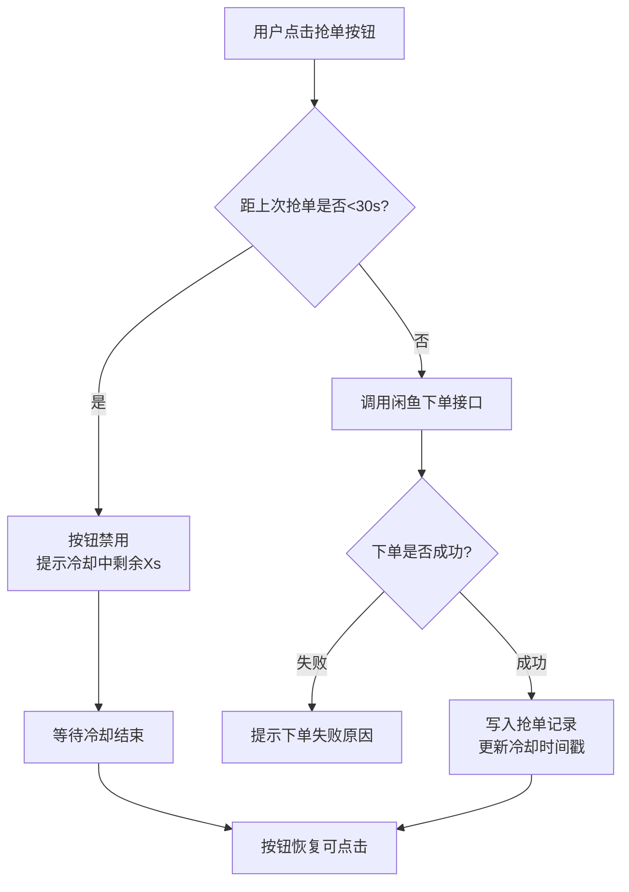
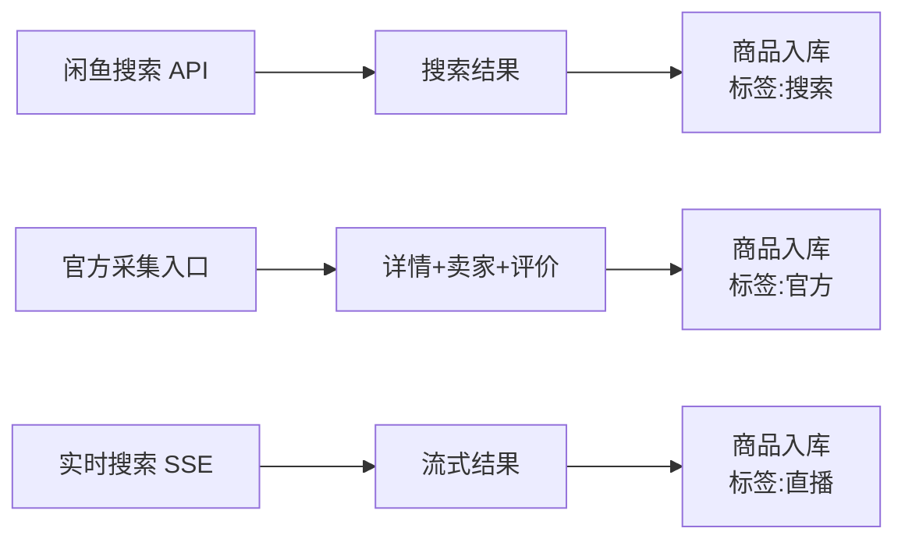
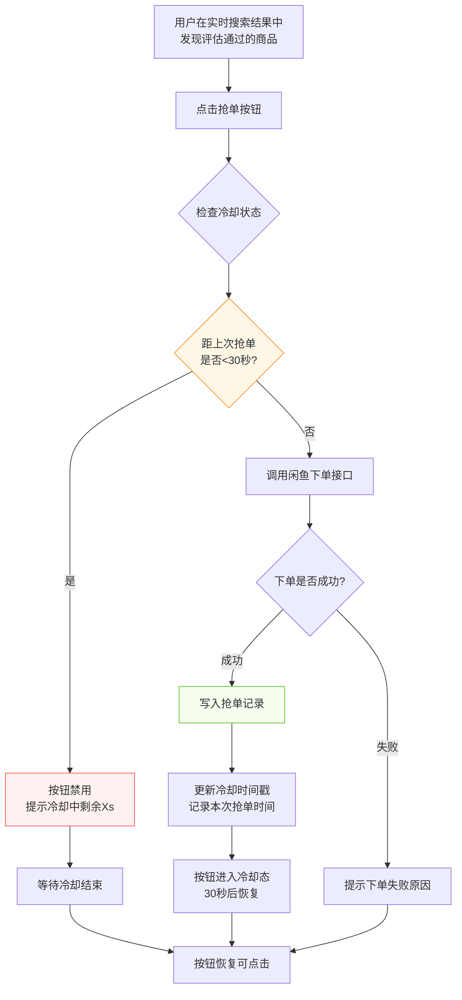
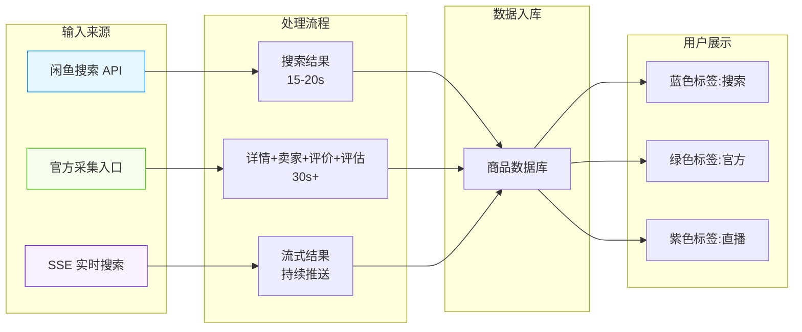
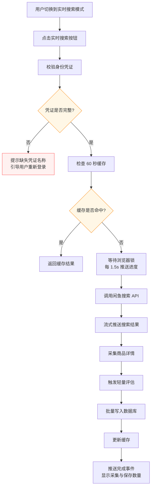

# 商品中心 操作手册

| 属性         | 值                                       |
| ------------ | ---------------------------------------- |
| 文档版本     | v1.0                                     |
| 文档日期     | 2026-07-05                               |
| 所属项目     | 闲鱼猎人                                 |
| 所属菜单     | 数据查看 → 商品中心                      |
| 文档类型     | 操作手册                                 |
| 关联路由     | /items                                   |
| 配套详细设计 | 商品中心-详细设计 v2.0                   |
| 目标读者     | 运营 / 管理员                            |

---

## 目录

- [0. 阶段交接声明](#0-阶段交接声明)
- [1. 功能简介](#1-功能简介)
- [2. 入口与导航](#2-入口与导航)
- [3. 界面布局](#3-界面布局)
- [4. 操作指南](#4-操作指南)
  - [4.1 进入商品中心](#41-进入商品中心)
  - [4.2 切换视图模式](#42-切换视图模式)
  - [4.3 多维度筛选](#43-多维度筛选)
  - [4.4 商品搜索](#44-商品搜索)
  - [4.5 抢单操作](#45-抢单操作)
  - [4.6 查看商品详情](#46-查看商品详情)
  - [4.7 已售检测与标记](#47-已售检测与标记)
  - [4.8 商品导出](#48-商品导出)
  - [4.9 商品导入](#49-商品导入)
  - [4.10 数据源识别](#410-数据源识别)
- [5. 字段说明](#5-字段说明)
- [6. 常见问题 FAQ](#6-常见问题-faq)
- [7. 注意事项与限制](#7-注意事项与限制)
- [8. 关联功能](#8-关联功能)
- [9. 快捷键与技巧](#9-快捷键与技巧)
- [10. 修订记录](#10-修订记录)
- [11. 附录](#11-附录)

---

## 0. 阶段交接声明

```
- 当前阶段：商品中心操作手册编写 ✅ 已完成
- 下一阶段：卖家评估操作手册编写
- 下一阶段智能体：文档编写智能体
- 下一阶段技能：文档编写
- 交接上下文：商品中心操作手册 v1.0 已生成，与详细设计 v2.0 对齐；覆盖 11 章节模板；第 4 章含 10 个操作场景（进入/视图切换/筛选/搜索/抢单/详情/已售/导出/导入/数据源识别）；第 5 章列出 13 个用户可见字段；第 6 章 12 条 FAQ；第 7 章 10 条注意事项；第 11 章含数据源对比表与抢单冷却流程图。文档面向运营/管理员，不含 API 路径、数据库表名、代码文件名等技术细节。
```

---

## 1. 功能简介

商品中心是闲鱼猎人系统的「商品数据统一入口」，用于围绕**任务**聚合商品数据，提供概要查询、轻量刷新、任务关联管理、实时搜索与导出能力。

**核心能力一览：**

| 能力         | 简要说明                                                              |
| ------------ | --------------------------------------------------------------------- |
| 商品浏览     | 在任务详情中查看该任务历史监控到的全部商品                            |
| 视图切换     | 卡片模式（直观）/ 列表模式（紧凑）一键切换                            |
| 多维度筛选   | 按关键词、价格区间、已售状态、数据源快速过滤                          |
| 实时搜索     | 三种数据源：实时搜索 / 官方采集 / 直播采集                            |
| 抢单操作     | 评估通过的商品可一键抢单（30 秒冷却保护）                            |
| 商品详情     | 查看商品标题、价格、卖家、发布时间、缩略图、想要数等完整信息          |
| 已售检测     | 自动标记已售商品并记录检测时间                                        |
| 数据导出     | 按任务/时间范围导出 CSV 文件，支持商品、评估、订单、事件四类数据集    |
| 数据导入     | 手动添加监控商品到任务                                                |
| 数据源识别   | 通过标签颜色区分商品采集来源（搜索/官方/直播）                        |

> **提示**：商品中心**不作为独立顶级页面**，而是嵌入在「任务管理 → 任务详情 → 商品列表 Tab」中，所有操作均在任务上下文内完成。

---

## 2. 入口与导航

### 2.1 入口路径

商品中心嵌入在任务详情页中，需要通过任务管理进入：

```
侧边栏「任务管理」 → 选择目标任务 → 进入任务详情 → 点击「商品列表」Tab
```

### 2.2 菜单位置

| 项           | 值                                       |
| ------------ | ---------------------------------------- |
| 所属分类     | 数据查看                                 |
| 菜单名称     | 商品中心                                 |
| 菜单图标     | 购物袋图标（ShoppingOutlined）           |
| 路由路径     | /items                                   |
| 排序         | 数据查看分类下第 1 项                    |
| 默认可见     | 是                                       |

> **提示**：虽然菜单注册在「数据查看」分类下，但实际页面入口位于任务详情中。点击侧边栏「商品中心」菜单会跳转至任务管理页面，需先选择任务才能进入商品列表。

### 2.3 前置条件

- 已登录闲鱼猎人系统
- 已创建至少一个任务
- 实时搜索所需身份凭证已通过「反爬登录管理」菜单录入（仅实时搜索功能需要）

---

## 3. 界面布局

商品中心界面分为四个主要区域：

```
┌──────────────────────────────────────────────────────────┐
│  ① 工具栏                                                 │
│  [DB模式 | 实时搜索模式]  [筛选器▼] [列设置] [导出]      │
├──────────────────────────────────────────────────────────┤
│  ② 数据展示区                                             │
│  ┌────────────────────────────────────────────────┐      │
│  │ 商品卡片/列表行                                 │      │
│  │ [缩略图] 标题  价格  卖家  发布时间  已售标签   │      │
│  │ [刷新] [详情] [移除]                            │      │
│  └────────────────────────────────────────────────┘      │
│  ┌────────────────────────────────────────────────┐      │
│  │ 商品卡片/列表行                                 │      │
│  └────────────────────────────────────────────────┘      │
├──────────────────────────────────────────────────────────┤
│  ③ 实时搜索进度区（仅实时搜索模式可见）                  │
│  [等待锁 → 搜索中 → 采集详情 → 评估 → 写库]              │
├──────────────────────────────────────────────────────────┤
│  ④ 分页器                                                 │
│  ← 1 2 3 ... →   每页 30 条                               │
└──────────────────────────────────────────────────────────┘
```

### 3.1 工具栏说明

| 区域             | 功能说明                                                         |
| ---------------- | ---------------------------------------------------------------- |
| 模式切换         | DB 模式（历史数据）/ 实时搜索模式（最新数据）切换                |
| 筛选器           | 价格区间、品牌、已售状态、数据来源多维度过滤                     |
| 列设置           | 自定义显示列与顺序（仅列表模式有效，配置保存在浏览器本地）       |
| 实时搜索按钮     | 触发 SSE 实时搜索（仅实时搜索模式可见）                          |
| 导出按钮         | 弹出导出对话框，选择数据集与过滤条件后下载 CSV                   |

### 3.2 状态可视化规范

| 元素           | 颜色/样式                                  | 适用场景                       |
| -------------- | ------------------------------------------ | ------------------------------ |
| 价格           | 橙色（#FF6200）                            | 价格数字                       |
| 已售标签       | 红色                                       | 商品已售出                     |
| 数据来源标签   | 蓝色（search）/ 绿色（official）/ 紫色（live） | 标识采集来源                   |
| 高亮行         | 黄色背景 + 黄色边框                        | 数据变化时持续 3 秒            |
| 抢单冷却按钮   | 禁用态 + 提示「冷却中（剩余 Xs）」         | 30 秒冷却期内                  |
| 加载中         | 旋转图标或按钮 loading 态                  | API 调用中                     |

---

## 4. 操作指南

### 4.1 进入商品中心

**操作场景**：用户希望查看某个任务历史监控到的全部商品。

**操作步骤**：

1. 在左侧导航栏点击「任务管理」
2. 在任务列表中找到目标任务，点击任务名称进入任务详情
3. 在任务详情页顶部点击「商品列表」Tab 标签
4. 系统默认以 DB 模式加载该任务关联的商品列表，按关联时间倒序展示

**预期结果**：

- Tab 标题显示「商品列表 (N)」，N 为该任务关联的商品总数
- 商品列表展示缩略图、标题、价格、卖家、发布时间等核心字段
- 默认每页 30 条，可通过分页器翻页

> **提示**：若该任务尚未监控到任何商品，列表区域会显示「暂无数据」，可切换到「实时搜索模式」主动采集。

---

### 4.2 切换视图模式

**操作场景**：用户根据需要在卡片视图与列表视图之间切换。

**操作步骤**：

1. 进入商品列表 Tab
2. 在工具栏右上角找到视图模式切换按钮组
3. 点击「卡片」按钮切换到卡片视图，或点击「列表」按钮切换到列表视图

**两种视图对比**：

| 视图模式 | 优点                             | 适用场景                         |
| -------- | -------------------------------- | -------------------------------- |
| 卡片模式 | 缩略图大、信息直观、易于浏览     | 快速浏览商品外观、对比价格       |
| 列表模式 | 紧凑展示、支持列设置、信息密度高 | 复盘分析、批量查看、自定义列展示 |

> **提示**：列表模式支持「列设置」功能，可自定义显示哪些列及列的顺序，配置保存在浏览器本地，下次访问自动恢复。

---

### 4.3 多维度筛选

**操作场景**：用户希望在大量商品中快速找到符合特定条件的商品。

**操作步骤**：

1. 在工具栏点击「筛选器」按钮展开筛选面板
2. 根据需要设置以下筛选条件：

| 筛选维度   | 输入方式                      | 匹配规则                                         |
| ---------- | ----------------------------- | ------------------------------------------------ |
| 关键词     | 文本输入框                    | 模糊匹配商品标题                                 |
| 价格区间   | 最低价格 + 最高价格输入框     | 范围匹配（含边界）                               |
| 已售状态   | 下拉选择：全部 / 在售 / 已售  | 精确匹配                                         |
| 数据源     | 下拉选择：全部 / 搜索 / 官方 / 直播 | 精确匹配                                   |
| 品牌       | 文本输入框                    | **精确匹配**（如输入"Canon"不返回"Canon EOS"）   |

3. 点击「应用筛选」按钮，列表立即刷新展示符合条件的商品
4. 点击「重置」按钮清空所有筛选条件

**预期结果**：

- 列表仅展示符合全部筛选条件的商品
- 分页器根据筛选结果总数自动更新页数
- 筛选条件保存在浏览器本地，下次访问自动恢复

> **提示**：品牌筛选是**精确匹配**，而非包含匹配。如需搜索"Canon EOS"，请直接输入完整品牌名"Canon EOS"。

---

### 4.4 商品搜索

**操作场景**：用户希望查看闲鱼最新上架的商品，或跨任务搜索商品。

#### 4.4.1 实时搜索（任务详情内）

1. 在商品列表 Tab 顶部切换到「实时搜索模式」
2. 点击「实时搜索」按钮
3. 系统按阶段推送进度：
   - 等待浏览器锁（每 1.5 秒更新一次进度）
   - 正在搜索闲鱼
   - 采集商品详情
   - 触发轻量评估
   - 写入数据库
4. 搜索结果实时显示在结果列表中
5. 搜索完成后显示「共采集 N 条，已保存 M 条」

#### 4.4.2 官方采集

1. 在商品列表中找到目标商品
2. 鼠标悬停在商品行上，点击「详情」按钮
3. 在商品详情弹窗中点击「官方采集」按钮
4. 系统执行完整端到端流程：详情采集 + 卖家信息 + 评价提取 + 重新评估 + 事件写入
5. 完成后刷新商品状态

#### 4.4.3 直播采集

1. 切换到「实时搜索模式」
2. 系统自动建立 SSE 连接，持续推送闲鱼搜索结果
3. 搜索结果会触发轻量评估，符合任务价格过滤与评分阈值的商品会自动抢单

**三种数据源对比**：

| 数据源     | 耗时       | 数据完整度             | 是否触发评估         | 是否写入数据库 |
| ---------- | ---------- | ---------------------- | -------------------- | -------------- |
| 实时搜索   | 15-20 秒   | 商品基础信息           | 是（轻量评估）       | 是             |
| 官方采集   | 30 秒以上  | 详情+卖家+评价+评估    | 是（完整评估）       | 是             |
| 直播采集   | 流式持续   | 商品基础信息+实时推送  | 是（轻量评估）       | 是             |

> **提示**：实时搜索结果缓存 60 秒，60 秒内重复点击「实时搜索」会返回缓存结果，避免冲击闲鱼接口。如需强制重新搜索，请按住 `Shift` 键点击「实时搜索」按钮（绕过缓存）。

---

### 4.5 抢单操作

**操作场景**：用户在实时搜索结果中发现符合预期的商品，希望立即下单。

**操作步骤**：

1. 切换到「实时搜索模式」并触发搜索
2. 在搜索结果列表中找到目标商品
3. 评估通过的商品会显示「抢单」按钮（绿色高亮）
4. 点击「抢单」按钮触发自动下单流程
5. 系统调用闲鱼下单接口，并在下方提示抢单结果

**冷却机制说明**：

- 同一商品在 30 秒内不能重复抢单
- 冷却期内「抢单」按钮显示为禁用态，并提示「冷却中（剩余 Xs）」
- 冷却结束后按钮自动恢复可点击状态



> **提示**：30 秒抢单冷却是系统级保护机制，防止短时间内重复下单被闲鱼风控判定为异常行为。冷却时间全局共享，跨任务、跨商品生效。

---

### 4.6 查看商品详情

**操作场景**：用户希望查看某个商品的完整信息。

**操作步骤**：

1. 在商品列表中找到目标商品
2. 鼠标悬停在商品行上，操作图标组自动浮现
3. 点击「详情」按钮（眼睛图标）
4. 系统弹出商品详情弹窗，展示完整信息：
   - 商品标题、价格、品牌
   - 卖家昵称、卖家 ID、卖家信用
   - 发货地区、发布时间
   - 想要数、浏览数
   - 缩略图、图片列表
   - 商品描述
   - 已售状态、检测时间
   - 数据来源标签
5. 点击弹窗右上角「×」按钮关闭详情

> **提示**：商品详情弹窗中点击商品标题链接，可在新窗口打开闲鱼商品详情页（`https://www.goofish.com/item?id=商品ID`）。

---

### 4.7 已售检测与标记

**操作场景**：用户希望了解哪些商品已被买走，避免重复抢单。

**操作步骤**：

1. 在商品列表中，已售商品会显示红色「已售」标签
2. 通过筛选器选择「已售状态 = 已售」可单独查看所有已售商品
3. 已售商品的详情弹窗会显示「检测时间」字段，便于排查检测来源

**已售检测机制**：

- 系统在以下场景自动检测已售状态：
  - 订单列表轮询时发现商品已成交
  - 商品详情采集时检测到已售标记
- 检测到已售后，系统自动：
  - 将商品标记为「已售」
  - 记录检测时间戳（便于排查哪个渠道先发现）
  - 在商品列表中显示红色「已售」标签

> **提示**：已售检测时间戳可用于排查「订单轮询先发现」还是「详情采集先发现」，有助于优化检测策略。

---

### 4.8 商品导出

**操作场景**：运营人员希望离线分析商品数据或上报。

**操作步骤**：

1. 在工具栏点击「导出」按钮
2. 在导出对话框中选择数据集：

| 数据集     | 说明                   | 支持的过滤条件             |
| ---------- | ---------------------- | -------------------------- |
| 商品       | 商品列表数据           | 任务、开始时间、结束时间   |
| 评估       | 商品评估记录           | 任务、开始时间、结束时间   |
| 订单       | 抢单订单记录           | 任务、开始时间、结束时间、订单状态 |
| 事件       | 系统事件日志           | 任务、开始时间、结束时间、日志级别 |

3. 设置过滤条件（可选）：
   - 任务：留空则导出全部任务
   - 开始时间 / 结束时间：ISO 时间格式（如 2026-06-01）
   - 单次导出上限：50000 行（默认 5000 行）
4. 点击「下载」按钮
5. 浏览器自动下载 CSV 文件，文件名格式为 `数据集名_导出时间.csv`

**导出文件格式**：

- 文件类型：CSV（UTF-8 编码，Excel 友好）
- 排序：按首次发现时间倒序（商品数据集）
- 编码：UTF-8 with BOM（确保 Excel 正确显示中文）

> **提示**：单次导出上限 50000 行，如需导出更多数据请缩小时间范围分批导出。

---

### 4.9 商品导入

**操作场景**：用户希望手动添加某个商品 ID 到任务监控列表（例如闲鱼搜索漏掉时）。

**操作步骤**：

1. 在商品列表 Tab 工具栏点击「添加商品」按钮
2. 在弹窗中填写以下信息：

| 字段       | 必填 | 说明                                       |
| ---------- | ---- | ------------------------------------------ |
| 商品 ID    | 是   | 闲鱼商品 ID（数字串）                      |
| 商品标题   | 否   | 商品标题（可选，系统会自动采集补全）       |
| 价格       | 否   | 商品价格（可选）                           |
| 品牌       | 否   | 商品品牌（可选）                           |
| 备注       | 否   | 用户备注，最多 500 字符                    |

3. 点击「确认添加」按钮
4. 系统将商品添加到任务监控列表，并显示「添加成功」提示

**预期结果**：

- 商品出现在任务关联列表中，来源标记为「手动添加」
- 后续系统会自动采集该商品的详情

> **提示**：手动添加的商品不会立即触发采集，需等待下一次任务轮询或手动点击「轻量刷新」按钮。

---

### 4.10 数据源识别

**操作场景**：用户希望了解商品是通过哪种渠道采集而来的，以评估各渠道采集质量。

**数据源标签颜色对照**：

| 数据源     | 标签颜色 | 含义                                       |
| ---------- | -------- | ------------------------------------------ |
| 搜索       | 蓝色     | 通过闲鱼搜索 API 搜索结果采集              |
| 官方       | 绿色     | 通过官方采集流程采集（含卖家、评价、评估） |
| 直播       | 紫色     | 通过 SSE 实时搜索采集                      |

**操作步骤**：

1. 在商品列表中查看每条商品的「数据来源」标签
2. 通过筛选器选择「数据源 = 搜索/官方/直播」可单独查看某一来源的商品
3. 结合数据来源与商品质量评估各渠道采集效果

**数据源流程对比**：



> **提示**：通过数据来源标签可以快速识别商品的采集路径，便于排查「为什么这条商品没有触发评估」等问题。

---

## 5. 字段说明

### 5.1 商品卡片/列表可见字段

| 字段名称     | 显示位置         | 数据类型   | 说明                                       |
| ------------ | ---------------- | ---------- | ------------------------------------------ |
| 商品标题     | 卡片标题/列表行  | 文本       | 商品完整标题，点击可跳转闲鱼详情页         |
| 价格         | 卡片中部/列表行  | 数字       | 商品价格（元），橙色显示                   |
| 品牌         | 列表行           | 文本       | 商品品牌（精确匹配字段）                   |
| 缩略图       | 卡片左侧/列表行  | 图片       | 商品主图缩略图，点击可查看大图             |
| 卖家昵称     | 卡片底部/列表行  | 文本       | 卖家显示名称                               |
| 卖家信用     | 详情弹窗         | 文本       | 卖家信用等级                               |
| 发货地区     | 卡片底部/列表行  | 文本       | 商品发货地区                               |
| 发布时间     | 列表行           | 日期时间   | 商品在闲鱼的发布时间                       |
| 想要数       | 列表行           | 数字       | 商品想要人数                               |
| 浏览数       | 列表行           | 数字       | 商品浏览次数                               |
| 已售状态     | 卡片右上角/列表行 | 标签       | 红色「已售」标签或空                       |
| 数据来源     | 卡片右上角/列表行 | 标签       | 蓝色（搜索）/ 绿色（官方）/ 紫色（直播）   |
| 关联时间     | 列表行           | 日期时间   | 商品与任务建立关联的时间                   |
| 备注         | 列表行           | 文本       | 用户手动添加的备注（手动添加的商品可见）   |

### 5.2 商品详情弹窗字段

| 字段名称     | 说明                                                   |
| ------------ | ------------------------------------------------------ |
| 图片列表     | 商品所有图片（缩略图+大图），支持点击查看原图          |
| 商品描述     | 商品详细描述文本                                       |
| 检测时间     | 已售检测时间戳（仅已售商品显示）                       |
| 卖家 ID      | 卖家唯一标识                                           |

> **提示**：商品 ID 等内部技术字段不在用户界面显示，如需查看商品 ID 请点击商品标题在新窗口打开闲鱼详情页，URL 中的 `id` 参数即为商品 ID。

---

## 6. 常见问题 FAQ

### Q1：商品中心和商品列表是什么关系？

**A**：菜单名称为「商品中心」（侧边栏显示），实际页面位于任务详情的「商品列表」Tab 中。商品中心**不作为独立顶级页面**，所有商品操作均在任务上下文内完成。

### Q2：为什么我看不到任何商品？

**A**：可能原因：
1. 该任务尚未监控到任何商品，请切换到「实时搜索模式」主动采集
2. 筛选条件过于严格，请点击「重置」清空筛选条件
3. 任务尚未启动轮询，请检查任务状态是否为「运行中」

### Q3：实时搜索为什么有 60 秒缓存？

**A**：每次闲鱼搜索耗时 15-20 秒，60 秒内重复请求会返回缓存结果，避免冲击闲鱼搜索接口。如需强制重新搜索，请按住 `Shift` 键点击「实时搜索」按钮绕过缓存。

### Q4：实时搜索结果会写入数据库吗？

**A**：会。实时搜索完成后，系统会自动将搜索结果批量写入数据库，下次进入 DB 模式即可查看历史搜索结果。

### Q5：抢单按钮为什么是灰色的？

**A**：抢单按钮置灰通常有两种原因：
1. **冷却期内**：同一商品 30 秒内不能重复抢单，按钮提示「冷却中（剩余 Xs）」
2. **评估未通过**：商品未通过任务的价格过滤或评分阈值，不会显示「抢单」按钮

### Q6：已售商品为什么还会显示在列表中？

**A**：已售商品保留在列表中是为了便于复盘与对账，用户可通过筛选器选择「已售状态 = 已售」单独查看，或选择「在售」隐藏已售商品。

### Q7：品牌筛选为什么搜不到「Canon EOS」？

**A**：品牌筛选是**精确匹配**，输入"Canon"只返回品牌严格等于"Canon"的商品，不返回"Canon EOS"。如需搜索"Canon EOS"，请直接输入完整品牌名。

### Q8：轻量刷新和官方采集有什么区别？

**A**：
- **轻量刷新**：仅采集商品详情页，秒级返回，不触发评估、不采集卖家信息
- **官方采集**：完整端到端流程，包含详情+卖家+评价+重新评估，耗时 30 秒以上

如只需查看商品最新状态，建议使用轻量刷新；如需完整评估商品价值，请使用官方采集。

### Q9：导出的 CSV 文件为什么是乱码？

**A**：闲鱼猎人导出的 CSV 文件采用 UTF-8 with BOM 编码，正常情况下 Excel 可正确显示中文。如出现乱码，请尝试：
1. 用 Excel 的「数据 → 从文本/CSV」功能导入，选择 UTF-8 编码
2. 或用文本编辑器（如 Notepad++）打开，编码选择「UTF-8-BOM」

### Q10：身份凭证缺失时实时搜索会怎样？

**A**：系统会通过错误提示明确告知缺失的身份凭证名称（如「缺少身份凭证: cookie2, unb」），请前往「反爬登录管理」菜单重新登录闲鱼。

### Q11：数据变化高亮持续多久？

**A**：3 秒。当商品的价格、已售状态、想要数三个字段中任意一个发生变化时，该商品行会高亮 3 秒（黄色背景），3 秒后自动取消。低于 3 秒难以察觉，高于 3 秒会干扰后续行的高亮。

### Q12：手动添加的商品会立即采集吗？

**A**：不会。手动添加商品仅建立任务与商品的关联关系，后续采集需等待下一次任务轮询，或手动点击「轻量刷新」按钮触发。

### Q13：商品列表 Tab 标题上的数字是什么意思？

**A**：数字表示该任务关联的商品总数。例如「商品列表 (567)」表示该任务已关联 567 个商品。该数字会随任务运行实时增长。

### Q14：实时搜索时为什么提示「系统正在执行后台搜索任务」？

**A**：当多个请求同时触发实时搜索时（例如前端轮询与用户手动点击同时发生），系统会进行去重处理。第二个请求会等待第一个完成（最多 35 秒）后复用结果，避免冲击闲鱼接口。请稍候片刻即可看到搜索结果。

---

## 7. 注意事项与限制

### 7.1 30 秒抢单冷却

同一商品在 30 秒内不能重复抢单。冷却是**全局共享**的，跨任务、跨商品生效。冷却期内按钮禁用并提示剩余秒数。

### 7.2 60 秒数据缓存

实时搜索结果缓存 60 秒，相同任务+关键词在 60 秒内重复请求会返回缓存结果。如需强制重新搜索，请按住 `Shift` 键点击「实时搜索」按钮。

### 7.3 品牌精确匹配

品牌筛选是**精确匹配**而非包含匹配。输入"Canon"不会返回"Canon EOS"。请确保输入完整的品牌名称。

### 7.4 轻量刷新不触发评估

点击商品行上的「刷新」按钮仅采集商品详情，**不会**触发 AI 评估、不会采集卖家信息、不会写入评估事件。如需完整评估，请在商品详情弹窗中点击「官方采集」按钮。

### 7.5 单次导出上限 50000 行

CSV 导出单次最多 50000 行，默认 5000 行。如需导出更多数据，请缩小时间范围分批导出。

### 7.6 实时搜索需要身份凭证

实时搜索功能依赖闲鱼身份凭证（cookie2 / sgcookie / unb）。缺失时系统会明确提示缺失的凭证名称，请前往「反爬登录管理」菜单重新登录闲鱼。

### 7.7 商品中心嵌入任务详情

商品中心**不是独立顶级页面**，必须通过「任务管理 → 任务详情 → 商品列表 Tab」进入。所有商品操作均在任务上下文内完成。

### 7.8 列设置仅保存在浏览器本地

列表模式的列设置、筛选条件仅保存在浏览器本地存储，**不会跨设备同步**。换设备访问时需重新配置。

### 7.9 实时搜索并发限制

同一任务同一时间只能有一个实时搜索请求进行中。多个请求同时触发时，系统会自动去重，第二个请求等待第一个完成（最多 35 秒）后复用结果。

### 7.10 手动添加商品备注长度限制

手动添加商品时，备注字段最多 500 字符，超出会被系统拒绝。

---

## 8. 关联功能

### 8.1 与任务管理的联动

| 联动点                 | 说明                                                       |
| ---------------------- | ---------------------------------------------------------- |
| 商品列表入口           | 商品中心嵌入在任务详情中，必须先选择任务才能查看商品       |
| 任务轮询自动采集       | 任务运行时会自动轮询采集商品，并写入商品中心               |
| 任务级评估配置         | 实时搜索的轻量评估复用任务的价格过滤与评分阈值             |
| 任务关联计数           | 商品列表 Tab 标题数字来自任务关联的商品数量                |

### 8.2 与卖家评估的联动

| 联动点                 | 说明                                                       |
| ---------------------- | ---------------------------------------------------------- |
| 轻量评估               | 实时搜索结果会触发轻量评估，与卖家评估模块共享评估规则     |
| 官方采集触发完整评估   | 商品详情弹窗的「官方采集」按钮会调用卖家评估模块的完整流程 |
| 评估结果展示           | 评估通过的商品在列表中显示「可抢单」标识                   |

### 8.3 与抢单记录的联动

| 联动点                 | 说明                                                       |
| ---------------------- | ---------------------------------------------------------- |
| 抢单记录来源           | 商品中心的抢单操作会写入抢单记录菜单                       |
| 订单列表异步补全标题   | 订单列表通过商品中心的批量概要接口异步补全商品标题         |
| 已售检测同步           | 订单成交后自动同步商品已售状态到商品中心                   |

### 8.4 与价格行情的联动

| 联动点                 | 说明                                                       |
| ---------------------- | ---------------------------------------------------------- |
| 商品价格数据来源       | 价格行情模块的商品价格数据来自商品中心                     |
| 价格趋势分析           | 商品中心的历史价格为价格行情模块提供趋势分析基础           |

### 8.5 与事件时间线的联动

| 联动点                 | 说明                                                       |
| ---------------------- | ---------------------------------------------------------- |
| 评估事件               | 官方采集触发的评估事件会写入事件时间线                     |
| 搜索完成事件           | 任务搜索完成事件通过事件时间线推送                         |

### 8.6 与多 Sheet 页的联动

| 联动点                 | 说明                                                       |
| ---------------------- | ---------------------------------------------------------- |
| 多页面并行             | 商品中心可通过多 Sheet 页与其他菜单并行打开，便于数据对比   |

---

## 9. 快捷键与技巧

### 9.1 快捷键

| 快捷键                 | 作用                                       | 备注                                   |
| ---------------------- | ------------------------------------------ | -------------------------------------- |
| `Ctrl+K`（或 `⌘+K`）   | 打开命令面板                               | 输入框聚焦时可直接模糊搜索命令         |
| `Escape`               | 关闭命令面板 / 关闭详情弹窗                | 仅在对应场景生效                       |
| `g` 然后按 `t`         | 跳转到任务管理                             | g 前缀序列，500ms 内按第二键           |
| `Shift + 点击实时搜索` | 强制绕过 60 秒缓存重新搜索                 | 仅实时搜索模式可用                     |
| `F5` 或 `Ctrl+R`       | 刷新当前页面                               | 会重新加载商品列表                     |

> **提示**：输入框、文本域、下拉框内不触发快捷键，避免干扰正常输入。

### 9.2 实用技巧

#### 技巧 1：快速对比历史与最新数据

切换 DB 模式与实时搜索模式时，**已加载的数据不会清空**。可先在 DB 模式查看历史数据，再切换到实时搜索模式查看最新数据，便于对比价格变化。

#### 技巧 2：利用列设置优化信息密度

列表模式下点击「列设置」按钮，可隐藏不关注的列（如浏览数、想要数），仅保留核心字段（标题、价格、卖家、发布时间），提升信息密度。

#### 技巧 3：结合筛选器快速定位

通过「已售状态 = 已售」+「数据源 = 直播」组合筛选，可快速找到实时搜索中已被买走的商品，用于评估抢单时机。

#### 技巧 4：批量导出分批进行

单次导出上限 50000 行，如需导出全年数据，可按月分批导出（设置开始/结束时间），再用 Excel 合并。

#### 技巧 5：利用数据来源标签评估渠道质量

通过筛选器分别查看「搜索」「官方」「直播」三种数据源的商品数量与质量，评估各渠道采集效果，优化任务配置。

#### 技巧 6：关注高亮行

商品行的价格、已售状态、想要数变化时会高亮 3 秒。刷新列表后关注高亮行，可快速发现数据变化。

#### 技巧 7：手动添加监控关键词遗漏商品

闲鱼搜索可能漏掉部分商品，可通过「添加商品」按钮手动输入商品 ID 进行监控，确保关键商品不遗漏。

---

## 10. 修订记录

| 版本 | 日期       | 修订人           | 主要变更                                                                                                          |
| ---- | ---------- | ---------------- | ----------------------------------------------------------------------------------------------------------------- |
| v1.0 | 2026-07-05 | 文档编写智能体   | 初版发布。基于商品中心-详细设计 v2.0 编写，覆盖 11 章节模板，含 10 个操作场景、13 个字段说明、12 条 FAQ、10 条注意事项、数据源对比表与抢单冷却流程图。 |

---

## 11. 附录

### 11.1 数据源对比表

| 对比维度       | 搜索（search）         | 官方（official）         | 直播（live）             |
| -------------- | ---------------------- | ------------------------ | ------------------------ |
| 标签颜色       | 蓝色                   | 绿色                     | 紫色                     |
| 数据来源       | 闲鱼搜索 API           | 官方采集入口             | SSE 实时搜索             |
| 采集耗时       | 15-20 秒               | 30 秒以上                | 流式持续                 |
| 数据完整度     | 商品基础信息           | 详情+卖家+评价+评估      | 商品基础信息+实时推送    |
| 是否触发评估   | 是（轻量评估）         | 是（完整评估）           | 是（轻量评估）           |
| 是否写入数据库 | 是                     | 是                       | 是                       |
| 是否采集卖家   | 否                     | 是                       | 否                       |
| 是否采集评价   | 否                     | 是                       | 否                       |
| 适用场景       | 快速搜索闲鱼商品       | 深度评估商品价值         | 实时跟踪最新上架         |
| 缓存机制       | 60 秒缓存              | 无缓存                   | 60 秒缓存                |
| 抢单冷却       | 不触发抢单             | 不触发抢单               | 30 秒冷却                |

### 11.2 抢单冷却流程图



### 11.3 数据源流程图



### 11.4 实时搜索阶段流程



---

**文档结束**
