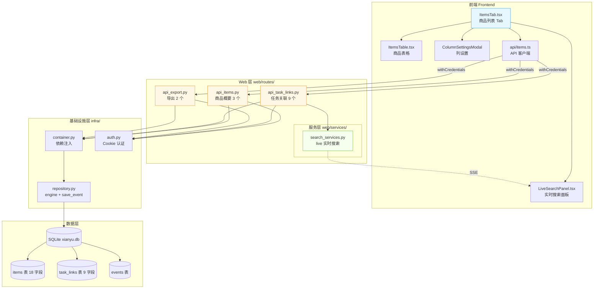
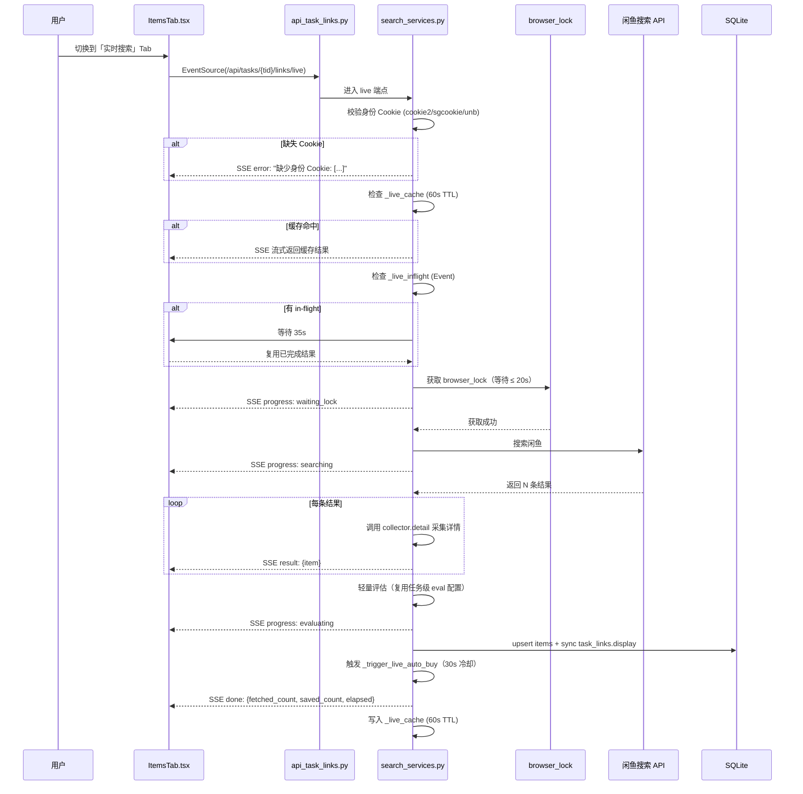
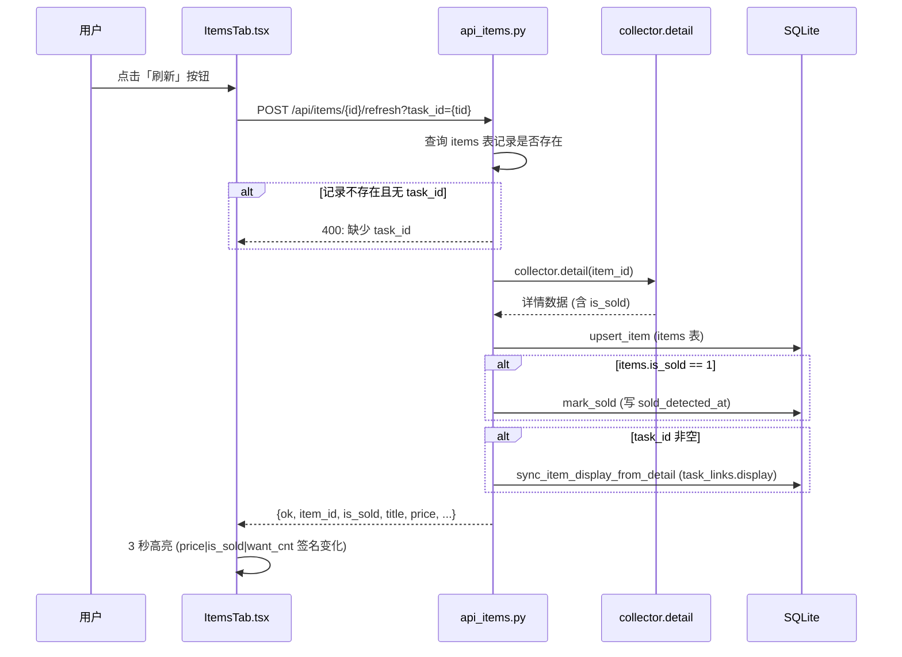

# 闲鱼猎人 · 商品中心需求规格说明书

| 项 | 内容 |
|---|---|
| 文档版本 | v1.0 |
| 文档日期 | 2026-07-05 |
| 文档状态 | 初版（与详细设计 v2.0 对齐） |
| 所属项目 | 闲鱼猎人（XianyuHunter） |
| 所属菜单 | 数据查看 → 商品中心 |
| 文档类型 | 需求规格说明书（SRS） |
| 关联菜单 key | `items` |
| 关联路由 | `/items`（任务详情 → 商品列表 Tab 内嵌） |
| 配套详细设计 | [商品中心-详细设计.md](./商品中心-详细设计.md) v2.0 |
| 修订记录 | v1.0 初版 |

---

## 目录

- [0. 阶段交接声明](#0-阶段交接声明)
- [1. 引言](#1-引言)
  - [1.1 编写目的](#11-编写目的)
  - [1.2 项目背景](#12-项目背景)
  - [1.3 范围与约束](#13-范围与约束)
  - [1.4 术语与缩写](#14-术语与缩写)
  - [1.5 参考资料](#15-参考资料)
- [2. 总体描述](#2-总体描述)
  - [2.1 产品定位](#21-产品定位)
  - [2.2 用户角色与特征](#22-用户角色与特征)
  - [2.3 运行环境](#23-运行环境)
  - [2.4 设计约束](#24-设计约束)
  - [2.5 假设与依赖](#25-假设与依赖)
- [3. 总体架构设计](#3-总体架构设计)
  - [3.1 模块架构图](#31-模块架构图)
  - [3.2 数据流程图](#32-数据流程图)
  - [3.3 关键时序图](#33-关键时序图)
  - [3.4 模块分层与职责](#34-模块分层与职责)
- [4. 功能需求](#4-功能需求)
  - [4.1 商品概要查询](#41-商品概要查询)
  - [4.2 轻量刷新商品状态](#42-轻量刷新商品状态)
  - [4.3 任务关联列表（DB 模式）](#43-任务关联列表db-模式)
  - [4.4 任务关联管理（新增/解除/迁移）](#44-任务关联管理新增解除迁移)
  - [4.5 SSE 实时搜索闲鱼](#45-sse-实时搜索闲鱼)
  - [4.6 跨任务反查与模糊搜索](#46-跨任务反查与模糊搜索)
  - [4.7 实时搜索缓存与冷却机制](#47-实时搜索缓存与冷却机制)
  - [4.8 实时搜索身份校验与轻量评估](#48-实时搜索身份校验与轻量评估)
  - [4.9 已售检测与来源标识](#49-已售检测与来源标识)
  - [4.10 数据导出（CSV）](#410-数据导出csv)
  - [4.11 数据变化高亮（前端）](#411-数据变化高亮前端)
- [5. 接口定义](#5-接口定义)
  - [5.1 商品概要 API（3 个）](#51-商品概要-api3-个)
  - [5.2 任务-内容关联 API（9 个）](#52-任务-内容关联-api9-个)
  - [5.3 导出 API（2 个）](#53-导出-api2-个)
  - [5.4 SSE 事件格式约定](#54-sse-事件格式约定)
  - [5.5 通用错误码](#55-通用错误码)
- [6. 数据模型](#6-数据模型)
  - [6.1 items 表（ItemRow）](#61-items-表itemrow)
  - [6.2 task_links 表（TaskLinkRow）](#62-task_links-表tasklinkrow)
  - [6.3 link_type / source / data_source 取值约定](#63-link_type--source--data_source-取值约定)
  - [6.4 索引清单](#64-索引清单)
- [7. 性能指标](#7-性能指标)
- [8. 安全要求](#8-安全要求)
- [9. 前端设计](#9-前端设计)
  - [9.1 页面定位与组件结构](#91-页面定位与组件结构)
  - [9.2 关键交互](#92-关键交互)
  - [9.3 模式切换与数据高亮](#93-模式切换与数据高亮)
  - [9.4 状态可视化规范](#94-状态可视化规范)
- [10. 部署与集成](#10-部署与集成)
  - [10.1 模块定位](#101-模块定位)
  - [10.2 菜单注册](#102-菜单注册)
  - [10.3 路由挂载](#103-路由挂载)
  - [10.4 文件依赖](#104-文件依赖)
- [11. 验收标准](#11-验收标准)
  - [11.1 功能验收](#111-功能验收)
  - [11.2 性能验收](#112-性能验收)
  - [11.3 安全验收](#113-安全验收)
- [12. 附录](#12-附录)
  - [12.1 修订记录](#121-修订记录)
  - [12.2 相关文档交叉引用](#122-相关文档交叉引用)
  - [12.3 FAQ 索引](#123-faq-索引)

---

## 0. 阶段交接声明

```
- 当前阶段：商品中心 SRS 编写（v1.0）✅ 已完成
- 下一阶段：数据查看分类其余 SRS 生成（事件时间线 / 价格行情 / 实时日志 / 抢单记录 / 通知中心 / 多 sheet 页 / 错误日志）
- 下一阶段智能体：主智能体（已并行启动）
- 交接上下文：
  · 本 SRS 与详细设计 v2.0 同步，14 个 API 路径/字段/默认值与 backend/xianyu_hunter/web/routes/api_items.py、api_task_links.py、api_export.py 完全一致；
  · 菜单元数据：key=items, label=商品中心, icon=ShoppingOutlined, path=/items, sort_order=11, category=data_view（见 config/menu_registry.yaml）；
  · 页面定位：商品中心不作为独立顶级页面，嵌入在「任务管理 → 任务详情 → 商品列表 Tab」（frontend/src/pages/Tasks/tabs/ItemsTab.tsx）；
  · 接口清单：商品概要 3 个（/api/items/{id}/summary、/batch、/{id}/refresh）+ 任务关联 9 个（/api/tasks/{tid}/links、/count、POST /、DELETE /{lid}、/refresh、/live SSE、/tasks/links/lookup、/search、/auto-migrate）+ 导出 2 个（/api/export、/api/export/{dataset}）；
  · 关键数据表：items 18 字段（含 first_seen/last_seen/is_sold/sold_detected_at/data_source），task_links 9 字段（id 为 Integer 自增，link_type 仅 item/seller）；
  · 关键安全机制：SQL 参数化绑定（text(":param")）、link_type 标识符白名单（仅 item/seller）、container 依赖注入、60s 实时搜索缓存（key=seller_id+keyword）、30s 抢单冷却（_LIVE_BUY_COOLDOWN）、身份 Cookie 校验（cookie2/sgcookie/unb）；
  · 关键设计决策：轻量刷新不触发评估（边界明确）、SSE 事件无 event: 字段（前端用 data.type 区分）、品牌精确匹配 display.brand（非包含）、3 秒数据变化高亮（price|is_sold|want_cnt 签名）；
  · 硬约束继承：401 JSON、hmac.compare_digest、模块级 import、WebView2 CREATE_NEW_CONSOLE、Container 依赖注入、SQLite 索引优化等详见 §1.3.3。
```

---

## 1. 引言

### 1.1 编写目的

本需求规格说明书定义"闲鱼猎人"系统「数据查看 → 商品中心」二级菜单的完整需求规格，作为后续设计、开发、测试与验收的唯一依据。

**目标读者**：
- 后端开发工程师：依据 §3-§6、§8、§10 进行模块实现
- 前端开发工程师：依据 §4、§9 进行界面开发
- 测试工程师：依据 §7、§11 编写测试用例与执行验收
- 项目经理：依据 §2、§11 进行范围与里程碑管理
- 智能客服 RAG：作为向量知识库训练素材的源文档

### 1.2 项目背景

闲鱼猎人是一个闲鱼自动捡漏与抢单工具，已具备任务管理、商品采集、AI 评估、自动下单、多渠道通知等完整能力（详见 [requirements.md](../requirements.md) 与 [概要设计文档.md](../概要设计文档.md)）。

随着系统迭代至 Sprint K+，商品数据相关的痛点逐步显现：

| 痛点 | 现状 | 影响 |
|------|------|------|
| 订单列表无商品上下文 | 订单行只存 `item_id`，用户无法直观判断"是哪一单" | 排查订单时频繁跳转商品页 |
| 完整官方采集成本高 | `collect-official` 触发卖家主页 + 评价 + 重新评估 | 用户只想刷新状态时付出过高代价 |
| 任务关联与商品采集脱节 | 历史 `items` 数据有 `task_id` 但未同步到 `task_links` | 反查能力不足，跨任务追溯困难 |
| 实时搜索接口少 | v1.0 缺少 SSE 实时搜索、`/lookup`、`/search` | 任务详情需要秒级数据时只能等轮询 |
| 导出能力弱 | 缺少按任务/时间/状态过滤的 CSV 导出 | 运营复盘与对账全靠手工 SQL |

**解决方案**：在「数据查看」分类下新增「商品中心」二级菜单（菜单 key=`items`），围绕商品概要、轻量刷新、任务关联、SSE 实时搜索、CSV 导出五大能力，提供 14 个 API 端点（商品概要 3 + 任务关联 9 + 导出 2），覆盖商品数据的查询、刷新、关联、搜索、导出全链路。

### 1.3 范围与约束

#### 1.3.1 包含范围

- 商品概要 API（3 个）
  - 单商品概要：`GET /api/items/{item_id}/summary`
  - 批量概要：`GET /api/items/batch?ids=...`（最多 50 个）
  - 轻量刷新：`POST /api/items/{item_id}/refresh`
- 任务-内容关联 API（9 个）
  - 关联列表：`GET /api/tasks/{task_id}/links`（DB 模式）
  - 按类型计数：`GET /api/tasks/{task_id}/links/count`
  - 新增关联：`POST /api/tasks/{task_id}/links`
  - 解除关联：`DELETE /api/tasks/{task_id}/links/{link_id}`
  - 实时搜索并刷新 DB：`POST /api/tasks/{task_id}/links/refresh`
  - SSE 实时搜索：`GET /api/tasks/{task_id}/links/live`（流式，不入库）
  - 内容反查任务：`GET /api/tasks/links/lookup`
  - 跨任务模糊搜索：`GET /api/tasks/links/search`
  - 一次性迁移：`POST /api/tasks/links/auto-migrate`
- 导出 API（2 个）
  - 数据集清单：`GET /api/export`
  - CSV 导出：`GET /api/export/{dataset}`（`items` / `evaluations` / `orders` / `events`）
- 实时搜索缓存（60s TTL，key=`seller_id+keyword`）
- 抢单冷却（30s，模块变量 `_live_last_buy_at`）
- 身份 Cookie 校验（`cookie2` / `sgcookie` / `unb`）
- 轻量刷新边界（采集 detail + upsert + sync display，**不**触发评估/不写 `eval.scored`/不更新 sellers）
- 已售检测（`is_sold=1` + `sold_detected_at` 时间戳）
- 数据来源标识（`data_source = search` / `official` / `live`）
- 跨任务反查（`/lookup`）与模糊搜索（`/search`）
- 数据变化高亮（前端 3 秒签名对比）

#### 1.3.2 排除范围

- 不作为独立顶级页面（嵌入任务详情商品列表 Tab）
- 不实现商品全文索引（依赖 SQLite LIKE 模糊匹配）
- 不实现商品历史快照对比（仅做 3 秒前端高亮）
- 不实现自动抢单策略配置（沿用现有 evaluator 评分阈值）
- 不实现卖家主页采集（属于完整官方采集范围，不在轻量刷新内）
- 不实现评价/留言提取（属于完整官方采集范围）
- 不持久化用户列设置到后端（仅 localStorage，prefix=`xh.items.`）
- 不实现多用户隔离（沿用现有 Cookie 认证，单用户场景）

#### 1.3.3 硬约束

继承 [project_memory.md](file:///c:/Users/hspcadmin/.trae-cn/memory/projects/-d-code-otherProjects-17-xianyu/project_memory.md) 中的全部项目硬约束，并显式映射到本模块实现：

| 硬约束 | 本模块适用性 | 实现要点 |
|--------|--------------|----------|
| Web 进程使用 `with_browser=False` 模式 | 适用 | 商品中心不依赖浏览器进程，所有 API 由 Web 路由直接提供 |
| 认证白名单（`/api/auth/cookie` 等） | 不适用 | 全部 14 个 API 需通过认证（继承现有 [auth.py](file:///d:/code/otherProjects/17_xianyu/backend/xianyu_hunter/web/middleware/auth.py) 中间件） |
| 前端 fetch 必须含 `credentials: 'include'` | 适用 | [client.ts](file:///d:/code/otherProjects/17_xianyu/frontend/src/api/client.ts) 默认 `withCredentials: true`，全部 API 调用已遵守 |
| 401 响应必须返回 JSON `{"detail": "Unauthorized"}` | 适用 | 路由层统一异常处理（继承现有 [deps.py](file:///d:/code/otherProjects/17_xianyu/backend/xianyu_hunter/web/deps.py)） |
| 后端 token 比较使用 `hmac.compare_digest()` | 适用 | 认证复用现有 auth.py，已满足 |
| 敏感字段（token 长度等）不日志 | 适用 | 实时搜索日志不打印 Cookie 明文，仅记录 `missing_cookies` 名称列表 |
| 缺失 import 必须 module-level | 适用 | 三个路由文件 `api_items.py` / `api_task_links.py` / `api_export.py` 全部模块级 import |
| DB 必须在 `task_id/seller_id/first_seen/publish_time/created_at` 及复合索引优化 | 适用 | items 与 task_links 表索引清单见 §6.4 |
| 标识符白名单（防 SQL 注入与非法输入） | 适用 | `link_type` 仅接受 `item` / `seller`（业务层白名单），`dataset` 仅接受 `items` / `evaluations` / `orders` / `events`（路由层白名单） |
| Container 依赖注入 | 适用 | 路由通过 `Depends(get_container)` 注入 `container.repo.engine` 与 `container.repo.save_event`，禁止 `from xianyu_hunter.container import container` 单例直引 |
| 启动钩子外层 except 用 `logger.exception()` 输出完整 traceback | 适用 | SSE 异常分支用 `logger.exception("实时搜索失败")` 输出完整堆栈 |
| WebView2 子进程使用 `CREATE_NEW_CONSOLE` | 不适用 | 商品中心不涉及 WebView2 子进程 |
| SSE 事件格式约定 | 适用 | `/links/live` 推送的 SSE 事件**不**携带 `event:` 字段，前端通过 `data.type` 区分（与 `/api/events/stream` 的 `event: app_event` 格式不同） |

### 1.4 术语与缩写

| 术语 | 全称 | 说明 |
|------|------|------|
| 轻量刷新 | Lightweight Refresh | 调用 `collector.detail` 采集详情 → upsert items → 同步 task_links.display；**不**触发评估、不采集卖家、不写 events |
| DB 模式 | Database Mode | 商品列表 Tab 默认模式，查询 `task_links` 表返回历史关联商品 |
| 实时搜索模式 | Live Search Mode | 建立 SSE 连接到 `/api/tasks/{tid}/links/live`，流式接收闲鱼搜索结果 |
| 完整官方采集 | Full Official Collection | `POST /api/evaluations/{item_id}/collect-official` 端到端流程：detail + seller + reviews + 重新评估 + events 写入 |
| in-flight 去重 | In-Flight Dedup | 同一 task_id 已有搜索进行中时，后续请求等待 35s 复用结果 |
| 60s 缓存 | Live Cache TTL | 实时搜索结果缓存 60 秒，避免短时间重复请求闲鱼（每次搜索 15-20s） |
| 30s 抢单冷却 | Buy Cooldown | live 链路抢单操作模块级冷却，避免短时间重复尝试下单触发闲鱼风控 |
| 任务级 eval 配置 | Task-Level Eval Config | 任务的 AI 评估规则，live 链路复用同一价格过滤与评分阈值，与 worker 行为一致 |
| 签名对比 | Signature Diff | 前端基于 `price\|is_sold\|want_cnt` 三字段拼接签名，对比前后数据是否变化以触发高亮 |
| SSE | Server-Sent Events | 单向服务器推送协议，本系统用 FastAPI `StreamingResponse` 实现 |
| SSE 阶段进度 | Stage Progress | waiting_lock / searching / fetching_detail / evaluating / buying / done / error |
| link_type | Link Type | task_links 表关联类型，**仅** `item` / `seller` 两类（v1.0 文档中的 `brand`/`url` 已废弃） |
| data_source | Data Source | items 表采集来源标识：`search`（默认）/ `official` / `live` |
| first_seen / last_seen | First/Last Seen | items 表时间字段，取代 v1.0 的 `created_at` / `updated_at`，语义更准确 |
| sold_detected_at | Sold Detected At | 检测到已售的时间戳，便于排查检测来源（buyer 端 or collector 端） |
| 身份 Cookie | Identity Cookie | 闲鱼搜索 API 必需的三类 Cookie：`cookie2` / `sgcookie` / `unb`，缺失会导致搜索失败 |
| 品牌精确匹配 | Brand Exact Match | 品牌筛选精确匹配 `display.brand` 字段，非包含匹配（如"Canon" ≠ "Canon EOS"） |
| auto-migrate | Auto Migrate | `POST /api/tasks/links/auto-migrate` 一次性迁移，把 items 中 `task_id` 已存在但 task_links 缺失的记录补全 |

### 1.5 参考资料

| 文档 | 路径 | 用途 |
|------|------|------|
| 需求文档 v1.0 | [requirements.md](../requirements.md) | 系统整体需求基线 |
| 概要设计文档 v2.0 | [概要设计文档.md](../概要设计文档.md) | 36 个 API 路由、11 张数据表、技术选型 |
| 技术设计说明书 | [design.md](../design.md) | 分层架构、Evaluator 设计、状态机 |
| 商品中心详细设计 v2.0 | [商品中心-详细设计.md](./商品中心-详细设计.md) | 本模块的实现蓝图（路由、字段、SSE、FAQ） |
| 任务管理详细设计 | [任务管理-详细设计.md](./任务管理-详细设计.md) | 关联模块：任务 CRUD、Worker 调度 |
| 卖家评估详细设计 | [卖家评估-详细设计.md](./卖家评估-详细设计.md) | 关联模块：评估与抢单（与 live 轻量评估复用） |
| 实时日志详细设计 | [实时日志-详细设计.md](./实时日志-详细设计.md) | 关联模块：SSE 系统事件流（`/api/events/stream`） |
| 事件时间线详细设计 | [事件时间线-详细设计.md](./事件时间线-详细设计.md) | 关联模块：`events` 表写入与查询 |
| 抢单记录详细设计 | [抢单记录-详细设计.md](./抢单记录-详细设计.md) | 关联模块：订单列表 + 异步补全标题（`/api/items/batch` 调用方） |
| 米其林设计系统 | [standards/michelin-design-system.md](../standards/michelin-design-system.md) | UI 设计规范、色彩字体系统 |
| 编码规范 | [standards/coding-standards.md](../standards/coding-standards.md) | 命名、注释、错误处理 |
| 部署指南 | [standards/deployment.md](../standards/deployment.md) | Docker/原生/Windows 部署 |
| 后端 API 路由 | [backend/xianyu_hunter/web/routes/api_items.py](file:///d:/code/otherProjects/17_xianyu/backend/xianyu_hunter/web/routes/api_items.py) / [api_task_links.py](file:///d:/code/otherProjects/17_xianyu/backend/xianyu_hunter/web/routes/api_task_links.py) / [api_export.py](file:///d:/code/otherProjects/17_xianyu/backend/xianyu_hunter/web/routes/api_export.py) | 14 个路由实现 |
| ItemRow 模型 | [db_models.py#L98-L131](file:///d:/code/otherProjects/17_xianyu/backend/xianyu_hunter/infra/db_models.py#L98-L131) | 18 字段 |
| TaskLinkRow 模型 | [db_models.py#L256-L280](file:///d:/code/otherProjects/17_xianyu/backend/xianyu_hunter/infra/db_models.py#L256-L280) | 9 字段 |
| 商品列表 Tab | [ItemsTab.tsx](file:///d:/code/otherProjects/17_xianyu/frontend/src/pages/Tasks/tabs/ItemsTab.tsx) | 商品中心前端实现 |
| 菜单注册 | [config/menu_registry.yaml](file:///d:/code/otherProjects/17_xianyu/config/menu_registry.yaml) | key=items |
| 认证中间件 | [backend/xianyu_hunter/web/middleware/auth.py](file:///d:/code/otherProjects/17_xianyu/backend/xianyu_hunter/web/middleware/auth.py) | 复用现有 Cookie 认证 |
| 依赖注入容器 | [backend/xianyu_hunter/container.py](file:///d:/code/otherProjects/17_xianyu/backend/xianyu_hunter/container.py) | `container.repo` 注入 |
| 实时搜索服务 | [search_services.py](file:///d:/code/otherProjects/17_xianyu/backend/xianyu_hunter/web/services/search_services.py) | live 链路核心服务 |
| 采集服务 | [collection_service.py](file:///d:/code/otherProjects/17_xianyu/backend/xianyu_hunter/modules/collection_service.py) | `collector.detail` 调用方 |
| 采集工具 | [collector_utils.py#L545-L556](file:///d:/code/otherProjects/17_xianyu/backend/xianyu_hunter/modules/collector_utils.py#L545-L556) | FIELD_METADATA 字段映射 |

---

## 2. 总体描述

### 2.1 产品定位

商品中心是闲鱼猎人系统的"商品数据统一入口"，定位为：

> 以**任务为中心**聚合商品数据，提供概要查询、轻量刷新、任务关联管理、实时搜索与导出能力，是商品数据的查询、刷新、关联、搜索、导出五维统一入口。

**核心价值**：
1. **轻量刷新边界明确**：仅采集 detail + 同步 display，**不**触发评估/不写 `eval.scored`，避免误触发下游工作流
2. **DB + SSE 双轨浏览**：DB 模式查询 `task_links` 拿历史数据；实时搜索模式 SSE 流式接收新结果，按需选择
3. **60s 缓存 + 30s 抢单冷却**：保护闲鱼搜索与下单接口不被本系统高频冲击
4. **跨任务反查 + 模糊搜索**：从内容（item_id/seller_id）反查任务列表，或按关键词跨任务搜商品
5. **CSV 导出 4 类数据集**：items / evaluations / orders / events，支持按 `task_id`/`start`/`end` 过滤

### 2.2 用户角色与特征

| 角色 | 特征 | 使用场景 | 关注重点 |
|------|------|----------|----------|
| **日常用户** | 主要使用抢单/采集功能 | 在订单列表中识别"是哪个商品" | 批量概要（`/batch`）、标题异步补全 |
| **运维用户** | 负责系统部署、监控、备份 | 排查商品状态、做对账 | 轻量刷新、CSV 导出 |
| **高级用户** | 关心实时数据、性能调优 | 跟踪最新闲鱼商品、做跨任务反查 | SSE 实时搜索、跨任务模糊搜索 |
| **数据分析** | 通过 CSV 做复盘 | 拉取数据做周报/月报 | 导出 4 类数据集、按时间/任务过滤 |
| **客服/排障** | 通过 `events` 表回溯 | 排查"为什么没搜到结果" | 身份 Cookie 校验失败、60s 缓存命中 |

### 2.3 运行环境

| 项 | 要求 |
|---|---|
| 操作系统 | Windows 10/11（主）、Linux、macOS |
| Python | 3.11+ |
| Node.js | 18+（仅前端构建） |
| 后端框架 | FastAPI（已集成） |
| 前端框架 | React 18 + TypeScript + Ant Design 5（已集成） |
| 数据库 | SQLite（复用现有 [db_models.py](file:///d:/code/otherProjects/17_xianyu/backend/xianyu_hunter/infra/db_models.py)） |
| 实时通信 | SSE（FastAPI `StreamingResponse`，无 `event:` 字段） |
| 浏览器 | WebView2 / Edge / Chrome（前端要求现代浏览器 SSE 支持） |

### 2.4 设计约束

1. **嵌入页面定位**：商品中心不作为独立顶级页面，嵌入"任务管理 → 任务详情 → 商品列表 Tab"
2. **复用现有认证**：复用 [auth.py](file:///d:/code/otherProjects/17_xianyu/backend/xianyu_hunter/web/middleware/auth.py) 中间件
3. **复用现有 Repository**：通过 `container.repo` 注入 SQLAlchemy 引擎与 `save_event` 方法
4. **复用现有评估器**：live 链路复用任务级 eval 配置（价格过滤 + 评分阈值），与 worker 行为一致
5. **菜单注册一致性**：label/icon/path/sort_order/category 与 `config/menu_registry.yaml` 完全一致
6. **不引入新依赖**：全部使用现有 `fastapi` / `sqlalchemy` / `pydantic` / `antd` / `axios` 依赖
7. **不持久化用户设置**：列设置、过滤器仅存 localStorage（prefix=`xh.items.`），不写后端
8. **轻量刷新边界**：明确不触发评估/不写 `eval.scored`/不更新 sellers/不采集评价

### 2.5 假设与依赖

**假设**：
- 系统已通过现有 auth.py 认证，调用商品中心 API 时已登录
- 实时搜索所需身份 Cookie（`cookie2`/`sgcookie`/`unb`）已通过「反爬登录管理」菜单录入
- 闲鱼搜索 API 当前可用（无大规模风控封禁）
- SQLite 数据库未被其他长事务持有锁（DELETE 与 SSE 并发需要短事务）

**依赖**：
- 依赖现有 [container.py](file:///d:/code/otherProjects/17_xianyu/backend/xianyu_hunter/container.py) 依赖注入容器
- 依赖现有 [Repository.save_event](file:///d:/code/otherProjects/17_xianyu/backend/xianyu_hunter/infra/repository.py) 写入 `events` 表
- 依赖现有 [collector.detail](file:///d:/code/otherProjects/17_xianyu/backend/xianyu_hunter/modules/collection_service.py) 采集商品详情
- 依赖现有 [browser_lock](file:///d:/code/otherProjects/17_xianyu/backend/xianyu_hunter/modules/collection_service.py) 浏览器锁（live 链路需获取）
- 依赖现有 [evaluator.evaluate](file:///d:/code/otherProjects/17_xianyu/backend/xianyu_hunter/modules/evaluator.py) 评估器（live 链路复用配置）
- 依赖现有 [任务管理-详细设计.md](./任务管理-详细设计.md) 任务 CRUD（任务必须存在才能查关联）

---

## 3. 总体架构设计

### 3.1 模块架构图



### 3.2 数据流程图

```mermaid
flowchart LR
    subgraph "输入：用户交互"
        U1[进入任务详情]
        U2[切换 DB / 实时搜索模式]
        U3[点击刷新 / 抢单 / 导出]
    end

    subgraph "前端 ItemsTab"
        F1[loadLinks<br/>GET /api/tasks/{tid}/links]
        F2[live SSE<br/>EventSource /api/tasks/{tid}/links/live]
        F3[refreshOne<br/>POST /api/items/{id}/refresh]
        F4[export<br/>GET /api/export/items]
    end

    subgraph "后端 api_items.py / api_task_links.py / api_export.py"
        B1[解析参数 + 标识符白名单]
        B2[查询 items / task_links<br/>SQL 参数化]
        B3[SSE 推送 progress/result/done]
        B4[轻量刷新: collector.detail + upsert]
        B5[CSV 流式输出]
    end

    subgraph "基础设施"
        I1[container.repo.engine]
        I2[container.repo.save_event]
        I3[browser_lock + collector.detail]
    end

    subgraph "输出"
        O1[DB 模式：商品列表渲染]
        O2[SSE 模式：阶段进度 + 实时结果]
        O3[CSV 文件下载]
        O4[events 表审计]
    end

    U1 --> F1
    U2 --> F2
    U3 --> F3
    U3 --> F4
    F1 --> B1
    F2 --> B3
    F3 --> B4
    F4 --> B5
    B1 --> B2
    B2 --> I1
    B3 --> I3
    B4 --> I3
    B4 --> I1
    B5 --> I1
    B2 --> O1
    B3 --> O2
    B5 --> O3
    B4 --> O4
    I2 --> O4

    style B2 fill:#fff7e6
    style B3 fill:#f6ffed
    style B4 fill:#f6ffed
```

### 3.3 关键时序图

#### 3.3.1 SSE 实时搜索时序



#### 3.3.2 轻量刷新时序



### 3.4 模块分层与职责

遵循项目现有 DDD 分层架构（见 [概要设计文档](../概要设计文档.md) §3）：

| 层级 | 模块 | 职责 |
|------|------|------|
| **Web 层** | `api_items.py`（单文件） | 3 个路由：summary / batch / refresh；封装轻量刷新边界 |
| | `api_task_links.py`（单文件） | 9 个路由：list / count / POST / DELETE / refresh / live / lookup / search / auto-migrate；SSE 流式响应 |
| | `api_export.py`（单文件） | 2 个路由：list / CSV；流式 CSV 输出 |
| **服务层** | `search_services.py` | 实时搜索核心：60s 缓存、in-flight 去重、身份 Cookie 校验、阶段进度推送、30s 抢单冷却 |
| **基础设施层（复用）** | `container.repo.engine` | SQLAlchemy 引擎（提供连接） |
| | `container.repo.save_event` | 事件写入 |
| | `auth.py` | Cookie 认证中间件 |
| | `collection_service.py` | `collector.detail` 详情采集 |
| | `evaluator.py` | 评估器（live 链路复用价格过滤与评分阈值） |
| **数据层（复用）** | SQLite `xianyu.db` | `items` / `task_links` / `tasks` / `events` / `orders` / `evaluations` 6 张相关表 |

**职责边界**：
- 路由层只做：参数解析、标识符白名单校验、子任务分发、SSE 流式响应、结果拼装
- 服务层只做：实时搜索业务逻辑（缓存/去重/校验/推送/冷却）
- 轻量刷新严格不触发评估：路由层调用 `collector.detail` 后直接 upsert，**不**调用 `evaluator.evaluate`

---

## 4. 功能需求

### 4.1 商品概要查询

#### FR-1 批量概要补全（订单列表异步补全标题）

**用户故事**：
> **As a** 日常用户  
> **I want** 在订单列表中快速看到每个订单对应的商品标题/价格/卖家  
> **So that** 排查"是哪一单"时不需要反复跳转到商品页

**验收标准**：
- **Given** 订单列表每行只有 `item_id`，前端需要异步补全标题
- **When** 前端调用 `GET /api/items/batch?ids=id1,id2,...,id50`（最多 50 个）
- **Then** 响应包含 `summaries`（找到的 `{id: {title, price, seller_id}}`）、`missing`（未找到的 id 列表）、`count`
- **And** 单商品概要 `GET /api/items/{item_id}/summary` 在记录不存在时返回 `null`（不抛 404）

**功能要点**：
- 避免拉取完整 item 大字段（`description` / `raw_json`），只返回 `title` / `price` / `seller_id` 三个核心字段
- 单条 SQL `SELECT id, title, price, seller_id FROM items WHERE id IN (...)`，命中 `ix_items_seller` 或主键
- 缺失项不抛错，仅放入 `missing` 数组，前端降级显示"商品已删除"

#### FR-2 轻量刷新商品状态（采集详情 + upsert）

**用户故事**：
> **As a** 运维用户  
> **I want** 点击商品标题链接时仅刷新商品详情与已售状态，不触发完整评估流程  
> **So that** 快速检查"现在还能不能买"，同时避免重复评估浪费算力

**验收标准**：
- **Given** 商品列表 Tab 中存在某个商品记录
- **When** 用户点击"轻量刷新"按钮，前端调用 `POST /api/items/{item_id}/refresh?task_id=xxx`
- **Then** 后端调用 `collector.detail(item_id)` 采集详情，upsert 到 items 表，同步 `task_links.display`
- **And** 若 `is_sold=1`，额外写入 `sold_detected_at`（便于排查检测来源）
- **And** **不**触发 `evaluator.evaluate`、**不**采集卖家主页、**不**写 `eval.scored` 事件、**不**更新 sellers 表
- **And** 响应包含 `ok` / `item_id` / `is_sold` / `title` / `price` / `brand` / `seller_id` / `region` / `want_cnt` / `view_cnt` / `thumb_url` / `image_urls` / `publish_time` / `seller_nick` / `seller_credit`

**功能要点**：
- `task_id` 是 Query 可选参数：items 表无记录时回填 task_links.display
- 完整官方采集（`POST /api/evaluations/{item_id}/collect-official`）是另一条端到端流程：detail + seller + reviews + 重新评估 + events 写入
- 用户感知差异：轻量刷新秒级返回；完整官方采集需 30s+ 且触发评估

### 4.2 任务关联列表（DB 模式）

#### FR-3 任务关联商品列表

**用户故事**：
> **As a** 日常用户  
> **I want** 进入任务详情「商品列表」Tab 时看到该任务历史监控到的全部商品  
> **So that** 复盘"任务跑了一周后都监控到了哪些宝贝"

**验收标准**：
- **Given** 任务详情页面打开"商品列表"Tab
- **When** 前端调用 `GET /api/tasks/{task_id}/links?link_type=item&page=1&page_size=30`
- **Then** 后端按 `created_at` 倒序分页返回 DB 中已采集的商品关联记录
- **And** 响应包含 `items[]` / `total` / `page` / `page_size`
- **And** 支持 `min_price` / `max_price` / `brand` / `is_sold` / `data_source` 多维过滤

**功能要点**：
- DB 模式查询 `task_links` 表，命中 `ix_task_links_task_type_created` 覆盖索引（避免临时排序）
- 品牌筛选精确匹配 `display.brand` 字段（非包含匹配，例如"Canon" ≠ "Canon EOS"）
- `data_source` 可选 `search` / `official` / `live`（详见 §6.3）

#### FR-4 任务关联计数

**用户故事**：
> **As a** 前端开发者  
> **I want** 在 Tab 标题上显示商品/卖家关联数量  
> **So that** 用户切换 Tab 前就知道数据规模

**验收标准**：
- **Given** 任务详情页面加载
- **When** 前端调用 `GET /api/tasks/{task_id}/links/count?link_type=item`
- **Then** 响应返回 `{count: N}`，无需分页详情
- **And** Tab 标题展示 "商品列表 (N)"

### 4.3 任务关联管理（新增/解除/迁移）

#### FR-5 新增关联（手动添加监控商品）

**用户故事**：
> **As a** 高级用户  
> **I want** 手动添加某个商品 ID 到任务监控列表  
> **So that** 闲鱼搜索漏掉时也能强制监控

**验收标准**：
- **Given** 用户在「商品列表」Tab 点击"添加"按钮
- **When** 前端提交 `POST /api/tasks/{task_id}/links` Body `{link_type: "item", link_key: "98765432", display: {...}, source: "manual", note: "..."}`
- **Then** 后端插入新关联记录，状态码 201 + 新建关联记录
- **And** `note` 长度 ≤ 500 字符
- **And** `source` 默认 `"manual"`（用户手动添加），Worker 自动写入为 `"auto"`

**功能要点**：
- `link_type` 仅接受 `item` / `seller`（业务层白名单）
- `display` 是可选 dict，存入 JSON 字符串（冗余 title/price/brand/thumb_url 等展示字段）

#### FR-6 解除关联

**用户故事**：
> **As a** 日常用户  
> **I want** 把不再关注的商品从任务中移除  
> **So that** 列表更干净

**验收标准**：
- **Given** 商品列表中某行存在
- **When** 用户点击"移除"按钮，前端调用 `DELETE /api/tasks/{task_id}/links/{link_id}`
- **Then** 后端删除该关联记录，响应 `{ok, id}`
- **And** `link_id` 是 Integer 类型（task_links.id 是自增 Integer 主键）

#### FR-7 实时搜索并刷新 DB

**用户故事**：
> **As a** 高级用户  
> **I want** 一键触发"现在就去闲鱼搜一波并把新结果入库"  
> **So that** DB 模式数据能跟上最新

**验收标准**：
- **Given** 用户在「商品列表」Tab 点击"实时搜索"按钮（非 SSE 模式）
- **When** 前端调用 `POST /api/tasks/{task_id}/links/refresh`
- **Then** 后台调用闲鱼搜索 + `upsert_item_task_links`，把新结果写入 task_links
- **And** 响应 `{ok, fetched_count, saved_count}`

#### FR-8 一次性迁移（auto-migrate）

**用户故事**：
> **As a** 运维用户  
> **I want** 升级到 v2.0 后一次性把 items 表中已有但 task_links 缺失的记录补全  
> **So that** 历史数据不丢失

**验收标准**：
- **Given** 系统升级后 items 表已有 `task_id` 数据但 task_links 表未同步
- **When** 管理员调用 `POST /api/tasks/links/auto-migrate`
- **Then** 后端计算差集（items 中有但 task_links 中没有的 (task_id, item_id) 对），批量 INSERT 到 task_links
- **And** `display` 从 items 表反查填充，`source='auto'`
- **And** 响应 `{ok, migrated_count}`

**功能要点**：
- 迁移是幂等的：重复执行不会重复插入（`uq_task_link` UNIQUE 约束保护）
- 迁移是只读的：不动 items 表本身

### 4.4 SSE 实时搜索闲鱼

#### FR-9 SSE 流式实时搜索

**用户故事**：
> **As a** 高级用户  
> **I want** 切换到「实时搜索」Tab 后流式接收闲鱼最新商品  
> **So that** DB 模式数据不足时能"现在就看"闲鱼最新上架

**验收标准**：
- **Given** 用户切换到「实时搜索」Tab
- **When** 前端建立 SSE 连接 `GET /api/tasks/{task_id}/links/live?force_refresh=false`
- **Then** 后端按阶段推送 SSE 事件：
  1. `progress: waiting_lock`（每 1.5s 推送一次）
  2. `progress: searching`
  3. `result: {item}`（每条搜索结果）
  4. `progress: fetching_detail` → `evaluating`
  5. `done: {fetched_count, saved_count, elapsed}`
- **And** SSE 事件**不**携带 `event:` 字段，前端通过 `data.type` 区分
- **And** `force_refresh=true` 绕过 60s 缓存

**功能要点**：
- `task.search_done` 事件**不**在 `/links/live` 中推送，由独立的 `/api/events/stream` 端点推送
- `task_links.display` 同步写入由 live 端点内部 `batch_upsert_item_task_links` 完成
- 用户感知：SSE 流式结果实时显示，但不强制刷 DB

#### FR-10 抢单冷却

**用户故事**：
> **As a** 系统架构师  
> **I want** live 链路触发自动抢单时 30s 冷却  
> **So that** 避免短时间重复尝试下单被闲鱼风控

**验收标准**：
- **Given** live 链路上一次抢单距今 25 秒
- **When** live 链路发现符合条件的新商品触发 `_trigger_live_auto_buy`
- **Then** 因 `now - _live_last_buy_at < _LIVE_BUY_COOLDOWN(30.0)`，跳过本次抢单，日志记录「冷却中（剩余 5s）」
- **And** `_live_last_buy_at` 是模块级变量，进程内全局有效

### 4.5 跨任务反查与模糊搜索

#### FR-11 反查：内容 → 任务

**用户故事**：
> **As a** 高级用户  
> **I want** 输入一个商品 ID 后知道哪些任务在监控它  
> **So that** 排查"这个商品被谁盯上"

**验收标准**：
- **Given** 某个商品 ID 已知
- **When** 前端调用 `GET /api/tasks/links/lookup?type=item&key=98765432`
- **Then** 响应返回 `tasks[]`（任务 ID 列表）
- **And** `type` 仅接受 `item` / `seller`（业务层白名单）

**功能要点**：
- 命中 `ix_task_links_type_key` 索引（`link_type + link_key`）

#### FR-12 跨任务模糊搜索

**用户故事**：
> **As a** 高级用户  
> **I want** 跨任务搜索商品标题中包含"相机"的商品  
> **So that** 找到所有任务中与相机相关的监控

**验收标准**：
- **Given** 用户输入关键词"相机"
- **When** 前端调用 `GET /api/tasks/links/search?q=相机&type=item&limit=50`
- **Then** 响应返回 `items[]` / `total`
- **And** `limit` 默认 50

**功能要点**：
- 命中 `display.title` LIKE 模式匹配（`%q%`）
- `type` 仅接受 `item` / `seller`

### 4.6 实时搜索缓存与冷却机制

#### FR-13 60s 缓存

**用户故事**：
> **As a** 系统架构师  
> **I want** 实时搜索结果缓存 60 秒  
> **So that** 避免短时间重复请求闲鱼（每次搜索 15-20s）

**验收标准**：
- **Given** 同一 `(seller_id, keyword)` 在 60s 内第二次请求实时搜索
- **When** live 端点处理请求
- **Then** 直接返回 `_live_cache` 中的结果，不调用闲鱼搜索
- **And** `force_refresh=true` 绕过缓存强制重新搜索

**功能要点**：
- 缓存 key 维度：`(seller_id, keyword)` 而非单纯 `task_id`，多任务共享同一关键词时复用
- TTL=60s：闲鱼搜索耗时 15-20s，60s 内重复请求返回缓存结果保护闲鱼 API
- in-flight 去重：同一 task_id 已有搜索进行中时，后续请求等待 35s 复用结果

### 4.7 实时搜索身份校验与轻量评估

#### FR-14 身份 Cookie 校验

**用户故事**：
> **As a** 高级用户  
> **I want** 身份 Cookie 缺失时立即告知我  
> **So that** 知道要去「反爬登录管理」菜单重新登录

**验收标准**：
- **Given** 当前会话缺少 `cookie2` / `sgcookie` / `unb` 之一
- **When** 前端调用 `/api/tasks/{task_id}/links/live`
- **Then** 后端返回 SSE 错误事件 `{type: "error", message: "缺少身份 Cookie: ['cookie2', 'unb']", stage: "searching"}`
- **And** 前端通过提示引导用户重新登录

**功能要点**：
- 必要 Cookie：`cookie2` / `sgcookie` / `unb`（闲鱼搜索 API 强制要求）
- 缺失时**不**静默失败，必须明确告知具体缺失的 Cookie 名称

#### FR-15 实时搜索轻量评估

**用户故事**：
> **As a** 高级用户  
> **I want** live 链路评估与 worker 链路评估行为一致  
> **So that** 避免 live 链路误抢单（如 8000 元 85 分误抢）

**验收标准**：
- **Given** live 链路收到闲鱼搜索结果
- **When** 触发轻量评估
- **Then** 复用任务级 eval 配置（价格过滤 + 评分阈值），与 worker 行为一致
- **And** 通过 `_build_live_eval_context` 构造独立上下文

**功能要点**：
- 历史上 `_trigger_live_auto_buy` 加入时漏接价格过滤，导致 8000 元 85 分商品被 live 误抢单
- 修复：live 链路评估与 worker 链路共享同一价格过滤规则

### 4.8 已售检测与来源标识

#### FR-16 已售检测写入

**用户故事**：
> **As a** 运维用户  
> **I want** 检测到已售时记录具体时间戳  
> **So that** 排查"buyer 端还是 collector 端先发现"

**验收标准**：
- **Given** `collector.detail` 返回 `is_sold=1`
- **When** 后端 upsert items 表
- **Then** 同步更新 `is_sold=1` 并写入 `sold_detected_at = _utcnow`
- **And** `sold_detected_at` 是可空的（已售前为 null）

**功能要点**：
- 写入来源：buyer 端（订单列表轮询）+ collector 端（详情采集）
- 通过 `sold_detected_at` 时间对比可识别"哪个先检测到"

#### FR-17 数据来源标识

**用户故事**：
> **As a** 数据分析  
> **I want** 区分商品是搜索/官方/直播采集而来  
> **So that** 评估各渠道采集质量

**验收标准**：
- **Given** items 表新插入一条记录
- **When** 数据来源不同时
- **Then** `data_source` 字段取值：
  - `search`（默认）：闲鱼搜索 API 搜索结果
  - `official`：官方采集（`collect-official` 流程）
  - `live`：SSE 实时搜索（live 端点内部 `batch_upsert_item_task_links` 写入）

### 4.9 数据导出（CSV）

#### FR-18 列出可导出数据集

**用户故事**：
> **As a** 数据分析  
> **I want** 查看系统支持哪些数据集导出  
> **So that** 知道每种数据集的列定义

**验收标准**：
- **Given** 用户点击"导出"按钮看到数据集下拉
- **When** 前端调用 `GET /api/export`
- **Then** 响应返回 `datasets[]`（每项含 `key` / `columns` / `description`）

#### FR-19 导出 CSV

**用户故事**：
> **As a** 数据分析  
> **I want** 拉取某任务过去 30 天的商品列表为 CSV  
> **So that** 离线分析或上报

**验收标准**：
- **Given** 用户选择"商品"数据集，指定 `task_id=xxx&start=2026-06-01&end=2026-07-01`
- **When** 前端调用 `GET /api/export/items?task_id=xxx&start=2026-06-01&end=2026-07-01&limit=5000`
- **Then** 后端流式输出 CSV，Content-Type=`text/csv; charset=utf-8`
- **And** 包含 11 列：`id` / `title` / `price` / `seller_id` / `first_seen` / ...
- **And** 按 `first_seen` 倒序
- **And** `limit` 范围 1-50000，默认 5000

**支持的 dataset**：
- `items`：商品列表
- `evaluations`：评估记录
- `orders`：订单记录（额外支持 `status` 过滤）
- `events`：事件日志（额外支持 `level` 过滤）

### 4.10 数据变化高亮（前端）

#### FR-20 数据变化高亮

**用户故事**：
> **As a** 日常用户  
> **I want** 商品行数据变化时高亮 3 秒  
> **So that** 实时跟踪价格/已售/想要数变化

**验收标准**：
- **Given** 商品列表中某行数据
- **When** 新数据签名 `price|is_sold|want_cnt` 与旧签名不同时
- **Then** 该行高亮 3 秒（黄色背景）
- **And** 3 秒后自动取消高亮

**功能要点**：
- 签名基于 `price` / `is_sold` / `want_cnt` 三字段
- 低于 3 秒用户难以察觉，高于 3 秒干扰后续行的高亮
- 实现：`useEffect` 对比前后签名，触发时 `setHighlightId(item.id)` + `setTimeout(clear, 3000)`

---

## 5. 接口定义

所有接口遵循现有项目规范：
- 路由前缀：`/api/items`（商品概要）/ `/api/tasks/{tid}/links`（任务关联）/ `/api/export`（导出）
- 认证：复用现有 [auth.py](file:///d:/code/otherProjects/17_xianyu/backend/xianyu_hunter/web/middleware/auth.py) 中间件
- 响应格式：JSON 业务对象 / CSV 文件流
- 前端调用：必须包含 `credentials: 'include'`（[client.ts](file:///d:/code/otherProjects/17_xianyu/frontend/src/api/client.ts) 默认开启）
- 标识符白名单：`link_type` 仅 `item` / `seller`；`dataset` 仅 `items` / `evaluations` / `orders` / `events`
- SQL 全部使用 `text(":param")` 参数化绑定

### 5.1 商品概要 API（3 个）

#### 5.1.1 GET /api/items/{item_id}/summary

**描述**：获取单个商品的概要信息（标题/价格/卖家 ID），缺失返回 `null` 而非 404。

**请求参数**：无

**响应**（200 OK）：

```json
{
  "item_id": "98765432",
  "title": "iPhone 14 Pro 256G",
  "price": 4999.0,
  "seller_id": "abc123"
}
```

| 字段 | 类型 | 说明 |
|------|------|------|
| `item_id` | string | 商品主键 |
| `title` | string \| null | 商品标题（缺失返回 null） |
| `price` | float \| null | 成交价格 |
| `seller_id` | string \| null | 卖家 ID |

**错误响应**：
- 记录不存在：返回 `{item_id, title: null, price: null, seller_id: null}`（不抛 404）

#### 5.1.2 GET /api/items/batch

**描述**：批量获取商品概要（最多 50 个），用于订单列表异步补全。

**请求参数**（Query）：
- `ids`（必填）：逗号分隔的 item_id 列表，最多 50 个

**响应**（200 OK）：

```json
{
  "summaries": {
    "98765432": {"title": "iPhone 14 Pro", "price": 4999.0, "seller_id": "abc123"},
    "11111111": {"title": "...", "price": 199.0, "seller_id": "xyz789"}
  },
  "missing": ["22222222", "33333333"],
  "count": 2
}
```

| 字段 | 类型 | 说明 |
|------|------|------|
| `summaries` | object | 找到的 `{id: {title, price, seller_id}}` |
| `missing` | string[] | 未找到的 id 列表 |
| `count` | int | `summaries` 实际数量 |

**错误响应**：
- 422：`ids` 超过 50 个或为空

#### 5.1.3 POST /api/items/{item_id}/refresh

**描述**：轻量刷新商品状态（采集详情 + upsert + 同步 display），**不**触发评估/不写 events。

**请求参数**（Query）：
- `task_id`（可选）：items 表无记录时回填 task_links.display

**响应**（200 OK）：

```json
{
  "ok": true,
  "item_id": "98765432",
  "is_sold": false,
  "title": "iPhone 14 Pro 256G",
  "price": 4999.0,
  "brand": "Apple",
  "seller_id": "abc123",
  "region": "上海",
  "want_cnt": 12,
  "view_cnt": 345,
  "thumb_url": "https://...",
  "image_urls": ["https://...", "https://..."],
  "publish_time": "2026-07-01T10:30:00",
  "seller_nick": "小张",
  "seller_credit": "良好"
}
```

**轻量刷新边界**：
- **做**：调用 `collector.detail(item_id)` → `upsert_item` 写 items 表 → `sync_item_display_from_detail` 同步 task_links.display → 已售时 `mark_sold` 写 `sold_detected_at`
- **不做**：**不**触发 `evaluator.evaluate`、**不**采集卖家主页、**不**提取评价/留言、**不**写 `eval.scored` 事件、**不**更新 sellers 表

**完整官方采集**（边界外）：若需 detail + seller + reviews + 重新评估 + events 写入的端到端流程，改用 `POST /api/evaluations/{item_id}/collect-official`。

### 5.2 任务-内容关联 API（9 个）

#### 5.2.1 GET /api/tasks/{task_id}/links

**描述**：任务关联列表（DB 模式），按 `created_at` 倒序分页。

**请求参数**（Query）：

| 字段 | 类型 | 必填 | 默认 | 说明 |
|------|------|------|------|------|
| `link_type` | string | 否 | `"item"` | `item` / `seller`（白名单） |
| `page` | int | 否 | `1` | 页码 |
| `page_size` | int | 否 | `30` | 每页条数 |
| `min_price` | float | 否 | null | 最低价格过滤 |
| `max_price` | float | 否 | null | 最高价格过滤 |
| `brand` | string | 否 | null | 品牌精确匹配（非包含） |
| `is_sold` | int | 否 | null | 0=在售，1=已售 |
| `data_source` | string | 否 | null | `search` / `official` / `live` |

**响应**（200 OK）：

```json
{
  "items": [
    {
      "id": 123,
      "task_id": "task_001",
      "link_type": "item",
      "link_key": "98765432",
      "display": {"title": "iPhone 14 Pro", "price": 4999.0, "brand": "Apple", "thumb_url": "..."},
      "source": "auto",
      "note": null,
      "created_at": "2026-07-01T10:30:00",
      "updated_at": "2026-07-05T08:15:00"
    }
  ],
  "total": 567,
  "page": 1,
  "page_size": 30
}
```

#### 5.2.2 GET /api/tasks/{task_id}/links/count

**描述**：按 `link_type` 计数（用于 Tab 标题展示）。

**请求参数**（Query）：
- `link_type`（必填）：`item` / `seller`

**响应**（200 OK）：

```json
{"count": 567}
```

#### 5.2.3 POST /api/tasks/{task_id}/links

**描述**：新增关联（手动添加监控商品）。

**请求体**：

```json
{
  "link_type": "item",
  "link_key": "98765432",
  "display": {"title": "iPhone 14 Pro", "price": 4999.0, "brand": "Apple"},
  "source": "manual",
  "note": "用户主动监控"
}
```

| 字段 | 类型 | 必填 | 默认 | 说明 |
|------|------|------|------|------|
| `link_type` | string | 是 | - | `item` / `seller`（白名单） |
| `link_key` | string | 是 | - | item_id 或 seller_id |
| `display` | object | 否 | null | 冗余展示字段 JSON |
| `source` | string | 否 | `"manual"` | `auto` / `manual` |
| `note` | string | 否 | null | 用户备注，≤500 字符 |

**响应**（201 Created）：新建关联记录

#### 5.2.4 DELETE /api/tasks/{task_id}/links/{link_id}

**描述**：解除关联（删除 task_links 记录）。

**请求参数**：无

**响应**（200 OK）：

```json
{"ok": true, "id": 123}
```

**注**：`link_id` 是 Integer 类型（task_links.id 是自增 Integer 主键）。

#### 5.2.5 POST /api/tasks/{task_id}/links/refresh

**描述**：实时搜索并刷新 DB（同步触发闲鱼搜索 + 写入 task_links）。

**请求参数**：无（后台调用闲鱼搜索并 upsert task_links）

**响应**（200 OK）：

```json
{"ok": true, "fetched_count": 15, "saved_count": 12}
```

#### 5.2.6 GET /api/tasks/{task_id}/links/live

**描述**：SSE 实时搜索（流式返回，不入库）。**注意**：`task.search_done` 事件**不**在此端点推送，由 `/api/events/stream` 推送。

**请求参数**（Query）：
- `force_refresh`（可选）：布尔，绕过 60s 缓存

**响应**：SSE 事件流（`Content-Type: text/event-stream`）

详见 §5.4 SSE 事件格式约定。

#### 5.2.7 GET /api/tasks/links/lookup

**描述**：反查：内容 → 任务（给定商品/卖家 ID，查找哪些任务在监控）。

**请求参数**（Query）：
- `type`（必填）：`item` / `seller`（白名单）
- `key`（必填）：item_id 或 seller_id

**响应**（200 OK）：

```json
{"tasks": ["task_001", "task_002", "task_005"]}
```

**功能要点**：命中 `ix_task_links_type_key` 索引（`link_type + link_key`）。

#### 5.2.8 GET /api/tasks/links/search

**描述**：跨任务模糊搜索（按关键词搜索商品标题或卖家昵称）。

**请求参数**（Query）：

| 字段 | 类型 | 必填 | 默认 | 说明 |
|------|------|------|------|------|
| `q` | string | 是 | - | 搜索关键词 |
| `type` | string | 否 | `"item"` | `item` / `seller` |
| `limit` | int | 否 | `50` | 返回数量上限 |

**响应**（200 OK）：

```json
{
  "items": [...],
  "total": 23
}
```

#### 5.2.9 POST /api/tasks/links/auto-migrate

**描述**：一次性迁移（把 items 表中 `task_id` 字段已存在但 task_links 缺失的记录同步到 task_links）。

**请求参数**：无

**响应**（200 OK）：

```json
{"ok": true, "migrated_count": 234}
```

**迁移算法**：
1. 查询 items 表中所有 `task_id` 非空的记录
2. 查询 task_links 表中所有 `(task_id, link_type='item', link_key=item_id)` 已存在的记录
3. 计算差集：items 中有但 task_links 中没有的 `(task_id, item_id)` 对
4. 批量 INSERT 到 task_links（`source='auto'`，`display` 从 items 表反查填充）

**幂等性**：重复执行不会重复插入（`uq_task_link` UNIQUE 约束保护）。

### 5.3 导出 API（2 个）

#### 5.3.1 GET /api/export

**描述**：列出可导出数据集。

**请求参数**：无

**响应**（200 OK）：

```json
{
  "datasets": [
    {"key": "items", "columns": ["id", "title", "price", "seller_id", "first_seen", "..."], "description": "商品列表"},
    {"key": "evaluations", "columns": [...], "description": "评估记录"},
    {"key": "orders", "columns": [...], "description": "订单记录"},
    {"key": "events", "columns": [...], "description": "事件日志"}
  ]
}
```

#### 5.3.2 GET /api/export/{dataset}

**描述**：导出 CSV（流式下载）。

**请求参数**（Query）：

| 字段 | 类型 | 必填 | 默认 | 说明 |
|------|------|------|------|------|
| `task_id` | string | 否 | null | 任务过滤 |
| `start` | string (ISO) | 否 | null | 开始时间 |
| `end` | string (ISO) | 否 | null | 结束时间 |
| `status` | string | 否 | null | 仅 orders 支持 |
| `level` | string | 否 | null | 仅 events 支持 |
| `limit` | int | 否 | `5000` | 范围 1-50000 |

**响应**（200 OK）：CSV 文件流（`Content-Type: text/csv; charset=utf-8`）

**支持的 dataset**：
- `items`：商品列表（含 `id` / `title` / `price` / `seller_id` / `first_seen` 等 11 列，按 `first_seen` 倒序）
- `evaluations`：评估记录
- `orders`：订单记录
- `events`：事件日志

**dataset 白名单**：仅 `items` / `evaluations` / `orders` / `events`，其他值返回 400。

### 5.4 SSE 事件格式约定

`/api/tasks/{task_id}/links/live` 推送两类 SSE 事件，**注意：不携带 `event:` 字段**，前端通过 `data.type` 区分：

```
data: {"type":"progress","stage":"waiting_lock","message":"等待浏览器锁...","elapsed":1.5}

data: {"type":"progress","stage":"searching","message":"正在搜索闲鱼...","elapsed":3.2}

data: {"type":"result","item":{"item_id":"98765432","title":"iPhone 14 Pro","price":4999,"seller_id":"xxx","thumb_url":"...","is_sold":false}}

data: {"type":"progress","stage":"evaluating","message":"对 5 条结果触发轻量评估...","elapsed":8.1}

data: {"type":"done","fetched_count":15,"saved_count":12,"elapsed":12.4}

data: {"type":"error","message":"采集超时","stage":"searching"}
```

**stage 取值**：
- `waiting_lock` / `searching` / `fetching_detail` / `evaluating` / `buying` / `done` / `error`

**与 `/api/events/stream` 的区别**：
- `/api/tasks/{tid}/links/live`：**无** `event:` 字段，前端用 `data.type` 区分
- `/api/events/stream`：有 `event: app_event` 字段，推送系统事件（如 `task.search_done`）

**注意**：`task.search_done` 事件由独立的 `/api/events/stream` 端点推送（见 [事件时间线-详细设计.md](./事件时间线-详细设计.md)），不在 `/links/live` 中。

### 5.5 通用错误码

| 错误码 | HTTP 状态 | 说明 | 触发场景 |
|--------|-----------|------|----------|
| `Unauthorized` | 401 | 未认证 | 未登录或 token 失效（中间件统一处理，返回 `{"detail": "Unauthorized"}`） |
| `Forbidden` | 403 | 无权限 | （本模块不实现权限分级，预留扩展点） |
| `Not Found` | 404 | 资源不存在 | task_id 不存在（任务已删除） |
| `Bad Request` | 400 | 请求参数错误 | `ids` 超过 50 个；`dataset` 不在白名单；`link_type` 非法值 |
| `Unprocessable Entity` | 422 | 请求体校验失败 | Pydantic 模型校验（link_key 缺失、note 超长等） |
| `Internal Server Error` | 500 | 服务器错误 | SQL 执行失败、闲鱼 API 调用失败、SSE 中断 |

**注**：本模块不引入自定义业务错误码，所有错误通过 JSON 响应 `detail` 字段返回；SSE 错误通过 `{type: "error", message: "...", stage: "..."}` 事件流式返回。

---

## 6. 数据模型

### 6.1 items 表（ItemRow）

定义于 [db_models.py#L98-L131](file:///d:/code/otherProjects/17_xianyu/backend/xianyu_hunter/infra/db_models.py#L98-L131)，共 18 字段：

| 字段              | 类型      | 必填 | 默认值    | 说明                                                       |
| ----------------- | --------- | ---- | --------- | ---------------------------------------------------------- |
| `id`              | String    | 是   | -         | 商品主键（闲鱼商品 ID）                                    |
| `task_id`         | String    | 否   | null      | 关联任务 ID（可空，跨任务采集时填充）                       |
| `title`           | String    | 是   | -         | 商品标题                                                   |
| `price`           | Float     | 是   | -         | 成交价格（元）                                             |
| `publish_time`    | DateTime  | 否   | null      | 发布时间                                                   |
| `region`          | String    | 否   | null      | 发货地区                                                   |
| `seller_id`       | String    | 否   | null      | 卖家 ID                                                    |
| `want_cnt`        | Integer   | 否   | `0`       | 想要数                                                     |
| `view_cnt`        | Integer   | 否   | `0`       | 浏览数                                                     |
| `thumb_url`       | String    | 否   | null      | 缩略图 URL                                                 |
| `image_urls`      | Text      | 否   | null      | 图片 URL 列表（JSON 数组）                                 |
| `description`     | Text      | 否   | null      | 商品描述                                                   |
| `raw_json`        | Text      | 否   | null      | 原始采集 JSON（用于回溯排查）                              |
| `first_seen`      | DateTime  | 否   | `_utcnow` | 首次发现时间（**取代** v1.0 的 `created_at`）             |
| `last_seen`       | DateTime  | 否   | `_utcnow` | 最后见到时间（每次 upsert 通过 onupdate 更新，**取代** v1.0 的 `updated_at`） |
| `is_sold`         | Integer   | 是   | `0`       | 销售状态：`0`=在售，`1`=已售                               |
| `sold_detected_at`| DateTime  | 否   | null      | 检测到已售的时间戳（便于排查 buyer / collector 检测来源）  |
| `data_source`     | Text      | 否   | `'search'`| 采集来源：`search` / `official` / `live`                  |

**v1.0 → v2.0 字段变更**：
- `first_seen` / `last_seen` 取代 `created_at` / `updated_at`（语义更准确）
- 补全 `description` / `raw_json` / `is_sold` / `sold_detected_at` / `data_source`

### 6.2 task_links 表（TaskLinkRow）

定义于 [db_models.py#L256-L280](file:///d:/code/otherProjects/17_xianyu/backend/xianyu_hunter/infra/db_models.py#L256-L280)，共 9 字段：

| 字段       | 类型     | 必填 | 默认值    | 说明                                                       |
| ---------- | -------- | ---- | --------- | ---------------------------------------------------------- |
| `id`       | Integer  | 是   | 自增      | 关联记录主键（**Integer，非 TEXT**）                       |
| `task_id`  | String   | 是   | -         | 关联任务 ID                                                |
| `link_type`| String   | 是   | -         | 关联类型：**仅 `item` / `seller`**（**无** `brand` / `url`） |
| `link_key` | String   | 是   | -         | 关联键（item_id 或 seller_id）                             |
| `display`  | Text     | 否   | null      | 冗余展示字段（JSON：title / price / brand / thumb_url 等） |
| `source`   | String   | 是   | `'auto'`  | 来源：`auto`（Worker 自动写入）/ `manual`（手动添加）      |
| `note`     | Text     | 否   | null      | 用户备注                                                   |
| `created_at`| DateTime | 否   | `_utcnow` | 创建时间                                                   |
| `updated_at`| DateTime | 否   | `_utcnow` | 更新时间（onupdate=`_utcnow`）                             |

**v1.0 → v2.0 字段修正**：
- `id` 类型：Integer（v1.0 文档误标为 TEXT，实际是 Integer 自增）
- `link_type` 取值：**仅** `item` / `seller`（v1.0 文档提到的 `brand` / `url` 已废弃）

### 6.3 link_type / source / data_source 取值约定

| 字段 | 取值 | 说明 |
|------|------|------|
| `link_type` | `item` | 关联到商品（**唯一商品类关联**） |
| `link_type` | `seller` | 关联到卖家（**唯一卖家类关联**） |
| `source` | `auto` | Worker 抓到自动写入 |
| `source` | `manual` | 用户在 Web 端手动添加 |
| `data_source` | `search` | 默认值，闲鱼搜索 API 搜索结果 |
| `data_source` | `official` | 官方采集（`collect-official` 流程） |
| `data_source` | `live` | SSE 实时搜索（live 端点内部 `batch_upsert_item_task_links` 写入） |

**重要决策**：v1.0 文档中提到的 `link_type=brand` / `url` 已废弃，项目决策只保留 `item` / `seller` 两类。

### 6.4 索引清单

**items 表索引**：

| 索引名                     | 字段组合                  | 用途                                                  |
| -------------------------- | ------------------------- | ----------------------------------------------------- |
| (主键)                     | `id`                      | 商品主键查询                                          |
| `ix_items_task_first_seen` | `task_id` + `first_seen`  | 按任务+首见时间排序（Dashboard 商品列表核心查询路径） |
| `ix_items_seller`          | `seller_id`               | 按卖家反查商品                                        |
| `ix_items_publish_time`    | `publish_time`            | 按发布时间过滤                                        |

**task_links 表索引**：

| 索引名                          | 类型     | 字段组合                          | 用途                                                        |
| ------------------------------- | -------- | --------------------------------- | ----------------------------------------------------------- |
| (主键)                          | -        | `id`                              | 主键查询                                                    |
| `uq_task_link`                  | UNIQUE   | `task_id` + `link_type` + `link_key` | 防止重复关联同一对（任务+类型+键）                          |
| `ix_task_links_type_key`        | INDEX    | `link_type` + `link_key`          | 反查：内容 → 任务（`/lookup` 接口核心索引）                 |
| `ix_task_links_task_source`     | INDEX    | `task_id` + `source`              | `refresh_links` 按 `task_id+source='auto'` 批量删除         |
| `ix_task_links_task_type_created` | INDEX  | `task_id` + `link_type` + `created_at` | 商品列表查询核心索引（covering index scan，避免临时排序）   |
| (单列索引)                      | INDEX    | `task_id`                         | 按任务过滤                                                  |
| (单列索引)                      | INDEX    | `link_key`                        | 按键查询                                                    |

**索引设计原则**：
- 商品列表查询（`GET /links`）命中 `ix_task_links_task_type_created` 覆盖索引
- 反查（`GET /lookup`）命中 `ix_task_links_type_key`
- 重复插入防护靠 `uq_task_link` UNIQUE 约束
- 软删除 / 物理删除一致性：`refresh_links` 删除用 `task_id+source='auto'` 命中 `ix_task_links_task_source`

---

## 7. 性能指标

### 7.1 响应时间

| 指标 | P50 目标 | P95 目标 | 说明 |
|------|----------|----------|------|
| `GET /api/items/{id}/summary` | ≤ 20ms | ≤ 50ms | 单行主键查询 |
| `GET /api/items/batch`（50 个） | ≤ 50ms | ≤ 100ms | 50 行 IN 查询 |
| `POST /api/items/{id}/refresh` | ≤ 2s | ≤ 5s | 详情采集 + upsert + sync display |
| `GET /api/tasks/{tid}/links`（30 行） | ≤ 50ms | ≤ 100ms | 覆盖索引查询 |
| `GET /api/tasks/{tid}/links/count` | ≤ 10ms | ≤ 30ms | 索引计数 |
| `POST /api/tasks/{tid}/links` | ≤ 30ms | ≤ 80ms | 单条 INSERT |
| `DELETE /api/tasks/{tid}/links/{lid}` | ≤ 20ms | ≤ 50ms | 主键删除 |
| `POST /api/tasks/{tid}/links/refresh` | ≤ 30s | ≤ 45s | 闲鱼搜索 + 详情采集 + upsert |
| `GET /api/tasks/{tid}/links/live`（SSE） | 流式 15-20s | 流式 30-45s | 搜索 + 采集 + 评估 |
| `GET /api/tasks/links/lookup` | ≤ 20ms | ≤ 50ms | 索引反查 |
| `GET /api/tasks/links/search`（limit=50） | ≤ 100ms | ≤ 200ms | LIKE 模糊匹配 |
| `POST /api/tasks/links/auto-migrate` | ≤ 5s | ≤ 10s | 差集计算 + 批量 INSERT |
| `GET /api/export` | ≤ 30ms | ≤ 80ms | 数据集清单 |
| `GET /api/export/items`（5000 行） | ≤ 500ms | ≤ 1s | 流式 CSV 输出 |
| 60s 缓存命中 | ≤ 5ms | ≤ 20ms | 内存 dict 读取 |

### 7.2 并发与资源

| 指标 | 目标 | 说明 |
|------|------|------|
| 并发查询 | ≥ 50 QPS | 索引命中，无锁竞争 |
| 并发写入 | 1（互斥） | SQLite 单写入特性 + SSE 期间不持锁 |
| 实时搜索并发 | 1 个 task_id 同时仅 1 个 in-flight | 35s 超时复用 |
| 抢单冷却 | 30s | 模块级变量 `_live_last_buy_at` 进程内全局 |
| 60s 缓存容量 | ≤ 1000 任务 | 内存 dict，key=`(seller_id, keyword)` |
| SSE 内存占用 | ≤ 10MB / 连接 | `StreamingResponse` 不缓存响应体 |

### 7.3 性能约束

- **轻量刷新 2-5s 边界**：单次 `collector.detail` 耗时 1-3s，upsert + sync display < 100ms；超过 5s 应排查闲鱼 API
- **完整搜索 30s+ 边界**：闲鱼搜索 15-20s + 详情采集 N × 1-2s + 评估 2-3s，合计 30-45s
- **60s 缓存命中率**：同一 `(seller_id, keyword)` 60s 内重复请求应 100% 命中
- **30s 抢单冷却**：`_live_last_buy_at` 全局变量，跨 worker / 跨 task 共享
- **CSV 导出 50000 行上限**：单次导出不超过 50000 行，避免内存溢出
- **in-flight 35s 超时**：等待 in-flight 完成的最长时间为 35s（覆盖正常搜索 30s + 缓冲 5s）
- **browser_lock 20s 总等待**：live 端点获取 browser_lock 的总等待时间；Worker 一轮搜索可能持锁 30-45s

---

## 8. 安全要求

### 8.1 认证与授权

- **SR-1**：所有 14 个 `/api/items/*` / `/api/tasks/{tid}/links/*` / `/api/export/*` 接口必须通过现有 [auth.py](file:///d:/code/otherProjects/17_xianyu/backend/xianyu_hunter/web/middleware/auth.py) 中间件认证
- **SR-2**：本模块**不**加入认证白名单，与 `/api/auth/cookie` 等不同
- **SR-3**：前端 fetch 调用必须包含 `credentials: 'include'`（继承 [client.ts](file:///d:/code/otherProjects/17_xianyu/frontend/src/api/client.ts) 默认 `withCredentials: true`）

### 8.2 SQL 注入防护

- **SR-4**：所有 SQL 全部使用 `text("... :param ...") + {"param": value}` **参数化绑定**（严禁字符串拼接）
  - 列表查询：`text("SELECT ... WHERE task_id = :task_id AND link_type = :link_type AND created_at < :cutoff")`
  - 计数查询：`text("SELECT COUNT(*) FROM task_links WHERE link_type = :type AND link_key = :key")`
  - 删除查询：`text("DELETE FROM items WHERE id = :id")`
  - LIKE 模式：`text("... AND display.title LIKE :pattern") + {"pattern": f"%{q}%"}`（**必须**参数化，模式中的冒号会被 SQLAlchemy 误判为绑定参数）
- **SR-5**：表名/列名等标识符通过 **白名单常量**（`LinkType.ITEM = "item"` / `LinkType.SELLER = "seller"` / `Dataset.ITEMS = "items"` 等），不直接拼接用户输入
- **SR-6**：`link_type` / `dataset` 字段在路由入口通过业务层白名单校验，未知值返回 400

### 8.3 标识符白名单

- **SR-7**：`link_type` 字段**仅**接受 `item` / `seller` 两值（v1.0 文档中的 `brand` / `url` 已废弃）
- **SR-8**：`data_source` 字段**仅**接受 `search` / `official` / `live` 三值
- **SR-9**：`dataset` 路径参数**仅**接受 `items` / `evaluations` / `orders` / `events` 四值
- **SR-10**：`source` 字段**仅**接受 `auto` / `manual` 两值
- **SR-11**：以上白名单在路由层 Pydantic 校验或业务层 `if value not in ALLOWED` 分支双重保护

### 8.4 Container 依赖注入

- **SR-12**：所有路由通过 `Depends(get_container)` 注入 `container.repo.engine` 与 `container.repo.save_event`，**禁止** `from xianyu_hunter.container import container` 单例直引
- **SR-13**：`container` 内部单例在进程启动时初始化（[startup.py](file:///d:/code/otherProjects/17_xianyu/backend/xianyu_hunter/web/startup.py)），避免循环依赖
- **SR-14**：测试时通过 `app.dependency_overrides[get_container]` 注入 mock 容器

### 8.5 实时搜索缓存与冷却

- **SR-15**：实时搜索结果必须缓存 60 秒（`_LIVE_CACHE_TTL = 60`），key 维度为 `(seller_id, keyword)`
- **SR-16**：同一 task_id 已有搜索进行中时，后续请求必须等待 in-flight Event（最多 35s），不重复调用闲鱼
- **SR-17**：live 抢单操作必须 30 秒冷却（`_LIVE_BUY_COOLDOWN = 30.0`），`_live_last_buy_at` 模块级变量
- **SR-18**：`force_refresh=true` 可绕过 60s 缓存但**不**绕过 in-flight 去重

### 8.6 身份 Cookie 校验

- **SR-19**：live 端点入口必须校验 `_LIVE_SEARCH_IDENTITY_COOKIES = ("cookie2", "sgcookie", "unb")`
- **SR-20**：缺失时返回明确错误信息（具体缺失的 Cookie 名称列表），不静默失败
- **SR-21**：错误响应通过 SSE `{type: "error", message: "缺少身份 Cookie: [...]", stage: "searching"}` 事件返回

### 8.7 输入校验

- **SR-22**：`ids` 批量概要数量 ≤ 50（FastAPI `Query(max_length=50*12)` 强约束，约 50 个 12 字符 ID）
- **SR-23**：`note` 长度 ≤ 500 字符（Pydantic `max_length=500`）
- **SR-24**：`limit` 范围 1-50000（默认 5000）
- **SR-25**：`page_size` 范围 1-200（默认 30）
- **SR-26**：`force_refresh` 必须是 bool（Pydantic 自动校验）

### 8.8 错误日志与审计

- **SR-27**：实时搜索失败必须 `logger.exception("实时搜索失败")` 输出完整 traceback
- **SR-28**：Cookie 缺失日志不打印 Cookie 明文，仅记录 `missing_cookies` 名称列表
- **SR-29**：SSE 异常分支不向客户端暴露堆栈详情（仅 `{type: "error", message: "..."}`）
- **SR-30**：`/links/refresh` 后台任务执行不阻塞 HTTP 响应，失败日志写入 events 表

### 8.9 数据保留与清理

- **SR-31**：轻量刷新不得触发 `evaluator.evaluate`（避免误触发下游评分、写 events）
- **SR-32**：轻量刷新不得采集卖家主页（`seller_profile`）、不得写 `eval.scored` 事件
- **SR-33**：`auto-migrate` 不得修改 items 表本身，仅同步 task_links

### 8.10 前端展示安全

- **SR-34**：商品标题 / 描述 / 卖家昵称等用户生成内容渲染前必须 AntD `Text` / `Typography` 转义（不 `dangerouslySetInnerHTML`）
- **SR-35**：localStorage key 前缀统一为 `xh.items.`（如 `xh.items.column_settings` / `xh.items.filters`）
- **SR-36**：商品图片通过 AntD `Image` 组件懒加载，不直接 `` 避免 XSS

---

## 9. 前端设计

### 9.1 页面定位与组件结构

**重要定位**：商品中心**不**作为独立顶级页面，而是嵌入在"任务管理 → 任务详情 → 商品列表 Tab"中。

**完整组件树**：

```
TaskDetail (frontend/src/pages/Tasks/TaskDetail.tsx)
└── ItemsTab (frontend/src/pages/Tasks/tabs/ItemsTab.tsx)
    ├── 工具栏
    │   ├── 模式切换：DB 模式 / 实时搜索模式
    │   ├── 过滤器（价格区间 / 品牌 / 已售 / 数据来源）
    │   ├── 列设置（ColumnSettingsModal）
    │   ├── 实时搜索按钮（触发 SSE）
    │   └── 导出按钮
    ├── DB 模式列表（ItemsTable）
    │   ├── 商品行（缩略图 / 标题 / 价格 / 卖家 / 发布时间 / 已售标记）
    │   ├── 数据变化高亮（3 秒）
    │   └── 行操作（轻量刷新 / 查看详情）
    ├── 实时搜索模式（LiveSearchPanel）
    │   ├── SSE 进度条（等待锁 → 搜索 → 采集 → 评估 → 写库）
    │   ├── 实时结果列表
    │   └── 抢单冷却提示（30s）
    └── 分页器（PAGE_SIZE=30，FETCH_LIMIT=200）
```

### 9.2 关键交互

#### 9.2.1 模式切换（DB 模式 ↔ 实时搜索模式）

| 模式 | 数据源 | API 调用 | 适用场景 |
|------|--------|----------|----------|
| DB 模式 | `task_links` 表 | `GET /api/tasks/{tid}/links?link_type=item&page=...&page_size=30` | 历史数据复盘、过滤、排序 |
| 实时搜索模式 | 闲鱼搜索 API | `EventSource(/api/tasks/{tid}/links/live)` | 跟踪最新上架、低延迟浏览 |

切换时**不**清空已加载数据，便于对比历史 vs 最新。

#### 9.2.2 多维筛选

| 过滤器 | 字段 | 匹配方式 |
|--------|------|----------|
| 价格区间 | `min_price` / `max_price` | 范围匹配 |
| 品牌 | `brand` | **精确**匹配 `display.brand`（**非**包含匹配） |
| 已售 | `is_sold` | 0=在售，1=已售 |
| 数据来源 | `data_source` | 精确匹配 `search` / `official` / `live` |

**品牌筛选说明**：精确匹配 `display.brand` 字段（非标签包含匹配）。例如筛选"Canon"只返回 `brand` 严格等于"Canon"的商品，**不**返回"Canon EOS"等包含匹配。

#### 9.2.3 抢单交互

- 用户在「实时搜索」Tab 看到评估通过的候选商品
- 点击"抢单"按钮触发 `_trigger_live_auto_buy`
- 30s 冷却提示：UI 显示"冷却中（剩余 Xs）"，禁用抢单按钮
- 冷却结束后按钮重新可点

#### 9.2.4 查看详情 / 轻量刷新

- 鼠标悬停商品行显示"操作图标组"（轻量刷新 / 查看详情 / 移除）
- 轻量刷新：`POST /api/items/{id}/refresh?task_id={tid}`，完成后 3 秒高亮 + toast
- 查看详情：跳转闲鱼商品详情页（`https://www.goofish.com/item?id=...`）
- 移除：`DELETE /api/tasks/{tid}/links/{link_id}`，二次确认后删除

#### 9.2.5 导出

- 点击"导出"按钮弹出 `ExportModal`
- 选择 dataset（items / evaluations / orders / events）
- 配置过滤条件（task_id / start / end / status / level）
- 点击"下载"触发 `GET /api/export/{dataset}?...` 流式下载

### 9.3 模式切换与数据高亮

#### 9.3.1 数据变化高亮（3 秒）

```typescript
// 签名基于价格、已售状态、想要数三个字段
function dataSignature(item: ItemRow): string {
  return `${item.price}|${item.is_sold}|${item.want_cnt}`;
}

// 当新数据签名与旧数据不同时，高亮 3 秒
useEffect(() => {
  if (prevSignature !== currentSignature) {
    setHighlightId(item.id);
    const timer = setTimeout(() => setHighlightId(null), 3000);
    return () => clearTimeout(timer);
  }
}, [currentSignature]);
```

**为什么 3 秒**：低于 3 秒用户难以察觉，高于 3 秒会干扰后续行的高亮。

**高亮样式**：黄色背景（`backgroundColor: '#fffbe6'`）+ 边框加粗（`border: 1px solid #ffe58f`）。

#### 9.3.2 localStorage 命名空间

- 前缀统一为 `xh.items.`（如 `xh.items.column_settings` / `xh.items.filters` / `xh.items.page_size`）
- 列设置：用户自定义显示列与顺序
- 过滤器：保存用户上次配置的过滤条件
- 不持久化到后端（用户配置不上云，跨设备独立）

### 9.4 状态可视化规范

| 元素 | 颜色 / 样式 | 适用 |
|------|-------------|------|
| 商品主标题 | `color: 'var(--xh-text-primary)'` | 标题 |
| 价格 | `color: '#FF6200'`（品牌橙色） | 价格数字 |
| 已售标签 | `<Tag color="red">已售</Tag>` | `is_sold=1` |
| 数据来源标签 | `<Tag color="blue">search</Tag>` / `green`=official / `purple`=live | `data_source` |
| 高亮行 | `backgroundColor: '#fffbe6'` + 黄色边框 | 数据变化 3 秒 |
| 抢单冷却按钮 | `disabled` + tooltip "冷却中（剩余 Xs）" | 30s 冷却 |
| 错误提示 | AntD `message.error(...)` | API 失败 |
| 加载中 | `<Spin>` 或按钮 `loading` | API 调用中 |

**遵循规范**：[michelin-design-system.md](../standards/michelin-design-system.md) 的色彩 Token、圆角（卡片 8px）、间距（8px 栅格）。

---

## 10. 部署与集成

### 10.1 模块定位

- **后端路由**：
  - 商品概要：[backend/xianyu_hunter/web/routes/api_items.py](file:///d:/code/otherProjects/17_xianyu/backend/xianyu_hunter/web/routes/api_items.py)（3 个路由）
  - 任务关联：[backend/xianyu_hunter/web/routes/api_task_links.py](file:///d:/code/otherProjects/17_xianyu/backend/xianyu_hunter/web/routes/api_task_links.py)（9 个路由）
  - 导出：[backend/xianyu_hunter/web/routes/api_export.py](file:///d:/code/otherProjects/17_xianyu/backend/xianyu_hunter/web/routes/api_export.py)（2 个路由）
- **服务层**：[backend/xianyu_hunter/web/services/search_services.py](file:///d:/code/otherProjects/17_xianyu/backend/xianyu_hunter/web/services/search_services.py)（实时搜索核心：60s 缓存、in-flight 去重、身份校验、SSE 推送、30s 抢单冷却）
- **数据模型**：[backend/xianyu_hunter/infra/db_models.py](file:///d:/code/otherProjects/17_xianyu/backend/xianyu_hunter/infra/db_models.py) L98-L131（ItemRow 18 字段）/ L256-L280（TaskLinkRow 9 字段）
- **前端组件**：[frontend/src/pages/Tasks/tabs/ItemsTab.tsx](file:///d:/code/otherProjects/17_xianyu/frontend/src/pages/Tasks/tabs/ItemsTab.tsx)（商品中心前端实现，嵌入在 TaskDetail）
- **菜单注册**：[config/menu_registry.yaml](file:///d:/code/otherProjects/17_xianyu/config/menu_registry.yaml) `key=items`

### 10.2 菜单注册

[menu_registry.yaml](file:///d:/code/otherProjects/17_xianyu/config/menu_registry.yaml) 已包含本菜单（v1.0 → v2.0 label 从"商品列表"改为"商品中心"对齐配置）：

```yaml
- key: items
  label: 商品中心
  icon: ShoppingOutlined
  path: /items
  sort_order: 11
  default_visible: true
  category: data_view
```

| 字段 | 值 | 说明 |
|------|----|------|
| key | `items` | 菜单唯一标识 |
| label | `商品中心` | 中文显示名（**v1.0 → v2.0** 从"商品列表"改为"商品中心"） |
| icon | `ShoppingOutlined` | AntD 图标 |
| path | `/items` | 前端路由（任务详情内嵌） |
| sort_order | `11` | 数据查看分类下第一项 |
| default_visible | `true` | 默认显示 |
| category | `data_view` | 数据查看分类 |

**关联菜单**（同 category=data_view）：
- `events_timeline`（实时日志） / `price_dashboard`（价格行情） / `notifications`（通知中心） / `orders`（抢单记录） / `errors_log`（错误日志） / `multisheet`（多 sheet 页）

### 10.3 路由挂载

**后端**：三个路由文件在 [startup.py](file:///d:/code/otherProjects/17_xianyu/backend/xianyu_hunter/web/startup.py) 中通过 `app.include_router(api_items.router)` / `app.include_router(api_task_links.router)` / `app.include_router(api_export.router)` 注册（已集成）。

**前端**：商品中心作为 ItemsTab 嵌入 TaskDetail 页面，在 [TaskDetail.tsx](file:///d:/code/otherProjects/17_xianyu/frontend/src/pages/Tasks/TaskDetail.tsx) 中通过 Tabs 引入 `<ItemsTab taskId={...} />`。

### 10.4 文件依赖

**后端依赖**（全部已集成）：
- `fastapi`：`APIRouter` / `Depends` / `Query` / `Body` / `StreamingResponse`
- `sqlalchemy.text`：`text()` + 绑定参数
- `pydantic`：`BaseModel` / `Field`
- `container.repo`：`engine` + `save_event`
- `auth.py`：Cookie 认证中间件
- `services.search_services`：实时搜索核心服务
- `modules.collection_service`：`collector.detail` 详情采集
- `modules.evaluator`：评估器（live 链路复用价格过滤与评分阈值）
- Python 标准库：`json` / `asyncio` / `datetime` / `time` / `typing`

**前端依赖**（全部已集成）：
- `react`：`useEffect` / `useState` / `useRef` / `useCallback` / `useMemo`
- `antd`：`Table` / `Tabs` / `Select` / `InputNumber` / `Switch` / `Button` / `Tag` / `Spin` / `Progress` / `Modal` / `message` / `Image` / `Space` / `Tooltip`
- `@ant-design/icons`：`ShoppingOutlined` / `ReloadOutlined` / `SettingOutlined` / `DownloadOutlined` / `SearchOutlined` / `FilterOutlined`
- `EventSource`：浏览器原生 SSE 客户端

**数据库依赖**（已存在，无需迁移）：
- `items` 表（18 字段 + 4 个索引）
- `task_links` 表（9 字段 + 5 个索引 + 1 个 UNIQUE 约束）
- `events` 表（系统统一事件表）
- `tasks` / `sellers` / `evaluations` / `orders` 表（系统其他表，间接依赖）

**零新增依赖**：本模块不引入新的 pip 包 / npm 包。

---

## 11. 验收标准

### 11.1 功能验收

| 编号 | 验收项 | 验收标准 | 测试方法 |
|------|--------|----------|----------|
| AC-1 | 菜单入口 | 侧边栏「数据查看 → 商品中心」菜单可见且可点击，icon 为 `ShoppingOutlined` | UI 检查 |
| AC-2 | 页面定位 | 商品中心不作为独立顶级页面，嵌入"任务管理 → 任务详情 → 商品列表 Tab" | UI 检查 |
| AC-3 | 单商品概要 | 已知 `item_id` 调用 `/summary` 返回 `{item_id, title, price, seller_id}` | 单元测试 + UI |
| AC-4 | 概要缺失 | 未知 `item_id` 调用 `/summary` 返回 `{item_id, title: null, price: null, seller_id: null}` 不抛 404 | 单元测试 |
| AC-5 | 批量概要 | 50 个 `item_id` 调用 `/batch` 返回 `summaries` + `missing` + `count` | 单元测试 + UI |
| AC-6 | 批量上限 | `ids` 超过 50 个返回 422 | 单元测试 |
| AC-7 | 轻量刷新 | 已知 `item_id` 调用 `/refresh` 触发 `collector.detail` + upsert + sync display | 单元测试 + UI |
| AC-8 | 轻量边界 | 轻量刷新**不**触发 `evaluator.evaluate`、**不**写 `eval.scored` 事件、**不**更新 sellers 表 | 单元测试（mock 验证） |
| AC-9 | 已售检测 | `collector.detail` 返回 `is_sold=1` 时，`sold_detected_at` 被写入 | 单元测试 |
| AC-10 | 任务关联列表 | 调用 `/links?link_type=item` 按 `created_at` 倒序分页返回 | 单元测试 + UI |
| AC-11 | 多维筛选 | `min_price` / `max_price` / `brand`（精确）/ `is_sold` / `data_source` 过滤生效 | 单元测试 |
| AC-12 | 品牌精确匹配 | `brand=Canon` 只返回 `display.brand` 严格等于 "Canon" 的记录，**不**包含 "Canon EOS" | 单元测试 |
| AC-13 | 关联计数 | `/links/count?link_type=item` 返回 `{count: N}` | 单元测试 |
| AC-14 | 新增关联 | `POST /links` Body 含 `link_type=item` / `link_key` 返回 201 + 新记录 | 单元测试 + UI |
| AC-15 | 新增边界 | `note` 超过 500 字符返回 422 | 单元测试 |
| AC-16 | 解除关联 | `DELETE /links/{link_id}` 删除指定记录，返回 `{ok, id}` | 单元测试 + UI |
| AC-17 | SSE 实时搜索 | `EventSource(/links/live)` 按阶段推送 progress/result/done 事件 | 集成测试 + UI |
| AC-18 | SSE 阶段进度 | 等待锁期间每 1.5s 推送 `progress: waiting_lock` | 单元测试 |
| AC-19 | SSE 无 event 字段 | SSE 事件**不**携带 `event:` 字段，前端用 `data.type` 区分 | 单元测试 |
| AC-20 | task.search_done 推送 | `task.search_done` 事件由 `/api/events/stream` 推送，**不**在 `/links/live` 中 | 单元测试 |
| AC-21 | 60s 缓存 | 同一 `(seller_id, keyword)` 60s 内重复请求直接返回缓存，不调用闲鱼 | 单元测试（mock 闲鱼 API） |
| AC-22 | force_refresh | `force_refresh=true` 绕过 60s 缓存，强制重新搜索 | 单元测试 |
| AC-23 | in-flight 去重 | 同一 task_id 已有搜索进行中时，后续请求等待 35s 复用结果 | 单元测试 |
| AC-24 | 30s 抢单冷却 | 距上次抢单 25s 触发新抢单时跳过，日志记录"冷却中（剩余 5s）" | 单元测试 |
| AC-25 | 身份 Cookie 校验 | 缺 `cookie2` 时返回 SSE 错误事件 "缺少身份 Cookie: ['cookie2']" | 单元测试 |
| AC-26 | 轻量评估一致性 | live 链路评估复用任务级 eval 配置，与 worker 行为一致 | 单元测试 |
| AC-27 | 反查：内容 → 任务 | `/lookup?type=item&key=98765432` 返回任务 ID 列表 | 单元测试 + UI |
| AC-28 | 跨任务模糊搜索 | `/search?q=相机&type=item` 返回匹配商品列表 | 单元测试 + UI |
| AC-29 | auto-migrate | 一次性迁移 items → task_links，差集正确，幂等 | 单元测试 |
| AC-30 | 导出数据集清单 | `/api/export` 返回 4 种 dataset 定义 | 单元测试 |
| AC-31 | 导出 CSV | `/api/export/items?task_id=xxx&start=...&end=...` 流式下载 CSV | 单元测试 + UI |
| AC-32 | CSV 格式 | Content-Type=`text/csv; charset=utf-8`，按 `first_seen` 倒序，limit 1-50000 | 单元测试 |
| AC-33 | 数据变化高亮 | 新数据签名与旧不同时高亮 3 秒（黄色背景） | UI 测试 |
| AC-34 | 刷新数据库 | 轻量刷新后，task_links.display 同步更新 | 单元测试 + UI |
| AC-35 | localStorage 命名 | localStorage key 前缀统一为 `xh.items.` | UI 测试 |

### 11.2 性能验收

| 编号 | 验收项 | 验收标准 |
|------|--------|----------|
| AC-36 | 单商品概要 P95 | ≤ 50ms |
| AC-37 | 批量概要（50 个）P95 | ≤ 100ms |
| AC-38 | 轻量刷新 P95 | ≤ 5s（含闲鱼 API 调用） |
| AC-39 | 任务关联列表 P95 | ≤ 100ms（覆盖索引命中） |
| AC-40 | 关联计数 P95 | ≤ 30ms |
| AC-41 | SSE 实时搜索总耗时 | 流式 15-20s（搜索+采集+评估） |
| AC-42 | 60s 缓存命中 | ≤ 20ms（内存 dict 读取） |
| AC-43 | in-flight 复用 | ≤ 35s 等待复用已完成结果 |
| AC-44 | 30s 抢单冷却生效 | 距上次抢单 < 30s 触发新抢单时跳过 |
| AC-45 | CSV 导出（5000 行）P95 | ≤ 1s（流式输出） |
| AC-46 | 并发查询 | ≥ 50 QPS（无锁竞争） |
| AC-47 | SSE 内存占用 | ≤ 10MB / 连接（不缓存响应体） |

### 11.3 安全验收

| 编号 | 验收项 | 验收标准 |
|------|--------|----------|
| AC-48 | SQL 注入防护 | 用 `' OR 1=1 --` 作为 `link_key` / `q` / `dataset` / `task_id` 值，API 行为正常（不被注入） |
| AC-49 | LIKE 参数化 | 用 `'; DROP TABLE task_links; --` 作为 `q` 值，搜索行为正常（参数化绑定生效） |
| AC-50 | link_type 白名单 | 传入 `link_type=brand` 返回 400（v1.0 文档中的 `brand` / `url` 已废弃） |
| AC-51 | dataset 白名单 | 传入 `dataset=invalid` 返回 400（仅 `items` / `evaluations` / `orders` / `events`） |
| AC-52 | data_source 白名单 | 传入 `data_source=invalid` 返回 400（仅 `search` / `official` / `live`） |
| AC-53 | 401 响应 | 未认证请求返回 JSON `{"detail": "Unauthorized"}` |
| AC-54 | credentials 携带 | 前端 fetch 自动包含 `withCredentials: true` |
| AC-55 | 依赖注入 | 路由通过 `Depends(get_container)` 注入容器，**禁止**单例直引 |
| AC-56 | 60s 缓存生效 | 重复请求不调用闲鱼 API，缓存命中日志 |
| AC-57 | 30s 抢单冷却生效 | 重复抢单不调用闲鱼下单接口 |
| AC-58 | 身份 Cookie 校验 | 缺 Cookie 时返回明确错误信息，**不**静默失败 |
| AC-59 | 轻量刷新边界 | 轻量刷新**不**触发评估，验证 mock `evaluator.evaluate` 未被调用 |
| AC-60 | 轻量刷新边界 | 轻量刷新**不**写 `eval.scored` 事件，验证 events 表无新增 |
| AC-61 | Cookie 不日志 | Cookie 缺失日志只记录名称列表，不打印 Cookie 明文 |
| AC-62 | SSE 异常不暴露堆栈 | 错误事件 `{type: "error", message: "..."}` 不含 stack trace |
| AC-63 | XSS 防护 | 商品标题 / 描述 / 卖家昵称渲染前 AntD `Text` 自动转义，不 `dangerouslySetInnerHTML` |
| AC-64 | localStorage 命名空间 | 所有 key 前缀 `xh.items.`，避免与其他模块冲突 |
| AC-65 | 输入校验 | `ids` > 50 / `note` > 500 / `limit` > 50000 / `limit` < 1 返回 422 |
| AC-66 | 错误日志完整堆栈 | 实时搜索失败时 `logger.exception("实时搜索失败")` 输出完整 traceback |
| AC-67 | auto-migrate 幂等 | 重复执行不重复插入（`uq_task_link` UNIQUE 约束保护） |
| AC-68 | auto-migrate 范围 | 不得修改 items 表本身，仅同步 task_links |

---

## 12. 附录

### 12.1 修订记录

| 版本 | 日期 | 状态 | 修订人 | 主要变更 |
|------|------|------|--------|----------|
| v1.0 | 2026-07-05 | 初版 | SRS 生成智能体 | 与商品中心-详细设计 v2.0 对齐：定义范围/接口/数据模型/安全/验收 12 章节；接口路径严格按 `api_items.py` / `api_task_links.py` / `api_export.py`（商品概要 3 + 任务关联 9 + 导出 2 = 14 个 API）；菜单元数据按 `menu_registry.yaml`（key=items, label=商品中心, icon=ShoppingOutlined, path=/items, sort_order=11, category=data_view）；继承 `project_memory.md` 全部硬约束（401 JSON、`hmac.compare_digest`、模块级 import、Container 依赖注入、SQL 索引优化等）。 |

**变更摘要**：
- **新增**：「数据查看 → 商品中心」二级菜单的完整需求规格（首版）。
- **接口锚点**：14 个 API（商品概要 3 + 任务关联 9 + 导出 2）+ 1 个实时搜索服务（`search_services.py`）。
- **关键数据模型**：items 表 18 字段（含 `first_seen` / `last_seen` / `is_sold` / `sold_detected_at` / `data_source`），task_links 表 9 字段（`id` 为 Integer 自增，`link_type` 仅 `item` / `seller`）。
- **关键设计决策**：轻量刷新不触发评估、SSE 事件无 `event:` 字段、60s 实时搜索缓存、30s 抢单冷却、身份 Cookie 校验（`cookie2` / `sgcookie` / `unb`）、in-flight 去重、3 秒数据变化高亮、品牌精确匹配、auto-migrate 一次性迁移。
- **可追溯性**：与 [商品中心-详细设计.md v2.0](./商品中心-详细设计.md) 的字段、默认值、错误码、SSE 事件格式完全一致；所有 SQL 引用 `text(":param")` 参数化绑定；标识符全部走白名单（`link_type` / `dataset` / `data_source` / `source`）。
- **后续待办**：v1.1 评审修订（P0+P1 待评审项）；与数据查看分类其他 SRS（事件时间线 / 价格行情 / 实时日志 / 抢单记录 / 通知中心 / 多 sheet 页 / 错误日志）合并交叉引用。

### 12.2 相关文档交叉引用

**同模块文档**：
- [商品中心-详细设计.md](./商品中心-详细设计.md) v2.0：实现蓝图（路由、字段、SSE 事件、FAQ）

**同菜单分类文档**（数据查看 data_view）：
- [事件时间线-详细设计.md](./事件时间线-详细设计.md)：events 表写入与查询（`/api/events/stream` SSE）
- [价格行情-详细设计.md](./价格行情-详细设计.md)：商品价格趋势分析
- [实时日志-详细设计.md](./实时日志-详细设计.md)：系统日志 SSE 流（与 `/links/live` 区别：携带 `event: app_event` 字段）
- [抢单记录-详细设计.md](./抢单记录-详细设计.md)：订单列表 + 异步补全标题（`/api/items/batch` 调用方）
- [通知中心-详细设计.md](./通知中心-详细设计.md)：多渠道通知
- [错误日志-详细设计.md](./错误日志-详细设计.md)：错误日志查看
- [多sheet页-使用说明.md](./多sheet页-使用说明.md)：多 sheet 报表导出

**总体项目文档**：
- [requirements.md](../requirements.md)：系统整体需求基线
- [design.md](../design.md)：技术设计说明书（分层架构、Evaluator 设计）
- [概要设计文档.md](../概要设计文档.md)：36 个 API 路由、11 张数据表、技术选型

**关联模块详细设计**：
- [任务管理-详细设计.md](./任务管理-详细设计.md)：任务 CRUD、Worker 调度（商品中心嵌入位置）
- [卖家评估-详细设计.md](./卖家评估-详细设计.md)：评估与抢单（live 链路复用价格过滤与评分阈值）

**规范文档**：
- [michelin-design-system.md](../standards/michelin-design-system.md)：UI 设计规范
- [coding-standards.md](../standards/coding-standards.md)：编码规范
- [deployment.md](../standards/deployment.md)：部署规范

**硬约束来源**：
- [project_memory.md](file:///c:/Users/hspcadmin/.trae-cn/memory/projects/-d-code-otherProjects-17-xianyu/project_memory.md)：项目硬约束

**关联代码**：
- 商品概要路由：[backend/xianyu_hunter/web/routes/api_items.py](file:///d:/code/otherProjects/17_xianyu/backend/xianyu_hunter/web/routes/api_items.py)
- 任务关联路由：[backend/xianyu_hunter/web/routes/api_task_links.py](file:///d:/code/otherProjects/17_xianyu/backend/xianyu_hunter/web/routes/api_task_links.py)
- 导出路由：[backend/xianyu_hunter/web/routes/api_export.py](file:///d:/code/otherProjects/17_xianyu/backend/xianyu_hunter/web/routes/api_export.py)
- 实时搜索服务：[backend/xianyu_hunter/web/services/search_services.py](file:///d:/code/otherProjects/17_xianyu/backend/xianyu_hunter/web/services/search_services.py)
- ItemRow 模型：[db_models.py#L98-L131](file:///d:/code/otherProjects/17_xianyu/backend/xianyu_hunter/infra/db_models.py#L98-L131)
- TaskLinkRow 模型：[db_models.py#L256-L280](file:///d:/code/otherProjects/17_xianyu/backend/xianyu_hunter/infra/db_models.py#L256-L280)
- 商品列表 Tab：[ItemsTab.tsx](file:///d:/code/otherProjects/17_xianyu/frontend/src/pages/Tasks/tabs/ItemsTab.tsx)
- 菜单注册：[config/menu_registry.yaml](file:///d:/code/otherProjects/17_xianyu/config/menu_registry.yaml) `key=items`
- 认证中间件：[backend/xianyu_hunter/web/middleware/auth.py](file:///d:/code/otherProjects/17_xianyu/backend/xianyu_hunter/web/middleware/auth.py)
- 依赖注入：[backend/xianyu_hunter/container.py](file:///d:/code/otherProjects/17_xianyu/backend/xianyu_hunter/container.py)
- Repository：[backend/xianyu_hunter/infra/repository.py](file:///d:/code/otherProjects/17_xianyu/backend/xianyu_hunter/infra/repository.py)
- 采集服务：[backend/xianyu_hunter/modules/collection_service.py](file:///d:/code/otherProjects/17_xianyu/backend/xianyu_hunter/modules/collection_service.py)
- 采集工具：[backend/xianyu_hunter/modules/collector_utils.py](file:///d:/code/otherProjects/17_xianyu/backend/xianyu_hunter/modules/collector_utils.py) L545-L556

### 12.3 FAQ 索引

详细 FAQ 见 [商品中心-详细设计.md §9](./商品中心-详细设计.md)。以下是高频问题摘要：

| 编号 | 问题 | 答案摘要 |
|------|------|----------|
| Q1 | 商品中心和商品列表是什么关系？ | 菜单 label 为"商品中心"（见 `config/menu_registry.yaml`），对应文档名为"商品中心-详细设计"。v1.0 文档名为"商品列表"已废弃。商品中心不作为独立顶级页面，而是嵌入在"任务管理 → 任务详情 → 商品列表 Tab"中。 |
| Q2 | items 表为什么没有 created_at/updated_at？ | items 表实际字段是 `first_seen` / `last_seen`，语义更准确——表示"首次见到"和"最后见到"商品的时间，而非记录创建/更新时间。`last_seen` 在每次 upsert 时通过 `onupdate=_utcnow` 自动更新。 |
| Q3 | 轻量刷新和完整官方采集有什么区别？ | 轻量刷新（`POST /api/items/{item_id}/refresh`）只采集详情页并 upsert items 表，不触发评估、不采集卖家、不写 events。完整官方采集（`POST /api/evaluations/{item_id}/collect-official`）是端到端流程：detail + seller + reviews + 重新评估 + events 写入。 |
| Q4 | 实时搜索结果会写入数据库吗？ | `/api/tasks/{tid}/links/refresh` 会写入 task_links 表；`/api/tasks/{tid}/links/live` 默认不写入，直接通过 SSE 返回结果。live 端点内部调用 `batch_upsert_item_task_links` 在搜索完成后批量写入，但用户感知到的是 SSE 流式结果。 |
| Q5 | 实时搜索为什么有 60 秒缓存？ | 每次闲鱼搜索耗时 15-20 秒，60 秒内重复请求返回缓存结果，避免冲击闲鱼搜索 API。可通过 `force_refresh=true` 参数绕过缓存强制重新搜索。 |
| Q6 | 为什么 live 端点需要 in-flight 去重？ | 前端轮询（15s）与用户手动点击可能同时发起 live 请求，第二个请求会因 `browser_lock` 被持有而等待 10s 超时。in-flight Event 让第二个请求等待第一个完成（最多 35 秒），复用结果。 |
| Q7 | link_type 有哪些取值？ | 仅 `item` 和 `seller` 两类。v1.0 文档提到的 `brand` / `url` 已废弃，项目决策只保留这两类。 |
| Q8 | task_links 表的 id 为什么是 Integer 不是 TEXT？ | `task_links.id` 是自增 Integer 主键，与 items.id（String，闲鱼商品 ID）不同。DELETE 接口路径 `/api/tasks/{tid}/links/{link_id}` 中的 `link_id` 是 Integer 类型。 |
| Q9 | 实时搜索时身份 Cookie 缺失会怎样？ | 后端校验 `cookie2` / `sgcookie` / `unb` 三个身份 Cookie，缺失时返回明确错误信息（哪些 Cookie 缺失），前端引导用户重新登录闲鱼。 |
| Q10 | 导出 CSV 支持哪些数据集？ | 4 种数据集：`items`（商品列表）、`evaluations`（评估记录）、`orders`（订单记录）、`events`（事件日志）。每种有固定列定义，支持按 `task_id` / `start` / `end` 过滤，单次最多导出 50000 行。 |
| Q11 | 数据变化高亮基于哪些字段？ | 基于 `price` / `is_sold` / `want_cnt` 三个字段的签名对比，任意一个变化都触发高亮。高亮持续 3 秒（黄色背景），低于 3 秒用户难以察觉，高于 3 秒干扰后续行。 |
| Q12 | auto-migrate 是做什么的？ | `POST /api/tasks/links/auto-migrate` 一次性把 items 表中 `task_id` 已存在但 task_links 缺失的记录同步到 task_links。用于历史数据补全，避免早期版本未同步 task_links 的数据丢失。 |
| Q13 | 实时搜索的 SSE 事件为什么没有 event: 字段？ | `/api/tasks/{tid}/links/live` 推送的 SSE 事件只有 `data:` 字段，前端通过 `data.type` 区分（`progress` / `result` / `done` / `error`）。而 `/api/events/stream` 推送的系统事件才有 `event: app_event` 字段，两者格式不同。 |
| Q14 | 品牌筛选是怎么实现的？ | 精确匹配 `display.brand` 字段，不是标签包含匹配。例如筛选"Canon"只返回 brand 严格等于"Canon"的商品，不返回"Canon EOS"等包含匹配。 |
| Q15 | 为什么 live 链路需要 30s 抢单冷却？ | live 搜索可能每分钟触发多次，不加冷却会短时间内重复尝试下单，被闲鱼风控判定为异常行为。`_LIVE_BUY_COOLDOWN = 30.0` 强制间隔。 |
| Q16 | Container 依赖注入怎么用？ | 路由通过 `Depends(get_container)` 注入 `container.repo.engine` 与 `container.repo.save_event`，**禁止** `from xianyu_hunter.container import container` 单例直引。Container 内部在 startup.py 启动时初始化。 |
| Q17 | 实时搜索的轻量评估与 worker 评估有什么关系？ | live 链路对搜索结果触发轻量评估，**复用任务级 eval 配置**但走独立的 `_build_live_eval_context` 构造上下文。设计原则：live 链路评估与 worker 链路评估使用相同的价格过滤与评分阈值，避免两条链路行为不一致导致误抢单。 |
| Q18 | data_source 字段有什么用？ | 标识商品采集来源：`search`（默认，闲鱼搜索）/ `official`（官方采集 `collect-official`）/ `live`（SSE 实时搜索）。用于过滤（`GET /links?data_source=live`）与数据分析（评估各渠道采集质量）。 |

---

**文档结束**
