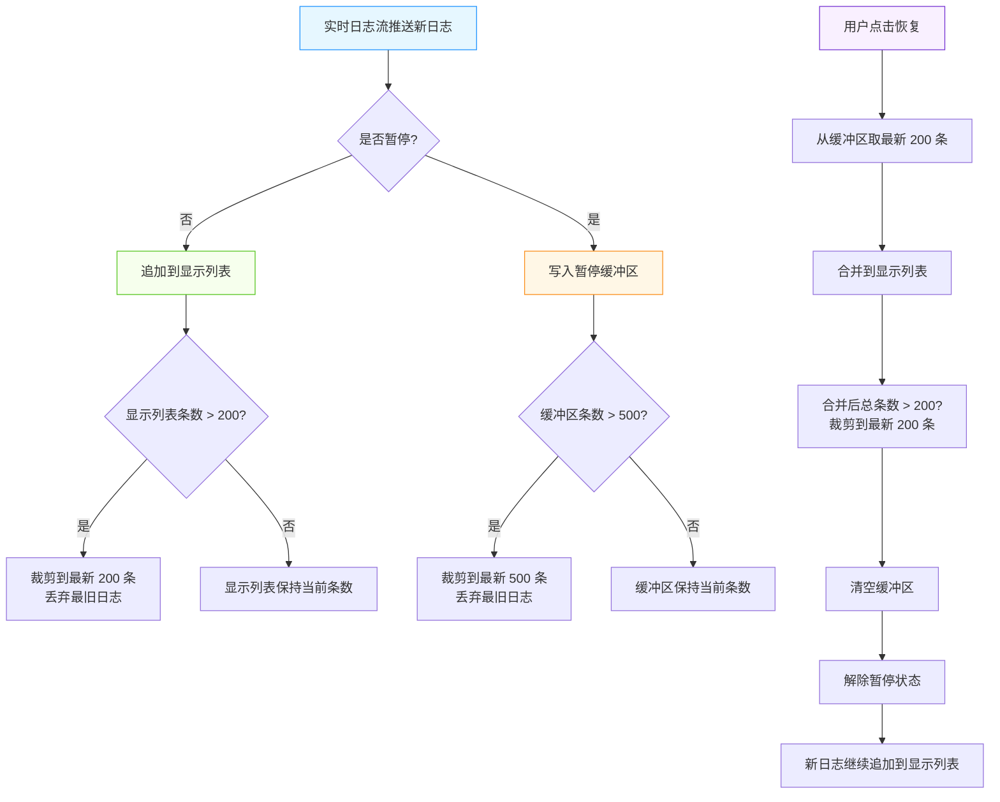
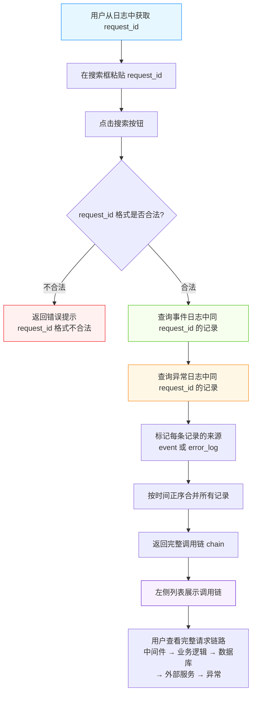
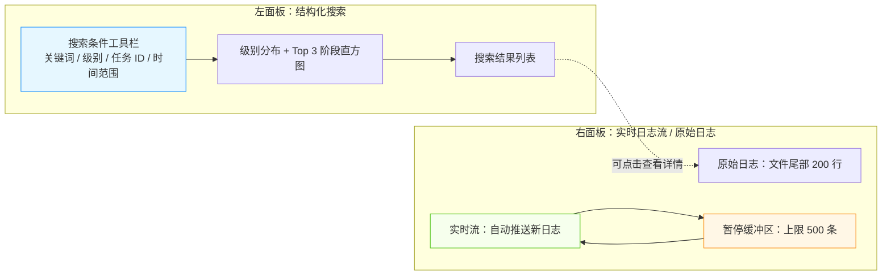

# 闲鱼猎人 实时日志 操作手册

| 属性         | 值                       |
| ------------ | ------------------------ |
| 文档版本     | v1.0                     |
| 文档日期     | 2026-07-05               |
| 所属项目     | 闲鱼猎人                 |
| 所属菜单     | 数据查看 → 实时日志      |
| 文档类型     | 操作手册                 |
| 关联路由     | /logs                    |
| 配套详细设计 | v2.0                     |
| 目标读者     | 运营 / 管理员            |

---

## 目录

- [0. 阶段交接声明](#0-阶段交接声明)
- [1. 功能简介](#1-功能简介)
- [2. 入口与导航](#2-入口与导航)
- [3. 界面布局](#3-界面布局)
- [4. 操作指南](#4-操作指南)
  - [4.1 查看实时日志（双面板布局：左日志列表 + 右详情）](#41-查看实时日志双面板布局左日志列表--右详情)
  - [4.2 暂停/恢复日志流（暂停时缓冲区上限 500 条）](#42-暂停恢复日志流暂停时缓冲区上限-500-条)
  - [4.3 缓冲机制说明（显示列表上限 200 条）](#43-缓冲机制说明显示列表上限-200-条)
  - [4.4 清空日志](#44-清空日志)
  - [4.5 5 种日志级别筛选（debug/info/warning/error/critical）](#45-5-种日志级别筛选debuginfowarningerrorcritical)
  - [4.6 任务维度筛选](#46-任务维度筛选)
  - [4.7 时间范围筛选](#47-时间范围筛选)
  - [4.8 日志标签管理（添加/移除标签）](#48-日志标签管理添加移除标签)
  - [4.9 日志导出（CSV / LOG 格式）](#49-日志导出csv--log-格式)
  - [4.10 全链路追踪（按 request_id 聚合）](#410-全链路追踪按-request_id-聚合)
  - [4.11 查看日志详情](#411-查看日志详情)
- [5. 字段说明](#5-字段说明)
- [6. 常见问题 FAQ](#6-常见问题-faq)
- [7. 注意事项与限制](#7-注意事项与限制)
- [8. 关联功能](#8-关联功能)
- [9. 快捷键与技巧](#9-快捷键与技巧)
- [10. 修订记录](#10-修订记录)
- [11. 附录](#11-附录)

---

## 0. 阶段交接声明

```text
- 当前阶段：实时日志操作手册 v1.0 编写 ✅ 已完成
- 下一阶段：错误日志操作手册编写
- 下一阶段智能体：文档编写智能体
- 下一阶段技能：文档编写
- 交接上下文：实时日志操作手册 v1.0 已完成，涵盖双面板布局（左日志列表 + 右详情）、5 种日志级别筛选（debug/info/warning/error/critical）、暂停/恢复（缓冲区上限 500 条、显示列表上限 200 条）、5 种筛选维度、日志标签管理、CSV/LOG 双格式导出、request_id 全链路追踪（聚合事件日志与异常日志）；面向运营/管理员，避免技术术语
```

---

## 1. 功能简介

实时日志是闲鱼猎人「数据查看」二级菜单下的核心运维入口，面向运营与管理员，提供系统运行过程中事件流的实时查看、结构化筛选、标签标注、离线导出与单次请求全链路追踪能力。

### 核心能力一览

| 能力             | 说明                                                                 |
| ---------------- | -------------------------------------------------------------------- |
| 实时日志流订阅   | 自动推送新日志到右侧面板，无需手动刷新                               |
| 双面板布局       | 左侧结构化搜索结果列表 + 右侧实时日志流或原始日志                    |
| 5 种日志级别筛选 | 支持 debug / info / warning / error / critical 五个级别筛选          |
| 多维度筛选       | 关键词、级别、任务 ID、时间范围、标签五个维度可组合筛选              |
| 暂停 / 恢复      | 暂停期间新日志暂存到缓冲区，恢复后按时间顺序展示                     |
| 日志标签管理     | 给关键日志打标签，便于后续分类检索                                   |
| 双格式导出       | 支持 CSV（Excel 友好）和 LOG（原始文本）两种导出格式                 |
| 全链路追踪       | 按全局流水号 request_id 一次性聚合事件日志与异常日志，串联完整调用链 |
| 日志详情查看     | 点击列表行查看完整字段，包括标签、扩展字段等                         |

### 适用场景

- **实时排查任务异常**：开启实时流 → 暂停冻结 → 仔细阅读错误堆栈 → 恢复继续
- **回溯历史日志**：按时间范围 + 级别 + 任务 ID 组合查询
- **追踪单次请求**：从一条日志中拿到 request_id，查看该请求触发的所有事件与异常
- **离线分析交接**：导出 CSV 给同事或 AI 助手辅助分析
- **关键事件标注**：给 WAF 拦截、关键单子等事件打标签，后续按标签筛选

---

## 2. 入口与导航

### 2.1 菜单元数据

| 属性       | 值                   |
| ---------- | -------------------- |
| 菜单分组   | 数据查看             |
| 菜单名称   | 实时日志             |
| 图标       | FileTextOutlined     |
| 路径       | /logs                |
| 排序       | 15                   |
| 默认可见   | 是                   |
| 菜单分类   | data_view            |

### 2.2 进入方式

| 进入方式           | 操作说明                                                                          |
| ------------------ | --------------------------------------------------------------------------------- |
| 侧边栏菜单点击     | 展开左侧「数据查看」分组 → 点击「实时日志」                                       |
| 快捷键             | 在非输入框聚焦状态下依次按 `g` → `l`（500 毫秒内按下第二键）                      |
| 命令面板           | 按 `Ctrl+K` 打开命令面板 → 输入「实时日志」模糊搜索 → 选中命令                    |
| 浏览器地址栏       | 直接访问 `/logs` 路径                                                             |
| 浏览器前进/后退    | 通过浏览器历史记录导航到 `/logs`                                                  |

> **提示**：实时日志与「错误日志」是两个相互独立的菜单。错误日志路径为 `/logs/errors`（菜单 key=error_logs），由独立文档覆盖，不在本手册范围内。本菜单仅关注正常运行的事件流，错误日志的结构化管理请参阅错误日志操作手册。

---

## 3. 界面布局

实时日志页面采用「顶部统计卡 + 左右双面板」布局。

### 3.1 顶部统计卡

| 统计卡         | 含义                                                                     |
| -------------- | ------------------------------------------------------------------------ |
| 日志条数       | 原始日志文件总行数                                                       |
| 搜索结果数     | 左侧结构化搜索命中的日志条数                                             |
| 实时流条数     | 右侧实时日志流的当前显示条数（颜色随状态变化）                           |
| 实时流控制     | 开启/停止实时流、暂停/恢复、清空按钮组                                   |

实时流条数颜色含义：

| 状态         | 颜色 | 说明                       |
| ------------ | ---- | -------------------------- |
| 未启动       | 灰色 | 实时流未开启               |
| 启动但暂停   | 橙色 | 实时流已开启，但已暂停     |
| 运行中       | 绿色 | 实时流正常运行中           |

### 3.2 左面板：结构化搜索（占 50% 宽度）

- **搜索条件工具栏**：关键词输入框、日志级别下拉、任务 ID 输入、搜索按钮、导出 CSV、导出 LOG
- **统计直方图**：当搜索结果不为空时显示
  - 级别分布：按 ERROR / WARNING / INFO / DEBUG 统计命中数量
  - Top 3 事件阶段标签：按命中频次降序展示前 3 个阶段
- **搜索结果列表**：可滚动，每行显示「级别标签 + 时间 + 阶段标签 + 任务 ID 标签 + 消息」

### 3.3 右面板：实时日志流或原始日志（占 50% 宽度）

| 模式         | 触发条件             | 数据来源                               | 标题           |
| ------------ | -------------------- | -------------------------------------- | -------------- |
| 实时日志流   | 实时流开启           | 事件日志增量数据（自动推送）           | 「实时日志流」 |
| 原始日志     | 实时流未开启         | 运行日志文件尾部 200 行                | 「原始日志」   |

- **刷新按钮**：仅在非实时流状态下出现，手动刷新原始日志
- **日志内容区**：等宽字体显示，最大高度 500 像素，可滚动

> **提示**：左右面板独立运作，左侧搜索结果不会影响右侧实时流，反之亦然。可在搜索的同时持续接收实时日志。

---

## 4. 操作指南

### 4.1 查看实时日志（双面板布局：左日志列表 + 右详情）

实时日志页面采用左右双面板设计，左侧用于结构化搜索与列表浏览，右侧用于实时流订阅或原始日志查看。

**操作步骤**：

1. 通过侧边栏「数据查看 → 实时日志」进入页面
2. 页面初始加载时，右侧默认显示「原始日志」面板（运行日志文件尾部 200 行）
3. 如需查看结构化事件日志，可在左侧搜索条件工具栏输入查询条件后点击「搜索」按钮
4. 如需开启实时日志流，点击顶部统计卡区域的「开启实时流」按钮，右侧面板标题切换为「实时日志流」，新日志会自动推送并滚动显示

**面板切换说明**：

| 状态               | 右面板显示       | 数据来源                       |
| ------------------ | ---------------- | ------------------------------ |
| 实时流未开启       | 原始日志         | 运行日志文件尾部 200 行        |
| 实时流开启运行中   | 实时日志流       | 事件日志增量（自动推送）       |
| 实时流开启已暂停   | 实时日志流       | 暂停前的日志 + 缓冲区暂存      |

> **提示**：右侧实时日志流实际订阅的是「事件日志流」通道（结构化事件数据，支持断线回放）。系统内还存在另一条「原始日志文件流」通道（按文件尾部轮询，支持按 request_id 过滤），仅供后台排障用，实时日志页面不直接订阅。两条通道独立运作，不可混淆。

### 4.2 暂停/恢复日志流（暂停时缓冲区上限 500 条）

实时流运行过程中，如需仔细阅读某段日志（如错误堆栈），可暂停日志流以冻结滚动。

**暂停操作步骤**：

1. 实时流处于运行中状态时（顶部统计卡颜色为绿色）
2. 点击「暂停」按钮
3. 顶部统计卡颜色变为橙色，表示已暂停
4. 暂停期间推送的新日志会暂存到缓冲区，**不会显示在面板中**

**恢复操作步骤**：

1. 实时流处于已暂停状态时（顶部统计卡颜色为橙色）
2. 点击「恢复」按钮
3. 缓冲区中暂存的日志会按时间顺序合并到显示列表
4. 顶部统计卡颜色恢复为绿色，新日志继续自动推送

**缓冲区行为**：

- 暂停期间所有新日志写入缓冲区
- 缓冲区**上限 500 条**，超过时丢弃最旧日志（保留最新 500 条）
- 恢复时取缓冲区最新 200 条合并到显示列表
- 恢复时先合并缓冲区再解除暂停，避免新消息插入缓冲区消息之前

> **提示**：暂停期间若长时间未恢复且新日志超过 500 条，最早的部分日志会丢失。建议在排查完毕后及时恢复，避免长时间暂停。

### 4.3 缓冲机制说明（显示列表上限 200 条）

为保证页面性能与内存可控，实时日志流显示列表有严格的容量上限。

**显示列表机制**：

| 项                 | 上限    | 说明                                                       |
| ------------------ | ------- | ---------------------------------------------------------- |
| 显示列表容量       | 200 条  | 实时流面板最多展示 200 条日志，超过时丢弃最旧日志         |
| 暂停缓冲区容量     | 500 条  | 暂停期间最多暂存 500 条日志，超过时丢弃最旧日志           |
| 恢复时合并上限     | 200 条  | 恢复时从缓冲区取最新 200 条合并到显示列表                 |

**日志流向**：

1. 实时流推送新日志
2. 若处于暂停状态 → 写入暂停缓冲区（超 500 条裁剪到最新 500 条）
3. 若处于运行状态 → 追加到显示列表（超 200 条裁剪到最新 200 条）
4. 用户点击恢复 → 缓冲区最新 200 条合并到显示列表，缓冲区清空

> **提示**：显示列表与缓冲区的容量上限是硬性约束，无法在界面上调整。如需查看更早的历史日志，请使用左侧的「结构化搜索」功能按时间范围查询。

### 4.4 清空日志

实时日志流面板提供「清空」按钮，可手动清空当前显示的日志列表。

**操作步骤**：

1. 实时流处于开启状态（运行中或暂停均可）
2. 点击「清空」按钮
3. 显示列表立即清空，所有已显示的日志被移除
4. 实时流连接不中断，后续新日志继续推送

**清空范围说明**：

| 项                 | 是否清空   |
| ------------------ | ---------- |
| 显示列表           | 是         |
| 暂停缓冲区         | 否         |
| 实时流连接         | 否         |
| 搜索结果列表       | 否         |
| 原始日志文件       | 否         |

> **提示**：清空操作仅影响当前显示，不会删除任何持久化日志数据。如需清空暂停缓冲区，需先点击「恢复」让缓冲区合并到显示列表，再点击「清空」。

### 4.5 5 种日志级别筛选（debug/info/warning/error/critical）

实时日志支持按 5 种日志级别筛选，便于快速定位问题。

**5 种日志级别对照**：

| 级别       | 显示文本   | 颜色   | 含义说明                                       |
| ---------- | ---------- | ------ | ---------------------------------------------- |
| debug      | DEBUG      | 灰色   | 调试信息，用于开发排查问题                     |
| info       | INFO       | 蓝色   | 常规运行信息，默认级别                         |
| warning    | WARNING    | 橙色   | 警告信息，提示潜在问题                         |
| error      | ERROR      | 红色   | 错误信息，业务流程异常                         |
| critical   | CRITICAL   | 红色   | 严重错误，需立即关注处理                       |

**操作步骤**：

1. 在左侧搜索条件工具栏找到「日志级别」下拉框
2. 点击下拉框，从列表中选择一个级别（如 ERROR）
3. 点击「搜索」按钮，左侧列表展示符合该级别的日志
4. 顶部统计卡区域会显示级别分布直方图，反映搜索结果中各级别命中数量

**筛选规则**：

- 一次只能选择一个级别筛选（不支持多选）
- 级别筛选可与其他维度（关键词、任务 ID、时间范围、标签）组合
- 级别参数兼容大小写与同义词（如 `err` 与 `error`、`warn` 与 `warning` 均可匹配）

> **提示**：critical 级别代表严重错误事件，与一般错误（error）相比影响范围更广，建议优先关注。若需查看所有非正常日志，可分别按 warning / error / critical 多次筛选后合并查看。

### 4.6 任务维度筛选

按任务 ID 筛选日志，可定位特定任务的所有事件。

**操作步骤**：

1. 在左侧搜索条件工具栏找到「任务 ID」输入框
2. 输入目标任务 ID（支持复制粘贴）
3. 点击「搜索」按钮或按回车键触发搜索
4. 左侧列表展示该任务相关的所有日志

**配合其他维度**：

- 任务 ID + 级别：查看某任务的所有 ERROR 日志
- 任务 ID + 时间范围：查看某任务在特定时段的事件
- 任务 ID + 关键词：在任务范围内进一步搜索特定关键字

> **提示**：任务 ID 输入框支持「清空」按钮（allowClear），点击右侧 × 可快速清除任务 ID 筛选条件。任务 ID 与关键词、级别等条件会同步到浏览器地址栏，刷新页面可恢复搜索条件。

### 4.7 时间范围筛选

按时间范围筛选日志，可定位特定时段的事件。

**操作步骤**：

1. 在左侧搜索条件工具栏找到「起始时间」与「截止时间」输入框
2. 选择或输入起始时间（ISO 格式，如 `2026-07-05T10:00:00`）
3. 选择或输入截止时间（ISO 格式，如 `2026-07-05T12:00:00`）
4. 点击「搜索」按钮，左侧列表展示该时间范围内的日志

**时间规则**：

- 起始时间与截止时间可单独使用（仅起始、仅截止、或两者都指定）
- 时间筛选与日志的创建时间（UTC）比较
- 可与级别、任务 ID、关键词、标签等维度组合

> **提示**：时间范围筛选适合回溯历史问题。若不确定具体时间，可先按级别或任务 ID 缩小范围，再结合时间范围进一步定位。

### 4.8 日志标签管理（添加/移除标签）

标签机制允许用户给关键日志打上自定义标签，便于后续分类检索。

#### 4.8.1 添加标签

**操作步骤**：

1. 在左侧搜索结果列表中找到目标日志行
2. 点击日志行上的「打标签」按钮（或点击日志行展开详情后操作）
3. 在弹出的输入框中输入标签名
4. 点击「确认」按钮，标签写入该日志的标签字段
5. 该日志行的标签区域显示新添加的标签

#### 4.8.2 移除标签

**操作步骤**：

1. 在左侧搜索结果列表中找到目标日志行
2. 点击日志行上已存在的标签的 × 按钮
3. 标签从该日志的标签字段移除
4. 该日志行的标签区域不再显示该标签

**标签命名规则**：

| 项             | 规则                                                |
| -------------- | --------------------------------------------------- |
| 允许字符       | 大写字母 A-Z、小写字母 a-z、数字 0-9、下划线 `_`、连字符 `-` |
| 长度限制       | 1-40 个字符                                         |
| 不允许字符     | 空格、`@`、`#`、`$`、`%`、中文等特殊字符            |
| 推荐命名示例   | `waf-blocked`、`critical-order`、`perf-issue`       |

**幂等行为**：

- 重复添加同一标签不会重复创建（仅保留一个）
- 移除不存在的标签也返回成功（不会报错）

> **提示**：打标签后，可在搜索条件中按标签名筛选，快速检索同类事件。例如给所有 WAF 拦截事件打上 `waf-blocked` 标签，后续输入该标签即可一键查看所有相关日志。

### 4.9 日志导出（CSV / LOG 格式）

实时日志支持两种导出格式，便于离线分析与交接。

#### 4.9.1 导出 CSV 格式

**操作步骤**：

1. 在左侧搜索条件工具栏点击「导出 CSV」按钮
2. 浏览器自动触发下载，文件名格式为 `xh-logs-YYYYMMDD-HHMMSS.csv`
3. 用 Excel / Numbers / WPS 等表格软件打开文件

**CSV 文件内容**：

| 列名         | 说明                                       |
| ------------ | ------------------------------------------ |
| id           | 日志主键                                   |
| created_at   | 创建时间                                   |
| level        | 日志级别                                   |
| stage        | 事件阶段                                   |
| task_id      | 关联任务 ID                                |
| item_id      | 关联商品 ID                                |
| message      | 日志消息（超 500 字符自动截断）            |
| tags         | 标签列表（多个用逗号分隔）                 |

**特点**：

- 支持应用当前搜索条件（关键词、级别、任务 ID、时间范围、标签）
- 单次导出上限 10000 条
- 流式响应，大数据量不会卡顿

#### 4.9.2 导出 LOG 格式

**操作步骤**：

1. 在左侧搜索条件工具栏点击「导出 LOG」按钮
2. 浏览器自动触发下载，文件名格式为 `xh-logs-YYYYMMDD-HHMMSS.log`
3. 用任意文本编辑器打开文件

**LOG 文件内容**：

- 标准输出运行日志全文
- 标准错误运行日志全文
- 两部分以分隔线标识

**特点**：

- 不支持过滤（导出原始文件全文）
- 适合交接给同事或 AI 助手辅助分析
- 与 CSV 互补：CSV 适合结构化分析，LOG 适合查看原始上下文

> **提示**：建议优先使用 CSV 格式进行结构化分析，需要查看原始日志上下文时再导出 LOG 格式。两种格式可根据当前搜索条件生成，建议先筛选再导出，避免文件过大。

### 4.10 全链路追踪（按 request_id 聚合）

全链路追踪是实时日志的核心高级能力，可按全局流水号 `request_id` 一次性聚合该请求触发的所有事件日志与异常日志，串联完整调用链。

#### 4.10.1 request_id 简介

request_id 是闲鱼猎人系统为每次请求自动生成的全局流水号，格式为 `req-<17位数字>-<6位十六进制>`，例如 `req-20260701120000537-a3b2c1`。

- 前缀 `req`：肉眼识别与正则提取友好
- 17 位数字：UTC 时间戳（毫秒级），保证有序性
- 6 位十六进制：随机数，碰撞概率约 1670 万分之一

request_id 贯穿以下链路：

1. 请求入口（中间件自动生成并注入）
2. 业务逻辑日志（写入事件日志的 request_id 字段）
3. 异常日志（写入异常日志的 request_id 字段）
4. 后台任务（从上下文或显式传参读取）
5. 全链路追踪查询（聚合事件日志与异常日志）

#### 4.10.2 追踪操作步骤

1. 从某条日志中获取 request_id（可在日志详情面板查看，或从原始日志行的 `[req=xxx]` 标识解析）
2. 在左侧搜索条件工具栏的「request_id」输入框中粘贴流水号
3. 点击「搜索」按钮或按回车键
4. 系统校验 request_id 格式：
   - 合法：聚合事件日志与异常日志，按时间正序合并展示
   - 不合法：提示「request_id 格式不合法」
5. 左侧列表展示完整调用链，每条记录标注来源（事件日志或异常日志）

#### 4.10.3 调用链示例

一次请求的全链路追踪结果可能包含：

```
请求进入
  ├─ 中间件日志（事件日志）
  ├─ 业务逻辑日志（事件日志）
  ├─ 数据库操作日志（事件日志）
  ├─ 外部服务调用日志（事件日志）
  ├─ 子请求/联动请求日志（事件日志）
  └─ 异常日志（异常日志，若有）
```

**响应字段说明**：

| 字段                | 含义                                       |
| ------------------- | ------------------------------------------ |
| request_id          | 流水号                                     |
| total               | 链路总记录数                               |
| events_total        | 事件日志数量                               |
| error_logs_total    | 异常日志数量                               |
| chain[]             | 按时间正序合并的记录列表                   |
| chain[].\_source    | 来源标识（event 表示事件日志，error_log 表示异常日志） |

> **提示**：全链路追踪是事件日志与异常日志两大菜单的唯一交汇点。本菜单（实时日志）关注正常运行的事件流；异常日志菜单（路径 `/logs/errors`，菜单 key=error_logs）关注未处理异常的结构化管理。两者通过 request_id 在全链路追踪中汇合。

### 4.11 查看日志详情

点击左侧搜索结果列表中的某条日志，可在右侧详情面板查看完整字段。

**操作步骤**：

1. 在左侧搜索结果列表中点击目标日志行
2. 右侧面板切换为「日志详情」视图
3. 详情面板展示该日志的所有可见字段

**详情面板内容**：

- 日志主键 ID
- 创建时间
- 日志级别（带颜色标签）
- 事件阶段
- 关联任务 ID
- 关联商品 ID
- 消息全文
- 标签列表（可在此处添加/移除标签）
- request_id（若有，可点击触发全链路追踪）
- 扩展字段（payload 中的其他业务数据）

> **提示**：详情面板中的 request_id 通常以可点击链接形式呈现，点击即可快速发起全链路追踪查询，无需手动复制粘贴。

---

## 5. 字段说明

### 5.1 日志列表字段

| 字段         | 类型     | 是否必填 | 说明                                                         |
| ------------ | -------- | -------- | ------------------------------------------------------------ |
| id           | 整数     | 是       | 日志主键，唯一标识                                           |
| type         | 字符串   | 否       | 事件类型，如 `task.search_done`、`eval.scored`、`buy.succeeded` |
| task_id      | 字符串   | 否       | 关联任务 ID                                                  |
| item_id      | 字符串   | 否       | 关联商品 ID                                                  |
| stage        | 字符串   | 是       | 事件阶段，如 `search`、`eval`、`buy`、`dep_triggered`        |
| level        | 字符串   | 是       | 日志级别（小写存储）：debug / info / warning / error / critical |
| message      | 文本     | 否       | 日志消息文本                                                 |
| payload      | 文本     | 否       | 扩展字段（JSON 字符串），包含 tags 数组与其他业务数据        |
| created_at   | 日期时间 | 否       | 创建时间（UTC）                                              |
| request_id   | 字符串   | 否       | 全局流水号（历史数据可能为空）                               |

### 5.2 日志详情字段

详情面板在列表字段基础上额外展示以下内容：

| 字段             | 说明                                                           |
| ---------------- | -------------------------------------------------------------- |
| tags             | 标签列表（从 payload 解析，可添加/移除）                       |
| 扩展业务字段     | payload 中的其他业务数据（视事件类型而定）                     |
| 来源标识         | 全链路追踪结果中标识（event 或 error_log）                     |

### 5.3 实时日志流字段

实时日志流推送的每条日志与列表字段一致，但展示形式简化为：

```
[级别] 消息内容
```

例如：

```
[error] 任务 task_001 执行失败：网络超时
[info] 商品 item_xyz 评估完成，分数 85
```

### 5.4 全链路追踪结果字段

| 字段                | 类型     | 说明                                                   |
| ------------------- | -------- | ------------------------------------------------------ |
| request_id          | 字符串   | 流水号                                                 |
| total               | 整数     | 链路总记录数                                           |
| events_total        | 整数     | 事件日志数量                                           |
| error_logs_total    | 整数     | 异常日志数量                                           |
| chain[]             | 数组     | 按时间正序合并的记录列表                               |
| chain[].id          | 整数     | 记录主键                                               |
| chain[].type        | 字符串   | 事件类型（仅事件日志有）                               |
| chain[].stage       | 字符串   | 事件阶段（仅事件日志有）                               |
| chain[].level       | 字符串   | 日志级别                                               |
| chain[].message     | 文本     | 日志消息                                               |
| chain[].created_at  | 日期时间 | 创建时间（事件日志）                                   |
| chain[].timestamp   | 日期时间 | 时间戳（异常日志）                                     |
| chain[].error_type  | 字符串   | 错误类型（仅异常日志有）                               |
| chain[].error_message | 文本   | 错误消息（仅异常日志有）                               |
| chain[].request_id  | 字符串   | 流水号                                                 |
| chain[].\_source    | 字符串   | 来源标识（event 或 error_log）                         |

---

## 6. 常见问题 FAQ

### Q1：实时日志流连接的是哪条通道？

**A**：实时日志页面订阅的是「事件日志流」通道（推送结构化事件日志数据，支持断线回放，连接数上限 10）。系统内还存在另一条「原始日志文件流」通道（按文件尾部轮询，每 2 秒推送新增行，支持按 request_id 过滤，无连接数限制），仅供后台排障用，实时日志页面不直接订阅此通道。两条通道独立运作，端点、数据格式、用途均不同。

### Q2：实时流可以暂停吗？暂停期间的消息会丢失吗？

**A**：可以暂停。暂停期间新日志暂存到缓冲区，**上限 500 条**，超过时丢弃最旧日志（保留最新 500 条）。恢复时取缓冲区最新 200 条合并到显示列表，先合并再解除暂停，避免新消息插入缓冲区消息之前。若暂停时间过长且新日志超过 500 条，最早的部分日志会丢失，建议及时恢复。

### Q3：显示列表为什么只能看到 200 条日志？

**A**：为保证页面性能与内存可控，实时日志流显示列表**上限 200 条**，超过时自动丢弃最旧日志（保留最新 200 条）。这是硬性约束，无法在界面上调整。如需查看更早的历史日志，请使用左侧的「结构化搜索」功能按时间范围查询。

### Q4：缓冲区 500 条与显示列表 200 条有什么区别？

**A**：
- **缓冲区 500 条**：仅在暂停期间生效，暂存暂停后推送的新日志，恢复时合并到显示列表
- **显示列表 200 条**：始终生效，控制面板上可见的日志条数，超过时丢弃最旧日志

两者关系：恢复时从缓冲区取最新 200 条合并到显示列表（合并后总条数仍受 200 条上限约束）。

### Q5：清空按钮会删除持久化日志吗？

**A**：不会。清空操作仅清空当前显示列表与缓冲区，不影响任何持久化日志数据，也不中断实时流连接。后续新日志会继续推送并显示。

### Q6：日志级别有哪些？critical 与 error 有什么区别？

**A**：实时日志共 5 种级别：
- **debug**（DEBUG，灰色）：调试信息，用于开发排查
- **info**（INFO，蓝色）：常规运行信息，默认级别
- **warning**（WARNING，橙色）：警告，提示潜在问题
- **error**（ERROR，红色）：错误，业务流程异常
- **critical**（CRITICAL，红色）：严重错误，需立即关注处理

critical 与 error 的区别：critical 表示影响范围更广、需立即处理的严重错误；error 表示一般性业务异常。建议优先关注 critical 级别日志。

### Q7：搜索时级别筛选为什么同时支持大小写？

**A**：日志数据存储统一使用小写，但前端下拉传大写（如 ERROR），旧版控制台或直接调用接口可能用小写或同义词（如 `err` 与 `error`、`warn` 与 `warning`）。系统自动兼容这些变体并归一化匹配，无需用户关心大小写问题。

### Q8：标签存在哪里？支持哪些字符？

**A**：标签存在日志的扩展字段（payload）的 tags 数组中，不引入独立列（零迁移设计）。标签名必须匹配 `^[A-Za-z0-9_\-]+$`，长度 1-40 字符，仅允许大写字母、小写字母、数字、下划线 `_`、连字符 `-`，不允许空格、中文、`@`、`#` 等特殊字符。打标签幂等（重复添加不重复创建），删除不存在标签也返回成功。

### Q9：导出 CSV 与 LOG 有什么区别？

**A**：
- **CSV 格式**：Excel/Numbers 友好的结构化表格，列包含 id / created_at / level / stage / task_id / item_id / message / tags，**支持应用搜索条件**（关键词、级别、任务 ID、时间范围、标签），单次上限 10000 条，message 超过 500 字符自动截断
- **LOG 格式**：原始运行日志文件全文拼接（标准输出 + 标准错误），**不支持过滤**，适合查看完整上下文

文件名均包含时间戳（`xh-logs-YYYYMMDD-HHMMSS.csv|log`），便于区分多次导出。建议优先使用 CSV 进行结构化分析，需要查看原始上下文时再导出 LOG。

### Q10：如何追踪单次请求的所有日志？

**A**：从某条日志中获取 request_id（格式为 `req-<17位数字>-<6位十六进制>`，如 `req-20260701120000537-a3b2c1`），在左侧搜索条件工具栏的「request_id」输入框中粘贴流水号，点击「搜索」即可聚合该请求触发的所有事件日志与异常日志，按时间正序合并展示完整调用链。request_id 格式不合法时会返回 400 错误提示。

### Q11：实时日志与错误日志有什么区别？

**A**：
- **实时日志**（本菜单，路径 `/logs`，菜单 key=logs）：关注正常运行的事件流，提供实时订阅、结构化搜索、标签、导出、全链路追踪能力
- **错误日志**（独立菜单，路径 `/logs/errors`，菜单 key=error_logs）：关注未处理异常的结构化管理，提供错误列表、状态流转（new/resolved/ignored）、AI 上下文导出、批量清理能力

两者通过 request_id 在全链路追踪端点汇合，是事件日志与异常日志两大菜单的唯一交汇点。

### Q12：刷新页面后搜索条件会丢失吗？

**A**：不会。关键词、日志级别、任务 ID 三个搜索条件会自动同步到浏览器地址栏（URL 参数），刷新页面或分享链接给同事时，搜索条件会自动恢复。但时间范围、request_id、标签等条件不会持久化到 URL，刷新后需重新输入。

### Q13：实时流断开连接会怎么样？

**A**：浏览器原生事件流客户端会自动重连。若连接断开，页面会弹出「日志流连接断开」提示并停止实时流，需手动点击「开启实时流」重新订阅。断线期间推送的日志不会丢失（事件日志流支持断线回放，通过 Last-Event-ID 机制从断点续传）。

### Q14：日志详情中的 request_id 可以点击吗？

**A**：可以。日志详情面板中的 request_id 通常以可点击链接形式呈现，点击即可快速发起全链路追踪查询，无需手动复制粘贴到搜索框。这是从单条日志快速跳转到完整调用链的便捷方式。

---

## 7. 注意事项与限制

### 7.1 缓冲区与显示列表上限

- **暂停缓冲区上限 500 条**：暂停期间暂存的新日志最多 500 条，超过时丢弃最旧日志
- **显示列表上限 200 条**：实时流面板最多展示 200 条日志，超过时丢弃最旧日志
- **恢复时合并上限 200 条**：从缓冲区取最新 200 条合并到显示列表
- 这两个上限是硬性约束，无法在界面上调整，需使用结构化搜索查看更早的历史日志

### 7.2 两条独立日志流通道边界

系统存在两条独立的实时日志流通道，端点、数据格式、用途均不同，**不可混淆**：

| 维度             | 事件日志流通道（前端实际订阅）   | 原始日志文件流通道（后台排障用）   |
| ---------------- | -------------------------------- | ---------------------------------- |
| 数据来源         | 事件日志增量（每 3 秒查询）      | 运行日志文件尾部轮询（每 2 秒）    |
| 数据格式         | 结构化事件数据（含完整字段）     | 原始日志行文本                     |
| 断线回放         | 支持                             | 不支持                             |
| 连接数限制       | 上限 10                          | 无限制                             |
| request_id 过滤  | 不支持（推送所有事件）           | 支持（从日志行 `[req=xxx]` 解析）  |
| 前端使用         | 实时日志页面订阅                 | 实时日志页面**不使用**             |

### 7.3 request_id 全链路追踪范围

- 全链路追踪**仅聚合事件日志与异常日志两类数据**，不包含其他菜单的数据
- request_id 必须符合 `req-<17位数字>-<6位十六进制>` 格式，不合法时返回 400 错误
- 历史数据可能没有 request_id（迁移前的老数据），无法通过此机制追踪
- 单表返回上限默认 1000 条，可在 1-5000 范围内调整

### 7.4 日志级别含义

- 实时日志共 5 种级别：debug / info / warning / error / critical
- 级别参数兼容大小写与同义词（`err` 与 `error`、`warn` 与 `warning` 均可匹配）
- 级别筛选一次只能选择一个，不支持多选
- critical 级别代表严重错误事件，需优先关注处理

### 7.5 标签命名约束

- 仅允许字符：大写字母 A-Z、小写字母 a-z、数字 0-9、下划线 `_`、连字符 `-`
- 长度限制 1-40 个字符
- 不允许空格、中文、`@`、`#`、`$`、`%` 等特殊字符
- 打标签与删除标签均幂等（重复操作不会报错）

### 7.6 实时流连接数限制

- 事件日志流通道连接数上限 10，超过时新连接会被拒绝
- 原始日志文件流通道无连接数限制
- 实时日志页面只订阅事件日志流通道，建议同一浏览器不要打开多个实时日志页面，避免占用连接数

### 7.7 导出限制

- CSV 导出单次上限 10000 条，超过时需分批导出
- CSV 的 message 字段超过 500 字符自动截断
- LOG 导出不支持过滤，导出原始文件全文
- 文件名包含时间戳，便于区分多次导出

### 7.8 错误日志边界

- 错误日志由独立菜单管理（路径 `/logs/errors`，菜单 key=error_logs），不在本菜单范围
- 本菜单（实时日志）仅关注正常运行的事件流
- 两者通过 request_id 在全链路追踪端点汇合
- 异常日志的字段定义、状态流转、AI 上下文导出等请参阅错误日志操作手册

### 7.9 搜索条件持久化范围

- 关键词、日志级别、任务 ID 三个条件会持久化到浏览器地址栏
- 时间范围、request_id、标签等条件**不会**持久化，刷新后需重新输入
- 持久化采用 `replace` 模式，不会产生多余的浏览器历史记录

---

## 8. 关联功能

实时日志与以下菜单存在联动关系：

### 8.1 事件时间线

| 维度         | 说明                                                                 |
| ------------ | -------------------------------------------------------------------- |
| 菜单路径     | `/timeline`                                                          |
| 共享数据     | 共享事件日志数据与事件日志流通道                                     |
| 视角差异     | 事件时间线侧重事件序列的时间轴展示，实时日志侧重日志搜索与流式订阅   |
| 联动场景     | 在事件时间线中发现异常后，可切换到实时日志按条件搜索相关事件         |

### 8.2 错误日志

| 维度         | 说明                                                                 |
| ------------ | -------------------------------------------------------------------- |
| 菜单路径     | `/logs/errors`                                                       |
| 菜单 key     | error_logs                                                           |
| 数据来源     | 异常日志数据（17 个字段，无 updated_at）                             |
| 边界关系     | 实时日志关注正常运行事件流，错误日志关注未处理异常的结构化管理        |
| 交叉点       | 全链路追踪端点（按 request_id 聚合事件日志与异常日志）               |
| 联动场景     | 在实时日志中发现 error 级别日志后，可切换到错误日志查看完整异常详情与堆栈 |

### 8.3 任务管理

| 维度         | 说明                                                                 |
| ------------ | -------------------------------------------------------------------- |
| 菜单路径     | `/tasks`                                                             |
| 共享数据     | 共享事件日志数据（按 task_id 关联）                                  |
| 视角差异     | 任务管理侧重任务列表与状态，实时日志侧重任务执行过程中产生的事件流   |
| 联动场景     | 在任务管理中查看某任务异常后，可切换到实时日志按 task_id 搜索相关事件 |

### 8.4 任务详情页

| 维度         | 说明                                                                 |
| ------------ | -------------------------------------------------------------------- |
| 共享数据     | 共享事件日志数据                                                     |
| 联动场景     | 任务详情页的「运行历史」Tab 从事件日志聚合，与实时日志查询同一份数据但视角不同 |

### 8.5 通知中心

| 维度         | 说明                                                                 |
| ------------ | -------------------------------------------------------------------- |
| 菜单路径     | `/notifications`                                                     |
| 关联点       | 事件严重度（critical 级别）用于通知免打扰决策                        |
| 联动场景     | critical 级别日志可能触发通知，可在通知中心查看历史告警              |

> **提示**：实时日志的核心联动点是 request_id 全链路追踪，它是事件日志与异常日志两大菜单的唯一交汇点。建议在排查复杂问题时，配合事件时间线、任务管理、错误日志多菜单协同分析。

---

## 9. 快捷键与技巧

### 9.1 快捷键

| 快捷键                 | 作用                                       | 备注                                       |
| ---------------------- | ------------------------------------------ | ------------------------------------------ |
| `Ctrl+K`（或 `⌘+K`）   | 打开命令面板                               | 输入框聚焦时可直接模糊搜索命令             |
| `Escape`               | 关闭命令面板                               | 仅在命令面板打开时生效                     |
| `g` 然后按 `l`         | 跳转到实时日志 `/logs`                     | g 前缀序列，500 毫秒内按第二键             |
| `g` 然后按 `i`         | 跳转到事件时间线 `/timeline`               | 同上                                       |
| `g` 然后按 `t`         | 跳转到任务管理 `/tasks`                    | 同上                                       |
| 回车键                 | 在关键词输入框中触发搜索                   | 仅在搜索框聚焦时生效                       |

> **提示**：输入框、文本域、下拉框内不触发快捷键，避免干扰正常输入。

### 9.2 实用技巧

#### 技巧 1：用 URL 分享搜索条件

关键词、级别、任务 ID 会自动同步到浏览器地址栏。可将当前页面的 URL 复制分享给同事，对方打开后自动恢复相同的搜索条件，便于协同排查问题。

#### 技巧 2：先筛选再导出

导出 CSV 时会应用当前搜索条件。建议先按级别、任务 ID、时间范围缩小结果集，再点击「导出 CSV」，避免文件过大且聚焦关键日志。

#### 技巧 3：用标签分类管理关键事件

给 WAF 拦截、关键单子、性能问题等事件打上专属标签（如 `waf-blocked`、`critical-order`、`perf-issue`），后续在搜索条件中输入标签名即可一键检索同类事件，避免重复排查。

#### 技巧 4：从日志详情快速发起全链路追踪

日志详情面板中的 request_id 通常以可点击链接形式呈现，点击即可快速发起全链路追踪查询，无需手动复制粘贴到搜索框。

#### 技巧 5：暂停后仔细阅读错误堆栈

实时流滚动过快时，点击「暂停」冻结滚动，仔细阅读错误堆栈与上下文。排查完毕后点击「恢复」，缓冲区中的日志会按时间顺序合并显示。

#### 技巧 6：双格式导出互补分析

- CSV 适合用 Excel 透视表做结构化分析（按级别、阶段、任务分组统计）
- LOG 适合查看原始上下文，可粘贴给 AI 助手辅助分析

两者配合使用，先 CSV 定位问题范围，再 LOG 查看完整上下文。

#### 技巧 7：级别分布直方图快速判断健康度

搜索结果上方的级别分布直方图可快速判断系统健康度：
- ERROR 与 CRITICAL 占比高 → 系统存在严重问题，需立即排查
- WARNING 占比高 → 系统存在潜在风险，建议关注
- INFO 与 DEBUG 占比高 → 系统运行正常

#### 技巧 8：Top 3 阶段标签定位高发模块

搜索结果上方的 Top 3 阶段标签展示命中频次最高的事件阶段，可快速定位问题高发模块（如 search 阶段频繁报错，可能是搜索接口异常）。

---

## 10. 修订记录

| 版本 | 日期       | 修订人           | 修订内容                                                                                                                       |
| ---- | ---------- | ---------------- | ------------------------------------------------------------------------------------------------------------------------------ |
| v1.0 | 2026-07-05 | 文档编写智能体   | 初版：11 章齐全（阶段交接声明 / 功能简介 / 入口与导航 / 界面布局 / 操作指南 11 节 / 字段说明 / FAQ 14 条 / 注意事项 9 条 / 关联功能 / 快捷键与技巧 / 修订记录 / 附录）；覆盖双面板布局、5 种日志级别筛选、暂停/恢复（缓冲区 500/显示 200）、5 种筛选维度、标签管理、CSV/LOG 双格式导出、request_id 全链路追踪；面向运营/管理员，避免技术术语。 |

---

## 11. 附录

### 11.1 5 种日志级别对照表

| 级别       | 显示文本   | 颜色   | 含义说明                                       | 推荐处理方式                       |
| ---------- | ---------- | ------ | ---------------------------------------------- | ---------------------------------- |
| debug      | DEBUG      | 灰色   | 调试信息，用于开发排查问题                     | 一般可忽略，开发排查时关注         |
| info       | INFO       | 蓝色   | 常规运行信息，默认级别                         | 无需处理，用于了解系统运行状态     |
| warning    | WARNING    | 橙色   | 警告信息，提示潜在问题                         | 建议关注，及时排查潜在风险         |
| error      | ERROR      | 红色   | 错误信息，业务流程异常                         | 需排查处理，可能影响业务           |
| critical   | CRITICAL   | 红色   | 严重错误，需立即关注处理                       | 立即处理，影响范围广或服务不可用   |

### 11.2 缓冲区算法流程图



### 11.3 全链路追踪流程图



### 11.4 实时日志双面板协同示意



---

**文档结束**
