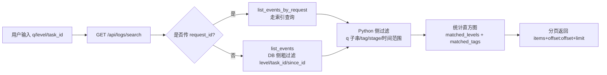

# 实时日志 详细设计文档

## 1. 文档元信息

| 属性     | 值                                |
| -------- | --------------------------------- |
| 文档名称 | 实时日志-详细设计                 |
| 版本     | v2.0                              |
| 发布日期 | 2026-07-05                        |
| 所属菜单 | 数据查看                          |
| 关联路由 | `/logs`                           |
| 文档用途 | 开发团队技术指导 / 智能客服向量库训练素材 |
| 维护人   | XianyuHunter 团队                 |

> 本文档基于代码实现重写，与 v1.0 相比主要差异：
> 1. **澄清两条 SSE 流的边界**：实时日志页前端实际订阅的是 `/api/events/stream`（事件时间线 SSE，推送 events 表数据），而非 `/api/logs/stream`（文件尾部轮询 SSE）。两者端点、数据格式、用途均不同。
> 2. **补全 request_id 全局流水号机制**：格式 `req-<17位数字>-<6位hex>`，由 `infra/request_context.py` 生成，贯穿 events 与 error_logs 两表。
> 3. **修正 API 端点清单**：实际 7 个端点（list/search/tag/untag/export/stream/request_chain），v1.0 仅列 5 个且方法/字段名错误（search 是 GET 非 POST、export 是 GET 非 POST、tag 的 event_id 是 Query 非 Body）。
> 4. **修正数据模型**：实时日志查询的是 `events` 表（10 字段），不存在独立 `logs` 表；error_logs 表 17 字段且**无 `updated_at`**（v1.0 错误包含），error_logs 由独立"错误日志"文档覆盖。
> 5. **修正关联路由**：仅 `/logs`，错误日志 `/logs/errors` 是独立菜单条目（`error_logs` key），不在本文档范围。
> 6. **补全错误捕获双入口**：`capture_request_error`（HTTP 请求）+ `capture_background_error`（后台任务）。

---

## 2. 功能概述

**一句话说明**：提供实时日志流订阅、结构化日志搜索、标签管理与 CSV/LOG 导出能力，并通过 request_id 全局流水号支持单次请求的全链路追踪。

**核心价值**：
- 双面板布局：左侧结构化搜索 events 表（含级别分布与 Top stage 直方图），右侧原始日志文件/实时事件流切换显示；
- 实时事件流基于 SSE 推送 events 表增量数据，支持暂停/恢复与缓冲区管理（上限 500 条）；
- request_id 全链路追踪：单次请求触发的所有日志与异常通过 `req-<17位数字>-<6位hex>` 串联，`/api/logs/request/{request_id}` 聚合 events + error_logs 两表；
- 标签机制：通过 events.payload.tags 数组存储标签，零迁移支持行级标注与过滤；
- 双格式导出：CSV（Excel/Numbers 友好）与 LOG（原始文件拼接），便于离线分析与交接。

---

## 3. 用户场景

### 场景一：实时排查任务异常
任务运行异常时，用户打开实时日志页，点击"开启实时流"订阅 events 表增量。新事件以 `app_event` 类型推送到前端，自动滚动展示。用户点击"暂停"冻结滚动，仔细阅读错误堆栈，定位问题后点击"恢复" flush 缓冲区继续。

### 场景二：搜索历史日志
用户怀疑某次 WAF 拦截发生在特定时间段，使用左侧结构化搜索面板按关键词、日志级别、任务 ID 组合查询。搜索结果展示级别分布直方图（ERROR/WARNING/INFO/DEBUG）与 Top 3 stage 标签，命中行高亮展示 stage 与 task_id。

### 场景三：全链路追踪单次请求
用户从某条错误日志中拿到 request_id（如 `req-20260701120000537-a3b2c1`），调用 `/api/logs/request/{request_id}` 一次性聚合该流水号关联的所有 events 与 error_logs，按时间正序合并展示完整调用链路（中间件→业务逻辑→数据库→外部服务→异常）。

### 场景四：导出日志交接分析
用户点击"导出 CSV"获取 Excel 友好的结构化日志文件（含 id/created_at/level/stage/task_id/item_id/message/tags），或点击"导出 LOG"获取 `run.stdout.log` + `run.stderr.log` 拼接的原始文本流，粘贴给同事或 AI 助手辅助分析。

### 场景五：给关键事件打标签
用户在搜索结果中发现某条关键事件，调用 `/api/logs/tag?event_id=123` 给该事件打上 `waf-blocked` 标签（存入 payload.tags 数组），后续可通过 `tag=waf-blocked` 过滤检索同类事件。

---

## 4. 菜单元数据

引用 `config/menu_registry.yaml` 中 `logs` 条目（单一事实源）：

```yaml
- key: logs
  label: 实时日志
  icon: FileTextOutlined
  path: /logs
  sort_order: 15
  default_visible: true
  category: data_view
```

> 错误日志（`/logs/errors`）是独立的菜单条目（key=`error_logs`，sort_order=16），由"错误日志"详细设计文档覆盖，不在本文档范围。

---

## 5. 数据模型

### 5.1 events 表（EventRow，`infra/db_models.py:194`）

实时日志页查询的核心表是 **`events`**（不存在独立的 `logs` 表）。所有任务调度、评估、抢单、依赖触发等产生的事件均写入此表。

| 字段        | 类型     | 必填 | 默认值    | 说明                                                          |
| ----------- | -------- | ---- | --------- | ------------------------------------------------------------- |
| id          | Integer  | 是   | autoincrement | 事件主键（SSE 断线回放的游标）                                |
| type        | String   | 否   | NULL      | 事件类型（如 `task.search_done`/`eval.scored`/`buy.succeeded`）|
| task_id     | String   | 否   | NULL      | 关联任务 ID                                                   |
| item_id     | String   | 否   | NULL      | 关联商品 ID                                                   |
| stage       | String   | 是   | —         | 事件阶段（如 `search`/`eval`/`buy`/`dep_triggered`）         |
| level       | String   | 是   | —         | 日志级别（小写存：`info`/`debug`/`err`/`warn`/`trace`）       |
| message     | Text     | 否   | NULL      | 日志消息文本                                                  |
| payload     | Text     | 否   | NULL      | JSON 字符串，含 tags 数组与扩展字段                           |
| created_at  | DateTime | 否   | `_utcnow` | 创建时间（UTC）                                               |
| request_id  | String   | 否   | NULL      | 全局流水号（nullable 兼容历史数据）                           |

**索引**：
- 单列索引：`type`、`task_id`、`item_id`、`created_at`、`request_id`
- 联合索引：`ix_events_task_created`（`task_id` + `created_at`，Dashboard 时间线核心查询路径）

> **payload.tags 存储约定**：标签不引入独立列，直接存入 `payload` JSON 的 `tags` 数组（零迁移设计）。`_event_tags()` 工具函数负责从 payload 解析 tags 列表。

### 5.2 日志文件（非数据库）

除 events 表外，实时日志页还读取运行日志文件：

| 文件名             | 来源                  | 用途                       |
| ------------------ | --------------------- | -------------------------- |
| `run.stdout.log`   | 运行进程标准输出重定向 | 原始日志展示与导出         |
| `run.stderr.log`   | 运行进程标准错误重定向 | 原始日志展示与导出         |

文件位于进程工作目录（`os.getcwd()`），由 `STDOUT_LOG_FILENAME` / `STDERR_LOG_FILENAME` 常量统一管理。

### 5.3 边界说明：error_logs 表

`error_logs` 表（17 字段）专供技术维护人员排查未处理异常，与 events 表解耦。其字段定义、状态流转、AI 上下文导出等由"错误日志"详细设计文档覆盖。

本文档仅在以下场景涉及 error_logs 表：
- **全链路追踪端点** `/api/logs/request/{request_id}` 聚合查询时，会同时检索 events 与 error_logs 两表；
- **error_logs 表字段要点**（供边界澄清）：共 17 字段，**无 `updated_at`**（v1.0 文档错误包含），分别为 `id`/`timestamp`/`error_type`/`error_message`/`stack_trace`/`request_method`/`request_path`/`request_params`/`request_headers`/`request_id`/`client_ip`/`user_agent`/`server_env`/`ai_context_json`/`ai_context_md`/`status`/`created_at`。

---

## 6. 日志级别枚举

events 表 `level` 字段统一存**小写**，前端展示与搜索参数支持大小写兼容。

| 枚举值（DB 存储） | 前端展示 | 颜色映射（LEVEL_COLOR） | 说明                     |
| ----------------- | -------- | ----------------------- | ------------------------ |
| `debug`           | DEBUG    | default（灰）           | 调试信息                 |
| `info`            | INFO     | blue（蓝）              | 常规运行信息（默认兜底） |
| `warn`            | WARNING  | orange（橙）            | 警告                     |
| `err`             | ERROR    | red（红）               | 错误                     |
| `trace`           | TRACE    | —                       | 极细粒度追踪（仅 API 层）|

> **澄清**：`CRITICAL` 在本系统中是**事件严重度**（`EVENT_SEVERITY`，用于通知免打扰决策），**不是日志级别**。日志级别仅上述 5 种。search_logs 的 level 参数 pattern 同时兼容大小写与同义词（`err`/`error`、`warn`/`warning`）。

---

## 7. API 端点清单

### 7.1 总览

所有端点定义于 `src/xianyu_hunter/web/routes/api_logs.py`，router prefix=`/api/logs`，tags=`logs`。

| 方法   | 路径                                | 说明                       | 请求参数                                                                                                                                                                                                              | 响应字段                                                                                                |
| ------ | ----------------------------------- | -------------------------- | --------------------------------------------------------------------------------------------------------------------------------------------------------------------------------------------------------------------- | ------------------------------------------------------------------------------------------------------- |
| GET    | `/api/logs`                         | 日志列表（文件或 DB）      | Query: `source?=file`(file\|db), `limit?=200`(1-2000)                                                                                                                                                                 | `{ items[], count, source }`                                                                            |
| GET    | `/api/logs/search`                  | 搜索 events 表             | Query: `q?`, `level?`, `tag?`, `task_id?`, `stage?`, `request_id?`, `start?`, `end?`, `since_id?`(ge=0), `limit?=100`(1-500), `offset?=0`(ge=0)                                                                      | `{ items[], count, total_estimate, matched_levels{}, matched_tags{} }`                                  |
| POST   | `/api/logs/tag`                     | 给事件打标签               | Query: `event_id`(ge=1); Body(embed): `tag`(1-40, 仅字母数字_和-)                                                                                                                                                    | `{ ok, event_id, tags[] }`                                                                              |
| DELETE | `/api/logs/tag`                     | 删除事件标签               | Query: `event_id`(ge=1), `tag`(1-40)                                                                                                                                                                                 | `{ ok, event_id, tags[] }`                                                                              |
| GET    | `/api/logs/export`                  | 导出日志                   | Query: `format?=csv`(csv\|log), `q?`, `level?`, `tag?`, `task_id?`, `stage?`, `start?`, `end?`, `limit?=1000`(1-10000)                                                                                                | 文件流（CSV: `text/csv`; LOG: `text/plain`）                                                            |
| GET    | `/api/logs/stream`                  | SSE 日志流（文件尾部轮询） | Query: `request_id?`                                                                                                                                                                                                  | `text/event-stream`（event: log/ping/error）                                                            |
| GET    | `/api/logs/request/{request_id}`    | 全链路追踪聚合查询         | Path: `request_id`; Query: `limit?=1000`(1-5000)                                                                                                                                                                     | `{ request_id, total, events_total, error_logs_total, chain[] }`                                        |

### 7.2 GET `/api/logs` — 日志列表

```python
def list_logs(
    source: str = Query("file", pattern="^(file|db)$"),
    limit: int = Query(200, ge=1, le=2000),
    container: Container = Depends(get_container),
) -> dict[str, Any]:
```

- `source=file`（默认）：读取 `run.stdout.log` + `run.stderr.log` 尾部 `limit` 行，返回 `{ items: [{file, lines[]}], count, source }`；
- `source=db`：调用 `container.repo.list_events(limit=limit)`，返回 `{ items: [EventRow], count, source }`。

### 7.3 GET `/api/logs/search` — 结构化搜索

```python
def search_logs(
    q: str | None = Query(None),
    level: str | None = Query(None, pattern=r"^(info|INFO|debug|DEBUG|err|ERR|error|ERROR|warn|WARN|warning|WARNING|trace|TRACE)$"),
    tag: str | None = Query(None),
    task_id: str | None = Query(None),
    stage: str | None = Query(None),
    request_id: str | None = Query(None),
    start: str | None = Query(None),
    end: str | None = Query(None),
    since_id: int | None = Query(None, ge=0),
    limit: int = Query(100, ge=1, le=500),
    offset: int = Query(0, ge=0),
    container: Container = Depends(get_container),
) -> dict[str, Any]:
```

**执行流程**：
1. 归一化 level 为小写（DB 存小写）；
2. 拉取候选行：传入 `request_id` 时走 `list_events_by_request` 索引查询（性能优），否则走 `list_events` 全量过滤（DB 侧粗过滤 level/task_id/since_id）；
3. Python 侧过滤：`q` 子串匹配 message+payload（大小写不敏感）、`tag` 匹配 payload.tags、`stage` 精确匹配、时间范围；
4. 统计直方图：`matched_levels`（级别分布）+ `matched_tags`（Top 10 标签）；
5. 分页返回 `items[offset:offset+limit]`。

**响应字段**：
- `items[]`：命中行（按 created_at desc）；
- `count`：当前页命中数；
- `total_estimate`：粗略总数（与 count 同值，前端用 hasMore 翻页）；
- `matched_levels`：级别直方图（按命中数倒序）；
- `matched_tags`：标签直方图（Top 10）。

### 7.4 POST `/api/logs/tag` — 打标签

```python
def tag_event(
    event_id: int = Query(..., ge=1),
    tag: str = Body(..., embed=True, min_length=1, max_length=40),
    container: Container = Depends(get_container),
) -> dict[str, Any]:
```

- `event_id` 通过 Query 传递，`tag` 通过 Body（embed）传递；
- `tag` 必须匹配 `^[A-Za-z0-9_\-]+$`，否则返回 400；
- 事件不存在返回 404；
- 标签存入 `payload.tags` 数组，**幂等**（重复打同一标签不重复添加）。

### 7.5 DELETE `/api/logs/tag` — 删除标签

```python
def untag_event(
    event_id: int = Query(..., ge=1),
    tag: str = Query(..., min_length=1, max_length=40),
    container: Container = Depends(get_container),
) -> dict[str, Any]:
```

- `event_id` 与 `tag` 均通过 Query 传递；
- 标签不存在时**幂等返回成功**。

### 7.6 GET `/api/logs/export` — 导出

```python
def export_logs(
    format: str = Query("csv", pattern="^(csv|log)$"),
    q, level, tag, task_id, stage, start, end: 同 search,
    limit: int = Query(1000, ge=1, le=10000),
    container: Container = Depends(get_container),
) -> StreamingResponse:
```

- `format=csv`：复用 search 逻辑拉数据，序列化为 CSV（列：`id, created_at, level, stage, task_id, item_id, message, tags`），文件名 `xh-logs-{YYYYMMDD-HHMMSS}.csv`；
- `format=log`：拼接 `run.stdout.log` + `run.stderr.log` 全文，文件名 `xh-logs-{YYYYMMDD-HHMMSS}.log`；
- 响应 `Content-Disposition: attachment; filename="..."`，流式返回。

### 7.7 GET `/api/logs/stream` — SSE 日志流（文件尾部轮询）

```python
async def stream_logs(
    request_id: str | None = Query(None),
) -> StreamingResponse:
```

**注意**：本端点是**文件尾部轮询 SSE**，与前端实时日志页实际订阅的 `/api/events/stream`（事件时间线 SSE）是**两条独立通道**（详见 §8）。

**实现机制**：
- 每 2 秒轮询 `run.stdout.log` 文件尾部，diff 出新增行；
- 通过 `_REQUEST_ID_PATTERN` 正则从日志行解析 `[req=xxx]` token，按 `request_id` 过滤；
- 推送 `event: log`（含 line）/ `event: ping`（无新增时维持连接）/ `event: error`。

**SSE 帧格式**：
```
event: log
data: {"line": "... | ERROR | [req=req-20260701120000537-a3b2c1] | module:func:line - msg"}

event: ping
data: {"ts": 12345, "empty": true}
```

### 7.8 GET `/api/logs/request/{request_id}` — 全链路追踪

```python
def get_request_chain(
    request_id: str,
    limit: int = Query(1000, ge=1, le=5000),
    container: Container = Depends(get_container),
) -> dict[str, Any]:
```

- 调用 `is_valid_request_id(request_id)` 校验格式（`req-<17位数字>-<6位hex>`），不合法返回 400；
- 分别从 events 与 error_logs 表查询同 request_id 的记录（单表上限 limit）；
- 标记来源表：`_source="event"` 或 `_source="error_log"`；
- 按 timestamp（error_logs）/ created_at（events）合并后**时间正序排序**；
- 返回 `{ request_id, total, events_total, error_logs_total, chain[] }`。

---

## 8. SSE 实时日志流（两条独立通道澄清）

系统中存在两条独立的 SSE 通道，端点、数据格式、用途均不同，**不可混淆**：

| 维度       | `/api/logs/stream`（文件 SSE）                 | `/api/events/stream`（事件时间线 SSE）          |
| ---------- | ----------------------------------------------- | ----------------------------------------------- |
| 文件       | `web/routes/api_logs.py:405`                    | `web/routes/sse_stream.py:53`                   |
| 数据来源   | `run.stdout.log` 文件尾部轮询（每 2s diff）     | `events` 表增量（每 3s 查 max_event_id）        |
| 事件类型   | `log` / `ping` / `error`                        | `app_event` / `hello` / `ping` / `warn` / `error` |
| 数据格式   | `{"line": "原始日志行文本"}`                    | 完整 EventRow dict（含 id/type/stage/level/message/payload/request_id）|
| 断线回放   | 不支持                                          | 支持（通过 `Last-Event-ID` 头或 `last_event_id` Query）|
| 连接数限制 | 无                                              | 上限 10（`_MAX_SSE_CONNECTIONS`）                |
| request_id 过滤 | 支持（Query 参数，从 `[req=xxx]` token 解析）| 不支持（推送所有 events）                        |
| 前端使用   | **实时日志页未使用**                            | **实时日志页实际订阅**（Logs.tsx 第 64 行）      |

### 8.1 前端实时日志页的 SSE 订阅

`Logs.tsx` 的"开启实时流"按钮订阅的是 `/api/events/stream`，而非 `/api/logs/stream`：

```typescript
// frontend/src/pages/Logs/Logs.tsx:64
const url = `/api/events/stream?token=${encodeURIComponent(token)}`
const es = new EventSource(url)
es.addEventListener('app_event', (ev) => {
  const data = JSON.parse(ev.data) as LogEntry
  const line = data.message ? `[${data.level || 'info'}] ${data.message}` : ev.data
  // 暂停时缓存到 pausedBufferRef，否则追加到 streamLogs
})
```

> 后端 `/api/events/stream` 推送的 `app_event` 事件类型是自定义类型，**不会触发 `onmessage`**，必须用 `addEventListener('app_event', ...)` 接收。

### 8.2 暂停/恢复缓冲区算法

```typescript
const BUFFER_LIMIT = 500  // 暂停期间缓冲区上限
const pausedRef = useRef(false)
const pausedBufferRef = useRef<string[]>([])

function onLogEvent(line: string) {
  if (pausedRef.current) {
    pausedBufferRef.current.push(line)
    // 超限丢弃最旧日志，防止内存溢出
    if (pausedBufferRef.current.length > 500) {
      pausedBufferRef.current = pausedBufferRef.current.slice(-500)
    }
  } else {
    setStreamLogs((prev) => [...prev.slice(-200), line])  // 显示列表上限 200
  }
}

function onResume() {
  const buffered = pausedBufferRef.current.slice(-200)  // flush 时也限制 200 条
  pausedBufferRef.current = []
  if (buffered.length > 0) {
    setStreamLogs((prev) => [...prev.slice(-Math.max(0, 200 - buffered.length)), ...buffered])
  }
  pausedRef.current = false
}
```

> 设计要点：用 `useRef` 跟踪暂停状态，避免 SSE 闭包中读到过时的 state；恢复时先 flush 缓冲区再解除暂停，避免新消息插入缓冲区消息之前。

---

## 9. request_id 全局流水号

### 9.1 格式与生成

定义于 `src/xianyu_hunter/infra/request_context.py`。

**格式**：`req-<17位数字>-<6位hex>`

- 前缀：`req`（肉眼识别与正则提取友好）；
- 17 位数字：UTC 时间 `YYYYMMDDHHMMSSfff`（毫秒级，保证有序性）；
- 6 位 hex：`secrets.token_hex(3)` 生成（16^6=16.7M 分之一碰撞概率）；
- 示例：`req-20260701120000537-a3b2c1`。

**生成函数**：
```python
def generate_request_id() -> str:
    with _gen_lock:  # threading.Lock 防止时间戳回拨
        ts = datetime.now(timezone.utc).strftime("%Y%m%d%H%M%S%f")[:-3]
        rand = secrets.token_hex(3)
        return f"{_REQUEST_ID_PREFIX}-{ts}-{rand}"
```

### 9.2 上下文传递

- 使用 `contextvars.ContextVar` 异步安全传递，兼容 asyncio 与任意线程；
- `set_request_id` / `get_request_id` / `clear_request_id` 三组 API 管理生命周期；
- loguru 通过 patcher 钩子读取 ContextVar，自动注入到每条日志的 extra 字段；
- `new_request_scope()` / `reset_request_scope()` 用于后台任务、调度器等非 HTTP 场景显式开启追踪作用域。

### 9.3 格式校验

```python
def is_valid_request_id(rid: str | None) -> bool:
    # 防止客户端伪造任意字符串通过 X-Request-Id 头注入日志
    # 合法格式：req-<17位数字>-<6位hex>
```

校验规则：必须为 `req-` 开头、3 段以 `-` 分隔、第 2 段 17 位纯数字、第 3 段 6 位 hex。`/api/logs/request/{request_id}` 端点调用此函数，不合法返回 400。

### 9.4 链路贯穿

request_id 贯穿以下链路：
- HTTP 请求入口（`RequestIdMiddleware` 注入到 `request.state`）；
- 业务逻辑日志（写入 events 表 `request_id` 列）；
- 异常日志（`capture_request_error` 显式传入 error_logs 表 `request_id` 列）；
- 后台任务（`capture_background_error` 从 context 或 ContextVar 读取）；
- 全链路追踪端点（聚合 events + error_logs 两表）。

---

## 10. 错误捕获双入口

定义于 `src/xianyu_hunter/web/middleware/error_capture.py`。两个入口均写入 `error_logs` 表（由"错误日志"文档覆盖字段细节），本节仅澄清捕获机制。

### 10.1 capture_request_error（HTTP 请求错误）

```python
async def capture_request_error(request: Any, exc: Exception) -> int | None:
```

- 供 `exception_handler.py` 的 `unhandled_exception_handler` 调用；
- 从 `request.state.request_id` 读取流水号（兜底从 ContextVar 读取）；
- 提取请求上下文：method、path、headers（脱敏）、client_ip、user_agent、query_params；
- 调用 `_save_error_log` 写入 error_logs 表。

### 10.2 capture_background_error（后台任务错误）

```python
def capture_background_error(exc: Exception, context: dict | None = None) -> int | None:
```

- 供 worker / scheduler 等后台任务调用；
- 优先从 `context["request_id"]` 读取流水号，兜底从 ContextVar 读取；
- `request_info` 标记 `method="BACKGROUND"`，`path=context.get("source", "unknown")`；
- 用于关联 HTTP 请求触发的后台任务链路。

### 10.3 敏感信息脱敏

`_sanitize_headers` 函数对以下请求头脱敏（值替换为 `***`）：
- `authorization`
- `cookie`
- `xh_token`
- `set-cookie`

### 10.4 AI 上下文双格式

两个入口均会生成 AI 诊断上下文（存入 error_logs 表 `ai_context_json` 与 `ai_context_md` 字段）：
- JSON 格式：结构化，包含 error_type/error_message/stack_trace/environment/request/possible_causes；
- Markdown 格式：人类可读报告，可直接粘贴给 AI 助手；
- `possible_causes` 基于错误消息关键词推断（网络/权限/类型转换/键缺失/索引越界）。

---

## 11. 业务流程

### 11.1 日志产生 → request_id 关联 → 存储 → SSE 推送 → 前端渲染

```mermaid
flowchart TD
    A[HTTP 请求进入] --> B[RequestIdMiddleware<br/>生成 request_id<br/>注入 request.state + ContextVar]
    B --> C[业务逻辑执行<br/>loguru 日志自动带 request_id]
    C --> D{是否产生事件?}
    D -->|是| E[save_event 写入 events 表<br/>含 request_id 列]
    D -->|否| F{是否抛出异常?}
    F -->|是| G[capture_request_error<br/>写入 error_logs 表<br/>含 request_id 列]
    F -->|否| H[请求正常结束]

    E --> I[events 表增量]
    G --> J[error_logs 表]

    I --> K[/api/events/stream SSE<br/>每 3s 查 max_event_id<br/>推送 app_event 事件]
    K --> L[前端 Logs.tsx<br/>addEventListener app_event]
    L --> M{是否暂停?}
    M -->|否| N[追加到 streamLogs<br/>显示列表上限 200]
    M -->|是| O[暂存到 pausedBufferRef<br/>上限 500]
    O --> P[用户点击恢复<br/>flush 到 streamLogs]

    Q[用户调用<br/>/api/logs/request/request_id] --> R[聚合 events + error_logs]
    R --> S[按时间正序合并<br/>返回 chain[]]
```

### 11.2 搜索流程



### 11.3 实时日志双面板协同

| 面板         | 数据来源                          | 刷新方式         | 触发端点                     |
| ------------ | --------------------------------- | ---------------- | ---------------------------- |
| 左面板搜索   | events 表（结构化查询）           | 用户点击搜索按钮 | GET `/api/logs/search`       |
| 右面板原始   | `run.stdout.log` + `run.stderr.log` | 用户点击刷新     | GET `/api/logs?source=file`  |
| 右面板实时流 | events 表增量                     | SSE 自动推送     | GET `/api/events/stream`     |

左右面板独立运作，搜索结果不会影响实时流，反之亦然。

---

## 12. 前端组件结构

### 12.1 组件树

```
LogsPage (frontend/src/pages/Logs/Logs.tsx)
├── 顶部统计卡（Row + 4 Col）
│   ├── Col 1: 日志条数（allLines.length）
│   ├── Col 2: 搜索结果数（searchResults.length）
│   ├── Col 3: 实时流条数（streamLogs.length，颜色随状态变化）
│   └── Col 4: 实时流控制按钮组
│       ├── 开启/停止实时流（PlayCircleOutlined/PauseCircleOutlined）
│       ├── 暂停/恢复（仅 streaming 时显示）
│       └── 清空（仅 streaming 时显示）
├── 左面板：结构化搜索（Col span=12）
│   ├── 搜索条件工具栏（Space wrap）
│   │   ├── 关键词输入（Input + SearchOutlined，回车触发搜索）
│   │   ├── 日志级别选择（Select：ERROR/WARNING/INFO/DEBUG）
│   │   ├── 任务 ID 输入（Input，allowClear）
│   │   ├── 搜索按钮（type=primary）
│   │   ├── 导出 CSV（href 跳转）
│   │   └── 导出 LOG（href 跳转）
│   ├── 级别分布 + Top stage 标签条（仅 searchResults.length > 0 时显示）
│   └── 搜索结果列表（List，maxHeight 500，可滚动）
│       └── 每行：级别 Tag + 时间 + stage Tag + task_id Tag + message
└── 右面板：原始日志 / 实时流（Col span=12）
    ├── Card title 随状态切换（"实时日志流" / "原始日志"）
    ├── 刷新按钮（ReloadOutlined，仅非 streaming 时使用）
    └── 日志内容区（Consolas 等宽字体，maxHeight 500）
        ├── streaming=true：渲染 streamLogs（每行 div）
        └── streaming=false：渲染 allLines 尾部 200 行（含 source Tag + level Tag）
```

### 12.2 主要交互

| 区域           | 交互行为                                                                                  |
| -------------- | ----------------------------------------------------------------------------------------- |
| 搜索条件持久化 | query/level/task_id 同步到 URLSearchParams（replace 模式），刷新页面可恢复搜索条件        |
| 实时流开关     | 点击"开启实时流"创建 EventSource 订阅 `/api/events/stream`；点击"停止实时流"关闭连接并清空 |
| 暂停/恢复      | 暂停时新日志暂存到 `pausedBufferRef`（上限 500，超限 slice(-500)）；恢复时 flush 到显示列表（上限 200）|
| 显示列表上限   | `streamLogs` 上限 200 条（`prev.slice(-200)`），防止内存增长                              |
| 级别分布直方图 | 基于 searchResults 统计 ERROR/WARNING/INFO/DEBUG 数量，用 LEVEL_COLOR 映射 Tag 颜色        |
| Top stage 标签 | 基于 searchResults 统计 stage 频次，展示 Top 3                                             |
| 导出           | 通过 `<a href>` 直接跳转到 `/api/logs/export?format=csv|log`，浏览器触发下载              |
| 错误处理       | SSE onerror 时弹出 message.warning 并停止流；加载/搜索失败弹出 message.error               |

### 12.3 状态颜色映射

实时流条数统计卡的 `valueStyle.color` 随状态变化：
- 未启动：`var(--xh-text-tertiary)`（灰）；
- 启动但暂停：`#faad14`（橙）；
- 运行中：`#52c41a`（绿）。

---

## 13. 与错误日志菜单的边界

| 维度       | 实时日志（本文档）                              | 错误日志（独立文档）                          |
| ---------- | ----------------------------------------------- | --------------------------------------------- |
| 菜单 key   | `logs`                                          | `error_logs`                                  |
| 路由       | `/logs`                                         | `/logs/errors`                                |
| sort_order | 15                                              | 16                                            |
| 数据来源   | events 表 + `run.stdout.log`/`run.stderr.log` 文件 | error_logs 表                                 |
| 核心能力   | 实时事件流订阅、结构化搜索、标签、导出、全链路追踪 | 错误列表、状态流转（new/resolved/ignored）、AI 上下文导出、批量清理 |
| API 文件   | `web/routes/api_logs.py`（7 端点）              | 错误日志独立 API 文件                          |
| 写入入口   | 业务逻辑主动 `save_event`                       | `capture_request_error` + `capture_background_error` |
| 交叉点     | `/api/logs/request/{request_id}` 聚合两表       | 全链路追踪端点会读取 error_logs 数据           |

> 实时日志关注"正常运行的事件流"，错误日志关注"未处理异常的结构化管理"。两者通过 request_id 在全链路追踪端点汇合。

---

## 14. 关键依赖与下游影响

### 14.1 上游依赖

| 模块                | 文件路径                                                                                       | 依赖关系                                          |
| ------------------- | ---------------------------------------------------------------------------------------------- | ------------------------------------------------- |
| request_id 生成器   | `src/xianyu_hunter/infra/request_context.py`                                                   | 提供 request_id 生成、ContextVar 传递、格式校验   |
| 错误捕获中间件      | `src/xianyu_hunter/web/middleware/error_capture.py`                                            | 写入 error_logs 表（全链路追踪端点读取）          |
| 事件时间线 SSE      | `src/xianyu_hunter/web/routes/sse_stream.py`                                                   | 前端实时日志页实际订阅的 SSE 通道                 |
| Repository          | `src/xianyu_hunter/infra/repo_events.py`                                                       | `list_events`/`list_events_by_request`/`max_event_id` 等查询 |
| DB 模型             | `src/xianyu_hunter/infra/db_models.py`                                                         | EventRow 定义（第 194 行）                        |
| 前端 API 封装       | `frontend/src/api/event.ts`                                                                    | `logApi.list`/`logApi.search`/`logApi.exportUrl`  |
| 前端级别颜色映射    | `frontend/src/constants/logLevels.ts`                                                          | `LEVEL_COLOR` 常量                                |

### 14.2 下游影响

- **事件时间线页**（`/timeline`）：共享 events 表与 `/api/events/stream` SSE 通道，但展示视角不同（时间线侧重事件序列，实时日志侧重日志搜索与流式订阅）；
- **错误日志页**（`/logs/errors`）：通过 `/api/logs/request/{request_id}` 端点与本文档关联，全链路追踪是两者的交汇点；
- **任务详情页**（`/tasks/:id`）：运行历史 Tab 调用 `/api/tasks/{id}/runs`，由 `repo_events.get_task_runs` 从 events 表聚合，与本文档查询同一张表但视角不同；
- **数据库迁移**（`db_models.py:898`）：events 与 error_logs 表的 `request_id` 列及索引由迁移脚本统一添加，`ix_error_logs_request_id` 索引支撑全链路追踪查询。

---

## 15. 常见问题 FAQ

### Q1：实时日志页的"实时流"是连接哪个 SSE 端点？
**A**：前端 `Logs.tsx` 第 64 行订阅的是 `/api/events/stream`（事件时间线 SSE），而非 `/api/logs/stream`（文件尾部轮询 SSE）。两者是独立通道：前者推送 events 表增量数据（event: app_event），后者推送 `run.stdout.log` 文件新增行（event: log）。实时日志页选择订阅前者是因为数据结构化、支持断线回放、与搜索面板数据源一致。

### Q2：两条 SSE 通道有什么区别？为什么需要两条？
**A**：`/api/events/stream` 推送 events 表结构化数据（含 id/type/stage/level/message/payload/request_id），支持断线回放（Last-Event-ID），连接数上限 10；`/api/logs/stream` 推送 `run.stdout.log` 原始日志行，每 2 秒轮询文件尾部，支持按 request_id 过滤，无连接数限制。前者用于结构化事件订阅，后者用于原始日志文件追踪，服务不同场景。

### Q3：request_id 是什么格式？怎么生成？
**A**：格式为 `req-<17位数字>-<6位hex>`，如 `req-20260701120000537-a3b2c1`。17 位数字是 UTC 时间 `YYYYMMDDHHMMSSfff`（毫秒级），6 位 hex 是 `secrets.token_hex(3)` 生成。由 `infra/request_context.py` 的 `generate_request_id()` 在请求中间件中生成，通过 ContextVar 异步安全传递。

### Q4：如何追踪单次请求的所有日志？
**A**：调用 `GET /api/logs/request/{request_id}` 端点，传入合法的 request_id，会同时检索 events 与 error_logs 两表，按时间正序合并返回 `chain[]`。request_id 不合法（不符合 `req-<17位数字>-<6位hex>` 格式）时返回 400。

### Q5：实时流可以暂停吗？暂停期间的消息会丢失吗？
**A**：可以暂停。暂停期间新日志暂存到 `pausedBufferRef` 缓冲区，上限 500 条，超限丢弃最旧日志（`slice(-500)`）。恢复时 flush 缓冲区到显示列表（最多 200 条），先 flush 再解除暂停，避免新消息插入缓冲区消息之前。

### Q6：日志级别有哪些？CRITICAL 是日志级别吗？
**A**：events 表 level 字段存小写，共 5 种：`debug`/`info`/`warn`/`err`/`trace`。前端展示为大写 DEBUG/INFO/WARNING/ERROR。`CRITICAL` 在本系统中是**事件严重度**（`EVENT_SEVERITY`，用于通知免打扰决策），不是日志级别。search_logs 的 level 参数同时兼容大小写与同义词（`err`/`error`、`warn`/`warning`）。

### Q7：标签存在哪里？支持哪些字符？
**A**：标签存在 events.payload JSON 的 `tags` 数组中（零迁移设计，不引入独立列）。标签名必须匹配 `^[A-Za-z0-9_\-]+$`，长度 1-40 字符。打标签幂等（重复打同一标签不重复添加），删除标签不存在时也幂等返回成功。

### Q8：导出支持哪些格式？有什么区别？
**A**：支持 CSV 与 LOG 两种格式，通过 `/api/logs/export?format=csv|log` 参数指定。CSV 是 Excel/Numbers 友好的结构化表格（列：id/created_at/level/stage/task_id/item_id/message/tags），可应用搜索过滤条件；LOG 是 `run.stdout.log` + `run.stderr.log` 文件全文拼接的原始文本流，不支持过滤。文件名格式 `xh-logs-{YYYYMMDD-HHMMSS}.csv|log`。

### Q9：搜索接口的 total_estimate 为什么和 count 一样？
**A**：`total_estimate` 字段是粗略总数，当前实现直接取 `len(candidates)`（即过滤后、分页前的总数），与当前页 count 不一定相等。前端用 hasMore 机制翻页，不依赖精确 total。

### Q10：events 表和 error_logs 表有什么区别？
**A**：events 表存储所有业务事件（任务调度、评估、抢单、依赖触发等），由业务逻辑主动 `save_event` 写入；error_logs 表专供技术维护人员排查未处理异常，由 `capture_request_error`（HTTP 请求异常）和 `capture_background_error`（后台任务异常）两个入口写入，包含完整堆栈、请求参数、服务器环境、AI 诊断上下文等异常专用字段。两者通过 request_id 关联，在全链路追踪端点汇合。

### Q11：error_logs 表有 updated_at 字段吗？
**A**：**没有**。error_logs 表共 17 个字段，分别为 `id`/`timestamp`/`error_type`/`error_message`/`stack_trace`/`request_method`/`request_path`/`request_params`/`request_headers`/`request_id`/`client_ip`/`user_agent`/`server_env`/`ai_context_json`/`ai_context_md`/`status`/`created_at`，**无 `updated_at`**。v1.0 文档错误地包含了 `updated_at`，v2.0 已修正。状态流转（new→resolved/ignored）通过 `status` 字段管理，不依赖 updated_at。

### Q12：日志搜索的 level 参数为什么同时支持大小写？
**A**：events 表 level 字段统一存小写（`info`/`debug`/`err`/`warn`/`trace`），但前端 SPA 下拉传大写（ERROR/WARNING/INFO/DEBUG），旧版控制台或直接 API 调用可能用小写或同义词（`err`/`error`、`warn`/`warning`）。search_logs 的 pattern 同时兼容这些变体，函数入口再 `level.lower()` 归一化匹配 DB 中的小写值。

---

## 16. 变更记录

| 版本 | 日期       | 变更内容                                                                                                                                                         |
| ---- | ---------- | ---------------------------------------------------------------------------------------------------------------------------------------------------------------- |
| v1.0 | 2026-06-29 | 初版：双面板设计、SSE 实时流、暂停/恢复缓冲区、错误日志 3 状态、批量操作 4 动作、AI 上下文 JSON/Markdown 导出与批量清理策略。                                     |
| v2.0 | 2026-07-05 | 基于代码重写：澄清两条 SSE 通道边界（前端实际订阅 `/api/events/stream`）；补全 request_id 全局流水号机制（格式 `req-<17位数字>-<6位hex>`）；修正 API 端点为 7 个（list/search/tag/untag/export/stream/request_chain，方法与字段名全部对齐代码）；修正数据模型为 events 表（10 字段，不存在独立 logs 表）；补全错误捕获双入口（capture_request_error + capture_background_error）；修正 error_logs 表为 17 字段且无 updated_at；澄清 CRITICAL 是事件严重度非日志级别；移除错误日志相关章节（独立文档覆盖）；修正关联路由为 `/logs`（错误日志 `/logs/errors` 是独立菜单）。 |

---

## 阶段交接声明

- 当前阶段：实时日志详细设计文档 v2.0 重写 ✅ 已完成
- 下一阶段：错误日志详细设计文档重写
- 下一阶段智能体：文档编写智能体
- 下一阶段技能：文档编写
- 交接上下文：实时日志文档 v2.0 已完成，涵盖 1 个前端页面（Logs.tsx）、7 个 API 端点（list/search/tag/untag/export/stream/request_chain）、events 表 10 字段、5 种日志级别、两条 SSE 通道边界澄清（`/api/logs/stream` 文件轮询 vs `/api/events/stream` 事件流，前端实际订阅后者）、request_id 全局流水号机制、错误捕获双入口、12 条 FAQ。关键修正：澄清前端实时流实际订阅 `/api/events/stream` 而非 `/api/logs/stream`；error_logs 表 17 字段无 updated_at；CRITICAL 是事件严重度非日志级别；错误日志章节移至独立文档。
