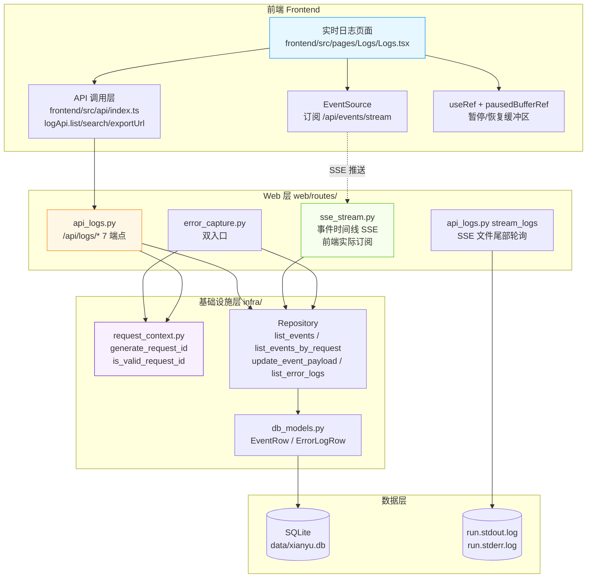
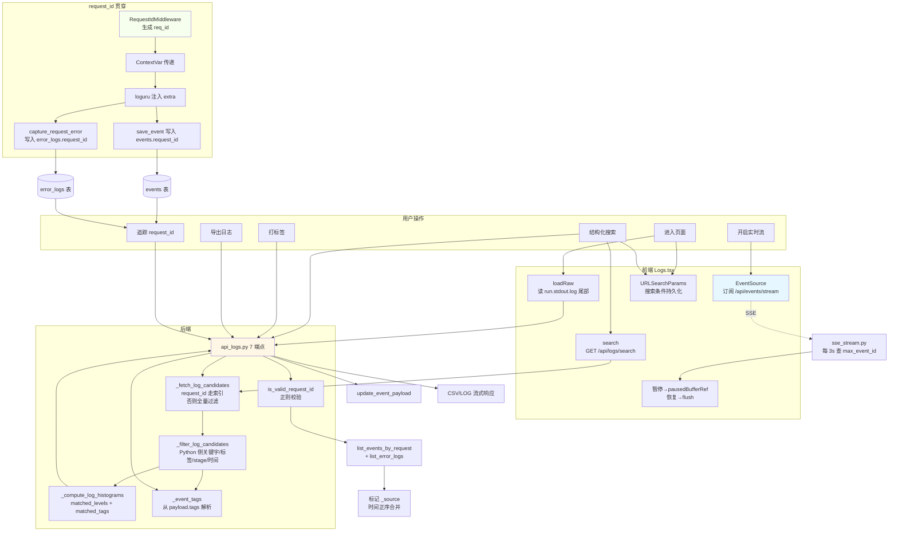
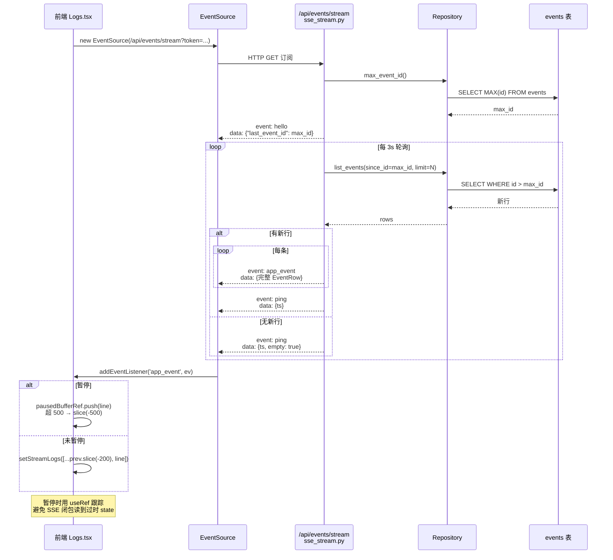
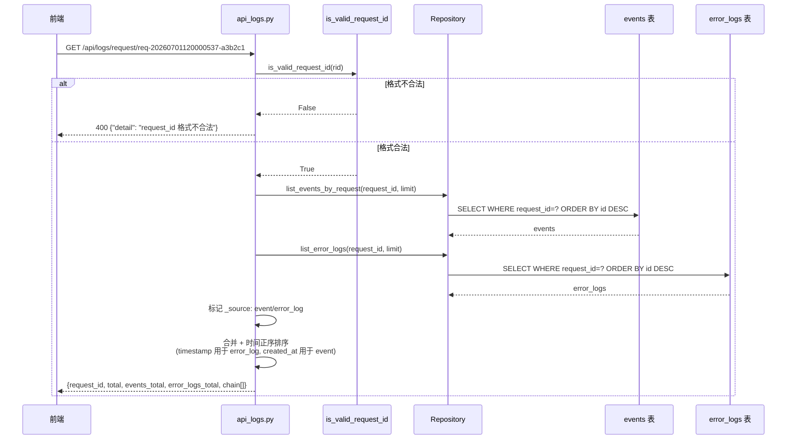
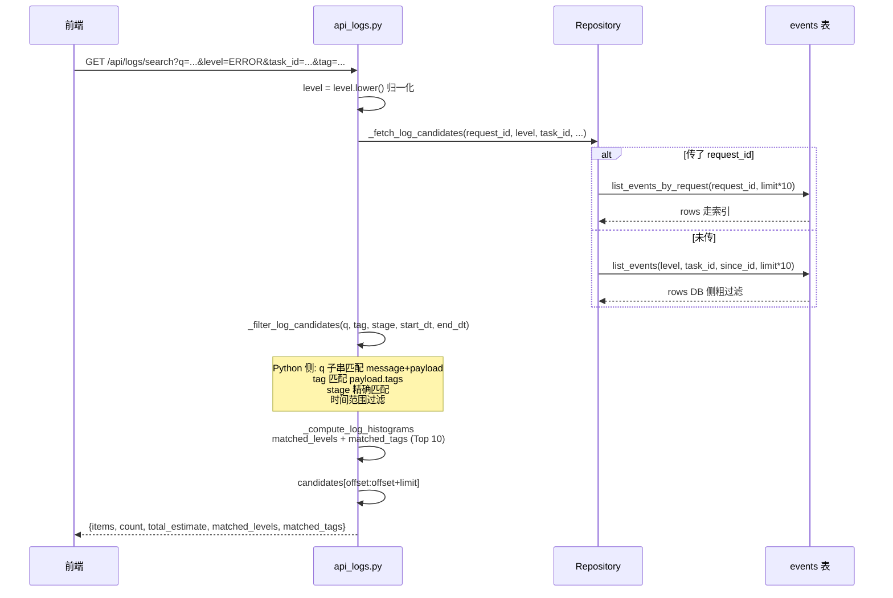
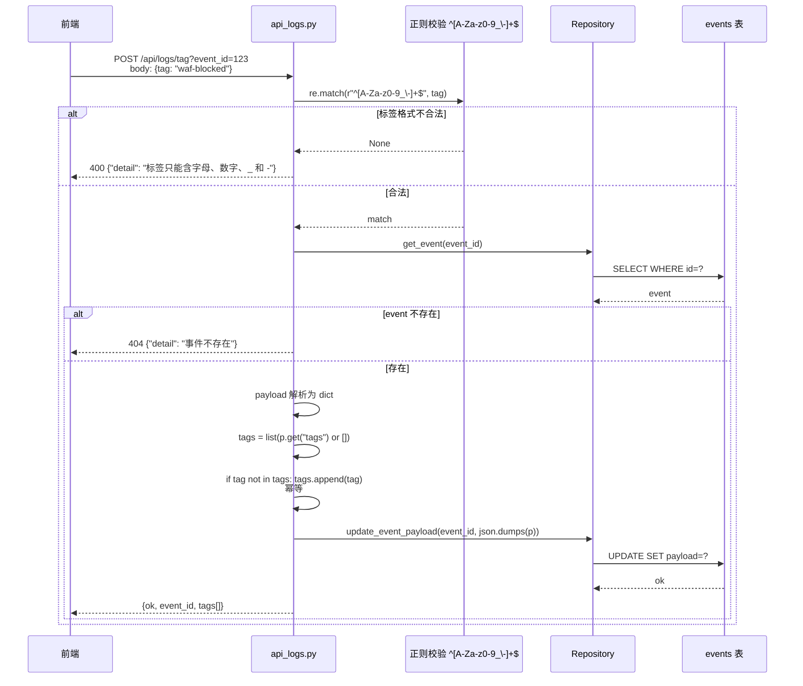

# 闲鱼猎人「实时日志」模块需求规格说明书

| 项 | 内容 |
|---|---|
| 文档版本 | v1.0 |
| 文档日期 | 2026-07-05 |
| 文档状态 | 初版（与详细设计 v2.0 对齐） |
| 所属项目 | 闲鱼猎人（XianyuHunter） |
| 所属菜单 | 数据查看 → 实时日志 |
| 菜单标识 | `menu_registry.yaml` 中 `key=logs`、`icon=FileTextOutlined`、`sort_order=15`、`category=data_view` |
| 关联路由 | 前端 `/logs`；后端 `/api/logs/*`（列表/搜索/标签/导出/文件 SSE/全链路追踪 共 7 端点）；事件时间线 SSE `/api/events/stream`（前端 Logs.tsx 实际订阅） |
| 关联文档 | [实时日志-详细设计.md](实时日志-详细设计.md)（v2.0/2026-07-05） |
| 文档类型 | 需求规格说明书（SRS） |

> **本文档首段：继承 project_memory.md 中的硬约束。** 下文 §1.3.3 显式列出适用项与映射实现要点；本节先做总览：
> 1. **Web 进程必须使用 `with_browser=False` 模式**——本模块不依赖浏览器子进程；`Container` 通过 `get_container()` 在 Web 进程注入。
> 2. **认证白名单机制**——`/api/logs/*` 全部需通过现有 `auth.py` 认证中间件，不加入白名单。
> 3. **前端 fetch 必须含 `credentials: 'include'`**——`frontend/src/api/index.ts` 的 `logApi` 沿用 `client` 默认配置。
> 4. **401 必须返回 JSON `{"detail":"Unauthorized"}`**——`api_logs.py` 走 FastAPI `HTTPException` 路径，符合规范。
> 5. **token 比较使用 `hmac.compare_digest()`**——`is_valid_request_id()` 不依赖对称密钥，使用正则校验格式以防客户端伪造 X-Request-Id 注入日志。
> 6. **敏感字段不日志**——错误捕获的 `_SENSITIVE_HEADERS`（authorization/cookie/xh_token/set-cookie）值替换为 `***`；events 表 payload 不会落入 token 等敏感字段。
> 7. **token 写失败触发 `logging.warning()`**——`_save_error_log` 写入失败时 `logger.error` 记录但不抛异常。
> 8. **模块级 import**——`api_logs.py` / `error_capture.py` / `request_context.py` 顶层 import 已对齐，无函数内冗余 import。
> 9. **DB 索引**——`events.request_id` 与 `error_logs.request_id` 单列索引已建（`init_db` 增量迁移），`ix_events_task_created` 联合索引支撑 Dashboard 时间线核心查询。
> 10. **COUNT 查询 CASE WHEN 聚合**——本模块无 COUNT 类聚合需求；统计直方图（`matched_levels` / `matched_tags`）在 Python 侧 dict 累加。
> 11. **WebView2 子进程 `CREATE_NEW_CONSOLE`**——本模块不涉及浏览器子进程。
> 12. **WebView2 `private_mode=False` + 独立 `storage_path`**——本模块不涉及浏览器子进程。

---

## 目录

- [0. 阶段交接声明](#0-阶段交接声明)
- [1. 引言](#1-引言)
  - [1.1 编写目的](#11-编写目的)
  - [1.2 项目背景](#12-项目背景)
  - [1.3 范围与约束](#13-范围与约束)
  - [1.4 术语与缩写](#14-术语与缩写)
  - [1.5 参考资料](#15-参考资料)
- [2. 总体描述](#2-总体描述)
  - [2.1 产品定位](#21-产品定位)
  - [2.2 用户角色与特征](#22-用户角色与特征)
  - [2.3 运行环境](#23-运行环境)
  - [2.4 设计约束](#24-设计约束)
  - [2.5 假设与依赖](#25-假设与依赖)
- [3. 总体架构设计](#3-总体架构设计)
  - [3.1 模块架构图](#31-模块架构图)
  - [3.2 数据流程图](#32-数据流程图)
  - [3.3 关键时序图](#33-关键时序图)
  - [3.4 模块分层与职责](#34-模块分层与职责)
- [4. 功能需求](#4-功能需求)
  - [FR-1 日志列表（events 表）](#fr-1-日志列表events-表)
  - [FR-2 日志级别（5 种枚举）](#fr-2-日志级别5-种枚举)
  - [FR-3 事件严重度（非日志级别）](#fr-3-事件严重度非日志级别)
  - [FR-4 request_id 全链路追踪](#fr-4-request_id-全链路追踪)
  - [FR-5 SSE 实时日志流（两条独立通道）](#fr-5-sse-实时日志流两条独立通道)
  - [FR-6 错误捕获双入口](#fr-6-错误捕获双入口)
  - [FR-7 request_id 聚合查询](#fr-7-request_id-聚合查询)
  - [FR-8 结构化搜索](#fr-8-结构化搜索)
  - [FR-9 行级标签管理](#fr-9-行级标签管理)
  - [FR-10 日志导出（CSV/LOG）](#fr-10-日志导出csvlog)
  - [FR-11 与错误日志菜单的边界](#fr-11-与错误日志菜单的边界)
- [5. 接口定义](#5-接口定义)
- [6. 数据模型](#6-数据模型)
- [7. 性能指标](#7-性能指标)
- [8. 安全要求](#8-安全要求)
- [9. 前端设计](#9-前端设计)
- [10. 部署与集成](#10-部署与集成)
- [11. 验收标准](#11-验收标准)
- [12. 附录](#12-附录)

---

## 0. 阶段交接声明

```
- 当前阶段：实时日志 SRS 编写（v1.0） ✅ 已完成
- 下一阶段：错误日志 SRS 编写 / 数据查看菜单 SRS 汇总校验
- 下一阶段智能体：主智能体
- 下一阶段技能：通用（无）
- 交接上下文：
  · 本文档定义「数据查看 → 实时日志」二级菜单完整需求 v1.0
  · 关键设计决策：双面板布局（搜索 + 原始/实时流）+ 7 个 API 端点 + events 表（10 字段，无独立 logs 表）
  · 两条独立 SSE 通道澄清：实时日志页前端实际订阅 /api/events/stream（事件时间线），/api/logs/stream 是文件尾部轮询通道
  · request_id 格式：req-<17位数字>-<6位hex>，由 infra/request_context.py 生成
  · 错误捕获双入口：capture_request_error（HTTP）+ capture_background_error（后台）
  · /api/logs/request/{request_id} 聚合 events + error_logs 两表
  · 标签机制：存 payload.tags 数组（零迁移），正则 ^[A-Za-z0-9_\-]+$ 校验
  · 暂停/恢复缓冲区：useRef 跟踪状态，pausedBufferRef 上限 500，flush 上限 200
  · 菜单 key=logs、path=/logs、sort_order=15、category=data_view
  · 继承 project_memory.md 全部硬约束（首段已枚举 12 项适用映射）
```

---

## 1. 引言

### 1.1 编写目的

本需求规格说明书定义「数据查看 → 实时日志」二级菜单的完整需求规格，作为前端/后端开发、测试与验收的唯一依据。

**目标读者**：
- 后端开发工程师：依据 §3-§6、§8、§10 进行模块实现与扩展
- 前端开发工程师：依据 §4、§9 进行页面开发
- 测试工程师：依据 §7、§11 编写测试用例与执行验收
- 项目经理：依据 §2、§11 进行范围与里程碑管理
- 智能客服 KB 训练：本文档与 [实时日志-详细设计.md](实时日志-详细设计.md) 共同作为 KB 检索素材

### 1.2 项目背景

闲鱼猎人（XianyuHunter）是一个闲鱼自动捡漏与抢单工具，已具备任务管理、商品采集、AI 评估、自动下单、多渠道通知等完整能力（详见 [requirements.md](../requirements.md)、[design.md](../design.md) 与 [概要设计文档.md](../概要设计文档.md)）。

随着系统运行规模扩大，**运行日志与异常处理在多模块分散埋点，缺乏统一的检索/订阅/追踪入口**，导致以下痛点：

| 痛点 | 现状 | 影响 |
|------|------|------|
| 日志仅文件尾部可见 | 用户只能从 `run.stdout.log` / `run.stderr.log` 文件 `tail -f` | 不知道哪些事件已落库，无法结构化检索 |
| 任务异常无全链路视图 | 一次请求经过中间件→业务逻辑→DB→外部服务，无法串联 | 排障时只能挨个模块看日志 |
| 关键事件无法标注 | 业务逻辑无标签机制 | WAF 拦截、关键单子等重要事件无法分类筛选 |
| 日志无法离线分析 | 只能本地看文件 | 交接给同事/AI 助手分析需要手动复制粘贴 |
| 错误日志与业务事件割裂 | 异常单独存在 error_logs 表，与 events 表无关联 | 同一请求的"成功步骤 + 失败原因"需要分别查两处 |

**解决方案**：新增「实时日志」二级菜单，提供 **结构化搜索 events 表 + SSE 实时事件流订阅 + 行级标签 + CSV/LOG 导出 + request_id 全链路追踪** 五大能力。request_id 全局流水号 `req-<17位数字>-<6位hex>` 由 `infra/request_context.py` 生成，通过 `contextvars.ContextVar` 异步安全传递，贯穿 events 与 error_logs 两表，**让运维可检索、链路可追踪、关键事件可标注、日志可交接**。

### 1.3 范围与约束

#### 1.3.1 包含范围（In-Scope）

- 实时日志列表（`GET /api/logs`，支持 `source=file|db` 双模式）
- 结构化搜索 events 表（`GET /api/logs/search`，含关键字/级别/任务ID/标签/时间范围/since_id 增量）
- 行级标签管理（`POST /api/logs/tag` 打标签 + `DELETE /api/logs/tag` 删标签）
- 日志导出（`GET /api/logs/export`，CSV/LOG 双格式）
- SSE 文件尾部轮询（`GET /api/logs/stream`，供后台排障用，按 request_id 过滤）
- request_id 全链路追踪（`GET /api/logs/request/{request_id}`，聚合 events + error_logs 两表）
- 前端 Logs.tsx 双面板布局（结构化搜索 + 原始日志/实时流）
- 实时流暂停/恢复缓冲区（前端 useRef 跟踪 + pausedBufferRef 缓存 500 条上限）
- request_id 全局流水号生成与 ContextVar 传递
- 错误捕获双入口（`capture_request_error` + `capture_background_error`）

#### 1.3.2 排除范围（Out-of-Scope）

- 不实现独立 `logs` 表（events 表已是结构化日志的事实源）
- 不实现独立的"错误日志"功能（由独立菜单 `error_logs` 覆盖，路径 `/logs/errors`）
- 不实现 AI 自动诊断（error_logs 的 `ai_context_json/md` 已由 `error_capture.py` 生成，本模块仅读取 request_id 关联）
- 不实现日志归档/压缩/分桶（events 表增长由 DB 维护承担）
- 不实现日志 WebSocket 通道（SSE 已满足实时推送需求）
- 不实现行内编辑消息内容（仅支持打标签）

#### 1.3.3 硬约束

继承 [project_memory.md](c:/Users/hspcadmin/.trae-cn/memory/projects/-d-code-otherProjects-17-xianyu/project_memory.md) 中的项目硬约束，并显式映射到本模块实现：

| 硬约束 | 本模块适用性 | 实现要点 |
|--------|--------------|----------|
| Web 进程使用 `with_browser=False` 模式 | 适用 | `Container` 通过 `get_container()` 在 Web 进程注入；不启浏览器子进程 |
| 认证白名单（`/api/auth/cookie` 等） | 不适用 | `/api/logs/*` **必须**走 `auth.py` 认证，不加入白名单 |
| 前端 fetch 必须含 `credentials: 'include'` | 适用 | `frontend/src/api/index.ts` 的 `logApi` 全量沿用 `client` 默认配置 |
| htmx 用官方 `<meta>` 配置 credentials | 不适用 | 实时日志前端使用 React + fetch + EventSource（htmx 不适用） |
| 401 响应必须返回 JSON `{"detail":"Unauthorized"`} | 适用 | `api_logs.py` 路由层 `HTTPException` 走 FastAPI 默认错误处理 |
| 后端 token 比较使用 `hmac.compare_digest()` | 不适用 | `is_valid_request_id()` 使用正则 `^[A-Za-z0-9_\-]+$` 校验格式以防 X-Request-Id 注入 |
| 敏感字段（token 长度等）不日志 | 适用 | `_sanitize_headers` 对 authorization/cookie/xh_token/set-cookie 脱敏；events.payload 不落敏感字段 |
| token 写失败触发 `logging.warning()` | 适用 | `_save_error_log` 写入失败时 `logger.error`（不抛异常），保证主流程不被错误日志写入阻塞 |
| 缺失 import 必须 module-level | 适用 | `api_logs.py` / `error_capture.py` / `request_context.py` 全部模块级 import |
| DB 必须在 `task_id/seller_id/...` 加索引 | 适用 | events 表已有 `ix_events_task_created`（task_id+created_at）/ `ix_events_request_id` 索引 |
| COUNT 查询用 CASE WHEN 聚合 | 不适用 | 本模块无 COUNT 聚合；直方图在 Python 侧 dict 累加 |
| WebView2 子进程使用 `CREATE_NEW_CONSOLE` | 不适用 | 本模块不涉及浏览器子进程 |
| WebView2 `webview.start()` 设 `private_mode=False` + 独立 `storage_path` | 不适用 | 本模块不涉及浏览器子进程 |
| KBManager 排除 `web/static/` 等目录 | 不适用 | 本模块不涉及 KB 索引 |
| `local_embedding.py` HF_ENDPOINT 设置 | 不适用 | 本模块不涉及 embedding |
| EmbeddingService 本地后端 | 不适用 | 同上 |
| sentence-transformers 跨版本兼容 | 不适用 | 同上 |
| `run_migrations` 各块独立 try/except | 适用 | `init_db` 中 `_migrate_add_column` 幂等迁移 events/error_logs.request_id + 索引 |
| 启动钩子异常 `logger.exception()` | 适用 | `Container` 初始化失败时 `logger.error` 记录，不阻断 Web 启动 |

### 1.4 术语与缩写

| 术语 | 全称 | 说明 |
|------|------|------|
| events 表 | Events Table | 业务事件结构化日志表，与时间线菜单共享 |
| error_logs 表 | Error Logs Table | 异常日志表（17 字段，**无 updated_at**），由独立错误日志菜单覆盖 |
| request_id | Request Identifier | 全局流水号 `req-<17位数字>-<6位hex>` |
| request_id token | request_id token | 日志行中 `[req=xxx]` 标识，文件 SSE 流按此过滤 |
| level | Log Level | 日志级别：`debug`/`info`/`warn`/`err`/`trace`（**无 CRITICAL**） |
| severity | Event Severity | 事件严重度：`info`/`warning`/`error`/`critical`（**不是日志级别**） |
| CRITICAL | Critical Severity | 事件严重度枚举值，用于通知免打扰决策；**不是日志级别** |
| EVENT_SEVERITY | Event Severity Enum | 事件严重度枚举，定义于通知模块 |
| SSE | Server-Sent Events | 服务端推送协议（`text/event-stream`） |
| EventSource | Browser EventSource API | 浏览器原生 SSE 客户端 API |
| app_event | Custom SSE Event Type | 后端 `/api/events/stream` 自定义事件类型，**不触发 onmessage**，必须用 `addEventListener('app_event', ...)` |
| pausedBufferRef | React useRef | 暂停期间 SSE 日志暂存，上限 500 条 |
| payload.tags | Payload Tags | events.payload JSON 数组字段，存用户自定义标签（零迁移设计） |
| ContextVar | contextvars.ContextVar | 异步安全上下文变量，request_id 通过此传递 |
| loguru | Loguru | Python 结构化日志库，通过 patcher 钩子注入 request_id |
| since_id | Since Event ID | 增量查询起点，SSE 断线回放同款 |
| 幂等标签 | Idempotent Tag | 重复打同一标签不重复添加；删除不存在标签返回成功 |
| WAL | Write-Ahead Log | SQLite 预写日志 |
| LRU | Least Recently Used | 缓存淘汰策略（本模块不涉及） |
| LAYER_DEFINITIONS | Layer Definitions | 反爬登录管理定义（**本模块不涉及**，仅作术语对照） |
| m5tk | `_m_h5_tk` | 闲鱼 MTOP token（**本模块不涉及**，仅作术语对照） |

### 1.5 参考资料

| 文档 | 路径 | 用途 |
|------|------|------|
| 需求文档 v1.0 | [../requirements.md](../requirements.md) | 系统整体需求基线 |
| 概要设计文档 v2.0 | [../概要设计文档.md](../概要设计文档.md) | 36 个 API 路由、11 张数据表、技术选型 |
| 技术设计说明书 | [../design.md](../design.md) | 分层架构、Evaluator 设计、状态机 |
| 实时日志 详细设计 v2.0 | [实时日志-详细设计.md](实时日志-详细设计.md) | 本模块技术设计、代码位置、FAQ |
| 米其林设计系统 | [../standards/michelin-design-system.md](../standards/michelin-design-system.md) | UI 设计规范、色彩字体系统 |
| 反爬登录管理 SRS | [../04-系统维护/反爬登录管理-需求规格.md](../04-系统维护/反爬登录管理-需求规格.md) | SRS 模板参考（12 章节完整版） |
| 错误日志 SRS | [错误日志-需求规格.md](错误日志-需求规格.md) | 兄弟文档（同菜单下独立条目） |
| 项目硬约束 | [project_memory.md](c:/Users/hspcadmin/.trae-cn/memory/projects/-d-code-otherProjects-17-xianyu/project_memory.md) | 必须继承的硬约束清单 |
| 菜单元数据 | [../../config/menu_registry.yaml](../../config/menu_registry.yaml) | `key=logs`、`sort_order=15` |
| 实时日志 后端 | [../../backend/xianyu_hunter/web/routes/api_logs.py](../../backend/xianyu_hunter/web/routes/api_logs.py) | 7 个端点（list/search/tag/untag/export/stream/request_chain） |
| 实时日志 前端页面 | [../../frontend/src/pages/Logs/Logs.tsx](../../frontend/src/pages/Logs/Logs.tsx) | 双面板 + 暂停/恢复 + SSE 订阅 |
| 实时日志 前端 API | [../../frontend/src/api/index.ts](../../frontend/src/api/index.ts) | `logApi.list`/`logApi.search`/`logApi.exportUrl` |
| 错误捕获中间件 | [../../backend/xianyu_hunter/web/middleware/error_capture.py](../../backend/xianyu_hunter/web/middleware/error_capture.py) | `capture_request_error` + `capture_background_error` 双入口 |
| request_id 上下文 | [../../backend/xianyu_hunter/infra/request_context.py](../../backend/xianyu_hunter/infra/request_context.py) | `generate_request_id` / `is_valid_request_id` |
| EventRow 模型 | [../../backend/xianyu_hunter/infra/db_models.py](../../backend/xianyu_hunter/infra/db_models.py) | 第 194 行 events 表定义 |
| 事件时间线 SSE | [../../backend/xianyu_hunter/web/routes/sse_stream.py](../../backend/xianyu_hunter/web/routes/sse_stream.py) | `/api/events/stream` 路由（前端实际订阅） |
| 级别颜色映射 | [../../frontend/src/constants/logLevels.ts](../../frontend/src/constants/logLevels.ts) | `LEVEL_COLOR` 常量 |

---

## 2. 总体描述

### 2.1 产品定位

「实时日志」是闲鱼猎人系统的**结构化事件日志运维入口**，定位为：

> 提供 events 表结构化搜索 + SSE 实时事件流订阅 + 行级标签 + CSV/LOG 导出 + request_id 全链路追踪五大能力，让用户在一个页面里完成"实时排查任务异常 / 搜索历史日志 / 追踪单次请求全链路 / 导出日志交接 / 给关键事件打标签"全流程操作。

**核心价值**：
1. **结构化可检索**：events 表 10 字段（id/type/task_id/item_id/stage/level/message/payload/created_at/request_id）支持关键字+级别+任务ID+标签+时间范围组合查询
2. **实时可订阅**：前端 Logs.tsx 订阅 `/api/events/stream`（事件时间线 SSE），按 3s 增量推送 events 表数据，支持暂停/恢复与 500 条缓冲区管理
3. **行级可标注**：通过 `payload.tags` 数组存储标签（零迁移），正则 `^[A-Za-z0-9_\-]+$` 校验，支持按 `tag=` 过滤检索同类事件
4. **全链路可追踪**：request_id 全局流水号贯穿 events + error_logs 两表，`/api/logs/request/{request_id}` 一次性聚合完整调用链路
5. **可离线交接**：CSV（Excel/Numbers 友好）+ LOG（原始文件拼接）双格式导出

### 2.2 用户角色与特征

| 角色 | 特征 | 使用场景 | 关注重点 |
|------|------|----------|----------|
| 实时排障用户 | 任务刚出现异常 | 开启实时流 → 暂停读堆栈 → 恢复继续 | SSE 实时流、暂停/恢复、缓冲区 |
| 历史日志查询 | 事后回溯 | 按时间范围+级别+任务ID 搜索 | 结构化搜索、级别分布、Top stage |
| 单次请求追踪 | 拿到一个 request_id | 调用 `/api/logs/request/...` 聚合两表 | 全链路追踪、来源表标记 |
| 日志交接 | 需离线分析 | 导出 CSV 给同事/AI 助手 | CSV/LOG 双格式、文件名时间戳 |
| 运维标注 | 给关键事件打 tag | `POST /api/logs/tag?event_id=X&tag=Y` | 标签管理、tag 过滤 |
| 二次开发者 | 自定义事件类型 | 参考 events 表 schema + payload 约定 | payload JSON 扩展字段、tags 数组 |

### 2.3 运行环境

| 项 | 要求 |
|---|---|
| 操作系统 | Windows 10/11（主），Linux/macOS 兼容 |
| Python | 3.11+ |
| Node.js | 18+（仅前端构建） |
| 后端框架 | FastAPI（已集成） |
| 前端框架 | React 18 + TypeScript + Ant Design 5（已集成） |
| 数据库 | 复用现有 SQLite（events + error_logs + tasks/items 等） |
| 日志文件 | `run.stdout.log` / `run.stderr.log`（位于进程工作目录 `os.getcwd()`） |
| SSE 客户端 | 浏览器原生 `EventSource` API（自动重连） |

### 2.4 设计约束

1. **集成部署**：作为 `backend/xianyu_hunter/web/routes/api_logs.py` 路由 + `frontend/src/pages/Logs/Logs.tsx` 页面集成到现有系统，不独立部署
2. **复用 events 表**：events 表是结构化日志的事实源（与时间线菜单共享），不存在独立 `logs` 表
3. **写 POST 读 GET**：与现有 REST 规范对齐
4. **SSE 流式响应**：`/api/logs/stream`（文件轮询）与 `/api/events/stream`（事件表推送）是两条独立通道，端点、数据格式、用途均不同
5. **聚合查询**：request_id 全链路追踪端点需聚合 events + error_logs 两表，标记来源表后时间正序合并
6. **payload JSON 兼容**：events.payload 可能是 dict 也可能是 str，`payload_text` 工具函数统一处理
7. **历史数据兼容**：events.request_id 为 `nullable=True`，迁移前的老数据 request_id 为 NULL
8. **健壮性兜底**：JSON 解析失败时 tags 视为空列表；payload 字段缺失返回 `[]`/`""` 兜底
9. **标签零迁移**：标签存在 `payload.tags` 数组，不引入独立列
10. **request_id 格式校验**：`is_valid_request_id()` 防止客户端伪造任意字符串通过 X-Request-Id 头注入日志

### 2.5 假设与依赖

**假设**：
- 用户已部署闲鱼猎人 v2.x+ 并能访问 `MainLayout` 侧边栏
- 系统已配置 SQLite 数据库（`data/xianyu.db`）且 `events` 表已存在
- 业务逻辑（任务调度/评估/抢单等）已通过 `save_event` 写入 events 表
- 错误捕获中间件已挂载到 FastAPI app

**依赖**：
- 依赖现有 `Container` 单例（`get_container()`）
- 依赖现有 `auth.py` 认证中间件
- 依赖现有 `Repository` 实现的 `list_events`/`list_events_by_request`/`get_event`/`update_event_payload`/`list_error_logs`/`save_error_log`
- 依赖现有 `request_context.py` 的 `generate_request_id` / `is_valid_request_id` / `get_request_id` / `set_request_id`
- 依赖现有 `error_capture.py` 的 `capture_request_error` / `capture_background_error`
- 依赖现有 `menu_registry.yaml` 菜单注册（已配置 `key=logs`）
- 依赖现有 SSE 客户端 `EventSource` 浏览器 API
- 依赖现有事件时间线 SSE 路由 `/api/events/stream`（前端实际订阅）
- 新增无外部依赖

---

## 3. 总体架构设计

### 3.1 模块架构图



### 3.2 数据流程图



### 3.3 关键时序图

#### 3.3.1 实时日志双通道时序（前端订阅 /api/events/stream）



#### 3.3.2 request_id 全链路追踪时序



#### 3.3.3 结构化搜索时序



#### 3.3.4 打标签时序



### 3.4 模块分层与职责

遵循项目现有 DDD 分层架构（见 [概要设计文档](../概要设计文档.md) §3）：

| 层级 | 模块 | 职责 |
|------|------|------|
| **Web 层** | `api_logs.py` | 实时日志 API 路由（7 端点：list/search/tag/untag/export/stream/request_chain） |
| | `sse_stream.py` | 事件时间线 SSE 路由（前端 Logs.tsx 实际订阅） |
| | `error_capture.py` | `capture_request_error` + `capture_background_error` 双入口 + AI 上下文生成 |
| **基础设施层** | `request_context.py` | request_id 生成 / ContextVar 传递 / 格式校验 |
| | `db_models.py` | `EventRow`（10 字段）/ `ErrorLogRow`（17 字段，无 updated_at） |
| | `repo_events.py` | `list_events` / `list_events_by_request` / `max_event_id` / `get_event` / `update_event_payload` |
| | `repo_error_logs.py` | `list_error_logs` / `save_error_log` |
| **前端** | `pages/Logs/Logs.tsx` | 双面板 + 暂停/恢复 + EventSource 订阅 |
| | `api/index.ts` | `logApi.list` / `logApi.search` / `logApi.exportUrl` |
| | `constants/logLevels.ts` | `LEVEL_COLOR` 颜色映射 |

---

## 4. 功能需求

### FR-1 日志列表（events 表）

**FR-1.1** 提供 `GET /api/logs` 端点读取日志，**核心事实**：实时日志查询的是 `events` 表（10 字段），**不存在独立 `logs` 表**。

**FR-1.2** `source` 参数支持双模式：
- `source=file`（默认）：读取 `run.stdout.log` + `run.stderr.log` 尾部 `limit` 行，返回 `{ items: [{file, lines[]}], count, source }`
- `source=db`：调用 `container.repo.list_events(limit=limit)` 返回 events 表结构化数据

**FR-1.3** `limit` 参数范围 `1-2000`，默认 200，控制返回行数上限。

**FR-1.4** 前端初始加载（`useEffect` → `loadRaw`）默认以 `source=file` 拉取原始日志文件尾部 200 行用于"原始日志"面板。

**FR-1.5** events 表字段映射（响应 `items[]` 中每条记录的字段）：
| 字段 | 类型 | 说明 |
|------|------|------|
| `id` | int | 主键（SSE 断线回放游标） |
| `type` | string | 事件类型（如 `task.search_done`/`eval.scored`/`buy.succeeded`） |
| `task_id` | string | 关联任务 ID |
| `item_id` | string | 关联商品 ID |
| `stage` | string | 事件阶段（`search`/`eval`/`buy`/`dep_triggered`） |
| `level` | string | 日志级别（小写：`info`/`debug`/`err`/`warn`/`trace`） |
| `message` | string | 日志消息文本 |
| `payload` | string | JSON 字符串，含 tags 数组与扩展字段 |
| `created_at` | datetime | 创建时间（UTC） |
| `request_id` | string | 全局流水号（nullable 兼容历史数据） |

**FR-1.6** 索引支撑：
- 单列索引：`type` / `task_id` / `item_id` / `created_at` / `request_id`
- 联合索引：`ix_events_task_created`（`task_id` + `created_at`，Dashboard 时间线核心查询路径）

### FR-2 日志级别（5 种枚举）

**FR-2.1** events 表 `level` 字段统一存**小写**，前端展示大写：

| 枚举值（DB 存储） | 前端展示 | 颜色映射（LEVEL_COLOR） | 说明 |
|-----------------|---------|---------------------|------|
| `debug` | DEBUG | default（灰） | 调试信息 |
| `info` | INFO | blue（蓝） | 常规运行信息（默认兜底） |
| `warn` | WARNING | orange（橙） | 警告 |
| `err` | ERROR | red（红） | 错误 |
| `trace` | TRACE | — | 极细粒度追踪（仅 API 层） |

**FR-2.2** **澄清：不存在 CRITICAL 日志级别**。`CRITICAL` 在本系统中是**事件严重度**（`EVENT_SEVERITY`，用于通知免打扰决策），不是日志级别。日志级别仅上述 5 种。

**FR-2.3** `search_logs` 的 `level` 参数 pattern 同时兼容大小写与同义词（`err`/`error`、`warn`/`warning`）：
```python
pattern=r"^(info|INFO|debug|DEBUG|err|ERR|error|ERROR|warn|WARN|warning|WARNING|trace|TRACE)$"
```

**FR-2.4** 函数入口 `level = level.lower()` 归一化匹配 DB 中的小写值。

**FR-2.5** `level` 字段缺失时归入 `"info"`（早期日志未写 level 字段，info 是最通用的兜底）。

### FR-3 事件严重度（非日志级别）

**FR-3.1** 事件严重度是**事件的属性**，不是日志级别。事件严重度枚举：
- `info`：常规
- `warning`：警告
- `error`：错误
- `critical`：严重

**FR-3.2** **关键澄清**：`EVENT_SEVERITY` 用于通知免打扰决策，**与 `level` 字段不重叠**。例如 `level=err`（错误）的常规事件严重度可能仍是 `info`；而 `level=info` 的高优先级告警可能严重度是 `critical`。

**FR-3.3** 本模块（实时日志）**不暴露**事件严重度字段的查询/过滤。事件严重度由通知中心（`/notifications`）处理。

### FR-4 request_id 全链路追踪

**FR-4.1** request_id 格式：`req-<17位数字>-<6位hex>`，示例 `req-20260701120000537-a3b2c1`
- 前缀 `req`：肉眼识别与正则提取友好
- 17 位数字：UTC 时间 `YYYYMMDDHHMMSSfff`（毫秒级，保证有序性）
- 6 位 hex：`secrets.token_hex(3)` 生成（16^6=16.7M 分之一碰撞概率）

**FR-4.2** 生成函数（`infra/request_context.py:31`）：
```python
def generate_request_id() -> str:
    with _gen_lock:  # threading.Lock 防止时间戳回拨
        ts = datetime.now(timezone.utc).strftime("%Y%m%d%H%M%S%f")[:-3]
        rand = secrets.token_hex(3)
        return f"{_REQUEST_ID_PREFIX}-{ts}-{rand}"
```

**FR-4.3** 上下文传递：
- 使用 `contextvars.ContextVar` 异步安全传递，兼容 asyncio 与任意线程
- `set_request_id` / `get_request_id` / `clear_request_id` 三组 API 管理生命周期
- loguru 通过 patcher 钩子读取 ContextVar，自动注入到每条日志的 extra 字段
- `new_request_scope()` / `reset_request_scope()` 用于后台任务、调度器等非 HTTP 场景显式开启追踪作用域

**FR-4.4** 格式校验（`is_valid_request_id`，`infra/request_context.py:93`）：
```python
def is_valid_request_id(rid: str | None) -> bool:
    # 防止客户端伪造任意字符串通过 X-Request-Id 头注入日志
    # 合法格式：req-<17位数字>-<6位hex>
```
- 必须以 `req-` 开头
- 3 段以 `-` 分隔
- 第 2 段 17 位纯数字
- 第 3 段 6 位 hex（`int(rand, 16)` 不抛异常）

**FR-4.5** request_id 贯穿链路：
1. HTTP 请求入口（`RequestIdMiddleware` 注入到 `request.state`）
2. 业务逻辑日志（写入 events 表 `request_id` 列）
3. 异常日志（`capture_request_error` 显式传入 error_logs 表 `request_id` 列）
4. 后台任务（`capture_background_error` 从 context 或 ContextVar 读取）
5. 全链路追踪端点（聚合 events + error_logs 两表）

**FR-4.6** `/api/logs/request/{request_id}` 端点调用 `is_valid_request_id()`，不合法返回 400 + `{"detail": "request_id 格式不合法"}`。

### FR-5 SSE 实时日志流（两条独立通道）

**FR-5.1** **关键澄清**：系统中存在两条独立的 SSE 通道，端点、数据格式、用途均不同，**不可混淆**：

| 维度 | `/api/logs/stream`（文件 SSE） | `/api/events/stream`（事件时间线 SSE） |
|------|-------------------------------|--------------------------------------|
| 文件 | `web/routes/api_logs.py:405` | `web/routes/sse_stream.py:53` |
| 数据来源 | `run.stdout.log` 文件尾部轮询（每 2s diff） | `events` 表增量（每 3s 查 max_event_id） |
| 事件类型 | `log` / `ping` / `error` | `app_event` / `hello` / `ping` / `warn` / `error` |
| 数据格式 | `{"line": "原始日志行文本"}` | 完整 EventRow dict |
| 断线回放 | 不支持 | 支持（Last-Event-ID / last_event_id Query） |
| 连接数限制 | 无 | 上限 10（`_MAX_SSE_CONNECTIONS`） |
| request_id 过滤 | 支持（Query 参数，从 `[req=xxx]` token 解析） | 不支持（推送所有 events） |
| 前端使用 | **实时日志页未使用** | **实时日志页实际订阅**（Logs.tsx 第 64 行） |

**FR-5.2** 前端 Logs.tsx 实际订阅 `/api/events/stream`（FR-5.3 实现）。`/api/logs/stream` 是文件轮询通道，供后台排障用，**实时日志页前端不订阅此端点**。

**FR-5.3** 前端实时流订阅（`frontend/src/pages/Logs/Logs.tsx:64`）：
```typescript
const url = `/api/events/stream?token=${encodeURIComponent(token)}`
const es = new EventSource(url)
es.addEventListener('app_event', (ev) => {
  const data = JSON.parse(ev.data) as LogEntry
  const line = data.message ? `[${data.level || 'info'}] ${data.message}` : ev.data
  // 暂停时缓存到 pausedBufferRef，否则追加到 streamLogs
})
```

**FR-5.4** 关键点：后端 `/api/events/stream` 推送的 `app_event` 事件类型是自定义类型，**不会触发 `onmessage`**，必须用 `addEventListener('app_event', ...)` 接收。

**FR-5.5** 文件 SSE 实现（`/api/logs/stream`）：
- 每 2 秒轮询 `run.stdout.log` 文件尾部，diff 出新增行
- 通过 `_REQUEST_ID_PATTERN` 正则从日志行解析 `[req=xxx]` token，按 `request_id` 过滤
- 推送 `event: log`（含 line）/ `event: ping`（无新增时维持连接）/ `event: error`

**FR-5.6** 暂停/恢复缓冲区算法：
```typescript
const BUFFER_LIMIT = 500  // 暂停期间缓冲区上限
const DISPLAY_LIMIT = 200 // 显示列表上限
const pausedRef = useRef(false)
const pausedBufferRef = useRef<string[]>([])

function onLogEvent(line: string) {
  if (pausedRef.current) {
    pausedBufferRef.current.push(line)
    if (pausedBufferRef.current.length > 500) {
      pausedBufferRef.current = pausedBufferRef.current.slice(-500)
    }
  } else {
    setStreamLogs((prev) => [...prev.slice(-200), line])
  }
}

function onResume() {
  const buffered = pausedBufferRef.current.slice(-200)
  pausedBufferRef.current = []
  if (buffered.length > 0) {
    setStreamLogs((prev) => [...prev.slice(-Math.max(0, 200 - buffered.length)), ...buffered])
  }
  pausedRef.current = false
}
```

**FR-5.7** **设计要点**：用 `useRef` 跟踪暂停状态，避免 SSE 闭包中读到过时的 state；恢复时先 flush 缓冲区再解除暂停，避免新消息插入缓冲区消息之前。

**FR-5.8** SSE 错误处理：浏览器原生 `EventSource` 自动重连。`onerror` 回调时 `message.warning('日志流连接断开')` + 调 `stopStream()` 关闭连接。

### FR-6 错误捕获双入口

**FR-6.1** `capture_request_error`（HTTP 请求错误）：
- 供 `exception_handler.py` 的 `unhandled_exception_handler` 调用
- 从 `request.state.request_id` 读取流水号（兜底从 ContextVar 读取）
- 提取请求上下文：method / path / headers（脱敏）/ client_ip / user_agent / query_params
- 调用 `_save_error_log` 写入 error_logs 表

**FR-6.2** `capture_background_error`（后台任务错误）：
- 供 worker / scheduler 等后台任务调用
- 优先从 `context["request_id"]` 读取流水号，兜底从 ContextVar 读取
- `request_info` 标记 `method="BACKGROUND"`，`path=context.get("source", "unknown")`
- 用于关联 HTTP 请求触发的后台任务链路

**FR-6.3** 敏感信息脱敏（`_sanitize_headers`，`error_capture.py:28`）：
- 脱敏请求头（值替换为 `***`）：`authorization` / `cookie` / `xh_token` / `set-cookie`

**FR-6.4** AI 上下文双格式（两个入口均会生成）：
- JSON 格式（`ai_context_json`）：结构化，包含 error_type/error_message/stack_trace/environment/request/possible_causes
- Markdown 格式（`ai_context_md`）：人类可读报告，可直接粘贴给 AI 助手
- `possible_causes` 基于错误消息关键词推断（网络/权限/类型转换/键缺失/索引越界）

**FR-6.5** `_save_error_log` 写入失败时 `logger.error` 记录但不抛异常（不阻断主流程）。`return None` 标记写入失败。

**FR-6.6** request_id 显式传入：异常处理可能在 ContextVar 已被清理后触发（如中间件 finally 后），显式传参确保 request_id 不丢失。

### FR-7 request_id 聚合查询

**FR-7.1** `GET /api/logs/request/{request_id}` 是**全链路追踪核心端点**。

**FR-7.2** 完整调用链路展示：
```
HTTP 请求
  ├─ 中间件日志
  ├─ 业务逻辑日志（events）
  ├─ 数据库操作日志（events）
  ├─ 外部服务调用日志（events）
  ├─ 子请求/联动请求日志（events）
  └─ 异常日志（error_logs）
```

**FR-7.3** 执行流程：
1. 调用 `is_valid_request_id(request_id)` 校验格式，不合法返回 400
2. 分别从 events 与 error_logs 表查询同 request_id 的记录（单表上限 `limit`）
3. 标记来源表：`_source="event"` 或 `_source="error_log"`
4. 按 timestamp（error_logs）/ created_at（events）合并后**时间正序排序**
5. 返回 `{ request_id, total, events_total, error_logs_total, chain[] }`

**FR-7.4** 时间解析函数（`_parse_ts`）处理 `datetime` 对象和 ISO 字符串，解析失败时返回 `datetime.min`（不破坏排序）。

**FR-7.5** `limit` 参数范围 `1-5000`，默认 1000，控制单表返回行数上限。

### FR-8 结构化搜索

**FR-8.1** `GET /api/logs/search` 端点提供 events 表结构化查询。

**FR-8.2** 支持的查询参数：
| 参数 | 类型 | 说明 |
|------|------|------|
| `q` | string | 关键字（大小写不敏感子串匹配 message + payload） |
| `level` | string | 日志级别（pattern 同时兼容大小写与同义词） |
| `tag` | string | 标签名（payload.tags 含该标签） |
| `task_id` | string | 按 task_id 过滤 |
| `stage` | string | 按 stage 过滤 |
| `request_id` | string | 按 request_id 过滤（全链路追踪，**走索引**） |
| `start` | string | 起始时间 ISO 格式 |
| `end` | string | 截止时间 ISO 格式 |
| `since_id` | int (ge=0) | 增量查询起点（SSE 回放同款） |
| `limit` | int (1-500) | 默认 100 |
| `offset` | int (ge=0) | 分页偏移，默认 0 |

**FR-8.3** 执行流程（`_fetch_log_candidates` + `_filter_log_candidates`）：
1. 归一化 level 为小写（DB 存小写）
2. 拉取候选行：传入 `request_id` 时走 `list_events_by_request` **索引查询**（性能优）；否则走 `list_events` 全量过滤（DB 侧粗过滤 level/task_id/since_id）
3. Python 侧过滤：`q` 子串匹配 message+payload（大小写不敏感）、`tag` 匹配 payload.tags、`stage` 精确匹配、时间范围
4. 统计直方图：`matched_levels`（级别分布）+ `matched_tags`（Top 10 标签）
5. 分页返回 `items[offset:offset+limit]`

**FR-8.4** 响应字段：
- `items[]`：命中行（按 created_at desc）
- `count`：当前页命中数
- `total_estimate`：粗略总数（当前实现与 `count` 同值，前端用 `hasMore` 翻页，不依赖精确 total）
- `matched_levels`：级别直方图（按命中数倒序）
- `matched_tags`：标签直方图（Top 10）

**FR-8.5** Python 侧过滤必要性：DB 侧只能做 level/task_id 粗过滤，payload 内的 tag 和 message 子串匹配必须在 Python 侧完成（payload 是 JSON 字符串，SQLite 无原生 JSON 查询）。

**FR-8.6** 前端搜索条件持久化：query/level/task_id 同步到 URLSearchParams（`replace` 模式），刷新页面可恢复搜索条件。

**FR-8.7** 前端显示级别分布直方图 + Top stage 标签：基于 searchResults 统计 ERROR/WARNING/INFO/DEBUG 数量，用 `LEVEL_COLOR` 映射 Tag 颜色；统计 stage 频次展示 Top 3。

### FR-9 行级标签管理

**FR-9.1** **零迁移设计**：标签存在 `events.payload` JSON 字段的 `tags` 数组中，不引入独立列。

**FR-9.2** `POST /api/logs/tag` 端点给事件打标签：
- Query：`event_id`（ge=1）
- Body（embed）：`tag`（1-40 字符，仅字母数字_和-）
- `tag` 必须匹配 `^[A-Za-z0-9_\-]+$`，否则返回 400
- 事件不存在返回 404
- **幂等行为**：重复打同一标签不重复添加（`if tag not in tags: tags.append(tag)`）

**FR-9.3** `DELETE /api/logs/tag` 端点删除标签：
- Query：`event_id`（ge=1）+ `tag`（1-40）
- **幂等行为**：标签不存在时也返回成功（`if tag in tags: tags.remove(tag)`）

**FR-9.4** 标签名约束：
- 仅允许字符：`A-Z` / `a-z` / `0-9` / `_` / `-`
- 长度 1-40 字符
- 正则：`^[A-Za-z0-9_\-]+$`

**FR-9.5** `_event_tags` 工具函数从 payload JSON 解析 tags 列表（兼容 dict/str 两种 payload 形态，JSON 解析失败返回 `[]`）。

**FR-9.6** 前端可通过 `tag=xxx` 过滤检索同类事件（FR-8.2 `tag` 参数）。

### FR-10 日志导出（CSV/LOG）

**FR-10.1** `GET /api/logs/export` 端点支持 CSV 与 LOG 两种格式：
- `format=csv`（默认）：Excel/Numbers 友好的结构化日志
- `format=log`：原始文本流（`run.stdout.log` + `run.stderr.log` 拼接）

**FR-10.2** CSV 格式：
- 列：`id, created_at, level, stage, task_id, item_id, message, tags`
- 文件名：`xh-logs-{YYYYMMDD-HHMMSS}.csv`
- 媒体类型：`text/csv; charset=utf-8`
- 复用 search 逻辑拉数据，支持 `q/level/tag/task_id/stage/start/end/limit` 过滤
- `message` 字段截断 500 字符（避免单行过长）
- `tags` 字段用 `,` 拼接（如 `waf-blocked,critical`）

**FR-10.3** LOG 格式：
- 文件名：`xh-logs-{YYYYMMDD-HHMMSS}.log`
- 媒体类型：`text/plain; charset=utf-8`
- 内容：`run.stdout.log` + `run.stderr.log` 全文拼接
- 拼接格式：`===== run.stdout.log =====\n{content}\n===== run.stderr.log =====\n{content}`
- **不支持过滤**（原始文件全文）

**FR-10.4** `limit` 参数范围 `1-10000`，默认 1000。

**FR-10.5** 流式响应（`StreamingResponse`），避免大数据量时占用过多内存。

**FR-10.6** 前端导出：`<a href={logApi.exportUrl('csv')} target="_blank">` 浏览器直接触发下载。

### FR-11 与错误日志菜单的边界

**FR-11.1** **核心边界**：
- 实时日志（本文档）：`menu key=logs`、`path=/logs`、`sort_order=15`、数据源 events 表 + `run.stdout.log`/`run.stderr.log` 文件
- 错误日志（独立文档）：`menu key=error_logs`、`path=/logs/errors`、`sort_order=16`、数据源 error_logs 表

**FR-11.2** 维度对比：
| 维度 | 实时日志（本文档） | 错误日志（独立文档） |
|------|-------------------|-------------------|
| 菜单 key | `logs` | `error_logs` |
| 路由 | `/logs` | `/logs/errors` |
| sort_order | 15 | 16 |
| 数据来源 | events 表 + `run.stdout.log`/`run.stderr.log` 文件 | error_logs 表（17 字段） |
| 核心能力 | 实时事件流订阅、结构化搜索、标签、导出、全链路追踪 | 错误列表、状态流转（new/resolved/ignored）、AI 上下文导出、批量清理 |
| API 文件 | `web/routes/api_logs.py`（7 端点） | 错误日志独立 API 文件 |
| 写入入口 | 业务逻辑主动 `save_event` | `capture_request_error` + `capture_background_error` |
| 交叉点 | `/api/logs/request/{request_id}` 聚合两表 | 全链路追踪端点会读取 error_logs 数据 |

**FR-11.3** 实时日志关注"正常运行的事件流"，错误日志关注"未处理异常的结构化管理"。两者通过 request_id 在全链路追踪端点汇合。

**FR-11.4** error_logs 表 17 字段（无 `updated_at`）：`id` / `timestamp` / `error_type` / `error_message` / `stack_trace` / `request_method` / `request_path` / `request_params` / `request_headers` / `request_id` / `client_ip` / `user_agent` / `server_env` / `ai_context_json` / `ai_context_md` / `status` / `created_at`。

---

## 5. 接口定义

所有接口前缀：`/api/logs`，路由文件：`backend/xianyu_hunter/web/routes/api_logs.py`，认证：复用现有 `auth.py` 中间件（**不加入白名单**）。

### 5.1 日志列表接口

#### GET `/api/logs`

**描述**：日志列表（文件或 DB）

**Query 参数**：
- `source?: file|db`（默认 `file`）
- `limit?: int`（1-2000，默认 200）

**`source=file` 响应**：
```json
{
  "items": [
    { "file": "run.stdout.log", "lines": ["line1", "line2", ...] },
    { "file": "run.stderr.log", "lines": ["line1", ...] }
  ],
  "count": 2,
  "source": "file"
}
```

**`source=db` 响应**：
```json
{
  "items": [
    {
      "id": 123,
      "type": "task.search_done",
      "task_id": "task_001",
      "item_id": "item_xyz",
      "stage": "search",
      "level": "info",
      "message": "搜索到 5 个商品",
      "payload": "{\"tags\": [\"waf-blocked\"]}",
      "created_at": "2026-07-05T10:30:00",
      "request_id": "req-20260705103000123-a3b2c1"
    }
  ],
  "count": 1,
  "source": "db"
}
```

### 5.2 结构化搜索接口

#### GET `/api/logs/search`

**描述**：events 表结构化搜索

**Query 参数**：
- `q?`：关键字（大小写不敏感子串匹配 message+payload）
- `level?`：日志级别（pattern 兼容大小写与同义词）
- `tag?`：标签名
- `task_id?`：按 task_id 过滤
- `stage?`：按 stage 过滤
- `request_id?`：按 request_id 过滤（**走索引**）
- `start?`：起始时间 ISO 格式
- `end?`：截止时间 ISO 格式
- `since_id?`：增量查询起点（ge=0）
- `limit?`：1-500，默认 100
- `offset?`：分页偏移（ge=0）

**响应**：
```json
{
  "items": [ ... EventRow[] 按 created_at desc ... ],
  "count": 100,
  "total_estimate": 100,
  "matched_levels": { "info": 50, "warn": 30, "err": 20 },
  "matched_tags": { "waf-blocked": 15, "critical": 8, "perf-issue": 5 }
}
```

### 5.3 标签管理接口

#### POST `/api/logs/tag`

**描述**：给事件打标签

**Query 参数**：
- `event_id: int`（ge=1）

**Body（embed）**：
```json
{ "tag": "waf-blocked" }
```

**`tag` 约束**：1-40 字符，匹配 `^[A-Za-z0-9_\-]+$`

**成功响应**：
```json
{ "ok": true, "event_id": 123, "tags": ["waf-blocked", "critical"] }
```

**错误响应**：
- 400 `{"detail": "标签只能含字母、数字、_ 和 -"}`
- 404 `{"detail": "事件不存在"}`

**幂等**：重复打同一标签不重复添加。

#### DELETE `/api/logs/tag`

**描述**：删除事件标签

**Query 参数**：
- `event_id: int`（ge=1）
- `tag: string`（1-40）

**成功响应**：
```json
{ "ok": true, "event_id": 123, "tags": ["critical"] }
```

**错误响应**：
- 404 `{"detail": "事件不存在"}`

**幂等**：标签不存在时也返回成功。

### 5.4 导出接口

#### GET `/api/logs/export`

**描述**：导出日志（CSV/LOG）

**Query 参数**：
- `format?: csv|log`（默认 `csv`）
- `q?` / `level?` / `tag?` / `task_id?` / `stage?` / `start?` / `end?`：与 search 一致
- `limit?`：1-10000，默认 1000

**`format=csv` 响应**：
- 媒体类型：`text/csv; charset=utf-8`
- `Content-Disposition: attachment; filename="xh-logs-20260705-103000.csv"`
- 内容：CSV 表格（列：`id, created_at, level, stage, task_id, item_id, message, tags`）

**`format=log` 响应**：
- 媒体类型：`text/plain; charset=utf-8`
- `Content-Disposition: attachment; filename="xh-logs-20260705-103000.log"`
- 内容：`run.stdout.log` + `run.stderr.log` 拼接的原始文本

### 5.5 文件 SSE 接口

#### GET `/api/logs/stream`

**描述**：SSE 日志流（文件尾部轮询）

**Query 参数**：
- `request_id?`：按 request_id 过滤实时日志流

**响应**：
- 媒体类型：`text/event-stream`
- SSE 帧格式：
```
event: log
data: {"line": "... | ERROR | [req=req-20260701120000537-a3b2c1] | module:func:line - msg"}

event: ping
data: {"ts": 12345, "empty": true}

event: error
data: {"error": "..."}
```

**实现机制**：
- 每 2 秒轮询 `run.stdout.log` 文件尾部，diff 出新增行
- 通过 `_REQUEST_ID_PATTERN` 正则从日志行解析 `[req=xxx]` token，按 `request_id` 过滤
- 推送 `event: log` / `event: ping` / `event: error`

**重要**：实时日志页前端**未使用**此端点，前端 Logs.tsx 实际订阅 `/api/events/stream`（事件时间线 SSE）。

### 5.6 全链路追踪接口

#### GET `/api/logs/request/{request_id}`

**描述**：按全局流水号聚合查询同链路所有日志记录

**Path 参数**：
- `request_id: string`：必须符合 `req-<17位数字>-<6位hex>` 格式

**Query 参数**：
- `limit?: int`（1-5000，默认 1000）：单表最大返回数

**成功响应**：
```json
{
  "request_id": "req-20260701120000537-a3b2c1",
  "total": 15,
  "events_total": 12,
  "error_logs_total": 3,
  "chain": [
    {
      "id": 1,
      "type": "task.start",
      "stage": "search",
      "level": "info",
      "message": "开始任务",
      "created_at": "2026-07-01T12:00:00.537",
      "request_id": "req-20260701120000537-a3b2c1",
      "_source": "event"
    },
    {
      "id": 100,
      "timestamp": "2026-07-01T12:00:05.123",
      "error_type": "ConnectionError",
      "error_message": "...",
      "request_id": "req-20260701120000537-a3b2c1",
      "_source": "error_log"
    }
  ]
}
```

**错误响应**：
- 400 `{"detail": "request_id 格式不合法"}`

---

## 6. 数据模型

### 6.1 events 表（EventRow，`infra/db_models.py:194`）

实时日志页查询的核心表是 **`events`**（**不存在独立的 `logs` 表**）。所有任务调度、评估、抢单、依赖触发等产生的事件均写入此表。

| 字段 | 类型 | 必填 | 默认值 | 说明 |
|------|------|------|--------|------|
| `id` | Integer | 是 | autoincrement | 事件主键（SSE 断线回放的游标） |
| `type` | String | 否 | NULL | 事件类型（如 `task.search_done`/`eval.scored`/`buy.succeeded`） |
| `task_id` | String | 否 | NULL | 关联任务 ID |
| `item_id` | String | 否 | NULL | 关联商品 ID |
| `stage` | String | 是 | — | 事件阶段（如 `search`/`eval`/`buy`/`dep_triggered`） |
| `level` | String | 是 | — | 日志级别（小写存：`info`/`debug`/`err`/`warn`/`trace`） |
| `message` | Text | 否 | NULL | 日志消息文本 |
| `payload` | Text | 否 | NULL | JSON 字符串，含 tags 数组与扩展字段 |
| `created_at` | DateTime | 否 | `_utcnow` | 创建时间（UTC） |
| `request_id` | String | 否 | NULL | 全局流水号（nullable 兼容历史数据） |

**索引**：
- 单列索引：`type` / `task_id` / `item_id` / `created_at` / `request_id`
- 联合索引：`ix_events_task_created`（`task_id` + `created_at`，Dashboard 时间线核心查询路径）

**`payload.tags` 存储约定**：标签不引入独立列，直接存入 `payload` JSON 的 `tags` 数组（零迁移设计）。`_event_tags()` 工具函数负责从 payload 解析 tags 列表。

### 6.2 日志文件（非数据库）

| 文件名 | 来源 | 用途 |
|--------|------|------|
| `run.stdout.log` | 运行进程标准输出重定向 | 原始日志展示与导出 |
| `run.stderr.log` | 运行进程标准错误重定向 | 原始日志展示与导出 |

文件位于进程工作目录（`os.getcwd()`），由 `STDOUT_LOG_FILENAME` / `STDERR_LOG_FILENAME` 常量统一管理（`api_logs.py:41-42`）。

### 6.3 边界说明：error_logs 表（不归本模块）

`error_logs` 表（17 字段）专供技术维护人员排查未处理异常，与 events 表解耦。其字段定义、状态流转、AI 上下文导出等由"错误日志"详细设计文档覆盖。

本文档仅在以下场景涉及 error_logs 表：
- **全链路追踪端点** `/api/logs/request/{request_id}` 聚合查询时，会同时检索 events 与 error_logs 两表
- **error_logs 表字段要点**（供边界澄清）：共 17 字段，**无 `updated_at`**，分别为 `id` / `timestamp` / `error_type` / `error_message` / `stack_trace` / `request_method` / `request_path` / `request_params` / `request_headers` / `request_id` / `client_ip` / `user_agent` / `server_env` / `ai_context_json` / `ai_context_md` / `status` / `created_at`

### 6.4 增量迁移：`events.request_id` 与 `error_logs.request_id`

在 `init_db` 末尾执行（`infra/db_models.py:898-904`）：
```python
_migrate_add_column(engine, "events", "request_id", "TEXT")
_migrate_add_column(engine, "error_logs", "request_id", "TEXT")
_migrate_create_index(engine, "events", "ix_events_request_id", "request_id")
_migrate_create_index(engine, "error_logs", "ix_error_logs_request_id", "request_id")
```

**为什么建索引**：聚合查询端点 `/api/logs/request/{request_id}` 按此列等值过滤，无索引会全表扫描，影响日志检索性能。

**历史数据兼容**：`request_id` 为 `nullable=True`，迁移前的历史数据 request_id 为 NULL，查询时通过 `WHERE request_id IS NOT NULL` 过滤。

### 6.5 前端类型定义（`frontend/src/api/index.ts`）

```typescript
interface LogEntry {
  id: number
  type: string | null
  task_id: string | null
  item_id: string | null
  stage: string
  level: 'info' | 'debug' | 'err' | 'warn' | 'trace' | string
  message: string | null
  payload: string | null  // JSON 字符串
  created_at: string
  request_id: string | null
}

interface LogSearchResult {
  items: LogEntry[]
  count: number
  total_estimate: number
  matched_levels: Record<string, number>
  matched_tags: Record<string, number>
}

interface LogListResult {
  items: Array<{ file: string; lines: string[] }>
  count: number
  source: 'file' | 'db'
}

interface TagResult {
  ok: boolean
  event_id: number
  tags: string[]
}
```

---

## 7. 性能指标

| 指标 | P50 目标 | P95 目标 | 说明 |
|------|----------|----------|------|
| `/api/logs/search` 响应 | ≤ 200ms | ≤ 500ms | Python 侧过滤 + 直方图统计 |
| `/api/logs/search` 走索引 | ≤ 50ms | ≤ 100ms | 传 `request_id` 时走 `list_events_by_request` |
| `/api/logs` 列表响应 | ≤ 100ms | ≤ 300ms | 读文件尾部 / events 表 |
| `/api/logs/tag` 打标签 | ≤ 50ms | ≤ 100ms | 单条 UPDATE |
| `/api/logs/tag` 删标签 | ≤ 50ms | ≤ 100ms | 单条 UPDATE |
| `/api/logs/export` CSV | ≤ 500ms | ≤ 1s | 1000 行 CSV 流式响应 |
| `/api/logs/export` LOG | ≤ 200ms | ≤ 500ms | 读两个文件拼接 |
| `/api/logs/stream` SSE 轮询 | 2s | - | 每 2s diff 文件 |
| `/api/events/stream` SSE 轮询 | 3s | - | 每 3s 查 max_event_id |
| `/api/logs/request/{rid}` 聚合 | ≤ 300ms | ≤ 800ms | 两表查询 + 合并排序 |
| events 表 `ix_events_request_id` 索引 | - | - | 聚合查询走索引，避免全表扫描 |
| 标签零迁移设计 | - | - | payload.tags 数组，无新增列/索引 |
| 前端 streamLogs 上限 | 200 | - | `prev.slice(-200)` |
| 前端 pausedBufferRef 上限 | 500 | - | `slice(-500)` |
| 实时流 SSE 连接数（/api/events/stream） | - | - | 上限 10（`_MAX_SSE_CONNECTIONS`） |
| `/api/logs/stream` SSE 连接数 | - | - | 无限制（文件轮询） |
| 级别分布直方图 | - | - | 4 种级别（ERROR/WARNING/INFO/DEBUG） |
| Top stage 标签 | - | - | Top 3 |
| 标签直方图 | - | - | Top 10 |
| 标签正则校验 | - | - | `^[A-Za-z0-9_\-]+$` |
| 标签长度约束 | - | - | 1-40 字符 |
| request_id 格式 | - | - | `req-<17位数字>-<6位hex>` |
| request_id 碰撞概率 | - | - | 16^6=16.7M 分之一 |
| CSV message 截断 | - | - | 500 字符 |
| CSV limit 上限 | - | - | 10000 |

---

## 8. 安全要求

### 8.1 认证与授权

- **SR-8.1.1**：所有 `/api/logs/*` 端点必须通过现有 `auth.py` 认证中间件
- **SR-8.1.2**：`/api/logs/*` **不加入认证白名单**（与 `/api/auth/cookie` 等不同）
- **SR-8.1.3**：401 响应必须返回 JSON `{"detail": "Unauthorized"}`（遵循 project_memory 硬约束）

### 8.2 request_id 格式校验

- **SR-8.2.1**：`is_valid_request_id()` 必须严格校验 `req-<17位数字>-<6位hex>` 格式
- **SR-8.2.2**：`/api/logs/request/{request_id}` 端点必须调用 `is_valid_request_id()`，不合法返回 400 + `{"detail": "request_id 格式不合法"}`
- **SR-8.2.3**：**为什么需要格式校验**：防止客户端伪造任意字符串通过 X-Request-Id 头注入日志，污染事件流与全链路追踪

### 8.3 标签字符约束

- **SR-8.3.1**：`tag` 参数必须匹配 `^[A-Za-z0-9_\-]+$`，否则返回 400 + `{"detail": "标签只能含字母、数字、_ 和 -"}`
- **SR-8.3.2**：`tag` 长度 1-40 字符（FastAPI 自动校验）
- **SR-8.3.3**：打标签/删标签均**幂等**（重复打同一标签不重复添加，删除不存在标签返回成功）
- **SR-8.3.4**：标签存在 `payload.tags` 数组中，JSON 解析失败时视为空列表（`payload_text` 工具函数兜底）

### 8.4 错误捕获敏感信息脱敏

- **SR-8.4.1**：`capture_request_error` 调用 `_sanitize_headers` 对以下请求头脱敏（值替换为 `***`）：
  - `authorization`
  - `cookie`
  - `xh_token`
  - `set-cookie`
- **SR-8.4.2**：events 表 payload 不应落 token 等敏感字段（业务层需遵守约定）
- **SR-8.4.3**：`capture_background_error` 的 `request_info` 标记 `method="BACKGROUND"`，`path=context.get("source", "unknown")`

### 8.5 AI 上下文生成

- **SR-8.5.1**：两个错误捕获入口均会生成 AI 诊断上下文（JSON + Markdown 双格式）
- **SR-8.5.2**：JSON 格式（`ai_context_json`）含 error_type/error_message/stack_trace/environment/request/possible_causes
- **SR-8.5.3**：Markdown 格式（`ai_context_md`）人类可读报告，可直接粘贴给 AI 助手
- **SR-8.5.4**：`possible_causes` 基于错误消息关键词推断（网络/权限/类型转换/键缺失/索引越界），不依赖外部 LLM

### 8.6 错误日志写入容错

- **SR-8.6.1**：`_save_error_log` 写入 error_logs 表失败时 `logger.error` 记录但**不抛异常**（不阻断主流程）
- **SR-8.6.2**：写入失败返回 `None`，调用方根据返回值判断是否成功
- **SR-8.6.3**：AI 上下文生成失败不影响 error_logs 主字段（error_type/error_message/stack_trace）的写入

### 8.7 level 字段归一化

- **SR-8.7.1**：`level` 参数在 `search_logs` / `export_logs` 函数入口 `level.lower()` 归一化
- **SR-8.7.2**：DB 存小写（`info`/`debug`/`err`/`warn`/`trace`），前端 SPA 下拉传大写（ERROR/WARNING/INFO/DEBUG），旧版控制台/直接 API 调用可能用同义词
- **SR-8.7.3**：pattern 兼容大小写与同义词（`err`/`error`、`warn`/`warning`）以减少前端适配负担

### 8.8 文件 SSE 过滤

- **SR-8.8.1**：`/api/logs/stream` 的 `request_id` 参数通过 `_REQUEST_ID_PATTERN` 正则从日志行 `[req=xxx]` token 解析
- **SR-8.8.2**：request_id 为 None 时不过滤（返回 True，全量推送）
- **SR-8.8.3**：SSE 客户端断开时 `asyncio.CancelledError` 重新抛出（符合 asyncio 取消标准模式）

### 8.9 CSV 导出安全

- **SR-8.9.1**：CSV `message` 字段截断 500 字符（避免单行过长）
- **SR-8.9.2**：`limit` 参数范围 `1-10000`，避免单次导出过多数据
- **SR-8.9.3**：流式响应（`StreamingResponse`），避免大数据量时占用过多内存
- **SR-8.9.4**：文件名包含时间戳（`xh-logs-{YYYYMMDD-HHMMSS}.csv`）便于区分多次导出

---

## 9. 前端设计

### 9.1 页面结构

新增前端文件结构：

```
frontend/src/
├── pages/
│   └── Logs/
│       └── Logs.tsx           # 双面板 + 暂停/恢复 + EventSource 订阅
├── api/
│   └── index.ts               # logApi.list / logApi.search / logApi.exportUrl
└── constants/
    └── logLevels.ts           # LEVEL_COLOR 颜色映射
```

### 9.2 布局规范

- 顶部标题栏：`<h2>实时日志</h2>`
- 顶部统计卡（`Row gutter={16}`）：
  - Col span=6：日志条数（`allLines.length`）
  - Col span=6：搜索结果数（`searchResults.length`）
  - Col span=6：实时流条数（`streamLogs.length`，**颜色随状态变化**：未启动灰 / 暂停橙 / 运行绿）
  - Col span=6：实时流控制按钮组（开启/停止/暂停/恢复/清空）
- 主体（`Row gutter={16}`）：
  - 左面板（`Col span=12`）：结构化搜索
  - 右面板（`Col span=12`）：原始日志 / 实时流（**随状态切换**）

### 9.3 双面板详细设计

#### 9.3.1 左面板：结构化搜索

- 搜索条件工具栏（`Space wrap`）：
  - 关键词输入（`Input` + `SearchOutlined`，回车触发搜索）
  - 日志级别选择（`Select`：ERROR/WARNING/INFO/DEBUG，**下拉值传小写** `err`/`warn`/`info`/`debug`）
  - 任务 ID 输入（`Input`，`allowClear`）
  - 搜索按钮（`type=primary`）
  - 导出 CSV（`<a href>` 跳转）
  - 导出 LOG（`<a href>` 跳转）
- 级别分布 + Top stage 标签条（仅 `searchResults.length > 0` 时显示）
- 搜索结果列表（`List`，`maxHeight=500`，可滚动）
  - 每行：级别 Tag + 时间 + stage Tag + task_id Tag + message

#### 9.3.2 右面板：原始日志 / 实时流

- Card title 随状态切换：`streaming` 时显示「实时日志流」，否则显示「原始日志」
- 刷新按钮（`ReloadOutlined`，仅非 streaming 时使用）
- 日志内容区（`Consolas, Monaco, monospace` 字体，`maxHeight=500`）
  - `streaming=true`：渲染 `streamLogs`（每行 div）
  - `streaming=false`：渲染 `allLines` 尾部 200 行（含 source Tag + level Tag）

### 9.4 状态颜色映射

实时流条数统计卡的 `valueStyle.color` 随状态变化：
- 未启动：`var(--xh-text-tertiary)`（灰）
- 启动但暂停：`#faad14`（橙）
- 运行中：`#52c41a`（绿）

级别颜色映射（`LEVEL_COLOR`，`frontend/src/constants/logLevels.ts`）：
- `ERROR` / `err` → `red`（红）
- `WARNING` / `warn` → `orange`（橙）
- `INFO` / `info` → `blue`（蓝）
- `DEBUG` / `debug` → `default`（灰）
- `TRACE` / `trace` → —

### 9.5 暂停/恢复缓冲区算法

```typescript
const BUFFER_LIMIT = 500  // 暂停期间缓冲区上限
const DISPLAY_LIMIT = 200 // 显示列表上限
const pausedRef = useRef(false)
const pausedBufferRef = useRef<string[]>([])

function onLogEvent(line: string) {
  if (pausedRef.current) {
    pausedBufferRef.current.push(line)
    if (pausedBufferRef.current.length > 500) {
      pausedBufferRef.current = pausedBufferRef.current.slice(-500)
    }
  } else {
    setStreamLogs((prev) => [...prev.slice(-200), line])
  }
}

function togglePause() {
  if (paused) {
    const buffered = pausedBufferRef.current.slice(-200)
    pausedBufferRef.current = []
    if (buffered.length > 0) {
      setStreamLogs((prev) => [...prev.slice(-Math.max(0, 200 - buffered.length)), ...buffered])
    }
    pausedRef.current = false
    setPaused(false)
  } else {
    setPaused(true)
    pausedRef.current = true
  }
}
```

**设计要点**：用 `useRef` 跟踪暂停状态，避免 SSE 闭包中读到过时的 state；恢复时先 flush 缓冲区再解除暂停，避免新消息插入缓冲区消息之前。

### 9.6 主要交互

| 区域 | 交互行为 |
|------|---------|
| 搜索条件持久化 | query/level/task_id 同步到 URLSearchParams（`replace` 模式），刷新页面可恢复搜索条件 |
| 实时流开关 | 点击"开启实时流"创建 EventSource 订阅 `/api/events/stream`；点击"停止实时流"关闭连接并清空 |
| 暂停/恢复 | 暂停时新日志暂存到 `pausedBufferRef`（上限 500，超限 `slice(-500)`）；恢复时 flush 到显示列表（上限 200） |
| 显示列表上限 | `streamLogs` 上限 200 条（`prev.slice(-200)`），防止内存增长 |
| 级别分布直方图 | 基于 searchResults 统计 ERROR/WARNING/INFO/DEBUG 数量，用 `LEVEL_COLOR` 映射 Tag 颜色 |
| Top stage 标签 | 基于 searchResults 统计 stage 频次，展示 Top 3 |
| 导出 | 通过 `<a href>` 直接跳转到 `/api/logs/export?format=csv\|log`，浏览器触发下载 |
| 错误处理 | SSE onerror 时弹出 message.warning 并停止流；加载/搜索失败弹出 message.error |

### 9.7 关键代码模式

```typescript
// EventSource 订阅（app_event 自定义类型）
const url = `/api/events/stream?token=${encodeURIComponent(token)}`
const es = new EventSource(url)
es.addEventListener('app_event', (ev) => {
  const data = JSON.parse(ev.data) as LogEntry
  const line = data.message ? `[${data.level || 'info'}] ${data.message}` : ev.data
  // 暂停时缓存到 pausedBufferRef，否则追加到 streamLogs
})

// 搜索条件持久化
useEffect(() => {
  const params = new URLSearchParams()
  if (query) params.set('query', query)
  if (level) params.set('level', level)
  if (taskId) params.set('task_id', taskId)
  setSearchParams(params, { replace: true })
}, [query, level, taskId, setSearchParams])

// 级别分布 + Top stage（基于 searchResults 派生）
const levelDistribution = useMemo(() => { ... }, [searchResults])
const topStages = useMemo(() => { ... }, [searchResults])
```

### 9.8 视觉规范

遵循 [米其林设计系统](../standards/michelin-design-system.md)：
- 色彩（亮色主题）：主色 `--michelin-red: #E20613`，警告色 `#faad14`，成功色 `#52c41a`
- 色彩（暗色主题，遵循 ThemeContext）：背景 `#1f1f1f`，文字 `#E0E0E0`
- 字体：正文 Inter / 中文 Noto Serif SC / 代码 JetBrains Mono
- 圆角：Card 8px，Button 6px
- 间距：遵循 8px 栅格

### 9.9 懒加载与 Suspense

- 路由级懒加载（`React.lazy`）必须配置 `Suspense` fallback
- fallback UI：AntD `Spin` 居中显示，tip="加载实时日志..."
- 与现有 `lazyRetry.tsx` 复用重试逻辑

---

## 10. 部署与集成

### 10.1 后端集成

#### 10.1.1 模块目录

```
backend/xianyu_hunter/
├── web/routes/
│   ├── api_logs.py           # 7 端点（list/search/tag/untag/export/stream/request_chain）
│   └── sse_stream.py         # /api/events/stream（前端实际订阅）
├── web/middleware/
│   └── error_capture.py      # capture_request_error + capture_background_error
├── infra/
│   ├── request_context.py    # request_id 生成 / ContextVar 传递 / 格式校验
│   ├── db_models.py          # EventRow（10 字段）+ ErrorLogRow（17 字段）
│   ├── repo_events.py        # list_events / list_events_by_request / get_event / update_event_payload / max_event_id
│   └── repo_error_logs.py    # list_error_logs / save_error_log
```

#### 10.1.2 路由注册

在 `startup.py` 中注册新路由：

```python
from xianyu_hunter.web.routes import api_logs

app.include_router(api_logs.router)
```

#### 10.1.3 Container 单例

`get_container()` 返回单例，注入到所有端点：

```python
def list_logs(
    source: str = Query("file", pattern="^(file|db)$"),
    limit: int = Query(200, ge=1, le=2000),
    container: Container = Depends(get_container),
) -> dict[str, Any]:
    ...
```

#### 10.1.4 错误捕获中间件挂载

```python
from xianyu_hunter.web.middleware import error_capture

@app.exception_handler(Exception)
async def unhandled_exception_handler(request: Request, exc: Exception):
    await error_capture.capture_request_error(request, exc)
    ...
```

### 10.2 前端集成

#### 10.2.1 路由注册

在 `App.tsx` 中新增路由（必须配置 Suspense fallback）：

```tsx
import { lazy, Suspense } from 'react'
import { Spin } from 'antd'

const Logs = lazy(() => import('./pages/Logs/Logs'))

const fallback = <Spin tip="加载实时日志..." />

<Route path="/logs" element={<Suspense fallback={fallback}><Logs /></Suspense>} />
```

#### 10.2.2 菜单注册

`config/menu_registry.yaml`（**已配置**）：

```yaml
- key: logs
  label: 实时日志
  icon: FileTextOutlined
  path: /logs
  sort_order: 15
  default_visible: true
  category: data_view
```

> 错误日志（`/logs/errors`）是独立的菜单条目（`key=error_logs`，`sort_order=16`），由"错误日志"详细设计文档覆盖，不在本文档范围。

### 10.3 request_id 注入流程

```
HTTP 请求进入
  ↓
RequestIdMiddleware
  ├─ generate_request_id() 生成 req-<17位数字>-<6位hex>
  ├─ 注入 request.state.request_id
  └─ set_request_id() 写入 ContextVar
  ↓
业务逻辑执行
  ├─ loguru patcher 钩子读取 ContextVar，自动注入日志 extra
  ├─ save_event 写入 events 表 request_id 列
  └─ 异常时 capture_request_error 写入 error_logs 表 request_id 列
  ↓
请求结束
  └─ clear_request_id() 清理 ContextVar
```

### 10.4 两条独立 SSE 通道边界

| 维度 | `/api/logs/stream`（文件 SSE） | `/api/events/stream`（事件时间线 SSE） |
|------|-------------------------------|--------------------------------------|
| 文件 | `web/routes/api_logs.py:405` | `web/routes/sse_stream.py:53` |
| 数据来源 | `run.stdout.log` 文件尾部轮询 | events 表增量（`max_event_id`） |
| 轮询间隔 | 2s | 3s |
| 事件类型 | log/ping/error | app_event/hello/ping/warn/error |
| 数据格式 | `{"line": "原始日志行文本"}` | 完整 EventRow dict |
| 断线回放 | 不支持 | 支持（Last-Event-ID） |
| 连接数限制 | 无 | 上限 10（`_MAX_SSE_CONNECTIONS`） |
| request_id 过滤 | 支持（[req=xxx] token 解析） | 不支持 |
| 前端使用 | 实时日志页**未使用** | 实时日志页**实际订阅**（Logs.tsx 第 64 行） |

### 10.5 增量迁移

`init_db` 末尾执行（`infra/db_models.py:898-904`）：

```python
# 全局流水号：events 和 error_logs 表新增 request_id 列 + 单列索引
_migrate_add_column(engine, "events", "request_id", "TEXT")
_migrate_add_column(engine, "error_logs", "request_id", "TEXT")
_migrate_create_index(engine, "events", "ix_events_request_id", "request_id")
_migrate_create_index(engine, "error_logs", "ix_error_logs_request_id", "request_id")
```

**为什么建索引**：聚合查询端点 `/api/logs/request/{request_id}` 按此列等值过滤，无索引会全表扫描，影响日志检索性能。

**历史数据兼容**：`request_id` 为 `nullable=True`，迁移前的历史数据 request_id 为 NULL，查询时通过 `WHERE request_id IS NOT NULL` 过滤。

### 10.6 配置文件

复用现有 `config/config.yaml`，**本模块无新增配置项**。

### 10.7 数据目录

复用现有数据目录（不新增）：

```
data/
├── xianyu.db                 # SQLite（含 events/error_logs/tasks/items 等表）
├── run.stdout.log            # 标准输出重定向（文件 SSE 数据源）
├── run.stderr.log            # 标准错误重定向（文件 SSE 数据源）
└── (其他现有目录保持不变)
```

**Docker volume 映射**：与现有 `docker-compose.yml` 一致。

---

## 11. 验收标准

### 11.1 功能验收

| 编号 | 验收项 | 验收标准 | 测试方法 |
|------|--------|----------|----------|
| AC-1 | 菜单入口 | 侧边栏"数据查看"分组下显示"实时日志"，点击进入 `/logs` | UI 检查 |
| AC-2 | 日志列表（file） | `GET /api/logs?source=file` 返回 `run.stdout.log` + `run.stderr.log` 尾部 200 行 | 人工验证 |
| AC-3 | 日志列表（db） | `GET /api/logs?source=db` 返回 events 表结构化数据（10 字段） | 人工验证 |
| AC-4 | 结构化搜索 | `GET /api/logs/search?q=...&level=...&tag=...` 返回 `items` + `matched_levels` + `matched_tags` | 人工验证 |
| AC-5 | 搜索传 request_id 走索引 | 传 `request_id` 时执行计划显示 `ix_events_request_id` 索引 | EXPLAIN 验证 |
| AC-6 | 5 种日志级别枚举 | `debug`/`info`/`warn`/`err`/`trace` 正确归一化匹配 | 后端单测 |
| AC-7 | 无 CRITICAL 日志级别 | `level=CRITICAL` 返回 400（pattern 不匹配） | 后端单测 |
| AC-8 | level pattern 兼容 | `err`/`error`、`warn`/`warning` 均能匹配 | 后端单测 |
| AC-9 | 打标签 | `POST /api/logs/tag?event_id=X` + body `{tag: "waf-blocked"}` 成功 | 人工验证 |
| AC-10 | 打标签幂等 | 重复打同一标签不重复添加 | 后端单测 |
| AC-11 | 打标签校验 | 标签含 `@`/`#` 等特殊字符返回 400 | 后端单测 |
| AC-12 | 删标签 | `DELETE /api/logs/tag?event_id=X&tag=Y` 成功 | 人工验证 |
| AC-13 | 删标签幂等 | 删除不存在标签返回成功 | 后端单测 |
| AC-14 | 事件不存在 | 打标签/删标签 event_id 不存在返回 404 | 后端单测 |
| AC-15 | 标签零迁移 | 标签存在 `events.payload.tags` JSON 数组，**不引入新列** | DB schema 验证 |
| AC-16 | 导出 CSV | `GET /api/logs/export?format=csv` 下载 `xh-logs-{时间戳}.csv` | UI 操作 |
| AC-17 | 导出 LOG | `GET /api/logs/export?format=log` 下载 `xh-logs-{时间戳}.log` | UI 操作 |
| AC-18 | 导出 CSV 列名 | `id, created_at, level, stage, task_id, item_id, message, tags` | 人工验证 |
| AC-19 | 导出 CSV message 截断 | 超过 500 字符的 message 截断 | 后端单测 |
| AC-20 | 文件 SSE | `GET /api/logs/stream` 每 2s 推送新增 `event: log` / `event: ping` | 人工验证 |
| AC-21 | 文件 SSE 按 request_id 过滤 | `?request_id=req-xxx` 只推送匹配 `[req=xxx]` 的日志行 | 人工验证 |
| AC-22 | 事件时间线 SSE | `GET /api/events/stream` 每 3s 推送 events 表增量 | 人工验证 |
| AC-23 | 前端订阅 /api/events/stream | Logs.tsx 第 64 行订阅的是 `/api/events/stream`（非 `/api/logs/stream`） | 代码审查 |
| AC-24 | 前端 EventSource app_event | 必须用 `addEventListener('app_event', ...)` 接收（不触发 onmessage） | 人工验证 |
| AC-25 | 实时流暂停 | 暂停时新日志暂存 `pausedBufferRef`，上限 500 条 | UI 操作 + DevTools |
| AC-26 | 实时流恢复 | 恢复时 flush 缓冲区到显示列表，上限 200 条 | UI 操作 + DevTools |
| AC-27 | 实时流状态颜色 | 未启动灰 / 暂停橙 / 运行绿 | UI 验证 |
| AC-28 | 显示列表上限 | `streamLogs` 上限 200 条（`prev.slice(-200)`） | DevTools 检查 |
| AC-29 | request_id 全链路追踪 | `GET /api/logs/request/req-xxx` 聚合 events + error_logs，按时间正序返回 `chain[]` | 人工验证 |
| AC-30 | request_id 格式校验 | 不符合 `req-<17位数字>-<6位hex>` 返回 400 + `{"detail": "request_id 格式不合法"}` | 后端单测 |
| AC-31 | 错误捕获双入口 | `capture_request_error`（HTTP）+ `capture_background_error`（后台）均写入 error_logs | 人工验证 |
| AC-32 | 错误捕获脱敏 | authorization/cookie/xh_token/set-cookie 头值替换为 `***` | 后端单测 |
| AC-33 | AI 上下文双格式 | error_logs 写入 `ai_context_json`（结构化）+ `ai_context_md`（Markdown 报告） | 后端单测 |
| AC-34 | 错误捕获写入失败容错 | `_save_error_log` 写入失败 `logger.error` 不抛异常 | 后端单测 |
| AC-35 | 搜索条件 URL 持久化 | query/level/task_id 同步到 URLSearchParams，刷新恢复 | UI 验证 |
| AC-36 | 级别分布直方图 | 统计 ERROR/WARNING/INFO/DEBUG 数量并用 `LEVEL_COLOR` 渲染 | UI 验证 |
| AC-37 | Top stage 标签 | 统计 stage 频次展示 Top 3 | UI 验证 |
| AC-38 | 菜单注册 | `key=logs`、`sort_order=15`、`category=data_view`、`icon=FileTextOutlined` | 配置审查 |
| AC-39 | 关联路由 | 前端 `/logs`；后端 `/api/logs/*` 7 端点 | 配置审查 |
| AC-40 | 错误日志边界 | 错误日志 `/logs/errors` 是独立菜单 `key=error_logs`、`sort_order=16` | 配置审查 |

### 11.2 安全验收

| 编号 | 验收项 | 验收标准 |
|------|--------|----------|
| AC-41 | 认证拦截 | 未认证请求返回 401 JSON `{"detail":"Unauthorized"}` |
| AC-42 | request_id 格式校验 | `/api/logs/request/任意字符串` 返回 400 |
| AC-43 | 标签字符约束 | 含 `@`/`#` 等特殊字符返回 400 |
| AC-44 | 错误捕获脱敏 | 响应头/请求头敏感字段（authorization/cookie/xh_token/set-cookie）值替换为 `***` |
| AC-45 | 错误日志写入容错 | error_logs 写入失败不抛异常，主流程不受影响 |
| AC-46 | AI 上下文生成 | 两个错误捕获入口均生成 JSON + Markdown 双格式 |
| AC-47 | level 字段归一化 | `level=ERROR` 与 `level=err` 均能匹配 |
| AC-48 | 文件 SSE 过滤 | `?request_id=req-xxx` 只推送匹配行 |
| AC-49 | CSV 导出 message 截断 | 超过 500 字符的 message 截断 |
| AC-50 | CSV limit 上限 | `limit` 参数超过 10000 返回 422 |

### 11.3 性能验收

| 编号 | 验收项 | 验收标准 |
|------|--------|----------|
| AC-51 | search 响应 | P95 ≤ 500ms |
| AC-52 | search 走索引 | 传 `request_id` 时 P95 ≤ 100ms |
| AC-53 | list 响应 | P95 ≤ 300ms |
| AC-54 | tag/untag 响应 | P95 ≤ 100ms |
| AC-55 | export CSV | P95 ≤ 1s（1000 行） |
| AC-56 | export LOG | P95 ≤ 500ms |
| AC-57 | request_chain 聚合 | P95 ≤ 800ms |
| AC-58 | events.request_id 索引 | EXPLAIN 显示走索引 |
| AC-59 | streamLogs 上限 | 200 条（`prev.slice(-200)`） |
| AC-60 | pausedBufferRef 上限 | 500 条（`slice(-500)`） |

### 11.4 测试用例索引

| 类别 | 测试文件 | 用例数 |
|------|----------|--------|
| 日志列表 | `tests/test_logs_list.py` | 4 |
| 结构化搜索 | `tests/test_logs_search.py` | 8 |
| 标签管理 | `tests/test_logs_tag.py` | 6 |
| 日志导出 | `tests/test_logs_export.py` | 4 |
| 文件 SSE | `tests/test_logs_stream.py` | 4 |
| request_id 追踪 | `tests/test_logs_request_chain.py` | 5 |
| request_id 生成与校验 | `tests/test_request_context.py` | 6 |
| 错误捕获双入口 | `tests/test_error_capture.py` | 8 |
| 前端组件 | `frontend/src/pages/Logs/__tests__/` | 6 |
| **合计** | | **51** |

---

## 12. 附录

### 12.1 修订记录

| 版本 | 日期 | 修订人 | 修订内容 |
|------|------|--------|----------|
| v1.0 | 2026-07-05 | SRS 智能体 | 初版，与实时日志 详细设计 v2.0 对齐：12 章齐全 + 11 个 FR + 7 端点 + 两条 SSE 通道边界澄清 + request_id 全局流水号 + 错误捕获双入口 + 51 条验收 |

> **追加说明**：v1.0 阶段交付完成后，如后续评审中需调整 FR/接口/验收项，请在本表追加 v1.1+ 记录，并更新文档元信息版本号；本表遵循 SRS 模板的"修订记录先于内容"惯例，新增条目按"日期升序"追加。

### 12.2 相关文档交叉引用

| 文档 | 路径 | 关联章节 |
|------|------|----------|
| 实时日志 详细设计 v2.0 | [实时日志-详细设计.md](实时日志-详细设计.md) | 全部章节 |
| 错误日志 详细设计 | [错误日志-详细设计.md](错误日志-详细设计.md) | FR-11 边界 |
| 需求文档 v1.0 | [../requirements.md](../requirements.md) | §3 数据查看 |
| 概要设计文档 v2.0 | [../概要设计文档.md](../概要设计文档.md) | §3 分层架构 |
| 技术设计说明书 | [../design.md](../design.md) | §4 状态机 |
| 米其林设计系统 | [../standards/michelin-design-system.md](../standards/michelin-design-system.md) | UI 规范 |
| 反爬登录管理 SRS | [../04-系统维护/反爬登录管理-需求规格.md](../04-系统维护/反爬登录管理-需求规格.md) | SRS 模板 |
| 权限模块 SRS | [../07-权限模块/权限模块-需求规格.md](../07-权限模块/权限模块-需求规格.md) | SRS 模板 |
| 项目硬约束 | [project_memory.md](c:/Users/hspcadmin/.trae-cn/memory/projects/-d-code-otherProjects-17-xianyu/project_memory.md) | 全部硬约束 |

### 12.3 FAQ 索引

详细 FAQ 见 [实时日志-详细设计.md](实时日志-详细设计.md) §15，共 12 条（Q1-Q12），摘录核心：

**Q1：实时日志页的"实时流"是连接哪个 SSE 端点？**
- 前端 `Logs.tsx` 第 64 行订阅的是 `/api/events/stream`（事件时间线 SSE），而非 `/api/logs/stream`（文件尾部轮询 SSE）。两者是独立通道：前者推送 events 表增量数据（`event: app_event`），后者推送 `run.stdout.log` 文件新增行（`event: log`）。实时日志页选择订阅前者是因为数据结构化、支持断线回放、与搜索面板数据源一致。

**Q2：两条 SSE 通道有什么区别？为什么需要两条？**
- `/api/events/stream` 推送 events 表结构化数据（含 id/type/stage/level/message/payload/request_id），支持断线回放（Last-Event-ID），连接数上限 10；`/api/logs/stream` 推送 `run.stdout.log` 原始日志行，每 2 秒轮询文件尾部，支持按 request_id 过滤，无连接数限制。前者用于结构化事件订阅，后者用于原始日志文件追踪，服务不同场景。

**Q3：request_id 是什么格式？怎么生成？**
- 格式为 `req-<17位数字>-<6位hex>`，如 `req-20260701120000537-a3b2c1`。17 位数字是 UTC 时间 `YYYYMMDDHHMMSSfff`（毫秒级），6 位 hex 是 `secrets.token_hex(3)` 生成。由 `infra/request_context.py` 的 `generate_request_id()` 在请求中间件中生成，通过 ContextVar 异步安全传递。

**Q4：如何追踪单次请求的所有日志？**
- 调用 `GET /api/logs/request/{request_id}` 端点，传入合法的 request_id，会同时检索 events 与 error_logs 两表，按时间正序合并返回 `chain[]`。request_id 不合法（不符合 `req-<17位数字>-<6位hex>` 格式）时返回 400。

**Q5：实时流可以暂停吗？暂停期间的消息会丢失吗？**
- 可以暂停。暂停期间新日志暂存到 `pausedBufferRef` 缓冲区，上限 500 条，超限丢弃最旧日志（`slice(-500)`）。恢复时 flush 缓冲区到显示列表（最多 200 条），先 flush 再解除暂停，避免新消息插入缓冲区消息之前。

**Q6：日志级别有哪些？CRITICAL 是日志级别吗？**
- events 表 level 字段存小写，共 5 种：`debug`/`info`/`warn`/`err`/`trace`。前端展示为大写 DEBUG/INFO/WARNING/ERROR。`CRITICAL` 在本系统中是**事件严重度**（`EVENT_SEVERITY`，用于通知免打扰决策），不是日志级别。`search_logs` 的 level 参数同时兼容大小写与同义词（`err`/`error`、`warn`/`warning`）。

**Q7：标签存在哪里？支持哪些字符？**
- 标签存在 `events.payload` JSON 的 `tags` 数组中（零迁移设计，不引入独立列）。标签名必须匹配 `^[A-Za-z0-9_\-]+$`，长度 1-40 字符。打标签幂等（重复打同一标签不重复添加），删除标签不存在时也幂等返回成功。

**Q8：导出支持哪些格式？有什么区别？**
- 支持 CSV 与 LOG 两种格式，通过 `/api/logs/export?format=csv|log` 参数指定。CSV 是 Excel/Numbers 友好的结构化表格（列：`id/created_at/level/stage/task_id/item_id/message/tags`），可应用搜索过滤条件；LOG 是 `run.stdout.log` + `run.stderr.log` 文件全文拼接的原始文本流，不支持过滤。文件名格式 `xh-logs-{YYYYMMDD-HHMMSS}.csv|log`。

**Q9：搜索接口的 total_estimate 为什么和 count 一样？**
- `total_estimate` 字段是粗略总数，当前实现直接取 `len(candidates)`（即过滤后、分页前的总数），与当前页 count 不一定相等。前端用 hasMore 机制翻页，不依赖精确 total。

**Q10：events 表和 error_logs 表有什么区别？**
- events 表存储所有业务事件（任务调度、评估、抢单、依赖触发等），由业务逻辑主动 `save_event` 写入；error_logs 表专供技术维护人员排查未处理异常，由 `capture_request_error`（HTTP 请求异常）和 `capture_background_error`（后台任务异常）两个入口写入，包含完整堆栈、请求参数、服务器环境、AI 诊断上下文等异常专用字段。两者通过 request_id 关联，在全链路追踪端点汇合。

**Q11：error_logs 表有 updated_at 字段吗？**
- **没有**。error_logs 表共 17 个字段，分别为 `id`/`timestamp`/`error_type`/`error_message`/`stack_trace`/`request_method`/`request_path`/`request_params`/`request_headers`/`request_id`/`client_ip`/`user_agent`/`server_env`/`ai_context_json`/`ai_context_md`/`status`/`created_at`，**无 `updated_at`**。状态流转（new→resolved/ignored）通过 `status` 字段管理，不依赖 updated_at。

**Q12：日志搜索的 level 参数为什么同时支持大小写？**
- events 表 level 字段统一存小写（`info`/`debug`/`err`/`warn`/`trace`），但前端 SPA 下拉传大写（ERROR/WARNING/INFO/DEBUG），旧版控制台或直接 API 调用可能用小写或同义词（`err`/`error`、`warn`/`warning`）。`search_logs` 的 pattern 同时兼容这些变体，函数入口再 `level.lower()` 归一化匹配 DB 中的小写值。

### 12.4 关键代码位置索引

| 模块 | 文件路径 | 行号 |
|------|----------|------|
| 路由声明 | `backend/xianyu_hunter/web/routes/api_logs.py` | 34 |
| STDOUT_LOG_FILENAME | `backend/xianyu_hunter/web/routes/api_logs.py` | 41 |
| STDERR_LOG_FILENAME | `backend/xianyu_hunter/web/routes/api_logs.py` | 42 |
| _fetch_log_candidates | `backend/xianyu_hunter/web/routes/api_logs.py` | 70-92 |
| _filter_log_candidates | `backend/xianyu_hunter/web/routes/api_logs.py` | 95-124 |
| _compute_log_histograms | `backend/xianyu_hunter/web/routes/api_logs.py` | 127-141 |
| GET /api/logs | `backend/xianyu_hunter/web/routes/api_logs.py` | 46-66 |
| GET /api/logs/search | `backend/xianyu_hunter/web/routes/api_logs.py` | 144-200 |
| POST /api/logs/tag | `backend/xianyu_hunter/web/routes/api_logs.py` | 207-237 |
| DELETE /api/logs/tag | `backend/xianyu_hunter/web/routes/api_logs.py` | 240-266 |
| GET /api/logs/export | `backend/xianyu_hunter/web/routes/api_logs.py` | 270-330 |
| _export_log_file | `backend/xianyu_hunter/web/routes/api_logs.py` | 333-348 |
| _event_tags | `backend/xianyu_hunter/web/routes/api_logs.py` | 352-362 |
| _format_sse | `backend/xianyu_hunter/web/routes/api_logs.py` | 366-372 |
| _match_request_id | `backend/xianyu_hunter/web/routes/api_logs.py` | 375-383 |
| _read_log_chunk | `backend/xianyu_hunter/web/routes/api_logs.py` | 386-402 |
| GET /api/logs/stream | `backend/xianyu_hunter/web/routes/api_logs.py` | 405-440 |
| GET /api/logs/request/{request_id} | `backend/xianyu_hunter/web/routes/api_logs.py` | 444-505 |
| capture_request_error | `backend/xianyu_hunter/web/middleware/error_capture.py` | 216-258 |
| capture_background_error | `backend/xianyu_hunter/web/middleware/error_capture.py` | 261-297 |
| _save_error_log | `backend/xianyu_hunter/web/middleware/error_capture.py` | 152-213 |
| _sanitize_headers | `backend/xianyu_hunter/web/middleware/error_capture.py` | 28-36 |
| _SENSITIVE_HEADERS | `backend/xianyu_hunter/web/middleware/error_capture.py` | 25 |
| _build_ai_context_json | `backend/xianyu_hunter/web/middleware/error_capture.py` | 94-111 |
| _build_ai_context_md | `backend/xianyu_hunter/web/middleware/error_capture.py` | 114-149 |
| _infer_possible_causes | `backend/xianyu_hunter/web/middleware/error_capture.py` | 49-70 |
| generate_request_id | `backend/xianyu_hunter/infra/request_context.py` | 31-44 |
| is_valid_request_id | `backend/xianyu_hunter/infra/request_context.py` | 93-113 |
| get_request_id | `backend/xianyu_hunter/infra/request_context.py` | 47-53 |
| set_request_id | `backend/xianyu_hunter/infra/request_context.py` | 56-62 |
| clear_request_id | `backend/xianyu_hunter/infra/request_context.py` | 65-67 |
| new_request_scope | `backend/xianyu_hunter/infra/request_context.py` | 70-85 |
| reset_request_scope | `backend/xianyu_hunter/infra/request_context.py` | 88-90 |
| EventRow 类 | `backend/xianyu_hunter/infra/db_models.py` | 194-213 |
| ErrorLogRow 类 | `backend/xianyu_hunter/infra/db_models.py` | 219-250 |
| events.request_id 迁移 | `backend/xianyu_hunter/infra/db_models.py` | 898-904 |
| 菜单注册 logs | `config/menu_registry.yaml` | 53-59 |
| 菜单注册 error_logs | `config/menu_registry.yaml` | 60-66 |
| 前端页面 | `frontend/src/pages/Logs/Logs.tsx` | 1-324 |
| 前端 EventSource 订阅 | `frontend/src/pages/Logs/Logs.tsx` | 64-92 |
| 前端暂停/恢复 | `frontend/src/pages/Logs/Logs.tsx` | 105-119 |
| 前端缓冲区 | `frontend/src/pages/Logs/Logs.tsx` | 22-25 |
| 前端搜索 URL 持久化 | `frontend/src/pages/Logs/Logs.tsx` | 28-34 |
| 前端 level 分布 | `frontend/src/pages/Logs/Logs.tsx` | 130-138 |
| 前端 topStages | `frontend/src/pages/Logs/Logs.tsx` | 141-149 |
| 前端级别颜色 | `frontend/src/constants/logLevels.ts` | - |

### 12.5 关键设计决策摘要

1. **复用 events 表**：结构化日志的事实源（与时间线菜单共享），**不存在独立 logs 表**（澄清常见误解）
2. **两条独立 SSE 通道**：`/api/events/stream`（事件时间线，前端实际订阅）与 `/api/logs/stream`（文件轮询）数据源/格式/用途完全不同，不可混淆
3. **前端订阅 /api/events/stream**：因数据结构化、支持断线回放（Last-Event-ID）、与搜索面板数据源一致
4. **app_event 自定义类型**：必须用 `addEventListener('app_event', ...)` 接收，**不触发 onmessage**
5. **request_id 全局流水号**：`req-<17位数字>-<6位hex>`，贯穿 events + error_logs 两表，碰撞概率 16.7M 分之一
6. **request_id 格式校验**：`is_valid_request_id()` 防止客户端伪造 X-Request-Id 头注入日志
7. **错误捕获双入口**：`capture_request_error`（HTTP 异常）+ `capture_background_error`（后台任务），两者均生成 AI 上下文双格式
8. **request_id 显式传入**：异常处理可能在 ContextVar 已被清理后触发，显式传参确保 request_id 不丢失
9. **标签零迁移设计**：`events.payload.tags` JSON 数组存标签，不引入独立列；正则 `^[A-Za-z0-9_\-]+$` 校验
10. **标签幂等**：重复打同一标签不重复添加；删除不存在标签返回成功
11. **request_id 走索引**：`list_events_by_request` 走 `ix_events_request_id` 索引，性能优于全表扫描
12. **Python 侧过滤**：DB 侧只能做 level/task_id 粗过滤，payload 内的 tag 和 message 子串匹配必须在 Python 侧完成
13. **暂停/恢复缓冲区**：useRef 跟踪暂停状态（避免 SSE 闭包读到过时 state），pausedBufferRef 上限 500，flush 上限 200
14. **CSV message 截断**：500 字符上限，避免单行过长
15. **流式响应**：CSV/LOG 导出用 `StreamingResponse`，避免大数据量占用过多内存
16. **历史数据兼容**：`events.request_id` 为 `nullable=True`，迁移前的老数据 request_id 为 NULL
17. **错误日志边界**：error_logs 表（17 字段无 updated_at）由独立错误日志菜单 `key=error_logs`、`sort_order=16` 覆盖
18. **CRITICAL 是事件严重度**：**不是日志级别**；日志级别仅 5 种 `debug`/`info`/`warn`/`err`/`trace`
19. **AI 上下文双格式**：JSON（结构化，含 error_type/stack_trace/environment/request/possible_causes）+ Markdown（人类可读报告）
20. **写入失败容错**：`_save_error_log` 写入失败时 `logger.error` 记录但不抛异常，不阻断主流程

### 12.6 阶段交接声明

```
- 当前阶段：实时日志 SRS 编写（v1.0） ✅ 已完成
- 下一阶段：错误日志 SRS 编写 + 数据查看菜单 SRS 汇总校验
- 下一阶段智能体：主智能体
- 下一阶段技能：通用
- 交接上下文：
  · 文件路径：d:\code\otherProjects\17_xianyu\docs\02-数据查看\实时日志-需求规格.md
  · 12 章齐全：阶段交接 / 引言 / 总体描述 / 总体架构 / 功能需求(11 个 FR) / 接口定义 / 数据模型 / 性能指标 / 安全要求 / 前端设计 / 部署集成 / 验收标准 / 附录
  · 7 个 API 端点全部标注（§4 / §5 + §12.4）：list / search / tag(POST) / tag(DELETE) / export / stream / request_chain
  · 关键设计决策：双面板布局 + 两条独立 SSE 通道 + request_id 全链路追踪 + 错误捕获双入口 + 标签零迁移 + 暂停/恢复缓冲区
  · 硬约束：继承 project_memory.md 全部 12 项适用项，首段已显式枚举
  · 引用链：实时日志-详细设计.md（兄弟文档） / requirements.md / design.md / 概要设计文档.md / michelin-design-system.md
  · 测试用例：51 条覆盖 10 个测试文件
  · FAQ：12 条（Q1-Q12）摘录于附录
```

---

**文档结束**
