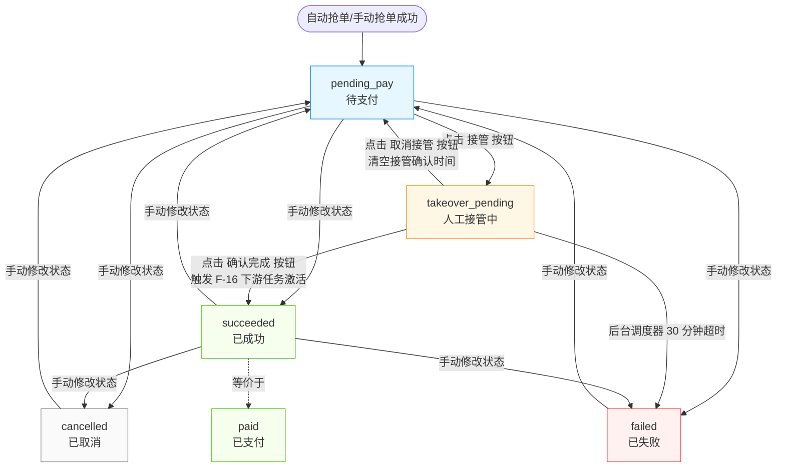
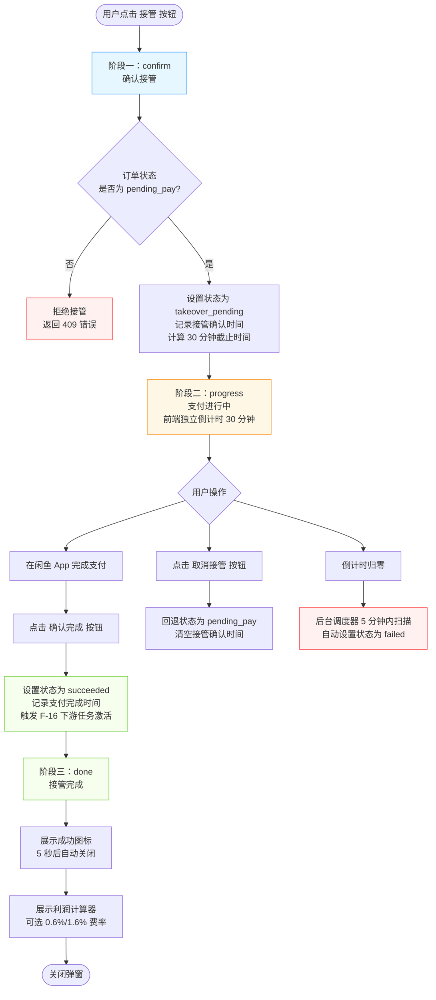

# 闲鱼猎人「抢单记录」操作手册

| 项 | 内容 |
|---|---|
| 文档版本 | v1.0 |
| 文档日期 | 2026-07-05 |
| 所属项目 | 闲鱼猎人 |
| 所属菜单 | 数据查看 → 抢单记录 |
| 文档类型 | 操作手册 |
| 关联路由 | /orders |
| 配套详细设计 | 抢单记录-详细设计 v2.0 |
| 目标读者 | 运营 / 管理员 |

---

## 目录

- [0. 阶段交接声明](#0-阶段交接声明)
- [1. 功能简介](#1-功能简介)
- [2. 入口与导航](#2-入口与导航)
- [3. 界面布局](#3-界面布局)
- [4. 操作指南](#4-操作指南)
  - [4.1 查看抢单记录列表](#41-查看抢单记录列表)
  - [4.2 4 张统计卡片说明](#42-4-张统计卡片说明)
  - [4.3 多维度筛选](#43-多维度筛选)
  - [4.4 手动抢单操作](#44-手动抢单操作)
  - [4.5 接管超时重试](#45-接管超时重试)
  - [4.6 取消订单](#46-取消订单)
  - [4.7 查看订单详情](#47-查看订单详情)
  - [4.8 TakeoverModal 三阶段操作](#48-takeovermodal-三阶段操作)
  - [4.9 订单状态流转说明](#49-订单状态流转说明)
  - [4.10 接管超时调度器说明](#410-接管超时调度器说明)
- [5. 字段说明](#5-字段说明)
- [6. 常见问题 FAQ](#6-常见问题-faq)
- [7. 注意事项与限制](#7-注意事项与限制)
- [8. 关联功能](#8-关联功能)
- [9. 快捷键与技巧](#9-快捷键与技巧)
- [10. 修订记录](#10-修订记录)
- [11. 附录](#11-附录)

---

## 0. 阶段交接声明

```
- 当前阶段：抢单记录操作手册编写 ✅ 已完成
- 下一阶段：事件时间线操作手册编写
- 下一阶段智能体：文档编写智能体
- 下一阶段技能：文档编写
- 交接上下文：
  · 文件路径：d:\code\otherProjects\17_xianyu\docs\02-数据查看\抢单记录-操作手册.md
  · 11 章齐全：阶段交接 / 功能简介 / 入口导航 / 界面布局 / 操作指南(10 个子场景) / 字段说明 / FAQ(13 条) / 注意事项(10 条) / 关联功能 / 快捷键 / 修订记录 / 附录
  · 面向最终用户（运营/管理员），不出现 API 路径、数据库字段、代码文件名
  · 关键强调：TakeoverModal 三阶段不可跳过、4 核心枚举 + 2 扩展值的边界
  · 配套详细设计 v2.0、需求规格 v1.0
  · 附录含订单状态机流程图 + TakeoverModal 三阶段流程图（mermaid）+ 订单状态枚举对照表
```

---

## 1. 功能简介

### 1.1 一句话说明

**抢单记录**是闲鱼猎人系统中**抢单业务的可视化运维入口**，让运营与管理员在一个页面内完成「订单查询 → 状态筛选 → 人工接管 → 手动抢单 → 状态修改 → 详情查看」的全流程操作。

### 1.2 核心价值

| 价值点 | 说明 |
|--------|------|
| **订单全生命周期可见** | 自动抢单成功后从「待支付」到「已成功 / 已失败 / 已取消」的全状态均可查询 |
| **人工接管流程化** | 三阶段弹窗（确认接管 → 闲鱼支付 → 确认完成）引导用户在 30 分钟内完成支付 |
| **超时自动清理** | 后台每 5 分钟扫描一次，接管超过 30 分钟未完成支付的订单自动标记为「已失败」 |
| **手动抢单覆盖半自动场景** | 在评估明细页面，用户可主动触发抢单，突破纯自动模式限制 |
| **下游任务自动激活** | 订单成功后自动激活配置好的下游依赖任务（处于"暂停等待"状态的任务会被自动启动） |
| **实时推送** | 订单状态变更通过实时事件流推送，无需手动刷新即可看到最新状态 |
| **利润可视化** | 接管成功后展示利润计算器，帮助决策买入价与手续费 |

### 1.3 适用对象

| 角色 | 使用场景 |
|------|----------|
| 抢单运维 | 日常监控抢单状态、统计成功/失败率、清理脏数据 |
| 人工接管 | 自动抢单后需要在闲鱼 App 完成支付的用户 |
| 手动抢单 | 在评估明细页面对高分商品主动触发抢单 |
| 失效处理 | 订单超时/失败后排查原因 |
| 高级调试 | 验证下游任务依赖链是否被正确激活 |

---

## 2. 入口与导航

### 2.1 菜单入口

- **菜单位置**：左侧菜单栏 → 「数据查看」分组 → 「抢单记录」
- **菜单图标**：闪电图标（ThunderboltOutlined）
- **菜单元数据**：
  | 项 | 值 |
  |---|---|
  | 标识 | orders |
  | 显示名称 | 抢单记录 |
  | 排序 | 13 |
  | 分组 | data_view |

### 2.2 进入方式

支持以下 4 种方式进入抢单记录页面：

| 方式 | 操作 |
|------|------|
| 菜单点击 | 点击左侧菜单「数据查看 → 抢单记录」 |
| 命令面板 | 按 `Ctrl+K` 打开命令面板 → 输入「抢单记录」或「orders」 → 选中命令 |
| 快捷键 | 先按 `g`，500 毫秒内再按 `o`，跳转到抢单记录页面 |
| URL 直接访问 | 在浏览器地址栏输入 `/orders` 路径 |

### 2.3 进入前置条件

- 用户已登录闲鱼猎人系统
- 用户具有「数据查看」菜单访问权限
- 推荐使用最新版 Chrome / Edge 浏览器

> **提示**：手动抢单功能需要服务以「调度器模式」启动（即注入浏览器实例），否则会提示「抢单功能未启用」。

---

## 3. 界面布局

抢单记录页面采用上下分区布局，自上而下依次为：顶部工具栏 → 统计卡片 → 订单表格 → 详情抽屉/接管弹窗。

### 3.1 顶部工具栏

| 区域 | 说明 |
|------|------|
| 页面标题 | 「抢单记录」+ 闪电图标 |
| 状态筛选 | 多选状态徽标，颜色区分不同状态（详见 4.3） |
| 任务筛选 | 按关联任务 ID 筛选 |
| 商品筛选 | 按关联商品 ID 筛选 |
| 时间范围 | 按订单创建时间筛选 |
| 卖家筛选 | 按卖家 ID 筛选 |
| 列设置按钮 | 配置表格列显示/隐藏/排序，配置跨会话保留 |
| 刷新按钮 | 手动刷新订单列表 |

### 3.2 统计卡片区

页面顶部展示 4 张统计卡片，分别对应订单的 4 个核心状态：

| 卡片 | 颜色 | 含义 |
|------|------|------|
| 待支付 | 蓝色 | 已拍下但用户尚未完成支付的订单数量 |
| 已支付 | 绿色 | 用户已完成支付的订单数量 |
| 已取消 | 灰色 | 用户主动取消或系统取消的订单数量 |
| 失败 | 红色 | 人工处理失败或接管超时的订单数量 |

> **提示**：统计卡片为前端按当前页数据自行统计，并非全量数据。如需查看全量统计，请结合筛选条件分页查看。

### 3.3 订单表格

订单表格展示以下列（部分列可在「列设置」中隐藏）：

| 列名 | 说明 |
|------|------|
| 订单号 | 闲鱼返回的订单编号 |
| 商品 | 商品 ID（异步补全商品标题） |
| 价格 | 成交价格（元） |
| 状态 | 状态徽标，颜色映射见 4.9 |
| 创建时间 | 订单创建的时间 |
| 接管倒计时 | 仅「人工接管中」状态订单显示剩余秒数，倒计时为 0 后自动刷新 |
| 操作 | 接管 / 确认支付 / 取消接管 / 查看详情 / 删除 |

### 3.4 详情抽屉

点击「查看详情」按钮后，从右侧滑出抽屉，展示完整订单信息（详见 4.7）。

### 3.5 TakeoverModal 接管弹窗

点击「接管」按钮后，居中弹出三阶段接管弹窗，引导用户完成支付（详见 4.8）。

---

## 4. 操作指南

### 4.1 查看抢单记录列表

**适用场景**：日常查看所有抢单订单的状态与详情。

**操作步骤**：

1. 通过菜单/快捷键/URL 进入抢单记录页面
2. 默认展示最近的订单列表，按创建时间倒序排列
3. 表格底部展示分页器，可切换页码与每页条数
4. 每页条数会自动保存到浏览器本地，下次进入页面时恢复

**使用技巧**：

- 列表数据通过实时事件流自动更新，无需频繁手动刷新
- 当订单状态发生变化（如自动抢单成功、抢单失败），列表会自动刷新
- 若页面长时间未激活（如切换到其他标签页），重新回到页面时会自动重建事件流连接

> **提示**：若页面不可见（如最小化浏览器），系统不会建立事件流连接以节省资源；切回页面后会自动重连。

### 4.2 4 张统计卡片说明

页面顶部展示 4 张统计卡片，分别对应订单的 4 个核心状态：

| 卡片 | 状态值 | 含义 | 颜色 |
|------|--------|------|------|
| 待支付 | pending_pay | 已拍下但用户尚未完成支付的订单 | 蓝色 |
| 已支付 | paid | 用户已完成支付的订单 | 绿色 |
| 已取消 | cancelled | 用户主动取消或系统取消的订单 | 灰色 |
| 失败 | failed | 人工处理失败或接管超时的订单 | 红色 |

**注意事项**：

- 卡片统计的是**当前页**订单，不是全量订单
- 接管中的订单（中间态）不会单独显示一张卡片，而是包含在「待支付」状态的相关统计中
- 已成功订单（与已支付等价）也会被统计到「已支付」卡片中

### 4.3 多维度筛选

**适用场景**：从大量订单中快速定位目标订单。

#### 4.3.1 按状态筛选

| 状态 | 颜色 | 含义 |
|------|------|------|
| 待支付 | 蓝色 | 已拍下待支付（pending_pay） |
| 人工接管中 | 橙色 | 等待人工接管支付（takeover_pending，扩展状态） |
| 已支付 | 绿色 | 用户已完成支付（paid / succeeded） |
| 已失败 | 红色 | 人工处理失败或接管超时（failed） |
| 已取消 | 灰色 | 用户主动取消或系统取消（cancelled） |

支持多选，点击徽标切换选中/取消选中。

#### 4.3.2 按任务筛选

在「任务筛选」输入框中输入任务 ID，可精确匹配该任务下的所有订单。

#### 4.3.3 按商品筛选

在「商品筛选」输入框中输入商品 ID，可精确匹配该商品的所有订单。

#### 4.3.4 按时间筛选

选择时间范围（如最近 1 天 / 7 天 / 30 天 / 自定义），按订单创建时间筛选。

#### 4.3.5 按卖家筛选

在「卖家筛选」输入框中输入卖家 ID，可反查该卖家的所有订单。

> **提示**：可同时组合多个筛选条件（如「待支付 + 任务 A + 最近 7 天」），实现精准定位。

### 4.4 手动抢单操作

**适用场景**：在评估明细页面发现高分商品，主动触发抢单（突破纯自动模式限制）。

**前置条件**：

1. 服务以「调度器模式」启动（注入了浏览器实例）
2. 闲鱼登录态有效（Cookie 未过期）
3. 商品已存在于数据库中
4. 同一商品在 30 秒内未被重复抢单
5. 同一商品未已存在订单（幂等检查）

**操作步骤**：

1. 进入「卖家评估」或「评估明细」页面
2. 找到目标商品，点击「手动抢单」按钮
3. 系统会自动执行抢单流程：
   - 校验前置条件
   - 检查是否已存在订单（幂等）
   - 获取浏览器锁（最长等待 10 秒）
   - 同步最新 Cookie 到工作浏览器
   - 调用 Buyer 模块执行抢单（导航商品页 → 点立即购买 → 提交订单 → 提取订单号）
4. 根据返回结果展示不同提示：

| 结果 | 提示 |
|------|------|
| success | 「抢单成功，订单已创建」 |
| skipped_duplicate | 「商品已下过单，幂等跳过」（同任务+同商品已存在订单） |
| failed | 「抢单失败：{错误原因}」 |

**常见错误**：

| 错误码 | 含义 | 处理建议 |
|--------|------|----------|
| 503 | 抢单功能未启用 | 以调度器模式（XH_WITH_SCHEDULER=1）启动服务 |
| 403 | 闲鱼登录已过期 | 进入「Cookie 注入」页面重新登录闲鱼 |
| 404 | 商品不存在于数据库 | 确认商品已被采集入库 |
| 422 | 商品 ID 为空 | 检查请求参数 |
| 409 | 商品已售出 | 商品已被其他买家购买，无法继续 |
| 503 | 系统正在执行后台浏览器任务 | 等待 10 秒后重试 |
| 500 | 抢单失败 | 查看订单列表中的失败原因字段 |
| 502 | 抢单失败（已写库） | 订单已记录为失败状态，查看详情排查 |

> **提示**：手动抢单与自动抢单核心流程完全一致，只是触发方式不同（手动由用户触发，自动由任务调度触发）。

### 4.5 接管超时重试

**适用场景**：用户发起接管后未在 30 分钟内完成支付，订单被自动标记为「已失败」，需要重新接管。

**背景说明**：

- 接管超时阈值：30 分钟（对齐闲鱼「待付款」订单 30 分钟自动关闭的业务规则）
- 超时后状态流转：`takeover_pending` → `failed`（**不是** `cancelled`，避免与用户主动取消混淆）
- 超时订单无法直接重新接管，因为 `failed` 是终态

**重新接管操作步骤**：

1. 在抢单记录页面找到状态为「已失败」的订单
2. 点击「修改状态」按钮，将状态从 `failed` 回退到 `pending_pay`
3. 状态回退成功后，订单恢复为「待支付」状态
4. 点击「接管」按钮，重新发起人工接管流程
5. 在 30 分钟内完成支付

> **重要**：直接对 `failed` / `cancelled` / `succeeded` 状态的订单点击「接管」会被拒绝（系统返回 409 错误）。必须先通过状态修改回退到 `pending_pay` 才能再次接管。

### 4.6 取消订单

**适用场景**：用户放弃支付，或订单需要作废。

#### 4.6.1 取消接管中（takeover_pending）的订单

**操作步骤**：

1. 在订单列表找到状态为「人工接管中」的订单
2. 点击「取消接管」按钮
3. 订单状态会回退到「待支付」（pending_pay），并清空接管确认时间
4. 该订单可被再次接管（不会丢失）

> **提示**：取消接管不会删除订单，仅回退状态。设计上保留订单作为审计记录，避免数据丢失。

#### 4.6.2 主动取消订单（pending_pay → cancelled）

**操作步骤**：

1. 在订单列表找到状态为「待支付」的订单
2. 点击「修改状态」按钮
3. 选择「已取消」（cancelled）
4. 订单状态变更为「已取消」，进入终态

#### 4.6.3 删除订单

**操作步骤**：

1. 在订单列表找到目标订单
2. 点击「删除」按钮
3. 在弹出的确认框中点击「确定」
4. 订单被物理删除（不可恢复）

> **警告**：删除操作是物理删除，不可恢复。生产环境建议优先使用「修改状态」流转到「已取消」，仅在清理测试数据或脏数据时使用删除。

### 4.7 查看订单详情

**适用场景**：查看订单的完整信息，包括失败原因、支付时间等。

**操作步骤**：

1. 在订单列表中找到目标订单
2. 点击行尾的「查看详情」按钮
3. 从右侧滑出抽屉，展示完整订单信息

**详情抽屉展示内容**：

| 字段 | 说明 |
|------|------|
| 订单 ID | 系统内部订单主键 |
| 关联任务 ID | 该订单所属的任务（可为空） |
| 关联商品 ID | 该订单对应的商品 |
| 卖家 ID | 商品的卖家 |
| 闲鱼订单号 | 闲鱼返回的订单编号 |
| 成交价格 | 订单金额（元） |
| 订单状态 | 当前状态徽标 |
| 创建时间 | 订单创建时间 |
| 接管确认时间 | 发起接管的时间（仅接管过的订单有值） |
| 支付完成时间 | 完成支付的时间（仅成功订单有值） |
| 失败原因 | 失败订单的错误说明（仅失败订单有值） |
| 接管截止时间 | 接管倒计时的截止时间（仅人工接管中订单有值） |
| 接管剩余秒数 | 距离超时的剩余秒数（仅人工接管中订单有值） |

**详情抽屉快捷操作**：

- 待支付订单：可直接点击「接管」按钮发起接管
- 接管中订单：可点击「确认支付完成」或「取消接管」
- 已失败订单：可查看失败原因，必要时修改状态回退到待支付

### 4.8 TakeoverModal 三阶段操作

**适用场景**：自动抢单成功后，用户需要在闲鱼 App 完成支付，并通过系统记录支付结果。

> **重要**：TakeoverModal 三阶段严格顺序流转，**不可跳过任何阶段**。设计上避免用户在未确认接管的情况下直接跳到「确认完成」，导致状态混乱。

#### 4.8.1 阶段一：确认接管（confirm）

**触发**：用户在订单列表或详情抽屉点击「接管」按钮。

**操作步骤**：

1. 弹窗展示订单信息（商品 ID / 金额 / 创建时间）
2. 步骤指示器显示当前位置：「① 确认接管」（前序步骤未完成）
3. 用户确认商品信息无误后，点击「确认接管」按钮
4. 系统将订单状态从 `pending_pay` 修改为 `takeover_pending`
5. 记录接管确认时间，并计算 30 分钟后的截止时间
6. 自动进入阶段二

**注意事项**：

- 仅 `pending_pay` 状态的订单可被接管
- 接管中（`takeover_pending`）的订单再次点击接管会被拒绝（避免重置 30 分钟倒计时）
- 已成功 / 已失败 / 已取消的终态订单不可接管

#### 4.8.2 阶段二：支付进行中（progress）

**触发**：阶段一确认成功后自动进入。

**操作步骤**：

1. 弹窗展示大字号倒计时（分:秒格式，1 秒间隔更新）
2. 进度条显示剩余时间百分比
3. 步骤指示器显示当前位置：「② 在闲鱼完成支付」
4. 用户切换到闲鱼 App，在 30 分钟内完成支付
5. 完成支付后，回到系统点击「确认完成」按钮
6. 系统将订单状态从 `takeover_pending` 修改为 `succeeded`
7. 记录支付完成时间
8. 同步触发下游依赖任务激活（F-16）
9. 自动进入阶段三

**也可以点击「取消接管」按钮**：

- 取消接管会回退状态到 `pending_pay`，并清空接管确认时间
- 该订单可被再次接管

**超时处理**：

- 倒计时为 0 时，进度条变为红色异常状态，显示「已超时」
- 后台调度器会在 5 分钟内扫描到该订单超时，自动将状态流转为 `failed`
- 用户刷新列表后看到订单状态为「已失败」，需按 4.5 节重新接管

> **提示**：阶段二无后端调用，前端独立倒计时。即使用户关闭弹窗，倒计时仍在后台进行；后台调度器会自动清理超时订单。

#### 4.8.3 阶段三：接管完成（done）

**触发**：用户点击「确认完成」按钮后进入。

**展示内容**：

1. 成功图标 + 「接管完成」标题
2. 5 秒后自动关闭弹窗（鼠标移入弹窗暂停倒计时，移出后恢复）
3. **利润计算器**组件展示

**利润计算器使用**：

| 配置项 | 说明 |
|--------|------|
| 费率 | 单选按钮，两档可选：普通 0.6% / 鱼小铺 1.6% |
| 买入价 | 数字输入框，默认等于订单成交价，可手动调整 |
| 手续费 | 自动计算：`卖出价 × 费率`（橙色显示） |
| 净赚 | 自动计算：`卖出价 - 买入价 - 手续费`（绿色为正、红色为负） |

**计算公式**：

```
手续费 = 卖出价 × 费率
净赚 = 卖出价 - 买入价 - 手续费
```

> **提示**：利润计算器是纯前端组件，所有计算在浏览器中完成，不会保存到服务器。费率按卖出价计算（不是买入价）。

### 4.9 订单状态流转说明

#### 4.9.1 4 个核心状态（OrderStatus 枚举）

| 状态值 | 中文标签 | 含义 | 颜色 |
|--------|----------|------|------|
| pending_pay | 待支付 | 已拍下待支付，自动抢单/手动抢单成功后的初始状态 | 蓝色 |
| paid | 已支付 | 用户完成支付 | 绿色 |
| cancelled | 已取消 | 用户取消或系统取消 | 灰色 |
| failed | 已失败 | 人工处理失败或接管超时 | 红色 |

#### 4.9.2 2 个扩展状态（数据库实际存储，不在核心枚举中）

| 状态值 | 中文标签 | 含义 | 来源 |
|--------|----------|------|------|
| takeover_pending | 人工接管中 | 等待人工接管的中间态 | 用户点击「接管」按钮时设置 |
| succeeded | 已成功 | 抢单成功（与「已支付」等价，历史遗留） | 用户点击「确认完成」或手动修改状态时设置 |

> **重要**：
> - 扩展状态 `takeover_pending` 是流程中间态，**不允许手动修改**，必须通过「接管」按钮触发
> - 扩展状态 `succeeded` 与核心状态 `paid` 业务语义相同，UI 统一展示为「已支付」/「已成功」
> - 旧版本文档中的 `submitting` / `paying` 状态在当前系统中**不存在**，已移除

#### 4.9.3 状态流转路径

| 起始状态 | 目标状态 | 触发方式 | 说明 |
|----------|----------|----------|------|
| pending_pay | takeover_pending | 点击「接管」按钮 | 进入人工接管流程 |
| takeover_pending | succeeded | 点击「确认完成」按钮 | 完成支付，触发下游任务激活 |
| takeover_pending | pending_pay | 点击「取消接管」按钮 | 回退状态，清空接管时间 |
| takeover_pending | failed | 后台调度器超时清理 | 30 分钟未完成支付，自动标记失败 |
| pending_pay / succeeded | cancelled / failed | 手动「修改状态」 | 用户主动修改 |
| succeeded / failed / cancelled | pending_pay | 手动「修改状态」 | 重新接管前需回退状态 |

#### 4.9.4 状态流转约束

1. **拒绝 `takeover_pending → takeover_pending`**：避免用户无限点击重置 30 分钟倒计时，违背「30 分钟内必须完成支付」的业务约束
2. **拒绝终态订单复活**：`succeeded` / `failed` / `cancelled` 状态的订单不能直接接管
3. **拒绝手动设置 `takeover_pending`**：必须通过「接管」按钮触发，不能通过「修改状态」直接设置
4. **重新接管的正确流程**：先通过「修改状态」回退到 `pending_pay`，再点击「接管」按钮

### 4.10 接管超时调度器说明

**功能**：自动清理接管超时的订单，避免用户去支付已被闲鱼自动关闭的订单。

**调度参数**：

| 参数 | 默认值 | 说明 |
|------|--------|------|
| 扫描间隔 | 5 分钟 | 调度器每 5 分钟扫描一次数据库 |
| 超时阈值 | 30 分钟 | 接管确认后超过 30 分钟未完成支付的订单视为超时 |
| 超时流转 | failed | 超时订单状态从 `takeover_pending` 流转到 `failed` |

**为什么是 5 分钟扫描**：

- 1 分钟扫描过于频繁，每分钟一次全表扫描开销大
- 10 分钟扫描会让超时订单多卡 10 分钟才清理
- 5 分钟是时效性与数据库开销的折中

**为什么流转到 `failed` 而非 `cancelled`**：

- 用户未完成支付属于异常情况
- `cancelled` 会被误认为是用户主动取消
- 流转到 `failed` 可保证统计准确性

**用户感知**：

- 接管倒计时归零后，前端不会立即调用后端
- 后台调度器在 5 分钟内扫描到该订单超时，自动将状态流转为 `failed`
- 用户刷新列表后看到订单状态为「已失败」
- 若需重新接管，请按 4.5 节操作

> **提示**：调度器采用单实例运行（错过执行窗口不补跑 + 合并多次触发），不会出现重复清理。调度器异常时不影响主业务，下次扫描会重试。

---

## 5. 字段说明

### 5.1 订单列表字段

| 字段 | 类型 | 是否必填 | 说明 |
|------|------|----------|------|
| 订单 ID | 字符串 | 是 | 系统内部订单主键（UUID 或时间戳生成） |
| 关联任务 ID | 字符串 | 否 | 该订单所属的任务 ID（可为空） |
| 关联商品 ID | 字符串 | 是 | 该订单对应的商品 ID |
| 卖家 ID | 字符串 | 否 | 商品的卖家 ID |
| 闲鱼订单号 | 字符串 | 否 | 闲鱼返回的订单编号 |
| 成交价格 | 浮点数 | 否 | 订单金额（元），默认 0.0 |
| 订单状态 | 字符串 | 是 | 订单当前状态（见 4.9） |
| 抢单截图 | 字符串 | 否 | 抢单截图 URL（当前版本保留字段，不写入） |
| 失败原因 | 文本 | 否 | 失败订单的错误说明（仅 `failed` 状态有值） |
| 接管确认时间 | 日期时间 | 否 | 发起接管的时间（仅 `takeover_pending` / `succeeded` 状态有值） |
| 支付完成时间 | 日期时间 | 否 | 完成支付的时间（仅 `succeeded` 状态有值） |
| 创建时间 | 日期时间 | 否 | 订单创建时间，默认当前时间 |

### 5.2 接管中订单扩展字段

仅 `takeover_pending` 状态的订单在列表中会额外返回以下字段：

| 字段 | 类型 | 说明 |
|------|------|------|
| 接管截止时间 | 字符串（ISO 格式） | 接管倒计时的截止时间 = 接管确认时间 + 30 分钟 |
| 接管剩余秒数 | 整数 | 距离超时的剩余秒数，最小为 0 |

> **提示**：若接管确认时间不可解析（数据异常），上述两个字段为空，但不影响列表展示。

### 5.3 订单详情字段

详情抽屉展示订单的所有可见字段，与列表字段一致，但布局更宽松，便于查看完整信息。

### 5.4 状态枚举对照表

| 状态值 | 中文标签 | 是否核心枚举 | 是否可手动修改 | 颜色 |
|--------|----------|--------------|----------------|------|
| pending_pay | 待支付 | 是 | 是 | 蓝色 |
| paid | 已支付 | 是 | 是 | 绿色 |
| cancelled | 已取消 | 是 | 是 | 灰色 |
| failed | 已失败 | 是 | 是 | 红色 |
| takeover_pending | 人工接管中 | 否（扩展值） | **否**（必须走接管流程） | 橙色 |
| succeeded | 已成功 | 否（扩展值） | 是（与 paid 等价） | 绿色 |

### 5.5 手动抢单结果枚举

| 结果值 | 含义 | HTTP 状态码 |
|--------|------|-------------|
| success | 抢单成功，订单已创建 | 200 |
| skipped_duplicate | 幂等跳过（同任务+同商品已存在订单） | 200 |
| failed | 抢单失败（已写库） | 502 |

---

## 6. 常见问题 FAQ

### Q1：为什么我点击「接管」按钮没反应？

**A**：可能原因：
1. 订单状态不是 `pending_pay`（仅待支付订单可被接管）
2. 订单已是终态（`succeeded` / `failed` / `cancelled`），需先通过「修改状态」回退到 `pending_pay`
3. 订单已是 `takeover_pending` 状态（避免重置 30 分钟倒计时，系统拒绝重复接管）

### Q2：接管后我必须在多长时间内完成支付？

**A**：30 分钟。该时间对齐闲鱼「待付款」订单 30 分钟自动关闭的业务规则。倒计时从点击「确认接管」开始计算，超时后订单会被自动标记为「已失败」。

### Q3：接管超时后订单为什么变成了「已失败」而不是「已取消」？

**A**：用户未完成支付属于异常情况，使用 `cancelled` 会被误认为是用户主动取消，影响统计准确性。因此超时统一流转到 `failed`，方便运营统计抢单失败率。

### Q4：TakeoverModal 三阶段可以跳过吗？

**A**：**不可以**。三阶段严格顺序流转：
- 阶段一（确认接管）→ 阶段二（支付进行中）→ 阶段三（接管完成）
- 必须先点击「确认接管」才能进入倒计时阶段
- 必须在倒计时内点击「确认完成」才能进入结果展示阶段
- 设计上避免用户在未确认接管的情况下直接跳到「确认完成」，导致状态混乱

### Q5：为什么我无法手动把订单状态改为「人工接管中」？

**A**：`takeover_pending` 是接管流程的中间态，**不允许手动修改**，必须通过「接管」按钮触发。该设计避免了用户绕过三阶段流程直接设置中间态。允许手动修改的状态仅包括：`pending_pay` / `succeeded` / `cancelled` / `failed`。

### Q6：手动抢单和自动抢单有什么区别？

**A**：
- **自动抢单**：任务以 `auto` 模式运行，评估通过后自动调用 Buyer 模块下单
- **手动抢单**：用户在评估明细页面点击「手动抢单」按钮主动触发
- **核心流程完全一致**：两者都通过 Buyer 模块执行抢单（导航商品页 → 点立即购买 → 提交订单 → 提取订单号）
- **适用场景**：手动抢单适用于纯自动模式限制的场景（如未启用浏览器或评分≥80 但风险等级非 LOW）

### Q7：为什么我手动抢单提示「商品已下过单，幂等跳过」？

**A**：系统对同一任务+同一商品执行了幂等检查，发现已存在订单，避免重复抢单。若确需重新抢单：
1. 检查现有订单状态，若为 `failed` 或 `cancelled`，可通过「修改状态」回退到 `pending_pay` 后再次接管
2. 若为测试数据，可删除原订单后重新抢单（注意：进程未重启时内存幂等仍生效）

### Q8：订单状态有哪些？哪些是核心状态？哪些是扩展状态？

**A**：
- **4 个核心状态**（OrderStatus 枚举）：`pending_pay`（待支付）/ `paid`（已支付）/ `cancelled`（已取消）/ `failed`（已失败）
- **2 个扩展状态**（数据库实际存储但不在枚举中）：
  - `takeover_pending`（人工接管中）：接管流程中间态，必须通过「接管」按钮触发
  - `succeeded`（已成功）：与 `paid` 等价，历史遗留值
- 旧版本文档中的 `submitting` / `paying` 状态在当前系统中**不存在**

### Q9：接管倒计时是怎么计算的？

**A**：
- 后端在订单列表中为 `takeover_pending` 状态订单计算 `takeover_remaining_sec` 字段
- 计算公式：`截止时间 = 接管确认时间 + 30 分钟`，`剩余秒数 = max(0, 截止时间 - 当前时间)`
- 前端按剩余秒数每秒倒计时
- 倒计时为 0 时不会自动调用后端，等用户操作或刷新列表（后台调度器已自动清理）

### Q10：为什么我看不到实时更新？

**A**：可能原因：
1. 页面不可见（如最小化浏览器或切换到其他标签页）—— 系统不建立事件流连接以节省资源，切回页面后会自动重连
2. 事件流断线 —— 系统会 3 秒后自动重连，最多重试 10 次
3. 网络异常 —— 检查网络连接，或手动点击「刷新」按钮

### Q11：订单可以删除吗？删除后还能恢复吗？

**A**：可以删除，但删除是物理删除，**不可恢复**。建议：
- 生产环境优先使用「修改状态」流转到 `cancelled`
- 仅在清理测试数据或脏数据时使用删除
- 删除后，进程未重启时 Buyer 模块的内存幂等仍生效（同商品无法立即重新抢单）

### Q12：为什么我的下游依赖任务没有被自动激活？

**A**：可能原因：
1. 订单状态不是 `succeeded`（仅 `succeeded` 状态触发下游任务激活）
2. 下游任务状态不是 `paused`（仅 `paused` 状态的下游任务会被激活，`running` / `stopped` / `error` / `deleted` 状态跳过）
3. 订单未关联商品 ID（无法反查上游任务）
4. 任务依赖关系未正确配置（请在「任务管理」中检查依赖设置）

### Q13：利润计算器的费率是怎么计算的？

**A**：
- **费率选项**：普通 0.6% / 鱼小铺 1.6%
- **手续费**：按**卖出价**计算（不是买入价），即 `手续费 = 卖出价 × 费率`
- **净赚**：`净赚 = 卖出价 - 买入价 - 手续费`
- 计算器是纯前端组件，不会保存到服务器，仅用于辅助决策

---

## 7. 注意事项与限制

### 7.1 TakeoverModal 三阶段不可跳过

三阶段严格顺序流转（确认接管 → 支付进行中 → 接管完成），不允许跳过任何阶段。设计上避免用户在未确认接管的情况下直接跳到「确认完成」，导致状态混乱。

### 7.2 30 秒抢单冷却

同一商品在 30 秒内不能重复抢单。该机制由 Buyer 模块的内存 LRU 缓存实现，进程重启后会清空。即使进程重启，数据库的幂等检查仍会拦截重复下单。

### 7.3 手动抢单幂等检查

同一任务+同一商品若已存在订单，手动抢单会返回 `skipped_duplicate`，避免重复抢单。若确需重新抢单，请先处理原订单（删除或修改状态）。

### 7.4 接管超时调度器

- 扫描间隔：5 分钟（不可由用户调整）
- 超时阈值：30 分钟（对齐闲鱼业务规则）
- 超时流转：`takeover_pending` → `failed`（不是 `cancelled`）
- 调度器异常时不影响主业务，下次扫描会重试

### 7.5 接管白名单

- 仅 `pending_pay` 状态的订单可被接管
- 拒绝 `takeover_pending → takeover_pending`（避免重置倒计时）
- 拒绝 `succeeded` / `failed` / `cancelled` 状态的订单复活
- 重新接管已取消/失败的订单，需先通过「修改状态」回退到 `pending_pay`

### 7.6 状态修改白名单

「修改状态」功能仅接受以下 4 个值：
- `pending_pay`（待支付）
- `succeeded`（已成功）
- `cancelled`（已取消）
- `failed`（已失败）

`takeover_pending`（人工接管中）**不允许手动设置**，必须通过「接管」按钮触发。

### 7.7 手动抢单前置条件

手动抢单功能依赖以下前置条件，任一不满足都会失败：

| 条件 | 失败错误码 | 处理建议 |
|------|------------|----------|
| 服务以调度器模式启动（注入浏览器） | 503 | 以 `XH_WITH_SCHEDULER=1` 模式启动服务 |
| 闲鱼登录态有效 | 403 | 进入「Cookie 注入」页面重新登录 |
| 商品存在于数据库 | 404 | 确认商品已被采集入库 |
| 浏览器锁可用（10 秒超时） | 503 | 等待 10 秒后重试 |
| 商品未被售出 | 409 | 商品已被其他买家购买 |

### 7.8 F-16 下游任务激活限制

仅 `paused` 状态的下游依赖任务会被自动激活，其他状态跳过：
- `running`：已在运行，跳过
- `stopped`：用户主动停止，跳过（避免误启动）
- `error` / `deleted`：不可激活，跳过

### 7.9 实时事件流限制

- 页面不可见时不建立连接（节省资源）
- 断线后 3 秒自动重连，最多重试 10 次
- 超过最大重试次数后停止重连，需手动刷新页面

### 7.10 删除订单不可恢复

删除操作是物理删除，不可恢复。生产环境建议优先使用「修改状态」流转到 `cancelled`，保留审计记录。删除后 Buyer 模块的内存幂等仍生效（进程未重启时同商品无法立即重新抢单）。

---

## 8. 关联功能

抢单记录与以下菜单存在联动关系：

### 8.1 任务管理

- **上游关系**：订单通过 `task_id` 关联到任务，任务以 `auto` 模式运行时自动触发抢单
- **下游关系**：订单成功（`succeeded`）后，自动激活该任务的所有 `paused` 状态的下游依赖任务
- **操作联动**：在任务管理页面可查看任务下的所有订单；在抢单记录页面可通过任务 ID 筛选订单

### 8.2 商品中心

- **关联关系**：订单通过 `item_id` 关联到商品
- **操作联动**：商品详情页面展示该商品的所有订单记录；在抢单记录页面可通过商品 ID 筛选订单
- **价格来源**：手动抢单时，预期价格从商品记录中读取

### 8.3 卖家评估

- **关联关系**：订单通过 `seller_id` 关联到卖家
- **操作联动**：评估明细页面提供「手动抢单」按钮入口；在抢单记录页面可通过卖家 ID 筛选订单
- **触发场景**：手动抢单主要在评估明细页面触发

### 8.4 事件时间线

- **关联关系**：订单状态变更（如自动抢单成功、抢单失败、F-16 触发）会写入事件表
- **操作联动**：在事件时间线页面可查看订单相关的事件
- **特殊事件**：F-16 触发的下游任务激活会记录 `dep_triggered` 阶段事件，包含上游任务 ID、订单 ID、触发来源等字段

### 8.5 通知中心

- **关联关系**：订单的失败/超时等异常状态会触发通知
- **操作联动**：通知中心可查看订单相关的通知，并提供快速跳转到抢单记录的链接
- **触发规则**：通知扫描由独立的扫描接口触发，不在订单列表查询时触发（避免增加列表查询开销）

### 8.6 Cookie 注入

- **关联关系**：手动抢单依赖闲鱼登录态
- **操作联动**：当闲鱼登录态失效时（返回 403），需跳转到「Cookie 注入」页面重新登录
- **同步机制**：手动抢单前会自动同步 Cookie 到工作浏览器

### 8.7 系统配置

- **关联关系**：接管超时阈值、扫描间隔等参数由系统配置决定
- **当前限制**：用户无法在 UI 中调整这些参数，需联系开发团队修改配置

---

## 9. 快捷键与技巧

### 9.1 全局快捷键

| 快捷键 | 作用 | 备注 |
|--------|------|------|
| `Ctrl+K`（或 `⌘+K`） | 打开命令面板 | 输入「抢单记录」或「orders」可快速跳转 |
| `Escape` | 关闭命令面板 | 仅在命令面板打开时生效 |
| `g` 然后按 `o` | 跳转到抢单记录页面 | g 前缀序列，500 毫秒内按第二键 |

> **提示**：输入框、文本域、下拉框内不触发快捷键，避免干扰正常输入。

### 9.2 实用技巧

#### 9.2.1 快速定位订单

- **多条件组合筛选**：同时使用状态 + 任务 + 时间范围，精准定位目标订单
- **复制订单 ID**：在详情抽屉中可复制订单 ID，用于与其他同事协作排查

#### 9.2.2 接管流程优化

- **提前打开闲鱼 App**：在确认接管前先打开闲鱼 App，减少切换时间
- **关注倒计时**：倒计时进入最后 5 分钟时进度条变红，需加快操作
- **超时后及时回退**：超时后立即按 4.5 节操作回退状态，避免订单长时间停留失败状态

#### 9.2.3 列表查看优化

- **列设置持久化**：通过「列设置」按钮配置表格列显示/隐藏/排序，配置会跨会话保留
- **分页大小持久化**：每页条数会自动保存到浏览器本地，下次进入页面时恢复
- **依赖实时推送**：列表通过实时事件流自动更新，无需频繁手动刷新

#### 9.2.4 手动抢单优化

- **避开高峰期**：浏览器锁超时为 10 秒，若系统正在执行其他浏览器任务，建议等待后重试
- **确认商品未售出**：手动抢单前可在闲鱼 App 确认商品仍在售，避免 409 错误
- **关注幂等提示**：若提示 `skipped_duplicate`，说明已存在订单，无需重复抢单

#### 9.2.5 利润决策

- **试算不同费率**：在 TakeoverModal 完成阶段切换 0.6% / 1.6% 费率，对比净赚
- **调整买入价**：若实际买入价与订单价格不同，可手动调整以获得准确净赚
- **关注手续费**：手续费按卖出价计算，高价商品手续费较高

---

## 10. 修订记录

| 版本 | 日期 | 修订人 | 修订内容 |
|------|------|--------|----------|
| v1.0 | 2026-07-05 | 文档编写智能体 | 初版：11 章齐全，面向运营/管理员，配套详细设计 v2.0 与需求规格 v1.0，包含 10 个操作子场景、13 条 FAQ、10 条注意事项、订单状态机流程图、TakeoverModal 三阶段流程图、订单状态枚举对照表 |

---

## 11. 附录

### 11.1 订单状态机流程图



### 11.2 TakeoverModal 三阶段流程图



### 11.3 订单状态枚举对照表

| 状态值 | 中文标签 | 是否核心枚举 | 是否可手动修改 | 颜色 | 含义 | 来源 |
|--------|----------|--------------|----------------|------|------|------|
| `pending_pay` | 待支付 | 是 | 是 | 蓝色 | 已拍下待支付，自动抢单/手动抢单成功后的初始状态 | 自动抢单/手动抢单/状态回退 |
| `paid` | 已支付 | 是 | 是 | 绿色 | 用户完成支付 | 历史数据 / 手动修改 |
| `cancelled` | 已取消 | 是 | 是 | 灰色 | 用户取消或系统取消 | 手动修改 |
| `failed` | 已失败 | 是 | 是 | 红色 | 人工处理失败或接管超时 | 接管超时 / 手动修改 / 抢单失败 |
| `takeover_pending` | 人工接管中 | 否（扩展值） | **否** | 橙色 | 等待人工接管的中间态 | 点击「接管」按钮 |
| `succeeded` | 已成功 | 否（扩展值） | 是 | 绿色 | 抢单成功（与 `paid` 等价，历史遗留） | 点击「确认完成」/ 手动修改 |

### 11.4 手动抢单结果对照表

| 结果值 | HTTP 状态码 | 含义 | 用户提示 |
|--------|-------------|------|----------|
| `success` | 200 | 抢单成功，订单已创建 | 「抢单成功，订单已创建」 |
| `skipped_duplicate` | 200 | 幂等跳过（同任务+同商品已存在订单） | 「商品已下过单，幂等跳过」 |
| `failed` | 502 | 抢单失败（已写库） | 「抢单失败：{错误原因}」 |

### 11.5 接管超时调度器参数对照表

| 参数 | 默认值 | 说明 |
|------|--------|------|
| 扫描间隔 | 5 分钟 | 调度器每 5 分钟扫描一次数据库 |
| 超时阈值 | 30 分钟 | 接管确认后超过 30 分钟未完成支付的订单视为超时 |
| 超时流转目标 | `failed` | 超时订单状态从 `takeover_pending` 流转到 `failed` |
| 最大并发实例 | 1 | 错过执行窗口不补跑 |
| 触发合并 | 是 | 合并多次触发 |
| 异常处理 | 记录日志 | 不影响主业务，下次扫描重试 |

### 11.6 利润计算器费率对照表

| 费率名称 | 费率值 | 适用场景 |
|----------|--------|----------|
| 普通 | 0.6% | 普通闲鱼商品交易 |
| 鱼小铺 | 1.6% | 鱼小铺商品交易 |

**计算公式**：

```
手续费 = 卖出价 × 费率
净赚 = 卖出价 - 买入价 - 手续费
```

**示例**：

| 卖出价 | 买入价 | 费率 | 手续费 | 净赚 |
|--------|--------|------|--------|------|
| 200 元 | 180 元 | 0.6% | 1.20 元 | 18.80 元 |
| 200 元 | 180 元 | 1.6% | 3.20 元 | 16.80 元 |
| 500 元 | 450 元 | 0.6% | 3.00 元 | 47.00 元 |
| 500 元 | 450 元 | 1.6% | 8.00 元 | 42.00 元 |

---

**文档结束**
