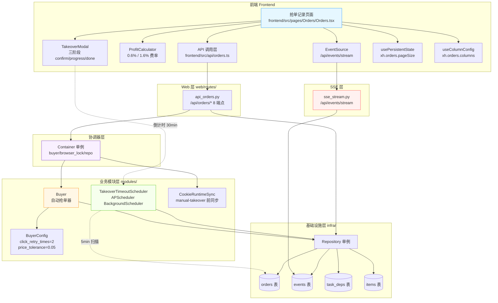
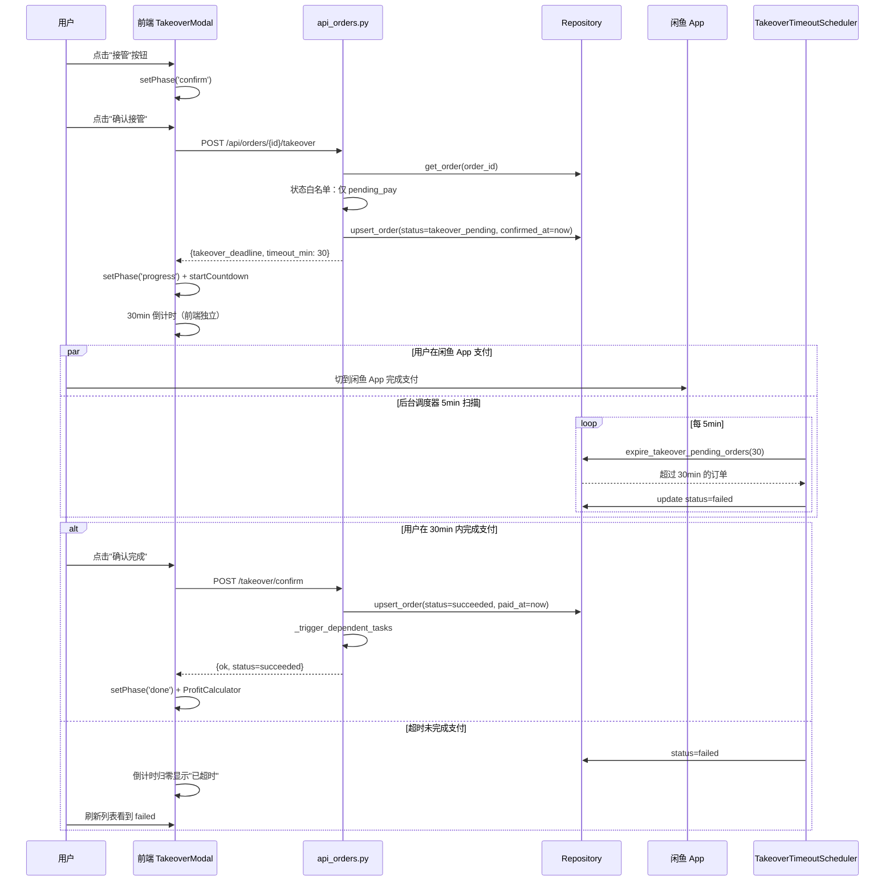
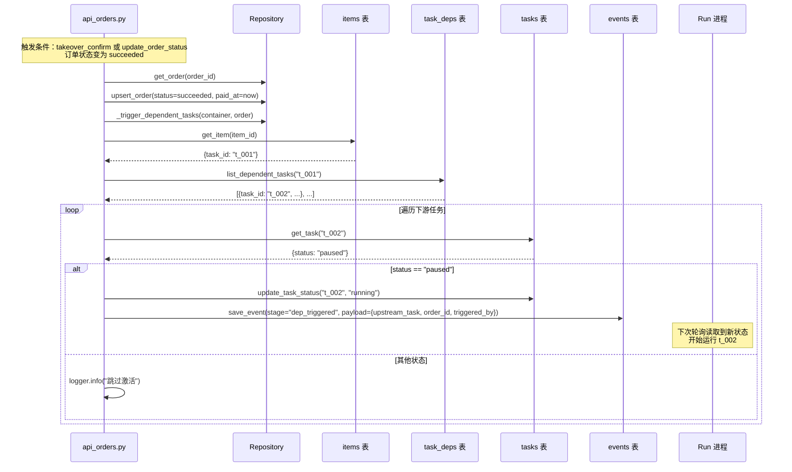
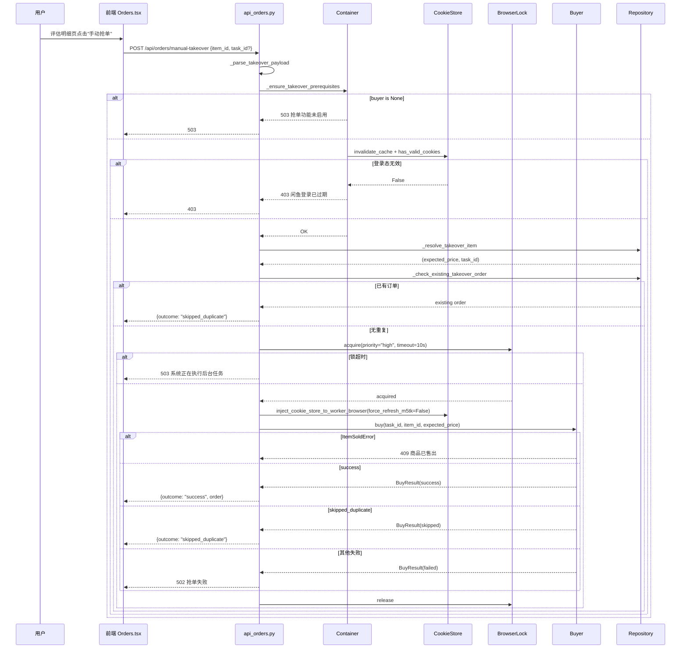

# 闲鱼猎人「抢单记录」模块需求规格说明书

| 项 | 内容 |
|---|---|
| 文档版本 | v1.0 |
| 文档日期 | 2026-07-05 |
| 文档状态 | 初版（与详细设计 v2.0 对齐） |
| 所属项目 | 闲鱼猎人（XianyuHunter） |
| 所属菜单 | 数据查看 → 抢单记录 |
| 菜单标识 | `menu_registry.yaml` 中 `key=orders`、`icon=ThunderboltOutlined`、`sort_order=13`、`category=data_view` |
| 关联路由 | 前端 `/orders`；后端 `/api/orders/*` |
| 关联文档 | [抢单记录-详细设计.md](抢单记录-详细设计.md)（v2.0/2026-07-05） |
| 文档类型 | 需求规格说明书（SRS） |

> **本文档首段：继承 project_memory.md 中的硬约束。** 下文 §1.3.3 显式列出适用项与映射实现要点；本节先做总览：
> 1. **Web 进程必须使用 `with_browser=False` 模式**——`manual-takeover` 端点运行时必须校验 `container.buyer is not None`，未注入时返回 503；后端代码 `_ensure_takeover_prerequisites` 已显式拦截。
> 2. **认证白名单机制**——`/api/orders/*` 全部需通过现有 `auth.py` 认证中间件，**不加入白名单**（与 `/api/auth/cookie` 不同）。
> 3. **前端 fetch 必须含 `credentials: 'include'`**——`frontend/src/api/orders.ts` 沿用 `client` 默认配置。
> 4. **401 必须返回 JSON `{"detail":"Unauthorized"}`**——`api_orders.py` 走 FastAPI `HTTPException` 路径，由全局异常处理转为标准 JSON。
> 5. **token 比较使用 `hmac.compare_digest()`**——本模块无显式 token 比对，幂等检查靠 DB `find_order_by_task_item` 实现，**不**使用字符串比较。
> 6. **敏感字段不日志**——`OrderRow.screenshot` URL 出现失败时仅记录 `id`/`error` 摘要，**不打印**完整 cookie 值；`_save_failed_order` 错误日志仅记 `error_message`。
> 7. **token 写失败触发 `logging.warning()`**——`_m_h5_tk` 关键回写由 `cookie_runtime_sync` 失败时仅 debug（不阻断主流程），订单侧 `_trigger_dependent_tasks` 失败仅 `logger.info`。
> 8. **模块级 import**——`api_orders.py` 顶层 import 已对齐，仅 `_trigger_dependent_tasks` / `_format_takeover_result` / `_ensure_takeover_prerequisites` 内按需延迟 import（避免循环依赖）。
> 9. **DB 索引**——`orders` 表 `task_id`/`item_id` 单列索引 + `ix_orders_seller` + `ix_orders_created` 联合索引覆盖全部查询路径（任务过滤/商品过滤/卖家反查/时间范围）。
> 10. **COUNT 查询 CASE WHEN 聚合**——本模块无 COUNT 类聚合需求，`count_orders` 由 Repository 内部按 status 维度简单计数。
> 11. **WebView2 子进程 `CREATE_NEW_CONSOLE`**——本模块不启动独立浏览器子进程，复用主进程 BrowserManager。
> 12. **WebView2 `private_mode=False` + 独立 `storage_path`**——`manual-takeover` 调 `browser_lock.acquire(priority="high")` 与现有 BrowserManager 配置一致。
> 13. **global request_id 流水号**——`orders` 表**不存** `request_id`（与 `events` 表不同），但 `_trigger_dependent_tasks` 写入 events 时携带 `payload.upstream_task` + `payload.order_id` 串联链路。
> 14. **订单状态机白名单**——`PATCH /status` 仅接受 `pending_pay`/`succeeded`/`cancelled`/`failed`；`takeover_pending` 是流程中间态**不**允许手动设置。

---

## 目录

- [0. 阶段交接声明](#0-阶段交接声明)
- [1. 引言](#1-引言)
  - [1.1 编写目的](#11-编写目的)
  - [1.2 项目背景](#12-项目背景)
  - [1.3 范围与约束](#13-范围与约束)
  - [1.4 术语与缩写](#14-术语与缩写)
  - [1.5 参考资料](#15-参考资料)
- [2. 总体描述](#2-总体描述)
  - [2.1 产品定位](#21-产品定位)
  - [2.2 用户角色与特征](#22-用户角色与特征)
  - [2.3 运行环境](#23-运行环境)
  - [2.4 设计约束](#24-设计约束)
  - [2.5 假设与依赖](#25-假设与依赖)
- [3. 总体架构设计](#3-总体架构设计)
  - [3.1 模块架构图](#31-模块架构图)
  - [3.2 数据流程图](#32-数据流程图)
  - [3.3 关键时序图](#33-关键时序图)
  - [3.4 模块分层与职责](#34-模块分层与职责)
- [4. 功能需求](#4-功能需求)
  - [FR-1 订单列表（多状态筛选 + 分页）](#fr-1-订单列表多状态筛选--分页)
  - [FR-2 订单详情](#fr-2-订单详情)
  - [FR-3 订单状态机](#fr-3-订单状态机)
  - [FR-4 人工接管三阶段](#fr-4-人工接管三阶段)
  - [FR-5 接管超时清理](#fr-5-接管超时清理)
  - [FR-6 手动抢单](#fr-6-手动抢单)
  - [FR-7 自动抢单](#fr-7-自动抢单)
  - [FR-8 F-16 依赖任务自动激活](#fr-8-f-16-依赖任务自动激活)
  - [FR-9 利润计算器](#fr-9-利润计算器)
  - [FR-10 SSE 实时更新](#fr-10-sse-实时更新)
  - [FR-11 状态手动修改](#fr-11-状态手动修改)
  - [FR-12 幂等检查](#fr-12-幂等检查)
- [5. 接口定义](#5-接口定义)
- [6. 数据模型](#6-数据模型)
- [7. 性能指标](#7-性能指标)
- [8. 安全要求](#8-安全要求)
- [9. 前端设计](#9-前端设计)
- [10. 部署与集成](#10-部署与集成)
- [11. 验收标准](#11-验收标准)
- [12. 附录](#12-附录)

---

## 0. 阶段交接声明

```
- 当前阶段：抢单记录 SRS 编写（v1.0） ✅ 已完成
- 下一阶段：数据查看菜单其余 SRS 汇总 + 概要设计对齐校验
- 下一阶段智能体：主智能体
- 下一阶段技能：通用（无）
- 交接上下文：
  · 本文档定义「数据查看 → 抢单记录」二级菜单完整需求 v1.0
  · 关键设计决策：12 个 FR（列表/详情/状态机/接管三阶段/超时清理/手动抢单/自动抢单/F-16/利润计算器/SSE/手动状态/幂等）
  · 8 个 API 端点 + 1 个内部函数 `_trigger_dependent_tasks`
  · OrderStatus 4 核心枚举 + 2 扩展值（takeover_pending / succeeded）
  · 接管超时调度器：APScheduler BackgroundScheduler，5min 扫描 + 30min 超时 → failed
  · F-16：订单 succeeded 时同步调用，发布 events stage=dep_triggered
  · 利润计算器：profit = sellPrice - buyPrice - fee（fee = sellPrice × 0.6% 或 1.6%）
  · SSE：通过 /api/events/stream 订阅 buy.succeeded / buy.failed
  · 菜单 key=orders、path=/orders、sort_order=13、category=data_view
  · 继承 project_memory.md 全部硬约束（首段已枚举 14 项适用映射）
  · 关联兄弟文档：抢单记录-详细设计.md（v2.0）
```

---

## 1. 引言

### 1.1 编写目的

本需求规格说明书定义「数据查看 → 抢单记录」二级菜单的完整需求规格，作为前端/后端开发、测试与验收的唯一依据。

**目标读者**：
- 后端开发工程师：依据 §3-§6、§8、§10 进行模块实现与扩展
- 前端开发工程师：依据 §4、§9 进行页面开发
- 测试工程师：依据 §7、§11 编写测试用例与执行验收
- 项目经理：依据 §2、§11 进行范围与里程碑管理
- 智能客服 KB 训练：本文档与 [抢单记录-详细设计.md](抢单记录-详细设计.md) 共同作为 KB 检索素材

### 1.2 项目背景

闲鱼猎人（XianyuHunter）是一个闲鱼自动捡漏与抢单工具，已具备任务管理、商品采集、AI 评估、自动下单（Buyer）、F-16 任务依赖等完整能力（详见 [requirements.md](../requirements.md)、[design.md](../design.md) 与 [概要设计文档.md](../概要设计文档.md)）。

随着系统运行规模扩大，**抢单订单的运维与状态管理分散在多个模块内部（Buyer 写库 / EventBus 推送 / TakeoverTimeoutScheduler 清理 / F-16 联动）**，缺乏统一的查询与运维入口，导致以下痛点：

| 痛点 | 现状 | 影响 |
|------|------|------|
| 订单无统一视图 | `Buyer._save_failed_order` 与 `Buyer.buy` 各自写 orders 表，无中心查询 UI | 用户无法批量查看抢单成功/失败/超时订单 |
| 人工接管流程割裂 | 抢单后用户需切闲鱼 App 支付，原有流程无引导 | 用户在系统"待付款"状态停留过长，闲鱼自动关闭订单造成业务事故 |
| 接管超时无清理 | `takeover_pending` 订单无后台调度器 | 用户看到"接管中"状态去支付已关闭订单 |
| 手动抢单缺失 | 纯自动模式要求 `with_browser=True` 且评分 ≥ 80 且风险 LOW | 高分高风险或未启用浏览器的用户无法主动尝试 |
| F-16 依赖不可见 | `_trigger_dependent_tasks` 内部函数 | 上游订单 succeeded 后下游任务是否被自动激活无审计轨迹 |
| 利润计算无工具 | 抢单时无法预知盈亏 | 用户拍下后才发现手续费侵蚀利润 |

**解决方案**：新增「抢单记录」二级菜单，将订单的全生命周期（列表 / 详情 / 接管 / 手动 / 超时 / 状态修改 / F-16 / 利润）**统一暴露**给前端；通过 TakeoverModal 三阶段流程（confirm → progress → done）引导用户完成支付；通过 TakeoverTimeoutScheduler（5min 扫描 + 30min 超时）自动清理僵尸订单；通过 SSE 实时刷新订单状态；通过 F-16 同步调用激活下游依赖任务。

### 1.3 范围与约束

#### 1.3.1 包含范围（In-Scope）

- 订单列表（`GET /api/orders`，支持 `status`/`task_id`/`item_id`/`page_num`/`page_size` 过滤）
- 订单详情（`GET /api/orders/{order_id}`）
- 删除订单（`DELETE /api/orders/{order_id}`，hard delete）
- 人工接管（`POST /api/orders/{order_id}/takeover`，三阶段 TakeoverModal）
- 接管确认（`POST /api/orders/{order_id}/takeover/confirm`）
- 接管取消（`POST /api/orders/{order_id}/takeover/cancel`）
- 状态手动修改（`PATCH /api/orders/{order_id}/status`）
- 手动抢单（`POST /api/orders/manual-takeover`）
- TakeoverTimeoutScheduler 后台清理（5min 扫描 + 30min 超时 → `failed`）
- F-16 依赖任务自动激活（`_trigger_dependent_tasks` 内部函数，succeeded 时同步调用）
- 前端 `/orders` 页面（订单表格 + TakeoverModal + 利润计算器 + 列设置）
- SSE 实时更新（订阅 `/api/events/stream` 的 `app_event` 事件）
- 利润计算器（前端 ProfitCalculator 组件）

#### 1.3.2 排除范围（Out-of-Scope）

- 不实现闲鱼账号体系本身（仅复用系统已登录的 Cookie）
- 不实现闲鱼订单详情 API（订单号仅本地落库，不回查）
- 不实现订单分润/结算逻辑（仅展示预期利润）
- 不实现"自动养号/多账号轮换"（单账号串行）
- 不实现订单状态机配置的 UI（仅后端白名单 `valid_statuses`）
- 不实现订单导出/报表（导出功能由独立的"数据导出"菜单承载）
- 不实现订单评论/沟通（评论功能由"智能客服"菜单承载）
- 不实现订单截图上传（前端 `OrderItem.screenshot` 字段保留但本版本不写入）
- 不重写 Buyer 抢单核心（仅调用 `container.buyer.buy()`）

#### 1.3.3 硬约束

继承 [project_memory.md](c:/Users/hspcadmin/.trae-cn/memory/projects/-d-code-otherProjects-17-xianyu/project_memory.md) 中的项目硬约束，并显式映射到本模块实现：

| 硬约束 | 本模块适用性 | 实现要点 |
|--------|--------------|----------|
| Web 进程使用 `with_browser=False` 模式 | 适用 | `manual-takeover` 校验 `container.buyer is not None`，未注入返回 503 |
| 认证白名单（`/api/auth/cookie` 等） | 不适用 | `/api/orders/*` **必须**走 `auth.py` 认证，不加入白名单 |
| 前端 fetch 必须含 `credentials: 'include'` | 适用 | `frontend/src/api/orders.ts` 沿用 `client` 默认配置 |
| htmx 用官方 `<meta>` 配置 credentials | 不适用 | 抢单记录前端使用 AntD Table，无 htmx |
| 401 响应必须返回 JSON `{"detail":"Unauthorized"`} | 适用 | FastAPI 全局异常处理统一返回 |
| 后端 token 比较使用 `hmac.compare_digest()` | 不适用 | 本模块无 token 比对，幂等检查靠 DB |
| 敏感字段（token 长度等）不日志 | 适用 | 失败订单仅记 `error_message`，不打印 cookie/截图 URL 明文 |
| token 写失败触发 `logging.warning()` | 不适用 | 订单侧不写 token，由 `cookie_runtime_sync` 负责 |
| 缺失 import 必须 module-level | 适用 | 仅函数内按需延迟 import（`_trigger_dependent_tasks` 等）规避循环依赖 |
| DB 必须在 `task_id/seller_id/...` 加索引 | 适用 | `orders` 表 `task_id`/`item_id` 单列索引 + `ix_orders_seller` + `ix_orders_created` |
| COUNT 查询用 CASE WHEN 聚合 | 不适用 | 本模块无 COUNT 聚合需求 |
| WebView2 子进程使用 `CREATE_NEW_CONSOLE` | 不适用 | 本模块不启动独立浏览器子进程 |
| WebView2 `webview.start()` 设 `private_mode=False` + 独立 `storage_path` | 适用 | `manual-takeover` 调 `browser_lock.acquire(priority="high")` |
| KBManager 排除 `web/static/` 等目录 | 不适用 | 本模块不涉及 KB 索引 |
| `local_embedding.py` HF_ENDPOINT 设置 | 不适用 | 本模块不涉及 embedding |
| EmbeddingService 本地后端 | 不适用 | 同上 |
| sentence-transformers 跨版本兼容 | 不适用 | 同上 |
| `run_migrations` 各块独立 try/except | 不适用 | 本模块无新迁移 |
| 启动钩子异常 `logger.exception()` | 适用 | `TakeoverTimeoutScheduler.start()` 失败时打印完整 traceback |
| global request_id 流水号 | 部分适用 | `orders` 表不存 `request_id`，但 `_trigger_dependent_tasks` 写入 events.payload 串联链路 |

### 1.4 术语与缩写

| 术语 | 全称 | 说明 |
|------|------|------|
| OrderRow | Order Table Row | `orders` 表单行，对应 `infra/db_models.py:OrderRow` |
| OrderStatus | Order Status Enum | 4 个核心枚举值：`pending_pay` / `paid` / `cancelled` / `failed` |
| OrderRow.status 扩展值 | Order Status Extension | DB 实际存储但不在枚举中：`takeover_pending` / `succeeded` |
| Buyer | Buyer Module | `modules/buyer.py` 自动抢单器，异步接口 `buy(task_id, item_id, expected_price)` |
| BuyerConfig | Buyer Config | `click_retry_times=2` / `price_tolerance=0.05(5%)` / `min_interval_between_orders=0` |
| TakeoverTimeoutScheduler | Takeover Timeout Scheduler | 接管超时清理调度器，APScheduler BackgroundScheduler，5min 扫描 + 30min 超时 |
| TakeoverModal | Takeover Modal | 前端三阶段接管弹窗：confirm → progress → done |
| F-16 | Feature 16 | 依赖任务自动激活：上游订单 succeeded → 下游 `paused` 任务 → `running` |
| dep_triggered | Dependent Triggered | events 表 `stage` 字段值，F-16 触发时记录 |
| Profit Calculator | Profit Calculator | 前端利润计算器，公式 `profit = sellPrice - buyPrice - fee` |
| F-12 | F-12 | 0.6% 普通费率 |
| F-16 / F-15 | F-15 | 1.6% 鱼小铺费率 |
| BrowserLock | Browser Lock | 浏览器全局锁，priority="high" 时 10s 超时 |
| SSE | Server-Sent Events | 服务端推送，前端 `EventSource('/api/events/stream?token=xxx')` |
| BuyOutcome | Buy Outcome Enum | `success` / `skipped_duplicate` / `failed` 等 |
| ItemSoldError | Item Sold Error | 商品已售出错误，对应 409 响应 |
| request_id | Global Request ID | 全局流水号，orders 表无此字段，events 表有 |
| Edge | - | 即 `edge_running=true` 时建议使用 CDP 模式连接系统浏览器 |
| LRUDict | LRU Dict | 进程内任务幂等缓存，maxsize=10000 |

### 1.5 参考资料

| 文档 | 路径 | 用途 |
|------|------|------|
| 需求文档 v1.0 | [requirements.md](../requirements.md) | 系统整体需求基线 |
| 概要设计文档 v2.0 | [概要设计文档.md](../概要设计文档.md) | 36 个 API 路由、11 张数据表、技术选型 |
| 技术设计说明书 | [design.md](../design.md) | 分层架构、Evaluator 设计、状态机 |
| 抢单记录 详细设计 v2.0 | [抢单记录-详细设计.md](抢单记录-详细设计.md) | 本模块技术设计、代码位置、FAQ |
| 米其林设计系统 | [../standards/michelin-design-system.md](../standards/michelin-design-system.md) | UI 设计规范、色彩字体系统 |
| 智能客服 SRS | [../06-智能客服/智能客服-需求规格.md](../06-智能客服/智能客服-需求规格.md) | SRS 模板参考（10+ 章节完整版） |
| 权限模块 SRS | [../07-权限模块/权限模块-需求规格.md](../07-权限模块/权限模块-需求规格.md) | SRS 模板参考（侧栏菜单 SRS 风格） |
| 反爬登录管理 SRS | [../04-系统维护/反爬登录管理-需求规格.md](../04-系统维护/反爬登录管理-需求规格.md) | SRS 模板（12 章节完整版） |
| 项目硬约束 | [project_memory.md](c:/Users/hspcadmin/.trae-cn/memory/projects/-d-code-otherProjects-17-xianyu/project_memory.md) | 必须继承的硬约束清单 |
| 菜单元数据 | [../../config/menu_registry.yaml](../../config/menu_registry.yaml) | `key=orders`、`sort_order=13` |
| 抢单记录 后端 | [../../backend/xianyu_hunter/web/routes/api_orders.py](../../backend/xianyu_hunter/web/routes/api_orders.py) | 8 端点 + 1 内部函数 + 4 辅助函数 |
| 抢单记录 前端页面 | [../../frontend/src/pages/Orders/Orders.tsx](../../frontend/src/pages/Orders/Orders.tsx) | 订单表格 + TakeoverModal + 利润计算器 |
| OrderStatus 枚举 | [../../backend/xianyu_hunter/domain/order.py](../../backend/xianyu_hunter/domain/order.py) | 4 核心枚举值定义 |
| OrderRow 模型 | [../../backend/xianyu_hunter/infra/db_models.py](../../backend/xianyu_hunter/infra/db_models.py) | orders 表 ORM 定义（L172-L191） |
| Buyer 模块 | [../../backend/xianyu_hunter/modules/buyer.py](../../backend/xianyu_hunter/modules/buyer.py) | 抢单核心、_task_item_set 幂等 |
| BuyerConfig | [../../backend/xianyu_hunter/modules/buyer_config.py](../../backend/xianyu_hunter/modules/buyer_config.py) | click_retry_times=2、price_tolerance=0.05 |
| TakeoverTimeoutScheduler | [../../backend/xianyu_hunter/modules/takeover_timeout_scheduler.py](../../backend/xianyu_hunter/modules/takeover_timeout_scheduler.py) | APScheduler BackgroundScheduler 实现 |
| SSE 事件流 | [../../backend/xianyu_hunter/web/routes/sse_stream.py](../../backend/xianyu_hunter/web/routes/sse_stream.py) | `/api/events/stream` 推送 |
| TaskDepRow | [../../backend/xianyu_hunter/infra/db_models.py](../../backend/xianyu_hunter/infra/db_models.py) | F-16 依赖关系表（task_deps） |

---

## 2. 总体描述

### 2.1 产品定位

「抢单记录」是闲鱼猎人系统的**抢单业务可视化运维入口**，定位为：

> 将分散在 `Buyer` / `EventBus` / `TakeoverTimeoutScheduler` / `_trigger_dependent_tasks` / `cookies` 内部抢单相关能力**统一暴露**给前端，让用户在一个页面里完成"订单查询 → 状态过滤 → 人工接管 → 手动抢单 → 利润计算 → 状态修改"全流程操作。

**核心价值**：
1. **订单全生命周期可见**：pending_pay → takeover_pending → succeeded / failed / cancelled 全状态可见，支持按状态/任务/商品/时间过滤
2. **人工接管流程化**：TakeoverModal 三阶段引导（confirm → progress → done），30min 倒计时，到点自动清理
3. **超时自动清理**：5min 扫描 + 30min 超时，超时订单自动转 `failed`，避免用户支付已关闭订单
4. **手动抢单覆盖半自动场景**：评估明细页面"手动抢单"按钮突破纯自动模式限制（with_browser=False 或评分≥80 风险非 LOW）
5. **F-16 依赖自动化**：订单 succeeded 时同步激活下游 `paused` 任务，发布 `dep_triggered` stage 事件可审计
6. **利润可视化**：done 阶段展示利润计算器（fee 0.6% / 1.6% + 净赚），帮助用户决策

### 2.2 用户角色与特征

| 角色 | 特征 | 使用场景 | 关注重点 |
|------|------|----------|----------|
| 抢单运维 | 日常监控抢单状态 | 定期查看订单列表，统计成功/失败率 | 状态筛选、统计、批量操作 |
| 人工接管 | 自动抢单后需 App 支付 | 进入 TakeoverModal 完成支付 | 30min 倒计时、状态确认 |
| 手动抢单 | 评估页发现高分商品 | 评估明细页面点"手动抢单" | 幂等检查、反馈结果 |
| 失效处理 | 订单超时/失败 | 调度器自动转 failed → 排查原因 | 失败原因、清理脏数据 |
| 高级调试 | 验证 F-16 依赖链 | 订单 succeeded → 下游任务激活 | events 表 dep_triggered 日志 |
| 二次开发者 | 自定义抢单流程 | 参考本页面与详细设计 | 8 端点 + 1 内部函数 + Buyer 复用 |

### 2.3 运行环境

| 项 | 要求 |
|---|---|
| 操作系统 | Windows 10/11（主），Linux/macOS 需兼容 Playwright launch 模式 |
| Python | 3.11+ |
| Node.js | 18+（仅前端构建） |
| 后端框架 | FastAPI（已集成） |
| 前端框架 | React 18 + TypeScript + Ant Design 5（已集成） |
| 浏览器依赖 | launch 模式需 Playwright + Chromium（manual-takeover 依赖） |
| 数据库 | 复用现有 SQLite（orders 表 + events 表 + task_deps 表） |
| 调度器 | APScheduler BackgroundScheduler（与 cookie_sync_scheduler 一致） |
| 认证 | 复用现有 `auth.py` 中间件 |

### 2.4 设计约束

1. **集成部署**：作为 `backend/xianyu_hunter/web/routes/api_orders.py` 路由 + `frontend/src/pages/Orders/Orders.tsx` 页面集成到现有系统，不独立部署
2. **复用 Repository 单例**：所有数据操作通过 `container.repo` 单例访问，保证数据一致
3. **RESTful 规范**：列表 GET、详情 GET、删除 DELETE、动作 POST、状态修改 PATCH
4. **状态机白名单**：`PATCH /status` 接受 `pending_pay`/`succeeded`/`cancelled`/`failed` 4 个值，`takeover_pending` 不允许手动设置
5. **同步 F-16 调用**：订单 succeeded 时**同步**调用 `_trigger_dependent_tasks`（非 EventBus 异步消息），保证依赖关系立即生效
6. **超时转 failed 而非 cancelled**：避免用户主动取消与系统超时混在一起，影响统计准确性
7. **接管白名单**：仅 `pending_pay` 可被接管（拒绝 `takeover_pending → takeover_pending` 避免重置倒计时，拒绝终态订单复活）
8. **前端布局对齐米其林设计系统**：Table + TakeoverModal + ProfitCalculator，与现有米其林风格统一
9. **持久化开关**：分页 `pageSize` 持久化到 localStorage (`xh.orders.pageSize`)
10. **JSON 唯一事实源**：订单写入以 `OrderRow` ORM 持久化；F-16 激活后下游任务状态由 run 进程下次轮询时读取
11. **敏感字段不外露**：screenshot 字段保留但本版本不写入；`error` 字段仅记错误摘要不含 cookie
12. **健壮性兜底**：删除空页自动回退；SSE 断线 3 秒自动重连；`TakeoverTimeoutScheduler` 异常仅 `logger.exception` 不抛

### 2.5 假设与依赖

**假设**：
- 用户已部署闲鱼猎人 v2.x+ 并能访问 `MainLayout` 侧边栏
- 系统已配置 Buyer 实例（`with_browser=True`，即 `XH_WITH_SCHEDULER=1` 模式）以支持 `manual-takeover`
- 闲鱼"待付款"订单默认 30 分钟自动关闭（业务规则，硬编码到 `TAKEOVER_TIMEOUT_MIN=30`）
- 商品已存在于 `items` 表（用于读取价格/反查 task_id）

**依赖**：
- 依赖现有 `Buyer` 单例
- 依赖现有 `Repository` 单例
- 依赖现有 `BrowserLock`（priority="high"，10s 超时）
- 依赖现有 `auth.py` 认证中间件
- 依赖现有 `EventBus`（`buy.succeeded` / `buy.failed` 事件）
- 依赖现有 `TaskDepRow` 表（F-16 依赖关系）
- 依赖现有 `events` 表（F-16 审计）
- 依赖现有 `cookie_runtime_sync`（manual-takeover 前 Cookie 同步）
- 依赖现有 `menu_registry.yaml` 菜单注册（已配置 `key=orders`）
- 新增无外部依赖

---

## 3. 总体架构设计

### 3.1 模块架构图



### 3.2 数据流程图

```mermaid
flowchart TB
    subgraph "用户操作"
        U1[进入页面]
        U2[筛选订单]
        U3[点击接管]
        U4[闲鱼 App 支付]
        U5[确认完成]
        U6[取消接管]
        U7[手动抢单]
        U8[修改状态]
        U9[删除订单]
    end

    subgraph "前端 Orders.tsx"
        L1[load 分页拉取<br/>page_num/page_size/status]
        L2[SSE 连接<br/>监听 app_event]
        L3[TakeoverModal<br/>三阶段状态机]
        L4[ProfitCalculator<br/>利润计算]
    end

    subgraph "后端"
        R1[GET /api/orders<br/>list_orders]
        R2[POST /takeover<br/>状态 → takeover_pending]
        R3[POST /takeover/confirm<br/>状态 → succeeded]
        R4[POST /takeover/cancel<br/>状态 → pending_pay]
        R5[POST /manual-takeover<br/>buyer.buy 调用]
        R6[PATCH /status<br/>状态白名单校验]
        R7[DELETE /{id}<br/>hard delete]
        R8[_trigger_dependent_tasks<br/>F-16 同步调用]
    end

    subgraph "Buyer 模块"
        B1[buyer.buy<br/>task_id+item_id+price]
        B2[内存 LRU 幂等<br/>_task_item_set]
        B3[DB 幂等<br/>find_order_by_task_item]
        B4[浏览器 Lock<br/>priority=high 10s]
        B5[ItemSoldError → 409]
    end

    subgraph "TakeoverTimeoutScheduler"
        S1[BackgroundScheduler<br/>interval 5min]
        S2[expire_takeover_pending_orders]
        S3[超时 → failed<br/>不写 cancelled]
    end

    subgraph "SSE 推送"
        E1[EventBus BUY_SUCCEEDED]
        E2[events 表 3s 轮询]
        E3[/api/events/stream 推送]
    end

    U1 --> L1
    U1 --> L2
    U2 --> L1

    U3 --> L3
    L3 --> R2
    R2 --> ITEMS[(items)]
    R2 --> DB[(orders)]

    U4 -.无系统交互.-> L3
    U5 --> R3
    R3 --> R8
    R8 --> DEPS[(task_deps)]
    R8 --> EVENTS[(events dep_triggered)]
    R3 --> E1

    U6 --> R4

    U7 --> R5
    R5 --> B1
    B1 --> B2
    B1 --> B3
    B1 --> B4
    B1 --> B5
    B1 --> ITEMS
    B1 --> DB

    U8 --> R6
    R6 --> R8

    U9 --> R7

    S1 --> S2
    S2 --> S3
    S3 --> DB

    E1 --> E2
    E2 --> E3
    E3 --> L2

    L1 --> R1
    R1 --> DB
    L1 --> L4
    L3 --> L4

    style R2 fill:#f6ffed
    style R3 fill:#f6ffed
    style R5 fill:#fff7e6
    style R8 fill:#f9f0ff
    style S1 fill:#fff1f0
    style E3 fill:#e6f7ff
```

### 3.3 关键时序图

#### 3.3.1 人工接管时序（confirm → progress → done）



#### 3.3.2 F-16 依赖任务自动激活时序



#### 3.3.3 手动抢单时序（含幂等）



### 3.4 模块分层与职责

遵循项目现有 DDD 分层架构（见 [概要设计文档](../概要设计文档.md) §3）：

| 层级 | 模块 | 职责 |
|------|------|------|
| **Web 层** | `api_orders.py` | 抢单记录 API 路由（8 端点 + 1 内部函数 + 4 辅助函数） |
| **业务模块层** | `buyer.py` | Buyer 抢单器，`buy(task_id, item_id, expected_price)` 主入口 |
| | `buyer_config.py` | BuyerConfig（click_retry_times / price_tolerance / min_interval_between_orders） |
| | `takeover_timeout_scheduler.py` | TakeoverTimeoutScheduler（5min 扫描 + 30min 超时） |
| **领域层** | `domain/order.py` | OrderStatus 枚举（4 核心值）、OrderSnapshot、BuyOutcome、ItemSoldError 等 |
| **基础设施层** | `infra/db_models.py` | OrderRow ORM（12 字段，4 索引） |
| | `infra/repository.py` | Repository 单例（list_orders / get_order / upsert_order / delete_order_by_id / count_orders / find_order_by_task_item / get_item / list_dependent_tasks / get_task / update_task_status / save_event / expire_takeover_pending_orders） |
| | `web/services/cookie_store.py` | CookieStore 单例、`has_valid_cookies` |
| | `web/services/cookie_runtime_sync.py` | `inject_cookie_store_to_worker_browser` |
| **事件层** | `infra/event_bus.py` | EventBus（BUY_SUCCEEDED / BUY_FAILED 事件） |
| | `web/routes/sse_stream.py` | `/api/events/stream` SSE 推送（3s 轮询 events 表） |
| **前端** | `pages/Orders/Orders.tsx` | 订单表格 + TakeoverModal + ProfitCalculator |
| | `api/orders.ts` | 8 个 API 封装 + 类型定义 |
| | `hooks/usePersistentState` | pageSize 持久化 |
| | `hooks/useColumnConfig` | 列配置 |
| | `constants/orderStatus` | ORDER_STATUS_CONFIG 状态配置 |

---

## 4. 功能需求

### FR-1 订单列表（多状态筛选 + 分页）

**FR-1.1** `GET /api/orders` 返回订单列表，支持多状态筛选 + 分页
- Query 参数：
  | 参数 | 类型 | 必填 | 默认 | 说明 |
  |------|------|------|------|------|
  | `status` | string | 否 | - | 精确匹配状态值 |
  | `task_id` | string | 否 | - | 精确匹配任务 ID |
  | `item_id` | string | 否 | - | 精确匹配商品 ID |
  | `page_num` | int | 否 | 1 | 页码（从 1 开始） |
  | `page_size` | int | 否 | 20 | 每页条数（1-200） |
  | `limit` | int | 否 | 100 | 旧版兼容参数，page_num/page_size 优先 |
- 响应：
  ```json
  {
    "items": [
      {
        "id": "o_001",
        "task_id": "t_001",
        "item_id": "i_998",
        "seller_id": "s_007",
        "order_no": "20260705001234",
        "price": 199.0,
        "status": "takeover_pending",
        "confirmed_at": "2026-07-05T12:00:00",
        "paid_at": null,
        "created_at": "2026-07-05T11:30:00",
        "takeover_deadline": "2026-07-05T12:30:00",
        "takeover_remaining_sec": 1500
      }
    ],
    "count": 20,
    "total": 156
  }
  ```
- `takeover_pending` 状态订单额外返回 `takeover_deadline`（ISO 字符串）和 `takeover_remaining_sec`（剩余秒数）
- 分页优先级：`page_num > 1` 或 `page_size != 20` 触发分页模式，`offset = (page_num - 1) * page_size`；否则用旧版 `limit` 直出
- **`scan_and_notify` 通知扫描不在 `list_orders` 中触发**，避免每次列表请求触发全量扫描（消除不必要的 DB 开销）

**FR-1.2** `_apply_takeover_deadline(o, now)` 为 `takeover_pending` 订单附加 `takeover_deadline` / `takeover_remaining_sec` 两个字段
- 公式：`deadline = confirmed_at + 30min`，`remaining = max(0, (deadline - now).total_seconds())`
- **时区对齐**：SQLite 读回的 `confirmed_at` 是 naive datetime，`_utcnow()` 须同步去时区，否则 `deadline(naive) - now(aware)` 抛 `TypeError`
- 解析函数 `_parse_takeover_ts(ts)` 统一处理 ISO 字符串 / datetime 对象 / 空值三种形态
- `confirmed_at` 不可解析时 `takeover_deadline=None`、`takeover_remaining_sec=None`（不抛异常）

**FR-1.3** 前端列表展示：
- 顶部工具栏：状态筛选（多选 Badge，pending_pay=蓝/takeover_pending=黄/paid=绿/failed=红/cancelled=灰）
- 订单表格：订单号/商品（异步补全标题）/价格/状态/创建时间/接管倒计时列
- 接管倒计时列：`takeover_pending` 状态订单实时显示剩余秒数（`takeover_remaining_sec`），倒计时为 0 后自动刷新
- 行操作：接管/确认支付/取消接管/查看详情/删除
- 分页器：AntD `Pagination`，`pageSize` 持久化到 localStorage
- 列设置：支持列显示/隐藏/排序（持久化到 `xh.orders.columns`）
- **统计**：后端 `list_orders` 不返回 stats，前端按当前页自行统计 succeeded/pending/failed/takeover 数量

### FR-2 订单详情

**FR-2.1** `GET /api/orders/{order_id}` 返回订单完整字段
- 响应：完整 `OrderRow` 字段
- 404：`{"detail": "订单不存在"}`

**FR-2.2** 前端详情入口：
- 订单表格行"查看详情"按钮 → 抽屉 Drawer
- 抽屉内显示：订单号 / 商品 ID / 价格 / 状态徽标 / 创建时间 / 确认时间 / 支付时间 / 错误原因（如有）
- `pending_pay` 状态订单显示"接管"入口按钮

### FR-3 订单状态机

**FR-3.1** OrderStatus 枚举（`domain/order.py`）仅 4 个核心值：
| 枚举值 | 含义 |
|--------|------|
| `pending_pay` | 已拍下待支付（初始状态） |
| `paid` | 已支付 |
| `cancelled` | 已取消 |
| `failed` | 失败（人工处理或接管超时） |

**FR-3.2** OrderRow.status 扩展值（DB 实际存储但不在枚举中）：
| 扩展值 | 含义 | 来源 |
|--------|------|------|
| `takeover_pending` | 等待人工接管（中间态） | `POST /takeover` 接口设置 |
| `succeeded` | 抢单成功（与 `paid` 等价，历史遗留） | `takeover_confirm` / `update_status` |

**FR-3.3** 状态流转图：

```
                ┌──────────────┐
                │ pending_pay  │ ← 自动抢单/手动抢单成功后的初始状态
                └──────┬───────┘
                       │
            ┌──────────┼──────────────────────┐
            │          │                      │
            │          ▼ POST /takeover       │
            │   ┌──────────────────┐          │
            │   │ takeover_pending │          │
            │   └──────┬───────────┘          │
            │          │                      │
            │   ┌──────┴──────────────┐       │
            │   │                     │       │
            │   ▼ POST /confirm       ▼ POST /cancel
            │ ┌─────────────┐   ┌──────────────┐
            │ │ succeeded   │   │ pending_pay  │ (回退，清空 confirmed_at)
            │ └──────┬──────┘   └──────────────┘
            │        │
            │        │ F-16: 触发下游 paused 任务
            │        │
            └────────┼──────────────────────────┐
                     │                          │
                     ▼ PATCH /status            ▼ 接管超时调度器
              ┌─────────────────┐       ┌──────────────┐
              │ cancelled/failed│       │    failed    │ (超时 30 分钟)
              └─────────────────┘       └──────────────┘
```

**FR-3.4** 状态流转约束：
- 拒绝 `takeover_pending → takeover_pending`：避免用户无限点击重置 30 分钟倒计时
- 拒绝 `succeeded` / `failed` / `cancelled → takeover_pending`：终态订单不可复活
- 用户若需重新接管已 cancel 的订单，需先通过 `PATCH /status` 回退到 `pending_pay`
- `PATCH /status` 不接受 `takeover_pending`（必须走 `/takeover` 端点）
- `succeeded` 状态记录 `paid_at`（与 `takeover_confirm` 行为一致）

**FR-3.5** `succeeded` 与 `paid` 的关系：
- 业务语义相同（订单已完成支付）
- 历史上因数据迁移问题并存，新代码优先用 `succeeded`（F-16 触发条件）
- 数据库可混合存储，UI 展示时统一显示"已成功"中文标签

### FR-4 人工接管三阶段

**FR-4.1** `POST /api/orders/{order_id}/takeover` 发起人工接管
- 前置校验：订单状态必须为 `pending_pay`，否则 409
- 操作：状态 → `takeover_pending`，记录 `confirmed_at = now()`
- 响应：
  ```json
  {
    "ok": true,
    "id": "o_001",
    "status": "takeover_pending",
    "takeover_at": "2026-07-05T12:00:00",
    "takeover_deadline": "2026-07-05T12:30:00",
    "timeout_min": 30
  }
  ```
- 错误：404（订单不存在）/ 409（非 pending_pay 状态）

**FR-4.2** `POST /api/orders/{order_id}/takeover/confirm` 确认支付完成
- 前置校验：订单状态必须为 `takeover_pending`，否则 409
- 操作：状态 → `succeeded`，记录 `paid_at = now()`
- **同步调用 `_trigger_dependent_tasks`**（F-16 触发）
- 响应：`{ok, id, status: "succeeded", paid_at}`

**FR-4.3** `POST /api/orders/{order_id}/takeover/cancel` 取消接管
- 前置校验：订单状态必须为 `takeover_pending`，否则 409
- 操作：状态 → `pending_pay`，**清空 `confirmed_at`**
- 设计选择：保留订单而非删除（1) 用户可能只是误点；2) 留作审计；3) 避免数据丢失）
- 响应：`{ok, id, status: "pending_pay"}`

**FR-4.4** TakeoverModal 三阶段（前端 `TakeoverModal` 组件）：
| 阶段 | 触发条件 | 用户操作 | 后端调用 | 关键实现 |
|------|----------|----------|----------|----------|
| `confirm` | 用户点击"接管"按钮 | 确认商品信息，点击"确认接管" | `POST /api/orders/{id}/takeover` | 展示订单信息（商品ID/金额/创建时间）+ 步骤指示器（确认接管 → 闲鱼支付 → 确认完成） |
| `progress` | confirm 成功后自动进入 | 切到闲鱼 App 完成支付 | 无（前端倒计时 30 分钟） | 大字号倒计时（`Math.floor(sec/60)分sec%60秒`）+ Progress 进度条 + 步骤指示器（`current=1`）+ 取消接管/确认完成按钮 |
| `done` | 用户点击"确认完成"或超时 | 关闭弹窗 | `POST /takeover/confirm` 或调度器自动清理 | Result 组件（成功图标）+ 5s 自动关闭（鼠标移入暂停）+ **ProfitCalculator 利润计算器** |

- 阶段严格顺序流转，不可跳阶段
- `useEffect([open, order])` 打开/切换订单时重置状态
- 倒计时 1s 间隔更新；倒计时为 0 时 Progress `status='exception'`
- 关闭时清理所有定时器（`useEffect` 返回函数）

**FR-4.5** 倒计时计算：
- 后端 `list_orders` 在响应时为 `takeover_pending` 订单计算 `takeover_remaining_sec`
- 前端 TakeoverModal 接管时用后端返回的 `takeover_deadline` 启动 `setInterval(1000ms)` 倒计时
- 倒计时为 0 时不自动调后端，等用户操作或刷新列表（后端调度器已自动转 `failed`）

### FR-5 接管超时清理

**FR-5.1** `TakeoverTimeoutScheduler` 后台调度器
- 线程模型：`APScheduler BackgroundScheduler` 在独立线程定时触发 `_run_cleanup_job`，直接调用 `repo.expire_takeover_pending_orders` 完成 DB 操作
- **无需**通过 `run_coroutine_threadsafe` 提交到主事件循环（不依赖 Playwright/async 资源）
- 默认配置：
  - 扫描间隔：`_DEFAULT_SCAN_INTERVAL_MIN = 5` 分钟
  - 超时阈值：`timeout_min = 30` 分钟（`TAKEOVER_TIMEOUT_MIN`）
- `start()` 幂等：已启动时直接返回
- `stop()` 调用 `scheduler.shutdown(wait=False)`，不等待任务完成
- APScheduler 配置：`max_instances=1`（错过执行窗口不补跑，超时清理是幂等操作）+ `coalesce=True`（合并多次触发）

**FR-5.2** 超时流转：`takeover_pending → failed`（**不是** `cancelled`）
- 业务原因：用户未完成支付是异常情况，`cancelled` 会被误认为是用户主动取消，影响统计准确性
- 实现：`repo.expire_takeover_pending_orders(timeout_min)` 一次 SQL 批量更新 + 返回受影响订单列表
- 清理后发布日志：`logger.warning("接管超时清理：%d 个订单被标记为 failed（超时 %d 分钟未支付）: %s", len(expired), timeout_min, order_ids)`

**FR-5.3** 为什么 5 分钟扫描：
- 1 分钟扫描过于频繁（每分钟一次全表扫描）
- 10 分钟扫描会让超时订单多卡 10 分钟才清理
- 5 分钟是时效性与 DB 开销的折中

**FR-5.4** 异常处理：
- 清理任务异常时 `logger.exception` 记录完整堆栈
- **不影响主业务**，下次扫描会重试
- 进程启动时 `startup.py` 应调用 `scheduler.start()`

### FR-6 手动抢单

**FR-6.1** `POST /api/orders/manual-takeover` 突破纯自动模式限制
- 请求体：`{item_id, task_id?}`（`task_id` 可选，未传时从 items 表反查）
- 响应：
  ```json
  {
    "ok": true,
    "outcome": "success",
    "order": {"order_no": "20260705001234", "price": 199.0, "status": "pending_pay"},
    "message": "抢单成功，订单已创建"
  }
  ```
- 三种 outcome：
  | outcome | HTTP | 含义 |
  |---------|------|------|
  | `success` | 200 | 抢单成功，订单已创建 |
  | `skipped_duplicate` | 200 | 幂等跳过（同 task_id+item_id 已存在订单） |
  | `failed` | 502 | 抢单失败（已写库） |

**FR-6.2** 前置校验（`_ensure_takeover_prerequisites`）：
1. `container.buyer is not None` —— buyer 已注入（`with_browser=True`，即 `XH_WITH_SCHEDULER=1` 模式）
   - 失败：503 `抢单功能未启用：需要以 XH_WITH_SCHEDULER=1 模式启动服务以注入浏览器实例`
2. `cookie_store.has_valid_cookies()` —— 闲鱼登录态有效
   - 失败：403 `闲鱼登录已过期，请先在「Cookie 注入」页面重新登录闲鱼`

**FR-6.3** 商品校验（`_resolve_takeover_item`）：
- `container.repo.get_item(item_id)` 必须存在
- 失败：404 `商品 {item_id} 不存在于数据库中`
- 从 item 读取 `expected_price = item.price`，未传 `task_id` 时反查 `item.task_id`

**FR-6.4** 幂等检查（`_check_existing_takeover_order`，FR-12）：
- `container.repo.find_order_by_task_item(task_id, item_id)` 已存在时返回 `skipped_duplicate`

**FR-6.5** 浏览器锁（`browser_lock`）：
- `acquire(priority="high", timeout=10.0)` —— 10 秒超时
- 超时：503 `系统正在执行后台浏览器任务，请稍后重试手动抢单`
- `finally` 块中 `release()`

**FR-6.6** Cookie 同步：
- `inject_cookie_store_to_worker_browser("手动抢单前 Cookie 同步", force_refresh_m5tk=False)`
- 失败仅 `logger.debug`，不阻断主流程

**FR-6.7** `container.buyer.buy(task_id, item_id, expected_price)` 调用：
- 内部走完整落单流程（导航商品页 → 点立即购买 → 提交订单 → 提取订单号 → 持久化）
- Buyer 内部还有内存 LRU 幂等（`_task_item_set`）+ 串行锁（`_lock`）

**FR-6.8** 错误处理：
- `ItemSoldError`：409 `商品已售出`（区别于 500 系统异常）
- 其他异常：500 `抢单失败：{e}`，记录 `logger.exception`
- Buyer 失败时已通过 `buyer._save_failed_order` 写库（status=failed + error），后端只组装响应

### FR-7 自动抢单

**FR-7.1** 自动抢单由任务以 `auto` 模式触发，**不通过**本菜单的 API
- 评估通过后自动调用 `container.buyer.buy()`
- 与手动抢单区别：手动抢单由用户主动触发（评估明细页面"手动抢单"按钮），自动抢单由任务调度
- **抢单核心完全复用**：`container.buyer.buy(task_id, item_id, expected_price)`
- Buyer 内部幂等 + 串行锁 + 落单流程与手动抢单一致

**FR-7.2** 自动抢单 → 订单创建：
- 抢单成功后 Buyer 写 `orders` 表（status=pending_pay）
- 写入成功后 `event_bus.publish(BUY_SUCCEEDED)`
- SSE 推送 `app_event` 事件 → 前端实时刷新

**FR-7.3** 前端通过 SSE 监听自动抢单结果：
- `EventSource('/api/events/stream?token=xxx')`
- `addEventListener('app_event', ...)` 接收 `buy.succeeded` / `buy.failed` 事件
- 收到事件后调 `load()` 刷新列表

### FR-8 F-16 依赖任务自动激活

**FR-8.1** `_trigger_dependent_tasks(container, order)` 内部函数
- 触发条件：
  1. 订单状态变为 `succeeded`
  2. 订单关联了一个 `item_id`（通过 `item_id` 反查 `items` 表获取 `task_id`）
  3. 该 `task_id` 有下游依赖任务（`task_deps` 表）
  4. 下游任务当前状态为 `paused`（等待上游成功）
- 触发点：
  - `takeover_confirm`（接管确认后）—— 同步调用
  - `update_order_status` 中 `new_status == "succeeded" and old_status != "succeeded"`（状态修改时）—— 同步调用
- **同步函数调用**（**非** EventBus 异步消息），保证依赖关系立即生效

**FR-8.2** 实现流程：
1. `order.get("item_id", "")` 提取商品 ID
2. `container.repo.get_item(item_id)` 反查 `task_id`（upstream_task_id）
3. `container.repo.list_dependent_tasks(upstream_task_id)` 查询所有依赖此任务的下游任务
4. 遍历下游任务：
   - `container.repo.get_task(downstream_task_id)` 读取下游任务
   - **仅 `paused` 状态激活**，其他状态（running/stopped/error/deleted）跳过并 `logger.info`
   - `container.repo.update_task_status(downstream_task_id, "running")` 修改状态
   - `container.repo.save_event({stage: "dep_triggered", ...})` 记录事件

**FR-8.3** 事件记录（`events` 表 `stage='dep_triggered'`）：
- `task_id`：下游任务 ID
- `stage`：`dep_triggered`（**不是** `type='task.started'`）
- `level`：`info`
- `message`：`f"上游任务 {upstream_task_id} 订单成功，自动激活下游任务"`
- `payload`：`{"upstream_task": "...", "order_id": "...", "triggered_by": "dep_chain"}`

**FR-8.4** 为什么仅激活 `paused` 状态：
- `running` 状态跳过（已在运行）
- `stopped` 状态跳过（避免误启动用户主动停止的任务）
- `error` / `deleted` 状态跳过（不可激活）

**FR-8.5** 只改 DB 状态；run 进程在下次轮询时读取新状态。

**FR-8.6** 异常处理：
- 整个 `_trigger_dependent_tasks` 内部用 `logger.info` 记录跳过情况
- 单个下游任务失败不影响其他下游任务激活
- `item_id` 缺失或 `task_id` 缺失时静默返回（不影响主流程）

### FR-9 利润计算器

**FR-9.1** 前端 `ProfitCalculator` 组件（位于 `Orders.tsx`）
- 位置：TakeoverModal `done` 阶段
- 公式：`profit = sellPrice - buyPrice - fee`
- `fee = sellPrice × feeRate`（**fee 按卖出价计算，不是按买入价**）
- `sellPrice = order.price`（订单价格，固定）
- `buyPrice`：用户手动输入（默认 = sellPrice，可调整）
- 费率选项：
  | label | value |
  |-------|-------|
  | 普通 0.6% | 0.006 |
  | 鱼小铺 1.6% | 0.016 |

**FR-9.2** 展示：
- 标题：`<DollarOutlined /> 利润计算器`
- 费率：Radio.Group `optionType="button"` `buttonStyle="solid"` `size="small"`
- 买入价：InputNumber `min=0` `precision=2` `prefix="¥"` `width=160`
- 手续费：`<span style={{ color: '#faad14' }}>¥{fee.toFixed(2)}</span>`
- 净赚：`<span style={{ color: profit >= 0 ? '#52c41a' : '#ff4d4f', fontWeight: 600 }}>¥{profit.toFixed(2)}</span>`

**FR-9.3** 与 v1.0 文档的差异：
- **无** 1.2 倍转售价字段
- **无** margin 字段
- **无** 运费字段
- 详细设计 FAQ 提示：v1.0 文档描述的 0.6% / 1.6% 费率、1.2 倍转售价、margin 字段在当前代码中**不存在**
- **当前 ProfitCalculator 是纯前端组件**，`api_orders.py` 中无 `calc_profit` 后端接口

### FR-10 SSE 实时更新

**FR-10.1** 前端 SSE 客户端：
- 端点：`/api/events/stream?token=xxx`（**不是** `/api/logs/stream`）
- 实现：`EventSource` + `addEventListener('app_event', ...)`
- 事件类型：监听 `app_event`，筛选 `data.type === 'buy.succeeded' || data.type === 'buy.failed'`
- 收到事件后调 `loadRef.current()` 刷新订单列表
- 断线 3 秒自动重连，最多 10 次重试
- 页面不可见时不建立连接（`document.visibilityState !== 'visible'` 时跳过）
- 使用 `last_event_id` 增量同步（`?last_event_id=${lastEventId}`）

**FR-10.2** SSE 事件格式：
```
event: app_event
id: 5555
data: {"type":"buy.succeeded","task_id":"t_001","item_id":"i_998","order_id":"o_100","message":"抢单成功","created_at":"2026-07-05T12:00:00+00:00"}
```

**FR-10.3** 后端 `/api/events/stream`：
- 每 3 秒轮询 events 表
- 推送新增事件
- 详细实现见 `sse_stream.py`

**FR-10.4** 与 F-16 联动：
- `takeover_confirm` / `update_order_status` 同步调用 `_trigger_dependent_tasks`
- 写 events 表 `stage='dep_triggered'`
- SSE 推送该事件 → 前端可在时间线页面（不在本菜单）查看

### FR-11 状态手动修改

**FR-11.1** `PATCH /api/orders/{order_id}/status` 手动修改订单状态
- 请求体：`{status: "..."}`
- 状态白名单：`{"pending_pay", "succeeded", "cancelled", "failed"}`
- **不允许** `takeover_pending`（422 `无效状态值: takeover_pending`）
- 响应：
  ```json
  {"ok": true, "id": "o_001", "old_status": "pending_pay", "new_status": "succeeded", "changed": true}
  ```
- 旧值等于新值时 `changed: false`（幂等）

**FR-11.2** `succeeded` 特殊处理：
- 记录 `paid_at = _utcnow()`（与 `takeover_confirm` 行为一致）
- 同步调用 `_trigger_dependent_tasks`（F-16 触发）

**FR-11.3** 前端使用场景：
- 评估明细页面的 `order_status` 实时关联 orders 表，状态会自动联动更新
- 用户在闲鱼官网完成支付后可手动改为 `succeeded`

### FR-12 幂等检查

**FR-12.1** `find_order_by_task_item(task_id, item_id)` 在两处使用：
1. `_check_existing_takeover_order` —— manual-takeover 前置检查
2. Buyer 内部（`buyer.py`）—— 自动抢单防止重复下单

**FR-12.2** 手动抢单幂等流程：
- `task_id` 为空时跳过幂等检查（`if not task_id: return None`）
- `existing = container.repo.find_order_by_task_item(task_id, item_id)`
- 已有订单：返回 `{ok, outcome: "skipped_duplicate", order, message}`
- 无重复：继续走 `buyer.buy()` 流程

**FR-12.3** Buyer 内部幂等（与本菜单互补）：
- 内存 `LRUDict[tuple[str, str], None]` 记录本次进程内已下过单的 `(task_id, item_id)` —— maxsize=10000
- **进程重启后内存幂等清空，DB 幂等兜底**（`find_order_by_task_item`）
- 串行锁 `self._lock = asyncio.Lock()` 防止同实例并发

**FR-12.4** 评估明细页面手动抢单按钮：
- 同 task_id+item_id 已存在订单时返回 `skipped_duplicate`
- 前端根据 outcome 显示不同提示（success / skipped_duplicate / failed）

---

## 5. 接口定义

所有接口前缀：`/api/orders`，路由文件：`backend/xianyu_hunter/web/routes/api_orders.py`，认证：复用现有 `auth.py` 中间件（**不加入白名单**）。

### 5.1 订单列表

#### GET `/api/orders`

**描述**：订单列表，支持多状态筛选 + 分页

**Query 参数**：

| 参数 | 类型 | 必填 | 默认 | 说明 |
|------|------|------|------|------|
| `status` | string | 否 | - | 精确匹配状态值 |
| `task_id` | string | 否 | - | 精确匹配任务 ID |
| `item_id` | string | 否 | - | 精确匹配商品 ID |
| `page_num` | int | 否 | 1 | 页码（从 1 开始，≥1） |
| `page_size` | int | 否 | 20 | 每页条数（1-200） |
| `limit` | int | 否 | 100 | 旧版兼容参数 |

**分页逻辑**：
- `page_num > 1` 或 `page_size != 20` 触发分页模式：`offset = (page_num - 1) * page_size`、`actual_limit = page_size`
- 否则用旧版 `limit` 直出：`offset = 0`、`actual_limit = limit`

**成功响应**：
```json
{
  "items": [
    {
      "id": "o_001",
      "task_id": "t_001",
      "item_id": "i_998",
      "seller_id": "s_007",
      "order_no": "20260705001234",
      "price": 199.0,
      "status": "takeover_pending",
      "screenshot": null,
      "error": null,
      "confirmed_at": "2026-07-05T12:00:00",
      "paid_at": null,
      "created_at": "2026-07-05T11:30:00",
      "takeover_deadline": "2026-07-05T12:30:00",
      "takeover_remaining_sec": 1500
    }
  ],
  "count": 20,
  "total": 156
}
```

**特殊处理**：
- `takeover_pending` 状态订单额外返回 `takeover_deadline`（ISO 字符串）和 `takeover_remaining_sec`（剩余秒数）
- `confirmed_at` 不可解析时 `takeover_deadline=None`、`takeover_remaining_sec=None`

### 5.2 订单详情

#### GET `/api/orders/{order_id}`

**描述**：获取订单完整字段

**成功响应**：完整 `OrderRow` 字段

**错误响应**：404 `{"detail": "订单不存在"}`

### 5.3 删除订单

#### DELETE `/api/orders/{order_id}`

**描述**：物理删除订单记录

**成功响应**：
```json
{"ok": true, "id": "o_001", "deleted": true}
```

**错误响应**：404 `{"detail": "订单不存在"}`

**为什么允许 hard delete**：
1. 失败/测试订单无审计价值，用户需要清理
2. 删除后 `buyer._task_item_set` 仍在内存中（进程未重启时幂等仍生效）
3. DB 层 hard delete 保持简单，与 `delete_orders_by_task` 一致

### 5.4 发起人工接管

#### POST `/api/orders/{order_id}/takeover`

**描述**：把订单状态置为 `takeover_pending`，等待用户在闲鱼 App 手动支付

**请求体**：无

**成功响应**：
```json
{
  "ok": true,
  "id": "o_001",
  "status": "takeover_pending",
  "takeover_at": "2026-07-05T12:00:00",
  "takeover_deadline": "2026-07-05T12:30:00",
  "timeout_min": 30
}
```

**错误响应**：
- 404 `{"detail": "订单不存在"}`
- 409 `{"detail": "订单当前状态 failed，无法接管（仅 pending_pay 可接管）。如需重新接管，请先通过状态修改回退到 pending_pay"}`

### 5.5 接管确认支付

#### POST `/api/orders/{order_id}/takeover/confirm`

**描述**：用户反馈"已在闲鱼 App 完成支付"，把订单标记为 `succeeded`

**请求体**：无

**成功响应**：
```json
{"ok": true, "id": "o_001", "status": "succeeded", "paid_at": "2026-07-05T12:15:00"}
```

**错误响应**：
- 404 `{"detail": "订单不存在"}`
- 409 `{"detail": "订单当前状态 pending_pay，不能确认支付（仅 takeover_pending 可确认）"}`

**副作用**：
- 同步调用 `_trigger_dependent_tasks`（F-16 触发）

### 5.6 取消接管

#### POST `/api/orders/{order_id}/takeover/cancel`

**描述**：用户放弃接管，把订单状态回退到 `pending_pay`，清空 `confirmed_at`

**请求体**：无

**成功响应**：
```json
{"ok": true, "id": "o_001", "status": "pending_pay"}
```

**错误响应**：
- 404 `{"detail": "订单不存在"}`
- 409 `{"detail": "订单当前状态 pending_pay，不能取消接管（仅 takeover_pending 可取消）"}`

### 5.7 状态手动修改

#### PATCH `/api/orders/{order_id}/status`

**描述**：修改订单状态

**请求体**：
```json
{"status": "succeeded"}
```

**状态白名单**：`{"pending_pay", "succeeded", "cancelled", "failed"}`

**成功响应**：
```json
{"ok": true, "id": "o_001", "old_status": "pending_pay", "new_status": "succeeded", "changed": true}
```

**幂等响应**（旧值等于新值）：
```json
{"ok": true, "id": "o_001", "old_status": "succeeded", "new_status": "succeeded", "changed": false}
```

**错误响应**：
- 404 `{"detail": "订单不存在"}`
- 422 `{"detail": "无效状态值: takeover_pending，允许: cancelled, failed, pending_pay, succeeded"}`

**副作用**：
- `new_status == "succeeded"` 时记录 `paid_at = _utcnow()`
- `new_status == "succeeded" and old_status != "succeeded"` 时同步调用 `_trigger_dependent_tasks`（F-16 触发）

### 5.8 手动抢单

#### POST `/api/orders/manual-takeover`

**描述**：突破纯自动模式限制，让用户在评估明细页面主动触发

**请求体**：
```json
{"item_id": "i_998", "task_id": "t_001"}
```

`task_id` 可选，未传时从 `items` 表反查

**成功响应（success）**：
```json
{
  "ok": true,
  "outcome": "success",
  "order": {"order_no": "20260705001234", "price": 199.0, "status": "pending_pay"},
  "message": "抢单成功，订单已创建"
}
```

**成功响应（skipped_duplicate）**：
```json
{
  "ok": true,
  "outcome": "skipped_duplicate",
  "message": "商品已下过单，幂等跳过"
}
```

**错误响应**：
- 422 `{"detail": "item_id 不能为空"}`
- 404 `{"detail": "商品 i_998 不存在于数据库中"}`
- 503 `{"detail": "抢单功能未启用：需要以 XH_WITH_SCHEDULER=1 模式启动服务以注入浏览器实例"}`
- 503 `{"detail": "系统正在执行后台浏览器任务，请稍后重试手动抢单"}`
- 403 `{"detail": "闲鱼登录已过期，请先在「Cookie 注入」页面重新登录闲鱼"}`
- 409 `{"detail": "商品已售出"}`
- 500 `{"detail": "抢单失败：{e}"}`
- 502 `{"detail": "抢单失败：{result.error or '未知原因'}"}`

**内部函数（非 API）**：

| 函数 | 说明 |
|------|------|
| `_trigger_dependent_tasks` | F-16：订单 succeeded 后同步调用，激活下游 `paused` 任务，发布 `dep_triggered` stage 事件 |

---

## 6. 数据模型

### 6.1 orders 表（OrderRow）

`infra/db_models.py:OrderRow`：

| 字段 | 类型 | 必填 | 默认值 | 说明 |
|------|------|------|--------|------|
| `id` | String | 是 | - | 订单主键（UUID 或时间戳生成） |
| `task_id` | String | 否 | null | 关联任务 ID（带索引） |
| `item_id` | String | 是 | - | 关联商品 ID（带索引） |
| `seller_id` | String | 否 | null | 卖家 ID |
| `order_no` | String | 否 | null | 闲鱼订单号 |
| `price` | Float | 否 | 0.0 | 成交价格（元） |
| `status` | String | 是 | - | 订单状态（见 §6.2） |
| `screenshot` | String | 否 | null | 抢单截图 URL（本版本不写入，保留字段） |
| `error` | Text | 否 | null | 失败原因（status=failed 时填充） |
| `confirmed_at` | DateTime | 否 | null | 接管确认时间（takeover 流程开始时间） |
| `paid_at` | DateTime | 否 | null | 支付完成时间（status=succeeded 时填充） |
| `created_at` | DateTime | 否 | `_utcnow` | 订单创建时间 |

**orders 表索引**：

| 索引名 | 字段组合 | 用途 |
|--------|----------|------|
| (主键) | `id` | 主键查询 |
| (单列索引) | `task_id` | 按任务过滤 |
| (单列索引) | `item_id` | 按商品过滤 |
| `ix_orders_seller` | `seller_id` | 按卖家反查 |
| `ix_orders_created` | `created_at` | 按时间范围过滤 |

> **注意**：`updated_at` 字段在 `OrderRow` 中**不存在**（v1.0 文档错误）。

### 6.2 OrderStatus 枚举（4 个核心值）

`domain/order.py:OrderStatus`：

| 枚举值 | 状态 | 含义 |
|--------|------|------|
| `pending_pay` | 已拍下待支付 | 自动抢单成功后的初始状态 |
| `paid` | 已支付 | 用户完成支付 |
| `cancelled` | 已取消 | 用户取消或系统取消 |
| `failed` | 失败 | 人工处理失败或接管超时 |

**OrderRow.status 扩展值**（数据库实际存储，但不在 OrderStatus 枚举中）：

| 扩展值 | 含义 | 来源 |
|--------|------|------|
| `takeover_pending` | 等待人工接管（中间态） | `POST /takeover` 接口设置 |
| `succeeded` | 抢单成功（与 `paid` 等价，历史遗留） | `takeover_confirm` / `update_status` |

> **重要**：v1.0 文档列出的 `submitting` / `paying` 状态在后端代码中**完全不存在**，已移除。

### 6.3 状态流转白名单

```python
# api_orders.py:update_order_status
valid_statuses = {"pending_pay", "succeeded", "cancelled", "failed"}
# takeover_pending 是流程中间态，不允许手动设置（必须走 takeover 端点）

# api_orders.py:takeover_order
if current_status != "pending_pay":
    raise HTTPException(status_code=409, ...)

# api_orders.py:takeover_confirm
if o.get("status") != "takeover_pending":
    raise HTTPException(status_code=409, ...)

# api_orders.py:takeover_cancel
if o.get("status") != "takeover_pending":
    raise HTTPException(status_code=409, ...)
```

### 6.4 接管超时配置

```python
# api_orders.py
TAKEOVER_TIMEOUT_MIN = 30  # 闲鱼"待付款"30 分钟自动关闭

# modules/takeover_timeout_scheduler.py
_DEFAULT_SCAN_INTERVAL_MIN = 5  # 平衡时效性与 DB 开销
```

### 6.5 BuyerConfig

`modules/buyer_config.py:BuyerConfig`：

| 字段 | 类型 | 默认值 | 说明 |
|------|------|--------|------|
| `click_retry_times` | int | 2 | 点击"立即购买"按钮的重试次数 |
| `click_retry_interval` | float | 1.0 | 两次点击之间的退避秒数 |
| `confirm_button_timeout` | float | 10.0 | 等待"提交订单"按钮出现的超时（秒） |
| `price_tolerance` | float | 0.05 | 拍下价格相对预期价格的允许偏差（5%） |
| `min_interval_between_orders` | float | 0.0 | 两次落单间的最小间隔（秒） |

### 6.6 BuyOutcome 枚举

`domain/order.py:BuyOutcome`：

| 值 | 含义 |
|---|------|
| `success` | 抢单成功 |
| `skipped_duplicate` | 幂等跳过 |
| `failed` | 抢单失败（已写库） |

### 6.7 TaskDepRow（F-16 依赖表）

`infra/db_models.py:TaskDepRow`：

| 字段 | 类型 | 说明 |
|------|------|------|
| `id` | int | 主键 |
| `task_id` | str | 下游任务 ID（带索引） |
| `depends_on` | str | 上游任务 ID（带索引） |
| `created_at` | datetime | 创建时间 |

UniqueConstraint：`(task_id, depends_on)` 防止重复声明同一对依赖

### 6.8 EventRow（F-16 审计日志）

F-16 触发时 `save_event` 写入的字段：

| 字段 | 值 |
|------|---|
| `task_id` | 下游任务 ID |
| `stage` | `"dep_triggered"` |
| `level` | `"info"` |
| `message` | `"上游任务 {upstream_task_id} 订单成功，自动激活下游任务"` |
| `payload` | `{"upstream_task": "...", "order_id": "...", "triggered_by": "dep_chain"}` |

### 6.9 前端类型定义

`frontend/src/api/orders.ts`（待确认）：

```typescript
interface OrderItem {
  id: string
  task_id: string | null
  item_id: string
  seller_id: string | null
  order_no: string | null
  price: number
  status: 'pending_pay' | 'paid' | 'cancelled' | 'failed' | 'takeover_pending' | 'succeeded' | 'pending'
  screenshot: string | null
  error: string | null
  confirmed_at: string | null
  paid_at: string | null
  created_at: string
  takeover_deadline?: string
  takeover_remaining_sec?: number
}

interface ListOrdersParams {
  status?: string
  task_id?: string
  item_id?: string
  page_num?: number
  page_size?: number
  limit?: number
}

interface ListOrdersResult {
  items: OrderItem[]
  count: number
  total: number
}

interface ManualTakeoverParams {
  item_id: string
  task_id?: string
}

interface ManualTakeoverResult {
  ok: boolean
  outcome: 'success' | 'skipped_duplicate' | 'failed'
  order?: Partial<OrderItem>
  error?: string
  message?: string
}
```

---

## 7. 性能指标

| 指标 | P50 目标 | P95 目标 | 说明 |
|------|----------|----------|------|
| `GET /api/orders` 列表查询 | ≤ 100ms | ≤ 300ms | 索引覆盖 + 分页 |
| `GET /api/orders/{id}` 详情查询 | ≤ 30ms | ≤ 80ms | 主键查询 |
| `DELETE /api/orders/{id}` 删除 | ≤ 50ms | ≤ 150ms | 主键删除 |
| `POST /takeover` 发起接管 | ≤ 100ms | ≤ 300ms | 单订单 update |
| `POST /takeover/confirm` 接管确认 | ≤ 200ms | ≤ 500ms | 含 F-16 同步调用 |
| `POST /takeover/cancel` 取消接管 | ≤ 100ms | ≤ 300ms | 单订单 update |
| `PATCH /status` 状态修改 | ≤ 200ms | ≤ 500ms | 含可能的 F-16 同步调用 |
| `POST /manual-takeover` 手动抢单 | ≤ 10s | ≤ 30s | 含浏览器操作全流程 |
| 浏览器锁等待 | ≤ 100ms | ≤ 10s | priority="high"，10s 超时 |
| 幂等检查延迟 | ≤ 30ms | ≤ 80ms | DB 索引查询 |
| SSE 推送延迟 | - | - | `/api/events/stream` 每 3s 轮询 events 表 |
| 前端 SSE 断线重连 | 3s | - | `MAX_RECONNECT=10` |
| 接管超时清理周期 | - | - | APScheduler `interval=5min`、`max_instances=1`、`coalesce=True` |
| F-16 同步调用延迟 | ≤ 50ms | ≤ 200ms | 单个下游任务 update + 1 个 save_event |
| 倒计时前端更新 | 1s | - | `setInterval(1000ms)` |
| ProfitCalculator 计算 | < 1ms | - | 纯前端计算 |
| 列表 `scan_and_notify` 触发 | - | - | **不在** `list_orders` 中触发，由 `/api/notifications/scan` 显式调用 |

---

## 8. 安全要求

### 8.1 认证与授权

- **SR-8.1.1**：所有 `/api/orders/*` 端点必须通过现有 `auth.py` 认证中间件
- **SR-8.1.2**：`/api/orders/*` **不加入认证白名单**（与 `/api/auth/cookie` 不同）
- **SR-8.1.3**：401 响应必须返回 JSON `{"detail": "Unauthorized"}`（遵循 project_memory 硬约束）
- **SR-8.1.4**：用户隔离由单 token 体系保证（不在本模块实现用户 ID 隔离）

### 8.2 状态机白名单

- **SR-8.2.1**：`PATCH /status` 仅接受 `{"pending_pay", "succeeded", "cancelled", "failed"}`，`takeover_pending` 必须 422 拒绝
- **SR-8.2.2**：接管仅接受 `pending_pay → takeover_pending`（409 拒绝其他状态）
- **SR-8.2.3**：接管确认/取消仅接受 `takeover_pending → succeeded / pending_pay`（409 拒绝其他状态）
- **SR-8.2.4**：拒绝 `takeover_pending → takeover_pending`（避免重置 30 分钟倒计时）
- **SR-8.2.5**：拒绝 `succeeded` / `failed` / `cancelled → takeover_pending`（终态订单不可复活）

### 8.3 手动抢单前置校验

- **SR-8.3.1**：`buyer is None` 时返回 503（抢单功能未启用）
- **SR-8.3.2**：`cookie_store.has_valid_cookies()` 为 False 时返回 403（闲鱼登录已过期）
- **SR-8.3.3**：商品不存在时返回 404（`商品 {item_id} 不存在于数据库中`）
- **SR-8.3.4**：`item_id` 为空时返回 422（`item_id 不能为空`）
- **SR-8.3.5**：浏览器锁 10 秒超时返回 503（`系统正在执行后台浏览器任务`）
- **SR-8.3.6**：`ItemSoldError` 返回 409（区别于 500 系统异常）
- **SR-8.3.7**：其他异常返回 500（`logger.exception` 记录完整堆栈）

### 8.4 接管超时安全

- **SR-8.4.1**：`TAKEOVER_TIMEOUT_MIN=30`（对齐闲鱼业务规则）
- **SR-8.4.2**：超时流转到 `failed` 而非 `cancelled`（避免统计混淆）
- **SR-8.4.3**：APScheduler `max_instances=1`（错过执行窗口不补跑）+ `coalesce=True`（合并多次触发）
- **SR-8.4.4**：清理任务异常仅 `logger.exception` 记录，不影响主业务
- **SR-8.4.5**：调度器启动失败 `logger.exception` 打印完整 traceback

### 8.5 F-16 依赖安全

- **SR-8.5.1**：`_trigger_dependent_tasks` 内部异常被 `try/except` 静默（避免影响主流程），但用 `logger.info` 记录跳过情况
- **SR-8.5.2**：单个下游任务失败不影响其他下游任务激活
- **SR-8.5.3**：仅激活 `paused` 状态的下游任务（不误启动 `stopped` / `error` / `deleted`）
- **SR-8.5.4**：`item_id` 缺失或 `task_id` 缺失时静默返回（不影响主流程）
- **SR-8.5.5**：F-16 同步调用（**非** EventBus 异步消息），保证依赖关系立即生效

### 8.6 敏感字段日志规范

- **SR-8.6.1**：失败订单仅记 `error_message` 摘要，**不打印** cookie 值、截图 URL 明文
- **SR-8.6.2**：F-16 激活仅 `logger.info` 记录 task_id/order_id，**不打印** payload 明文
- **SR-8.6.3**：浏览器锁等待超时仅记 task_id/item_id，**不打印** Cookie 内容
- **SR-8.6.4**：清理任务仅记 order_ids 列表，**不打印**订单详情

### 8.7 幂等与并发

- **SR-8.7.1**：手动抢单前置 `find_order_by_task_item` 幂等检查（FR-12.2）
- **SR-8.7.2**：Buyer 内部 `LRUDict[tuple[str, str], None]` 进程内幂等（maxsize=10000）
- **SR-8.7.3**：Buyer 内部 `asyncio.Lock` 串行锁防止同实例并发
- **SR-8.7.4**：DB 幂等兜底（进程重启后内存幂等清空，DB 仍能拦截重复下单）

### 8.8 子进程与浏览器

- **SR-8.8.1**：本模块不启动独立浏览器子进程，复用主进程 BrowserManager
- **SR-8.8.2**：`manual-takeover` 调 `browser_lock.acquire(priority="high")` 与现有 BrowserManager 配置一致

### 8.9 数据完整性

- **SR-8.9.1**：`screenshot` 字段保留但本版本不写入（避免未审核内容入库）
- **SR-8.9.2**：`error` 字段在 status=failed 时填充（用户排查失败原因）
- **SR-8.9.3**：`paid_at` 仅在 `succeeded` 状态填充（与 `takeover_confirm` 行为一致）
- **SR-8.9.4**：`confirmed_at` 在 `takeover_pending` 状态填充，取消接管时清空

---

## 9. 前端设计

### 9.1 页面结构

新增前端文件结构：

```
frontend/src/
├── pages/
│   └── Orders/                    # 抢单记录页面
│       └── Orders.tsx             # 订单表格 + TakeoverModal + ProfitCalculator
├── api/
│   └── orders.ts                  # 8 个 API 封装 + 类型定义
├── constants/
│   └── orderStatus.ts             # ORDER_STATUS_CONFIG 状态配置
└── hooks/
    ├── usePersistentState.ts      # pageSize 持久化（xh.orders.pageSize）
    └── useColumnConfig.ts         # 列配置（xh.orders.columns）
```

### 9.2 布局规范

- 顶部工具栏：标题（`ThunderboltOutlined`）+ 状态筛选（多选 Badge）+ 列设置按钮 + 刷新按钮
- 中间订单表格：AntD Table + 分页器
- 行内接管倒计时：`takeover_pending` 状态订单显示剩余秒数
- TakeoverModal：Modal `width=520` + Steps 步骤指示器
- ProfitCalculator：done 阶段展示，位于 Result 组件下方

### 9.3 关键交互

| 区域 | 交互行为 | 实现细节 |
|------|----------|----------|
| 状态筛选 | 多选 Badge，颜色映射（pending_pay=蓝/takeover_pending=黄/paid=绿/failed=红/cancelled=灰） | `statusFilter` state + Badge 颜色配置 |
| 接管倒计时 | `takeover_pending` 状态订单实时显示剩余秒数 | `takeover_remaining_sec` 字段 + 1s 定时器 |
| TakeoverModal | 三阶段严格顺序流转 | `phase: 'confirm' \| 'progress' \| 'done'` state |
| SSE 实时更新 | 监听 `/api/events/stream` 的 `app_event` 事件 | `EventSource` + `addEventListener('app_event', ...)` |
| 手动抢单 | 评估明细页触发，幂等检查 | `manual-takeover` 端点 + `skipped_duplicate` 处理 |
| 状态修改 | `PATCH /api/orders/{id}/status` | `takeover_pending` 不允许手动设置 |
| 删除订单 | `Popconfirm` 二次确认 + 当前页 1 条时回退 | `handleDelete` 函数 |
| 利润计算 | done 阶段显示 | `ProfitCalculator` 组件 |
| 列设置 | 列显示/隐藏/排序持久化 | `useColumnConfig('xh.orders.columns', COLUMN_DEFINITIONS)` |
| 分页持久化 | `pageSize` 跨会话保留 | `usePersistentState('xh.orders.pageSize', 20)` |

### 9.4 前端组件树

```
Orders (主页面)
├── 顶部工具栏
│   ├── 标题 (ThunderboltOutlined)
│   ├── 状态筛选 Badge 多选
│   ├── 列设置按钮 (SettingOutlined)
│   └── 刷新按钮 (ReloadOutlined)
├── 订单表格
│   ├── 列：ID / 商品ID / 金额 / 状态 / 创建时间 / 确认时间 / 接管截止 / 操作
│   ├── 状态 Tag (ORDER_STATUS_CONFIG)
│   ├── 接管倒计时列 (takeover_remaining_sec)
│   └── 行操作：接管/确认/取消/删除 (Popconfirm)
├── TakeoverModal (Modal width=520)
│   ├── confirm 阶段
│   │   ├── 订单信息展示 (商品ID/金额/创建时间)
│   │   ├── Steps 步骤指示器 (current=-1)
│   │   └── 按钮：取消 / 确认接管 (ThunderboltOutlined)
│   ├── progress 阶段
│   │   ├── 倒计时大字 (Math.floor(sec/60)分sec%60秒)
│   │   ├── Progress (percent, status=active|exception)
│   │   ├── Steps (current=1, icon: Check/Loading/Smile)
│   │   └── 按钮：取消接管 (danger) / 确认完成
│   └── done 阶段
│       ├── Result (成功图标)
│       ├── 5s 自动关闭（鼠标移入暂停）
│       └── ProfitCalculator
│           ├── 费率 Radio.Group (0.6% / 1.6%)
│           ├── 买入价 InputNumber
│           └── 手续费/净赚 展示
├── 订单详情抽屉 (Drawer)
└── ColumnSettingsModal (列设置)
```

### 9.5 状态配置

`frontend/src/constants/orderStatus.ts`：

```typescript
export const ORDER_STATUS_CONFIG: Record<string, { label: string; color: string }> = {
  pending_pay: { label: '待支付', color: 'blue' },
  takeover_pending: { label: '人工接管', color: 'orange' },
  paid: { label: '已支付', color: 'green' },
  succeeded: { label: '已成功', color: 'green' },
  failed: { label: '已失败', color: 'red' },
  cancelled: { label: '已取消', color: 'default' },
}
```

`Orders.tsx` 中的 `STATUS_TEXT`（保留组件特有标签）：

```typescript
const STATUS_TEXT: Record<string, string> = {
  pending: '待处理',
  succeeded: '已成功',
  failed: '已失败',
  takeover_pending: '人工接管',
}
```

### 9.6 ProfitCalculator 组件

```typescript
function ProfitCalculator({ amount }: { amount: number }) {
  const [feeRate, setFeeRate] = useState(0.006)  // 默认 0.6% 普通费率
  const [buyPrice, setBuyPrice] = useState<number | null>(amount)  // 默认 = sellPrice

  const sellPrice = amount
  const price = buyPrice ?? 0
  const fee = sellPrice * feeRate
  const profit = sellPrice - price - fee  // profit = sellPrice - buyPrice - fee

  return (
    <div style={{ marginTop: 16, padding: 16, background: 'var(--xh-bg-spotlight)', borderRadius: 8 }}>
      <div style={{ fontWeight: 600, marginBottom: 12 }}>
        <DollarOutlined /> 利润计算器
      </div>
      <Space direction="vertical" style={{ width: '100%' }} size="middle">
        <div>
          <span style={{ marginRight: 8 }}>费率：</span>
          <Radio.Group optionType="button" buttonStyle="solid" size="small"
            value={feeRate} onChange={(e) => setFeeRate(e.target.value)} options={FEE_RATES} />
        </div>
        <div>
          <span style={{ marginRight: 8 }}>买入价：</span>
          <InputNumber min={0} precision={2} value={buyPrice} onChange={setBuyPrice}
            prefix="¥" style={{ width: 160 }} />
        </div>
        <div style={{ display: 'flex', gap: 32, fontSize: 14 }}>
          <span>手续费：<span style={{ color: '#faad14' }}>¥{fee.toFixed(2)}</span></span>
          <span>净赚：<span style={{ color: profit >= 0 ? '#52c41a' : '#ff4d4f', fontWeight: 600 }}>¥{profit.toFixed(2)}</span></span>
        </div>
      </Space>
    </div>
  )
}
```

### 9.7 SSE 客户端实现

```typescript
useEffect(() => {
  const MAX_RECONNECT = 10
  let reconnectAttempts = 0
  let lastEventId = 0
  let es: EventSource | null = null
  let reconnectTimer: ReturnType<typeof setTimeout> | null = null

  const connect = () => {
    if (es) es.close()
    if (document.visibilityState !== 'visible') return
    if (reconnectAttempts >= MAX_RECONNECT) return

    const url = lastEventId > 0
      ? `/api/events/stream?last_event_id=${lastEventId}`
      : `/api/events/stream?token=${token}`

    es = new EventSource(url)
    es.addEventListener('app_event', (e) => {
      const data = JSON.parse(e.data)
      if (data.type === 'buy.succeeded' || data.type === 'buy.failed') {
        loadRef.current()
      }
      lastEventId = parseInt(e.lastEventId, 10) || lastEventId
    })
    es.onerror = () => {
      es?.close()
      reconnectAttempts++
      reconnectTimer = setTimeout(connect, 3000)
    }
  }
  connect()
  return () => {
    if (es) es.close()
    if (reconnectTimer) clearTimeout(reconnectTimer)
  }
}, [token])
```

### 9.8 TakeoverModal 三阶段

```typescript
type TakeoverPhase = 'confirm' | 'progress' | 'done'

// confirm 阶段
{phase === 'confirm' && (
  <div>
    <div>订单信息（商品ID/金额/创建时间）</div>
    <Steps size="small" direction="vertical" current={-1}
      items={[{title:'确认接管'},{title:'在闲鱼完成支付'},{title:'确认完成'}]} />
    <Button onClick={handleClose}>取消</Button>
    <Button type="primary" icon={<ThunderboltOutlined />} loading={loading} onClick={handleTakeover}>
      确认接管
    </Button>
  </div>
)}

// progress 阶段
{phase === 'progress' && (
  <div>
    <div>{remaining > 0 ? formatTime(remaining) : '已超时'}</div>
    <Progress percent={progressPct} status={remaining > 0 ? 'active' : 'exception'} />
    <Steps size="small" current={1} items={[...]} />
    <Button danger icon={<CloseOutlined />} onClick={handleCancel}>取消接管</Button>
    <Button type="primary" icon={<CheckOutlined />} onClick={handleConfirm}>确认完成</Button>
  </div>
)}

// done 阶段
{phase === 'done' && (
  <div onMouseEnter={...} onMouseLeave={...}>
    <Result icon={<SmileOutlined />} title="接管完成" subTitle={`${autoCloseCount} 秒后自动关闭`} />
    <ProfitCalculator amount={order.price} />
  </div>
)}
```

### 9.9 视觉规范

遵循 [米其林设计系统](../standards/michelin-design-system.md)：
- 色彩（亮色主题）：主色 `--michelin-red: #E20613`，警告色 `#faad14`，成功色 `#52c41a`
- 色彩（暗色主题，遵循 ThemeContext）：背景 `#1f1f1f`，文字 `#E0E0E0`
- 字体：正文 Inter / 中文 Noto Serif SC / 代码 JetBrains Mono
- 圆角：Card 8px，Button 6px
- 间距：遵循 8px 栅格

### 9.10 懒加载与 Suspense

- 路由级懒加载（`React.lazy`）必须配置 `Suspense` fallback
- fallback UI：AntD `Spin` 居中显示，tip="加载抢单记录..."
- 与现有 `lazyRetry.tsx` 复用重试逻辑

---

## 10. 部署与集成

### 10.1 后端集成

#### 10.1.1 模块目录

```
backend/xianyu_hunter/
├── web/routes/
│   └── api_orders.py              # 8 端点 + 1 内部函数 + 4 辅助函数
├── modules/
│   ├── buyer.py                   # Buyer 抢单器 + 内存 LRU 幂等
│   ├── buyer_config.py            # BuyerConfig (click_retry_times=2 / price_tolerance=0.05)
│   └── takeover_timeout_scheduler.py  # APScheduler BackgroundScheduler
├── domain/
│   └── order.py                   # OrderStatus (4) + OrderSnapshot + BuyOutcome + ItemSoldError
├── infra/
│   ├── db_models.py               # OrderRow (12 字段) + TaskDepRow + EventRow
│   ├── repository.py              # list_orders / upsert_order / find_order_by_task_item / list_dependent_tasks / update_task_status / save_event / expire_takeover_pending_orders
│   └── event_bus.py               # EventBus (BUY_SUCCEEDED / BUY_FAILED)
└── web/services/
    ├── cookie_store.py            # has_valid_cookies
    └── cookie_runtime_sync.py     # inject_cookie_store_to_worker_browser
```

#### 10.1.2 路由注册

在 `startup.py` 中注册新路由：

```python
from xianyu_hunter.web.routes import api_orders

app.include_router(api_orders.router)
```

#### 10.1.3 TakeoverTimeoutScheduler 启动

在 `startup.py` 中启动调度器：

```python
from xianyu_hunter.modules.takeover_timeout_scheduler import TakeoverTimeoutScheduler

takeover_scheduler = TakeoverTimeoutScheduler(container, timeout_min=30, scan_interval_min=5)
takeover_scheduler.start()  # 应用启动时启动
# takeover_scheduler.stop()  # 应用关闭时停止
```

#### 10.1.4 Container 注入

`manual-takeover` 依赖 Container 注入：
- `container.buyer` —— Buyer 实例（`with_browser=True` 模式）
- `container.browser_lock` —— 浏览器全局锁
- `container.repo` —— Repository 单例

`Web 进程` 默认 `with_browser=False`，`container.buyer is None`，`manual-takeover` 返回 503。

#### 10.1.5 内部辅助函数

`api_orders.py` 中的 4 个辅助函数：

| 函数 | 行号 | 职责 |
|------|------|------|
| `_parse_takeover_ts` | 26-39 | 统一解析 `confirmed_at` 多种存储形态（ISO 字符串 / datetime / 空值） |
| `_apply_takeover_deadline` | 42-58 | 为 `takeover_pending` 订单附加 `deadline` / `remaining_sec` 字段 |
| `_trigger_dependent_tasks` | 266-318 | F-16 同步函数调用，激活下游 `paused` 任务 |
| `_parse_takeover_payload` | 321-327 | 提取并校验 `item_id` / `task_id`，返回 `(item_id, task_id)` |
| `_ensure_takeover_prerequisites` | 330-351 | 前置校验：buyer 注入态 + 闲鱼登录态 |
| `_resolve_takeover_item` | 354-365 | 查询商品并补全 `task_id`，返回 `(expected_price, resolved_task_id)` |
| `_check_existing_takeover_order` | 368-382 | 幂等检查：已存在订单时返回 `skipped_duplicate` 响应 |
| `_format_takeover_result` | 385-412 | 把 `buyer.buy()` 返回值转换为 HTTP 响应体 |

### 10.2 前端集成

#### 10.2.1 路由注册

在 `App.tsx` 中新增路由（必须配置 Suspense fallback）：

```tsx
import { lazy, Suspense } from 'react'
import { Spin } from 'antd'

const Orders = lazy(() => import('./pages/Orders/Orders.tsx'))

const fallback = <Spin tip="加载抢单记录..." />

<Route path="/orders" element={<Suspense fallback={fallback}><Orders /></Suspense>} />
```

#### 10.2.2 菜单注册

`config/menu_registry.yaml`（**已配置**）：

```yaml
- key: orders
  label: 抢单记录
  icon: ThunderboltOutlined
  path: /orders
  sort_order: 13
  default_visible: true
  category: data_view
```

### 10.3 Buyer 配置

`modules/buyer_config.py:BuyerConfig`：

```python
class BuyerConfig:
    click_retry_times: int = 2            # 点击"立即购买"按钮的重试次数
    click_retry_interval: float = 1.0     # 两次点击之间的退避秒数
    confirm_button_timeout: float = 10.0  # 等待"提交订单"按钮出现的超时（秒）
    price_tolerance: float = 0.05         # 拍下价格相对预期价格的允许偏差（5%）
    min_interval_between_orders: float = 0.0  # 两次落单间的最小间隔（秒）
```

### 10.4 接管超时调度器

```python
class TakeoverTimeoutScheduler:
    """APScheduler BackgroundScheduler 在独立线程定时触发 _run_cleanup_job"""
    
    def __init__(self, container, timeout_min=30, scan_interval_min=5):
        self._container = container
        self._timeout_min = 30              # 闲鱼业务规则：30 分钟
        self._scan_interval_min = 5         # 平衡时效性与 DB 开销
    
    def start(self) -> None:
        if self._scheduler: return  # 幂等
        self._scheduler = BackgroundScheduler(daemon=True)
        self._scheduler.add_job(
            self._run_cleanup_job, "interval",
            minutes=self._scan_interval_min,
            id="takeover_timeout_cleanup", replace_existing=True,
            max_instances=1, coalesce=True,  # 错过执行窗口不补跑 + 合并多次触发
        )
        self._scheduler.start()
    
    def _run_cleanup_job(self) -> None:
        expired = self._container.repo.expire_takeover_pending_orders(self._timeout_min)
        if expired:
            logger.warning("接管超时清理：%d 个订单被标记为 failed（超时 %d 分钟未支付）: %s",
                          len(expired), self._timeout_min, [o.get("id") for o in expired])
```

### 10.5 F-16 依赖关系表

`task_deps` 表：

```python
class TaskDepRow(Base):
    __tablename__ = "task_deps"
    __table_args__ = (UniqueConstraint("task_id", "depends_on", name="uq_task_dep"),)
    
    id: Mapped[int] = mapped_column(Integer, primary_key=True, autoincrement=True)
    task_id: Mapped[str] = mapped_column(String, nullable=False, index=True)
    depends_on: Mapped[str] = mapped_column(String, nullable=False, index=True)
    created_at: Mapped[datetime] = mapped_column(DateTime, default=_utcnow)
```

### 10.6 SSE 事件流

`/api/events/stream` 端点：
- 每 3 秒轮询 `events` 表
- 推送新增事件
- 事件类型：`app_event`
- 详细实现见 `sse_stream.py`

### 10.7 数据目录

复用现有数据目录（不新增）：

```
data/
├── xianyu_hunter.db       # SQLite (orders / events / task_deps / items 等)
├── cookies.json           # CookieStore
├── browser-data/          # browser-data SQLite
└── (其他现有目录保持不变)
```

**Docker volume 映射**：与现有 `docker-compose.yml` 一致。

---

## 11. 验收标准

### 11.1 功能验收

| 编号 | 验收项 | 验收标准 | 测试方法 |
|------|--------|----------|----------|
| AC-1 | 菜单入口 | 侧边栏"数据查看"分组下显示"抢单记录"，点击进入 `/orders` | UI 检查 |
| AC-2 | 订单列表 | `GET /api/orders` 返回 5 个核心字段 + 2 个扩展状态 + 分页 | 人工验证 |
| AC-3 | 多状态筛选 | `status` 参数支持 5 种状态值（pending_pay/paid/cancelled/failed/takeover_pending） | 后端单测 |
| AC-4 | 分页 | `page_num=2&page_size=20` 返回第 2 页 20 条；`total` 为全量总数 | 人工验证 |
| AC-5 | 接管倒计时 | `takeover_pending` 订单返回 `takeover_deadline` + `takeover_remaining_sec` | 人工验证 |
| AC-6 | 接管倒计时不可解析 | `confirmed_at` 不可解析时 `takeover_deadline=None`、`takeover_remaining_sec=None`，不抛异常 | 后端单测 |
| AC-7 | 订单详情 | `GET /{id}` 返回完整 12 字段；404 返回 `{"detail": "订单不存在"}` | 人工验证 |
| AC-8 | 订单删除 | `DELETE /{id}` 物理删除；hard delete 而非软删除 | 人工验证 + DB 验证 |
| AC-9 | 接管发起 | `POST /takeover` 状态 `pending_pay → takeover_pending`；返回 `takeover_deadline` | 人工验证 |
| AC-10 | 接管白名单 | `takeover_pending → takeover_pending` 拒绝（409）；非 `pending_pay` 状态拒绝 | 后端单测 |
| AC-11 | 接管确认 | `POST /takeover/confirm` 状态 `takeover_pending → succeeded`；记录 `paid_at` | 人工验证 |
| AC-12 | 接管确认 F-16 | `succeeded` 时同步调用 `_trigger_dependent_tasks`；写 events `stage='dep_triggered'` | 后端单测 |
| AC-13 | 接管取消 | `POST /takeover/cancel` 状态 `takeover_pending → pending_pay`；清空 `confirmed_at` | 人工验证 |
| AC-14 | 状态修改白名单 | `PATCH /status` 接受 `pending_pay/succeeded/cancelled/failed`；`takeover_pending` 拒绝（422） | 后端单测 |
| AC-15 | 状态修改幂等 | 旧值等于新值时返回 `changed=false` | 后端单测 |
| AC-16 | 状态修改 succeeded 副作用 | 记录 `paid_at` + 触发 F-16 | 后端单测 |
| AC-17 | 手动抢单前置校验 | `buyer is None` → 503；登录态失效 → 403；商品不存在 → 404 | 后端单测 |
| AC-18 | 手动抢单幂等 | 同 task_id+item_id 已存在订单 → `outcome=skipped_duplicate` | 后端单测 |
| AC-19 | 手动抢单浏览器锁 | priority="high" + 10s 超时；超时返回 503 | 后端单测 |
| AC-20 | 手动抢单 ItemSoldError | 返回 409 而非 500 | 后端单测 |
| AC-21 | 手动抢单 success | 返回 `outcome=success` + 订单信息 | 人工验证 |
| AC-22 | 接管超时清理 | 5min 扫描 + 30min 超时；超时订单自动 `takeover_pending → failed` | 集成测试 |
| AC-23 | 接管超时非 cancelled | 超时订单转 `failed` 而非 `cancelled` | 集成测试 |
| AC-24 | APScheduler 配置 | `max_instances=1` + `coalesce=True` + `daemon=True` | 代码审查 |
| AC-25 | F-16 触发条件 | 仅 `succeeded` 时触发；非 succeeded 状态不触发 | 后端单测 |
| AC-26 | F-16 仅激活 paused | `paused` 激活；`running/stopped/error/deleted` 跳过 | 后端单测 |
| AC-27 | F-16 事件记录 | 写 events `stage='dep_triggered'` + payload 含 upstream_task/order_id | 后端单测 |
| AC-28 | 利润计算器公式 | `profit = sellPrice - buyPrice - fee`；`fee = sellPrice × feeRate` | 前端单测 |
| AC-29 | 利润计算器费率 | 0.6% / 1.6% 两档 Radio.Group | UI 检查 |
| AC-30 | 利润计算器位置 | TakeoverModal `done` 阶段 | UI 检查 |
| AC-31 | SSE 连接 | `EventSource('/api/events/stream?token=xxx')` + 监听 `app_event` | UI 操作 |
| AC-32 | SSE 断线重连 | 3s 后重连，最多 10 次 | 人工验证 |
| AC-33 | SSE 触发刷新 | 收到 `buy.succeeded` / `buy.failed` 调 `load()` 刷新 | 后端集成测试 |
| AC-34 | TakeoverModal 三阶段 | confirm → progress → done 严格顺序流转 | UI 操作 |
| AC-35 | TakeoverModal 倒计时 | 1s 间隔更新；为 0 时 Progress `status='exception'` | 人工验证 |
| AC-36 | TakeoverModal done 自动关闭 | 5s 后自动关闭（鼠标移入暂停） | 人工验证 |
| AC-37 | 列表 SSE 推送 | 收到 `buy.succeeded` 事件后列表自动出现新订单 | 人工验证 |
| AC-38 | 列设置 | 列显示/隐藏/排序持久化到 `xh.orders.columns` | UI 操作 |
| AC-39 | 分页持久化 | `pageSize` 跨会话保留（`usePersistentState('xh.orders.pageSize', 20)`） | UI 操作 |
| AC-40 | 删除空页回退 | 当前页 1 条删除后回退上一页 | UI 操作 |
| AC-41 | 菜单注册 | `key=orders`、`sort_order=13`、`category=data_view`、`icon=ThunderboltOutlined` | 配置审查 |
| AC-42 | OrderStatus 枚举 | 仅 4 个核心值（pending_pay/paid/cancelled/failed） | 代码审查 |
| AC-43 | 扩展值 | `takeover_pending` / `succeeded` 在 DB 存储但不在枚举 | 代码审查 |
| AC-44 | orders 表无 updated_at | `OrderRow` 中**不**存在 `updated_at` 字段 | 代码审查 |
| AC-45 | 索引完整 | `task_id/item_id` 单列索引 + `ix_orders_seller` + `ix_orders_created` | 代码审查 |
| AC-46 | BuyerConfig | `click_retry_times=2` / `price_tolerance=0.05` | 代码审查 |
| AC-47 | 列表不触发通知扫描 | `scan_and_notify` 不在 `list_orders` 中触发 | 代码审查 |

### 11.2 安全验收

| 编号 | 验收项 | 验收标准 |
|------|--------|----------|
| AC-48 | 认证拦截 | 未认证请求返回 401 JSON `{"detail":"Unauthorized"}` |
| AC-49 | 敏感字段不日志 | cookie 值、截图 URL 明文不出现日志中 |
| AC-50 | 状态机白名单 | `takeover_pending` 不允许手动设置（422） |
| AC-51 | 接管仅 pending_pay | 非 `pending_pay` 状态接管返回 409 |
| AC-52 | 接管确认仅 takeover_pending | 非 `takeover_pending` 状态确认返回 409 |
| AC-53 | 接管取消仅 takeover_pending | 非 `takeover_pending` 状态取消返回 409 |
| AC-54 | 手动抢单 buyer 注入态 | `buyer is None` 返回 503 |
| AC-55 | 手动抢单登录态 | 登录失效返回 403 |
| AC-56 | 手动抢单 ItemSoldError | 返回 409 区分于 500 系统异常 |
| AC-57 | 浏览器锁超时 | 10s 后返回 503 |
| AC-58 | 幂等检查 | 手动抢单前置 DB 幂等 + Buyer 内部 LRU 内存幂等 |
| AC-59 | F-16 仅 paused | `running/stopped/error/deleted` 状态跳过不激活 |
| AC-60 | 接管超时转 failed | 而非 `cancelled` |

### 11.3 性能验收

| 编号 | 验收项 | 验收标准 |
|------|--------|----------|
| AC-61 | 列表查询响应 | P95 ≤ 300ms |
| AC-62 | 详情查询响应 | P95 ≤ 80ms |
| AC-63 | 接管发起响应 | P95 ≤ 300ms |
| AC-64 | 接管确认响应 | P95 ≤ 500ms |
| AC-65 | 状态修改响应 | P95 ≤ 500ms |
| AC-66 | 手动抢单响应 | P95 ≤ 30s（含浏览器操作） |
| AC-67 | F-16 同步调用 | P95 ≤ 200ms |
| AC-68 | 浏览器锁等待 | P95 ≤ 10s |
| AC-69 | 接管超时清理周期 | 5min 扫描 |
| AC-70 | SSE 推送延迟 | 3s 轮询 events 表 |
| AC-71 | 前端 SSE 重连 | 3s 间隔 |
| AC-72 | 倒计时更新 | 1s 间隔 |

### 11.4 测试用例索引

| 类别 | 测试文件 | 用例数 |
|------|----------|--------|
| 订单列表 | `tests/test_orders_list.py` | 8 |
| 订单详情 | `tests/test_orders_detail.py` | 4 |
| 订单删除 | `tests/test_orders_delete.py` | 3 |
| 人工接管 | `tests/test_orders_takeover.py` | 6 |
| 状态修改 | `tests/test_orders_status.py` | 5 |
| 手动抢单 | `tests/test_orders_manual.py` | 8 |
| 接管超时 | `tests/test_orders_timeout.py` | 5 |
| F-16 依赖 | `tests/test_orders_f16.py` | 6 |
| 幂等检查 | `tests/test_orders_idempotent.py` | 4 |
| 前端组件 | `frontend/src/pages/Orders/__tests__/` | 8 |
| **合计** | | **57** |

---

## 12. 附录

### 12.1 关键代码位置表

| 模块 | 文件路径 | 行号 |
|------|----------|------|
| 路由声明 | `backend/xianyu_hunter/web/routes/api_orders.py` | 14 |
| TAKEOVER_TIMEOUT_MIN 常量 | `backend/xianyu_hunter/web/routes/api_orders.py` | 20 |
| _parse_takeover_ts | `backend/xianyu_hunter/web/routes/api_orders.py` | 26-39 |
| _apply_takeover_deadline | `backend/xianyu_hunter/web/routes/api_orders.py` | 42-58 |
| GET /api/orders | `backend/xianyu_hunter/web/routes/api_orders.py` | 61-95 |
| GET /{order_id} | `backend/xianyu_hunter/web/routes/api_orders.py` | 98-106 |
| DELETE /{order_id} | `backend/xianyu_hunter/web/routes/api_orders.py` | 109-124 |
| POST /{order_id}/takeover | `backend/xianyu_hunter/web/routes/api_orders.py` | 127-170 |
| POST /{order_id}/takeover/confirm | `backend/xianyu_hunter/web/routes/api_orders.py` | 173-196 |
| POST /{order_id}/takeover/cancel | `backend/xianyu_hunter/web/routes/api_orders.py` | 199-220 |
| PATCH /{order_id}/status | `backend/xianyu_hunter/web/routes/api_orders.py` | 223-263 |
| _trigger_dependent_tasks | `backend/xianyu_hunter/web/routes/api_orders.py` | 266-318 |
| _parse_takeover_payload | `backend/xianyu_hunter/web/routes/api_orders.py` | 321-327 |
| _ensure_takeover_prerequisites | `backend/xianyu_hunter/web/routes/api_orders.py` | 330-351 |
| _resolve_takeover_item | `backend/xianyu_hunter/web/routes/api_orders.py` | 354-365 |
| _check_existing_takeover_order | `backend/xianyu_hunter/web/routes/api_orders.py` | 368-382 |
| _format_takeover_result | `backend/xianyu_hunter/web/routes/api_orders.py` | 385-412 |
| POST /manual-takeover | `backend/xianyu_hunter/web/routes/api_orders.py` | 415-483 |
| OrderStatus 枚举 | `backend/xianyu_hunter/domain/order.py` | 9-13 |
| BuyOutcome 枚举 | `backend/xianyu_hunter/domain/order.py` | - |
| ItemSoldError | `backend/xianyu_hunter/domain/order.py` | - |
| OrderRow 模型 | `backend/xianyu_hunter/infra/db_models.py` | 172-190 |
| OrderRow 索引 | `backend/xianyu_hunter/infra/db_models.py` | 174-177 |
| TaskDepRow 模型 | `backend/xianyu_hunter/infra/db_models.py` | 286-295 |
| Buyer 类 | `backend/xianyu_hunter/modules/buyer.py` | 57+ |
| buyer.buy 方法 | `backend/xianyu_hunter/modules/buyer.py` | 91+ |
| _task_item_set (LRU 幂等) | `backend/xianyu_hunter/modules/buyer.py` | 87 |
| BuyerConfig | `backend/xianyu_hunter/modules/buyer_config.py` | 11-26 |
| TakeoverTimeoutScheduler 类 | `backend/xianyu_hunter/modules/takeover_timeout_scheduler.py` | 32-92 |
| _DEFAULT_SCAN_INTERVAL_MIN | `backend/xianyu_hunter/modules/takeover_timeout_scheduler.py` | 29 |
| 菜单注册 | `config/menu_registry.yaml` | 39-45 |
| 前端主页面 | `frontend/src/pages/Orders/Orders.tsx` | 1-900+ |
| TakeoverModal 组件 | `frontend/src/pages/Orders/Orders.tsx` | 108-355 |
| ProfitCalculator 组件 | `frontend/src/pages/Orders/Orders.tsx` | 47-95 |
| COLUMN_DEFINITIONS | `frontend/src/pages/Orders/Orders.tsx` | 19-28 |
| STATUS_TEXT | `frontend/src/pages/Orders/Orders.tsx` | 31-37 |
| FEE_RATES | `frontend/src/pages/Orders/Orders.tsx` | 42-45 |
| SSE useEffect | `frontend/src/pages/Orders/Orders.tsx` | 436+ |
| 前端 API 客户端 | `frontend/src/api/orders.ts` | - |
| 列设置 Hook | `frontend/src/hooks/useColumnConfig.ts` | - |
| 持久化 Hook | `frontend/src/hooks/usePersistentState.ts` | - |
| 状态配置 | `frontend/src/constants/orderStatus.ts` | - |

### 12.2 变更记录

| 版本 | 日期 | 修订人 | 修订内容 |
|------|------|--------|----------|
| v1.0 | 2026-07-05 | SRS 智能体 | 初版，与抢单记录 详细设计 v2.0 对齐：12 章齐全 + 12 个 FR + 8 端点 + 1 内部函数 + 4 辅助函数 + 3 步 TakeoverModal + TakeoverTimeoutScheduler + F-16 同步调用 + ProfitCalculator + SSE |

> **追加说明**：v1.0 阶段交付完成后，如后续评审中需调整 FR/接口/验收项，请在本表追加 v1.1+ 记录，并更新文档元信息版本号；本表遵循 SRS 模板的"修订记录先于内容"惯例，新增条目按"日期升序"追加。

### 12.3 相关文档交叉引用

| 文档 | 路径 | 关联章节 |
|------|------|----------|
| 抢单记录 详细设计 v2.0 | [抢单记录-详细设计.md](抢单记录-详细设计.md) | 全部章节 |
| 需求文档 v1.0 | [../requirements.md](../requirements.md) | §3 数据查看 |
| 概要设计文档 v2.0 | [../概要设计文档.md](../概要设计文档.md) | §3 分层架构 |
| 技术设计说明书 | [../design.md](../design.md) | §3.6 落单流程 |
| 米其林设计系统 | [../standards/michelin-design-system.md](../standards/michelin-design-system.md) | UI 规范 |
| 智能客服 SRS | [../06-智能客服/智能客服-需求规格.md](../06-智能客服/智能客服-需求规格.md) | SRS 模板 |
| 权限模块 SRS | [../07-权限模块/权限模块-需求规格.md](../07-权限模块/权限模块-需求规格.md) | SRS 模板 |
| 反爬登录管理 SRS | [../04-系统维护/反爬登录管理-需求规格.md](../04-系统维护/反爬登录管理-需求规格.md) | SRS 模板（12 章节完整版） |
| 项目硬约束 | [project_memory.md](c:/Users/hspcadmin/.trae-cn/memory/projects/-d-code-otherProjects-17-xianyu/project_memory.md) | 全部硬约束 |

### 12.4 FAQ 索引

详细 FAQ 见 [抢单记录-详细设计.md](抢单记录-详细设计.md) §9，共 13 条（Q1-Q13），摘录核心：

**Q1：OrderStatus 枚举有哪些取值？**
- `domain/order.py` 中 OrderStatus 枚举仅定义 4 个核心值：`pending_pay` / `paid` / `cancelled` / `failed`
- v1.0 文档列出的 `submitting` / `paying` 状态在代码中**完全不存在**
- `takeover_pending` / `succeeded` 作为 OrderRow.status 扩展值存储到数据库

**Q2：takeover_pending 和 succeeded 为什么不在枚举中？**
- `takeover_pending` 是接管流程的中间态，由 `POST /takeover` 接口设置，不允许手动修改
- `succeeded` 是历史遗留值，与 `paid` 等价
- 两者都不希望被业务代码直接引用，故未放入枚举

**Q3：接管超时是多久？多久扫描一次？超时后流转到什么状态？**
- 超时 30 分钟（`TAKEOVER_TIMEOUT_MIN=30`），对应闲鱼待付款订单 30 分钟自动关闭
- 调度器每 5 分钟扫描一次（`_DEFAULT_SCAN_INTERVAL_MIN=5`）
- 超时后订单状态自动从 `takeover_pending` 流转到 `failed`（不是 `cancelled`）

**Q4：TakeoverModal 有哪几个阶段？**
- 三阶段：`confirm`（确认接管，展示商品与价格）→ `progress`（支付进行中，倒计时 30 分钟）→ `done`（展示结果 + 利润计算器）
- 阶段严格顺序流转，不可跳过
- `progress` 阶段无后端调用，前端独立倒计时

**Q5：接管状态机白名单是什么？**
- 仅 `pending_pay` 可被接管
- 拒绝 `takeover_pending → takeover_pending`（避免重置倒计时）
- 拒绝终态订单（`succeeded`/`failed`/`cancelled`）复活
- 用户需重新接管已 cancel 的订单时，先通过 `PATCH /status` 回退到 `pending_pay`

**Q6：F-16 依赖任务会激活哪些状态的任务？**
- 仅激活 `paused` 状态的下游依赖任务
- `running` 跳过（已在运行）
- `stopped` 跳过（避免误启动用户主动停止的任务）
- `error` / `deleted` 跳过（不可激活）

**Q7：F-16 是怎么实现的？发布什么事件？**
- 同步函数调用 `_trigger_dependent_tasks`（非 EventBus 消息机制）
- 通过 `item_id` 反查 `items.task_id`，查询 `task_deps` 表中所有依赖此任务的下游任务
- 直接修改 `task.status` 为 `running`
- 写入 `stage='dep_triggered'` 的事件（不是 `type='task.started'`）

**Q8：手动抢单和自动抢单有什么区别？**
- 自动抢单由任务以 `auto` 模式触发，评估通过后自动调用 `container.buyer.buy()`
- 手动抢单由用户在卖家评估页点击"手动抢单"调用 `POST /api/orders/manual-takeover`
- 突破纯自动模式限制（如 with_browser=False 或评分≥80 但风险等级非 LOW）
- 两者都通过 `container.buyer.buy()` 实际下单

**Q9：手动抢单的幂等检查是怎么做的？**
- 通过 `find_order_by_task_item(task_id, item_id)` 查询同任务+同商品是否已存在订单
- 若存在则返回 `outcome=skipped_duplicate`，避免重复抢单

**Q10：SSE 事件从哪个端点推送？**
- 从 `/api/events/stream` 推送（不是 `/api/logs/stream`）
- `/api/events/stream` 每 3 秒轮询 events 表，推送新增事件
- 事件类型为 `app_event`
- 前端通过 `addEventListener('app_event', ...)` 接收 `buy.succeeded` / `buy.failed` 等事件

**Q11：接管倒计时是怎么计算的？**
- 后端在 `list_orders` 中为 `takeover_pending` 状态订单附加 `takeover_deadline`（截止时间）和 `takeover_remaining_sec`（剩余秒数）两个字段
- 公式：`deadline = confirmed_at + 30min`，`remaining = max(0, (deadline - now).total_seconds())`
- 前端按 `takeover_remaining_sec` 实时倒计时

**Q12：订单可以删除吗？**
- 可以。`DELETE /api/orders/{order_id}` 物理删除订单记录
- 保留接口用于清理测试数据或误操作产生的脏数据
- 生产环境建议优先使用 `PATCH /status` 流转到 `cancelled`

**Q13：v1.0 文档提到的"利润计算器"还在吗？**
- **仍在**。前端 `Orders.tsx` 中有 `ProfitCalculator` 组件
- 位于 TakeoverModal `done` 阶段
- 公式：`profit = sellPrice - buyPrice - fee`，`fee = sellPrice × feeRate`（0.6% / 1.6%）
- v1.0 描述的 1.2 倍转售价 / margin 字段在当前代码中**不存在**
- **是纯前端组件**，`api_orders.py` 中无 `calc_profit` 后端接口

### 12.5 关键设计决策摘要

1. **OrderStatus 4 核心 + 2 扩展**：`pending_pay/paid/cancelled/failed` 在枚举；`takeover_pending/succeeded` 仅 DB 存储，避免业务代码直接引用
2. **接管超时转 failed 而非 cancelled**：用户未完成支付是异常情况，避免与用户主动取消混淆影响统计
3. **5 分钟扫描 + 30 分钟超时**：APScheduler `interval=5min` + `TAKEOVER_TIMEOUT_MIN=30`，平衡时效性与 DB 开销
4. **同步 F-16 调用**：订单 succeeded 时同步触发（**非** EventBus 异步消息），保证依赖关系立即生效
5. **F-16 仅激活 paused**：`running` 跳过（已在运行）/ `stopped` 跳过（用户主动停止）/ `error/deleted` 跳过（不可激活）
6. **F-16 事件 dep_triggered**：`stage='dep_triggered'`（**不是** `type='task.started'`），方便审计"谁触发了谁"
7. **三阶段 TakeoverModal**：confirm → progress → done 严格顺序流转，progress 阶段前端独立倒计时
8. **done 阶段自动关闭**：5s 后自动关闭（鼠标移入暂停），避免阻塞用户操作
9. **手动抢单覆盖半自动场景**：with_browser=False 或评分≥80 风险非 LOW 时用户可主动尝试
10. **手动抢单 7 重前置校验**：buyer 注入态 + 登录态 + 商品存在 + 浏览器锁 + 幂等 + Cookie 同步 + 错误处理
11. **利润计算器纯前端**：公式 `profit = sellPrice - buyPrice - fee`，fee 按 sellPrice 计算
12. **SSE 通过 /api/events/stream**：3s 轮询 events 表，断线 3s 自动重连最多 10 次
13. **状态修改白名单**：仅 `pending_pay/succeeded/cancelled/failed` 4 值，`takeover_pending` 必须走 `/takeover` 端点
14. **接管白名单**：仅 `pending_pay → takeover_pending`，拒绝 `takeover_pending → takeover_pending` 避免重置倒计时
15. **Buyer 双重幂等**：内存 LRU 进程内幂等 + DB `find_order_by_task_item` 进程重启后兜底
16. **list_orders 不触发通知扫描**：`scan_and_notify` 由 `/api/notifications/scan` 显式触发，消除每次列表请求的 DB 开销
17. **前端 5 个核心组件**：Orders 主页 / TakeoverModal / ProfitCalculator / 详情抽屉 / ColumnSettingsModal
18. **前端 5 个状态值映射**：ORDER_STATUS_CONFIG 中文标签 + 颜色（pending_pay=蓝/takeover_pending=黄/paid=绿/failed=红/cancelled=灰）

### 12.6 阶段交接声明

```
- 当前阶段：抢单记录 SRS 编写（v1.0） ✅ 已完成
- 下一阶段：数据查看菜单其余 SRS 汇总校验
- 下一阶段智能体：主智能体
- 下一阶段技能：通用
- 交接上下文：
  · 文件路径：d:\code\otherProjects\17_xianyu\docs\02-数据查看\抢单记录-需求规格.md
  · 12 章齐全：阶段交接 / 引言 / 总体描述 / 总体架构 / 功能需求(12 个 FR) / 接口定义 / 数据模型 / 性能指标 / 安全要求 / 前端设计 / 部署集成 / 验收标准 / 附录
  · 8 个 API 端点 + 1 个内部函数 `_trigger_dependent_tasks` + 4 个辅助函数
  · 关键设计决策：4 核心枚举 + 2 扩展值 / 接管超时转 failed / 5min 扫描 / F-16 同步调用 dep_triggered / 利润计算器 / SSE 3s 轮询
  · 硬约束：继承 project_memory.md 全部 14 项适用项，首段已显式枚举
  · 引用链：抢单记录-详细设计.md（兄弟文档） / requirements.md / design.md / 概要设计文档.md / michelin-design-system.md
  · 测试用例：57 条覆盖 10 个测试文件
  · FAQ：13 条（Q1-Q13）摘录于附录
```

---

**文档结束**
