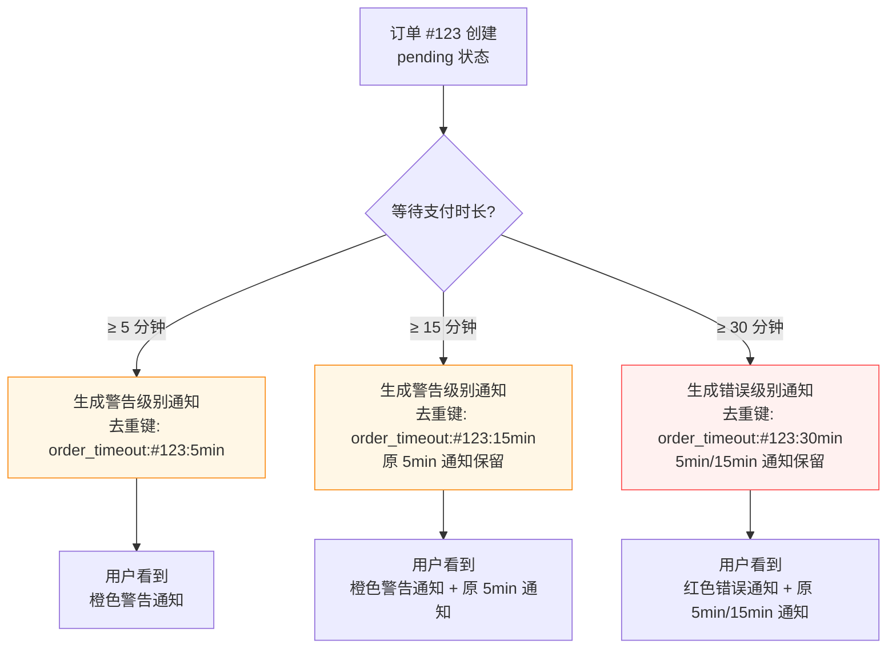
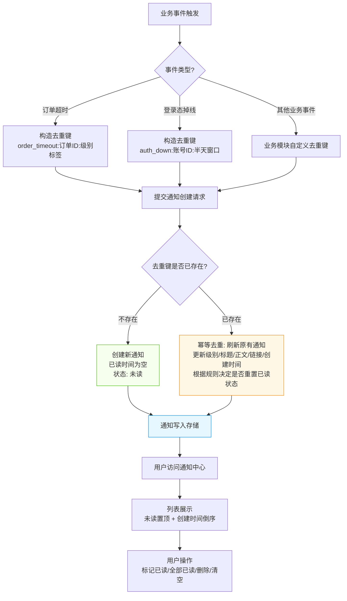

# 闲鱼猎人「通知中心」操作手册

| 属性         | 值                                    |
| ------------ | ------------------------------------- |
| 文档版本     | v1.0                                  |
| 文档日期     | 2026-07-05                            |
| 所属项目     | 闲鱼猎人                              |
| 所属菜单     | 数据查看 → 通知中心                   |
| 文档类型     | 操作手册                              |
| 关联路由     | `/notifications`                      |
| 配套详细设计 | 通知中心-详细设计 v1.0                |
| 目标读者     | 运营 / 管理员                         |

> 本手册面向最终用户（运营 / 管理员），讲解「数据查看 → 通知中心」菜单的使用方式、字段含义与常见问题。技术实现细节请参阅配套详细设计文档。

---

## 目录

- [0. 阶段交接声明](#0-阶段交接声明)
- [1. 功能简介](#1-功能简介)
- [2. 入口与导航](#2-入口与导航)
- [3. 界面布局](#3-界面布局)
- [4. 操作指南](#4-操作指南)
  - [4.1 查看通知列表](#41-查看通知列表)
  - [4.2 3 张统计卡片说明](#42-3-张统计卡片说明全部未读已读)
  - [4.3 状态筛选](#43-状态筛选全部未读已读)
  - [4.4 分类筛选](#44-分类筛选5-类orderauthsystemconfigtask)
  - [4.5 级别筛选](#45-级别筛选3-级infowarnerr)
  - [4.6 标记单条已读](#46-标记单条已读)
  - [4.7 全部标记已读](#47-全部标记已读)
  - [4.8 清空已读通知](#48-清空已读通知)
  - [4.9 删除单条通知](#49-删除单条通知)
  - [4.10 URL 状态恢复](#410-url-状态恢复statusunreadreadall)
  - [4.11 点击通知跳转](#411-点击通知跳转link-字段)
  - [4.12 通知去重机制说明](#412-通知去重机制说明dedup_key)
- [5. 字段说明](#5-字段说明)
- [6. 常见问题 FAQ](#6-常见问题-faq)
- [7. 注意事项与限制](#7-注意事项与限制)
- [8. 关联功能](#8-关联功能)
- [9. 快捷键与技巧](#9-快捷键与技巧)
- [10. 修订记录](#10-修订记录)
- [11. 附录](#11-附录)

---

## 0. 阶段交接声明

```
- 当前阶段：通知中心操作手册编写（v1.0） ✅ 已完成
- 下一阶段：价格行情操作手册编写
- 下一阶段智能体：文档编写智能体
- 下一阶段技能：文档编写
- 交接上下文：通知中心操作手册 v1.0 已完成，11 章节齐全，面向运营/管理员最终用户。覆盖菜单入口、3 张统计卡、3 级别/5 分类筛选、单条/全部已读、清空/删除、URL 状态恢复、跳转链接、幂等去重机制说明，含 12 条 FAQ、8+ 条注意事项、关联功能清单、快捷键与技巧、修订记录、附录对照表。明确区分通知中心（/notifications，数据查看）与通知渠道（/config/notifier，配置管理）边界。
```

---

## 1. 功能简介

通知中心是闲鱼猎人系统的**业务通知统一入口**，集中展示订单超时、登录态失效、配置变更、任务异常等系统业务事件。

### 1.1 核心能力

| 能力         | 说明                                                          |
| ------------ | ------------------------------------------------------------- |
| 通知展示     | 列表展示所有业务通知，未读置顶 + 创建时间倒序                 |
| 统计概览     | 顶部 3 张统计卡片：全部 / 未读 / 已读                         |
| 状态筛选     | 全部 / 未读 / 已读 三态切换，URL 状态同步                     |
| 分类筛选     | 5 类业务分类：订单 / 登录 / 系统 / 配置 / 任务                |
| 级别筛选     | 3 档严重级别：信息 / 警告 / 错误                              |
| 已读管理     | 单条标记已读、全部标记已读                                    |
| 清理能力     | 清空已读通知（保留未读）、删除单条通知                        |
| 跳转入口     | 点击通知可通过附带链接跳转到对应业务页面                       |
| 幂等去重     | 同一业务事件反复触发只保留一条，事件升级时刷新级别与文案      |
| 分级告警     | 订单超时 5min/15min/30min 三级升级，让用户感知"事情在变严重" |

### 1.2 谁应该使用

| 角色     | 典型场景                                                       |
| -------- | -------------------------------------------------------------- |
| 日常运维 | 定期查看通知中心、点击顶栏铃铛查看未读数                      |
| 失效恢复 | 触发登录态掉线后，进入通知中心查看告警并跳转重新登录          |
| 调试排查 | 排查订单超时问题，筛选"订单"分类查看超时时间与升级路径        |
| 异常处置 | 收到错误级别通知后，点击跳转链接直达业务页面处理              |

> **提示**：通知中心仅展示"系统内业务通知"，外部推送（钉钉 / Bark / nfy 等 8 渠道）由「配置管理 → 通知渠道」菜单管理，详见 §7 与 §8。

---

## 2. 入口与导航

### 2.1 菜单入口

通知中心位于侧边栏「数据查看」分组下，菜单元数据如下：

| 属性         | 值                  |
| ------------ | ------------------- |
| 菜单名称     | 通知中心            |
| 所属分组     | 数据查看            |
| 图标         | 铃铛（BellOutlined）|
| 路由路径     | `/notifications`    |
| 排序         | 第 17 位            |
| 默认可见     | 是                  |

### 2.2 进入方式

| 进入方式            | 操作步骤                                                              |
| ------------------- | --------------------------------------------------------------------- |
| 侧边栏菜单点击      | 展开侧边栏「数据查看」分组 → 点击「通知中心」                         |
| 顶栏铃铛点击        | 点击页面顶部铃铛图标 → 跳转到通知中心                                 |
| 浏览器地址栏直接访问| 在地址栏输入 `/notifications`                                         |
| URL 分享链接        | 同事分享带 `?status=unread` 等查询参数的链接，打开后自动恢复筛选状态 |
| 多 Sheet 页切换     | 已打开通知中心 sheet 后，点击左侧标签栏对应标签切换回该页面           |
| Command Palette     | 按 `Ctrl+K` 打开命令面板 → 模糊搜索"通知中心" → 选中                  |

### 2.3 顶栏铃铛

页面顶部铃铛图标会显示未读数徽标（如未读 3 时显示 "3"），点击铃铛可快速跳转到通知中心。未读数为 0 时不显示数字。

> **提示**：铃铛未读数与通知中心列表是两个独立查询，未读数加载失败时不会阻塞通知中心列表展示。

---

## 3. 界面布局

通知中心页面采用单页布局，自上而下分为三个区域：

```
┌─────────────────────────────────────────────────────────────┐
│  顶部统计区（3 张卡片横向排列）                              │
│  ┌─────────────┐  ┌─────────────┐  ┌─────────────┐         │
│  │  全部统计   │  │  未读统计   │  │  操作区     │         │
│  │             │  │  （红色高亮）│  │ 全部标记已读│         │
│  │             │  │             │  │ 清空已读    │         │
│  └─────────────┘  └─────────────┘  └─────────────┘         │
├─────────────────────────────────────────────────────────────┤
│  通知列表卡                                                  │
│  ┌─────────────────────────────────────────────────────────┐│
│  │ 通知列表  [刷新]            [全部] [未读] [已读]         ││
│  ├─────────────────────────────────────────────────────────┤│
│  │ ● [警告][订单] 订单 #123 已等待支付 15min  2 分钟前     ││
│  │   订单 #123（¥299.00）已超过 15 分钟未支付...           ││
│  │   查看详情 →                [标记已读] [删除]           ││
│  ├─────────────────────────────────────────────────────────┤│
│  │ ● [错误][登录] 闲鱼登录态已失效  10 分钟前              ││
│  │   账号 xxx 的登录态已掉线，请尽快重新扫码登录...        ││
│  │   查看详情 →                [标记已读] [删除]           ││
│  └─────────────────────────────────────────────────────────┘│
└─────────────────────────────────────────────────────────────┘
```

### 3.1 顶部统计区

3 张卡片横向排列（每张占 1/3 宽度）：

| 卡片位置 | 卡片名称     | 内容说明                                                   |
| -------- | ------------ | ---------------------------------------------------------- |
| 左侧     | 全部统计     | 显示通知总数（含已读 + 未读）                              |
| 中间     | 未读统计     | 显示未读数；未读数 > 0 时数字红色高亮                      |
| 右侧     | 操作区       | 包含两个按钮：全部标记已读、清空已读                       |

### 3.2 通知列表卡

| 区域         | 内容                                                                 |
| ------------ | -------------------------------------------------------------------- |
| 卡片标题     | "通知列表" + 刷新按钮（鼠标悬停提示"刷新"）                          |
| 卡片右上角   | 筛选按钮组：全部 / 未读 / 已读（当前选中项高亮）                     |
| 列表项       | 每条通知包含：未读红点（如未读）、级别标签、分类标签、标题、创建时间、消息正文、查看详情链接、操作按钮 |
| 空状态       | 列表为空时显示对应文案（"暂无通知" / "没有未读通知"）                |

### 3.3 单条通知结构

每条通知在列表中包含以下视觉元素：

| 元素         | 说明                                                                 |
| ------------ | -------------------------------------------------------------------- |
| 未读红点     | 未读项左侧显示红色圆点；已读项无标记                                 |
| 级别标签     | 信息（蓝色）/ 警告（橙色）/ 错误（红色），与级别一一对应             |
| 分类标签     | 订单 / 登录 / 系统 / 配置 / 任务，与业务分类一一对应                 |
| 标题         | 通知标题；未读项标题加粗，已读项标题常规字重                         |
| 创建时间     | 显示通知创建的相对时间                                               |
| 消息正文     | 通知详细内容                                                         |
| 查看详情链接 | 当通知附带跳转链接时显示"查看详情 →"，新窗口打开                     |
| 标记已读按钮 | 仅未读项显示此按钮                                                   |
| 删除按钮     | 所有项均显示，点击后二次确认                                         |

---

## 4. 操作指南

### 4.1 查看通知列表

**场景**：进入通知中心查看所有业务通知。

**操作步骤**：

1. 通过侧边栏菜单或顶栏铃铛进入通知中心
2. 页面加载后，列表默认按"未读置顶 + 创建时间倒序"展示
3. 列表顶部显示 3 张统计卡片，反映当前通知数据概览
4. 如需刷新列表，点击通知列表卡标题旁的刷新按钮

**排序规则**：

- 未读通知排在已读通知之前
- 同状态内按创建时间从新到旧排列

> **提示**：列表不会自动轮询刷新，依赖手动刷新或筛选切换触发加载。如需查看最新通知，请点击刷新按钮。

### 4.2 3 张统计卡片说明（全部/未读/已读）

顶部统计区展示 3 张卡片，分别反映通知数据概览：

| 卡片     | 数据来源                       | 说明                                                 |
| -------- | ------------------------------ | ---------------------------------------------------- |
| 全部     | 通知总数                       | 系统中所有业务通知的总条数（含已读 + 未读）          |
| 未读     | 未读数独立查询                 | 当前未读通知条数；> 0 时数字红色高亮                 |
| 已读     | 全部数 - 未读数                | 当前已读通知条数                                     |

**视觉提示**：

- 未读数 > 0 时，未读卡片数字以红色显示，提示用户有待处理事项
- 未读数 = 0 时，未读卡片数字以常规颜色显示

> **提示**：未读数采用独立轻量查询，与列表分页查询分开，避免列表翻页时反复全量计算，性能更优。

### 4.3 状态筛选（全部/未读/已读）

**场景**：按已读状态筛选通知列表。

**操作步骤**：

1. 在通知列表卡右上角找到筛选按钮组
2. 点击三个按钮之一：
   - **全部**：展示所有通知（默认）
   - **未读**：仅展示未读通知
   - **已读**：仅展示已读通知
3. 当前选中的按钮高亮显示（主色调）
4. 切换筛选后，URL 会自动同步为 `?status=unread` 或 `?status=read`（"全部"时不带参数）

**状态说明**：

通知中心**无独立的 status 字段**，状态由"已读时间"字段派生：

| 派生状态 | 判定条件               |
| -------- | ---------------------- |
| 未读     | 已读时间为空           |
| 已读     | 已读时间不为空         |
| 全部     | 不做过滤               |

> **提示**：筛选状态会同步到 URL，刷新页面或分享链接均可恢复筛选视图，详见 §4.10。

### 4.4 分类筛选（5 类：order/auth/system/config/task）

**场景**：按业务分类筛选通知，快速定位某一类业务事件。

**5 类业务分类**：

| 分类值   | 中文文案 | 含义                                       |
| -------- | -------- | ------------------------------------------ |
| `order`  | 订单     | 订单超时、订单状态异常等                   |
| `auth`   | 登录     | 闲鱼登录态失效、Cookie 过期等              |
| `system` | 系统     | 系统级事件（启动 / 关闭 / 资源告警）       |
| `config` | 配置     | 配置变更、配置校验失败等                   |
| `task`   | 任务     | 任务状态变更、任务异常等                   |

**操作步骤**：

1. 在通知列表中查看每条通知的分类标签
2. 通过分类标签的颜色或文案识别业务来源
3. 如需查看某分类的全部通知，可结合状态筛选与人工浏览

> **提示**：分类标签与级别标签同时显示在通知标题前，便于快速识别业务类型与严重程度。当前版本未提供分类筛选按钮组，主要通过状态筛选与人工浏览结合方式定位。

### 4.5 级别筛选（3 级：info/warn/err）

**场景**：按严重级别筛选通知，优先处理错误级别事件。

**3 档通知级别**：

| 级别值  | 中文文案 | 标签颜色 | 触发示例                             |
| ------- | -------- | -------- | ------------------------------------ |
| `info`  | 信息     | 蓝色     | 系统提示、配置变更通知               |
| `warn`  | 警告     | 橙色     | 订单 5min/15min 未支付、系统异常     |
| `err`   | 错误     | 红色     | 订单 30min 未支付、登录态失效        |

**操作建议**：

- 优先处理 `err`（错误）级别通知，通常代表需要立即介入
- `warn`（警告）级别通知表示事件正在升级，建议关注
- `info`（信息）级别通知为常规提示，可按需查看

> **提示**：级别标签颜色与文案一一对应，蓝色 = 信息、橙色 = 警告、红色 = 错误。建议每次进入通知中心先扫描红色错误通知。

### 4.6 标记单条已读

**场景**：处理完某条通知后，将其标记为已读。

**操作步骤**：

1. 在通知列表中找到目标未读通知（左侧有红色圆点）
2. 点击通知右侧的"标记已读"按钮
3. 通知立即变为已读状态：
   - 红色圆点消失
   - 标题字重变为常规
   - "标记已读"按钮隐藏
   - 未读统计数减 1

**幂等设计**：

- 已读项不会再显示"标记已读"按钮，避免冗余操作
- 即使通过其他途径重复触发标记已读，已读时间不会被重复更新

> **提示**：标记已读采用乐观更新机制，点击后界面立即响应，无需等待服务器返回。如标记失败会自动回滚并提示错误。

### 4.7 全部标记已读

**场景**：一次性将所有未读通知标记为已读，常用于"打开通知中心已浏览完毕"的场景。

**操作步骤**：

1. 在顶部统计区右侧的"操作区"卡片中找到"全部标记已读"按钮
2. 查看按钮状态：
   - 未读数 = 0 时按钮禁用，悬停提示"没有未读通知"
   - 未读数 > 0 时按钮可点击
3. 点击按钮，所有未读通知立即变为已读状态
4. 未读统计数归零，红色高亮消失

**响应行为**：

- 点击后所有未读项的红色圆点消失
- 标题字重变为常规
- "标记已读"按钮全部隐藏
- 操作完成后界面提示更新的条数

> **提示**：全部标记已读后不会主动回滚，如操作失败会提示错误并依赖重新加载恢复正确状态。建议在确认已浏览完毕后再执行此操作。

### 4.8 清空已读通知

**场景**：已读通知积累过多时，清空已读项腾出空间，同时保留未读通知。

**操作步骤**：

1. 在顶部统计区右侧的"操作区"卡片中找到"清空已读"按钮
2. 查看按钮状态：
   - 已读数 = 0 时按钮禁用
   - 已读数 > 0 时按钮可点击
3. 点击按钮，弹出二次确认对话框
4. 确认对话框提示"此操作不可恢复，未读通知将保留"
5. 点击"确认"执行清空操作
6. 已读通知全部移除，未读通知保留

**重要说明**：

- **仅清空已读项**：未读通知不会被清空，可放心使用
- **不可恢复**：清空后无法撤销，请谨慎确认
- **不影响未读数**：清空操作后未读数保持不变

> **提示**：建议定期清空已读通知，避免列表过长影响浏览体验。如需保留某些已读通知作为参考，请使用"删除单条"代替批量清空。

### 4.9 删除单条通知

**场景**：删除某条不需要的通知（无论已读或未读）。

**操作步骤**：

1. 在通知列表中找到目标通知
2. 点击通知右侧的"删除"按钮
3. 弹出二次确认对话框
4. 点击"确认"执行删除
5. 通知从列表中移除：
   - 如删除的是未读项，未读统计数减 1
   - 全部统计数减 1

**与清空已读的区别**：

| 操作         | 影响范围                 | 是否区分已读未读 | 是否可恢复 |
| ------------ | ------------------------ | ---------------- | ---------- |
| 删除单条     | 仅指定一条通知          | 不区分           | 不可恢复   |
| 清空已读     | 所有已读通知            | 仅已读           | 不可恢复   |

> **提示**：删除采用乐观更新，点击后立即从列表移除。如删除失败会自动回滚并提示错误。

### 4.10 URL 状态恢复（?status=unread/read/all）

**场景**：刷新页面或分享链接时，自动恢复筛选状态。

**支持的 URL 查询参数**：

| URL 参数         | 恢复后的筛选状态 |
| ---------------- | ---------------- |
| `?status=unread` | 未读             |
| `?status=read`   | 已读             |
| `?status=all`    | 全部             |
| 不带参数         | 全部（默认）     |
| 无效值           | 全部（回退默认） |

**操作场景**：

| 场景             | 行为                                                                 |
| ---------------- | -------------------------------------------------------------------- |
| 切换筛选状态     | URL 自动同步为 `?status=unread` 或 `?status=read`                    |
| 刷新页面         | 读取 URL 查询参数，恢复对应筛选状态                                  |
| 分享链接给同事   | 同事打开链接后自动恢复到分享时的筛选状态                             |
| 浏览器前进/后退  | URL 变化时筛选状态随之切换                                           |

**实现细节**：

- 仅在筛选状态不为"全部"时写入 URL，保持 URL 简洁
- URL 更新采用 `replace` 模式，不污染浏览器历史栈
- 无效值（如 `?status=foo`）自动回退为"全部"

> **提示**：分享未读筛选链接给同事时，对方打开后看到的是他自己的未读通知，不是你的未读通知（业务通知是系统级单用户数据，无多用户隔离）。

### 4.11 点击通知跳转（link 字段）

**场景**：通知附带跳转链接时，点击链接直达对应业务页面处理问题。

**操作步骤**：

1. 在通知列表中查看通知正文下方是否有"查看详情 →"链接
2. 点击链接，在新窗口打开对应业务页面
3. 在业务页面完成相关操作（如重新登录、处理超时订单等）

**常见跳转目标**：

| 通知类型         | 跳转目标示例                | 用途                                 |
| ---------------- | --------------------------- | ------------------------------------ |
| 订单超时         | 订单管理页面带订单引用参数  | 直达该订单详情，人工接管             |
| 登录态失效       | 仪表盘登录入口              | 跳转到登录页重新扫码登录             |
| 其他业务通知     | 对应业务页面                | 直达相关处理入口                     |

**链接长度限制**：

- 跳转链接最长 500 字符，超出会被系统拒绝创建

> **提示**：跳转链接在新浏览器窗口打开，使用 `rel="noreferrer"` 安全属性，避免被目标页面通过 `window.opener` 漏洞访问原页面。

### 4.12 通知去重机制说明（dedup_key）

**场景**：理解为什么同一业务事件反复触发时，通知列表不会堆积重复条目。

**设计目标**：

- 同一业务事件在通知中心只显示一条
- 事件升级时（如订单超时从 5 分钟升级到 15 分钟）能更新级别与文案
- 用户已读状态在事件未升级时尽量保留

**去重原理**：

每条通知创建时携带一个**业务去重键**（dedup_key），系统通过此键识别同一业务事件：

- 同一业务事件反复触发 → 去重键稳定不变 → 重复插入触发**幂等去重**，只刷新原有通知的级别、文案、时间，不产生新条目
- 业务事件升级 → 去重键变化 → 生成新通知，原通知保留或被新版本替换为更高级别

**当前去重键命名规范**：

| 业务场景       | 去重键模板                            | 说明                                                     |
| -------------- | ------------------------------------- | -------------------------------------------------------- |
| 订单超时       | `order_timeout:{订单ID}:{级别标签}`   | 级别标签 = 5min / 15min / 30min，升级时变化              |
| 登录态失效     | `auth_down:{账号ID}:{半天窗口}`       | 半天窗口 = 上午 / 下午，半天内反复掉线只刷一条通知       |

**订单超时升级示例**：



> **提示**：5min / 15min / 30min 是三个不同的去重键，会生成三条独立通知，让用户能感知"事情在变严重"。同级别内反复扫描（如多次 5min 扫描）只刷新同一条通知不堆积。

**登录态失效半天窗口去重示例**：

| 时间点         | 触发情况                         | 通知行为                                       |
| -------------- | -------------------------------- | ---------------------------------------------- |
| 上午 09:00     | 登录态掉线                       | 生成错误通知（去重键含 `_AM`）                 |
| 上午 10:30     | 再次检测到掉线                   | 同去重键，幂等刷新原有通知，不产生新条目       |
| 下午 14:00     | 仍未恢复登录                     | 去重键变为 `_PM`，生成新通知                   |

> **提示**：登录态失效采用半天窗口去重，避免短时间内反复掉线刷屏。如半天内已告警过，再次掉线只刷新原有通知，不会重复打扰。

---

## 5. 字段说明

通知列表中可见的字段如下表所示：

| 字段名     | 显示位置       | 类型        | 是否必填 | 说明                                                       |
| ---------- | -------------- | ----------- | -------- | ---------------------------------------------------------- |
| 级别       | 标题前标签     | 枚举        | 是       | 信息 / 警告 / 错误，对应蓝 / 橙 / 红标签                   |
| 分类       | 标题前标签     | 枚举        | 是       | 订单 / 登录 / 系统 / 配置 / 任务                           |
| 标题       | 标题区         | 文本        | 是       | 通知标题，未读项加粗显示                                   |
| 创建时间   | 标题区右侧     | 时间戳      | 是       | 通知创建时间，以相对时间显示                               |
| 消息正文   | 描述区         | 长文本      | 是       | 通知详细内容                                               |
| 跳转链接   | 描述区底部     | URL（可选）| 否       | 显示为"查看详情 →"，点击在新窗口打开                       |
| 已读状态   | 列表项左侧     | 派生        | 是       | 由已读时间派生：已读时间为空 = 未读，否则为已读            |
| 未读红点   | 列表项左侧     | 视觉标记    | 是       | 未读项显示红色圆点，已读项无标记                           |
| 标记已读   | 操作区         | 按钮        | 是       | 仅未读项显示                                               |
| 删除       | 操作区         | 按钮        | 是       | 所有项均显示，点击后二次确认                               |

**统计卡片字段**：

| 卡片     | 字段     | 说明                                   |
| -------- | -------- | -------------------------------------- |
| 全部卡   | 全部数   | 通知总数（已读 + 未读）                |
| 未读卡   | 未读数   | 当前未读条数；> 0 时红色高亮           |
| 已读卡   | 已读数   | 当前已读条数（= 全部数 - 未读数）      |

> **提示**：通知中心**无独立的 status 字段**，已读/未读状态完全由"已读时间"字段派生。已读时间为空 = 未读，已读时间不为空 = 已读。

---

## 6. 常见问题 FAQ

### Q1：通知中心和通知渠道有什么区别？

**A**：两者是完全不同的两个菜单：

- **通知中心**（数据查看菜单，路径 `/notifications`）：展示系统内业务通知，支持未读统计、已读管理、清空等操作，是用户查看"哪些事需要我处理"的入口
- **通知渠道**（配置管理菜单，路径 `/config/notifier`）：管理 8 个外部推送渠道（钉钉 / Bark / nfy / Server酱 / PushPlus / Telegram / 企业微信 / Webhook）的凭据、订阅事件、免打扰时段

二者数据流不交叉，菜单归属不同分类，仅图标同为铃铛。详见 §7 与 §11 附录对比表。

### Q2：通知有哪些级别？

**A**：3 档级别：

| 级别 | 颜色 | 文案 | 典型场景                             |
| ---- | ---- | ---- | ------------------------------------ |
| 信息 | 蓝色 | 信息 | 系统提示、配置变更通知               |
| 警告 | 橙色 | 警告 | 订单 5min/15min 未支付、系统异常     |
| 错误 | 红色 | 错误 | 订单 30min 未支付、登录态失效        |

建议优先处理错误级别通知。

### Q3：通知的已读/未读状态是怎么表示的？

**A**：通知中心**无独立的 status 字段**，状态由"已读时间"字段派生：

- 已读时间为空 → 未读
- 已读时间不为空 → 已读

筛选"未读/已读"时，系统将查询参数翻译为对应的已读时间条件。

### Q4：通知有哪些业务分类？

**A**：5 类业务分类：

| 分类 | 文案 | 含义                                       |
| ---- | ---- | ------------------------------------------ |
| 订单 | 订单 | 订单超时、订单状态异常等                   |
| 登录 | 登录 | 闲鱼登录态失效、Cookie 过期等              |
| 系统 | 系统 | 系统级事件（启动 / 关闭 / 资源告警）       |
| 配置 | 配置 | 配置变更、配置校验失败等                   |
| 任务 | 任务 | 任务状态变更、任务异常等                   |

### Q5：通知去重是怎么实现的？

**A**：基于**业务去重键**（dedup_key）+ **幂等去重**机制：

- 每条通知创建时携带一个业务去重键，标识业务事件的唯一性
- 同一去重键重复插入时触发幂等去重，只刷新原有通知的级别、文案、时间，不产生新条目
- 业务事件升级时（如订单超时从 5 分钟到 15 分钟）使用不同去重键，生成新通知让用户感知升级

### Q6：清空已读通知会清掉未读的吗？

**A**：**不会**。"清空已读"按钮仅清空已读通知，未读通知会完整保留。点击后会弹出二次确认对话框，明确提示"此操作不可恢复，未读通知将保留"。

### Q7：删除单条通知和清空已读有什么区别？

**A**：

| 操作         | 影响范围                 | 是否区分已读未读 |
| ------------ | ------------------------ | ---------------- |
| 删除单条     | 仅指定一条通知          | 不区分           |
| 清空已读     | 所有已读通知            | 仅已读           |

如需保留某些已读通知作为参考，请使用"删除单条"代替"清空已读"。

### Q8：URL 中的 status 参数有什么用？

**A**：URL 查询参数 `?status=unread/read/all` 用于同步筛选状态：

- 切换筛选时 URL 自动更新
- 刷新页面时自动恢复筛选状态
- 分享链接给同事时对方打开后自动恢复筛选视图

无效值（如 `?status=foo`）会自动回退为"全部"。

### Q9：订单超时通知为什么会升级？

**A**：通知引擎定义了三档阈值：

| 阈值     | 级别 | 去重键后缀 |
| -------- | ---- | ---------- |
| 5 分钟   | 警告 | 5min       |
| 15 分钟  | 警告 | 15min      |
| 30 分钟  | 错误 | 30min      |

每档使用不同的去重键，扫描时从大到小匹配，确保最严重级别胜出。同级别内反复扫描只刷新同一条通知不堆积，跨级别升级会生成新通知。

### Q10：登录态失效为什么有时候不告警？

**A**：两种情况不告警：

1. **从未登录过**：系统未记录过账号 ID，避免每个匿名访问都生成噪音
2. **半天内已告警过**：去重键按"半天窗口"（上午 / 下午）归一，半天内反复掉线只刷一条通知，不会重复打扰

如需重新触发告警，等待半天窗口切换即可。

### Q11：通知是怎么生成的？用户能手动创建吗？

**A**：通知由系统自动生成，来源包括：

- **通知引擎**：在高频接口路径上"顺手"触发检测（如用户访问认证接口时检测登录态、扫描订单超时）
- **业务模块内部调用**：订单模块、配置模块等在业务事件发生时创建通知

用户前端**无"新建通知"入口**，通知完全由系统按业务事件自动生成。

### Q12：通知引擎失败会影响系统正常使用吗？

**A**：**不会**。通知引擎采用失败隔离设计：

- 单条规则失败不影响其他规则
- 通知引擎失败不影响主业务接口的正常返回
- 异常被捕获后仅记录告警日志，不抛出错误

即使通知引擎完全失效，订单管理、登录认证等主业务功能仍能正常使用。

### Q13：顶栏铃铛未读数和通知中心列表是同一个数据源吗？

**A**：是同一数据源，但采用两个独立查询：

- 顶栏铃铛：调用未读数独立查询，仅返回数字，性能更优
- 通知中心列表：调用列表查询，返回完整通知数据

未读数加载失败时不会阻塞通知中心列表展示，反之亦然。

### Q14：通知列表会自动刷新吗？

**A**：**不会**。通知列表依赖手动刷新或筛选切换触发加载：

- 点击通知列表卡标题旁的刷新按钮可重新加载
- 切换筛选状态会触发重新加载
- 顶栏铃铛未读数会定期轮询，但列表不会自动同步

如需查看最新通知，请手动点击刷新按钮。

### Q15：免打扰时段会影响通知中心吗？

**A**：**不会**。免打扰时段是「通知渠道」菜单的能力，仅作用于外部推送（8 个渠道）：

- 通知中心的通知只写入数据库，不主动推送外部
- 用户何时查看通知中心由自己决定，不存在"打扰"问题
- 免打扰时段的"关键级别永远可达"特性仅适用于外部推送，与通知中心无关

---

## 7. 注意事项与限制

### 7.1 通知中心与通知渠道是两个完全不同的菜单

| 对比项     | 通知中心                            | 通知渠道                              |
| ---------- | ----------------------------------- | ------------------------------------- |
| 菜单分组   | 数据查看                            | 配置管理                              |
| 路由路径   | `/notifications`                    | `/config/notifier`                    |
| 排序       | 第 17 位                            | 第 104 位                             |
| 主要能力   | 业务通知展示、已读管理、清空        | 8 渠道推送配置、订阅事件、免打扰时段  |
| 数据来源   | 系统内业务通知                      | 事件总线 + 推送结果                   |
| 是否推送外部 | 否（仅存数据库，用户主动查看）    | 是（多渠道 fan-out 推送）             |

> **重要**：两个菜单图标同为铃铛，但归属不同分组，路由路径不同，数据流不交叉。请勿混淆。

### 7.2 通知中心无独立 status 字段

通知中心**无独立的 status 字段**，已读/未读状态完全由"已读时间"字段派生：

- 已读时间为空 → 未读
- 已读时间不为空 → 已读

筛选"未读/已读"时，系统将查询参数翻译为对应的已读时间条件。

### 7.3 3 级别含义与处理建议

| 级别 | 颜色 | 处理建议                                 |
| ---- | ---- | ---------------------------------------- |
| 信息 | 蓝色 | 常规提示，可按需查看                     |
| 警告 | 橙色 | 事件正在升级，建议关注                   |
| 错误 | 红色 | 需要立即介入，优先处理                   |

### 7.4 5 分类含义与业务来源

| 分类 | 业务来源                                       |
| ---- | ---------------------------------------------- |
| 订单 | 订单模块（订单超时、订单状态异常）             |
| 登录 | 认证模块（登录态失效、Cookie 过期）            |
| 系统 | 系统级事件（启动 / 关闭 / 资源告警）           |
| 配置 | 配置模块（配置变更、配置校验失败）             |
| 任务 | 任务模块（任务状态变更、任务异常）             |

### 7.5 URL 状态恢复的限制

- 仅 `?status=unread` / `?status=read` / `?status=all` 三个值有效
- 无效值自动回退为"全部"
- 分享链接打开后看到的是对方系统的通知，不是分享者的通知（业务通知是系统级单用户数据，无多用户隔离）

### 7.6 跳转链接长度限制

- 跳转链接最长 500 字符
- 业务去重键最长 200 字符
- 超出限制的通知会被系统拒绝创建

### 7.7 通知列表不自动刷新

- 列表不会自动轮询刷新
- 依赖手动刷新或筛选切换触发加载
- 顶栏铃铛未读数会定期轮询，但列表不会自动同步

### 7.8 清空操作不可恢复

- "清空已读"操作不可撤销，请谨慎确认
- "删除单条"操作同样不可恢复
- 二次确认对话框是最后一道防线，确认前请仔细核对

### 7.9 通知是系统级单用户数据

- 通知中心**无多用户隔离**，所有通知为系统级数据
- 不同账号登录看到的是同一份通知列表
- 分享筛选链接给同事时，对方看到的是他自己系统的通知，不是分享者的通知

### 7.10 顶栏铃铛与列表的独立性

- 顶栏铃铛调用未读数独立查询，与列表分页查询分开
- 未读数加载失败不会阻塞列表展示
- 列表加载失败不会影响顶栏铃铛未读数显示

---

## 8. 关联功能

通知中心与以下菜单存在联动关系：

| 关联菜单     | 菜单分组     | 关联关系                                                   |
| ------------ | ------------ | ---------------------------------------------------------- |
| 任务管理     | 数据查看     | 任务异常时生成"任务"分类通知，点击跳转可直达任务详情       |
| 抢单记录     | 数据查看     | 订单超时生成"订单"分类通知，点击跳转可直达订单详情         |
| 事件时间线   | 数据查看     | 技术事件流（只读追加），与通知中心是两套独立体系           |
| 通知渠道     | 配置管理     | 管理 8 个外部推送渠道，与通知中心数据流不交叉              |
| 反爬登录管理 | 系统维护     | 登录态失效生成"登录"分类通知，点击跳转可直达登录入口       |
| 仪表盘       | 数据查看     | 登录态失效通知的跳转目标之一                               |
| 配置管理     | 配置管理     | 配置变更生成"配置"分类通知                                 |

### 8.1 与任务管理的联动

- 任务状态变更或异常时，系统自动生成"任务"分类通知
- 通知通常附带跳转链接，点击可直达对应任务详情页
- 在任务管理页面处理后，可回到通知中心标记已读

### 8.2 与抢单记录的联动

- 订单超时（5min/15min/30min）生成"订单"分类通知
- 通知附带订单引用参数，点击跳转可直达订单详情
- 订单超时采用三级升级机制，让用户感知事件严重程度

### 8.3 与事件时间线的边界

| 对比项     | 通知中心                       | 事件时间线                     |
| ---------- | ------------------------------ | ------------------------------ |
| 数据性质   | 业务通知                       | 技术事件流                     |
| 操作能力   | 可读、可删、可标记已读         | 只读追加，不可修改             |
| 已读状态   | 区分已读/未读                  | 不区分已读                     |
| 触发方式   | 通知引擎检测业务事件           | 实时事件流推送                 |

### 8.4 与通知渠道的边界

| 对比项       | 通知中心                       | 通知渠道                       |
| ------------ | ------------------------------ | ------------------------------ |
| 菜单分组     | 数据查看                       | 配置管理                       |
| 主要能力     | 业务通知展示与已读管理         | 8 渠道推送配置与免打扰时段     |
| 数据来源     | 系统内业务事件                 | 事件总线订阅                   |
| 是否推送外部 | 否                             | 是                             |
| 免打扰时段   | 不适用                         | 适用（关键级别永远可达）       |

> **提示**：通知中心管"系统内通知存储与展示"，通知渠道管"多渠道推送配置"。二者解耦设计，互不依赖。

### 8.5 与反爬登录管理的联动

- 闲鱼登录态失效时，系统生成"登录"分类的错误级别通知
- 通知附带仪表盘登录入口链接，点击可跳转重新扫码登录
- 半天窗口去重机制避免反复掉线刷屏

---

## 9. 快捷键与技巧

### 9.1 快捷键

| 快捷键              | 作用                                       |
| ------------------- | ------------------------------------------ |
| `Ctrl+K`（或 `⌘+K`）| 打开命令面板，模糊搜索"通知中心"快速进入   |
| `Escape`            | 关闭命令面板                               |
| `g` 然后按 `n`      | 快速跳转到通知中心（如已配置）             |
| `F5` 或 `Ctrl+R`    | 刷新页面，URL 状态会自动恢复               |

> **提示**：在输入框、文本域、下拉框内不触发快捷键，避免干扰正常输入。

### 9.2 实用技巧

#### 技巧一：用 URL 分享筛选状态

将通知中心筛选为"未读"后，浏览器地址栏会显示 `?status=unread`，复制此 URL 分享给同事，对方打开后会自动恢复到未读筛选视图。

#### 技巧二：优先处理错误级别通知

进入通知中心后，先扫描红色"错误"标签的通知，这些通常需要立即介入（如登录态失效、订单 30 分钟未支付）。处理完后再查看橙色"警告"通知。

#### 技巧三：定期清空已读通知

已读通知积累过多会影响列表浏览体验。建议每周或每月定期执行"清空已读"操作，保留未读通知完整无缺。

#### 技巧四：善用"全部标记已读"

如已通过其他渠道（如外部推送）了解所有通知内容，可直接点击"全部标记已读"快速归档，无需逐条点击。

#### 技巧五：点击跳转链接直达业务页面

通知附带的"查看详情 →"链接可直接跳转到对应业务页面（如订单详情、登录入口），无需手动在菜单中查找。

#### 技巧六：理解订单超时升级机制

订单超时通知会从 5min（警告）→ 15min（警告）→ 30min（错误）逐级升级，每级生成独立通知。看到 30min 错误通知时，说明订单可能已超时关闭，需立即处理。

#### 技巧七：理解登录态半天窗口去重

登录态失效采用半天窗口去重，上午和下午分别生成独立通知。如上午已处理过登录态失效但下午再次掉线，会看到新的错误通知。

#### 技巧八：刷新按钮手动同步

通知列表不会自动刷新，如需查看最新通知，点击通知列表卡标题旁的刷新按钮即可重新加载。

---

## 10. 修订记录

| 版本 | 日期       | 修订人     | 修订内容                                                                                     |
| ---- | ---------- | ---------- | -------------------------------------------------------------------------------------------- |
| v1.0 | 2026-07-05 | 文档智能体 | 初版发布。基于通知中心详细设计 v1.0 与需求规格 v1.0 编写，11 章节齐全，面向运营/管理员最终用户。涵盖菜单入口、3 张统计卡、3 级别/5 分类筛选、单条/全部已读、清空/删除、URL 状态恢复、跳转链接、幂等去重机制说明，含 15 条 FAQ、10 条注意事项、关联功能清单、快捷键与技巧、附录对照表与去重流程图。 |

---

## 11. 附录

### 11.1 3 级别对照表

| 级别值   | 中文文案 | 标签颜色 | 触发示例                             | 处理建议             |
| -------- | -------- | -------- | ------------------------------------ | -------------------- |
| `info`   | 信息     | 蓝色     | 系统提示、配置变更通知               | 按需查看             |
| `warn`   | 警告     | 橙色     | 订单 5min/15min 未支付、系统异常     | 建议关注             |
| `err`    | 错误     | 红色     | 订单 30min 未支付、登录态失效        | 立即处理             |

### 11.2 5 分类对照表

| 分类值    | 中文文案 | 含义                                       | 业务来源                     |
| --------- | -------- | ------------------------------------------ | ---------------------------- |
| `order`   | 订单     | 订单超时、订单状态异常等                   | 订单模块                     |
| `auth`    | 登录     | 闲鱼登录态失效、Cookie 过期等              | 认证模块                     |
| `system`  | 系统     | 系统级事件（启动 / 关闭 / 资源告警）       | 系统模块                     |
| `config`  | 配置     | 配置变更、配置校验失败等                   | 配置模块                     |
| `task`    | 任务     | 任务状态变更、任务异常等                   | 任务模块                     |

### 11.3 通知去重机制流程图



### 11.4 与「通知渠道」菜单边界对比表

| 对比项         | 通知中心                                       | 通知渠道                                       |
| -------------- | ---------------------------------------------- | ---------------------------------------------- |
| 菜单分组       | 数据查看                                       | 配置管理                                       |
| 菜单排序       | 第 17 位                                       | 第 104 位                                      |
| 路由路径       | `/notifications`                               | `/config/notifier`                             |
| 主要能力       | 业务通知展示、已读管理、清空                   | 8 渠道推送配置、订阅事件、免打扰时段           |
| 数据来源       | 系统内业务事件                                 | 事件总线订阅                                   |
| 触发方式       | 通知引擎在高频接口路径上顺手触发               | 订阅事件总线自动触发                           |
| 是否推送外部   | 否（仅存数据库，用户主动查看）                 | 是（多渠道 fan-out 推送）                      |
| 免打扰时段     | 不适用                                         | 适用（关键级别永远可达）                       |
| 支持渠道       | 无（仅系统内展示）                             | 8 个：钉钉 / Bark / nfy / Server酱 / PushPlus / Telegram / 企业微信 / Webhook |
| 菜单图标       | 铃铛                                           | 铃铛（图标相同，但路径与分组不同）             |

> **重要**：两个菜单图标同为铃铛，但归属不同分组（数据查看 vs 配置管理），路由路径不同，数据流不交叉。请勿混淆。

### 11.5 通知状态派生关系

| 派生状态 | 判定条件               | URL 查询参数值 |
| -------- | ---------------------- | -------------- |
| 未读     | 已读时间为空           | `unread`       |
| 已读     | 已读时间不为空         | `read`         |
| 全部     | 不做过滤               | `all` 或不传   |

### 11.6 订单超时阈值分级表

| 阈值（分钟） | 通知级别 | 去重键后缀 | 处理建议                       |
| ------------ | -------- | ---------- | ------------------------------ |
| 5            | 警告     | 5min       | 早期预警，建议介入             |
| 15           | 警告     | 15min      | 持续未支付，需要更紧迫的提示   |
| 30           | 错误     | 30min      | 可能已超时关闭，必须立即处理   |

### 11.7 相关文档交叉引用

| 文档名称                 | 路径                                                   | 用途                                 |
| ------------------------ | ------------------------------------------------------ | ------------------------------------ |
| 通知中心-详细设计 v1.0   | `docs/02-数据查看/通知中心-详细设计.md`                | 技术设计、代码位置、开发 FAQ         |
| 通知中心-需求规格 v1.0   | `docs/02-数据查看/通知中心-需求规格.md`                | 需求规格、验收标准、测试用例         |
| 多 Sheet 页-使用说明     | `docs/02-数据查看/多sheet页-使用说明.md`               | 多 Sheet 页工作区通用操作            |
| 米其林设计系统           | `docs/standards/michelin-design-system.md`             | UI 设计规范                          |

---

**文档结束**
