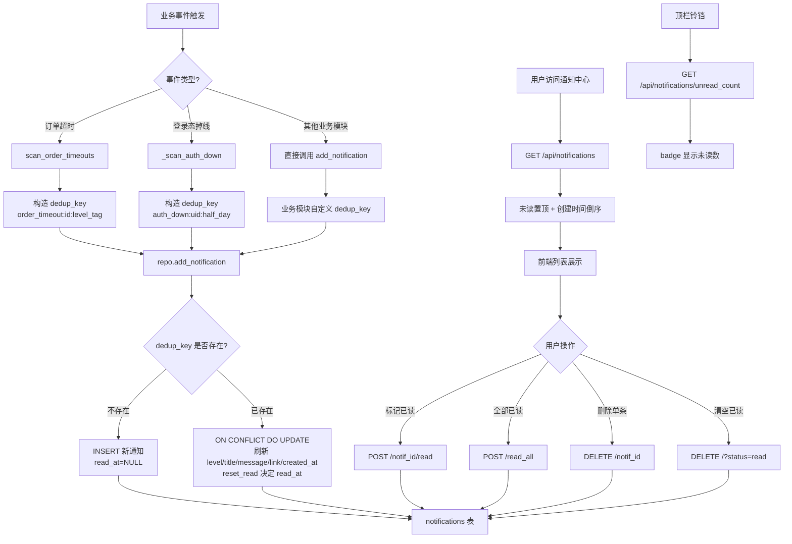
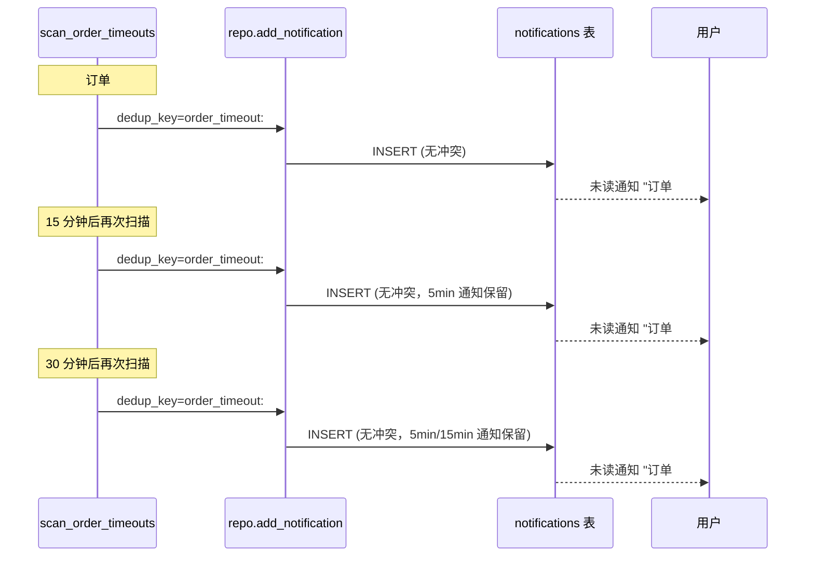
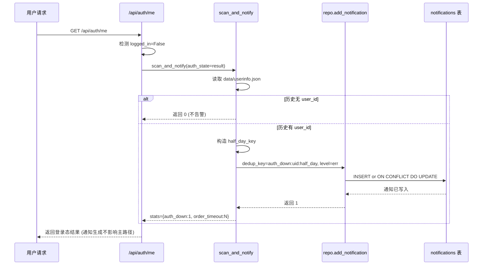

# 通知中心 详细设计文档

## 1. 文档元信息

| 属性     | 值                                       |
| -------- | ---------------------------------------- |
| 文档名称 | 通知中心-详细设计                        |
| 版本     | v1.0                                     |
| 发布日期 | 2026-07-05                               |
| 所属菜单 | 数据查看                                 |
| 关联路由 | `/notifications`                         |
| 文档用途 | 开发团队技术指导 / 智能客服向量库训练素材 |
| 维护人   | XianyuHunter 团队                        |

> 本文档为新建首版，基于当前代码实现编写。**核心边界澄清**：本文档描述的"通知中心"是数据查看类菜单（`key=notifications`，路径 `/notifications`），承载业务通知（NotificationRow）的展示与已读管理；与配置管理类菜单"通知渠道"（`key=notifier`，路径 `/config/notifier`）所管理的 8 个推送渠道（NotifierHub）**完全不同**，二者不可混淆。详见 §10。

---

## 2. 功能概述

**一句话说明**：聚合展示系统内的业务通知（订单超时、登录态掉线等），支持未读统计、单条/全部已读、按状态筛选与清空，是用户感知系统异常与待处理事件的主入口。

**核心价值**：
- 持久化存储业务通知（区别于 `/api/events/*` 只读追加的技术事件流），可读、可删、可分页；
- 通过 `dedup_key` + SQLite `ON CONFLICT DO UPDATE` 实现幂等去重，同一业务事件反复触发不堆积；
- 未读数独立端点（`/api/notifications/unread_count`），供顶栏铃铛 badge 单独拉取，避免列表分页时反复全量计算；
- 通知引擎（`notification_engine.py`）零侵入挂载在 `auth_me` 等高频接口路径上，无需引入定时器即可触发；
- 超时订单分级告警（5min/15min/30min），通过不同 `dedup_key` 实现"事情在变严重"的升级体验；
- 与推送渠道（NotifierHub）解耦：本菜单只负责"系统内通知"的存储与展示，外部推送由独立的"通知渠道"菜单管理。

---

## 3. 用户场景

### 场景一：查看未读通知
用户点击顶栏铃铛 badge（显示未读数 3），跳转到 `/notifications`。页面顶部三张统计卡分别显示未读 3 / 已读 12 / 操作区。下方列表默认按"未读置顶 + 创建时间倒序"展示，未读项左侧有红色圆点提示，用户逐条点击"标记已读"将其归档。

### 场景二：订单超时告警升级
某订单 `pending` 状态超过 5 分钟未支付，通知引擎扫描后生成 `level=warn`、`dedup_key=order_timeout:{order_id}:5min` 的通知；15 分钟时再次触发，`dedup_key` 变为 `...:15min`，原 5min 通知被新通知替换为更高级别；30 分钟时升级为 `level=err`。用户在通知中心看到的是当前最严重的级别。

### 场景三：登录态失效告警
用户长时间未操作，闲鱼登录态掉线。下次访问 `/api/auth/me` 时，`scan_and_notify` 检测到"上次已登录 + 本次未登录"，生成 `level=err`、`category=auth` 的"闲鱼登录态已失效"通知，附带 `/dashboard#login` 跳转链接，`dedup_key` 按"半天窗口"归一避免反复刷屏。

### 场景四：清空已读腾出空间
通知列表积累大量已读项后，用户点击"清空已读"按钮，前端二次确认后调用 `DELETE /api/notifications?status=read`，仅清空已读项，未读通知保留。

### 场景五：URL 分享筛选状态
用户筛选"未读"后将 URL 分享给同事，对方打开链接时 `?status=unread` 查询参数被解析为 `FilterStatus`，自动恢复到未读筛选视图。

---

## 4. 菜单元数据

引用 `config/menu_registry.yaml` 中 `notifications` 条目（单一事实源）：

```yaml
- key: notifications
  label: 通知中心
  icon: BellOutlined
  path: /notifications
  sort_order: 17
  default_visible: true
  category: data_view
```

> **注意**：`config/menu_registry.yaml` 中还存在另一条 `key=notifier`（label=通知渠道，path=/config/notifier，sort_order=104，category=config）的菜单项，二者 icon 同为 `BellOutlined` 但归属不同菜单分类。详见 §10 边界澄清。

---

## 5. 数据模型

### 5.1 notifications 表（NotificationRow，`db_models.py:305`）

共 **9 个字段**：

| 字段        | 类型     | 必填 | 默认值      | 说明                                                                       |
| ----------- | -------- | ---- | ----------- | -------------------------------------------------------------------------- |
| id          | Integer  | 是   | autoincrement | 主键                                                                       |
| level       | String   | 是   | `info`      | 通知级别：`info` / `warn` / `err`                                          |
| category    | String   | 是   | —           | 业务分类：`order` / `auth` / `system` / `config` / `task`                  |
| title       | String   | 是   | —           | 通知标题                                                                   |
| message     | Text     | 是   | —           | 通知正文                                                                   |
| link        | String   | 否   | NULL        | 点击跳转 URL（如 `/orders?ref=xxx`），最长 500                              |
| dedup_key   | String   | 是   | —           | 业务去重键（最长 200），同一 key 视为同一业务事件                          |
| read_at     | DateTime | 否   | NULL        | 已读时间戳；**NULL = 未读**，非空 = 已读时间                               |
| created_at  | DateTime | 否   | `_utcnow`   | 创建时间（UTC）                                                            |

### 5.2 约束与索引

| 类型             | 名称                       | 字段         | 说明                                                  |
| ---------------- | -------------------------- | ------------ | ----------------------------------------------------- |
| UniqueConstraint | `uq_notification_dedup`    | `dedup_key`  | 业务去重唯一约束，配合 `ON CONFLICT DO UPDATE` 实现幂等 |
| Index            | （自动，未命名）            | `created_at` | 创建时间索引，支持按时间倒序扫描                      |

> **注意**：`read_at` 字段未单独建索引，筛选 `unread/read` 通过 `read_at IS NULL` / `IS NOT NULL` 实现；当前数据量级下无需优化。

---

## 6. 枚举定义

### 6.1 通知级别枚举（level）

来源：`api_notifications.py:22` `_ALLOWED_LEVELS` 与 `notification_engine.py` 实际生成值。

| 值     | 含义 | 前端 Tag 颜色 | 前端文案 | 触发示例                         |
| ------ | ---- | ------------- | -------- | -------------------------------- |
| `info` | 信息 | blue          | 信息     | 系统提示、配置变更通知           |
| `warn` | 警告 | orange        | 警告     | 订单 5min/15min 未支付、系统异常 |
| `err`  | 错误 | red           | 错误     | 订单 30min 未支付、登录态失效    |

### 6.2 通知状态枚举（隐式，由 read_at 派生）

notifications 表**无独立 status 字段**，状态由 `read_at` 字段派生：

| 派生状态 | 判定条件                  | API 查询参数值 |
| -------- | ------------------------- | -------------- |
| 未读     | `read_at IS NULL`         | `unread`       |
| 已读     | `read_at IS NOT NULL`     | `read`         |
| 全部     | 无过滤                    | 不传 / `all`   |

### 6.3 业务分类枚举（category）

来源：`api_notifications.py:23` `_ALLOWED_CATEGORIES`。

| 值       | 前端文案 | 含义                                       |
| -------- | -------- | ------------------------------------------ |
| `order`  | 订单     | 订单超时、订单状态异常等                   |
| `auth`   | 登录     | 闲鱼登录态失效、Cookie 过期等              |
| `system` | 系统     | 系统级事件（启动/关闭/资源告警）           |
| `config` | 配置     | 配置变更、配置校验失败等                   |
| `task`   | 任务     | 任务状态变更、任务异常等                   |

> **校验规则**：API 创建通知时 `level` 与 `category` 必须命中白名单，否则返回 400。这是为了防止内部调用方误造出脏数据（如拼错字符串）。

---

## 7. API 端点清单

所有端点位于 `backend/xianyu_hunter/web/routes/api_notifications.py`，router 前缀 `/api/notifications`，tags=`notifications`。共 **7 个端点**。

| 方法   | 路径                              | 说明             | 请求参数                                                                                              | 响应字段                                                                 |
| ------ | --------------------------------- | ---------------- | ----------------------------------------------------------------------------------------------------- | ------------------------------------------------------------------------ |
| GET    | `/api/notifications`              | 列出通知         | Query: `status?`(unread/read/None), `limit?=50`(1-200), `offset?=0`(≥0)                              | `items[]`, `count`, `total`, `limit`, `offset`, `status`                 |
| GET    | `/api/notifications/unread_count` | 未读数           | 无                                                                                                    | `{unread}`                                                               |
| POST   | `/api/notifications`              | 创建/更新通知    | Body: `level`, `category`, `title`, `message`, `dedup_key`(必填), `link?`, `reset_read?=true`         | `{ok, item}`                                                             |
| POST   | `/api/notifications/{notif_id}/read` | 标记单条已读  | Path: `notif_id:int`                                                                                  | `{ok, id, newly_read}`                                                   |
| POST   | `/api/notifications/read_all`     | 全部标记已读     | 无                                                                                                    | `{ok, updated}`                                                          |
| DELETE | `/api/notifications/{notif_id}`   | 删除单条         | Path: `notif_id:int`                                                                                  | `{ok, id, deleted}`                                                      |
| DELETE | `/api/notifications`              | 清空（带过滤）   | Query: `status?`(unread/read/None)                                                                    | `{ok, deleted, status}`                                                  |

### 7.1 GET `/api/notifications` 列出通知

**用途**：分页查询通知列表，默认未读置顶 + 创建时间倒序。

**请求参数**（Query）：
- `status`：可选，`unread` / `read` / 不传（全部）
- `limit`：可选，默认 50，范围 1-200
- `offset`：可选，默认 0，≥0

**排序规则**（`repo_notifications.list_notifications`）：
```sql
ORDER BY read_at IS NULL DESC, created_at DESC
```
即：未读（`read_at IS NULL` 为真，desc 排在前）优先于已读，同状态内按创建时间倒序。

**响应**：
```json
{
  "items": [NotificationItem, ...],
  "count": 12,
  "total": 35,
  "limit": 50,
  "offset": 0,
  "status": "all"
}
```
> `count` 是当前页条数，`total` 是符合筛选条件的总条数（用于前端分页/计数）。

### 7.2 GET `/api/notifications/unread_count` 未读数

**用途**：顶栏铃铛 badge 单独拉取，避免列表分页时反复全量计算。

**请求参数**：无。

**响应**：`{ "unread": 3 }`

> **设计要点**：未读数独立端点而非合并到 list 响应，是因为 badge 不需要拉取完整列表，单独轻量查询性能更优。

### 7.3 POST `/api/notifications` 创建/更新通知

**用途**：业务模块内部调用 + 测试用。同 `dedup_key` 视为同一业务事件，重复调用只刷新不堆积。

**请求体**（Body，JSON）：

| 字段        | 类型    | 必填 | 校验                                | 默认值 |
| ----------- | ------- | ---- | ----------------------------------- | ------ |
| level       | str     | 否   | 必须命中 `{info,warn,err}`          | `info` |
| category    | str     | 是   | 必须命中 `{order,auth,system,config,task}` | —      |
| title       | str     | 是   | strip 后非空                        | —      |
| message     | str     | 是   | strip 后非空                        | —      |
| dedup_key   | str     | 是   | strip 后非空，长度 ≤ 200            | —      |
| link        | str     | 否   | 长度 ≤ 500                          | NULL   |
| reset_read  | bool    | 否   | —                                   | `true` |

**校验失败**返回 400，错误信息形如 `level 必须是 {'info','warn','err'} 之一`。

**响应**：`{ "ok": true, "item": NotificationItem }`

**`reset_read` 语义**（`repo_notifications.add_notification`）：
- `true`（默认）：同 `dedup_key` 已存在时，将 `read_at` 重置为 NULL（变回未读），让用户重新看到；
- `false`：保留原 `read_at` 值，不重置已读状态。

> **使用建议**：超时订单从 5min 升级到 15min 时应传 `reset_read=true`，让用户重新感知；纯文案微调可传 `false` 避免打扰。

### 7.4 POST `/api/notifications/{notif_id}/read` 标记单条已读

**用途**：用户点击某条通知的"标记已读"按钮。

**请求参数**：Path `notif_id:int`。

**响应**：`{ "ok": true, "id": 12, "newly_read": true }`

- 通知不存在返回 404；
- `newly_read=true` 表示本次实际从未读变为已读；
- `newly_read=false` 表示原本就已读（幂等：已读不报错）。

> **幂等设计**：`mark_notification_read` SQL 中带 `WHERE read_at IS NULL` 条件，已读项不会被重复更新，`rowcount=0` 即 `newly_read=false`。

### 7.5 POST `/api/notifications/read_all` 全部标记已读

**用途**：用户点击"全部标记已读"按钮（"打开通知中心"行为）。

**请求参数**：无。

**响应**：`{ "ok": true, "updated": 3 }`

`updated` 为实际更新的未读条数。

### 7.6 DELETE `/api/notifications/{notif_id}` 删除单条

**用途**：用户删除某条通知。

**请求参数**：Path `notif_id:int`。

**响应**：`{ "ok": true, "id": 12, "deleted": true }`

- 通知不存在返回 404；
- `deleted=true` 表示实际删除成功。

### 7.7 DELETE `/api/notifications` 清空（带过滤）

**用途**：批量清空通知，常见操作是"清掉已读的腾出空间"。

**请求参数**（Query）：
- `status`：可选，`unread` / `read` / 不传（全清）；其他值返回 400。

**响应**：`{ "ok": true, "deleted": 12, "status": "read" }`

> **设计要点**：默认不"全清"。前端"清空已读"按钮传 `status=read`，仅清已读项保留未读；`status` 留空仍支持全清，但前端默认走 `read`，避免误删未读。

---

## 8. 通知去重机制

### 8.1 设计目标

同一业务事件可能被反复触发（如订单超时被多次扫描、登录态掉线被多次检测），需要保证：
- 同一业务事件在通知中心只显示一条；
- 事件升级时（如 5min → 15min）能更新级别与文案，但避免堆积历史版本；
- 用户已读状态在事件未升级时尽量保留。

### 8.2 实现原理

去重基于 `dedup_key` 字段 + SQLite `ON CONFLICT DO UPDATE`，由 `repo_notifications.add_notification` 实现：

```python
stmt = sqlite_insert(NotificationRow).values(
    level=level, category=category, title=title, message=message,
    link=link, dedup_key=dedup_key,
    read_at=None,
    created_at=now,
)
stmt = stmt.on_conflict_do_update(
    index_elements=["dedup_key"],
    set_={
        "level": stmt.excluded.level,
        "category": stmt.excluded.category,
        "title": stmt.excluded.title,
        "message": stmt.excluded.message,
        "link": stmt.excluded.link,
        # reset_read=True → 用新值（None）重置为未读
        # reset_read=False → 保留原值（引用现有行的 read_at）
        "read_at": None if reset_read else NotificationRow.read_at,
        "created_at": stmt.excluded.created_at,
    },
)
```

**关键点**：
1. `dedup_key` 上有 `UniqueConstraint`（`uq_notification_dedup`），是 `ON CONFLICT DO UPDATE` 的冲突判定依据；
2. INSERT 时 `read_at` 始终写 NULL（SQLite 限制：INSERT VALUES 不能引用目标表本身列），保留旧值的语义改在 `ON CONFLICT DO UPDATE` 子句中通过 `NotificationRow.read_at` 引用现有行实现；
3. `reset_read=True`：用新值 `None` 覆盖 `read_at`，重置为未读；
4. `reset_read=False`：保留原 `read_at` 值（即 `NotificationRow.read_at`，引用冲突行的现有值）。

### 8.3 dedup_key 命名规范

`dedup_key` 由业务模块自行构造，需保证：
- 同一业务事件反复触发时 `dedup_key` 稳定不变；
- 业务事件升级时 `dedup_key` 变化（让旧通知被新版本替换为更高级别）。

当前实现中的命名规范：

| 业务场景     | dedup_key 模板                              | 说明                                                     |
| ------------ | ------------------------------------------- | -------------------------------------------------------- |
| 订单超时     | `order_timeout:{order_id}:{level_tag}`     | `level_tag` = `5min`/`15min`/`30min`，升级时变化         |
| 登录态失效   | `auth_down:{user_id}:{half_day_key}`       | `half_day_key` = `YYYYMMDD_HH_AM/PM`，半天窗口归一       |

---

## 9. 通知引擎（notification_engine.py）

文件位置：`backend/xianyu_hunter/web/services/notification_engine.py`。

### 9.1 设计原则

- **零侵入**：所有检测都通过现有 API 端点返回路径"顺手"触发，不引入新的 cron / 定时器；
- **幂等**：每条业务事件用 `dedup_key` 唯一标识，重复调用只刷新不堆积；
- **升级**：超时订单从 5min → 15min → 30min 用不同 `dedup_key`，让用户能感受到"事情在变严重"；
- **失败隔离**：通知规则失败不影响业务 API，异常被捕获后仅 `logger.warning`，返回 0。

### 9.2 规则清单

#### 规则一：OrderTimeoutRule（订单超时）

函数：`scan_order_timeouts(container) -> int`

**阈值表**（`ORDER_TIMEOUT_RULES`）：

| 阈值（分钟） | level | level_tag |
| ------------ | ----- | --------- |
| 5            | warn  | `5min`    |
| 15           | warn  | `15min`   |
| 30           | err   | `30min`   |

**扫描逻辑**：
1. 拉取最近 200 条订单（`list_orders(limit=200)`）；
2. 仅扫描 `status` 为 `pending` / `submitting` / `paying` 的订单；
3. 计算 `age_min = (now - created_at) / 60`；
4. **按阈值从大到小匹配**（确保最严重级别胜出）：第一个满足 `age_min >= thr_min` 的规则触发，构造通知并 `break`；
5. `dedup_key = order_timeout:{order_id}:{level_tag}`，`reset_read=True`。

> **为什么从大到小匹配**：5min 触发过 → 15min 才触发时，我们用 15min 的 `dedup_key`，5min 的旧通知被替换为新级别（更高 level），用户能感知到升级。

#### 规则二：AuthDownRule（登录态掉线）

函数：`_scan_auth_down(container, auth_state) -> int`（私有，由 `scan_and_notify` 调用）

**触发条件**：`auth_state.logged_in == False` 且历史上曾经登录过（`data/userinfo.json` 中有 `user_id`）。

**防噪音策略**：
- 从未登录过的匿名用户首次访问**不告警**（避免每个匿名访问都生成一条"登录态失效"噪音）；
- `dedup_key` 按"半天窗口"归一：`auth_down:{user_id}:{YYYYMMDD_HH_AM/PM}`，半天内反复掉线只刷一条通知，半天后又失效重新生成。

**通知内容**：
- `level=err`，`category=auth`；
- title="闲鱼登录态已失效"；
- message="账号 {user_id} 的登录态已掉线，请尽快重新扫码登录。系统在登录恢复前不会执行抢单。"；
- link=`/dashboard#login`；
- `reset_read=True`。

### 9.3 聚合入口

函数：`scan_and_notify(container, auth_state=None) -> dict[str, int]`

```python
def scan_and_notify(container, auth_state=None) -> dict[str, int]:
    stats: dict[str, int] = {}
    try:
        stats["order_timeout"] = scan_order_timeouts(container)
    except Exception as e:
        logger.warning(f"[notify] 订单超时扫描失败: {e}")
        stats["order_timeout"] = 0
    if auth_state is not None:
        try:
            stats["auth_down"] = _scan_auth_down(container, auth_state)
        except Exception as e:
            logger.warning(f"[notify] 登录态扫描失败: {e}")
            stats["auth_down"] = 0
    return stats
```

**调用方**：
- `backend/xianyu_hunter/web/routes/auth_query.py:223` 在 `/api/auth/me` 端点中调用，传入 `auth_state=result`；
- 订单超时扫描的显式触发端点或定时任务（当前代码中订单列表 `/api/orders` 已移除自动调用，避免每次列表请求都触发全量扫描，详见 `api_orders.py:93` 注释）。

> **失败隔离**：单条规则失败不影响其他规则与主业务 API，异常被捕获后 `logger.warning` 并返回 0。

---

## 10. 业务通知 vs 推送通知边界澄清

系统存在两套独立的通知体系，**不可混淆**：

### 10.1 业务通知（NotificationRow）—— 本菜单范围

| 属性     | 值                                                  |
| -------- | --------------------------------------------------- |
| 数据模型 | `NotificationRow`（notifications 表，9 字段）       |
| 存储位置 | SQLite `notifications` 表，持久化                   |
| 展示入口 | 数据查看菜单"通知中心"（`key=notifications`，`/notifications`） |
| 主要能力 | 未读统计、单条/全部已读、按状态筛选、清空           |
| 触发方式 | 通知引擎 `scan_and_notify` 在 `auth_me` 等接口路径上顺手触发 |
| 内容性质 | 系统内通知（订单超时、登录态失效等业务事件）         |
| 是否推送外部 | 否（仅存数据库，用户主动查看）                  |

### 10.2 推送通知（NotifierHub）—— 不属于本菜单

| 属性     | 值                                                  |
| -------- | --------------------------------------------------- |
| 数据模型 | `Event`（事件流）+ `NotifyResult`（推送结果）       |
| 管理入口 | 配置管理菜单"通知渠道"（`key=notifier`，`/config/notifier`，sort_order=104，category=config） |
| 主要能力 | 多渠道 fan-out 推送、订阅 EventBus、免打扰时段      |
| 支持渠道 | 8 个：`serverchan` / `pushplus` / `bark` / `telegram` / `wecom` / `dingtalk` / `webhook` / `ntfy` |
| 触发方式 | 订阅 `EventBus` 中 `EVAL_PASSED` / `BUY_SUCCEEDED` 等事件自动触发 |
| 内容性质 | 外部推送（Server酱、PushPlus、Bark、Telegram、企业微信、钉钉、Webhook、ntfy） |
| 是否落库 | 推送结果写入 events 表 `stage='notify'` 供 KPI 统计（不写入 notifications 表） |

### 10.3 二者关系

- **解耦设计**：业务通知（NotificationRow）与推送通知（NotifierHub）是两套独立体系，互不依赖；
- **数据流不交叉**：业务通知只写入 `notifications` 表，推送通知只写入 `events` 表；
- **菜单归属不同**：本菜单（`/notifications`，data_view）只管业务通知的展示；推送渠道的配置、测试、免打扰时段管理在 `/config/notifier`（config）菜单；
- **共享 icon**：两个菜单项在 `menu_registry.yaml` 中都使用 `BellOutlined`，但 `path` / `sort_order` / `category` 完全不同，前端通过路由区分。

---

## 11. 免打扰时段（quiet_hours）

> **重要澄清**：`quiet_hours` 是**推送通知（NotifierHub）**的能力，不属于本菜单（业务通知）范围。此处仅作边界澄清，详细配置与管理在"通知渠道"菜单。

### 11.1 配置模型（QuietHoursConfig，`infra/yaml_config.py:67`）

| 字段           | 类型 | 默认值   | 说明                                                                 |
| -------------- | ---- | -------- | -------------------------------------------------------------------- |
| enabled        | bool | False    | 总开关；关闭时所有事件照常推送                                       |
| start          | str  | `23:00`  | 24h "HH:MM" 起始时间                                                |
| end            | str  | `07:00`  | 24h "HH:MM" 结束时间；支持跨午夜（如 23:00-07:00 表示次日 07:00）   |
| critical_only  | bool | True     | 免打扰时段内仅 critical 级别可推送，其他事件静默                     |
| weekend_only   | bool | False    | 仅周末（周六/日）启用；工作日保持全量推送                           |

### 11.2 critical 级别永远可达

`NotifierHub.send`（`modules/notifier/hub.py:137`）在推送前判定：
- 不在静默窗口：照常推送；
- 在静默窗口 + `critical_only=False`：照常推送（兼容老配置）；
- 在静默窗口 + `severity == critical`：**照常推送（critical 永远可达）**；
- 在静默窗口 + `critical_only=True` + 其他 severity：静默，计入 `suppressed_count`，返回 `success=True` 的占位结果（不算推送失败，避免触发告警链）。

> **设计原则**：静默的语义是"用户主动选择不被打扰"，不算推送失败。`critical` 级别（如抢单成功、订单异常等）永远可达，确保关键事件不遗漏。

### 11.3 与业务通知的关系

业务通知（NotificationRow）**不受 `quiet_hours` 影响**：
- 业务通知只写入数据库，不主动推送外部；
- 用户何时查看通知中心由自己决定，不存在"打扰"问题；
- `quiet_hours` 仅作用于 NotifierHub 的 fan-out 推送路径。

---

## 12. 业务流程

### 12.1 通知生成与展示全流程



### 12.2 订单超时分级升级流程



> **说明**：5min / 15min / 30min 是三个不同的 `dedup_key`，会生成三条独立通知。同级别内反复扫描（如多次 5min 扫描）只刷新同一条通知不堆积。

### 12.3 登录态失效告警流程



---

## 13. 前端组件结构

### 13.1 组件树

```
Notifications/
└── index.tsx                  # 单文件实现，无子组件
    ├── 顶部统计区（Row + 3 Col）
    │   ├── Col 1: 未读统计卡（Statistic，未读>0 红色）
    │   ├── Col 2: 已读统计卡（Statistic）
    │   └── Col 3: 操作区（Card + Space vertical）
    │       ├── 全部标记已读按钮（CheckSquareOutlined，未读=0 时禁用）
    │       └── 清空已读按钮（ClearOutlined，Popconfirm 二次确认，已读=0 时禁用）
    ├── 通知列表卡（Card）
    │   ├── 标题区（Space: "通知列表" + 刷新按钮）
    │   ├── 筛选按钮组（全部/未读/已读，Button type=primary 切换）
    │   └── List（Spin loading 包裹）
    │       └── List.Item.Meta
    │           ├── avatar: 未读红点（已读无标记）
    │           ├── title: level Tag + category Tag + 标题 + 创建时间
    │           ├── description: 消息正文 + "查看详情 →" 链接（如有 link）
    │           └── actions: [标记已读] + [删除（Popconfirm）]
    └── 空状态（Empty，根据 filter 显示不同文案）
```

### 13.2 主要交互

| 区域             | 交互行为                                                                                      |
| ---------------- | --------------------------------------------------------------------------------------------- |
| 筛选按钮组       | 全部/未读/已读 三按钮切换，状态同步到 URL `?status=` 查询参数，刷新/分享可恢复               |
| 顶部统计卡       | 未读数 > 0 时红色高亮；已读数 = total - unreadCount 实时计算                                  |
| 全部标记已读     | 未读=0 时按钮禁用并提示"没有未读通知"；点击后乐观更新 + 失败回滚                              |
| 单条标记已读     | 已读项不显示按钮（避免冗余）；乐观更新 read_at + 未读数 -1，失败回滚                          |
| 删除单条         | Popconfirm 二次确认；乐观更新（先从列表移除 + total -1），失败回滚                            |
| 清空已读         | Popconfirm 二次确认"此操作不可恢复，未读通知将保留"；调用 `DELETE /?status=read`              |
| URL 状态恢复     | `parseStatus` 解析 `?status=unread|read`，无效值回退 `all`                                    |
| 查看详情链接     | `item.link` 存在时显示"查看详情 →"，`target="_blank"` 新窗口打开                              |
| 列表排序         | 后端默认未读置顶 + 创建时间倒序；前端不做二次排序                                             |
| 加载失败处理     | 列表加载失败 `message.error`；未读数加载失败静默（不阻塞列表展示）                            |

### 13.3 前端枚举映射

文件：`frontend/src/pages/Notifications/index.tsx`

```typescript
// level 颜色与文案：与后端 _ALLOWED_LEVELS 对齐
const LEVEL_COLOR: Record<NotificationItem['level'], string> = {
  info: 'blue', warn: 'orange', err: 'red',
}
const LEVEL_LABEL: Record<NotificationItem['level'], string> = {
  info: '信息', warn: '警告', err: '错误',
}

// category 文案：与后端 _ALLOWED_CATEGORIES 对齐
const CATEGORY_LABEL: Record<NotificationItem['category'], string> = {
  order: '订单', auth: '登录', system: '系统', config: '配置', task: '任务',
}
```

### 13.4 前端 API 客户端

文件：`frontend/src/api/notifications.ts`

| 方法         | HTTP                              | 说明                          |
| ------------ | --------------------------------- | ----------------------------- |
| `list`       | `GET /api/notifications`          | 列表（params: status/limit/offset） |
| `unreadCount`| `GET /api/notifications/unread_count` | 未读数                    |
| `markRead`   | `POST /api/notifications/{id}/read` | 标记单条已读                |
| `markAllRead`| `POST /api/notifications/read_all`  | 全部标记已读                |
| `delete`     | `DELETE /api/notifications/{id}`  | 删除单条                      |
| `clear`      | `DELETE /api/notifications`       | 清空（params: status）        |

> **TypeScript 接口**：`NotificationItem` 与后端 `NotificationRow` 9 字段一一对齐（`id`/`level`/`category`/`title`/`message`/`link`/`dedup_key`/`read_at`/`created_at`），`read_at: string | null` 表达未读/已读。

---

## 14. 关键依赖与下游影响

### 14.1 上游依赖

| 依赖项                  | 文件路径                                                              | 说明                                                                 |
| ----------------------- | --------------------------------------------------------------------- | -------------------------------------------------------------------- |
| NotificationRow 数据模型| `backend/xianyu_hunter/infra/db_models.py:305`                            | 9 字段定义 + `uq_notification_dedup` 唯一约束                        |
| 通知仓储层              | `backend/xianyu_hunter/infra/repo_notifications.py`                       | `NotificationsMixin` 提供 8 个 CRUD 方法，混入主 Repo                |
| 通知规则引擎            | `backend/xianyu_hunter/web/services/notification_engine.py`               | `scan_and_notify` 聚合入口，含订单超时与登录态掉线两条规则           |
| 通知 API 路由           | `backend/xianyu_hunter/web/routes/api_notifications.py`                   | 7 个端点定义                                                          |
| Container 依赖注入      | `backend/xianyu_hunter/container.py`                                      | 通过 `get_container` 注入 `repo`                                     |
| SQLite 方言             | `sqlalchemy.dialects.sqlite.insert`                                   | `ON CONFLICT DO UPDATE` 实现，依赖 SQLite 方言                       |

### 14.2 下游影响

| 下游模块                | 调用方式                                                             | 说明                                                                 |
| ----------------------- | -------------------------------------------------------------------- | -------------------------------------------------------------------- |
| 订单列表 API            | 通知引擎不在 `/api/orders` 自动触发（H-05 修复，避免全量扫描开销）   | 需显式调用 `scan_and_notify` 或定时任务触发订单超时扫描              |
| 登录态查询 API          | `auth_query.py:223` 在 `/api/auth/me` 中调用 `scan_and_notify`       | 传入 `auth_state=result`，登录态掉线时生成告警                       |
| 顶栏铃铛 badge          | 调用 `GET /api/notifications/unread_count`                           | 独立端点，避免列表分页时反复全量计算                                 |
| 业务模块内部调用        | 调用 `POST /api/notifications` 或 `repo.add_notification`            | 任意业务模块均可创建通知，需自带 `dedup_key` 表明业务意图            |

### 14.3 与其他菜单的边界

| 菜单             | key             | path              | category   | 与本菜单关系                          |
| ---------------- | --------------- | ----------------- | ---------- | ------------------------------------- |
| 通知中心（本菜单）| `notifications` | `/notifications`  | data_view  | 业务通知展示与已读管理                |
| 通知渠道          | `notifier`      | `/config/notifier`| config     | 推送渠道配置、测试、免打扰时段管理    |
| 事件中心          | (events)        | `/events`         | data_view  | 技术事件流（SSE 推送 + 历史回溯），只读追加，不区分已读 |
| 订单管理          | (orders)        | `/orders`         | data_view  | 订单超时通知的来源                    |

---

## 15. 常见问题 FAQ

### Q1：通知中心与通知渠道有什么区别？
**A**：通知中心（`/notifications`，data_view）是数据查看菜单，展示业务通知（NotificationRow，存于 `notifications` 表），支持未读统计、已读管理、清空等。通知渠道（`/config/notifier`，config）是配置管理菜单，管理 8 个外部推送渠道（serverchan/pushplus/bark/telegram/wecom/dingtalk/webhook/ntfy）的凭据、订阅事件、免打扰时段。二者数据流不交叉，菜单归属不同分类，仅 icon 同为 `BellOutlined`。

### Q2：通知有哪些级别？
**A**：3 个级别：`info`（信息，蓝色）/ `warn`（警告，橙色）/ `err`（错误，红色）。API 创建通知时 `level` 必须命中 `{info, warn, err}` 白名单，否则返回 400。

### Q3：通知状态是怎么表示的？
**A**：notifications 表**无独立 status 字段**，状态由 `read_at` 字段派生：`read_at IS NULL` 表示未读，`read_at IS NOT NULL` 表示已读。API 查询参数 `status=unread/read` 会被翻译为对应的 `read_at` 条件。

### Q4：通知有哪些业务分类？
**A**：5 个分类：`order`（订单）/ `auth`（登录）/ `system`（系统）/ `config`（配置）/ `task`（任务）。API 创建通知时 `category` 必须命中白名单，防止脏数据。

### Q5：通知去重是怎么实现的？
**A**：基于 `dedup_key` 字段 + SQLite `ON CONFLICT DO UPDATE`。`dedup_key` 上有唯一约束 `uq_notification_dedup`，同一 `dedup_key` 重复插入时触发 `ON CONFLICT DO UPDATE`，刷新 `level/title/message/link/created_at`，并根据 `reset_read` 决定是否重置 `read_at`。INSERT 时 `read_at` 始终写 NULL（SQLite 限制），保留旧值的语义在 `ON CONFLICT` 子句中通过 `NotificationRow.read_at` 引用现有行实现。

### Q6：dedup_key 命名有什么规范？
**A**：由业务模块自行构造，需保证同一业务事件反复触发时 `dedup_key` 稳定，事件升级时变化。当前规范：订单超时 `order_timeout:{order_id}:{level_tag}`（level_tag=5min/15min/30min）；登录态失效 `auth_down:{user_id}:{half_day_key}`（半天窗口归一）。长度限制 200 字符。

### Q7：reset_read 参数什么时候传 true / false？
**A**：`reset_read=true`（默认）将同 `dedup_key` 已存在通知的 `read_at` 重置为 NULL（变回未读），让用户重新看到；`reset_read=false` 保留原 `read_at` 不重置已读状态。订单超时从 5min 升级到 15min 时应传 `true`，让用户重新感知；纯文案微调可传 `false` 避免打扰。

### Q8：未读数为什么不合并到列表接口里？
**A**：顶栏铃铛 badge 只需要未读数，不需要拉取完整列表，单独轻量查询（`count_notifications(status="unread")`）性能更优。列表分页时也不会反复全量计算未读数。

### Q9：清空通知会清掉未读的吗？
**A**：默认不会。前端"清空已读"按钮调用 `DELETE /api/notifications?status=read`，仅清已读项保留未读。后端支持 `status=unread`（仅清未读）与不传（全清），但前端默认走 `read`，避免误删未读。`status` 传其他值返回 400。

### Q10：通知是怎么生成的？用户能手动创建吗？
**A**：通知由通知引擎（`scan_and_notify`）在 `auth_me` 等接口路径上顺手触发，或由业务模块内部调用 `POST /api/notifications` / `repo.add_notification` 创建。用户前端无"新建通知"入口，但 API 本身开放（用于业务模块内部调用 + 测试），需自带 `dedup_key` 表明业务意图。

### Q11：订单超时通知为什么会升级？
**A**：通知引擎定义了三档阈值：5min（warn）/ 15min（warn）/ 30min（err），每档用不同 `dedup_key`（如 `order_timeout:#123:5min` / `...:15min` / `...:30min`）。扫描时**从大到小匹配**，第一个满足的规则触发并 `break`，确保最严重级别胜出。同级别内反复扫描只刷新同一条通知不堆积，跨级别升级会生成新通知。

### Q12：登录态失效为什么有时候不告警？
**A**：两种情况不告警：(1) 历史上从未登录过（`data/userinfo.json` 中无 `user_id`），避免每个匿名访问都生成噪音；(2) 半天内已告警过（`dedup_key` 按 `YYYYMMDD_HH_AM/PM` 半天窗口归一），反复掉线只刷一条通知。

### Q13：通知引擎失败会影响主业务 API 吗？
**A**：不会。`scan_and_notify` 内部对每条规则 `try/except`，失败时 `logger.warning` 并返回 0，不抛异常。调用方（如 `/api/auth/me`）的主路径不受影响。

### Q14：quiet_hours 免打扰时段会影响通知中心吗？
**A**：不会。`quiet_hours` 是**推送通知（NotifierHub）**的能力，仅作用于外部推送（8 个渠道）的 fan-out 路径。业务通知（NotificationRow）只写入数据库，不主动推送外部，用户何时查看通知中心由自己决定，不存在"打扰"问题。`critical` 级别在 `quiet_hours` 内仍可推送（永远可达），但这是推送通知的特性，与业务通知无关。

### Q15：notifications 表有索引吗？
**A**：有。`dedup_key` 上有唯一约束 `uq_notification_dedup`（同时作为 `ON CONFLICT DO UPDATE` 的冲突判定依据）；`created_at` 上有索引（支持按时间倒序扫描）。`read_at` 字段未单独建索引，筛选未读/已读通过 `IS NULL` / `IS NOT NULL` 实现。

---

## 16. 变更记录

| 版本 | 日期       | 变更内容                                                                                                     |
| ---- | ---------- | ------------------------------------------------------------------------------------------------------------ |
| v1.0 | 2026-07-05 | 新建首版。基于代码实现编写，涵盖 notifications 表 9 字段、7 个 API 端点、3 级别 + 5 分类枚举、dedup_key 去重机制、通知引擎 2 条规则（订单超时分级 + 登录态掉线）、业务通知 vs 推送通知 8 渠道边界澄清、quiet_hours critical 永远可达、前端单文件组件结构、15 条 FAQ。 |

---

## 阶段交接声明

- 当前阶段：通知中心详细设计文档 v1.0 新建 ✅ 已完成
- 下一阶段：价格行情详细设计文档创建
- 下一阶段智能体：文档编写智能体
- 下一阶段技能：文档编写
- 交接上下文：通知中心文档 v1.0 已完成，涵盖 1 个前端单文件页面（`Notifications/index.tsx`）、7 个 API 端点（`api_notifications.py`）、notifications 表全 9 字段、3 级别 + 5 分类枚举、`dedup_key` + SQLite `ON CONFLICT DO UPDATE` 去重机制、通知引擎 2 条规则（订单超时 5/15/30min 分级 + 登录态半天窗口去重）、业务通知（NotificationRow）与推送通知（NotifierHub 8 渠道）边界澄清、quiet_hours critical 永远可达、15 条 FAQ。关键澄清：通知中心（`/notifications`，data_view）与通知渠道（`/config/notifier`，config）是两个完全不同的菜单，icon 同为 `BellOutlined` 但归属不同分类，数据流不交叉。
