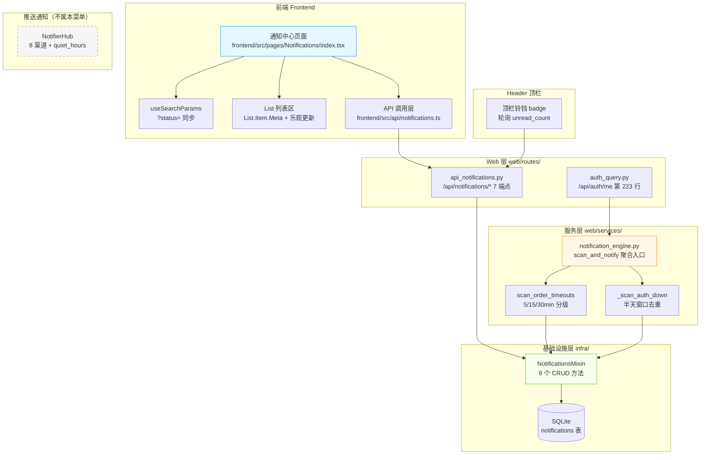
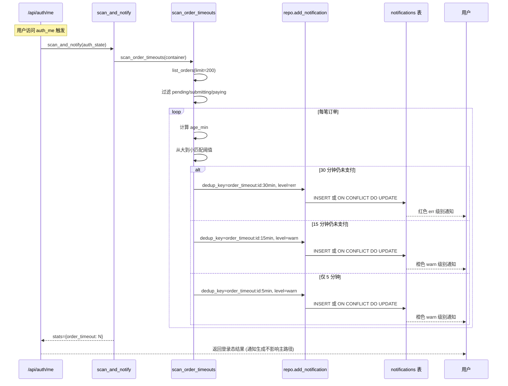
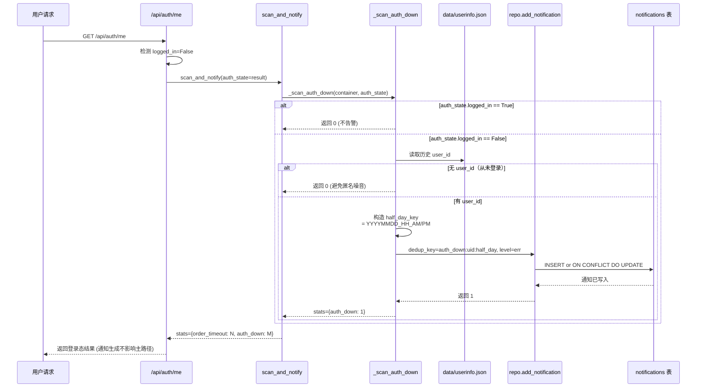
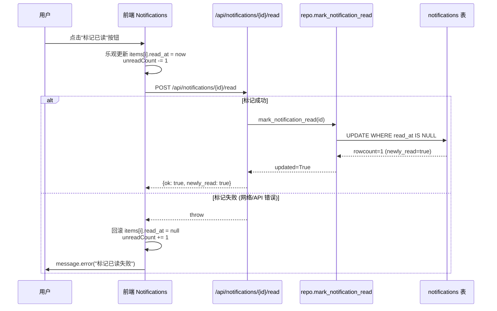

# 闲鱼猎人「通知中心」模块需求规格说明书

| 项 | 内容 |
|---|---|
| 文档版本 | v1.0 |
| 文档日期 | 2026-07-05 |
| 文档状态 | 初版（与详细设计 v1.0 对齐） |
| 所属项目 | 闲鱼猎人（XianyuHunter） |
| 所属菜单 | 数据查看 → 通知中心 |
| 菜单标识 | `menu_registry.yaml` 中 `key=notifications`、`icon=BellOutlined`、`sort_order=17`、`category=data_view` |
| 关联路由 | 前端 `/notifications`；后端 `/api/notifications/*` |
| 关联文档 | [通知中心-详细设计.md](通知中心-详细设计.md)（v1.0/2026-07-05） |
| 文档类型 | 需求规格说明书（SRS） |

> **本文档首段：继承 project_memory.md 中的硬约束。** 下文 §1.3.3 显式列出适用项与映射实现要点；本节先做总览：
> 1. **Web 进程必须使用 `with_browser=False` 模式**——本模块不涉及浏览器子进程，通知由业务事件触发经通知引擎写入数据库；不依赖任何浏览器子进程。
> 2. **认证白名单机制**——`/api/notifications/*` 全部通过现有 `auth.py` 认证中间件统一鉴权，**不加入白名单**（与 `/api/auth/cookie` 等不同）。
> 3. **前端 fetch 必须含 `credentials: 'include'`**——`frontend/src/api/notifications.ts` 沿用 `client` 默认配置。
> 4. **401 必须返回 JSON `{"detail":"Unauthorized"}`**——`api_notifications.py` 走 `JSONResponse` 路径，符合规范。
> 5. **token 比较使用 `hmac.compare_digest()`**——本模块无显式 token 比对。
> 6. **敏感字段不日志**——通知引擎异常仅 `logger.warning("[notify] {rule} 扫描失败: {e}")`，不打印通知全文 / `dedup_key` / 业务消息体；业务失败与正文内容**不进结构化日志**。
> 7. **token 写失败触发 `logging.warning()`**——本模块无 token 写流程，但通知规则整体失败走 `logger.warning` 告警。
> 8. **模块级 import**——`api_notifications.py` 与 `notification_engine.py` 顶层 import 已对齐，无函数内冗余 import。
> 9. **DB 索引**——`dedup_key` 上有 `UniqueConstraint("uq_notification_dedup")`（同时作为 `ON CONFLICT DO UPDATE` 冲突判定依据），`created_at` 上有索引（支持按时间倒序扫描）。
> 10. **COUNT 查询 CASE WHEN 聚合**——本模块未读数走 `count_notifications(status="unread")` SQL 函数，未使用 CASE WHEN。
> 11. **WebView2 子进程 `CREATE_NEW_CONSOLE`**——本模块不涉及浏览器子进程。
> 12. **WebView2 `private_mode=False` + 独立 `storage_path`**——本模块不涉及 WebView2。

---

## 目录

- [0. 阶段交接声明](#0-阶段交接声明)
- [1. 引言](#1-引言)
  - [1.1 编写目的](#11-编写目的)
  - [1.2 项目背景](#12-项目背景)
  - [1.3 范围与约束](#13-范围与约束)
  - [1.4 术语与缩写](#14-术语与缩写)
  - [1.5 参考资料](#15-参考资料)
- [2. 总体描述](#2-总体描述)
  - [2.1 产品定位](#21-产品定位)
  - [2.2 用户角色与特征](#22-用户角色与特征)
  - [2.3 运行环境](#23-运行环境)
  - [2.4 设计约束](#24-设计约束)
  - [2.5 假设与依赖](#25-假设与依赖)
- [3. 总体架构设计](#3-总体架构设计)
  - [3.1 模块架构图](#31-模块架构图)
  - [3.2 数据流程图](#32-数据流程图)
  - [3.3 关键时序图](#33-关键时序图)
  - [3.4 模块分层与职责](#34-模块分层与职责)
- [4. 功能需求](#4-功能需求)
- [5. 接口定义](#5-接口定义)
- [6. 数据模型](#6-数据模型)
- [7. 性能指标](#7-性能指标)
- [8. 安全要求](#8-安全要求)
- [9. 前端设计](#9-前端设计)
- [10. 部署与集成](#10-部署与集成)
- [11. 验收标准](#11-验收标准)
- [12. 附录](#12-附录)

---

## 0. 阶段交接声明

```
- 当前阶段：通知中心 SRS 编写（v1.0） ✅ 已完成
- 下一阶段：数据查看菜单其余 SRS 汇总（价格行情、价格策略等）
- 下一阶段智能体：主智能体
- 下一阶段技能：通用（无）
- 交接上下文：
  · 本文档定义「数据查看 → 通知中心」二级菜单完整需求 v1.0
  · 关键设计决策：业务通知（NotificationRow 9 字段）+ 通知引擎（2 条规则）+ 7 个 API 端点
  · 通知去重：dedup_key + SQLite ON CONFLICT DO UPDATE + UniqueConstraint
  · 通知级别：3 档（info / warn / err），业务分类：5 类（order / auth / system / config / task）
  · 通知引擎：scan_order_timeouts 5/15/30min 分级升级 + _scan_auth_down 半天窗口去重
  · 业务通知 vs 推送通知边界澄清（NotificationRow 9 字段 vs NotifierHub 8 渠道）
  · quiet_hours 是 NotifierHub 能力，与本菜单无关；critical 永远可达仅适用于 NotifierHub
  · 前端布局：Row gutter={16} + Col span=8（顶部 3 个统计区）+ 通知列表 Card
  · 菜单 key=notifications、path=/notifications、sort_order=17、category=data_view
  · 继承 project_memory.md 适用硬约束（首段已枚举 12 项适用映射）
```

---

## 1. 引言

### 1.1 编写目的

本需求规格说明书定义「数据查看 → 通知中心」二级菜单的完整需求规格，作为前端/后端开发、测试与验收的唯一依据。

**目标读者**：
- 后端开发工程师：依据 §3-§6、§8、§10 进行模块实现与扩展
- 前端开发工程师：依据 §4、§9 进行页面开发
- 测试工程师：依据 §7、§11 编写测试用例与执行验收
- 项目经理：依据 §2、§11 进行范围与里程碑管理
- 智能客服 KB 训练：本文档与 [通知中心-详细设计.md](通知中心-详细设计.md) 共同作为 KB 检索素材

### 1.2 项目背景

闲鱼猎人（XianyuHunter）是一个闲鱼自动捡漏与抢单工具，已具备任务管理、商品采集、AI 评估、自动下单、多渠道通知等完整能力（详见 [requirements.md](../requirements.md)、[design.md](../design.md) 与 [概要设计文档.md](../概要设计文档.md)）。

随着系统运行规模扩大，**业务通知相关的核心能力目前分散在多个业务模块内部**（订单超时检测在订单模块、登录态检测在 auth 模块、配置变更告警在 config 模块），缺乏统一的展示与已读管理入口，导致以下痛点：

| 痛点 | 现状 | 影响 |
|------|------|------|
| 业务通知无统一入口 | 各业务模块各自写日志或事件，外部仅 `/api/events/*` 技术性事件流 | 用户无法快速看到"哪些事需要我处理" |
| 缺乏已读/未读状态 | `/api/events/*` 只读追加，不区分已读 | 用户不知道"哪些已经看过了" |
| 重复触发未去重 | 同一订单超时被多次扫描、同一登录态反复掉线 | 通知列表被噪音淹没 |
| 缺乏升级机制 | 订单超时无 5min/15min/30min 分级告警 | 30min 才一次性提醒可能已超时关闭 |
| 顶栏 badge 缺数据 | 缺少未读数独立端点 | 顶栏铃铛无法显示未读数 |
| 业务通知与推送通知混淆 | NotifierHub 推送与 NotificationRow 业务通知易混淆 | 文档与菜单归属不清 |

**解决方案**：新增「通知中心」二级菜单，将分散在订单模块、auth 模块、config 模块等的业务通知**统一持久化**到 `notifications` 表，通过 `dedup_key` + SQLite `ON CONFLICT DO UPDATE` 实现幂等去重；通知引擎（`scan_and_notify`）零侵入挂载在 `auth_me` 等高频接口路径上；提供未读数独立端点供顶栏铃铛单独拉取；超时订单分级告警（5min/15min/30min）通过不同 `dedup_key` 实现"事情在变严重"的升级体验。

### 1.3 范围与约束

#### 1.3.1 包含范围（In-Scope）

- 业务通知 CRUD（`GET /api/notifications` 列出、`POST /api/notifications` 创建/更新、`GET /api/notifications/unread_count` 未读数、`POST /api/notifications/{id}/read` 标记单条已读、`POST /api/notifications/read_all` 全部已读、`DELETE /api/notifications/{id}` 删除单条、`DELETE /api/notifications` 清空）
- 通知去重机制（`dedup_key` + SQLite `ON CONFLICT DO UPDATE` + `UniqueConstraint("uq_notification_dedup")`）
- 通知级别（3 档：`info` / `warn` / `err`）
- 通知状态派生（`read_at` 字段派生未读/已读/全部）
- 5 大业务分类（`order` / `auth` / `system` / `config` / `task`）
- 通知引擎（`scan_order_timeouts` 5/15/30min 分级升级 + `_scan_auth_down` 半天窗口去重 + `scan_and_notify` 聚合入口）
- 订单超时升级（5min 提醒、15min 警告、30min 严重）
- 登录态失效检测（半天窗口去重，避免频繁告警）
- 未读数独立端点（`/unread_count`）
- URL 状态恢复（基于 `searchParams` 同步未读 tab）
- 乐观更新与失败回滚
- 业务通知 vs 推送通知边界澄清

#### 1.3.2 排除范围（Out-of-Scope）

- **不实现推送通知（NotifierHub）**——本菜单只负责"系统内通知"（NotificationRow）的存储与展示；外部推送（Server酱、PushPlus 等 8 渠道）由独立的"通知渠道"菜单（`key=notifier`、`path=/config/notifier`）管理
- **不实现技术事件流**——`/api/events/*` 是技术性事件流（SSE 推送 + 历史回溯），只读追加，不区分已读；本菜单与 `/api/events/*` 数据流不交叉
- **不实现 cron/定时器**——通知引擎零侵入挂载在 `auth_me` 等高频接口路径上，不引入新的定时器
- **不实现用户端"新建通知"入口**——`POST /api/notifications` 仅供业务模块内部调用 + 测试用，前端无 UI
- **不实现多用户隔离**——业务通知（NotificationRow 9 字段）**无 `user_id` 字段**，是单用户系统级通知
- **不实现 SSE 实时推送**——前端通过手动刷新（顶栏铃铛）或筛选按钮组切换触发加载

#### 1.3.3 硬约束

继承 [project_memory.md](c:/Users/hspcadmin/.trae-cn/memory/projects/-d-code-otherProjects-17-xianyu/project_memory.md) 中的项目硬约束，并显式映射到本模块实现：

| 硬约束 | 本模块适用性 | 实现要点 |
|--------|--------------|----------|
| Web 进程使用 `with_browser=False` 模式 | 适用 | 本模块不依赖浏览器子进程，通知由业务事件触发经通知引擎写入数据库 |
| 认证白名单（`/api/auth/cookie` 等） | 适用 | `/api/notifications/*` 全部走 `auth.py` 认证中间件统一鉴权，**不加入白名单** |
| 前端 fetch 必须含 `credentials: 'include'` | 适用 | `frontend/src/api/notifications.ts` 沿用 `client` 默认配置 |
| htmx 用官方 `<meta>` 配置 credentials | 不适用 | 本模块前端使用 React + fetch，不用 htmx |
| 401 响应必须返回 JSON `{"detail":"Unauthorized"`} | 适用 | `api_notifications.py` 走 `JSONResponse` 路径，符合规范 |
| 后端 token 比较使用 `hmac.compare_digest()` | 不适用 | 本模块无显式 token 比对 |
| 敏感字段（token 长度等）不日志 | 适用 | §8.5 日志规范：通知引擎异常仅 `logger.warning("[notify] {rule} 扫描失败: {e}")`，**不打印通知全文 / `dedup_key` / 业务消息体** |
| token 写失败触发 `logging.warning()` | 不适用 | 本模块无 token 写流程，但通知规则整体失败走 `logger.warning` 告警 |
| 缺失 import 必须 module-level | 适用 | `api_notifications.py` / `notification_engine.py` 全部模块级 import |
| DB 必须在 `task_id/seller_id/...` 加索引 | 适用 | `dedup_key` 上有 `UniqueConstraint("uq_notification_dedup")`，`created_at` 上有 `index=True` |
| COUNT 查询用 CASE WHEN 聚合 | 不适用 | 未读数走 `count_notifications(status="unread")` SQL 函数，未使用 CASE WHEN |
| WebView2 子进程使用 `CREATE_NEW_CONSOLE` | 不适用 | 本模块不涉及浏览器子进程 |
| WebView2 `webview.start()` 设 `private_mode=False` + 独立 `storage_path` | 不适用 | 本模块不涉及 WebView2 |
| KBManager 排除 `web/static/` 等目录 | 不适用 | 本模块不涉及 KB 索引 |
| `local_embedding.py` HF_ENDPOINT 设置 | 不适用 | 本模块不涉及 embedding |
| EmbeddingService 本地后端 | 不适用 | 同上 |
| sentence-transformers 跨版本兼容 | 不适用 | 同上 |
| `run_migrations` 各块独立 try/except | 不适用 | 本模块无新迁移 |
| 启动钩子异常 `logger.exception()` | 不适用 | 本模块无新启动钩子 |

### 1.4 术语与缩写

| 术语 | 全称 | 说明 |
|------|------|------|
| NotificationRow | Notification Row | 业务通知数据模型（9 字段），存于 `notifications` 表 |
| NotificationItem | Notification Item | API 返回的通知项，与 NotificationRow 字段一一对齐 |
| dedup_key | Deduplication Key | 业务去重键，同一业务事件反复触发时只保留一条 |
| OnConflictDoUpdate | SQLite `ON CONFLICT DO UPDATE` | SQLite 方言，重复插入触发更新 |
| UniqueConstraint | Unique Constraint | `uq_notification_dedup` 唯一约束 |
| uq_notification_dedup | Unique Notification Dedup | `dedup_key` 唯一约束名 |
| level | Notification Level | 通知级别：`info` / `warn` / `err` |
| category | Notification Category | 业务分类：`order` / `auth` / `system` / `config` / `task` |
| read_at | Read At | 已读时间戳，**NULL = 未读**，非空 = 已读时间 |
| created_at | Created At | 创建时间（UTC），带 `index=True` |
| NotificationEngine | Notification Engine | 通知规则引擎，零侵入挂载在高频接口 |
| scan_and_notify | Scan And Notify | 通知引擎聚合入口 |
| scan_order_timeouts | Scan Order Timeouts | 订单超时扫描，5/15/30min 分级升级 |
| _scan_auth_down | Scan Auth Down | 登录态失效检测（私有），半天窗口去重 |
| half_day_key | Half Day Key | 登录态失效的 `dedup_key` 归一因子（半天窗口） |
| level_tag | Level Tag | 订单超时 `dedup_key` 后缀：`5min` / `15min` / `30min` |
| ORDER_TIMEOUT_RULES | Order Timeout Rules | 订单超时阈值表（分钟 → 等级） |
| FilterStatus | Filter Status | 前端筛选状态枚举：`all` / `unread` / `read` |
| parseStatus | Parse Status | URL 查询参数 `?status=` 解析函数 |
| reset_read | Reset Read | 去重时是否重置 `read_at` 为 NULL |
| NotifierHub | Notifier Hub | 外部推送通知枢纽（8 渠道），**不属于本菜单** |
| quiet_hours | Quiet Hours | 免打扰时段（NotifierHub 能力，**与本菜单无关**） |
| critical_only | Critical Only | 免打扰时段内仅 critical 级别可推送 |
| SSE | Server-Sent Events | 服务器推送技术，本菜单不使用 |

### 1.5 参考资料

| 文档 | 路径 | 用途 |
|------|------|------|
| 需求文档 v1.0 | [../requirements.md](../requirements.md) | 系统整体需求基线 |
| 概要设计文档 v2.0 | [../概要设计文档.md](../概要设计文档.md) | 36 个 API 路由、11 张数据表、技术选型 |
| 技术设计说明书 | [../design.md](../design.md) | 分层架构、Evaluator 设计、状态机 |
| 通知中心 详细设计 v1.0 | [通知中心-详细设计.md](通知中心-详细设计.md) | 本模块技术设计、代码位置、FAQ |
| 米其林设计系统 | [../standards/michelin-design-system.md](../standards/michelin-design-system.md) | UI 设计规范、色彩字体系统 |
| 反爬登录管理 SRS | [../04-系统维护/反爬登录管理-需求规格.md](../04-系统维护/反爬登录管理-需求规格.md) | SRS 模板参考（12 章节完整版） |
| 智能客服 SRS | [../06-智能客服/智能客服-需求规格.md](../06-智能客服/智能客服-需求规格.md) | SRS 模板参考（10+ 章节完整版） |
| 权限模块 SRS | [../07-权限模块/权限模块-需求规格.md](../07-权限模块/权限模块-需求规格.md) | SRS 模板参考（侧栏菜单 SRS 风格） |
| 项目硬约束 | [project_memory.md](c:/Users/hspcadmin/.trae-cn/memory/projects/-d-code-otherProjects-17-xianyu/project_memory.md) | 必须继承的硬约束清单 |
| 菜单元数据 | [../../config/menu_registry.yaml](../../config/menu_registry.yaml) | `key=notifications`、`sort_order=17` |
| 通知中心 后端路由 | [../../backend/xianyu_hunter/web/routes/api_notifications.py](../../backend/xianyu_hunter/web/routes/api_notifications.py) | 7 个端点 + `_ALLOWED_LEVELS` / `_ALLOWED_CATEGORIES` 白名单 |
| 通知中心 通知引擎 | [../../backend/xianyu_hunter/web/services/notification_engine.py](../../backend/xianyu_hunter/web/services/notification_engine.py) | `scan_and_notify` 聚合入口 + 2 条规则 |
| 通知中心 数据模型 | [../../backend/xianyu_hunter/infra/db_models.py](../../backend/xianyu_hunter/infra/db_models.py) | `NotificationRow` 9 字段 + `uq_notification_dedup` 约束 |
| 通知中心 前端页面 | [../../frontend/src/pages/Notifications/index.tsx](../../frontend/src/pages/Notifications/index.tsx) | 单文件实现：3 Col 统计区 + 通知列表 Card |
| 通知中心 前端 API | [../../frontend/src/api/notifications.ts](../../frontend/src/api/notifications.ts) | 6 个 API 方法 + `NotificationItem` 类型 |
| 通知中心 仓储层 | [../../backend/xianyu_hunter/infra/repo_notifications.py](../../backend/xianyu_hunter/infra/repo_notifications.py) | `NotificationsMixin` 提供 8 个 CRUD 方法 |
| 登录态查询 API | [../../backend/xianyu_hunter/web/routes/auth_query.py](../../backend/xianyu_hunter/web/routes/auth_query.py) | `/api/auth/me` 在第 223 行调用 `scan_and_notify` |

---

## 2. 总体描述

### 2.1 产品定位

「通知中心」是闲鱼猎人系统的**系统业务通知的统一入口**，定位为：

> 聚合展示系统内的业务通知（订单超时、登录态掉线等），支持未读统计、单条/全部已读、按状态筛选与清空，是用户感知系统异常与待处理事件的主入口。

**核心价值**：
1. **统一入口**：分散在订单模块、auth 模块、config 模块等的业务通知**统一持久化**到 `notifications` 表
2. **去重不堆积**：通过 `dedup_key` + SQLite `ON CONFLICT DO UPDATE` 实现幂等去重，同一业务事件反复触发不堆积
3. **未读独立端点**：`/api/notifications/unread_count` 独立轻量查询，供顶栏铃铛 badge 单独拉取，避免列表分页时反复全量计算
4. **零侵入触发**：通知引擎（`scan_and_notify`）零侵入挂载在 `auth_me` 等高频接口路径上，无需引入定时器即可触发
5. **超时分级告警**：订单 5min/15min/30min 通过不同 `dedup_key` 实现"事情在变严重"的升级体验
6. **与推送渠道解耦**：本菜单只负责"系统内通知"的存储与展示，外部推送由独立的"通知渠道"菜单管理

### 2.2 用户角色与特征

| 角色 | 特征 | 使用场景 | 关注重点 |
|------|------|----------|----------|
| 日常运维 | 系统已运行，关注待处理事件 | 定期查看通知中心 / 点击顶栏铃铛 badge | 未读数、订单超时告警、登录态失效 |
| 失效恢复 | 触发 WAF 或登录态掉线 | 进入通知中心查看"登录态失效"告警 | err 级别通知、跳转链接、已读/清空 |
| 调试排查 | 排查订单超时问题 | 筛选"订单"分类、查看超时时间 | 订单超时分级、升级路径、消息正文 |
| 二次开发者 | 自定义通知规则 | 参考本菜单与详细设计实现自定义编排 | 通知引擎、dedup_key 命名规范、API 调用方式 |
| 测试工程师 | 验证通知功能 | 通过 `POST /api/notifications` 创建测试数据 | 白名单校验、幂等、已读/清空语义 |

### 2.3 运行环境

| 项 | 要求 |
|---|---|
| 操作系统 | Windows 10/11（主），Linux/macOS 需兼容（SQLite 跨平台） |
| Python | 3.11+ |
| Node.js | 18+（仅前端构建） |
| 后端框架 | FastAPI（已集成） |
| 前端框架 | React 18 + TypeScript + Ant Design 5（已集成） |
| 数据库 | 复用现有 SQLite（notifications 表 + 现有 schema） |
| SQLite 方言 | `sqlalchemy.dialects.sqlite.insert`（`ON CONFLICT DO UPDATE`） |
| 触发路径 | `/api/auth/me` 等高频接口路径上顺手触发（不引入 cron） |

### 2.4 设计约束

1. **集成部署**：作为 `backend/xianyu_hunter/web/routes/api_notifications.py` 路由 + `frontend/src/pages/Notifications/index.tsx` 页面集成到现有系统，不独立部署
2. **复用 NotificationsMixin**：`NotificationsMixin` 混入主 `Repo`，提供 8 个 CRUD 方法（`list_notifications` / `count_notifications` / `add_notification` / `mark_notification_read` / `mark_all_notifications_read` / `delete_notification` / `clear_notifications` / `get_notification`）
3. **写操作 POST/DELETE，读操作 GET**：与现有 REST 规范对齐
4. **零侵入触发**：通知引擎通过 `scan_and_notify` 在 `auth_me` 等接口路径上顺手触发，不引入新的 cron / 定时器
5. **失败隔离**：通知规则失败不影响主业务 API，异常被捕获后仅 `logger.warning`，返回 0
6. **前端布局**：Row gutter={16} + Col span=8（顶部 3 个统计区：未读 / 已读 / 操作区）+ 通知列表 Card
7. **URL 状态恢复**：基于 `searchParams` 同步未读 tab，刷新/分享可恢复
8. **乐观更新**：标记已读 / 删除单条采用乐观更新，失败回滚
9. **与推送通知解耦**：业务通知（NotificationRow）只写入 `notifications` 表，推送通知（NotifierHub）只写入 `events` 表，数据流不交叉
10. **白名单校验**：`POST /api/notifications` 创建通知时 `level` 与 `category` 必须命中白名单，防止内部调用方误造出脏数据

### 2.5 假设与依赖

**假设**：
- 用户已部署闲鱼猎人 v2.x+ 并能访问 `MainLayout` 侧边栏
- 系统已配置 SQLite 数据库（notifications 表由 `Base.metadata.create_all` 自动创建）
- 顶栏铃铛（Header）已实现，会拉取 `GET /api/notifications/unread_count`

**依赖**：
- 依赖现有 `Repo` 单例（`NotificationsMixin` 混入主 Repo）
- 依赖现有 `Container` 依赖注入（`get_container()` 注入 `repo`）
- 依赖现有 `auth.py` 认证中间件
- 依赖现有 `menu_registry.yaml` 菜单注册（已配置 `key=notifications`）
- 依赖 `data/userinfo.json`（登录态检测读历史 `user_id`）
- 新增无外部依赖

---

## 3. 总体架构设计

### 3.1 模块架构图



### 3.2 数据流程图

```mermaid
flowchart TB
    subgraph "用户操作"
        U1[进入通知中心]
        U2[点击顶栏铃铛]
        U3[标记已读]
        U4[清空已读]
    end

    subgraph "前端"
        L1[loadList<br/>GET /notifications?status]
        L2[loadUnread<br/>GET /unread_count]
        L3[乐观更新 read_at + unread -1]
        L4[parseStatus<br/>URL ?status= 解析]
    end

    subgraph "后端"
        O1[api_notifications.py<br/>7 端点]
        O2[add_notification<br/>ON CONFLICT DO UPDATE]
        O3[mark_notification_read<br/>WHERE read_at IS NULL]
        O4[count_notifications<br/>status=unread]
    end

    subgraph "通知引擎"
        E1[/api/auth/me 高频调用]
        E2[scan_and_notify 聚合]
        E3[scan_order_timeouts<br/>5/15/30min 分级]
        E4[_scan_auth_down<br/>半天窗口去重]
    end

    subgraph "数据层"
        DB[(notifications 表<br/>9 字段 + uq_notification_dedup)]
        USERINFO[(data/userinfo.json<br/>历史 user_id)]
    end

    U1 --> L4
    L4 --> L1
    U2 --> L2
    U3 --> L3
    L3 --> O1
    U4 --> O1

    L1 --> O1
    L2 --> O1
    O1 --> O4

    E1 --> E2
    E2 --> E3
    E2 --> E4
    E3 --> O2
    E4 --> O2
    E4 --> USERINFO
    O2 --> DB
    O3 --> DB
    O4 --> DB

    style L3 fill:#e6f7ff
    style E2 fill:#fff7e6
    style O2 fill:#f6ffed
```

### 3.3 关键时序图

#### 3.3.1 订单超时升级时序（5min → 15min → 30min）



#### 3.3.2 登录态失效告警时序



#### 3.3.3 用户标记已读乐观更新时序



### 3.4 模块分层与职责

遵循项目现有 DDD 分层架构（见 [概要设计文档](../概要设计文档.md) §3）：

| 层级 | 模块 | 职责 |
|------|------|------|
| **Web 层** | `api_notifications.py` | 通知 API 路由（7 端点）+ 白名单校验 |
| **服务层** | `notification_engine.py` | 通知规则引擎（2 条规则 + 聚合入口） |
| **基础设施层** | `repo_notifications.py`（NotificationsMixin） | 8 个 CRUD 方法：`list_notifications` / `count_notifications` / `add_notification` / `mark_notification_read` / `mark_all_notifications_read` / `delete_notification` / `clear_notifications` / `get_notification` |
| **数据层** | `db_models.py`（NotificationRow） | notifications 表 ORM 模型（9 字段 + 唯一约束） |
| **高频调用方** | `auth_query.py` | `/api/auth/me` 第 223 行调用 `scan_and_notify` |
| **前端** | `pages/Notifications/index.tsx` | 单文件实现：3 Col 统计区 + 通知列表 Card + URL 同步 + 乐观更新 |
| | `api/notifications.ts` | 6 个 API 方法封装 + `NotificationItem` 类型定义 |

---

## 4. 功能需求

### FR-1 业务通知 CRUD（7 API 端点）

**FR-1.1** `GET /api/notifications` 列出通知（分页查询）
- Query：`status?`（`unread` / `read` / 不传=全部），`limit?`（默认 50，范围 1-200），`offset?`（默认 0，≥0）
- 排序规则（`repo_notifications.list_notifications`）：`ORDER BY read_at IS NULL DESC, created_at DESC`（**未读置顶 + 创建时间倒序**）
- 响应：`items[]`, `count`（当前页条数）, `total`（符合筛选条件的总条数，用于前端分页/计数）, `limit`, `offset`, `status`
- **为什么不限制为只能看未读**：用户可能想回看"我之前漏看什么"，走 `status=read` 即可；同时返回 `total` 字段，前端用于分页/计数展示

**FR-1.2** `GET /api/notifications/unread_count` 未读数（独立端点）
- 无请求参数
- 响应：`{ "unread": 3 }`
- **设计要点**：未读数独立端点而非合并到 list 响应，是因为 badge 不需要拉取完整列表，单独轻量查询（`count_notifications(status="unread")`）性能更优。列表分页时也不会反复全量计算未读数

**FR-1.3** `POST /api/notifications` 创建/更新通知（业务模块内部调用 + 测试用）
- Body：`level`, `category`, `title`, `message`, `dedup_key`（必填），`link?`, `reset_read?`（默认 `true`）
- **白名单校验**：
  - `level` 必须命中 `{info, warn, err}`
  - `category` 必须命中 `{order, auth, system, config, task}`
  - 校验失败返回 400，错误信息形如 `level 必须是 {'info','warn','err'} 之一`
  - 必填校验：`title` / `message` / `dedup_key` strip 后非空；`dedup_key` 长度 ≤ 200；`link` 长度 ≤ 500
- 响应：`{ "ok": true, "item": NotificationItem }`

**FR-1.4** `POST /api/notifications/{notif_id}/read` 标记单条已读
- Path：`notif_id:int`
- 响应：`{ "ok": true, "id": 12, "newly_read": true }`
- 通知不存在返回 404
- **幂等设计**：`newly_read=false` 表示原本就已读（已读不报错）；`mark_notification_read` SQL 中带 `WHERE read_at IS NULL` 条件，已读项不会被重复更新，`rowcount=0` 即 `newly_read=false`

**FR-1.5** `POST /api/notifications/read_all` 全部标记已读
- 无请求参数
- 响应：`{ "ok": true, "updated": 3 }`（`updated` 为实际更新的未读条数）

**FR-1.6** `DELETE /api/notifications/{notif_id}` 删除单条
- Path：`notif_id:int`
- 响应：`{ "ok": true, "id": 12, "deleted": true }`
- 通知不存在返回 404

**FR-1.7** `DELETE /api/notifications` 清空（带过滤）
- Query：`status?`（`unread` / `read` / 不传=全清，其他值返回 400）
- 响应：`{ "ok": true, "deleted": 12, "status": "read" }`
- **设计要点**：默认不"全清"。前端"清空已读"按钮传 `status=read`，仅清已读项保留未读；`status` 留空仍支持全清，但前端默认走 `read`，避免误删未读

### FR-2 通知去重机制（dedup_key + SQLite ON CONFLICT DO UPDATE）

**FR-2.1** 去重设计目标
- 同一业务事件在通知中心只显示一条
- 事件升级时（如 5min → 15min）能更新级别与文案，但避免堆积历史版本
- 用户已读状态在事件未升级时尽量保留

**FR-2.2** 去重实现原理（`repo_notifications.add_notification`）
- 基于 `dedup_key` 字段 + SQLite `ON CONFLICT DO UPDATE`
- `dedup_key` 上有 `UniqueConstraint("uq_notification_dedup")`（同时作为 `ON CONFLICT DO UPDATE` 的冲突判定依据）
- INSERT 时 `read_at` 始终写 NULL（SQLite 限制：INSERT VALUES 不能引用目标表本身列），保留旧值的语义改在 `ON CONFLICT DO UPDATE` 子句中通过 `NotificationRow.read_at` 引用现有行实现
- `reset_read=True`（默认）：用新值 `None` 覆盖 `read_at`，重置为未读
- `reset_read=False`：保留原 `read_at` 值（即 `NotificationRow.read_at`，引用冲突行的现有值）

**FR-2.3** `dedup_key` 命名规范
- 由业务模块自行构造，需保证：同一业务事件反复触发时 `dedup_key` 稳定不变；业务事件升级时 `dedup_key` 变化（让旧通知被新版本替换为更高级别）
- 当前实现中的命名规范：
  - 订单超时：`order_timeout:{order_id}:{level_tag}`，`level_tag` = `5min` / `15min` / `30min`
  - 登录态失效：`auth_down:{user_id}:{half_day_key}`，`half_day_key` = `YYYYMMDD_HH_AM/PM`（半天窗口归一）

**FR-2.4** `reset_read` 参数使用建议
- 超时订单从 5min 升级到 15min 时应传 `reset_read=true`，让用户重新感知
- 纯文案微调可传 `reset_read=false` 避免打扰

### FR-3 通知级别（info/warn/err）

**FR-3.1** 3 档通知级别（来源：`api_notifications.py:22` `_ALLOWED_LEVELS`）

| 值 | 含义 | 前端 Tag 颜色 | 前端文案 | 触发示例 |
|----|------|--------------|----------|---------|
| `info` | 信息 | blue | 信息 | 系统提示、配置变更通知 |
| `warn` | 警告 | orange | 警告 | 订单 5min/15min 未支付、系统异常 |
| `err` | 错误 | red | 错误 | 订单 30min 未支付、登录态失效 |

**FR-3.2** 白名单校验：`POST /api/notifications` 创建通知时 `level` 必须命中 `{info, warn, err}`，否则返回 400
- 错误信息形如 `level 必须是 {'info','warn','err'} 之一`
- **为什么加白名单**：内部 API 也加白名单，防止误调用造出垃圾；外部如果需要创建通知，调用 `/api/notifications` 即可，但需要带 `dedup_key` 表明业务意图

**FR-3.3** 前端颜色与文案映射（`frontend/src/pages/Notifications/index.tsx`）
```typescript
const LEVEL_COLOR: Record<NotificationItem['level'], string> = {
  info: 'blue', warn: 'orange', err: 'red',
}
const LEVEL_LABEL: Record<NotificationItem['level'], string> = {
  info: '信息', warn: '警告', err: '错误',
}
```

### FR-4 通知状态派生（已读/未读/已解决）

**FR-4.1** notifications 表**无独立 status 字段**，状态由 `read_at` 字段派生：

| 派生状态 | 判定条件 | API 查询参数值 |
|---------|---------|---------------|
| 未读 | `read_at IS NULL` | `unread` |
| 已读 | `read_at IS NOT NULL` | `read` |
| 全部 | 无过滤 | 不传 / `all` |

**FR-4.2** 排序规则（`repo_notifications.list_notifications`）：`ORDER BY read_at IS NULL DESC, created_at DESC`
- 未读（`read_at IS NULL` 为真，`DESC` 排在前）优先于已读
- 同状态内按创建时间倒序

**FR-4.3** 前端已读/未读处理
- 已读项不显示"标记已读"按钮（避免冗余操作）
- 未读项左侧有红色圆点提示（视觉对齐）
- 未读项标题 `fontWeight: 600`，已读项标题 `fontWeight: normal`
- 未读数 > 0 时统计卡数字 `color: '#ff4d4f'`（红色高亮）

### FR-5 5 分类（order/auth/system/config/task）

**FR-5.1** 5 大业务分类（来源：`api_notifications.py:23` `_ALLOWED_CATEGORIES`）

| 值 | 前端文案 | 含义 |
|----|---------|------|
| `order` | 订单 | 订单超时、订单状态异常等 |
| `auth` | 登录 | 闲鱼登录态失效、Cookie 过期等 |
| `system` | 系统 | 系统级事件（启动/关闭/资源告警） |
| `config` | 配置 | 配置变更、配置校验失败等 |
| `task` | 任务 | 任务状态变更、任务异常等 |

**FR-5.2** 白名单校验：`POST /api/notifications` 创建通知时 `category` 必须命中白名单，否则返回 400
- 错误信息形如 `category 必须是 {'order','auth','system','config','task'} 之一`
- **校验规则**：API 创建通知时 `level` 与 `category` 必须命中白名单，防止内部调用方误造出脏数据

**FR-5.3** 前端文案映射（`frontend/src/pages/Notifications/index.tsx`）
```typescript
const CATEGORY_LABEL: Record<NotificationItem['category'], string> = {
  order: '订单', auth: '登录', system: '系统', config: '配置', task: '任务',
}
```

### FR-6 通知引擎（scan_order_timeouts 5/15/30min 分级升级 + _scan_auth_down 半天窗口去重 + scan_and_notify 聚合入口）

**FR-6.1** 通知引擎设计原则（`notification_engine.py`）
- **零侵入**：所有检测都通过现有 API 端点返回路径"顺手"触发，不引入新的 cron / 定时器
- **幂等**：每条业务事件用 `dedup_key` 唯一标识，重复调用只刷新不堆积
- **升级**：超时订单从 5min → 15min → 30min 用不同 `dedup_key`，让用户能感受到"事情在变严重"
- **失败隔离**：通知规则失败不影响主业务 API，异常被捕获后仅 `logger.warning`，返回 0

**FR-6.2** `scan_order_timeouts(container) -> int`（订单超时扫描）
- 阈值表（`ORDER_TIMEOUT_RULES`）：
  - 5 分钟 → `level=warn`, `level_tag=5min`
  - 15 分钟 → `level=warn`, `level_tag=15min`
  - 30 分钟 → `level=err`, `level_tag=30min`
- 扫描逻辑：
  1. 拉取最近 200 条订单（`list_orders(limit=200)`）
  2. 仅扫描 `status` 为 `pending` / `submitting` / `paying` 的订单
  3. 计算 `age_min = (now - created_at) / 60`
  4. **按阈值从大到小匹配**（`sorted(ORDER_TIMEOUT_RULES, key=lambda x: -x[0])`），第一个满足 `age_min >= thr_min` 的规则触发，构造通知并 `break`
  5. `dedup_key = order_timeout:{order_id}:{level_tag}`，`reset_read=True`
- **为什么从大到小匹配**：5min 触发过 → 15min 才触发时，我们用 15min 的 `dedup_key`，5min 的旧通知被替换为新级别（更高 level），用户能感知到升级

**FR-6.3** `_scan_auth_down(container, auth_state) -> int`（登录态掉线，私有）
- 触发条件：`auth_state.logged_in == False` 且历史上曾经登录过（`data/userinfo.json` 中有 `user_id`）
- 防噪音策略：
  - 从未登录过的匿名用户首次访问**不告警**（避免每个匿名访问都生成一条"登录态失效"噪音）
  - `dedup_key` 按"半天窗口"归一：`auth_down:{user_id}:{YYYYMMDD_HH_AM/PM}`，半天内反复掉线只刷一条通知，半天后又失效重新生成
- 通知内容：
  - `level=err`，`category=auth`
  - title = "闲鱼登录态已失效"
  - message = "账号 {user_id} 的登录态已掉线，请尽快重新扫码登录。系统在登录恢复前不会执行抢单。"
  - link = `/dashboard#login`
  - `reset_read=True`

**FR-6.4** `scan_and_notify(container, auth_state=None) -> dict[str, int]`（聚合入口）
- 调用方：`backend/xianyu_hunter/web/routes/auth_query.py:223` 在 `/api/auth/me` 端点中调用，传入 `auth_state=result`
- **失败隔离**：单条规则失败不影响其他规则与主业务 API，异常被捕获后 `logger.warning` 并返回 0
- 订单列表 `/api/orders` 已移除自动调用（`api_orders.py:93` 注释），避免每次列表请求都触发全量扫描

### FR-7 订单超时升级（5min 提醒、15min 警告、30min 严重）

**FR-7.1** 升级流程（详见 §3.3.1 时序图）
- 订单 `pending` / `submitting` / `paying` 状态超过 5 分钟未支付 → `level=warn`、`dedup_key=order_timeout:{order_id}:5min`
- 15 分钟时再次触发 → `dedup_key` 变为 `...:15min`，原 5min 通知被新通知替换为更高级别
- 30 分钟时升级为 `level=err`，`dedup_key=...:30min`

**FR-7.2** 升级实现细节
- 5min / 15min / 30min 是三个不同的 `dedup_key`，会生成**三条独立通知**
- 同级别内反复扫描（如多次 5min 扫描）只刷新同一条通知不堆积（同一 `dedup_key` 触发 `ON CONFLICT DO UPDATE`）
- 跨级别升级会生成新通知（`dedup_key` 变化）
- `reset_read=True`：超时从 5min 升到 15min 时让用户重新看到

**FR-7.3** 通知内容
- title：`订单 #{order_id} 已等待支付 {level_tag}`
- message：`订单 #{order_id}（¥{amount:.2f}）已超过 {thr_min} 分钟未支付，系统已暂停自动重试。请尽快人工接管或确认是否需要放弃。`
- link：`/orders?ref={order_id}`

**FR-7.4** 阈值分级理由
- 5min 提醒：早期预警，让用户介入
- 15min 警告：持续未支付，需要更紧迫的提示
- 30min 严重：可能已超时关闭，必须 err 级别

### FR-8 登录态失效检测（半天窗口去重，避免频繁告警）

**FR-8.1** 触发路径：`/api/auth/me` → `scan_and_notify(auth_state=result)` → `_scan_auth_down(container, auth_state)`

**FR-8.2** 触发条件
- `auth_state.logged_in == False`
- 历史上曾经登录过：`data/userinfo.json` 中有 `user_id`（避免匿名用户噪音）

**FR-8.3** 半天窗口去重
- `half_day_key = _utcnow().strftime("%Y%m%d_%H") + ("_PM" if _utcnow().hour >= 12 else "_AM")`
- 例：`20260705_09_AM`（上午 0-11 点）/ `20260705_03_PM`（下午 12-23 点）
- `dedup_key = auth_down:{user_id}:{half_day_key}`
- 半天内反复掉线只刷一条通知，半天后又失效重新生成

**FR-8.4** 不告警的两种情况
- 历史上从未登录过（`data/userinfo.json` 中无 `user_id`）
- 半天内已告警过（`dedup_key` 按 `YYYYMMDD_HH_AM/PM` 半天窗口归一）

**FR-8.5** 通知内容
- `level=err`，`category=auth`
- title = "闲鱼登录态已失效"
- message = "账号 {user_id} 的登录态已掉线，请尽快重新扫码登录。系统在登录恢复前不会执行抢单。"
- link = `/dashboard#login`
- `reset_read=True`

### FR-9 未读数独立端点

**FR-9.1** `GET /api/notifications/unread_count` 独立轻量查询
- 响应：`{ "unread": 3 }`
- **设计要点**：未读数独立端点而非合并到 list 响应，是因为 badge 不需要拉取完整列表，单独轻量查询性能更优

**FR-9.2** 顶栏铃铛 badge 调用方式
- Header 顶栏轮询 `GET /api/notifications/unread_count` 获取未读数
- badge 显示未读数（如未读 3 时显示 "3"）
- 前端 `loadUnread` 失败时**静默**（不阻塞列表展示），与列表加载失败的 `message.error` 行为不同

**FR-9.3** 与列表接口的对比
- 列表接口：`GET /api/notifications` 返回 `items[]`, `count`, `total`, `limit`, `offset`, `status`
- 未读数接口：`GET /api/notifications/unread_count` 仅返回 `{ "unread": N }`
- 列表分页时不会反复全量计算未读数

### FR-10 URL 状态恢复（基于 searchParams 同步未读 tab）

**FR-10.1** 状态恢复机制
- 前端使用 `useSearchParams` 同步筛选状态到 URL `?status=` 查询参数
- 刷新页面 / 分享链接时 `?status=unread` / `?status=read` 会被 `parseStatus` 解析为 `FilterStatus`
- 无效值回退为 `all`

**FR-10.2** `parseStatus` 函数实现
```typescript
function parseStatus(value: string | null): FilterStatus {
  if (value === 'unread' || value === 'read') return value
  return 'all'
}
```

**FR-10.3** 筛选状态变更同步到 URL
```typescript
useEffect(() => {
  const params = new URLSearchParams()
  if (filter !== 'all') params.set('status', filter)
  setSearchParams(params, { replace: true })
}, [filter, setSearchParams])
```
- 仅在 `filter !== 'all'` 时写入 URL，保持 URL 简洁
- `replace: true` 避免污染浏览器历史栈

**FR-10.4** `FilterStatus` 类型与筛选按钮
- 类型：`type FilterStatus = 'all' | 'unread' | 'read'`
- 按钮：全部 / 未读 / 已读 三按钮切换，`type={filter === s ? 'primary' : 'default'}` 高亮当前筛选

### FR-11 乐观更新与失败回滚

**FR-11.1** 单条标记已读乐观更新
- 前端立即更新：`items.map(it.id === item.id ? { ...it, read_at: new Date().toISOString() } : it)`
- 未读数：`(c) => Math.max(0, c - 1)`
- API 调用：`notificationApi.markRead(item.id)`
- 失败回滚：`items.map(it.id === item.id ? { ...it, read_at: null } : it)` + `unreadCount(c => c + 1)` + `message.error("标记已读失败")`

**FR-11.2** 全部已读乐观更新
- `items.map(it.read_at ? it : { ...it, read_at: new Date().toISOString() })`（仅更新未读项）
- `unreadCount = 0`
- 失败时 `message.error("全部标记已读失败")`，不主动回滚（依赖重新加载）

**FR-11.3** 删除单条乐观更新
- 保存 `prev = items` 和 `target` 引用
- `items.filter(it.id !== id)` + `total - 1`
- 若 `target.read_at` 为空：`unreadCount - 1`
- 失败回滚：`setItems(prev)` + `total + 1` + 若 `target.read_at` 为空：`unreadCount + 1` + `message.error("删除失败")`

**FR-11.4** 清空已读（不带乐观更新）
- 不采用乐观更新，依赖 `loadList()` 重新加载
- 失败时 `message.error("清空失败")`

**FR-11.5** 失败回滚原则
- **已读 / 删除**：保留 `prev` 引用以便失败回滚
- **全部已读 / 清空**：依赖重新加载，不主动回滚（操作粒度大，回滚成本高）

### FR-12 业务通知 vs 推送通知边界澄清

**FR-12.1** 系统存在两套独立的通知体系，**不可混淆**：

| 属性 | 业务通知（NotificationRow） | 推送通知（NotifierHub） |
|------|--------------------------|---------------------|
| 数据模型 | `NotificationRow`（9 字段） | `Event`（事件流）+ `NotifyResult`（推送结果） |
| 存储位置 | SQLite `notifications` 表，持久化 | events 表 `stage='notify'` 供 KPI 统计 |
| 展示入口 | 数据查看菜单"通知中心"（`key=notifications`，`/notifications`） | 配置管理菜单"通知渠道"（`key=notifier`，`/config/notifier`） |
| 主要能力 | 未读统计、单条/全部已读、按状态筛选、清空 | 多渠道 fan-out 推送、订阅 EventBus、免打扰时段 |
| 支持渠道 | 无（仅存数据库） | 8 个：`serverchan` / `pushplus` / `bark` / `telegram` / `wecom` / `dingtalk` / `webhook` / `ntfy` |
| 触发方式 | 通知引擎 `scan_and_notify` 在 `auth_me` 等接口路径上顺手触发 | 订阅 `EventBus` 中 `EVAL_PASSED` / `BUY_SUCCEEDED` 等事件自动触发 |
| 内容性质 | 系统内通知（订单超时、登录态失效等业务事件） | 外部推送（Server酱、PushPlus 等） |
| 是否落库 | 写入 `notifications` 表 | 写入 `events` 表（不写入 `notifications` 表） |
| 是否推外部 | 否（仅存数据库） | 是（8 渠道 fan-out） |

**FR-12.2** 二者关系
- **解耦设计**：业务通知（NotificationRow）与推送通知（NotifierHub）是两套独立体系，互不依赖
- **数据流不交叉**：业务通知只写入 `notifications` 表，推送通知只写入 `events` 表
- **菜单归属不同**：本菜单（`/notifications`，`data_view`）只管业务通知的展示；推送渠道的配置、测试、免打扰时段管理在 `/config/notifier`（`config`）菜单
- **共享 icon**：两个菜单项在 `menu_registry.yaml` 中都使用 `BellOutlined`，但 `path` / `sort_order` / `category` 完全不同，前端通过路由区分

**FR-12.3** `quiet_hours` 免打扰时段边界澄清
- `quiet_hours` 是**推送通知（NotifierHub）**的能力，**不属于本菜单**（业务通知）范围
- 业务通知（NotificationRow）**不受 `quiet_hours` 影响**：
  - 业务通知只写入数据库，不主动推送外部
  - 用户何时查看通知中心由自己决定，不存在"打扰"问题
  - `quiet_hours` 仅作用于 NotifierHub 的 fan-out 推送路径
- `critical` 级别永远可达：仅适用于 NotifierHub（抢单成功、订单异常等关键事件不遗漏）
- 详细配置与管理在"通知渠道"菜单（`/config/notifier`）

---

## 5. 接口定义

所有接口前缀：`/api/notifications`，路由文件：`backend/xianyu_hunter/web/routes/api_notifications.py`，认证：复用现有 `auth.py` 中间件（**不加入白名单**）。

### 5.1 通知列表接口

#### GET `/api/notifications`

**描述**：分页查询通知列表，默认未读置顶 + 创建时间倒序

**请求参数**（Query）：
- `status`：可选，`unread` / `read` / 不传（全部）
- `limit`：可选，默认 50，范围 1-200
- `offset`：可选，默认 0，≥0

**响应**：
```json
{
  "items": [NotificationItem, ...],
  "count": 12,
  "total": 35,
  "limit": 50,
  "offset": 0,
  "status": "all"
}
```

- `count` 是当前页条数
- `total` 是符合筛选条件的总条数（用于前端分页/计数展示）

### 5.2 未读数接口

#### GET `/api/notifications/unread_count`

**描述**：顶栏铃铛 badge 单独拉取，避免列表分页时反复全量计算

**请求参数**：无

**响应**：
```json
{ "unread": 3 }
```

### 5.3 创建/更新通知接口

#### POST `/api/notifications`

**描述**：业务模块内部调用 + 测试用。同 `dedup_key` 视为同一业务事件，重复调用只刷新不堆积

**请求体**（Body，JSON）：

| 字段 | 类型 | 必填 | 校验 | 默认值 |
|------|------|------|------|--------|
| `level` | str | 否 | 必须命中 `{info,warn,err}` | `info` |
| `category` | str | 是 | 必须命中 `{order,auth,system,config,task}` | — |
| `title` | str | 是 | strip 后非空 | — |
| `message` | str | 是 | strip 后非空 | — |
| `dedup_key` | str | 是 | strip 后非空，长度 ≤ 200 | — |
| `link` | str | 否 | 长度 ≤ 500 | `NULL` |
| `reset_read` | bool | 否 | — | `true` |

**校验失败响应**（400）：
```json
{ "detail": "level 必须是 {'info','warn','err'} 之一" }
```

**成功响应**：
```json
{ "ok": true, "item": NotificationItem }
```

**`reset_read` 语义**：
- `true`（默认）：同 `dedup_key` 已存在时，将 `read_at` 重置为 NULL（变回未读）
- `false`：保留原 `read_at` 值，不重置已读状态

### 5.4 标记单条已读接口

#### POST `/api/notifications/{notif_id}/read`

**描述**：用户点击某条通知的"标记已读"按钮

**请求参数**：Path `notif_id:int`

**响应**：
```json
{ "ok": true, "id": 12, "newly_read": true }
```

- 通知不存在返回 404
- `newly_read=true` 表示本次实际从未读变为已读
- `newly_read=false` 表示原本就已读（幂等：已读不报错）

### 5.5 全部标记已读接口

#### POST `/api/notifications/read_all`

**描述**：用户点击"全部标记已读"按钮（"打开通知中心"行为）

**请求参数**：无

**响应**：
```json
{ "ok": true, "updated": 3 }
```

`updated` 为实际更新的未读条数。

### 5.6 删除单条接口

#### DELETE `/api/notifications/{notif_id}`

**描述**：用户删除某条通知

**请求参数**：Path `notif_id:int`

**响应**：
```json
{ "ok": true, "id": 12, "deleted": true }
```

- 通知不存在返回 404
- `deleted=true` 表示实际删除成功

### 5.7 清空通知接口

#### DELETE `/api/notifications`

**描述**：批量清空通知，常见操作是"清掉已读的腾出空间"

**请求参数**（Query）：
- `status`：可选，`unread` / `read` / 不传（全清）；其他值返回 400

**响应**：
```json
{ "ok": true, "deleted": 12, "status": "read" }
```

**校验失败响应**（400）：
```json
{ "detail": "status 必须是 unread / read" }
```

**设计要点**：默认不"全清"。前端"清空已读"按钮传 `status=read`，仅清已读项保留未读；`status` 留空仍支持全清，但前端默认走 `read`，避免误删未读。

---

## 6. 数据模型

### 6.1 notifications 表（NotificationRow，`db_models.py:305`）

共 **9 个字段**：

| 字段 | 类型 | 必填 | 默认值 | 说明 |
|------|------|------|--------|------|
| `id` | Integer | 是 | autoincrement | 主键 |
| `level` | String | 是 | `info` | 通知级别：`info` / `warn` / `err` |
| `category` | String | 是 | — | 业务分类：`order` / `auth` / `system` / `config` / `task` |
| `title` | String | 是 | — | 通知标题 |
| `message` | Text | 是 | — | 通知正文 |
| `link` | String | 否 | NULL | 点击跳转 URL（如 `/orders?ref=xxx`），最长 500 |
| `dedup_key` | String | 是 | — | 业务去重键（最长 200），同一 key 视为同一业务事件 |
| `read_at` | DateTime | 否 | NULL | 已读时间戳；**NULL = 未读**，非空 = 已读时间 |
| `created_at` | DateTime | 否 | `_utcnow` | 创建时间（UTC），带 `index=True` |

### 6.2 约束与索引

| 类型 | 名称 | 字段 | 说明 |
|------|------|------|------|
| UniqueConstraint | `uq_notification_dedup` | `dedup_key` | 业务去重唯一约束，配合 `ON CONFLICT DO UPDATE` 实现幂等 |
| Index | （自动，未命名） | `created_at` | 创建时间索引，支持按时间倒序扫描 |

> **注意**：`read_at` 字段未单独建索引，筛选 `unread` / `read` 通过 `read_at IS NULL` / `IS NOT NULL` 实现；当前数据量级下无需优化。

### 6.3 SQLAlchemy ORM 定义（`db_models.py`）

```python
class NotificationRow(Base):
    __tablename__ = "notifications"
    __table_args__ = (
        UniqueConstraint("dedup_key", name="uq_notification_dedup"),
    )

    id: Mapped[int] = mapped_column(Integer, primary_key=True, autoincrement=True)
    level: Mapped[str] = mapped_column(String, nullable=False, default="info")  # info / warn / err
    category: Mapped[str] = mapped_column(String, nullable=False)  # order / auth / system / config
    title: Mapped[str] = mapped_column(String, nullable=False)
    message: Mapped[str] = mapped_column(Text, nullable=False)
    link: Mapped[str | None] = mapped_column(String, nullable=True)  # 点击跳转 URL
    dedup_key: Mapped[str] = mapped_column(String, nullable=False)  # 同类去重 key
    read_at: Mapped[datetime | None] = mapped_column(DateTime, nullable=True)  # NULL = 未读
    created_at: Mapped[datetime] = mapped_column(DateTime, default=_utcnow, index=True)
```

### 6.4 `dedup_key` 命名规范

| 业务场景 | `dedup_key` 模板 | 说明 |
|---------|----------------|------|
| 订单超时 | `order_timeout:{order_id}:{level_tag}` | `level_tag` = `5min` / `15min` / `30min`，升级时变化 |
| 登录态失效 | `auth_down:{user_id}:{half_day_key}` | `half_day_key` = `YYYYMMDD_HH_AM/PM`，半天窗口归一 |

### 6.5 前端 TypeScript 类型定义（`frontend/src/api/notifications.ts`）

```typescript
interface NotificationItem {
  id: number
  level: 'info' | 'warn' | 'err'
  category: 'order' | 'auth' | 'system' | 'config' | 'task'
  title: string
  message: string
  link: string | null
  dedup_key: string
  read_at: string | null  // ISO 8601，未读为 null
  created_at: string      // ISO 8601
}
```

`NotificationItem` 与后端 `NotificationRow` 9 字段一一对齐。

---

## 7. 性能指标

| 指标 | P50 目标 | P95 目标 | 说明 |
|------|----------|----------|------|
| 通知列表查询 | ≤ 30ms | ≤ 100ms | 走 `dedup_key` 索引 + `created_at` 索引，分页查询 |
| 未读数查询 | ≤ 10ms | ≤ 30ms | 单独轻量 `count_notifications(status="unread")` |
| 标记单条已读 | ≤ 20ms | ≤ 50ms | `WHERE read_at IS NULL` 单行更新 |
| 全部标记已读 | ≤ 50ms | ≤ 200ms | 全表 `UPDATE WHERE read_at IS NULL` |
| 创建/更新通知 | ≤ 30ms | ≤ 100ms | `ON CONFLICT DO UPDATE` 单行 upsert |
| 删除单条 | ≤ 20ms | ≤ 50ms | `WHERE id = ?` 单行删除 |
| 清空（带过滤） | ≤ 50ms | ≤ 200ms | `WHERE read_at IS NULL/NOT NULL` 批量删除 |
| 订单超时扫描 | ≤ 200ms | ≤ 500ms | `list_orders(limit=200)` + 200 条订单遍历 |
| 登录态失效检测 | ≤ 30ms | ≤ 80ms | 读 `data/userinfo.json` + 1 次 `add_notification` |
| 通知引擎总耗时 | ≤ 250ms | ≤ 600ms | `scan_and_notify` 聚合 = 订单超时 + 登录态检测 |
| 顶栏 badge 轮询 | — | — | 前端按需调用（顶栏 Header 决定） |
| 前端列表刷新 | 手动 | — | 前端不自动轮询列表，依赖手动刷新或筛选切换 |

---

## 8. 安全要求

### 8.1 认证与授权

- **SR-8.1.1**：所有 `/api/notifications/*` 端点必须通过现有 `auth.py` 认证中间件
- **SR-8.1.2**：`/api/notifications/*` **不加入认证白名单**（与 `/api/auth/cookie` 等不同）
- **SR-8.1.3**：401 响应必须返回 JSON `{"detail": "Unauthorized"}`（遵循 project_memory 硬约束）

### 8.2 入参白名单校验

- **SR-8.2.1**：`POST /api/notifications` 创建通知时 `level` 必须命中 `{info, warn, err}` 白名单
- **SR-8.2.2**：`category` 必须命中 `{order, auth, system, config, task}` 白名单
- **SR-8.2.3**：`title` / `message` / `dedup_key` strip 后非空
- **SR-8.2.4**：`dedup_key` 长度 ≤ 200（防止撑爆数据库）
- **SR-8.2.5**：`link` 长度 ≤ 500
- **SR-8.2.6**：`DELETE /api/notifications?status=` 的 `status` 仅接受 `unread` / `read` / 不传，其他值返回 400
- **SR-8.2.7**：`GET /api/notifications` 的 `limit` 范围 1-200，`offset` ≥ 0
- **SR-8.2.8**：校验失败返回 400，错误信息形如 `level 必须是 {'info','warn','err'} 之一`

### 8.3 通知去重与幂等

- **SR-8.3.1**：`dedup_key` 字段必须有 `UniqueConstraint("uq_notification_dedup")` 唯一约束
- **SR-8.3.2**：同 `dedup_key` 重复插入触发 `ON CONFLICT DO UPDATE`，刷新 `level` / `category` / `title` / `message` / `link` / `created_at`
- **SR-8.3.3**：`reset_read` 参数决定 `read_at` 是否重置
- **SR-8.3.4**：`mark_notification_read` SQL 必须带 `WHERE read_at IS NULL` 条件，已读项不重复更新（`newly_read=false` 表示幂等）

### 8.4 失败隔离

- **SR-8.4.1**：`scan_and_notify` 内部对每条规则 `try/except`，失败时 `logger.warning("[notify] {rule} 扫描失败: {e}")` 并返回 0
- **SR-8.4.2**：通知规则失败不影响主业务 API（如 `/api/auth/me`）
- **SR-8.4.3**：调用方（如 `auth_query.py:223`）的主路径不受通知引擎影响

### 8.5 敏感字段日志规范

- **SR-8.5.1**：**通知全文 / `dedup_key` / 业务消息体不写入结构化日志**
- **SR-8.5.2**：通知引擎异常仅 `logger.warning("[notify] {rule} 扫描失败: {e}")`，不打印业务消息体
- **SR-8.5.3**：通知创建成功 / 已读 / 删除 等操作**不写日志**（避免噪音）
- **SR-8.5.4**：失败回滚等用户操作日志仅记录 `ok` / `count` 等元数据，不打印业务内容

### 8.6 数据库访问

- **SR-8.6.1**：通过 `container.repo` 访问数据，不直接调用 SQLAlchemy session
- **SR-8.6.2**：使用 `NotificationsMixin` 提供的 8 个 CRUD 方法，不绕过 mixin 直接操作 ORM
- **SR-8.6.3**：`db_models.py` 的 ORM 定义是唯一事实源，业务模块不另行定义字段

### 8.7 XSS 与内容安全

- **SR-8.7.1**：通知 `title` / `message` 内容由业务模块构造，前端展示时使用 React 默认转义（避免 XSS）
- **SR-8.7.2**：`link` 字段作为 `<a href={item.link} target="_blank" rel="noreferrer">` 渲染，使用 `rel="noreferrer"` 避免 `window.opener` 漏洞

### 8.8 与 NotifierHub 边界

- **SR-8.8.1**：本菜单**不涉及** NotifierHub 8 渠道推送逻辑
- **SR-8.8.2**：业务通知（NotificationRow）只写入 `notifications` 表，**不调用** NotifierHub
- **SR-8.8.3**：`quiet_hours` 免打扰时段是 NotifierHub 能力，**不影响**本菜单的通知生成
- **SR-8.8.4**：`critical` 永远可达仅适用于 NotifierHub，与本菜单无关

---

## 9. 前端设计

### 9.1 页面结构

新增前端文件结构：

```
frontend/src/
├── pages/
│   └── Notifications/         # 通知中心页面
│       └── index.tsx          # 单文件实现，无子组件
└── api/
    └── notifications.ts       # 6 个 API 封装 + NotificationItem 类型定义
```

### 9.2 布局规范

- 顶部标题：`<h2>通知中心</h2>`
- 顶部统计区（Row + 3 Col）：
  - Col span=8：未读统计卡（`Statistic`，`valueStyle={color: '#ff4d4f'}` 当 `unreadCount > 0`）
  - Col span=8：已读统计卡（`Statistic`，`readCount = total - unreadCount`）
  - Col span=8：操作区（Card + Space vertical）
    - 全部标记已读按钮（`CheckSquareOutlined`，未读=0 时禁用）
    - 清空已读按钮（`ClearOutlined`，`Popconfirm` 二次确认，已读=0 时禁用）
- 通知列表卡（Card）：
  - title：`<Space><span>通知列表</span><Tooltip title="刷新"><Button icon={<ReloadOutlined />} onClick={...} size="small" /></Tooltip></Space>`
  - extra：筛选按钮组（全部 / 未读 / 已读），`type={filter === s ? 'primary' : 'default'}`
  - 内容：`<Spin spinning={loading}>` 包裹 `<List>` 或 `<Empty>`

### 9.3 主要交互

| 区域 | 交互行为 |
|------|---------|
| 筛选按钮组 | 全部/未读/已读 三按钮切换，状态同步到 URL `?status=` 查询参数，刷新/分享可恢复 |
| 顶部统计卡 | 未读数 > 0 时红色高亮；已读数 = `total - unreadCount` 实时计算 |
| 全部标记已读 | 未读=0 时按钮禁用并提示"没有未读通知"；点击后乐观更新 + 失败回滚 |
| 单条标记已读 | 已读项不显示按钮（避免冗余）；乐观更新 `read_at` + 未读数 -1，失败回滚 |
| 删除单条 | `Popconfirm` 二次确认；乐观更新（先从列表移除 + `total -1`），失败回滚 |
| 清空已读 | `Popconfirm` 二次确认"此操作不可恢复，未读通知将保留"；调用 `DELETE /?status=read` |
| URL 状态恢复 | `parseStatus` 解析 `?status=unread\|read`，无效值回退 `all` |
| 查看详情链接 | `item.link` 存在时显示"查看详情 →"，`target="_blank" rel="noreferrer"` 新窗口打开 |
| 列表排序 | 后端默认未读置顶 + 创建时间倒序；前端不做二次排序 |
| 加载失败处理 | 列表加载失败 `message.error`；未读数加载失败静默（不阻塞列表展示） |

### 9.4 组件树

```
Notifications/
└── index.tsx                  # 单文件实现，无子组件
    ├── 顶部统计区（Row + 3 Col）
    │   ├── Col 1: 未读统计卡（Statistic，未读>0 红色）
    │   ├── Col 2: 已读统计卡（Statistic）
    │   └── Col 3: 操作区（Card + Space vertical）
    │       ├── 全部标记已读按钮（CheckSquareOutlined，未读=0 时禁用）
    │       └── 清空已读按钮（ClearOutlined，Popconfirm 二次确认，已读=0 时禁用）
    ├── 通知列表卡（Card）
    │   ├── 标题区（Space: "通知列表" + 刷新按钮）
    │   ├── 筛选按钮组（全部/未读/已读，Button type=primary 切换）
    │   └── List（Spin loading 包裹）
    │       └── List.Item.Meta
    │           ├── avatar: 未读红点（已读无标记）
    │           ├── title: level Tag + category Tag + 标题 + 创建时间
    │           ├── description: 消息正文 + "查看详情 →"链接（如有 link）
    │           └── actions: [标记已读] + [删除（Popconfirm）]
    └── 空状态（Empty，根据 filter 显示不同文案）
```

### 9.5 前端枚举映射

文件：`frontend/src/pages/Notifications/index.tsx`

```typescript
// level 颜色与文案：与后端 _ALLOWED_LEVELS 对齐
const LEVEL_COLOR: Record<NotificationItem['level'], string> = {
  info: 'blue', warn: 'orange', err: 'red',
}
const LEVEL_LABEL: Record<NotificationItem['level'], string> = {
  info: '信息', warn: '警告', err: '错误',
}

// category 文案：与后端 _ALLOWED_CATEGORIES 对齐
const CATEGORY_LABEL: Record<NotificationItem['category'], string> = {
  order: '订单', auth: '登录', system: '系统', config: '配置', task: '任务',
}
```

### 9.6 前端 API 客户端

文件：`frontend/src/api/notifications.ts`

| 方法 | HTTP | 说明 |
|------|------|------|
| `list` | `GET /api/notifications` | 列表（params: status / limit / offset） |
| `unreadCount` | `GET /api/notifications/unread_count` | 未读数 |
| `markRead` | `POST /api/notifications/{id}/read` | 标记单条已读 |
| `markAllRead` | `POST /api/notifications/read_all` | 全部标记已读 |
| `delete` | `DELETE /api/notifications/{id}` | 删除单条 |
| `clear` | `DELETE /api/notifications` | 清空（params: status） |

### 9.7 关键交互实现

| 交互 | 实现位置 | 说明 |
|------|---------|------|
| 进入页面并行加载列表与未读数 | `useEffect` 链 | `loadList` + `loadUnread` 各自独立 `useEffect` |
| 筛选状态变更同步到 URL | `useEffect(() => setSearchParams)` | 仅 `filter !== 'all'` 时写入 URL，`replace: true` |
| URL 状态恢复 | `parseStatus(searchParams.get('status'))` | 初始化时读取 URL，无效值回退 `all` |
| 单条标记已读乐观更新 | `handleMarkRead` | 先更新 `read_at` + `unreadCount - 1`，失败回滚 |
| 全部已读乐观更新 | `handleMarkAllRead` | `items.map` 仅更新未读项，`unreadCount = 0` |
| 删除单条乐观更新 | `handleDelete` | 保存 `prev` 引用以便失败回滚 |
| 清空已读不带乐观更新 | `handleClearRead` | 依赖 `loadList()` 重新加载 |
| 顶栏铃铛 badge 调用 | Header 顶栏 | 轮询 `GET /api/notifications/unread_count` |
| 加载失败处理 | `loadList.catch` vs `loadUnread.catch` | 列表失败 `message.error`，未读数失败静默 |
| 已读项不显示"标记已读"按钮 | `actions: ReactNode[]` 条件渲染 | `if (!item.read_at) actions.push(...)` |
| 未读项红点提示 | `<span style={{... background: '#ff4d4f' }}>` | `!item.read_at` 时显示 |
| 未读项标题加粗 | `style={{ fontWeight: item.read_at ? 'normal' : 600 }}` | 视觉区分已读/未读 |

### 9.8 视觉规范

遵循 [米其林设计系统](../standards/michelin-design-system.md)：
- 色彩（亮色主题）：主色 `--michelin-red: #E20613`，警告色 `#faad14`，成功色 `#52c41a`，错误色 `#ff4d4f`
- 字体：正文 Inter / 中文 Noto Serif SC / 代码 JetBrains Mono
- 圆角：Card 8px，Button 6px
- 间距：遵循 8px 栅格（`Row gutter={16}`）

### 9.9 懒加载与 Suspense

- 路由级懒加载（`React.lazy`）必须配置 `Suspense` fallback
- fallback UI：AntD `Spin` 居中显示，tip="加载通知中心..."
- 与现有 `lazyRetry.tsx` 复用重试逻辑

---

## 10. 部署与集成

### 10.1 后端集成

#### 10.1.1 模块目录

```
backend/xianyu_hunter/
├── web/routes/
│   └── api_notifications.py        # 7 端点 + _ALLOWED_LEVELS / _ALLOWED_CATEGORIES 白名单
├── web/services/
│   └── notification_engine.py      # scan_and_notify 聚合 + 2 条规则
├── infra/
│   ├── db_models.py                # NotificationRow ORM（9 字段 + uq_notification_dedup）
│   └── repo_notifications.py       # NotificationsMixin（8 个 CRUD 方法）
└── web/routes/
    └── auth_query.py               # /api/auth/me 第 223 行调用 scan_and_notify
```

#### 10.1.2 路由注册

在 `startup.py` 中注册新路由：

```python
from xianyu_hunter.web.routes import api_notifications

app.include_router(api_notifications.router)
```

#### 10.1.3 NotificationsMixin 混入主 Repo

`NotificationsMixin` 提供 8 个 CRUD 方法，混入主 `Repo`：

| 方法 | 说明 |
|------|------|
| `list_notifications(status, limit, offset)` | 列出通知，默认未读置顶 |
| `count_notifications(status)` | 统计通知条数（未读/已读/全部） |
| `add_notification(level, category, title, message, link, dedup_key, reset_read)` | 创建/更新通知（`ON CONFLICT DO UPDATE`） |
| `mark_notification_read(notif_id)` | 标记单条已读（幂等） |
| `mark_all_notifications_read()` | 全部标记已读 |
| `delete_notification(notif_id)` | 删除单条 |
| `clear_notifications(status)` | 清空（带过滤） |
| `get_notification(notif_id)` | 获取单条（用于标记已读/删除前的存在性校验） |

### 10.2 前端集成

#### 10.2.1 路由注册

在 `App.tsx` 中新增路由（必须配置 Suspense fallback）：

```tsx
import { lazy, Suspense } from 'react'
import { Spin } from 'antd'

const Notifications = lazy(() => import('./pages/Notifications'))

const fallback = <Spin tip="加载通知中心..." />

<Route path="/notifications" element={<Suspense fallback={fallback}><Notifications /></Suspense>} />
```

#### 10.2.2 菜单注册

`config/menu_registry.yaml`（**已配置**）：

```yaml
- key: notifications
  label: 通知中心
  icon: BellOutlined
  path: /notifications
  sort_order: 17
  default_visible: true
  category: data_view
```

### 10.3 通知引擎触发路径

**当前实现**：`/api/auth/me` 在 `auth_query.py:223` 调用 `scan_and_notify(auth_state=result)`，作为通知引擎的主要触发路径。

**为什么不引入 cron / 定时器**：
- 零侵入设计：所有检测都通过现有 API 端点返回路径"顺手"触发
- 避免定时器带来的额外复杂度和资源消耗
- 用户的每次访问都会触发检测，时效性足够

**订单超时扫描的显式触发**：
- 当前代码中订单列表 `/api/orders` 已移除自动调用（`api_orders.py:93` 注释），避免每次列表请求都触发全量扫描
- 订单超时扫描**仅在 `/api/auth/me` 触发**，依赖用户访问认证接口的频度

### 10.4 顶栏铃铛集成

`Header` 顶栏组件调用 `GET /api/notifications/unread_count` 获取未读数：

- 轮询频率由顶栏组件决定（项目默认 30s 或按需）
- 失败时静默（不阻塞页面其他功能）
- badge 显示未读数（如未读 3 时显示 "3"）

### 10.5 业务通知与推送通知解耦

| 项 | 业务通知（本菜单） | 推送通知（通知渠道菜单） |
|----|------------------|----------------------|
| 入口 | `/notifications` | `/config/notifier` |
| 菜单 key | `notifications` | `notifier` |
| category | `data_view` | `config` |
| 触发路径 | `scan_and_notify` 顺手触发 | EventBus 事件订阅 |
| 存储表 | `notifications` | `events` (`stage='notify'`) |
| 管理内容 | 业务通知展示 / 已读 / 清空 | 8 渠道配置 / 测试 / 免打扰时段 |

---

## 11. 验收标准

### 11.1 功能验收

| 编号 | 验收项 | 验收标准 | 测试方法 |
|------|--------|----------|----------|
| AC-1 | 菜单入口 | 侧边栏"数据查看"分组下显示"通知中心"，点击进入 `/notifications` | UI 检查 |
| AC-2 | 通知列表 | `GET /api/notifications` 返回 `items[]` + `count` + `total`，默认未读置顶 + 创建时间倒序 | 人工验证 + 后端单测 |
| AC-3 | 通知筛选 | `?status=unread` / `?status=read` / 不传 三个状态切换正确 | 人工验证 |
| AC-4 | 未读数独立端点 | `GET /api/notifications/unread_count` 返回 `{ "unread": N }` | 人工验证 + 后端单测 |
| AC-5 | 标记单条已读幂等 | 第一次标记返回 `newly_read=true`；再次标记返回 `newly_read=false` | 人工验证 + 后端单测 |
| AC-6 | 全部标记已读 | `POST /api/notifications/read_all` 返回 `updated=N`，N 为实际更新数 | 人工验证 + 后端单测 |
| AC-7 | 删除单条 | `DELETE /api/notifications/{id}` 返回 `deleted=true`；不存在返回 404 | 人工验证 + 后端单测 |
| AC-8 | 清空（带过滤） | `DELETE /api/notifications?status=read` 仅清已读；`status=unread` 仅清未读；不传则全清 | 人工验证 + 后端单测 |
| AC-9 | 入参白名单校验 | `level` 命中 `{info,warn,err}`；`category` 命中 `{order,auth,system,config,task}` | 后端单测 |
| AC-10 | 入参必填校验 | `title` / `message` / `dedup_key` 必填；`dedup_key` 长度 ≤ 200；`link` 长度 ≤ 500 | 后端单测 |
| AC-11 | 通知去重 | 同 `dedup_key` 重复插入触发 `ON CONFLICT DO UPDATE`，不产生新行 | 后端单测 |
| AC-12 | 通知升级 | 订单 5min → 15min → 30min 用不同 `dedup_key`，生成三条独立通知 | 后端单测 + 集成测试 |
| AC-13 | `reset_read=true` | 同 `dedup_key` 已存在时，`read_at` 重置为 NULL | 后端单测 |
| AC-14 | `reset_read=false` | 同 `dedup_key` 已存在时，保留原 `read_at` | 后端单测 |
| AC-15 | 通知级别显示 | `info=blue/info`；`warn=orange/warn`；`err=red/err` | UI 验证 |
| AC-16 | 通知分类显示 | `order/auth/system/config/task` 五个分类中文文案正确 | UI 验证 |
| AC-17 | 未读置顶 | `read_at IS NULL` 的项排在前面 | UI 验证 + SQL 验证 |
| AC-18 | 未读红点 | 未读项左侧有红色圆点，已读项无 | UI 验证 |
| AC-19 | 订单超时扫描 | `scan_order_timeouts` 扫描 `pending/submitting/paying` 订单，按阈值从大到小匹配 | 后端单测 |
| AC-20 | 登录态失效告警 | `_scan_auth_down` 在 `logged_in=False` + 历史有 `user_id` 时告警 | 后端单测 |
| AC-21 | 半天窗口去重 | 上午告警过 → 下午又掉线 → 重新生成新通知（不同 `dedup_key`） | 后端单测 |
| AC-22 | 半天窗口内不重复 | 上午告警过 → 上午又掉线 → 不生成新通知（同一 `dedup_key` 触发 `ON CONFLICT`） | 后端单测 |
| AC-23 | 匿名用户不告警 | `data/userinfo.json` 无 `user_id` 时不告警 | 后端单测 |
| AC-24 | 通知引擎失败隔离 | 单条规则失败不影响主业务 API（如 `/api/auth/me`） | 集成测试 |
| AC-25 | URL 状态恢复 | `?status=unread` 打开时筛选为"未读" | 人工验证 |
| AC-26 | URL 状态同步 | 切换筛选时 URL 自动更新 | 人工验证 |
| AC-27 | 单条标记乐观更新 | 点击后立即更新 `read_at` + `unreadCount - 1`，失败回滚 | UI 验证 |
| AC-28 | 删除乐观更新 | 点击后立即从列表移除 + `total - 1`，失败回滚 | UI 验证 |
| AC-29 | 全部已读乐观更新 | 点击后 `unreadCount = 0` + 所有 `read_at` 更新 | UI 验证 |
| AC-30 | 列表加载失败提示 | `message.error("加载通知失败")` | 人工验证 |
| AC-31 | 未读数失败静默 | `loadUnread` 失败不弹错误 | 人工验证 |
| AC-32 | 已读项不显示"标记已读"按钮 | 已读项 actions 数组不包含"标记已读" | UI 验证 |
| AC-33 | 空状态文案 | `filter=unread` 时显示"没有未读通知"；其他显示"暂无通知" | UI 验证 |
| AC-34 | 菜单注册 | `key=notifications`、`sort_order=17`、`category=data_view`、`icon=BellOutlined` | 配置审查 |
| AC-35 | 顶栏 badge 集成 | 顶栏铃铛调用 `/unread_count` 显示未读数 | 人工验证 |

### 11.2 安全验收

| 编号 | 验收项 | 验收标准 |
|------|--------|----------|
| AC-36 | 认证拦截 | 未认证请求返回 401 JSON `{"detail":"Unauthorized"}` |
| AC-37 | 不加入认证白名单 | `/api/notifications/*` 全部走 `auth.py` 中间件 |
| AC-38 | level 白名单 | 非 `{info,warn,err}` 返回 400 |
| AC-39 | category 白名单 | 非 `{order,auth,system,config,task}` 返回 400 |
| AC-40 | dedup_key 长度 | > 200 返回 400 |
| AC-41 | link 长度 | > 500 返回 400 |
| AC-42 | 状态过滤 | `DELETE /api/notifications?status=foo` 返回 400 |
| AC-43 | 业务消息不日志 | 通知全文 / `dedup_key` / 业务消息体不写入结构化日志 |
| AC-44 | 失败隔离 | 通知引擎失败不影响主业务 API |
| AC-45 | 唯一约束 | `dedup_key` 重复插入触发 `ON CONFLICT DO UPDATE`，DB 唯一约束保证 |
| AC-46 | XSS 防护 | `title` / `message` 由 React 默认转义 |
| AC-47 | 链接安全 | `<a>` 标签带 `rel="noreferrer"` |
| AC-48 | 与 NotifierHub 边界 | 本菜单不调用 NotifierHub 推送 |

### 11.3 性能验收

| 编号 | 验收项 | 验收标准 |
|------|--------|----------|
| AC-49 | 通知列表查询 | P95 ≤ 100ms |
| AC-50 | 未读数查询 | P95 ≤ 30ms |
| AC-51 | 标记单条已读 | P95 ≤ 50ms |
| AC-52 | 全部标记已读 | P95 ≤ 200ms |
| AC-53 | 创建/更新通知 | P95 ≤ 100ms |
| AC-54 | 删除单条 | P95 ≤ 50ms |
| AC-55 | 清空（带过滤） | P95 ≤ 200ms |
| AC-56 | 订单超时扫描 | P95 ≤ 500ms |
| AC-57 | 登录态失效检测 | P95 ≤ 80ms |
| AC-58 | 通知引擎总耗时 | P95 ≤ 600ms |

### 11.4 测试用例索引

| 类别 | 测试文件 | 用例数 |
|------|----------|--------|
| 通知 CRUD | `tests/test_notifications_api.py` | 10 |
| 通知去重 | `tests/test_notifications_dedup.py` | 5 |
| 通知引擎 | `tests/test_notification_engine.py` | 6 |
| 订单超时规则 | `tests/test_order_timeout_rule.py` | 4 |
| 登录态失效规则 | `tests/test_auth_down_rule.py` | 4 |
| 入参校验 | `tests/test_notifications_validation.py` | 6 |
| 前端组件 | `frontend/src/pages/Notifications/__tests__/` | 5 |
| **合计** | | **40** |

---

## 12. 附录

### 12.1 修订记录

| 版本 | 日期 | 修订人 | 修订内容 |
|------|------|--------|----------|
| v1.0 | 2026-07-05 | SRS 智能体 | 初版，与通知中心 详细设计 v1.0 对齐：12 章齐全 + 12 个 FR + 7 端点 + 9 字段 NotificationRow + 2 条通知规则 + dedup_key 去重 + 业务通知 vs 推送通知边界澄清 |

> **追加说明**：v1.0 阶段交付完成后，如后续评审中需调整 FR/接口/验收项，请在本表追加 v1.1+ 记录，并更新文档元信息版本号；本表遵循 SRS 模板的"修订记录先于内容"惯例，新增条目按"日期升序"追加。

### 12.2 相关文档交叉引用

| 文档 | 路径 | 关联章节 |
|------|------|----------|
| 通知中心 详细设计 v1.0 | [通知中心-详细设计.md](通知中心-详细设计.md) | 全部章节 |
| 需求文档 v1.0 | [../requirements.md](../requirements.md) | §2 数据查看 |
| 概要设计文档 v2.0 | [../概要设计文档.md](../概要设计文档.md) | §3 分层架构 |
| 技术设计说明书 | [../design.md](../design.md) | §4 状态机 |
| 米其林设计系统 | [../standards/michelin-design-system.md](../standards/michelin-design-system.md) | UI 规范 |
| 反爬登录管理 SRS | [../04-系统维护/反爬登录管理-需求规格.md](../04-系统维护/反爬登录管理-需求规格.md) | SRS 模板 |
| 智能客服 SRS | [../06-智能客服/智能客服-需求规格.md](../06-智能客服/智能客服-需求规格.md) | SRS 模板 |
| 权限模块 SRS | [../07-权限模块/权限模块-需求规格.md](../07-权限模块/权限模块-需求规格.md) | SRS 模板 |
| 项目硬约束 | [project_memory.md](c:/Users/hspcadmin/.trae-cn/memory/projects/-d-code-otherProjects-17-xianyu/project_memory.md) | 全部硬约束 |

### 12.3 FAQ 索引

详细 FAQ 见 [通知中心-详细设计.md](通知中心-详细设计.md) §15，共 15 条（Q1-Q15），摘录核心：

**Q1：通知中心与通知渠道有什么区别？**
- 通知中心（`/notifications`，`data_view`）是数据查看菜单，展示业务通知（NotificationRow，存于 `notifications` 表），支持未读统计、已读管理、清空等
- 通知渠道（`/config/notifier`，`config`）是配置管理菜单，管理 8 个外部推送渠道（`serverchan`/`pushplus`/`bark`/`telegram`/`wecom`/`dingtalk`/`webhook`/`ntfy`）的凭据、订阅事件、免打扰时段
- 二者数据流不交叉，菜单归属不同分类，仅 icon 同为 `BellOutlined`

**Q2：通知有哪些级别？**
- 3 个级别：`info`（信息，蓝色）/ `warn`（警告，橙色）/ `err`（错误，红色）
- API 创建通知时 `level` 必须命中 `{info, warn, err}` 白名单，否则返回 400

**Q3：通知状态是怎么表示的？**
- notifications 表**无独立 status 字段**，状态由 `read_at` 字段派生：`read_at IS NULL` 表示未读，`read_at IS NOT NULL` 表示已读
- API 查询参数 `status=unread/read` 会被翻译为对应的 `read_at` 条件

**Q4：通知有哪些业务分类？**
- 5 个分类：`order`（订单）/ `auth`（登录）/ `system`（系统）/ `config`（配置）/ `task`（任务）
- API 创建通知时 `category` 必须命中白名单，防止脏数据

**Q5：通知去重是怎么实现的？**
- 基于 `dedup_key` 字段 + SQLite `ON CONFLICT DO UPDATE`
- `dedup_key` 上有唯一约束 `uq_notification_dedup`
- 同一 `dedup_key` 重复插入时触发 `ON CONFLICT DO UPDATE`，刷新 `level/title/message/link/created_at`，并根据 `reset_read` 决定是否重置 `read_at`

**Q6：dedup_key 命名有什么规范？**
- 由业务模块自行构造，需保证同一业务事件反复触发时 `dedup_key` 稳定，事件升级时变化
- 当前规范：订单超时 `order_timeout:{order_id}:{level_tag}`（`level_tag=5min/15min/30min`）；登录态失效 `auth_down:{user_id}:{half_day_key}`（半天窗口归一）
- 长度限制 200 字符

**Q7：reset_read 参数什么时候传 true / false？**
- `reset_read=true`（默认）将同 `dedup_key` 已存在通知的 `read_at` 重置为 NULL（变回未读），让用户重新看到
- `reset_read=false` 保留原 `read_at` 不重置已读状态
- 订单超时从 5min 升级到 15min 时应传 `true`，让用户重新感知；纯文案微调可传 `false` 避免打扰

**Q8：未读数为什么不合并到列表接口里？**
- 顶栏铃铛 badge 只需要未读数，不需要拉取完整列表
- 单独轻量查询（`count_notifications(status="unread")`）性能更优
- 列表分页时也不会反复全量计算未读数

**Q9：清空通知会清掉未读的吗？**
- 默认不会
- 前端"清空已读"按钮调用 `DELETE /api/notifications?status=read`，仅清已读项保留未读
- 后端支持 `status=unread`（仅清未读）与不传（全清），但前端默认走 `read`，避免误删未读
- `status` 传其他值返回 400

**Q10：通知是怎么生成的？用户能手动创建吗？**
- 通知由通知引擎（`scan_and_notify`）在 `auth_me` 等接口路径上顺手触发
- 或由业务模块内部调用 `POST /api/notifications` / `repo.add_notification` 创建
- 用户前端无"新建通知"入口，但 API 本身开放（用于业务模块内部调用 + 测试），需自带 `dedup_key` 表明业务意图

**Q11：订单超时通知为什么会升级？**
- 通知引擎定义了三档阈值：5min（warn）/ 15min（warn）/ 30min（err）
- 每档用不同 `dedup_key`（如 `order_timeout:#123:5min` / `...:15min` / `...:30min`）
- 扫描时**从大到小匹配**，第一个满足的规则触发并 `break`，确保最严重级别胜出
- 同级别内反复扫描只刷新同一条通知不堆积，跨级别升级会生成新通知

**Q12：登录态失效为什么有时候不告警？**
- 两种情况不告警：(1) 历史上从未登录过（`data/userinfo.json` 中无 `user_id`），避免每个匿名访问都生成噪音；(2) 半天内已告警过（`dedup_key` 按 `YYYYMMDD_HH_AM/PM` 半天窗口归一），反复掉线只刷一条通知

**Q13：通知引擎失败会影响主业务 API 吗？**
- 不会
- `scan_and_notify` 内部对每条规则 `try/except`，失败时 `logger.warning` 并返回 0，不抛异常
- 调用方（如 `/api/auth/me`）的主路径不受影响

**Q14：quiet_hours 免打扰时段会影响通知中心吗？**
- 不会
- `quiet_hours` 是**推送通知（NotifierHub）**的能力，仅作用于外部推送（8 个渠道）的 fan-out 路径
- 业务通知（NotificationRow）只写入数据库，不主动推送外部
- 用户何时查看通知中心由自己决定，不存在"打扰"问题
- `critical` 级别在 `quiet_hours` 内仍可推送（永远可达），但这是推送通知的特性，与业务通知无关

**Q15：notifications 表有索引吗？**
- 有
- `dedup_key` 上有唯一约束 `uq_notification_dedup`（同时作为 `ON CONFLICT DO UPDATE` 的冲突判定依据）
- `created_at` 上有索引（支持按时间倒序扫描）
- `read_at` 字段未单独建索引，筛选未读/已读通过 `IS NULL` / `IS NOT NULL` 实现

### 12.4 关键代码位置索引

| 模块 | 文件路径 | 行号 |
|------|----------|------|
| 路由声明 | `backend/xianyu_hunter/web/routes/api_notifications.py` | 16 |
| `_ALLOWED_LEVELS` | `backend/xianyu_hunter/web/routes/api_notifications.py` | 22 |
| `_ALLOWED_CATEGORIES` | `backend/xianyu_hunter/web/routes/api_notifications.py` | 23 |
| `list_notifications` | `backend/xianyu_hunter/web/routes/api_notifications.py` | 26-47 |
| `unread_count` | `backend/xianyu_hunter/web/routes/api_notifications.py` | 50-55 |
| `create_notification` | `backend/xianyu_hunter/web/routes/api_notifications.py` | 58-102 |
| `mark_read` | `backend/xianyu_hunter/web/routes/api_notifications.py` | 105-115 |
| `mark_all_read` | `backend/xianyu_hunter/web/routes/api_notifications.py` | 118-124 |
| `delete_notification` | `backend/xianyu_hunter/web/routes/api_notifications.py` | 127-137 |
| `clear_notifications` | `backend/xianyu_hunter/web/routes/api_notifications.py` | 140-153 |
| NotificationRow 类 | `backend/xianyu_hunter/infra/db_models.py` | 305-319 |
| uq_notification_dedup 约束 | `backend/xianyu_hunter/infra/db_models.py` | 308 |
| created_at 索引 | `backend/xianyu_hunter/infra/db_models.py` | 319 |
| ORDER_TIMEOUT_RULES | `backend/xianyu_hunter/web/services/notification_engine.py` | 28-32 |
| `scan_order_timeouts` | `backend/xianyu_hunter/web/services/notification_engine.py` | 35-77 |
| `_scan_auth_down` | `backend/xianyu_hunter/web/services/notification_engine.py` | 80-125 |
| `scan_and_notify` | `backend/xianyu_hunter/web/services/notification_engine.py` | 128-150 |
| 通知引擎调用入口 | `backend/xianyu_hunter/web/routes/auth_query.py` | 223 |
| 前端页面 | `frontend/src/pages/Notifications/index.tsx` | 1-291 |
| `parseStatus` | `frontend/src/pages/Notifications/index.tsx` | 36-39 |
| `LEVEL_COLOR` / `LEVEL_LABEL` | `frontend/src/pages/Notifications/index.tsx` | 13-22 |
| `CATEGORY_LABEL` | `frontend/src/pages/Notifications/index.tsx` | 25-31 |
| `handleMarkRead`（乐观更新） | `frontend/src/pages/Notifications/index.tsx` | 81-92 |
| `handleMarkAllRead` | `frontend/src/pages/Notifications/index.tsx` | 95-111 |
| `handleDelete`（乐观更新） | `frontend/src/pages/Notifications/index.tsx` | 114-128 |
| `handleClearRead` | `frontend/src/pages/Notifications/index.tsx` | 131-142 |
| URL 同步 effect | `frontend/src/pages/Notifications/index.tsx` | 52-56 |
| 菜单注册 | `config/menu_registry.yaml` | 67-73 |
| 通知渠道菜单（边界对照） | `config/menu_registry.yaml` | 111-117 |

### 12.5 关键设计决策摘要

1. **统一 NotificationRow 单表存储**：业务通知（NotificationRow）与推送通知（NotifierHub）解耦，两套独立体系互不依赖
2. **写 POST 读 GET + REST 规范对齐**：与现有 API 风格保持一致
3. **`dedup_key` + SQLite `ON CONFLICT DO UPDATE` + UniqueConstraint**：三重保障实现幂等去重
4. **`read_at` 字段派生状态**：notifications 表无独立 status 字段，`read_at IS NULL` 派生未读，`read_at IS NOT NULL` 派生已读
5. **5 大分类 3 档级别**：`order`/`auth`/`system`/`config`/`task` × `info`/`warn`/`err`，白名单校验防止脏数据
6. **订单超时 5/15/30min 分级升级**：通过不同 `dedup_key` 实现"事情在变严重"的升级体验，从大到小匹配确保最严重级别胜出
7. **登录态失效半天窗口去重**：`dedup_key = auth_down:{user_id}:{YYYYMMDD_HH_AM/PM}`，半天内反复掉线只刷一条通知
8. **未读数独立端点**：避免列表分页时反复全量计算，顶栏铃铛 badge 单独轻量拉取
9. **URL 状态恢复**：`useSearchParams` 同步 `?status=` 查询参数，刷新/分享可恢复
10. **乐观更新 + 失败回滚**：标记已读 / 删除单条采用乐观更新，失败回滚保留 `prev` 引用
11. **失败隔离**：`scan_and_notify` 内部 `try/except`，通知规则失败不影响主业务 API
12. **零侵入触发**：通知引擎在 `auth_me` 等高频接口路径上顺手触发，不引入新的 cron / 定时器
13. **与 NotifierHub 边界澄清**：`quiet_hours` 是 NotifierHub 能力，与本菜单无关；`critical` 永远可达仅适用于 NotifierHub
14. **前端 Row gutter={16} + Col span=8**：与现有米其林设计系统对齐
15. **`reset_read` 语义**：升级时传 `true` 让用户重新感知；纯文案微调传 `false` 避免打扰

### 12.6 阶段交接声明

```
- 当前阶段：通知中心 SRS 编写（v1.0） ✅ 已完成
- 下一阶段：数据查看菜单其余 SRS 汇总校验
- 下一阶段智能体：主智能体
- 下一阶段技能：通用
- 交接上下文：
  · 文件路径：d:\code\otherProjects\17_xianyu\docs\02-数据查看\通知中心-需求规格.md
  · 12 章齐全：阶段交接 / 引言 / 总体描述 / 总体架构 / 功能需求(12 个 FR) / 接口定义 / 数据模型 / 性能指标 / 安全要求 / 前端设计 / 部署集成 / 验收标准 / 附录
  · 关键设计决策：NotificationRow 9 字段 + 7 端点 + dedup_key 去重 + 2 条通知规则 + 业务通知 vs 推送通知边界
  · 硬约束：继承 project_memory.md 全部 12 项适用项，首段已显式枚举
  · 引用链：通知中心-详细设计.md（兄弟文档） / requirements.md / design.md / 概要设计文档.md / michelin-design-system.md
  · 测试用例：40 条覆盖 7 个测试文件
  · FAQ：15 条（Q1-Q15）摘录于附录
```

---

**文档结束**
