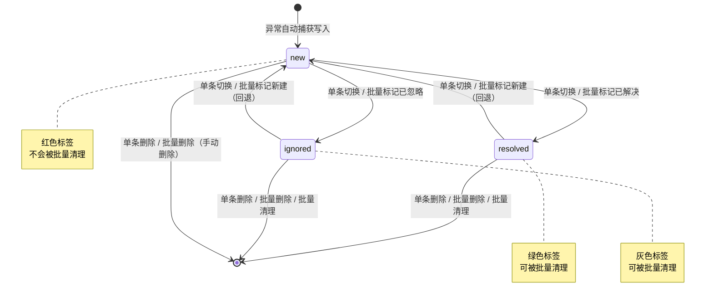

# 错误日志 操作手册

| 属性         | 值                              |
| ------------ | ------------------------------- |
| 文档版本     | v1.0                            |
| 文档日期     | 2026-07-05                      |
| 所属项目     | 闲鱼猎人                        |
| 所属菜单     | 数据查看 → 错误日志             |
| 文档类型     | 操作手册                        |
| 关联路由     | `/logs/errors`                  |
| 配套详细设计 | 错误日志-详细设计 v1.0          |
| 目标读者     | 运营 / 管理员                   |

---

## 目录

- [0. 阶段交接声明](#0-阶段交接声明)
- [1. 功能简介](#1-功能简介)
- [2. 入口与导航](#2-入口与导航)
- [3. 界面布局](#3-界面布局)
- [4. 操作指南](#4-操作指南)
  - [4.1 查看错误日志列表](#41-查看错误日志列表)
  - [4.2 4 张统计卡片说明](#42-4-张统计卡片说明)
  - [4.3 多维度筛选](#43-多维度筛选)
  - [4.4 查看错误详情（5 个 Tab）](#44-查看错误详情5-个-tab)
  - [4.5 单条状态切换](#45-单条状态切换)
  - [4.6 单条删除](#46-单条删除)
  - [4.7 批量操作](#47-批量操作)
  - [4.8 批量勾选与全选](#48-批量勾选与全选)
  - [4.9 批量清理](#49-批量清理)
  - [4.10 AI 上下文导出](#410-ai-上下文导出)
  - [4.11 复制 AI 上下文到剪贴板](#411-复制-ai-上下文到剪贴板)
- [5. 字段说明](#5-字段说明)
- [6. 常见问题 FAQ](#6-常见问题-faq)
- [7. 注意事项与限制](#7-注意事项与限制)
- [8. 关联功能](#8-关联功能)
- [9. 快捷键与技巧](#9-快捷键与技巧)
- [10. 修订记录](#10-修订记录)
- [11. 附录](#11-附录)

---

## 0. 阶段交接声明

```
- 当前阶段：错误日志操作手册 v1.0 编写 ✅ 已完成
- 下一阶段：通知中心操作手册编写
- 下一阶段智能体：文档编写智能体
- 下一阶段技能：文档编写
- 交接上下文：错误日志操作手册 v1.0 已完成，覆盖 11 章节模板；面向运营/管理员最终用户；涵盖 4 张统计卡片、5 Tab 详情视图、三状态流转（new/resolved/ignored）、4 种批量操作、批量清理（默认 30 天）、AI 上下文双格式导出（JSON/Markdown）、5 类关键词推断可能原因；与实时日志菜单边界已澄清（本菜单管错误日志，实时日志管事件流）。
```

---

## 1. 功能简介

错误日志是闲鱼猎人系统中**未处理异常的统一管理入口**，专供运营与管理人员排查系统异常。

### 1.1 核心能力

- **错误列表**：按时间倒序展示所有异常记录，支持多维度筛选（状态/错误类型/请求路径/时间范围/流水号）
- **5 Tab 详情视图**：概览 / 堆栈信息 / 请求参数 / 服务器环境 / AI 上下文，多角度分析异常
- **AI 诊断上下文**：双格式（JSON 结构化 + Markdown 报告）+ 5 类关键词推断可能原因，可一键复制给 AI 系统
- **三状态流转**：新建 → 已解决 / 已忽略，支持单条与批量操作
- **批量操作**：单次最多 500 条，支持删除 / 标记已解决 / 标记已忽略 / 标记新建
- **批量清理**：按天数清理已解决/已忽略的旧记录，默认 30 天
- **敏感信息脱敏**：authorization / cookie / xh_token / set-cookie 等敏感请求头自动替换为 `***`

### 1.2 适用场景

| 场景         | 典型操作                                                       |
| ------------ | -------------------------------------------------------------- |
| 异常排查     | 筛选"新建"状态 → 查看堆栈/请求参数 → 标记"已解决"             |
| AI 辅助诊断  | 切到 AI 上下文 Tab → 选 JSON/Markdown → 复制 → 粘贴给 AI 对话 |
| 历史清理     | 勾选已解决/已忽略 → 批量删除；或点击"批量清理"按钮           |
| 全链路追踪   | 拿到流水号 → 在筛选框输入 → 查看该请求的所有错误记录          |

> **提示**：本菜单仅管理"未处理异常"。业务事件流（任务调度/评估/抢单/通知等正常业务流程）请前往"实时日志"菜单查看。

---

## 2. 入口与导航

### 2.1 菜单入口

错误日志位于左侧导航栏的「数据查看」分组下：

- 菜单名称：**错误日志**
- 菜单图标：🐛（Bug 图标）
- 菜单路径：`/logs/errors`
- 菜单排序：第 16 位（紧邻"实时日志"之后）

### 2.2 进入方式

| 方式           | 操作                                                         |
| -------------- | ------------------------------------------------------------ |
| 菜单点击       | 展开左侧"数据查看"分组 → 点击"错误日志"                     |
| 命令面板       | 按 `Ctrl+K` → 输入"错误日志" → 选中命令                      |
| URL 直接访问   | 浏览器地址栏输入 `/logs/errors`                              |

### 2.3 与"实时日志"菜单的边界

| 维度     | 错误日志（本菜单）                | 实时日志                          |
| -------- | --------------------------------- | --------------------------------- |
| 菜单名称 | 错误日志                          | 实时日志                          |
| 数据范围 | 未处理异常                        | 业务事件流                        |
| 关注点   | "系统哪里出错了"                  | "系统在做什么"                    |
| 菜单排序 | 16                                | 15                                |

> **提示**：两个菜单相邻显示但数据独立。错误日志只展示异常记录，不会出现业务事件流内容。

---

## 3. 界面布局

错误日志页面采用"上下三层 + 左右两栏"的布局结构。

### 3.1 顶部标题栏

显示页面标题"后台错误日志"（含 Bug 图标）。

### 3.2 统计卡片行（顶部一行 4 列）

| 卡片位置   | 内容                              | 颜色   |
| ---------- | --------------------------------- | ------ |
| 第 1 列    | 新建数（new）                     | 红色   |
| 第 2 列    | 已解决数（resolved）              | 绿色   |
| 第 3 列    | 已忽略数（ignored）               | 默认色 |
| 第 4 列    | 操作按钮组（刷新 + 批量清理）     | —      |

### 3.3 主区域（左右两栏）

| 区域   | 占比 | 内容                                                                                                |
| ------ | ---- | --------------------------------------------------------------------------------------------------- |
| 左侧   | 10/24 | 错误列表（搜索工具栏 + 搜索历史 + 批量操作工具栏 + 错误列表）                                       |
| 右侧   | 14/24 | 错误详情（5 个 Tab：概览 / 堆栈信息 / 请求参数 / 服务器环境 / AI 上下文）                          |

### 3.4 左侧错误列表结构

1. **搜索条件工具栏**：状态下拉框 + 错误类型输入框 + 搜索按钮
2. **搜索历史小药丸**：展示最近使用过的错误类型关键词，点击可快速复用
3. **批量操作工具栏**：仅当勾选了记录后显示（全选复选框 / 已选 N 项 / 标记已解决 / 标记已忽略 / 批量删除 / 取消选择）
4. **错误列表**：可滚动区域（最大高度 500px），每行包含 复选框 + 状态标签 + 错误类型标签 + 请求方法+路径 + 错误消息（80 字符截断）+ 时间 + 删除按钮

### 3.5 右侧错误详情结构

- **未选中时**：显示空状态提示"选择左侧错误日志查看详情"
- **选中时**：展示 5 个 Tab 切换面板，详见 [4.4 查看错误详情](#44-查看错误详情5-个-tab)

### 3.6 选中行视觉反馈

- 选中行背景高亮（浅蓝色背景）
- 选中行左侧加 3px 蓝色边框
- 暗色主题自动适配

---

## 4. 操作指南

### 4.1 查看错误日志列表

**操作目的**：浏览系统中的所有异常记录，了解异常概况。

**操作步骤**：

1. 通过左侧菜单或 `Ctrl+K` 命令面板进入「错误日志」页面
2. 页面加载后，左侧错误列表自动按时间倒序展示最新的 100 条异常记录
3. 滚动列表浏览更多记录

**列表项展示内容**：

| 元素          | 说明                                                       |
| ------------- | ---------------------------------------------------------- |
| 复选框        | 用于批量勾选（详见 [4.8 批量勾选与全选](#48-批量勾选与全选)） |
| 状态标签      | 新建（红色）/ 已解决（绿色）/ 已忽略（灰色）               |
| 错误类型标签  | 红色标签，显示异常类型名（如 ValueError、KeyError 等）     |
| 请求方法+路径 | 如 `POST /tasks`；后台异常显示 `BACKGROUND`             |
| 错误消息      | 截断到 80 字符，完整内容在详情面板查看                      |
| 时间          | 异常发生时间（中文格式化）                                 |
| 删除按钮      | 单条删除（详见 [4.6 单条删除](#46-单条删除)）              |

> **提示**：点击列表项可选中该条记录，右侧详情面板会自动加载详情和 AI 上下文。

### 4.2 4 张统计卡片说明

**操作目的**：快速了解系统中异常的状态分布，决定后续操作。

| 卡片位置 | 卡片名称     | 颜色   | 含义                                       |
| -------- | ------------ | ------ | ------------------------------------------ |
| 第 1 列  | 新建         | 红色   | 当前未处理的异常数量（需要关注）           |
| 第 2 列  | 已解决       | 绿色   | 已确认处理的异常数量                       |
| 第 3 列  | 已忽略       | 默认色 | 已知但无需处理的异常数量                   |
| 第 4 列  | 操作按钮组   | —      | 包含「刷新」按钮和「批量清理」按钮         |

**操作按钮说明**：

| 按钮       | 操作                                       | 说明                                                  |
| ---------- | ------------------------------------------ | ----------------------------------------------------- |
| 刷新       | 点击立即重新加载错误列表                   | 用于获取最新异常记录                                  |
| 批量清理   | 弹出确认框，确认后清理 30 天前已解决/已忽略记录 | 详见 [4.9 批量清理](#49-批量清理)                    |

> **重要**：统计卡片显示的数字是**全局状态分布**，不受当前筛选条件影响。例如：即使筛选了"新建"状态，已解决/已忽略的数量仍显示全局总数，便于决策是否清理。

### 4.3 多维度筛选

**操作目的**：快速定位到目标异常记录。

#### 4.3.1 可用筛选维度

| 维度       | 控件类型     | 匹配方式 | 说明                                                       |
| ---------- | ------------ | -------- | ---------------------------------------------------------- |
| 状态       | 下拉框       | 精确     | 新建 / 已解决 / 已忽略，可清除选择                         |
| 错误类型   | 文本输入框   | 模糊     | 输入部分类型名即可，回车或点击搜索按钮触发                 |
| 请求路径   | 文本输入框   | 模糊     | 输入部分路径即可（暂未在主界面展示，可通过 URL 参数使用）  |
| 时间范围   | 起止时间     | 区间     | 起始时间 + 结束时间（暂未在主界面展示，可通过 URL 参数使用） |
| 流水号     | 文本输入框   | 精确     | 全局流水号，用于全链路追踪（暂未在主界面展示，可通过 URL 参数使用） |

#### 4.3.2 操作步骤

1. **状态筛选**：在"状态"下拉框中选择"新建 / 已解决 / 已忽略"之一，或清除选择查看全部
2. **错误类型筛选**：
   - 在"错误类型"输入框中输入关键词（如 `Value`、`Key`、`Connection`）
   - 按**回车键**或点击**搜索按钮**触发搜索
   - 关键词会自动保存到搜索历史，下次可直接点击小药丸复用
3. **搜索历史复用**：
   - 输入框下方显示历史关键词小药丸
   - 点击任一小药丸即可快速复用该关键词
4. **筛选条件持久化**：状态和错误类型会自动保存到浏览器本地，刷新页面后保持上次筛选状态

> **提示**：搜索有 400ms 防抖延迟，避免每次按键都触发请求。

### 4.4 查看错误详情（5 个 Tab）

**操作目的**：从多个角度深入分析单条异常的根因。

#### 4.4.1 操作步骤

1. 在左侧错误列表中点击目标记录
2. 右侧详情面板自动加载，默认显示"概览"Tab
3. 点击 Tab 标签切换不同视图

#### 4.4.2 5 个 Tab 详情视图说明

| Tab 名称     | 内容                                                                                                          | 用途                                 |
| ------------ | ------------------------------------------------------------------------------------------------------------- | ------------------------------------ |
| 概览         | 表格形式展示：错误类型（红色标签）/ 错误消息 / 发生时间 / 请求方法 / 请求路径 / 客户端 IP / **状态切换器** | 快速了解异常基本信息，可直接切换状态 |
| 堆栈信息     | 代码块展示完整 Python 堆栈追踪                                                                                | 定位异常抛出的代码位置               |
| 请求参数     | JSON 格式展示：请求方法 / 请求路径 / 请求参数 / 请求头（已脱敏）/ 客户端 IP / User-Agent                     | 还原请求现场                         |
| 服务器环境   | JSON 格式展示：Python 版本 / 操作系统 / 平台架构 / 进程 ID                                                    | 排查环境相关问题                     |
| AI 上下文    | 格式切换下拉框（JSON / Markdown）+ 复制按钮 + 代码块展示 AI 诊断上下文                                        | 辅助 AI 诊断，详见 [4.10](#410-ai-上下文导出) |

> **提示**：
> - 堆栈信息为空时显示"(无堆栈信息)"
> - AI 上下文为空时显示"(无 AI 上下文)"
> - 详情代码块自动适配暗色主题

### 4.5 单条状态切换

**操作目的**：将异常标记为已解决或已忽略，避免列表噪声累积。

#### 4.5.1 三种状态说明

| 状态     | 中文标签 | 颜色   | 含义                       | 可被批量清理 |
| -------- | -------- | ------ | -------------------------- | ------------ |
| new      | 新建     | 红色   | 未处理（默认值）           | ❌ 否         |
| resolved | 已解决   | 绿色   | 已确认处理                 | ✅ 是         |
| ignored  | 已忽略   | 灰色   | 已知但无需处理             | ✅ 是         |

#### 4.5.2 操作步骤

1. 在左侧列表点击目标记录，右侧详情面板加载
2. 切换到"概览"Tab
3. 在"状态"行点击状态下拉框
4. 选择目标状态（新建 / 已解决 / 已忽略）
5. 系统自动保存，弹出成功提示
6. 列表自动刷新，状态标签同步更新

> **提示**：状态支持任意方向切换，包括从"已解决/已忽略"回退到"新建"。

### 4.6 单条删除

**操作目的**：永久删除单条错误记录。

**操作步骤**：

1. 在左侧错误列表中找到目标记录
2. 点击该行右侧的**删除按钮**（垃圾桶图标）
3. 弹出确认框，点击**确认**
4. 删除成功，列表自动刷新

> **警告**：删除操作不可恢复。如需保留记录但不再关注，建议改为"已忽略"状态而非删除。

### 4.7 批量操作

**操作目的**：一次性对多条记录执行相同操作，提升效率。

#### 4.7.1 4 种批量操作

| 操作           | 按钮         | 行为                                       |
| -------------- | ------------ | ------------------------------------------ |
| 标记已解决     | CheckOutlined | 将选中记录状态改为"已解决"                |
| 标记已忽略     | StopOutlined  | 将选中记录状态改为"已忽略"                |
| 批量删除       | DeleteOutlined | 永久删除选中记录（需二次确认）            |
| 标记新建       | —            | 将选中记录状态回退为"新建"（仅批量操作可用） |

#### 4.7.2 操作步骤

1. 在左侧列表勾选目标记录（详见 [4.8 批量勾选与全选](#48-批量勾选与全选)）
2. 列表上方出现"批量操作工具栏"，显示已选条数
3. 点击对应按钮：
   - **标记已解决** / **标记已忽略**：直接执行
   - **批量删除**：弹出确认框，点击**确认**
4. 操作完成，弹出成功提示（含影响条数）
5. 列表自动刷新，勾选状态清空

> **限制**：单次批量操作最多 **500 条**。如需操作更多，请分批执行。

### 4.8 批量勾选与全选

**操作目的**：选择需要批量操作的记录。

#### 4.8.1 勾选方式

| 操作           | 行为                                                       |
| -------------- | ---------------------------------------------------------- |
| 单条勾选       | 点击记录左侧的复选框                                       |
| 全选当前页     | 点击批量操作工具栏中的"全选"复选框                         |
| 取消全选       | 再次点击"全选"复选框，或点击"取消选择"链接                |
| 取消单条勾选   | 再次点击该记录的复选框                                     |

#### 4.8.2 全选范围说明

- 全选仅作用于**当前列表显示的记录**，不会跨页累积
- 列表刷新后会自动清理已失效的勾选（如被删除的记录）

> **提示**：点击复选框不会触发详情加载，可放心勾选。

### 4.9 批量清理

**操作目的**：按天数批量清理已解决/已忽略的旧记录，释放存储空间。

#### 4.9.1 清理规则

- **清理对象**：状态为"已解决"或"已忽略"的记录
- **清理阈值**：异常发生时间超过指定天数（默认 30 天）
- **保护机制**：状态为"新建"的记录**永远不会被批量清理**，避免误删未处理异常

#### 4.9.2 操作步骤

1. 在顶部统计卡片行第 4 列找到「批量清理」按钮
2. 点击按钮，弹出确认框，提示"清理已解决/已忽略的错误日志"和"清理 30 天前的记录"
3. 点击**确认**
4. 系统执行清理，完成后弹出成功提示（含清理条数）
5. 列表自动刷新，统计卡片同步更新

> **警告**：清理操作不可恢复。如需保留历史记录，请勿使用批量清理。

### 4.10 AI 上下文导出

**操作目的**：获取结构化的 AI 诊断上下文，辅助快速定位异常原因。

#### 4.10.1 双格式说明

| 格式       | 适用场景                                       | 内容特点                                                       |
| ---------- | ---------------------------------------------- | -------------------------------------------------------------- |
| JSON       | 喂给内部 AI 诊断系统 / 程序化处理              | 结构化数据，包含错误类型/消息/堆栈/环境/请求/可能原因         |
| Markdown   | 粘贴给 ChatGPT/Claude 等对话式 AI              | 人类可读报告，分段清晰，含请求参数代码块和堆栈代码块           |

#### 4.10.2 操作步骤

1. 在左侧列表点击目标记录，右侧详情面板加载
2. 切换到"AI 上下文"Tab
3. 在格式切换下拉框中选择 **JSON** 或 **Markdown**
4. 系统自动加载对应格式的 AI 上下文，显示在代码块中
5. 如需复制，详见 [4.11 复制 AI 上下文到剪贴板](#411-复制-ai-上下文到剪贴板)

#### 4.10.3 5 类关键词推断的可能原因

AI 上下文会基于错误消息关键词自动推断可能原因：

| 关键词组合                       | 推断的可能原因             |
| -------------------------------- | -------------------------- |
| connection 或 timeout            | 网络连接或超时问题         |
| permission 或 denied             | 权限或文件系统访问问题     |
| type + convert/cast              | 数据类型转换错误           |
| key + not found/missing          | 字典/配置键缺失            |
| index + out of range             | 数组索引越界               |
| 以上均不匹配                     | 需要根据堆栈信息进一步分析 |

### 4.11 复制 AI 上下文到剪贴板

**操作目的**：将 AI 上下文复制到剪贴板，便于粘贴到 AI 对话或工具中。

**操作步骤**：

1. 在"AI 上下文"Tab 中，确认已选择目标格式（JSON 或 Markdown）
2. 点击代码块上方的**复制按钮**（复制图标）
3. 系统将内容写入剪贴板
4. 弹出成功提示"已复制到剪贴板"
5. 在目标位置（AI 对话框、文本编辑器等）按 `Ctrl+V` 粘贴

> **提示**：复制功能依赖浏览器的剪贴板 API。如复制失败，请检查浏览器权限设置。

---

## 5. 字段说明

### 5.1 错误列表字段

| 字段          | 说明                                                       |
| ------------- | ---------------------------------------------------------- |
| 状态标签      | 新建（红色）/ 已解决（绿色）/ 已忽略（灰色）               |
| 错误类型      | 异常类型名（如 ValueError、KeyError、ConnectionError 等）  |
| 请求方法      | HTTP 方法（GET/POST 等）或 BACKGROUND（后台异常）          |
| 请求路径      | 请求路径或后台任务来源标识                                 |
| 错误消息      | 异常消息文本（列表中截断到 80 字符）                       |
| 发生时间      | 异常发生时间（UTC，按本地时区显示）                        |

### 5.2 错误详情字段（5 Tab）

#### 5.2.1 概览 Tab

| 字段          | 说明                                                       |
| ------------- | ---------------------------------------------------------- |
| 错误类型      | 异常类型名（红色标签显示）                                 |
| 错误消息      | 完整异常消息文本                                           |
| 发生时间      | 异常发生时间（中文格式化）                                 |
| 请求方法      | HTTP 方法或 BACKGROUND                                     |
| 请求路径      | 请求路径或后台任务来源                                     |
| 客户端 IP     | 发起请求的客户端 IP（后台异常为空）                        |
| 状态          | 当前状态（支持下拉切换）                                   |

#### 5.2.2 堆栈信息 Tab

| 字段        | 说明                                                       |
| ----------- | ---------------------------------------------------------- |
| 堆栈追踪    | 完整的 Python 堆栈信息（无堆栈时显示"(无堆栈信息)"）       |

#### 5.2.3 请求参数 Tab

| 字段          | 说明                                                       |
| ------------- | ---------------------------------------------------------- |
| 请求方法      | HTTP 方法或 BACKGROUND                                     |
| 请求路径      | 请求路径                                                   |
| 请求参数      | 查询参数 + 请求体（JSON 格式）                             |
| 请求头        | 已脱敏的请求头（敏感字段值替换为 `***`）                   |
| 客户端 IP     | 客户端 IP 地址                                             |
| User-Agent    | 客户端 User-Agent                                          |

#### 5.2.4 服务器环境 Tab

| 字段            | 说明                          |
| --------------- | ----------------------------- |
| Python 版本     | 运行时 Python 版本            |
| 操作系统        | 操作系统名称和版本            |
| 平台架构        | 硬件架构（如 AMD64）          |
| 进程 ID         | 服务进程 ID                   |

#### 5.2.5 AI 上下文 Tab

| 字段            | 说明                                                       |
| --------------- | ---------------------------------------------------------- |
| 格式选择        | JSON 或 Markdown                                           |
| AI 上下文内容   | 对应格式的 AI 诊断上下文（含错误信息、环境、请求、可能原因） |

### 5.3 敏感请求头脱敏清单

| 请求头         | 脱敏后值 | 脱敏原因                       |
| -------------- | -------- | ------------------------------ |
| authorization  | `***`    | 含 Bearer token / Basic 认证   |
| cookie         | `***`    | 含会话 ID / 登录态             |
| xh_token       | `***`    | 系统单 token 认证凭据          |
| set-cookie     | `***`    | 服务端下发的会话 ID            |

---

## 6. 常见问题 FAQ

### Q1：错误日志和实时日志有什么区别？

**A**：错误日志（`/logs/errors`）专门管理**未处理异常**，提供堆栈、请求参数、服务器环境、AI 诊断上下文等结构化字段，支持状态流转和批量清理。实时日志（`/logs`）关注**业务事件流**（如任务调度、评估、抢单、通知等正常运行流程）。两者通过"流水号"在全链路追踪端点汇合。简单来说：错误日志回答"系统哪里出错了"，实时日志回答"系统在做什么"。

### Q2：统计卡片的数字为什么不会随筛选变化？

**A**：统计卡片显示的是**全局状态分布**，不受当前筛选条件影响。这样设计的目的是：当您筛选"新建"状态时，仍能看到系统中已解决/已忽略的总量，便于决定是否执行批量清理。如果数字随筛选变化，筛选"新建"后已解决/已忽略的计数会变成 0，失去参考价值。

### Q3：批量操作最多能一次操作多少条？

**A**：单次批量操作最多 **500 条**。支持 4 种操作：删除 / 标记已解决 / 标记已忽略 / 标记新建。如需操作超过 500 条，请分批执行。批量操作属于高危操作，系统会自动记录审计日志。

### Q4：批量清理会清理哪些记录？

**A**：批量清理会清理**指定天数前**（默认 30 天）状态为"已解决"或"已忽略"的记录。**状态为"新建"的记录永远不会被清理**，避免误删未处理异常。清理阈值按"异常发生时间"判断，不是记录创建时间。天数参数范围 1-365 天。

### Q5：AI 上下文有什么用？支持哪些格式？

**A**：AI 诊断上下文用于辅助快速定位异常原因，支持两种格式：

- **JSON 格式**：结构化数据，可直接喂给内部 AI 诊断系统或程序化处理
- **Markdown 格式**：人类可读报告，可直接粘贴给 ChatGPT/Claude 等对话式 AI

两种格式都会包含基于错误消息关键词推断的 5 类可能原因（网络/权限/类型转换/键缺失/索引越界），均不匹配时提示"需要根据堆栈信息进一步分析"。

### Q6：状态可以回退吗？比如从"已解决"改回"新建"？

**A**：可以。状态支持**任意方向切换**，包括从"已解决"或"已忽略"回退到"新建"。单条切换在详情面板的"概览"Tab 中操作；批量回退通过勾选记录后使用"标记新建"批量操作。

### Q7：请求头中的敏感信息会泄露吗？

**A**：不会。系统在写入错误日志前会自动对 4 个敏感请求头脱敏，值替换为 `***`：

- `authorization`：含 Bearer token / Basic 认证
- `cookie`：含会话 ID / 登录态
- `xh_token`：系统单 token 认证凭据
- `set-cookie`：服务端下发的会话 ID

脱敏后的请求头存储在 `request_headers` 字段，前端展示和 AI 上下文中均为脱敏后的内容。

### Q8：流水号是什么？怎么用于全链路追踪？

**A**：流水号（request_id）是全局唯一标识符，格式为 `req-<17位数字>-<6位hex>`（如 `req-20260701120000537-a3b2c1`）。每个 HTTP 请求或后台任务都会分配一个流水号，错误日志和实时日志共享同一流水号体系。通过在筛选框中输入流水号，可快速定位到该请求的所有错误记录。如需查看该请求的完整链路（含业务事件），可前往"实时日志"菜单使用全链路追踪功能。

### Q9：后台任务的异常会出现在错误日志中吗？

**A**：会。系统有两个异常捕获入口：

- **HTTP 请求异常**：用户请求触发的异常，请求方法显示为实际方法（GET/POST 等）
- **后台任务异常**：定时任务、worker 等后台任务抛出的异常，请求方法显示为 `BACKGROUND`

两种异常都会写入错误日志，可在同一列表中查看和管理。

### Q10：列表中的错误消息被截断了，怎么查看完整内容？

**A**：列表中的错误消息截断到 80 字符以节省空间。要查看完整内容，点击该记录，右侧详情面板的"概览"Tab 会显示完整的错误消息。如需查看完整堆栈，切换到"堆栈信息"Tab。

### Q11：复制 AI 上下文失败怎么办？

**A**：复制功能依赖浏览器的剪贴板 API。如果复制失败，请尝试以下方法：

1. 检查浏览器是否授予了剪贴板权限
2. 使用 HTTPS 协议访问系统（部分浏览器仅在 HTTPS 下允许剪贴板操作）
3. 手动选中代码块内容，按 `Ctrl+C` 复制

### Q12：批量删除和批量清理有什么区别？

**A**：

| 维度       | 批量删除                                   | 批量清理                                 |
| ---------- | ------------------------------------------ | ---------------------------------------- |
| 触发方式   | 勾选记录后点击"批量删除"按钮               | 点击统计卡片中的"批量清理"按钮           |
| 作用对象   | 用户勾选的指定记录                         | 满足天数条件的所有已解决/已忽略记录      |
| 状态限制   | 任意状态都可删除                           | 仅清理已解决/已忽略状态，新建状态不清理  |
| 数量限制   | 单次最多 500 条                            | 无明确上限，按天数条件批量清理           |
| 二次确认   | 是                                         | 是                                       |

### Q13：筛选条件刷新后会保留吗？

**A**：会。状态筛选和错误类型筛选会自动保存到浏览器本地存储，刷新页面或重新打开浏览器后保持上次筛选状态。如需清除筛选，手动清除下拉框选择和输入框内容即可。

### Q14：搜索历史会泄露给其他用户吗？

**A**：不会。搜索历史保存在当前浏览器的本地存储中，仅对当前用户可见。登出时不会清理搜索历史（保留用户习惯），但若更换浏览器或清除浏览器数据，历史会丢失。

---

## 7. 注意事项与限制

1. **批量操作上限 500 条**：单次批量操作（删除/标记已解决/标记已忽略/标记新建）最多 500 条记录。超过此限制的操作会被拒绝，需分批执行。

2. **批量清理仅清理已解决/已忽略状态**：批量清理功能只会清理状态为"已解决"或"已忽略"的记录，**状态为"新建"的记录永远不会被清理**，避免误删未处理异常。

3. **敏感请求头自动脱敏**：authorization、cookie、xh_token、set-cookie 4 个请求头的值在写入前会自动替换为 `***`，前端展示和 AI 上下文中均为脱敏后的内容，无法查看原始值。

4. **5 个 Tab 详情视图**：错误详情采用 5 Tab 设计（概览/堆栈信息/请求参数/服务器环境/AI 上下文），切换 Tab 时不会刷新整个详情面板，仅刷新对应内容区域。

5. **与实时日志菜单的边界**：本菜单仅管理错误日志（未处理异常），实时日志菜单管理业务事件流。两个菜单的数据独立，不可互查。如需跨表查询，请使用"全链路追踪"功能（位于实时日志菜单）。

6. **删除操作不可恢复**：单条删除和批量删除均为永久删除，无法恢复。如需保留记录但不再关注，建议改为"已忽略"状态。

7. **统计卡片数字为全局统计**：顶部 4 张统计卡片显示的数字是全局状态分布，不受当前筛选条件影响。这是设计如此，便于在筛选状态下仍能掌握全局异常概况。

8. **列表默认加载 100 条**：错误列表默认加载最新的 100 条记录，列表区域最大高度 500px，超出部分可滚动查看。如需查看更多历史记录，请使用筛选功能缩小范围。

9. **搜索有 400ms 防抖延迟**：在错误类型输入框中输入关键词后，系统会等待 400ms 无新输入才触发搜索，避免每次按键都发送请求。如需立即搜索，请按回车键或点击搜索按钮。

10. **AI 上下文为空的情况**：极少数情况下，AI 上下文字段可能为空（如写入时发生异常）。此时"AI 上下文"Tab 会显示"(无 AI 上下文)"，可参考堆栈信息和请求参数手动分析。

11. **后台异常的特殊标识**：后台任务抛出的异常，请求方法显示为 `BACKGROUND`，请求路径显示为任务来源标识或 `unknown`，客户端 IP 和 User-Agent 为空。

12. **流水号格式严格校验**：系统对流水号格式有严格校验（`req-<17位数字>-<6位hex>`），伪造的流水号会被拒绝，避免日志污染。

---

## 8. 关联功能

### 8.1 与「实时日志」菜单的联动

| 维度     | 错误日志（本菜单）       | 实时日志                         |
| -------- | ------------------------ | -------------------------------- |
| 菜单名称 | 错误日志                 | 实时日志                         |
| 路径     | `/logs/errors`           | `/logs`                          |
| 数据范围 | 未处理异常               | 业务事件流                       |
| 联动方式 | 通过"流水号"在全链路追踪端点汇合 | 同上                       |

**典型联动场景**：在错误日志中拿到某条异常的流水号 → 前往实时日志菜单 → 使用全链路追踪功能输入流水号 → 查看该请求的完整业务事件链路 + 错误记录，定位异常发生在请求的哪个阶段。

### 8.2 与「事件时间线」菜单的联动

- 事件时间线展示业务事件的时序关系
- 错误日志中的异常也会影响业务流程
- 通过流水号可在两个菜单间交叉 reference

### 8.3 与「通知中心」菜单的联动

- 通知中心负责异常告警通知
- 错误日志提供异常的详细信息
- 收到通知后，可前往错误日志菜单查看异常详情

### 8.4 与「数据库维护」菜单的联动

- 数据库维护菜单可管理错误日志数据表
- 如需手动清理或导出数据，可使用数据库维护功能
- 日常清理建议优先使用错误日志菜单的"批量清理"按钮

---

## 9. 快捷键与技巧

### 9.1 快捷键

| 快捷键             | 作用                                  |
| ------------------ | ------------------------------------- |
| `Ctrl+K`           | 打开命令面板，输入"错误日志"快速跳转  |
| `Enter`            | 在错误类型输入框中触发搜索            |
| `Escape`           | 关闭命令面板                          |
| `Ctrl+C`           | 复制选中文本（AI 上下文等代码块内容） |

### 9.2 实用技巧

1. **善用搜索历史**：错误类型输入框下方的小药丸记录了最近使用的关键词，点击可快速复用，避免重复输入。

2. **筛选条件持久化**：状态和错误类型筛选会自动保存，下次进入页面时自动恢复。如果发现列表为空，请检查是否记得有未清除的筛选条件。

3. **优先使用批量清理**：清理历史记录时，优先使用"批量清理"按钮（按天数清理），比逐条勾选删除更高效。

4. **AI 上下文双格式搭配使用**：JSON 格式适合程序化处理或喂给内部 AI 系统，Markdown 格式适合直接粘贴给 ChatGPT/Claude 等对话式 AI。根据使用场景选择合适格式。

5. **状态管理优于删除**：对于已确认但不需立即处理的异常，建议改为"已忽略"而非删除。已忽略的记录仍可查询，且会被批量清理自动处理。

6. **使用流水号定位全链路**：在错误详情的"概览"Tab 中可以看到流水号，复制该流水号到实时日志菜单的全链路追踪功能，可查看该请求的完整业务事件链路。

7. **关注"新建"卡片数字**：顶部"新建"卡片显示未处理异常数量，数字增长时需关注是否有新异常发生。

8. **暗色主题适配**：错误日志页面已适配暗色主题，详情代码块使用 CSS 变量自动切换颜色，可在系统主题切换中切换。

---

## 10. 修订记录

| 版本 | 日期       | 修订人     | 修订内容                                                                                                                       |
| ---- | ---------- | ---------- | ------------------------------------------------------------------------------------------------------------------------------ |
| v1.0 | 2026-07-05 | 文档编写智能体 | 初版：覆盖 11 章节模板；面向运营/管理员最终用户；涵盖 4 张统计卡片、5 Tab 详情视图、三状态流转（new/resolved/ignored）、4 种批量操作、批量清理（默认 30 天）、AI 上下文双格式导出（JSON/Markdown）、5 类关键词推断可能原因、12+ 条 FAQ、12 条注意事项、关联功能与快捷键技巧。 |

---

## 11. 附录

### 11.1 三状态流转图



**状态语义说明**：

| 状态     | 颜色   | 含义                       | 可被批量清理 |
| -------- | ------ | -------------------------- | ------------ |
| new      | 红色   | 新建，未处理（默认值）     | ❌ 否         |
| resolved | 绿色   | 已解决                     | ✅ 是         |
| ignored  | 灰色   | 已忽略                     | ✅ 是         |

### 11.2 5 个 Tab 详情视图说明

| Tab 名称     | 内容                                                                                                          | 关键字段                                                                        | 用途                                 |
| ------------ | ------------------------------------------------------------------------------------------------------------- | ------------------------------------------------------------------------------- | ------------------------------------ |
| 概览         | 表格形式展示（Descriptions 组件，单列布局，带边框）                                                           | 错误类型（红色 Tag）/ 错误消息 / 发生时间 / 请求方法 / 请求路径 / 客户端 IP / 状态（Select 切换器） | 快速了解异常基本信息，可直接切换状态 |
| 堆栈信息     | 代码块展示（pre 标签，支持暗色主题）                                                                          | stack_trace（无堆栈时显示"(无堆栈信息)"）                                       | 定位异常抛出的代码位置               |
| 请求参数     | JSON 格式代码块展示                                                                                           | method / path / params / headers（脱敏）/ client_ip / user_agent                | 还原请求现场                         |
| 服务器环境   | JSON 格式代码块展示                                                                                           | python_version / os / platform / pid                                            | 排查环境相关问题                     |
| AI 上下文    | 格式切换下拉框（JSON / Markdown）+ 复制按钮 + 代码块展示（含加载状态）                                        | ai_context_json / ai_context_md（无内容显示"(无 AI 上下文)"）                   | 辅助 AI 诊断                         |

### 11.3 AI 上下文双格式对比表

| 维度         | JSON 格式                                       | Markdown 格式                                             |
| ------------ | ----------------------------------------------- | --------------------------------------------------------- |
| 文件类型     | application/json                                | text/markdown                                             |
| 适用场景     | 喂给内部 AI 诊断系统 / 程序化处理               | 粘贴给 ChatGPT/Claude 等对话式 AI                         |
| 内容结构     | 嵌套对象，字段名英文                            | 分段报告，标题中文，含代码块                              |
| 包含字段     | error_type / error_message / stack_trace / environment / request / possible_causes | 基本信息 / 请求上下文 / 请求参数 / 堆栈信息 / 服务器环境 / 可能原因 |
| 可能原因格式 | 数组（如 `["数据类型转换错误"]`）               | 列表（如 `- 数据类型转换错误`）                           |
| 空值返回     | `"{}"`                                          | 空字符串                                                  |
| 复制便捷性   | 适合程序读取                                    | 适合人类阅读和粘贴到对话                                  |

### 11.4 批量操作对照表

| 操作           | 触发位置                 | 适用状态               | 单次上限 | 是否二次确认 | 是否审计记录 |
| -------------- | ------------------------ | ---------------------- | -------- | ------------ | ------------ |
| 标记已解决     | 批量操作工具栏           | 任意状态               | 500 条   | 否           | 是           |
| 标记已忽略     | 批量操作工具栏           | 任意状态               | 500 条   | 否           | 是           |
| 标记新建       | 批量操作（仅 API 可用）  | 任意状态               | 500 条   | 否           | 是           |
| 批量删除       | 批量操作工具栏           | 任意状态               | 500 条   | 是           | 是           |
| 批量清理       | 统计卡片操作列           | 仅已解决/已忽略        | 按天数   | 是           | 是           |
| 单条状态切换   | 详情面板"概览"Tab        | 任意状态               | 1 条     | 否           | 否           |
| 单条删除       | 列表项删除按钮           | 任意状态               | 1 条     | 是           | 否           |

> **说明**：批量操作（删除/标记已解决/标记已忽略/标记新建）单次最多 500 条，超出会被系统拒绝。批量清理按天数过滤，无明确数量上限。所有批量操作都会记录审计日志，便于事后追溯。

---

**文档结束**
