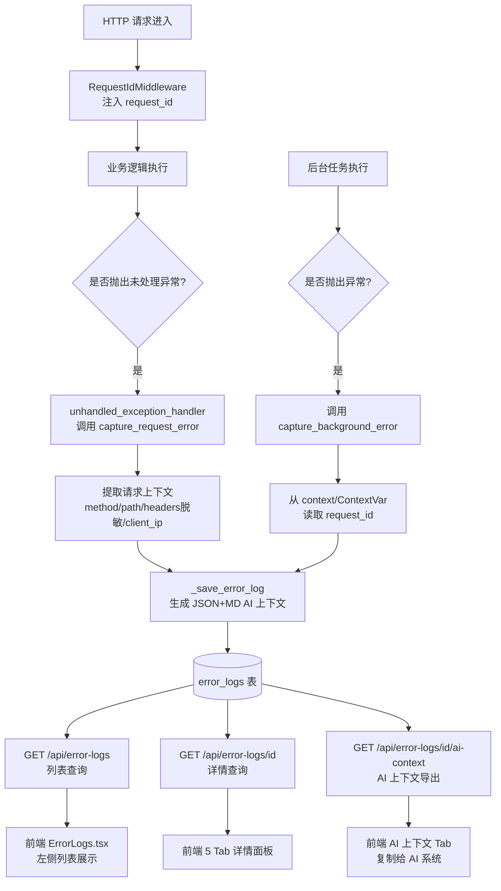
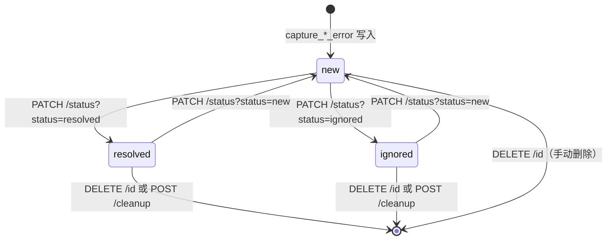
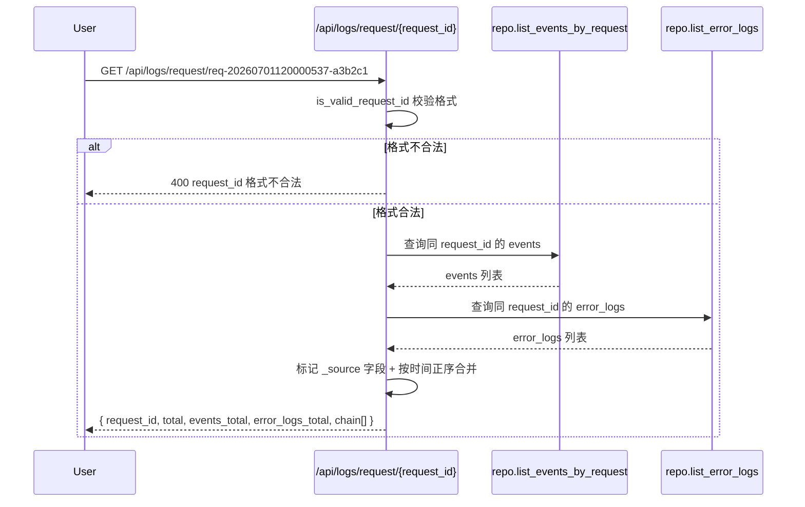

# 错误日志 详细设计文档

## 1. 文档元信息

| 属性     | 值                                |
| -------- | --------------------------------- |
| 文档名称 | 错误日志-详细设计                 |
| 版本     | v1.0                              |
| 发布日期 | 2026-07-05                        |
| 所属菜单 | 数据查看                          |
| 关联路由 | `/logs/errors`                    |
| 文档用途 | 开发团队技术指导 / 智能客服向量库训练素材 |
| 维护人   | XianyuHunter 团队                 |

> 本文档为首次创建，从原"实时日志-详细设计"文档中拆分独立。错误日志与实时日志虽同属 `/logs` 路由前缀，但菜单 key、数据来源、API 文件、写入入口、核心能力均不同，独立成文档便于维护人员按职责查阅。

---

## 2. 功能概述

**一句话说明**：专供技术维护人员排查未处理异常的结构化错误日志管理页，提供错误列表多维度过滤、详情 5 Tab 查看、AI 诊断上下文双格式导出、状态流转（new/resolved/ignored）与批量清理能力。

**核心价值**：
- 与 events 表解耦的独立 `error_logs` 表，存储完整堆栈、请求参数、服务器环境、AI 诊断上下文等异常专用字段；
- 双捕获入口：`capture_request_error`（HTTP 请求异常）+ `capture_background_error`（后台任务异常），覆盖所有未处理异常路径；
- AI 诊断上下文双格式：结构化 JSON（可直接喂给 AI 系统）+ Markdown 报告（可直接粘贴给 AI 对话），含 5 类关键词推断的可能原因；
- 5 Tab 详情视图：概览 / 堆栈信息 / 请求参数 / 服务器环境 / AI 上下文，便于多角度分析；
- 三状态流转：`new` → `resolved` / `ignored`，支持单条与批量操作；
- 全链路追踪交叉点：通过 `request_id` 与 events 表关联，`/api/logs/request/{request_id}` 端点聚合两表。

---

## 3. 用户场景

### 场景一：排查未处理异常
系统发生未处理异常后，维护人员打开错误日志页，左侧列表按时间倒序展示最新错误。点击某条记录，右侧详情面板自动加载"概览"Tab，展示错误类型、消息、发生时间、请求方法/路径、客户端 IP 与状态切换器，快速定位异常上下文。

### 场景二：分析堆栈与请求参数
维护人员切换到"堆栈信息"Tab 查看完整 Python 堆栈，定位异常抛出位置；切换到"请求参数"Tab 查看 method/path/params/headers/client_ip/user_agent 的 JSON 格式快照（headers 已脱敏），还原请求现场。

### 场景三：AI 辅助诊断
维护人员切换到"AI 上下文"Tab，选择 JSON 格式复制结构化数据喂给内部 AI 诊断系统，或选择 Markdown 格式复制报告粘贴给 ChatGPT/Claude 等对话式 AI，获取可能原因与修复建议。AI 上下文已基于错误消息关键词推断 5 类可能原因（网络/权限/类型转换/键缺失/索引越界）。

### 场景四：批量清理已解决错误
维护人员勾选多条已确认无用的错误记录，点击"批量删除"一次性清理；或点击"批量清理"按钮清理 30 天前的已解决/已忽略记录，释放数据库空间。

### 场景五：全链路追踪
维护人员从某条错误日志中拿到 `request_id`（如 `req-20260701120000537-a3b2c1`），调用 `/api/logs/request/{request_id}` 端点聚合该流水号关联的所有 events 与 error_logs，按时间正序合并展示完整调用链路，定位异常发生在请求的哪个阶段。

---

## 4. 菜单元数据

引用 `config/menu_registry.yaml` 中 `error_logs` 条目（单一事实源）：

```yaml
- key: error_logs
  label: 错误日志
  icon: BugOutlined
  path: /logs/errors
  sort_order: 16
  default_visible: true
  category: data_view
```

| 属性           | 值              |
| -------------- | --------------- |
| key            | `error_logs`    |
| label          | 错误日志        |
| icon           | `BugOutlined`   |
| path           | `/logs/errors`  |
| sort_order     | 16              |
| default_visible| true            |
| category       | `data_view`     |

> 与"实时日志"（key=`logs`，sort_order=15，path=`/logs`）是相邻但独立的菜单条目。

---

## 5. 数据模型

### 5.1 error_logs 表（ErrorLogRow，`infra/db_models.py:219`）

共 **17 个字段**，**无 `updated_at`**（状态流转通过 `status` 字段管理，不依赖时间戳）。

| 字段              | 类型     | 必填 | 默认值      | 约束 / 说明                                                       |
| ----------------- | -------- | ---- | ----------- | ----------------------------------------------------------------- |
| id                | Integer  | 是   | autoincrement| 主键，自增                                                        |
| timestamp         | DateTime | 是   | `_utcnow`   | 异常发生时间（UTC），**索引**；列表按此字段倒序                   |
| error_type        | String   | 是   | —           | 异常类型名（如 `ValueError`/`KeyError`/`ConnectionError`）        |
| error_message     | Text     | 是   | —           | 异常消息文本（`str(exc)`）                                        |
| stack_trace       | Text     | 否   | NULL        | 完整 Python 堆栈（`traceback.format_exception` 输出）             |
| request_method    | String   | 否   | NULL        | 请求方法（GET/POST/...）；后台异常为 `BACKGROUND`                 |
| request_path      | String   | 否   | NULL        | 请求路径；**索引**；后台异常为 context.source 或 `unknown`        |
| request_params    | Text     | 否   | NULL        | JSON：query + body（脱敏后）                                      |
| request_headers   | Text     | 否   | NULL        | JSON：脱敏后的 headers（authorization/cookie/xh_token/set-cookie 替换为 ***）|
| request_id        | String   | 否   | NULL        | 全局流水号（`req-<17位数字>-<6位hex>`）；**索引**；与 events 表同名同义 |
| client_ip         | String   | 否   | NULL        | 客户端 IP；后台异常为 NULL                                        |
| user_agent        | String   | 否   | NULL        | User-Agent；后台异常为 NULL                                       |
| server_env        | Text     | 否   | NULL        | JSON：python_version/os/platform/pid 服务器环境快照               |
| ai_context_json   | Text     | 否   | NULL        | AI 诊断上下文 JSON 格式（结构化，可直接喂 AI 系统）               |
| ai_context_md     | Text     | 否   | NULL        | AI 诊断上下文 Markdown 格式（可直接粘贴给 AI 对话）               |
| status            | String   | 是   | `new`       | 状态（new/resolved/ignored）；**索引**                            |
| created_at        | DateTime | 否   | `_utcnow`   | 记录创建时间（与 timestamp 区分：timestamp 是异常发生时间）       |

### 5.2 索引清单

| 索引名 | 字段          | 用途                                                     |
| ------ | ------------- | -------------------------------------------------------- |
| 单列   | `timestamp`   | 列表按时间倒序查询                                       |
| 单列   | `request_path`| 按请求路径模糊过滤                                       |
| 单列   | `request_id`  | 按全局流水号精确查询（全链路追踪）                       |
| 单列   | `status`      | 按状态过滤（new/resolved/ignored）+ 状态统计 GROUP BY    |

> **无 `updated_at` 字段**：状态流转通过 `status` 字段管理，不依赖 updated_at。`cleanup_old_error_logs` 按 `timestamp` 字段判断清理阈值。

### 5.3 与 events 表的边界

| 维度       | error_logs 表（本文档）                        | events 表（实时日志文档）                |
| ---------- | ----------------------------------------------- | ---------------------------------------- |
| 用途       | 未处理异常的结构化管理                          | 业务事件流（任务调度/评估/抢单/通知等）  |
| 写入入口   | `capture_request_error` + `capture_background_error` | 业务逻辑主动 `save_event`               |
| 字段数     | 17                                              | 10                                       |
| 时间字段   | `timestamp`（异常发生时间）+ `created_at`（记录创建时间）| `created_at`（事件创建时间）            |
| 关联键     | `request_id`（与 events 同名同义）              | `request_id`                             |
| 交叉点     | `/api/logs/request/{request_id}` 聚合两表       | 同上                                     |

---

## 6. API 端点清单

所有端点定义于 `backend/xianyu_hunter/web/routes/api_error_logs.py`，router prefix=`/api/error-logs`，tags=`error-logs`。

### 6.1 总览

| 方法   | 路径                                  | 说明                       | 请求参数                                                                                                                                                                                                              | 响应字段                                                                                                |
| ------ | ------------------------------------- | -------------------------- | --------------------------------------------------------------------------------------------------------------------------------------------------------------------------------------------------------------------- | ------------------------------------------------------------------------------------------------------- |
| GET    | `/api/error-logs`                     | 错误日志列表               | Query: `status?`(new\|resolved\|ignored), `error_type?`(模糊), `request_path?`(模糊), `request_id?`(精确), `start?`, `end?`, `limit?=50`(1-500), `offset?=0`(ge=0)                                                   | `{ items[], count, status_counts{} }`                                                                   |
| GET    | `/api/error-logs/{id}`                | 单条错误日志详情           | Path: `id`                                                                                                                                                                                                            | ErrorLog dict（含解析后的 JSON 字段）                                                                   |
| POST   | `/api/error-logs/batch`               | 批量操作                   | Body: `{ ids: list[int](1-500), action: "delete"\|"resolve"\|"ignore"\|"new" }`                                                                                                                                       | `{ affected, status }`                                                                                  |
| GET    | `/api/error-logs/{id}/ai-context`     | AI 上下文导出              | Path: `id`; Query: `format?=json`(json\|markdown)                                                                                                                                                                     | `application/json` 或 `text/markdown`（PlainTextResponse）                                             |
| PATCH  | `/api/error-logs/{id}/status`         | 更新状态                   | Path: `id`; Query: `status`(new\|resolved\|ignored)                                                                                                                                                                   | `{ status: "ok" }`                                                                                      |
| DELETE | `/api/error-logs/{id}`                | 删除单条                   | Path: `id`                                                                                                                                                                                                            | `{ status: "ok" }`                                                                                      |
| POST   | `/api/error-logs/cleanup`             | 批量清理                   | Query: `days?=30`(1-365)                                                                                                                                                                                              | `{ deleted, status }`                                                                                   |

### 6.2 GET `/api/error-logs` — 列表

```python
def list_error_logs(
    status: str | None = Query(None, pattern="^(new|resolved|ignored)$"),
    error_type: str | None = Query(None, description="异常类型（模糊匹配）"),
    request_path: str | None = Query(None, description="请求路径（模糊匹配）"),
    request_id: str | None = Query(None, description="按全局流水号过滤（全链路追踪）"),
    start: str | None = Query(None, description="起始时间 ISO8601"),
    end: str | None = Query(None, description="结束时间 ISO8601"),
    limit: int = Query(50, ge=1, le=500),
    offset: int = Query(0, ge=0),
    container: Container = Depends(get_container),
) -> dict[str, Any]:
```

**执行流程**：
1. 解析 `start`/`end` 为 datetime（`parse_iso_datetime`）；
2. 委托 `ErrorLogSearchService` 处理分页与慢查询埋点（`search_services.py:80`）；
3. service 内部调用 `repo.list_error_logs` 执行多维度过滤（status 精确、error_type/request_path LIKE 模糊、request_id 精确、时间范围）；
4. 通过 `_parse_json_fields` 将 `request_params`/`request_headers`/`server_env`/`ai_context_json` 四个 JSON 字符串字段解析为 dict，便于前端直接消费；
5. 单独调用 `repo.count_error_logs_by_status()` 获取全局状态分布（不依赖当前过滤条件）；
6. 返回 `{ items, count, status_counts }`。

**响应字段**：
- `items[]`：错误日志列表（按 timestamp desc）；
- `count`：当前页命中数；
- `status_counts`：全局状态分布（`{new: N, resolved: N, ignored: N}`，不受过滤条件影响）。

### 6.3 GET `/api/error-logs/{id}` — 详情

```python
def get_error_log(error_log_id: int, container: Container = Depends(get_container)) -> dict[str, Any]:
```

- 不存在返回 404（`ERROR_LOG_NOT_FOUND_MSG = "错误日志不存在"`）；
- 返回前通过 `_parse_json_fields` 解析 JSON 字段。

### 6.4 POST `/api/error-logs/batch` — 批量操作

```python
class BatchActionRequest(BaseModel):
    ids: list[int] = Field(..., min_length=1, max_length=500)
    action: str = Field(..., pattern="^(delete|resolve|ignore|new)$")

def batch_action(payload: BatchActionRequest, container: Container = Depends(get_container)) -> dict[str, Any]:
```

- `action=delete`：调用 `repo.batch_delete_error_logs(ids)`；
- `action=resolve|ignore|new`：调用 `repo.batch_update_error_log_status(ids, action)`；
- 单次事务处理，避免循环单条更新的事务开销；
- 返回 `{ affected, status: "ok" }`；
- 高危操作，记 `logger.info` 审计日志。

### 6.5 GET `/api/error-logs/{id}/ai-context` — AI 上下文导出

```python
def get_ai_context(
    error_log_id: int,
    format: str = Query("json", pattern="^(json|markdown)$"),
    container: Container = Depends(get_container),
) -> PlainTextResponse:
```

- `format=json`：返回 `ai_context_json` 字段，`media_type="application/json"`；
- `format=markdown`：返回 `ai_context_md` 字段，`media_type="text/markdown"`；
- 字段为空时返回 `"{}"`（JSON）或空串（Markdown）；
- 使用 `PlainTextResponse` 直接返回文本，避免 JSON 包装破坏格式。

### 6.6 PATCH `/api/error-logs/{id}/status` — 更新状态

```python
def update_status(
    error_log_id: int,
    status: str = Query(..., pattern="^(new|resolved|ignored)$"),
    container: Container = Depends(get_container),
) -> dict[str, str]:
```

- 状态字段通过 Query 传递（非 Body）；
- 调用 `repo.update_error_log_status(id, status)`；
- 不存在返回 404；
- 返回 `{ status: "ok" }`。

### 6.7 DELETE `/api/error-logs/{id}` — 删除单条

```python
def delete_error_log(error_log_id: int, container: Container = Depends(get_container)) -> dict[str, str]:
```

- 调用 `repo.delete_error_log(id)`；
- 不存在返回 404；
- 返回 `{ status: "ok" }`。

### 6.8 POST `/api/error-logs/cleanup` — 批量清理

```python
def cleanup_error_logs(
    days: int = Query(30, ge=1, le=365),
    container: Container = Depends(get_container),
) -> dict[str, Any]:
```

- 清理 `days` 天前的 `status in ('resolved', 'ignored')` 记录；
- 调用 `repo.cleanup_old_error_logs(days=days)`；
- 返回 `{ deleted, status: "ok" }`；
- `new` 状态记录不被清理（避免误删未处理异常）。

---

## 7. 错误捕获双入口

定义于 `backend/xianyu_hunter/web/middleware/error_capture.py`。两个入口均写入 `error_logs` 表，统一调用 `_save_error_log` 内部函数。

### 7.1 capture_request_error（HTTP 请求异常）

```python
async def capture_request_error(request: Any, exc: Exception) -> int | None:
```

- 供 `exception_handler.py` 的 `unhandled_exception_handler` 调用；
- 从 `request.state.request_id` 读取流水号（由 `RequestIdMiddleware` 注入），兜底从 ContextVar 读取；
- 提取请求上下文：method、path、headers（脱敏）、client_ip、user_agent、query_params；
- 调用 `_save_error_log` 写入 error_logs 表；
- 返回 error_log id，写入失败返回 None（不阻断主流程）。

### 7.2 capture_background_error（后台任务异常）

```python
def capture_background_error(exc: Exception, context: dict | None = None) -> int | None:
```

- 供 worker / scheduler 等后台任务调用；
- 优先从 `context["request_id"]` 读取流水号，兜底从 ContextVar 读取；
- `request_info` 标记 `method="BACKGROUND"`，`path=context.get("source", "unknown")`；
- 用于关联 HTTP 请求触发的后台任务链路（如 F-16 依赖激活失败的异常）。

### 7.3 _save_error_log 内部函数

```python
def _save_error_log(
    error_type: str, error_message: str, stack_trace: str | None,
    request_info: dict | None, server_env: dict, timestamp: datetime,
    request_id: str | None = None,
) -> int | None:
```

- 复用 Web 进程的 Container 单例（`get_container()`），失败时构建临时实例（`build_default_container(with_browser=False)`）；
- 将 `request_id` 注入 `request_info`，使 AI 诊断上下文报告中可见；
- 调用 `_build_ai_context_json` 与 `_build_ai_context_md` 生成双格式上下文；
- 构建 error_log dict 并调用 `repo.save_error_log` 写入；
- **request_id 显式传入**：覆盖 ContextVar 兜底值，因为异常处理可能在 ContextVar 已被清理后触发（如中间件 finally 后）；
- 写入失败仅记 `logger.error`，不抛出（避免错误日志写入失败导致主流程异常）。

### 7.4 敏感信息脱敏

`_sanitize_headers` 函数对以下请求头脱敏（值替换为 `***`）：

| 敏感请求头       | 脱敏原因                       |
| ---------------- | ------------------------------ |
| `authorization`  | 含 Bearer token / Basic 认证   |
| `cookie`         | 含会话 ID / 登录态             |
| `xh_token`       | 系统单 token 认证凭据          |
| `set-cookie`     | 服务端下发的会话 ID            |

### 7.5 服务器环境快照

`_collect_server_env` 收集以下信息：

| 字段             | 来源                       |
| ---------------- | -------------------------- |
| `python_version` | `sys.version.split()[0]`   |
| `os`             | `platform.system()` + `release()` |
| `platform`       | `platform.machine()`       |
| `pid`            | `os.getpid()`              |

---

## 8. AI 诊断上下文双格式

错误日志写入时同步生成 JSON 与 Markdown 双格式 AI 诊断上下文，存入 `ai_context_json` 与 `ai_context_md` 字段。

### 8.1 JSON 格式（`_build_ai_context_json`）

结构化 JSON，可直接作为 AI 诊断系统输入：

```json
{
  "error_type": "ValueError",
  "error_message": "invalid literal for int() with base 10: 'abc'",
  "stack_trace": "Traceback (most recent call last):\n  ...",
  "environment": {
    "python_version": "3.11.5",
    "os": "Windows 10",
    "platform": "AMD64",
    "pid": "12345"
  },
  "request": {
    "method": "POST",
    "path": "/api/tasks",
    "headers": {"authorization": "***", "content-type": "application/json"},
    "client_ip": "127.0.0.1",
    "user_agent": "Mozilla/5.0...",
    "request_id": "req-20260701120000537-a3b2c1",
    "params": {"query": {"foo": "bar"}}
  },
  "possible_causes": [
    "数据类型转换错误"
  ]
}
```

### 8.2 Markdown 格式（`_build_ai_context_md`）

人类可读报告，可直接粘贴给 AI 对话：

```markdown
# 错误报告

## 基本信息
- **类型**: `ValueError`
- **时间**: 2026-07-05 12:00:00
- **消息**: invalid literal for int() with base 10: 'abc'

## 请求上下文
- **方法**: POST
- **路径**: /api/tasks
- **流水号**: `req-20260701120000537-a3b2c1`
- **客户端 IP**: 127.0.0.1
- **User-Agent**: Mozilla/5.0...

### 请求参数
```json
{
  "query": {"foo": "bar"}
}
```

## 堆栈信息
```
Traceback (most recent call last):
  ...
```

## 服务器环境
- **Python**: 3.11.5
- **OS**: Windows 10
- **PID**: 12345

## 可能原因
- 数据类型转换错误
```

### 8.3 可能原因推断（`_infer_possible_causes`）

基于错误消息关键词推断 5 类可能原因，复用于 JSON 与 Markdown 两种格式：

| 关键词组合                              | 推断原因                 |
| --------------------------------------- | ------------------------ |
| `connection` 或 `timeout`               | 网络连接或超时问题       |
| `permission` 或 `denied`                | 权限或文件系统访问问题   |
| `type` + (`convert` 或 `cast`)          | 数据类型转换错误         |
| `key` + (`not found` 或 `missing`)      | 字典/配置键缺失          |
| `index` + `out of range`                | 数组索引越界             |
| 以上均不匹配                            | 需要根据堆栈信息进一步分析 |

> **设计说明**：`_infer_possible_causes` 提取为独立函数，避免 `_build_ai_context_json` 与 `_build_ai_context_md` 重复实现相同的关键词匹配逻辑（5 组 if + or/and），集中维护避免两处不一致。

---

## 9. 业务流程

### 9.1 异常捕获 → 写入 error_logs → 列表展示



### 9.2 状态流转



**状态语义**：
- `new`：新建，未处理（默认值，红色标签）；
- `resolved`：已解决（绿色标签，可被 cleanup 清理）；
- `ignored`：已忽略（灰色标签，可被 cleanup 清理）。

**批量操作**：
- `POST /api/error-logs/batch` 支持 `delete`/`resolve`/`ignore`/`new` 四种 action；
- 单次最多 500 条（`max_length=500`）；
- `cleanup` 仅清理 `resolved`/`ignored` 状态记录，`new` 状态不被清理。

### 9.3 全链路追踪交叉



> 该端点定义于 `api_logs.py`（实时日志文档覆盖），但聚合两表数据，是错误日志与实时日志的交叉点。

---

## 10. 前端组件结构

### 10.1 组件树

```
ErrorLogsPage (frontend/src/pages/Logs/ErrorLogs.tsx)
├── 标题（BugOutlined + "后台错误日志"）
├── 统计卡片行（Row + 4 Col）
│   ├── Col 1: 新建数（statusCounts.new，红色 #ff4d4f）
│   ├── Col 2: 已解决数（statusCounts.resolved，绿色 #52c41a）
│   ├── Col 3: 已忽略数（statusCounts.ignored）
│   └── Col 4: 操作按钮组
│       ├── 刷新按钮（ReloadOutlined，触发 loadList）
│       └── 批量清理按钮（DeleteOutlined + Popconfirm，调用 cleanup(30)）
├── Row
│   ├── 左侧：错误列表（Col span=10）
│   │   └── Card title="错误列表"
│   │       ├── 搜索条件工具栏（Space wrap）
│   │       │   ├── 状态 Select（新建/已解决/已忽略，allowClear）
│   │       │   ├── 错误类型 Input（持久化到 localStorage，回车触发搜索）
│   │       │   └── 搜索按钮（type=primary）
│   │       ├── 搜索历史小药丸（namespace='error_logs'，点击复用关键词）
│   │       ├── 批量操作工具栏（仅 selectedIds.size > 0 时显示）
│   │       │   ├── 全选 Checkbox（indeterminate 三态）
│   │       │   ├── 已选 N 项 Text
│   │       │   ├── 标记已解决按钮（CheckOutlined）
│   │       │   ├── 标记已忽略按钮（StopOutlined）
│   │       │   ├── 批量删除按钮（DeleteOutlined + Popconfirm）
│   │       │   └── 取消选择链接
│   │       └── List（maxHeight 500，可滚动）
│   │           └── 每行：Checkbox + 状态 Tag + 错误类型 Tag + 请求方法+路径 + 错误消息（80字符截断）+ 时间 + 删除按钮
│   └── 右侧：详情面板（Col span=14）
│       └── Card title="错误详情"
│           └── Tabs（5 个 Tab）
│               ├── 概览 Tab：Descriptions 表格
│               │   ├── 错误类型（红色 Tag）
│               │   ├── 错误消息
│               │   ├── 发生时间
│               │   ├── 请求方法
│               │   ├── 请求路径
│               │   ├── 客户端 IP
│               │   └── 状态（Select 切换器：new/resolved/ignored）
│               ├── 堆栈信息 Tab：pre 代码块（PRE_STYLE，支持暗色主题）
│               ├── 请求参数 Tab：pre 代码块（JSON 格式化 method/path/params/headers/client_ip/user_agent）
│               ├── 服务器环境 Tab：pre 代码块（JSON 格式化 server_env）
│               └── AI 上下文 Tab
│                   ├── 格式切换 Select（JSON/Markdown）
│                   ├── 复制按钮（CopyOutlined，写剪贴板）
│                   └── pre 代码块（aiContent，Spin 加载态）
```

### 10.2 主要交互

| 区域             | 交互行为                                                                                          |
| ---------------- | ------------------------------------------------------------------------------------------------- |
| 筛选条件持久化   | `filterStatus`/`filterType` 通过 `usePersistentState` 持久化到 localStorage，刷新后保持上次状态  |
| 搜索防抖         | `useSearch` hook 400ms 防抖，避免每次输入都请求                                                   |
| 搜索历史         | `useSearchHistory` hook（namespace=`error_logs`）记录错误类型关键词，点击小药丸复用              |
| 列表项点击       | 选中该条记录，右侧详情面板自动加载详情 + AI 上下文                                                |
| 状态切换         | 详情面板"概览"Tab 内的 Select 直接切换状态，调用 `PATCH /api/error-logs/{id}/status`            |
| 批量勾选         | Checkbox 使用 Set 存储 id，O(1) 检查与切换；列表刷新后通过 `pruneSelection` 清理失效 id         |
| 全选/取消全选    | 以当前 errorLogs 为范围，避免跨页累积选择                                                         |
| 批量操作         | 调用 `POST /api/error-logs/batch`，单次最多 500 条；操作后清空选择并刷新列表                     |
| AI 上下文格式    | 切换 JSON/Markdown 时重新调用 `GET /api/error-logs/{id}/ai-context?format=`                      |
| 复制 AI 上下文   | `navigator.clipboard.writeText`，成功后 message.success 提示                                     |
| 批量清理         | Popconfirm 二次确认，调用 `POST /api/error-logs/cleanup?days=30`，清理已解决/已忽略记录         |
| PRE_STYLE        | 使用 CSS 变量 `var(--xh-bg-code)`/`var(--xh-text-primary)`/`var(--xh-border)`，支持暗色主题     |
| 选中行高亮       | 列表项 background 为 `var(--xh-bg-info)`，borderLeft 为 `3px solid var(--xh-border-info)`       |
| Checkbox 阻止冒泡| onClick `e.stopPropagation()`，避免点击勾选时误触发详情加载                                      |

### 10.3 状态颜色映射

```typescript
const STATUS_COLOR: Record<string, string> = {
  new: 'red',        // 新建：红色（需关注）
  resolved: 'green', // 已解决：绿色
  ignored: 'default',// 已忽略：灰色
}
const STATUS_LABEL: Record<string, string> = {
  new: '新建',
  resolved: '已解决',
  ignored: '已忽略',
}
```

### 10.4 关键 hooks

| Hook               | 来源                                       | 用途                                                       |
| ------------------ | ------------------------------------------ | ---------------------------------------------------------- |
| `usePersistentState`| `../../hooks/usePersistentState`           | 筛选条件持久化到 localStorage（key: `xh.errorLogs.filterStatus`/`xh.errorLogs.filterType`）|
| `useSearch`        | `../../hooks/useSearch`                    | 搜索防抖（400ms）+ 触发                                    |
| `useSearchHistory` | `../../hooks/useSearchHistory`             | 搜索历史持久化（namespace=`error_logs`）                   |

### 10.5 关键常量

| 常量                | 值  | 说明                                   |
| ------------------- | --- | -------------------------------------- |
| 列表 `limit`        | 100 | 一次拉取条数（硬编码在 `loadList` 中） |
| 批量操作 `max_length`| 500 | 单次批量操作最大条数（后端 Pydantic 校验）|
| `cleanup` 默认 days | 30  | 批量清理默认清理 30 天前记录           |

---

## 11. 关键依赖与下游影响

### 11.1 上游依赖

| 模块                | 文件路径                                                                                       | 依赖关系                                          |
| ------------------- | ---------------------------------------------------------------------------------------------- | ------------------------------------------------- |
| 错误捕获中间件      | `backend/xianyu_hunter/web/middleware/error_capture.py`                                            | 写入 error_logs 表的两个入口                      |
| 异常处理器          | `backend/xianyu_hunter/web/middleware/exception_handler.py`                                        | 调用 `capture_request_error`                      |
| request_id 生成器   | `backend/xianyu_hunter/infra/request_context.py`                                                   | 提供 request_id 生成、ContextVar 传递、格式校验   |
| Repository          | `backend/xianyu_hunter/infra/repo_error_logs.py`                                                   | `ErrorLogsMixin` 提供 CRUD + 批量 + 统计 + 清理  |
| 搜索服务            | `backend/xianyu_hunter/web/services/search_services.py`                                            | `ErrorLogSearchService` 处理分页与慢查询埋点      |
| DB 模型             | `backend/xianyu_hunter/infra/db_models.py`                                                         | `ErrorLogRow` 定义（第 219 行）                   |
| 前端 API 封装       | `frontend/src/api/index.ts`                                                                    | `errorLogApi.list`/`get`/`batch`/`cleanup`/`getAiContext`/`updateStatus`/`delete` |

### 11.2 下游影响

- **实时日志页**（`/logs`）：通过 `/api/logs/request/{request_id}` 端点与本文档关联，全链路追踪是两者的交汇点；
- **Dashboard 仪表盘**：错误日志统计可能作为仪表盘异常监控的数据源（视具体实现）；
- **数据库维护**（`/maintenance/db`）：error_logs 表是数据库维护页可直接操作的表之一；
- **request_id 链路**：error_logs 表的 `request_id` 字段与 events 表同名同义，是跨表关联的核心字段。

### 11.3 Repository 方法清单（ErrorLogsMixin）

| 方法                                | 签名                                                                        | 用途                             |
| ----------------------------------- | --------------------------------------------------------------------------- | -------------------------------- |
| `save_error_log`                    | `(error_log: dict) -> int`                                                  | 插入一条错误日志，返回主键 id    |
| `list_error_logs`                   | `(status/error_type/request_path/request_id/start_dt/end_dt/limit/offset) -> list[dict]` | 多维度过滤查询        |
| `get_error_log`                     | `(error_log_id: int) -> dict \| None`                                       | 获取单条                         |
| `update_error_log_status`           | `(error_log_id: int, status: str) -> bool`                                  | 更新状态                         |
| `delete_error_log`                  | `(error_log_id: int) -> bool`                                               | 删除单条                         |
| `batch_update_error_log_status`     | `(ids: list[int], status: str) -> int`                                      | 批量更新状态                     |
| `batch_delete_error_logs`           | `(ids: list[int]) -> int`                                                   | 批量删除                         |
| `count_error_logs_by_status`        | `() -> dict[str, int]`                                                      | 按状态分组统计                   |
| `cleanup_old_error_logs`            | `(days: int = 30) -> int`                                                   | 清理指定天数前的 resolved/ignored 记录 |

> `save_error_log` 自动注入 request_id（与 events 表保持一致的注入策略）：调用方未显式指定时从 ContextVar 读取。

---

## 12. 与实时日志的边界

| 维度       | 实时日志（独立文档）                            | 错误日志（本文档）                          |
| ---------- | ----------------------------------------------- | ------------------------------------------- |
| 菜单 key   | `logs`                                          | `error_logs`                                |
| 路由       | `/logs`                                         | `/logs/errors`                              |
| sort_order | 15                                              | 16                                          |
| 数据来源   | events 表 + `run.stdout.log`/`run.stderr.log` 文件 | error_logs 表                               |
| 字段数     | 10（events 表）                                 | 17（error_logs 表）                         |
| 时间字段   | `created_at`（事件创建时间）                    | `timestamp`（异常发生时间）+ `created_at`（记录创建时间）|
| 核心能力   | 实时事件流订阅、结构化搜索、标签、导出、全链路追踪 | 错误列表、5 Tab 详情、AI 上下文双格式导出、状态流转、批量清理 |
| API 文件   | `web/routes/api_logs.py`（7 端点）              | `web/routes/api_error_logs.py`（7 端点）    |
| API prefix | `/api/logs`                                     | `/api/error-logs`                           |
| 写入入口   | 业务逻辑主动 `save_event`                       | `capture_request_error` + `capture_background_error` |
| 状态管理   | 无（events 表无 status 字段）                   | 三状态（new/resolved/ignored）              |
| 交叉点     | `/api/logs/request/{request_id}` 聚合两表       | 同上                                        |

> 实时日志关注"正常运行的事件流"，错误日志关注"未处理异常的结构化管理"。两者通过 request_id 在全链路追踪端点汇合。

---

## 13. 常见问题 FAQ

### Q1：错误日志和实时日志有什么区别？
**A**：错误日志（`/logs/errors`）专供技术维护人员排查未处理异常，数据来源是 `error_logs` 表（17 字段，含完整堆栈/请求参数/服务器环境/AI 诊断上下文），由 `capture_request_error` 和 `capture_background_error` 两个入口写入，支持三状态流转与批量清理。实时日志（`/logs`）关注业务事件流，数据来源是 events 表 + 日志文件，由业务逻辑主动 `save_event` 写入，支持 SSE 实时订阅与结构化搜索。两者通过 `request_id` 在 `/api/logs/request/{request_id}` 端点汇合。

### Q2：error_logs 表有 updated_at 字段吗？
**A**：**没有**。error_logs 表共 17 个字段，分别为 `id`/`timestamp`/`error_type`/`error_message`/`stack_trace`/`request_method`/`request_path`/`request_params`/`request_headers`/`request_id`/`client_ip`/`user_agent`/`server_env`/`ai_context_json`/`ai_context_md`/`status`/`created_at`，**无 `updated_at`**。状态流转（new→resolved/ignored）通过 `status` 字段管理，不依赖 updated_at。`cleanup_old_error_logs` 按 `timestamp` 字段判断清理阈值。

### Q3：错误日志是怎么写入数据库的？
**A**：两个入口：
1. `capture_request_error(request, exc)`：HTTP 请求异常，由 `exception_handler.py` 的 `unhandled_exception_handler` 调用，从 `request.state.request_id` 读取流水号，提取 method/path/headers（脱敏）/client_ip/user_agent/query_params。
2. `capture_background_error(exc, context)`：后台任务异常，由 worker/scheduler 调用，从 `context["request_id"]` 或 ContextVar 读取流水号，标记 method="BACKGROUND"。

两者统一调用 `_save_error_log` 内部函数，生成 JSON+Markdown 双格式 AI 上下文后写入 error_logs 表。写入失败仅记 `logger.error`，不抛出（避免错误日志写入失败导致主流程异常）。

### Q4：AI 上下文有什么用？支持哪些格式？
**A**：AI 诊断上下文存入 `ai_context_json` 与 `ai_context_md` 两个字段，用于辅助维护人员快速定位异常原因。
- **JSON 格式**：结构化，包含 error_type/error_message/stack_trace/environment/request/possible_causes，可直接作为 AI 诊断系统输入；
- **Markdown 格式**：人类可读报告，可直接粘贴给 ChatGPT/Claude 等对话式 AI；
- **possible_causes**：基于错误消息关键词推断 5 类可能原因（网络连接/权限/类型转换/键缺失/索引越界），均不匹配时提示"需要根据堆栈信息进一步分析"。
- 通过 `GET /api/error-logs/{id}/ai-context?format=json|markdown` 导出，前端"AI 上下文"Tab 内可切换格式并复制到剪贴板。

### Q5：状态流转怎么操作？
**A**：三种状态：`new`（新建，红色）/`resolved`（已解决，绿色）/`ignored`（已忽略，灰色）。
- **单条状态切换**：详情面板"概览"Tab 内的 Select 切换器，调用 `PATCH /api/error-logs/{id}?status=new|resolved|ignored`；
- **批量状态切换**：勾选多条记录后点击"标记已解决"/"标记已忽略"按钮，调用 `POST /api/error-logs/batch`（body: `{ids, action: "resolve"|"ignore"|"new"}`）；
- **回退到 new**：已解决/已忽略的记录可回退到 new 状态（PATCH 或 batch action="new"）；
- `cleanup` 仅清理 `resolved`/`ignored` 状态记录，`new` 状态不被清理（避免误删未处理异常）。

### Q6：批量清理会清理哪些记录？
**A**：`POST /api/error-logs/cleanup?days=30` 清理 30 天前（按 `timestamp` 字段判断）的 `status in ('resolved', 'ignored')` 记录。`new` 状态记录不被清理。`days` 参数范围 1-365，默认 30。返回 `{deleted: N, status: "ok"}`。

### Q7：error_logs 表有哪些索引？
**A**：4 个单列索引：
- `timestamp`：列表按时间倒序查询；
- `request_path`：按请求路径模糊过滤；
- `request_id`：按全局流水号精确查询（全链路追踪）；
- `status`：按状态过滤 + 状态统计 GROUP BY。

### Q8：批量操作最多能操作多少条？
**A**：单次批量操作最多 500 条（`BatchActionRequest.ids` 的 `max_length=500`）。支持 4 种 action：`delete`/`resolve`/`ignore`/`new`。批量删除/状态变更是高危操作，记 `logger.info` 审计日志（包含 action 类型与影响条数）。

### Q9：请求头会脱敏吗？
**A**：会。`_sanitize_headers` 函数对以下 4 个敏感请求头脱敏（值替换为 `***`）：
- `authorization`：含 Bearer token / Basic 认证；
- `cookie`：含会话 ID / 登录态；
- `xh_token`：系统单 token 认证凭据；
- `set-cookie`：服务端下发的会话 ID。

脱敏后的 headers 存入 `request_headers` 字段（JSON 字符串）。

### Q10：request_id 是什么？怎么关联 events 和 error_logs？
**A**：request_id 是全局流水号，格式 `req-<17位数字>-<6位hex>`（如 `req-20260701120000537-a3b2c1`）。由 `infra/request_context.py` 的 `generate_request_id()` 生成，通过 ContextVar 异步安全传递。events 表与 error_logs 表都有 `request_id` 字段（同名同义），调用 `GET /api/logs/request/{request_id}` 端点可聚合两表数据，按时间正序合并返回 `chain[]`，展示完整调用链路。request_id 格式不合法时返回 400。

### Q11：后台任务的异常怎么捕获？
**A**：调用 `capture_background_error(exc, context)`，`context` 是可选 dict，可包含 `request_id`（用于关联 HTTP 请求触发的后台任务链路）和 `source`（任务来源标识）。捕获后：
- 优先从 `context["request_id"]` 读取流水号，兜底从 ContextVar 读取；
- `request_info` 标记 `method="BACKGROUND"`，`path=context.get("source", "unknown")`；
- 写入 error_logs 表，与 HTTP 请求异常使用相同的 `_save_error_log` 路径。

### Q12：列表查询的 status_counts 为什么不受过滤条件影响？
**A**：`status_counts` 是全局状态分布（`{new: N, resolved: N, ignored: N}`），由 `repo.count_error_logs_by_status()` 单独查询，不依赖当前过滤条件。这样设计是因为：用户在筛选 `status=new` 时，仍希望看到全局有多少条 `resolved`/`ignored` 记录，便于决定是否执行批量清理。如果 status_counts 受过滤条件影响，筛选 `new` 后 resolved/ignored 计数会变为 0，失去参考价值。

---

## 14. 变更记录

| 版本 | 日期       | 变更内容                                                                                                                       |
| ---- | ---------- | ------------------------------------------------------------------------------------------------------------------------------ |
| v1.0 | 2026-07-05 | 初版：从原"实时日志-详细设计"文档拆分独立。涵盖 7 个 API 端点（list/get/batch/ai-context/status/delete/cleanup）、error_logs 表 17 字段（无 updated_at）、4 个索引、错误捕获双入口（capture_request_error + capture_background_error）、AI 诊断上下文双格式（JSON + Markdown）、5 Tab 详情视图、三状态流转（new/resolved/ignored）、批量操作（最多 500 条/次）、批量清理（按 timestamp + status 过滤）、与实时日志的边界澄清、12 条 FAQ。 |

---

## 阶段交接声明

- 当前阶段：错误日志详细设计文档 v1.0 创建 ✅ 已完成
- 下一阶段：通知中心详细设计文档创建
- 下一阶段智能体：文档编写智能体
- 下一阶段技能：文档编写
- 交接上下文：错误日志文档 v1.0 已完成，涵盖 7 个 API 端点（list/get/batch/ai-context/status/delete/cleanup，prefix=`/api/error-logs`）、error_logs 表 17 字段（无 updated_at，4 个单列索引）、错误捕获双入口（capture_request_error HTTP 异常 + capture_background_error 后台异常，统一调用 _save_error_log）、AI 诊断上下文双格式（JSON 结构化 + Markdown 报告，含 5 类关键词推断的可能原因）、5 Tab 详情视图（概览/堆栈/请求参数/服务器环境/AI 上下文）、三状态流转（new/resolved/ignored）、批量操作（4 种 action，最多 500 条/次）、批量清理（按 timestamp + status 过滤，默认 30 天）、敏感请求头脱敏（authorization/cookie/xh_token/set-cookie）、与实时日志的边界澄清（通过 request_id 在 /api/logs/request/{request_id} 端点汇合）、12 条 FAQ。
