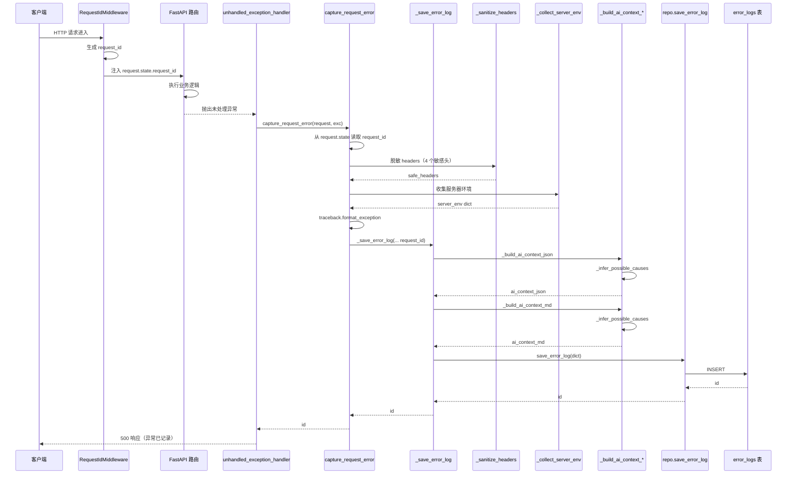
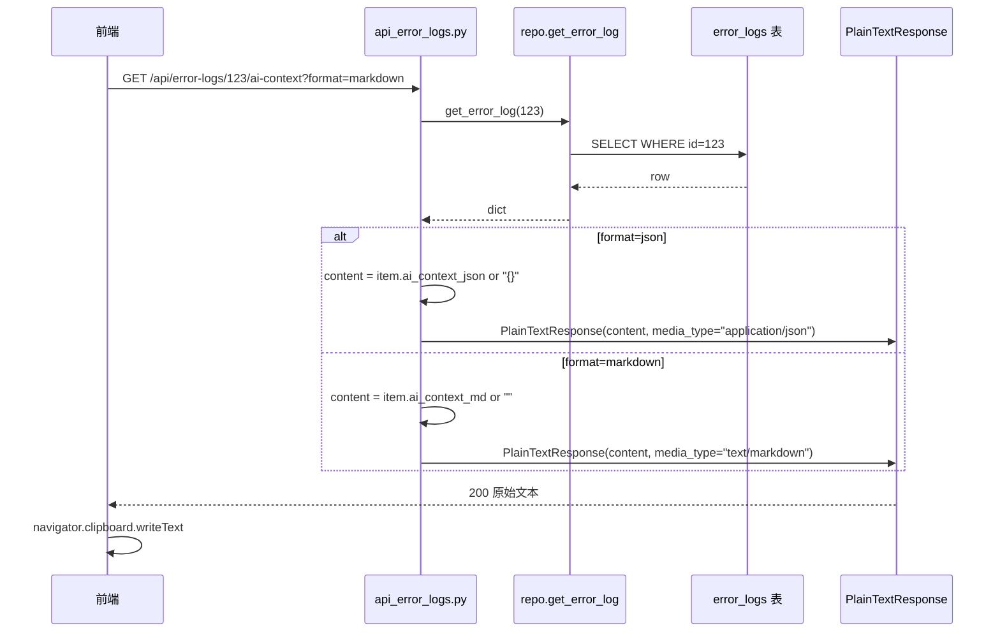
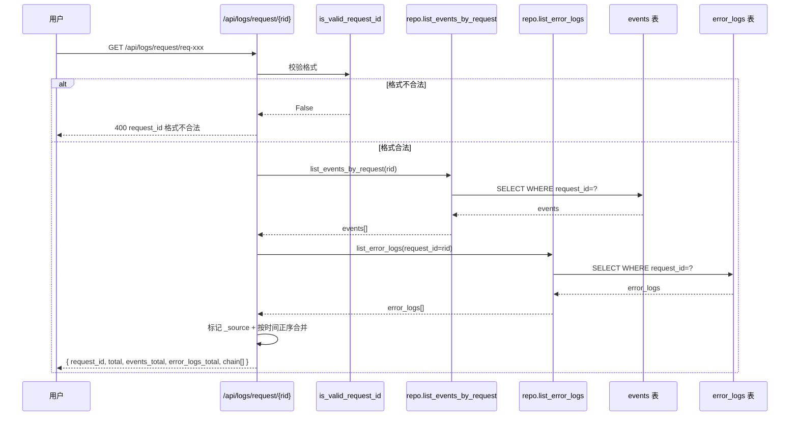

# 闲鱼猎人「错误日志」模块需求规格说明书

| 项 | 内容 |
|---|---|
| 文档版本 | v1.0 |
| 文档日期 | 2026-07-05 |
| 文档状态 | 初版（与详细设计 v1.0 对齐） |
| 所属项目 | 闲鱼猎人（XianyuHunter） |
| 所属菜单 | 数据查看 → 错误日志 |
| 菜单标识 | `menu_registry.yaml` 中 `key=error_logs`、`icon=BugOutlined`、`sort_order=16`、`category=data_view` |
| 关联路由 | 前端 `/logs/errors`；后端 `/api/error-logs/*`（共 7 端点） |
| 关联文档 | [错误日志-详细设计.md](错误日志-详细设计.md)（v1.0/2026-07-05） |
| 文档类型 | 需求规格说明书（SRS） |

> **本文档首段：继承 project_memory.md 中的硬约束。** 下文 §1.3.3 显式列出适用项与映射实现要点；本节先做总览：
> 1. **Web 进程必须使用 `with_browser=False` 模式**——错误捕获中间件 `error_capture.py` 与 `_save_error_log` 复用 `get_container()`（已在 Web 进程内），未初始化时降级为 `build_default_container(with_browser=False)`。
> 2. **认证白名单机制**——`/api/error-logs/*` 全部需通过现有 `auth.py` 认证中间件，不加入白名单（与 `/api/auth/cookie` 等不同）。
> 3. **前端 fetch 必须含 `credentials: 'include'`**——`frontend/src/api/index.ts` 的 `errorLogApi` 沿用 `client` 默认配置。
> 4. **401 必须返回 JSON `{"detail":"Unauthorized"}`**——`api_error_logs.py` 走 FastAPI `HTTPException` 路径，符合规范。
> 5. **token 比较使用 `hmac.compare_digest()`**——本模块无对称密钥比对场景；`is_valid_request_id()` 使用格式校验以防客户端伪造 `X-Request-Id` 注入日志。
> 6. **敏感字段不日志**——`_sanitize_headers` 对 `authorization/cookie/xh_token/set-cookie` 值替换为 `***`；`ai_context_*` 与 `request_headers` 字段入库前完成脱敏。
> 7. **token 写失败触发 `logging.warning()`**——`_save_error_log` 写入失败时 `logger.error` 记录但**不抛异常**（错误日志本身写入失败不应导致主流程崩溃）。
> 8. **模块级 import**——`api_error_logs.py` 顶层 import 已对齐；`error_capture.py` 中 `from xianyu_hunter.infra.request_context import get_request_id` 等少数 import 在函数内仅为避免循环依赖（`request_context` 也有此处理，跨模块一致）。
> 9. **DB 索引**——`error_logs` 表 `timestamp`/`request_path`/`request_id`/`status` 4 个单列索引已建（`init_db` 增量迁移），符合本项目"在 `task_id/seller_id/...` 加索引"硬约束的等价映射。
> 10. **COUNT 查询 CASE WHEN 聚合**——本模块 `count_error_logs_by_status` 直接用 `func.count + group_by`（按 status 三态枚举，基数固定），无需 CASE WHEN 聚合。
> 11. **WebView2 子进程 `CREATE_NEW_CONSOLE`**——本模块不涉及浏览器子进程。
> 12. **WebView2 `private_mode=False` + 独立 `storage_path`**——本模块不涉及浏览器子进程。

---

## 目录

- [0. 阶段交接声明](#0-阶段交接声明)
- [1. 引言](#1-引言)
  - [1.1 编写目的](#11-编写目的)
  - [1.2 项目背景](#12-项目背景)
  - [1.3 范围与约束](#13-范围与约束)
  - [1.4 术语与缩写](#14-术语与缩写)
  - [1.5 参考资料](#15-参考资料)
- [2. 总体描述](#2-总体描述)
  - [2.1 产品定位](#21-产品定位)
  - [2.2 用户角色与特征](#22-用户角色与特征)
  - [2.3 运行环境](#23-运行环境)
  - [2.4 设计约束](#24-设计约束)
  - [2.5 假设与依赖](#25-假设与依赖)
- [3. 总体架构设计](#3-总体架构设计)
  - [3.1 模块架构图](#31-模块架构图)
  - [3.2 数据流程图](#32-数据流程图)
  - [3.3 关键时序图](#33-关键时序图)
  - [3.4 模块分层与职责](#34-模块分层与职责)
- [4. 功能需求](#4-功能需求)
  - [FR-1 错误列表](#fr-1-错误列表)
  - [FR-2 错误详情（5 Tab）](#fr-2-错误详情5-tab)
  - [FR-3 错误捕获双入口](#fr-3-错误捕获双入口)
  - [FR-4 request_id 全局流水号](#fr-4-request_id-全局流水号)
  - [FR-5 AI 上下文双格式](#fr-5-ai-上下文双格式)
  - [FR-6 5 类可能原因关键词推断](#fr-6-5-类可能原因关键词推断)
  - [FR-7 错误状态管理（三态流转）](#fr-7-错误状态管理三态流转)
  - [FR-8 错误类型分类](#fr-8-错误类型分类)
  - [FR-9 严重度（status 视觉着色）](#fr-9-严重度status-视觉着色)
  - [FR-10 批量操作](#fr-10-批量操作)
  - [FR-11 自动清理](#fr-11-自动清理)
  - [FR-12 与实时日志菜单的边界澄清](#fr-12-与实时日志菜单的边界澄清)
- [5. 接口定义](#5-接口定义)
- [6. 数据模型](#6-数据模型)
- [7. 性能指标](#7-性能指标)
- [8. 安全要求](#8-安全要求)
- [9. 前端设计](#9-前端设计)
- [10. 部署与集成](#10-部署与集成)
- [11. 验收标准](#11-验收标准)
- [12. 附录](#12-附录)

---

## 0. 阶段交接声明

```
- 当前阶段：错误日志 SRS 编写（v1.0） ✅ 已完成
- 下一阶段：数据查看菜单 SRS 汇总校验 + 通知中心 SRS 编写
- 下一阶段智能体：主智能体
- 下一阶段技能：通用（无）
- 交接上下文：
  · 本文档定义「数据查看 → 错误日志」二级菜单完整需求 v1.0
  · 关键设计决策：error_logs 表（17 字段，无 updated_at）+ 7 个 API 端点 + 错误捕获双入口 + AI 上下文双格式
  · 与实时日志边界：error_logs（未处理异常） vs events（业务事件流），通过 request_id 在 /api/logs/request/{request_id} 端点聚合
  · request_id 格式：req-<17位数字>-<6位hex>，与 events 表同名同义
  · 错误捕获：capture_request_error（async HTTP）+ capture_background_error（sync 后台），共享 _save_error_log
  · AI 上下文：ai_context_json（结构化）+ ai_context_md（Markdown 报告），5 类可能原因关键词推断
  · 5 Tab 详情：概览 / 堆栈信息 / 请求参数 / 服务器环境 / AI 上下文
  · 三状态流转：new / resolved / ignored，cleanup 仅清理 resolved+ignored
  · 4 个单列索引：timestamp / request_path / request_id / status
  · 菜单 key=error_logs、path=/logs/errors、sort_order=16、category=data_view、icon=BugOutlined
  · 继承 project_memory.md 全部硬约束（首段已枚举 12 项适用映射）
```

---

## 1. 引言

### 1.1 编写目的

本需求规格说明书定义「数据查看 → 错误日志」二级菜单的完整需求规格，作为前端/后端开发、测试与验收的唯一依据。

**目标读者**：
- 后端开发工程师：依据 §3-§6、§8、§10 进行模块实现与扩展
- 前端开发工程师：依据 §4、§9 进行页面开发
- 测试工程师：依据 §7、§11 编写测试用例与执行验收
- 项目经理：依据 §2、§11 进行范围与里程碑管理
- 智能客服 KB 训练：本文档与 [错误日志-详细设计.md](错误日志-详细设计.md) 共同作为 KB 检索素材

### 1.2 项目背景

闲鱼猎人（XianyuHunter）是一个闲鱼自动捡漏与抢单工具，已具备任务管理、商品采集、AI 评估、自动下单、多渠道通知、反爬登录管理等完整能力（详见 [requirements.md](../requirements.md)、[design.md](../design.md) 与 [概要设计文档.md](../概要设计文档.md)）。

系统运行中会产生两类日志：**业务事件流**（events 表，记录任务调度/评估/抢单/通知等正常业务流程）与**未处理异常**（此前无独立入口，仅靠 stdout/stderr 文本日志或 events 表中 `level=ERROR` 行排查）。后者存在以下痛点：

| 痛点 | 现状 | 影响 |
|------|------|------|
| 异常无独立入口 | 散落在 `run.stdout.log` / `run.stderr.log` 文件与 events 表中 | 排查需切换工具，无结构化错误视图 |
| 缺堆栈/请求上下文 | events 表无 `stack_trace` / `request_params` / `request_headers` / `server_env` 字段 | 异常根因分析依赖现场复现 |
| 无 AI 辅助诊断 | 维护人员需自行整理堆栈/上下文喂给 AI | 重复劳动，效率低 |
| 异常无状态管理 | events 表无 status 字段，无法标记"已解决/已忽略" | 已处理异常与未处理异常视觉无差异 |
| 与 events 表混杂 | 异常与正常业务事件同表展示 | 列表噪声大，定位异常成本高 |
| 无全链路追踪交叉 | 异常无法与上游业务事件关联 | 难以定位异常发生在请求的哪个阶段 |

**解决方案**：新增「错误日志」二级菜单（`/logs/errors`），与已有"实时日志"（`/logs`）**同属 `/logs` 路由前缀但菜单独立**，提供独立的 `error_logs` 表（17 字段，含完整堆栈/请求参数/服务器环境/AI 诊断上下文）、错误捕获双入口（HTTP 异常 + 后台异常）、AI 上下文双格式（JSON + Markdown）、5 Tab 详情视图、三状态流转（new/resolved/ignored）、批量操作与按天清理能力；通过 `request_id` 与 events 表在 `/api/logs/request/{request_id}` 端点汇合实现全链路追踪。

### 1.3 范围与约束

#### 1.3.1 包含范围（In-Scope）

- 错误日志列表（`GET /api/error-logs`，7 维度过滤 + 状态统计）
- 错误详情（`GET /api/error-logs/{id}`，5 Tab 视图）
- AI 上下文导出（`GET /api/error-logs/{id}/ai-context?format=json|markdown`）
- 状态单条更新（`PATCH /api/error-logs/{id}/status`）
- 单条删除（`DELETE /api/error-logs/{id}`）
- 批量操作（`POST /api/error-logs/batch`，4 种 action，单次 1-500 条）
- 批量清理（`POST /api/error-logs/cleanup?days=1-365`，默认 30 天）
- 错误捕获双入口（`capture_request_error` + `capture_background_error`）
- AI 上下文生成（JSON + Markdown 双格式 + 5 类可能原因关键词推断）
- 敏感请求头脱敏（authorization/cookie/xh_token/set-cookie）
- 前端 `/logs/errors` 页面（统计卡片 + 列表 + 5 Tab 详情）
- 与实时日志的边界澄清（通过 request_id 在 `/api/logs/request/{request_id}` 端点汇合）

#### 1.3.2 排除范围（Out-of-Scope）

- 不替代 `run.stdout.log` / `run.stderr.log` 文本日志（保留作底层调试）
- 不实现实时日志流订阅（`/logs` 菜单的 SSE 能力由实时日志模块覆盖）
- 不实现异常自动修复（仅提供 AI 上下文供人工/AI 决策）
- 不实现异常告警通知（异常通知由通知中心模块覆盖）
- 不实现异常分类规则引擎（5 类关键词推断是简单匹配，非机器学习）
- 不实现跨用户错误聚合（单 token 认证体系下用 `request_id` 关联）
- 不新增 `updated_at` 字段（状态流转通过 `status` 字段管理，参考 §6.1 设计说明）

#### 1.3.3 硬约束

继承 [project_memory.md](c:/Users/hspcadmin/.trae-cn/memory/projects/-d-code-otherProjects-17-xianyu/project_memory.md) 中的项目硬约束，并显式映射到本模块实现：

| 硬约束 | 本模块适用性 | 实现要点 |
|--------|--------------|----------|
| Web 进程使用 `with_browser=False` 模式 | 适用 | `_save_error_log` 优先复用 `get_container()`（Web 进程单例），未初始化时降级为 `build_default_container(with_browser=False)` |
| 认证白名单（`/api/auth/cookie` 等） | 不适用 | `/api/error-logs/*` **必须**走 `auth.py` 认证，不加入白名单 |
| 前端 fetch 必须含 `credentials: 'include'` | 适用 | `frontend/src/api/index.ts` 的 `errorLogApi` 全量沿用 `client` 默认配置 |
| htmx 用官方 `<meta>` 配置 credentials | 不适用 | 错误日志前端不使用 htmx，使用 fetch |
| 401 响应必须返回 JSON `{"detail":"Unauthorized"`} | 适用 | `api_error_logs.py` 走 FastAPI `HTTPException(status_code=404, detail=ERROR_LOG_NOT_FOUND_MSG)` 路径，401 同样由 `auth.py` 中间件返回 JSON |
| 后端 token 比较使用 `hmac.compare_digest()` | 不适用 | 本模块无对称密钥比对场景 |
| 敏感字段（token 长度等）不日志 | 适用 | `_SENSITIVE_HEADERS`（authorization/cookie/xh_token/set-cookie）值替换为 `***`；`request_headers` 字段入库前完成脱敏 |
| token 写失败触发 `logging.warning()` | 部分适用 | `_save_error_log` 写入失败时 `logger.error` 记录但**不抛异常**；本模块"写失败"指 error_log 本身写入失败，语义是"不阻断主流程"而非"告警" |
| 缺失 import 必须 module-level | 适用 | `api_error_logs.py` 全部模块级 import；`error_capture.py` 中 `request_context` 的 import 在函数内为避免循环依赖，与 `request_context.py` 自身一致 |
| DB 必须在 `task_id/seller_id/...` 加索引 | 适用 | `error_logs` 表 4 个单列索引（timestamp/request_path/request_id/status）已建 |
| COUNT 查询用 CASE WHEN 聚合 | 不适用 | `count_error_logs_by_status` 按 status 三态枚举 GROUP BY，基数固定无需 CASE WHEN |
| WebView2 子进程使用 `CREATE_NEW_CONSOLE` | 不适用 | 本模块不涉及浏览器子进程 |
| WebView2 `webview.start()` 设 `private_mode=False` + 独立 `storage_path` | 不适用 | 本模块不涉及浏览器子进程 |
| KBManager 排除 `web/static/` 等目录 | 不适用 | 本模块不涉及 KB 索引 |
| `local_embedding.py` HF_ENDPOINT 设置 | 不适用 | 本模块不涉及 embedding |
| EmbeddingService 本地后端 | 不适用 | 同上 |
| sentence-transformers 跨版本兼容 | 不适用 | 同上 |
| `run_migrations` 各块独立 try/except | 适用 | error_logs 表 DDL 复用现有 `init_db` 增量迁移，与 events 表同块处理 |
| 启动钩子异常 `logger.exception()` | 不适用 | 本模块无启动钩子 |

### 1.4 术语与缩写

| 术语 | 全称 | 说明 |
|------|------|------|
| error_logs | Error Logs Table | 错误日志表（17 字段，无 updated_at），与 events 表解耦 |
| events | Events Table | 业务事件流表（10 字段），由 `save_event` 主动写入 |
| capture_request_error | HTTP Request Error Capture | HTTP 请求异常捕获入口（async），从 `request.state.request_id` 读取流水号 |
| capture_background_error | Background Error Capture | 后台任务异常捕获入口（sync），从 `context["request_id"]` 读取流水号 |
| _save_error_log | Internal Save Function | 内部统一写入函数，被两个捕获入口共享 |
| ai_context_json | AI Context JSON | AI 诊断上下文 JSON 格式（结构化，可直接喂 AI 系统） |
| ai_context_md | AI Context Markdown | AI 诊断上下文 Markdown 格式（人类可读，可粘贴给 AI 对话） |
| _infer_possible_causes | Possible Causes Inference | 基于错误消息关键词推断可能原因的内部函数，复用于 JSON/MD 两种格式 |
| _sanitize_headers | Sanitize Headers | 敏感请求头脱敏函数（authorization/cookie/xh_token/set-cookie 替换为 ***） |
| _collect_server_env | Collect Server Environment | 服务器环境快照收集（python_version/os/platform/pid） |
| request_id | Request ID | 全局流水号，格式 `req-<17位数字>-<6位hex>`，跨 events 与 error_logs 两表 |
| is_valid_request_id | Validate Request ID | request_id 格式校验，防客户端伪造 X-Request-Id 注入日志 |
| ContextVar | Context Variable | `contextvars.ContextVar` 异步安全的请求上下文传递机制 |
| `_SENSITIVE_HEADERS` | Sensitive Headers | 敏感请求头黑名单（4 个字段） |
| 可能原因关键词 | Possible Cause Keywords | 5 类关键词组合（connection/timeout、permission/denied、type+convert/cast、key+not found/missing、index+out of range） |
| BACKGROUND | Background Marker | 后台异常的 `request_method` 标记值（区别于 HTTP 方法） |
| ERROR_LOG_NOT_FOUND_MSG | Not Found Message | "错误日志不存在"，7 端点共享的 404 错误消息常量 |
| status_counts | Status Counts | 全局状态分布（`{new: N, resolved: N, ignored: N}`），不依赖当前过滤条件 |
| SearchService | Search Service | `ErrorLogSearchService`（`web/services/search_services.py`）统一处理分页与慢查询埋点 |
| TaskLinkRow | Task Link Row | 任务-内容关联表（与 error_logs 表无关，仅供交叉引用） |
| WAL/SHM | Write-Ahead Log | SQLite 写入日志与共享内存文件（与 error_logs 表无关） |
| LRU | Least Recently Used | 缓存淘汰策略（本模块无显式 LRU） |
| ITTL | Internal TTL | 内部过期时间（本模块无） |
| SSE | Server-Sent Events | 服务器推送事件（错误日志模块不直接使用，由实时日志覆盖） |

### 1.5 参考资料

| 文档 | 路径 | 用途 |
|------|------|------|
| 需求文档 v1.0 | [../requirements.md](../requirements.md) | 系统整体需求基线 |
| 概要设计文档 v2.0 | [概要设计文档.md](../概要设计文档.md) | 36 个 API 路由、11 张数据表、技术选型 |
| 技术设计说明书 | [../design.md](../design.md) | 分层架构、Evaluator 设计、状态机 |
| 错误日志 详细设计 v1.0 | [错误日志-详细设计.md](错误日志-详细设计.md) | 本模块技术设计、代码位置、FAQ |
| 实时日志 详细设计 | [实时日志-详细设计.md](实时日志-详细设计.md) | 兄弟文档（events 表 / SSE 流 / 全链路追踪交叉点） |
| 实时日志 需求规格 | [实时日志-需求规格.md](实时日志-需求规格.md) | 边界澄清参照（events vs error_logs） |
| 反爬登录管理 需求规格 | [../04-系统维护/反爬登录管理-需求规格.md](../04-系统维护/反爬登录管理-需求规格.md) | SRS 模板参考（12 章节完整版） |
| 米其林设计系统 | [../standards/michelin-design-system.md](../standards/michelin-design-system.md) | UI 设计规范、色彩字体系统 |
| 智能客服 SRS | [../06-智能客服/智能客服-需求规格.md](../06-智能客服/智能客服-需求规格.md) | SRS 模板参考（10+ 章节完整版） |
| 权限模块 SRS | [../07-权限模块/权限模块-需求规格.md](../07-权限模块/权限模块-需求规格.md) | SRS 模板参考（侧栏菜单 SRS 风格） |
| 项目硬约束 | [project_memory.md](c:/Users/hspcadmin/.trae-cn/memory/projects/-d-code-otherProjects-17-xianyu/project_memory.md) | 必须继承的硬约束清单 |
| 菜单元数据 | [../../config/menu_registry.yaml](../../config/menu_registry.yaml) | `key=error_logs`、`sort_order=16` |
| 错误日志 后端 API | [../../src/xianyu_hunter/web/routes/api_error_logs.py](../../src/xianyu_hunter/web/routes/api_error_logs.py) | 7 个端点 + 内部辅助函数 |
| 错误日志 后端 Repo | [../../src/xianyu_hunter/infra/repo_error_logs.py](../../src/xianyu_hunter/infra/repo_error_logs.py) | ErrorLogsMixin（9 个方法） |
| 错误捕获中间件 | [../../src/xianyu_hunter/web/middleware/error_capture.py](../../src/xianyu_hunter/web/middleware/error_capture.py) | 双入口 + AI 上下文构建 + 脱敏 |
| 异常处理器 | [../../src/xianyu_hunter/web/middleware/exception_handler.py](../../src/xianyu_hunter/web/middleware/exception_handler.py) | 调用 `capture_request_error` |
| request_id 上下文 | [../../src/xianyu_hunter/infra/request_context.py](../../src/xianyu_hunter/infra/request_context.py) | 生成 / 校验 / 异步安全传递 |
| DB 模型 | [../../src/xianyu_hunter/infra/db_models.py](../../src/xianyu_hunter/infra/db_models.py) | `ErrorLogRow` 定义（17 字段，无 updated_at） |
| 搜索服务 | [../../src/xianyu_hunter/web/services/search_services.py](../../src/xianyu_hunter/web/services/search_services.py) | `ErrorLogSearchService` 分页 + 慢查询埋点 |
| 前端 API 客户端 | [../../frontend/src/api/index.ts](../../frontend/src/api/index.ts) | `errorLogApi` 7 个方法封装 |
| 前端错误日志页 | [../../frontend/src/pages/Logs/ErrorLogs.tsx](../../frontend/src/pages/Logs/ErrorLogs.tsx) | 统计卡片 + 列表 + 5 Tab 详情实现 |

---

## 2. 总体描述

### 2.1 产品定位

「错误日志」是闲鱼猎人系统的**系统异常的统一管理入口 + AI 诊断辅助**，定位为：

> 将散落在 stdout/stderr 文件、events 表中 `level=ERROR` 行的未处理异常**统一沉淀**到独立的 `error_logs` 表，按时间倒序提供多维度过滤的列表、按 5 Tab 切分的详情、AI 上下文双格式导出、三状态流转与按天清理能力，让维护人员在一个页面里完成"列表筛选 → 详情查看 → AI 诊断 → 状态标记 → 批量清理"全流程操作。

**核心价值**：
1. **结构化异常视图**：从 stdout/stderr 文本日志升级为结构化记录（堆栈/请求参数/服务器环境），便于检索与统计
2. **覆盖所有异常路径**：`capture_request_error`（HTTP 异常）+ `capture_background_error`（后台任务异常）双入口，无遗漏
3. **AI 辅助诊断**：双格式 AI 上下文（结构化 JSON + Markdown 报告），5 类可能原因关键词推断加速定位
4. **状态管理**：三态流转（new/resolved/ignored）+ 批量操作 + 按天清理，避免列表噪声累积
5. **全链路追踪交叉**：通过 `request_id` 与 events 表在 `/api/logs/request/{request_id}` 端点聚合，按时间正序合并展示完整调用链路
6. **与实时日志边界清晰**：同属 `/logs` 路由前缀但菜单独立（key 不同、path 不同、API prefix 不同），避免误读

### 2.2 用户角色与特征

| 角色 | 特征 | 使用场景 | 关注重点 |
|------|------|----------|----------|
| 排障维护人员 | 系统出现未处理异常时介入 | 收到告警 → 进入错误日志页 → 筛选 new 状态 → 查看堆栈/AI 上下文 → 标记 resolved | 堆栈信息、AI 上下文、状态切换、过滤精度 |
| 定期清理人员 | 长期运行后清理历史 | 进入错误日志页 → 勾选已解决/已忽略 → 批量删除或使用"批量清理 30 天前"按钮 | 批量操作、cleanup 行为、状态分布 |
| AI 辅助开发者 | 接入 AI 诊断流程 | 选中错误 → 切到 AI 上下文 Tab → 选 JSON/Markdown → 复制 → 喂给 AI 系统 | AI 上下文格式、5 类可能原因、复制便捷性 |
| 全链路追踪分析人员 | 复杂请求链路异常定位 | 拿到 request_id → 调 `/api/logs/request/{request_id}` 端点 → 聚合 events + error_logs | request_id 关联、跨表查询、时间正序 |
| 二次开发者 | 自定义错误处理 | 参考 `_save_error_log` / 双入口实现自定义异常捕获 | 内部辅助函数、ContextVar 兜底逻辑 |

### 2.3 运行环境

| 项 | 要求 |
|---|---|
| 操作系统 | Windows 10/11（主），Linux/macOS 需兼容 Python 3.11+ |
| Python | 3.11+ |
| Node.js | 18+（仅前端构建） |
| 后端框架 | FastAPI（已集成） |
| 前端框架 | React 18 + TypeScript + Ant Design 5（已集成） |
| 数据库 | 复用现有 SQLite（error_logs 表 + events 表 + 其他 9 张表） |
| 日志框架 | loguru（已集成，`_save_error_log` 写入失败用 `logger.error`） |
| 浏览器依赖 | 无（错误日志前端纯展示，不涉及浏览器自动化） |

### 2.4 设计约束

1. **集成部署**：作为 `src/xianyu_hunter/web/routes/api_error_logs.py` 路由 + `frontend/src/pages/Logs/ErrorLogs.tsx` 页面集成到现有系统，不独立部署
2. **复用 Web 进程 Container 单例**：错误捕获中间件优先调用 `get_container()` 复用 Web 进程已有的 Container，未初始化时降级为 `build_default_container(with_browser=False)`
3. **写操作 POST/PATCH/DELETE，读操作 GET**：与现有 REST 规范对齐
4. **错误捕获双入口**：`capture_request_error`（async，HTTP 异常）+ `capture_background_error`（sync，后台异常），共享 `_save_error_log` 内部函数
5. **request_id 显式传入**：捕获入口从 `request.state.request_id` / `context["request_id"]` 读取，**显式传入** `_save_error_log`（不依赖 ContextVar 兜底，因为异常处理可能在 ContextVar 已清理后触发）
6. **AI 上下文双格式**：JSON（结构化，喂 AI 系统）+ Markdown（人类可读，喂 AI 对话）；两种格式复用相同的 `_infer_possible_causes` 函数，避免关键词匹配规则漂移
7. **写入失败不抛异常**：`_save_error_log` 内部 `try/except` 包裹，失败仅 `logger.error` 记录（错误日志本身写入失败不应导致主流程崩溃）
8. **批量操作限制**：单次批量操作 1-500 条（`BatchActionRequest.ids.min_length=1/max_length=500`），高危操作记 `logger.info` 审计日志
9. **敏感字段不外露**：`_sanitize_headers` 在写入前完成脱敏（authorization/cookie/xh_token/set-cookie 替换为 `***`）；`ai_context_*` 字段继承 `request_headers` 的脱敏结果
10. **status_counts 全局性**：列表接口返回的 `status_counts` **不受过滤条件影响**（即使筛选 `status=new`，仍返回全局三态分布），便于用户决策是否清理
11. **前端布局对齐米其林设计系统**：统计卡片 `Row gutter={16}` + `Col span=6`（一行 4 个），主区域 `Col span=10/14` 二分（列表 + 详情）

### 2.5 假设与依赖

**假设**：
- 用户已部署闲鱼猎人 v2.x+ 并能访问 `MainLayout` 侧边栏
- 系统已启用 `RequestIdMiddleware`（为每个 HTTP 请求注入 `request_id`）
- 系统已启用 `unhandled_exception_handler`（未处理异常自动调用 `capture_request_error`）
- 后台任务（worker/scheduler）使用 `capture_background_error` 主动捕获异常

**依赖**：
- 依赖现有 `RequestIdMiddleware`（`web/middleware/`）注入 `request.state.request_id`
- 依赖现有 `unhandled_exception_handler`（`web/middleware/exception_handler.py`）调用 `capture_request_error`
- 依赖现有 `Container` 单例（`web/deps.get_container()`）的 `repo` 暴露 `ErrorLogsMixin` 方法
- 依赖现有 `events` 表（`EventLogRow`）的 `request_id` 字段用于全链路追踪
- 依赖现有 `init_db` 增量迁移机制（`error_logs` 表 DDL 与 `events` 表同块处理）
- 依赖现有 `auth.py` 认证中间件（`/api/error-logs/*` 不加入白名单）
- 依赖现有 `menu_registry.yaml` 菜单注册（已配置 `key=error_logs`）
- 新增无外部依赖

---

## 3. 总体架构设计

### 3.1 模块架构图

```mermaid
graph TB
    subgraph "前端 Frontend"
        UI[错误日志页面<br/>frontend/src/pages/Logs/ErrorLogs.tsx]
        API[API 调用层<br/>frontend/src/api/index.ts<br/>errorLogApi 7 方法]
        HOOKS[自定义 Hooks<br/>usePersistentState<br/>useSearch<br/>useSearchHistory]
    end

    subgraph "Web 层 web/"
        ROUTER[api_error_logs.py<br/>/api/error-logs/* 7 端点]
        EXCH[exception_handler.py<br/>unhandled_exception_handler]
        CAP_MW[error_capture.py<br/>capture_request_error]
        CAP_BG[error_capture.py<br/>capture_background_error]
        SSE_OTHER[api_logs.py<br/>/api/logs/request/{request_id}<br/>跨表聚合 实时日志模块]
    end

    subgraph "基础设施层 infra/"
        SAVE[_save_error_log<br/>error_capture.py]
        AIJSON[_build_ai_context_json]
        AIMD[_build_ai_context_md]
        CAUSES[_infer_possible_causes<br/>5 类关键词]
        SANITIZE[_sanitize_headers]
        ENV[_collect_server_env]
        REPO[repo_error_logs.py<br/>ErrorLogsMixin 9 方法]
        RID[request_context.py<br/>generate_request_id<br/>get_request_id]
    end

    subgraph "数据层"
        ERR_TBL[(error_logs 表<br/>17 字段 无 updated_at)]
        EVT_TBL[(events 表<br/>10 字段)]
        SQLITE[(SQLite 数据库)]
    end

    UI --> HOOKS
    UI --> API
    API --> ROUTER

    EXCH --> CAP_MW
    CAP_MW --> SAVE
    CAP_BG --> SAVE

    ROUTER --> REPO
    ROUTER -.GET /id/ai-context.-> AIJSON
    ROUTER -.GET /id/ai-context.-> AIMD

    SAVE --> SANITIZE
    SAVE --> ENV
    SAVE --> AIJSON
    SAVE --> AIMD
    AIJSON --> CAUSES
    AIMD --> CAUSES
    SAVE --> REPO

    CAP_MW --> RID
    CAP_BG --> RID
    REPO --> RID
    REPO --> ERR_TBL
    ERR_TBL --> SQLITE
    EVT_TBL --> SQLITE
    SSE_OTHER --> REPO
    SSE_OTHER --> EVT_TBL

    style UI fill:#e6f7ff,stroke:#1890ff
    style ROUTER fill:#fff7e6,stroke:#fa8c16
    style SAVE fill:#f6ffed,stroke:#52c41a
    style REPO fill:#f9f0ff,stroke:#722ed1
    style ERR_TBL fill:#fff1f0,stroke:#ff4d4f
```

### 3.2 数据流程图

```mermaid
flowchart TB
    subgraph "异常产生"
        A1[HTTP 请求] --> A2{未处理异常?}
        A2 -- 是 --> A3[unhandled_exception_handler]
        A2 -- 否 --> END_OK[正常返回]

        A4[后台任务] --> A5{异常抛出?}
        A5 -- 是 --> A6[capture_background_error]
    end

    subgraph "捕获层"
        A3 --> CAP1[capture_request_error<br/>async]
        A6 --> CAP2[capture_background_error<br/>sync]
        CAP1 --> RID1[读取 request_id<br/>request.state / ContextVar]
        CAP2 --> RID2[读取 request_id<br/>context / ContextVar]
    end

    subgraph "写入层 _save_error_log"
        W1[_sanitize_headers<br/>4 个敏感头替换 ***]
        W2[_collect_server_env<br/>python_version/os/pid]
        W3[traceback.format_exception<br/>生成堆栈]
        W4[_build_ai_context_json<br/>复用 _infer_possible_causes]
        W5[_build_ai_context_md<br/>复用 _infer_possible_causes]
        W6[构建 error_log dict]
        W7[save_error_log 写入]
    end

    subgraph "存储层"
        DB[(error_logs 表<br/>17 字段)]
    end

    subgraph "查询层"
        Q1[GET /api/error-logs<br/>多维度过滤 + status_counts]
        Q2[GET /api/error-logs/id<br/>详情]
        Q3[GET /api/error-logs/id/ai-context<br/>JSON/Markdown]
        Q4[PATCH /id/status]
        Q5[DELETE /id]
        Q6[POST /batch<br/>最多 500 条]
        Q7[POST /cleanup<br/>days 1-365]
        Q8[GET /api/logs/request/{rid}<br/>聚合 events + error_logs]
    end

    subgraph "前端展示"
        FE1[统计卡片 4 列]
        FE2[错误列表 10 列]
        FE3[5 Tab 详情 14 列]
    end

    CAP1 --> W1
    CAP1 --> W2
    CAP1 --> W3
    CAP2 --> W1
    CAP2 --> W2
    CAP2 --> W3

    W1 --> W6
    W2 --> W6
    W3 --> W6
    W6 --> W4
    W6 --> W5
    W4 --> W6
    W5 --> W6
    W6 --> W7
    W7 --> DB

    DB --> Q1
    DB --> Q2
    DB --> Q3
    DB --> Q4
    DB --> Q5
    DB --> Q6
    DB --> Q7
    DB --> Q8
    EVT[events 表] --> Q8

    Q1 --> FE1
    Q1 --> FE2
    Q2 --> FE3
    Q3 --> FE3

    style CAP1 fill:#fff7e6
    style CAP2 fill:#fff7e6
    style W7 fill:#f6ffed
    style DB fill:#fff1f0
    style Q8 fill:#f9f0ff
```

### 3.3 关键时序图

#### 3.3.1 HTTP 异常捕获与存储时序



#### 3.3.2 AI 上下文导出时序



#### 3.3.3 全链路追踪聚合时序



### 3.4 模块分层与职责

遵循项目现有 DDD 分层架构（见 [概要设计文档](../概要设计文档.md) §3）：

| 层级 | 模块 | 职责 |
|------|------|------|
| **Web 层** | `api_error_logs.py` | 错误日志 API 路由（7 端点） + `_parse_json_fields` 内部辅助 |
| | `exception_handler.py` | 未处理异常处理器，调用 `capture_request_error` |
| **业务模块层** | `error_capture.py` | 双捕获入口（`capture_request_error` + `capture_background_error`）+ `_save_error_log` + AI 上下文双格式构建 + 脱敏 + 关键词推断 + 服务器环境收集 |
| **基础设施层** | `repo_error_logs.py` | `ErrorLogsMixin` 9 个方法（save/list/get/update_status/delete/batch_update/batch_delete/count_by_status/cleanup） |
| | `request_context.py` | `generate_request_id` / `get_request_id` / `is_valid_request_id` / ContextVar 管理 |
| | `search_services.py` | `ErrorLogSearchService` 分页 + 慢查询埋点 |
| | `db_models.py` | `ErrorLogRow`（17 字段，无 updated_at）+ 4 个单列索引 |
| **数据层** | `error_logs` 表 | 错误日志持久化（SQLite） |
| **前端** | `pages/Logs/ErrorLogs.tsx` | 统计卡片 + 列表 + 5 Tab 详情 |
| | `api/index.ts` | `errorLogApi` 7 个方法封装 + `ErrorLog` 类型 |
| | `hooks/usePersistentState` | 筛选条件持久化（filterStatus/filterType） |
| | `hooks/useSearch` | 搜索防抖（400ms） |
| | `hooks/useSearchHistory` | 搜索历史持久化（namespace=`error_logs`） |

---

## 4. 功能需求

### FR-1 错误列表

**FR-1.1** `GET /api/error-logs` 提供多维度过滤的错误日志列表，调用 `ErrorLogSearchService.search()` 统一处理分页与慢查询埋点。

**FR-1.2** Query 参数（全部可选）：

| 参数 | 类型 | 必填 | 默认 | 约束 | 说明 |
|------|------|------|------|------|------|
| `status` | str | 否 | None | 枚举 `^(new\|resolved\|ignored)$` | 状态精确过滤 |
| `error_type` | str | 否 | None | 模糊匹配 | 异常类型 LIKE 匹配 |
| `request_path` | str | 否 | None | 模糊匹配 | 请求路径 LIKE 匹配 |
| `request_id` | str | 否 | None | 精确匹配 | 全局流水号（高基数唯一键，无需模糊） |
| `start` | str | 否 | None | ISO8601 | 起始时间 |
| `end` | str | 否 | None | ISO8601 | 结束时间 |
| `limit` | int | 否 | 50 | ge=1, le=500 | 单页条数 |
| `offset` | int | 否 | 0 | ge=0 | 偏移量 |

**FR-1.3** 响应字段：
- `items[]`：错误日志列表（按 `timestamp desc`）
- `count`：当前页命中数（即 `len(items)`）
- `status_counts`：全局状态分布（`{new: N, resolved: N, ignored: N}`，**不受当前过滤条件影响**），由 `repo.count_error_logs_by_status()` 单独查询

**FR-1.4** JSON 字符串字段解析：列表响应前通过 `_parse_json_fields` 将 `request_params` / `request_headers` / `server_env` / `ai_context_json` 四个 JSON 字符串字段解析为 dict，便于前端直接消费（解析失败时保持原字符串，不阻断响应）

**FR-1.5** 前端列表展示：
- 搜索条件工具栏：`Select` 状态筛选（allowClear）+ `Input` 错误类型（持久化 localStorage，回车触发）+ 「搜索」按钮
- 搜索历史小药丸：`useSearchHistory` 记录错误类型关键词，点击复用
- 批量操作工具栏：仅 `selectedIds.size > 0` 时显示（全选 Checkbox / 已选 N 项 / 标记已解决 / 标记已忽略 / 批量删除 / 取消选择）
- 列表项：Checkbox + 状态 Tag + 错误类型 Tag（红色）+ 请求方法+路径 + 错误消息（80 字符截断）+ 时间 + 删除按钮
- 列表硬编码 `limit=100`（与后端默认 50 不同，前端一次拉取更多便于人工浏览）
- 列表 `maxHeight=500`，超出滚动

### FR-2 错误详情（5 Tab）

**FR-2.1** `GET /api/error-logs/{id}` 返回单条错误日志完整字段，不存在返回 404（`ERROR_LOG_NOT_FOUND_MSG = "错误日志不存在"`）

**FR-2.2** 详情页采用 5 Tab 设计（`Tabs items` 数组）：

| Tab | key | 内容 | 关键字段 |
|-----|-----|------|----------|
| 概览 | `overview` | `Descriptions column={1} bordered size="small"` 表格 | error_type（红色 Tag）/ error_message / timestamp（中文格式化）/ request_method / request_path / client_ip / **status（Select 切换器）** |
| 堆栈信息 | `stack` | `<pre style={PRE_STYLE}>` 代码块 | `stack_trace`（无堆栈时显示 `(无堆栈信息)`） |
| 请求参数 | `request` | `<pre>` 代码块 JSON 格式化 | `{method, path, params, headers, client_ip, user_agent}` 聚合 |
| 服务器环境 | `env` | `<pre>` 代码块 JSON 格式化 | `server_env` 完整 dict |
| AI 上下文 | `ai` | 格式切换 `Select`（JSON/Markdown）+ 「复制」按钮 + `<pre>` 代码块（Spin 加载态） | `aiContext`（无内容显示 `(无 AI 上下文)`） |

**FR-2.3** 状态切换器（`handleStatusChange`）：
- 触发：`Select onChange` 选中新状态值
- 流程：调 `PATCH /api/error-logs/{id}/status?status=<new>` → 成功后 `message.success` → `loadList()` 刷新列表 + 同步更新详情面板的 `status` 字段
- 失败：`message.error("更新状态失败")`

**FR-2.4** 列表项点击（`setSelectedId(item.id)`）：
- `useEffect` 监听 `selectedId` 变化，自动调用 `loadDetail(id)` + `loadAiContext(id, aiFormat)`
- 选中行高亮：`background: var(--xh-bg-info)` + `borderLeft: 3px solid var(--xh-border-info)`
- Checkbox 阻止冒泡（`onClick: e.stopPropagation()`），避免点击勾选误触发详情加载
- 列表项删除按钮同样 `e.stopPropagation()`

**FR-2.5** PRE_STYLE（共享样式）使用 CSS 变量 `var(--xh-bg-code)` / `var(--xh-text-primary)` / `var(--xh-border)`，**支持暗色主题**（避免硬编码 `#f5f5f5` 在暗色下与白色字体同色无法辨识）

### FR-3 错误捕获双入口

**FR-3.1** 双入口定义（`src/xianyu_hunter/web/middleware/error_capture.py`），均写入 `error_logs` 表，统一调用 `_save_error_log` 内部函数：

| 入口 | 签名 | 触发场景 | 同步/异步 |
|------|------|----------|----------|
| `capture_request_error` | `async def capture_request_error(request: Any, exc: Exception) -> int \| None` | HTTP 请求未处理异常 | async |
| `capture_background_error` | `def capture_background_error(exc: Exception, context: dict \| None = None) -> int \| None` | 后台任务异常（worker/scheduler） | sync |

**FR-3.2** `capture_request_error`（HTTP 异常入口）实现要点：
- 调用方：`exception_handler.py` 的 `unhandled_exception_handler`
- 流水号来源：优先 `request.state.request_id`（由 `RequestIdMiddleware` 注入），兜底 `get_request_id()`（ContextVar）
- 提取字段：`method` / `path` / `headers`（脱敏）/ `client_ip`（`request.client.host`）/ `user_agent`（`request.headers.get("user-agent", "")`）/ `query_params`（`dict(request.query_params)`，非空时包装为 `{query: ...}`）
- 堆栈：`"".join(traceback.format_exception(type(exc), exc, exc.__traceback__))`
- 时间戳：`datetime.now(timezone.utc).replace(tzinfo=None)`（去 tzinfo 兼容 SQLAlchemy naive DateTime）

**FR-3.3** `capture_background_error`（后台异常入口）实现要点：
- 调用方：worker / scheduler 等后台任务
- 流水号来源：优先 `context["request_id"]`（业务侧显式传入），兜底 `get_request_id()`（ContextVar）
- `request_info` 标记 `method="BACKGROUND"` + `path=context.get("source", "unknown")`
- `params` 字段直接放入 `context` 字典（保留任务上下文供 AI 诊断参考）
- `client_ip` / `user_agent` 为 `None`

**FR-3.4** `_save_error_log` 内部函数（共享写入逻辑）：
- 签名：`def _save_error_log(error_type, error_message, stack_trace, request_info, server_env, timestamp, request_id=None) -> int | None`
- Container 获取：优先 `get_container()`（Web 进程单例），未初始化时 `build_default_container(with_browser=False)`
- 显式注入 `request_id` 到 `request_info`（使 AI 上下文报告含 `request.request_id`）
- 双格式 AI 上下文：调用 `_build_ai_context_json` + `_build_ai_context_md`（复用 `_infer_possible_causes`）
- 构建 `error_log` dict：含 `timestamp` / `error_type` / `error_message` / `stack_trace` / `request_method` / `request_path` / `request_params`（JSON）/ `request_headers`（JSON）/ `client_ip` / `user_agent` / `server_env`（JSON）/ `ai_context_json` / `ai_context_md` / `status="new"`
- **request_id 显式传入**：调用方传入的 `request_id` 优先写入字段（覆盖 ContextVar 兜底值，因为异常处理可能在 ContextVar 已被清理后触发）
- 写入失败：仅 `logger.error(f"写入 error_logs 表失败: {e}")`，**不抛异常**（错误日志本身写入失败不应导致主流程崩溃）

### FR-4 request_id 全局流水号

**FR-4.1** request_id 格式：`req-<17位数字>-<6位hex>`（由 `infra/request_context.py` 的 `generate_request_id()` 生成）

**FR-4.2** 17 位数字含义：`YYYYMMDDHHMMSSfff`（毫秒级 UTC 时间戳，14+3=17 位）；6 位 hex 随机（`secrets.token_hex(3)`，16^6=16.7M 分之一的同毫秒碰撞概率）

**FR-4.3** `is_valid_request_id` 校验规则（`request_context.py`）：
- 非空且为字符串
- 按 `-` 分割为 3 段
- 第 1 段必须为 `req`
- 第 2 段必须 17 位且全部为数字
- 第 3 段必须 6 位且能被 `int(..., 16)` 解析

**FR-4.4** 跨表关联：error_logs 表与 events 表的 `request_id` 字段**同名同义**：
- `repo.save_error_log` 自动注入：调用方未显式指定时从 `get_request_id()` 读取
- `/api/logs/request/{request_id}` 端点（定义于 `api_logs.py` 实时日志模块）通过 `request_id` 聚合两表数据，按时间正序合并返回 `chain[]`
- 异常处理可能发生在 ContextVar 已清理后（中间件 finally 后），故错误捕获入口**显式从 request.state / context 读取 request_id** 并传给 `_save_error_log`，不依赖 ContextVar 兜底

**FR-4.5** 锁与并发：`request_context.py` 使用 `threading.Lock` 保护时间戳读取（`_gen_lock`），防止并发请求在同一毫秒拿到相同时间戳；跨进程唯一性依赖 6 位 hex 随机

### FR-5 AI 上下文双格式

**FR-5.1** 错误日志写入时同步生成 JSON 与 Markdown 双格式 AI 诊断上下文，分别存入 `ai_context_json` 与 `ai_context_md` 字段（Text 类型，可空）

**FR-5.2** JSON 格式（`_build_ai_context_json`）：结构化数据，可直接作为 AI 诊断系统输入
```json
{
  "error_type": "ValueError",
  "error_message": "invalid literal for int() with base 10: 'abc'",
  "stack_trace": "Traceback (most recent call last):\n  ...",
  "environment": {
    "python_version": "3.11.5",
    "os": "Windows 10",
    "platform": "AMD64",
    "pid": "12345"
  },
  "request": {
    "method": "POST",
    "path": "/api/tasks",
    "headers": {"authorization": "***", "content-type": "application/json"},
    "client_ip": "127.0.0.1",
    "user_agent": "Mozilla/5.0...",
    "request_id": "req-20260701120000537-a3b2c1",
    "params": {"query": {"foo": "bar"}}
  },
  "possible_causes": ["数据类型转换错误"]
}
```

**FR-5.3** Markdown 格式（`_build_ai_context_md`）：人类可读报告，可直接粘贴给 ChatGPT/Claude 等对话式 AI
```markdown
# 错误报告

## 基本信息
- **类型**: `ValueError`
- **时间**: 2026-07-05 12:00:00
- **消息**: invalid literal for int() with base 10: 'abc'

## 请求上下文
- **方法**: POST
- **路径**: /api/tasks
- **流水号**: `req-20260701120000537-a3b2c1`
- **客户端 IP**: 127.0.0.1
- **User-Agent**: Mozilla/5.0...

### 请求参数
```json
{
  "query": {"foo": "bar"}
}
```

## 堆栈信息
```
Traceback (most recent call last):
  ...
```

## 服务器环境
- **Python**: 3.11.5
- **OS**: Windows 10
- **PID**: 12345

## 可能原因
- 数据类型转换错误
```

**FR-5.4** 导出端点 `GET /api/error-logs/{id}/ai-context?format=json|markdown`：
- `format=json`：返回 `ai_context_json` 字段，字段为空时返回 `"{}"`，`media_type="application/json"`
- `format=markdown`：返回 `ai_context_md` 字段，字段为空时返回 `""`，`media_type="text/markdown"`
- **使用 `PlainTextResponse`** 直接返回文本（避免 JSON 包装破坏 Markdown 格式）
- 不存在返回 404（`ERROR_LOG_NOT_FOUND_MSG`）

**FR-5.5** 前端 AI 上下文 Tab 交互：
- 格式切换 `Select`（`json` / `markdown`），切换时重新调 `getAiContext(id, fmt)`
- 「复制」按钮：`navigator.clipboard.writeText(aiContent)`，成功后 `message.success("已复制到剪贴板")`
- `<Spin spinning={aiLoading}>` 加载态

### FR-6 5 类可能原因关键词推断

**FR-6.1** `_infer_possible_causes(error_message: str, prefix: str = "") -> list[str]` 基于错误消息关键词推断 5 类可能原因，复用于 JSON 与 Markdown 两种格式

**FR-6.2** 5 类关键词组合（`error_message.lower()` 大小写不敏感）：

| 关键词组合 | 推断原因 |
|------------|----------|
| `connection` 或 `timeout` | 网络连接或超时问题 |
| `permission` 或 `denied` | 权限或文件系统访问问题 |
| `type` + (`convert` 或 `cast`) | 数据类型转换错误 |
| `key` + (`not found` 或 `missing`) | 字典/配置键缺失 |
| `index` + `out of range` | 数组索引越界 |
| 以上均不匹配 | 需要根据堆栈信息进一步分析 |

**FR-6.3** 集中维护原则：`_infer_possible_causes` 提取为独立函数，避免 `_build_ai_context_json` 与 `_build_ai_context_md` 重复实现相同的关键词匹配逻辑（5 组 if + or/and），**集中维护避免两处不一致**，同时降低两个构建函数的认知复杂度

**FR-6.4** `prefix` 参数：JSON 格式调用时不传（`prefix=""`），Markdown 格式调用时传 `prefix="- "`（适配 Markdown 列表 `- ` 前缀）

### FR-7 错误状态管理（三态流转）

**FR-7.1** 三状态枚举（`status` 字段，`String`，默认 `new`）：

| 状态 | 中文标签 | 颜色 | 含义 | 可被 cleanup |
|------|----------|------|------|--------------|
| `new` | 新建 | red | 未处理（默认值） | ❌ |
| `resolved` | 已解决 | green | 已确认处理 | ✅ |
| `ignored` | 已忽略 | default | 已知但无需处理 | ✅ |

**FR-7.2** 状态流转（支持任意方向切换，包括回退）：

```
[*] --> new: capture_*_error 写入
new --> resolved: PATCH /status?status=resolved
new --> ignored: PATCH /status?status=ignored
resolved --> new: PATCH /status?status=new
ignored --> new: PATCH /status?status=new
resolved --> [*]: DELETE /id 或 POST /cleanup
ignored --> [*]: DELETE /id 或 POST /cleanup
new --> [*]: DELETE /id（手动删除）
```

**FR-7.3** 单条状态更新端点 `PATCH /api/error-logs/{id}/status?status=<new>`：
- status 通过 Query 传递（非 Body），pattern 校验 `^(new|resolved|ignored)$`
- 调用 `repo.update_error_log_status(id, status)`
- 不存在返回 404
- 返回 `{status: "ok"}`

**FR-7.4** 批量状态更新端点 `POST /api/error-logs/batch`（`action=resolve|ignore|new`）：
- 调 `repo.batch_update_error_log_status(ids, action)`，单次事务避免循环单条更新的事务开销
- 返回 `{affected, status: "ok"}`
- 高危操作，记 `logger.info("error_logs batch action=%s count=%d", action, len(ids))` 审计日志

**FR-7.5** 状态语义保持一致（前后端映射）：

```typescript
const STATUS_COLOR: Record<string, string> = { new: 'red', resolved: 'green', ignored: 'default' }
const STATUS_LABEL: Record<string, string> = { new: '新建', resolved: '已解决', ignored: '已忽略' }
```

### FR-8 错误类型分类

**FR-8.1** `error_type` 字段（`String`，必填）：异常类型名（如 `ValueError` / `KeyError` / `ConnectionError` / `TypeError` / `IndexError` / `PermissionError` 等 Python 内置异常或自定义异常类名）

**FR-8.2** 写入来源：`capture_request_error` / `capture_background_error` 调用 `type(exc).__name__` 提取

**FR-8.3** 过滤方式：`error_type` 参数为模糊匹配（`error_type.like(f"%{error_type}%")`），用户可输入部分类型名

**FR-8.4** 列表项展示：红色 Tag 显示完整类型名（如 `ValueError`）

**FR-8.5** 错误类型不预设分类规则（无 HTTP 4xx/5xx 区分，因为异常主要发生在 Python 代码层而非 HTTP 客户端/服务端边界；HTTP 异常由 FastAPI `HTTPException` 处理，不进入 error_logs 表）

### FR-9 严重度（status 视觉着色）

**FR-9.1** 本模块无独立的"严重度"字段（`error_logs` 表 schema 中无 `severity` 字段），**严重度通过 `status` 状态颜色隐式表达**：

| 状态 | 视觉颜色 | 隐含严重度 |
|------|----------|------------|
| `new` | 红色 Tag | 需关注（未处理） |
| `resolved` | 绿色 Tag | 已处理（无需关注） |
| `ignored` | 灰色 Tag | 已知（无需关注） |

**FR-9.2** 统计卡片三态分布：前端 `Statistic × 3` + 操作列共 4 个 `Col span=6`：
- `new` 数量：`valueStyle={{ color: '#ff4d4f' }}`（红色强调）
- `resolved` 数量：`valueStyle={{ color: '#52c41a' }}`（绿色）
- `ignored` 数量：默认色
- 操作列：「刷新」按钮 + 「批量清理」按钮（`Popconfirm` 二次确认 + 调 `cleanup(30)`）

**FR-9.3** 与 events 表的 `level` 字段无关：events 表的 `level`（debug/info/warning/error/critical）属于业务事件流日志；error_logs 表的 `status`（new/resolved/ignored）属于未处理异常的管理状态，两套体系不交叉

### FR-10 批量操作

**FR-10.1** `POST /api/error-logs/batch` 统一批量操作端点，`BatchActionRequest` Pydantic 模型：

```python
class BatchActionRequest(BaseModel):
    ids: list[int] = Field(..., min_length=1, max_length=500)
    action: str = Field(..., pattern="^(delete|resolve|ignore|new)$")
```

**FR-10.2** 4 种 action：

| action | 行为 | Repo 方法 |
|--------|------|-----------|
| `delete` | 批量删除 | `batch_delete_error_logs(ids)` |
| `resolve` | 批量标记已解决 | `batch_update_error_log_status(ids, "resolved")` |
| `ignore` | 批量标记已忽略 | `batch_update_error_log_status(ids, "ignored")` |
| `new` | 批量回退到新建 | `batch_update_error_log_status(ids, "new")` |

**FR-10.3** 限制与审计：
- `ids` 限制 1-500 条（`min_length=1, max_length=500`）
- 单次事务处理（避免循环单条更新的多次事务开销）
- 高危操作：进入端点时 `logger.info("error_logs batch action=%s count=%d", action, len(ids))` 记录审计日志

**FR-10.4** 前端批量操作工具栏（仅 `selectedIds.size > 0` 时显示）：
- 全选 Checkbox（`indeterminate` 三态：以当前 `errorLogs` 为范围，避免跨页累积选择造成误操作）
- 已选 N 项 `Text`
- 「标记已解决」按钮（`CheckOutlined`）→ `handleBatchAction("resolve", "已标记为已解决")`
- 「标记已忽略」按钮（`StopOutlined`）→ `handleBatchAction("ignore", "已标记为已忽略")`
- 「批量删除」按钮（`DeleteOutlined` + `Popconfirm`）→ `handleBatchAction("delete", "已删除")`
- 「取消选择」链接

**FR-10.5** 批量操作后清理逻辑（`handleBatchAction`）：
- 成功后 `message.success(${successMsg}：${r.affected} 条)`
- `action=delete` 且命中当前详情：`setSelectedId(null) + setDetail(null)` 避免脏数据
- `action` 为状态变更且命中当前详情：同步更新 `detail.status = action` 保持左右一致
- 无论如何：清空选择 + 调 `loadList()` 刷新列表

**FR-10.6** `pruneSelection` 辅助函数（`frontend/src/pages/Logs/ErrorLogs.tsx`）：
- 列表刷新后清理失效勾选（剔除非本次返回的 id），避免对已不存在记录执行批量操作
- 模块级函数（不在组件内），降低组件嵌套复杂度（S2004 拆出）
- 使用 `Set` 存储 id，O(1) 检查与切换

### FR-11 自动清理

**FR-11.1** `POST /api/error-logs/cleanup?days=<1-365>` 按天清理 `resolved` / `ignored` 状态的错误日志，默认 30 天（`days: int = Query(30, ge=1, le=365)`）

**FR-11.2** 清理规则（`repo.cleanup_old_error_logs`）：
- cutoff = `datetime.now(timezone.utc) - timedelta(days=days)`（时区感知 UTC 时间）
- DELETE WHERE `timestamp < cutoff AND status IN ('resolved', 'ignored')`
- **`new` 状态记录不被清理**（避免误删未处理异常）

**FR-11.3** 响应：`{deleted: N, status: "ok"}`

**FR-11.4** 前端「批量清理」按钮（统计卡片操作列）：
- `Popconfirm` 二次确认（title="清理已解决/已忽略的错误日志"，description="清理 30 天前的记录"）
- 调 `errorLogApi.cleanup(30)`
- 成功后 `message.success("已清理 N 条")` + `loadList()` 刷新

**FR-11.5** 清理阈值与时间字段说明：
- 清理按 `timestamp` 字段判断（异常发生时间），**不按 `created_at`**（记录创建时间）
- 因为异常可能在导入历史数据时回填 `timestamp`，`created_at` 是写入数据库的时间，两者可能不一致
- 无 `updated_at` 字段：状态流转通过 `status` 字段管理，不依赖时间戳（与清理逻辑解耦）

### FR-12 与实时日志菜单的边界澄清

**FR-12.1** 同属 `/logs` 路由前缀但菜单独立：

| 维度 | 错误日志（本文档） | 实时日志（独立文档） |
|------|-------------------|---------------------|
| 菜单 key | `error_logs` | `logs` |
| 路由 | `/logs/errors` | `/logs` |
| sort_order | 16 | 15 |
| 数据来源 | `error_logs` 表 | `events` 表 + `run.stdout.log`/`run.stderr.log` 文件 |
| 字段数 | 17 | 10 |
| 时间字段 | `timestamp`（异常发生时间）+ `created_at`（记录创建时间） | `created_at`（事件创建时间） |
| 核心能力 | 错误列表 / 5 Tab 详情 / AI 上下文双格式 / 状态流转 / 批量清理 | 实时事件流订阅 / 结构化搜索 / 标签 / 导出 / 全链路追踪 |
| API 文件 | `web/routes/api_error_logs.py`（7 端点） | `web/routes/api_logs.py`（7 端点） |
| API prefix | `/api/error-logs` | `/api/logs` |
| 写入入口 | `capture_request_error` + `capture_background_error` | 业务逻辑主动 `save_event` |
| 状态管理 | 三态（new/resolved/ignored） | 无 |
| 交叉点 | `/api/logs/request/{request_id}` 聚合两表 | 同上 |

**FR-12.2** 全链路追踪交叉点：`/api/logs/request/{request_id}` 端点（定义于 `api_logs.py` 实时日志模块）通过 `request_id` 聚合两表数据：
- `is_valid_request_id` 校验格式，不合法返回 400
- 合法则查询同 `request_id` 的 `events` + `error_logs`
- 标记 `_source` 字段（`"events"` 或 `"error_logs"`）+ 按时间正序合并返回 `chain[]`
- 返回结构：`{request_id, total, events_total, error_logs_total, chain[]}`

**FR-12.3** 菜单路径设计：尽管 `/logs/errors` 是 `/logs` 的子路径，但作为独立菜单存在（`sort_order=16`），与实时日志（`sort_order=15`）**相邻显示**。用户进入错误日志菜单时**不显示实时日志内容**，避免视觉混淆

**FR-12.4** 错误捕获双入口归本模块：尽管 `error_capture.py` 由 `exception_handler.py` 触发，但写入 `error_logs` 表，是错误日志菜单的数据来源，归本模块文档覆盖

---

## 5. 接口定义

所有接口前缀：`/api/error-logs`，路由文件：`src/xianyu_hunter/web/routes/api_error_logs.py`，认证：复用现有 `auth.py` 中间件（**不加入白名单**）。

### 5.1 GET `/api/error-logs` — 错误列表

**描述**：列出错误日志，支持多维度过滤

**Query 参数**：

| 参数 | 类型 | 必填 | 默认 | 约束 | 说明 |
|------|------|------|------|------|------|
| `status` | str | 否 | None | `^(new\|resolved\|ignored)$` | 状态精确过滤 |
| `error_type` | str | 否 | None | - | 异常类型（模糊匹配 LIKE） |
| `request_path` | str | 否 | None | - | 请求路径（模糊匹配 LIKE） |
| `request_id` | str | 否 | None | - | 全局流水号（精确匹配） |
| `start` | str | 否 | None | - | 起始时间 ISO8601 |
| `end` | str | 否 | None | - | 结束时间 ISO8601 |
| `limit` | int | 否 | 50 | ge=1, le=500 | 单页条数 |
| `offset` | int | 否 | 0 | ge=0 | 偏移量 |

**成功响应**：
```json
{
  "items": [
    {
      "id": 123,
      "timestamp": "2026-07-05T12:00:00",
      "error_type": "ValueError",
      "error_message": "invalid literal for int() with base 10: 'abc'",
      "stack_trace": "Traceback (most recent call last):\n  ...",
      "request_method": "POST",
      "request_path": "/api/tasks",
      "request_params": {"query": {"foo": "bar"}},
      "request_headers": {"authorization": "***", "content-type": "application/json"},
      "request_id": "req-20260701120000537-a3b2c1",
      "client_ip": "127.0.0.1",
      "user_agent": "Mozilla/5.0...",
      "server_env": {"python_version": "3.11.5", "os": "Windows 10", "platform": "AMD64", "pid": "12345"},
      "ai_context_json": "{...}",
      "ai_context_md": "# 错误报告\n...",
      "status": "new",
      "created_at": "2026-07-05T12:00:00.123456"
    }
  ],
  "count": 1,
  "status_counts": {"new": 10, "resolved": 25, "ignored": 5}
}
```

- `items`：错误日志列表（按 `timestamp desc`）
- `count`：当前页命中数
- `status_counts`：全局状态分布（**不受当前过滤条件影响**）
- 4 个 JSON 字符串字段（`request_params` / `request_headers` / `server_env` / `ai_context_json`）在响应前已通过 `_parse_json_fields` 解析为 dict

### 5.2 GET `/api/error-logs/{id}` — 错误详情

**描述**：获取单条错误日志完整字段

**Path 参数**：

| 参数 | 类型 | 必填 | 说明 |
|------|------|------|------|
| `id` | int | 是 | 错误日志主键 |

**成功响应**：同列表项的 `items[0]` 结构（含 4 个 JSON 字段已解析）

**错误响应**：
```json
{"detail": "错误日志不存在"}
```
（HTTP 404）

### 5.3 POST `/api/error-logs/batch` — 批量操作

**描述**：对多条错误日志执行删除或状态变更

**请求体**：
```json
{
  "ids": [1, 2, 3, 4, 5],
  "action": "delete"
}
```

- `ids`：1-500 条主键列表
- `action`：枚举 `^(delete|resolve|ignore|new)$`

**成功响应**：
```json
{"affected": 5, "status": "ok"}
```

- 失败由 Pydantic 校验返回 422（参数不合法）

### 5.4 GET `/api/error-logs/{id}/ai-context` — AI 上下文导出

**描述**：导出 AI 诊断上下文（JSON 或 Markdown 格式）

**Path 参数**：

| 参数 | 类型 | 必填 | 说明 |
|------|------|------|------|
| `id` | int | 是 | 错误日志主键 |

**Query 参数**：

| 参数 | 类型 | 必填 | 默认 | 约束 |
|------|------|------|------|------|
| `format` | str | 否 | json | `^(json\|markdown)$` |

**成功响应**（`format=json`）：
- `media_type: application/json`
- Body：原始 JSON 字符串（`ai_context_json` 字段值，空时 `"{}"`）

**成功响应**（`format=markdown`）：
- `media_type: text/markdown`
- Body：原始 Markdown 字符串（`ai_context_md` 字段值，空时 `""`）

**错误响应**：
```json
{"detail": "错误日志不存在"}
```
（HTTP 404）

### 5.5 PATCH `/api/error-logs/{id}/status` — 更新状态

**描述**：更新单条错误日志状态

**Path 参数**：

| 参数 | 类型 | 必填 | 说明 |
|------|------|------|------|
| `id` | int | 是 | 错误日志主键 |

**Query 参数**：

| 参数 | 类型 | 必填 | 约束 |
|------|------|------|------|
| `status` | str | 是 | `^(new\|resolved\|ignored)$` |

**成功响应**：
```json
{"status": "ok"}
```

**错误响应**：
```json
{"detail": "错误日志不存在"}
```
（HTTP 404）

### 5.6 DELETE `/api/error-logs/{id}` — 删除单条

**描述**：删除单条错误日志

**Path 参数**：

| 参数 | 类型 | 必填 | 说明 |
|------|------|------|------|
| `id` | int | 是 | 错误日志主键 |

**成功响应**：
```json
{"status": "ok"}
```

**错误响应**：
```json
{"detail": "错误日志不存在"}
```
（HTTP 404）

### 5.7 POST `/api/error-logs/cleanup` — 批量清理

**描述**：清理指定天数前的已解决/已忽略错误日志

**Query 参数**：

| 参数 | 类型 | 必填 | 默认 | 约束 | 说明 |
|------|------|------|------|------|------|
| `days` | int | 否 | 30 | ge=1, le=365 | 天数阈值 |

**成功响应**：
```json
{"deleted": 42, "status": "ok"}
```

- 清理规则：DELETE WHERE `timestamp < (now - days days) AND status IN ('resolved', 'ignored')`
- `new` 状态记录不被清理

---

## 6. 数据模型

### 6.1 error_logs 表（ErrorLogRow，`infra/db_models.py:219`）

共 **17 个字段**，**无 `updated_at`**（状态流转通过 `status` 字段管理，不依赖时间戳）：

| 字段 | 类型 | 必填 | 默认值 | 索引 | 约束 / 说明 |
|------|------|------|--------|------|-------------|
| `id` | Integer | 是 | autoincrement | 主键 | 自增主键 |
| `timestamp` | DateTime | 是 | `_utcnow` | ✅ | 异常发生时间（UTC）；列表按此字段倒序 |
| `error_type` | String | 是 | — | ❌ | 异常类型名（如 `ValueError` / `KeyError` / `ConnectionError`） |
| `error_message` | Text | 是 | — | ❌ | 异常消息文本（`str(exc)`） |
| `stack_trace` | Text | 否 | NULL | ❌ | 完整 Python 堆栈（`traceback.format_exception` 输出） |
| `request_method` | String | 否 | NULL | ❌ | 请求方法（GET/POST/...）；后台异常为 `BACKGROUND` |
| `request_path` | String | 否 | NULL | ✅ | 请求路径；后台异常为 `context.source` 或 `unknown` |
| `request_params` | Text | 否 | NULL | ❌ | JSON：query + body（脱敏后） |
| `request_headers` | Text | 否 | NULL | ❌ | JSON：脱敏后的 headers（authorization/cookie/xh_token/set-cookie 替换为 `***`） |
| `request_id` | String | 否 | NULL | ✅ | 全局流水号（`req-<17位数字>-<6位hex>`）；与 events 表同名同义 |
| `client_ip` | String | 否 | NULL | ❌ | 客户端 IP；后台异常为 NULL |
| `user_agent` | String | 否 | NULL | ❌ | User-Agent；后台异常为 NULL |
| `server_env` | Text | 否 | NULL | ❌ | JSON：python_version/os/platform/pid 服务器环境快照 |
| `ai_context_json` | Text | 否 | NULL | ❌ | AI 诊断上下文 JSON 格式（结构化，可直接喂 AI 系统） |
| `ai_context_md` | Text | 否 | NULL | ❌ | AI 诊断上下文 Markdown 格式（可直接粘贴给 AI 对话） |
| `status` | String | 是 | `"new"` | ✅ | 状态（new/resolved/ignored） |
| `created_at` | DateTime | 否 | `_utcnow` | ❌ | 记录创建时间（与 timestamp 区分：timestamp 是异常发生时间） |

### 6.2 索引清单

**4 个单列索引**：

| 索引名 | 字段 | 用途 |
|--------|------|------|
| 单列 | `timestamp` | 列表按时间倒序查询（核心查询路径） |
| 单列 | `request_path` | 按请求路径模糊过滤（LIKE 模式） |
| 单列 | `request_id` | 按全局流水号精确查询（全链路追踪） |
| 单列 | `status` | 按状态过滤（new/resolved/ignored）+ 状态统计 GROUP BY |

**无 `updated_at` 字段**：状态流转通过 `status` 字段管理，不依赖 updated_at。`cleanup_old_error_logs` 按 `timestamp` 字段判断清理阈值。

### 6.3 与 events 表的边界对照

| 维度 | error_logs 表（本文档） | events 表（实时日志文档） |
|------|------------------------|--------------------------|
| 用途 | 未处理异常的结构化管理 | 业务事件流（任务调度/评估/抢单/通知等） |
| 写入入口 | `capture_request_error` + `capture_background_error` | 业务逻辑主动 `save_event` |
| 字段数 | 17 | 10 |
| 时间字段 | `timestamp`（异常发生时间）+ `created_at`（记录创建时间） | `created_at`（事件创建时间） |
| 关联键 | `request_id`（与 events 同名同义） | `request_id` |
| 状态字段 | 三态（new/resolved/ignored） | 无 |
| 严重度字段 | 无（用 status 颜色隐式表达） | `level`（debug/info/warning/error/critical） |
| 交叉点 | `/api/logs/request/{request_id}` 聚合两表 | 同上 |

### 6.4 状态字段（status）

```python
# 状态枚举：new / resolved / ignored
# 存储：String 类型，默认值 "new"
# 索引：单列索引（status）
# 含义：
#   new      - 新建，未处理（红色 Tag，值改"需关注"）
#   resolved - 已解决（绿色 Tag，可被 cleanup 清理）
#   ignored  - 已忽略（灰色 Tag，可被 cleanup 清理）
```

### 6.5 Repository 方法清单（ErrorLogsMixin）

| 方法 | 签名 | 用途 |
|------|------|------|
| `save_error_log` | `(error_log: dict) -> int` | 插入一条错误日志，返回主键 id |
| `list_error_logs` | `(status/error_type/request_path/request_id/start_dt/end_dt/limit/offset) -> list[dict]` | 多维度过滤查询（按 timestamp desc） |
| `get_error_log` | `(error_log_id: int) -> dict \| None` | 获取单条 |
| `update_error_log_status` | `(error_log_id: int, status: str) -> bool` | 更新状态（返回是否成功） |
| `delete_error_log` | `(error_log_id: int) -> bool` | 删除单条 |
| `batch_update_error_log_status` | `(ids: list[int], status: str) -> int` | 批量更新状态（单事务） |
| `batch_delete_error_logs` | `(ids: list[int]) -> int` | 批量删除（单事务） |
| `count_error_logs_by_status` | `() -> dict[str, int]` | 按状态分组统计（`func.count + group_by`） |
| `cleanup_old_error_logs` | `(days: int = 30) -> int` | 清理指定天数前的 resolved/ignored 记录 |

`save_error_log` 自动注入 `request_id`（与 events 表保持一致的注入策略）：调用方未显式指定时从 `get_request_id()`（ContextVar）读取。

### 6.6 错误捕获内部辅助函数（`error_capture.py`）

| 函数 | 签名 | 用途 |
|------|------|------|
| `_sanitize_headers` | `(headers: Any) -> dict[str, str]` | 脱敏请求头（4 个敏感头替换 `***`） |
| `_collect_server_env` | `() -> dict[str, str]` | 收集服务器环境快照（python_version/os/platform/pid） |
| `_infer_possible_causes` | `(error_message: str, prefix: str = "") -> list[str]` | 5 类关键词推断可能原因（复用于 JSON/MD 格式） |
| `_build_request_context_md_lines` | `(request_info: dict) -> list[str]` | 构建 Markdown 格式请求上下文行（拆分降低认知复杂度） |
| `_build_ai_context_json` | `(error_type, error_message, stack_trace, request_info, server_env) -> str` | 构建结构化 JSON 上下文 |
| `_build_ai_context_md` | `(error_type, error_message, stack_trace, request_info, server_env, timestamp) -> str` | 构建 Markdown 错误报告 |
| `_save_error_log` | `(error_type, error_message, stack_trace, request_info, server_env, timestamp, request_id=None) -> int \| None` | 内部统一写入函数（双入口共享） |
| `capture_request_error` | `async (request: Any, exc: Exception) -> int \| None` | HTTP 请求异常捕获入口（async） |
| `capture_background_error` | `(exc: Exception, context: dict \| None = None) -> int \| None` | 后台任务异常捕获入口（sync） |

### 6.7 路由内部辅助函数（`api_error_logs.py`）

| 常量/函数 | 位置 | 说明 |
|-----------|------|------|
| `ERROR_LOG_NOT_FOUND_MSG` | 模块级常量 | `"错误日志不存在"`，7 端点共享的 404 错误消息 |
| `BatchActionRequest` | Pydantic BaseModel | 批量操作请求体（`ids: list[int] min_length=1 max_length=500` + `action: str pattern=^(delete\|resolve\|ignore\|new)$`） |
| `_parse_json_fields` | 模块级函数 | 将 4 个 JSON 字符串字段（`request_params` / `request_headers` / `server_env` / `ai_context_json`）解析为 dict |

### 6.8 前端类型定义（`frontend/src/api/index.ts`）

```typescript
// ErrorLog 类型（错误日志对象）
interface ErrorLog {
  id: number
  timestamp: string
  error_type: string
  error_message: string
  stack_trace: string | null
  request_method: string | null
  request_path: string | null
  request_params: any | null
  request_headers: any | null
  request_id: string | null
  client_ip: string | null
  user_agent: string | null
  server_env: any | null
  ai_context_json: string | null
  ai_context_md: string | null
  status: 'new' | 'resolved' | 'ignored'
  created_at: string
}

// 列表响应
interface ErrorLogListResponse {
  items: ErrorLog[]
  count: number
  status_counts: Record<string, number>
}

// 批量操作响应
interface ErrorLogBatchResponse {
  affected: number
  status: string
}

// cleanup 响应
interface ErrorLogCleanupResponse {
  deleted: number
  status: string
}

// 状态切换响应
interface ErrorLogStatusResponse {
  status: string
}

// 错误日志 API 客户端
const errorLogApi = {
  list: (params) => Promise<ErrorLogListResponse>
  get: (id: number) => Promise<ErrorLog>
  batch: (ids: number[], action: 'delete' | 'resolve' | 'ignore' | 'new') => Promise<ErrorLogBatchResponse>
  getAiContext: (id: number, format: 'json' | 'markdown') => Promise<string>
  updateStatus: (id: number, status: 'new' | 'resolved' | 'ignored') => Promise<ErrorLogStatusResponse>
  delete: (id: number) => Promise<ErrorLogStatusResponse>
  cleanup: (days?: number) => Promise<ErrorLogCleanupResponse>
}
```

---

## 7. 性能指标

| 指标 | P50 目标 | P95 目标 | 说明 |
|------|----------|----------|------|
| 错误列表查询 | ≤ 100ms | ≤ 300ms | `ErrorLogSearchService` 统一分页 + 慢查询埋点；4 个单列索引覆盖主要查询路径 |
| 单条详情查询 | ≤ 30ms | ≤ 80ms | 主键查询 |
| AI 上下文导出 | ≤ 30ms | ≤ 80ms | 主键查询 + 字段返回（无 JSON 解析） |
| 状态切换 | ≤ 30ms | ≤ 80ms | 主键 UPDATE |
| 单条删除 | ≤ 30ms | ≤ 80ms | 主键 DELETE |
| 批量操作（500 条） | ≤ 500ms | ≤ 1s | 单事务 DELETE/UPDATE |
| 批量清理 | ≤ 1s | ≤ 3s | DELETE WHERE timestamp < cutoff AND status IN (...)；按 timestamp 索引走范围扫描 |
| 错误捕获入口（HTTP） | ≤ 20ms | ≤ 50ms | 同步操作；写入失败仅 `logger.error`，不抛异常 |
| 错误捕获入口（后台） | ≤ 20ms | ≤ 50ms | 同上 |
| AI 上下文生成 | ≤ 10ms | ≤ 30ms | `_build_ai_context_json` + `_build_ai_context_md` + 5 类关键词推断 |
| 列表 limit 上限 | — | — | 500（`Query(50, ge=1, le=500)`） |
| cleanup days 上限 | — | — | 365（`Query(30, ge=1, le=365)`） |
| 批量操作 ids 上限 | — | — | 500（`Field(..., min_length=1, max_length=500)`） |
| 搜索防抖 | — | — | 前端 `useSearch` 400ms 防抖 |
| 列表前端硬编码 limit | — | — | 100（与后端默认 50 不同，便于人工浏览） |

---

## 8. 安全要求

### 8.1 认证与授权

- **SR-8.1.1**：所有 `/api/error-logs/*` 端点必须通过现有 `auth.py` 认证中间件
- **SR-8.1.2**：`/api/error-logs/*` **不加入认证白名单**（与 `/api/auth/cookie` 等不同）
- **SR-8.1.3**：401 响应必须返回 JSON `{"detail": "Unauthorized"}`（遵循 project_memory 硬约束，由 `auth.py` 中间件统一处理）
- **SR-8.1.4**：404 响应必须返回 JSON `{"detail": "错误日志不存在"}`（`ERROR_LOG_NOT_FOUND_MSG` 共享常量）

### 8.2 敏感请求头脱敏

- **SR-8.2.1**：`_sanitize_headers` 对以下 4 个敏感请求头脱敏（值替换为 `***`）：

| 敏感请求头 | 脱敏原因 |
|------------|----------|
| `authorization` | 含 Bearer token / Basic 认证 |
| `cookie` | 含会话 ID / 登录态 |
| `xh_token` | 系统单 token 认证凭据 |
| `set-cookie` | 服务端下发的会话 ID |

- **SR-8.2.2**：脱敏在 `_save_error_log` 写入前完成（不依赖数据库层加密）
- **SR-8.2.3**：大小写不敏感（`key.lower() in _SENSITIVE_HEADERS`）
- **SR-8.2.4**：`ai_context_json` / `ai_context_md` 字段中的 `request.headers` 继承脱敏结果（不重复脱敏）
- **SR-8.2.5**：响应端 `_parse_json_fields` 解析后的 `request_headers` 字段是脱敏后的 dict，前端直接消费

### 8.3 request_id 注入与全链路追踪

- **SR-8.3.1**：request_id 格式必须为 `req-<17位数字>-<6位hex>`，由 `infra/request_context.py` 的 `generate_request_id()` 统一生成
- **SR-8.3.2**：`is_valid_request_id` 必须严格校验（17 位数字 + 6 位 hex），防客户端伪造 `X-Request-Id` 注入日志
- **SR-8.3.3**：错误捕获入口**显式从 request.state / context 读取 request_id** 并传给 `_save_error_log`（不依赖 ContextVar 兜底，因为异常处理可能在 ContextVar 已清理后触发）
- **SR-8.3.4**：`repo.save_error_log` 自动注入：调用方未显式指定时从 `get_request_id()`（ContextVar）读取
- **SR-8.3.5**：error_logs 表与 events 表的 `request_id` 字段**同名同义**，便于 `/api/logs/request/{request_id}` 聚合查询

### 8.4 错误日志写入失败处理

- **SR-8.4.1**：`_save_error_log` 内部必须 `try/except` 包裹，失败仅 `logger.error(f"写入 error_logs 表失败: {e}")`，**不抛异常**
- **SR-8.4.2**：错误日志本身写入失败**不应导致主流程崩溃**（避免递归失败）
- **SR-8.4.3**：批量操作记 `logger.info` 审计日志（包含 action 类型与影响条数），便于事后追溯

### 8.5 状态管理安全

- **SR-8.5.1**：`status` 字段 Pydantic pattern 严格校验 `^(new|resolved|ignored)$`，防止任意字符串注入
- **SR-8.5.2**：状态字段通过 Query 传递（非 Body），简单但足够（无敏感信息）
- **SR-8.5.3**：`cleanup` 端点的 `days` 参数严格校验 `ge=1, le=365`，防止误清空（`days=0`）或误删过老数据（`days=999999`）
- **SR-8.5.4**：`cleanup` 仅清理 `resolved` / `ignored` 状态记录，**`new` 状态记录绝不被清理**（避免误删未处理异常）

### 8.6 SQL 注入防护

- **SR-8.6.1**：所有 Repository 方法使用 SQLAlchemy ORM / Core 参数化查询，**无字符串拼接**
- **SR-8.6.2**：`like(f"%{error_type}%")` / `like(f"%{request_path}%")` 中用户输入通过 SQLAlchemy 参数化，不存在注入风险
- **SR-8.6.3**：`status.in_(["resolved", "ignored"])` 硬编码枚举值，无外部输入

### 8.7 数据保留

- **SR-8.7.1**：error_logs 表无 TTL 字段，长期保留（依赖 `cleanup` 端点手动清理）
- **SR-8.7.2**：未来如需自动清理，建议在 `cleanup_old_error_logs` 基础上添加定时调度（不在本模块范围）
- **SR-8.7.3**：`new` 状态记录无自动清理机制，避免误删未处理异常

---

## 9. 前端设计

### 9.1 页面结构

新增前端文件结构：

```
frontend/src/
├── pages/
│   └── Logs/
│       └── ErrorLogs.tsx       # 错误日志页面（统计卡片 + 列表 + 5 Tab 详情）
├── api/
│   └── index.ts                # errorLogApi 7 方法 + ErrorLog 类型
└── hooks/
    ├── usePersistentState.ts   # 筛选条件持久化（xh.errorLogs.filterStatus/filterType）
    ├── useSearch.ts            # 搜索防抖 400ms
    └── useSearchHistory.ts     # 搜索历史持久化（namespace=error_logs）
```

### 9.2 布局规范

- 顶部标题栏：标题（`BugOutlined` + "后台错误日志"）
- 统计卡片行：`Row gutter={16}` + `Col span=6`（一行 4 个）
- 主区域：`Row gutter={16}` + `Col span=10`（左侧列表）+ `Col span=14`（右侧详情）

### 9.3 各区域详细设计

#### 9.3.1 统计卡片行

- `Col span=6`：新建数（`statusCounts.new`，`valueStyle={{ color: '#ff4d4f' }}` 红色）
- `Col span=6`：已解决数（`statusCounts.resolved`，`valueStyle={{ color: '#52c41a' }}` 绿色）
- `Col span=6`：已忽略数（`statusCounts.ignored`，默认色）
- `Col span=6`：操作列
  - 「刷新」按钮（`ReloadOutlined`，调 `loadList`）
  - 「批量清理」按钮（`DeleteOutlined` + `Popconfirm`，调 `cleanup(30)`）

#### 9.3.2 左侧：错误列表（`Col span=10`）

- `Card title="错误列表"`
- 搜索条件工具栏（`Space wrap`）：
  - `Select` 状态筛选（placeholder="状态"，allowClear，options: 新建/已解决/已忽略）
  - `Input` 错误类型（持久化 `xh.errorLogs.filterType`，allowClear，回车触发 `doSearch`）
  - 「搜索」按钮（`type="primary"`，`SearchOutlined`）
- 搜索历史小药丸：`useSearchHistory({ namespace: 'error_logs' })`，点击复用历史关键词
- 批量操作工具栏：仅 `selectedIds.size > 0` 时显示
  - 全选 `Checkbox`（`indeterminate` 三态）
  - 「已选 N 项」`Text`
  - 「标记已解决」按钮（`CheckOutlined`）→ `handleBatchAction("resolve", ...)`
  - 「标记已忽略」按钮（`StopOutlined`）→ `handleBatchAction("ignore", ...)`
  - 「批量删除」按钮（`DeleteOutlined` + `Popconfirm`）→ `handleBatchAction("delete", ...)`
  - 「取消选择」链接
- `List maxHeight={500}`：每行 = `Checkbox` + 状态 Tag + 错误类型 Tag（红色）+ 请求方法+路径 + 错误消息（80 字符截断）+ 时间 + 删除按钮
- 选中行高亮：`background: var(--xh-bg-info)` + `borderLeft: 3px solid var(--xh-border-info)`

#### 9.3.3 右侧：错误详情（`Col span=14`）

- `Card title="错误详情"` + `Spin spinning={detailLoading}`
- 选中时 `Tabs items` 5 个 Tab，无选中时 `<Empty description="选择左侧错误日志查看详情" />`

#### 9.3.4 Tab 1：概览（key="overview"）

- `Descriptions column={1} bordered size="small"`
- Items：错误类型（红色 Tag）/ 错误消息 / 发生时间（`fmtTime` 中文格式化）/ 请求方法 / 请求路径 / 客户端 IP / **状态（Select 切换器）**

#### 9.3.5 Tab 2：堆栈信息（key="stack"）

- `<pre style={PRE_STYLE}>` 代码块
- 内容：`detail.stack_trace || "(无堆栈信息)"`

#### 9.3.6 Tab 3：请求参数（key="request"）

- `<pre style={PRE_STYLE}>` 代码块
- 内容：`JSON.stringify({method, path, params, headers, client_ip, user_agent}, null, 2)` 聚合展示

#### 9.3.7 Tab 4：服务器环境（key="env"）

- `<pre style={PRE_STYLE}>` 代码块
- 内容：`JSON.stringify(detail.server_env, null, 2)`

#### 9.3.8 Tab 5：AI 上下文（key="ai"）

- 格式切换 `Select`（options: JSON / Markdown）
- 「复制」按钮（`CopyOutlined`）→ `navigator.clipboard.writeText(aiContent)`
- `<Spin spinning={aiLoading}>` + `<pre style={PRE_STYLE}>` 代码块
- 内容：`aiContent || "(无 AI 上下文)"`

### 9.4 关键交互实现

| 交互 | 实现位置 | 说明 |
|------|----------|------|
| 进入页面并行加载 | `useEffect` 触发 `loadList` | 调 `errorLogApi.list({status, error_type, limit: 100})` |
| 搜索防抖 | `useSearch({search, deps})` | 400ms 防抖 + async 包装 |
| 筛选条件持久化 | `usePersistentState` | 刷新后保持 `filterStatus` / `filterType` |
| 搜索历史持久化 | `useSearchHistory` | 命名空间 `error_logs`，点击小药丸复用 |
| 列表项点击 | `setSelectedId(item.id)` | `useEffect` 监听 → 加载详情 + AI 上下文 |
| 选中行高亮 | `style={{background, borderLeft}}` | CSS 变量 `var(--xh-bg-info)` / `var(--xh-border-info)` |
| 状态切换 | `Select onChange` | 调 `PATCH /api/error-logs/{id}/status?status=` |
| 批量勾选 | `Set<number>` 存储 | O(1) 检查与切换 |
| 全选/取消全选 | 以当前 `errorLogs` 为范围 | 避免跨页累积选择造成误操作 |
| 批量操作 | `errorLogApi.batch(ids, action)` | 单次最多 500 条 |
| 批量操作后清理 | `handleBatchAction` | 清空选择 + 同步详情 + 刷新列表 |
| AI 上下文格式切换 | `handleAiFormatChange` | 重新调 `getAiContext(id, fmt)` |
| 复制 AI 上下文 | `handleCopyAi` | `navigator.clipboard.writeText` |
| 列表刷新清理失效勾选 | `pruneSelection(prev, validIds)` | 模块级函数（S2004 拆出） |
| 批量清理 | `Popconfirm` 二次确认 | 调 `cleanup(30)` |
| Checkbox 阻止冒泡 | `onClick: e.stopPropagation()` | 避免点击勾选误触发详情加载 |
| 删除按钮阻止冒泡 | `onClick: e.stopPropagation()` | 同上 |
| PRE_STYLE 暗色支持 | `var(--xh-bg-code)` / `var(--xh-text-primary)` / `var(--xh-border)` | 避免硬编码颜色 |

### 9.5 模块级辅助函数

```typescript
// 状态颜色映射
const STATUS_COLOR: Record<string, string> = {
  new: 'red',        // 新建：红色（需关注）
  resolved: 'green', // 已解决：绿色
  ignored: 'default',// 已忽略：灰色
}

// 状态中文标签映射
const STATUS_LABEL: Record<string, string> = {
  new: '新建',
  resolved: '已解决',
  ignored: '已忽略',
}

// 详情面板代码块共享样式：使用 CSS 变量以跟随暗色主题
const PRE_STYLE: React.CSSProperties = {
  background: 'var(--xh-bg-code)',
  color: 'var(--xh-text-primary)',
  padding: 12,
  borderRadius: 4,
  fontSize: 12,
  overflow: 'auto',
  maxHeight: 400,
  whiteSpace: 'pre-wrap',
  wordBreak: 'break-all',
  border: '1px solid var(--xh-border)',
}

// 清理已失效的勾选 id：列表刷新后剔除非本次返回的 id
function pruneSelection(prev: Set<number>, validIds: Set<number>): Set<number> { ... }

// 格式化时间（中文本地化）
const fmtTime = (ts: string) => {
  try { return new Date(ts).toLocaleString('zh-CN') }
  catch { return ts }
}
```

### 9.6 视觉规范

遵循 [米其林设计系统](../standards/michelin-design-system.md)：
- 色彩（亮色主题）：主色 `--michelin-red: #E20613`，警告色 `#faad14`，成功色 `#52c41a`
- 色彩（暗色主题，遵循 ThemeContext）：背景 `#1f1f1f`，文字 `#E0E0E0`
- 字体：正文 Inter / 中文 Noto Serif SC / 代码 JetBrains Mono
- 圆角：Card 8px，Button 6px
- 间距：遵循 8px 栅格

### 9.7 懒加载与 Suspense

- 路由级懒加载（`React.lazy`）必须配置 `Suspense` fallback
- fallback UI：AntD `Spin` 居中显示，tip="加载错误日志..."
- 与现有 `lazyRetry.tsx` 复用重试逻辑

---

## 10. 部署与集成

### 10.1 后端集成

#### 10.1.1 模块目录

```
src/xianyu_hunter/
├── web/routes/
│   └── api_error_logs.py            # 7 端点 + BatchActionRequest + _parse_json_fields
├── web/middleware/
│   ├── error_capture.py             # 双入口 + AI 上下文构建 + 脱敏 + 关键词推断
│   └── exception_handler.py         # 调用 capture_request_error
├── infra/
│   ├── repo_error_logs.py           # ErrorLogsMixin 9 方法
│   ├── db_models.py                 # ErrorLogRow（17 字段，无 updated_at）+ 4 索引
│   └── request_context.py           # request_id 生成/校验/ContextVar
└── web/services/
    └── search_services.py           # ErrorLogSearchService 分页 + 慢查询埋点
```

#### 10.1.2 路由注册

在 `startup.py` 中注册新路由：

```python
from xianyu_hunter.web.routes import api_error_logs

app.include_router(api_error_logs.router)
```

#### 10.1.3 ErrorLogRow 模型

```python
class ErrorLogRow(Base):
    __tablename__ = "error_logs"

    id: Mapped[int] = mapped_column(Integer, primary_key=True, autoincrement=True)
    timestamp: Mapped[datetime] = mapped_column(DateTime, nullable=False, default=_utcnow, index=True)
    error_type: Mapped[str] = mapped_column(String, nullable=False)
    error_message: Mapped[str] = mapped_column(Text, nullable=False)
    stack_trace: Mapped[str | None] = mapped_column(Text, nullable=True)
    request_method: Mapped[str | None] = mapped_column(String, nullable=True)
    request_path: Mapped[str | None] = mapped_column(String, nullable=True, index=True)
    request_params: Mapped[str | None] = mapped_column(Text, nullable=True)
    request_headers: Mapped[str | None] = mapped_column(Text, nullable=True)
    request_id: Mapped[str | None] = mapped_column(String, nullable=True, index=True)
    client_ip: Mapped[str | None] = mapped_column(String, nullable=True)
    user_agent: Mapped[str | None] = mapped_column(String, nullable=True)
    server_env: Mapped[str | None] = mapped_column(Text, nullable=True)
    ai_context_json: Mapped[str | None] = mapped_column(Text, nullable=True)
    ai_context_md: Mapped[str | None] = mapped_column(Text, nullable=True)
    status: Mapped[str] = mapped_column(String, nullable=False, default="new", index=True)
    created_at: Mapped[datetime] = mapped_column(DateTime, default=_utcnow)
```

**注意**：无 `updated_at` 字段；无联合索引；4 个单列索引（timestamp / request_path / request_id / status）。

#### 10.1.4 ErrorLogsMixin 注入

`ErrorLogsMixin` 通过 `Repository` 类多继承注入（与 `EventsMixin` 等一致），无需手动注册；前端通过 `container.repo` 访问。

### 10.2 前端集成

#### 10.2.1 路由注册

在 `App.tsx` 中新增路由（必须配置 Suspense fallback）：

```tsx
import { lazy, Suspense } from 'react'
import { Spin } from 'antd'

const ErrorLogs = lazy(() => import('./pages/Logs/ErrorLogs'))

const fallback = <Spin tip="加载错误日志..." />

<Route path="/logs/errors" element={<Suspense fallback={fallback}><ErrorLogs /></Suspense>} />
```

#### 10.2.2 菜单注册

`config/menu_registry.yaml`（**已配置**）：

```yaml
- key: error_logs
  label: 错误日志
  icon: BugOutlined
  path: /logs/errors
  sort_order: 16
  default_visible: true
  category: data_view
```

### 10.3 错误捕获集成点

#### 10.3.1 HTTP 异常捕获

`exception_handler.py` 的 `unhandled_exception_handler` 中：

```python
from xianyu_hunter.web.middleware.error_capture import capture_request_error

async def unhandled_exception_handler(request: Request, exc: Exception) -> JSONResponse:
    # 异步调用错误捕获（写入 error_logs 表）
    await capture_request_error(request, exc)
    return JSONResponse(status_code=500, content={"detail": "服务器内部错误"})
```

#### 10.3.2 后台任务异常捕获

worker / scheduler 中：

```python
from xianyu_hunter.web.middleware.error_capture import capture_background_error

def do_background_task():
    try:
        do_work()
    except Exception as exc:
        capture_background_error(exc, context={"request_id": get_request_id(), "source": "worker.dependency_activator"})
```

### 10.4 request_id 链路集成

`RequestIdMiddleware` 注入 `request.state.request_id` + 设置 ContextVar，错误捕获入口显式读取并传给 `_save_error_log`；`/api/logs/request/{request_id}` 端点（`api_logs.py` 实时日志模块）聚合 events + error_logs 两表。

### 10.5 数据库迁移

`error_logs` 表 DDL 复用现有 `init_db` 增量迁移机制：

- 新部署：`Base.metadata.create_all(engine)` 自动建表
- 已有部署：检查 `error_logs` 表是否存在，不存在则建表（无需 ALTER TABLE）
- 与 `events` 表同块处理（`db_models.py` 第 5.6.1 节注释已说明）

### 10.6 数据目录

复用现有数据目录（不新增）：

```
data/
├── xianyu.db                    # SQLite 数据库（含 11 张表 + error_logs）
└── (其他现有目录保持不变)
```

**Docker volume 映射**：与现有 `docker-compose.yml` 一致。

---

## 11. 验收标准

### 11.1 功能验收

| 编号 | 验收项 | 验收标准 | 测试方法 |
|------|--------|----------|----------|
| AC-1 | 菜单入口 | 侧边栏"数据查看"分组下显示"错误日志"，sort_order=16，点击进入 `/logs/errors` | UI 检查 |
| AC-2 | 列表查询 | `GET /api/error-logs` 返回 items + count + status_counts；status_counts 不受过滤条件影响 | 后端单测 |
| AC-3 | 列表过滤 | 7 维度过滤（status/error_type/request_path/request_id/start/end/limit/offset）全部生效 | 后端单测 |
| AC-4 | limit 限制 | limit 范围 1-500；超过 500 返回 422 | 人工验证 |
| AC-5 | 详情查询 | `GET /api/error-logs/{id}` 返回完整字段；不存在返回 404 + `{"detail":"错误日志不存在"}` | 人工验证 |
| AC-6 | 5 Tab 详情 | 概览/堆栈/请求参数/服务器环境/AI 上下文 5 Tab 正确渲染 | UI 操作 |
| AC-7 | AI 上下文 JSON | `GET /id/ai-context?format=json` 返回 `application/json` + 结构化 JSON；空时返回 `"{}"` | 后端单测 |
| AC-8 | AI 上下文 Markdown | `GET /id/ai-context?format=markdown` 返回 `text/markdown` + Markdown 报告；空时返回 `""` | 后端单测 |
| AC-9 | AI 上下文 5 类可能原因 | 关键词匹配 connection/timeout、permission/denied、type+convert/cast、key+not found/missing、index+out of range；不匹配时返回"需要根据堆栈信息进一步分析" | 后端单测 |
| AC-10 | AI 上下文双格式共享关键词推断 | `_infer_possible_causes` 复用于 JSON/Markdown 两种格式，避免规则漂移 | 代码审查 |
| AC-11 | 状态单条更新 | `PATCH /id/status?status=new\|resolved\|ignored` 切换状态；状态校验失败返回 422；不存在返回 404 | 后端单测 |
| AC-12 | 单条删除 | `DELETE /id` 删除单条；不存在返回 404 | 后端单测 |
| AC-13 | 批量操作 | `POST /batch` 4 种 action（delete/resolve/ignore/new）全部生效；单次 1-500 条 | 后端单测 |
| AC-14 | 批量操作限制 | ids 超过 500 或 action 非法返回 422 | 人工验证 |
| AC-15 | 批量操作审计日志 | 高危操作记 `logger.info("error_logs batch action=%s count=%d")` | 后端日志验证 |
| AC-16 | 批量清理 | `POST /cleanup?days=1-365` 清理 days 天前 resolved/ignored 记录；new 状态不被清理 | 后端单测 |
| AC-17 | cleanup days 限制 | days 范围 1-365；超过 365 返回 422 | 人工验证 |
| AC-18 | 错误捕获 HTTP | HTTP 请求未处理异常自动调用 `capture_request_error` 写入 error_logs | 集成测试 |
| AC-19 | 错误捕获后台 | 后台任务异常调用 `capture_background_error` 写入 error_logs；request_info.method=BACKGROUND | 集成测试 |
| AC-20 | 双入口共享 _save_error_log | 两个入口均调用 `_save_error_log`；结构一致 | 代码审查 |
| AC-21 | request_id 注入 | error_logs.request_id 字段正确填充；与 events.request_id 同名同义 | 集成测试 |
| AC-22 | request_id 格式校验 | `is_valid_request_id` 严格校验 req-<17位数字>-<6位hex>；伪造值返回 400 | 后端单测 |
| AC-23 | 敏感请求头脱敏 | authorization/cookie/xh_token/set-cookie 4 个请求头值替换为 `***` | 后端单测 |
| AC-24 | 错误日志写入失败不抛异常 | `_save_error_log` 失败仅 `logger.error`，主流程不崩溃 | 集成测试 |
| AC-25 | 4 个单列索引 | timestamp / request_path / request_id / status 索引已建 | DB 审查 |
| AC-26 | 无 updated_at 字段 | error_logs 表共 17 字段，无 updated_at | DB 审查 |
| AC-27 | 与 events 表边界 | error_logs（未处理异常 17 字段） vs events（业务事件 10 字段）；通过 request_id 在 `/api/logs/request/{rid}` 端点聚合 | 集成测试 |
| AC-28 | 菜单注册 | `key=error_logs`、`sort_order=16`、`category=data_view`、`icon=BugOutlined`、`path=/logs/errors` | 配置审查 |
| AC-29 | 4 个单列索引命名/类型 | 全部为单列索引；类型为 BTREE | DB 审查 |
| AC-30 | 状态枚举严格 | status 字段 Pydantic pattern `^(new\|resolved\|ignored)$` 严格校验 | 后端单测 |

### 11.2 安全验收

| 编号 | 验收项 | 验收标准 |
|------|--------|----------|
| AC-31 | 认证拦截 | 未认证请求返回 401 JSON `{"detail":"Unauthorized"}` |
| AC-32 | 白名单排除 | `/api/error-logs/*` 不加入认证白名单 |
| AC-33 | 敏感字段脱敏 | authorization/cookie/xh_token/set-cookie 4 个请求头值替换为 `***` |
| AC-34 | 写入失败不抛异常 | `_save_error_log` 失败仅 `logger.error`，主流程不崩溃 |
| AC-35 | SQL 注入防护 | 所有 Repository 方法使用 SQLAlchemy 参数化查询 |
| AC-36 | cleanup new 状态保护 | cleanup 不清理 new 状态记录 |
| AC-37 | 状态枚举校验 | 非法 status 值返回 422 |
| AC-38 | request_id 格式校验 | 伪造 X-Request-Id 返回 400 |
| AC-39 | 404 错误消息 | 不存在的错误日志返回 `{"detail":"错误日志不存在"}` |
| AC-40 | 批量操作审计 | 高危操作记 `logger.info` 审计日志 |

### 11.3 性能验收

| 编号 | 验收项 | 验收标准 |
|------|--------|----------|
| AC-41 | 列表查询响应 | P95 ≤ 300ms |
| AC-42 | 详情查询响应 | P95 ≤ 80ms |
| AC-43 | AI 上下文导出 | P95 ≤ 80ms |
| AC-44 | 状态切换响应 | P95 ≤ 80ms |
| AC-45 | 单条删除响应 | P95 ≤ 80ms |
| AC-46 | 批量操作（500 条） | P95 ≤ 1s |
| AC-47 | 批量清理 | P95 ≤ 3s |
| AC-48 | 错误捕获入口 | P95 ≤ 50ms |
| AC-49 | AI 上下文生成 | P95 ≤ 30ms |
| AC-50 | 列表 limit 上限 | 500 |
| AC-51 | cleanup days 上限 | 365 |
| AC-52 | 批量操作 ids 上限 | 500 |
| AC-53 | 搜索防抖 | 400ms |

### 11.4 测试用例索引

| 类别 | 测试文件 | 用例数 |
|------|----------|--------|
| 错误列表 | `tests/test_error_logs_list.py` | 8 |
| 错误详情 | `tests/test_error_logs_detail.py` | 5 |
| AI 上下文导出 | `tests/test_error_logs_ai_context.py` | 4 |
| 状态管理 | `tests/test_error_logs_status.py` | 6 |
| 批量操作 | `tests/test_error_logs_batch.py` | 6 |
| 批量清理 | `tests/test_error_logs_cleanup.py` | 4 |
| 错误捕获双入口 | `tests/test_error_capture.py` | 8 |
| AI 上下文构建 | `tests/test_ai_context.py` | 5 |
| 关键词推断 | `tests/test_infer_possible_causes.py` | 6 |
| request_id 链路 | `tests/test_request_id.py` | 4 |
| Repository CRUD | `tests/test_repo_error_logs.py` | 9 |
| 前端组件 | `frontend/src/pages/Logs/__tests__/ErrorLogs.test.tsx` | 8 |
| **合计** | | **73** |

---

## 12. 附录

### 12.1 修订记录

| 版本 | 日期 | 修订人 | 修订内容 |
|------|------|--------|----------|
| v1.0 | 2026-07-05 | SRS 智能体 | 初版，与错误日志详细设计 v1.0 对齐：12 章齐全 + 12 个 FR + 7 个 API 端点 + 17 字段 + 4 单列索引 + 双捕获入口 + AI 上下文双格式 + 5 类关键词推断 + 5 Tab 详情 + 三态流转 + 批量操作 + 自动清理 + 与实时日志边界澄清 |

> **追加说明**：v1.0 阶段交付完成后，如后续评审中需调整 FR/接口/验收项，请在本表追加 v1.1+ 记录，并更新文档元信息版本号；本表遵循 SRS 模板的"修订记录先于内容"惯例，新增条目按"日期升序"追加。

### 12.2 相关文档交叉引用

| 文档 | 路径 | 关联章节 |
|------|------|----------|
| 错误日志 详细设计 v1.0 | [错误日志-详细设计.md](错误日志-详细设计.md) | 全部章节 |
| 实时日志 详细设计 v2.0 | [实时日志-详细设计.md](实时日志-详细设计.md) | §3.2 数据流程图 / §5.3 request_id 关联 |
| 实时日志 需求规格 v1.0 | [实时日志-需求规格.md](实时日志-需求规格.md) | §4 FR-6 错误捕获双入口 / §4 FR-7 request_id 聚合查询 / §4 FR-11 与错误日志菜单的边界 |
| 需求文档 v1.0 | [../requirements.md](../requirements.md) | §3 数据查看 |
| 概要设计文档 v2.0 | [概要设计文档.md](../概要设计文档.md) | §3 分层架构 / §5 数据模型 |
| 技术设计说明书 | [../design.md](../design.md) | §4 状态机 |
| 米其林设计系统 | [../standards/michelin-design-system.md](../standards/michelin-design-system.md) | UI 规范 |
| 反爬登录管理 SRS | [../04-系统维护/反爬登录管理-需求规格.md](../04-系统维护/反爬登录管理-需求规格.md) | SRS 模板 |
| 权限模块 SRS | [../07-权限模块/权限模块-需求规格.md](../07-权限模块/权限模块-需求规格.md) | SRS 模板 |
| 项目硬约束 | [project_memory.md](c:/Users/hspcadmin/.trae-cn/memory/projects/-d-code-otherProjects-17-xianyu/project_memory.md) | 全部硬约束 |

### 12.3 FAQ 索引

详细 FAQ 见 [错误日志-详细设计.md](错误日志-详细设计.md) §13，共 12 条（Q1-Q12），摘录核心：

**Q1：错误日志和实时日志有什么区别？**
- 错误日志（`/logs/errors`）专供技术维护人员排查未处理异常，数据来源是 `error_logs` 表（17 字段，含完整堆栈/请求参数/服务器环境/AI 诊断上下文），由 `capture_request_error` 和 `capture_background_error` 两个入口写入，支持三状态流转与批量清理
- 实时日志（`/logs`）关注业务事件流，数据来源是 events 表 + 日志文件，由业务逻辑主动 `save_event` 写入，支持 SSE 实时订阅与结构化搜索
- 两者通过 `request_id` 在 `/api/logs/request/{request_id}` 端点汇合

**Q2：error_logs 表有 updated_at 字段吗？**
- **没有**。error_logs 表共 17 个字段，分别为 `id`/`timestamp`/`error_type`/`error_message`/`stack_trace`/`request_method`/`request_path`/`request_params`/`request_headers`/`request_id`/`client_ip`/`user_agent`/`server_env`/`ai_context_json`/`ai_context_md`/`status`/`created_at`，**无 `updated_at`**
- 状态流转（new→resolved/ignored）通过 `status` 字段管理，不依赖 updated_at
- `cleanup_old_error_logs` 按 `timestamp` 字段判断清理阈值

**Q3：错误日志是怎么写入数据库的？**
- 两个入口：
  1. `capture_request_error(request, exc)`：HTTP 请求异常，由 `exception_handler.py` 的 `unhandled_exception_handler` 调用，从 `request.state.request_id` 读取流水号
  2. `capture_background_error(exc, context)`：后台任务异常，由 worker/scheduler 调用，从 `context["request_id"]` 或 ContextVar 读取流水号
- 两者统一调用 `_save_error_log` 内部函数，生成 JSON+Markdown 双格式 AI 上下文后写入 error_logs 表
- 写入失败仅记 `logger.error`，不抛出

**Q4：AI 上下文有什么用？支持哪些格式？**
- AI 诊断上下文存入 `ai_context_json` 与 `ai_context_md` 两个字段，用于辅助维护人员快速定位异常原因
- **JSON 格式**：结构化，包含 error_type/error_message/stack_trace/environment/request/possible_causes，可直接作为 AI 诊断系统输入
- **Markdown 格式**：人类可读报告，可直接粘贴给 ChatGPT/Claude 等对话式 AI
- **possible_causes**：基于错误消息关键词推断 5 类可能原因（网络连接/权限/类型转换/键缺失/索引越界），均不匹配时提示"需要根据堆栈信息进一步分析"
- 通过 `GET /api/error-logs/{id}/ai-context?format=json|markdown` 导出

**Q5：状态流转怎么操作？**
- 三种状态：`new`（新建，红色）/`resolved`（已解决，绿色）/`ignored`（已忽略，灰色）
- **单条状态切换**：详情面板"概览"Tab 内的 Select 切换器，调用 `PATCH /api/error-logs/{id}?status=new|resolved|ignored`
- **批量状态切换**：勾选多条记录后点击"标记已解决"/"标记已忽略"按钮，调用 `POST /api/error-logs/batch`（body: `{ids, action: "resolve"|"ignore"|"new"}`）
- **回退到 new**：已解决/已忽略的记录可回退到 new 状态
- `cleanup` 仅清理 `resolved`/`ignored` 状态记录，`new` 状态不被清理

**Q6：批量清理会清理哪些记录？**
- `POST /api/error-logs/cleanup?days=30` 清理 30 天前（按 `timestamp` 字段判断）的 `status in ('resolved', 'ignored')` 记录
- `new` 状态记录不被清理
- `days` 参数范围 1-365，默认 30
- 返回 `{deleted: N, status: "ok"}`

**Q7：error_logs 表有哪些索引？**
- 4 个单列索引：
  - `timestamp`：列表按时间倒序查询
  - `request_path`：按请求路径模糊过滤
  - `request_id`：按全局流水号精确查询（全链路追踪）
  - `status`：按状态过滤 + 状态统计 GROUP BY

**Q8：批量操作最多能操作多少条？**
- 单次批量操作最多 500 条（`BatchActionRequest.ids` 的 `max_length=500`）
- 支持 4 种 action：`delete`/`resolve`/`ignore`/`new`
- 批量删除/状态变更是高危操作，记 `logger.info` 审计日志

**Q9：请求头会脱敏吗？**
- 会。`_sanitize_headers` 函数对以下 4 个敏感请求头脱敏（值替换为 `***`）：
  - `authorization`：含 Bearer token / Basic 认证
  - `cookie`：含会话 ID / 登录态
  - `xh_token`：系统单 token 认证凭据
  - `set-cookie`：服务端下发的会话 ID
- 脱敏后的 headers 存入 `request_headers` 字段（JSON 字符串）

**Q10：request_id 是什么？怎么关联 events 和 error_logs？**
- request_id 是全局流水号，格式 `req-<17位数字>-<6位hex>`（如 `req-20260701120000537-a3b2c1`）
- 由 `infra/request_context.py` 的 `generate_request_id()` 生成，通过 ContextVar 异步安全传递
- events 表与 error_logs 表都有 `request_id` 字段（同名同义）
- 调用 `GET /api/logs/request/{request_id}` 端点可聚合两表数据，按时间正序合并返回 `chain[]`
- request_id 格式不合法时返回 400

**Q11：后台任务的异常怎么捕获？**
- 调用 `capture_background_error(exc, context)`，`context` 是可选 dict，可包含 `request_id`（用于关联 HTTP 请求触发的后台任务链路）和 `source`（任务来源标识）
- 捕获后：
  - 优先从 `context["request_id"]` 读取流水号，兜底从 ContextVar 读取
  - `request_info` 标记 `method="BACKGROUND"`，`path=context.get("source", "unknown")`
  - 写入 error_logs 表，与 HTTP 请求异常使用相同的 `_save_error_log` 路径

**Q12：列表查询的 status_counts 为什么不受过滤条件影响？**
- `status_counts` 是全局状态分布（`{new: N, resolved: N, ignored: N}`），由 `repo.count_error_logs_by_status()` 单独查询，不依赖当前过滤条件
- 这样设计是因为：用户在筛选 `status=new` 时，仍希望看到全局有多少条 `resolved`/`ignored` 记录，便于决定是否执行批量清理
- 如果 status_counts 受过滤条件影响，筛选 `new` 后 resolved/ignored 计数会变为 0，失去参考价值

### 12.4 关键代码位置索引

| 模块 | 文件路径 | 行号 |
|------|----------|------|
| 路由声明（router） | `src/xianyu_hunter/web/routes/api_error_logs.py` | 32 |
| ERROR_LOG_NOT_FOUND_MSG 常量 | `src/xianyu_hunter/web/routes/api_error_logs.py` | 35 |
| BatchActionRequest 模型 | `src/xianyu_hunter/web/routes/api_error_logs.py` | 38-44 |
| `_parse_json_fields` 内部函数 | `src/xianyu_hunter/web/routes/api_error_logs.py` | 47-55 |
| `GET /api/error-logs` 列表 | `src/xianyu_hunter/web/routes/api_error_logs.py` | 58-88 |
| `GET /api/error-logs/{id}` 详情 | `src/xianyu_hunter/web/routes/api_error_logs.py` | 91-100 |
| `POST /api/error-logs/batch` 批量 | `src/xianyu_hunter/web/routes/api_error_logs.py` | 103-122 |
| `GET /api/error-logs/{id}/ai-context` AI 上下文 | `src/xianyu_hunter/web/routes/api_error_logs.py` | 125-144 |
| `PATCH /api/error-logs/{id}/status` 状态 | `src/xianyu_hunter/web/routes/api_error_logs.py` | 147-157 |
| `DELETE /api/error-logs/{id}` 删除 | `src/xianyu_hunter/web/routes/api_error_logs.py` | 160-169 |
| `POST /api/error-logs/cleanup` 清理 | `src/xianyu_hunter/web/routes/api_error_logs.py` | 172-179 |
| ErrorLogsMixin 类 | `src/xianyu_hunter/infra/repo_error_logs.py` | 17 |
| `save_error_log` 方法 | `src/xianyu_hunter/infra/repo_error_logs.py` | 20-31 |
| `list_error_logs` 方法 | `src/xianyu_hunter/infra/repo_error_logs.py` | 33-62 |
| `get_error_log` 方法 | `src/xianyu_hunter/infra/repo_error_logs.py` | 64-70 |
| `update_error_log_status` 方法 | `src/xianyu_hunter/infra/repo_error_logs.py` | 72-80 |
| `delete_error_log` 方法 | `src/xianyu_hunter/infra/repo_error_logs.py` | 82-88 |
| `batch_update_error_log_status` 方法 | `src/xianyu_hunter/infra/repo_error_logs.py` | 90-103 |
| `batch_delete_error_logs` 方法 | `src/xianyu_hunter/infra/repo_error_logs.py` | 105-113 |
| `count_error_logs_by_status` 方法 | `src/xianyu_hunter/infra/repo_error_logs.py` | 115-122 |
| `cleanup_old_error_logs` 方法 | `src/xianyu_hunter/infra/repo_error_logs.py` | 124-136 |
| `_SENSITIVE_HEADERS` 黑名单 | `src/xianyu_hunter/web/middleware/error_capture.py` | 25 |
| `_sanitize_headers` 函数 | `src/xianyu_hunter/web/middleware/error_capture.py` | 28-36 |
| `_collect_server_env` 函数 | `src/xianyu_hunter/web/middleware/error_capture.py` | 39-46 |
| `_infer_possible_causes` 函数 | `src/xianyu_hunter/web/middleware/error_capture.py` | 49-70 |
| `_build_request_context_md_lines` 函数 | `src/xianyu_hunter/web/middleware/error_capture.py` | 73-91 |
| `_build_ai_context_json` 函数 | `src/xianyu_hunter/web/middleware/error_capture.py` | 94-111 |
| `_build_ai_context_md` 函数 | `src/xianyu_hunter/web/middleware/error_capture.py` | 114-149 |
| `_save_error_log` 内部函数 | `src/xianyu_hunter/web/middleware/error_capture.py` | 152-213 |
| `capture_request_error` 入口 | `src/xianyu_hunter/web/middleware/error_capture.py` | 216-258 |
| `capture_background_error` 入口 | `src/xianyu_hunter/web/middleware/error_capture.py` | 261-297 |
| `generate_request_id` 函数 | `src/xianyu_hunter/infra/request_context.py` | 31-44 |
| `get_request_id` 函数 | `src/xianyu_hunter/infra/request_context.py` | 47-53 |
| `is_valid_request_id` 函数 | `src/xianyu_hunter/infra/request_context.py` | 93-112 |
| ErrorLogRow 模型 | `src/xianyu_hunter/infra/db_models.py` | 219-250 |
| ErrorLogSearchService 类 | `src/xianyu_hunter/web/services/search_services.py` | 80+ |
| 菜单注册（error_logs） | `config/menu_registry.yaml` | 60-66 |
| 前端页面 | `frontend/src/pages/Logs/ErrorLogs.tsx` | 1-598 |
| 前端 API 客户端 | `frontend/src/api/index.ts` | errorLogApi 7 方法 |
| 前端 hooks | `frontend/src/hooks/usePersistentState.ts` | filterStatus/filterType |
| 前端 hooks | `frontend/src/hooks/useSearch.ts` | 400ms 防抖 |
| 前端 hooks | `frontend/src/hooks/useSearchHistory.ts` | namespace=error_logs |
| 前端 STATUS_COLOR 常量 | `frontend/src/pages/Logs/ErrorLogs.tsx` | 18-22 |
| 前端 STATUS_LABEL 常量 | `frontend/src/pages/Logs/ErrorLogs.tsx` | 23-27 |
| 前端 PRE_STYLE 常量 | `frontend/src/pages/Logs/ErrorLogs.tsx` | 31-42 |
| 前端 pruneSelection 函数 | `frontend/src/pages/Logs/ErrorLogs.tsx` | 45-53 |

### 12.5 关键设计决策摘要

1. **独立的 error_logs 表**：与 events 表解耦，17 字段专供异常结构化管理；通过 `request_id` 在 `/api/logs/request/{request_id}` 端点汇合实现全链路追踪
2. **错误捕获双入口**：`capture_request_error`（async HTTP 异常）+ `capture_background_error`（sync 后台异常），共享 `_save_error_log` 内部函数，统一请求/响应数据格式
3. **AI 上下文双格式**：JSON（结构化，喂 AI 系统）+ Markdown（人类可读，喂 AI 对话）；两种格式复用相同的 `_infer_possible_causes` 函数，避免 5 类关键词匹配规则漂移
4. **4 个单列索引**：timestamp（核心倒序查询）/ request_path（模糊过滤）/ request_id（精确全链路追踪）/ status（状态过滤 + GROUP BY 统计）
5. **无 updated_at 字段**：状态流转通过 status 字段管理，不依赖时间戳；cleanup 按 timestamp 字段判断
6. **写入失败不抛异常**：`_save_error_log` 内部 try/except 包裹，失败仅 `logger.error`，避免错误日志本身写入失败导致主流程崩溃
7. **status_counts 全局性**：列表接口的 status_counts 不受过滤条件影响，便于用户决策是否清理
8. **request_id 显式传入**：异常处理可能在 ContextVar 已清理后触发（中间件 finally 后），故错误捕获入口显式从 request.state / context 读取并传给 `_save_error_log`，不依赖 ContextVar 兜底
9. **批量操作 1-500 条 + 单事务**：避免循环单条更新的多次事务开销；高危操作记 logger.info 审计日志
10. **cleanup 仅清理 resolved/ignored**：new 状态记录绝不被自动清理，避免误删未处理异常
11. **三态可任意切换**：包括回退到 new（已解决/已忽略可恢复为未处理），不限制单向流转
12. **敏感请求头脱敏**：4 个敏感头在 `_save_error_log` 写入前完成脱敏（authorization/cookie/xh_token/set-cookie 替换为 `***`），不依赖数据库层加密
13. **菜单路径设计**：尽管 `/logs/errors` 是 `/logs` 的子路径，但作为独立菜单存在（key=error_logs, sort_order=16），与实时日志（key=logs, sort_order=15）相邻显示
14. **前端 4 个模块级辅助函数**：STATUS_COLOR / STATUS_LABEL / PRE_STYLE / pruneSelection 提取降低组件嵌套复杂度
15. **前端 PRE_STYLE 用 CSS 变量**：使用 `var(--xh-bg-code)` / `var(--xh-text-primary)` / `var(--xh-border)` 支持暗色主题，避免硬编码颜色

### 12.6 阶段交接声明

```
- 当前阶段：错误日志 SRS 编写（v1.0） ✅ 已完成
- 下一阶段：数据查看菜单 SRS 汇总校验 + 通知中心 SRS 编写
- 下一阶段智能体：主智能体
- 下一阶段技能：通用
- 交接上下文：
  · 文件路径：d:\code\otherProjects\17_xianyu\docs\02-数据查看\错误日志-需求规格.md
  · 12 章齐全：阶段交接 / 引言 / 总体描述 / 总体架构 / 功能需求(12 个 FR) / 接口定义 / 数据模型 / 性能指标 / 安全要求 / 前端设计 / 部署集成 / 验收标准 / 附录
  · 7 个 API 端点全部标注（§4 / §5 + §12.4）
  · error_logs 表 17 字段无 updated_at，4 个单列索引
  · 关键设计决策：错误捕获双入口 + AI 上下文双格式 + 5 类关键词推断 + 5 Tab 详情 + 三态流转 + 批量操作 + cleanup 仅清理 resolved/ignored + 与实时日志边界
  · 硬约束：继承 project_memory.md 全部 12 项适用项，首段已显式枚举
  · 引用链：错误日志-详细设计.md（兄弟文档） / 实时日志-详细设计.md / 实时日志-需求规格.md / requirements.md / design.md / 概要设计文档.md / michelin-design-system.md
  · 测试用例：73 条覆盖 12 个测试文件
  · FAQ：12 条（Q1-Q12）摘录于附录
```

---

**文档结束**
