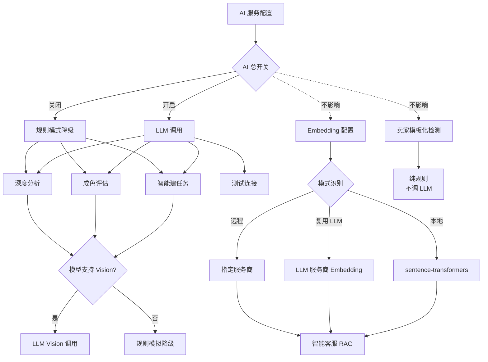

# 闲鱼猎人「AI 服务」操作手册

| 属性     | 值                            |
| -------- | ----------------------------- |
| 文档版本 | v1.0                          |
| 文档日期 | 2026-07-05                    |
| 所属项目 | 闲鱼猎人                      |
| 所属菜单 | 配置管理 → AI 服务            |
| 文档类型 | 操作手册                      |
| 关联路由 | /config/ai                    |
| 配套详细设计 | v2.0                      |
| 目标读者 | 运营 / 管理员                 |

---

## 目录

- [0. 阶段交接声明](#0-阶段交接声明)
- [1. 功能简介](#1-功能简介)
- [2. 入口与导航](#2-入口与导航)
- [3. 界面布局](#3-界面布局)
- [4. 操作指南](#4-操作指南)
  - [4.1 开启 / 关闭 AI 总开关](#41-开启--关闭-ai-总开关)
  - [4.2 选择 LLM 服务商预设](#42-选择-llm-服务商预设)
  - [4.3 配置与测试 LLM 连接](#43-配置与测试-llm-连接)
  - [4.4 配置 Embedding 向量服务](#44-配置-embedding-向量服务)
  - [4.5 测试 Embedding 连接](#45-测试-embedding-连接)
  - [4.6 查看用量统计](#46-查看用量统计)
  - [4.7 设置 AI 预算上限](#47-设置-ai-预算上限)
  - [4.8 切换 LLM 服务商](#48-切换-llm-服务商)
  - [4.9 更新 API Key](#49-更新-api-key)
  - [4.10 关闭 AI 后的降级模式](#410-关闭-ai-后的降级模式)
- [5. 字段说明](#5-字段说明)
- [6. 常见问题 FAQ](#6-常见问题-faq)
- [7. 注意事项与限制](#7-注意事项与限制)
- [8. 关联功能](#8-关联功能)
- [9. 快捷键与技巧](#9-快捷键与技巧)
- [10. 修订记录](#10-修订记录)
- [11. 附录](#11-附录)

---

## 0. 阶段交接声明

```
- 当前阶段：AI 服务操作手册编写（v1.0） ✅ 已完成
- 下一阶段：配置管理菜单其余子模块操作手册汇总
- 下一阶段智能体：文档编写智能体
- 下一阶段技能：文档编写
- 交接上下文：AI 服务操作手册 v1.0 已完成，面向运营/管理员，覆盖 10 个操作场景（开关/预设/LLM 配置/Embedding 配置/测试连接/用量统计/预算/切换服务商/更新 Key/降级模式）、字段说明、12 条 FAQ、10 条注意事项、7 个关联功能、快捷键与技巧、AI 功能矩阵图与预设对照表。严格规避 API 路径/数据库表名/代码文件名等技术细节。
```

---

## 1. 功能简介

「AI 服务」是闲鱼猎人系统的 **AI 能力统一配置入口**，位于「配置管理」一级菜单下，是启停智能功能、配置服务商、控制预算的核心操作页面。

通过本菜单，运营/管理员可以完成以下工作：

- **开启或关闭 AI 总开关**：一键控制全系统的 AI 调用行为，关闭后所有 AI 功能降级到规则模式（不消耗 token）
- **配置 LLM 服务商**：8 家主流 LLM 服务商预设（OpenAI / DeepSeek / 智谱 / Moonshot / 通义千问 / 文心一言 / 豆包 / Ollama），一键切换
- **配置 Embedding 向量服务**：双后端（本地 sentence-transformers / 远程 OpenAI 兼容），支持智能客服 RAG 检索
- **测试连接**：保存配置后立即发送最小化请求验证可用性
- **查看用量统计**：今日调用数 / Token 数 / 费用 / 7 天趋势，按端点与模型维度
- **设置 AI 预算上限**：每日 Token 限额 / 每日费用限额 / 每分钟调用速率限制，超出后自动降级
- **深度分析与卖家检测**：4 维度深度鉴伪（盗图/损坏/一致性/模板化）+ 卖家贩子识别（纯规则）

> **提示**：AI 服务是所有智能功能（智能建任务、成色评估、深度分析、智能客服 RAG）的前置依赖，建议新用户先阅读本手册第 4 章操作指南完成基础配置。

---

## 2. 入口与导航

### 2.1 菜单入口

AI 服务位于系统左侧导航栏的「配置管理」分组下：

```
配置管理
  └── AI 服务   （图标：机器人图标，排序：第 1 位）
```

### 2.2 进入方式

| 方式 | 操作 | 说明 |
|------|------|------|
| 菜单点击 | 展开左侧「配置管理」→ 点击「AI 服务」 | 默认入口，推荐 |
| 快捷键 | 按 `g` 键，500ms 内按 `a` 键 | 快速跳转到 AI 服务 |
| 命令面板 | 按 `Ctrl+K` → 输入"AI" → 选择对应命令 | 模糊搜索，支持任意关键词 |
| URL 直接访问 | 在浏览器地址栏输入 AI 服务路径 | 刷新页面后自动恢复 |

### 2.3 子页面导航

AI 服务为单页面配置，包含 2 个 Tab 页签：

| Tab | 名称 | 用途 |
|-----|------|------|
| Tab 1 | AI 服务配置 | LLM 服务商配置、API Key、测试连接、用量统计、预算控制 |
| Tab 2 | Embedding 向量服务配置 | Embedding 后端配置、测试连接（用于智能客服 RAG） |

> **提示**：两个 Tab 相互独立，Tab 2 不受 Tab 1 的 AI 总开关影响。即使关闭 AI 总开关，Embedding 服务仍可正常使用。

---

## 3. 界面布局

### 3.1 AI 服务配置 Tab（Tab 1）

Tab 1 自上而下分为 4 个区域：

```
┌─────────────────────────────────────────────────────────────┐
│  AI 功能总开关 Card                                          │
│  ┌───────────────────────────────────────────────────────┐  │
│  │  AI 服务   [状态 Tag: 已启用/未启用]    [Switch 开关]  │  │
│  └───────────────────────────────────────────────────────┘  │
├─────────────────────────────────────────────────────────────┤
│  配置区域（AI 关闭时半透明遮罩 + 不可点击）                   │
│  ┌───────────────────────────────────────────────────────┐  │
│  │  LLM 预设按钮：[OpenAI] [DeepSeek] [智谱] [Moonshot]  │  │
│  │                [通义千问] [文心一言] [豆包] [Ollama]   │  │
│  │  Base URL：[_________________________]                │  │
│  │  API Key： [_________________________] [获取 API Key]  │  │
│  │  模型：   [_________________________]                 │  │
│  │  视觉模型：[_________________________]                │  │
│  │  [测试连接]   结果：✅ 连接成功 / ❌ 失败原因          │  │
│  └───────────────────────────────────────────────────────┘  │
├─────────────────────────────────────────────────────────────┤
│  用量仪表盘（始终可见，即使 AI 关闭）                         │
│  ┌──────────┬──────────┬──────────┬──────────┐              │
│  │ 今日调用 │ Token 数 │ 费用(USD) │ 费用(CNY) │              │
│  └──────────┴──────────┴──────────┴──────────┘              │
│  Token 预算进度条  ████████░░  80%  (颜色：<70% 绿/70-90% 黄/≥90% 红)
│  费用预算进度条    ██████░░░░  60%                              │
│  调用分布列表：                                              │
│    • 智能建任务    128 次                                    │
│    • 成色评估      86 次                                     │
│    • 深度分析      12 次                                     │
│  近 7 天趋势列表：                                           │
│    • 2026-07-05   42 次                                     │
│    • 2026-07-04   38 次                                     │
│    • ...                                                    │
├─────────────────────────────────────────────────────────────┤
│  预算控制区                                                  │
│  每日 Token 限额：[500000]                                   │
│  每日费用限额(USD)：[5.0]                                    │
│  每分钟速率限制：[60]                                        │
│  [保存预算]                                                  │
└─────────────────────────────────────────────────────────────┘
```

### 3.2 Embedding 向量服务配置 Tab（Tab 2）

Tab 2 自上而下分为 2 个区域：

```
┌─────────────────────────────────────────────────────────────┐
│  Embedding 配置                                              │
│  ┌───────────────────────────────────────────────────────┐  │
│  │  预设按钮：[本地] [OpenAI] [Jina] [Ollama] [复用 LLM] │  │
│  │  模式提示 Alert：                                      │  │
│  │    • 本地模式：绿色（sentence-transformers + bge-small-zh + ~95MB）│
│  │    • 复用 LLM：蓝色（将复用 LLM 的 base_url 和 api_key）│
│  │  Base URL：[_________________________]                │  │
│  │  API Key： [_________________________]                │  │
│  │  模型：   [_________________________]                 │  │
│  │  维度：   [____]  (0=自动，兼容 Ollama)               │  │
│  │  [测试连接]   结果：✅ 维度 512 / ❌ 失败原因          │  │
│  └───────────────────────────────────────────────────────┘  │
└─────────────────────────────────────────────────────────────┘
```

### 3.3 关键交互说明

| 区域 | 交互行为 |
|------|----------|
| AI 总开关二次确认 | 关闭时弹出确认框，防止误操作导致所有 AI 功能降级 |
| AI 关闭遮罩 | 关闭后 Tab 1 配置区域半透明 + 不可点击，覆盖"AI 功能已关闭"提示 |
| LLM 预设切换 | 点击预设按钮，自动填入 Base URL + 模型 + 视觉模型，并立即落库 |
| Embedding 预设切换 | 点击预设按钮，按预设规则填充字段并落库 |
| API Key 脱敏 | 列表回显时仅保留末 4 位（`****xxxx`）；前端回传 `****` 开头视为未修改 |
| API Key 申请页跳转 | 选中的预设若有申请地址，则 API Key 输入框下方显示"获取 API Key"链接 |
| 测试连接（LLM） | 先保存当前配置，再发送最小化请求（`Hi` + max_tokens=5，15s 超时） |
| 测试连接（Embedding） | 先保存当前配置，再发送最小化请求（输入 `hi`，180s 超时兼容本地首次加载） |
| 用量仪表盘始终可见 | 即使 AI 关闭，历史用量统计仍可见 |
| 预算进度条颜色 | <70% 绿色 / 70-90% 黄色 / ≥90% 红色 |
| 用量渲染形态 | **列表渲染**而非图表：调用分布逐条列出端点及次数，近 7 天趋势逐日列出日期与调用数 |
| Embedding 模式识别 | 字段全空 = 复用 LLM；Base URL 空 + 模型有值 = 本地；Base URL 有值 = 远程 |
| Embedding 维度 0 | 维度填 0 表示自动，不传 dimensions 参数（兼容 Ollama） |

---

## 4. 操作指南

### 4.1 开启 / 关闭 AI 总开关

#### 操作步骤

1. 进入 AI 服务页面（左侧菜单「配置管理」→「AI 服务」）
2. 顶部「AI 功能总开关」Card 右侧显示当前状态 Tag（已启用/未启用）
3. 切换 Switch 开关：
   - **开启**：直接切换即可，状态 Tag 变为绿色"已启用"
   - **关闭**：弹出确认框"关闭后所有 AI 功能将降级到规则模式，是否继续？"
4. 关闭需点击「确认」才会生效

#### 参数说明

| 参数 | 含义 | 取值 |
|------|------|------|
| 状态 Tag | 当前 AI 总开关状态 | 已启用（绿色）/ 未启用（红色） |
| 二次确认 | 仅关闭时弹出 | 防止误操作导致所有 AI 功能降级 |
| 影响范围 | LLM 调用 + Vision 调用 | 不影响 Embedding 服务（Tab 2 独立） |

#### 操作结果

- **开启**：所有 AI 功能立即生效（智能建任务、成色评估、深度分析）
- **关闭**：所有 AI 功能降级到规则模式，不再消耗 token；Tab 1 配置区域变灰不可点击；用量统计与预算控制区域仍可见

> **提示**：关闭 AI 总开关不会清除已保存的 API Key 与配置，重新开启后无需重新填写。

---

### 4.2 选择 LLM 服务商预设

#### 操作步骤

1. 进入 AI 服务页面 Tab 1
2. 确保 AI 总开关已开启（若关闭，配置区域会被遮罩）
3. 在「配置区域」顶部点击预设按钮（共 8 个）
4. 系统自动填入 Base URL、模型、视觉模型，并立即落库
5. 顶部弹出"已切换到 xxx 预设"提示

#### 8 个 LLM 预设对照

| 预设 | 服务商 | 默认模型 | 默认视觉模型 | 支持 Vision | 适用场景 |
|------|--------|----------|--------------|-------------|----------|
| OpenAI | OpenAI | gpt-4o-mini | gpt-4o | ✅ | 通用，多模态评估首选 |
| DeepSeek | 深度求索 | deepseek-chat | deepseek-chat | ❌ | 成本敏感，纯文本场景 |
| 智谱 | 智谱 AI | glm-4-flash | glm-4v-flash | ✅ | 国内访问稳定，多模态 |
| Moonshot | 月之暗面 | moonshot-v1-8k | moonshot-v1-8k | ❌ | 长文本理解 |
| 通义千问 | 阿里云 | qwen-plus | qwen-vl-plus | ✅ | 国内云服务，多模态 |
| 文心一言 | 百度 | ernie-speed-128k | ernie-vision-4k | ✅ | 国内合规场景，多模态 |
| 豆包 | 字节跳动 | doubao-pro-32k | doubao-vision-pro-32k | ✅ | 国内访问稳定，多模态 |
| Ollama | 本地 | qwen2.5:7b | llava:7b | ❌ | 完全离线，无 API 费用 |

> **说明**：Vision 能力由视觉模型名自动检测，关键字匹配包括 `vision`/`gpt-4o`/`qwen-vl`/`glm-4v` 等。预设填写的视觉模型若不支持 Vision，系统会降级到规则模拟。

#### 参数说明

| 参数 | 含义 | 取值 |
|------|------|------|
| 预设按钮 | 一键填充 Base URL + 模型 + 视觉模型 | 8 个预设 |
| 自动落库 | 切换预设后立即保存到后端 | 无需额外点击保存 |
| 视觉模型 | 是否支持图片识别 | 由预设自动填入，可手动修改 |

#### 操作结果

- Base URL、模型、视觉模型字段被自动填充
- 配置立即保存到后端（无需额外点击"保存"按钮）
- 若需修改默认模型，可在输入框中手动编辑后保存

> **提示**：选择不支持 Vision 的预设（如 DeepSeek）后，成色评估与深度分析会降级到规则模拟，不会调用 LLM Vision 接口。

---

### 4.3 配置与测试 LLM 连接

#### 操作步骤

1. 进入 AI 服务页面 Tab 1
2. 选择 LLM 预设（或手动填写 Base URL + 模型）
3. 在「API Key」输入框中粘贴 API Key
   - 若预设提供了"获取 API Key"链接，点击跳转到服务商申请页
4. （可选）修改默认模型与视觉模型
5. 点击「测试连接」按钮
6. 系统先保存当前配置，再发送最小化请求验证
7. 查看结果：
   - ✅ **成功**：显示"连接成功"+ 使用的模型名
   - ❌ **失败**：显示具体失败原因（如 401 鉴权失败、超时、网络错误）

#### 参数说明

| 参数 | 含义 | 取值 |
|------|------|------|
| Base URL | LLM 服务商 API 地址 | 由预设填入，可手动修改 |
| API Key | 服务商鉴权密钥 | 加密存储，回显脱敏（`****xxxx`） |
| 模型 | 文本 LLM 模型名 | 用于智能建任务、parse_task |
| 视觉模型 | Vision 模型名 | 用于成色评估、深度分析；不支持则降级规则 |
| 测试超时 | 15 秒 | 发送 `Hi` + max_tokens=5 最小化请求 |

#### 操作结果

- 测试成功后，配置已保存到后端，立即对所有 AI 功能生效
- API Key 通过 keyring 加密存储，不会明文落盘
- 后续智能建任务、成色评估、深度分析将使用此配置

> **提示**：测试连接会消耗极少量的 token（约 5 个），用于验证 API Key 与 Base URL 的有效性。

---

### 4.4 配置 Embedding 向量服务

#### 操作步骤

1. 进入 AI 服务页面 Tab 2「Embedding 向量服务配置」
2. 在顶部预设按钮区选择预设（共 5 个）
3. 系统按预设规则自动填充字段
4. 检查字段是否符合预期，必要时手动调整
5. 点击「测试连接」按钮验证

#### 5 个 Embedding 预设对照

| 预设 | 模式 | Base URL | API Key | 模型 | 维度 | 适用场景 |
|------|------|----------|---------|------|------|----------|
| 本地 | local | 空 | 空 | BAAI/bge-small-zh-v1.5 | 512 | 离线/节省成本，首次加载约 30s |
| OpenAI | remote | api.openai.com/v1 | 需填写 | text-embedding-3-small | 1536 | 高质量向量，按量计费 |
| Jina | remote | api.jina.ai/v1 | 需填写 | jina-embeddings-v2-base-zh | 768 | 国外服务商，中文优化 |
| Ollama | remote | localhost:11434/v1 | 空 | nomic-embed-text | 768 | 本地部署，无 API 费用（dimensions=0 时不传该参数） |
| 复用 LLM | inherit | 空 | 空 | 空 | 0 | 复用 LLM 配置，零额外配置 |

#### 模式识别规则

| 模式 | 识别条件 | 前端提示 |
|------|----------|----------|
| 本地（local） | Base URL 空 + 模型有值 | 绿色 Alert：使用 sentence-transformers + bge-small-zh + ~95MB |
| 复用 LLM（inherit） | 所有字段全空 | 蓝色 Alert：将复用 LLM 的 Base URL 和 API Key |
| 远程（remote） | Base URL 有值 | 无特殊提示 |

#### 参数说明

| 参数 | 含义 | 取值 |
|------|------|------|
| Base URL | Embedding 服务地址 | 远程预设填入；本地/复用为空 |
| API Key | 远程服务鉴权密钥 | 加密存储；本地/复用为空 |
| 模型 | Embedding 模型名 | 本地默认 bge-small-zh-v1.5 |
| 维度 | 向量维度 | 0-3072，0 表示自动（兼容 Ollama） |

#### 操作结果

- Embedding 配置保存到后端，立即对智能客服 RAG 检索生效
- 本地模式首次使用时自动下载模型权重（约 95MB）到本地缓存目录
- 远程模式立即生效，无需等待

> **提示**：选择"复用 LLM"预设可零额外配置使用 LLM 服务商的 Embedding 接口（前提是服务商提供 Embedding 服务，如智谱、OpenAI）。

---

### 4.5 测试 Embedding 连接

#### 操作步骤

1. 进入 AI 服务页面 Tab 2
2. 完成 Embedding 配置（参考 4.4）
3. 点击「测试连接」按钮
4. 等待结果返回：
   - **本地模式**：首次加载模型约 30 秒（含下载权重），后续启动秒级响应；前端超时 180 秒兼容首次加载
   - **远程模式**：通常 1-3 秒返回
5. 查看结果：
   - ✅ **成功**：显示"连接成功"+ 实际维度（如 `dimensions: 512`）
   - ❌ **失败**：显示具体失败原因

#### 参数说明

| 参数 | 含义 | 取值 |
|------|------|------|
| 测试请求 | 发送 `input: ["hi"]` 最小化请求 | — |
| 前端超时 | 180 秒 | 兼容本地首次加载模型 |
| 返回字段 | 包含 `dimensions` | 用于验证向量维度配置正确 |

#### 操作结果

- 测试成功后，配置已保存到后端
- 智能客服 RAG 检索将使用此 Embedding 服务向量化知识库与用户问题
- 返回的 `dimensions` 字段可用于校验配置的维度是否与服务商一致

> **提示**：本地模式首次加载模型会下载约 95MB 权重文件到 `~/.cache/huggingface/hub` 目录，后续启动无需重复下载。如遇 HuggingFace 官方源访问超时，系统已自动切换到国内镜像源。

---

### 4.6 查看用量统计

#### 操作步骤

1. 进入 AI 服务页面 Tab 1
2. 滚动到「用量仪表盘」区域（始终可见，即使 AI 关闭）
3. 查看今日汇总卡片与历史趋势

#### 仪表盘内容

**4 个统计卡片**：

| 卡片 | 含义 | 数据来源 |
|------|------|----------|
| 今日调用数 | 今日 0 点至今的 AI 调用次数 | 按端点统计 |
| Token 数 | 今日消耗的 Token 总量 | 含输入 + 输出 |
| 费用(USD) | 今日按 USD 计算的费用 | 按模型单价估算 |
| 费用(CNY) | 今日按 CNY 计算的费用 | USD × 汇率换算 |

**2 个预算进度条**：

| 进度条 | 颜色规则 | 说明 |
|--------|----------|------|
| Token 预算 | <70% 绿 / 70-90% 黄 / ≥90% 红 | 今日 Token / 每日 Token 限额 |
| 费用预算 | <70% 绿 / 70-90% 黄 / ≥90% 红 | 今日费用 / 每日费用限额 |

**2 个分布列表**（列表渲染，非图表）：

| 列表 | 内容 | 排序 |
|------|------|------|
| 调用分布 | 按端点维度（智能建任务/成色评估/深度分析等） | 调用次数降序 |
| 近 7 天趋势 | 逐日列出日期与调用数 | 日期降序（最新在最前） |

#### 参数说明

| 参数 | 含义 | 取值 |
|------|------|------|
| 统计周期 | 今日汇总 + 近 7 天 | 自动按服务器时区计算 |
| 费用估算 | 按模型单价 × Token 数 | 仅供参考，实际以服务商账单为准 |
| 数据刷新 | 进入页面时自动刷新 | 无手动刷新按钮，可切换 Tab 后再切回 |

#### 操作结果

- 可实时了解 AI 调用量与费用消耗
- 预算进度条颜色变化提示是否接近上限
- 调用分布列表帮助定位高频调用的端点

> **提示**：Token 数格式化规则：>1000 显示为 `1.xK`，>1000000 显示为 `1.xM`，便于阅读。

---

### 4.7 设置 AI 预算上限

#### 操作步骤

1. 进入 AI 服务页面 Tab 1
2. 滚动到「预算控制区」（页面底部）
3. 填写 3 个预算参数
4. 点击「保存预算」按钮
5. 系统提示"预算配置已保存"

#### 参数说明

| 参数 | 含义 | 取值范围 | 默认值 | 超出后行为 |
|------|------|----------|--------|------------|
| 每日 Token 限额 | 单日 Token 消耗上限 | 0-无限 | 500000 | 拒绝调用，降级到规则模式 |
| 每日费用限额(USD) | 单日费用上限 | 0-无限，步长 0.1 | 5.0 | 拒绝调用，降级到规则模式 |
| 每分钟速率限制 | 每分钟最大调用次数 | 0-无限 | 60 | 拒绝调用，等待下一分钟 |

#### 操作结果

- 预算配置保存到后端，立即对后续 AI 调用生效
- 每次 AI 调用前系统会检查预算：
  - 未超限：正常调用，调用后扣减预算
  - 已超限：拒绝调用，自动降级到规则模式
- 用量仪表盘的进度条颜色实时反映预算使用情况

> **提示**：设置为 0 表示不限制（仅对该项不限制，其他项仍生效）。建议初期设置较宽松的限额，根据实际用量逐步收紧。

---

### 4.8 切换 LLM 服务商

#### 操作步骤

1. 进入 AI 服务页面 Tab 1
2. 点击新的 LLM 预设按钮（如从 OpenAI 切换到 DeepSeek）
3. 系统自动填入新预设的 Base URL + 模型 + 视觉模型
4. 在「API Key」输入框中粘贴新服务商的 API Key
5. 点击「测试连接」验证新配置
6. 测试成功后，新配置立即对所有 AI 功能生效

#### 参数说明

| 参数 | 含义 | 取值 |
|------|------|------|
| 预设切换 | 自动覆盖 Base URL + 模型 + 视觉模型 | API Key 不被覆盖，需手动更新 |
| API Key | 每个服务商的 Key 独立 | 切换服务商后必须更新 Key |
| 配置热更新 | 无需重启服务 | 立即生效 |

#### 操作结果

- 所有 AI 功能（智能建任务、成色评估、深度分析）切换到新服务商
- 原 API Key 会被新 Key 覆盖（通过 keyring 加密存储）
- 用量统计继续累计，不区分服务商

> **提示**：切换到不支持 Vision 的服务商（如 DeepSeek、Moonshot、Ollama）后，成色评估与深度分析会降级到规则模拟，不会调用 LLM Vision 接口。

---

### 4.9 更新 API Key

#### 操作步骤

1. 进入 AI 服务页面 Tab 1
2. 在「API Key」输入框中：
   - **查看当前 Key**：点击输入框右侧"眼睛"图标切换显示/隐藏
   - **更新 Key**：清空原值，粘贴新 Key
   - **清除 Key**：清空输入框（保存后 Key 被清除）
3. 点击「测试连接」验证新 Key
4. 测试成功后 Key 已保存

#### 参数说明

| 参数 | 含义 | 取值 |
|------|------|------|
| Key 脱敏显示 | 回显时仅保留末 4 位 | `****xxxx` 格式 |
| Key 未修改识别 | 回传值以 `****` 开头视为未修改 | 跳过更新，保留原 Key |
| Key 清除 | 输入框留空保存 | 清除 keyring 中的 Key |
| Key 加密存储 | 通过 keyring 加密 | 不会明文落盘到 .env 文件 |

#### 操作结果

- 新 Key 加密保存到 keyring，立即对后续 AI 调用生效
- 原 Key 被覆盖，无法恢复
- 用量统计不受影响

> **提示**：API Key 是敏感信息，请妥善保管。系统不会在日志中记录完整 Key，仅记录 Key 是否匹配的布尔结果。

---

### 4.10 关闭 AI 后的降级模式

#### 操作步骤

1. 关闭 AI 总开关（参考 4.1）
2. 系统立即进入降级模式
3. 查看各 AI 功能的降级行为

#### 降级行为对照

| 功能 | 正常模式 | 降级模式（AI 关闭） |
|------|----------|---------------------|
| 智能建任务 | AI 解析自然语言为任务参数 | 返回错误，提示需开启 AI |
| 成色评估 | LLM Vision 多模态评估 | 规则模拟（基于关键词与价格区间） |
| 深度分析 | LLM Vision 4 维度深度鉴伪 | 规则模拟（基于图片哈希与文案统计） |
| 卖家模板化检测 | 纯规则（本就不调 LLM） | **不受影响**，仍可正常使用 |
| 智能客服 RAG | Embedding 向量化检索 | **不受影响**（Embedding 独立于 AI 总开关） |

#### 参数说明

| 参数 | 含义 | 取值 |
|------|------|------|
| 降级触发条件 | AI 总开关关闭 或 预算超限 | 自动降级，无需手动操作 |
| 降级模式行为 | 规则模拟 | 不消耗 token |
| 用量统计 | 历史用量仍可见 | 降级期间不产生新用量 |

#### 操作结果

- 所有 AI 调用被拒绝，相关功能降级到规则模式
- Tab 1 配置区域变灰不可点击
- Tab 2 Embedding 配置不受影响，仍可正常使用
- 用量统计与预算控制区域仍可见

> **提示**：降级模式是临时状态，重新开启 AI 总开关后所有功能立即恢复。降级期间产生的规则评估结果会缓存在评估表中，重新开启 AI 后不会重复调用 LLM。

---

## 5. 字段说明

### 5.1 AI 服务配置字段

| 字段名 | 含义 | 示例 | 可编辑 |
|--------|------|------|--------|
| AI 总开关 | 全局 AI 功能开关 | 已启用 | 是 |
| Base URL | LLM 服务商 API 地址 | https://api.openai.com/v1 | 是 |
| API Key | 服务商鉴权密钥（脱敏显示） | ****a1b2 | 是 |
| 模型 | 文本 LLM 模型名 | gpt-4o-mini | 是 |
| 视觉模型 | Vision 模型名 | gpt-4o-mini | 是 |
| 测试连接状态 | 最近一次测试结果 | ✅ 连接成功 | 否（只读） |

### 5.2 Embedding 配置字段

| 字段名 | 含义 | 示例 | 可编辑 |
|--------|------|------|--------|
| Base URL | Embedding 服务地址 | https://api.openai.com/v1 | 是 |
| API Key | 远程服务鉴权密钥（脱敏显示） | ****c3d4 | 是 |
| 模型 | Embedding 模型名 | BAAI/bge-small-zh-v1.5 | 是 |
| 维度 | 向量维度（0=自动） | 512 | 是 |
| 模式 | 自动识别（本地/复用 LLM/远程） | 本地 | 否（只读，由字段自动识别） |
| 测试连接状态 | 最近一次测试结果 | ✅ 维度 512 | 否（只读） |

### 5.3 用量统计字段

| 字段名 | 含义 | 示例 | 可编辑 |
|--------|------|------|--------|
| 今日调用数 | 今日 0 点至今的调用次数 | 128 | 否 |
| Token 数 | 今日消耗的 Token 总量 | 1.2K | 否 |
| 费用(USD) | 今日按 USD 计算的费用 | 0.85 | 否 |
| 费用(CNY) | 今日按 CNY 计算的费用 | 6.12 | 否 |
| Token 预算使用率 | 今日 Token / 每日限额 | 80% | 否 |
| 费用预算使用率 | 今日费用 / 每日限额 | 60% | 否 |

### 5.4 预算控制字段

| 字段名 | 含义 | 取值范围 | 默认值 | 可编辑 |
|--------|------|----------|--------|--------|
| 每日 Token 限额 | 单日 Token 消耗上限 | 0-无限 | 500000 | 是 |
| 每日费用限额(USD) | 单日费用上限 | 0-无限 | 5.0 | 是 |
| 每分钟速率限制 | 每分钟最大调用次数 | 0-无限 | 60 | 是 |

### 5.5 AI 端点说明

| 端点 | 用途 | 是否调 LLM | 超时 |
|------|------|------------|------|
| 智能建任务 | 自然语言 → 结构化任务 | 是 | 30s |
| 成色评估 | 多模态商品成色评估 | 是（Vision） | 60s |
| 深度分析 | 4 维度深度鉴伪 | 是（Vision） | 90s |
| 卖家模板化检测 | 卖家贩子识别 | **否**（纯规则） | 30s |
| 测试连接（LLM） | 验证 LLM 配置 | 是 | 30s |
| 测试连接（Embedding） | 验证 Embedding 配置 | 是 | 180s |

---

## 6. 常见问题 FAQ

### Q1：关闭 AI 总开关后，智能客服还能用吗？

**A**：可以。智能客服的 Embedding 向量检索独立于 AI 总开关，关闭 AI 总开关后仍可正常使用 RAG 检索。但智能客服中的 LLM 对话功能（如果有）会降级。

### Q2：选择 DeepSeek 预设后，成色评估还能用吗？

**A**：可以，但会降级到规则模拟。DeepSeek 不支持 Vision 多模态，系统会自动检测模型能力，降级到基于关键词与价格区间的规则评估。如需 Vision 评估，请选择支持 Vision 的预设（OpenAI / 智谱 / 通义千问 / 文心一言 / 豆包）。

### Q3：API Key 会明文保存吗？

**A**：不会。API Key 通过系统 keyring 服务加密存储，配置文件中不会出现明文。前端回显时仅保留末 4 位（`****xxxx`），日志中也不会记录完整 Key。

### Q4：本地 Embedding 首次加载很慢正常吗？

**A**：正常。首次使用本地 Embedding 时，系统需要下载模型权重（约 95MB）到本地缓存目录，耗时约 30 秒（取决于网络速度）。后续启动无需重复下载，秒级响应。系统已自动配置国内 HuggingFace 镜像源避免访问超时。

### Q5：预算超限后怎么办？

**A**：预算超限后，所有 AI 调用会被拒绝并降级到规则模式。有两种处理方式：1）等待次日 0 点自动重置预算；2）在「预算控制区」调高限额并保存。建议根据实际用量逐步调整限额，避免设置过高失去保护意义。

### Q6：切换 LLM 服务商后，原有配置会丢失吗？

**A**：不会。切换预设会覆盖 Base URL、模型、视觉模型三个字段，但 API Key 不会被覆盖（需手动更新）。用量统计是累计的，不会因切换服务商而清零。

### Q7：测试连接成功但实际调用失败怎么办？

**A**：测试连接仅验证基础连通性（发送最小化请求），实际调用可能因模型能力、请求复杂度、网络波动等因素失败。建议：1）检查模型名是否正确；2）确认 API Key 有对应模型的调用权限；3）查看实时日志菜单排查具体错误。

### Q8：Embedding 维度填 0 是什么意思？

**A**：维度填 0 表示"自动"，系统不传 dimensions 参数给服务商。主要用于兼容 Ollama（不支持指定维度）。其他服务商建议填写实际维度（如 OpenAI text-embedding-3-small 为 1536）。

### Q9："复用 LLM" 预设和 "本地" 预设有什么区别？

**A**：
- **复用 LLM**：使用 LLM 服务商的 Embedding 接口（如 OpenAI 的 text-embedding-3-small），需要 LLM 服务商支持 Embedding 服务，按量计费。
- **本地**：使用本地 sentence-transformers 模型（BAAI/bge-small-zh-v1.5），完全离线，无 API 费用，但首次需下载约 95MB 模型权重。

### Q10：用量统计的费用准确吗？

**A**：费用按模型单价 × Token 数估算，仅供参考，实际以服务商账单为准。不同服务商的单价不同，系统会根据当前配置的模型自动匹配单价。如发现费用估算偏差较大，可在实时日志中查看详细调用记录。

### Q11：AI 总开关的二次确认可以关闭吗？

**A**：不可以。二次确认是防止误操作导致所有 AI 功能降级的安全机制，无法关闭。点击"取消"或点击页面其他位置可撤销关闭操作。

### Q12：深度分析和卖家模板化检测有什么区别？

**A**：
- **深度分析**：针对单个商品，进行 4 维度深度鉴伪（盗图/损坏/一致性/模板化），调用 LLM Vision，超时 90 秒。
- **卖家模板化检测**：针对卖家，统计其多个商品的文案模板化程度，**纯规则不调 LLM**，不消耗 token，超时 30 秒。

---

## 7. 注意事项与限制

### 7.1 API Key 安全

API Key 是敏感信息，请妥善保管。系统通过 keyring 加密存储，不会明文落盘。请勿在截图、日志、聊天中泄露完整 Key。如怀疑 Key 泄露，请立即到服务商后台重置 Key 并更新到本系统。

### 7.2 本地 Embedding 首次加载

本地 Embedding 模式首次使用时需要下载模型权重（约 95MB），耗时约 30 秒。前端测试连接超时设置为 180 秒以兼容首次加载。如长期不使用本地模式，模型权重会保留在本地缓存目录，不会自动清理。

### 7.3 预算超限降级

预算超限后所有 AI 调用会被拒绝并降级到规则模式。这可能导致成色评估准确度下降。建议根据实际用量合理设置预算限额，并定期查看用量统计调整。

### 7.4 Vision 模型兼容性

并非所有 LLM 服务商都支持 Vision 多模态。系统通过视觉模型名自动检测能力，关键字包括 `vision`/`gpt-4o`/`qwen-vl`/`glm-4v` 等。8 个预设中，OpenAI / 智谱 / 通义千问 / 文心一言 / 豆包 支持 Vision，DeepSeek / Moonshot / Ollama 不支持。选择不支持 Vision 的预设后，成色评估与深度分析会降级到规则模拟。

### 7.5 配置热更新

AI 服务配置支持热更新，无需重启服务即可生效。但极端情况下（如配置文件损坏），可能需要重启服务才能恢复。重启后配置会从 .env 文件与 keyring 重新加载。

### 7.6 测试连接的 token 消耗

测试连接会发送最小化请求（LLM 约 5 个 token，Embedding 约 1 个 token），消耗极少。但频繁测试仍会产生少量费用，建议配置确认无误后再测试。

### 7.7 用量统计的时区

用量统计按服务器时区计算"今日"，0 点重置。如服务器时区与用户时区不一致，可能导致统计偏差。建议服务器时区设置为用户主要时区（如 Asia/Shanghai）。

### 7.8 Embedding 维度一致性

切换 Embedding 模型或维度后，已向量化的知识库需要重新向量化。系统会在检测到维度变化时提示用户。请勿在智能客服 RAG 索引过程中切换 Embedding 配置。

### 7.9 Ollama 本地部署

使用 Ollama 预设时，请确保 Ollama 服务已启动并加载了对应模型。Ollama 默认监听 `localhost:11434`，如端口被占用或服务未启动，测试连接会失败。

### 7.10 卖家模板化检测不消耗 token

卖家模板化检测是纯规则实现，不调用 LLM，不消耗 token。即使 AI 总开关关闭或预算超限，此功能仍可正常使用。

---

## 8. 关联功能

AI 服务与以下菜单存在联动关系：

| 关联菜单 | 联动关系 | 说明 |
|----------|----------|------|
| 评估规则 | 配置依赖 | 评估规则的 AI 自动评估依赖 AI 服务配置，AI 关闭后降级到规则评估 |
| 智能客服 | 配置依赖 | 智能客服 RAG 检索依赖 Embedding 服务配置，独立于 AI 总开关 |
| 任务管理 | 功能调用 | 任务管理的"智能建任务"按钮调用 AI 服务解析自然语言 |
| 商品中心 | 功能调用 | 商品详情页的"深度分析"按钮调用 AI 服务进行 4 维度鉴伪 |
| 卖家评估 | 功能调用 | 卖家详情页的"模板化检测"按钮调用卖家贩子识别（纯规则） |
| 实时日志 | 运行监控 | AI 调用日志在实时日志菜单查看，用于排查调用失败 |
| 系统配置 | 全局默认 | AI 服务的部分默认值（如汇率、模型单价）可在系统配置菜单调整 |

> **提示**：AI 服务是所有智能功能的前置依赖，配置完成后建议到评估规则菜单开启"AI 自动评估"以启用智能评估能力。

---

## 9. 快捷键与技巧

### 9.1 快捷键

| 快捷键 | 作用 | 备注 |
|--------|------|------|
| `Ctrl+K`（或 `⌘+K`） | 打开命令面板 | 可模糊搜索任意菜单或命令 |
| `Escape` | 关闭命令面板 | 仅在命令面板打开时生效 |
| `g` 然后按 `a` | 跳转到 AI 服务 | g 前缀序列，500ms 内按第二键 |
| `g` 然后按 `e` | 跳转到评估规则 | 配置 AI 后去开启自动评估 |
| `g` 然后按 `c` | 跳转到智能客服 | 配置 Embedding 后去验证 RAG |
| `g` 然后按 `t` | 跳转到任务管理 | 测试智能建任务 |

> 输入框、文本域、下拉框内不触发快捷键，避免干扰正常输入。

### 9.2 实用技巧

**技巧 1：先测试再启用**

新部署或切换服务商后，先点击"测试连接"验证配置可用，再启用 AI 总开关或开启评估规则的自动评估。避免配置错误导致大量调用失败。

**技巧 2：本地 Embedding 节省成本**

如对 Embedding 质量要求不高（如知识库规模较小），优先选择"本地"预设，使用 sentence-transformers + bge-small-zh-v1.5 模型，完全免费，无 API 调用费用。

**技巧 3：复用 LLM 配置简化部署**

如 LLM 服务商（如 OpenAI、智谱）同时提供 Embedding 服务，选择"复用 LLM"预设，零额外配置即可启用 Embedding，无需单独申请 Embedding API Key。

**技巧 4：预算分阶段收紧**

初期设置较宽松的预算限额（如每日 100 万 token、10 美元），观察 1-2 周实际用量后逐步收紧。避免一开始设置过严导致频繁降级。

**技巧 5：用量统计定期回顾**

每周定期查看用量统计的"近 7 天趋势"，了解 AI 调用密度。如发现某天突然激增，可能是任务配置异常（如间隔过短）或评估规则过于严格导致频繁调用。

**技巧 6：Vision 与文本模型分离**

部分服务商支持为文本 LLM 与 Vision LLM 配置不同模型。可根据需求选择成本更低的文本模型（如 deepseek-chat）+ 高质量的 Vision 模型（如 gpt-4o-mini），但需要两个服务商的 API Key 时请手动配置。

**技巧 7：Ollama 完全离线**

对数据隐私要求高或网络不稳定的场景，使用 Ollama 预设完全离线部署。需提前安装 Ollama 并拉取对应模型（如 `ollama pull qwen2.5:7b`），无任何 API 费用。

**技巧 8：卖家检测免费使用**

卖家模板化检测是纯规则实现，不消耗 token。可频繁使用此功能筛查可疑卖家，无需担心费用。

---

## 10. 修订记录

| 版本 | 日期 | 修订人 | 修订内容 |
|------|------|--------|----------|
| v1.0 | 2026-07-05 | 文档编写智能体 | 初版操作手册，覆盖 10 个操作场景、AI 服务与 Embedding 字段说明、12 条 FAQ、10 条注意事项、7 个关联功能、快捷键与技巧、AI 功能矩阵图与预设对照表 |

---

## 11. 附录

### 11.1 AI 功能矩阵图



**说明**：
- AI 总开关仅影响 LLM 调用类功能（智能建任务、成色评估、深度分析、测试连接）
- Embedding 服务与卖家模板化检测独立于 AI 总开关
- Vision 能力由模型名自动检测，不支持时降级到规则模拟

### 11.2 LLM 服务商预设对照表

| 预设 | 服务商 | Base URL | 默认模型 | 默认视觉模型 | 支持 Vision | API Key 申请 |
|------|--------|----------|----------|--------------|-------------|--------------|
| OpenAI | OpenAI | api.openai.com/v1 | gpt-4o-mini | gpt-4o | ✅ | platform.openai.com |
| DeepSeek | 深度求索 | api.deepseek.com/v1 | deepseek-chat | deepseek-chat | ❌ | platform.deepseek.com |
| 智谱 | 智谱 AI | open.bigmodel.cn/api/paas/v4 | glm-4-flash | glm-4v-flash | ✅ | open.bigmodel.cn |
| Moonshot | 月之暗面 | api.moonshot.cn/v1 | moonshot-v1-8k | moonshot-v1-8k | ❌ | platform.moonshot.cn |
| 通义千问 | 阿里云 | dashscope.aliyuncs.com/compatible-mode/v1 | qwen-plus | qwen-vl-plus | ✅ | dashscope.aliyun.com |
| 文心一言 | 百度 | qianfan.baidubce.com/v2 | ernie-speed-128k | ernie-vision-4k | ✅ | qianfan.baidubce.com |
| 豆包 | 字节跳动 | ark.cn-beijing.volces.com/api/v3 | doubao-pro-32k | doubao-vision-pro-32k | ✅ | console.volcengine.com |
| Ollama | 本地 | localhost:11434/v1 | qwen2.5:7b | llava:7b | ❌ | 无需 Key |

> **Vision 能力检测**：系统通过视觉模型名自动检测是否支持 Vision，关键字包括 `vision`/`gpt-4o`/`gpt-4-vision`/`qvq`/`qwen-vl`/`glm-4v`/`claude-3`/`opus`/`sonnet`/`haiku`。预设填写的视觉模型若不匹配任何关键字，会降级到规则模拟。

### 11.3 Embedding 预设对照表

| 预设 | 模式 | Base URL | 默认模型 | 默认维度 | API Key | 适用场景 |
|------|------|----------|----------|----------|---------|----------|
| 本地 | local | 空 | BAAI/bge-small-zh-v1.5 | 512 | 空 | 离线/免费，首次加载约 30s |
| OpenAI | remote | api.openai.com/v1 | text-embedding-3-small | 1536 | 需填写 | 高质量向量，按量计费 |
| Jina | remote | api.jina.ai/v1 | jina-embeddings-v2-base-zh | 768 | 需填写 | 国外服务商，中文优化 |
| Ollama | remote | localhost:11434/v1 | nomic-embed-text | 768 | 空 | 本地部署，无 API 费用（dimensions=0 时不传该参数） |
| 复用 LLM | inherit | 空 | 空 | 0（自动） | 空 | 复用 LLM 配置，零额外配置 |

### 11.4 预算进度条颜色对照

| 使用率 | 颜色 | 状态 | 建议 |
|--------|------|------|------|
| 0-69% | 绿色 | 正常 | 无需操作 |
| 70-89% | 黄色 | 警告 | 关注用量，必要时调高限额 |
| 90-100% | 红色 | 危险 | 即将超限，建议立即调高限额 |
| >100% | 红色 | 已超限 | AI 调用被拒绝，已降级到规则模式 |

### 11.5 AI 端点超时矩阵

| 端点 | 后端超时 | 前端超时 | 模型 | 是否调 LLM |
|------|----------|----------|------|------------|
| 智能建任务 | 25s | 30s | 文本 LLM | 是 |
| 成色评估 | 60s | 60s | Vision LLM | 是 |
| 深度分析 | 90s | 90s | Vision LLM | 是 |
| 卖家模板化检测 | 同步规则 | 30s | — | **否** |
| 测试连接（LLM） | 15s | 30s | 文本 LLM | 是 |
| 测试连接（Embedding） | 加载+1 次推理 | 180s | Embedding 模型 | 是 |

**说明**：
- 后端超时是服务端等待 LLM 响应的最大时间
- 前端超时通常略大于后端超时，预留网络传输时间
- Embedding 测试连接前端超时 180s 是为兼容本地首次加载模型（约 30s + 下载权重）
