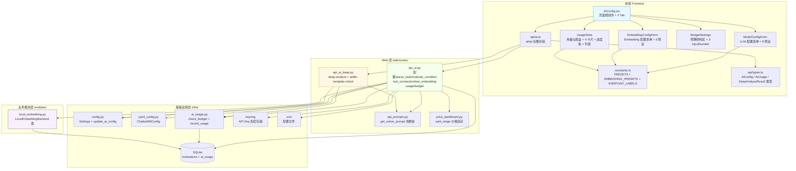
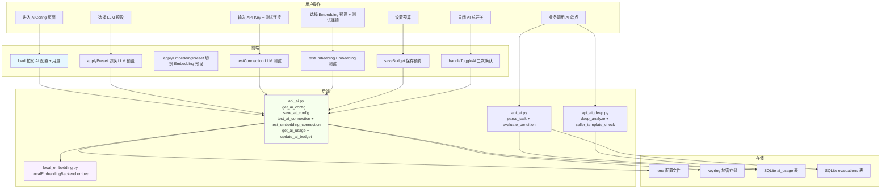
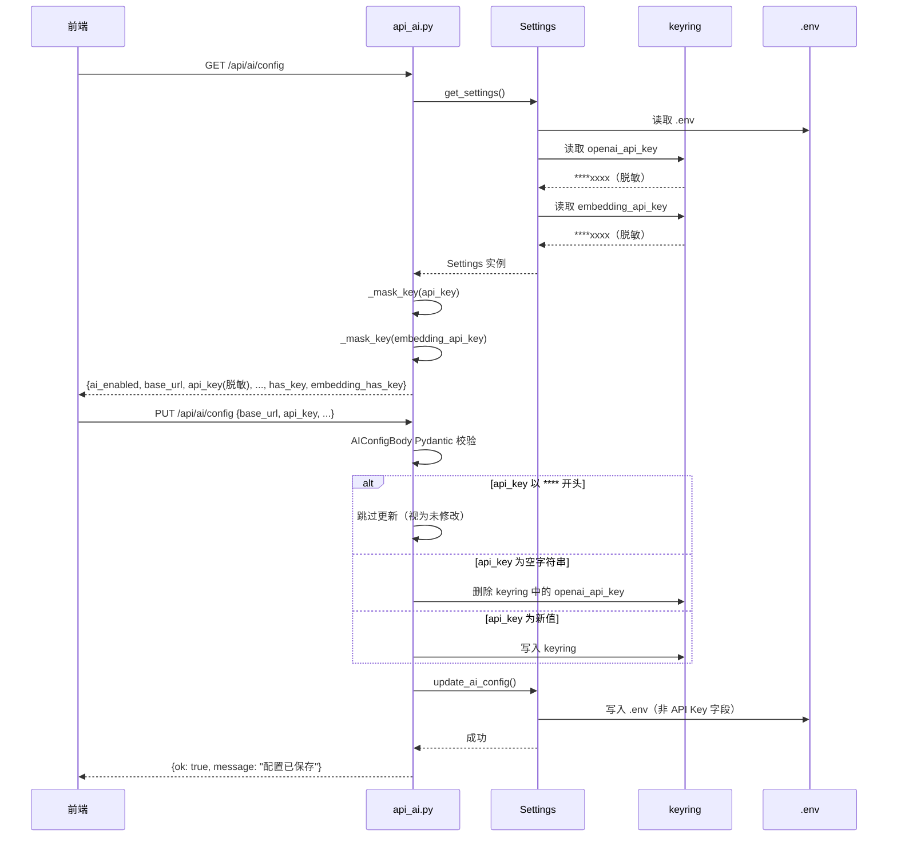
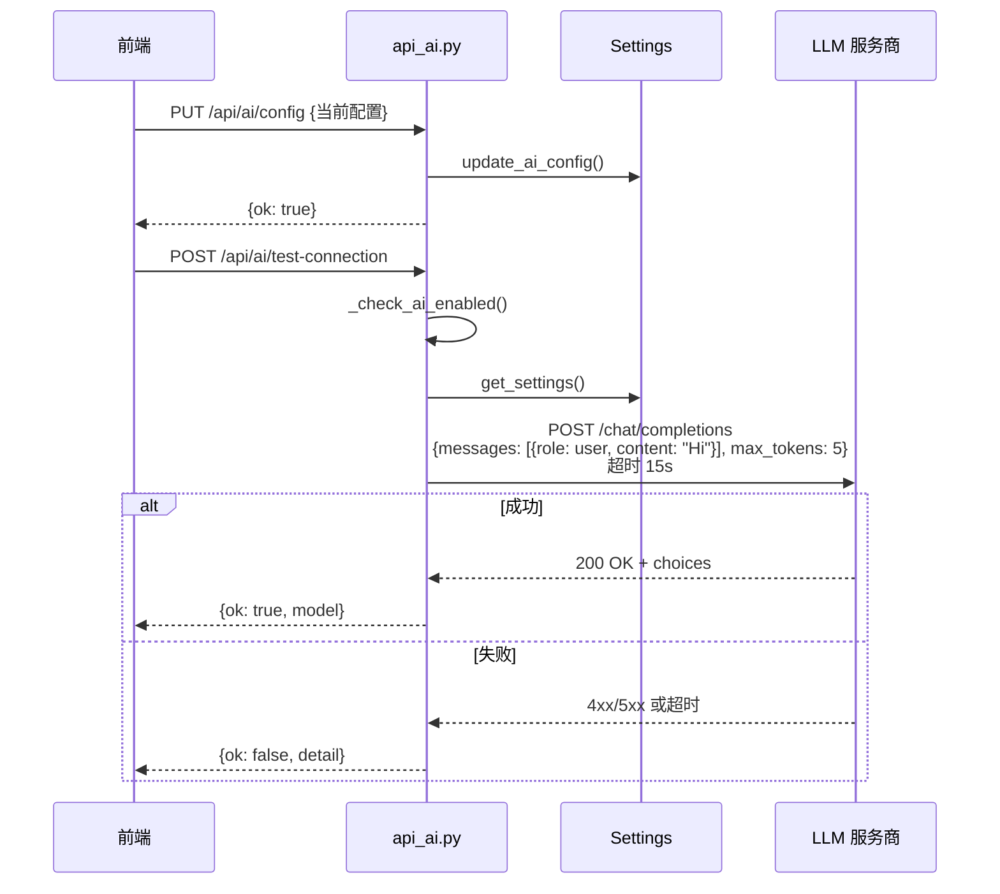
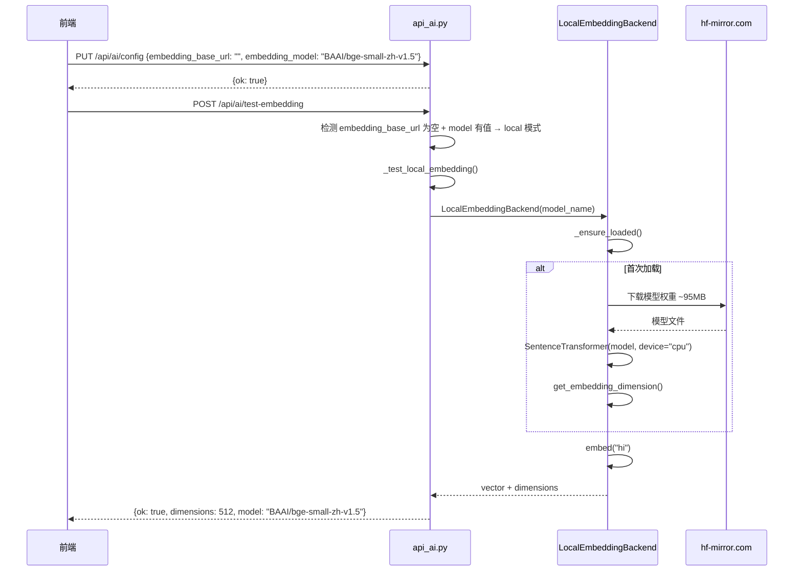
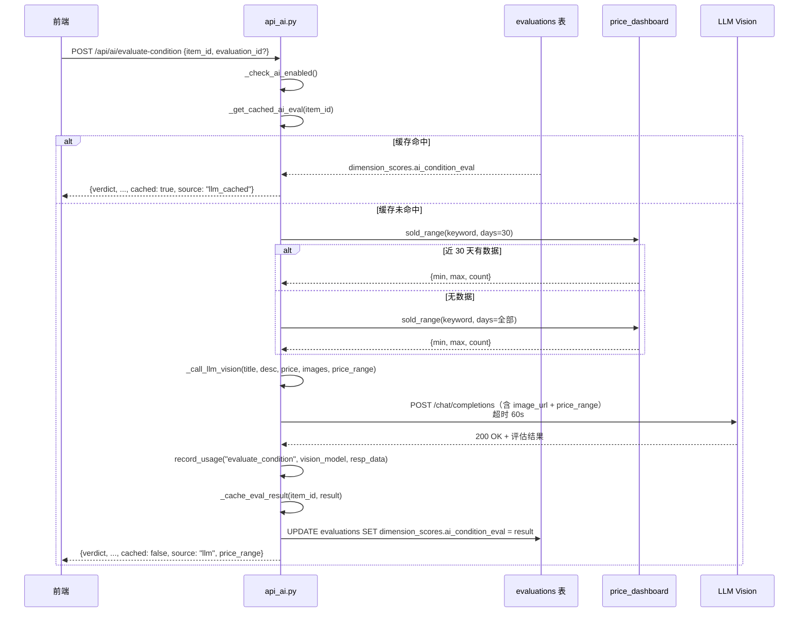
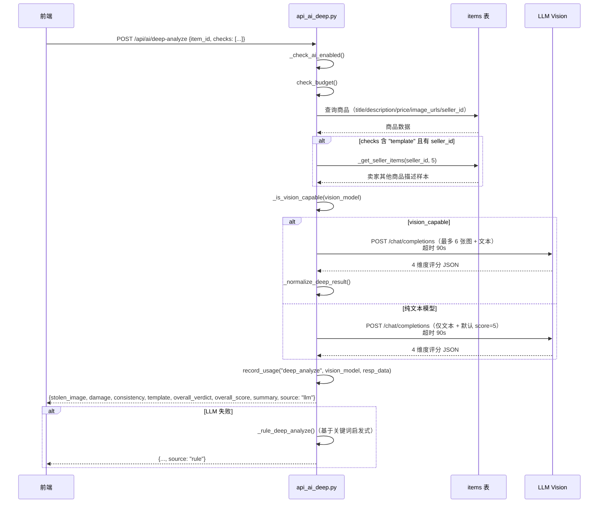
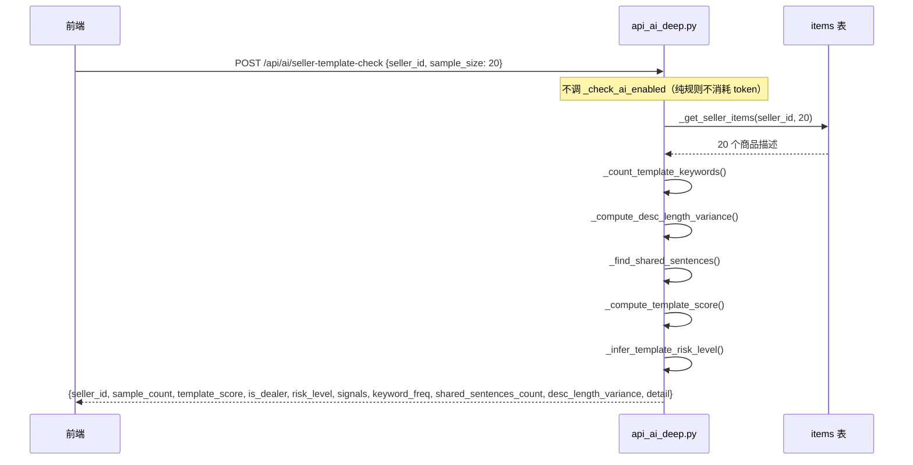

# 闲鱼猎人「AI 服务」模块需求规格说明书

| 项 | 内容 |
|---|---|
| 文档版本 | v1.0 |
| 文档日期 | 2026-07-05 |
| 文档状态 | 初版（与详细设计 v2.0 对齐） |
| 所属项目 | 闲鱼猎人（XianyuHunter） |
| 所属菜单 | 配置管理 → AI 服务 |
| 菜单标识 | `menu_registry.yaml` 中 `key=ai_config`、`icon=RobotOutlined`、`category=config` |
| 关联路由 | 前端 `/config/ai`；后端 `/api/ai/*`、`/api/ai/deep-analyze`、`/api/ai/seller-template-check`、`/api/ai/test-embedding` |
| 关联文档 | [AI服务-详细设计.md](AI服务-详细设计.md)（v2.0/2026-07-05） |
| 文档类型 | 需求规格说明书（SRS） |

> **本文档首段：继承 project_memory.md 中的硬约束。** 1. Web 进程必须使用 `with_browser=False` 模式；2. 认证白名单机制（不适用本模块）；3. 前端 fetch 必须含 `credentials: 'include'`；4. 401 必须返回 JSON；5. token 比较使用 `hmac.compare_digest()`；6. 敏感字段不日志；7. token 写失败触发 `logging.warning()`；8. 模块级 import；9. DB 索引齐全；10. COUNT 查询 CASE WHEN 聚合；11. WebView2 子进程 `CREATE_NEW_CONSOLE`；12. WebView2 `private_mode=False`；13. `local_embedding.py` 必须 `os.environ.setdefault("HF_ENDPOINT", "https://hf-mirror.com")`；14. sentence-transformers 5.x 重命名兼容（getattr fallback）；15. Vision 能力检测使用共享 `_is_vision_capable(model_name)` 函数；16. Vision-capable model keywords 集中在 `api_ai.py` 的 `_VISION_CAPABLE_KEYWORDS` 元组。

---

## 0. 阶段交接声明

```
- 当前阶段：AI 服务 SRS 编写（v1.0） ✅ 已完成
- 下一阶段：AI 服务操作手册编写 + 配置管理菜单其余 SRS 汇总
- 下一阶段智能体：主智能体
- 下一阶段技能：通用（无）
- 交接上下文：
  · 本文档定义「配置管理 → AI 服务」二级菜单完整需求 v1.0
  · 关键设计决策：2 个前端 Tab（AI 服务配置 + Embedding 向量服务配置）+ 8 大功能模块（FR-1~FR-8）
  · 6 个 API 端点（parse_task/evaluate_condition/deep_analyze/seller_template_check/test_connection/test_embedding）
  · 配置类 3 个（AIConfigBody/AIConfig/ChatbotKBConfig）+ 8 个 LLM 预设 + 5 个 Embedding 预设
  · 双后端架构：LLM（OpenAI 兼容）+ Embedding（本地 sentence-transformers + 远程 OpenAI 兼容）
  · Vision 能力检测：共享 _is_vision_capable 函数 + _VISION_CAPABLE_KEYWORDS 元组（10 个关键字）
  · Prompt 热更新：get_active_prompt(name) 运行时读取
  · 价格区间注入：_query_price_range 调 price_dashboard.sold_range（近30天→回退全部历史）
  · 评估结果缓存：evaluations 表 dimension_scores.ai_condition_eval
  · 4 维度深度分析：盗图/损坏/一致性/模板化，90s 超时
  · 卖家模板化检测：纯规则不调 LLM
  · 预算三道防线：daily_token_limit / daily_cost_limit_usd / rate_limit_per_min
  · API Key keyring 加密存储 + 脱敏显示（****xxxx）
```

---

## 1. 引言

### 1.1 编写目的

本需求规格说明书定义「配置管理 → AI 服务」二级菜单的完整需求规格，作为前端/后端开发、测试与验收的唯一依据。

**目标读者**：
- 后端开发工程师：依据 §3-§6、§8、§10 进行模块实现与扩展
- 前端开发工程师：依据 §4、§9 进行页面开发
- 测试工程师：依据 §7、§11 编写测试用例与执行验收
- 项目经理：依据 §2、§11 进行范围与里程碑管理
- 智能客服 KB 训练：本文档与 [AI服务-详细设计.md](AI服务-详细设计.md) 共同作为 KB 检索素材
- 运营/管理员：依据 §9 与配套操作手册进行日常配置管理

### 1.2 项目背景

闲鱼猎人（XianyuHunter）是一个闲鱼自动捡漏与抢单工具，已具备任务管理、商品采集、AI 评估、自动下单、多渠道通知、智能客服等完整能力（详见 [requirements.md](../requirements.md)、[design.md](../design.md) 与 [概要设计文档.md](../概要设计文档.md)）。

随着系统功能扩展，**AI 服务相关的核心能力分散在多个模块（api_ai / api_ai_deep / local_embedding / api_prompts / price_dashboard / ai_usage）**，缺乏统一的配置入口，导致以下痛点：

| 痛点 | 现状 | 影响 |
|------|------|------|
| AI 配置散落 | LLM 与 Embedding 配置分离，前者在 `.env`，后者在 `ChatbotKBConfig` YAML | 用户需多文件编辑 |
| LLM 提供商选择门槛高 | 8 家服务商的 base_url / model / vision_model 需用户自行查阅文档 | 新手配置困难 |
| Embedding 后端缺失 | 仅有 OpenAI 远程模式，无本地 fallback | 无网络或无 API Key 时 RAG 不可用 |
| Vision 能力检测散落 | 关键字判断在 `_call_llm_vision` 内联 | 模型升级时散落修改 |
| Prompt 修改需重启 | 内置 `_SYSTEM_PROMPT` 编译时常量 | 调优 Prompt 需重启服务 |
| 评估重复调用 LLM | 同一商品多次评估浪费 token | 成本失控 |
| 价格判断无依据 | LLM 仅凭商品价格判断合理性 | 误判率高 |
| 深度分析超时配置错 | v1.0 文档说 60s，实际 90s | 文档与代码不一致 |
| 卖家贩子识别调 LLM | v1.0 文档说调 openai_model，实际纯规则 | 文档误导 |
| 预算控制缺乏可视化 | 用量统计无前端入口 | 用户不知道消耗 |
| API Key 安全性不足 | 明文存 .env 风险高 | 凭据泄露风险 |

**解决方案**：将 `api_ai.py` / `api_ai_deep.py` / `local_embedding.py` / `api_prompts.py` / `price_dashboard.py` / `ai_usage.py` 全部能力通过 6 个端点 + 2 个前端 Tab 统一暴露；同时定义 LLM 双后端、Embedding 双后端、Vision 能力检测共享函数、Prompt 热更新、价格区间注入、评估结果缓存、4 维度深度分析、卖家模板化检测（纯规则）、预算三道防线，**让 AI 配置可视化、可测试、可控制成本**。

### 1.3 范围与约束

#### 1.3.1 包含范围（In-Scope）

- AI 总开关（关闭时二次确认，降级到规则模式）
- LLM 配置（`GET/PUT /api/ai/config`）：8 个 LLM 预设、base_url / api_key / model / vision_model
- Embedding 配置（同上）：5 个 Embedding 预设、双后端（本地 sentence-transformers + 远程 OpenAI 兼容）
- LLM 连接测试（`POST /api/ai/test-connection`，15s 超时）
- Embedding 连接测试（`POST /api/ai/test-embedding`，180s 超时覆盖本地首次加载）
- AI 用量统计（`GET /api/ai/usage`，今日汇总 + 7 天趋势 + 预算进度）
- 预算控制（`PUT /api/ai/budget`，三道防线：daily_token_limit / daily_cost_limit_usd / rate_limit_per_min）
- 自然语言解析（`POST /api/ai/parse-task`，25s 超时，含 Prompt 热更新）
- 多模态成色评估（`POST /api/ai/evaluate-condition`，60s 超时，含价格区间注入与评估结果缓存）
- 4 维度深度分析（`POST /api/ai/deep-analyze`，90s 超时，盗图/损坏/一致性/模板化）
- 卖家模板化检测（`POST /api/ai/seller-template-check`，纯规则不调 LLM）
- Vision 能力检测（共享 `_is_vision_capable` 函数 + `_VISION_CAPABLE_KEYWORDS` 元组）
- Prompt 热更新（`get_active_prompt(name)` 运行时读取，无需重启）
- API Key keyring 加密存储 + 脱敏显示（`****xxxx`）
- 配置热更新（`update_ai_config()` 内存单例 + .env + keyring，无需重启）
- 前端 2 个 Tab：AI 服务配置（ModelConfigForm + UsageStats + BudgetSettings）+ Embedding 向量服务配置（EmbeddingConfigForm）

#### 1.3.2 排除范围（Out-of-Scope）

- 不实现自定义 Prompt 编辑器 UI（用户通过数据库直接修改，前端仅消费 `get_active_prompt`）
- 不实现模型微调或本地推理（仅消费 OpenAI 兼容 chat completions API）
- 不实现跨用户 AI 配置共享（每个部署一个全局配置）
- 不实现 AI 用量按用户分账（用量统计全局聚合）
- 不实现多 API Key 轮询（单一 Key）
- 不实现 AI 评估的人工审核流程（评估结果直接落库）
- 不实现 Embedding 模型在线下载进度展示（仅前端 180s 超时覆盖）
- 不实现 Prompt A/B 测试（仅启用/禁用版本）
- 不实现深度分析结果持久化（结果仅返回给前端，不缓存）
- 不实现卖家模板化检测的 LLM 增强模式（**强制纯规则**避免消耗 token）

#### 1.3.3 硬约束

继承 [project_memory.md](c:/Users/hspcadmin/.trae-cn/memory/projects/-d-code-otherProjects-17-xianyu/project_memory.md) 中的项目硬约束，并显式映射到本模块实现：

| 硬约束 | 本模块适用性 | 实现要点 |
|--------|--------------|----------|
| Web 进程使用 `with_browser=False` 模式 | 适用 | AI 服务不依赖浏览器，纯 HTTP 调用 |
| 认证白名单（`/api/auth/cookie` 等） | 不适用 | `/api/ai/*` **必须**走 `auth.py` 认证，不加入白名单 |
| 前端 fetch 必须含 `credentials: 'include'` | 适用 | `frontend/src/api/ai.ts` 全量沿用 `client` 默认配置 |
| 401 响应必须返回 JSON `{"detail":"Unauthorized"}` | 适用 | `api_ai.py` / `api_ai_deep.py` 路由层统一异常处理 |
| 后端 token 比较使用 `hmac.compare_digest()` | 适用 | AI 开关检查遵循 |
| 敏感字段（API Key 长度等）不日志 | 适用 | §8.5 日志规范：仅记录 `ok/has_key/dim`，不打印 API Key |
| token 写失败触发 `logging.warning()` | 适用 | keyring 写入失败时 `logger.warning` |
| 缺失 import 必须 module-level | 适用 | `api_ai.py` / `api_ai_deep.py` / `local_embedding.py` 全部模块级 import |
| DB 必须在 `task_id/seller_id/...` 加索引 | 不适用 | 本模块不写 DB（评估结果缓存走 evaluations 表已有索引） |
| COUNT 查询用 CASE WHEN 聚合 | 不适用 | 用量统计走 ai_usage 表，不涉及 CASE WHEN |
| WebView2 子进程使用 `CREATE_NEW_CONSOLE` | 不适用 | 本模块不依赖浏览器 |
| WebView2 `webview.start()` 设 `private_mode=False` | 不适用 | 同上 |
| KBManager 排除 `web/static/` 等目录 | 适用 | 本模块作为 KB 索引素材，由 KBManager 扫描 |
| `local_embedding.py` HF_ENDPOINT 设置 | **强适用** | 模块顶部 `os.environ.setdefault("HF_ENDPOINT", "https://hf-mirror.com")`，必须在 `import sentence_transformers` 之前 |
| sentence-transformers 5.x 兼容 | **强适用** | `getattr` fallback：`get_embedding_dimension`（5.x） → `get_sentence_embedding_dimension`（4.x） |
| EmbeddingService 本地后端 | **强适用** | `EMBEDDING_BASE_URL` 为空或 "local" 时走 `LocalEmbeddingBackend`（BAAI/bge-small-zh-v1.5，512 维） |
| `run_migrations` 各块独立 try/except | 不适用 | 本模块不涉及表迁移 |
| 启动钩子异常 `logger.exception()` | 适用 | `local_embedding._ensure_loaded` 失败时打印完整 traceback |
| Vision 能力检测使用共享函数 | **强适用** | `_is_vision_capable(model_name)` 位于 `api_ai.py`，被 `api_ai_deep.py` 复用 |
| Vision-capable keywords 集中管理 | **强适用** | `_VISION_CAPABLE_KEYWORDS` 元组位于 `api_ai.py`，10 个关键字 |

### 1.4 术语与缩写

| 术语 | 全称 | 说明 |
|------|------|------|
| LLM | Large Language Model | 大语言模型（OpenAI 兼容 chat completions） |
| Vision | Vision Model | 多模态视觉模型（支持 `image_url` content block） |
| Embedding | Text Embedding | 文本向量化，用于 RAG 检索 |
| RAG | Retrieval-Augmented Generation | 检索增强生成 |
| HF | HuggingFace | 模型托管平台（hf-mirror.com 镜像） |
| sentence-transformers | Sentence Transformers | Python 库，本地 Embedding 推理 |
| BAAI/bge-small-zh-v1.5 | BGE Small Chinese v1.5 | 中文 Embedding 模型，512 维，~95MB |
| API Key | Application Programming Interface Key | 服务商访问凭证 |
| keyring | Python keyring | 系统凭证存储库（加密） |
| .env | Environment File | 环境变量配置文件 |
| Settings | BaseSettings | pydantic-settings 配置类，启动时从 .env 加载 |
| AIConfig | AI Config | 前端 AIConfig TypeScript 接口（10 字段 + 2 布尔状态） |
| AIConfigBody | AI Config Body | Pydantic 请求模型（PUT /api/ai/config 入参） |
| ChatbotKBConfig | Chatbot KB Config | YAML 配置中 KB 段（含 embedding_model/dimensions 默认值） |
| ParseTaskBody | Parse Task Body | Pydantic 请求模型（parse_task 入参，text 1-2000） |
| ConditionEvalRequest | Condition Eval Request | Pydantic 请求模型（evaluate_condition 入参） |
| DeepAnalyzeRequest | Deep Analyze Request | Pydantic 请求模型（deep_analyze 入参，item_id + checks） |
| DeepCheckResult | Deep Check Result | 4 维度单项结果类型（score + risk_level + signals + detail） |
| DeepAnalyzeResult | Deep Analyze Result | 4 维度综合结果类型 |
| SellerTemplateCheckRequest | Seller Template Check Request | Pydantic 请求模型（seller_id + sample_size） |
| SellerTemplateCheckResult | Seller Template Check Result | 卖家模板化检测结果类型 |
| AITestEmbeddingResult | AI Test Embedding Result | Embedding 连接测试结果类型 |
| Preset | LLM Preset | LLM 提供商预设（8 个） |
| EmbeddingPreset | Embedding Preset | Embedding 提供商预设（5 个） |
| apiKeyUrl | API Key URL | 服务商 API Key 申请页链接 |
| has_key | Has Key | 后端是否已配置 API Key 的布尔标志 |
| has_embedding_key | Has Embedding Key | 后端是否已配置 Embedding API Key 的布尔标志 |
| _is_vision_capable | Is Vision Capable | Vision 能力检测共享函数 |
| _VISION_CAPABLE_KEYWORDS | Vision Capable Keywords | Vision 关键字白名单元组（10 个） |
| get_active_prompt | Get Active Prompt | Prompt 热更新函数（运行时读取最新启用版本） |
| _SYSTEM_PROMPT | System Prompt | 内置 parse_task 系统 Prompt（fallback） |
| _DEEP_ANALYZE_PROMPT | Deep Analyze Prompt | 内置深度分析 4 维度 Prompt |
| _query_price_range | Query Price Range | 价格区间查询函数 |
| sold_range | Sold Range | price_dashboard 模块的已售价格区间查询接口 |
| _get_cached_ai_eval | Get Cached AI Eval | 评估结果缓存读取函数 |
| _cache_eval_result | Cache Eval Result | 评估结果缓存写入函数 |
| evaluations | Evaluations Table | 评估结果表（含 dimension_scores JSON 字段） |
| dimension_scores | Dimension Scores | evaluations 表 JSON 字段，存储 ai_condition_eval 缓存 |
| HTTP_TIMEOUT_SEC | HTTP Timeout Seconds | parse_task 超时（25s） |
| VISION_TIMEOUT_SEC | Vision Timeout Seconds | evaluate_condition 超时（60s） |
| DEEP_ANALYZE_TIMEOUT_SEC | Deep Analyze Timeout Seconds | deep_analyze 超时（90s） |
| check_budget | Check Budget | 预算检查函数 |
| record_usage | Record Usage | 用量记录函数 |
| daily_token_limit | Daily Token Limit | 每日 Token 上限 |
| daily_cost_limit_usd | Daily Cost Limit USD | 每日费用上限（美元） |
| rate_limit_per_min | Rate Limit Per Minute | 每分钟调用频率上限 |
| LocalEmbeddingBackend | Local Embedding Backend | 本地 Embedding 后端类 |
| _ensure_loaded | Ensure Loaded | 懒加载模型方法（threading.Lock 保护） |
| _rule_parse | Rule Parse | 规则解析 fallback |
| _rule_eval_condition | Rule Eval Condition | 规则评估 fallback |
| _rule_deep_analyze | Rule Deep Analyze | 规则深度分析 fallback |
| _compute_overall_verdict | Compute Overall Verdict | 综合判定函数 |
| _compute_image_url_hash | Compute Image URL Hash | 图片 URL 哈希（MD5 截前 12 位） |
| _get_seller_items | Get Seller Items | 卖家商品查询函数 |
| _count_template_keywords | Count Template Keywords | 模板词统计函数 |
| _compute_desc_length_variance | Compute Description Length Variance | 描述长度方差计算函数 |
| _find_shared_sentences | Find Shared Sentences | 共用句子检测函数 |
| _compute_template_score | Compute Template Score | 模板化评分计算函数 |
| ENDPOINT_LABELS | Endpoint Labels | 端点中文标签映射（5 个） |
| formatTokens | Format Tokens | Token 数格式化函数 |
| getProgressColor | Get Progress Color | 进度条颜色映射函数 |
| findPresetByBaseUrl | Find Preset By Base URL | LLM 预设反查函数 |
| findEmbeddingPresetByBaseUrl | Find Embedding Preset By Base URL | Embedding 预设反查函数 |

### 1.5 参考资料

| 文档 | 路径 | 用途 |
|------|------|------|
| 需求文档 v1.0 | [../requirements.md](../requirements.md) | 系统整体需求基线 |
| 概要设计文档 v2.0 | [概要设计文档.md](../概要设计文档.md) | 36 个 API 路由、11 张数据表、技术选型 |
| 技术设计说明书 | [../design.md](../design.md) | 分层架构、Evaluator 设计、状态机 |
| AI 服务 详细设计 v2.0 | [AI服务-详细设计.md](AI服务-详细设计.md) | 本模块技术设计、代码位置、FAQ |
| 米其林设计系统 | [../standards/michelin-design-system.md](../standards/michelin-design-system.md) | UI 设计规范、色彩字体系统 |
| 任务管理 SRS | [../02-数据查看/任务管理-需求规格.md](../02-数据查看/任务管理-需求规格.md) | SRS 模板参考（12 章节完整版） |
| 反爬登录管理 SRS | [../04-系统维护/反爬登录管理-需求规格.md](../04-系统维护/反爬登录管理-需求规格.md) | SRS 模板参考 |
| 智能客服 SRS | [../06-智能客服/智能客服-需求规格.md](../06-智能客服/智能客服-需求规格.md) | SRS 模板参考 |
| 项目硬约束 | [project_memory.md](c:/Users/hspcadmin/.trae-cn/memory/projects/-d-code-otherProjects-17-xianyu/project_memory.md) | 必须继承的硬约束清单 |
| 菜单元数据 | [../../config/menu_registry.yaml](../../config/menu_registry.yaml) | `key=ai_config` |
| AI 主 API 后端 | [../../src/xianyu_hunter/web/routes/api_ai.py](../../src/xianyu_hunter/web/routes/api_ai.py) | 配置 + parse_task + evaluate_condition + test_connection + test_embedding + usage + budget |
| AI 深度分析 API | [../../src/xianyu_hunter/web/routes/api_ai_deep.py](../../src/xianyu_hunter/web/routes/api_ai_deep.py) | deep-analyze + seller-template-check |
| 本地 Embedding | [../../src/xianyu_hunter/modules/chatbot/local_embedding.py](../../src/xianyu_hunter/modules/chatbot/local_embedding.py) | LocalEmbeddingBackend 类 |
| YAML 配置 | [../../src/xianyu_hunter/infra/yaml_config.py](../../src/xianyu_hunter/infra/yaml_config.py) | ChatbotKBConfig（embedding_model/dimensions 默认值） |
| 配置热更新 | [../../src/xianyu_hunter/config.py](../../src/xianyu_hunter/config.py) | update_ai_config 函数 |
| 预算/用量 | [../../src/xianyu_hunter/infra/ai_usage.py](../../src/xianyu_hunter/infra/ai_usage.py) | check_budget / record_usage |
| Prompt 热更新 | [../../src/xianyu_hunter/web/routes/api_prompts.py](../../src/xianyu_hunter/web/routes/api_prompts.py) | get_active_prompt 函数 |
| 价格区间 | [../../src/xianyu_hunter/web/routes/price_dashboard.py](../../src/xianyu_hunter/web/routes/price_dashboard.py) | sold_range 函数 |
| 前端页面 | [../../frontend/src/pages/Config/AIConfig/index.tsx](../../frontend/src/pages/Config/AIConfig/index.tsx) | 页面根组件 + 2 Tab |
| 前端 API | [../../frontend/src/api/ai.ts](../../frontend/src/api/ai.ts) | aiApi 完整接口封装 |
| 前端类型 | [../../frontend/src/api/types.ts](../../frontend/src/api/types.ts) | AIConfig / AIUsage / DeepAnalyzeResult 等类型定义 |

---

## 2. 总体描述

### 2.1 产品定位

「AI 服务」是闲鱼猎人系统的 **AI 能力统一配置入口**，定位为：

> 将分散在 `api_ai.py` / `api_ai_deep.py` / `local_embedding.py` / `api_prompts.py` / `price_dashboard.py` / `ai_usage.py` 内部的 AI 能力**统一暴露**给前端，让用户在一个页面里完成"LLM 配置 → Embedding 配置 → 连接测试 → 用量监控 → 预算控制 → AI 评估/深度分析/模板检测"全流程操作。

**核心价值**：
1. **配置可视化**：8 个 LLM 预设 + 5 个 Embedding 预设，一键切换服务商
2. **连接可测试**：LLM 与 Embedding 独立测试连接，验证配置正确性
3. **用量可控**：今日调用数 / Token / 费用 / 预算进度实时可见
4. **预算三道防线**：daily_token_limit / daily_cost_limit_usd / rate_limit_per_min，超出降级规则模式
5. **AI 总开关**：关闭时二次确认，降级到规则模式不消耗 token
6. **双后端架构**：LLM（OpenAI 兼容）+ Embedding（本地 sentence-transformers + 远程 OpenAI 兼容）
7. **Prompt 热更新**：修改 Prompt 后无需重启服务即可生效
8. **价格区间注入**：评估时注入同类物品已售价格参考
9. **评估结果缓存**：避免重复调用 LLM 浪费 token
10. **深度分析 4 维度**：盗图/损坏/一致性/模板化综合判定
11. **卖家贩子识别**：纯规则不调 LLM，零成本

### 2.2 用户角色与特征

| 角色 | 特征 | 使用场景 | 关注重点 |
|------|------|----------|----------|
| 新部署用户 | 首次启动系统，未配置 AI | 进入 AIConfig 页面 → 选择 LLM 预设 → 输入 API Key → 测试连接 | 8 个 LLM 预设、API Key 申请页链接、测试连接反馈 |
| 成本敏感用户 | 担心 AI 调用失控 | 设置 daily_token_limit / daily_cost_limit_usd → 查看用量仪表盘 | 预算进度条颜色（绿/黄/红）、7 天趋势 |
| 节省 Embedding 成本 | 不想付费 OpenAI | 选择 "本地" Embedding 预设 → 测试连接（首次加载 ~30s） | 本地模式绿色提示、~95MB 模型大小 |
| 复用 LLM 配置 | LLM 服务商同时提供 Embedding | 选择 "复用 LLM" 预设 → 所有 Embedding 字段置空 | inherit 模式蓝色提示、fallback 到 cfg.kb |
| 深度调优用户 | 需要修改 Prompt 调优效果 | 通过 DB 修改 Prompt 版本 → 重启服务无需 → 自动生效 | Prompt 热更新、get_active_prompt |
| 商品鉴伪用户 | 对某商品想做深度分析 | 调用 /api/ai/deep-analyze → 4 维度评分 + 综合判定 | 90s 超时、降级规则模拟 |
| 卖家贩子识别 | 怀疑某卖家是贩子 | 调用 /api/ai/seller-template-check → template_score | 纯规则不消耗 token、3-50 采样数 |
| 评估成本优化 | 同一商品多次评估 | 缓存命中 → 不消耗 token | cached=true 标识、强制刷新（新 evaluation_id） |

### 2.3 运行环境

| 项 | 要求 |
|---|---|
| 操作系统 | Windows 10/11（主），Linux/macOS 需兼容 |
| Python | 3.11+ |
| Node.js | 18+（仅前端构建） |
| 后端框架 | FastAPI（已集成） |
| 前端框架 | React 18 + TypeScript + Ant Design 5（已集成） |
| LLM 服务商 | OpenAI / DeepSeek / 智谱 / Moonshot / 通义千问 / 文心一言 / 豆包 / Ollama（任一） |
| Embedding 后端 | 本地 sentence-transformers（BAAI/bge-small-zh-v1.5）或远程 OpenAI 兼容 |
| HuggingFace 镜像 | hf-mirror.com（国内访问必需，`local_embedding.py` 顶部 `os.environ.setdefault`） |
| 数据库 | 复用现有 SQLite（evaluations 表存评估结果缓存、ai_usage 表存用量） |
| Python 依赖 | httpx（已装）、pydantic（已装）、keyring（已装）、sentence-transformers（本地模式必需，可选）、torch（本地模式必需，可选） |

### 2.4 设计约束

1. **集成部署**：作为 `src/xianyu_hunter/web/routes/api_ai*.py` 路由 + `frontend/src/pages/Config/AIConfig/*` 页面集成到现有系统，不独立部署
2. **复用 Settings 单例**：所有端点通过 `get_settings()` 访问配置，保证状态一致
3. **写操作 POST/PUT，读操作 GET**：与现有 REST 规范对齐
4. **同步路由（除 evaluate_condition / deep_analyze 外）**：parse_task / test_connection / test_embedding / config / usage / budget 使用同步路由；evaluate_condition 与 deep_analyze 使用 async 路由（httpx.AsyncClient）
5. **前端布局对齐米其林设计系统**：Card 布局 + Statistic 卡片 + Progress 进度条 + Tag 预设按钮
6. **持久化开关**：AI 总开关持久化到 .env；前端 Tab 切换不持久化（默认显示 Tab 1）
7. **多用户共享**：AI 配置全局共享（不按 user_id 隔离），所有用户共用同一套配置
8. **API Key 加密**：通过 keyring 加密存储，不写入 .env 明文
9. **前端懒加载**：`React.lazy` 加载 AIConfig 页面，必须配置 `Suspense` fallback
10. **零新增依赖（LLM 部分）**：用 httpx 直接调 OpenAI 兼容 chat completions；Embedding 本地后端需可选依赖 sentence-transformers + torch

### 2.5 假设与依赖

**假设**：
- 用户已部署闲鱼猎人 v2.x+ 并能访问 `MainLayout` 侧边栏
- 用户已申请至少一家 LLM 服务商的 API Key（OpenAI/DeepSeek/智谱等）
- 用户使用本地 Embedding 时已安装 sentence-transformers + torch（pip install torch --index-url https://download.pytorch.org/whl/cpu && pip install sentence-transformers）
- HuggingFace 镜像 hf-mirror.com 可访问（国内默认）
- evaluations 表已存在（评估结果缓存依赖）
- ai_usage 表已存在（用量统计依赖）
- price_dashboard 模块已部署（价格区间注入依赖）
- api_prompts 模块已部署（Prompt 热更新依赖）

**依赖**：
- 依赖现有 `auth.py` 认证中间件
- 依赖现有 `Settings` 单例（pydantic-settings）
- 依赖现有 `keyring` 库（API Key 加密存储）
- 依赖现有 `httpx` 库（HTTP 客户端）
- 依赖现有 `evaluations` 表（评估结果缓存）
- 依赖现有 `ai_usage` 表（用量统计）
- 依赖现有 `price_dashboard` 模块（价格区间注入）
- 依赖现有 `api_prompts` 模块（Prompt 热更新）
- 依赖现有 `menu_registry.yaml` 菜单注册（已配置 `key=ai_config`）
- 可选依赖 `sentence-transformers` + `torch`（本地 Embedding 后端）

---

## 3. 总体架构设计

### 3.1 模块架构图



### 3.2 数据流程图



### 3.3 关键时序图

#### 3.3.1 AI 配置加载与保存时序



#### 3.3.2 LLM 连接测试时序



#### 3.3.3 Embedding 连接测试时序（本地模式）



#### 3.3.4 evaluate_condition 多模态评估时序（含缓存 + 价格区间注入）



#### 3.3.5 deep_analyze 4 维度深度分析时序



#### 3.3.6 seller_template_check 纯规则检测时序



### 3.4 模块分层与职责

遵循项目现有 DDD 分层架构（见 [概要设计文档](../概要设计文档.md) §3）：

| 层级 | 模块 | 职责 |
|------|------|------|
| **Web 层** | `api_ai.py` | 配置（GET/PUT）+ parse_task + evaluate_condition + test_connection + test_embedding + usage + budget |
| | `api_ai_deep.py` | deep-analyze + seller-template-check（4 维度深度分析 + 卖家模板化检测） |
| | `api_prompts.py` | `get_active_prompt(name)` Prompt 热更新 |
| | `price_dashboard.py` | `sold_range(keyword, days)` 价格区间查询 |
| **业务模块层** | `local_embedding.py` | `LocalEmbeddingBackend` 类（懒加载 + 线程安全 + 5.x 兼容） |
| **基础设施层** | `config.py` | `Settings` + `update_ai_config()`（内存单例 + .env + keyring） |
| | `yaml_config.py` | `ChatbotKBConfig`（embedding_model/dimensions 默认值，test-embedding fallback） |
| | `ai_usage.py` | `check_budget` / `record_usage` / `get_daily_summary` / `get_recent_usage` / `get_budget_config` |
| | `db_models.py` | `evaluations` 表（dimension_scores JSON 字段存评估缓存）+ `ai_usage` 表 |
| **前端** | `pages/Config/AIConfig/index.tsx` | 页面根组件 + 2 Tab + 状态管理 |
| | `pages/Config/AIConfig/components/ModelConfigForm.tsx` | LLM 配置表单（8 预设 + base_url/api_key/model/vision_model + 测试连接） |
| | `pages/Config/AIConfig/components/EmbeddingConfigForm.tsx` | Embedding 配置表单（5 预设 + 4 字段 + 模式识别 + 测试连接） |
| | `pages/Config/AIConfig/components/UsageStats.tsx` | 用量仪表盘（4 Statistic 卡片 + 进度条 + 调用分布列表 + 7 天趋势列表） |
| | `pages/Config/AIConfig/components/BudgetSettings.tsx` | 预算控制区（3 InputNumber + 保存按钮） |
| | `pages/Config/AIConfig/constants.ts` | PRESETS / EMBEDDING_PRESETS / ENDPOINT_LABELS / formatTokens / getProgressColor / findPresetByBaseUrl / findEmbeddingPresetByBaseUrl |
| | `api/ai.ts` | `aiApi` 完整接口封装（含 testEmbedding 180s / deepAnalyze 90s / sellerTemplateCheck 30s 超时） |
| | `api/types.ts` | `AIConfig` / `AIUsage` / `DeepAnalyzeResult` / `SellerTemplateCheckResult` / `AITestEmbeddingResult` / `DeepCheckResult` 类型定义 |

---

## 4. 功能需求

### FR-1 AI 总开关与降级机制

**FR-1.1** AI 总开关（`ai_enabled` 字段）
- 默认关闭，用户首次配置后手动开启
- 关闭时所有 AI 端点（除 config GET/PUT）调用前先执行 `_check_ai_enabled()`
- `ai_enabled=false` 时抛 HTTP 403，`detail="AI 功能已关闭，请在「AI 服务」配置页面开启"`
- 前端关闭时二次确认（`globalGlobal.confirm`），防止误操作
- 关闭后所有 AI 功能降级到规则模式（不消耗 token）：
  - `parse_task` → `_rule_parse`
  - `evaluate_condition` → `_rule_eval_condition`
  - `deep_analyze` → `_rule_deep_analyze`
  - `seller_template_check` 本身就是纯规则，不受影响

**FR-1.2** 前端 AI 总开关 Card：
- 标题 + 状态 Tag（success=已开启 / error=已关闭）
- Switch 组件
- 关闭时弹出 `globalGlobal.confirm("关闭后将降级到规则模式，确定关闭？")`
- 关闭后 Tab 1 配置区域半透明遮罩 + 不可点击
- Tab 2 Embedding 配置不受影响（独立于 AI 总开关）

**FR-1.3** AI 关闭遮罩：
- `ai_enabled=false` 时 Tab 1 配置区域半透明（opacity 0.5）+ pointer-events: none
- 覆盖"AI 功能已关闭"提示文字
- Tab 2 Embedding 配置区域正常可用

### FR-2 LLM 配置管理

**FR-2.1** `GET /api/ai/config` 获取 AI 配置（API Key 脱敏）
- 响应字段：`ai_enabled` / `base_url` / `api_key(脱敏)` / `model` / `vision_model` / `has_key` / `embedding_base_url` / `embedding_api_key(脱敏)` / `embedding_model` / `embedding_dimensions` / `embedding_has_key`
- API Key 脱敏规则：仅保留末 4 位，前缀 `****`（如 `****abcd`）
- `has_key` / `embedding_has_key` 为布尔值，表示后端是否已配置 API Key

**FR-2.2** `PUT /api/ai/config` 保存 AI 配置（热更新）
- 请求体（`AIConfigBody`）：所有字段 Optional
- API Key 特殊处理：
  - 以 `****` 开头 → 视为未修改，跳过更新
  - 空字符串 → 清除 keyring 中的 Key
  - 新值 → 写入 keyring
- 配置热更新流程（`update_ai_config()`）：
  1. 更新内存单例字段
  2. 写入 .env 文件（API Key 除外）
  3. API Key 单独写入 keyring
  4. 下次 `get_settings()` 返回新配置，无需重启服务

**FR-2.3** 8 个 LLM 提供商预设（`PRESETS`）：
| 预设 | base_url | model | vision_model | apiKeyUrl |
|------|----------|-------|--------------|----------|
| `openai` | `https://api.openai.com/v1` | `gpt-4o-mini` | `gpt-4o` | platform.openai.com/api-keys |
| `deepseek` | `https://api.deepseek.com/v1` | `deepseek-chat` | `deepseek-chat`（不支持 Vision） | platform.deepseek.com/api_keys |
| `zhipu` | `https://open.bigmodel.cn/api/paas/v4` | `glm-4-flash` | `glm-4v-flash` | open.bigmodel.cn/usercenter/apikeys |
| `moonshot` | `https://api.moonshot.cn/v1` | `moonshot-v1-8k` | `moonshot-v1-8k`（不支持） | platform.moonshot.cn/console/api-keys |
| `qwen` | `https://dashscope.aliyuncs.com/compatible-mode/v1` | `qwen-plus` | `qwen-vl-plus` | dashscope.console.aliyun.com/apiKey |
| `ernie` | `https://qianfan.baidubce.com/v2` | `ernie-speed-128k` | `ernie-vision-4k` | console.bce.baidu.com/qianfan |
| `doubao` | `https://ark.cn-beijing.volces.com/api/v3` | `doubao-pro-32k` | `doubao-vision-pro-32k` | console.volcengine.com/ark |
| `ollama` | `http://localhost:11434/v1` | `qwen2.5:7b` | `llava:7b` | —（本地部署无需 Key） |

**FR-2.4** 前端 ModelConfigForm 组件：
- 8 个预设 Tag 按钮（点击调用 `applyPreset`，先 `putConfig` 落库再更新本地状态）
- base_url Input
- api_key Input.Password（显示/隐藏切换 + 跳转申请页链接）
- model Input
- vision_model Input
- 测试连接按钮 + 结果显示

**FR-2.5** API Key 申请页跳转：
- `findPresetByBaseUrl(current_base_url)` 反查预设
- 若预设含 `apiKeyUrl` 则在 api_key 输入框下方显示"获取 API Key"链接
- ollama 预设无 apiKeyUrl，不显示链接

### FR-3 Embedding 配置管理

**FR-3.1** Embedding 字段（同 LLM 配置一起在 `GET/PUT /api/ai/config`）：
- `embedding_base_url`：Embedding 端点（空=local/inherit 模式）
- `embedding_api_key`：Embedding API Key（keyring 加密存储）
- `embedding_model`：Embedding 模型名
- `embedding_dimensions`：向量维度（0-3072，0=不传 dimensions 参数，兼容 Ollama）

**FR-3.2** 三种模式识别（前端按字段自动识别）：
| 模式 | 识别条件 | 后端 | 说明 |
|------|----------|------|------|
| `local` | `embedding_base_url` 空 + `embedding_model` 有值 | `LocalEmbeddingBackend` | 本地 sentence-transformers，~95MB |
| `inherit` | `embedding_base_url` + `embedding_model` 全空 | 复用 LLM 配置 | Fallback 到 openai_base_url + openai_api_key + cfg.kb.embedding_model |
| `remote` | `embedding_base_url` 有值 | HTTP `/v1/embeddings` | 兼容 OpenAI / Jina / Ollama |

**FR-3.3** 5 个 Embedding 预设（`EMBEDDING_PRESETS`）：
| 预设 | embedding_base_url | embedding_model | embedding_dimensions | 模式 |
|------|-------------------|-----------------|---------------------|------|
| `local` | `""`（空） | `BAAI/bge-small-zh-v1.5` | `512` | local |
| `openai` | `https://api.openai.com/v1` | `text-embedding-3-small` | `1536` | remote |
| `jina` | `https://api.jina.ai/v1` | `jina-embeddings-v2-base-zh` | `768` | remote |
| `ollama` | `http://localhost:11434/v1` | `nomic-embed-text` | `768` | remote |
| `inherit` | `""`（空） | `""`（空） | `0` | inherit |

**FR-3.4** 前端 EmbeddingConfigForm 组件：
- 5 个预设 Tag 按钮（点击调用 `applyEmbeddingPreset`）
- 模式识别提示：
  - local 模式：绿色 Alert（"sentence-transformers + bge-small-zh-v1.5 + ~95MB"）
  - inherit 模式：蓝色 Alert（"将复用 LLM 的 base_url 和 api_key"）
- embedding_base_url Input
- embedding_api_key Input.Password
- embedding_model Input
- embedding_dimensions InputNumber（0-3072，0=自动）
- 测试连接按钮 + 结果显示（含 dimensions 字段）

**FR-3.5** `LocalEmbeddingBackend` 类设计：
- **HF 镜像**（必须模块顶部设置）：`os.environ.setdefault("HF_ENDPOINT", "https://hf-mirror.com")`，必须在 `import sentence_transformers` 之前执行
- **懒加载策略**：模型在首次 `embed` 时加载（避免启动卡顿）
- **线程安全**：`threading.Lock` 保护 `_ensure_loaded`
- **device='cpu' 显式指定**：避免无 CUDA 环境下自动探测失败
- **sentence-transformers 5.x 兼容**：`getattr(self._model, "get_embedding_dimension", getattr(self._model, "get_sentence_embedding_dimension", None))`
- **延迟导入**：`from sentence_transformers import SentenceTransformer` 在 `_ensure_loaded` 内导入
- **batch_size=32**：sentence-transformers 内部 batch 优化
- **normalize_embeddings=False**：保留原始向量

### FR-4 连接测试

**FR-4.1** `POST /api/ai/test-connection` LLM 连接测试
- 超时：15s
- 请求：最小化 `{messages: [{role: user, content: "Hi"}], max_tokens: 5}`
- 流程：先 `putConfig` 保存当前配置 → 调 `test_ai_connection`
- 响应：成功 `{ok: true, model}`，失败 `{ok: false, detail}`
- 前端超时 30s（覆盖网络延迟）

**FR-4.2** `POST /api/ai/test-embedding` Embedding 连接测试
- 前端超时：180s（覆盖本地首次加载模型 ~30s + 下载 ~95MB）
- 流程：
  1. 优先使用 `Settings.embedding_*` 字段
  2. 为空时 fallback 到 `cfg.kb.embedding_model` / `embedding_dimensions`
  3. 本地模式（base_url 空 + model 有值）→ `_test_local_embedding()` → `LocalEmbeddingBackend.embed("hi")`
  4. 远程模式（base_url 有值）→ `_test_remote_embedding()` → httpx POST `/v1/embeddings`
  5. `dimensions=0` 时不传 `dimensions` 参数（兼容 Ollama）
- 响应：成功 `{ok: true, dimensions, model?}`，失败 `{ok: false, detail}`

### FR-5 用量统计与预算控制

**FR-5.1** `GET /api/ai/usage` 获取今日用量 + 7 天趋势
- 响应：
  - `today`：今日汇总（date / total_calls / total_input_tokens / total_output_tokens / total_tokens / total_cost_usd / total_cost_cny / by_endpoint / by_model）
  - `budget`：预算配置（daily_token_limit / daily_cost_limit_usd / rate_limit_per_min / token_usage_pct / cost_usage_pct）
  - `history`：最近 7 天趋势（逐日 date / calls / tokens / cost_usd）
- 费用换算：`total_cost_cny = total_cost_usd * 7.2`（固定汇率，仅用于展示）

**FR-5.2** `PUT /api/ai/budget` 更新预算配置
- 请求体：`{daily_token_limit?, daily_cost_limit_usd?, rate_limit_per_min?}`
- 校验：所有值 > 0
- 响应：`{ok, message}`

**FR-5.3** 预算三道防线（`check_budget()`）：
- 每次 AI 调用前检查，返回 `(allowed: bool, reason: str)`
- 三道防线：
  1. `daily_token_limit`：每日 Token 上限
  2. `daily_cost_limit_usd`：每日费用上限（USD）
  3. `rate_limit_per_min`：每分钟调用频率上限
- 超出任一限制 → 拒绝调用，降级到规则模式
- `seller_template_check` 不调 LLM，不消耗 token，无需预算检查

**FR-5.4** 用量记录（`record_usage(endpoint, model, resp_data)`）：
- 每次 AI 调用后记录用量
- 字段：endpoint / model / input_tokens / output_tokens / total_tokens / cost_usd / created_at
- `seller_template_check` 不记录用量

**FR-5.5** 前端 UsageStats 组件：
- **4 个 Statistic 卡片**：今日调用数 / Token 数 / 费用(USD) / 费用(CNY)
- **Token 预算进度条**：`getProgressColor(pct)` 颜色映射（<70% 绿 / 70-90% 黄 / ≥90% 红）
- **费用预算进度条**：同上
- **「调用分布」列表**：逐条列出 endpoint 及次数（用 `ENDPOINT_LABELS` 中文标签）
- **「近 7 天趋势」列表**：逐日列出日期与调用数（**非图表**，列表渲染）
- `formatTokens(n)` 格式化 token 数（>1000 显示 1.xK，>1000000 显示 1.xM）

**FR-5.6** 前端 BudgetSettings 组件：
- `daily_token_limit` InputNumber
- `daily_cost_limit_usd` InputNumber（step=0.1）
- `rate_limit_per_min` InputNumber
- 保存预算按钮

### FR-6 自然语言解析（parse_task）

**FR-6.1** `POST /api/ai/parse-task` 自然语言 → 结构化任务
- 请求体（`ParseTaskBody`）：`{text: str (min_length=1, max_length=2000)}`
- 超时：`HTTP_TIMEOUT_SEC=25s`（与前端 AbortController 30s 对齐）
- 模型：`openai_model`
- 流程：
  1. `_check_ai_enabled()` 检查总开关
  2. 检查 `openai_api_key` 是否配置
  3. `check_budget()` 预算检查
  4. **Prompt 热更新**：`get_active_prompt("parse_task") or _SYSTEM_PROMPT`
  5. `httpx.Client(timeout=25s)` 调用 OpenAI 兼容 chat completions
  6. `record_usage("parse_task", model, resp_data)` 记录用量
  7. `_parse_llm_response(r)` 解析 JSON（剥离 ```json 代码块）
  8. 失败时降级到 `_rule_parse(text)` 规则解析（覆盖 80% 常见场景，返回 `source="rule"`）

**FR-6.2** 响应字段：
```json
{
  "keyword": "索尼A7M4",
  "name": "上海二手相机",
  "min_price": 5000,
  "max_price": 12000,
  "mode": "auto",
  "exclude_words": ["二手"],
  "notes": "上海地区偏好",
  "reason": "基于'95新索尼A7M4套机'提取",
  "source": "llm"
}
```

**FR-6.3** 规则解析覆盖场景：
- 中文价格描述：1k=1000, 1.2w=12000, 1万=10000, 9k5=9500
- 模式默认 notify；"全自动/自动抢单/秒拍"→auto；"通知我/帮我看"→notify；"我先看再决定"→confirm
- 排除词：用户明确说"不要 X / 排除 X"时提取
- keyword 保留商品 + 型号 + 容量 + 关键配置

### FR-7 多模态成色评估（evaluate_condition）

**FR-7.1** `POST /api/ai/evaluate-condition` 多模态成色评估
- 请求体（`ConditionEvalRequest`）：`{item_id: str, evaluation_id?: str}`
- 超时：`VISION_TIMEOUT_SEC=60s`
- 模型：`openai_vision_model`
- 流程：
  1. **缓存检查**：`_get_cached_ai_eval(item_id)` 从 evaluations 表 `dimension_scores.ai_condition_eval` 取缓存
  2. 缓存命中 → 返回 `cached=true`，`source="llm_cached"`，不消耗 token
  3. 缓存未命中 → **价格区间注入**：`_query_price_range()` 调 `price_dashboard.sold_range(keyword, days=30)`
     - 近 30 天无数据 → 回退全部历史已售数据
  4. `_call_llm_vision()` 调用 LLM Vision（最多 4 张图，闲鱼图片 URL 补全为 `https://`）
  5. `record_usage("evaluate_condition", vision_model, resp_data)`
  6. **缓存写入**：`_cache_eval_result(item_id, result)` 写入 evaluations 表
  7. 失败降级到 `_rule_eval_condition()`（含 price_range 支持）

**FR-7.2** 响应字段：
```json
{
  "verdict": "recommend|caution|reject",
  "condition_score": 75,
  "appearance_score": 80,
  "consistency_score": 70,
  "price_reasonability": 85,
  "risk_signals": ["..."],
  "reason": "...",
  "detail": "...",
  "source": "llm|rule|llm_cached",
  "cached": true|false,
  "price_range": {"min": 5000, "max": 8000, "count": 12, "source": "30d|all"}
}
```

**FR-7.3** Vision 能力检测（共享函数 `_is_vision_capable`）：
- 位置：`src/xianyu_hunter/web/routes/api_ai.py`
- 关键字白名单：`_VISION_CAPABLE_KEYWORDS = ("vision", "gpt-4o", "gpt-4-vision", "qvq", "qwen-vl", "glm-4v", "claude-3", "opus", "sonnet", "haiku")`
- 被复用：`api_ai_deep.py` 的 `_call_llm_deep_analyze` 也调用此函数
- 纯文本模型（如 `deepseek-chat`）→ prompt 追加"当前模型不支持图片分析..."，跳过图片传入

**FR-7.4** 评估结果缓存设计：
- 缓存位置：`evaluations` 表 `dimension_scores` 字段（JSON），key 为 `ai_condition_eval`
- 缓存命中：响应 `cached=true`，不消耗 token
- 失效策略：商品信息变更（标题/描述/图片）后，前端可强制刷新（传新 `evaluation_id` 新建评估记录）
- 缓存与降级正交：缓存命中不消耗 token，未命中走 LLM 失败再降级规则

### FR-8 深度分析与卖家模板检测

**FR-8.1** `POST /api/ai/deep-analyze` 4 维度深度分析
- 请求体（`DeepAnalyzeRequest`）：`{item_id: str, checks?: list[str]}`
- checks 默认：`["stolen_image", "damage", "consistency", "template"]`
- 超时：`DEEP_ANALYZE_TIMEOUT_SEC=90s`（多图 Vision 推理较慢，**v1.0 文档说 60s 是错的**）
- 模型：`openai_vision_model`
- 位置：`src/xianyu_hunter/web/routes/api_ai_deep.py`

**FR-8.2** 4 维度检查内容：
1. **盗图检测**（stolen_image）：图片 URL 域名 + 数量 + 水印检测
2. **物理损坏识别**（damage）：图片中可见划痕/磕碰/裂纹/变色
3. **描述与图片一致性**（consistency）：标题型号与图片展示、成色描述与实际
4. **文案模板化检测**（template）：模板词堆砌 + 缺个性化细节 + 贩子特征

**FR-8.3** 图片处理：
- 最多 6 张图，闲鱼 URL 补全为 `https://`
- 纯文本模型（`_is_vision_capable=False`）跳过图片，prompt 追加默认 score=5/risk_level=medium

**FR-8.4** 卖家样本：
- `_get_seller_items()` 仅当 checks 含 `template` 且有 `seller_id` 时查询
- 最多 5 个商品，每个描述截前 100 字

**FR-8.5** 图片哈希：
- `_compute_image_url_hash()` MD5 截前 12 位，用于盗图检测

**FR-8.6** 综合判定（`_compute_overall_verdict`）：
- `has_high`（任一维度 score≤3）→ `reject`
- `has_medium`（3<score<7）→ `caution`
- 全 `low`（score≥7）→ `recommend`

**FR-8.7** 响应字段：
```json
{
  "stolen_image": {"score": 8, "risk_level": "low", "signals": [...], "detail": "..."},
  "damage": {"score": 7, "risk_level": "low", "damages": [], "detail": "..."},
  "consistency": {"score": 6, "risk_level": "medium", "inconsistencies": [...], "detail": "..."},
  "template": {"score": 5, "risk_level": "medium", "signals": [...], "detail": "..."},
  "overall_verdict": "caution",
  "overall_score": 6.5,
  "summary": "商品存在中度风险，建议谨慎",
  "source": "llm|rule",
  "detail": "..."
}
```

**FR-8.8** 降级到 `_rule_deep_analyze()`：
- LLM 失败时降级到规则模拟（基于关键词启发式）
- 精度低于 LLM 但保证开箱可用
- 响应 `source="rule"`

**FR-8.9** `POST /api/ai/seller-template-check` 卖家模板化检测
- 请求体（`SellerTemplateCheckRequest`）：`{seller_id: str, sample_size?: int (ge=3, le=50, 默认 20)}`
- 超时：同步规则计算（毫秒级），前端 30s
- **纯规则不调 LLM**（**v1.0 文档说用 `openai_model` 是错的**）
- 位置：`src/xianyu_hunter/web/routes/api_ai_deep.py`

**FR-8.10** 卖家模板化检测算法：
1. `_get_seller_items(seller_id, sample_size)` 从 DB 拉取卖家最近 N 个商品
2. `_count_template_keywords()` 统计高频模板词（"99新"/"仅拆封"/"未使用"/"自用"/"国行"/"全新"/"正品"/"专柜"/"代购" 等）
3. `_compute_desc_length_variance()` 计算描述长度方差（贩子文案长度高度一致）
4. `_find_shared_sentences()` 检测多商品共用句子
5. `_compute_template_score()` 综合计算 `template_score`（0-100，越高越像贩子）
6. `_infer_template_risk_level()` 推断 `risk_level`（low/medium/high）

**FR-8.11** 响应字段：
```json
{
  "seller_id": "xxx",
  "sample_count": 20,
  "template_score": 75,
  "is_dealer": true,
  "risk_level": "high",
  "signals": ["高频模板词5个", "描述长度方差低", "3个共用句子"],
  "keyword_freq": {"99新": 15, "仅拆封": 10, "未使用": 8},
  "shared_sentences_count": 3,
  "desc_length_variance": 12.5,
  "detail": "..."
}
```

---

## 5. 接口定义

所有接口统一前缀：`/api/ai`，认证：复用现有 `auth.py` 中间件（**不加入白名单**）。

### 5.1 AI 配置接口

#### GET `/api/ai/config`

**描述**：获取 AI 配置（API Key 脱敏）

**响应**：
```json
{
  "ai_enabled": false,
  "base_url": "https://api.openai.com/v1",
  "api_key": "****abcd",
  "model": "gpt-4o-mini",
  "vision_model": "gpt-4o",
  "has_key": true,
  "embedding_base_url": "",
  "embedding_api_key": "****",
  "embedding_model": "BAAI/bge-small-zh-v1.5",
  "embedding_dimensions": 512,
  "embedding_has_key": false
}
```

#### PUT `/api/ai/config`

**描述**：保存 AI 配置（热更新）

**请求体（AIConfigBody）**：所有字段 Optional
```json
{
  "ai_enabled": true,
  "base_url": "https://api.openai.com/v1",
  "api_key": "sk-xxx",
  "model": "gpt-4o-mini",
  "vision_model": "gpt-4o",
  "embedding_base_url": "",
  "embedding_api_key": "",
  "embedding_model": "BAAI/bge-small-zh-v1.5",
  "embedding_dimensions": 512
}
```

**API Key 特殊处理**：
- 以 `****` 开头 → 视为未修改，跳过更新
- 空字符串 → 清除 keyring 中的 Key
- 新值 → 写入 keyring

**响应**：`{ok: true, message: "配置已保存"}`

### 5.2 连接测试接口

#### POST `/api/ai/test-connection`

**描述**：测试 LLM 服务连接

**请求**：无（用已保存配置）

**响应**：
- 成功：`{ok: true, model: "gpt-4o-mini"}`
- 失败：`{ok: false, detail: "..."}`

#### POST `/api/ai/test-embedding`

**描述**：测试 Embedding 服务连接

**请求**：无（用已保存配置；本地首次加载模型约 30s）

**响应**：
- 成功：`{ok: true, dimensions: 512, model: "BAAI/bge-small-zh-v1.5"}`
- 失败：`{ok: false, detail: "..."}`

### 5.3 用量与预算接口

#### GET `/api/ai/usage`

**描述**：获取今日用量 + 7 天趋势

**响应**：
```json
{
  "today": {
    "date": "2026-07-05",
    "total_calls": 100,
    "total_input_tokens": 50000,
    "total_output_tokens": 20000,
    "total_tokens": 70000,
    "total_cost_usd": 0.15,
    "total_cost_cny": 1.08,
    "by_endpoint": {"parse_task": 80, "evaluate_condition": 20},
    "by_model": {"gpt-4o-mini": 80, "gpt-4o": 20}
  },
  "budget": {
    "daily_token_limit": 500000,
    "daily_cost_limit_usd": 5,
    "rate_limit_per_min": 30,
    "token_usage_pct": 14.0,
    "cost_usage_pct": 3.0
  },
  "history": [
    {"date": "2026-06-29", "calls": 100, "tokens": 70000, "cost_usd": 0.15},
    {"date": "2026-06-30", "calls": 120, "tokens": 84000, "cost_usd": 0.18}
  ]
}
```

#### PUT `/api/ai/budget`

**描述**：更新预算配置

**请求体**：
```json
{
  "daily_token_limit": 500000,
  "daily_cost_limit_usd": 5,
  "rate_limit_per_min": 30
}
```

**响应**：`{ok: true, message: "预算已更新"}`

### 5.4 AI 业务接口

#### POST `/api/ai/parse-task`

**描述**：自然语言 → 结构化任务

**请求体**：
```json
{ "text": "监控上海地区二手索尼A7M4，价格5000-12000元" }
```

**响应**：
```json
{
  "keyword": "索尼A7M4",
  "name": "上海二手相机",
  "min_price": 5000,
  "max_price": 12000,
  "mode": "auto",
  "exclude_words": [],
  "notes": "上海地区偏好",
  "reason": "基于'95新索尼A7M4套机'提取",
  "source": "llm"
}
```

#### POST `/api/ai/evaluate-condition`

**描述**：多模态成色评估

**请求体**：
```json
{ "item_id": "abc123", "evaluation_id": "eval456" }
```

**响应**：
```json
{
  "verdict": "caution",
  "condition_score": 70,
  "appearance_score": 75,
  "consistency_score": 65,
  "price_reasonability": 80,
  "risk_signals": ["..."],
  "reason": "...",
  "detail": "...",
  "source": "llm",
  "cached": false,
  "price_range": {"min": 5000, "max": 8000, "count": 12, "source": "30d"}
}
```

### 5.5 深度分析接口

#### POST `/api/ai/deep-analyze`

**描述**：单商品 4 维度深度分析

**请求体**：
```json
{
  "item_id": "abc123",
  "checks": ["stolen_image", "damage", "consistency", "template"]
}
```

**响应**：
```json
{
  "stolen_image": {"score": 8, "risk_level": "low", "signals": [], "detail": "..."},
  "damage": {"score": 7, "risk_level": "low", "damages": [], "detail": "..."},
  "consistency": {"score": 6, "risk_level": "medium", "inconsistencies": ["..."], "detail": "..."},
  "template": {"score": 5, "risk_level": "medium", "signals": ["..."], "detail": "..."},
  "overall_verdict": "caution",
  "overall_score": 6.5,
  "summary": "商品存在中度风险，建议谨慎",
  "source": "llm",
  "detail": "..."
}
```

#### POST `/api/ai/seller-template-check`

**描述**：卖家文案模板化检测（**纯规则不调 LLM**）

**请求体**：
```json
{ "seller_id": "xxx", "sample_size": 20 }
```

**响应**：
```json
{
  "seller_id": "xxx",
  "sample_count": 20,
  "template_score": 75,
  "is_dealer": true,
  "risk_level": "high",
  "signals": ["高频模板词5个", "描述长度方差低", "3个共用句子"],
  "keyword_freq": {"99新": 15, "仅拆封": 10, "未使用": 8},
  "shared_sentences_count": 3,
  "desc_length_variance": 12.5,
  "detail": "..."
}
```

### 5.6 端点超时与模型矩阵

| 端点 | 后端超时 | 前端超时 | 模型 | 是否调 LLM |
|------|----------|----------|------|------------|
| `parse_task` | 25s | 30s | `openai_model` | 是 |
| `evaluate_condition` | 60s | 60s | `openai_vision_model` | 是 |
| `deep_analyze` | 90s | 90s | `openai_vision_model` | 是 |
| `seller_template_check` | 同步规则 | 30s | — | **否** |
| `test_connection` | 15s | 30s | `openai_model` | 是 |
| `test_embedding` | 同步加载+1次推理 | 180s | `embedding_model` | 是 |

---

## 6. 数据模型

### 6.1 前端 AIConfig 类型（`frontend/src/api/types.ts`）

```typescript
interface AIConfig {
  ai_enabled: boolean
  base_url: string
  api_key: string        // 脱敏值 ****xxxx
  model: string
  vision_model: string
  has_key: boolean
  embedding_base_url: string
  embedding_api_key: string  // 脱敏值 ****xxxx
  embedding_model: string
  embedding_dimensions: number  // 0-3072，0=自动（兼容 Ollama）
  embedding_has_key: boolean
}
```

### 6.2 前端 AIUsage 类型

```typescript
interface AIUsage {
  today: {
    date: string
    total_calls: number
    total_input_tokens: number
    total_output_tokens: number
    total_tokens: number
    total_cost_usd: number
    total_cost_cny: number  // = total_cost_usd * 7.2
    by_endpoint: Record<string, number>
    by_model: Record<string, number>
  }
  budget: {
    daily_token_limit: number
    daily_cost_limit_usd: number
    rate_limit_per_min: number
    token_usage_pct: number
    cost_usage_pct: number
  }
  history: Array<{date: string, calls: number, tokens: number, cost_usd: number}>
}
```

### 6.3 前端 DeepAnalyzeResult / SellerTemplateCheckResult 类型

```typescript
interface DeepCheckResult {
  score: number          // 1-10
  risk_level: 'low' | 'medium' | 'high'
  signals?: string[]
  damages?: string[]
  inconsistencies?: string[]
  detail: string
}

interface DeepAnalyzeResult {
  stolen_image: DeepCheckResult
  damage: DeepCheckResult
  consistency: DeepCheckResult
  template: DeepCheckResult
  overall_verdict: 'recommend' | 'caution' | 'reject'
  overall_score: number
  summary: string
  source: 'llm' | 'rule'
  detail?: string
}

interface SellerTemplateCheckResult {
  seller_id: string
  sample_count: number
  template_score: number       // 0-100
  is_dealer: boolean
  risk_level: 'low' | 'medium' | 'high'
  signals: string[]
  keyword_freq: Record<string, number>
  shared_sentences_count: number
  desc_length_variance: number
  detail: string
}

interface AITestEmbeddingResult {
  ok: boolean
  dimensions?: number
  model?: string
  detail?: string
}
```

### 6.4 后端 Settings（BaseSettings，`config.py`）

| 字段 | 来源 | 说明 |
|------|------|------|
| `ai_enabled` | `.env` | AI 总开关 |
| `openai_base_url` | `.env` | OpenAI 兼容端点 |
| `openai_api_key` | keyring | LLM API Key（加密存储） |
| `openai_model` | `.env` | 文本模型 |
| `openai_vision_model` | `.env` | Vision 模型 |
| `embedding_base_url` | `.env` | Embedding 端点（空=local/inherit） |
| `embedding_api_key` | keyring | Embedding API Key（加密存储） |
| `embedding_model` | `.env` | Embedding 模型名 |
| `embedding_dimensions` | `.env` | 向量维度（0=不传，兼容 Ollama） |

### 6.5 后端 Pydantic 配置（`yaml_config.py`）

`ChatbotKBConfig` 中 Embedding 相关字段（test_embedding_connection 的 fallback 来源）：

| 字段 | 类型 | 默认值 | 校验范围 | 说明 |
|------|------|--------|----------|------|
| `embedding_model` | str | `text-embedding-3-small` | — | OpenAI Embedding 模型名 |
| `embedding_dimensions` | int | `1536` | 256-3072 | 向量维度 |
| `chunk_size` | int | `500` | 100-2000 | 分块字符数 |
| `chunk_overlap` | int | `50` | 0-500 | 分块重叠字符数 |

### 6.6 后端 Pydantic 请求模型

#### AIConfigBody（PUT /api/ai/config 入参）

| 字段 | 类型 | 必填 | 校验 | 默认值 |
|------|------|------|------|--------|
| `ai_enabled` | bool | 否 | — | None |
| `base_url` | str | 否 | — | None |
| `api_key` | str | 否 | — | None |
| `model` | str | 否 | — | None |
| `vision_model` | str | 否 | — | None |
| `embedding_base_url` | str | 否 | — | None |
| `embedding_api_key` | str | 否 | — | None |
| `embedding_model` | str | 否 | — | None |
| `embedding_dimensions` | int | 否 | ge=0, le=3072 | None |

#### ParseTaskBody（POST /api/ai/parse-task 入参）

| 字段 | 类型 | 必填 | 校验 | 默认值 |
|------|------|------|------|--------|
| `text` | str | 是 | min_length=1, max_length=2000 | — |

#### DeepAnalyzeRequest（POST /api/ai/deep-analyze 入参）

| 字段 | 类型 | 必填 | 校验 | 默认值 |
|------|------|------|------|--------|
| `item_id` | str | 是 | — | — |
| `checks` | list[str] | 否 | — | `["stolen_image", "damage", "consistency", "template"]` |

#### SellerTemplateCheckRequest（POST /api/ai/seller-template-check 入参）

| 字段 | 类型 | 必填 | 校验 | 默认值 |
|------|------|------|------|--------|
| `seller_id` | str | 是 | — | — |
| `sample_size` | int | 否 | ge=3, le=50 | 20 |

### 6.7 evaluations 表（评估结果缓存）

复用现有 `evaluations` 表，新增 `dimension_scores` JSON 字段存评估缓存：

| 字段 | 类型 | 说明 |
|------|------|------|
| `id` | String | 评估 ID（主键） |
| `item_id` | String | 商品 ID（indexed） |
| `task_id` | String | 任务 ID |
| `dimension_scores` | Text | JSON，含 `ai_condition_eval` key 存 AI 评估结果缓存 |
| `created_at` | DateTime | 创建时间 |

### 6.8 ai_usage 表（用量统计）

复用现有 `ai_usage` 表：

| 字段 | 类型 | 说明 |
|------|------|------|
| `id` | Integer | 主键（autoincrement） |
| `endpoint` | String | 端点名（parse_task/evaluate_condition/deep_analyze/test_connection/test_embedding） |
| `model` | String | 模型名 |
| `input_tokens` | Integer | 输入 token 数 |
| `output_tokens` | Integer | 输出 token 数 |
| `total_tokens` | Integer | 总 token 数 |
| `cost_usd` | Float | 费用（USD） |
| `created_at` | DateTime | 创建时间（UTC，indexed） |

### 6.9 端点中文标签映射（ENDPOINT_LABELS）

```typescript
export const ENDPOINT_LABELS: Record<string, string> = {
  parse_task: '自然语言解析',
  evaluate_condition: '成色评估',
  deep_analyze: '深度分析',
  seller_template_check: '模板检测',
  test_connection: '连接测试',
}
```

### 6.10 工具函数（`constants.ts`）

| 函数 | 签名 | 说明 |
|------|------|------|
| `formatTokens(n)` | `(n: number) => string` | >1000 显示 `1.xK`，>1000000 显示 `1.xM` |
| `getProgressColor(pct)` | `(pct: number) => string` | <70% `green`、70-90% `orange`、≥90% `red` |
| `findPresetByBaseUrl(url)` | `(url: string) => Preset \| undefined` | 反查 LLM 预设获取 apiKeyUrl |
| `findEmbeddingPresetByBaseUrl(url)` | `(url: string) => EmbeddingPreset \| undefined` | 反查 Embedding 预设 |

---

## 7. 性能指标

| 指标 | P50 目标 | P95 目标 | 说明 |
|------|----------|----------|------|
| GET /api/ai/config | ≤ 50ms | ≤ 150ms | Settings 单例读取 + keyring |
| PUT /api/ai/config | ≤ 100ms | ≤ 300ms | .env 写入 + keyring 写入 |
| POST /api/ai/test-connection | ≤ 2s | ≤ 15s | LLM 服务商响应 |
| POST /api/ai/test-embedding（本地首次） | ≤ 30s | ≤ 60s | 模型下载 + 加载 |
| POST /api/ai/test-embedding（本地后续） | ≤ 100ms | ≤ 500ms | 内存模型推理 |
| POST /api/ai/test-embedding（远程） | ≤ 2s | ≤ 10s | HTTP /v1/embeddings |
| GET /api/ai/usage | ≤ 100ms | ≤ 300ms | ai_usage 表聚合 |
| PUT /api/ai/budget | ≤ 50ms | ≤ 150ms | .env 写入 |
| POST /api/ai/parse-task | ≤ 5s | ≤ 25s | LLM 推理 |
| POST /api/ai/evaluate-condition（缓存命中） | ≤ 50ms | ≤ 200ms | evaluations 表查询 |
| POST /api/ai/evaluate-condition（缓存未命中） | ≤ 30s | ≤ 60s | price_range + LLM Vision |
| POST /api/ai/deep-analyze | ≤ 45s | ≤ 90s | 多图 Vision 推理 |
| POST /api/ai/seller-template-check | ≤ 100ms | ≤ 500ms | 同步规则计算 |
| 缓存命中率 | ≥ 30% | — | 评估结果缓存命中比例 |
| parse_task 超时 | — | — | 25s（HTTP_TIMEOUT_SEC） |
| evaluate_condition 超时 | — | — | 60s（VISION_TIMEOUT_SEC） |
| deep_analyze 超时 | — | — | 90s（DEEP_ANALYZE_TIMEOUT_SEC） |
| test_connection 超时 | — | — | 15s |
| test_embedding 前端超时 | — | — | 180s（覆盖本地首次加载） |
| 深度分析图片上限 | — | — | 6 张 |
| 成色评估图片上限 | — | — | 4 张 |
| 卖家样本上限 | — | — | 50（sample_size le=50） |
| 卖家样本下限 | — | — | 3（sample_size ge=3） |
| embedding_dimensions 范围 | — | — | 0-3072（0=不传，兼容 Ollama） |
| parse_task text 长度 | — | — | 1-2000 字符 |

---

## 8. 安全要求

### 8.1 认证与授权

- **SR-8.1.1**：所有 `/api/ai/*` 端点必须通过现有 `auth.py` 认证中间件
- **SR-8.1.2**：`/api/ai/*` **不加入认证白名单**（与 `/api/auth/cookie` 等不同）
- **SR-8.1.3**：401 响应必须返回 JSON `{"detail": "Unauthorized"}`（遵循 project_memory 硬约束）
- **SR-8.1.4**：AI 配置全局共享（不按 user_id 隔离），所有用户共用同一套配置
- **SR-8.1.5**：AI 总开关检查（`_check_ai_enabled`）抛 403 "AI 功能已关闭，请在「AI 服务」配置页面开启"

### 8.2 API Key 安全

- **SR-8.2.1**：API Key 通过 `keyring` 加密存储，不写入 .env 明文
- **SR-8.2.2**：`GET /api/ai/config` 返回时 API Key 脱敏（`****xxxx`，仅末 4 位）
- **SR-8.2.3**：前端回传 `****` 开头视为未修改，跳过更新（避免脱敏值覆盖真实 Key）
- **SR-8.2.4**：前端回传空字符串清除 keyring 中的 Key
- **SR-8.2.5**：LLM API Key 与 Embedding API Key 独立存储（`openai_api_key` / `embedding_api_key`）
- **SR-8.2.6**：keyring 写入失败时 `logger.warning` 告警，不静默吞错

### 8.3 配置热更新安全

- **SR-8.3.1**：`update_ai_config()` 原子性：内存单例 + .env + keyring 三处同步
- **SR-8.3.2**：.env 写入失败时回滚内存单例状态
- **SR-8.3.3**：keyring 写入失败时 `logger.warning`，不影响 .env 与内存单例
- **SR-8.3.4**：API Key 字段不写入 .env（仅非敏感字段写入）

### 8.4 Vision 能力检测安全

- **SR-8.4.1**：Vision 关键字白名单集中在 `_VISION_CAPABLE_KEYWORDS` 元组（10 个）
- **SR-8.4.2**：检测函数 `_is_vision_capable(model_name)` 为共享函数，被 `api_ai_deep.py` 复用
- **SR-8.4.3**：纯文本模型跳过图片传入，避免 400 报错导致降级
- **SR-8.4.4**：模型升级时只需在 `_VISION_CAPABLE_KEYWORDS` 追加关键字，所有调用点自动生效

### 8.5 敏感字段日志规范

- **SR-8.5.1**：敏感字段不日志：仅记录 `ok / has_key / dimensions`，不打印 API Key 明文 / API Key 长度
- **SR-8.5.2**：API Key 写入失败时仅 `logger.warning("API Key 写入 keyring 失败")`，不打印 Key 值
- **SR-8.5.3**：LLM 调用异常堆栈仅 `logger.exception`，不进结构化日志
- **SR-8.5.4**：用量记录仅记 endpoint / model / token 数 / cost，不记请求/响应内容

### 8.6 预算控制安全

- **SR-8.6.1**：每次 AI 调用前 `check_budget()`，超出拒绝调用
- **SR-8.6.2**：三道防线独立检查，任一超出即拒绝
- **SR-8.6.3**：`seller_template_check` 不调 LLM，不消耗 token，无需预算检查
- **SR-8.6.4**：预算值必须 > 0（Pydantic 校验）

### 8.7 缓存安全

- **SR-8.7.1**：评估结果缓存在 evaluations 表 `dimension_scores.ai_condition_eval`
- **SR-8.7.2**：缓存与降级正交：缓存命中不消耗 token，未命中走 LLM 失败再降级规则
- **SR-8.7.3**：商品信息变更后可强制刷新（传新 `evaluation_id`）
- **SR-8.7.4**：缓存数据不包含敏感信息（仅评估结果）

### 8.8 输入校验

- **SR-8.8.1**：parse_task text 长度 1-2000 字符
- **SR-8.8.2**：seller_template_check sample_size ∈ [3, 50]
- **SR-8.8.3**：embedding_dimensions ∈ [0, 3072]
- **SR-8.8.4**：budget 值 > 0
- **SR-8.8.5**：deep_analyze checks 字段为字符串列表

### 8.9 HuggingFace 镜像安全

- **SR-8.9.1**：`local_embedding.py` 模块顶部必须 `os.environ.setdefault("HF_ENDPOINT", "https://hf-mirror.com")`
- **SR-8.9.2**：必须在 `import sentence_transformers` 之前执行
- **SR-8.9.3**：用户已设置 `HF_ENDPOINT` 时尊重其选择（`setdefault` 不覆盖）
- **SR-8.9.4**：国内访问 huggingface.co 经常超时（WinError 10060），默认走镜像

### 8.10 sentence-transformers 5.x 兼容安全

- **SR-8.10.1**：5.x 重命名 `get_sentence_embedding_dimension` → `get_embedding_dimension`
- **SR-8.10.2**：代码用 `getattr` fallback 兼容新旧版本
- **SR-8.10.3**：两个方法都不存在时抛 `RuntimeError`，提示检查版本

---

## 9. 前端设计

### 9.1 页面结构

新增前端文件结构：

```
frontend/src/
├── pages/
│   └── Config/
│       └── AIConfig/
│           ├── index.tsx                      # 页面根组件 + 2 Tab
│           ├── components/
│           │   ├── ModelConfigForm.tsx        # LLM 配置表单
│           │   ├── EmbeddingConfigForm.tsx    # Embedding 配置表单
│           │   ├── UsageStats.tsx             # 用量仪表盘
│           │   └── BudgetSettings.tsx         # 预算控制区
│           └── constants.ts                   # PRESETS + EMBEDDING_PRESETS + ENDPOINT_LABELS + 工具函数
├── api/
│   ├── ai.ts                                  # aiApi 完整封装
│   └── types.ts                               # AIConfig / AIUsage / DeepAnalyzeResult 等类型
```

### 9.2 布局规范

- **AIConfig 页面**：2 个 Tab
  - Tab 1「AI 服务配置」：
    - AI 功能总开关 Card（标题 + 状态 Tag + Switch）
    - 配置区域（AI 关闭时半透明遮罩 + 不可点击）→ ModelConfigForm
    - UsageStats（用量仪表盘，始终可见）
    - BudgetSettings（预算控制区）
  - Tab 2「Embedding 向量服务配置」：
    - EmbeddingConfigForm（独立于 AI 总开关）

### 9.3 关键交互

| 区域 | 交互行为 |
|------|----------|
| AI 总开关二次确认 | 关闭时弹出 `globalGlobal.confirm` 确认框 |
| AI 关闭遮罩 | `ai_enabled=false` 时 Tab 1 配置区域半透明 + 不可点击；Tab 2 不受影响 |
| LLM 预设切换 | `applyPreset`：先 `putConfig` 落库再更新本地状态，`message.success("已切换到 xxx 预设")` |
| Embedding 预设切换 | `applyEmbeddingPreset`：同上 |
| API Key 脱敏 | 返回 `****xxxx`；前端回传 `****` 开头视为未修改；空字符串清除 keyring |
| API Key 申请页跳转 | `findPresetByBaseUrl` 反查预设，若有 `apiKeyUrl` 显示链接 |
| 测试连接（LLM） | 先 `putConfig` 保存 → `testConnection`（15s 超时） |
| 测试连接（Embedding） | 先 `putConfig` 保存 → `testEmbedding`（180s 超时） |
| 用量仪表盘始终可见 | 即使 AI 关闭，用量统计仍可见历史数据 |
| 预算进度条颜色 | `getProgressColor`：<70% 绿 / 70-90% 黄 / ≥90% 红 |
| UsageStats 渲染形态 | **列表渲染**而非图表：调用分布列表 + 近 7 天趋势列表 |
| Embedding 模式识别 | 前端按字段自动识别：base_url 空 + model 有值 → local；全空 → inherit；base_url 有值 → remote |
| Embedding dimensions | `0` 时后端不传 dimensions 参数（兼容 Ollama） |

### 9.4 ModelConfigForm 组件

| 元素 | 类型 | 说明 |
|------|------|------|
| 8 个预设 Tag 按钮 | Tag | 点击调用 `applyPreset` |
| base_url | Input | LLM 端点 |
| api_key | Input.Password | 显示/隐藏切换 + 跳转申请页链接 |
| model | Input | 文本模型名 |
| vision_model | Input | Vision 模型名 |
| 测试连接按钮 | Button | 调用 `testConnection` + 结果显示 |

### 9.5 EmbeddingConfigForm 组件

| 元素 | 类型 | 说明 |
|------|------|------|
| 5 个预设 Tag 按钮 | Tag | 点击调用 `applyEmbeddingPreset` |
| 模式识别提示 | Alert | local=绿色 / inherit=蓝色 |
| embedding_base_url | Input | Embedding 端点 |
| embedding_api_key | Input.Password | Embedding API Key |
| embedding_model | Input | Embedding 模型名 |
| embedding_dimensions | InputNumber | 0-3072，0=自动 |
| 测试连接按钮 | Button | 调用 `testEmbedding` + 结果显示（含 dimensions） |

### 9.6 UsageStats 组件

| 元素 | 类型 | 说明 |
|------|------|------|
| 今日调用数 | Statistic | total_calls |
| Token 数 | Statistic | total_tokens（formatTokens 格式化） |
| 费用(USD) | Statistic | total_cost_usd |
| 费用(CNY) | Statistic | total_cost_cny |
| Token 预算进度条 | Progress | getProgressColor 颜色映射 |
| 费用预算进度条 | Progress | getProgressColor 颜色映射 |
| 调用分布列表 | List | 按 endpoint 维度，ENDPOINT_LABELS 中文标签 |
| 近 7 天趋势列表 | List | 逐日列出日期与调用数（**非图表**） |

### 9.7 BudgetSettings 组件

| 元素 | 类型 | 说明 |
|------|------|------|
| daily_token_limit | InputNumber | 每日 Token 上限 |
| daily_cost_limit_usd | InputNumber | 每日费用上限（step=0.1） |
| rate_limit_per_min | InputNumber | 每分钟频率上限 |
| 保存预算按钮 | Button | 调用 `saveBudget` |

### 9.8 懒加载与 Suspense

- 路由级懒加载（`React.lazy`）必须配置 `Suspense` fallback
- fallback UI：AntD `Spin` 居中显示，tip="加载 AI 服务..."
- 与现有 `lazyRetry.tsx` 复用重试逻辑

---

## 10. 部署与集成

### 10.1 后端集成

#### 10.1.1 模块目录

```
src/xianyu_hunter/
├── web/routes/
│   ├── api_ai.py                # 配置 + parse_task + evaluate_condition + test_connection + test_embedding + usage + budget
│   ├── api_ai_deep.py           # deep-analyze + seller-template-check
│   ├── api_prompts.py           # get_active_prompt 热更新
│   └── price_dashboard.py       # sold_range 价格区间
├── modules/
│   └── chatbot/
│       └── local_embedding.py   # LocalEmbeddingBackend 类
├── infra/
│   ├── yaml_config.py           # ChatbotKBConfig
│   ├── ai_usage.py              # check_budget / record_usage
│   └── db_models.py             # evaluations / ai_usage 表
└── config.py                    # Settings + update_ai_config
```

#### 10.1.2 路由注册

在 `startup.py` 中注册路由：

```python
from xianyu_hunter.web.routes import api_ai, api_ai_deep

app.include_router(api_ai.router)
app.include_router(api_ai_deep.router)
```

#### 10.1.3 .env 配置

```env
# AI 总开关
ai_enabled=false

# LLM 配置
openai_base_url=https://api.openai.com/v1
openai_model=gpt-4o-mini
openai_vision_model=gpt-4o
# openai_api_key 通过 keyring 加密存储，不写入 .env

# Embedding 配置
embedding_base_url=
embedding_model=BAAI/bge-small-zh-v1.5
embedding_dimensions=512
# embedding_api_key 通过 keyring 加密存储
```

#### 10.1.4 本地 Embedding 依赖（可选）

仅当使用本地 Embedding 模式时需要安装：

```powershell
pip install torch --index-url https://download.pytorch.org/whl/cpu
pip install sentence-transformers
```

未安装时使用 HTTP backend 无需安装。

### 10.2 前端集成

#### 10.2.1 路由注册

在 `App.tsx` 中新增路由（必须配置 Suspense fallback）：

```tsx
import { lazy, Suspense } from 'react'
import { Spin } from 'antd'

const AIConfig = lazy(() => import('./pages/Config/AIConfig'))

const fallback = <Spin tip="加载 AI 服务..." />

<Route path="/config/ai" element={<Suspense fallback={fallback}><AIConfig /></Suspense>} />
```

#### 10.2.2 菜单注册

`config/menu_registry.yaml`：

```yaml
- key: ai_config
  label: AI 服务
  icon: RobotOutlined
  path: /config/ai
  sort_order: 30
  default_visible: true
  category: config
```

### 10.3 双后端架构

#### 10.3.1 LLM 后端（OpenAI 兼容）

- 调用 `/chat/completions` 端点
- 兼容 OpenAI / DeepSeek / 智谱 / Moonshot / 通义千问 / 文心一言 / 豆包 / Ollama
- httpx.Client 同步调用（parse_task）/ httpx.AsyncClient 异步调用（evaluate_condition / deep_analyze）

#### 10.3.2 Embedding 后端

- **本地模式**：`LocalEmbeddingBackend`（sentence-transformers + BAAI/bge-small-zh-v1.5）
- **远程模式**：HTTP `/v1/embeddings`（兼容 OpenAI / Jina / Ollama）
- **复用模式**：fallback 到 LLM 配置（`openai_base_url` + `openai_api_key` + `cfg.kb.embedding_model`）

### 10.4 配置热更新

```python
def update_ai_config(**kwargs):
    """AI 配置热更新：内存单例 + .env + keyring"""
    settings = get_settings()
    # 1. 更新内存单例
    for k, v in kwargs.items():
        if v is not None:
            setattr(settings, k, v)
    # 2. 写入 .env（非 API Key 字段）
    write_env_file(settings)
    # 3. API Key 写入 keyring
    if 'openai_api_key' in kwargs and kwargs['openai_api_key']:
        keyring.set_password('xianyu_hunter', 'openai_api_key', kwargs['openai_api_key'])
    if 'embedding_api_key' in kwargs and kwargs['embedding_api_key']:
        keyring.set_password('xianyu_hunter', 'embedding_api_key', kwargs['embedding_api_key'])
```

### 10.5 数据目录

复用现有数据目录（不新增）：

```
data/
├── xianyu_hunter.db             # SQLite（evaluations + ai_usage 表）
└── .env                         # 配置文件

~/.cache/huggingface/hub/        # HuggingFace 模型缓存（本地 Embedding）
```

---

## 11. 验收标准

### 11.1 功能验收

| 编号 | 验收项 | 验收标准 | 测试方法 |
|------|--------|----------|----------|
| AC-1 | 菜单入口 | 侧边栏"配置管理"分组下显示"AI 服务"，点击进入 `/config/ai` | UI 检查 |
| AC-2 | AI 总开关 | Switch 关闭时弹出二次确认；关闭后 Tab 1 半透明遮罩 | UI 操作 |
| AC-3 | AI 关闭降级 | 关闭后所有 AI 端点返回 403；降级到规则模式 | 后端单测 |
| AC-4 | LLM 预设切换 | 点击 8 个预设按钮自动填充 base_url/model/vision_model；先落库再更新 UI | UI 操作 |
| AC-5 | Embedding 预设切换 | 点击 5 个预设按钮自动填充字段；先落库再更新 UI | UI 操作 |
| AC-6 | API Key 脱敏 | `GET /api/ai/config` 返回 `****xxxx` | 后端单测 |
| AC-7 | API Key 未修改检测 | 前端回传 `****` 开头跳过更新 | 后端单测 |
| AC-8 | API Key 清除 | 前端回传空字符串清除 keyring | 后端单测 |
| AC-9 | API Key 申请页跳转 | 显示"获取 API Key"链接；ollama 无链接 | UI 检查 |
| AC-10 | 配置热更新 | `PUT /api/ai/config` 后无需重启即可生效 | 集成测试 |
| AC-11 | LLM 测试连接 | `POST /api/ai/test-connection` 返回 `{ok: true, model}` | UI 操作 |
| AC-12 | Embedding 测试连接（本地） | 首次加载 ~30s + 180s 超时覆盖；返回 dimensions | UI 操作 |
| AC-13 | Embedding 测试连接（远程） | 返回 `{ok: true, dimensions, model?}` | UI 操作 |
| AC-14 | Embedding dimensions=0 | 后端不传 dimensions 参数（兼容 Ollama） | 后端单测 |
| AC-15 | 用量统计 | `GET /api/ai/usage` 返回 today/budget/history | UI 操作 |
| AC-16 | 预算控制 | `PUT /api/ai/budget` 更新 daily_token_limit 等 | UI 操作 |
| AC-17 | 预算超出降级 | `check_budget` 返回 False 时降级到规则模式 | 后端单测 |
| AC-18 | parse_task 成功 | `POST /api/ai/parse-task` 返回结构化字段 | UI 操作 |
| AC-19 | parse_task 降级 | LLM 失败时降级到 `_rule_parse`；返回 `source="rule"` | 后端单测 |
| AC-20 | parse_task Prompt 热更新 | 修改 Prompt 后无需重启即可生效 | 集成测试 |
| AC-21 | evaluate_condition 缓存命中 | `_get_cached_ai_eval` 命中返回 `cached=true` | 后端单测 |
| AC-22 | evaluate_condition 缓存写入 | LLM 评估后写入 evaluations 表 | 后端单测 |
| AC-23 | evaluate_condition 价格区间 | `_query_price_range` 注入价格区间 | 后端单测 |
| AC-24 | evaluate_condition 价格回退 | 近 30 天无数据时回退全部历史 | 后端单测 |
| AC-25 | Vision 能力检测 | `_is_vision_capable` 正确识别 vision/gpt-4o 等关键字 | 后端单测 |
| AC-26 | Vision 纯文本模型降级 | deepseek-chat 等跳过图片传入 | 后端单测 |
| AC-27 | deep_analyze 4 维度 | 返回 stolen_image/damage/consistency/template | UI 操作 |
| AC-28 | deep_analyze 超时 90s | `DEEP_ANALYZE_TIMEOUT_SEC=90.0` | 后端单测 |
| AC-29 | deep_analyze 综合判定 | has_high→reject, has_medium→caution, 全 low→recommend | 后端单测 |
| AC-30 | deep_analyze 降级 | LLM 失败时降级到 `_rule_deep_analyze` | 后端单测 |
| AC-31 | deep_analyze 图片上限 | 最多 6 张图 | 后端单测 |
| AC-32 | seller_template_check 纯规则 | 不调 LLM，不消耗 token | 后端单测 |
| AC-33 | seller_template_check sample_size | 3-50 范围校验 | 后端单测 |
| AC-34 | seller_template_check 响应 | 返回 template_score/is_dealer/risk_level/signals | UI 操作 |
| AC-35 | UsageStats 列表渲染 | 调用分布列表 + 7 天趋势列表（非图表） | UI 检查 |
| AC-36 | 预算进度条颜色 | <70% 绿 / 70-90% 黄 / ≥90% 红 | UI 检查 |
| AC-37 | Embedding 模式识别 | local/inherit/remote 三种模式正确识别 | UI 检查 |
| AC-38 | 本地 Embedding HF 镜像 | `os.environ.setdefault("HF_ENDPOINT", "https://hf-mirror.com")` | 代码审查 |
| AC-39 | sentence-transformers 5.x 兼容 | `getattr` fallback 正确工作 | 后端单测 |
| AC-40 | API Key keyring 加密 | API Key 不写入 .env 明文 | 代码审查 |

### 11.2 安全验收

| 编号 | 验收项 | 验收标准 |
|------|--------|----------|
| AC-41 | 认证拦截 | 未认证请求返回 401 JSON `{"detail":"Unauthorized"}` |
| AC-42 | API Key 不日志 | 日志中不出现 API Key 明文/长度 |
| AC-43 | API Key 加密存储 | keyring 加密，不写入 .env |
| AC-44 | API Key 脱敏显示 | `GET /api/ai/config` 返回 `****xxxx` |
| AC-45 | keyring 写入失败告警 | `logger.warning` 提示，不静默吞错 |
| AC-46 | 预算值校验 | daily_token_limit / daily_cost_limit_usd / rate_limit_per_min > 0 |
| AC-47 | text 长度校验 | 1-2000 字符 |
| AC-48 | sample_size 校验 | 3-50 范围 |
| AC-49 | embedding_dimensions 校验 | 0-3072 范围 |
| AC-50 | HF 镜像设置 | `local_embedding.py` 模块顶部 setdefault |

### 11.3 性能验收

| 编号 | 验收项 | 验收标准 |
|------|--------|----------|
| AC-51 | 配置读取 | P95 ≤ 150ms |
| AC-52 | 配置保存 | P95 ≤ 300ms |
| AC-53 | LLM 测试连接 | P95 ≤ 15s |
| AC-54 | Embedding 测试（本地首次） | P95 ≤ 60s |
| AC-55 | parse_task | P95 ≤ 25s |
| AC-56 | evaluate_condition（缓存命中） | P95 ≤ 200ms |
| AC-57 | evaluate_condition（缓存未命中） | P95 ≤ 60s |
| AC-58 | deep_analyze | P95 ≤ 90s |
| AC-59 | seller_template_check | P95 ≤ 500ms |
| AC-60 | 用量查询 | P95 ≤ 300ms |
| AC-61 | 缓存命中率 | ≥ 30% |

### 11.4 测试用例索引

| 类别 | 测试文件 | 用例数 |
|------|----------|--------|
| AI 配置 | `tests/test_ai_config.py` | 8 |
| LLM 测试连接 | `tests/test_ai_test_connection.py` | 4 |
| Embedding 测试连接 | `tests/test_ai_test_embedding.py` | 6 |
| parse_task | `tests/test_ai_parse_task.py` | 5 |
| evaluate_condition | `tests/test_ai_evaluate_condition.py` | 8 |
| 评估结果缓存 | `tests/test_ai_eval_cache.py` | 4 |
| 价格区间注入 | `tests/test_ai_price_range.py` | 3 |
| Vision 能力检测 | `tests/test_is_vision_capable.py` | 4 |
| deep_analyze | `tests/test_ai_deep_analyze.py` | 8 |
| seller_template_check | `tests/test_ai_seller_template_check.py` | 6 |
| 预算控制 | `tests/test_ai_budget.py` | 5 |
| 用量统计 | `tests/test_ai_usage.py` | 4 |
| LocalEmbeddingBackend | `tests/test_local_embedding.py` | 6 |
| Prompt 热更新 | `tests/test_prompt_hot_reload.py` | 3 |
| 前端组件 | `frontend/src/pages/Config/AIConfig/__tests__/` | 8 |
| **合计** | | **82** |

---

## 12. 附录

### 12.1 关键代码位置表

| 模块 | 文件 | 关键函数/类 |
|------|------|-------------|
| AI 主 API | `src/xianyu_hunter/web/routes/api_ai.py` | `_check_ai_enabled` / `_is_vision_capable` / `_VISION_CAPABLE_KEYWORDS` / `HTTP_TIMEOUT_SEC` / `VISION_TIMEOUT_SEC` / `ParseTaskBody` / `_call_llm` / `_rule_parse` / `_call_llm_vision` / `_query_price_range` / `_get_cached_ai_eval` / `_cache_eval_result` / `_rule_eval_condition` / `AIConfigBody` / `_mask_key` / `get_ai_config` / `save_ai_config` / `test_ai_connection` / `_test_local_embedding` / `_test_remote_embedding` / `test_embedding_connection` / `get_ai_usage` / `update_ai_budget` |
| AI 深度分析 | `src/xianyu_hunter/web/routes/api_ai_deep.py` | `DEEP_ANALYZE_TIMEOUT_SEC` / `DeepAnalyzeRequest` / `SellerTemplateCheckRequest` / `_DEEP_ANALYZE_PROMPT` / `_call_llm_deep_analyze` / `_rule_check_stolen_image` / `_rule_check_damage` / `_rule_check_consistency` / `_rule_check_template` / `_compute_overall_verdict` / `_rule_deep_analyze` / `_normalize_deep_result` / `_compute_image_url_hash` / `_get_seller_items` / `_count_template_keywords` / `_compute_desc_length_variance` / `_find_shared_sentences` / `_compute_template_score` / `_infer_template_risk_level` |
| 本地 Embedding | `src/xianyu_hunter/modules/chatbot/local_embedding.py` | `LocalEmbeddingBackend` / `_ensure_loaded` / `embed` / `embed_batch` |
| YAML 配置 | `src/xianyu_hunter/infra/yaml_config.py` | `ChatbotKBConfig` |
| 配置热更新 | `src/xianyu_hunter/config.py` | `Settings` / `update_ai_config` |
| 预算/用量 | `src/xianyu_hunter/infra/ai_usage.py` | `check_budget` / `record_usage` / `get_daily_summary` / `get_recent_usage` / `get_budget_config` |
| Prompt 热更新 | `src/xianyu_hunter/web/routes/api_prompts.py` | `get_active_prompt` |
| 价格区间 | `src/xianyu_hunter/web/routes/price_dashboard.py` | `sold_range` |
| 前端页面 | `frontend/src/pages/Config/AIConfig/index.tsx` | 页面根组件 + 2 Tab + 状态管理 |
| LLM 配置表单 | `frontend/src/pages/Config/AIConfig/components/ModelConfigForm.tsx` | 8 预设 + base_url/api_key/model/vision_model + 测试连接 |
| Embedding 配置表单 | `frontend/src/pages/Config/AIConfig/components/EmbeddingConfigForm.tsx` | 5 预设 + 4 字段 + 模式识别 + 测试连接 |
| 用量仪表盘 | `frontend/src/pages/Config/AIConfig/components/UsageStats.tsx` | 4 Statistic + 进度条 + 调用分布列表 + 7 天趋势列表 |
| 预算控制 | `frontend/src/pages/Config/AIConfig/components/BudgetSettings.tsx` | 3 InputNumber + 保存按钮 |
| 前端常量 | `frontend/src/pages/Config/AIConfig/constants.ts` | `PRESETS` / `EMBEDDING_PRESETS` / `ENDPOINT_LABELS` / `formatTokens` / `getProgressColor` / `findPresetByBaseUrl` / `findEmbeddingPresetByBaseUrl` |
| 前端 API | `frontend/src/api/ai.ts` | `aiApi` 完整接口封装 |
| 前端类型 | `frontend/src/api/types.ts` | `AIConfig` / `AIUsage` / `DeepAnalyzeResult` / `SellerTemplateCheckResult` / `AITestEmbeddingResult` / `DeepCheckResult` |

### 12.2 变更记录

| 版本 | 日期 | 修订人 | 修订内容 |
|------|------|--------|----------|
| v1.0 | 2026-07-05 | AI 服务 SRS 编写 | 初版（与详细设计 v2.0 对齐），覆盖 8 大功能模块（FR-1~FR-8）、6 个 API 端点、3 个 Pydantic 配置类、8 个 LLM 预设 + 5 个 Embedding 预设、双后端架构、Vision 能力检测共享函数、Prompt 热更新、价格区间注入、评估结果缓存、4 维度深度分析、卖家模板化检测（纯规则）、预算三道防线、61 条验收标准 |

### 12.3 FAQ / 设计权衡

**Q1：为什么 seller_template_check 不调 LLM？**
A：贩子识别基于统计特征（模板词频率 + 描述长度方差 + 共用句子数），规则足够准确；调 LLM 反而增加成本与延迟。**v1.0 文档说用 `openai_model` 是错的，v2.0 修正为纯规则**。

**Q2：为什么 deep_analyze 超时 90s 而非 60s？**
A：多图 Vision 推理较慢，最多 6 张图片 + 4 维度分析。`DEEP_ANALYZE_TIMEOUT_SEC=90.0`，前端 90s 超时同步对齐。**v1.0 文档说 60s 是错的，v2.0 修正为 90s**。

**Q3：为什么 Vision 检测抽取为共享函数？**
A：升级模型时只需在 `_VISION_CAPABLE_KEYWORDS` 追加关键字，所有调用点（`api_ai._call_llm_vision`、`api_ai_deep._call_llm_deep_analyze`）自动生效。**v1.0 内联在 `_call_llm_vision` 中，v2.0 抽取为模块级常量 + 共享函数**。

**Q4：为什么 Embedding 需要双后端？**
A：本地 sentence-transformers 适合无网络或无 API Key 场景；远程 OpenAI 兼容适合生产环境。3 种模式（local/inherit/remote）覆盖所有使用场景。

**Q5：为什么 `local_embedding.py` 必须设置 HF_ENDPOINT？**
A：国内访问 huggingface.co 经常超时（WinError 10060），默认走 hf-mirror.com 镜像。**必须在 `import sentence_transformers` 之前执行**，否则模型配置文件下载仍走原域名。

**Q6：为什么 sentence-transformers 5.x 需要 getattr fallback？**
A：5.x 重命名 `get_sentence_embedding_dimension` → `get_embedding_dimension`，用 `getattr` fallback 兼容新旧版本，避免升级后报错。

**Q7：为什么评估结果缓存？**
A：同一商品多次评估时避免重复调用 LLM 浪费 token。缓存在 evaluations 表 `dimension_scores.ai_condition_eval`，命中返回 `cached=true` 不消耗 token。

**Q8：为什么价格区间注入？**
A：评估商品时注入同类物品已售价格区间，让 LLM 判断价格合理性有依据，降低误判率。`_query_price_range` 调 `price_dashboard.sold_range`（近 30 天 → 回退全部历史）。

**Q9：为什么 Prompt 热更新？**
A：用户修改 Prompt 后无需重启服务即可生效。`get_active_prompt(name)` 运行时读取最新启用版本，返回 `None` 时 fallback 到代码内置 `_SYSTEM_PROMPT`。

**Q10：为什么 API Key 用 keyring 而非 .env 明文？**
A：keyring 加密存储，不写入 .env 明文，避免凭据泄露。`GET /api/ai/config` 返回时仅保留末 4 位（`****xxxx`）。

**Q11：为什么 UsageStats 用列表渲染而非图表？**
A：调用分布与 7 天趋势数据量小，列表渲染更直观且实现简单。**v1.0 文档说"趋势图"是错的，v2.0 修正为列表渲染**。

**Q12：为什么 AIConfig 类型有 5 个 embedding_* 字段？**
A：Embedding 配置独立于 LLM 配置，需独立存储 base_url/api_key/model/dimensions/has_key。**v1.0 文档缺这 5 个字段，v2.0 补全为 10 字段 + 2 个布尔状态**。

**Q13：为什么 embedding_dimensions=0 不传该参数？**
A：兼容 Ollama（不支持指定维度）。后端 `_test_remote_embedding` 检测 `dimensions=0` 时不传该参数。

**Q14：为什么 AI 总开关关闭后 Tab 2 Embedding 不受影响？**
A：Embedding 服务独立于 AI 总开关，用于智能客服 RAG；AI 关闭仅影响 LLM 评估/解析/深度分析功能。

**Q15：为什么预算三道防线？**
A：daily_token_limit 防 token 滥用、daily_cost_limit_usd 防费用失控、rate_limit_per_min 防频率冲击。任一超出即降级规则模式，保证系统可用性。
