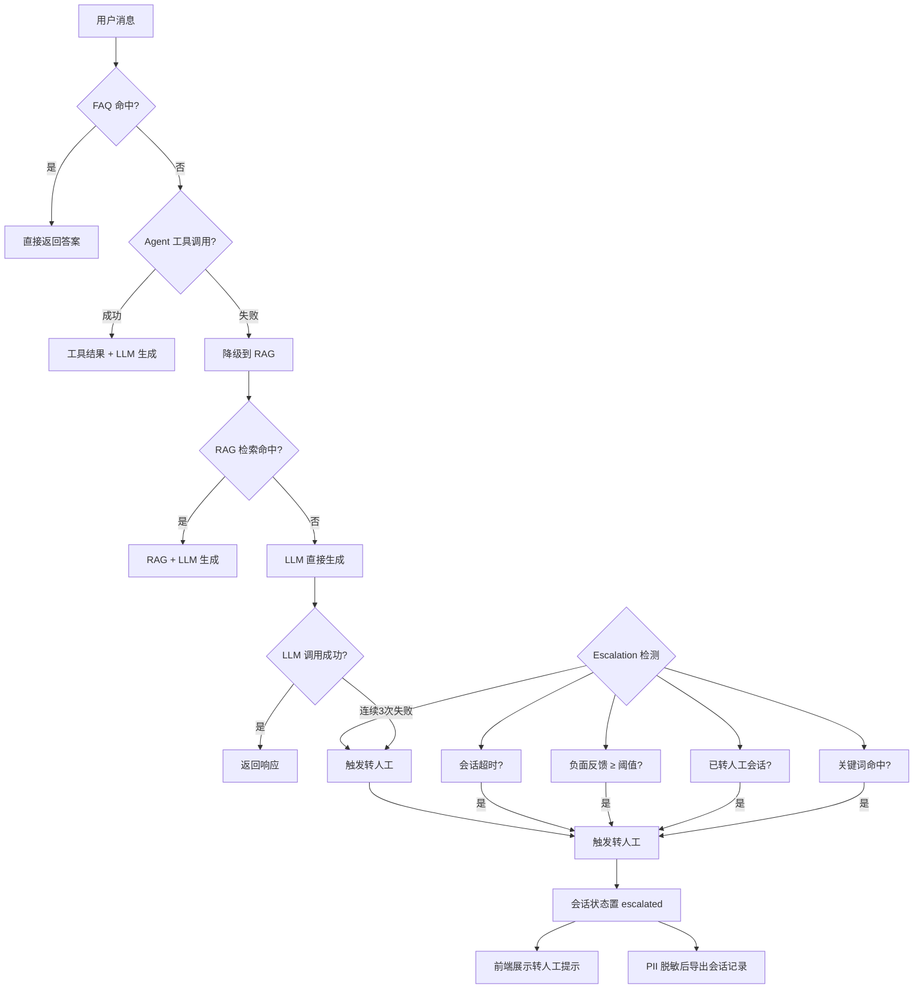

# 闲鱼猎人「客服配置」操作手册

| 属性     | 值                            |
| -------- | ----------------------------- |
| 文档版本 | v1.0                          |
| 文档日期 | 2026-07-05                    |
| 所属项目 | 闲鱼猎人                      |
| 所属菜单 | 配置管理 → 客服配置           |
| 文档类型 | 操作手册                      |
| 关联路由 | /config/chatbot               |
| 配套详细设计 | v2.0                      |
| 配套需求规格 | v1.0                      |
| 目标读者 | 运营 / 管理员                 |

---

## 目录

- [0. 阶段交接声明](#0-阶段交接声明)
- [1. 功能简介](#1-功能简介)
- [2. 入口与导航](#2-入口与导航)
- [3. 界面布局](#3-界面布局)
- [4. 操作指南](#4-操作指南)
  - [4.1 进入客服配置页面](#41-进入客服配置页面)
  - [4.2 基础配置（basic）](#42-基础配置basic)
  - [4.3 RAG 检索配置（rag）](#43-rag-检索配置rag)
  - [4.4 AGENT 工具配置（agent）](#44-agent-工具配置agent)
  - [4.5 知识库管理（kb）](#45-知识库管理kb)
  - [4.6 FAQ 管理（faq）](#46-faq-管理faq)
  - [4.7 转人工配置（escalation）](#47-转人工配置escalation)
  - [4.8 向量库维护（vector-admin）](#48-向量库维护vector-admin)
  - [4.9 审计日志查询（audit）](#49-审计日志查询audit)
- [5. 字段说明](#5-字段说明)
- [6. 常见问题 FAQ](#6-常见问题-faq)
- [7. 注意事项与限制](#7-注意事项与限制)
- [8. 关联功能](#8-关联功能)
- [9. 快捷键与技巧](#9-快捷键与技巧)
- [10. 修订记录](#10-修订记录)
- [11. 附录](#11-附录)

---

## 0. 阶段交接声明

```
- 当前阶段：客服配置操作手册编写（v1.0） ✅ 已完成
- 下一阶段：三份文档一致性校验
- 下一阶段智能体：主智能体
- 下一阶段技能：通用（无）
- 交接上下文：
  · 本手册面向运营/管理员，覆盖客服配置 8 个 Tab 的全部操作场景
  · 9 个操作指南：进入页面 / 基础配置 / RAG / Agent / 知识库 / FAQ / 转人工 / 向量库维护 / 审计日志
  · 18 个热更新 key（无需重启）+ 静态配置（需重启）区分说明
  · 14 条 FAQ + 10 条注意事项 + 6 个关联功能
  · 严格规避 API 路径/数据库表名/代码文件名等技术细节
  · 与详细设计 v2.0、需求规格 v1.0 完全对齐
```

---

## 1. 功能简介

「客服配置」是闲鱼猎人系统的**智能客服配置入口**，位于「配置管理」一级菜单下，是运营/管理员调整智能客服行为的核心页面。

通过本菜单，运营/管理员可以完成以下工作：

- **调整对话行为**：启用/停用智能客服、设置上下文历史轮数、会话超时时间
- **优化检索精度**：配置 RAG 检索的 top_k、相似度阈值、context 最大字符数
- **管理 Agent 工具**：启用/禁用工具调用、设置最大轮数与触发模式
- **维护知识库**：触发全量重建、查看版本列表、回滚到历史版本
- **维护 FAQ**：新增/编辑/删除常见问题，设置分类与启用状态
- **配置转人工**：设置点踩阈值、统计窗口、联系方式、PII 脱敏开关
- **维护向量库**：查看健康状况、修复损坏索引、清理孤儿快照
- **审计变更**：查询配置变更历史，追踪谁在何时改了什么

> **提示**：18 个配置项支持热更新（无需重启服务），静态配置（如 LLM 模型、知识库路径、Embedding 模型）需重启服务才能生效。详见 §5 字段说明的"热更新"列。

---

## 2. 入口与导航

### 2.1 菜单入口

客服配置位于系统左侧导航栏的「配置管理」分组下：

```
配置管理
  └── 客服配置   （图标：机器人头像，排序：第 106 位）
```

### 2.2 进入方式

| 方式 | 操作 | 说明 |
|------|------|------|
| 菜单点击 | 展开左侧「配置管理」→ 点击「客服配置」 | 默认入口，推荐 |
| 命令面板 | 按 `Ctrl+K` → 输入"客服"或"chatbot" → 选择对应命令 | 模糊搜索，支持任意关键词 |
| URL 直接访问 | 在浏览器地址栏输入 `/config/chatbot` | 刷新页面后自动恢复 |

### 2.3 页面结构

客服配置为单页面，无子页面跳转。所有配置通过 8 个 Tab 切换：

| Tab 名称 | 标识 | 主要用途 |
|----------|------|----------|
| 基础配置 | basic | 启用/历史轮数/会话超时 |
| RAG 检索 | rag | top_k/相似度阈值/context 字符 |
| AGENT 工具 | agent | 启用/最大轮数/触发模式 |
| 知识库管理 | kb | 状态/重建/版本回滚 |
| FAQ 管理 | faq | FAQ 增删改查 |
| 转人工 | escalation | 阈值/窗口/联系方式/脱敏 |
| 向量库维护 | vector-admin | 健康/修复/清理 |
| 审计日志 | audit | 变更历史查询 |

> **提示**：Tab 切换不会丢失未保存的修改，但建议修改后等待 500ms 防抖生效再切换，避免请求未完成。

---

## 3. 界面布局

### 3.1 整体布局

客服配置页面自上而下分为 3 个区域：

```
┌─────────────────────────────────────────────────────────────┐
│  页面标题：客服配置                                          │
├─────────────────────────────────────────────────────────────┤
│  Tab 页签栏：                                                │
│  [基础配置] [RAG检索] [AGENT工具] [知识库管理]               │
│  [FAQ管理] [转人工] [向量库维护] [审计日志]                  │
├─────────────────────────────────────────────────────────────┤
│  Tab 内容区（Card 容器）                                     │
│  ┌─────────────────────────────────────────────────────────┐ │
│  │  当前 Tab 的配置表单 / 列表 / 操作按钮                   │ │
│  └─────────────────────────────────────────────────────────┘ │
└─────────────────────────────────────────────────────────────┘
```

### 3.2 基础配置 Tab（basic）

```
┌─────────────────────────────────────────────────────────────┐
│  基础配置                                                    │
├─────────────────────────────────────────────────────────────┤
│  启用智能客服    [Switch 开关]   （总开关，关闭后对话不可用）│
│  历史轮数        [InputNumber]   1-20，默认 10               │
│  会话超时(分钟)  [InputNumber]   5-1440，默认 30             │
└─────────────────────────────────────────────────────────────┘
```

### 3.3 RAG 检索 Tab（rag）

```
┌─────────────────────────────────────────────────────────────┐
│  RAG 检索配置                                                │
├─────────────────────────────────────────────────────────────┤
│  top_k                [InputNumber]   1-20，默认 5           │
│  相似度阈值           [Slider]        0.0-1.0，默认 0.65     │
│  context 最大字符     [InputNumber]   500-32000，默认 8000   │
└─────────────────────────────────────────────────────────────┘
```

### 3.4 AGENT 工具 Tab（agent）

```
┌─────────────────────────────────────────────────────────────┐
│  AGENT 工具配置                                              │
├─────────────────────────────────────────────────────────────┤
│  启用工具       [Switch]    默认开启                         │
│  最大轮数       [InputNumber]   1-10，默认 3                 │
│  触发模式       [Radio]     function_calling / fallback      │
└─────────────────────────────────────────────────────────────┘
```

### 3.5 知识库管理 Tab（kb）

```
┌─────────────────────────────────────────────────────────────┐
│  知识库状态卡                                                │
│  当前版本：v20260705-143000    片段数：1250                  │
│  状态：ready / building / failed    上次构建：2026-07-05     │
│  [重建知识库]                                                │
├─────────────────────────────────────────────────────────────┤
│  定时自动更新    [Switch]    默认开启                        │
│  更新间隔(小时)  [InputNumber]   1-168，默认 6               │
├─────────────────────────────────────────────────────────────┤
│  重建记录（最近 5 条，从审计日志过滤）                        │
│  时间 / 动作（kb_rebuild/kb_rollback）/ 详情                 │
├─────────────────────────────────────────────────────────────┤
│  版本列表                                                    │
│  ┌──────────┬──────────┬──────────┬──────────┬──────────┐    │
│  │版本ID    │创建时间  │片段数    │状态      │操作      │    │
│  ├──────────┼──────────┼──────────┼──────────┼──────────┤    │
│  │ ...      │ ...      │ ...      │ ...      │[回滚]    │    │
│  └──────────┴──────────┴──────────┴──────────┴──────────┘    │
└─────────────────────────────────────────────────────────────┘
```

### 3.6 FAQ 管理 Tab（faq）

```
┌─────────────────────────────────────────────────────────────┐
│  [新增 FAQ]                                                 │
├─────────────────────────────────────────────────────────────┤
│  FAQ 列表                                                    │
│  ┌──────┬──────────┬──────────┬──────────┬──────┬──────────┐ │
│  │排序  │问题      │答案      │分类      │启用  │操作      │ │
│  ├──────┼──────────┼──────────┼──────────┼──────┼──────────┤ │
│  │ ...  │ ...      │ ...      │ ...      │[是/否]│[编辑][删除]│ │
│  └──────┴──────────┴──────────┴──────────┴──────┴──────────┘ │
└─────────────────────────────────────────────────────────────┘
```

### 3.7 转人工 Tab（escalation）

```
┌─────────────────────────────────────────────────────────────┐
│  转人工配置                                                  │
├─────────────────────────────────────────────────────────────┤
│  点踩阈值         [InputNumber]   1-10，默认 2               │
│  统计窗口(分钟)   [InputNumber]   5-1440，默认 30            │
│  联系方式         [Input]         空则显示"请联系管理员"      │
│  PII 脱敏         [Switch]        默认开启                    │
└─────────────────────────────────────────────────────────────┘
```

### 3.8 向量库维护 Tab（vector-admin）

```
┌─────────────────────────────────────────────────────────────┐
│  向量库维护面板（VectorAdminPanel）                          │
├─────────────────────────────────────────────────────────────┤
│  健康状况                                                    │
│  · 集合存在性 / 索引完整性 / 向量数量 / 存储大小             │
├─────────────────────────────────────────────────────────────┤
│  操作                                                       │
│  [修复索引]   [清理孤儿快照]   [刷新状态]                   │
├─────────────────────────────────────────────────────────────┤
│  操作日志（最近维护记录）                                    │
└─────────────────────────────────────────────────────────────┘
```

### 3.9 审计日志 Tab（audit）

```
┌─────────────────────────────────────────────────────────────┐
│  [刷新]    筛选：[动作下拉] [数量]                          │
├─────────────────────────────────────────────────────────────┤
│  审计日志列表                                                │
│  ┌──────────┬──────────┬──────────┬──────────┬──────────┐    │
│  │时间      │动作      │目标      │来源      │详情      │    │
│  ├──────────┼──────────┼──────────┼──────────┼──────────┤    │
│  │ ...      │ ...      │ ...      │ ...      │hash值    │    │
│  └──────────┴──────────┴──────────┴──────────┴──────────┘    │
└─────────────────────────────────────────────────────────────┘
```

---

## 4. 操作指南

### 4.1 进入客服配置页面

#### 操作步骤

1. 登录闲鱼猎人系统
2. 在左侧导航栏展开「配置管理」分组
3. 点击「客服配置」菜单项
4. 页面加载，默认显示「基础配置」Tab

#### 操作结果

- 进入客服配置页面，显示 8 个 Tab 页签
- 默认展示「基础配置」Tab，显示当前生效的配置值
- 配置值来源：YAML 基线 + DB 热更新覆盖（合并后的最终值）

> **提示**：如果页面显示"智能客服模块未启用或加载失败"，说明智能客服后端未启动。请检查服务状态或联系管理员。

---

### 4.2 基础配置（basic）

#### 操作步骤

1. 进入客服配置页面，默认显示「基础配置」Tab
2. 修改以下任一配置：
   - **启用智能客服**：点击 Switch 开关切换启用/停用
   - **历史轮数**：在 InputNumber 中输入 1-20 的整数
   - **会话超时(分钟)**：在 InputNumber 中输入 5-1440 的整数
3. 修改后 500ms 自动保存（按 key 防抖，避免高频请求）
4. 保存成功后无需重启服务，立即生效

#### 参数说明

| 参数 | 含义 | 取值范围 | 默认值 | 热更新 |
|------|------|----------|--------|--------|
| 启用智能客服 | 智能客服总开关 | 开/关 | 开 | 是 |
| 历史轮数 | 上下文历史最大轮数 | 1-20 | 10 | 是 |
| 会话超时(分钟) | 会话空闲超时时间 | 5-1440 | 30 | 是 |

#### 操作结果

- 配置立即生效，下一次对话即应用新配置
- 审计日志 Tab 会记录本次变更（仅存 hash，不存明文）

> **提示**：关闭「启用智能客服」后，所有对话接口将返回 403 错误，前端会显示"智能客服未启用"。请谨慎关闭。

> **警告**：会话超时设置过短（如 5 分钟）会导致用户频繁被踢出会话；设置过长（如 1440 分钟=1天）会增加内存占用。建议保持默认 30 分钟。

---

### 4.3 RAG 检索配置（rag）

#### 操作步骤

1. 进入客服配置页面，点击「RAG 检索」Tab
2. 修改以下任一配置：
   - **top_k**：在 InputNumber 中输入 1-20，控制检索返回的片段数量
   - **相似度阈值**：拖动 Slider 在 0.0-1.0 之间调整，低于此值的片段被丢弃
   - **context 最大字符**：在 InputNumber 中输入 500-32000
3. 修改后 500ms 自动保存（Slider 拖动期间多次 onChange，仅最后一次触发 PUT）

#### 参数说明

| 参数 | 含义 | 取值范围 | 默认值 | 热更新 |
|------|------|----------|--------|--------|
| top_k | 检索返回的片段数量 | 1-20 | 5 | 是 |
| 相似度阈值 | 低于此值的片段丢弃 | 0.0-1.0 | 0.65 | 是 |
| context 最大字符 | context 超出则丢弃最低相似度片段 | 500-32000 | 8000 | 是 |

#### 操作结果

- 配置立即生效，下一次对话的检索行为按新参数执行
- 审计日志记录变更

> **提示**：提高相似度阈值（如从 0.65 提到 0.85）会提高检索精度但可能减少命中片段；降低阈值（如降到 0.5）会增加召回但可能引入噪音。建议先在测试环境验证。

> **提示**：top_k 过大会增加 LLM 调用的 token 消耗；过小可能漏掉相关信息。常用值 3-8。

---

### 4.4 AGENT 工具配置（agent）

#### 操作步骤

1. 进入客服配置页面，点击「AGENT 工具」Tab
2. 修改以下任一配置：
   - **启用工具**：点击 Switch 开关，控制是否启用 Agent 工具调用
   - **最大轮数**：在 InputNumber 中输入 1-10，控制工具调用最大轮数
   - **触发模式**：在 Radio 中选择 function_calling 或 fallback
3. 修改后 500ms 自动保存

#### 参数说明

| 参数 | 含义 | 取值范围 | 默认值 | 热更新 |
|------|------|----------|--------|--------|
| 启用工具 | 是否启用 Agent 工具调用 | 开/关 | 开 | 是 |
| 最大轮数 | 工具调用最大轮数 | 1-10 | 3 | 是 |
| 触发模式 | 工具触发模式 | function_calling / fallback | function_calling | 是 |

#### 触发模式说明

| 模式 | 名称 | 行为 | 适用场景 |
|------|------|------|----------|
| function_calling | 函数调用模式 | LLM 主动决定是否调用工具，更智能 | 支持 function_calling 的 LLM（如 GPT-4o） |
| fallback | 兜底模式 | LLM 不支持 function_calling 时的降级方案 | 旧模型或开源模型 |

#### 操作结果

- 配置立即生效，下一次对话的 Agent 行为按新参数执行
- 审计日志记录变更

> **提示**：关闭「启用工具」后，对话将不调用任何工具，直接走 LLM → RAG → 转人工 降级链。工具调用失败也会自动降级，不会中断对话。

> **警告**：最大轮数设置过大（如 10）会增加单次对话延迟与 token 消耗；设置过小（如 1）可能无法完成多步查询。建议保持默认 3。

---

### 4.5 知识库管理（kb）

#### 4.5.1 查看知识库状态

#### 操作步骤

1. 进入客服配置页面，点击「知识库管理」Tab
2. 顶部「知识库状态卡」显示当前状态：
   - **当前版本**：知识库当前版本号
   - **片段数**：当前知识库的文档分片数量
   - **状态**：ready（就绪）/ building（构建中）/ failed（失败）
   - **上次构建时间**：最近一次构建的时间戳
3. 若状态为 building，页面每 2 秒自动刷新状态，构建完成后整体刷新

#### 4.5.2 触发知识库重建

#### 操作步骤

1. 在「知识库状态卡」点击「重建知识库」按钮
2. 弹出确认对话框，提示重建期间对话功能可能受影响
3. 点击「确认」开始重建
4. 状态变为 building，页面每 2 秒轮询进度
5. 构建完成后状态变为 ready，版本列表与审计日志自动刷新

#### 参数说明

| 参数 | 含义 | 取值 |
|------|------|------|
| 构建方式 | 全量重建（两阶段提交） | 阶段1导出快照，阶段2失败可回滚 |
| 后台执行 | 异步执行，不阻塞页面 | 构建期间可切换其他 Tab |
| 失败回滚 | 失败率 >50% 自动回滚 | 状态记为 failed 并恢复上一版本 |

#### 操作结果

- 知识库重新扫描文档、分块、生成向量
- 新版本添加到版本列表顶部
- 审计日志记录 kb_rebuild 动作

> **警告**：重建期间对话功能可能短暂不可用（向量库索引切换中）。建议在低峰期执行重建。

> **提示**：重建是幂等操作，失败会自动回滚到上一版本，不会导致向量库损坏。

#### 4.5.3 配置定时自动更新

#### 操作步骤

1. 在「知识库管理」Tab 找到「定时自动更新」配置区
2. 切换 Switch 开关启用/停用定时更新
3. 在「更新间隔(小时)」InputNumber 中输入 1-168

#### 参数说明

| 参数 | 含义 | 取值范围 | 默认值 | 热更新 |
|------|------|----------|--------|--------|
| 定时自动更新 | 是否启用定时全量重建 | 开/关 | 开 | 是 |
| 更新间隔(小时) | 自动重建间隔 | 1-168 | 6 | 是 |

#### 操作结果

- 配置立即生效，调度器按新间隔执行定时重建
- 审计日志记录变更

> **提示**：更新间隔过短（如 1 小时）会增加系统负载；过长（如 168 小时=7天）可能导致知识库内容陈旧。建议根据文档更新频率设置，常用 6-24 小时。

#### 4.5.4 回滚知识库版本

#### 操作步骤

1. 在「知识库管理」Tab 的「版本列表」中找到目标版本
2. 点击该版本行的「回滚」按钮
3. 弹出确认对话框，提示"回滚期间对话功能短暂不可用"
4. 点击「确认」执行回滚
5. 回滚完成后，当前版本变更为目标版本，审计日志记录 kb_rollback 动作

#### 参数说明

| 参数 | 含义 | 取值 |
|------|------|------|
| 可回滚版本 | 版本列表中的任意历史版本 | 不限 |
| 回滚方式 | 恢复快照（两阶段提交） | 路径参数传递版本 ID |
| 回滚影响 | 对话功能短暂不可用 | 向量库索引切换中 |

#### 操作结果

- 当前版本变更为目标版本
- 知识库状态卡更新
- 审计日志记录 kb_rollback 动作

> **提示**：回滚是恢复上一版本的最快方式。如果最新构建后回答质量下降，可回滚到上一个 ready 状态的版本。

> **警告**：回滚期间对话功能短暂不可用，请确保无活跃对话时执行。

---

### 4.6 FAQ 管理（faq）

#### 4.6.1 查看 FAQ 列表

#### 操作步骤

1. 进入客服配置页面，点击「FAQ 管理」Tab
2. 显示所有 FAQ 列表，包含排序、问题、答案、分类、启用状态、操作按钮
3. 可按排序字段排序，便于维护

#### 4.6.2 新增 FAQ

#### 操作步骤

1. 在「FAQ 管理」Tab 点击「新增 FAQ」按钮
2. 弹出 FAQ 编辑弹窗
3. 填写以下字段：
   - **问题**：1-500 字符
   - **答案**：1-2000 字符
   - **分类**：≤50 字符（如"账号"、"支付"、"物流"）
   - **启用**：Switch 开关，默认启用
   - **排序**：数字，控制展示顺序
4. 点击「保存」提交

#### 参数说明

| 参数 | 含义 | 取值范围 | 必填 |
|------|------|----------|------|
| 问题 | FAQ 问题文本 | 1-500 字符 | 是 |
| 答案 | FAQ 答案文本 | 1-2000 字符 | 是 |
| 分类 | FAQ 分类标签 | ≤50 字符 | 否 |
| 启用 | 是否启用 | 是/否 | 是 |
| 排序 | 展示顺序 | 整数 | 是 |

#### 操作结果

- FAQ 添加成功，列表中出现新项
- FAQMatcher 有 5 分钟 TTL 缓存，新 FAQ 最多 5 分钟内生效

> **提示**：如果想立即生效，可重启服务或等待缓存自然过期。

#### 4.6.3 编辑 FAQ

#### 操作步骤

1. 在 FAQ 列表找到目标 FAQ
2. 点击「编辑」按钮
3. 弹出编辑弹窗，表单预填当前值
4. 修改需要调整的字段
5. 点击「保存」提交

#### 操作结果

- FAQ 更新成功，列表显示新值
- FAQMatcher 缓存最多 5 分钟后刷新

#### 4.6.4 删除 FAQ

#### 操作步骤

1. 在 FAQ 列表找到目标 FAQ
2. 点击「删除」按钮
3. 弹出确认对话框
4. 点击「确认」删除

#### 操作结果

- FAQ 从列表中消失
- FAQMatcher 缓存最多 5 分钟后刷新

> **提示**：如需临时停用 FAQ 而不删除，可在编辑弹窗中关闭「启用」开关，停用的 FAQ 不会被匹配。

#### 4.6.5 FAQ 匹配机制说明

FAQ 匹配遵循以下规则：

| 阈值 | 行为 |
|------|------|
| 相似度 ≥ `similarity_threshold`（默认 0.85） | 直接返回答案 |
| `confirm_threshold` ~ `similarity_threshold`（默认 0.65-0.85） | 需用户确认后返回 |
| 低于 `confirm_threshold` | 不匹配，进入 RAG 流程 |

> **提示**：阈值可在「FAQ 管理」Tab 顶部配置（实际位于配置 key `faq.similarity_threshold` 与 `faq.confirm_threshold`，热更新）。

---

### 4.7 转人工配置（escalation）

#### 操作步骤

1. 进入客服配置页面，点击「转人工」Tab
2. 修改以下任一配置：
   - **点踩阈值**：在 InputNumber 中输入 1-10，统计窗口内达到此值触发转人工
   - **统计窗口(分钟)**：在 InputNumber 中输入 5-1440，点踩统计的时间窗口
   - **联系方式**：在 Input 中输入转人工联系方式（如"QQ群 123456"），空则显示"请联系管理员"
   - **PII 脱敏**：Switch 开关，控制转人工消息与导出会话记录是否脱敏
3. 修改后 500ms 自动保存

#### 参数说明

| 参数 | 含义 | 取值范围 | 默认值 | 热更新 |
|------|------|----------|--------|--------|
| 点踩阈值 | 触发转人工的点踩次数 | 1-10 | 2 | 是 |
| 统计窗口(分钟) | 点踩统计时间窗口 | 5-1440 | 30 | 是 |
| 联系方式 | 转人工联系方式 | 文本 | 空 | 是 |
| PII 脱敏 | 是否脱敏 PII | 开/关 | 开 | 是 |

#### 转人工触发条件

系统检测到以下任一条件即触发转人工：

| 条件 | 说明 |
|------|------|
| 关键词命中 | 用户消息包含"人工"、"客服"等关键词 |
| 已转人工会话再次进入 | 防止重复自动回复 |
| 负面反馈数 ≥ 阈值 | 统计窗口内点踩数达到 `点踩阈值` |
| 会话超时 | 超过 `会话超时(分钟)` 配置 |
| 连续 3 次 LLM 调用失败 | 兜底降级 |

#### 操作结果

- 配置立即生效，下一次对话的转人工判定按新参数执行
- 审计日志记录变更（联系方式仅存 hash，不存明文）

> **提示**：PII 脱敏开启后，转人工消息与导出会话记录会替换手机号、身份证号、邮箱、API Key 等为 `<REDACTED>`，保护用户隐私。

> **提示**：联系方式为空时，前端显示"请联系管理员"。建议填写具体联系方式（如 QQ 群、微信、邮箱）方便用户联系。

---

### 4.8 向量库维护（vector-admin）

#### 4.8.1 查看向量库健康状况

#### 操作步骤

1. 进入客服配置页面，点击「向量库维护」Tab
2. 顶部「健康状况」区域显示：
   - **集合存在性**：ChromaDB 集合是否存在
   - **索引完整性**：索引是否损坏
   - **向量数量**：当前向量总数
   - **存储大小**：向量库占用磁盘空间
3. 点击「刷新状态」可手动刷新

#### 4.8.2 修复损坏索引

#### 操作步骤

1. 在「向量库维护」Tab 点击「修复索引」按钮
2. 弹出确认对话框，提示修复期间对话功能可能受影响
3. 点击「确认」开始修复
4. 修复完成后状态更新，操作日志记录本次维护

#### 操作结果

- 损坏的索引被修复
- 向量数量与存储大小更新
- 操作日志记录维护动作

> **提示**：索引修复通常在索引完整性检测失败时执行。常规情况下无需手动修复。

#### 4.8.3 清理孤儿快照

#### 操作步骤

1. 在「向量库维护」Tab 点击「清理孤儿快照」按钮
2. 弹出确认对话框，提示将清理不再被任何版本引用的快照
3. 点击「确认」开始清理
4. 清理完成后存储大小更新

#### 参数说明

| 参数 | 含义 | 取值 |
|------|------|------|
| 孤儿快照 | 不再被任何版本引用的快照 | 自动检测 |
| 快照保留上限 | `snapshot_max_keep`（默认 10） | 超过上限时自动清理最旧 |

#### 操作结果

- 孤儿快照被清理，释放磁盘空间
- 操作日志记录维护动作

> **提示**：清理孤儿快照是安全的维护操作，不会影响当前版本与历史版本。建议定期执行以释放磁盘。

> **警告**：向量库维护操作期间对话功能可能短暂不可用，建议在低峰期执行。

---

### 4.9 审计日志查询（audit）

#### 操作步骤

1. 进入客服配置页面，点击「审计日志」Tab
2. 默认显示最近 50 条审计日志
3. 可通过筛选条件缩小范围：
   - **动作**：下拉选择特定动作（如 config_update / kb_rebuild / kb_rollback / faq_upsert / faq_delete）
   - **数量**：设置返回条数
4. 点击「刷新」按钮重新加载

#### 审计日志字段说明

| 字段 | 含义 | 示例 |
|------|------|------|
| 时间 | 变更发生的时间戳 | 2026-07-05 14:30:00 |
| 动作 | 变更类型 | config_update / kb_rebuild / kb_rollback |
| 目标 | 变更对象的标识 | 配置 key / FAQ id / 版本 id |
| 来源 | 变更发起方 | web（页面操作）/ scheduler（调度器）/ system（系统） |
| 详情 | 变更详情（hash 值） | sha256 哈希，不存明文 |

#### 操作结果

- 显示符合条件的审计日志列表
- 按时间倒序排列

> **提示**：审计日志仅存 sha256 hash 不存明文，这是敏感字段保护措施。例如联系方式、欢迎语等可能含个人信息的字段，hash 后可审计变更但不泄露内容。

> **提示**：「知识库管理」Tab 的"重建记录"区域是从审计日志中过滤 `kb_rebuild` / `kb_rollback` 动作按时间倒序取前 5 条展示。

---

## 5. 字段说明

### 5.1 热更新配置（18 个 key，无需重启）

以下配置项修改后 500ms 自动保存，立即生效：

| 配置项 | 所属 Tab | 取值范围 | 默认值 | 说明 |
|--------|----------|----------|--------|------|
| 启用智能客服 | 基础配置 | 开/关 | 开 | 智能客服总开关 |
| 历史轮数 | 基础配置 | 1-20 | 10 | 上下文历史最大轮数 |
| 会话超时(分钟) | 基础配置 | 5-1440 | 30 | 会话空闲超时 |
| RAG top_k | RAG 检索 | 1-20 | 5 | 检索返回片段数 |
| RAG 相似度阈值 | RAG 检索 | 0.0-1.0 | 0.65 | 低于此值丢弃 |
| RAG context 最大字符 | RAG 检索 | 500-32000 | 8000 | context 上限 |
| Agent 启用工具 | AGENT 工具 | 开/关 | 开 | 是否启用工具调用 |
| Agent 最大轮数 | AGENT 工具 | 1-10 | 3 | 工具调用最大轮数 |
| Agent 触发模式 | AGENT 工具 | function_calling/fallback | function_calling | 工具触发方式 |
| KB 定时自动更新 | 知识库管理 | 开/关 | 开 | 是否定时重建 |
| KB 更新间隔(小时) | 知识库管理 | 1-168 | 6 | 自动重建间隔 |
| FAQ 相似度阈值 | FAQ 管理 | 0.0-1.0 | 0.85 | 直接返回阈值 |
| FAQ 确认阈值 | FAQ 管理 | 0.0-1.0 | 0.65 | 确认区间下限 |
| Escalation 联系方式 | 转人工 | 文本 | 空 | 转人工联系方式 |
| Escalation 点踩阈值 | 转人工 | 1-10 | 2 | 触发转人工次数 |
| Escalation 统计窗口(分钟) | 转人工 | 5-1440 | 30 | 点踩统计窗口 |
| Escalation PII 脱敏 | 转人工 | 开/关 | 开 | 是否脱敏 PII |
| 欢迎语 | 基础配置 | 文本 | 默认欢迎语 | M1 引导卡数据源 |

### 5.2 静态配置（需重启服务）

以下配置项需修改 YAML 配置文件并重启服务才能生效：

| 配置项 | 说明 | 修改方式 |
|--------|------|----------|
| LLM 模型 | OpenAI 模型名（如 gpt-4o-mini） | 修改 `config/config.yaml` |
| LLM 视觉模型 | 多模态视觉模型名 | 修改 `config/config.yaml` |
| LLM 温度 | 采样温度 0-2 | 修改 `config/config.yaml` |
| LLM max_tokens | 单次回复最大 token | 修改 `config/config.yaml` |
| LLM 超时 | HTTP 总超时 / 首 token 超时 | 修改 `config/config.yaml` |
| KB 文档扫描路径 | 知识库扫描的目录列表 | 修改 `config/config.yaml` |
| KB Embedding 并发数 | Embedding 并发数 | 修改 `config/config.yaml` |
| KB Embedding 模型 | Embedding 模型名 | 修改 `config/config.yaml` 或 `.env` |
| KB 向量维度 | 向量维度 | 修改 `config/config.yaml` |
| KB 分块字符数 | 分块大小 | 修改 `config/config.yaml` |
| KB 分块重叠字符数 | 分块重叠 | 修改 `config/config.yaml` |
| KB 快照保留上限 | 快照保留数量 | 修改 `config/config.yaml` |
| KB ChromaDB 路径 | ChromaDB 持久化路径 | 修改 `config/config.yaml` |
| KB ChromaDB 集合名 | ChromaDB 集合名 | 修改 `config/config.yaml` |
| KB 项目根目录 | 知识库扫描项目根 | 修改 `config/config.yaml` |
| Embedding 后端 | 本地 / 远程 | 修改 `.env` 的 `EMBEDDING_BASE_URL` |

> **提示**：静态配置涉及模型加载、向量库初始化等重资源操作，不支持热更新。修改后需重启服务生效。

### 5.3 FAQ 字段说明

| 字段 | 含义 | 长度限制 | 必填 |
|------|------|----------|------|
| 问题 | FAQ 问题文本 | 1-500 字符 | 是 |
| 答案 | FAQ 答案文本 | 1-2000 字符 | 是 |
| 分类 | FAQ 分类标签 | ≤50 字符 | 否 |
| 启用 | 是否启用 | 是/否 | 是 |
| 排序 | 展示顺序 | 整数 | 是 |

### 5.4 审计日志动作类型

| 动作 | 含义 | 来源 |
|------|------|------|
| config_update | 配置项更新 | web（页面操作） |
| kb_rebuild | 知识库重建 | web / scheduler |
| kb_rollback | 知识库版本回滚 | web |
| faq_upsert | FAQ 新增/更新 | web |
| faq_delete | FAQ 删除 | web |

---

## 6. 常见问题 FAQ

### Q1：哪些配置可以热更新？哪些需要重启？

**A**：18 个配置项支持热更新（见 §5.1），包括启用开关、历史轮数、RAG 参数、Agent 参数、KB 自动更新、FAQ 阈值、转人工参数、欢迎语。静态配置（需重启）：LLM 模型、知识库路径、Embedding 模型与维度、分块参数、ChromaDB 路径与集合等（见 §5.2）。

### Q2：修改配置后多久生效？

**A**：热更新配置修改后 500ms 自动保存（按 key 防抖），保存后立即生效，下一次对话即应用新配置。无需重启服务。FAQ 修改因 FAQMatcher 5 分钟 TTL 缓存，最多 5 分钟内生效。

### Q3：为什么 Slider 拖动时只发一次请求？

**A**：按 key 防抖 500ms 机制。Slider 拖动会触发多次 onChange，500ms 内连续修改只发最后一次 PUT 请求，避免洪水请求。本地状态即时更新避免 UI 回弹。

### Q4：关闭「启用智能客服」会怎样？

**A**：所有对话接口返回 403 错误，前端显示"智能客服未启用"。已存在的会话不受影响（仍可查看历史），但无法发起新对话。重新启用后立即恢复。

### Q5：FAQ 修改后多久生效？

**A**：FAQMatcher 有 5 分钟 TTL 缓存，更新后最多 5 分钟内生效。如果想立即生效，可以重启服务或等待缓存自然过期。

### Q6：知识库重建会中断对话吗？

**A**：会短暂中断。重建期间向量库索引切换中，对话功能可能不可用。前端会弹出确认对话框提示"重建期间对话功能可能受影响"。建议在低峰期执行重建。重建是幂等操作，失败会自动回滚到上一版本。

### Q7：知识库回滚会怎样？

**A**：回滚会将当前版本切换到目标历史版本，回滚期间对话功能短暂不可用（向量库索引切换中）。前端会弹出确认对话框提示"回滚期间对话功能短暂不可用"。回滚完成后审计日志记录 kb_rollback 动作。

### Q8：转人工触发条件有哪些？

**A**：5 个触发条件（任一命中即触发）：(1) 关键词命中（用户喊"人工"）；(2) 已转人工会话再次进入；(3) 负面反馈数 ≥ 点踩阈值（统计窗口内）；(4) 会话超时；(5) 连续 3 次 LLM 调用失败。

### Q9：联系方式为空时怎么显示？

**A**：联系方式为空时，转人工提示显示"请联系管理员"。建议填写具体联系方式（如"QQ群 123456"、"微信 xxx"），方便用户联系人工客服。

### Q10：PII 脱敏是什么意思？

**A**：开启后，转人工消息与导出会话记录会替换 PII（个人身份信息）为 `<REDACTED>`，包括手机号、身份证号、邮箱、OpenAI API Key 等。保护用户隐私，避免敏感信息泄露给客服或记录到日志。

### Q11：向量库维护 Tab 的"清理孤儿快照"安全吗？

**A**：安全。孤儿快照是不再被任何版本引用的快照，清理不会影响当前版本与历史版本。系统也有 `snapshot_max_keep`（默认 10）上限，超过时自动清理最旧的。建议定期执行以释放磁盘。

### Q12：审计日志为什么不显示明文值？

**A**：审计日志仅存 sha256 hash 不存明文，这是敏感字段保护措施。例如联系方式、欢迎语等可能含手机号/QQ 等个人信息，hash 后可审计变更（比对 hash 判断是否变更）但不泄露内容。

### Q13：配置修改失败怎么办？

**A**：配置修改 PUT 失败时，前端会自动重新加载配置（GET 最新值），回滚本地状态。请检查网络连接与服务状态后重试。如持续失败，请查看实时日志菜单排查。

### Q14：Agent 工具调用失败会影响对话吗？

**A**：不会中断对话。工具失败时统一转换为错误事件，由编排器决定降级路径（LLM → RAG → 转人工）。工具不存在/已禁用、工具超时、工具内部异常都返回失败结果，自动降级确保对话连续性。

---

## 7. 注意事项与限制

### 7.1 热更新 vs 静态配置

18 个配置项支持热更新（无需重启），静态配置（LLM 模型、知识库路径、Embedding 模型、分块参数、ChromaDB 路径等）需修改 YAML 配置文件并重启服务。修改静态配置前请备份 `config/config.yaml`。

### 7.2 按 key 防抖 500ms

配置修改后 500ms 自动保存，同一 key 连续修改只发最后一次请求。请勿快速切换 Tab 或刷新页面，避免请求未完成。Slider 拖动期间多次 onChange，仅最后一次触发 PUT。

### 7.3 FAQ 5 分钟缓存

FAQMatcher 有 5 分钟 TTL 缓存，FAQ 增删改后最多 5 分钟内生效。如需立即生效，可重启服务或等待缓存自然过期。停用 FAQ（关闭启用开关）也会受缓存影响。

### 7.4 知识库重建期间影响

重建期间对话功能可能短暂不可用（向量库索引切换中）。建议在低峰期执行重建。重建是幂等操作，失败会自动回滚到上一版本。重建后台异步执行，不阻塞页面操作。

### 7.5 知识库回滚影响

回滚期间对话功能短暂不可用。请确保无活跃对话时执行回滚。回滚后当前版本变更为目标历史版本，审计日志记录动作。

### 7.6 转人工阈值设置

点踩阈值设置过低（如 1）会导致用户一次点踩即触发转人工，可能过度转人工；设置过高（如 10）可能导致负面反馈累积过久才转人工。建议保持默认 2，并根据实际转人工率调整。

### 7.7 PII 脱敏默认开启

PII 脱敏默认开启，转人工消息与导出会话记录会替换敏感信息为 `<REDACTED>`。关闭脱敏可能导致手机号、邮箱等泄露给客服，请谨慎关闭。

### 7.8 审计日志不存明文

审计日志仅存 sha256 hash 不存明文，无法直接查看变更前后的值。如需查看具体变更，请对比当前配置与历史配置（YAML 基线）。

### 7.9 向量库维护操作影响

向量库维护操作（修复索引、清理孤儿快照）期间对话功能可能短暂不可用。建议在低峰期执行。操作前请确认无活跃对话。

### 7.10 配置值长度限制

`value` 字段最大 1000 字符，超长会返回 422 错误。大多数配置值（阈值、轮数、联系方式、欢迎语）远小于 1000 字符。如需更长的欢迎语，请拆分为多段或精简内容。

---

## 8. 关联功能

客服配置与以下菜单存在联动关系：

| 关联菜单 | 联动关系 | 说明 |
|----------|----------|------|
| 智能客服对话 | 配置驱动 | 客服配置的所有参数驱动智能客服对话行为，包括 FAQ 匹配、RAG 检索、Agent 工具、转人工判定 |
| 系统配置 | 全局默认 | 客服配置的 YAML 基线在 `config/config.yaml` 中定义，与系统配置菜单的全局设置互补 |
| 实时日志 | 运行监控 | 智能客服运行时的日志（FAQ 命中、RAG 检索、Agent 工具调用、转人工触发）在实时日志菜单查看 |
| 反爬登录管理 | 前置依赖 | 智能客服的 Agent 工具（如查询任务状态）依赖闲鱼登录态，登录态失效时工具调用会失败 |
| 任务管理 | 工具数据源 | Agent 工具 `GetTaskStatusTool` / `GetEvalScoreTool` 查询任务管理的数据 |
| 系统配置 | 错误日志数据源 | Agent 工具 `GetErrorLogsTool` 查询系统错误日志 |

> **提示**：客服配置是智能客服行为的核心入口，理解配置与对话行为的关联有助于高效调优。

---

## 9. 快捷键与技巧

### 9.1 快捷键

| 快捷键 | 作用 | 备注 |
|--------|------|------|
| `Ctrl+K`（或 `⌘+K`） | 打开命令面板 | 可模糊搜索任意菜单或命令 |
| `Escape` | 关闭命令面板 / 弹窗 | 仅在弹窗打开时生效 |
| `Tab` / `Shift+Tab` | 表单字段间切换焦点 | InputNumber / Input / Switch 通用 |

> 输入框、文本域、下拉框内不触发全局快捷键，避免干扰正常输入。

### 9.2 实用技巧

**技巧 1：热更新即时调优**

RAG 检索精度不满意时，直接拖动「相似度阈值」Slider 调整，500ms 后立即生效。无需重启服务，下一次对话即用新阈值。可结合实时日志观察检索命中情况。

**技巧 2：FAQ 分类管理**

为 FAQ 设置分类（如"账号"、"支付"、"物流"），便于按类别维护。FAQ 量多时，分类能快速定位目标 FAQ。

**技巧 3：知识库低峰期重建**

知识库重建期间对话功能可能短暂不可用，建议在低峰期（如夜间）执行。也可启用「定时自动更新」，系统按配置间隔自动重建，无需人工干预。

**技巧 4：回滚快速恢复**

最新知识库构建后回答质量下降时，无需重新构建，直接在版本列表找到上一个 ready 状态的版本点击「回滚」，几秒内恢复。

**技巧 5：转人工联系方式明确化**

「联系方式」字段填写具体联系方式（如"QQ群 123456"、"微信 xxx"），避免空值显示"请联系管理员"。配合 PII 脱敏保护用户隐私。

**技巧 6：审计日志追踪变更**

配置被误改时，到「审计日志」Tab 按动作筛选 `config_update`，查看变更时间与目标 key，快速定位问题。

**技巧 7：向量库定期维护**

定期在「向量库维护」Tab 执行「清理孤儿快照」，释放磁盘空间。索引完整性检测失败时执行「修复索引」。

**技巧 8：FAQ 临时停用**

FAQ 暂时不想删除但不想被匹配时，在编辑弹窗关闭「启用」开关，停用的 FAQ 不会被匹配（5 分钟缓存生效后）。

---

## 10. 修订记录

| 版本 | 日期 | 修订人 | 修订内容 |
|------|------|--------|----------|
| v1.0 | 2026-07-05 | 客服配置文档编写 | 初版操作手册，覆盖 8 个 Tab 的 9 个操作场景、18 个热更新 key + 16 类静态配置说明、14 条 FAQ、10 条注意事项、6 个关联功能、快捷键与技巧、Tab 布局图与转人工触发条件表。严格规避 API 路径/数据库表名/代码文件名等技术细节。 |

---

## 11. 附录

### 11.1 客服配置 Tab 总览

| Tab | 标识 | 主要功能 | 热更新 key 数 |
|-----|------|----------|---------------|
| 基础配置 | basic | 启用/历史轮数/会话超时/欢迎语 | 4 |
| RAG 检索 | rag | top_k/相似度阈值/context 字符 | 3 |
| AGENT 工具 | agent | 启用/最大轮数/触发模式 | 3 |
| 知识库管理 | kb | 状态/重建/版本回滚/定时更新 | 2 |
| FAQ 管理 | faq | FAQ CRUD + 阈值配置 | 2 |
| 转人工 | escalation | 阈值/窗口/联系方式/脱敏 | 4 |
| 向量库维护 | vector-admin | 健康/修复/清理 | 0 |
| 审计日志 | audit | 变更历史查询 | 0 |
| **合计** | — | — | **18** |

### 11.2 热更新 vs 静态配置对比

| 维度 | 热更新配置 | 静态配置 |
|------|------------|----------|
| **修改方式** | 页面 UI 修改，500ms 自动保存 | 修改 `config/config.yaml` 或 `.env` |
| **生效方式** | 立即生效，下一次对话应用 | 重启服务后生效 |
| **存储位置** | DB（动态覆盖值） | YAML（基线） |
| **配置项数** | 18 个 key | 16+ 类 |
| **审计日志** | 记录（hash） | 不记录（YAML 文件版本控制） |
| **典型场景** | 阈值调整、开关切换、联系方式更新 | LLM 模型更换、知识库路径调整、Embedding 模型切换 |

### 11.3 转人工触发条件与降级链



**触发条件说明**：

| 条件 | 检测时机 | 说明 |
|------|----------|------|
| 关键词命中 | 每条用户消息 | 用户喊"人工"、"客服"等关键词 |
| 已转人工会话再次进入 | 会话进入时 | 状态已是 escalated，防止重复自动回复 |
| 负面反馈数 ≥ 阈值 | 反馈提交时 | 统计窗口内点踩数达到 `点踩阈值` |
| 会话超时 | 定时检测 | 超过 `会话超时(分钟)` 配置 |
| 连续 3 次 LLM 调用失败 | LLM 调用后 | 兜底降级，确保对话不卡死 |

### 11.4 文档结束

本手册（v1.0）为「配置管理 → 客服配置」二级菜单的操作手册，与 [客服配置-详细设计.md](客服配置-详细设计.md)（v2.0）、[客服配置-需求规格.md](客服配置-需求规格.md)（v1.0）配套使用。如需修改本手册，请同步更新配套文档并保持一致性。
