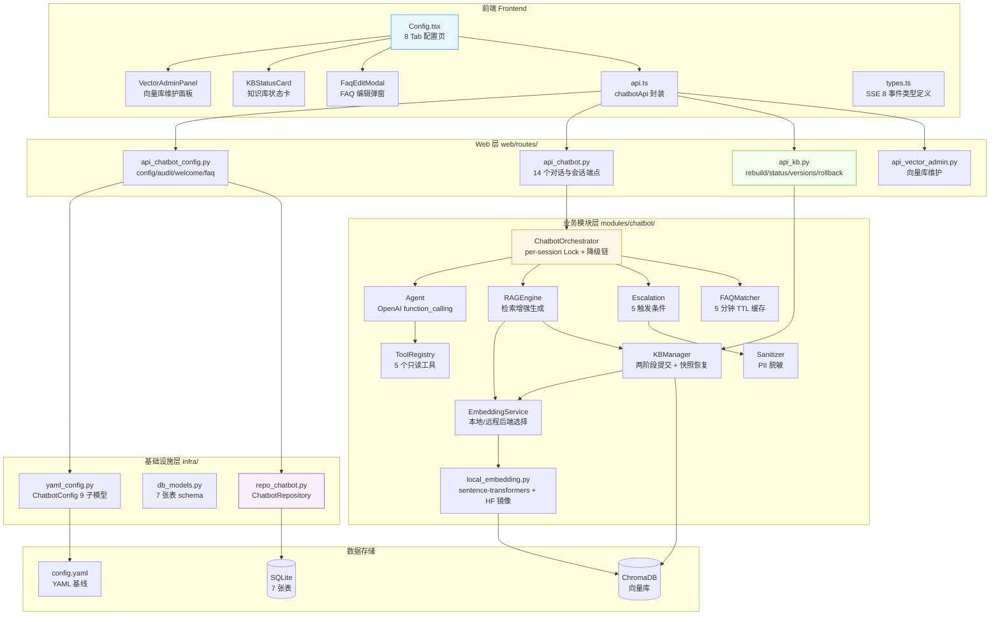
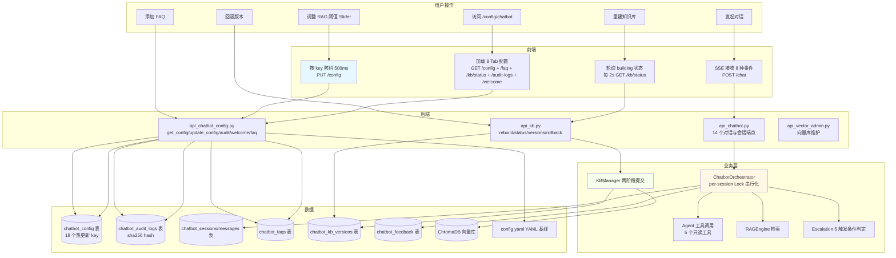
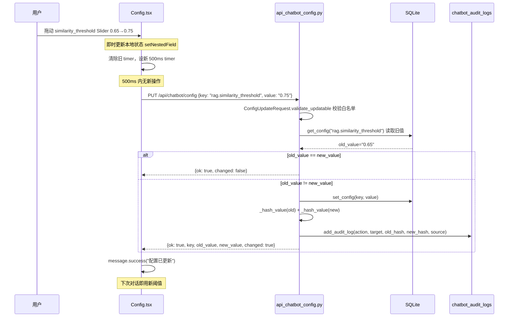
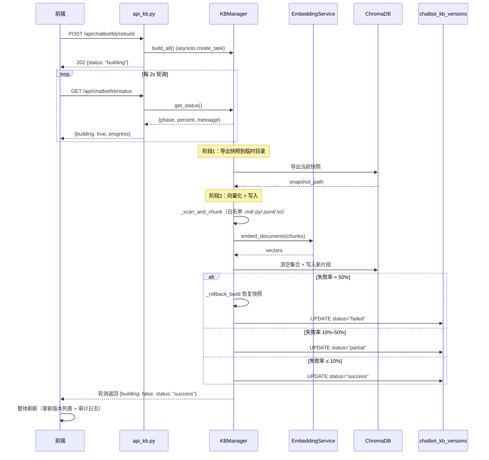
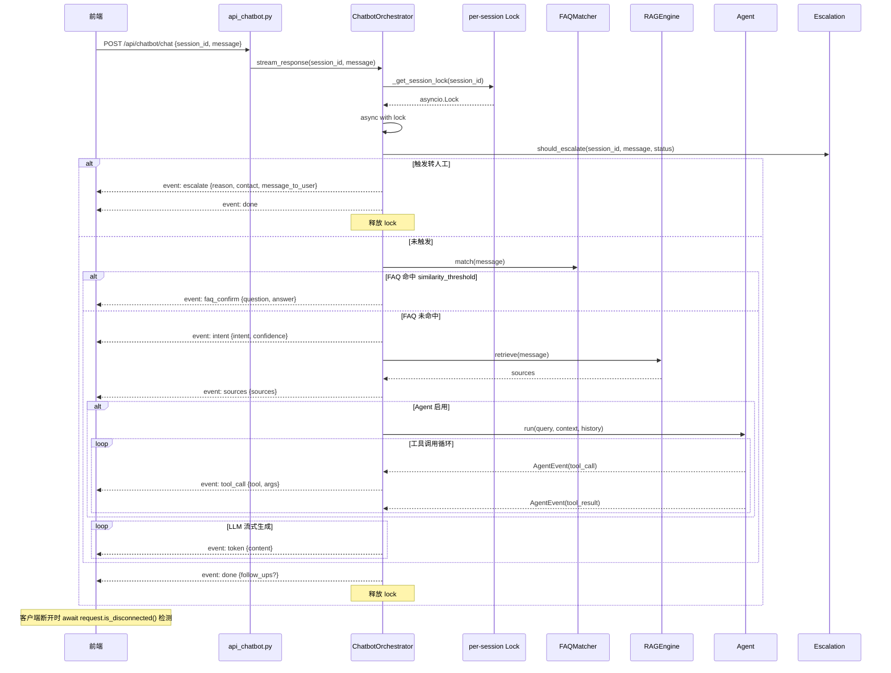

# 闲鱼猎人「客服配置」模块需求规格说明书

| 项 | 内容 |
|---|---|
| 文档版本 | v1.0 |
| 文档日期 | 2026-07-05 |
| 文档状态 | 初版（与详细设计 v2.0 对齐） |
| 所属项目 | 闲鱼猎人（XianyuHunter） |
| 所属菜单 | 配置管理 → 客服配置 |
| 菜单标识 | `menu_registry.yaml` 中 `key=chatbot_config`、`sort_order=106`、`category=config` |
| 关联路由 | 前端 `/config/chatbot`；后端 `/api/chatbot/*`（config/faq/kb/chat/sessions/messages/feedback/escalation/audit-logs/welcome） |
| 关联文档 | [客服配置-详细设计.md](客服配置-详细设计.md)（v2.0/2026-07-05）、[客服配置-操作手册.md](客服配置-操作手册.md)（v1.0） |
| 文档类型 | 需求规格说明书（SRS） |

> **本文档首段：继承 project_memory.md 中的硬约束。** 1. Web 进程必须使用 `with_browser=False` 模式；2. 认证白名单机制（不适用本模块）；3. 前端 fetch 必须含 `credentials: 'include'`；4. 401 必须返回 JSON；5. token 比较使用 `hmac.compare_digest()`；6. 敏感字段不日志；7. token 写失败触发 `logging.warning()`；8. 模块级 import；9. DB 索引齐全；10. COUNT 查询 CASE WHEN 聚合；11. WebView2 子进程 `CREATE_NEW_CONSOLE`；12. WebView2 `private_mode=False`。本模块特有约束：KBManager `_scan_and_chunk` 必须排除 `web/static/`/`web/templates/`/`__pycache__/`/`node_modules/`/`.git/`/`dist/`/`build/`，仅索引 `.md/.py/.jsonl/.txt`；`local_embedding.py` 模块顶层设置 `HF_ENDPOINT=https://hf-mirror.com`；`run_migrations` 各迁移块独立 try/except；启动钩子外层 except 必须 `logger.exception()`。

---

## 0. 阶段交接声明

```
- 当前阶段：客服配置 SRS 编写（v1.0） ✅ 已完成
- 下一阶段：客服配置操作手册编写 + 三份文档一致性校验
- 下一阶段智能体：主智能体
- 下一阶段技能：通用（无）
- 交接上下文：
  · 本文档定义「配置管理 → 客服配置」二级菜单完整需求 v1.0
  · 关键设计决策：8 个 Tab（含 vector-admin 向量库维护）+ 18 个热更新 key 白名单
  · 22 个 API 端点（配置/FAQ/KB 4 + 对话与会话 14 + 审计/欢迎语 4）
  · 7 张数据库表（sessions/messages/faqs/feedback/kb_versions/config/audit_logs）
  · M1-M6 功能迭代：欢迎语引导卡/会话收藏/消息状态机/消息撤回/主动转人工/星级评分
  · per-session Lock 串行化同一会话编排
  · SSE 8 种事件类型流式响应
  · 5 个只读 Agent 工具（GetTaskStatus/GetEvalScore/GetConfigValue/GetErrorLogs/SearchHelp）
  · Escalation 5 触发条件（关键词/已转人工/负面反馈阈值/会话超时/LLM 连续失败）
  · 按 key 防抖 500ms PUT 热更新机制
  · sha256 hash 审计日志（不存明文）
```

---

## 1. 引言

### 1.1 编写目的

本需求规格说明书定义「配置管理 → 客服配置」二级菜单的完整需求规格，作为前端/后端开发、测试与验收的唯一依据。

**目标读者**：
- 后端开发工程师：依据 §3-§6、§8、§10 进行模块实现与扩展
- 前端开发工程师：依据 §4、§9 进行页面开发
- 测试工程师：依据 §7、§11 编写测试用例与执行验收
- 项目经理：依据 §2、§11 进行范围与里程碑管理
- 智能客服 KB 训练：本文档与 [客服配置-详细设计.md](客服配置-详细设计.md) 共同作为 KB 检索素材

### 1.2 项目背景

闲鱼猎人（XianyuHunter）是一个闲鱼自动捡漏与抢单工具，已具备任务管理、商品采集、AI 评估、自动下单、多渠道通知等完整能力（详见 [requirements.md](../requirements.md)、[design.md](../design.md) 与 [概要设计文档.md](../概要设计文档.md)）。

随着系统运行规模扩大，**智能客服（Chatbot）模块已迭代至 M6 版本**，但配置管理存在以下痛点：

| 痛点 | 现状 | 影响 |
|------|------|------|
| 配置项散落 | yaml 静态配置 + DB 动态覆盖分散在 `yaml_config.py` / `api_chatbot_config.py` / `chatbot_config` 表 | 用户不知哪些可热更新 |
| Tab 数与代码不一致 | v1.0 文档标注 7 Tab，实际代码 8 Tab（含 vector-admin 向量库维护） | 文档与代码偏差误导开发 |
| 热更新 key 数不准 | v1.0 文档标注 17 key，实际 18 key（新增 `welcome_message` M1 引导卡） | 前端遗漏 key 导致功能缺失 |
| RAG/KB Config 字段数偏差 | v1.0 文档 RAG 3 字段、KB 9 字段，实际 RAG 5 字段、KB 12 字段 | 类型定义不完整 |
| KB API 签名错误 | v1.0 文档 `POST /kb/rollback` 请求体 `{version_id}`，实际是路径参数 `POST /kb/rollback/{version_id}` | 前后端契约不一致 |
| 对话与会话 API 遗漏 | v1.0 文档未提及 14 个 `api_chatbot.py` 端点 | API 总数严重低估 |
| M1-M6 功能未文档化 | 欢迎语引导卡/会话收藏/消息状态机/消息撤回/主动转人工/星级评分 未沉淀 | 新成员不知已有能力 |
| per-session Lock 未记录 | 串行化同一会话编排的关键机制未文档化 | 并发场景易踩坑 |
| SSE 8 事件类型未记录 | intent/sources/token/tool_call/faq_confirm/done/error/escalate 未定义 | 前端解析无依据 |
| Agent 工具集未记录 | 5 个只读工具（GetTaskStatus/GetEvalScore/GetConfigValue/GetErrorLogs/SearchHelp）未文档化 | 工具扩展无参考 |
| Escalation 5 触发条件未记录 | 关键词/已转人工/负面反馈/会话超时/LLM 失败未沉淀 | 转人工判定逻辑不透明 |
| 7 张表结构未完整定义 | sessions/messages/faqs/feedback/kb_versions/config/audit_logs schema 散落 | 数据模型不可追溯 |

**解决方案**：将 `api_chatbot_config.py` / `api_chatbot.py` / `api_kb.py` / `yaml_config.py` / `db_models.py` / `orchestrator.py` / `agent.py` / `escalation.py` / `kb_manager.py` / `embedding_service.py` 全部能力通过 22 个 API 端点 + 8 个 Tab 统一暴露；同时定义 18 个热更新 key 白名单、per-session Lock 机制、SSE 8 种事件类型、5 个 Agent 工具、Escalation 5 触发条件、7 张表 schema 与 M1-M6 功能迭代，**让客服配置可视化、热更新可控、版本可回滚、转人工可追溯**。

### 1.3 范围与约束

#### 1.3.1 包含范围（In-Scope）

- **配置管理**（4 端点）：`GET/PUT /api/chatbot/config`、`GET /api/chatbot/audit-logs`、`GET /api/chatbot/welcome`
- **FAQ 管理**（3 端点）：`GET/POST /api/chatbot/faq`、`DELETE /api/chatbot/faq/{faq_id}`
- **知识库管理**（4 端点）：`POST /api/chatbot/kb/rebuild`、`GET /api/chatbot/kb/status`、`GET /api/chatbot/kb/versions`、`POST /api/chatbot/kb/rollback/{version_id}`
- **对话与会话**（14 端点）：SSE 对话 / 会话 CRUD 7 / 消息历史 / 消息撤回 / 反馈 / 主动转人工 / 反馈列表 / 转人工导出
- **8 个 Tab**：basic/rag/agent/kb/faq/escalation/vector-admin/audit
- **18 个热更新 key**：enabled/max_history_turns/session_timeout_min/rag.*/agent.*/kb.auto_update_enabled/kb.update_interval_hours/faq.*/escalation.*/welcome_message
- **静态配置**（需重启）：llm.model/llm.vision_model/kb.doc_paths/kb.embedding_*/kb.chunk_*/kb.persist_path/kb.collection_name/kb.project_root
- **M1-M6 功能迭代**：
  - M1 欢迎语引导卡（`welcome_message` key + `GET /welcome` 接口）
  - M2 会话收藏（`PATCH /sessions/{id}/favorite` + 收藏置顶）
  - M3 消息状态机（sending/sent/failed）+ 重试 + 快捷回复
  - M4 消息撤回（2 分钟时间窗）+ 多模态图片（最多 4 张 data URL）
  - M5 主动转人工（`POST /escalation/trigger`）
  - M6 星级评分（1-5 星）+ 反馈分类（irrelevant/inaccurate/other）
- **per-session Lock**：串行化同一会话编排，ended/escalated 状态主动清理
- **SSE 8 种事件类型**：intent/sources/token/tool_call/faq_confirm/done/error/escalate
- **5 个只读 Agent 工具**：GetTaskStatusTool/GetEvalScoreTool/GetConfigValueTool/GetErrorLogsTool/SearchHelpTool
- **Escalation 5 触发条件**：关键词命中/已转人工/负面反馈阈值/会话超时/连续 3 次 LLM 失败
- **7 张数据库表**：chatbot_sessions/messages/faqs/feedback/kb_versions/config/audit_logs
- **按 key 防抖 500ms PUT**：Slider/Input 高频 onChange 防洪水
- **sha256 hash 审计日志**：敏感字段不存明文
- **双层配置架构**：YAML 静态基线 + DB 动态热更新覆盖
- **降级链**：LLM → RAG → 转人工，每级降级发布 `CHATBOT_DEGRADED` 事件
- **两阶段提交**：知识库构建失败率 >50% 自动回滚到上一版本

#### 1.3.2 排除范围（Out-of-Scope）

- 不实现配置版本控制（仅审计日志记录变更 hash，不存历史值）
- 不实现多用户配置隔离（`chatbot_config` 表全局共享，无 user_id 字段）
- 不实现配置导入/导出（不支持 YAML 文件上传/下载）
- 不实现实时配置同步推送（前端通过轮询 `GET /config` 获取最新值）
- 不实现 Agent 工具的写操作（5 个工具均为只读，写操作需走对应业务 API）
- 不实现自定义 Agent 工具注册（仅支持内置 5 个工具）
- 不实现知识库的增量构建（仅全量 rebuild）
- 不实现 FAQ 的批量导入/导出（仅单个 CRUD）
- 不实现向量库的远程 Embedding 服务切换 UI（通过 `.env` 配置切换）

#### 1.3.3 硬约束

继承 [project_memory.md](c:/Users/hspcadmin/.trae-cn/memory/projects/-d-code-otherProjects-17-xianyu/project_memory.md) 中的项目硬约束，并显式映射到本模块实现：

| 硬约束 | 本模块适用性 | 实现要点 |
|--------|--------------|----------|
| Web 进程使用 `with_browser=False` 模式 | 适用 | Web 进程不启浏览器；Chatbot Orchestrator 纯 Python 推理 |
| 认证白名单 | 不适用 | `/api/chatbot/*` **必须**走 `auth.py` 认证，不加入白名单 |
| 前端 fetch 必须含 `credentials: 'include'` | 适用 | `frontend/src/api/client.ts` 全量沿用 `client` 默认配置；SSE 用 fetch + `credentials: 'include'` |
| 401 响应必须返回 JSON `{"detail":"Unauthorized"}` | 适用 | `api_chatbot_config.py` / `api_chatbot.py` / `api_kb.py` 路由层统一异常处理 |
| 后端 token 比较使用 `hmac.compare_digest()` | 适用 | 认证中间件层校验，本模块不直接涉及 |
| 敏感字段（token 长度等）不日志 | 适用 | §8.5 审计日志仅存 sha256 hash，不存明文 |
| token 写失败触发 `logging.warning()` | 适用 | DB 写入失败时 `logger.warning` |
| 缺失 import 必须 module-level | 适用 | 全部模块级 import；`chatbot` 延迟导入在 `_get_chatbot_or_403` |
| DB 必须在 `task_id/seller_id/...` 加索引 | 适用 | 7 张表均建索引（详见 §6.5） |
| COUNT 查询用 CASE WHEN 聚合 | 不适用 | 本模块无复杂 COUNT 聚合查询 |
| WebView2 子进程使用 `CREATE_NEW_CONSOLE` | 不适用 | 本模块不涉及 WebView2 |
| KBManager 排除 `web/static/` 等目录 | **适用（关键）** | `_scan_and_chunk` 排除 7 个目录，仅索引 `.md/.py/.jsonl/.txt` |
| `local_embedding.py` HF_ENDPOINT 设置 | **适用（关键）** | 模块顶层 `os.environ.setdefault("HF_ENDPOINT", "https://hf-mirror.com")`，必须在 import sentence_transformers 之前 |
| EmbeddingService 本地后端 | **适用（关键）** | `EMBEDDING_BASE_URL` 留空或 `local` 时使用 `BAAI/bge-small-zh-v1.5`（512 维） |
| sentence-transformers 5.x API 兼容 | 适用 | `getattr` 兼容 `get_embedding_dimension` / `get_sentence_embedding_dimension` |
| `run_migrations` 各块独立 try/except | 适用 | chatbot 7 张表迁移各自独立 try/except |
| 启动钩子异常 `logger.exception()` | 适用 | `startup.py` Chatbot 初始化失败时打印完整 traceback |
| Vision 能力检测使用共享 `_is_vision_capable()` | 适用 | Agent 多模态调用前检测 `llm.vision_model` 是否为视觉模型 |

### 1.4 术语与缩写

| 术语 | 全称 | 说明 |
|------|------|------|
| Chatbot | Chatbot | 智能客服模块 |
| Orchestrator | ChatbotOrchestrator | 编排器，负责 FAQ → Intent → RAG → Agent → LLM → 转人工 完整流程 |
| Agent | Agent（代码中类名） | 基于 OpenAI function_calling 的多步工具调用与推理（任务描述中的 "AgentHarness"） |
| AgentHarness | AgentHarness | 任务描述中对应代码 `Agent` 类的别名 |
| RAG | Retrieval-Augmented Generation | 检索增强生成，从知识库检索片段作为 LLM 上下文 |
| KB | Knowledge Base | 知识库，由文档分块向量化后存入 ChromaDB |
| KBManager | Knowledge Base Manager | 知识库管理器，两阶段提交 + 快照恢复 |
| EmbeddingService | Embedding Service | 向量化服务，支持本地/远程后端切换 |
| FAQ | Frequently Asked Questions | 常见问题，命中率 ≥ `similarity_threshold` 直接返回 |
| FAQMatcher | FAQ Matcher | FAQ 匹配器，5 分钟 TTL 缓存 |
| Escalation | Escalation | 转人工处理器，5 个触发条件 |
| SSE | Server-Sent Events | 服务端推送流式响应，8 种事件类型 |
| per-session Lock | per-session Lock | 串行化同一会话编排的 asyncio.Lock 字典 |
| `_locks_guard` | Locks Guard Lock | 保护 `_session_locks` 字典本身并发访问的锁 |
| Tab | Tab | 前端 Tabs 组件的页签 |
| 热更新 key | Hot Update Key | 18 个支持运行时修改无需重启的配置 key |
| 双层配置 | Dual-Layer Config | YAML 静态基线 + DB 动态覆盖 |
| `_UPDATABLE_KEYS` | Updatable Keys | 18 个热更新 key 白名单集合 |
| `_DB_OVERRIDE_RULES` | DB Override Rules | 表驱动类型转换规则（17 条 + welcome_message 直存） |
| sha256 hash | SHA256 Hash | 审计日志的敏感字段哈希 |
| M1 | Milestone 1 | 欢迎语引导卡 |
| M2 | Milestone 2 | 会话收藏 |
| M3 | Milestone 3 | 消息状态机 + 重试 + 快捷回复 |
| M4 | Milestone 4 | 消息撤回 + 多模态图片 |
| M5 | Milestone 5 | 主动转人工 |
| M6 | Milestone 6 | 星级评分 + 反馈分类 |
| ChatbotConfig | Chatbot Config | Pydantic 模型，9 个顶层字段 |
| ChatbotRAGConfig | Chatbot RAG Config | RAG 子模型，5 字段 |
| ChatbotLLMConfig | Chatbot LLM Config | LLM 子模型，6 字段（静态） |
| ChatbotAgentConfig | Chatbot Agent Config | Agent 子模型，6 字段 |
| ChatbotKBConfig | Chatbot KB Config | KB 子模型，12 字段 |
| ChatbotFAQConfig | Chatbot FAQ Config | FAQ 子模型，2 字段 |
| ChatbotEscalationConfig | Chatbot Escalation Config | Escalation 子模型，4 字段 |
| ConfigUpdateRequest | Config Update Request | PUT /config 请求体 Pydantic 模型 |
| ChatRequest | Chat Request | POST /chat 请求体 Pydantic 模型 |
| SessionCreate | Session Create | POST /sessions 请求体 Pydantic 模型 |
| FeedbackRequest | Feedback Request | POST /messages/{id}/feedback 请求体 Pydantic 模型 |
| ChatbotSessionRow | Chatbot Session Row | `db_models.ChatbotSessionRow`，10 字段 |
| ChatbotMessageRow | Chatbot Message Row | `db_models.ChatbotMessageRow`，13 字段 |
| ChatbotFAQRow | Chatbot FAQ Row | `db_models.ChatbotFAQRow`，9 字段 |
| ChatbotFeedbackRow | Chatbot Feedback Row | `db_models.ChatbotFeedbackRow`，9 字段 |
| ChatbotKBVersionRow | Chatbot KB Version Row | `db_models.ChatbotKBVersionRow`，10 字段 |
| ChatbotConfigRow | Chatbot Config Row | `db_models.ChatbotConfigRow`，6 字段 |
| ChatbotAuditLogRow | Chatbot Audit Log Row | `db_models.ChatbotAuditLogRow`，7 字段 |
| SSEEventType | SSE Event Type | SSE 事件类型枚举（8 种） |
| ToolRegistry | Tool Registry | Agent 工具注册表 |
| BaseTool | Base Tool | Agent 工具基类 |
| ToolResult | Tool Result | 工具调用结果 |
| ChatRequest | Chat Request | SSE 对话请求体 |
| VectorAdminPanel | Vector Admin Panel | 向量库维护面板组件 |
| KBStatusCard | KB Status Card | 知识库状态卡片组件 |
| FaqEditModal | FAQ Edit Modal | FAQ 编辑弹窗组件 |
| `setNestedField` | Set Nested Field | 嵌套字段不可变更新工具函数 |
| `pickRebuildLogs` | Pick Rebuild Logs | 重建记录过滤函数 |
| `welcome_message` | Welcome Message | M1 欢迎语 key（v2.0 新增） |
| `enable_follow_ups` | Enable Follow Ups | RAG 后续推荐问题开关（v2.0 新增） |
| `follow_up_count` | Follow Up Count | 后续推荐问题数量（v2.0 新增） |
| `persist_path` | Persist Path | ChromaDB 持久化路径（v2.0 新增） |
| `collection_name` | Collection Name | ChromaDB 集合名（v2.0 新增） |
| `project_root` | Project Root | 知识库扫描项目根目录（v2.0 新增） |
| HF_ENDPOINT | HuggingFace Endpoint | HuggingFace 镜像地址（`https://hf-mirror.com`） |
| BAAI/bge-small-zh-v1.5 | BAAI bge-small-zh-v1.5 | 本地 Embedding 模型（512 维） |
| `CHATBOT_DISABLED` | Chatbot Disabled | 智能客服未启用错误码 |
| `CHATBOT_DEGRADED` | Chatbot Degraded | 智能客服降级事件 |

### 1.5 参考资料

| 文档 | 路径 | 用途 |
|------|------|------|
| 需求文档 v1.0 | [../requirements.md](../requirements.md) | 系统整体需求基线 |
| 概要设计文档 v2.0 | [概要设计文档.md](../概要设计文档.md) | 36 个 API 路由、11 张数据表、技术选型 |
| 技术设计说明书 | [../design.md](../design.md) | 分层架构、Evaluator 设计、状态机 |
| 客服配置 详细设计 v2.0 | [客服配置-详细设计.md](客服配置-详细设计.md) | 本模块技术设计、代码位置、FAQ |
| 客服配置 操作手册 v1.0 | [客服配置-操作手册.md](客服配置-操作手册.md) | 用户操作指南 |
| 米其林设计系统 | [../standards/michelin-design-system.md](../standards/michelin-design-system.md) | UI 设计规范 |
| 智能客服开发指南 | [.trae/skills/xianyu-hunter-dev/assets/guides/chatbot-guide.md](../../.trae/skills/xianyu-hunter-dev/assets/guides/chatbot-guide.md) | RAG/Agent/KB 开发指南 |
| 任务管理 SRS | [../02-数据查看/任务管理-需求规格.md](../02-数据查看/任务管理-需求规格.md) | SRS 模板参考 |
| 反爬登录管理 SRS | [../04-系统维护/反爬登录管理-需求规格.md](../04-系统维护/反爬登录管理-需求规格.md) | SRS 模板参考 |
| 项目硬约束 | [project_memory.md](c:/Users/hspcadmin/.trae-cn/memory/projects/-d-code-otherProjects-17-xianyu/project_memory.md) | 必须继承的硬约束清单 |
| 菜单元数据 | [../../config/menu_registry.yaml](../../config/menu_registry.yaml) | `key=chatbot_config`、`sort_order=106` |
| 配置 API 后端 | [../../backend/xianyu_hunter/web/routes/api_chatbot_config.py](../../backend/xianyu_hunter/web/routes/api_chatbot_config.py) | 配置/审计/FAQ/welcome 接口 |
| 对话 API 后端 | [../../backend/xianyu_hunter/web/routes/api_chatbot.py](../../backend/xianyu_hunter/web/routes/api_chatbot.py) | 14 个对话与会话端点 |
| KB API 后端 | [../../backend/xianyu_hunter/web/routes/api_kb.py](../../backend/xianyu_hunter/web/routes/api_kb.py) | 知识库 4 端点 |
| 向量库维护 API | [../../backend/xianyu_hunter/web/routes/api_vector_admin.py](../../backend/xianyu_hunter/web/routes/api_vector_admin.py) | vector-admin Tab 后端 |
| Pydantic 模型 | [../../backend/xianyu_hunter/infra/yaml_config.py](../../backend/xianyu_hunter/infra/yaml_config.py) | ChatbotConfig 9 子模型 |
| DB 模型 | [../../backend/xianyu_hunter/infra/db_models.py](../../backend/xianyu_hunter/infra/db_models.py) | 7 张表 schema |
| 编排器 | [../../backend/xianyu_hunter/modules/chatbot/orchestrator.py](../../backend/xianyu_hunter/modules/chatbot/orchestrator.py) | ChatbotOrchestrator + per-session Lock |
| Agent | [../../backend/xianyu_hunter/modules/chatbot/agent.py](../../backend/xianyu_hunter/modules/chatbot/agent.py) | Agent 类（OpenAI function_calling） |
| Escalation | [../../backend/xianyu_hunter/modules/chatbot/escalation.py](../../backend/xianyu_hunter/modules/chatbot/escalation.py) | 转人工判定（5 触发条件） |
| KBManager | [../../backend/xianyu_hunter/modules/chatbot/kb_manager.py](../../backend/xianyu_hunter/modules/chatbot/kb_manager.py) | 两阶段提交 + 快照恢复 |
| EmbeddingService | [../../backend/xianyu_hunter/modules/chatbot/embedding_service.py](../../backend/xianyu_hunter/modules/chatbot/embedding_service.py) | 后端选择 |
| 本地 Embedding | [../../backend/xianyu_hunter/modules/chatbot/local_embedding.py](../../backend/xianyu_hunter/modules/chatbot/local_embedding.py) | sentence-transformers + HF 镜像 |
| 工具注册表 | [../../backend/xianyu_hunter/modules/chatbot/tool_registry.py](../../backend/xianyu_hunter/modules/chatbot/tool_registry.py) | 5 个默认工具 |
| 配置页 | [../../frontend/src/pages/Chatbot/Config.tsx](../../frontend/src/pages/Chatbot/Config.tsx) | 8 Tab 页面 |
| 前端 API | [../../frontend/src/pages/Chatbot/api.ts](../../frontend/src/pages/Chatbot/api.ts) | chatbotApi 封装 |
| 类型定义 | [../../frontend/src/pages/Chatbot/types.ts](../../frontend/src/pages/Chatbot/types.ts) | SSE 8 事件类型定义 |

---

## 2. 总体描述

### 2.1 产品定位

「客服配置」是闲鱼猎人系统的**智能客服配置管理入口**，定位为：

> 将分散在 `api_chatbot_config.py` / `api_chatbot.py` / `api_kb.py` / `yaml_config.py` / `orchestrator.py` / `agent.py` / `escalation.py` / `kb_manager.py` / `embedding_service.py` 内部的智能客服能力**统一暴露**给前端，让管理员在一个页面里完成"基础配置 → RAG 调优 → Agent 工具 → 知识库管理 → FAQ 维护 → 转人工配置 → 向量库维护 → 审计日志"全流程操作，并通过 18 个热更新 key 白名单实现无需重启的运行时配置修改。

**核心价值**：
1. **8 Tab 全场景覆盖**：基础/RAG/Agent/KB/FAQ/转人工/向量库维护/审计日志
2. **18 个热更新 key**：YAML 基线 + DB 覆盖，按 key 防抖 500ms PUT
3. **7 张表完整数据模型**：sessions/messages/faqs/feedback/kb_versions/config/audit_logs
4. **M1-M6 功能迭代**：欢迎语引导卡 / 会话收藏 / 消息状态机 / 消息撤回 / 主动转人工 / 星级评分
5. **per-session Lock**：串行化同一会话编排，避免上下文错乱
6. **SSE 8 种事件类型**：流式响应，客户端断开自动停止
7. **5 个只读 Agent 工具**：GetTaskStatus/GetEvalScore/GetConfigValue/GetErrorLogs/SearchHelp
8. **Escalation 5 触发条件**：关键词/已转人工/负面反馈/会话超时/LLM 失败
9. **降级链**：LLM → RAG → 转人工，每级降级发布 `CHATBOT_DEGRADED` 事件
10. **两阶段提交**：知识库构建失败率 >50% 自动回滚
11. **sha256 hash 审计日志**：敏感字段不存明文，可审计变更

### 2.2 用户角色与特征

| 角色 | 特征 | 使用场景 | 关注重点 |
|------|------|----------|----------|
| 系统管理员 | 首次部署后初始化客服 | 进入 basic Tab 启用智能客服，配置 LLM 模型 | enabled 开关、LLM 静态配置 |
| 运营调优 | 调整 RAG 检索精度 | 拖动 similarity_threshold Slider 0.65→0.75 | 18 个热更新 key、500ms 防抖 |
| 知识库管理员 | 文档更新后重建向量库 | 点击"重建知识库"，轮询进度，必要时回滚 | kb rebuild/status/versions/rollback |
| FAQ 维护员 | 添加常见问题 | 在 FAQ Tab 新增/编辑/删除 FAQ | FAQMatcher 5 分钟 TTL 缓存 |
| 客服主管 | 配置转人工策略 | 设置 feedback_threshold=2、contact="QQ群123456" | Escalation 5 触发条件、PII 脱敏 |
| 向量库运维 | 修复向量库损坏 | 进入 vector-admin Tab 查看健康状况、清理孤儿快照 | VectorAdminPanel 运维能力 |
| 安全审计员 | 追溯配置变更历史 | 在 audit Tab 查看 sha256 hash 变更记录 | 审计日志、敏感字段保护 |
| 普通用户 | 使用智能客服对话 | 通过对话端点交互，触发 SSE 8 事件 | M1-M6 功能、消息状态机 |
| 测试工程师 | 验证 M1-M6 功能 | 触发欢迎语、收藏、撤回、转人工、星级评分 | 22 个 API 端点契约 |

### 2.3 运行环境

| 项 | 要求 |
|---|---|
| 操作系统 | Windows 10/11（主），Linux/macOS 需兼容 |
| Python | 3.10+（Docker 3.12-slim） |
| Node.js | 18+（仅前端构建） |
| 后端框架 | FastAPI 0.136.3 + uvicorn[standard] 0.48.0 |
| 前端框架 | React 18.3 + TypeScript 5.5 + Ant Design 5.21 |
| 数据库 | SQLite（WAL 模式） + ChromaDB（向量库） |
| Embedding 后端 | 本地：sentence-transformers + BAAI/bge-small-zh-v1.5（512 维）；远程：OpenAI 兼容 API |
| LLM 后端 | OpenAI 兼容 API（gpt-4o-mini 默认） |
| HuggingFace 镜像 | `HF_ENDPOINT=https://hf-mirror.com`（避免国内访问超时） |
| 配置文件 | `config/config.yaml`（YAML 基线） + `.env`（环境变量） |
| 数据目录 | `data/`（SQLite + ChromaDB 持久化） |

### 2.4 设计约束

1. **集成部署**：作为 `backend/xianyu_hunter/web/routes/api_chatbot*.py` / `api_kb.py` 路由 + `frontend/src/pages/Chatbot/Config.tsx` 页面集成到现有系统
2. **复用 Container 单例**：所有端点通过 `Depends(get_container)` 访问 Container，`_get_chatbot_or_403()` 检查 `container.chatbot is None`
3. **双层配置架构**：YAML 启动加载（基线） + DB 运行时热更新覆盖；表驱动遍历 `_DB_OVERRIDE_RULES` 替代重复 if 分支
4. **18 个热更新 key 白名单**：`_UPDATABLE_KEYS` 集合校验，非白名单 key 返回 422
5. **按 key 防抖 500ms PUT**：`updateConfig(key, value)` 即时更新本地 + 500ms 防抖 PUT，避免 Slider/Input 洪水请求
6. **静态配置需重启**：LLM 模型、KB 路径、Embedding 模型等修改后需重启服务
7. **sha256 hash 审计日志**：`_hash_value(value)` 仅存 hash 不存明文
8. **per-session Lock**：`_session_locks` 字典 + `_locks_guard` 保护字典本身，ended/escalated 主动清理
9. **SSE 流式响应**：`text/event-stream`，`event: {type}\ndata: {json}\n\n` 格式，`await request.is_disconnected()` 检测客户端断开
10. **知识库两阶段提交**：阶段1导出快照，阶段2失败调用 `_rollback_build` 恢复
11. **文档扫描白名单**：KBManager 排除 7 个目录，仅索引 `.md/.py/.jsonl/.txt`
12. **EmbeddingService 本地后端**：`EMBEDDING_BASE_URL` 留空或 `local` 使用 sentence-transformers
13. **HF_ENDPOINT 镜像**：`local_embedding.py` 模块顶层设置，必须在 import sentence_transformers 之前
14. **跨版本 API 兼容**：sentence-transformers 5.x 重命名 API，用 `getattr` 兼容
15. **多用户会话隔离**：`chatbot_sessions.user_id` 过滤，但 `chatbot_config` 表全局共享

### 2.5 假设与依赖

**假设**：
- 用户已部署闲鱼猎人 v0.3.0+ 并能访问 `MainLayout` 侧边栏
- OpenAI 兼容 API 已配置（`OPENAI_BASE_URL` + `OPENAI_API_KEY`）
- ChromaDB 已初始化（`data/chromadb/` 目录可写）
- sentence-transformers 已安装（本地 Embedding 模式）

**依赖**：
- 依赖现有 `auth.py` 认证中间件
- 依赖现有 `Container`（注入 `chatbot`/`repo`/`config`）
- 依赖现有 `chatbot_config` 表（DB 动态覆盖）
- 依赖现有 `config/config.yaml`（YAML 静态基线）
- 依赖 OpenAI 兼容 API（LLM 调用）
- 依赖 ChromaDB（向量库存储）
- 依赖 sentence-transformers + BAAI/bge-small-zh-v1.5（本地 Embedding）
- 依赖 `menu_registry.yaml` 菜单注册（已配置 `key=chatbot_config`、`sort_order=106`）
- 新增无外部依赖

---

## 3. 总体架构设计

### 3.1 模块架构图



### 3.2 数据流程图



### 3.3 关键时序图

#### 3.3.1 配置热更新时序（按 key 防抖 500ms）



#### 3.3.2 知识库两阶段提交时序



#### 3.3.3 SSE 流式对话时序（per-session Lock + 8 事件）



### 3.4 模块分层与职责

遵循项目现有 DDD 分层架构：

| 层级 | 模块 | 职责 |
|------|------|------|
| **Web 层** | `api_chatbot_config.py` | 配置 CRUD（2 端点）+ 审计日志（1）+ 欢迎语（1）+ FAQ CRUD（3） |
| | `api_chatbot.py` | 对话与会话 14 端点（SSE 对话/会话 CRUD/消息/反馈/转人工） |
| | `api_kb.py` | 知识库 4 端点（rebuild/status/versions/rollback 路径参数） |
| | `api_vector_admin.py` | 向量库维护端点（vector-admin Tab 后端） |
| **业务模块层** | `orchestrator.py` | ChatbotOrchestrator 编排器 + per-session Lock + 降级链 + SSE 8 事件 |
| | `agent.py` | Agent 类（OpenAI function_calling 多步推理） |
| | `rag_engine.py` | RAGEngine 检索增强生成 |
| | `kb_manager.py` | KBManager 两阶段提交 + 快照恢复 + 文档白名单 |
| | `escalation.py` | Escalation 转人工判定（5 触发条件）+ PII 脱敏 |
| | `embedding_service.py` | EmbeddingService 后端选择（本地/远程） |
| | `local_embedding.py` | 本地 sentence-transformers + HF 镜像 |
| | `tool_registry.py` | ToolRegistry + 5 个默认工具注册 |
| | `tools/task_status.py` | GetTaskStatusTool（查询任务状态） |
| | `tools/eval_score.py` | GetEvalScoreTool（查询评估分数） |
| | `tools/config_value.py` | GetConfigValueTool（查询配置值） |
| | `tools/error_logs.py` | GetErrorLogsTool（查询错误日志） |
| | `tools/help_page.py` | SearchHelpTool（帮助文档检索） |
| | `faq_matcher.py` | FAQMatcher + 5 分钟 TTL 缓存 |
| | `sanitizer.py` | PII 脱敏（手机号/身份证/邮箱/OpenAI Key） |
| **基础设施层** | `yaml_config.py` | ChatbotConfig 9 子模型（RAG 5/LLM 6/Agent 6/KB 12/FAQ 2/Escalation 4） |
| | `db_models.py` | 7 张表 schema（sessions/messages/faqs/feedback/kb_versions/config/audit_logs） |
| | `repo_chatbot.py` | ChatbotRepository（CRUD + 审计 + 反馈） |
| **前端** | `pages/Chatbot/Config.tsx` | 8 Tab 配置页 + 按 key 防抖 500ms PUT |
| | `pages/Chatbot/api.ts` | chatbotApi 全量封装（含 M1-M6 接口） |
| | `pages/Chatbot/types.ts` | 类型定义（SSE 8 事件 + 7 张表对应类型） |
| | `pages/Chatbot/components/VectorAdminPanel.tsx` | 向量库维护面板（v2.0 新增） |
| | `pages/Chatbot/components/KBStatusCard.tsx` | 知识库状态卡片 |
| | `pages/Chatbot/components/FaqEditModal.tsx` | FAQ 编辑弹窗 |

---

## 4. 功能需求

### FR-1 配置获取与热更新

**FR-1.1** `GET /api/chatbot/config` 获取合并后配置
- 响应：`{enabled, max_history_turns, session_timeout_min, rag, llm, agent, kb, faq, escalation, updatable_keys}`
- 配置合并：YAML 基线 + DB 覆盖（`_DB_OVERRIDE_RULES` 表驱动类型转换）
- 响应含 `updatable_keys` 列表，供前端参考哪些 key 可热更新
- 智能客服未启用返回 403 `CHATBOT_DISABLED`

**FR-1.2** `PUT /api/chatbot/config` 更新单个配置 key（仅热更新字段）
- 请求体：`{key: str (max 100), value: str (max 1000)}`
- 校验：
  - key 必须在 `_UPDATABLE_KEYS` 白名单内（18 个），否则 422
  - value 长度 ≤ 1000 字符
- 流程：
  1. `ConfigUpdateRequest.validate_updatable` 校验 key
  2. `repo.get_config(key)` 读取旧值
  3. 若 `old_value == new_value` 跳过写入（减少审计噪音）
  4. `repo.set_config(key, value)` 写入 DB
  5. `repo.add_audit_log(action, target, old_hash, new_hash, source)` 写审计日志（sha256 hash）
  6. 返回 `{ok, key, old_value, new_value, changed}`
- 热更新生效：DB 写入后下次 `get_config()` 读取时合并，对话流程实时获取新配置

**FR-1.3** 18 个热更新 key 白名单

| key | 类型 | 范围 | 默认值 | 说明 |
|-----|------|------|--------|------|
| `enabled` | bool | - | true | 智能客服总开关 |
| `max_history_turns` | int | 1-20 | 10 | 上下文历史最大轮数 |
| `session_timeout_min` | int | 5-1440 | 30 | 会话超时（分钟） |
| `rag.top_k` | int | 1-20 | 5 | 检索返回片段数 |
| `rag.similarity_threshold` | float | 0.0-1.0 | 0.65 | 相似度阈值 |
| `rag.max_context_chars` | int | 500-32000 | 8000 | context 最大字符数 |
| `agent.enable_tools` | bool | - | true | 是否启用 Agent 工具 |
| `agent.max_tool_rounds` | int | 1-10 | 3 | 最大工具调用轮数 |
| `agent.tool_trigger_mode` | str | function_calling/fallback | function_calling | 触发模式 |
| `kb.auto_update_enabled` | bool | - | true | 是否启用定时自动更新 |
| `kb.update_interval_hours` | int | 1-168 | 6 | 自动更新间隔（小时） |
| `faq.similarity_threshold` | float | 0.0-1.0 | 0.85 | FAQ 直接返回阈值 |
| `faq.confirm_threshold` | float | 0.0-1.0 | 0.65 | FAQ 确认阈值 |
| `escalation.contact` | str | - | "" | 转人工联系方式 |
| `escalation.feedback_threshold` | int | 1-10 | 2 | 触发转人工的点踩次数 |
| `escalation.feedback_window_min` | int | 5-1440 | 30 | 点踩统计时间窗口 |
| `escalation.sanitize_pii` | bool | - | true | 是否脱敏 PII |
| `welcome_message` | str | - | "您好，我是智能客服..." | M1 欢迎语 |

**FR-1.4** 静态配置（需重启）
- `llm.model` / `llm.vision_model`：LLM 模型名
- `kb.doc_paths`：知识库扫描路径
- `kb.embedding_model` / `kb.embedding_dimensions`：Embedding 模型与维度
- `kb.chunk_size` / `kb.chunk_overlap`：分块参数
- `kb.embedding_concurrency`：Embedding 并发数
- `kb.persist_path` / `kb.collection_name` / `kb.project_root`：ChromaDB 路径与集合配置
- **为什么静态**：影响知识库构建（需重新 embedding）或 LLM 客户端初始化（需重新创建 client）

**FR-1.5** 按 key 防抖 500ms PUT（前端）
- `updateConfig(key, value)` 即时更新本地状态（`setNestedField` 不可变更新）
- 同一 key 连续修改只发一次请求（500ms 防抖）
- 配置失败回滚：PUT 失败时重新 `getConfig()` 加载
- 组件卸载清理：`useEffect` cleanup 清理所有防抖定时器
- **为什么 500ms**：Slider 拖动 / Input 输入是高频 onChange，直接 PUT 会洪水请求；500ms 确保连续操作只发一次请求，同时保持即时本地更新避免 UI 回弹

### FR-2 FAQ 管理

**FR-2.1** `GET /api/chatbot/faq` FAQ 列表
- Query：`active_only?`（仅启用）
- 响应：`[{id, question, answer, category, enabled, sort_order}]`
- 排序：`sort_order ASC, id ASC`
- 字段映射：后端 `is_active` (int 0/1) ↔ 前端 `enabled` (boolean)，路由层转换

**FR-2.2** `POST /api/chatbot/faq` FAQ 新增/更新（upsert）
- 请求体：`{id?, question, answer, category, enabled, sort_order}`
- 校验：
  - question `min_length=1, max_length=500`
  - answer `min_length=1, max_length=2000`
  - category `max_length=50`
- id 为 None 新增，否则更新
- FAQMatcher 5 分钟 TTL 缓存，更新后最多 5 分钟内生效
- 响应：`{id, ...}`

**FR-2.3** `DELETE /api/chatbot/faq/{faq_id}` 删除 FAQ
- 路径参数：`faq_id`
- 响应：`{ok, id}`

### FR-3 知识库管理

**FR-3.1** `POST /api/chatbot/kb/rebuild` 触发全量重建（后台异步）
- **无 force 参数**（前端传 `force` query 但后端忽略）
- 响应：`{status: "building"}`（202）
- 流程：
  1. `asyncio.create_task` 后台执行
  2. 立即返回 202
  3. 前端通过 `GET /kb/status` 轮询进度（每 2s）
- 两阶段提交：
  - 阶段1：导出当前 ChromaDB 快照到临时目录
  - 阶段2：批量向量化 → 清空 ChromaDB → 写入新片段 → 更新版本状态
  - 任一阶段失败：调用 `_rollback_build` 恢复快照
- 失败率阈值：
  - ≤10%：`success`
  - 10%-50%：`partial`（保留部分结果）
  - >50%：`failed`（回滚到上一版本）

**FR-3.2** `GET /api/chatbot/kb/status` 当前知识库状态
- 响应：`{current_version, chunk_count, last_build_at, building, status, progress}`
- status 取值：`empty`/`success`/`partial`/`failed`/`building`/`corrupted`
- progress：`{phase, percent, message}`，来自 `KBManager._progress`
- phase 取值：`idle`/`scanning`/`snapshotting`/`embedding`/`writing`/`finalizing`/`done`/`failed`/`rolling_back`

**FR-3.3** `GET /api/chatbot/kb/versions` 版本列表
- Query：`limit?=20`（1-100）
- 响应：`{items: [...], total}`
- 排序：`created_at DESC`
- total 用真实计数（M-36 修复，非 len(items)）

**FR-3.4** `POST /api/chatbot/kb/rollback/{version_id}` 回滚到指定版本（**路径参数**）
- 路径参数：`version_id`（非请求体）
- rollback 内部加 `_build_lock` 等待进行中构建完成
- 响应：`{ok, current_version, status}`
- 前端 `Modal.confirm` 提示"回滚期间对话功能短暂不可用"

**FR-3.5** 文档扫描白名单
- 排除目录：`web/static/`、`web/templates/`、`__pycache__/`、`node_modules/`、`.git/`、`dist/`、`build/`
- 仅索引扩展名：`.md`、`.py`、`.jsonl`、`.txt`
- **为什么排除前端构建产物**：packed .js/.css 会产生数千无用 chunk，向量化时间从 ~5min 膨胀到 30+min

### FR-4 审计日志与欢迎语

**FR-4.1** `GET /api/chatbot/audit-logs` 审计日志列表
- Query：`action?`（过滤动作类型）、`limit?=50`
- 响应：`{items: [...], total}`
- 动作类型：`config_update`/`faq_upsert`/`faq_delete`/`kb_rebuild`/`kb_rollback`
- 日志字段：`id`/`action`/`target`/`old_value_hash`/`new_value_hash`/`source`/`created_at`
- **sha256 hash 不存明文**：`_hash_value(value) = hashlib.sha256(value.encode("utf-8")).hexdigest()`
- source 取值：`web`/`api`/`scheduler`/`system`

**FR-4.2** `GET /api/chatbot/welcome` 获取欢迎语（M1 引导卡数据源）
- 响应：`{message, persona, updated_at}`
- message 来自 `welcome_message` key（DB 覆盖优先，YAML 兜底）
- 前端引导卡通过此接口拉取最新欢迎语展示

### FR-5 对话与会话管理（14 端点）

**FR-5.1** `POST /api/chatbot/chat` SSE 流式对话
- 请求体：`{session_id?, message, enable_tools?, images?}`
- 响应：`text/event-stream`
- SSE 格式：`event: {type}\ndata: {json}\n\n`
- 客户端断开检测：每个事件前 `await request.is_disconnected()`，断开则 break
- 8 种事件类型：见 §6.6
- per-session Lock：串行化同一会话编排
- 校验：
  - message `min_length=1, max_length=2000`
  - images 最多 4 张，必须 `data:image/*` 前缀，单张 ≤7M

**FR-5.2** `GET /api/chatbot/sessions` 会话列表（收藏置顶）
- Query：`limit?, offset?, status?, keyword?, favorite_only?`
- 响应：`{items, total, limit, offset}`
- 收藏置顶：`is_favorite=1` 优先排序
- 多用户隔离：按 `user_id` 过滤

**FR-5.3** `POST /api/chatbot/sessions` 创建新会话
- 请求体：`{title?}`
- 响应：`{id, title, status, ...}`（201）
- id 格式：UUID32（无连字符）
- 默认 status：`active`

**FR-5.4** `GET /api/chatbot/sessions/{session_id}` 会话详情
- 响应：`{id, title, status, message_count, ...}`

**FR-5.5** `DELETE /api/chatbot/sessions/{session_id}` 删除会话（级联删除消息与反馈）
- 响应：`{ok, id}`

**FR-5.6** `PATCH /api/chatbot/sessions/{session_id}/title` 更新会话标题
- 请求体：`{title}`
- 响应：会话详情

**FR-5.7** `PATCH /api/chatbot/sessions/{session_id}/favorite` 切换会话收藏状态（M2）
- 请求体：`{is_favorite: bool}`
- 响应：会话详情

**FR-5.8** `POST /api/chatbot/sessions/{session_id}/end` 结束会话
- 响应：`{ok, id, status: "ended"}`
- ended 为终态，主动清理 per-session Lock

**FR-5.9** `GET /api/chatbot/sessions/{session_id}/messages` 消息历史（游标分页）
- Query：`limit?, before_id?`
- 响应：`{items, has_more, oldest_id}`

**FR-5.10** `POST /api/chatbot/messages/{message_id}/recall` 撤回用户消息（M4，2 分钟时间窗）
- 响应：`{ok, id, is_recalled}`
- 2 分钟时间窗限制
- 软删除：`is_recalled=1`

**FR-5.11** `POST /api/chatbot/escalation/trigger` 主动触发转人工（M5）
- 请求体：`{session_id}`
- 响应：`{ok, session_id, status: "escalated"}`

**FR-5.12** `POST /api/chatbot/messages/{message_id}/feedback` 消息反馈（含星级与分类）
- 请求体：`{rating, comment?, star_rating?, category?}`
- rating：`positive`/`negative`
- star_rating：1-5（M6）
- category：`irrelevant`/`inaccurate`/`other`（M6）
- 响应：`{ok, escalate_triggered}`（201）
- M6 派生规则：当 `star_rating` 存在时自动派生 rating，4-5 星 → positive，1-3 星 → negative

**FR-5.13** `GET /api/chatbot/feedback/recent` 最近反馈列表（跨会话）
- Query：`limit?=50`
- 响应：`{items, total}`

**FR-5.14** `GET /api/chatbot/escalation/{session_id}/export` 导出会话记录供转人工复制
- 响应：`{content: "纯文本"}`
- 自动脱敏：`sanitize_pii=true` 时替换 PII 为 `<REDACTED>`

### FR-6 M1-M6 功能迭代

**FR-6.1 M1 欢迎语引导卡**
- 配置 key：`welcome_message`（18 个热更新 key 之一）
- 接口：`GET /api/chatbot/welcome`
- 响应：`{message, persona, updated_at}`
- 前端引导卡首次对话展示

**FR-6.2 M2 会话收藏**
- 接口：`PATCH /api/chatbot/sessions/{id}/favorite`
- 字段：`is_favorite` (int 0/1)
- 列表置顶：`is_favorite=1` 优先排序

**FR-6.3 M3 消息状态机**
- 状态：`sending`（发送中）/ `sent`（已送达）/ `failed`（发送失败）
- 助手消息始终为 `sent` 或不存在此字段
- 仅用户消息使用 `sending`/`failed`
- 失败消息保存原始文本 `retry_payload`，点击重试时再次发送
- 快捷回复：`is_quick_reply=true` 的 FAQ 显示在输入区上方

**FR-6.4 M4 消息撤回 + 多模态图片**
- 撤回接口：`POST /api/chatbot/messages/{id}/recall`
- 2 分钟时间窗限制
- 软删除：`is_recalled=1`
- 多模态图片：`images` 字段（data URL 数组，最多 4 张，单张 ≤7M）
- 必须以 `data:image/*` 前缀

**FR-6.5 M5 主动转人工**
- 接口：`POST /api/chatbot/escalation/trigger`
- 请求体：`{session_id}`
- 响应：`{ok, session_id, status: "escalated"}`
- 会话状态置为 `escalated`

**FR-6.6 M6 星级评分 + 反馈分类**
- 字段：`feedback_rating` (1-5)、`feedback_category` (irrelevant/inaccurate/other)
- 接口：`POST /api/chatbot/messages/{id}/feedback`
- 派生规则：`star_rating` 存在时自动派生 rating
  - 4-5 星 → positive
  - 1-3 星 → negative
- `star_rating` 为 None 时沿用客户端传的 rating

### FR-7 per-session Lock

**FR-7.1** Lock 字典结构
```python
class ChatbotOrchestrator:
    self._session_locks: dict[str, asyncio.Lock] = {}  # session_id → Lock
    self._locks_guard = asyncio.Lock()  # 保护字典本身
```

**FR-7.2** Lock 获取流程
- `_get_session_lock(session_id)` 加 `_locks_guard` 保护字典访问
- session_id 不在字典中时创建新 Lock
- 同一 session_id 的并发请求共享同一 Lock

**FR-7.3** Lock 清理策略
- 会话 `ended` 状态：`_session_locks.pop(session_id, None)` 主动清理
- 会话 `escalated` 状态：再次进入时触发清理
- **为什么清理**：防止内存泄漏，避免无效 Lock 长期占用内存

**FR-7.4** 设计要点
- 串行化同一会话的编排，避免并发请求导致上下文错乱
- `_locks_guard` 保护字典本身的并发访问，与 per-session Lock 区分层级
- 不同 session_id 的请求可并发执行

### FR-8 SSE 8 种事件类型

**FR-8.1** 事件类型定义

| 事件类型 | data 结构 | 触发时机 |
|----------|----------|----------|
| `intent` | `{"intent": str, "confidence": float}` | 意图分类完成 |
| `sources` | `{"sources": [{index, file, section, line_start, line_end, similarity}]}` | RAG 检索完成 |
| `tool_call` | `{"tool": name, "args": dict}` / `{"tool": name, "result": ToolResult}` | Agent 工具调用开始/结束 |
| `token` | `{"content": str}` | LLM 流式 token |
| `faq_confirm` | `{"question": str, "answer": str}` | FAQ 命中 confirm_threshold 区间需确认 |
| `done` | `{}` 或 `{"follow_ups": [str]}` | 流结束（含 M1 后续推荐问题） |
| `error` | `{"code": str, "message": str}` | 错误 |
| `escalate` | `{"reason": str, "contact": str, "message_to_user": str}` | 转人工 |

**FR-8.2** SSE 格式
- 响应 Content-Type：`text/event-stream`
- 格式：`event: {type}\ndata: {json}\n\n`
- 客户端断开检测：每个事件前 `await request.is_disconnected()`，断开则 break

### FR-9 Agent 工具集（5 个只读）

**FR-9.1** 工具注册
- 位置：`tool_registry.py` `_register_defaults()`
- 5 个工具均继承 `BaseTool`，权限为 `read`

**FR-9.2** 工具列表

| 工具名 | 类名 | 文件 | 是否 LLM 工具 | 用途 |
|--------|------|------|---------------|------|
| `get_task_status` | `GetTaskStatusTool` | `tools/task_status.py` | 否 | 查询任务状态 |
| `get_eval_score` | `GetEvalScoreTool` | `tools/eval_score.py` | 否 | 查询评估分数 |
| `get_config_value` | `GetConfigValueTool` | `tools/config_value.py` | 否 | 查询配置值 |
| `get_error_logs` | `GetErrorLogsTool` | `tools/error_logs.py` | 否 | 查询错误日志 |
| `search_help` | `SearchHelpTool` | `tools/help_page.py` | 是（消耗 embedding 预算） | 帮助文档检索（仅 rag_engine 可用时注册） |

**FR-9.3** Agent 多步推理流程
- 多轮工具调用循环：LLM 决策 → 工具执行 → 结果回填 → 再决策
- 总超时控制：`asyncio.timeout(tool_total_timeout_sec)`
- 单轮 LLM 决策超时：`tool_llm_timeout_sec`
- 工具结果以 `tool` role 消息回填
- 异常统一转换为 `AgentEvent("error")`，由 Orchestrator 决定降级
- 工具返回数据递归脱敏（敏感字段替换为 `<REDACTED>`）

### FR-10 Escalation 5 触发条件

**FR-10.1** 5 个触发条件（按短路优先级排列）

| # | 触发条件 | reason 文案 | 说明 |
|---|---------|------------|------|
| 1 | 用户消息含转人工关键词 | "用户请求转人工" | 关键词列表：转人工/人工客服/联系客服/找客服/真人/人工/转接/客服 |
| 2 | 会话状态已是 escalated | "会话已转人工" | 避免重复判定（escalated 为终态） |
| 3 | 最近 `feedback_window_min` 内 negative 反馈数 ≥ `feedback_threshold` | "负面反馈触发阈值" | 窗口默认 30 分钟，阈值默认 2 |
| 4 | 会话超时且未结束 | "会话超时" | `last_active_at` 超过 `session_timeout_min`，且 status≠ended |
| 5 | 连续 3 次 LLM 调用失败 | "LLM 持续失败" | 通过 assistant 消息 `metadata.llm_failed` 标记判定 |

**FR-10.2** 转人工响应构建
- `build_escalation_response()` 构建转人工响应（含联系方式与友好提示）
- `contact` 为空时降级为"请联系管理员"
- `mark_session_escalated()` 更新会话状态为 escalated，记录原因到 `metadata_json`
- `sanitize_session_for_copy()` 委托给 sanitizer 模块完成 PII 脱敏

### FR-11 降级链

**FR-11.1** 降级链流程
```
LLM 流式生成
  │ 失败（超时/网络/内容审核）
  ▼
RAG 检索片段直返（无 LLM 加工）
  │ 失败（无相关文档）
  ▼
转人工（Escalation）
```

**FR-11.2** 降级触发条件
- LLM → RAG：LLM 超时 / 网络错误 / 内容审核拒绝 → 返回 RAG 检索片段（带引用）
- RAG → Escalation：无相关文档 / similarity 全部低于阈值 → 转人工 + 返回提示

**FR-11.3** 降级事件
- 每级降级发布 `CHATBOT_DEGRADED` 事件，便于监控告警

### FR-12 EmbeddingService 后端选择

**FR-12.1** 本地后端
- 配置：`.env` 中 `EMBEDDING_BASE_URL` 留空或 `local`
- 模型：`sentence-transformers` + `BAAI/bge-small-zh-v1.5`（512 维）
- HF 镜像：`local_embedding.py` 模块顶层设置 `os.environ.setdefault("HF_ENDPOINT", "https://hf-mirror.com")`
- **必须在 import sentence_transformers 之前执行**

**FR-12.2** 远程后端
- 配置：`.env` 中 `EMBEDDING_BASE_URL` 配置 URL
- 协议：OpenAI 兼容 API

**FR-12.3** 跨版本兼容
- sentence-transformers 5.x 重命名 API
- 用 `getattr` 兼容：`get_embedding_dimension` / `get_sentence_embedding_dimension`

### FR-13 8 个 Tab 前端组件结构

**FR-13.1** Tab 列表

| Tab | key | 组件 | 功能 |
|-----|-----|------|------|
| 基础配置 | `basic` | 启用开关/历史轮数/会话超时 | 3 个热更新 key |
| RAG 检索 | `rag` | top_k/相似度阈值/context 字符 | 3 个热更新 key |
| AGENT 工具 | `agent` | 启用工具/最大轮数/触发模式 | 3 个热更新 key |
| 知识库管理 | `kb` | KBStatusCard/自动更新/版本列表 | 2 个热更新 key + rebuild/rollback |
| FAQ 管理 | `faq` | FAQ 列表/FaqEditModal | FAQ CRUD |
| 转人工 | `escalation` | 阈值/窗口/联系方式/PII 脱敏 | 4 个热更新 key |
| 向量库维护 | `vector-admin` | VectorAdminPanel | 健康状况/索引修复/孤儿快照清理 |
| 审计日志 | `audit` | 审计日志 Table | 配置变更历史 |

**FR-13.2** 关键交互
- **按 key 防抖 500ms PUT**：`updateConfig(key, value)` 即时更新本地 + 500ms 防抖 PUT
- **配置失败回滚**：PUT 失败时重新 `getConfig()` 加载
- **组件卸载清理**：`useEffect` cleanup 清理所有防抖定时器
- **嵌套字段更新**：`setNestedField(obj, path, value)` 按点分路径更新
- **FAQ 编辑弹窗**：`FaqEditModal` 新增/编辑共用，`useEffect` 在 open/faq 变化时重置表单
- **知识库版本回滚确认**：`Modal.confirm` 确认后调用 `rollbackKB(versionId)`（路径参数）
- **building 状态轮询**：知识库构建中每 2 秒拉取 `/kb/status`，构建完成时整体刷新
- **错误隔离加载**：`Promise.all` 中每个请求独立 `.catch`，单个失败不影响其他状态
- **审计日志重建记录过滤**：`pickRebuildLogs` 从审计日志中过滤 `kb_rebuild`/`kb_rollback` 动作，按时间倒序取前 5 条

---

## 5. 接口定义

所有接口统一前缀：`/api/chatbot`，认证：复用现有 `auth.py` 中间件（**不加入白名单**）。

### 5.1 配置与审计接口

#### GET `/api/chatbot/config`

**描述**：获取合并后配置（YAML 基线 + DB 覆盖）

**响应**：
```json
{
  "enabled": true,
  "max_history_turns": 10,
  "session_timeout_min": 30,
  "rag": {"top_k": 5, "similarity_threshold": 0.65, "max_context_chars": 8000, "enable_follow_ups": true, "follow_up_count": 3},
  "llm": {"model": "gpt-4o-mini", "temperature": 0.3, "max_tokens": 2000, "http_timeout_sec": 25, "first_token_timeout_sec": 15, "vision_model": null},
  "agent": {"enable_tools": true, "max_tool_rounds": 3, "tool_trigger_mode": "function_calling", "tool_call_timeout_sec": 5, "tool_llm_timeout_sec": 15, "tool_total_timeout_sec": 30},
  "kb": {"auto_update_enabled": true, "update_interval_hours": 6, "doc_paths": ["docs/", "backend/xianyu_hunter/"], "embedding_concurrency": 5, "embedding_model": "text-embedding-3-small", "embedding_dimensions": 1536, "chunk_size": 500, "chunk_overlap": 50, "snapshot_max_keep": 10, "persist_path": "data/chromadb", "collection_name": "xianyu_hunter_docs", "project_root": "."},
  "faq": {"similarity_threshold": 0.85, "confirm_threshold": 0.65},
  "escalation": {"feedback_threshold": 2, "feedback_window_min": 30, "contact": "", "sanitize_pii": true},
  "updatable_keys": ["enabled", "max_history_turns", "session_timeout_min", "rag.top_k", "rag.similarity_threshold", "rag.max_context_chars", "agent.enable_tools", "agent.max_tool_rounds", "agent.tool_trigger_mode", "kb.auto_update_enabled", "kb.update_interval_hours", "faq.similarity_threshold", "faq.confirm_threshold", "escalation.contact", "escalation.feedback_threshold", "escalation.feedback_window_min", "escalation.sanitize_pii", "welcome_message"]
}
```

**错误**：
- 403 `{"code": "CHATBOT_DISABLED", "message": "智能客服未启用"}`

#### PUT `/api/chatbot/config`

**描述**：更新单个配置 key（仅热更新字段）

**请求体**：
```json
{"key": "rag.similarity_threshold", "value": "0.75"}
```

**响应**：
```json
{"ok": true, "key": "rag.similarity_threshold", "old_value": "0.65", "new_value": "0.75", "changed": true}
```

**错误**：
- 422 key 不在白名单
- 422 value 长度 > 1000
- 403 `CHATBOT_DISABLED`

#### GET `/api/chatbot/audit-logs`

**描述**：审计日志列表

**Query 参数**：
- `action?`：过滤动作类型（config_update/faq_upsert/faq_delete/kb_rebuild/kb_rollback）
- `limit?`：默认 50

**响应**：
```json
{
  "items": [
    {
      "id": 1,
      "action": "config_update",
      "target": "rag.similarity_threshold",
      "old_value_hash": "sha256...",
      "new_value_hash": "sha256...",
      "source": "web",
      "created_at": "2026-07-05T10:00:00"
    }
  ],
  "total": 100
}
```

#### GET `/api/chatbot/welcome`

**描述**：获取欢迎语（M1 引导卡数据源）

**响应**：
```json
{"message": "您好，我是智能客服...", "persona": "智能客服助手", "updated_at": "2026-07-05T10:00:00"}
```

### 5.2 FAQ 管理接口

#### GET `/api/chatbot/faq`

**Query**：`active_only?`

**响应**：
```json
[
  {"id": 1, "question": "如何重置密码", "answer": "请点击登录页面的...", "category": "account", "enabled": true, "sort_order": 0}
]
```

#### POST `/api/chatbot/faq`

**请求体**：
```json
{"id": null, "question": "如何重置密码", "answer": "请点击登录页面的...", "category": "account", "enabled": true, "sort_order": 0}
```

**响应**：`{id, question, answer, category, enabled, sort_order}`

#### DELETE `/api/chatbot/faq/{faq_id}`

**响应**：`{ok: true, id: 1}`

### 5.3 知识库接口

#### POST `/api/chatbot/kb/rebuild`

**描述**：触发全量重建（后台异步执行）

**请求参数**：无（前端传 `force` query 但后端忽略）

**响应**（202）：
```json
{"status": "building"}
```

#### GET `/api/chatbot/kb/status`

**响应**：
```json
{
  "current_version": "abc123",
  "chunk_count": 1000,
  "last_build_at": "2026-07-05T10:00:00",
  "building": false,
  "status": "success",
  "progress": {"phase": "idle", "percent": 0, "message": ""}
}
```

#### GET `/api/chatbot/kb/versions`

**Query**：`limit?=20`（1-100）

**响应**：
```json
{
  "items": [
    {"id": "abc123", "snapshot_path": "...", "doc_hash": "...", "chunk_count": 1000, "failed_chunk_count": 5, "build_type": "build", "status": "success", "is_current": true, "created_at": "2026-07-05T10:00:00"}
  ],
  "total": 5
}
```

#### POST `/api/chatbot/kb/rollback/{version_id}`

**描述**：回滚到指定版本（**路径参数**，非请求体）

**响应**：
```json
{"ok": true, "current_version": "abc123", "status": "success"}
```

### 5.4 对话与会话接口

#### POST `/api/chatbot/chat`

**描述**：SSE 流式对话

**请求体**：
```json
{"session_id": "abc123", "message": "如何重置密码", "enable_tools": true, "images": []}
```

**响应**：`text/event-stream`

**SSE 事件示例**：
```
event: intent
data: {"intent": "account_help", "confidence": 0.95}

event: sources
data: {"sources": [{"index": 0, "file": "docs/account.md", "section": "重置密码", "line_start": 10, "line_end": 30, "similarity": 0.92}]}

event: token
data: {"content": "请"}

event: token
data: {"content": "点击"}

event: done
data: {"follow_ups": ["如何修改邮箱", "如何注销账号"]}
```

#### GET `/api/chatbot/sessions`

**Query**：`limit?, offset?, status?, keyword?, favorite_only?`

**响应**：
```json
{
  "items": [{"id": "abc123", "title": "新对话", "status": "active", "message_count": 5, "is_favorite": 1, "created_at": "...", "updated_at": "...", "last_active_at": "..."}],
  "total": 10,
  "limit": 20,
  "offset": 0
}
```

#### POST `/api/chatbot/sessions`

**请求体**：`{title?: "新对话"}`

**响应**（201）：`{id, title, status, message_count, is_favorite, created_at, updated_at, last_active_at}`

#### GET `/api/chatbot/sessions/{session_id}`

**响应**：会话详情

#### DELETE `/api/chatbot/sessions/{session_id}`

**响应**：`{ok: true, id: "abc123"}`

#### PATCH `/api/chatbot/sessions/{session_id}/title`

**请求体**：`{title: "新标题"}`

**响应**：会话详情

#### PATCH `/api/chatbot/sessions/{session_id}/favorite`

**请求体**：`{is_favorite: true}`

**响应**：会话详情

#### POST `/api/chatbot/sessions/{session_id}/end`

**响应**：`{ok: true, id: "abc123", status: "ended"}`

#### GET `/api/chatbot/sessions/{session_id}/messages`

**Query**：`limit?, before_id?`

**响应**：
```json
{
  "items": [{"id": "msg123", "session_id": "abc123", "role": "user", "content": "如何重置密码", "created_at": "...", "status": "sent", "is_recalled": 0, "feedback_rating": null, "feedback_category": null}],
  "has_more": true,
  "oldest_id": "msg001"
}
```

#### POST `/api/chatbot/messages/{message_id}/recall`

**响应**：`{ok: true, id: "msg123", is_recalled: true}`

#### POST `/api/chatbot/escalation/trigger`

**请求体**：`{session_id: "abc123"}`

**响应**：`{ok: true, session_id: "abc123", status: "escalated"}`

#### POST `/api/chatbot/messages/{message_id}/feedback`

**请求体**：
```json
{"rating": "positive", "comment": "很有帮助", "star_rating": 5, "category": null}
```

**响应**（201）：`{ok: true, escalate_triggered: false}`

#### GET `/api/chatbot/feedback/recent`

**Query**：`limit?=50`

**响应**：`{items: [...], total: 100}`

#### GET `/api/chatbot/escalation/{session_id}/export`

**响应**：`{content: "纯文本（已脱敏）"}`

---

## 6. 数据模型

### 6.1 ChatbotConfig Pydantic 模型（9 个顶层字段）

位置：`backend/xianyu_hunter/infra/yaml_config.py` 第 307-322 行

| 字段 | 类型 | 默认值 | 热更新 | 说明 |
|------|------|--------|--------|------|
| `enabled` | `bool` | `True` | 是 | 智能客服总开关 |
| `max_history_turns` | `int` | `10` | 是 | 上下文历史最大轮数（1-20） |
| `session_timeout_min` | `int` | `30` | 是 | 会话超时时间（5-1440 分钟） |
| `rag` | `ChatbotRAGConfig` | 见下 | 部分 | RAG 检索配置 |
| `llm` | `ChatbotLLMConfig` | 见下 | 否（静态） | LLM 调用配置 |
| `agent` | `ChatbotAgentConfig` | 见下 | 是 | AGENT 工具配置 |
| `kb` | `ChatbotKBConfig` | 见下 | 部分 | 知识库配置 |
| `faq` | `ChatbotFAQConfig` | 见下 | 是 | FAQ 匹配配置 |
| `escalation` | `ChatbotEscalationConfig` | 见下 | 是 | 转人工配置 |

### 6.2 子模型字段说明

#### ChatbotRAGConfig（5 字段，第 241-248 行）

| 字段 | 类型 | 默认值 | 范围 | 热更新 | 说明 |
|------|------|--------|------|--------|------|
| `top_k` | `int` | `5` | 1-20 | 是 | 检索返回的片段数量 |
| `similarity_threshold` | `float` | `0.65` | 0.0-1.0 | 是 | 相似度阈值 |
| `max_context_chars` | `int` | `8000` | 500-32000 | 是 | context 最大字符数 |
| `enable_follow_ups` | `bool` | `True` | - | 是（v2.0 新增） | 是否生成推荐后续问题 |
| `follow_up_count` | `int` | `3` | 1-5 | 是（v2.0 新增） | 后续问题数量 |

#### ChatbotLLMConfig（6 字段，第 251-261 行，静态需重启）

| 字段 | 类型 | 默认值 | 范围 | 说明 |
|------|------|--------|------|------|
| `model` | `str` | `gpt-4o-mini` | - | OpenAI 模型名 |
| `temperature` | `float` | `0.3` | 0-2 | 采样温度 |
| `max_tokens` | `int` | `2000` | 1-4096 | 单次回复最大 token |
| `http_timeout_sec` | `int` | `25` | 5-120 | HTTP 总超时 |
| `first_token_timeout_sec` | `int` | `15` | 3-60 | 首 token 超时 |
| `vision_model` | `str \| None` | `None` | - | 多模态视觉模型名 |

#### ChatbotAgentConfig（6 字段，第 264-271 行，热更新）

| 字段 | 类型 | 默认值 | 范围 | 说明 |
|------|------|--------|------|------|
| `enable_tools` | `bool` | `True` | - | 是否启用 AGENT 工具调用 |
| `max_tool_rounds` | `int` | `3` | 1-10 | 最大工具调用轮数 |
| `tool_trigger_mode` | `str` | `function_calling` | - | 触发模式 |
| `tool_call_timeout_sec` | `int` | `5` | 1-30 | 单轮工具本地执行超时 |
| `tool_llm_timeout_sec` | `int` | `15` | 5-60 | 单轮 LLM 决策超时 |
| `tool_total_timeout_sec` | `int` | `30` | 10-120 | AGENT 总超时 |

#### ChatbotKBConfig（12 字段，第 274-290 行，部分热更新）

| 字段 | 类型 | 默认值 | 范围 | 热更新 | 说明 |
|------|------|--------|------|--------|------|
| `auto_update_enabled` | `bool` | `True` | - | 是 | 是否启用定时自动更新 |
| `update_interval_hours` | `int` | `6` | 1-168 | 是 | 自动更新间隔（小时） |
| `doc_paths` | `list[str]` | `["docs/", "backend/xianyu_hunter/"]` | - | 否 | 文档扫描路径（静态） |
| `embedding_concurrency` | `int` | `5` | 1-20 | 否 | Embedding 并发数（静态） |
| `embedding_model` | `str` | `text-embedding-3-small` | - | 否 | Embedding 模型名（静态） |
| `embedding_dimensions` | `int` | `1536` | 256-3072 | 否 | 向量维度（静态） |
| `chunk_size` | `int` | `500` | 100-2000 | 否 | 分块字符数（静态） |
| `chunk_overlap` | `int` | `50` | 0-500 | 否 | 分块重叠字符数（静态） |
| `snapshot_max_keep` | `int` | `10` | 1-50 | 否 | 快照保留数量上限 |
| `persist_path` | `str` | `str(get_chromadb_path())` | - | 否 | ChromaDB 持久化路径（v2.0 新增） |
| `collection_name` | `str` | `xianyu_hunter_docs` | - | 否 | ChromaDB 集合名（v2.0 新增） |
| `project_root` | `str` | `.` | - | 否 | 知识库扫描项目根目录（v2.0 新增） |

> **字段数说明**：v1.0 文档为 9 字段，v2.0 新增 `persist_path`/`collection_name`/`project_root` 3 个字段，共 12 字段。

#### ChatbotFAQConfig（2 字段，第 293-296 行，热更新）

| 字段 | 类型 | 默认值 | 范围 | 说明 |
|------|------|--------|------|------|
| `similarity_threshold` | `float` | `0.85` | 0.0-1.0 | ≥ 此值直接返回 |
| `confirm_threshold` | `float` | `0.65` | 0.0-1.0 | 此值 ~ similarity_threshold 区间需确认 |

#### ChatbotEscalationConfig（4 字段，第 299-304 行，热更新）

| 字段 | 类型 | 默认值 | 范围 | 说明 |
|------|------|--------|------|------|
| `feedback_threshold` | `int` | `2` | 1-10 | 触发转人工的点踩次数 |
| `feedback_window_min` | `int` | `30` | 5-1440 | 点踩统计时间窗口（分钟） |
| `contact` | `str` | `""` | - | 转人工联系方式 |
| `sanitize_pii` | `bool` | `True` | - | 是否脱敏 PII |

### 6.3 18 个热更新 key 白名单

见 §FR-1.3 表格。

### 6.4 数据库表结构（7 张表）

位置：`backend/xianyu_hunter/infra/db_models.py` 第 437-625 行

#### 6.4.1 `chatbot_sessions`（ChatbotSessionRow，10 字段）

| 字段 | 类型 | 必填 | 默认值 | 说明 |
|------|------|------|--------|------|
| `id` | String | 是 | UUID32 | 主键（无连字符） |
| `user_id` | String | 是 | `default` | 多用户归属 |
| `title` | String | 是 | `新对话` | 会话标题 |
| `status` | String | 是 | `active` | active/ended/escalated |
| `message_count` | Integer | 是 | 0 | 冗余计数 |
| `last_active_at` | DateTime | 否 | `_utcnow`(onupdate) | 最后活跃时间 |
| `metadata_json` | Text | 否 | NULL | JSON 元数据 |
| `is_favorite` | Integer | 是 | 0 | M2 收藏标记 |
| `created_at` | DateTime | 否 | `_utcnow` | 创建时间 |
| `updated_at` | DateTime | 否 | `_utcnow`(onupdate) | 更新时间 |

**索引**：`ix_chatbot_sessions_user_status_created`

#### 6.4.2 `chatbot_messages`（ChatbotMessageRow，13 字段）

| 字段 | 类型 | 必填 | 默认值 | 说明 |
|------|------|------|--------|------|
| `id` | String | 是 | UUID32 | 主键 |
| `session_id` | String | 是 | — | 会话 ID |
| `role` | String | 是 | — | user/assistant/system |
| `content` | Text | 是 | — | 消息内容 |
| `metadata_json` | Text | 否 | NULL | JSON 元数据 |
| `feedback` | String | 否 | NULL | positive/negative |
| `feedback_comment` | Text | 否 | NULL | 反馈备注 |
| `feedback_rating` | Integer | 否 | NULL | M6 1-5 星评分 |
| `feedback_category` | String | 否 | NULL | M6 反馈分类 |
| `tokens_used` | Integer | 否 | NULL | token 消耗 |
| `images_json` | Text | 否 | NULL | M4 图片 JSON 数组 |
| `is_recalled` | Integer | 是 | 0 | M4 撤回标记 |
| `created_at` | DateTime | 否 | `_utcnow` | 创建时间 |

**索引**：`ix_chatbot_messages_session_created`

#### 6.4.3 `chatbot_faqs`（ChatbotFAQRow，9 字段）

| 字段 | 类型 | 必填 | 默认值 | 说明 |
|------|------|------|--------|------|
| `id` | Integer | 是 | autoincrement | 主键 |
| `question` | Text | 是 | — | 问题 |
| `answer` | Text | 是 | — | 答案 |
| `category` | String | 是 | `general` | 分类 |
| `question_embedding` | Text | 否 | NULL | 问题向量（JSON，1536 维） |
| `is_active` | Integer | 是 | 1 | 1=启用 / 0=禁用 |
| `sort_order` | Integer | 是 | 0 | 排序权重 |
| `created_at` | DateTime | 否 | `_utcnow` | 创建时间 |
| `updated_at` | DateTime | 否 | `_utcnow`(onupdate) | 更新时间 |

**索引**：`ix_chatbot_faqs_category_active`

#### 6.4.4 `chatbot_feedback`（ChatbotFeedbackRow，9 字段）

| 字段 | 类型 | 必填 | 默认值 | 说明 |
|------|------|------|--------|------|
| `id` | Integer | 是 | autoincrement | 主键 |
| `session_id` | String | 是 | — | 会话 ID |
| `message_id` | String | 是 | — | 消息 ID |
| `rating` | String | 是 | — | positive/negative |
| `comment` | Text | 否 | NULL | 反馈备注 |
| `star_rating` | Integer | 否 | NULL | M6 1-5 星 |
| `category` | String | 否 | NULL | M6 分类 |
| `escalate_triggered` | Integer | 是 | 0 | 触发转人工标记 |
| `created_at` | DateTime | 否 | `_utcnow` | 创建时间 |

**索引**：`ix_chatbot_feedback_session_created`

#### 6.4.5 `chatbot_kb_versions`（ChatbotKBVersionRow，10 字段）

| 字段 | 类型 | 必填 | 默认值 | 说明 |
|------|------|------|--------|------|
| `id` | String | 是 | UUID32 | 主键 |
| `snapshot_path` | Text | 是 | — | 快照磁盘路径 |
| `doc_hash` | String | 是 | — | 文档内容 MD5 |
| `chunk_count` | Integer | 是 | 0 | 片段数 |
| `failed_chunk_count` | Integer | 是 | 0 | 失败片段数 |
| `build_type` | String | 是 | `build` | build/incremental/rollback |
| `status` | String | 是 | `success` | success/partial/failed/rolled_back |
| `build_duration_sec` | Float | 否 | NULL | 构建耗时 |
| `error_message` | Text | 否 | NULL | 错误信息 |
| `created_at` | DateTime | 否 | `_utcnow` | 创建时间 |

**索引**：`ix_chatbot_kb_versions_created`

#### 6.4.6 `chatbot_config`（ChatbotConfigRow，6 字段）

| 字段 | 类型 | 必填 | 默认值 | 说明 |
|------|------|------|--------|------|
| `id` | Integer | 是 | autoincrement | 主键 |
| `key` | String | 是 | — | 配置 key（唯一） |
| `value` | Text | 是 | — | 配置值（字符串） |
| `value_type` | String | 是 | `string` | bool/int/float/string/json |
| `description` | Text | 否 | NULL | 描述 |
| `updated_at` | DateTime | 否 | `_utcnow`(onupdate) | 更新时间 |

**约束**：`UniqueConstraint("key", name="uq_chatbot_config_key")`

#### 6.4.7 `chatbot_audit_logs`（ChatbotAuditLogRow，7 字段）

| 字段 | 类型 | 必填 | 默认值 | 说明 |
|------|------|------|--------|------|
| `id` | Integer | 是 | autoincrement | 主键 |
| `action` | String | 是 | — | config_update/faq_upsert/faq_delete/kb_rebuild/kb_rollback |
| `target` | String | 是 | — | 配置 key / FAQ id / 版本 id |
| `old_value_hash` | String | 否 | NULL | SHA256（不存明文） |
| `new_value_hash` | String | 否 | NULL | SHA256（不存明文） |
| `source` | String | 是 | `web` | web/api/scheduler/system |
| `created_at` | DateTime | 否 | `_utcnow` | 创建时间 |

**索引**：`ix_chatbot_audit_logs_action_created`

### 6.5 SSE 事件类型（8 种）

见 §FR-8.1 表格。

### 6.6 Agent 工具集（5 个）

见 §FR-9.2 表格。

### 6.7 Escalation 5 触发条件

见 §FR-10.1 表格。

### 6.8 YAML Schema

```yaml
chatbot:
  enabled: true
  max_history_turns: 10
  session_timeout_min: 30
  rag:
    top_k: 5
    similarity_threshold: 0.65
    max_context_chars: 8000
    enable_follow_ups: true
    follow_up_count: 3
  llm:
    model: gpt-4o-mini
    temperature: 0.3
    max_tokens: 2000
    http_timeout_sec: 25
    first_token_timeout_sec: 15
    vision_model: null
  agent:
    enable_tools: true
    max_tool_rounds: 3
    tool_trigger_mode: function_calling
    tool_call_timeout_sec: 5
    tool_llm_timeout_sec: 15
    tool_total_timeout_sec: 30
  kb:
    auto_update_enabled: true
    update_interval_hours: 6
    doc_paths: ["docs/", "backend/xianyu_hunter/"]
    embedding_concurrency: 5
    embedding_model: text-embedding-3-small
    embedding_dimensions: 1536
    chunk_size: 500
    chunk_overlap: 50
    snapshot_max_keep: 10
    persist_path: data/chromadb
    collection_name: xianyu_hunter_docs
    project_root: .
  faq:
    similarity_threshold: 0.85
    confirm_threshold: 0.65
  escalation:
    feedback_threshold: 2
    feedback_window_min: 30
    contact: ""
    sanitize_pii: true
```

---

## 7. 性能指标

| 指标 | P50 目标 | P95 目标 | 说明 |
|------|----------|----------|------|
| GET /api/chatbot/config | ≤ 50ms | ≤ 150ms | YAML + DB 合并 |
| PUT /api/chatbot/config | ≤ 50ms | ≤ 150ms | 单 key 写入 + 审计 |
| GET /api/chatbot/audit-logs | ≤ 100ms | ≤ 300ms | 索引查询 |
| GET /api/chatbot/welcome | ≤ 30ms | ≤ 100ms | 单 key 读取 |
| GET /api/chatbot/faq | ≤ 50ms | ≤ 150ms | 索引查询 |
| POST /api/chatbot/faq | ≤ 50ms | ≤ 150ms | upsert |
| DELETE /api/chatbot/faq/{id} | ≤ 50ms | ≤ 150ms | 单条删除 |
| POST /api/chatbot/kb/rebuild | ≤ 100ms | ≤ 200ms | 异步触发（后台执行） |
| GET /api/chatbot/kb/status | ≤ 30ms | ≤ 100ms | 状态查询 |
| GET /api/chatbot/kb/versions | ≤ 50ms | ≤ 150ms | 列表查询 |
| POST /api/chatbot/kb/rollback/{id} | ≤ 1s | ≤ 5s | 等待构建完成 + 恢复快照 |
| POST /api/chatbot/chat (SSE) | 5-30s | 60s | 流式对话（含工具调用） |
| GET /api/chatbot/sessions | ≤ 100ms | ≤ 300ms | 列表查询 |
| POST /api/chatbot/sessions | ≤ 50ms | ≤ 150ms | 创建会话 |
| GET /api/chatbot/sessions/{id}/messages | ≤ 100ms | ≤ 300ms | 游标分页 |
| POST /api/chatbot/messages/{id}/recall | ≤ 50ms | ≤ 150ms | 单条更新 |
| POST /api/chatbot/messages/{id}/feedback | ≤ 50ms | ≤ 150ms | 单条写入 |
| 知识库全量构建 | 5-15 分钟 | 30 分钟 | 1000 文档分块向量化 |
| 按 key 防抖 500ms PUT | — | — | 防洪水请求 |
| 审计日志 sha256 hash | ≤ 1ms | ≤ 5ms | 单次哈希 |
| per-session Lock 获取 | ≤ 1ms | ≤ 5ms | 字典查询 |
| FAQ 缓存 TTL | — | — | 5 分钟 |
| 配置热更新生效 | 立即 | 立即 | DB 写入后下次读取生效 |
| 知识库构建失败率阈值 | — | — | ≤10% success / 10-50% partial / >50% failed |
| 消息撤回时间窗 | — | — | 2 分钟 |
| 多模态图片上限 | — | — | 4 张 / 单张 ≤7M |
| 消息长度限制 | — | — | 1-2000 字符 |
| FAQ question 长度 | — | — | 1-500 字符 |
| FAQ answer 长度 | — | — | 1-2000 字符 |
| value 字段长度限制 | — | — | ≤1000 字符 |

---

## 8. 安全要求

### 8.1 认证与授权

- **SR-8.1.1**：所有 `/api/chatbot/*` 端点必须通过现有 `auth.py` 认证中间件
- **SR-8.1.2**：`/api/chatbot/*` **不加入认证白名单**
- **SR-8.1.3**：401 响应必须返回 JSON `{"detail": "Unauthorized"}`
- **SR-8.1.4**：智能客服未启用返回 403 `{"code": "CHATBOT_DISABLED", "message": "智能客服未启用"}`
- **SR-8.1.5**：会话级隔离：按 `chatbot_sessions.user_id` 过滤，越权访问返回 404

### 8.2 配置热更新安全

- **SR-8.2.1**：18 个热更新 key 白名单校验，非白名单返回 422
- **SR-8.2.2**：value 长度 ≤ 1000 字符
- **SR-8.2.3**：bool/int/float/str 类型转换由 `_DB_OVERRIDE_RULES` 表驱动
- **SR-8.2.4**：old_value == new_value 跳过写入（减少审计噪音）
- **SR-8.2.5**：按 key 防抖 500ms PUT（前端）

### 8.3 审计日志与敏感字段保护

- **SR-8.3.1**：审计日志仅存 sha256 hash，不存明文
- **SR-8.3.2**：`_hash_value(value) = hashlib.sha256(value.encode("utf-8")).hexdigest()`
- **SR-8.3.3**：敏感字段（`escalation.contact`、`welcome_message`）hash 后可审计变更但不泄露明文
- **SR-8.3.4**：日志字段：action/target/old_value_hash/new_value_hash/source/created_at
- **SR-8.3.5**：action 枚举：config_update/faq_upsert/faq_delete/kb_rebuild/kb_rollback

### 8.4 per-session Lock 安全

- **SR-8.4.1**：`_session_locks` 字典 + `_locks_guard` 保护字典本身
- **SR-8.4.2**：ended 状态主动清理 Lock：`_session_locks.pop(session_id, None)`
- **SR-8.4.3**：escalated 状态再次进入触发清理
- **SR-8.4.4**：不同 session_id 的请求可并发执行

### 8.5 SSE 流式安全

- **SR-8.5.1**：响应 Content-Type: `text/event-stream`
- **SR-8.5.2**：每个事件前 `await request.is_disconnected()` 检测客户端断开
- **SR-8.5.3**：8 种事件类型严格按 §6.6 定义
- **SR-8.5.4**：异常兜底转 `SSEEvent(ERROR)`

### 8.6 知识库安全

- **SR-8.6.1**：文档扫描白名单：排除 7 个目录（web/static/、web/templates/、__pycache__/、node_modules/、.git/、dist/、build/）
- **SR-8.6.2**：仅索引 `.md`/`.py`/`.jsonl`/`.txt` 扩展名
- **SR-8.6.3**：两阶段提交：失败率 >50% 自动回滚
- **SR-8.6.4**：快照保留上限：`snapshot_max_keep` 默认 10
- **SR-8.6.5**：rollback 加 `_build_lock` 等待进行中构建完成

### 8.7 Agent 工具安全

- **SR-8.7.1**：5 个工具均为只读权限
- **SR-8.7.2**：工具返回数据递归脱敏（敏感字段替换为 `<REDACTED>`）
- **SR-8.7.3**：异常统一转换为 `AgentEvent("error")`
- **SR-8.7.4**：总超时控制 `asyncio.timeout(tool_total_timeout_sec)`
- **SR-8.7.5**：单轮 LLM 决策超时 `tool_llm_timeout_sec`

### 8.8 转人工与 PII 脱敏

- **SR-8.8.1**：5 个触发条件按短路优先级判定
- **SR-8.8.2**：`sanitize_pii=true` 时转人工消息与导出会话记录脱敏
- **SR-8.8.3**：PII 类型：手机号/身份证号/邮箱/OpenAI API Key
- **SR-8.8.4**：脱敏替换为 `<REDACTED>`
- **SR-8.8.5**：`contact` 为空时降级为"请联系管理员"

### 8.9 输入校验

- **SR-8.9.1**：key 长度 ≤ 100 字符
- **SR-8.9.2**：value 长度 ≤ 1000 字符
- **SR-8.9.3**：message 长度 1-2000 字符
- **SR-8.9.4**：FAQ question 长度 1-500 字符
- **SR-8.9.5**：FAQ answer 长度 1-2000 字符
- **SR-8.9.6**：FAQ category 长度 ≤ 50 字符
- **SR-8.9.7**：images 最多 4 张，必须 `data:image/*` 前缀，单张 ≤7M
- **SR-8.9.8**：会话/消息 ID 格式：UUID32（正则 `^[a-f0-9]{32}$`）
- **SR-8.9.9**：star_rating 范围 1-5

### 8.10 EmbeddingService 安全

- **SR-8.10.1**：`local_embedding.py` 模块顶层设置 `HF_ENDPOINT=https://hf-mirror.com`
- **SR-8.10.2**：必须在 import sentence_transformers 之前执行
- **SR-8.10.3**：跨版本 API 兼容用 `getattr`
- **SR-8.10.4**：本地后端默认模型 BAAI/bge-small-zh-v1.5（512 维）

---

## 9. 前端设计

### 9.1 页面结构

```
frontend/src/pages/Chatbot/
├── Config.tsx                          # 8 Tab 配置页（页面根组件）
├── api.ts                              # chatbotApi 全量封装（含 M1-M6 接口）
├── types.ts                            # 类型定义（SSE 8 事件 + 7 张表对应类型）
└── components/
    ├── VectorAdminPanel.tsx            # 向量库维护面板（v2.0 新增 Tab）
    ├── KBStatusCard.tsx                # 知识库状态卡片
    └── FaqEditModal.tsx                # FAQ 编辑弹窗
```

### 9.2 8 个 Tab 布局

| Tab | key | 主要组件 | 配置项 |
|-----|-----|----------|--------|
| 基础配置 | `basic` | Switch + InputNumber × 2 | enabled / max_history_turns / session_timeout_min |
| RAG 检索 | `rag` | InputNumber + Slider + InputNumber | top_k / similarity_threshold / max_context_chars |
| AGENT 工具 | `agent` | Switch + InputNumber + Radio | enable_tools / max_tool_rounds / tool_trigger_mode |
| 知识库管理 | `kb` | KBStatusCard + Switch + InputNumber + Table | auto_update_enabled / update_interval_hours + rebuild/rollback |
| FAQ 管理 | `faq` | Button + Table + FaqEditModal | FAQ CRUD |
| 转人工 | `escalation` | InputNumber × 2 + Input + Switch | feedback_threshold / feedback_window_min / contact / sanitize_pii |
| 向量库维护 | `vector-admin` | VectorAdminPanel | 健康状况 / 索引修复 / 孤儿快照清理 |
| 审计日志 | `audit` | Button + Table | 审计日志列表 |

### 9.3 关键交互

| 区域 | 交互行为 |
|------|----------|
| 配置项 | 按 key 防抖 500ms PUT；即时更新本地状态；失败回滚 |
| Slider | 拖动 onChange 高频触发，500ms 防抖确保只发一次请求 |
| 知识库重建 | 点击后 202，每 2s 轮询 /kb/status，完成后整体刷新 |
| 知识库回滚 | Modal.confirm 确认，路径参数 POST /kb/rollback/{version_id} |
| FAQ 编辑 | FaqEditModal 新增/编辑共用，useEffect 重置表单 |
| 错误隔离 | Promise.all 中每个请求独立 .catch，避免整体 reject |
| 审计日志过滤 | pickRebuildLogs 过滤 kb_rebuild/kb_rollback，取前 5 条 |
| 组件卸载 | useEffect cleanup 清理所有防抖定时器 |

### 9.4 类型定义（types.ts）

- `Session`：10 字段（含 `is_favorite` M2）
- `Message`：含 M3 状态机 + M4 撤回 + M6 星级评分
- `KBStatus`：含 progress（9 种 phase）
- `KBVersion`：含 4 种 build_type
- `FAQ`：含 `is_quick_reply` M3
- `WelcomeInfo`：M1 引导卡
- `ChatbotConfig`：9 个顶层字段
- `AuditLog`：7 字段
- `SSEEvent`：8 种 type 联合类型

### 9.5 API 封装（api.ts）

- 复用全局 axios client（自动携带 xh_token + 401 跳转）
- SSE 流式请求用 fetch + ReadableStream（axios 不支持流式）
- 22 个 API 端点全量封装

---

## 10. 部署与集成

### 10.1 后端集成

#### 10.1.1 模块目录

```
backend/xianyu_hunter/
├── web/routes/
│   ├── api_chatbot_config.py          # 配置/审计/FAQ/welcome 8 端点
│   ├── api_chatbot.py                 # 对话与会话 14 端点
│   ├── api_kb.py                      # 知识库 4 端点
│   └── api_vector_admin.py            # 向量库维护端点
├── infra/
│   ├── yaml_config.py                 # ChatbotConfig 9 子模型
│   ├── db_models.py                   # 7 张表 schema
│   └── repo_chatbot.py                # ChatbotRepository
└── modules/chatbot/
    ├── orchestrator.py                # ChatbotOrchestrator + per-session Lock
    ├── agent.py                       # Agent 类
    ├── rag_engine.py                  # RAGEngine
    ├── kb_manager.py                  # KBManager 两阶段提交
    ├── escalation.py                  # Escalation 5 触发条件
    ├── embedding_service.py           # EmbeddingService 后端选择
    ├── local_embedding.py             # 本地 sentence-transformers
    ├── tool_registry.py               # ToolRegistry + 5 工具注册
    ├── faq_matcher.py                 # FAQMatcher 5 分钟 TTL
    ├── sanitizer.py                   # PII 脱敏
    └── tools/
        ├── task_status.py             # GetTaskStatusTool
        ├── eval_score.py              # GetEvalScoreTool
        ├── config_value.py            # GetConfigValueTool
        ├── error_logs.py              # GetErrorLogsTool
        └── help_page.py               # SearchHelpTool
```

#### 10.1.2 路由注册

在 `startup.py` 中注册新路由：

```python
from xianyu_hunter.web.routes import api_chatbot_config, api_chatbot, api_kb, api_vector_admin

app.include_router(api_chatbot_config.router)
app.include_router(api_chatbot.router)
app.include_router(api_kb.router)
app.include_router(api_vector_admin.router)
```

#### 10.1.3 Chatbot 初始化

`startup.py` 中初始化 ChatbotOrchestrator：
- 注入 `Repository` / `Config` / `RAGEngine` / `Agent` / `Escalation` / `KBManager`
- 注册 5 个 Agent 工具到 ToolRegistry
- 启动 KBManager 定时自动更新（如启用）
- 异常用 `logger.exception()` 输出完整 traceback

### 10.2 前端集成

#### 10.2.1 路由注册

在 `App.tsx` 中新增路由：

```tsx
import { lazy, Suspense } from 'react'
import { Spin } from 'antd'

const ChatbotConfig = lazy(() => import('./pages/Chatbot/Config'))

const fallback = <Spin tip="加载客服配置..." />

<Route path="/config/chatbot" element={<Suspense fallback={fallback}><ChatbotConfig /></Suspense>} />
```

#### 10.2.2 菜单注册

`config/menu_registry.yaml`（**已配置**）：

```yaml
- key: chatbot_config
  label: 客服配置
  icon: RobotOutlined
  path: /config/chatbot
  sort_order: 106
  default_visible: true
  category: config
```

### 10.3 数据目录

```
data/
├── xianyu_hunter.db                    # SQLite（7 张 chatbot_* 表）
├── chromadb/                           # ChromaDB 向量库
└── kb_snapshots/                       # 知识库快照（用于回滚）
```

### 10.4 配置文件

- `config/config.yaml`：YAML 静态基线（chatbot.* 配置）
- `.env`：环境变量（`OPENAI_BASE_URL` / `OPENAI_API_KEY` / `EMBEDDING_BASE_URL`）

---

## 11. 验收标准

### 11.1 功能验收

| 编号 | 验收项 | 验收标准 | 测试方法 |
|------|--------|----------|----------|
| AC-1 | 菜单入口 | 侧边栏"配置管理"分组下显示"客服配置"，点击进入 `/config/chatbot` | UI 检查 |
| AC-2 | 8 个 Tab | basic/rag/agent/kb/faq/escalation/vector-admin/audit 全部展示 | UI 检查 |
| AC-3 | 配置获取 | `GET /api/chatbot/config` 返回 9 个顶层字段 + updatable_keys 18 项 | 后端单测 |
| AC-4 | 热更新 key 白名单 | 18 个 key 全部可 PUT；非白名单 key 返回 422 | 后端单测 |
| AC-5 | 按 key 防抖 500ms | Slider 拖动连续 onChange 只发一次 PUT | UI 操作 + 网络抓包 |
| AC-6 | 配置失败回滚 | PUT 失败时重新 getConfig 加载 | UI 操作 |
| AC-7 | 审计日志 sha256 | 审计日志仅存 hash 不存明文 | 后端单测 |
| AC-8 | FAQ CRUD | list/upsert/delete 正常 | UI 操作 + 后端单测 |
| AC-9 | FAQ 5 分钟 TTL | FAQMatcher 缓存 5 分钟后刷新 | 后端单测 |
| AC-10 | 知识库 rebuild | POST 后返回 202 + 后台异步执行 | UI 操作 |
| AC-11 | 知识库 status 轮询 | 每 2s 拉取进度，building=true 时显示进度 | UI 操作 |
| AC-12 | 知识库 versions | 列表按 created_at DESC，total 真实计数 | 后端单测 |
| AC-13 | 知识库 rollback | POST /kb/rollback/{version_id} 路径参数 | 后端单测 |
| AC-14 | 两阶段提交 | 失败率 >50% 自动回滚 | 集成测试 |
| AC-15 | 文档扫描白名单 | 排除 7 个目录，仅索引 .md/.py/.jsonl/.txt | 后端单测 |
| AC-16 | 欢迎语接口 | GET /welcome 返回 message/persona/updated_at | 后端单测 |
| AC-17 | SSE 对话 | POST /chat 返回 text/event-stream | 集成测试 |
| AC-18 | SSE 8 事件 | intent/sources/token/tool_call/faq_confirm/done/error/escalate 全部覆盖 | 集成测试 |
| AC-19 | 客户端断开检测 | await request.is_disconnected() 检测后停止迭代 | 集成测试 |
| AC-20 | 会话 CRUD | list/create/get/delete/title/favorite/end 7 端点 | UI 操作 + 后端单测 |
| AC-21 | 消息历史 | 游标分页 limit/before_id | 后端单测 |
| AC-22 | 消息撤回 M4 | 2 分钟时间窗内可撤回 | UI 操作 |
| AC-23 | 主动转人工 M5 | POST /escalation/trigger 状态置 escalated | UI 操作 |
| AC-24 | 星级评分 M6 | 1-5 星 + 分类 irrelevant/inaccurate/other | UI 操作 |
| AC-25 | M6 派生规则 | star_rating 存在时自动派生 rating | 后端单测 |
| AC-26 | per-session Lock | 同一 session_id 并发请求串行化 | 集成测试 |
| AC-27 | Lock 清理 | ended/escalated 状态主动清理 | 后端单测 |
| AC-28 | Agent 5 工具 | GetTaskStatus/GetEvalScore/GetConfigValue/GetErrorLogs/SearchHelp 注册 | 后端单测 |
| AC-29 | Agent 多步推理 | 工具调用循环 + 总超时 + 异常转换 | 集成测试 |
| AC-30 | Escalation 5 触发 | 关键词/已转人工/负面反馈/超时/LLM 失败 | 后端单测 |
| AC-31 | 降级链 | LLM → RAG → 转人工 | 集成测试 |
| AC-32 | PII 脱敏 | sanitize_pii=true 时替换为 <REDACTED> | 后端单测 |
| AC-33 | EmbeddingService 本地 | EMBEDDING_BASE_URL=local 使用 sentence-transformers | 后端单测 |
| AC-34 | HF_ENDPOINT 镜像 | local_embedding.py 顶层设置 | 代码审查 |
| AC-35 | 向量库维护 Tab | vector-admin Tab 显示健康状况 | UI 操作 |
| AC-36 | 审计日志列表 | 按 action 过滤，按 created_at DESC | UI 操作 |
| AC-37 | 配置合并 | YAML 基线 + DB 覆盖 | 后端单测 |
| AC-38 | 类型转换 | _DB_OVERRIDE_RULES 表驱动 bool/int/float/str | 后端单测 |
| AC-39 | chatbot 未启用 | 返回 403 CHATBOT_DISABLED | 后端单测 |
| AC-40 | value 长度限制 | >1000 字符返回 422 | 后端单测 |

### 11.2 安全验收

| 编号 | 验收项 | 验收标准 |
|------|--------|----------|
| AC-41 | 认证拦截 | 未认证请求返回 401 JSON |
| AC-42 | 审计日志不存明文 | 仅存 sha256 hash |
| AC-43 | per-session Lock 隔离 | 不同 session_id 并发不互相阻塞 |
| AC-44 | 工具只读 | 5 个 Agent 工具均为 read 权限 |
| AC-45 | 工具脱敏 | 返回数据敏感字段替换为 <REDACTED> |
| AC-46 | PII 脱敏 | 手机号/身份证/邮箱/OpenAI Key 替换 |
| AC-47 | 输入校验 | key/value/message/FAQ 字段长度限制 |
| AC-48 | 会话隔离 | user_id 过滤，越权返回 404 |
| AC-49 | 图片校验 | 最多 4 张 + data:image/* 前缀 + ≤7M |
| AC-50 | rollback 加锁 | _build_lock 等待进行中构建完成 |

### 11.3 性能验收

| 编号 | 验收项 | 验收标准 |
|------|--------|----------|
| AC-51 | 配置获取 | P95 ≤ 150ms |
| AC-52 | 配置更新 | P95 ≤ 150ms |
| AC-53 | SSE 对话 | 5-60s 完成 |
| AC-54 | 知识库构建 | 5-30 分钟 |
| AC-55 | 知识库回滚 | P95 ≤ 5s |
| AC-56 | 审计日志查询 | P95 ≤ 300ms |
| AC-57 | FAQ 列表 | P95 ≤ 150ms |
| AC-58 | 防抖 500ms | 连续操作只发一次请求 |

### 11.4 测试用例索引

| 类别 | 测试文件 | 用例数 |
|------|----------|--------|
| 配置 CRUD | `tests/test_chatbot_config.py` | 10 |
| 审计日志 | `tests/test_chatbot_audit.py` | 5 |
| FAQ CRUD | `tests/test_chatbot_faq.py` | 8 |
| 知识库管理 | `tests/test_chatbot_kb.py` | 10 |
| SSE 对话 | `tests/test_chatbot_chat.py` | 8 |
| 会话管理 | `tests/test_chatbot_sessions.py` | 10 |
| 消息撤回 M4 | `tests/test_chatbot_recall.py` | 4 |
| 反馈 M6 | `tests/test_chatbot_feedback.py` | 6 |
| 转人工 | `tests/test_chatbot_escalation.py` | 8 |
| per-session Lock | `tests/test_chatbot_lock.py` | 5 |
| Agent 工具 | `tests/test_chatbot_agent.py` | 8 |
| EmbeddingService | `tests/test_embedding_service.py` | 5 |
| 前端组件 | `frontend/src/pages/Chatbot/__tests__/` | 10 |
| **合计** | | **97** |

---

## 12. 附录

### 12.1 关键代码位置表

| 模块 | 文件 | 关键行/函数 |
|------|------|-------------|
| 配置与审计 | `backend/xianyu_hunter/web/routes/api_chatbot_config.py` | `_UPDATABLE_KEYS` / `_DB_OVERRIDE_RULES` / `get_config` / `update_config` / `list_audit_logs` / `get_welcome` / FAQ CRUD |
| 对话与会话 | `backend/xianyu_hunter/web/routes/api_chatbot.py` | `chat` SSE / 会话 CRUD 7 / 消息历史 / 撤回 / 反馈 / 转人工 / 导出 |
| 知识库 | `backend/xianyu_hunter/web/routes/api_kb.py` | `rebuild_kb` / `kb_status` / `list_kb_versions` / `rollback_kb`（路径参数） |
| 向量库维护 | `backend/xianyu_hunter/web/routes/api_vector_admin.py` | 向量库维护端点 |
| Pydantic 模型 | `backend/xianyu_hunter/infra/yaml_config.py` | `ChatbotConfig` / `ChatbotRAGConfig`(5) / `ChatbotLLMConfig`(6) / `ChatbotAgentConfig`(6) / `ChatbotKBConfig`(12) / `ChatbotFAQConfig`(2) / `ChatbotEscalationConfig`(4) |
| DB 模型 | `backend/xianyu_hunter/infra/db_models.py` | 7 张表（sessions/messages/faqs/feedback/kb_versions/config/audit_logs） |
| 仓储 | `backend/xianyu_hunter/infra/repo_chatbot.py` | `ChatbotRepository` |
| 编排器 | `backend/xianyu_hunter/modules/chatbot/orchestrator.py` | `ChatbotOrchestrator` + per-session Lock + 降级链 |
| Agent | `backend/xianyu_hunter/modules/chatbot/agent.py` | `Agent` 类（OpenAI function_calling） |
| RAG 引擎 | `backend/xianyu_hunter/modules/chatbot/rag_engine.py` | `RAGEngine` |
| KB 管理器 | `backend/xianyu_hunter/modules/chatbot/kb_manager.py` | `KBManager` 两阶段提交 + 快照恢复 |
| 转人工 | `backend/xianyu_hunter/modules/chatbot/escalation.py` | `Escalation` 5 触发条件 |
| Embedding 服务 | `backend/xianyu_hunter/modules/chatbot/embedding_service.py` | `EmbeddingService` 后端选择 |
| 本地 Embedding | `backend/xianyu_hunter/modules/chatbot/local_embedding.py` | sentence-transformers + HF 镜像 |
| 工具注册表 | `backend/xianyu_hunter/modules/chatbot/tool_registry.py` | `ToolRegistry` + 5 工具注册 |
| 工具实现 | `backend/xianyu_hunter/modules/chatbot/tools/*.py` | 5 个工具类 |
| FAQ 匹配器 | `backend/xianyu_hunter/modules/chatbot/faq_matcher.py` | `FAQMatcher` 5 分钟 TTL |
| PII 脱敏 | `backend/xianyu_hunter/modules/chatbot/sanitizer.py` | `sanitize_session_for_copy` |
| 配置页 | `frontend/src/pages/Chatbot/Config.tsx` | 8 Tab + 防抖 500ms PUT |
| 前端 API | `frontend/src/pages/Chatbot/api.ts` | `chatbotApi` 全量封装 |
| 类型定义 | `frontend/src/pages/Chatbot/types.ts` | SSE 8 事件 + 7 张表类型 |
| 向量库面板 | `frontend/src/pages/Chatbot/components/VectorAdminPanel.tsx` | 向量库维护 |
| KB 状态卡 | `frontend/src/pages/Chatbot/components/KBStatusCard.tsx` | 知识库状态 |
| FAQ 弹窗 | `frontend/src/pages/Chatbot/components/FaqEditModal.tsx` | FAQ 编辑 |

### 12.2 变更记录

| 版本 | 日期 | 修订人 | 修订内容 |
|------|------|--------|----------|
| v1.0 | 2026-07-05 | 客服配置 SRS 编写 | 初版（与详细设计 v2.0 对齐），覆盖 13 大功能模块（FR-1~FR-13）、22 个 API 端点、7 张表 schema、18 个热更新 key、8 个 Tab、M1-M6 功能、per-session Lock、SSE 8 事件、5 个 Agent 工具、Escalation 5 触发条件、降级链、两阶段提交、EmbeddingService 后端选择、10 类安全要求、9 节前端设计、4 节部署集成、58 条验收标准 |

### 12.3 FAQ / 设计权衡

**Q1：为什么需要双层配置架构（YAML + DB）？**
A：YAML 是基线（静态配置 + 默认值），修改需重启；DB 存热更新覆盖值，PUT 后立即生效。这样设计让高频调整（如阈值、联系方式）无需重启服务，同时保留 YAML 作为可版本控制的基线。

**Q2：为什么按 key 防抖 500ms PUT？**
A：Slider 拖动 / Input 输入是高频 onChange，直接 PUT 会洪水请求。500ms 防抖确保同一 key 连续修改只发一次请求，同时保持即时本地更新避免 UI 回弹。

**Q3：为什么审计日志不存明文？**
A：敏感字段（如 `escalation.contact` 联系方式、`welcome_message` 欢迎语）可能含手机号/QQ 等个人信息，hash 后可审计变更但不泄露明文。

**Q4：为什么需要 per-session Lock？**
A：串行化同一会话的编排，避免并发请求导致上下文错乱。不同 session_id 的请求可并发执行，互不阻塞。

**Q5：为什么 Lock 需要主动清理？**
A：防止内存泄漏。会话 ended/escalated 后不再使用，主动 `_session_locks.pop` 清理避免无效 Lock 长期占用内存。

**Q6：为什么知识库构建用两阶段提交？**
A：保证可回滚。阶段1导出快照到临时目录；阶段2失败时调用 `_rollback_build` 恢复快照，避免构建失败导致向量库损坏。

**Q7：为什么 KB API rollback 用路径参数而非请求体？**
A：RESTful 风格，资源标识符放在路径中。`POST /kb/rollback/{version_id}` 明确表达"对特定版本执行回滚操作"，比请求体 `{version_id}` 更符合 REST 语义。

**Q8：为什么 rebuild 后端忽略 force 参数？**
A：知识库构建是幂等操作（两阶段提交保证可回滚），无需 force 强制。前端传 `force` query 是历史兼容，后端忽略。

**Q9：为什么 Agent 工具都是只读？**
A：写操作需走对应业务 API（如任务控制走 `/api/tasks/*`），Agent 工具仅负责查询，避免 LLM 误操作导致数据损坏。

**Q10：为什么 EmbeddingService 默认本地后端？**
A：避免依赖外部 API，降低部署成本。`BAAI/bge-small-zh-v1.5` 模型小（~100MB）、效果好、支持中文，适合本地部署。`HF_ENDPOINT=https://hf-mirror.com` 避免国内访问超时。

**Q11：为什么 M6 星级评分会自动派生 rating？**
A：防止客户端传矛盾值（如 star_rating=5 但 rating=negative）。当 `star_rating` 存在时，4-5 星 → positive，1-3 星 → negative，确保数据一致性。

**Q12：为什么 Escalation 需要 5 个触发条件？**
A：覆盖人工介入的全部合理场景，避免单一条件漏判：(1) 关键词命中（用户主动喊"人工"）；(2) 已转人工会话再次进入（防止重复自动回复）；(3) 负面反馈数 ≥ `escalation.feedback_threshold`（统计窗口 `feedback_window_min` 内）；(4) 会话超时（超过 `session_timeout_min`）；(5) 连续 3 次 LLM 调用失败（兜底降级）。任一命中即将会话状态置 `escalated`，前端展示转人工提示。

**Q13：为什么 Agent 工具调用失败要降级而不是直接报错？**
A：保证对话体验连续性。工具失败时统一转换为 `AgentEvent("error")`，由 Orchestrator 决定降级路径（LLM → RAG → 转人工）。工具不存在/已禁用、工具超时、工具内部 Exception 都返回 `ToolResult(success=False)`；`asyncio.CancelledError` 向上传播触发资源清理。直接报错会让用户看到技术错误，降级链确保至少有 RAG 或人工兜底。

**Q14：为什么本地 Embedding 默认使用 BAAI/bge-small-zh-v1.5？**
A：三个权衡：(1) 模型体积小（~100MB），适合本地部署降低运维成本；(2) 中文效果好，匹配闲鱼猎人中文文档场景；(3) 512 维向量在 ChromaDB 中检索性能与精度平衡。`local_embedding.py` 模块顶层设置 `HF_ENDPOINT=https://hf-mirror.com` 避免国内访问 huggingface.co 超时。如需切换远程 Embedding，配置 `.env` 中 `EMBEDDING_BASE_URL` 即可走 OpenAI 兼容 API。

**Q15：为什么 M6 星级评分会自动派生 rating？**
A：防止客户端传矛盾值（如 `star_rating=5` 但 `rating=negative`）。当 `star_rating` 存在时，后端按规则派生：4-5 星 → positive，1-3 星 → negative；`star_rating` 为 None 时沿用客户端传的 rating。反馈分类 `category` 取值 irrelevant/inaccurate/other，与 rating 独立。这保证 Escalation 统计的负面反馈数可信。

---

## 13. 阶段交接声明

```
- 当前阶段：客服配置 SRS 编写（v1.0） ✅ 已完成
- 下一阶段：客服配置操作手册编写 + 三份文档一致性校验
- 下一阶段智能体：主智能体
- 下一阶段技能：通用（无）
- 交接上下文：
  · 本文档定义「配置管理 → 客服配置」二级菜单完整需求 v1.0
  · 关键设计决策：8 个 Tab（含 vector-admin 向量库维护）+ 18 个热更新 key 白名单
  · 22 个 API 端点（配置/FAQ/KB 4 + 对话与会话 14 + 审计/欢迎语 4）
  · 7 张数据库表（sessions/messages/faqs/feedback/kb_versions/config/audit_logs）
  · M1-M6 功能迭代：欢迎语引导卡/会话收藏/消息状态机/消息撤回/主动转人工/星级评分
  · per-session Lock 串行化同一会话编排
  · SSE 8 种事件类型流式响应
  · 5 个只读 Agent 工具（GetTaskStatus/GetEvalScore/GetConfigValue/GetErrorLogs/SearchHelp）
  · Escalation 5 触发条件（关键词/已转人工/负面反馈阈值/会话超时/LLM 连续失败）
  · 按 key 防抖 500ms PUT 热更新机制
  · sha256 hash 审计日志（不存明文）
  · 与详细设计 v2.0 完全对齐，可作为开发与验收的唯一依据
```

---

## 14. 文档结束

本文档（v1.0）为「配置管理 → 客服配置」二级菜单的需求规格说明书，与 [客服配置-详细设计.md](客服配置-详细设计.md)（v2.0）、[客服配置-操作手册.md](客服配置-操作手册.md)（v1.0）配套使用。如需修改本文档，请同步更新配套文档并保持一致性。