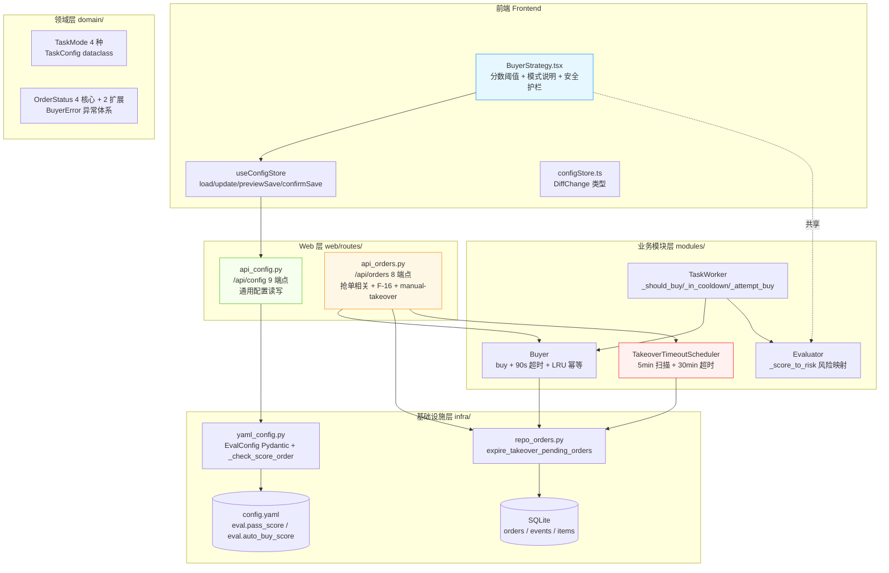
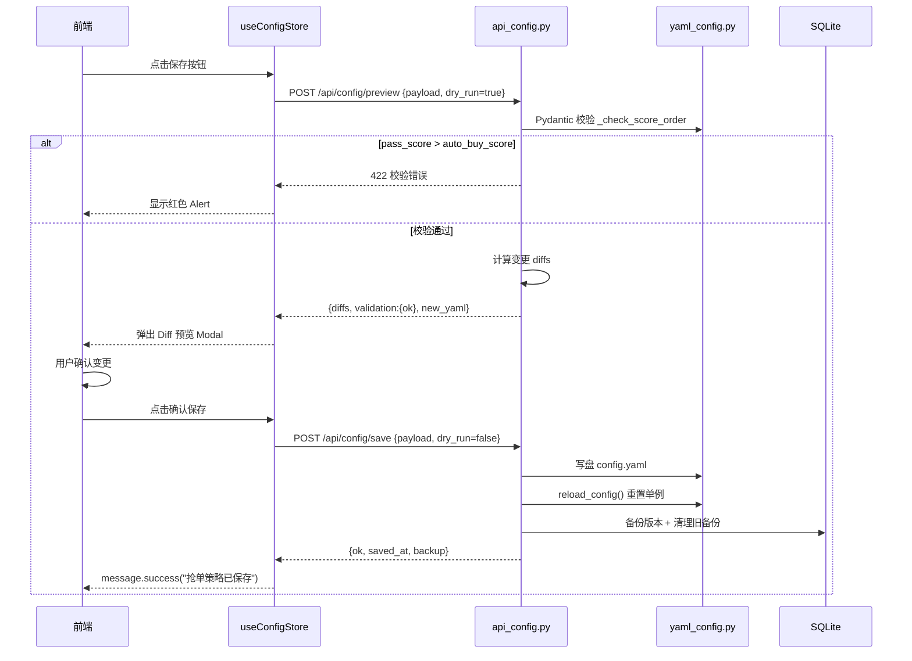
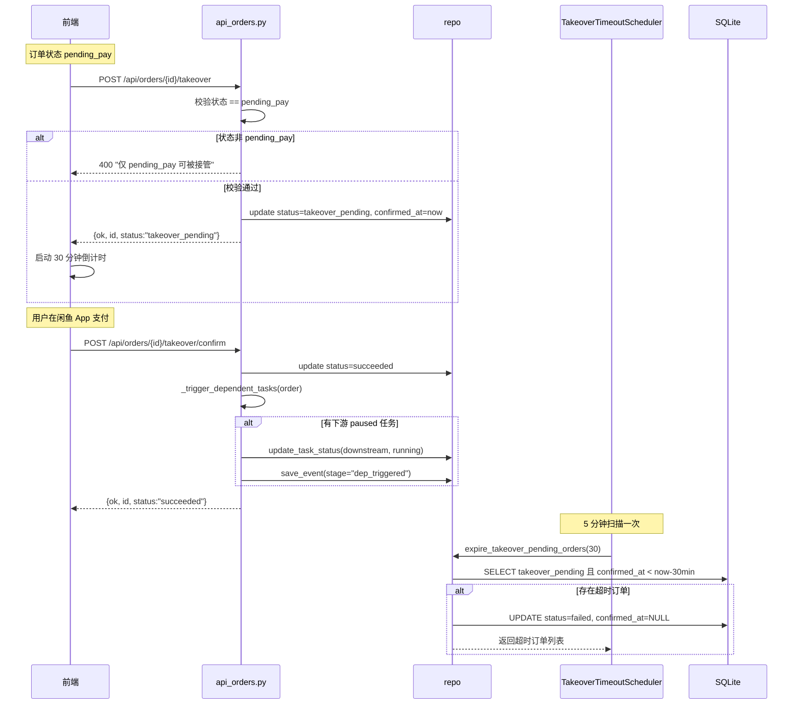
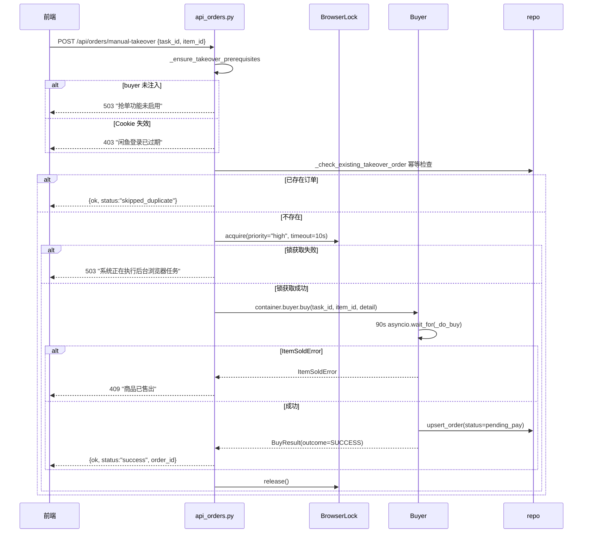

# 闲鱼猎人「抢单策略」模块需求规格说明书

| 项 | 内容 |
|---|---|
| 文档版本 | v1.0 |
| 文档日期 | 2026-07-05 |
| 文档状态 | 初版（与详细设计 v2.0 对齐） |
| 所属项目 | 闲鱼猎人（XianyuHunter） |
| 所属菜单 | 配置管理 → 抢单策略 |
| 菜单标识 | `menu_registry.yaml` 中 `key=buyer`、`icon=ThunderboltOutlined`、`sort_order=20`、`category=config` |
| 关联路由 | 前端 `/config/buyer`；后端通用配置 `/api/config/*`、抢单相关 `/api/orders/*` |
| 关联文档 | [抢单策略-详细设计.md](抢单策略-详细设计.md)（v2.0/2026-07-05）、[抢单策略-操作手册.md](抢单策略-操作手册.md)（v1.0/2026-07-05） |
| 文档类型 | 需求规格说明书（SRS） |

> **本文档首段：继承 project_memory.md 中的硬约束。** 1. Web 进程必须使用 `with_browser=False` 模式；2. 认证白名单机制（不适用本模块）；3. 前端 fetch 必须含 `credentials: 'include'`；4. 401 必须返回 JSON；5. token 比较使用 `hmac.compare_digest()`；6. 敏感字段不日志；7. token 写失败触发 `logging.warning()`；8. 模块级 import；9. DB 索引齐全；10. COUNT 查询 CASE WHEN 聚合；11. WebView2 子进程 `CREATE_NEW_CONSOLE`；12. WebView2 `private_mode=False`。

---

## 0. 阶段交接声明

```
- 当前阶段：抢单策略 SRS 编写（v1.0） ✅ 已完成
- 下一阶段：抢单策略操作手册编写 + 三份文档一致性校验
- 下一阶段智能体：文档编写智能体
- 下一阶段技能：文档编写
- 交接上下文：
  · 本文档定义「配置管理 → 抢单策略」二级菜单完整需求 v1.0
  · 关键设计决策：1 个前端页面（BuyerStrategy）+ 复用通用配置接口 9 个 + 抢单相关 8 个 API 端点
  · 4 种任务级模式（AUTO/SEMI_AUTO/CONFIRM/NOTIFY_ONLY）
  · 2 个共享配置字段（pass_score/auto_buy_score，存储在 eval 配置块下）
  · 5 个运行时 dataclass 字段（BuyerConfig，未 UI 化）
  · 5 个 TaskConfig 字段（stop_on_first_buy/cooldown_after_buy 等，调度层运行时）
  · 订单状态机：pending_pay → takeover_pending → succeeded/failed/cancelled
  · 19 项新增功能：TakeoverTimeoutScheduler、manual-takeover、90 秒总体超时、F-16 依赖触发等
  · 与 v2.0 详细设计完全对齐，修正了 v1.0 详细设计的所有已知错误
```

---

## 1. 引言

### 1.1 编写目的

本需求规格说明书定义「配置管理 → 抢单策略」二级菜单的完整需求规格，作为前端/后端开发、测试与验收的唯一依据。

**目标读者**：
- 后端开发工程师：依据 §3-§6、§8、§10 进行模块实现与扩展
- 前端开发工程师：依据 §4、§9 进行页面开发
- 测试工程师：依据 §7、§11 编写测试用例与执行验收
- 项目经理：依据 §2、§11 进行范围与里程碑管理
- 智能客服 KB 训练：本文档与 [抢单策略-详细设计.md](抢单策略-详细设计.md) 共同作为 KB 检索素材

### 1.2 项目背景

闲鱼猎人（XianyuHunter）是一个闲鱼自动捡漏与抢单工具，已具备任务管理、商品采集、AI 评估、自动下单、多渠道通知等完整能力（详见 [requirements.md](../requirements.md)、[design.md](../design.md) 与 [概要设计文档.md](../概要设计文档.md)）。

随着系统运行规模扩大，**抢单策略相关的核心能力目前分散在多个模块（buyer_config / buyer / worker / evaluator / api_orders / takeover_timeout_scheduler）**，缺乏统一的配置入口，导致以下痛点：

| 痛点 | 现状 | 影响 |
|------|------|------|
| 分数阈值散落 | `pass_score` / `auto_buy_score` 存于 `eval` 配置块，但与"评估规则"页面共享 | 用户不清楚在哪个页面修改 |
| 任务模式说明缺失 | 4 种模式（AUTO/SEMI_AUTO/CONFIRM/NOTIFY_ONLY）的语义分散在代码 | 用户配置任务时易混淆 |
| 运行时参数不可见 | `BuyerConfig`（点击重试/超时/价格容差等）硬编码在代码 | 调参需改代码重启服务 |
| 安全护栏规则文案错误 | v1.0 文档错误描述"auto_buy_score ≥ 80 硬阈值"和"单日抢单上限" | 用户误以为是硬编码限制 |
| 接管超时机制不可见 | `TakeoverTimeoutScheduler` 5 分钟扫描、30 分钟超时仅在代码 | 用户不清楚接管订单何时过期 |
| 手动抢单入口缺失 | `manual-takeover` 接口已实现但页面无说明 | 用户不知道可手动触发抢单 |
| F-16 依赖触发不可见 | 订单 succeeded 后下游任务自动激活仅在代码 | 用户不清楚组合捡漏工作流 |

**解决方案**：通过统一的「抢单策略」配置页面 + 复用通用配置接口 9 个 + 抢单相关 8 个 API 端点，将分散能力整合为单一入口；同时修正 v1.0 详细设计的所有错误文案、补充 19 项新增功能说明，**让抢单策略可视化、可配置、可追溯**。

### 1.3 范围与约束

#### 1.3.1 包含范围（In-Scope）

- 配置字段管理：`eval.pass_score` / `eval.auto_buy_score`（共享配置块）
- 4 种任务级模式说明展示（AUTO/SEMI_AUTO/CONFIRM/NOTIFY_ONLY）
- 安全护栏规则展示与说明（含修正后的文案）
- Diff 预览 + 二次确认保存流程
- 通用配置接口 9 端点（GET/preview/save/share/export/import/version/rollback/restore-backup）
- 抢单相关接口 8 端点（list/get/delete/takeover/takeover_confirm/takeover_cancel/update_status/manual-takeover）
- F-16 下游依赖自动激活内部函数
- TakeoverTimeoutScheduler 后台调度（5 分钟扫描、30 分钟超时清理）
- 数值防御（clamp 函数 [0, 100]）
- 热更新机制（保存后立即生效，无需重启）

#### 1.3.2 排除范围（Out-of-Scope）

- 不实现 BuyerConfig 运行时参数的 UI 化（当前硬编码，待后续版本接入"高级设置"）
- 不实现 TakeoverTimeoutScheduler 的 UI 配置（参数固定 5/30 分钟，待 UI 化）
- 不实现任务级模式切换（模式在"任务管理"页面按任务配置，本页面仅展示说明）
- 不实现独立 REST 路由（复用通用 `/api/config` 接口）
- 不实现独立数据库表（共享 `eval` 配置块，存储在 YAML）
- 不实现评估算法配置（在"评估规则"页面配置 weights/thresholds）

#### 1.3.3 硬约束

继承 [project_memory.md](c:/Users/hspcadmin/.trae-cn/memory/projects/-d-code-otherProjects-17-xianyu/project_memory.md) 中的项目硬约束，并显式映射到本模块实现：

| 硬约束 | 本模块适用性 | 实现要点 |
|--------|--------------|----------|
| Web 进程使用 `with_browser=False` 模式 | 适用 | Web 进程本身不启浏览器；抢单需 `XH_WITH_SCHEDULER=1` 模式注入 buyer |
| 认证白名单（`/api/auth/cookie` 等） | 不适用 | `/api/config/*` 与 `/api/orders/*` **必须**走 `auth.py` 认证 |
| 前端 fetch 必须含 `credentials: 'include'` | 适用 | `frontend/src/api/config.ts` 全量沿用 `client` 默认配置 |
| 401 响应必须返回 JSON `{"detail":"Unauthorized"}` | 适用 | `api_config.py` / `api_orders.py` 路由层统一异常处理 |
| 后端 token 比较使用 `hmac.compare_digest()` | 适用 | 通用配置接口认证遵循 |
| 敏感字段（token 长度等）不日志 | 适用 | §8.5 日志规范：仅记录 `user_id / path / op` |
| token 写失败触发 `logging.warning()` | 适用 | 配置写盘失败时 `logger.warning` |
| 缺失 import 必须 module-level | 适用 | `takeover_timeout_scheduler.py` 全部模块级 import |
| DB 必须在 `task_id/seller_id/...` 加索引 | 适用 | `orders` 表已有 `task_id`/`item_id`/`status` 索引 |
| COUNT 查询用 CASE WHEN 聚合 | 不适用 | 本模块不涉及 COUNT 聚合查询 |
| WebView2 子进程使用 `CREATE_NEW_CONSOLE` | 适用 | 抢单流程依赖浏览器进程 |
| WebView2 `webview.start()` 设 `private_mode=False` + 独立 `storage_path` | 适用 | buyer 持久化 cookie |
| KBManager 排除 `web/static/` 等目录 | 不适用 | 本模块不涉及 KB 索引 |
| `local_embedding.py` HF_ENDPOINT 设置 | 不适用 | 本模块不涉及 embedding |
| EmbeddingService 本地后端 | 不适用 | 同上 |
| `run_migrations` 各块独立 try/except | 适用 | orders 表迁移块独立 try/except |
| 启动钩子异常 `logger.exception()` | 适用 | `startup.py` 调度器初始化失败时打印完整 traceback |

### 1.4 术语与缩写

| 术语 | 全称 | 说明 |
|------|------|------|
| EvalConfig | Evaluation Config | 评估配置 Pydantic 模型，含 pass_score/auto_buy_score |
| BuyerConfig | Buyer Config | 抢单运行时 dataclass，含点击重试/超时/价格容差等 |
| TaskConfig | Task Config | 任务运行时配置（不持久化），由调度层构造 |
| TaskMode | Task Mode | 任务执行模式枚举（4 种：auto/semi_auto/confirm/notify） |
| OrderStatus | Order Status | 订单状态枚举（4 核心值 + 2 扩展值） |
| pass_score | Pass Score | 通过分数（≥此值推送通知），默认 60 |
| auto_buy_score | Auto Buy Score | 自动抢单分数（≥此值且 AUTO 模式才自动拍下），默认 80 |
| pass_score ≤ auto_buy_score | — | Pydantic `_check_score_order` 校验器强制的顺序约束 |
| clamp | Clamp | 前端数值防御函数，确保 [0, 100] 范围 |
| stop_on_first_buy | Stop On First Buy | 抢到 1 单后停止本轮（防刷单），默认 True |
| cooldown_after_buy | Cooldown After Buy | 拍下后冷却秒数，默认 30.0 |
| click_retry_times | Click Retry Times | "立即购买"按钮点击重试次数，默认 2 |
| click_retry_interval | Click Retry Interval | 两次点击退避秒数，默认 1.0 |
| confirm_button_timeout | Confirm Button Timeout | 等待"提交订单"按钮超时，默认 10.0s |
| price_tolerance | Price Tolerance | 拍下价相对评估价的允许偏差，默认 0.05（5%） |
| min_interval_between_orders | Min Interval Between Orders | 两次落单最小间隔，默认 0.0 |
| takeover_pending | Takeover Pending | 订单中间态：等待人工接管支付 |
| succeeded | Succeeded | 抢单成功（与 paid 等价，历史遗留） |
| pending_pay | Pending Pay | 已拍下待支付，订单初始状态 |
| TakeoverTimeoutScheduler | Takeover Timeout Scheduler | 接管超时清理调度器（5 分钟扫描、30 分钟超时） |
| TAKEOVER_TIMEOUT_MIN | Takeover Timeout Minutes | 接管超时阈值（30 分钟），对应闲鱼待付款自动关闭 |
| _DEFAULT_SCAN_INTERVAL_MIN | Default Scan Interval Minutes | 超时扫描间隔（5 分钟） |
| manual-takeover | Manual Takeover | 手动抢单接口，突破纯自动模式限制 |
| F-16 | Feature 16 | 订单 succeeded 后下游 paused 任务自动激活 |
| _trigger_dependent_tasks | Trigger Dependent Tasks | F-16 同步函数，激活下游 paused 任务 |
| dep_triggered | Dep Triggered | 依赖触发 events 表 stage 标识 |
| BuyerError | Buyer Error | 落单流程异常基类 |
| ButtonNotFoundError | Button Not Found Error | 找不到「立即购买」按钮（页面结构变化） |
| ItemSoldError | Item Sold Error | 商品已售出（返回 409） |
| OutOfStockError | Out Of Stock Error | 商品已下架/无库存 |
| PriceMismatchError | Price Mismatch Error | 价格偏差过大（超 5%） |
| LRU | LRU Cache | 内存幂等缓存（maxsize=10000） |
| browser_lock | Browser Lock | 浏览器并发操作互斥锁（优先级：high/normal/low） |
| useConfigStore | Use Config Store | 前端配置状态管理 hook |
| dry_run | Dry Run | 预览改动不写盘 |
| DiffChange | Diff Change | 配置变更项（path/op/old/new） |

### 1.5 参考资料

| 文档 | 路径 | 用途 |
|------|------|------|
| 需求文档 v1.0 | [../requirements.md](../requirements.md) | 系统整体需求基线 |
| 概要设计文档 v2.0 | [概要设计文档.md](../概要设计文档.md) | 36 个 API 路由、11 张数据表、技术选型 |
| 技术设计说明书 | [../design.md](../design.md) | 分层架构、Evaluator 设计、状态机 |
| 抢单策略 详细设计 v2.0 | [抢单策略-详细设计.md](抢单策略-详细设计.md) | 本模块技术设计、代码位置、FAQ |
| 抢单策略 操作手册 v1.0 | [抢单策略-操作手册.md](抢单策略-操作手册.md) | 用户操作指南 |
| 任务管理 SRS | [../02-数据查看/任务管理-需求规格.md](../02-数据查看/任务管理-需求规格.md) | SRS 模板参考（12 章节完整版） |
| 项目硬约束 | [project_memory.md](c:/Users/hspcadmin/.trae-cn/memory/projects/-d-code-otherProjects-17-xianyu/project_memory.md) | 必须继承的硬约束清单 |
| 菜单元数据 | [../../config/menu_registry.yaml](../../config/menu_registry.yaml) | `key=buyer`、`sort_order=20` |
| 通用配置后端 | [../../src/xianyu_hunter/web/routes/api_config.py](../../src/xianyu_hunter/web/routes/api_config.py) | 9 个通用配置端点 |
| 抢单订单后端 | [../../src/xianyu_hunter/web/routes/api_orders.py](../../src/xianyu_hunter/web/routes/api_orders.py) | 8 个抢单相关端点 + F-16 + manual-takeover |
| 接管超时调度器 | [../../src/xianyu_hunter/modules/takeover_timeout_scheduler.py](../../src/xianyu_hunter/modules/takeover_timeout_scheduler.py) | TakeoverTimeoutScheduler |
| 配置模型 | [../../src/xianyu_hunter/infra/yaml_config.py](../../src/xianyu_hunter/infra/yaml_config.py) | EvalConfig Pydantic 模型 |
| 抢单运行时 | [../../src/xianyu_hunter/modules/buyer_config.py](../../src/xianyu_hunter/modules/buyer_config.py) | BuyerConfig dataclass |
| 抢单核心 | [../../src/xianyu_hunter/modules/buyer.py](../../src/xianyu_hunter/modules/buyer.py) | 90 秒超时、LRU 幂等、_do_buy 流程 |
| Worker | [../../src/xianyu_hunter/modules/worker.py](../../src/xianyu_hunter/modules/worker.py) | _should_buy/_in_cooldown/_attempt_buy |
| 评估器 | [../../src/xianyu_hunter/modules/evaluator.py](../../src/xianyu_hunter/modules/evaluator.py) | _score_to_risk 风险等级映射 |
| 任务领域 | [../../src/xianyu_hunter/domain/task.py](../../src/xianyu_hunter/domain/task.py) | TaskMode/TaskConfig |
| 订单领域 | [../../src/xianyu_hunter/domain/order.py](../../src/xianyu_hunter/domain/order.py) | OrderStatus/BuyerError 异常体系 |
| 订单仓储 | [../../src/xianyu_hunter/infra/repo_orders.py](../../src/xianyu_hunter/infra/repo_orders.py) | expire_takeover_pending_orders |
| 前端页面 | [../../frontend/src/pages/Config/BuyerStrategy.tsx](../../frontend/src/pages/Config/BuyerStrategy.tsx) | BuyerStrategy 组件 |
| 配置状态管理 | [../../frontend/src/stores/configStore.ts](../../frontend/src/stores/configStore.ts) | useConfigStore hook |

---

## 2. 总体描述

### 2.1 产品定位

「抢单策略」是闲鱼猎人系统的**抢单行为配置入口**，定位为：

> 通过分数阈值（`pass_score` / `auto_buy_score`）+ 4 种任务级执行模式 + 安全护栏（90 秒超时、价格容差、冷却期、接管超时清理）+ 人工接管流程，控制 auto 模式下的抢单行为，防止误拍与资金锁定风险。

**核心价值**：
1. **配置可视化**：分数阈值、任务模式说明、安全护栏规则全部在单一页面展示
2. **复用避免冗余**：`pass_score` / `auto_buy_score` 存于 `eval` 配置块，与"评估规则"页面共享
3. **4 种模式全覆盖**：从"仅通知"到"全自动"的全场景模式说明
4. **安全护栏完善**：90 秒总体超时、价格容差校验、LRU+DB 双重幂等、stop_on_first_buy、cooldown_after_buy、接管超时清理
5. **接管流程闭环**：pending_pay → takeover_pending → succeeded/failed/cancelled 状态机 + 30 分钟超时清理
6. **手动抢单突破**：manual-takeover 接口让用户在评估明细页主动触发
7. **F-16 依赖激活**：订单 succeeded 后下游 paused 任务自动激活
8. **热更新**：保存后立即生效，无需重启服务
9. **二次确认 + Diff 预览**：防止误操作（如把 auto_buy_score 从 85 改成 50）
10. **Pydantic + dataclass 双层架构**：配置层（EvalConfig）持久化 YAML + 运行时层（BuyerConfig）默认值实例化

### 2.2 用户角色与特征

| 角色 | 特征 | 使用场景 | 关注重点 |
|------|------|----------|----------|
| 保守用户 | 资金安全优先，不希望自动拍下 | 配置 pass_score=70, auto_buy_score=85，任务用 notify/confirm 模式 | 安全护栏、模式说明、分数阈值推荐值 |
| 平衡用户 | 兼顾效率与安全，希望高置信度商品自动拍 | 配置 pass_score=60, auto_buy_score=80（默认值），任务用 semi_auto 模式 | 分数阈值、接管流程、手动抢单 |
| 激进用户 | 抢时间，希望低分商品也能自动拍 | 配置 pass_score=50, auto_buy_score=75，任务用 auto 模式 | 风险等级映射、冷却期、stop_on_first_buy |
| 人工接管用户 | 已有 pending_pay 订单，需在闲鱼 App 支付 | 在抢单记录页点击"接管"，30 分钟内完成支付 | 接管超时、状态机白名单 |
| 调试运维 | 排查抢单失败原因 | 查看 BuyerConfig 参数、BuyerError 异常体系 | 异常类型、90 秒超时、价格容差 |
| 组合捡漏用户 | 配置 F-16 依赖链，上游抢单成功激活下游 | 在任务管理配置依赖，等待自动激活 | F-16 触发条件、dep_triggered 事件 |

### 2.3 运行环境

| 项 | 要求 |
|---|---|
| 操作系统 | Windows 10/11（主），Linux/macOS 需兼容 |
| Python | 3.11+ |
| Node.js | 18+（仅前端构建） |
| 后端框架 | FastAPI（已集成） |
| 前端框架 | React 18 + TypeScript + Ant Design 5（已集成） |
| 抢单模式 | `XH_WITH_SCHEDULER=1` 启动时启用 buyer 注入，与 Web 共享 Container |
| 数据库 | 复用现有 SQLite（orders / events / items 表） |
| 配置存储 | 复用现有 YAML（`eval.pass_score` / `eval.auto_buy_score`） |

### 2.4 设计约束

1. **集成部署**：作为 `frontend/src/pages/Config/BuyerStrategy.tsx` + 复用 `api_config.py` / `api_orders.py` 路由集成到现有系统，不独立部署
2. **复用 Container 单例**：所有端点通过 `Depends(get_container)` 访问 Container，保证状态一致
3. **写操作 POST，读操作 GET**：与现有 REST 规范对齐
4. **异步操作 async 路由**：`POST /api/config/save`、`POST /api/orders/manual-takeover` 使用 async 路由
5. **前端布局对齐设计系统**：分数阈值 Card + 任务级模式 Card + 安全护栏 Card + Diff 预览 Modal
6. **状态管理统一**：前端通过 `useConfigStore` 全局管理配置状态，与"评估规则"页面共享
7. **多用户隔离**：通用配置接口通过 `request.state.user_id` 鉴权
8. **保存主色**：使用 `#FF6200`（闲鱼橙）突出抢单操作的重要性
9. **数值防御**：`clamp` 函数确保分数在 [0, 100] 范围
10. **二次确认**：保存前弹出 Diff 预览 Modal

### 2.5 假设与依赖

**假设**：
- 用户已部署闲鱼猎人 v2.x+ 并能访问 `MainLayout` 侧边栏
- 通用配置接口 `/api/config` 已实现并稳定
- YAML 配置文件已初始化（含 `eval` 配置块）
- 抢单相关接口 `/api/orders/*` 已实现

**依赖**：
- 依赖现有 `auth.py` 认证中间件
- 依赖现有 `Container`（注入 `repo`/`buyer`/`browser_lock`）
- 依赖现有 `useConfigStore` 全局状态管理
- 依赖现有 `menu_registry.yaml` 菜单注册（已配置 `key=buyer`）
- 依赖现有 `TaskMode` / `OrderStatus` 领域枚举
- 依赖现有 `TakeoverTimeoutScheduler` 后台调度（服务启动时初始化）
- 新增无外部依赖

---

## 3. 总体架构设计

### 3.1 模块架构图



### 3.2 数据流程图

```mermaid
flowchart TB
    subgraph "用户操作"
        U1[进入抢单策略页面]
        U2[修改分数阈值]
        U3[保存配置]
        U4[接管订单]
        U5[手动抢单]
    end

    subgraph "前端"
        L1[useConfigStore.load<br/>拉取 eval 配置]
        L2[update 函数<br/>patch 合并更新]
        L3[previewSave<br/>dry_run 预览]
        L4[confirmSave<br/>写盘 + reload_config]
    end

    subgraph "后端配置接口"
        C1[GET /api/config<br/>读取 eval 配置]
        C2[POST /api/config/preview<br/>dry_run + 校验]
        C3[POST /api/config/save<br/>写盘 + 多版本备份]
    end

    subgraph "后端抢单接口"
        O1[POST /api/orders/{id}/takeover<br/>发起接管]
        O2[POST /api/orders/{id}/takeover/confirm<br/>确认支付]
        O3[POST /api/orders/manual-takeover<br/>手动抢单]
        O4[_trigger_dependent_tasks<br/>F-16 同步函数]
    end

    subgraph "调度器"
        S1[TakeoverTimeoutScheduler<br/>5min 扫描]
        S2[expire_takeover_pending_orders<br/>30min 超时清理]
    end

    subgraph "数据"
        D1[(config.yaml<br/>eval 配置块)]
        D2[(orders 表<br/>订单状态)]
        D3[(events 表<br/>dep_triggered)]
    end

    U1 --> L1
    L1 --> C1
    C1 --> D1

    U2 --> L2
    U3 --> L3
    L3 --> C2
    L3 --> L4
    L4 --> C3
    C3 --> D1

    U4 --> O1
    U4 --> O2
    O1 --> D2
    O2 --> D2
    O2 --> O4
    O4 --> D3

    U5 --> O3
    O3 --> D2

    S1 --> S2
    S2 --> D2

    style L1 fill:#e6f7ff
    style S2 fill:#fff1f0
    style O4 fill:#fff7e6
```

### 3.3 关键时序图

#### 3.3.1 配置保存时序（dry_run + 二次确认）



#### 3.3.2 接管流程时序（pending_pay → takeover_pending → succeeded）



#### 3.3.3 手动抢单时序（manual-takeover）



### 3.4 模块分层与职责

遵循项目现有 DDD 分层架构（见 [概要设计文档](../概要设计文档.md) §3）：

| 层级 | 模块 | 职责 |
|------|------|------|
| **Web 层** | `api_config.py` | 通用配置 9 端点（GET/preview/save/share/export/import/version/rollback/restore-backup） |
| | `api_orders.py` | 抢单相关 8 端点 + F-16 同步函数 `_trigger_dependent_tasks` + manual-takeover |
| **业务模块层** | `worker.py` | TaskWorker._should_buy / _in_cooldown / _attempt_buy（按模式判断 + 冷却期 + auto_buy_score 判定） |
| | `buyer.py` | Buyer.buy + 90s 超时 + LRU 幂等 + DB 幂等兜底 + 价格校验 + 异常体系 |
| | `evaluator.py` | Evaluator._score_to_risk 风险等级映射（使用 thresholds.auto_buy_score，非硬编码） |
| | `takeover_timeout_scheduler.py` | TakeoverTimeoutScheduler 5min 扫描 + 30min 超时清理 |
| **领域层** | `domain/task.py` | TaskMode 枚举（4 种）+ TaskConfig dataclass |
| | `domain/order.py` | OrderStatus 枚举（4 核心 + 2 扩展）+ BuyerError 异常体系 |
| **基础设施层** | `infra/yaml_config.py` | EvalConfig Pydantic 模型 + _check_score_order 校验器 |
| | `infra/repo_orders.py` | upsert_order / get_order / list_orders / find_order_by_task_item / expire_takeover_pending_orders |
| | `infra/db_models.py` | OrderRow（订单表 ORM） |
| **前端** | `pages/Config/BuyerStrategy.tsx` | 抢单策略页面（分数阈值 Card + 模式 Card + 安全护栏 Card + Diff Modal） |
| | `stores/configStore.ts` | useConfigStore hook（load/update/previewSave/confirmSave/reset） |

---

## 4. 功能需求

### FR-1 分数阈值配置

**FR-1.1** `pass_score` 配置
- 字段位置：`eval.pass_score`（与"评估规则"页面共享）
- 类型：`int`，范围 [0, 100]
- 默认值：`60`
- 含义：≥此值的商品会推送通知给用户
- 前端控件：`InputNumber`，min=0, max=100, addonAfter="分"
- 数值防御：`clamp(v)` 函数处理 `null/NaN/undefined` → 0，超出 [0, 100] 截断

**FR-1.2** `auto_buy_score` 配置
- 字段位置：`eval.auto_buy_score`（与"评估规则"页面共享）
- 类型：`int`，范围 [0, 100]
- 默认值：`80`
- 含义：≥此值且任务为 `AUTO` 模式才自动拍下
- 前端控件：`InputNumber`，min=0, max=100, addonAfter="分"
- **重要澄清**：默认值 80 是**可配置项**，不是硬编码阈值。worker.py 通过 `eval_cfg.auto_buy_score if eval_cfg else 80` 读取

**FR-1.3** `_check_score_order` Pydantic 校验器
- 强制约束：`pass_score <= auto_buy_score`
- 违反时抛 `ValueError`
- 前端实时检测：`scoreOrderError` 变量，显示红色 Alert 提示

**FR-1.4** 字段共享机制
- `pass_score` / `auto_buy_score` 存储在 `eval` 配置块下
- 与"评估规则"页面**共享**，在任一页面修改都会影响另一页面
- 通过 `useConfigStore` 全局状态管理，避免配置冗余

### FR-2 任务级模式说明

**FR-2.1** 4 种任务级模式（`TaskMode` 枚举）：

| 模式 | 枚举值 | 字符串值 | 行为 | 风险等级 |
|------|--------|----------|------|----------|
| 全自动 | `AUTO` | `auto` | 评估通过且评分 ≥ `auto_buy_score` 且风险 LOW 时自动拍下 | 高风险 |
| 半自动 | `SEMI_AUTO` | `semi_auto` | 推送通知，用户确认后抢单 | 中风险 |
| 需确认 | `CONFIRM` | `confirm` | 仅推送通知，不抢单（默认最保守） | 推荐 |
| 仅通知 | `NOTIFY_ONLY` | `notify` | 仅推送通知 | 最安全 |

**FR-2.2** 模式配置入口
- 模式是**任务级配置**，在"任务管理"页面按任务独立设置
- 本页面（抢单策略）仅展示说明，不直接配置
- 修改后**下次调度执行时生效**，不影响正在执行的任务

**FR-2.3** 前端模式说明 Card
- 展示 3 个模式卡片（notify/confirm/auto），每个卡片含图标 + 标签 + 描述
- 配色：notify=蓝色 #1677ff（安全）、confirm=黄色 #faad14（注意）、auto=橙色 #FF6200（危险）
- **前端待修正项**：`MODES` 数组当前只有 3 个条目，需补充 `semi_auto` 模式卡片

**FR-2.4** `_should_buy` 判定逻辑（worker.py）
- `AUTO` 模式 → `True`（执行真拍）
- `NOTIFY_ONLY` 模式 → `False`
- `CONFIRM` / `SEMI_AUTO` 模式 → `False`（不在 Worker 自动拍，由用户在 App 内确认）

### FR-3 安全护栏

**FR-3.1** 安全护栏规则展示
- 页面"安全护栏" Card 列出实际生效的护栏规则
- **v1.0 文档错误需修正**：
  - "auto_buy_score ≥ 80 才启用 auto 模式（硬编码）" → 实际为**可配置默认值 80**
  - "单日抢单上限：在 buyer_config.py 中配置（待 UI 化）" → 实际 `BuyerConfig` 中**无此字段**

**FR-3.2** 实际安全护栏机制（9 项）：

| 序号 | 护栏 | 默认值 | 说明 |
|------|------|--------|------|
| 1 | 90 秒总体超时 | `90.0s` | `asyncio.wait_for(timeout=90.0)`，防止浏览器操作无限阻塞 |
| 2 | 价格容差校验 | `0.05`（5%） | `BuyerConfig.price_tolerance`，防卖家临时涨价 |
| 3 | LRU 内存幂等 | `maxsize=10000` | `LRUDict[tuple[str,str], None]` 防进程内重复 |
| 4 | DB 幂等兜底 | — | `find_order_by_task_item` 防跨进程重启后重复 |
| 5 | stop_on_first_buy | `True` | 抢到 1 单后停止本轮（防刷单） |
| 6 | cooldown_after_buy | `30.0s` | 拍下后冷却期（防连点） |
| 7 | 接管超时清理 | `30min` | TakeoverTimeoutScheduler 5min 扫描，超时流转到 failed |
| 8 | buyer 注入态校验 | — | `with_browser=False` 模式下拒绝手动抢单 |
| 9 | 登录态校验 | — | Cookie 失效时拒绝抢单 |
| 10 | 浏览器锁 | `priority="high"` | `browser_lock.acquire` 串行化浏览器操作 |

**FR-3.3** 警告 Alert
- "谨慎使用 auto 模式"：自动拍下会立即锁定资金，请确认已充分测试
- 类型：`warning`，图标：`WarningOutlined`

### FR-4 通用配置接口（9 端点）

**FR-4.1** `GET /api/config` 读取配置
- 响应：完整配置对象，含 `eval: {pass_score, auto_buy_score, ...}`
- 本页面仅消费 `eval.pass_score` 和 `eval.auto_buy_score` 字段

**FR-4.2** `POST /api/config/preview` 预览改动
- 请求体：`{payload: {eval: {pass_score, auto_buy_score}}, dry_run: bool}`
- 响应：`{diffs: [{path, op, old, new}], validation: {ok, errors}, new_yaml}`
- Pydantic 校验：`_check_score_order` 强制 `pass_score <= auto_buy_score`

**FR-4.3** `POST /api/config/save` 保存配置
- 请求体：`{payload: {eval: {...}}, dry_run: bool}`
- 响应：`{ok, dry_run, saved_at, diffs, backup: {filename, pruned}, restart_required}`
- 写盘 + `reload_config()` 重置单例 + 多版本备份
- `restart_required`：`BuyerConfig` 运行时参数变更需重启（当前未 UI 化）

**FR-4.4** `GET /api/config/share` 获取可分享的脱敏配置
- 响应：`{yaml: str}`（脱敏后的 YAML 字符串）

**FR-4.5** `GET /api/config/export` 导出 YAML 文件
- 响应：文件下载

**FR-4.6** `POST /api/config/import` 导入 YAML 配置
- 请求体：`{yaml: str}`
- 响应：`{ok, saved_at}`

**FR-4.7** `GET /api/config/version` 列出备份版本
- 响应：`{items: [{filename, saved_at}]}`

**FR-4.8** `POST /api/config/rollback` 回滚到指定版本
- 请求体：`{filename: str}`
- 响应：`{ok, saved_at}`

**FR-4.9** `POST /api/config/restore-backup` 从备份恢复
- 请求体：`{filename: str}`
- 响应：`{ok}`

### FR-5 抢单相关接口（8 端点）

**FR-5.1** `GET /api/orders` 订单列表
- Query：`status?`、`task_id?`、`item_id?`、`limit?=50`、`offset?=0`
- 响应：`{items[], count, total, limit, offset}`

**FR-5.2** `GET /api/orders/{order_id}` 订单详情
- 响应：完整 OrderRow

**FR-5.3** `DELETE /api/orders/{order_id}` 删除订单
- 响应：`{ok, id}`

**FR-5.4** `POST /api/orders/{order_id}/takeover` 发起人工接管
- 状态机白名单：仅 `pending_pay` 可被接管
- 拒绝 `takeover_pending → takeover_pending`：避免用户无限点击重置 30 分钟倒计时
- 响应：`{ok, id, status: "takeover_pending"}`

**FR-5.5** `POST /api/orders/{order_id}/takeover/confirm` 确认支付完成
- 状态流转：`takeover_pending → succeeded`
- 触发 F-16：`_trigger_dependent_tasks(order)` 激活下游 paused 任务
- 响应：`{ok, id, status: "succeeded"}`

**FR-5.6** `POST /api/orders/{order_id}/takeover/cancel` 取消接管
- 状态流转：`takeover_pending → pending_pay`（回退，清空 confirmed_at）
- 响应：`{ok, id, status: "pending_pay"}`

**FR-5.7** `PATCH /api/orders/{order_id}/status` 修改订单状态
- 触发 F-16：当状态变为 `succeeded` 时调用 `_trigger_dependent_tasks`
- 响应：`{ok, id, status}`

**FR-5.8** `POST /api/orders/manual-takeover` 手动抢单
- 请求体：`{task_id, item_id, ...}`
- 前置校验：buyer 注入态 + 闲鱼登录态
- 浏览器锁：`priority="high", timeout=10.0`
- 异常处理：`ItemSoldError` → 409，其他 → 500
- 响应：`{ok, status: "success"|"skipped_duplicate", order_id?}`

### FR-6 F-16 下游依赖自动激活

**FR-6.1** 触发条件
1. 订单状态变为 `succeeded`（通过 `takeover_confirm` 或 `update_order_status`）
2. 订单关联了一个 `item_id`
3. 通过 `item_id` 反查 `items.task_id` 获取上游任务 ID
4. 该 task_id 有下游依赖任务（`task_deps` 表）
5. 下游任务当前状态为 `paused`

**FR-6.2** 实现方式
- 同步函数调用（非 EventBus）：`_trigger_dependent_tasks(container, order)`
- 直接修改 `task.status`：`paused → running`
- 发布事件：`stage='dep_triggered'`（不是 `type='task.started'`）

**FR-6.3** 设计原则
- 仅 `paused` 状态的下游任务会被自动激活
- 避免误启动用户主动 `stopped` 的任务
- `running` 状态本就在执行，无需再触发

### FR-7 接管超时清理

**FR-7.1** TakeoverTimeoutScheduler 配置
- 扫描间隔：`_DEFAULT_SCAN_INTERVAL_MIN = 5`（5 分钟）
- 超时阈值：`TAKEOVER_TIMEOUT_MIN = 30`（30 分钟，对应闲鱼待付款自动关闭）
- 调度器：APScheduler `BackgroundScheduler`（daemon=True）
- 任务 ID：`takeover_timeout_cleanup`，`replace_existing=True`，`max_instances=1`，`coalesce=True`

**FR-7.2** `_run_cleanup_job` 定时任务
- 调用 `container.repo.expire_takeover_pending_orders(timeout_min)`
- 状态流转：`takeover_pending → failed`
- 清空 `confirmed_at`：与 `takeover_cancel` 一致，让订单可被重新接管
- 返回被清理的订单列表，供调用方发布事件/通知下游

**FR-7.3** `expire_takeover_pending_orders` 实现
- 批量 SQL 更新（一次 update，避免 N+1）
- 查询条件：`status == "takeover_pending"` AND `confirmed_at IS NOT NULL` AND `confirmed_at < now - 30min`
- 更新字段：`status="failed"`, `error="接管超时未支付（30 分钟）"`, `confirmed_at=None`

**FR-7.4** 为什么流转到 `failed` 而非 `cancelled`
- 用户未完成支付是异常情况
- `cancelled` 会被误认为是用户主动取消，影响统计准确性
- `failed` 明确表示这是异常终止，便于运营分析

### FR-8 风险等级与分数映射

**FR-8.1** `Evaluator._score_to_risk()` 映射规则
- 使用 `thresholds.auto_buy_score` 和 `thresholds.pass_score`（非硬编码 80）
- 4 级风险：

| 总分范围 | 风险等级 | 后续动作 |
|----------|----------|----------|
| `score >= auto_buy_score`（默认 80，可配置） | `LOW` | 通知 + `auto` 模式下自动抢单 |
| `score >= pass_score`（默认 60） | `MEDIUM` | 仅通知，`confirm`/`semi_auto` 模式下等待用户确认 |
| `score >= 40` | `HIGH` | 不通知（仅记录），用户可在 Dashboard 查看 |
| `score < 40` 或一票否决 | `EXTREME` | 不通知，标记为高风险 |

**FR-8.2** HIGH 级别不通知的原因
- 避免低质量商品打扰用户
- 40-59 分的商品风险较高，主动推送会造成通知噪音
- 用户主动浏览 Dashboard 时仍可查看（有查看价值）

### FR-9 自动抢单完整流程

**FR-9.1** 流程步骤
1. 商品评分 ≥ `auto_buy_score`（默认 80，可配置）
2. 检查任务模式 == `AUTO`（worker._should_buy）
3. 检查风险等级 == `LOW`（eval_result.should_auto_buy）
4. 检查冷却期（worker._in_cooldown）
5. Buyer.buy() 入口
6. 幂等检查：内存 LRU（maxsize=10000）+ DB find_order_by_task_item
7. 节流：`min_interval_between_orders`
8. 频率伪装统计：`record_freq_request(ActionType.LOGIN)`
9. 90 秒总体超时：`asyncio.wait_for(self._do_buy(...), timeout=90.0)`
10. `_do_buy` 子流程：
    - 导航到详情页（domcontentloaded, 20s 超时）
    - 检测已售（`_detect_sold`）→ 已售则抛 `ItemSoldError`
    - 点击"立即购买"（重试 `click_retry_times` 次）
    - 等待订单确认页（`_wait_for_order_page`，含登录页跳转检测）
    - 点击"提交订单/确认购买"（多文案匹配）
    - 提取订单号（`_extract_order_no`）
    - 提取实际价格（`_extract_actual_price`）
    - 价格校验：偏差 > `price_tolerance` (5%) → 抛 `PriceMismatchError`
11. 持久化：`repo.upsert_order(order)` + 发布 `BUY_SUCCEEDED` 事件
12. `stop_on_first_buy`：抢到 1 单后停止本轮
13. `cooldown_after_buy`：30 秒冷却期

### FR-10 BuyerError 异常体系

**FR-10.1** 异常类层次

| 异常类 | 含义 | 触发场景 | HTTP 响应 |
|--------|------|----------|-----------|
| `BuyerError` | 落单流程异常基类 | — | 502 |
| `ButtonNotFoundError` | 找不到「立即购买」按钮 | 页面结构变化 | 502 |
| `ItemSoldError` | 商品已售出 | 已售检测命中 | 409 |
| `OutOfStockError` | 商品已下架/无库存 | 下架检测命中 | 502 |
| `PriceMismatchError` | 价格偏差过大 | 实际价格 vs 预期价格超 5% | 502 |

**FR-10.2** 区分异常类型的原因
- 不同异常对应不同业务语义
- 便于前端给出准确提示（如已售出返回 409 区分业务错误与系统异常）

### FR-11 热更新机制

**FR-11.1** 配置层热更新
- 前端保存 `pass_score` / `auto_buy_score` 后，写盘 + `reload_config()` 重置单例
- 调度流程每次执行都通过 `get_config().eval.pass_score` / `auto_buy_score` 实时获取
- 无需重启服务

**FR-11.2** 运行时层不热更新
- `BuyerConfig` 运行时参数（click_retry_times 等）当前为