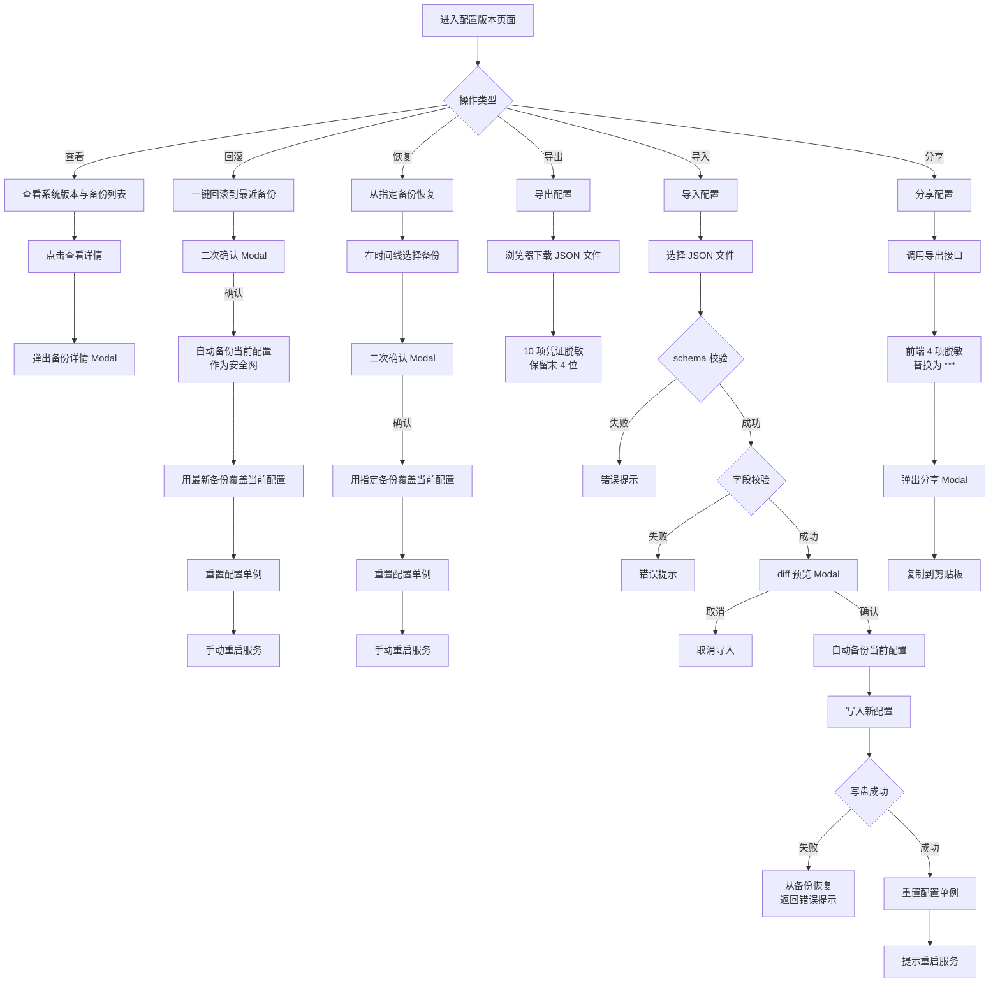
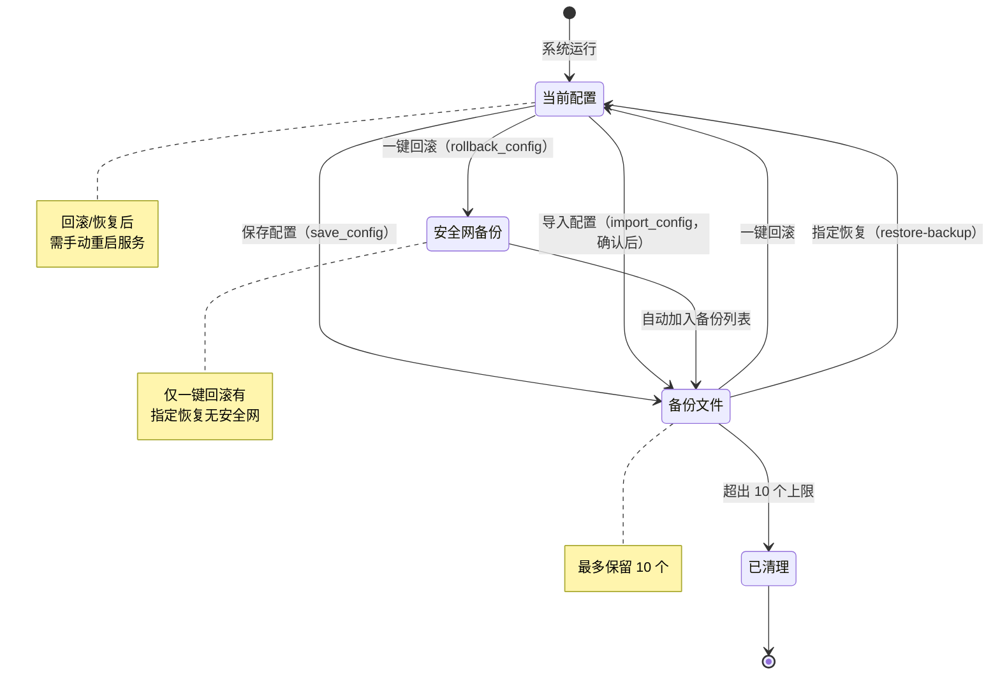

# 闲鱼猎人「配置版本」操作手册

| 属性     | 值                            |
| -------- | ----------------------------- |
| 文档版本 | v1.0                          |
| 文档日期 | 2026-07-05                    |
| 所属项目 | 闲鱼猎人                      |
| 所属菜单 | 配置管理 → 配置版本           |
| 文档类型 | 操作手册                      |
| 关联路由 | /config/version               |
| 配套详细设计 | v2.0                      |
| 配套需求规格 | v1.0                      |
| 目标读者 | 运营 / 管理员                 |

---

## 目录

- [0. 阶段交接声明](#0-阶段交接声明)
- [1. 功能简介](#1-功能简介)
- [2. 入口与导航](#2-入口与导航)
- [3. 界面布局](#3-界面布局)
- [4. 操作指南](#4-操作指南)
  - [4.1 查看系统版本与备份列表](#41-查看系统版本与备份列表)
  - [4.2 一键回滚到最近备份](#42-一键回滚到最近备份)
  - [4.3 从指定备份恢复](#43-从指定备份恢复)
  - [4.4 导出配置](#44-导出配置)
  - [4.5 导入配置](#45-导入配置)
  - [4.6 分享配置](#46-分享配置)
  - [4.7 字段级回滚（配置编辑页）](#47-字段级回滚配置编辑页)
- [5. 字段说明](#5-字段说明)
- [6. 常见问题 FAQ](#6-常见问题-faq)
- [7. 注意事项与限制](#7-注意事项与限制)
- [8. 关联功能](#8-关联功能)
- [9. 快捷键与技巧](#9-快捷键与技巧)
- [10. 修订记录](#10-修订记录)
- [11. 附录](#11-附录)

---

## 0. 阶段交接声明

```
- 当前阶段：配置版本操作手册编写（v1.0） ✅ 已完成
- 下一阶段：3 份文档一致性验证
- 下一阶段智能体：文档编写智能体
- 下一阶段技能：文档编写
- 交接上下文：配置版本操作手册 v1.0 已完成，面向运营/管理员，覆盖 7 个操作场景（查看版本/一键回滚/指定恢复/导出/导入/分享/字段级回滚）、备份字段说明、14 条 FAQ、8 条注意事项、6 个关联功能、快捷键与技巧、配置版本管理流程图与备份生命周期图。严格规避 API 路径/数据库表名/代码文件名等技术细节。
```

---

## 1. 功能简介

「配置版本」是闲鱼猎人系统的**配置全生命周期管理入口**，位于「配置管理」一级菜单下，是误操作恢复与配置迁移的核心页面。

通过本菜单，运营/管理员可以完成以下工作：

- **查看系统版本**：在页面顶部统计卡片查看当前系统版本号、构建日期与 Git 提交标识，便于判断版本新鲜度
- **浏览备份列表**：按时间倒序查看所有配置备份，支持分页浏览，最新备份置顶
- **一键回滚**：误改配置后，一键回滚到最近一次备份，回滚前会自动备份当前配置作为安全网
- **指定恢复**：从历史备份列表中选择任意一个备份进行恢复，适合回到特定时间点的配置
- **导出配置**：将当前配置导出为 JSON 文件，敏感凭证字段会自动脱敏（仅保留末 4 位）
- **导入配置**：从导出的 JSON 文件导入配置，支持 diff 预览与二次确认，避免误导入
- **分享配置**：生成可复制的脱敏配置 JSON 文本，方便分享给同事参考参数调优思路
- **字段级回滚**：在配置编辑页（如评估规则、价格策略）对单个字段进行回滚，无需整体回滚

> **提示**：配置版本是误操作恢复的最后一道防线。建议每次重大配置变更前，先手动触发一次保存（会自动生成备份），便于后续回滚。

---

## 2. 入口与导航

### 2.1 菜单入口

配置版本位于系统左侧导航栏的「配置管理」分组下：

```
配置管理
  └── 配置版本   （图标：历史记录图标，排序：第 107 位）
```

### 2.2 进入方式

| 方式 | 操作 | 说明 |
|------|------|------|
| 菜单点击 | 展开左侧「配置管理」→ 点击「配置版本」 | 默认入口，推荐 |
| URL 直接访问 | 在浏览器地址栏输入配置版本路径 | 刷新页面后自动恢复 |

### 2.3 子页面导航

配置版本本身只有一个页面，不包含子页面。但通过操作按钮可以触发以下流程：

| 操作 | 触发位置 | 流程 |
|------|----------|------|
| 一键回滚 | 顶部统计卡片 | 二次确认 Modal → 回滚 → 重新加载 |
| 指定恢复 | 版本时间线项 | 二次确认 Modal → 恢复 → 重新加载 |
| 导出配置 | 顶部操作栏 | 浏览器自动下载 JSON 文件 |
| 导入配置 | 顶部操作栏（Upload） | 选择文件 → diff 预览 Modal → 二次确认 → 导入 |
| 分享配置 | 顶部操作栏 | 弹出 Modal 展示脱敏 JSON → 复制到剪贴板 |
| 查看详情 | 版本时间线项 | 弹出 Modal 展示备份文件元数据 |

> **提示**：所有写操作（回滚/恢复/导入）都会有二次确认 Modal，避免误操作。

---

## 3. 界面布局

### 3.1 配置版本页面布局

配置版本页面自上而下分为 4 个区域：

```
┌─────────────────────────────────────────────────────────────┐
│  顶部操作栏：[刷新] [导出配置] [分享配置] [导入配置]            │
├─────────────────────────────────────────────────────────────┤
│  统计卡片 Row（4 列）：                                       │
│  ┌──────────┬──────────┬──────────┬──────────┐              │
│  │ 系统版本  │ 备份总数  │ 最近备份  │ 一键回滚 │              │
│  │ v1.0.0   │ 5 个     │ 2 小时前  │  按钮    │              │
│  │ 构建日期  │          │          │ (danger) │              │
│  │ Git SHA  │          │          │          │              │
│  └──────────┴──────────┴──────────┴──────────┘              │
├─────────────────────────────────────────────────────────────┤
│  版本时间线 Card：                                           │
│  ┌────────────────────────────────────────────────────────┐ │
│  │ ● 最新版本（绿色）2026-07-05 10:00:00  4 KB            │ │
│  │   [最新] [查看详情] [恢复]                              │ │
│  ├────────────────────────────────────────────────────────┤ │
│  │ ○ 历史版本（灰色）2026-07-04 15:30:00  4 KB            │ │
│  │   [v2] [查看详情] [恢复]                               │ │
│  ├────────────────────────────────────────────────────────┤ │
│  │ ○ 历史版本（灰色）2026-07-04 09:00:00  4 KB            │ │
│  │   [v3] [查看详情] [恢复]                               │ │
│  └────────────────────────────────────────────────────────┘ │
│                                                              │
│  分页：< 1 2 3 >（每页 10 条）                                │
└─────────────────────────────────────────────────────────────┘
```

### 3.2 统计卡片说明

| 卡片 | 内容 | 说明 |
|------|------|------|
| 系统版本 | `v{版本号}` + 构建日期 + Git SHA 前 7 位 | 来自系统构建信息，随发布递增，无上限 |
| 备份总数 | 备份文件数量 | 最多保留 10 个，超出自动清理旧备份 |
| 最近备份 | 距离最近一次备份的相对时间 | 如"2 小时前"、"3 天前" |
| 一键回滚 | danger 类型按钮 | 备份列表为空时按钮禁用 |

### 3.3 版本时间线说明

| 元素 | 显示规则 | 说明 |
|------|----------|------|
| 时间线圆点 | 最新版本绿色 + 勾选图标；历史版本灰色 | 视觉区分最新与历史 |
| 版本标签 | 最新版本显示"最新"标签；历史版本显示"vN"标签 | N 为时间线中的序号 |
| 时间 + 大小 | 备份时间 + 文件大小 | 秒级精度，便于区分 |
| 操作按钮 | "查看详情" + "恢复" | 查看详情弹 Modal，恢复需二次确认 |
| 分页 | 每页 10 条 | 超过 10 条时分页显示 |

### 3.4 Modal 弹窗说明

| Modal | 触发位置 | 内容 |
|-------|----------|------|
| 备份详情 Modal | "查看详情"按钮 | 文件名 / 备份时间 / 文件大小 / 时间戳 |
| 一键回滚确认 Modal | "一键回滚"按钮 | 标题 + 提示内容 + 确认/取消按钮（danger） |
| 指定恢复确认 Modal | "恢复"按钮 | 标题 + 提示内容 + 确认/取消按钮（danger） |
| 导入 diff 预览 Modal | 导入文件后 | diff 列表（路径 / 操作类型 / 旧值 / 新值） + 确认/取消按钮 |
| 分享配置 Modal | "分享配置"按钮 | 脱敏提示 + 只读 JSON 文本框 + 复制按钮 |

---

## 4. 操作指南

### 4.1 查看系统版本与备份列表

#### 操作步骤

1. 进入配置版本页面（左侧菜单「配置管理」→「配置版本」）
2. 页面加载完成后，顶部统计卡片自动显示：
   - 系统版本：`v{版本号}`（如 `v1.0.0`）
   - 构建日期：YYYY-MM-DD 格式
   - Git SHA 前 7 位：用于精确标识代码版本
3. 下方版本时间线按时间倒序展示所有备份
4. 点击"查看详情"按钮可查看备份文件元数据

#### 参数说明

| 字段 | 含义 | 示例 |
|------|------|------|
| 系统版本 | 当前系统构建版本号 | v1.0.0 |
| 构建日期 | 系统构建时间 | 2026-07-05 |
| Git SHA | 代码提交标识前 7 位 | abc123d |
| 备份总数 | 当前保留的备份数量 | 5 个（最多 10 个） |
| 最近备份 | 距离最近一次备份的相对时间 | 2 小时前 |
| 备份文件名 | 备份文件的命名 | `config.yaml.bak.20260705-100000` |
| 备份时间 | 备份生成的精确时间 | 2026-07-05 10:00:00 |
| 文件大小 | 备份文件大小 | 4 KB |

#### 操作结果

- 页面并行加载系统版本与备份列表，加载完成后所有卡片与时间线同时显示
- 备份列表按时间倒序，最新备份位于顶部，带绿色圆点与"最新"标签

> **提示**：系统版本号来自构建信息，与备份数量无关。即使备份被清理，版本号也不会变化。

---

### 4.2 一键回滚到最近备份

#### 操作步骤

1. 进入配置版本页面
2. 在顶部统计卡片 Row 中找到"一键回滚"按钮（红色 danger 按钮）
3. 点击按钮，弹出二次确认 Modal：
   - 标题："确认一键回滚？"
   - 内容："将回滚到最近的备份版本。回滚前会自动备份当前配置（安全网）。"
4. 点击"确认"按钮，系统执行：
   - 自动备份当前配置（作为安全网）
   - 用最新备份覆盖当前配置
   - 重置配置单例
5. 回滚成功后，页面顶部弹出成功提示，备份列表自动刷新

#### 参数说明

| 参数 | 含义 | 取值 |
|------|------|------|
| 回滚目标 | 自动取最新备份 | 不需要手动选择 |
| 安全网 | 回滚前自动备份当前配置 | 自动执行，无需配置 |
| 备份保留 | 自动清理超出 10 个的旧备份 | 自动执行 |

#### 操作结果

- 配置回滚到最近一次备份的状态
- 当前配置（回滚前）被自动备份，可在时间线中找到
- 配置单例已重置，但运行中的调度器仍持有旧配置引用

> **⚠️ 重要提示**：回滚后需要**重启服务**才能让调度器/worker 完全生效。当前版本前端不会主动提示重启，请管理员手动重启。

> **提示**：如果回滚后发现问题，可以通过"指定恢复"回到回滚前的状态（即安全网备份）。

---

### 4.3 从指定备份恢复

#### 操作步骤

1. 进入配置版本页面
2. 在版本时间线中找到目标备份
3. 点击该备份项右侧的"恢复"按钮
4. 弹出二次确认 Modal：
   - 标题："从备份恢复？"
   - 内容："将从 {备份时间} 的备份恢复配置。"
5. 点击"确认"按钮，系统执行：
   - 用指定备份覆盖当前配置
   - 重置配置单例
6. 恢复成功后，页面顶部弹出成功提示，备份列表自动刷新

#### 参数说明

| 参数 | 含义 | 取值 |
|------|------|------|
| 恢复目标 | 用户在时间线中选择的备份 | 任意历史备份 |
| 安全网 | **不自动备份当前配置** | 已知缺陷，需注意 |

#### 操作结果

- 配置恢复到指定备份的状态
- **当前配置不会被自动备份**（与一键回滚不同）
- 配置单例已重置，但运行中的调度器仍持有旧配置引用

> **⚠️ 重要提示**：
> 1. 恢复后需要**重启服务**才能让调度器/worker 完全生效。当前版本前端不会主动提示重启，请管理员手动重启。
> 2. **指定恢复不会自动备份当前配置**（无安全网）。如果恢复后发现问题，无法通过常规方式回到恢复前的状态。建议在恢复前先手动保存一次配置（生成备份）。

> **提示**：如果需要恢复到 3 天前的配置，可以在时间线中翻页查找，或通过文件名中的时间戳识别。

---

### 4.4 导出配置

#### 操作步骤

1. 进入配置版本页面
2. 点击顶部操作栏的"导出配置"按钮
3. 浏览器自动下载 JSON 文件
4. 文件保存到浏览器默认下载目录

#### 参数说明

| 参数 | 含义 | 取值 |
|------|------|------|
| 文件名格式 | `xianyu_hunter_config_YYYYMMDD_HHMMSS.json` | 秒级精度，避免同秒冲突 |
| 文件内容 | 配置 JSON（含 schema + 元数据 + 脱敏配置） | 26 个顶级字段 |
| 脱敏字段 | 10 个敏感凭证字段保留末 4 位 | 如 `****xxxx` |
| 元数据 | 导出时间、应用名称、应用版本 | 自动填充 |

#### 操作结果

- 浏览器下载 JSON 文件，文件名形如 `xianyu_hunter_config_20260705_100000.json`
- 文件内容包含完整的配置（26 个顶级字段）
- 敏感凭证字段已脱敏（仅保留末 4 位），可安全分享

> **提示**：导出的 JSON 文件可用于：1）配置迁移到新机器；2）配置备份归档；3）分享给同事参考参数调优思路。

> **注意**：导出的 JSON 中，10 个敏感凭证字段（如 Server酱 SendKey、PushPlus Token、Bark Key 等）会保留末 4 位字符（形如 `****xxxx`）。如需完全脱敏，请使用"分享配置"功能（前端 4 项替换为 `***`）。

---

### 4.5 导入配置

#### 操作步骤

1. 进入配置版本页面
2. 点击顶部操作栏的"导入配置"按钮（Upload 组件）
3. 在文件选择器中选择之前导出的 JSON 文件
4. 系统自动读取文件并校验：
   - 校验 schema 标识是否为 `xianyu_hunter.config/v1`
   - 校验配置字段是否符合 Pydantic 模型
5. 校验通过后，弹出 diff 预览 Modal：
   - 显示当前配置与导入配置的差异列表
   - 每条 diff 包含：路径 / 操作类型（修改/新增/删除）/ 旧值 / 新值
6. 点击"确认"按钮，系统执行：
   - 自动备份当前配置
   - 写入新配置
   - 重置配置单例
7. 导入成功后，页面顶部弹出成功提示，备份列表自动刷新

#### 参数说明

| 参数 | 含义 | 取值 |
|------|------|------|
| 文件格式 | JSON | 必须包含 `schema` 与 `config` 字段 |
| schema 标识 | 配置版本标识 | 必须为 `xianyu_hunter.config/v1` |
| diff 预览 | 显示差异列表 | 路径 / 操作类型 / 旧值 / 新值 |
| 二次确认 | Modal 确认 | 必须用户点击"确认"才会写入 |
| 写盘失败保护 | 自动从备份恢复 | 写盘失败时回滚到备份 |
| 重启提示 | 返回 `restart_required: true` | 提示用户重启服务 |

#### 操作结果

- 配置更新为导入文件中的内容
- 当前配置（导入前）被自动备份
- 配置单例已重置，但运行中的调度器仍持有旧配置引用
- 系统返回"需重启调度器才生效"的提示

> **提示**：导入配置是相对安全的操作，因为有完整的保护机制：schema 校验 + 字段校验 + diff 预览 + 二次确认 + 写盘失败保护 + 自动备份。

> **⚠️ 重要提示**：导入成功后需要**重启服务**才能让调度器/worker 完全生效。系统会返回重启提示，请管理员手动重启。

---

### 4.6 分享配置

#### 操作步骤

1. 进入配置版本页面
2. 点击顶部操作栏的"分享配置"按钮
3. 系统调用导出接口获取已脱敏配置
4. 前端对 4 项最常见的敏感字段进行二次脱敏（替换为 `***`）：
   - Server酱 SendKey
   - PushPlus Token
   - Bark 服务器地址
   - Bark Key
5. 弹出分享配置 Modal：
   - 顶部显示脱敏提示（4 个敏感字段名）
   - 中间为只读 JSON 文本框
   - 底部为"复制到剪贴板"按钮
6. 点击"复制到剪贴板"按钮，JSON 文本复制到剪贴板
7. 粘贴到任意位置（如聊天工具、文档）

#### 参数说明

| 参数 | 含义 | 取值 |
|------|------|------|
| 二次脱敏字段 | 4 项常见凭证 | Server酱 / PushPlus / Bark 服务器 / Bark Key |
| 二次脱敏方式 | 替换为 `***` | 完全隐藏 |
| 其他凭证 | 保留末 4 位 | 形如 `****xxxx`（来自后端导出脱敏） |
| 非凭证字段 | 不脱敏 | 通知配置、浏览器路径等 |

#### 操作结果

- 生成可复制的 JSON 文本
- 4 项最常见凭证字段被替换为 `***`
- 其他 6 项凭证字段保留末 4 位（来自后端导出脱敏）
- 通知配置（`notifier.channels`）和浏览器路径（`browser.user_data_dir`）未脱敏

> **⚠️ 隐私提示**：
> 1. 分享配置时，**剩余 6 项凭证字段**（Telegram Bot Token、Telegram Chat ID、企业微信 Webhook、钉钉 Webhook、钉钉加签密钥、通用 Webhook URL）仍会保留末 4 位字符（形如 `****xxxx`），可能泄露部分信息。
> 2. **通知配置**（`notifier.channels`）和**浏览器用户数据目录**（`browser.user_data_dir`）完全未脱敏，可能暴露机器名或用户名。
> 3. 如需更严格的脱敏，建议手动检查 JSON 内容后再分享，或联系开发团队改进脱敏逻辑。

> **提示**：分享配置主要用于分享"参数调优思路"（如评估权重、价格策略、搜索参数），不是用于配置迁移。配置迁移请使用"导出配置"+"导入配置"流程。

---

### 4.7 字段级回滚（配置编辑页）

#### 操作步骤

1. 进入任意配置编辑页面（如评估规则、价格策略、搜索参数等）
2. 修改某个字段值
3. 字段右侧出现"回滚"按钮（仅当值与原始值不同时显示）
4. 点击"回滚"按钮
5. 该字段值恢复为原始值
6. 点击"保存"按钮持久化

#### 参数说明

| 参数 | 含义 | 取值 |
|------|------|------|
| 触发条件 | 字段值与原始值不同 | 修改后自动显示回滚按钮 |
| 回滚范围 | 单个字段 | 不影响其他字段 |
| 路径格式 | 点分路径 | 如 `eval.pass_score` |
| 持久化 | 需手动点击"保存" | 回滚仅修改内存，未保存不生效 |

#### 操作结果

- 该字段值恢复为页面加载时的原始值
- 其他字段不受影响
- 需手动点击"保存"才会持久化

> **提示**：字段级回滚适用于"改了几个字段，只想撤销其中一两个"的场景。如果需要整体回滚，请使用"配置版本"页面的"一键回滚"或"指定恢复"。

> **注意**：字段级回滚仅修改内存中的配置，不会生成备份。如果已经点击"保存"，字段级回滚无法撤销，需要通过"配置版本"页面整体回滚。

---

## 5. 字段说明

### 5.1 统计卡片字段

| 字段名 | 含义 | 示例 | 可编辑 |
|--------|------|------|--------|
| 系统版本 | 当前系统构建版本号 | v1.0.0 | 否 |
| 构建日期 | 系统构建时间 | 2026-07-05 | 否 |
| Git SHA | 代码提交标识前 7 位 | abc123d | 否 |
| 备份总数 | 当前保留的备份数量 | 5 个（最多 10 个） | 否 |
| 最近备份 | 距离最近一次备份的相对时间 | 2 小时前 | 否 |

### 5.2 备份文件字段

| 字段名 | 含义 | 示例 | 可编辑 |
|--------|------|------|--------|
| 文件名 | 备份文件命名 | `config.yaml.bak.20260705-100000` | 否 |
| 备份时间 | 备份生成的精确时间 | 2026-07-05 10:00:00 | 否 |
| 文件大小 | 备份文件大小 | 4 KB | 否 |
| 时间戳 | 文件名中的时间戳 | 20260705-100000 | 否 |

### 5.3 导出 JSON 字段

| 字段名 | 含义 | 示例 | 脱敏 |
|--------|------|------|------|
| schema | 配置版本标识 | `xianyu_hunter.config/v1` | 否 |
| exported_at | 导出时间 | 2026-07-05T10:00:00 | 否 |
| app.name | 应用名称 | xianyu_hunter | 否 |
| app.version | 应用版本 | 1.0.0 | 否 |
| config.server | 服务监听配置 | `{host, port}` | 否 |
| config.browser | 浏览器配置 | `{headless, user_data_dir, ...}` | 部分（user_data_dir 未脱敏） |
| config.notifier | 通知配置 | `{default_channels, channels, ...}` | 部分（channels 未脱敏） |
| config.eval | 评估配置 | `{weights, thresholds, ...}` | 否 |
| config.search | 搜索配置 | `{page_size, sort_type, ...}` | 否 |
| config.price_strategy | 价格策略配置 | `{enabled_max, max_price, ...}` | 否 |
| config.chatbot | 智能客服配置 | `{enabled, max_history_turns, ...}` | 否 |
| config.serverchan_send_key | Server酱 SendKey | `****xxxx` | 是（保留末 4 位） |
| config.pushplus_token | PushPlus Token | `****xxxx` | 是（保留末 4 位） |
| config.bark_server | Bark 服务器地址 | `****xxxx` | 是（保留末 4 位） |
| config.bark_key | Bark Key | `****xxxx` | 是（保留末 4 位） |
| config.telegram_bot_token | Telegram Bot Token | `****xxxx` | 是（保留末 4 位） |
| config.telegram_chat_id | Telegram Chat ID | `****xxxx` | 是（保留末 4 位） |
| config.wecom_webhook | 企业微信 Webhook | `****xxxx` | 是（保留末 4 位） |
| config.dingtalk_webhook | 钉钉 Webhook | `****xxxx` | 是（保留末 4 位） |
| config.dingtalk_secret | 钉钉加签密钥 | `****xxxx` | 是（保留末 4 位） |
| config.webhook_url | 通用 Webhook URL | `****xxxx` | 是（保留末 4 位） |

### 5.4 导入 diff 字段

| 字段名 | 含义 | 示例 |
|--------|------|------|
| path | 配置路径（点分） | `eval.pass_score` |
| op | 操作类型 | `modify` / `add` / `remove` |
| old | 旧值 | `60` |
| new | 新值 | `70` |

---

## 6. 常见问题 FAQ

### Q1：系统版本号是怎么算的？

**A**：系统版本号来自构建信息（由构建脚本在打包时写入），随发布递增，无上限。这与备份数量无关——即使备份被清理，版本号也不会变化。版本号格式通常为 `v1.0.0`、`v1.1.0` 等语义化版本。

### Q2：备份会占用很多磁盘空间吗？

**A**：不会。系统最多保留 10 个备份，超出的旧备份会自动清理。单个配置文件通常只有几 KB，10 个备份总共也就几十 KB，对磁盘空间几乎没有影响。

### Q3：一键回滚和指定恢复有什么区别？

**A**：
- **一键回滚**：自动取最新备份，不需要手动选择，**回滚前会自动备份当前配置**作为安全网。如果回滚后发现问题，可以通过指定恢复回到回滚前的状态。
- **指定恢复**：从历史备份中选择任意一个进行恢复，**不会自动备份当前配置**（无安全网）。如果恢复后发现问题，无法通过常规方式回到恢复前的状态。

### Q4：回滚后还能再回滚回去吗？

**A**：一键回滚可以（回滚前会自动备份当前配置作为安全网）。指定恢复**不行**（不自动备份当前配置，恢复后无法回到恢复前的状态）。如果需要在指定恢复前保留当前配置，建议先手动保存一次配置（生成备份），再进行指定恢复。

### Q5：回滚/恢复后需要重启吗？

**A**：**需要**。回滚/恢复后配置已写入文件并重置配置单例，但运行中的调度器/worker 仍持有旧配置引用。需重启服务才能完全生效。当前版本前端不会主动提示重启（已知缺陷），请管理员手动重启。

### Q6：导入配置会覆盖现有配置吗？

**A**：会，但有完整的保护流程：schema 校验 → 字段校验 → diff 预览 → 二次确认 → 写盘。导入前会自动备份当前配置，写盘失败时从备份恢复。未确认前不会写入任何内容。导入成功后返回"需重启调度器才生效"的提示。

### Q7：导出的配置包含敏感信息吗？

**A**：导出时会对 10 个敏感凭证字段（Server酱 SendKey、PushPlus Token、Bark 服务器、Bark Key、Telegram Bot Token、Telegram Chat ID、企业微信 Webhook、钉钉 Webhook、钉钉加签密钥、通用 Webhook URL）做脱敏处理，仅保留末 4 位字符（形如 `****xxxx`）。但通知配置（`notifier.channels`）和浏览器用户数据目录（`browser.user_data_dir`）未脱敏，分享时请注意。

### Q8：分享配置会泄露我的 API Key 吗？

**A**：**存在部分泄露风险**。前端分享时会对 4 项最常见的凭证字段（Server酱 SendKey、PushPlus Token、Bark 服务器、Bark Key）做完全脱敏（替换为 `***`）。但剩余 6 项凭证字段（Telegram、企业微信、钉钉、通用 Webhook）仍会以 `****xxxx` 形式出现，可能泄露末 4 位字符。通知配置和浏览器路径完全未脱敏。如需更严格脱敏，建议手动检查 JSON 内容后再分享。

### Q9：写盘失败会怎样？

**A**：
- **导入配置/保存配置**：自动从刚生成的备份恢复，保证配置文件不损坏。返回错误提示"写入失败，已回滚"。
- **一键回滚/指定恢复**：**未实现写盘失败保护**（已知缺陷），写盘失败时配置文件可能损坏。如遇此情况，请从备份目录手动恢复最近的备份文件。

### Q10：字段级回滚怎么用？

**A**：在配置编辑页面（如评估规则、价格策略），每个数值字段右侧有回滚按钮（仅当值与原始值不同时显示）。点击调用字段级回滚，将单个字段恢复为原始值。其他字段不受影响。回滚仅修改内存，需手动点击"保存"才会持久化。若已保存，需通过"配置版本"页面整体回滚。

### Q11：为什么备份最多只有 10 个？

**A**：系统设置 `BACKUP_KEEP=10` 上限，保留最近 10 个备份，超出的旧备份自动清理。这是为了防止备份文件无限增长占用磁盘空间。备份主要为"误改后回滚"，无需长期归档。如需长期保存某个备份，建议导出为 JSON 文件归档。

### Q12：导入配置时提示"schema 不匹配"怎么办？

**A**：说明导入的 JSON 文件不是由本系统导出的，或版本不兼容。请确认：1）文件是由本系统的"导出配置"功能生成的；2）文件未被手动修改过；3）系统版本与导出时的版本一致。如需迁移配置到不同版本的系统，请手动复制配置内容。

### Q13：导入配置时 diff 列表中的"操作类型"是什么意思？

**A**：diff 列表显示当前配置与导入配置的差异：
- **修改（modify）**：字段存在但值不同，将被新值覆盖
- **新增（add）**：当前配置中不存在该字段，将新增
- **删除（remove）**：导入配置中不存在该字段，将删除

### Q14：分享配置和导出配置有什么区别？

**A**：
- **导出配置**：下载 JSON 文件，包含完整配置（26 个字段），10 项敏感凭证保留末 4 位。适合配置迁移与备份归档。
- **分享配置**：生成可复制的 JSON 文本，4 项最常见凭证替换为 `***`，其他 6 项凭证保留末 4 位。适合分享参数调优思路给同事。

---

## 7. 注意事项与限制

### 7.1 备份保留上限

系统最多保留 **10 个备份**，超出的旧备份会自动清理。单个清理失败不影响其他备份。如需长期保存某个备份，请使用"导出配置"下载 JSON 文件归档。

### 7.2 一键回滚有安全网，指定恢复没有

一键回滚在回滚前会自动备份当前配置作为安全网，回滚后可恢复。指定恢复**不会自动备份当前配置**，恢复后无法回到恢复前的状态。建议在指定恢复前先手动保存一次配置。

### 7.3 回滚/恢复后需手动重启

回滚/恢复后配置已写入文件并重置单例，但运行中的调度器/worker 仍持有旧配置引用。**需重启服务才能完全生效**。当前版本前端不会主动提示重启（已知缺陷），请管理员手动重启。

### 7.4 写盘失败保护范围有限

**导入配置/保存配置**有写盘失败保护：写盘失败时自动从备份恢复，配置文件不会损坏。**一键回滚/指定恢复未实现写盘失败保护**（已知缺陷），写盘失败时配置文件可能损坏。如遇此情况，请从备份目录手动恢复。

### 7.5 分享配置存在脱敏遗漏

前端分享配置时仅对 4 项最常见凭证做完全脱敏（替换为 `***`），其他 6 项凭证仍保留末 4 位字符（形如 `****xxxx`），可能泄露部分信息。通知配置和浏览器路径完全未脱敏。分享前请手动检查 JSON 内容，移除敏感信息。

### 7.6 文件名包含时间戳，秒级精度

备份文件名格式为 `config.yaml.bak.YYYYMMDD-HHMMSS`，秒级精度。同一秒内多次保存会覆盖同名备份。如需生成不同备份，请间隔至少 1 秒。

### 7.7 导入文件必须包含 schema 标识

导入的 JSON 文件必须包含 `schema` 字段且值为 `xianyu_hunter.config/v1`，否则会返回"schema 不匹配"错误。这是为了防止导入非本系统生成的配置文件。

### 7.8 字段级回滚不生成备份

字段级回滚仅修改内存中的配置，不会生成备份。如果已点击"保存"，字段级回滚无法撤销，需要通过"配置版本"页面整体回滚。

---

## 8. 关联功能

配置版本与以下菜单存在联动关系：

| 关联菜单 | 联动关系 | 说明 |
|----------|----------|------|
| 价格策略 | 配置编辑 | 价格策略修改后会自动生成备份，可在配置版本中回滚 |
| 评估规则 | 配置编辑 | 评估规则修改后会自动生成备份，可在配置版本中回滚 |
| 抢单策略 | 配置编辑 | 抢单策略修改后会自动生成备份，可在配置版本中回滚 |
| 搜索参数 | 配置编辑 | 搜索参数修改后会自动生成备份，可在配置版本中回滚 |
| 通知渠道 | 配置编辑 | 通知渠道修改后会自动生成备份，可在配置版本中回滚 |
| AI 服务 | 配置编辑 | AI 服务配置修改后会自动生成备份，可在配置版本中回滚 |
| 客服配置 | 配置编辑 | 客服配置修改后会自动生成备份，可在配置版本中回滚 |
| 关于 | 版本信息 | 关于页面也显示系统版本号，与配置版本页面的版本号一致 |

> **提示**：所有配置编辑页面的"保存"操作都会自动生成备份，可在配置版本中找到并回滚。

---

## 9. 快捷键与技巧

### 9.1 快捷键

配置版本页面暂无专属快捷键，遵循系统通用快捷键：

| 快捷键 | 作用 | 备注 |
|--------|------|------|
| `Ctrl+K`（或 `⌘+K`） | 打开命令面板 | 可模糊搜索任意菜单或命令 |
| `Escape` | 关闭 Modal | 仅在 Modal 打开时生效 |
| `F5` | 刷新页面 | 重新加载备份列表与系统版本 |

### 9.2 实用技巧

**技巧 1：变更前先保存一次**

重大配置变更前，先到任意配置编辑页面做一次空保存（不修改任何字段直接保存），生成一个备份。这样变更后如果发现问题，可以通过"指定恢复"回到变更前的状态。

**技巧 2：导出配置作为长期归档**

系统最多保留 10 个备份，超出的会自动清理。如需长期保存某个配置版本，使用"导出配置"下载 JSON 文件，存放到归档目录。

**技巧 3：分享配置前手动检查**

分享配置时，4 项最常见凭证会被替换为 `***`，但其他 6 项凭证仍保留末 4 位。分享前请手动检查 JSON 内容，移除 Telegram、企业微信、钉钉等敏感信息。

**技巧 4：用 diff 预览验证导入**

导入配置时，diff 预览会显示所有差异。请仔细检查 diff 列表，特别是"删除"操作（表示当前配置有但导入配置没有的字段），避免误删除重要配置。

**技巧 5：字段级回滚避免整体回滚**

如果只改了几个字段且只想撤销其中一两个，使用字段级回滚（在配置编辑页面），无需整体回滚。这样不会影响其他字段的修改。

**技巧 6：通过文件名识别备份时间**

备份文件名包含时间戳（如 `config.yaml.bak.20260705-100000` 表示 2026 年 7 月 5 日 10:00:00）。通过文件名可以快速识别备份时间，便于在时间线中定位。

**技巧 7：并行加载提升响应速度**

配置版本页面并行加载备份列表与系统版本号，减少等待时间。如遇加载缓慢，请检查网络或后端服务状态。

**技巧 8：分页浏览历史备份**

备份列表每页显示 10 条。如果备份数较多，使用分页控件翻页查找。最新备份始终在第一页顶部。

---

## 10. 修订记录

| 版本 | 日期 | 修订人 | 修订内容 |
|------|------|--------|----------|
| v1.0 | 2026-07-05 | 文档编写智能体 | 初版操作手册，覆盖 7 个操作场景（查看版本/一键回滚/指定恢复/导出/导入/分享/字段级回滚）、备份字段说明、14 条 FAQ、8 条注意事项、8 个关联功能、快捷键与技巧、配置版本管理流程图与备份生命周期图 |

---

## 11. 附录

### 11.1 配置版本管理流程图



### 11.2 备份生命周期图



### 11.3 操作类型对比表

| 操作 | 触发位置 | 自动备份当前 | 写盘失败保护 | 重启提示 | 适用场景 |
|------|----------|--------------|--------------|----------|----------|
| 一键回滚 | 顶部统计卡片 | ✅ 有安全网 | ❌ 无 | ❌ 无 | 误改后快速恢复 |
| 指定恢复 | 时间线项 | ❌ 无安全网 | ❌ 无 | ❌ 无 | 恢复到特定时间点 |
| 导入配置 | 顶部操作栏 | ✅ 有 | ✅ 有 | ✅ 有 | 配置迁移、批量更新 |
| 保存配置 | 配置编辑页 | ✅ 有 | ✅ 有 | ✅ 有 | 日常配置修改 |
| 导出配置 | 顶部操作栏 | — | — | — | 配置备份、迁移 |
| 分享配置 | 顶部操作栏 | — | — | — | 分享参数调优思路 |
| 字段级回滚 | 配置编辑页 | ❌ 不生成 | — | — | 撤销单字段修改 |

### 11.4 备份文件名时间戳对照

| 文件名 | 生成时间 |
|--------|----------|
| `config.yaml.bak.20260705-100000` | 2026-07-05 10:00:00 |
| `config.yaml.bak.20260705-153000` | 2026-07-05 15:30:00 |
| `config.yaml.bak.20260704-090000` | 2026-07-04 09:00:00 |
| `config.yaml.bak.20260630-235959` | 2026-06-30 23:59:59 |

**时间戳格式**：`YYYYMMDD-HHMMSS`
- `YYYY`：4 位年份
- `MM`：2 位月份（01-12）
- `DD`：2 位日期（01-31）
- `HH`：2 位小时（00-23，24 小时制）
- `MM`：2 位分钟（00-59）
- `SS`：2 位秒（00-59）

### 11.5 已知缺陷清单

| 编号 | 缺陷描述 | 影响范围 | 临时解决方案 |
|------|----------|----------|--------------|
| 1 | 一键回滚无写盘失败保护 | 写盘失败时配置可能损坏 | 从备份目录手动恢复 |
| 2 | 指定恢复无写盘失败保护 | 同上 | 同上 |
| 3 | 一键回滚不返回 restart_required | 前端不提示重启 | 管理员手动重启 |
| 4 | 指定恢复不返回 restart_required | 同上 | 同上 |
| 5 | 指定恢复无安全网 | 恢复后无法回退 | 恢复前手动保存一次 |
| 6 | 前端分享脱敏仅 4 项 | 6 项凭证保留末 4 位 | 手动检查 JSON 内容 |

> **提示**：以上已知缺陷已在详细设计 v2.0 与需求规格 v1.0 中标注，后续版本会逐步修复。

---

## 阶段交接声明

- 当前阶段：配置版本操作手册 v1.0 编写 ✅ 已完成
- 下一阶段：3 份文档一致性验证
- 下一阶段智能体：文档编写智能体
- 下一阶段技能：文档编写
- 交接上下文：
  · 配置版本操作手册 v1.0 已完成，面向运营/管理员
  · 覆盖 7 个操作场景（查看版本/一键回滚/指定恢复/导出/导入/分享/字段级回滚）
  · 14 条 FAQ、8 条注意事项、8 个关联功能、8 条实用技巧
  · 配置版本管理流程图、备份生命周期图、操作类型对比表
  · 已知缺陷清单（6 项）与临时解决方案
  · 与详细设计 v2.0 和需求规格 v1.0 完全对齐
  · 严格规避 API 路径/数据库表名/代码文件名等技术细节
