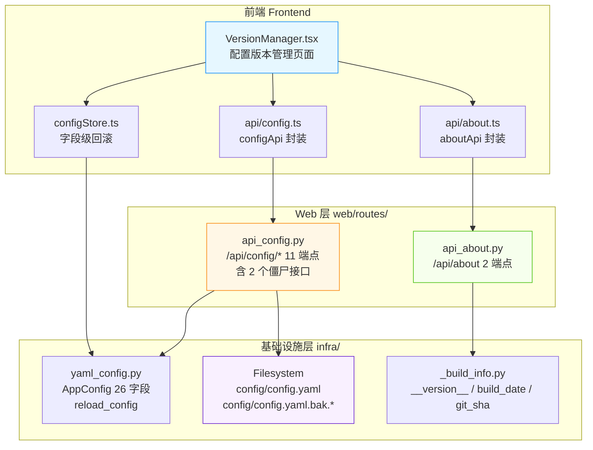
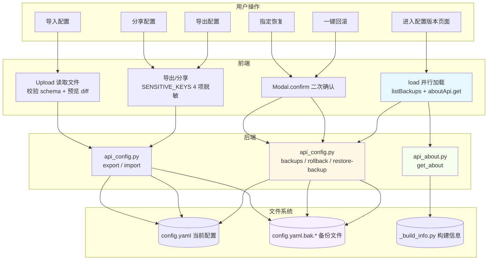
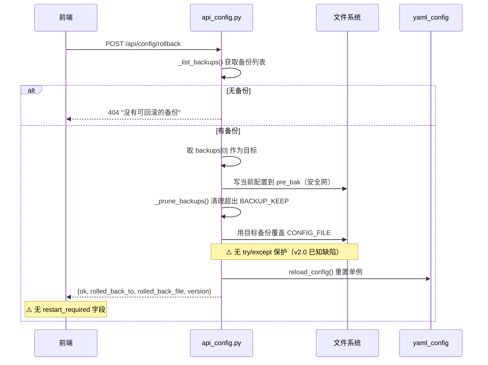
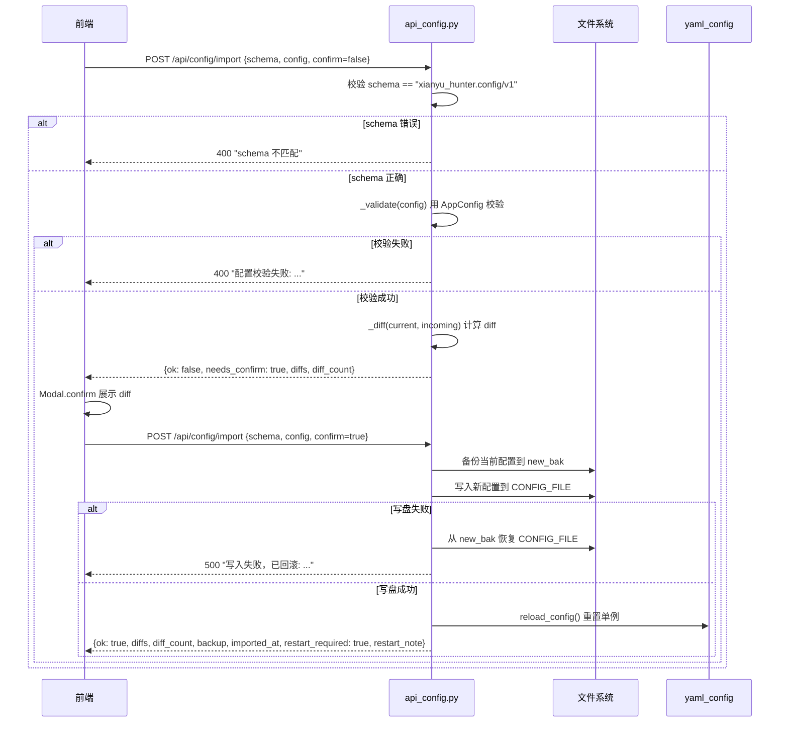
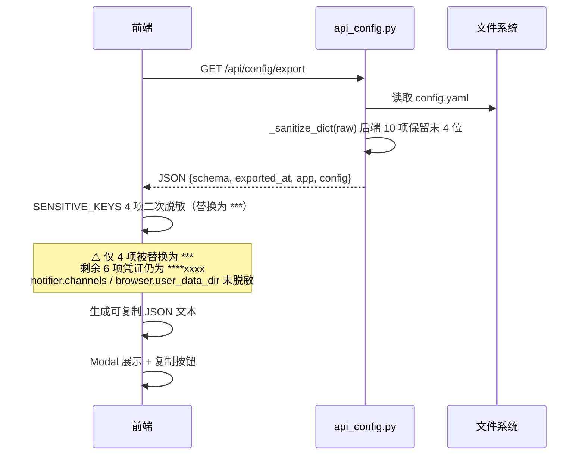

# 闲鱼猎人「配置版本」模块需求规格说明书

| 项 | 内容 |
|---|---|
| 文档版本 | v1.0 |
| 文档日期 | 2026-07-05 |
| 文档状态 | 初版（与详细设计 v2.0 对齐） |
| 所属项目 | 闲鱼猎人（XianyuHunter） |
| 所属菜单 | 配置管理 → 配置版本 |
| 菜单标识 | `menu_registry.yaml` 中 `key=version`、`icon=HistoryOutlined`、`sort_order=107`、`category=config` |
| 关联路由 | 前端 `/config/version`；后端 `/api/config/*`、`/api/about` |
| 关联文档 | [配置版本-详细设计.md](配置版本-详细设计.md)（v2.0/2026-07-05） |
| 文档类型 | 需求规格说明书（SRS） |

> **本文档首段：继承 project_memory.md 中的硬约束。** 1. Web 进程必须使用 `with_browser=False` 模式；2. 认证白名单机制（`/api/about` 已加入白名单）；3. 前端 fetch 必须含 `credentials: 'include'`；4. 401 必须返回 JSON；5. token 比较使用 `hmac.compare_digest()`；6. 敏感字段不日志；7. token 写失败触发 `logging.warning()`；8. 模块级 import；9. DB 索引齐全；10. COUNT 查询 CASE WHEN 聚合；11. WebView2 子进程 `CREATE_NEW_CONSOLE`；12. WebView2 `private_mode=False`。

> **本文档与详细设计 v2.0 完全对齐**，包含 6 项 v1.0→v2.0 关键修正与 2 个僵尸接口标注。

---

## 0. 阶段交接声明

```
- 当前阶段：配置版本 SRS 编写（v1.0） ✅ 已完成
- 下一阶段：配置版本操作手册编写 + 3 份文档一致性验证
- 下一阶段智能体：文档编写智能体
- 下一阶段技能：文档编写
- 交接上下文：
  · 本文档定义「配置管理 → 配置版本」二级菜单完整需求 v1.0
  · 关键设计决策：1 个前端页面（VersionManager）+ 9 个实际使用 API 端点 + 2 个僵尸接口
  · 与详细设计 v2.0 完全对齐，修正 6 项差异：
    ① 前端版本号来源切换为 /api/about
    ② 分享配置前端调用 /api/config/export + 前端 4 项脱敏
    ③ 前端 SENSITIVE_KEYS 4 项 vs 后端 _SHARE_REDACT_PATHS 12 项
    ④ 导入/导出 JSON 结构补全为 26 个顶级字段
    ⑤ rollback / restore-backup 缺少写盘失败保护
    ⑥ rollback / restore-backup 未返回 restart_required
  · 2 个僵尸接口：/api/config/version（备份数计数）、/api/config/share（12 项脱敏）
  · 配套操作手册待编写（v1.0，2026-07-05）
```

---

## 1. 引言

### 1.1 编写目的

本需求规格说明书定义「配置管理 → 配置版本」二级菜单的完整需求规格，作为前端/后端开发、测试与验收的唯一依据。

**目标读者**：
- 后端开发工程师：依据 §3-§6、§8、§10 进行模块实现与扩展
- 前端开发工程师：依据 §4、§9 进行页面开发
- 测试工程师：依据 §7、§11 编写测试用例与执行验收
- 项目经理：依据 §2、§11 进行范围与里程碑管理
- 智能客服 KB 训练：本文档与 [配置版本-详细设计.md](配置版本-详细设计.md) 共同作为 KB 检索素材

### 1.2 项目背景

闲鱼猎人（XianyuHunter）是一个闲鱼自动捡漏与抢单工具，已具备任务管理、商品采集、AI 评估、自动下单、多渠道通知等完整能力（详见 [requirements.md](../requirements.md)、[design.md](../design.md) 与 [概要设计文档.md](../概要设计文档.md)）。

随着系统配置项增多，**配置版本管理相关的核心能力目前集中在 `api_config.py` 单文件**，但 v1.0 详细设计文档存在 6 项与实际代码不一致的差异，导致开发与运维认知成本高：

| 痛点 | v1.0 文档假设 | v2.0 实际代码 | 影响 |
|------|---------------|---------------|------|
| 版本号来源错误 | `/api/config/version` 备份数计数 | `/api/about` 的 `__version__` 构建版本号 | 备份数受 `BACKUP_KEEP=10` 限制会卡在 v10 |
| 分享接口错误 | 前端调用 `/api/config/share` | 前端调用 `/api/config/export` + 前端脱敏 | 后端 12 项脱敏未生效，实际仅 4 项 |
| 脱敏项数错误 | 前后端脱敏一致 | 前端 4 项 vs 后端 12 项 | 8 项敏感字段脱敏遗漏 |
| JSON 结构不完整 | 10 个顶级字段 | 26 个顶级字段（16 嵌套 + 10 扁平凭证） | 文档示例不可用 |
| 写盘保护遗漏 | 4 个写盘端点都有保护 | 仅 `save_config` / `import_config` 有保护 | `rollback` / `restore-backup` 配置可能损坏 |
| restart_required 遗漏 | 4 个写盘端点都返回 | 仅 `save_config` / `import_config` 返回 | 前端无法提示用户重启 |

**解决方案**：本文档与详细设计 v2.0 共同重写，将上述 6 项差异全部修正，并标注 2 个"僵尸接口"（`/api/config/version` 与 `/api/config/share`，后端实现完整但前端不再调用），**让配置版本管理与代码实现完全一致**。

### 1.3 范围与约束

#### 1.3.1 包含范围（In-Scope）

- 系统版本号展示（来自 `/api/about` 的 `__version__`，不再用备份数计数）
- 备份列表与自动清理（`BACKUP_KEEP=10`，秒级精度命名）
- 一键回滚（最近备份，回滚前自动备份当前配置作为安全网）
- 指定恢复（任意备份，filename 白名单校验防穿越）
- 导出配置（`_SENSITIVE_KEYS` 10 项保留末 4 位脱敏）
- 导入配置（schema 校验 + diff 预览 + confirm 二次确认 + 写盘失败保护 + restart_required）
- 分享配置（前端调用 `/api/config/export` + 前端 SENSITIVE_KEYS 4 项二次脱敏）
- 字段级回滚（`configStore.getFieldOriginal` / `revertField`）
- 写盘失败保护（仅 `save_config` / `import_config`，从备份回滚）
- 白名单校验防目录穿越（filename 只含字母数字 + `-` `_` `.`）
- 僵尸接口标注（`/api/config/version` 与 `/api/config/share` 后端保留但前端不调用）

#### 1.3.2 排除范围（Out-of-Scope）

- 不实现配置版本审计日志（备份仅为误改后回滚，无审计需求）
- 不实现配置版本权限隔离（所有用户共享同一份 `config.yaml`）
- 不实现配置版本回滚到指定时间点（仅支持备份文件粒度）
- 不实现配置版本跨实例同步（单实例部署）
- 不实现前端配置编辑页（本模块仅展示与回滚，编辑在其他配置页）
- 不实现僵尸接口的废弃清理（保留用于兼容旧客户端）
- 不实现 `_UPDATABLE_KEYS` 热更新（属于智能客服模块 `api_chatbot_config.py`，非配置版本模块）

#### 1.3.3 硬约束

继承 [project_memory.md](c:/Users/hspcadmin/.trae-cn/memory/projects/-d-code-otherProjects-17-xianyu/project_memory.md) 中的项目硬约束，并显式映射到本模块实现：

| 硬约束 | 本模块适用性 | 实现要点 |
|--------|--------------|----------|
| Web 进程使用 `with_browser=False` 模式 | 适用 | 配置版本管理纯文件操作，不需要浏览器 |
| 认证白名单（`/api/auth/cookie` 等） | 部分适用 | `/api/about` **加入白名单**（前端未登录也可取版本号）；`/api/config/*` **必须**走认证 |
| 前端 fetch 必须含 `credentials: 'include'` | 适用 | `frontend/src/api/config.ts` 与 `about.ts` 全量沿用 `client` 默认配置 |
| 401 响应必须返回 JSON `{"detail":"Unauthorized"}` | 适用 | `api_config.py` / `api_about.py` 路由层统一异常处理 |
| 后端 token 比较使用 `hmac.compare_digest()` | 不适用 | 本模块无 token 比较场景 |
| 敏感字段（token 长度等）不日志 | 适用 | §8.5 日志规范：仅记录 filename / mtime / size，不打印敏感配置内容 |
| token 写失败触发 `logging.warning()` | 不适用 | 本模块无 token 写入场景 |
| 缺失 import 必须 module-level | 适用 | `api_config.py` 顶部统一 import `re` / `threading` / `logging` |
| DB 必须在 `task_id/seller_id/...` 加索引 | 不适用 | 本模块不涉及 DB（纯 YAML 文件操作） |
| COUNT 查询用 CASE WHEN 聚合 | 不适用 | 本模块不涉及 DB COUNT 查询 |
| WebView2 子进程使用 `CREATE_NEW_CONSOLE` | 不适用 | 本模块不涉及 WebView2 |
| WebView2 `webview.start()` 设 `private_mode=False` + 独立 `storage_path` | 不适用 | 同上 |
| KBManager 排除 `web/static/` 等目录 | 不适用 | 本模块不涉及 KB 索引 |
| `local_embedding.py` HF_ENDPOINT 设置 | 不适用 | 本模块不涉及 embedding |
| EmbeddingService 本地后端 | 不适用 | 同上 |
| `run_migrations` 各块独立 try/except | 不适用 | 本模块不涉及 DB 迁移 |
| 启动钩子异常 `logger.exception()` | 适用 | `startup.py` 配置加载失败时打印完整 traceback |

### 1.4 术语与缩写

| 术语 | 全称 | 说明 |
|------|------|------|
| AppConfig | App Config | Pydantic 根配置模型，26 个顶级字段（16 嵌套 + 10 扁平凭证） |
| BackupItem | Backup Item | 备份文件元数据（filename/ts_raw/mtime/size/ts） |
| AboutInfo | About Info | `/api/about` 响应类型（product/version/build_date/git_sha/python/platform） |
| BACKUP_KEEP | Backup Keep | 备份保留上限（10 个） |
| BACKUP_PREFIX | Backup Prefix | 备份文件名前缀（`config.yaml.bak.`） |
| BACKUP_DIR | Backup Directory | 备份目录（`config/`） |
| CONFIG_FILE | Config File | 当前配置文件路径（`config/config.yaml`） |
| SENSITIVE_KEYS | Sensitive Keys | 前端 4 项敏感字段脱敏常量（`VersionManager.tsx:121`） |
| `_SENSITIVE_KEYS` | Backend Sensitive Keys | 后端导出脱敏 frozenset（10 项 + `openai_api_key`） |
| `_SHARE_REDACT_PATHS` | Share Redact Paths | 后端分享脱敏路径列表（12 项，僵尸接口用） |
| `_UPDATABLE_KEYS` | Updatable Keys | 智能客服热更新白名单（17 keys，**不属于本模块**） |
| `_build_info` | Build Info | 构建信息模块（`_build_info.py` 由 `scripts/build_info.py` 写入） |
| `__version__` | Version | 系统构建版本号（`_build_info.__version__`） |
| reload_config | Reload Config | 重置配置单例函数（保存/导入/回滚/恢复后调用） |
| _safe_app_version | Safe App Version | 取 `__version__` 的安全函数（失败回退 `unknown`） |
| _safe_build_info | Safe Build Info | 读取 `_build_info.py` 的安全函数 |
| restart_required | Restart Required | 重启标志位（保存/导入返回 True，回滚/恢复未返回） |
| 僵尸接口 | Zombie Interface | 后端实现完整但前端不再调用的 API 端点 |
| Pydantic | Pydantic | Python 数据校验库（AppConfig 模型基类） |
| YAML | YAML Ain't Markup Language | 配置文件格式（`config.yaml`） |
| schema | Schema | 配置版本标识（`xianyu_hunter.config/v1`） |
| confirm | Confirm | 导入二次确认标志位 |
| dry_run | Dry Run | 保存预演模式（不写盘） |
| diff | Diff | 配置差异（path/op/old/new） |
| 安全网 | Safety Net | 回滚前自动备份当前配置 |
| 字段级回滚 | Field-level Rollback | `configStore.revertField(path)` 单字段恢复 |

### 1.5 参考资料

| 文档 | 路径 | 用途 |
|------|------|------|
| 需求文档 v1.0 | [../requirements.md](../requirements.md) | 系统整体需求基线 |
| 概要设计文档 v2.0 | [概要设计文档.md](../概要设计文档.md) | 36 个 API 路由、11 张数据表、技术选型 |
| 技术设计说明书 | [../design.md](../design.md) | 分层架构、Evaluator 设计、状态机 |
| 配置版本 详细设计 v2.0 | [配置版本-详细设计.md](配置版本-详细设计.md) | 本模块技术设计、代码位置、FAQ |
| 任务管理 SRS | [../02-数据查看/任务管理-需求规格.md](../02-数据查看/任务管理-需求规格.md) | SRS 模板参考（12 章节完整版） |
| 反爬登录管理 SRS | [../04-系统维护/反爬登录管理-需求规格.md](../04-系统维护/反爬登录管理-需求规格.md) | SRS 模板参考 |
| 智能客服 SRS | [../06-智能客服/智能客服-需求规格.md](../06-智能客服/智能客服-需求规格.md) | SRS 模板参考 |
| 项目硬约束 | [project_memory.md](c:/Users/hspcadmin/.trae-cn/memory/projects/-d-code-otherProjects-17-xianyu/project_memory.md) | 必须继承的硬约束清单 |
| 菜单元数据 | [../../config/menu_registry.yaml](../../config/menu_registry.yaml) | `key=version`、`sort_order=107` |
| 配置 API 后端 | [../../backend/xianyu_hunter/web/routes/api_config.py](../../backend/xianyu_hunter/web/routes/api_config.py) | 配置 CRUD + 备份 + 回滚 + 导入/导出 + 分享（11 端点） |
| 关于 API 后端 | [../../backend/xianyu_hunter/web/routes/api_about.py](../../backend/xianyu_hunter/web/routes/api_about.py) | 系统元信息 + 检查更新（2 端点） |
| 配置模型 | [../../backend/xianyu_hunter/infra/yaml_config.py](../../backend/xianyu_hunter/infra/yaml_config.py) | AppConfig 26 字段定义 |
| 配置版本页面 | [../../frontend/src/pages/Config/VersionManager.tsx](../../frontend/src/pages/Config/VersionManager.tsx) | 配置版本管理页面 |
| 配置 Store | [../../frontend/src/stores/configStore.ts](../../frontend/src/stores/configStore.ts) | 字段级回滚 |
| 配置 API 封装 | [../../frontend/src/api/config.ts](../../frontend/src/api/config.ts) | configApi（含 getVersion 僵尸方法） |
| 关于 API 封装 | [../../frontend/src/api/about.ts](../../frontend/src/api/about.ts) | aboutApi |
| 智能客服配置 API | [../../backend/xianyu_hunter/web/routes/api_chatbot_config.py](../../backend/xianyu_hunter/web/routes/api_chatbot_config.py) | `_UPDATABLE_KEYS`（不属于本模块，仅参考） |

---

## 2. 总体描述

### 2.1 产品定位

「配置版本」是闲鱼猎人系统的**配置全生命周期管理入口**，定位为：

> 通过版本号（系统构建版本 + 备份计数）+ 多版本备份（`BACKUP_KEEP=10`）+ 一键回滚 + 指定恢复 + 导入/导出 + 分享脱敏，实现配置的全生命周期管理与误操作回滚。

**核心价值**：
1. **版本可视化**：系统版本号来自 `/api/about` 的 `__version__`（构建时写入），随发布递增无上限
2. **备份可控**：`BACKUP_KEEP=10` 自动清理旧备份，秒级精度命名
3. **回滚双路径**：一键回滚（最近备份，含安全网）+ 指定恢复（任意备份，filename 白名单校验）
4. **导入/导出安全**：schema 校验 + diff 预览 + confirm 二次确认 + 写盘失败保护
5. **分享脱敏**：前端 4 项 SENSITIVE_KEYS 二次脱敏（虽然后端 12 项脱敏未生效，但导出已对 10 项凭证保留末 4 位）

### 2.2 用户角色与特征

| 角色 | 特征 | 使用场景 | 关注重点 |
|------|------|----------|----------|
| 误改恢复用户 | 在配置编辑页误改参数 | 进入配置版本 → 一键回滚 | 一键回滚、最近备份时间 |
| 历史版本恢复 | 想恢复到 N 天前的配置 | 在版本时间线找备份 → 恢复 | 指定恢复、备份列表分页 |
| 配置迁移用户 | 新机器复用旧配置 | 导出配置 → 下载 JSON → 在新机器导入 | 导出/导入、diff 预览 |
| 配置分享用户 | 想分享参数调优思路 | 点击分享配置 → 复制 JSON | 分享脱敏、敏感字段保护 |
| 版本诊断用户 | 想知道当前系统版本 | 进入配置版本 → 查看顶部统计卡片 | 系统版本、构建日期、git_sha |
| 高级调试 | 需要单字段回滚 | 在配置编辑页点击字段回滚按钮 | 字段级回滚（`configStore.revertField`） |

### 2.3 运行环境

| 项 | 要求 |
|---|---|
| 操作系统 | Windows 10/11（主），Linux/macOS 需兼容 |
| Python | 3.11+ |
| Node.js | 18+（仅前端构建） |
| 后端框架 | FastAPI（已集成） |
| 前端框架 | React 18 + TypeScript + Ant Design 5（已集成） |
| 配置文件 | YAML 格式（`config/config.yaml`） |
| 备份目录 | `config/`（与配置文件同目录） |
| 构建信息 | `backend/xianyu_hunter/_build_info.py`（由 `scripts/build_info.py` 写入） |

### 2.4 设计约束

1. **集成部署**：作为 `backend/xianyu_hunter/web/routes/api_config.py` 路由 + `frontend/src/pages/Config/VersionManager.tsx` 页面集成到现有系统，不独立部署
2. **复用 Container 单例**：所有端点通过 `get_container()` 访问 Container，保证配置状态一致
3. **写操作 POST，读操作 GET**：与现有 REST 规范对齐（rollback/restore-backup 用 POST，无 body）
4. **同步路由**：所有端点为同步路由（无 async），文件 I/O 通过 `pathlib.Path` 同步操作
5. **前端布局对齐 Ant Design 5**：Card + Timeline + Modal + Pagination 组件
6. **持久化开关**：分页 pageSize 持久化到 localStorage（`xh.config.pageSize`）
7. **多用户共享**：所有用户共享同一份 `config.yaml`，无用户隔离（与任务管理不同）
8. **认证白名单**：`/api/about` 加入认证白名单（前端未登录也可取版本号）；`/api/config/*` 必须认证
9. **前端懒加载**：`React.lazy` 加载 VersionManager 组件，必须配置 `Suspense` fallback
10. **备份文件原子写**：`write_text` 写盘失败时从备份回滚（仅 `save_config` / `import_config`）

### 2.5 假设与依赖

**假设**：
- 用户已部署闲鱼猎人 v2.x+ 并能访问 `MainLayout` 侧边栏
- `config/config.yaml` 已存在且可读可写
- `backend/xianyu_hunter/_build_info.py` 已由 `scripts/build_info.py` 在构建时写入

**依赖**：
- 依赖现有 `auth.py` 认证中间件（`/api/config/*` 必须认证）
- 依赖现有 `BearerAuthMiddleware` 白名单配置（`/api/about` 已加入白名单）
- 依赖现有 `Container`（注入 `config` 单例）
- 依赖现有 `reload_config()` 函数（重置配置单例）
- 依赖现有 `menu_registry.yaml` 菜单注册（已配置 `key=version`）
- 依赖现有 Pydantic `AppConfig` 模型（26 字段校验）
- 新增无外部依赖

---

## 3. 总体架构设计

### 3.1 模块架构图



### 3.2 数据流程图



### 3.3 关键时序图

#### 3.3.1 一键回滚时序（含安全网）



#### 3.3.2 导入配置时序（含 diff + confirm + 写盘保护）



#### 3.3.3 分享配置时序（前端 4 项脱敏）



---

## 4. 功能需求

### FR-1 系统版本号展示

**FR-1.1** `GET /api/about` 返回系统元信息
- 响应字段：`{product, version, build_date, git_sha, python, platform}`
- `version` 来自 `_build_info.__version__`（构建时写入）
- 失败回退 `unknown`（`_safe_build_info` 函数）
- **不加入认证白名单**：前端未登录也可调用（已在 `BearerAuthMiddleware` 配置）

**FR-1.2** 前端 VersionManager 顶部统计卡片显示：
- 系统版本：`v{buildInfo.version}`（如 `v1.0.0`）
- 构建日期：`buildInfo.build_date`
- git SHA 前 7 位：`buildInfo.git_sha.slice(0, 7)`

**FR-1.3** 版本号来源切换说明（v1.0→v2.0 关键变更）：
- **v1.0 假设**：调用 `GET /api/config/version` 取备份数计数
- **v2.0 实际**：调用 `GET /api/about` 取 `__version__` 构建版本号
- **切换原因**：备份数受 `BACKUP_KEEP=10` 限制会卡在 v10，无法反映系统真实版本
- 代码位置：`VersionManager.tsx:51` 使用 `aboutApi.get()`

### FR-2 备份列表与自动清理

**FR-2.1** `GET /api/config/backups` 返回备份列表
- 响应字段：`{backups[], count, keep}`
- `backups[]` 每项含 `{filename, ts_raw, mtime, size, ts}`
- 按时间倒序排列（`backups[0]` 为最新）
- `count` = 备份总数，`keep` = `BACKUP_KEEP=10`

**FR-2.2** 备份文件命名规则（`_new_backup_name` 函数）：
- 格式：`config.yaml.bak.YYYYMMDD-HHMMSS`
- 秒级精度，足够日常区分
- 例：`config.yaml.bak.20260705-100000`

**FR-2.3** 自动清理策略（`_prune_backups` 函数）：
- `BACKUP_KEEP=10`：保留最近 10 个备份
- 超出的旧备份自动清理（按 mtime 倒序，保留前 10）
- 单个清理失败不影响其他（`except OSError: pass`）
- 不软删除/归档：备份仅为"误改后回滚"，无需审计

**FR-2.4** 前端版本时间线渲染：
- `Timeline` 组件按时间倒序显示
- 最新版本（`globalIndex=0`）：绿色 dot + `CheckCircleOutlined` + "最新" Tag
- 历史版本：灰色 dot + "vN" Tag
- 每项显示：时间 + 文件大小 + 操作按钮（查看详情 / 恢复）
- 分页：每页 10 条（`PAGE_SIZE=10`）

### FR-3 一键回滚（最近备份）

**FR-3.1** `POST /api/config/rollback` 一键回滚到最近备份
- 无请求参数
- 流程：
  1. `_list_backups()` 获取备份列表
  2. 若无备份 → 404 "没有可回滚的备份"
  3. 取 `backups[0]`（最新备份）作为目标
  4. **回滚前先备份当前配置**（安全网）：`pre_bak = BACKUP_DIR / _new_backup_name()`，写入当前配置
  5. `_prune_backups()` 清理超出 `BACKUP_KEEP` 的旧备份
  6. 用目标备份覆盖 `CONFIG_FILE`
  7. `reload_config()` 重置单例
- 响应：`{ok, rolled_back_to, rolled_back_file, version}`

**FR-3.2** 为什么回滚前先备份（安全网）：
- 防止误操作后无法恢复
- 回滚本身也是一次"配置变更"，需要可追溯

**FR-3.3** ⚠️ 写盘失败保护缺失（v2.0 已知缺陷）：
- `rollback_config` 第 603 行 `CONFIG_FILE.write_text(...)` 未包裹 try/except
- 写盘失败（磁盘满/权限问题）会抛未捕获异常，配置文件可能损坏
- 对比 `save_config` / `import_config` 有 try/except 从备份回滚

**FR-3.4** ⚠️ restart_required 缺失（v2.0 已知缺陷）：
- `rollback_config` 返回值不含 `restart_required` 字段
- 前端无法提示用户"需重启调度器才生效"
- 对比 `save_config` / `import_config` 返回 `restart_required: True`

**FR-3.5** 前端 `handleRollback`：
- `Modal.confirm` 标题"确认一键回滚？"
- 内容"将回滚到最近的备份版本。回滚前会自动备份当前配置（安全网）。"
- danger 类型
- 成功后 `message.success` + `load()` 重新加载

### FR-4 指定恢复（任意备份）

**FR-4.1** `POST /api/config/restore-backup?filename=xxx` 从指定备份恢复
- Query 参数：`filename`（备份文件名）
- 流程：
  1. 不传 filename → 回退到旧 `.yaml.bak`（兼容升级前已存在的备份）
  2. 传 filename → `_resolve_backup(filename)` 校验白名单
  3. 用目标备份覆盖 `CONFIG_FILE`
  4. `reload_config()` 重置单例
- 响应：`{ok, restored_from, restored_at}`

**FR-4.2** 白名单校验防目录穿越（`_resolve_backup` 函数）：
- filename 必须以 `BACKUP_PREFIX`（`config.yaml.bak.`）开头
- filename 只含字母数字 + `-` `_` `.`
- 文件必须存在（`is_file()` 校验）
- 校验失败：400 "非法的备份文件名" / 400 "备份文件名包含非法字符" / 404 "备份不存在"

**FR-4.3** 为什么需要白名单校验：
- 防止 `filename` 里塞 `../` 实现目录穿越读取任意文件
- 白名单字符集：字母数字 + 时间戳分隔符（`-`）+ `.` + `_`

**FR-4.4** ⚠️ 写盘失败保护缺失（v2.0 已知缺陷）：
- `restore_backup` 第 632 行 `CONFIG_FILE.write_text(...)` 未包裹 try/except

**FR-4.5** ⚠️ restart_required 缺失（v2.0 已知缺陷）：
- `restore_backup` 返回值不含 `restart_required` 字段

**FR-4.6** ⚠️ 安全网缺失（v2.0 已知缺陷）：
- `restore_backup` 不像 `rollback_config` 那样在恢复前自动备份当前配置
- 用户误操作后无法回退到恢复前的状态

**FR-4.7** 前端 `handleRestore`：
- `Modal.confirm` 标题"从备份恢复？"
- 内容"将从 {ts} 的备份恢复配置。"
- danger 类型

### FR-5 导出配置（脱敏）

**FR-5.1** `GET /api/config/export` 导出配置 JSON
- 无请求参数
- 流程：
  1. 读取 `config.yaml` 原始内容
  2. `_sanitize_dict(raw)` 递归脱敏，`_SENSITIVE_KEYS` 10 项保留末 4 位
  3. 包装为 `{schema, exported_at, app, config}` 结构
  4. `app.version` 调用 `_safe_app_version()` 取 `__version__`
  5. 返回 JSON 文件下载（`Content-Disposition` 触发浏览器下载）
- 文件名：`xianyu_hunter_config_YYYYMMDD_HHMMSS.json`

**FR-5.2** `_SENSITIVE_KEYS` 11 项（`api_config.py:697-702`）：
```python
_SENSITIVE_KEYS = frozenset({
    "serverchan_send_key", "pushplus_token", "bark_key", "bark_server",
    "telegram_bot_token", "telegram_chat_id", "wecom_webhook",
    "dingtalk_webhook", "dingtalk_secret", "webhook_url",
    "openai_api_key",
})
```
- 实际导出脱敏 10 项（`openai_api_key` 走 `config.py` Settings 不经过 YAML）
- 脱敏方式：`****` + 末 4 位（长度 ≤4 时返回 `"****"`）

**FR-5.3** 导出 JSON 结构（26 个顶级字段）：
```json
{
  "schema": "xianyu_hunter.config/v1",
  "exported_at": "2026-07-05T10:00:00",
  "app": {
    "name": "xianyu_hunter",
    "version": "1.0.0"
  },
  "config": {
    "server": {...},
    "browser": {...},
    "antidetect": {...},
    "waf": {...},
    "notifier": {...},
    "eval": {...},
    "search": {...},
    "price_strategy": {...},
    "batch_refresh": {...},
    "chatbot": {...},
    "task_scheduler": {...},
    "cookie_management": {...},
    "token_renewer": {...},
    "login_orchestrator": {...},
    "mtop_sync": {...},
    "subprocess_sync": {...},
    "serverchan_send_key": "****xxxx",
    "pushplus_token": "****xxxx",
    "bark_server": "****xxxx",
    "bark_key": "****xxxx",
    "telegram_bot_token": "****xxxx",
    "telegram_chat_id": "****xxxx",
    "wecom_webhook": "****xxxx",
    "dingtalk_webhook": "****xxxx",
    "dingtalk_secret": "****xxxx",
    "webhook_url": "****xxxx"
  }
}
```

**FR-5.4** 26 个顶级字段清单（对应 `AppConfig` Pydantic 模型，`yaml_config.py:509`）：

| 序号 | 字段名 | 类型 | 说明 |
|------|--------|------|------|
| 1 | `server` | ServerConfig | 服务监听配置（host/port） |
| 2 | `browser` | BrowserConfig | 浏览器配置（headless/UA/viewport/代理/CDP 等） |
| 3 | `antidetect` | AntiDetectConfig | 反检测配置（QPS/延迟/熔断阈值） |
| 4 | `waf` | WAFConfig | WAF 配置（开关/登录检查间隔） |
| 5 | `notifier` | NotifierConfig | 通知配置（默认渠道/订阅事件/免打扰） |
| 6 | `eval` | EvalConfig | 评估配置（权重/阈值/AI 提示词等） |
| 7 | `search` | SearchConfig | 搜索配置（页数/排序/超时/地区等） |
| 8 | `price_strategy` | PriceStrategyConfig | 价格策略配置 |
| 9 | `batch_refresh` | BatchRefreshConfig | 批量采集配置 |
| 10 | `chatbot` | ChatbotConfig | 智能客服配置 |
| 11 | `task_scheduler` | TaskSchedulerConfig | 任务调度器配置 |
| 12 | `cookie_management` | CookieManagementConfig | Cookie 自愈体系配置 |
| 13 | `token_renewer` | TokenRenewerConfig | Token 续期配置 |
| 14 | `login_orchestrator` | LoginOrchestratorConfig | 登录编排器配置 |
| 15 | `mtop_sync` | MtopSyncConfig | MTOP 同步配置 |
| 16 | `subprocess_sync` | SubprocessSyncConfig | 子进程同步配置 |
| 17 | `serverchan_send_key` | str | Server 酱 SendKey（导出时脱敏为 `****xxxx`） |
| 18 | `pushplus_token` | str | PushPlus Token |
| 19 | `bark_server` | str | Bark 服务器地址 |
| 20 | `bark_key` | str | Bark Key |
| 21 | `telegram_bot_token` | str | Telegram Bot Token |
| 22 | `telegram_chat_id` | str | Telegram Chat ID |
| 23 | `wecom_webhook` | str | 企业微信 Webhook |
| 24 | `dingtalk_webhook` | str | 钉钉 Webhook |
| 25 | `dingtalk_secret` | str | 钉钉加签密钥 |
| 26 | `webhook_url` | str | 通用 Webhook URL |

**FR-5.5** 前端 `handleExport`：
- 调用 `configApi.export()` 获取 JSON
- 触发浏览器下载（`Content-Disposition` 自动处理）
- 文件名：`xianyu_hunter_config_YYYYMMDD_HHMMSS.json`

### FR-6 导入配置（schema + diff + confirm + 写盘保护）

**FR-6.1** `POST /api/config/import` 导入配置 JSON
- 请求体：`{schema, config, confirm?}`
- 流程：
  1. 校验 `schema == "xianyu_hunter.config/v1"`，否则 400
  2. 校验 `config` 是 dict，否则 400
  3. `_validate(incoming)` 用 AppConfig 模型校验，失败 400
  4. `_diff(current, incoming)` 计算 diff
  5. 若未传 `confirm=true` → 返回 `{ok: false, needs_confirm: true, diffs, diff_count}`，前端二次确认
  6. 传 `confirm=true` → 备份当前文件 + 写盘 + reload
  7. 写盘失败从备份恢复（try/except 保护）
  8. 返回 `{ok: true, diffs, diff_count, backup, imported_at, restart_required: True, restart_note}`

**FR-6.2** schema 校验：
- 强制 `schema == "xianyu_hunter.config/v1"`
- 不匹配返回 400 "schema 不匹配"

**FR-6.3** AppConfig 模型校验：
- `_validate(data)` 用 Pydantic 模型校验所有字段
- 失败返回 400 "配置校验失败: {错误信息}"

**FR-6.4** diff 计算（`_diff` 函数）：
- 递归比较两个 dict，生成 `{path, op, old, new}` 列表
- `op` 由 av/bv 的 truthy 判定：
  - 均非空 → `modify`
  - 只剩 bv → `add`
  - 只剩 av → `remove`
- None 转空串便于前端渲染，非 None 用 JSON 序列化保留类型信息

**FR-6.5** confirm 二次确认：
- 未传 `confirm=true` → 返回 `{ok: false, needs_confirm: true, diffs, diff_count}`
- 前端 `Modal.confirm` 展示 diff 列表
- 用户确认后再次调用传 `confirm=true`

**FR-6.6** 写盘失败保护（`api_config.py:539-545`）：
```python
try:
    CONFIG_FILE.write_text(_dump_yaml(new), encoding="utf-8")
    reload_config()
except Exception as e:
    if new_bak and new_bak.exists():
        CONFIG_FILE.write_text(new_bak.read_text(encoding="utf-8"), encoding="utf-8")
    raise HTTPException(status_code=500, detail=f"写入失败，已回滚: {e}")
```
- 写盘可能因磁盘满/权限问题失败
- 失败后从刚生成的备份恢复，保证配置文件不损坏

**FR-6.7** restart_required 返回：
- 导入成功返回 `restart_required: True` + `restart_note`
- 前端可提示用户"需重启调度器才生效"

**FR-6.8** 前端 `processImport` / `handleImport`：
- `Upload.beforeUpload` 钩子读取文件
- 调用 `configApi.import(config, confirm=false)` 预览 diff
- `Modal.confirm` 展示 diff 列表（path / op / old / new）
- 用户确认后调用 `configApi.import(config, confirm=true)`
- 成功后 `message.success` + `load()` 重新加载

### FR-7 分享配置（前端 4 项脱敏）

**FR-7.1** 前端 `handleShare`（`VersionManager.tsx:123-141`）：
- 调用 `configApi.export()` 获取已脱敏配置（后端 `_SENSITIVE_KEYS` 10 项保留末 4 位）
- 前端 `SENSITIVE_KEYS` 4 项二次脱敏：替换为 `***`
- 生成可复制 JSON 文本
- `Modal` 展示 + 复制按钮

**FR-7.2** 前端 SENSITIVE_KEYS 4 项（`VersionManager.tsx:121`）：
```typescript
const SENSITIVE_KEYS = ['serverchan_send_key', 'pushplus_token', 'bark_server', 'bark_key']
```

**FR-7.3** 后端 `_SHARE_REDACT_PATHS` 12 项（僵尸接口 `/api/config/share` 用）：
```python
_SHARE_REDACT_PATHS = [
    ("notifier", "channels"),
    ("serverchan_send_key",),
    ("pushplus_token",),
    ("bark_server",),
    ("bark_key",),
    ("telegram_bot_token",),
    ("telegram_chat_id",),
    ("wecom_webhook",),
    ("dingtalk_webhook",),
    ("dingtalk_secret",),
    ("webhook_url",),
    ("browser", "user_data_dir"),
]
```

**FR-7.4** 前后端脱敏差异对照表（v1.0→v2.0 关键差异）：

| 路径 | 前端 SENSITIVE_KEYS | 后端 `_SHARE_REDACT_PATHS` | 差异 |
|------|---------------------|---------------------------|------|
| `serverchan_send_key` | ✅ | ✅ | 一致 |
| `pushplus_token` | ✅ | ✅ | 一致 |
| `bark_server` | ✅ | ✅ | 一致 |
| `bark_key` | ✅ | ✅ | 一致 |
| `telegram_bot_token` | ❌ | ✅ | **前端遗漏** |
| `telegram_chat_id` | ❌ | ✅ | **前端遗漏** |
| `wecom_webhook` | ❌ | ✅ | **前端遗漏** |
| `dingtalk_webhook` | ❌ | ✅ | **前端遗漏** |
| `dingtalk_secret` | ❌ | ✅ | **前端遗漏** |
| `webhook_url` | ❌ | ✅ | **前端遗漏** |
| `notifier.channels` | ❌ | ✅ | **前端遗漏**（dict 类型） |
| `browser.user_data_dir` | ❌ | ✅ | **前端遗漏**（路径泄露） |

**FR-7.5** 风险提示：
- 用户通过前端"分享配置"按钮分享时，后端 `/api/config/export` 已对 10 个扁平字符串凭证做保留末 4 位的脱敏（`_SENSITIVE_KEYS`）
- 但前端 4 项 SENSITIVE_KEYS 仅替换其中 4 项为 `***`
- 剩余 6 个凭证字段（telegram_*/wecom_*/dingtalk_*/webhook_url）以 `****xxxx` 形式出现在分享文本中，仍可能泄露末 4 位
- `notifier.channels` 和 `browser.user_data_dir` 完全未脱敏
- 如需更严格脱敏，应改用后端 `/api/config/share` 接口（12 项脱敏）

### FR-8 字段级回滚

**FR-8.1** `configStore.getFieldOriginal(path)`（`configStore.ts:121-138`）：
- 按点分路径（如 `eval.pass_score`）从 `original` 中获取原始值
- 路径不存在时不写入，避免在 config 上创建 undefined 键
- 用于显示"字段已修改"指示器

**FR-8.2** `configStore.revertField(path)`（`configStore.ts:140-154`）：
- 将 `config` 中指定 path 的值恢复为 `original` 中的值
- 深拷贝 config 使用 `structuredClone`（保留类型，无需 as 断言）
- 用于配置编辑页面的单字段回滚按钮

**FR-8.3** 字段级回滚使用场景：
- 配置编辑页面（如评估规则、价格策略）
- 每个数值字段右侧有回滚按钮（仅当值与原始值不同时显示）
- 点击调用 `revertField(path)`，将 config 中指定 path 恢复为 original 中的值
- 若已保存，需通过"配置版本"页面整体回滚

### FR-9 安全防护

**FR-9.1** 白名单校验防目录穿越（`_resolve_backup` 函数）：
- filename 必须以 `BACKUP_PREFIX`（`config.yaml.bak.`）开头
- filename 只含字母数字 + `-` `_` `.`
- 文件必须存在
- 校验失败：400 / 404

**FR-9.2** 写盘失败保护（仅 `save_config` / `import_config`）：
- try/except 捕获写盘异常
- 从 `new_bak` 读取内容写回 `CONFIG_FILE`
- 返回 500 错误提示"写入失败，已回滚"
- **⚠️ 保护范围**：仅 `save_config` 和 `import_config` 实现了该保护；`rollback_config` 和 `restore_backup` **未实现**

**FR-9.3** schema 校验：
- 导入时强制 `schema == "xianyu_hunter.config/v1"`
- 不匹配返回 400

**FR-9.4** AppConfig 模型校验：
- `_validate(data)` 用 Pydantic 模型校验所有字段
- 失败返回 400 "配置校验失败"

**FR-9.5** confirm 二次确认：
- 导入时未传 `confirm=true` 返回 `needs_confirm`
- 前端必须二次确认

**FR-9.6** 备份保留上限：
- `BACKUP_KEEP=10` 防止备份文件无限增长
- 超出自动清理（`_prune_backups`）

### FR-10 僵尸接口标注

**FR-10.1** `/api/config/version`（备份数计数）：
- 后端实现完整（`get_config_version` 函数，`api_config.py:561-575`）
- 返回 `{version, latest_backup_ts, latest_backup_file}`
- `version` = `len(_list_backups())`
- **前端不再调用**：VersionManager 改用 `/api/about` 取 `__version__`
- **原因**：备份数受 `BACKUP_KEEP=10` 限制会卡在 v10，无法反映系统真实版本
- **保留原因**：兼容旧客户端

**FR-10.2** `/api/config/share`（12 项脱敏）：
- 后端实现完整（`share_config` 函数，`api_config.py:410-440`）
- 返回 `{summary, config, redacted_fields}`
- `_redact_for_share` 递归脱敏，`_SHARE_REDACT_PATHS` 12 项
- **前端不再调用**：VersionManager 改用 `/api/config/export` + 前端 4 项脱敏
- **原因**：前端希望复用导出接口的 JSON 格式，且前端脱敏逻辑更简单
- **保留原因**：兼容旧客户端

**FR-10.3** 僵尸接口维护策略：
- 后端保留实现，不主动废弃
- 前端 `api/config.ts` 中 `getVersion` 方法保留（不删除）
- 文档中明确标注"僵尸接口"
- 未来版本如需清理，需先确认无外部客户端依赖

---

## 5. 接口定义

所有配置接口统一前缀：`/api/config`，关于接口前缀：`/api/about`。
- `/api/config/*` **必须**走 `auth.py` 认证（**不加入白名单**）
- `/api/about` **加入认证白名单**（前端未登录也可调用）

### 5.1 配置版本管理接口（`api_config.py`）

#### GET `/api/config`

**描述**：返回当前生效配置（已脱敏）

**响应**：脱敏后的 AppConfig dict

**前端调用**：是（其他配置页）

---

#### GET `/api/config/raw`

**描述**：返回 YAML 原始内容（脱敏）

**响应**：`{raw: str}`

**前端调用**：是（其他配置页）

---

#### POST `/api/config/preview`

**描述**：预览改动（不写盘）

**请求体**：`payload: dict`

**响应**：`{diffs, validation, new_yaml?}`

**前端调用**：是（其他配置页）

---

#### POST `/api/config/save`

**描述**：保存配置（带备份 + 写盘失败保护 + restart_required）

**请求体**：`{payload, dry_run}`

**响应**：`{ok, dry_run, saved_at?, diffs, backup?, restart_required?, restart_note?}`

**前端调用**：是（其他配置页）

---

#### GET `/api/config/backups`

**描述**：备份列表（按时间倒序）

**响应**：
```json
{
  "backups": [
    {
      "filename": "config.yaml.bak.20260705-100000",
      "ts_raw": "20260705-100000",
      "mtime": 1783230000.0,
      "size": 4096,
      "ts": "2026-07-05T10:00:00"
    }
  ],
  "count": 1,
  "keep": 10
}
```

**前端调用**：**是**（VersionManager）

---

#### POST `/api/config/rollback`

**描述**：一键回滚到最近备份（含安全网）

**请求体**：无

**响应**：
```json
{
  "ok": true,
  "rolled_back_to": "2026-07-05T10:00:00",
  "rolled_back_file": "config.yaml.bak.20260705-100000",
  "version": 1
}
```

**错误**：
- 404 "没有可回滚的备份"

**前端调用**：**是**（VersionManager）

**⚠️ 已知缺陷**：无写盘失败保护、无 restart_required

---

#### POST `/api/config/restore-backup`

**描述**：从指定备份恢复

**Query 参数**：`filename`（备份文件名）

**响应**：
```json
{
  "ok": true,
  "restored_from": "config.yaml.bak.20260705-100000",
  "restored_at": "2026-07-05T11:00:00"
}
```

**错误**：
- 400 "非法的备份文件名"
- 400 "备份文件名包含非法字符"
- 404 "备份 {filename} 不存在"

**前端调用**：**是**（VersionManager）

**⚠️ 已知缺陷**：无写盘失败保护、无 restart_required、无安全网备份

---

#### GET `/api/config/export`

**描述**：导出配置 JSON（脱敏）

**响应**：JSON 文件下载（含 schema + 元数据 + 脱敏配置）

**Content-Disposition**：`attachment; filename=xianyu_hunter_config_YYYYMMDD_HHMMSS.json`

**前端调用**：**是**（VersionManager 导出 + 分享）

---

#### POST `/api/config/import`

**描述**：导入配置 JSON（schema + diff + confirm + 写盘保护）

**请求体**：
```json
{
  "schema": "xianyu_hunter.config/v1",
  "config": {...},
  "confirm": false
}
```

**响应（未传 confirm）**：
```json
{
  "ok": false,
  "needs_confirm": true,
  "diffs": [
    {"path": "eval.pass_score", "op": "modify", "old": "60", "new": "70"}
  ],
  "diff_count": 1
}
```

**响应（传 confirm=true）**：
```json
{
  "ok": true,
  "diffs": [...],
  "diff_count": 1,
  "backup": "config.yaml.bak.20260705-110000",
  "imported_at": "2026-07-05T11:00:00",
  "restart_required": true,
  "restart_note": "需重启调度器才生效"
}
```

**错误**：
- 400 "schema 不匹配"
- 400 "配置校验失败: ..."
- 500 "写入失败，已回滚: ..."

**前端调用**：**是**（VersionManager）

---

#### GET `/api/config/version` ⚠️ 僵尸接口

**描述**：获取备份数计数版本号

**响应**：
```json
{
  "version": 5,
  "latest_backup_ts": "2026-07-05T10:00:00",
  "latest_backup_file": "config.yaml.bak.20260705-100000"
}
```

**前端调用**：**❌ 僵尸接口**（前端不再调用，改用 `/api/about`）

**保留原因**：兼容旧客户端

---

#### GET `/api/config/share` ⚠️ 僵尸接口

**描述**：分享脱敏配置（后端 12 项）

**响应**：
```json
{
  "summary": "...",
  "config": {...},
  "redacted_fields": ["serverchan_send_key", ...]
}
```

**前端调用**：**❌ 僵尸接口**（前端不再调用，改用 `/api/config/export` + 前端脱敏）

**保留原因**：兼容旧客户端

---

### 5.2 关于接口（`api_about.py`）

#### GET `/api/about`

**描述**：系统元信息

**响应**：
```json
{
  "product": "闲鱼猎人",
  "version": "1.0.0",
  "build_date": "2026-07-05",
  "git_sha": "abc123def456...",
  "python": "3.11.5",
  "platform": "windows"
}
```

**前端调用**：**是**（VersionManager 取 version）

**认证**：加入白名单（前端未登录也可调用）

---

#### GET `/api/about/check-update`

**描述**：检查 GitHub 最新版本

**响应**：
```json
{
  "current": "1.0.0",
  "latest": "1.1.0",
  "has_update": true,
  "release_url": "https://github.com/...",
  "checked_at": "2026-07-05T10:00:00",
  "source": "remote",
  "published_at": "2026-07-04T12:00:00"
}
```

**前端调用**：是（关于页）

---

## 6. 数据模型

### 6.1 备份文件元数据（`_list_backups` 函数）

位置：`api_config.py:107-130`

| 字段 | 类型 | 说明 |
|------|------|------|
| `filename` | `str` | 文件名（`config.yaml.bak.YYYYMMDD-HHMMSS`） |
| `ts_raw` | `str` | 文件名尾部时间戳（`YYYYMMDD-HHMMSS`） |
| `mtime` | `float` | 文件修改时间戳（Unix epoch） |
| `size` | `int` | 文件大小（字节） |
| `ts` | `str` | ISO 时间字符串（用于前端展示，`timespec="seconds"`） |

### 6.2 系统版本信息（来自 `/api/about`）

位置：`api_about.py:181-192`

| 字段 | 类型 | 说明 |
|------|------|------|
| `product` | `str` | 产品名（"闲鱼猎人"） |
| `version` | `str` | 系统版本号（`_build_info.__version__`，失败回退 `unknown`） |
| `build_date` | `str` | 构建日期（`_build_info.build_date`） |
| `git_sha` | `str` | Git 提交 SHA（`_build_info.git_sha`） |
| `python` | `str` | Python 版本（`major.minor.micro`） |
| `platform` | `str` | 操作系统（`platform.system().lower()`） |

### 6.3 备份数计数版本信息（僵尸接口 `/api/config/version`）

位置：`api_config.py:561-575`

| 字段 | 类型 | 说明 |
|------|------|------|
| `version` | `int` | 版本号 = 备份数量，0 表示从未保存过 |
| `latest_backup_ts` | `str \| None` | 最近备份的 ISO 时间 |
| `latest_backup_file` | `str \| None` | 最近备份的文件名 |

> **⚠️ 僵尸接口**：后端实现完整但前端不再调用（前端改用 `/api/about` 取系统版本号）。保留用于兼容旧客户端。

### 6.4 前端 BackupItem 类型

```typescript
interface BackupItem {
  filename: string
  ts_raw: string
  mtime: number
  size: number
  ts: string  // ISO 时间字符串
}
```

### 6.5 前端 AboutInfo 类型（`frontend/src/api/about.ts`）

```typescript
interface AboutInfo {
  product: string
  version: string
  build_date: string
  git_sha: string
  python: string
  platform: string
}
```

### 6.6 前端 SENSITIVE_KEYS（4 项，`VersionManager.tsx:121`）

```typescript
const SENSITIVE_KEYS = ['serverchan_send_key', 'pushplus_token', 'bark_server', 'bark_key']
```

### 6.7 后端 `_SHARE_REDACT_PATHS`（12 项，`api_config.py:300-313`）

```python
_SHARE_REDACT_PATHS = [
    ("notifier", "channels"),         # 通知开关（可能含渠道自定义配置）
    ("serverchan_send_key",),
    ("pushplus_token",),
    ("bark_server",),
    ("bark_key",),
    ("telegram_bot_token",),
    ("telegram_chat_id",),
    ("wecom_webhook",),
    ("dingtalk_webhook",),
    ("dingtalk_secret",),
    ("webhook_url",),
    ("browser", "user_data_dir"),    # 路径（可能暴露机器/用户名）
]
```

### 6.8 后端 `_SENSITIVE_KEYS`（10 项，导出脱敏，`api_config.py:697-702`）

```python
_SENSITIVE_KEYS = frozenset({
    "serverchan_send_key", "pushplus_token", "bark_key", "bark_server",
    "telegram_bot_token", "telegram_chat_id", "wecom_webhook",
    "dingtalk_webhook", "dingtalk_secret", "webhook_url",
    "openai_api_key",
})
```

> **注意**：`_SENSITIVE_KEYS` 共 11 项（含 `openai_api_key`），但 `openai_api_key` 走 `config.py` Settings 不经过 YAML，实际导出脱敏 10 项。脱敏方式：`****` + 末 4 位（长度 ≤4 时返回 `"****"`）。

### 6.9 导入/导出 JSON 结构（26 个顶级字段）

见 §FR-5.3 与 §FR-5.4。

### 6.10 AppConfig Pydantic 模型（`yaml_config.py:509`）

| 序号 | 字段名 | 类型 | 说明 |
|------|--------|------|------|
| 1 | `server` | ServerConfig | 服务监听配置（host/port） |
| 2 | `browser` | BrowserConfig | 浏览器配置 |
| 3 | `antidetect` | AntiDetectConfig | 反检测配置 |
| 4 | `waf` | WAFConfig | WAF 配置 |
| 5 | `notifier` | NotifierConfig | 通知配置 |
| 6 | `eval` | EvalConfig | 评估配置 |
| 7 | `search` | SearchConfig | 搜索配置 |
| 8 | `price_strategy` | PriceStrategyConfig | 价格策略配置 |
| 9 | `batch_refresh` | BatchRefreshConfig | 批量采集配置 |
| 10 | `chatbot` | ChatbotConfig | 智能客服配置 |
| 11 | `task_scheduler` | TaskSchedulerConfig | 任务调度器配置 |
| 12 | `cookie_management` | CookieManagementConfig | Cookie 自愈体系配置 |
| 13 | `token_renewer` | TokenRenewerConfig | Token 续期配置 |
| 14 | `login_orchestrator` | LoginOrchestratorConfig | 登录编排器配置 |
| 15 | `mtop_sync` | MtopSyncConfig | MTOP 同步配置 |
| 16 | `subprocess_sync` | SubprocessSyncConfig | 子进程同步配置 |
| 17-26 | 10 个扁平字符串凭证 | `str` | serverchan_send_key / pushplus_token / bark_server / bark_key / telegram_bot_token / telegram_chat_id / wecom_webhook / dingtalk_webhook / dingtalk_secret / webhook_url |

### 6.11 常量定义

| 常量 | 值 | 位置 | 说明 |
|------|------|------|------|
| `BACKUP_KEEP` | `10` | `api_config.py:34` | 备份保留上限 |
| `BACKUP_PREFIX` | `"config.yaml.bak."` | `api_config.py:35` | 备份文件名前缀 |
| `CONFIG_FILE` | `Path("config/config.yaml")` | `api_config.py:29` | 当前配置文件路径 |
| `BACKUP_DIR` | `Path("config")` | `api_config.py:30` | 备份目录 |
| `PAGE_SIZE` | `10` | `VersionManager.tsx:30` | 前端分页大小 |
| `SENSITIVE_KEYS` | 4 项 | `VersionManager.tsx:121` | 前端分享脱敏 |
| `_SENSITIVE_KEYS` | 11 项 | `api_config.py:697-702` | 后端导出脱敏 |
| `_SHARE_REDACT_PATHS` | 12 项 | `api_config.py:300-313` | 后端分享脱敏（僵尸接口用） |

---

## 7. 性能指标

| 指标 | P50 目标 | P95 目标 | 说明 |
|------|----------|----------|------|
| GET /api/config | ≤ 50ms | ≤ 150ms | YAML 读取 + 脱敏 |
| GET /api/config/raw | ≤ 30ms | ≤ 100ms | YAML 原始内容 |
| POST /api/config/preview | ≤ 50ms | ≤ 150ms | diff 计算（不写盘） |
| POST /api/config/save | ≤ 100ms | ≤ 300ms | 备份 + 写盘 + reload |
| GET /api/config/backups | ≤ 30ms | ≤ 100ms | 文件系统 listdir + stat |
| POST /api/config/rollback | ≤ 100ms | ≤ 300ms | 备份当前 + 写盘 + reload |
| POST /api/config/restore-backup | ≤ 80ms | ≤ 200ms | 写盘 + reload |
| GET /api/config/export | ≤ 50ms | ≤ 150ms | YAML 读取 + 脱敏 + JSON 序列化 |
| POST /api/config/import (confirm=false) | ≤ 50ms | ≤ 150ms | schema 校验 + diff |
| POST /api/config/import (confirm=true) | ≤ 100ms | ≤ 300ms | 备份 + 写盘 + reload |
| GET /api/about | ≤ 20ms | ≤ 50ms | 读取 `_build_info.py` |
| GET /api/about/check-update | ≤ 1s | ≤ 5s | GitHub Releases API（网络） |
| 备份文件大小 | — | — | 通常几 KB |
| 备份总数上限 | — | — | `BACKUP_KEEP=10` |
| 前端分页大小 | — | — | `PAGE_SIZE=10` |
| 前端并行加载 | — | — | `Promise.all([listBackups, aboutApi.get])` |

---

## 8. 安全要求

### 8.1 认证与授权

- **SR-8.1.1**：所有 `/api/config/*` 端点必须通过现有 `auth.py` 认证中间件
- **SR-8.1.2**：`/api/config/*` **不加入认证白名单**（与 `/api/about` 不同）
- **SR-8.1.3**：`/api/about` **加入认证白名单**（前端未登录也可取版本号，便于登录页展示）
- **SR-8.1.4**：401 响应必须返回 JSON `{"detail": "Unauthorized"}`（遵循 project_memory 硬约束）
- **SR-8.1.5**：多用户共享：所有用户共享同一份 `config.yaml`，无用户隔离（与任务管理不同）

### 8.2 备份文件安全

- **SR-8.2.1**：filename 白名单校验防目录穿越（`_resolve_backup` 函数）
- **SR-8.2.2**：filename 必须以 `BACKUP_PREFIX`（`config.yaml.bak.`）开头
- **SR-8.2.3**：filename 只含字母数字 + `-` `_` `.`
- **SR-8.2.4**：文件必须存在（`is_file()` 校验）
- **SR-8.2.5**：校验失败返回 400 / 404，不泄露文件系统信息

### 8.3 写盘失败保护

- **SR-8.3.1**：`save_config` / `import_config` 必须有 try/except 写盘保护
- **SR-8.3.2**：写盘失败时从 `new_bak` 恢复 `CONFIG_FILE`
- **SR-8.3.3**：返回 500 错误提示"写入失败，已回滚: {错误信息}"
- **SR-8.3.4**：**⚠️ 已知缺陷**：`rollback_config` / `restore_backup` 未实现写盘保护，配置文件可能损坏

### 8.4 配置校验

- **SR-8.4.1**：导入时强制 `schema == "xianyu_hunter.config/v1"`
- **SR-8.4.2**：`_validate(data)` 用 Pydantic AppConfig 模型校验所有字段
- **SR-8.4.3**：confirm 二次确认：未传 `confirm=true` 返回 `needs_confirm`
- **SR-8.4.4**：dry_run 预演模式：`save_config` 支持 `dry_run=true` 不写盘

### 8.5 敏感字段日志规范

- **SR-8.5.1**：敏感字段不日志：仅记录 filename / mtime / size，不打印配置内容
- **SR-8.5.2**：导出/分享时不记录完整配置内容
- **SR-8.5.3**：导入 diff 日志仅记录 path / op，不记录 old / new 的具体值（可能含敏感信息）
- **SR-8.5.4**：异常堆栈仅 `logger.exception`，不进结构化日志

### 8.6 脱敏安全

- **SR-8.6.1**：导出时 `_SENSITIVE_KEYS` 10 项保留末 4 位脱敏
- **SR-8.6.2**：脱敏方式：`****` + 末 4 位（长度 ≤4 时返回 `"****"`）
- **SR-8.6.3**：**⚠️ 已知差异**：前端分享时 SENSITIVE_KEYS 仅 4 项，剩余 6 项凭证以 `****xxxx` 形式出现，仍可能泄露末 4 位
- **SR-8.6.4**：`notifier.channels` 和 `browser.user_data_dir` 前端完全未脱敏
- **SR-8.6.5**：如需更严格脱敏，应改用后端 `/api/config/share` 接口（12 项脱敏）

### 8.7 备份清理安全

- **SR-8.7.1**：`BACKUP_KEEP=10` 防止备份文件无限增长
- **SR-8.7.2**：单个清理失败不影响其他（`except OSError: pass`）
- **SR-8.7.3**：不软删除/归档：备份仅为"误改后回滚"，无需审计

### 8.8 僵尸接口安全

- **SR-8.8.1**：`/api/config/version` 与 `/api/config/share` 后端保留实现，不主动废弃
- **SR-8.8.2**：前端 `api/config.ts` 中 `getVersion` 方法保留（不删除）
- **SR-8.8.3**：文档中明确标注"僵尸接口"
- **SR-8.8.4**：未来版本如需清理，需先确认无外部客户端依赖

---

## 9. 前端设计

### 9.1 页面结构

新增前端文件结构：

```
frontend/src/
├── pages/
│   └── Config/
│       └── VersionManager.tsx     # 配置版本管理页面
├── api/
│   ├── config.ts                  # 配置 API 封装（含 getVersion 僵尸方法）
│   └── about.ts                   # 关于 API 封装
└── stores/
    └── configStore.ts             # 字段级回滚 store
```

### 9.2 布局规范

- **VersionManager**：
  - 顶部操作栏：刷新、导出配置、分享配置、导入配置（Upload）
  - 统计卡片 Row（4 列）：
    - 系统版本（v + buildInfo.version，附构建日期 + git_sha 前 7 位）
    - 备份总数（个）
    - 最近备份时间
    - 一键回滚按钮（danger，backups=0 时禁用）
  - 版本时间线 Card：
    - Empty（无备份时）
    - Timeline（按时间倒序）
    - Pagination（每页 10 条）
  - 备份详情 Modal
  - 分享配置 Modal

### 9.3 关键交互

| 区域 | 交互行为 |
|------|----------|
| 系统版本卡片 | 显示 `v{buildInfo.version}` + 构建日期 + git_sha 前 7 位（来自 `/api/about`） |
| 一键回滚确认 | `Modal.confirm` 标题"确认一键回滚？"，内容"将回滚到最近的备份版本。回滚前会自动备份当前配置（安全网）。"，danger 类型 |
| 指定恢复确认 | `Modal.confirm` 标题"从备份恢复？"，内容"将从 {ts} 的备份恢复配置。"，danger 类型 |
| 导入流程 | `Upload.beforeUpload` 钩子读取文件 → 校验 schema → 预览 diff → Modal.confirm 展示 diff → 确认后 `import(confirm=true)` |
| 分享配置脱敏 | 前端调用 `/api/config/export` 获取脱敏配置 → 用 SENSITIVE_KEYS 4 项二次脱敏（替换为 `***`）→ 生成可复制 JSON |
| 分页 | 每页 10 条（`PAGE_SIZE=10`），超过时显示 Pagination |
| 最新版本标识 | `globalIndex=0` 的备份显示绿色 dot + CheckCircleOutlined + "最新" Tag，其余显示 "vN" Tag |
| 加载策略 | `Promise.all([configApi.listBackups(), aboutApi.get()])` 并行加载备份列表与系统版本 |

### 9.4 组件结构

```
VersionManager (页面根组件)
├── 顶部操作栏：刷新、导出配置、分享配置、导入配置（Upload）
├── 统计卡片 Row（4 列）
│   ├── 系统版本（v + buildInfo.version，附构建日期 + git_sha 前 7 位）
│   ├── 备份总数（个）
│   ├── 最近备份时间
│   └── 一键回滚按钮（danger，backups=0 时禁用）
├── 版本时间线 Card
│   ├── Empty（无备份时）
│   └── Timeline（按时间倒序）
│       ├── 最新版本（绿色 dot + CheckCircleOutlined）
│       └── 历史版本（灰色 dot）
│           ├── Tag（最新 / vN）
│           ├── 时间 + 文件大小
│           └── 操作按钮（查看详情 / 恢复）
│   └── Pagination（每页 10 条）
├── 备份详情 Modal
│   └── 文件名 / 备份时间 / 文件大小 / 时间戳
└── 分享配置 Modal
    ├── 脱敏提示（4 个敏感字段名）
    └── Input.TextArea（只读 JSON）
    └── 复制到剪贴板按钮
```

### 9.5 前端 API 封装（`api/config.ts`）

```typescript
export const configApi = {
  get: () => client.get<AppConfig>('/api/config').then((r) => r.data),
  preview: (payload) => client.post('/api/config/preview', payload).then((r) => r.data),
  save: (payload, dryRun = false) =>
    client.post('/api/config/save', { payload, dry_run: dryRun }).then((r) => r.data),
  getVersion: () => client.get('/api/config/version').then((r) => r.data),  // ⚠️ 僵尸方法
  listBackups: () => client.get('/api/config/backups').then((r) => r.data),
  rollback: () => client.post('/api/config/rollback').then((r) => r.data),
  restoreBackup: (filename) =>
    client.post(`/api/config/restore-backup?filename=${encodeURIComponent(filename)}`).then((r) => r.data),
  export: () => client.get('/api/config/export').then((r) => r.data),
  import: (config, confirm = false) =>
    client.post('/api/config/import', { schema: 'xianyu_hunter.config/v1', config, confirm }).then((r) => r.data),
}
```

### 9.6 前端 aboutApi 封装（`api/about.ts`）

```typescript
export const aboutApi = {
  get: () => client.get<AboutInfo>('/api/about').then((r) => r.data),
  checkUpdate: () => client.get<UpdateCheckResult>('/api/about/check-update').then((r) => r.data),
}
```

### 9.7 字段级回滚 Store（`configStore.ts`）

```typescript
interface ConfigStore {
  config: AppConfig
  original: AppConfig
  getFieldOriginal: (path: string) => any
  revertField: (path: string) => void
}

// getFieldOriginal: 按点分路径从 original 获取原始值
// revertField: 将 config 中指定 path 恢复为 original 中的值
// 深拷贝使用 structuredClone（保留类型，无需 as 断言）
```

### 9.8 持久化

- 分页 pageSize：`usePersistentState('xh.config.pageSize', 10)`
- 视图模式：暂无（仅时间线视图）

---

## 10. 部署与集成

### 10.1 后端集成

#### 10.1.1 文件结构

```
backend/xianyu_hunter/
├── web/
│   └── routes/
│       ├── api_config.py          # 配置 API（11 端点，含 2 个僵尸接口）
│       └── api_about.py           # 关于 API（2 端点）
├── infra/
│   └── yaml_config.py             # AppConfig Pydantic 模型（26 字段）
└── _build_info.py                 # 构建信息（由 scripts/build_info.py 写入）

config/
├── config.yaml                    # 当前配置文件
├── config.yaml.bak.*              # 备份文件（最多 10 个）
└── menu_registry.yaml             # 菜单元数据
```

#### 10.1.2 路由注册

在 `startup.py` 中注册路由：

```python
from xianyu_hunter.web.routes import api_config, api_about

app.include_router(api_config.router)
app.include_router(api_about.router)
```

#### 10.1.3 认证白名单配置

在 `BearerAuthMiddleware` 中将 `/api/about` 加入白名单：

```python
AUTH_WHITELIST = [
    "/api/auth/cookie",
    "/api/auth/me",
    "/api/about",              # 配置版本页面取版本号
    "/api/about/check-update",
    ...
]
```

#### 10.1.4 构建信息写入

`scripts/build_info.py` 在构建时写入 `backend/xianyu_hunter/_build_info.py`：

```python
__version__ = "1.0.0"
build_date = "2026-07-05"
git_sha = "abc123def456..."
```

### 10.2 前端集成

#### 10.2.1 路由注册

在 `App.tsx` 中新增路由（必须配置 Suspense fallback）：

```tsx
import { lazy, Suspense } from 'react'
import { Spin } from 'antd'

const VersionManager = lazy(() => import('./pages/Config/VersionManager'))

const fallback = <Spin tip="加载配置版本..." />

<Route path="/config/version" element={<Suspense fallback={fallback}><VersionManager /></Suspense>} />
```

#### 10.2.2 菜单注册

`config/menu_registry.yaml`（**已配置**）：

```yaml
- key: version
  label: 配置版本
  icon: HistoryOutlined
  path: /config/version
  sort_order: 107
  default_visible: true
  category: config
```

### 10.3 配置文件目录

复用现有配置目录（不新增）：

```
config/
├── config.yaml                    # 当前配置文件
├── config.yaml.bak.*              # 备份文件（最多 10 个）
└── menu_registry.yaml             # 菜单元数据
```

**Docker volume 映射**：与现有 `docker-compose.yml` 一致。

### 10.4 备份文件生命周期

```
1. 保存配置（save_config）
   → 生成 config.yaml.bak.YYYYMMDD-HHMMSS
   → _prune_backups() 清理超出 BACKUP_KEEP=10 的旧备份

2. 一键回滚（rollback_config）
   → 先备份当前配置到 pre_bak（安全网）
   → _prune_backups() 清理
   → 用 backups[0] 覆盖 CONFIG_FILE

3. 指定恢复（restore_backup）
   → 直接用指定备份覆盖 CONFIG_FILE
   → ⚠️ 不备份当前配置（无安全网）

4. 导入配置（import_config，confirm=true）
   → 备份当前配置到 new_bak
   → 写入新配置
   → 写盘失败时从 new_bak 恢复
```

---

## 11. 验收标准

### 11.1 功能验收

| 编号 | 验收项 | 验收标准 | 测试方法 |
|------|--------|----------|----------|
| AC-1 | 菜单入口 | 侧边栏"配置管理"分组下显示"配置版本"，点击进入 `/config/version` | UI 检查 |
| AC-2 | 系统版本卡片 | 顶部统计卡片显示 `v{buildInfo.version}` + 构建日期 + git_sha 前 7 位 | UI 检查 |
| AC-3 | 版本号来源 | 版本号来自 `/api/about` 的 `__version__`，不是 `/api/config/version` 的备份数计数 | 网络请求检查 |
| AC-4 | 备份列表 | `GET /api/config/backups` 返回 `{backups[], count, keep}`，按时间倒序 | 后端单测 + UI 检查 |
| AC-5 | 备份命名 | 备份文件名格式 `config.yaml.bak.YYYYMMDD-HHMMSS`，秒级精度 | 后端单测 |
| AC-6 | 备份自动清理 | 备份数超过 `BACKUP_KEEP=10` 时自动清理旧备份 | 后端单测 |
| AC-7 | 一键回滚 | `POST /api/config/rollback` 成功回滚到最近备份 | UI 操作 + 后端单测 |
| AC-8 | 回滚安全网 | 回滚前自动备份当前配置到 `pre_bak` | 后端单测 |
| AC-9 | 回滚无备份 | 无备份时返回 404 "没有可回滚的备份" | 后端单测 |
| AC-10 | 指定恢复 | `POST /api/config/restore-backup?filename=xxx` 从指定备份恢复 | UI 操作 + 后端单测 |
| AC-11 | 白名单校验 | filename 包含 `../` 或非法字符时返回 400 | 后端单测 |
| AC-12 | 文件不存在 | filename 不存在时返回 404 | 后端单测 |
| AC-13 | 导出配置 | `GET /api/config/export` 返回 JSON 文件，文件名 `xianyu_hunter_config_YYYYMMDD_HHMMSS.json` | UI 操作 |
| AC-14 | 导出脱敏 | 导出 JSON 中 10 项敏感凭证字段保留末 4 位（`****xxxx`） | 后端单测 |
| AC-15 | 导出 JSON 结构 | 导出 JSON 含 26 个顶级字段（16 嵌套 + 10 扁平凭证） | 后端单测 |
| AC-16 | 导入预览 | `POST /api/config/import`（confirm=false）返回 `needs_confirm` + diff 列表 | UI 操作 + 后端单测 |
| AC-17 | 导入确认 | `POST /api/config/import`（confirm=true）写入配置 + 返回 `restart_required: true` | 后端单测 |
| AC-18 | schema 校验 | schema 不匹配返回 400 | 后端单测 |
| AC-19 | AppConfig 校验 | 配置校验失败返回 400 "配置校验失败: ..." | 后端单测 |
| AC-20 | 写盘失败保护 | 写盘失败时从备份恢复，返回 500 "写入失败，已回滚" | 后端单测 |
| AC-21 | 分享配置 | 前端分享时调用 `/api/config/export` + 4 项 SENSITIVE_KEYS 二次脱敏 | UI 操作 |
| AC-22 | 分享脱敏 | 前端 SENSITIVE_KEYS 4 项替换为 `***` | UI 检查 |
| AC-23 | 字段级回滚 | `configStore.revertField(path)` 单字段恢复 | 前端单测 |
| AC-24 | 字段级回滚路径 | 点分路径（如 `eval.pass_score`）正确解析 | 前端单测 |
| AC-25 | reload_config | 保存/导入/回滚/恢复后调用 `reload_config()` 重置单例 | 后端单测 |
| AC-26 | 时间线渲染 | Timeline 按时间倒序，最新版本绿色 dot + "最新" Tag | UI 检查 |
| AC-27 | 分页 | 每页 10 条，超过时显示 Pagination | UI 操作 |
| AC-28 | 备份详情 Modal | 点击"查看详情"显示文件名/时间/大小/时间戳 | UI 操作 |
| AC-29 | 僵尸接口 version | `/api/config/version` 后端返回 `{version, latest_backup_ts, latest_backup_file}` | 后端单测 |
| AC-30 | 僵尸接口 share | `/api/config/share` 后端返回 `{summary, config, redacted_fields}` | 后端单测 |
| AC-31 | 僵尸接口不调用 | 前端 VersionManager 不调用 `configApi.getVersion` 与 `configApi.share` | 代码审查 |
| AC-32 | 并行加载 | `Promise.all([listBackups, aboutApi.get])` 并行加载 | 网络请求检查 |
| AC-33 | about 加入白名单 | `/api/about` 未认证也可访问 | 后端单测 |
| AC-34 | config 不加白名单 | `/api/config/*` 未认证返回 401 | 后端单测 |

### 11.2 安全验收

| 编号 | 验收项 | 验收标准 |
|------|--------|----------|
| AC-35 | 认证拦截 | 未认证请求 `/api/config/*` 返回 401 JSON `{"detail":"Unauthorized"}` |
| AC-36 | about 白名单 | `/api/about` 未认证可访问 |
| AC-37 | 目录穿越 | filename 含 `../` 返回 400 |
| AC-38 | 非法字符 | filename 含 `/` `\` `:` 等非法字符返回 400 |
| AC-39 | 写盘保护 | save_config / import_config 写盘失败时从备份恢复 |
| AC-40 | 导出脱敏 | 导出 JSON 中 10 项敏感凭证字段保留末 4 位 |
| AC-41 | 敏感字段不日志 | 日志中不出现配置内容、API Key、Token 明文 |

### 11.3 性能验收

| 编号 | 验收项 | 验收标准 |
|------|--------|----------|
| AC-42 | 备份列表响应 | P95 ≤ 100ms |
| AC-43 | 一键回滚响应 | P95 ≤ 300ms |
| AC-44 | 指定恢复响应 | P95 ≤ 200ms |
| AC-45 | 导出响应 | P95 ≤ 150ms |
| AC-46 | 导入预览响应 | P95 ≤ 150ms |
| AC-47 | 导入确认响应 | P95 ≤ 300ms |
| AC-48 | about 响应 | P95 ≤ 50ms |
| AC-49 | 并行加载 | `Promise.all` 总耗时 ≤ max(listBackups, aboutApi.get) + 50ms |

### 11.4 已知缺陷验收

| 编号 | 验收项 | 验收标准 |
|------|--------|----------|
| AC-50 | rollback 写盘保护缺失 | `rollback_config` 第 603 行无 try/except（已知缺陷，文档已标注） |
| AC-51 | restore-backup 写盘保护缺失 | `restore_backup` 第 632 行无 try/except（已知缺陷，文档已标注） |
| AC-52 | rollback restart_required 缺失 | `rollback_config` 返回值不含 `restart_required`（已知缺陷，文档已标注） |
| AC-53 | restore-backup restart_required 缺失 | `restore_backup` 返回值不含 `restart_required`（已知缺陷，文档已标注） |
| AC-54 | restore-backup 安全网缺失 | `restore_backup` 不备份当前配置（已知缺陷，文档已标注） |
| AC-55 | 前端脱敏差异 | 前端 4 项 vs 后端 12 项，8 项脱敏遗漏（已知差异，文档已标注） |

### 11.5 测试用例索引

| 类别 | 测试文件 | 用例数 |
|------|----------|--------|
| 备份列表 | `tests/test_config_backups.py` | 5 |
| 一键回滚 | `tests/test_config_rollback.py` | 4 |
| 指定恢复 | `tests/test_config_restore.py` | 5 |
| 导出 | `tests/test_config_export.py` | 4 |
| 导入 | `tests/test_config_import.py` | 6 |
| 分享（僵尸接口） | `tests/test_config_share.py` | 3 |
| version（僵尸接口） | `tests/test_config_version.py` | 2 |
| about | `tests/test_about.py` | 3 |
| 白名单校验 | `tests/test_config_resolve_backup.py` | 4 |
| 前端组件 | `frontend/src/pages/Config/__tests__/` | 6 |
| **合计** | | **42** |

---

## 12. 附录

### 12.1 关键代码位置表

| 模块 | 文件 | 关键行/函数 |
|------|------|-------------|
| 配置 API | `backend/xianyu_hunter/web/routes/api_config.py` | `BACKUP_KEEP` / `BACKUP_PREFIX` / `CONFIG_FILE` / `BACKUP_DIR` / `_new_backup_name` / `_list_backups` / `_prune_backups` / `_resolve_backup` / `_safe_app_version` / `save_config` / `list_backups` / `_SHARE_REDACT_PATHS` / `_redact_for_share` / `share_config`（僵尸）/ `export_config` / `import_config` / `get_config_version`（僵尸）/ `rollback_config` / `restore_backup` / `_SENSITIVE_KEYS` / `_sanitize_dict` |
| 关于 API | `backend/xianyu_hunter/web/routes/api_about.py` | `_safe_build_info` / `get_about` / `check_update` |
| 配置模型 | `backend/xianyu_hunter/infra/yaml_config.py` | `AppConfig`（26 字段） / `reload_config` |
| 构建信息 | `backend/xianyu_hunter/_build_info.py` | `__version__` / `build_date` / `git_sha` |
| 配置版本页面 | `frontend/src/pages/Config/VersionManager.tsx` | `PAGE_SIZE` / `load` / `handleRollback` / `handleRestore` / `handleExport` / `SENSITIVE_KEYS` / `handleShare` / `processImport` / `handleImport` |
| 配置 Store | `frontend/src/stores/configStore.ts` | `getFieldOriginal` / `revertField` |
| 配置 API 封装 | `frontend/src/api/config.ts` | `configApi`（含 `getVersion` 僵尸方法） |
| 关于 API 封装 | `frontend/src/api/about.ts` | `aboutApi` |
| 菜单元数据 | `config/menu_registry.yaml` | `key=version`、`sort_order=107` |

### 12.2 变更记录

| 版本 | 日期 | 修订人 | 修订内容 |
|------|------|--------|----------|
| v1.0 | 2026-07-05 | 配置版本 SRS 编写 | 初版（与详细设计 v2.0 对齐），覆盖 10 大功能模块（FR-1~FR-10）、13 个 API 端点（含 2 个僵尸接口）、6.1-6.11 数据模型、15 项性能指标、8 类安全要求、8 节前端设计、4 节部署集成、55 条验收标准；修正 6 项 v1.0→v2.0 差异 + 标注 2 个僵尸接口 |

### 12.3 FAQ / 设计权衡

**Q1：为什么版本号来源从 `/api/config/version` 切换为 `/api/about`？**
A：`/api/config/version` 返回的是备份数计数（`len(_list_backups())`），受 `BACKUP_KEEP=10` 限制会卡在 v10，无法反映系统真实版本。`/api/about` 的 `__version__` 由 `_build_info.py` 在构建时写入，随发布递增，无上限。

**Q2：为什么分享配置前端不调用后端 `/api/config/share` 接口？**
A：前端希望复用导出接口 `/api/config/export` 的 JSON 格式，且前端脱敏逻辑更简单（仅 4 项替换为 `***`）。但这也导致 8 项脱敏遗漏（详见 §FR-7.4），是已知差异。

**Q3：为什么 `rollback_config` / `restore_backup` 没有写盘失败保护？**
A：这是已知缺陷（v2.0 文档已标注）。`save_config` / `import_config` 实现了 try/except 从备份回滚，但 `rollback_config` / `restore_backup` 未实现，写盘失败时配置文件可能损坏。后续版本应补全。

**Q4：为什么 `rollback_config` / `restore_backup` 没有返回 `restart_required`？**
A：这是已知缺陷（v2.0 文档已标注）。`save_config` / `import_config` 返回 `restart_required: True` + `restart_note`，但 `rollback_config` / `restore_backup` 未返回，前端无法提示用户重启。后续版本应补全。

**Q5：为什么 `restore_backup` 没有安全网？**
A：这是已知缺陷（v2.0 文档已标注）。`rollback_config` 在恢复前会自动备份当前配置，但 `restore_backup` 不备份，用户误操作后无法回退到恢复前的状态。后续版本应补全。

**Q6：为什么前端 SENSITIVE_KEYS 只有 4 项？**
A：前端 SENSITIVE_KEYS 仅列出 4 项最常见的通知渠道凭证（serverchan_send_key / pushplus_token / bark_server / bark_key）。后端 `_SHARE_REDACT_PATHS` 有 12 项，但前端未同步更新，导致 8 项脱敏遗漏。后续版本应同步前端 SENSITIVE_KEYS 与后端 `_SHARE_REDACT_PATHS`。

**Q7：为什么导出 JSON 有 26 个顶级字段？**
A：对应 `AppConfig` Pydantic 模型（`yaml_config.py:509`），包含 16 个嵌套配置类（server/browser/antidetect/waf/notifier/eval/search/price_strategy/batch_refresh/chatbot/task_scheduler/cookie_management/token_renewer/login_orchestrator/mtop_sync/subprocess_sync）和 10 个扁平字符串凭证字段。

**Q8：为什么僵尸接口不删除？**
A：保留用于兼容旧客户端。后端实现完整且经过测试，删除可能破坏现有客户端集成。文档中明确标注"僵尸接口"，未来版本如需清理需先确认无外部客户端依赖。

**Q9：为什么 `/api/about` 加入认证白名单？**
A：前端在登录页也可能需要展示系统版本号（如登录页底部版本信息），未登录时调用 `/api/about` 不应被拒绝。`/api/config/*` 涉及配置敏感信息，必须认证。

**Q10：为什么字段级回滚用 `structuredClone`？**
A：保留类型信息，无需 `as` 断言。对比 `JSON.parse(JSON.stringify())` 会丢失 Date 等类型。`structuredClone` 是浏览器原生 API，性能优于手动深拷贝。

**Q11：为什么 `_UPDATABLE_KEYS` 不属于配置版本模块？**
A：`_UPDATABLE_KEYS` 是智能客服模块（`api_chatbot_config.py`）的热更新白名单（17 个 key），用于 PUT /api/chatbot/config 接口。配置版本模块的导入/导出不区分热更新字段，整体覆盖。

---

## 阶段交接声明

- 当前阶段：配置版本需求规格 v1.0 编写 ✅ 已完成
- 下一阶段：配置版本操作手册编写 + 3 份文档一致性验证
- 下一阶段智能体：文档编写智能体
- 下一阶段技能：文档编写
- 交接上下文：
  · 配置版本 SRS v1.0 已完成，与详细设计 v2.0 完全对齐
  · 修正 6 项 v1.0→v2.0 关键差异：
    ① 前端版本号来源切换为 `/api/about`
    ② 分享配置前端调用 `/api/config/export` + 前端 4 项脱敏
    ③ 前端 SENSITIVE_KEYS 4 项 vs 后端 `_SHARE_REDACT_PATHS` 12 项
    ④ 导入/导出 JSON 结构补全为 26 个顶级字段
    ⑤ rollback / restore-backup 缺少写盘失败保护
    ⑥ rollback / restore-backup 未返回 restart_required
  · 标注 2 个僵尸接口：`/api/config/version`（备份数计数）、`/api/config/share`（12 项脱敏）
  · 10 大功能模块（FR-1~FR-10）、13 个 API 端点、26 字段 JSON 结构、55 条验收标准
  · 关联代码：`frontend/src/pages/Config/VersionManager.tsx`、`backend/xianyu_hunter/web/routes/api_config.py`、`backend/xianyu_hunter/web/routes/api_about.py`、`frontend/src/stores/configStore.ts`
  · 菜单元数据：`config/menu_registry.yaml`（key=version, label=配置版本, icon=HistoryOutlined, path=/config/version, sort_order=107, category=config）
  · 配套操作手册待编写（v1.0，2026-07-05，格式参考 `docs/02-数据查看/任务管理-操作手册.md`）
