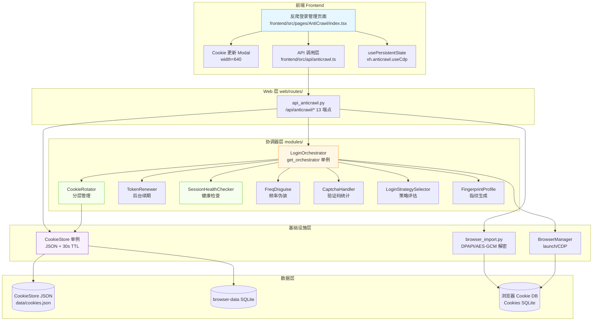
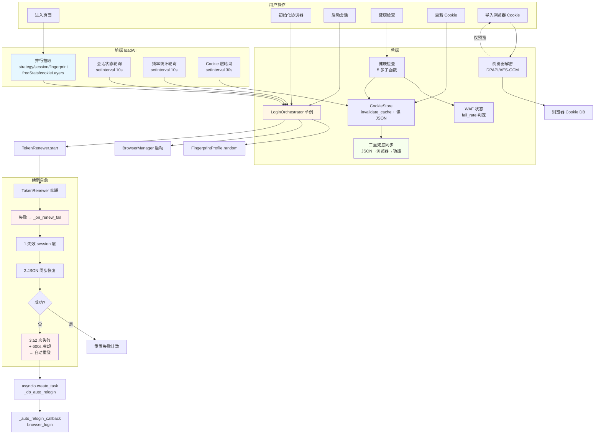
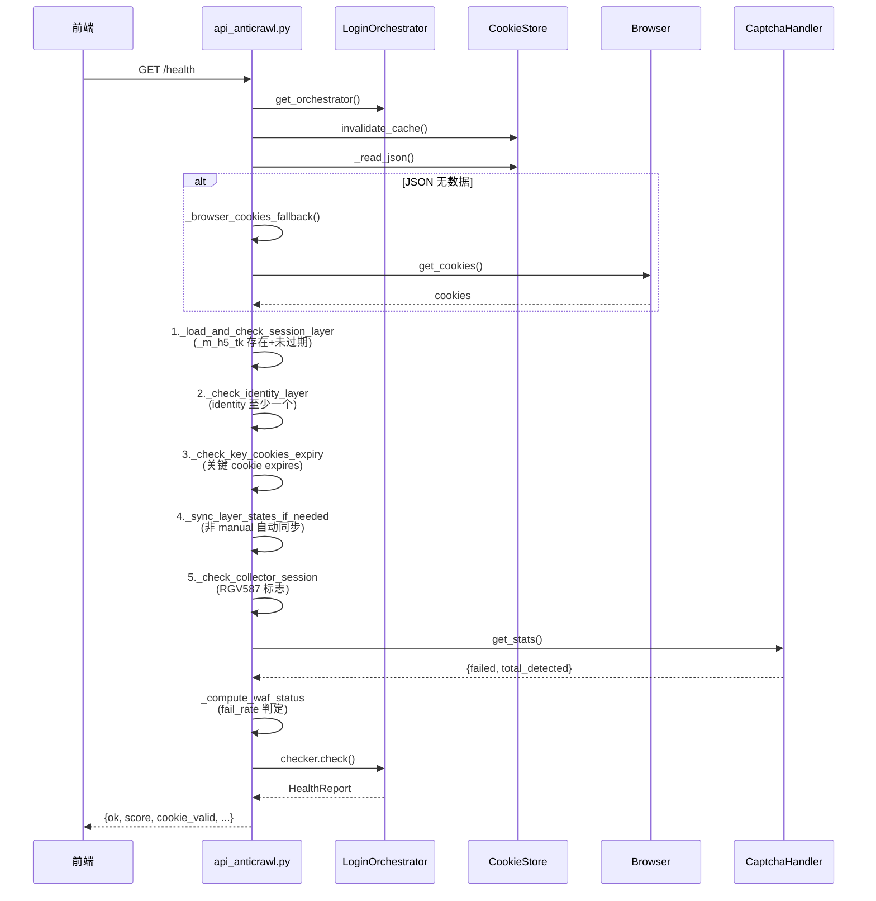
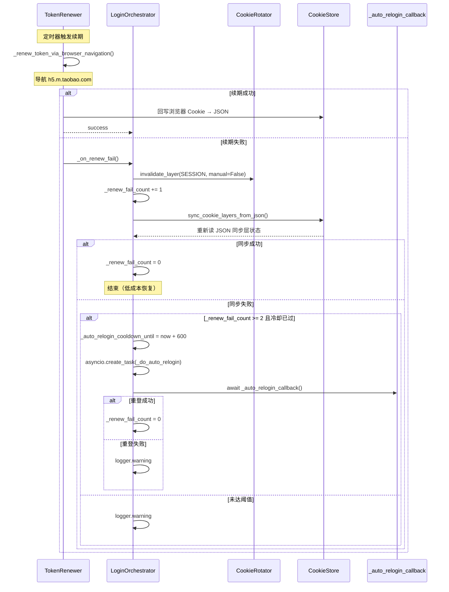

# 闲鱼猎人「反爬登录管理」模块需求规格说明书

| 项 | 内容 |
|---|---|
| 文档版本 | v1.0 |
| 文档日期 | 2026-07-05 |
| 文档状态 | 初版（与详细设计 v1.1 对齐） |
| 所属项目 | 闲鱼猎人（XianyuHunter） |
| 所属菜单 | 系统维护 → 反爬登录管理 |
| 菜单标识 | `menu_registry.yaml` 中 `key=anticrawl`、`icon=ExperimentOutlined`、`sort_order=203`、`category=maintenance` |
| 关联路由 | 前端 `/anticrawl`；后端 `/api/anticrawl/*` |
| 关联文档 | [反爬登录管理-详细设计.md](反爬登录管理-详细设计.md)（v1.1/2026-07-05） |
| 文档类型 | 需求规格说明书（SRS） |

> **本文档首段：继承 project_memory.md 中的硬约束。** 下文 §1.3.3 显式列出适用项与映射实现要点；本节先做总览：
> 1. **Web 进程必须使用 `with_browser=False` 模式**——本模块不强依赖浏览器子进程，但 CDP 模式会连接真实浏览器；所有浏览器子进程（WebView2/Playwright）启动标志必须使用 `CREATE_NEW_CONSOLE`（不重定向 DEVNULL）。
> 2. **认证白名单机制**——`/api/anticrawl/*` 全部需通过现有 `auth.py` 认证中间件，不加入白名单（与 `/api/auth/cookie` 等不同）。
> 3. **前端 fetch 必须含 `credentials: 'include'`**——`frontend/src/api/anticrawl.ts` 沿用 `client` 默认配置。
> 4. **401 必须返回 JSON `{"detail":"Unauthorized"}`**——`api_anticrawl.py` 走 `JSONResponse` 路径，符合规范。
> 5. **token 比较使用 `hmac.compare_digest()`**——本模块无显式 token 比对，但若后续扩展 `_auto_relogin_callback` 注入态校验需遵循。
> 6. **敏感字段不日志**——续期失败、健康分仅记录布尔/分数，不打印 token、Cookie 明文；浏览器导入错误 `error_detail` 仅写控制台不进结构化日志。
> 7. **token 写失败触发 `logging.warning()`**——`/cookies/update` 注入 Worker 浏览器失败时仅 debug，不阻断主流程，但 `_m_h5_tk` 关键回写失败需 `logger.warning` 告警（详见 §8.5）。
> 8. **模块级 import**——`api_anticrawl.py` 与 `login_orchestrator.py` 顶层 import 已对齐，无函数内冗余 import。
> 9. **DB 索引**——本模块不新建数据库表，Cookie/会话状态均在 `CookieStore` JSON + 内存，复用现有 schema 无需新增索引。
> 10. **COUNT 查询 CASE WHEN 聚合**——本模块无 COUNT 类聚合需求。
> 11. **WebView2 子进程 `CREATE_NEW_CONSOLE`**——浏览器登录子进程（`browser_login`、`browser_import`）启动 flags 与现有 `api_auth.py` 保持一致。
> 12. **WebView2 `private_mode=False` + 独立 `storage_path`**——CDP 模式连接真实浏览器遵循现有 BrowserManager 配置。

---

## 目录

- [0. 阶段交接声明](#0-阶段交接声明)
- [1. 引言](#1-引言)
  - [1.1 编写目的](#11-编写目的)
  - [1.2 项目背景](#12-项目背景)
  - [1.3 范围与约束](#13-范围与约束)
  - [1.4 术语与缩写](#14-术语与缩写)
  - [1.5 参考资料](#15-参考资料)
- [2. 总体描述](#2-总体描述)
  - [2.1 产品定位](#21-产品定位)
  - [2.2 用户角色与特征](#22-用户角色与特征)
  - [2.3 运行环境](#23-运行环境)
  - [2.4 设计约束](#24-设计约束)
  - [2.5 假设与依赖](#25-假设与依赖)
- [3. 总体架构设计](#3-总体架构设计)
  - [3.1 模块架构图](#31-模块架构图)
  - [3.2 数据流程图](#32-数据流程图)
  - [3.3 关键时序图](#33-关键时序图)
  - [3.4 模块分层与职责](#34-模块分层与职责)
- [4. 功能需求](#4-功能需求)
  - [FR-1 登录策略评估](#fr-1-登录策略评估)
  - [FR-2 会话管理](#fr-2-会话管理)
  - [FR-3 健康检查](#fr-3-健康检查)
  - [FR-4 Cookie 分层管理](#fr-4-cookie-分层管理)
  - [FR-5 指纹信息查看](#fr-5-指纹信息查看)
  - [FR-6 频率伪装统计](#fr-6-频率伪装统计)
  - [FR-7 浏览器 Cookie 导入](#fr-7-浏览器-cookie-导入)
  - [FR-8 LoginOrchestrator 自愈机制](#fr-8-loginorchestrator-自愈机制)
  - [FR-9 续期回写闭环](#fr-9-续期回写闭环)
- [5. 接口定义](#5-接口定义)
  - [5.1 策略接口](#51-策略接口)
  - [5.2 协调器初始化接口](#52-协调器初始化接口)
  - [5.3 会话管理接口](#53-会话管理接口)
  - [5.4 健康检查接口](#54-健康检查接口)
  - [5.5 指纹与频率接口](#55-指纹与频率接口)
  - [5.6 Cookie 分层管理接口](#56-cookie-分层管理接口)
- [6. 数据模型](#6-数据模型)
- [7. 性能指标](#7-性能指标)
- [8. 安全要求](#8-安全要求)
- [9. 前端设计](#9-前端设计)
- [10. 部署与集成](#10-部署与集成)
- [11. 验收标准](#11-验收标准)
- [12. 附录](#12-附录)

---

## 0. 阶段交接声明

```
- 当前阶段：反爬登录管理 SRS 编写（v1.0） ✅ 已完成
- 下一阶段：概要设计/详细设计对齐校验 + 系统维护菜单其余 SRS 汇总
- 下一阶段智能体：主智能体
- 下一阶段技能：通用（无）
- 交接上下文：
  · 本文档定义「系统维护 → 反爬登录管理」二级菜单完整需求 v1.0
  · 关键设计决策：6 大功能模块（策略/会话/健康/Cookie/指纹/频率）+ 8 大子功能（FR-1~FR-9）
  · 18 个内部辅助函数已在 §4 / §5 / §6 中按模块归位标注
  · Cookie 三层定义（identity/session/tracking）原子更新 + identity 失效级联 session
  · 健康检查权重：cookie=40 / api=30 / page=20 / waf=10；默认仅配置 cookie+waf 满分=70
  · WAF 状态：fail_rate > 0.5 BLOCKED，> 0.2 WARNING，否则 CLEAR
  · LoginOrchestrator 自愈：续期失败 → 失效 session → JSON 同步恢复 → 自动重登（≥2 次失败 + 600s 冷却）
  · 浏览器导入：DPAPI / AES-256-GCM / 明文 三种解密
  · 前端布局：Row gutter={[16,16]} + Col xs={24} lg={12}，一行 2 个 Card
  · 菜单 key=anticrawl、path=/anticrawl、sort_order=203、category=maintenance
  · 继承 project_memory.md 全部硬约束（首段已枚举 12 项适用映射）
```

---

## 1. 引言

### 1.1 编写目的

本需求规格说明书定义「系统维护 → 反爬登录管理」二级菜单的完整需求规格，作为前端/后端开发、测试与验收的唯一依据。

**目标读者**：
- 后端开发工程师：依据 §3-§6、§8、§10 进行模块实现与扩展
- 前端开发工程师：依据 §4、§9 进行页面开发
- 测试工程师：依据 §7、§11 编写测试用例与执行验收
- 项目经理：依据 §2、§11 进行范围与里程碑管理
- 智能客服 KB 训练：本文档与 [反爬登录管理-详细设计.md](反爬登录管理-详细设计.md) 共同作为 KB 检索素材

### 1.2 项目背景

闲鱼猎人（XianyuHunter）是一个闲鱼自动捡漏与抢单工具，已具备任务管理、商品采集、AI 评估、自动下单、多渠道通知等完整能力（详见 [requirements.md](../requirements.md)、[design.md](../design.md) 与 [概要设计文档.md](../概要设计文档.md)）。

随着系统运行规模扩大，**反爬登录相关的核心能力目前分散在多个模块内部（LoginOrchestrator、CookieRotator、TokenRenewer、SessionHealthChecker、FreqDisguise、BrowserManager）**，缺乏统一的运维入口，导致以下痛点：

| 痛点 | 现状 | 影响 |
|------|------|------|
| 登录策略不可见 | `LoginStrategySelector` 内部评估，外部仅 `LoginOrchestrator.evaluate_strategy()` | 部署期不知用哪种策略最适合当前环境 |
| 会话状态不可观测 | `LoginOrchestrator._session_active` / `started_at` 仅在内存中 | TokenRenewer 后台续期是否真的在跑、Token 何时过期、连续运行多久都无法直观查看 |
| 健康检查被动 | `SessionHealthChecker` 默认未配置 cookie/waf 检查器，`/health` 报"未配置" | 用户只在请求失败时才感知会话失效 |
| Cookie 失效后无恢复入口 | `CookieRotator` / `CookieStore` 内部状态，前端无可写入口 | 失效时必须重启或重登录，无法手动覆盖更新 |
| 频率伪装无统计 | `FreqDisguise.get_stats()` 内部方法 | 用户无法判断当前请求节奏是否自然 |
| 指纹不透明 | `FingerprintProfile.random()` 在 launch 模式静默生成 | 调试时无法确认当前 UA/GPU/屏幕等是否合理 |
| 浏览器 Cookie 复用缺失 | 现有 `auth.import-from-browser` 强写覆盖 | 用户希望在 Edge 已登录闲鱼时复用，但担心覆盖在用登录态 |

**解决方案**：新增「反爬登录管理」二级菜单，将 `LoginOrchestrator` 的全部能力（策略评估、会话管理、健康检查、Cookie 分层、指纹、频率统计）暴露给前端；同时新增浏览器 Cookie 导入（仅预览不写入）+ 续期失败自愈机制，**让运维可视化、失效可恢复、风险可告警**。

### 1.3 范围与约束

#### 1.3.1 包含范围（In-Scope）

- 登录策略评估（`GET /strategy`、`POST /strategy/set`）
- 协调器初始化（`POST /initialize`，支持 launch/CDP 双模式）
- 会话管理（`GET /session/status`、`POST /session/start`、`POST /session/stop`）
- 健康检查（`GET /health`，含 cookie_checker + waf_provider）
- Cookie 分层管理（`GET /cookies/current`、`POST /cookies/update`、`GET /cookies/layers`、`POST /cookies/invalidate`）
- 浏览器 Cookie 导入预览（`POST /cookies/import-from-browser/preview`，不写入）
- 指纹信息查看（`GET /fingerprint`，不返回 canvas_noise_seed）
- 频率伪装统计（`GET /freq/stats`、`GET /freq/delay`）
- 前端 `/anticrawl` 页面（6 大 Card + Cookie 更新 Modal）
- LoginOrchestrator 自愈机制：续期失败 → 失效 session → JSON 同步 → 自动重登（≥2 次 + 600s 冷却）
- 续期回写闭环：`_default_renew_callback` 导航成功后回写 CookieStore

#### 1.3.2 排除范围（Out-of-Scope）

- 不实现闲鱼账号体系本身（仅复用系统已登录的 Cookie）
- 不实现"自动注册/养号"等灰产功能
- 不实现"Cookie 池/账号池"多账号轮换（首版单账号）
- 不实现"反检测浏览器内核"深度定制，仅在 launch 模式注入 stealth 脚本
- 不替代现有 `/api/auth/import-from-browser` 强写入口（保留作强覆盖场景）
- 不重新实现健康检查维度配置 UI（仅暴露 cookie+waf 两个默认维度）

#### 1.3.3 硬约束

继承 [project_memory.md](c:/Users/hspcadmin/.trae-cn/memory/projects/-d-code-otherProjects-17-xianyu/project_memory.md) 中的项目硬约束，并显式映射到本模块实现：

| 硬约束 | 本模块适用性 | 实现要点 |
|--------|--------------|----------|
| Web 进程使用 `with_browser=False` 模式 | 适用 | Web 进程本身不启浏览器；CDP 模式由 BrowserManager 单独子进程承载 |
| 认证白名单（`/api/auth/cookie` 等） | 不适用 | `/api/anticrawl/*` **必须**走 `auth.py` 认证，不加入白名单 |
| 前端 fetch 必须含 `credentials: 'include'` | 适用 | `frontend/src/api/anticrawl.ts` 全量沿用 `client` 默认配置 |
| htmx 用官方 `<meta>` 配置 credentials | 不适用 | 反爬登录管理前端不使用 htmx，使用 fetch |
| 401 响应必须返回 JSON `{"detail":"Unauthorized"`} | 适用 | `api_anticrawl.py` 路由层统一异常处理 |
| 后端 token 比较使用 `hmac.compare_digest()` | 适用 | 续期回调中的状态校验、可能的外部 token 比对均使用此函数 |
| 敏感字段（token 长度等）不日志 | 适用 | §8.5 日志规范：仅记录 `ok / score / bool`，不打印 Cookie 明文/Token |
| token 写失败触发 `logging.warning()` | 适用 | `_m_h5_tk` 关键回写失败需 `logger.warning` 告警 |
| 缺失 import 必须 module-level | 适用 | `api_anticrawl.py` / `login_orchestrator.py` 全部模块级 import |
| DB 必须在 `task_id/seller_id/...` 加索引 | 不适用 | 本模块不新增数据库表，Cookie 与会话状态走 JSON + 内存 |
| COUNT 查询用 CASE WHEN 聚合 | 不适用 | 本模块无 COUNT 聚合需求 |
| WebView2 子进程使用 `CREATE_NEW_CONSOLE` | 适用 | 浏览器登录子进程（browser_login / browser_import）flags 对齐 `api_auth.py` |
| WebView2 `webview.start()` 设 `private_mode=False` + 独立 `storage_path` | 适用 | CDP 模式连接真实浏览器时遵循现有 BrowserManager 配置 |
| KBManager 排除 `web/static/` 等目录 | 不适用 | 本模块不涉及 KB 索引 |
| `local_embedding.py` HF_ENDPOINT 设置 | 不适用 | 本模块不涉及 embedding |
| EmbeddingService 本地后端 | 不适用 | 同上 |
| sentence-transformers 跨版本兼容 | 不适用 | 同上 |
| `run_migrations` 各块独立 try/except | 不适用 | 本模块无新迁移 |
| 启动钩子异常 `logger.exception()` | 适用 | `initialize` 失败时打印完整 traceback |

### 1.4 术语与缩写

| 术语 | 全称 | 说明 |
|------|------|------|
| LoginOrchestrator | Login Orchestrator | 登录协调器，串联所有反爬模块的单例 |
| Strategy | Login Strategy | 登录策略：`cdp_connect`/`reuse_userdata`/`browser_import`/`qr_scan`/`cookie_inject` |
| Launch 模式 | Launch Mode | 启动独立 Playwright 浏览器，生成随机 FingerprintProfile + 注入 stealth 脚本 |
| CDP 模式 | CDP Connect Mode | 通过 Chrome DevTools Protocol 连接真实浏览器，复用真实指纹 |
| Fingerprint | Fingerprint Profile | 浏览器指纹（UA/平台/GPU/屏幕/语言等） |
| Stealth | Stealth Script | 指纹伪装脚本，绕过常见反爬检测 |
| AWSC | AWSC Spoof | 阿里系风控字段伪装（仅 launch 模式按需注入） |
| CookieRotator | Cookie Rotator | Cookie 分层管理器（identity/session/tracking） |
| LAYER_DEFINITIONS | Layer Definitions | 三层 Cookie 定义（`cookie_management.layer_definitions` 节点加载） |
| Token | `_m_h5_tk` | MTOP API 调用令牌，TTL 约 15-22min |
| m5tk | `_m_h5_tk` | 同上，内嵌 timestamp 决定真实过期（is_m5tk_expired，TTL=1200s） |
| TokenRenewer | Token Renewer | 后台定时续期器，导航到 `h5.m.taobao.com` 触发 token 刷新 |
| SessionHealthChecker | Session Health Checker | 健康检查器，多维度（cookie/api/page/waf）加权评分 |
| WAF | Web Application Firewall | 闲鱼风控状态：`clear`/`warning`/`blocked` |
| RGV587 | RGV587_ERROR | 闲鱼服务端"会话已注销"错误 |
| FreqDisguise | Frequency Disguise | 频率伪装模块，对数正态分布打散请求节奏 |
| CookieStore | Cookie Store | Cookie 持久化（JSON + browser-data SQLite） |
| DPAPI | Data Protection API | Windows 数据保护 API（旧版浏览器加密） |
| AES-GCM | AES-256-GCM | Chrome v80+ 的浏览器 Cookie 加密 |
| WAL/SHM | Write-Ahead Log | SQLite 写入日志与共享内存文件 |
| LRU | Least Recently Used | 缓存淘汰策略（本模块 `CookieStore` 30s TTL 等价） |
| ITTL | Internal TTL | 内部过期时间 |

### 1.5 参考资料

| 文档 | 路径 | 用途 |
|------|------|------|
| 需求文档 v1.0 | [requirements.md](../requirements.md) | 系统整体需求基线 |
| 概要设计文档 v2.0 | [概要设计文档.md](../概要设计文档.md) | 36 个 API 路由、11 张数据表、技术选型 |
| 技术设计说明书 | [design.md](../design.md) | 分层架构、Evaluator 设计、状态机 |
| 反爬登录管理 详细设计 v1.1 | [反爬登录管理-详细设计.md](反爬登录管理-详细设计.md) | 本模块技术设计、代码位置、FAQ |
| 米其林设计系统 | [../standards/michelin-design-system.md](../standards/michelin-design-system.md) | UI 设计规范、色彩字体系统 |
| 智能客服 SRS | [../06-智能客服/智能客服-需求规格.md](../06-智能客服/智能客服-需求规格.md) | SRS 模板参考（10+ 章节完整版） |
| 权限模块 SRS | [../07-权限模块/权限模块-需求规格.md](../07-权限模块/权限模块-需求规格.md) | SRS 模板参考（侧栏菜单 SRS 风格） |
| 项目硬约束 | [project_memory.md](c:/Users/hspcadmin/.trae-cn/memory/projects/-d-code-otherProjects-17-xianyu/project_memory.md) | 必须继承的硬约束清单 |
| 菜单元数据 | [../../config/menu_registry.yaml](../../config/menu_registry.yaml) | `key=anticrawl`、`sort_order=203` |
| 反爬登录管理 后端 | [../../src/xianyu_hunter/web/routes/api_anticrawl.py](../../src/xianyu_hunter/web/routes/api_anticrawl.py) | 18 个内部辅助函数 + 13 个端点 |
| 反爬登录管理 前端页面 | [../../frontend/src/pages/AntiCrawl/index.tsx](../../frontend/src/pages/AntiCrawl/index.tsx) | 6 大 Card + Modal 实现 |
| 反爬登录管理 前端 API | [../../frontend/src/api/anticrawl.ts](../../frontend/src/api/anticrawl.ts) | 13 个 API 封装 + 类型定义 |
| LoginOrchestrator | [../../src/xianyu_hunter/modules/login_orchestrator.py](../../src/xianyu_hunter/modules/login_orchestrator.py) | 协调器单例、SessionStatus dataclass、自愈机制 |
| CookieRotator | [../../src/xianyu_hunter/modules/cookie_rotator.py](../../src/xianyu_hunter/modules/cookie_rotator.py) | LAYER_DEFINITIONS、LayerState、is_m5tk_expired |
| SessionHealthChecker | [../../src/xianyu_hunter/modules/session_health.py](../../src/xianyu_hunter/modules/session_health.py) | HealthReport、HealthAction、WAFStatus 枚举 |
| TokenRenewer | [../../src/xianyu_hunter/modules/token_renewer.py](../../src/xianyu_hunter/modules/token_renewer.py) | 后台续期器实现 |
| Fingerprint | [../../src/xianyu_hunter/modules/fingerprint.py](../../src/xianyu_hunter/modules/fingerprint.py) | FingerprintProfile、build_stealth_script |
| FreqDisguise | [../../src/xianyu_hunter/modules/freq_disguise.py](../../src/xianyu_hunter/modules/freq_disguise.py) | 频率伪装 ActionType |
| CookieStore | [../../src/xianyu_hunter/web/services/cookie_store.py](../../src/xianyu_hunter/web/services/cookie_store.py) | JSON 持久化 + 30s TTL 缓存 |
| 浏览器导入 | [../../src/xianyu_hunter/web/routes/browser_import.py](../../src/xianyu_hunter/web/routes/browser_import.py) | DPAPI / AES-256-GCM / 明文解密 + 4 级降级文件复制 |

---

## 2. 总体描述

### 2.1 产品定位

「反爬登录管理」是闲鱼猎人系统的**反爬基础设施可视化运维入口**，定位为：

> 将分散在 `LoginOrchestrator` / `CookieRotator` / `TokenRenewer` / `SessionHealthChecker` / `FreqDisguise` / `Fingerprint` / `CookieStore` 内部的反爬核心能力**统一暴露**给前端，让用户在一个页面里完成"策略选择 → 协调器初始化 → 会话启停 → 健康检查 → Cookie 三层管理 → 指纹查看 → 频率统计 → 浏览器导入"全流程操作。

**核心价值**：
1. **运维可视化**：会话状态、Token 年龄、健康分、WAF 状态、Cookie 层有效性、频率统计、指纹 profile 全部实时可见
2. **失效可恢复**：Cookie 失效后可在 UI 上手动更新（合并写入，原子提交）；浏览器导入可预览不写入
3. **风险可告警**：WAF 状态根据验证码处理统计自动判定 BLOCKED / WARNING / CLEAR
4. **自愈自动化**：续期失败 → 标记 session 失效 → JSON 同步恢复（低成本）→ 自动重登（高成本，10 分钟冷却）
5. **风控可调优**：指纹、频率、Cookie 分层配置都暴露给用户，便于根据反馈调整

### 2.2 用户角色与特征

| 角色 | 特征 | 使用场景 | 关注重点 |
|------|------|----------|----------|
| 新部署用户 | 首次启动系统，无登录态 | 进入页面初始化协调器 → 触发首次登录 | 策略推荐、初始化按钮、CDP/Launch 选择 |
| 日常运维 | 系统已运行，关注会话健康 | 定期查看健康分、WAF、Token 年龄 | 健康检查卡片、建议动作、告警 |
| 失效恢复 | 触发 WAF 或 Cookie 过期 | 失效弹层 → 手动更新 Cookie 或浏览器导入 | Cookie 分层、浏览器导入预览 |
| 高级调试 | 担心指纹/频率不合理 | 查看 Fingerprint/Freq Stats 调整 | 指纹描述、频率间隔统计 |
| 二次开发者 | 自定义登录流程 | 参考本页面与详细设计实现自定义编排 | 18 个辅助函数、LoginOrchestrator 单例 |

### 2.3 运行环境

| 项 | 要求 |
|---|---|
| 操作系统 | Windows 10/11（主），Linux/macOS 需兼容 Playwright launch 模式 |
| Python | 3.11+ |
| Node.js | 18+（仅前端构建） |
| 后端框架 | FastAPI（已集成） |
| 前端框架 | React 18 + TypeScript + Ant Design 5（已集成） |
| 浏览器依赖 | launch 模式需 Playwright + Chromium；CDP 模式需本机已启动的 Edge/Chrome |
| 数据库 | 复用现有 SQLite（CookieStore JSON + browser-data SQLite） |
| 浏览器数据库 | Edge/Chrome Cookies SQLite（导入预览用） |

### 2.4 设计约束

1. **集成部署**：作为 `src/xianyu_hunter/web/routes/api_anticrawl.py` 路由 + `frontend/src/pages/AntiCrawl/index.tsx` 页面集成到现有系统，不独立部署
2. **复用 LoginOrchestrator 单例**：`get_orchestrator()` 返回单例，所有端点通过该单例操作，保证状态一致
3. **写操作 POST，读操作 GET**：与现有 REST 规范对齐
4. **异步操作 async 路由**：`/session/start`、`/session/stop`、`/health` 使用 async 路由
5. **前端布局对齐米其林设计系统**：6 大 Card 用 `Row gutter={[16,16]}` + `Col xs={24} lg={12}`，一行 2 个
6. **持久化开关**：CDP 模式用 `usePersistentState('xh.anticrawl.useCdp', false)` 持久化到 localStorage
7. **JSON 唯一事实源**：Cookie 写入以 CookieStore JSON 为准，浏览器内存仅作兜底
8. **敏感字段不外露**：`/fingerprint` 不返回 `canvas_noise_seed`；Cookie 明文仅 `/cookies/current` 返回供前端预填文本框
9. **健壮性兜底**：健康检查未配置检查器时自动初始化；启动会话幂等；Cookie 更新失败也刷新状态避免 UI 矛盾

### 2.5 假设与依赖

**假设**：
- 用户已部署闲鱼猎人 v2.x+ 并能访问 `MainLayout` 侧边栏
- 系统已配置 Cookie 持久化目录（`data/cookies.json`）
- 浏览器导入场景下，本机已安装 Edge 或 Chrome，且至少一个已登录闲鱼

**依赖**：
- 依赖现有 `LoginOrchestrator` 单例
- 依赖现有 `CookieStore` 单例
- 依赖现有 `BrowserManager`（launch 模式注入 fingerprint，CDP 模式连接真实浏览器）
- 依赖现有 `auth.py` 认证中间件
- 依赖现有 `menu_registry.yaml` 菜单注册（已配置 `key=anticrawl`）
- 新增无外部依赖

---

## 3. 总体架构设计

### 3.1 模块架构图



### 3.2 数据流程图



### 3.3 关键时序图

#### 3.3.1 健康检查时序（5 步子函数）



#### 3.3.2 续期失败自愈时序



### 3.4 模块分层与职责

遵循项目现有 DDD 分层架构（见 [概要设计文档](../概要设计文档.md) §3）：

| 层级 | 模块 | 职责 |
|------|------|------|
| **Web 层** | `api_anticrawl.py` | 反爬登录管理 API 路由（13 端点） |
| **业务模块层** | `login_orchestrator.py` | LoginOrchestrator 单例、SessionStatus dataclass、start_session_default、自愈机制 |
| | `cookie_rotator.py` | LAYER_DEFINITIONS、LayerState、CookieRotator、is_m5tk_expired |
| | `login_strategy.py` | LoginStrategySelector、StrategyEvaluation、LoginStrategy 枚举 |
| | `session_health.py` | SessionHealthChecker、HealthReport、HealthAction、WAFStatus 枚举 |
| | `token_renewer.py` | TokenRenewer、_on_renew_fail 回调注册 |
| | `freq_disguise.py` | FreqDisguise、ActionType 枚举 |
| | `fingerprint.py` | FingerprintProfile、build_stealth_script |
| | `awsc_spoof.py` | get_awsc_spoof_script、is_awsc_spoof_needed |
| | `captcha_handler.py` | CaptchaHandler、get_stats |
| **基础设施层** | `cookie_store.py` | CookieStore 单例、invalidate_cache、export_cookies、is_test_cookie |
| | `browser_import.py` | DPAPI/AES-GCM 解密、4 级降级文件复制 |
| **前端** | `pages/AntiCrawl/index.tsx` | 6 大 Card + Modal |
| | `api/anticrawl.ts` | 13 个 API 封装 + 9 个类型定义 |
| | `hooks/usePersistentState` | CDP 模式持久化 |

---

## 4. 功能需求

### FR-1 登录策略评估

**FR-1.1** 暴露 `LoginStrategySelector.evaluate()` 给前端，调用 `GET /strategy` 评估当前环境并推荐最优登录策略
- 响应：`ok` / `recommended` / `reason` / `available_strategies[]` / `details`

**FR-1.2** 支持 5 种登录策略枚举：
| 策略 | 中文标签 | 说明 |
|------|----------|------|
| `cdp_connect` | CDP 连接系统浏览器 | 通过 Chrome DevTools Protocol 连接真实浏览器 |
| `reuse_userdata` | 复用 browser-data Cookie | 直接复用 CookieStore 中已持久化的 Cookie |
| `browser_import` | 从系统浏览器导入 | 从 Edge/Chrome 解密导入（FR-7） |
| `qr_scan` | 扫码登录 | 扫描闲鱼 App 二维码登录 |
| `cookie_inject` | 手动 Cookie 注入 | 用户手动粘贴 Cookie 文本（FR-4） |

**FR-1.3** 支持 `POST /strategy/set` 设置当前使用的登录策略
- 请求：`{"strategy": "cdp_connect"}`
- 错误响应：`{"ok": false, "error": "无效的策略名: {strategy_name}", "valid_strategies": [...]}`

**FR-1.4** 前端策略评估 Card 显示：
- 推荐策略 Tag（橙色）+ 推荐原因
- 可用策略列表 Tag（`recommended` 橙色，其他 default）
- 「初始化协调器（CDP/Launch 模式）」按钮
- CDP 模式 Switch（`usePersistentState('xh.anticrawl.useCdp', false)` 持久化）

### FR-2 会话管理

**FR-2.1** `GET /session/status` 返回 SessionStatus 摘要，字段：
| 字段 | 类型 | 说明 |
|------|------|------|
| `active` | bool | 会话是否活跃 |
| `strategy` | string | 当前登录策略 |
| `fingerprint_profile` | string | 指纹 profile 名称 |
| `token_age_sec` | float | Token 年龄（秒） |
| `token_expired` | bool | Token 是否过期 |
| `health_score` | int | 健康分（0-100） |
| `health_action` | string | 建议动作（none/renew_token/relogin/pause） |
| `waf_status` | string | 风控状态（clear/warning/blocked） |
| `cookie_layers` | object | 各 Cookie 层有效性 |
| `freq_stats` | object | 频率伪装统计 |
| `captcha_stats` | object | 验证码统计 |
| `started_at` | float | 会话启动时间戳（Unix 秒） |
| `uptime_sec` | float | 会话已运行时间（秒，active=false 时为 0） |

**FR-2.2** `POST /session/start` 启动 TokenRenewer 后台续期
- 启动后 TokenRenewer 定期检查 token 年龄，过期前自动续期
- 续期失败触发 session 层 Cookie 失效
- **幂等行为**：会话已活跃时返回 `{"ok": true, "already_active": true, "message": "..."}`，**不视为失败**
  - **为什么幂等**：登录流程通过 `trigger_session_start()` 在登录成功后自动启动会话（fire-and-forget），用户进入反爬登录管理页面手动点击"启动会话"按钮往往会话已是活跃状态。若标记 `ok:False`，前端显示"启动会话失败"提示，但定时器 10 秒后又把状态同步为"已启动"，造成 UX 矛盾。改为幂等成功后前端根据 `already_active` 字段显示 `info` 提示
- 失败响应：`{"ok": false, "error": "启动会话失败: {e}"}`

**FR-2.3** `POST /session/stop` 停止会话管理
- 响应：`{"ok": true, "message": "会话管理已停止"}`
- 未启动响应：`{"ok": false, "error": "会话未启动"}`

**FR-2.4** 前端会话管理 Card 显示：
- 会话状态 Badge（`active=true` 时 `processing`）
- 警告 Alert（`cookie_layers.identity=true` 但 `active=false` 时显示"检测到有效 Cookie 但会话未启动"）
- Statistic × 3：会话状态（绿/灰）/ 运行时间（`${seconds}s`）/ Token 年龄（`token_expired` 时红色）
- 「启动会话」/「停止会话」按钮（按 `active` 互斥禁用）

**FR-2.5** 前端定时器：
- 会话状态每 10 秒刷新（`setInterval(loadSession, 10000)`）
- 失败时仍刷新状态避免 UI 矛盾

### FR-3 健康检查

**FR-3.1** `GET /health` 执行健康检查，返回 HealthReport
- 响应：`ok` / `score` / `cookie_valid` / `api_reachable` / `page_accessible` / `waf_status` / `action` / `details` / `is_healthy` / `needs_attention`

**FR-3.2** 健康检查权重（总和=100）：
| 检查器 | 权重 | 检查内容 |
|--------|------|----------|
| `cookie_checker` | 40 | `_m_h5_tk` 存在/有值/未过期 + identity 层至少一个 + 关键 cookie expires 未过期 + 自动同步层状态 + `collector.last_session_invalid` 粘性标志处理 |
| `api_checker` | 30 | 调用 getTimestamp 接口，检查是否返回正常（**未配置时默认通过**） |
| `page_checker` | 20 | 访问 `/personal`，检查是否重定向到登录页（**未配置时默认通过**） |
| `waf_provider` | 10 | 验证码处理统计：`fail_rate > 0.5` → BLOCKED；`> 0.2` → WARNING；否则 CLEAR |

**FR-3.3** 默认满分为 70（cookie 40 + waf 10 + api 默认通过 30 + page 默认通过 20 = 100? **实际为 cookie+waf 维度 = 50，但未配置维度视为 100% 通过；具体见设计文档**）
- 设计文档约定：`/api/anticrawl/initialize` 默认仅配置 `cookie_checker` 与 `waf_provider`，未配置的 api/page 维度默认通过（即默认满分为 40+20+10=70）
- cookie 失效时直接掉到 30 以下触发 RELOGIN/PAUSE

**FR-3.4** `cookie_checker` 5 步子函数（在 `_configure_default_health_checkers` 中定义）：
1. **`_load_and_check_session_layer`**：`invalidate_cache` 后读 JSON；若无数据转 `_browser_cookies_fallback`。检查 `_m_h5_tk` 存在、有值、未过期（`is_m5tk_expired` 检查内嵌 timestamp）。JSON 中过期/缺失时调用 `_try_refresh_m5tk_from_browser` 从浏览器内存读取并回写 JSON 后重试；仍不可信则转浏览器内存兜底
2. **`_check_identity_layer`**：identity 层至少一个 Cookie 存在（不同登录方式返回的 Cookie 集合不同，强制要求全部会导致误判）。JSON 缺失时同样转 `_browser_cookies_fallback`
3. **`_check_key_cookies_expiry`**：仅检查 identity + session 层关键 cookie 的 `expires` 字段。**为什么不再检查所有 cookie**：tracking 层 cookie（cna/tfstk 等）过期不影响实时搜索，但会导致健康检查误判
4. **`_sync_layer_states_if_needed`**：identity 层 `valid=False 且 manual_invalidate=False` 时，重新构造 cookie_map 调用 `sync_state_from_cookies` 同步层状态
5. **`_check_collector_session`**：检查 `collector.last_session_invalid` 标志（RGV587_ERROR 表示服务端已注销会话）
   - 标志为 True 且 `_m_h5_tk` 存在有值（不检查 timestamp 过期，语义与 session 层不同）：清除粘性标志，避免反复触发 invalidate
   - 标志为 True 且 token 不存在：主动失效 identity 层（`manual=False`，可被自动同步恢复），返回 False

**FR-3.5** `_browser_cookies_fallback` 浏览器内存兜底复核：JSON 判定无效时从浏览器内存读取 cookie 复核，判定标准与实时搜索 `_ensure_live_search_cookies` 对齐：`_m_h5_tk` 有效 + identity 层至少一个 + 关键 cookie expires 未过期 + 粘性标志清理

**FR-3.6** `_compute_waf_status` WAF 状态推断：
```python
def waf_provider() -> WAFStatus:
    stats = orch.captcha_handler.get_stats()
    failed = stats.get("failed", 0)
    total = stats.get("total_detected", 0)
    if total == 0:
        return WAFStatus.CLEAR
    fail_rate = failed / total
    if fail_rate > 0.5:
        return WAFStatus.BLOCKED
    if fail_rate > 0.2:
        return WAFStatus.WARNING
    return WAFStatus.CLEAR
```

**FR-3.7** 未配置检查器响应：
- `{"ok": false, "error": "未配置健康检查器，请先调用 POST /api/anticrawl/initialize", "hint": "initialize 会自动配置默认的 cookie 和 waf 检查器"}`
- 前端 `handleHealthCheck` 检测到 `error` 包含 `initialize` 时自动调用 `/initialize` 后重试

**FR-3.8** 前端健康检查 Card 显示：
- 健康分 Progress（0-100），等级着色：
  - `≥80` → `success`（绿）
  - `≥60` → `normal`（蓝）
  - `<60` → `exception`（红）
- Statistic × 4：Cookie / API / 页面 / WAF（`WAF_LABELS` 中文映射：clear=正常/warning=警告/blocked=已熔断）
- 建议动作 Alert（`needs_attention=true` → error；否则 warning），文案用 `ACTION_LABELS`（none/renew_token/relogin/pause）

### FR-4 Cookie 分层管理

**FR-4.1** Cookie 三层定义（LAYER_DEFINITIONS 从 `cookie_management.layer_definitions` 节点加载）：

| 层 | 中文名 | 包含 Cookie | TTL | 依赖 |
|----|--------|-------------|-----|------|
| `identity` | 身份层 | `unb` / `cookie2` / `sgcookie` / `t` / `_tb_token_` / `lg2` | session | 无 |
| `session` | 会话层 | `_m_h5_tk` / `_m_h5_tk_enc` | 15-22min | identity |
| `tracking` | 追踪层 | `cna` / `tfstk` / `xlly_s` / `ali_aplus_v3` / `utdid` | dynamic | 无 |

**FR-4.2** 原子更新规则：
1. 同一层的 Cookie 必须同时写入，不允许中间状态
2. 更新 session 层时必须验证 identity 层是否有效
3. **identity 层失效时，session 层自动失效**

**FR-4.3** `GET /cookies/current` 读取当前 CookieStore JSON 中的全部 Cookie（供更新弹窗自动预填）
- 响应：`ok` / `cookies`（`{name: value}` 字典）/ `count`

**FR-4.4** `POST /cookies/update` 分层更新 Cookie（合并写入，不丢失已有 Cookie）
- 请求：`{"cookies": {"unb": "123", "_m_h5_tk": "tk_123", ...}}`
- 响应：`ok` / `written`（实际写入 JSON 的 cookie 数量）/ `worker_injected`（是否同步注入到 Worker 浏览器）/ `message`
- 主流程：
  1. 读取现有 JSON 全量 Cookie（**必须先 `invalidate_cache`**，因为浏览器登录子进程写入 JSON 后只更新子进程自己的缓存，主进程 30 秒 TTL 缓存仍是旧数据）
  2. 合并传入值（覆盖同名 value，新增的用默认元信息：domain=.goofish.com / path=/ / expires=-1）
  3. 一次性写入合并后的完整列表（`export_cookies` 内部会过滤测试数据）
  4. 重新读 JSON 同步层状态（**为什么不用 merged_list**：`export_cookies` 内部会过滤测试数据，用 merged_list 构造 cookie_map 会包含被过滤的测试数据）
  5. `sync_state_from_cookies(cookie_map)` 同步所有层状态
  6. `inject_cookie_store_to_worker_browser("Cookie 分层更新")` 注入 Worker 浏览器
     - 失败仅 debug 日志，不影响主流程（已写入 JSON + 同步层状态）
     - 返回 `worker_injected` 字段告知前端是否同步成功

**FR-4.5** `GET /cookies/layers` 获取 Cookie 各层状态，含三重兜底同步逻辑
- 响应：`ok` / `layers`（identity/session/tracking，每层 valid/updated_at/cookie_count）
- **三重兜底同步**：
  1. **第一步 `_sync_layers_from_json`**（对所有非用户主动失效的层）
     - 排除 `manual_invalidate=True` 的层（用户主动失效不应被自动同步覆盖）
     - `store.invalidate_cache()` 后读取 JSON
     - `_filter_valid_cookies_for_sync` 过滤：必须有 name 和 value、name 必须在该层 `needed_names` 中、`expires` 未过期（session cookie 不过滤）、`_m_h5_tk` 检查内嵌 timestamp 是否过期（`is_m5tk_expired`，TTL=1200s）
     - `sync_state_from_cookies(cookie_map)`
  2. **第二步 `_sync_layers_from_browser`**（前一步后仍有非 manual 失效层时）
     - 从浏览器内存读取 goofish.com / taobao.com 域 cookie
     - 用同一份 `_filter_valid_cookies_for_sync` 过滤规则构造 cookie_map
     - `sync_state_from_cookies` 同步层状态
     - `_write_browser_cookies_to_json` 回写浏览器内存中的关键 cookie 到 JSON（用 `upsert_cookie_values`，含 value/domain/path/expires）
     - **为什么需要**：JSON 可能缺少 MTOP token（`_m_h5_tk`）或部分 identity cookie，但浏览器内存中有（功能正常）
  3. **第三步 `_functional_fallback_restore`**（前两步后仍有非 manual 失效层时）
     - 收集功能可用信号（任一为真即认为功能正常）：
       - 信号 1 `_collect_collector_signal`：`collector._last_m5tk_refresh>0` 且 `last_session_invalid=False`（实际搜索成功，可恢复所有层）
       - 信号 2 `_collect_json_m5tk_signal`：JSON 中存在未过期的 `_m_h5_tk`（只能证明 session 有效，且需 IDENTITY 已有效）
     - `_compute_layers_to_restore` 根据信号组合计算可恢复的层集合：
       - collector 信号：恢复所有 still_invalid 层
       - m5tk 信号 + IDENTITY 已有效：仅恢复 SESSION 层
       - m5tk 信号 + IDENTITY 无效：返回空集（依赖关系不允许恢复）
     - `cookie_rotator.force_restore_layers` 执行恢复（`force_restore_layers` 内部会再次校验依赖层有效性，避免无效恢复）

**FR-4.6** `POST /cookies/invalidate` 使指定 Cookie 层失效
- 请求：`{"layer": "session"}`
- 响应：`ok` / `message` / `cascaded`（仅当 layer=identity 时为 `true`，标记触发了 session 级联失效）
- 错误响应：`{"ok": false, "error": "无效的层名: {layer_name}", "valid_layers": ["identity","session","tracking"]}`
- **identity 失效会级联导致 session 失效**，前端 `handleInvalidateLayer` 对 `layer === 'identity'` 弹 `Modal.confirm` 提示

**FR-4.7** LayerState 字段语义：
- `valid: bool = False` —— 层是否有效
- `updated_at: float = 0.0` —— 最后更新时间戳
- `cookie_count: int = 0` —— 该层 cookie 数量
- `manual_invalidate: bool = False` —— **用户主动失效，自动同步应跳过此层**
  - `True`：用户通过 `/cookies/invalidate` 主动失效，自动同步跳过
  - `False`：系统失效（RGV587/续期失败等）或从未失效，自动同步可恢复

**FR-4.8** 前端 Cookie 分层管理 Card 显示：
- 三层 Card `size="small"`（identity/session/tracking）
- 每层：valid Badge / cookie_count 或「已恢复（无 Cookie）」 / 「主动失效」按钮
- 分层说明 Alert（identity/session/tracking 简介）
- 「更新 Cookie」+ 刷新按钮（extra）
- Cookie 更新 Modal（`width=640`）：
  - 自动预填提示 Paragraph（`prefillHint`）
  - Select（edge/chrome）+「从浏览器导入（覆盖文本框）」按钮
  - Spin + `Input.TextArea`（rows=8，monospace）
  - `prefillHint` Paragraph（已读取 N 个 / 导入 N 个 / 错误提示）
- 解析函数 `parseCookieInput(input)`：支持分号/换行分隔，值中可含 `=` 号（`split('=')` + `join('=')` 还原）
- 拼接函数 `cookiesToString(cookies)`：`Object.entries.map.join('; ')`
- 错误格式化 `formatImportPreviewError(result)`：`[error, hint].filter(Boolean).join('\n') || '从浏览器导入失败'`

### FR-5 指纹信息查看

**FR-5.1** `GET /fingerprint` 获取当前指纹 profile 信息
- 响应：`ok` / `mode`（`launch`/`cdp`）/ `profile` / `stealth_scripts_count` / `message`
- profile 字段：name / ua / platform / vendor / hardware_concurrency / device_memory / gpu_vendor / gpu_renderer / screen_width / screen_height / color_depth / pixel_ratio / languages
- **不返回 `canvas_noise_seed` 等敏感种子**

**FR-5.2** launch 模式 vs CDP 模式：
- **launch 模式**：系统启动独立的 Playwright 浏览器，生成随机 FingerprintProfile，通过 stealth 脚本注入伪装指纹。适合无真实浏览器的服务器环境
- **CDP 模式**：通过 Chrome DevTools Protocol 连接用户已打开的真实浏览器，复用真实指纹，无需注入。适合开发调试或本机已登录闲鱼的场景

**FR-5.3** `get_stealth_scripts()` 在 launch 模式下返回 `[fingerprint_stealth, awsc_spoof]` 两条脚本（`is_awsc_spoof_needed` 判定后追加），CDP 模式返回空列表

**FR-5.4** 前端指纹信息 Card 显示：
- `Descriptions bordered`：Profile / UA / 平台 / 厂商 / CPU / 内存 / GPU / 屏幕 / 色深 / Stealth 脚本数
- CDP 模式或未初始化时显示提示 Alert

### FR-6 频率伪装统计

**FR-6.1** `GET /freq/stats` 获取频率伪装统计
- 响应：`ok` / `total_requests` / `noise_requests` / `noise_ratio` / `mean_interval` / `median_interval` / `std_interval` / `history_size`
- 无历史数据时间隔字段返回 `0.0`

**FR-6.2** `GET /freq/delay` 获取指定操作的请求延迟（秒）
- Query 参数：`action=browse|search|scroll|detail|login`
- 响应：`ok` / `action` / `delay_sec`
- 错误响应：`{"ok": false, "error": "无效的操作类型: {action}", "valid_actions": [...]}`

**FR-6.3** 业务模块持续调用 `apply_freq_delay/record_freq_request`，前端需定时拉取才能反映最新请求节奏

**FR-6.4** 前端频率伪装统计 Card 显示：
- 刷新按钮（extra）
- Statistic × 3：总请求数 / 噪声请求 / 噪声占比
- Statistic × 3：平均间隔 / 中位间隔 / 标准差（`mean_interval` 不为空时显示）
- 频率伪装策略 Alert（对数正态分布 + 噪声请求说明）
- **每 10 秒自动刷新**（`setInterval(loadFreqStats, 10000)`）

### FR-7 浏览器 Cookie 导入

**FR-7.1** `POST /cookies/import-from-browser/preview` 从系统已登录浏览器（Edge/Chrome）读取 Cookie，**仅返回不写入**
- 请求：`{"browser": "edge", "auto_close": false}`
- 响应：`ok` / `cookies`（`{name: value}` 字典）/ `imported_count` / `dry_run=true` / `message`
- 失败响应：`ok` / `error` / `hint` / `error_detail`（控制台调试用）/ `errors[]`（单条 cookie 解密失败列表）

**FR-7.2** 与 `/api/auth/import-from-browser` 的区别：
- 那个端点读取后立即 `export_cookies` 写入 CookieStore **覆盖现有登录态**
- 本接口仅返回 cookie 字典供前端预填文本框，由用户确认后调 `/cookies/update` 才会真正分层写入
- **这种分离设计避免导入预览阶段就覆盖现有登录态**

**FR-7.3** 浏览器 Cookie 导入解密支持 3 种格式（`browser_import.py` 中 `_do_import_from_browser`）：

| 函数 | 说明 |
|------|------|
| `decrypt_dpapi(bytes)` | Windows DPAPI 解密（旧版浏览器，v10 前缀） |
| `_get_browser_aes_key(user_data_dir)` | 从 Local State 获取 AES 密钥（Chrome v80+） |
| `_decrypt_aes_gcm(key, bytes)` | AES-256-GCM 解密（v10 前缀，Chrome v80+） |
| `decrypt_cookie_value(enc_val, plain_val, aes_key)` | 根据 prefix 路由到 DPAPI 或 AES-GCM 解密 |

**FR-7.4** 文件复制策略（4 级降级）：
1. SQLite `immutable=1` + backup（完全绕过文件锁，最优先尝试）
2. SQLite `mode=ro&nolock=1` + backup（兼容旧版 SQLite）
3. `copy_file_with_share`（robocopy + CreateFileW 共享模式 + WAL/SHM）
4. 检测到锁定时自动关闭浏览器并重试（即使 `auto_close=False` 也尝试一次）

**FR-7.5** 目标域名：`%goofish%` / `%taobao%` / `%alipay%`
**FR-7.6** 目标 Cookie 名称：`_m_h5_tk` / `_m_h5_tk_enc` / `cookie2` / `sgcookie` / `unb` / `lg2` / `tracknick`

**FR-7.7** 前端浏览器导入交互：
- `openCookieModal` 打开弹窗自动调 `getCurrentCookies()` 预填
- 「从浏览器导入」按钮：选 `importBrowser` (edge/chrome) → 调 `importFromBrowserPreview(importBrowser, false)` → 返回 cookies 后用 `cookiesToString` 拼接覆盖文本框
- 用户确认或修改后调 `updateCookies(cookies)` 才真正分层写入
- 错误用 `formatImportPreviewError(result)` 格式化

### FR-8 LoginOrchestrator 自愈机制

**FR-8.1** LoginOrchestrator 自愈状态字段：
- `_renew_fail_count: int = 0` —— 续期失败计数
- `_auto_relogin_callback: Callable[[], Awaitable[bool]] | None = None` —— 外部注入的重登回调
- `_auto_relogin_cooldown_until: float = 0.0` —— 冷却时间戳，避免频繁重登

**FR-8.2** 阈值常量：
- `_RENEW_FAIL_THRESHOLD = 2` —— 连续失败 2 次触发自动重登
- `_AUTO_RELOGIN_COOLDOWN_SEC = 600` —— 重登冷却 10 分钟

**FR-8.3** `_on_renew_fail` 三步策略：

```
1. _invalidate_session_layer_after_renew_fail
   - 调用 cookie_rotator.invalidate_layer(SESSION, manual=False)
     （manual=False 让 /cookies/layers 自动同步可恢复该层）
   - _renew_fail_count += 1

2. _try_recover_session_from_json
   - 调用 sync_cookie_layers_from_json() 重新读取 JSON 同步层状态
   - 成功则 _renew_fail_count = 0，不再触发自动重登
   - 为什么先尝试同步：浏览器登录子进程可能已刷新 cookie 但主进程缓存未更新，
     重新读 JSON 有机会恢复，成本远低于重新登录

3. _maybe_trigger_auto_relogin（连续失败 ≥ 2 次 + 冷却期已过）
   - 设置 _auto_relogin_cooldown_until = now + 600s
   - 通过 asyncio.get_event_loop().create_task 调度 _do_auto_relogin
   - _do_auto_relogin 调用 _auto_relogin_callback（外部注入的 browser_login 等异步重登流程）
   - 成功则 _renew_fail_count = 0；失败则等待下次重试
   - 无事件循环或未配置回调时降级为日志告警
```

**FR-8.4** `start_session(cookie_provider, renew_callback)`：
- `cookie_provider`：闭包，每次调用读取最新 token 值（token 会随续期更新）
- `renew_callback`：通过浏览器导航到 `https://h5.m.taobao.com/` 触发 token 刷新（**导航是用户自然行为，风控压力低于直接调用 getTimestamp API**）
- 启动后 TokenRenewer 定期检查 token 年龄，过期前自动续期
- 同时注册 `_on_renew_fail` 作为续期失败回调，触发自愈流程

**FR-8.5** 默认会话启动（登录后自动调用）：
- `start_session_default()`：使用 `_default_cookie_provider` + `_default_renew_callback` 启动会话
- `_default_cookie_provider`：从 CookieStore 读取 `_m_h5_tk`，跳过已过期的 token（`is_m5tk_expired`）
- `_default_renew_callback`：导航到 `https://h5.m.taobao.com/`，成功后读取浏览器 `goofish.com`/`taobao.com` 域完整 Cookie 回写 CookieStore（`export_cookies(method="renew")`），保证 JSON 与浏览器内存一致
- 失败仅记录日志，不抛异常（避免影响登录成功的返回路径）

**FR-8.6** `sync_cookie_layers_from_json()`：在所有登录路径成功写入 JSON 后调用的统一补救入口，替代 `on_login_success` 的职责。重新读 JSON 构造 cookie_map（过滤 expires 过期 + `_m_h5_tk` 内嵌 timestamp 过期），调用 `cookie_rotator.sync_state_from_cookies` 同步层状态

### FR-9 续期回写闭环

**FR-9.1** `_default_renew_callback` 在导航成功后必须将浏览器内存中的 Cookie 完整回写到 CookieStore，避免 JSON 落后于浏览器内存导致健康检查误判

**FR-9.2** 回写流程：
1. 导航到 `https://h5.m.taobao.com/`
2. 等待页面加载完成
3. 调用 `container.browser.get_cookies()` 读取 `goofish.com` / `taobao.com` 域完整 Cookie
4. 调用 `store.export_cookies(cookies, method="renew")` 回写 JSON
5. 回写失败不影响续期成功状态（token 已在浏览器内存中刷新）

**FR-9.3** 为什么用导航而非 API：
- 导航是用户自然行为
- 风控压力低于直接调用 getTimestamp API
- 降低触发 WAF 的概率

**FR-9.4** `_try_refresh_m5tk_from_browser` 在健康检查 `_load_and_check_session_layer` 中调用：
- 从浏览器内存读取最新 `_m_h5_tk` 和 `_m_h5_tk_enc`
- `_m_h5_tk` 需 `is_m5tk_expired(value)` 未过期
- `_m_h5_tk_enc` 是配套加密 token，无 timestamp 无法判过期，直接回写
- 通过 `update_cookie_values` 或 `upsert_cookie_values` 回写 JSON
- 返回 True 表示成功从浏览器内存读取到未过期 token 并回写 JSON

---

## 5. 接口定义

所有接口前缀：`/api/anticrawl`，路由文件：`src/xianyu_hunter/web/routes/api_anticrawl.py`，认证：复用现有 `auth.py` 中间件（**不加入白名单**）。

### 5.1 策略接口

#### GET `/strategy`

**描述**：评估当前环境并推荐最优登录策略

**响应**：
```json
{
  "ok": true,
  "recommended": "cdp_connect",
  "reason": "检测到本机已运行 Edge 浏览器，CDP 模式可复用真实指纹，降低风控风险",
  "available_strategies": ["cdp_connect", "reuse_userdata", "browser_import", "qr_scan", "cookie_inject"],
  "details": { "edge_running": true, "cookie_count": 0, ... }
}
```

#### POST `/strategy/set`

**描述**：设置当前使用的登录策略

**请求体**：
```json
{ "strategy": "cdp_connect" }
```

**成功响应**：
```json
{ "ok": true, "strategy": "cdp_connect", "message": "策略已设置为 cdp_connect" }
```

**错误响应**：
```json
{
  "ok": false,
  "error": "无效的策略名: foo",
  "valid_strategies": ["cdp_connect", "reuse_userdata", "browser_import", "qr_scan", "cookie_inject"]
}
```

### 5.2 协调器初始化接口

#### POST `/initialize`

**描述**：初始化 LoginOrchestrator

**请求体**：
```json
{ "use_cdp": false }
```

**响应**：
```json
{
  "ok": true,
  "mode": "launch",
  "fingerprint_profile": "fp_a3f8b2c1",
  "user_agent": "Mozilla/5.0 (Windows NT 10.0; Win64; x64) AppleWebKit/537.36 ...",
  "stealth_scripts_count": 2,
  "message": "协调器已初始化（launch 模式）"
}
```

- launch 模式生成随机 FingerprintProfile，BrowserManager 启动时自动读取该 profile 注入一致的 stealth 脚本和 UA
- CDP 模式连接真实浏览器，无需指纹注入

### 5.3 会话管理接口

#### GET `/session/status`

**描述**：获取会话状态摘要（SessionStatus）

**响应字段**：详见 FR-2.1

#### POST `/session/start`

**描述**：启动会话管理（TokenRenewer 后台续期）

**请求体**（可选）：
```json
{ "cookie_provider_name": "_m_h5_tk" }
```

**成功响应（首次）**：
```json
{ "ok": true, "message": "会话管理已启动" }
```

**成功响应（幂等）**：
```json
{ "ok": true, "already_active": true, "message": "会话已处于活跃状态，无需重复启动" }
```

**失败响应**：
```json
{ "ok": false, "error": "启动会话失败: {e}" }
```

#### POST `/session/stop`

**描述**：停止会话管理

**成功响应**：
```json
{ "ok": true, "message": "会话管理已停止" }
```

**未启动响应**：
```json
{ "ok": false, "error": "会话未启动" }
```

### 5.4 健康检查接口

#### GET `/health`

**描述**：执行健康检查，返回 HealthReport

**成功响应**：
```json
{
  "ok": true,
  "score": 70,
  "cookie_valid": true,
  "api_reachable": true,
  "page_accessible": true,
  "waf_status": "clear",
  "action": "none",
  "details": { "...": "..." },
  "is_healthy": false,
  "needs_attention": false
}
```

**未配置检查器响应**：
```json
{
  "ok": false,
  "error": "未配置健康检查器，请先调用 POST /api/anticrawl/initialize",
  "hint": "initialize 会自动配置默认的 cookie 和 waf 检查器"
}
```

### 5.5 指纹与频率接口

#### GET `/fingerprint`

**描述**：获取当前指纹 profile 信息（不返回 canvas_noise_seed 等敏感种子）

**响应**（launch 模式）：
```json
{
  "ok": true,
  "mode": "launch",
  "profile": {
    "name": "fp_a3f8b2c1",
    "ua": "Mozilla/5.0 ...",
    "platform": "Win32",
    "vendor": "Google Inc.",
    "hardware_concurrency": 8,
    "device_memory": 8,
    "gpu_vendor": "Google Inc. (NVIDIA)",
    "gpu_renderer": "ANGLE (NVIDIA, NVIDIA GeForce RTX 3060 Direct3D11 vs_5_0 ps_5_0)",
    "screen_width": 1920,
    "screen_height": 1080,
    "color_depth": 24,
    "pixel_ratio": 1,
    "languages": ["zh-CN", "zh", "en"]
  },
  "stealth_scripts_count": 2
}
```

**响应**（CDP 模式）：
```json
{
  "ok": true,
  "mode": "cdp",
  "profile": null,
  "stealth_scripts_count": 0,
  "message": "CDP 模式，无需指纹注入"
}
```

#### GET `/freq/stats`

**描述**：获取频率伪装统计

**响应**：
```json
{
  "ok": true,
  "total_requests": 156,
  "noise_requests": 23,
  "noise_ratio": 0.147,
  "mean_interval": 12.5,
  "median_interval": 10.2,
  "std_interval": 4.3,
  "history_size": 156
}
```

无历史数据时间隔字段返回 `0.0`。

#### GET `/freq/delay`

**描述**：获取指定操作的请求延迟（秒）

**Query 参数**：`action=browse|search|scroll|detail|login`

**成功响应**：
```json
{ "ok": true, "action": "search", "delay_sec": 8.3 }
```

**错误响应**：
```json
{
  "ok": false,
  "error": "无效的操作类型: foo",
  "valid_actions": ["browse", "search", "scroll", "detail", "login"]
}
```

### 5.6 Cookie 分层管理接口

#### GET `/cookies/current`

**描述**：读取当前 CookieStore JSON 中的全部 Cookie（供更新弹窗自动预填）

**响应**：
```json
{
  "ok": true,
  "cookies": {
    "unb": "1234567890",
    "cookie2": "abc123",
    "_m_h5_tk": "tk_xxxxxxxxxxxxxxxxxxxxxxxx_1700000000",
    "_m_h5_tk_enc": "enc_xxx",
    "cna": "cna_xxx",
    "..."
  },
  "count": 25
}
```

#### POST `/cookies/import-from-browser/preview`

**描述**：从系统已登录浏览器（Edge/Chrome）读取 Cookie，**仅返回不写入**

**请求体**：
```json
{ "browser": "edge", "auto_close": false }
```

**成功响应**：
```json
{
  "ok": true,
  "cookies": { "_m_h5_tk": "...", "unb": "...", "...": "..." },
  "imported_count": 12,
  "dry_run": true,
  "message": "已从 Edge 浏览器读取 12 个相关 Cookie（未写入）"
}
```

**失败响应**：
```json
{
  "ok": false,
  "error": "浏览器 Cookie 数据库被锁定",
  "hint": "请关闭 Edge 浏览器后重试",
  "error_detail": "sqlite3.OperationalError: database is locked",
  "errors": ["_m_h5_tk decryption failed"]
}
```

#### POST `/cookies/update`

**描述**：分层更新 Cookie（合并写入，不丢失已有 Cookie）

**请求体**：
```json
{
  "cookies": {
    "unb": "1234567890",
    "_m_h5_tk": "tk_xxxxxxxxxxxxxxxxxxxxxxxx_1700000000",
    "_m_h5_tk_enc": "enc_xxx"
  }
}
```

**响应**：
```json
{
  "ok": true,
  "written": 3,
  "worker_injected": true,
  "message": "已更新 3 个 Cookie 并同步层状态"
}
```

- `written`：实际写入 JSON 的 cookie 数量（可能因测试数据过滤少于传入）
- `worker_injected`：是否同步注入到 Worker 浏览器

#### GET `/cookies/layers`

**描述**：获取 Cookie 各层状态，含三重兜底同步逻辑

**响应**：
```json
{
  "ok": true,
  "layers": {
    "identity": { "valid": true,  "updated_at": 1700000000.0, "cookie_count": 5 },
    "session":  { "valid": true,  "updated_at": 1700000000.0, "cookie_count": 2 },
    "tracking": { "valid": true,  "updated_at": 1700000000.0, "cookie_count": 4 }
  }
}
```

#### POST `/cookies/invalidate`

**描述**：使指定 Cookie 层失效

**请求体**：
```json
{ "layer": "session" }
```

**成功响应**：
```json
{ "ok": true, "message": "层 session 已失效" }
```

**identity 级联响应**：
```json
{ "ok": true, "message": "层 identity 已失效", "cascaded": true }
```

**错误响应**：
```json
{
  "ok": false,
  "error": "无效的层名: foo",
  "valid_layers": ["identity", "session", "tracking"]
}
```

---

## 6. 数据模型

### 6.1 Cookie 三层定义（LAYER_DEFINITIONS）

从 `config.yaml` 的 `cookie_management.layer_definitions` 节点加载（`cookie_rotator.py::_build_layer_definitions`）：

```python
@dataclass
class LayerDefinition:
    name: CookieLayer
    cookies: set[str]           # 该层包含的 Cookie 名称
    ttl: str                    # TTL 描述
    depends_on: CookieLayer | None = None  # 依赖的层
```

| 层 | 包含 Cookie | TTL | 依赖 |
|----|-------------|-----|------|
| `identity` | `unb` / `cookie2` / `sgcookie` / `t` / `_tb_token_` / `lg2` | session | 无 |
| `session` | `_m_h5_tk` / `_m_h5_tk_enc` | 15-22min | identity |
| `tracking` | `cna` / `tfstk` / `xlly_s` / `ali_aplus_v3` / `utdid` | dynamic | 无 |

### 6.2 LayerState（层状态）

```python
@dataclass
class LayerState:
    valid: bool = False
    updated_at: float = 0.0
    cookie_count: int = 0
    manual_invalidate: bool = False  # 用户主动失效，自动同步应跳过此层
```

`manual_invalidate` 字段语义：
- `True`：用户通过 `/cookies/invalidate` 主动失效，自动同步跳过
- `False`：系统失效（RGV587/续期失败等）或从未失效，自动同步可恢复

### 6.3 SessionStatus（会话状态摘要）

```python
@dataclass
class SessionStatus:
    active: bool = False
    strategy: str = ""
    fingerprint_profile: str = ""
    token_age_sec: float | None = None
    token_expired: bool | None = None
    health_score: int | None = None
    health_action: str = ""
    waf_status: str = ""
    cookie_layers: dict[str, bool] = field(default_factory=dict)
    freq_stats: dict[str, Any] = field(default_factory=dict)
    captcha_stats: dict[str, int] = field(default_factory=dict)
    started_at: float = 0.0
```

### 6.4 LoginOrchestrator 自愈状态字段

```python
class LoginOrchestrator:
    # 自愈状态：续期失败后尝试恢复 cookie 层 / 自动重登
    _renew_fail_count: int = 0
    _auto_relogin_callback: Callable[[], Awaitable[bool]] | None = None
    _auto_relogin_cooldown_until: float = 0.0  # 冷却时间戳，避免频繁重登

    # 阈值常量
    _RENEW_FAIL_THRESHOLD = 2          # 连续失败 2 次触发自动重登
    _AUTO_RELOGIN_COOLDOWN_SEC = 600   # 重登冷却 10 分钟
```

### 6.5 WAFStatus 枚举

```python
class WAFStatus(str, Enum):
    CLEAR = "clear"       # 正常
    WARNING = "warning"   # 警告（有失败但未熔断）
    BLOCKED = "blocked"   # 已熔断
```

### 6.6 HealthAction 枚举

```python
class HealthAction(str, Enum):
    NONE = "none"               # 无需操作
    RENEW_TOKEN = "renew_token" # 续期 token
    RELOGIN = "relogin"         # 重新登录
    PAUSE = "pause"             # 暂停 + 通知
```

### 6.7 CookieLayer 枚举

```python
class CookieLayer(str, Enum):
    IDENTITY = "identity"    # 身份层：最稳定
    SESSION = "session"      # 会话层：中等频率
    TRACKING = "tracking"    # 追踪层：每次请求可能变化
```

### 6.8 ActionType 枚举（频率伪装）

```python
class ActionType:
    BROWSE = "browse"
    SEARCH = "search"
    SCROLL = "scroll"
    DETAIL = "detail"
    LOGIN = "login"
```

### 6.9 前端类型定义（`frontend/src/api/anticrawl.ts`）

```typescript
interface StrategyEvaluation { ok; recommended; reason; available_strategies: string[]; details: Record<string, unknown> }
interface InitializeResult { ok; mode: 'launch'|'cdp'; fingerprint_profile: string|null; user_agent: string|null;
  stealth_scripts_count: number; message?; error? }
interface SessionStatus { ok; active; strategy; fingerprint_profile; token_age_sec: number|null;
  token_expired: boolean|null; health_score: number|null; health_action; waf_status;
  cookie_layers: Record<string, boolean>; freq_stats: Record<string, number>;
  captcha_stats: Record<string, number>; started_at: number; uptime_sec: number }
interface FingerprintInfo { ok; mode: 'launch'|'cdp';
  profile: { name; ua; platform; vendor; hardware_concurrency; device_memory;
    gpu_vendor; gpu_renderer; screen_width; screen_height; color_depth; pixel_ratio; languages: string[] } | null;
  stealth_scripts_count: number; message? }
interface FreqStats { ok; total_requests; noise_requests; noise_ratio;
  mean_interval?; median_interval?; std_interval? }
interface RequestDelay { ok; action; delay_sec: number; error?; valid_actions?: string[] }
interface CookieLayerState { valid: boolean; updated_at: number; cookie_count: number }
interface CookieLayersResult { ok; layers: Record<string, CookieLayerState> }
interface HealthReport { ok; score: number; cookie_valid; api_reachable; page_accessible;
  waf_status; action; details: Record<string, unknown>; is_healthy; needs_attention; error?; hint? }
interface OperationResult { ok; message?; error?; written?; cascaded?; strategy?;
  valid_strategies?: string[]; valid_layers?: string[]; already_active?: boolean }
interface CurrentCookiesResult { ok; cookies: Record<string, string>; count: number }
interface ImportFromBrowserPreviewResult { ok; message?; error?; hint?; error_detail?;
  cookies?: Record<string, string>; dry_run?: boolean; imported_count?: number; errors?: string[] }
```

---

## 7. 性能指标

| 指标 | P50 目标 | P95 目标 | 说明 |
|------|----------|----------|------|
| 健康检查响应 | ≤ 200ms | ≤ 500ms | 5 步子函数顺序执行，不含外部网络 |
| 频率统计刷新 | 10s | - | 前端 `setInterval(loadFreqStats, 10000)` |
| Cookie 层状态轮询 | 30s | - | 前端 `setInterval(loadCookieLayers, 30000)` |
| 会话状态轮询 | 10s | - | 前端 `setInterval(loadSession, 10000)` |
| `/strategy` 评估 | ≤ 50ms | ≤ 100ms | 仅调用 `LoginStrategySelector.evaluate()` |
| `/session/status` 读取 | ≤ 30ms | ≤ 80ms | 内存读 SessionStatus |
| `/cookies/layers` 三重兜底 | ≤ 200ms | ≤ 500ms | 3 步顺序执行，最坏情况走 3 步 |
| `/cookies/update` 合并写入 | ≤ 300ms | ≤ 600ms | 读 JSON + 合并 + 写 + 同步 + 注入 |
| `/fingerprint` 读取 | ≤ 30ms | ≤ 80ms | 内存读 FingerprintProfile |
| `/freq/stats` 读取 | ≤ 30ms | ≤ 80ms | 内存读 FreqDisguise 统计 |
| WAF 状态判定 | - | - | `fail_rate > 0.5` BLOCKED / `> 0.2` WARNING / 否则 CLEAR |
| 健康分等级着色 | - | - | `≥80` success / `≥60` normal / `<60` exception |
| 浏览器导入预览 | ≤ 1.5s | ≤ 3s | 文件复制 + 解密，最坏 4 级降级 |
| 续期导航 | ≤ 5s | ≤ 10s | 导航到 `h5.m.taobao.com` + 读 Cookie |
| 自动重登冷却 | - | - | 连续失败 ≥ 2 次 + 距上次重登 ≥ 600s |

---

## 8. 安全要求

### 8.1 认证与授权

- **SR-8.1.1**：所有 `/api/anticrawl/*` 端点必须通过现有 `auth.py` 认证中间件
- **SR-8.1.2**：`/api/anticrawl/*` **不加入认证白名单**（与 `/api/auth/cookie` 等不同）
- **SR-8.1.3**：401 响应必须返回 JSON `{"detail": "Unauthorized"}`（遵循 project_memory 硬约束）

### 8.2 Cookie 原子更新与依赖校验

- **SR-8.2.1**：Cookie 写入必须**先 `invalidate_cache`**：浏览器登录子进程写入 JSON 后只更新子进程自己的缓存，主进程 30 秒 TTL 缓存仍是旧数据
- **SR-8.2.2**：同一层 Cookie 必须**同时写入**，不允许中间状态
- **SR-8.2.3**：更新 session 层时必须验证 identity 层是否有效
- **SR-8.2.4**：**identity 层失效会级联导致 session 层失效**

### 8.3 浏览器 Cookie 导入支持的格式

- **SR-8.3.1**：支持 **DPAPI** 解密（旧版浏览器，v10 前缀）
- **SR-8.3.2**：支持 **AES-256-GCM** 解密（Chrome v80+，v10 前缀）
- **SR-8.3.3**：支持 **明文** cookie 值
- **SR-8.3.4**：`/cookies/import-from-browser/preview` 仅返回 cookie 字典，**不写入** CookieStore（避免覆盖现有登录态）
- **SR-8.3.5**：用户确认或修改后调 `/cookies/update` 才真正分层写入
- **SR-8.3.6**：DPAPI/AES-GCM 解密在本地完成，**不传输到外部**

### 8.4 TokenRenewer 浏览器导航风控

- **SR-8.4.1**：续期使用浏览器导航到 `https://h5.m.taobao.com/` 触发 token 刷新
- **SR-8.4.2**：**为什么用导航而非 API**：导航是用户自然行为，风控压力低于直接调用 getTimestamp API
- **SR-8.4.3**：续期失败触发 session 层 Cookie 失效（`manual=False`，可被自动同步恢复）
- **SR-8.4.4**：连续失败 ≥ 2 次 + 距上次重登 ≥ 600s 时触发自动重登

### 8.5 敏感字段日志规范

- **SR-8.5.1**：**敏感字段不日志**：仅记录 `ok / score / bool`，**不打印 Cookie 明文 / Token / Fingerprint canvas_noise_seed**
- **SR-8.5.2**：token 写失败触发 `logging.warning()` 告警（`_m_h5_tk` 关键回写失败需 `logger.warning`）
- **SR-8.5.3**：浏览器导入错误 `error_detail` 仅写控制台（`console.error`），**不进结构化日志**
- **SR-8.5.4**：浏览器导入失败 `errors[]` 列表可记录单条 cookie 解密失败名称，**不记录值**
- **SR-8.5.5**：Worker 浏览器注入失败仅 `logger.debug`，不阻断主流程
- **SR-8.5.6**：自动重登失败仅 `logger.warning`，不抛异常

### 8.6 测试数据过滤

- **SR-8.6.1**：`is_test_cookie(name, value)` 两层过滤：
  1. 黑名单匹配：拦截测试用例的已知默认值（`unb=123456` 等）
  2. 格式校验：对有关键格式特征的 Cookie 名称校验值是否符合真实格式（如 `_m_h5_tk` 必须是 `32位hex_13位时间戳` 格式）
- **SR-8.6.2**：`export_cookies` 内部会过滤测试数据，`/cookies/update` 写完后必须用 `sync_state_from_cookies` 重新读 JSON 同步层状态

### 8.7 m5tk 过期双重判定

- **SR-8.7.1**：`cookie.expires` 字段（session cookie 为 -1）+ `is_m5tk_expired` 检查 token 内嵌 timestamp（TTL=1200s），**二者任一过期都视为失效**
- **SR-8.7.2**：`is_m5tk_expired` 函数必须**集中定义在 `cookie_rotator.py`**，所有健康检查和层同步统一调用

### 8.8 子进程与浏览器

- **SR-8.8.1**：浏览器登录子进程（`browser_login` / `browser_import`）启动标志必须使用 `CREATE_NEW_CONSOLE`（遵循 project_memory 硬约束）
- **SR-8.8.2**：CDP 模式连接真实浏览器遵循现有 BrowserManager 配置（`private_mode=False` + 独立 `storage_path`）

### 8.9 Cookie 写入原子性

- **SR-8.9.1**：`/cookies/update` 一次性写入合并后的完整列表（不逐条写入）
- **SR-8.9.2**：`/cookies/invalidate` 失效后必须 `invalidate_cache` 防止旧缓存

---

## 9. 前端设计

### 9.1 页面结构

新增前端文件结构：

```
frontend/src/
├── pages/
│   └── AntiCrawl/              # 反爬登录管理页面
│       └── index.tsx           # 6 大 Card + Modal 实现
├── api/
│   └── anticrawl.ts            # 13 个 API 封装 + 9 个类型定义
└── hooks/
    └── usePersistentState.ts   # CDP 模式持久化（xh.anticrawl.useCdp）
```

### 9.2 布局规范

- 顶部标题栏：标题（`ExperimentOutlined`）+「刷新」按钮（调用 `loadAll`）
- 6 个 Card 用 `Row gutter={[16, 16]}`，每张 Card 占 `Col xs={24} lg={12}`（一行 2 个）
- 6 大 Card 布局：
  1. **登录策略评估 Card**（extra：CDP 模式 Switch + 文案）
  2. **会话管理 Card**（title：会话状态 Badge processing）
  3. **健康检查 Card**（extra：「检查」按钮）
  4. **Cookie 分层管理 Card**（extra：「更新 Cookie」+ 刷新按钮）
  5. **指纹信息 Card**（CDP 模式或未初始化时显示提示 Alert）
  6. **频率伪装统计 Card**（extra：刷新按钮）

### 9.3 各 Card 详细设计

#### 9.3.1 登录策略评估 Card

- Alert：推荐策略 Tag（`STRATEGY_LABELS`）+ 推荐原因
- 可用策略列表 Tag（`recommended` 橙色，其他 default）
- 「初始化协调器（CDP/Launch 模式）」按钮
- `usePersistentState('xh.anticrawl.useCdp', false, { validator: (v): v is boolean => typeof v === 'boolean' })` 持久化 CDP 模式

#### 9.3.2 会话管理 Card

- 警告 Alert（`cookie_layers.identity=true` 但 `active=false` 时显示"检测到有效 Cookie 但会话未启动"）
- Statistic × 3：会话状态 / 运行时间 / Token 年龄（`token_expired` 时红色）
- 「启动会话」/「停止会话」按钮（按 `active` 互斥禁用）

#### 9.3.3 健康检查 Card

- 健康分 Progress（0-100），等级着色：
  - `≥80` → `success`（绿）
  - `≥60` → `normal`（蓝）
  - `<60` → `exception`（红）
- Statistic × 4：Cookie / API / 页面 / WAF（`WAF_LABELS`：clear=正常/warning=警告/blocked=已熔断）
- 建议动作 Alert（`needs_attention=true` → error；否则 warning），文案用 `ACTION_LABELS`（none=无需操作/renew_token=续期 Token/relogin=重新登录/pause=暂停+通知）

#### 9.3.4 Cookie 分层管理 Card

- 三层 Card `size="small"`（identity/session/tracking）
- 每层：valid Badge / cookie_count 或「已恢复（无 Cookie）」 / 「主动失效」按钮
- 分层说明 Alert（identity/session/tracking 简介）

#### 9.3.5 指纹信息 Card

- `Descriptions bordered`：Profile / UA / 平台 / 厂商 / CPU / 内存 / GPU / 屏幕 / 色深 / Stealth 脚本数
- CDP 模式或未初始化时显示提示 Alert

#### 9.3.6 频率伪装统计 Card

- Statistic × 3：总请求数 / 噪声请求 / 噪声占比
- Statistic × 3：平均间隔 / 中位间隔 / 标准差（`mean_interval` 不为空时显示）
- 频率伪装策略 Alert（对数正态分布 + 噪声请求说明）

### 9.4 Cookie 更新 Modal

- `width=640`
- 自动预填提示 Paragraph
- Select（edge/chrome）+「从浏览器导入（覆盖文本框）」按钮
- Spin + `Input.TextArea`（rows=8，monospace）
- `prefillHint` Paragraph（已读取 N 个 / 导入 N 个 / 错误提示）

### 9.5 定时器设计

| 定时器 | 间隔 | 函数 | 说明 |
|--------|------|------|------|
| 会话状态刷新 | 10s | `setInterval(loadSession, 10000)` | 自动更新 token 年龄、健康分等 |
| 频率统计刷新 | 10s | `setInterval(loadFreqStats, 10000)` | 业务模块持续调用 `apply_freq_delay/record_freq_request` |
| Cookie 层状态轮询 | 30s | `setInterval(loadCookieLayers, 30000)` | 后端会基于 JSON/浏览器内存/功能信号同步层状态 |

### 9.6 关键交互实现

| 交互 | 实现位置 | 说明 |
|------|----------|------|
| 进入页面并行加载所有数据 | `loadAll` Promise.all | 策略/会话/指纹/频率/Cookie 层 |
| 会话状态每 10 秒刷新 | `setInterval(loadSession, 10000)` | 自动更新 token 年龄、健康分等 |
| 频率统计每 10 秒刷新 | `setInterval(loadFreqStats, 10000)` | 业务模块持续调用 |
| Cookie 层状态每 30 秒轮询 | `setInterval(loadCookieLayers, 30000)` | 后端会基于 JSON/浏览器内存/功能信号同步层状态 |
| CDP 模式持久化 | `usePersistentState('xh.anticrawl.useCdp', false, {validator})` | 刷新后保持上次设置 |
| Cookie 更新弹窗预填 | `openCookieModal` → `getCurrentCookies()` | 调 `/cookies/current` 读取明文 cookie 字典，拼接为 `k=v; k=v` 文本 |
| 从浏览器导入预览 | `handleImportFromBrowser` → `importFromBrowserPreview(browser, false)` | 调 `/cookies/import-from-browser/preview` 仅返回不写入 |
| 失效层操作 | 每层 Card 内「主动失效」按钮 → `Modal.confirm` → `invalidateLayer(layer)` | identity 失效会级联导致 session 失效，前端 confirm 提示 |
| 健康检查未配置自动初始化 | `handleHealthCheck` | 错误信息包含 `initialize` 时自动调用 `initialize(useCdp)` 后重试 |
| 启动会话幂等显示 | `handleStartSession` | `already_active=true` 显示 `info`「会话已是活跃状态」，否则 `success` |
| 健康分等级着色 | Progress `status` | `≥80` success / `≥60` normal / `<60` exception |
| Cookie 字符串解析 | `parseCookieInput` | 支持分号/换行分隔，值中可含 `=` 号（`split('=')` + `join('=')` 还原） |
| 浏览器导入错误格式化 | `formatImportPreviewError` | `[error, hint].filter(Boolean).join('\n')` 拼接 |

### 9.7 提取的模块级辅助函数

```typescript
// 策略中文标签映射
const STRATEGY_LABELS: Record<string, string> = {
  cdp_connect: 'CDP 连接系统浏览器',
  reuse_userdata: '复用 browser-data Cookie',
  browser_import: '从系统浏览器导入',
  qr_scan: '扫码登录',
  cookie_inject: '手动 Cookie 注入',
}

// 健康动作中文映射
const ACTION_LABELS: Record<string, string> = {
  none: '无需操作',
  renew_token: '续期 Token',
  relogin: '重新登录',
  pause: '暂停 + 通知',
}

const WAF_LABELS: Record<string, string> = {
  clear: '正常',
  warning: '警告',
  blocked: '已熔断',
}

// 把 cookie 字符串解析为对象：支持分号/换行分隔，值中可含 = 号
const parseCookieInput = (input: string): Record<string, string> => { ... }

// 把 cookies 对象拼接为 "k1=v1; k2=v2" 格式文本
const cookiesToString = (cookies: Record<string, string>): string => { ... }

// 格式化"从浏览器导入预览"失败信息：error + hint 拼接，无内容时返回默认提示
const formatImportPreviewError = (result: { error?: string; hint?: string }): string => { ... }
```

### 9.8 视觉规范

遵循 [米其林设计系统](../standards/michelin-design-system.md)：
- 色彩（亮色主题）：主色 `--michelin-red: #E20613`，警告色 `#faad14`，成功色 `#52c41a`
- 色彩（暗色主题，遵循 ThemeContext）：背景 `#1f1f1f`，文字 `#E0E0E0`
- 字体：正文 Inter / 中文 Noto Serif SC / 代码 JetBrains Mono
- 圆角：Card 8px，Button 6px
- 间距：遵循 8px 栅格

### 9.9 懒加载与 Suspense

- 路由级懒加载（`React.lazy`）必须配置 `Suspense` fallback
- fallback UI：AntD `Spin` 居中显示，tip="加载反爬登录管理..."
- 与现有 `lazyRetry.tsx` 复用重试逻辑

---

## 10. 部署与集成

### 10.1 后端集成

#### 10.1.1 模块目录

```
src/xianyu_hunter/
├── web/routes/
│   └── api_anticrawl.py        # 13 端点 + 18 个内部辅助函数
├── modules/
│   ├── login_orchestrator.py   # LoginOrchestrator 单例 + SessionStatus + 自愈机制
│   ├── login_strategy.py       # LoginStrategySelector + LoginStrategy 枚举
│   ├── cookie_rotator.py       # LAYER_DEFINITIONS + CookieRotator + is_m5tk_expired
│   ├── session_health.py       # SessionHealthChecker + WAFStatus + HealthAction
│   ├── token_renewer.py        # TokenRenewer + _on_renew_fail 回调
│   ├── freq_disguise.py        # FreqDisguise + ActionType
│   ├── fingerprint.py          # FingerprintProfile + build_stealth_script
│   ├── awsc_spoof.py           # get_awsc_spoof_script + is_awsc_spoof_needed
│   └── captcha_handler.py      # CaptchaHandler + get_stats
├── web/services/
│   └── cookie_store.py         # CookieStore 单例 + invalidate_cache + is_test_cookie
└── web/routes/
    └── browser_import.py       # DPAPI/AES-GCM 解密 + 4 级降级文件复制
```

#### 10.1.2 路由注册

在 `startup.py` 中注册新路由：

```python
from xianyu_hunter.web.routes import api_anticrawl

app.include_router(api_anticrawl.router)
```

#### 10.1.3 LoginOrchestrator 单例

`get_orchestrator()` 返回单例（`login_orchestrator.py`），串联所有反爬模块：

```python
class LoginOrchestrator:
    def __init__(self):
        self._strategy_selector = LoginStrategySelector()
        self._fingerprint_profile: FingerprintProfile | None = None
        self._cookie_rotator = CookieRotator()
        self._token_renewer = TokenRenewer()
        self._health_checker = SessionHealthChecker()
        self._freq_disguiser = FreqDisguise()
        self._captcha_handler = CaptchaHandler()
        # 自愈状态
        self._renew_fail_count = 0
        self._auto_relogin_callback: Callable[[], Awaitable[bool]] | None = None
        self._auto_relogin_cooldown_until = 0.0

    # 阈值常量
    _RENEW_FAIL_THRESHOLD = 2          # 连续失败 2 次触发自动重登
    _AUTO_RELOGIN_COOLDOWN_SEC = 600   # 重登冷却 10 分钟
```

### 10.2 前端集成

#### 10.2.1 路由注册

在 `App.tsx` 中新增路由（必须配置 Suspense fallback）：

```tsx
import { lazy, Suspense } from 'react'
import { Spin } from 'antd'

const AntiCrawl = lazy(() => import('./pages/AntiCrawl'))

const fallback = <Spin tip="加载反爬登录管理..." />

<Route path="/anticrawl" element={<Suspense fallback={fallback}><AntiCrawl /></Suspense>} />
```

#### 10.2.2 菜单注册

`config/menu_registry.yaml`（**已配置**）：

```yaml
- key: anticrawl
  label: 反爬登录管理
  icon: ExperimentOutlined
  path: /anticrawl
  sort_order: 203
  default_visible: true
  category: maintenance
```

### 10.3 Launch 模式与 CDP 模式

#### 10.3.1 Launch 模式

- 系统启动独立的 Playwright 浏览器
- 生成随机 FingerprintProfile
- `get_stealth_scripts()` 在 launch 模式下返回 `[fingerprint_stealth, awsc_spoof]` 两条脚本（`is_awsc_spoof_needed` 判定后追加）
- BrowserManager 启动时自动读取该 profile 注入一致的 stealth 脚本和 UA
- 适合无真实浏览器的服务器环境

#### 10.3.2 CDP 模式

- 通过 Chrome DevTools Protocol 连接用户已打开的真实浏览器
- 复用真实指纹，**无需指纹注入**
- 适合开发调试或本机已登录闲鱼的场景
- `get_stealth_scripts()` 在 CDP 模式返回空列表

### 10.4 m5tk 过期双重判定

`is_m5tk_expired` 函数（`cookie_rotator.py`）同时检查：
1. `cookie.expires` 字段（session cookie 为 -1）
2. token 内嵌 timestamp 是否过期（TTL=1200s）

**二者任一过期都视为失效**，用于：
- 健康检查的 `_load_and_check_session_layer`
- `/cookies/layers` 三重兜底同步的 `_filter_valid_cookies_for_sync`
- 浏览器内存兜底 `_browser_cookies_fallback`
- 浏览器导入预览 `_try_refresh_m5tk_from_browser`
- 续期回调 `_default_renew_callback` 后的 Cookie 回写

### 10.5 m5tk 浏览器内存刷新兜底

`_try_refresh_m5tk_from_browser(store)` 在健康检查中调用：
1. 从浏览器内存读取最新 `_m_h5_tk` 和 `_m_h5_tk_enc`
2. 通过 `update_cookie_values` 或 `upsert_cookie_values` 回写 JSON
3. 返回 True 表示成功从浏览器内存读取到未过期 token 并回写 JSON

**为什么需要**：MTOP 搜索 API 响应的 Set-Cookie 会实时更新浏览器内存中的 token，但 `_sync_response_cookies_to_context` 回写 JSON 可能失败（被 except 静默吞掉），导致 JSON 中的 token 落后于浏览器内存。

### 10.6 数据目录

复用现有数据目录（不新增）：

```
data/
├── cookies.json                # CookieStore JSON
├── browser-data/               # browser-data SQLite
└── (其他现有目录保持不变)
```

**Docker volume 映射**：与现有 `docker-compose.yml` 一致。

### 10.7 配置文件

复用现有 `config/config.yaml` 的 `cookie_management.layer_definitions` 节点：

```yaml
cookie_management:
  layer_definitions:
    identity:
      cookies: [unb, cookie2, sgcookie, t, _tb_token_, lg2]
      ttl: session
      depends_on: null
    session:
      cookies: [_m_h5_tk, _m_h5_tk_enc]
      ttl: "15-22min"
      depends_on: identity
    tracking:
      cookies: [cna, tfstk, xlly_s, ali_aplus_v3, utdid]
      ttl: dynamic
      depends_on: null
```

---

## 11. 验收标准

### 11.1 功能验收

| 编号 | 验收项 | 验收标准 | 测试方法 |
|------|--------|----------|----------|
| AC-1 | 菜单入口 | 侧边栏"系统维护"分组下显示"反爬登录管理"，点击进入 `/anticrawl` | UI 检查 |
| AC-2 | 策略评估 | `GET /strategy` 返回 5 种策略 + 推荐策略 + 原因；前端 Card 显示橙色推荐 Tag | 人工验证 |
| AC-3 | 策略设置 | `POST /strategy/set` 设置策略返回 `ok=true`；无效策略返回 `ok=false` + `valid_strategies` | UI 操作 + 后端单测 |
| AC-4 | 协调器初始化（launch） | `POST /initialize {use_cdp: false}` 返回 `mode=launch` + 随机 `fingerprint_profile` + `stealth_scripts_count=2` | 人工验证 |
| AC-5 | 协调器初始化（CDP） | `POST /initialize {use_cdp: true}` 返回 `mode=cdp` + `fingerprint_profile=null` + `stealth_scripts_count=0` | 人工验证 |
| AC-6 | 启动会话幂等 | 第一次启动返回 `ok=true`；再次启动返回 `ok=true, already_active=true`；前端显示 `info` 提示 | 人工验证 |
| AC-7 | 停止会话 | `POST /session/stop` 返回 `ok=true`；未启动时返回 `ok=false, error="会话未启动"` | 人工验证 |
| AC-8 | 会话状态轮询 | 会话活跃时每 10 秒刷新 `token_age_sec`、`health_score` | UI 观察 + 计时 |
| AC-9 | 健康检查 5 步子函数 | 5 步子函数（`_load_and_check_session_layer` / `_check_identity_layer` / `_check_key_cookies_expiry` / `_sync_layer_states_if_needed` / `_check_collector_session`）按顺序执行 | 后端单测 + 日志 |
| AC-10 | 健康检查未配置自动初始化 | `error` 包含 `initialize` 时前端自动调用 `/initialize` 后重试 | UI 操作 |
| AC-11 | WAF 状态 | `fail_rate > 0.5` → BLOCKED；`> 0.2` → WARNING；否则 CLEAR；前端 Card 显示对应中文 Label | 后端单测 + UI 验证 |
| AC-12 | 健康分等级着色 | `≥80` 绿；`≥60` 蓝；`<60` 红 | UI 检查 |
| AC-13 | Cookie 三层定义 | identity/session/tracking 三层正确加载 LAYER_DEFINITIONS；depends_on 关系正确 | 后端单测 |
| AC-14 | Cookie 原子更新 | 同一层 Cookie 同时写入；session 更新前验证 identity 有效 | 后端单测 |
| AC-15 | identity 失效级联 | `POST /cookies/invalidate {layer: "identity"}` 返回 `cascaded=true`；session 层 `valid=false` | 人工验证 |
| AC-16 | Cookie 三重兜底同步 | JSON 同步 → 浏览器内存兜底 → 功能可用性兜底；按顺序执行 | 后端单测 + 集成测试 |
| AC-17 | Cookie 弹窗预填 | `openCookieModal` 自动调 `getCurrentCookies()` 预填文本框 | UI 操作 |
| AC-18 | 从浏览器导入预览 | `POST /cookies/import-from-browser/preview` 仅返回 cookies，**不写入** | 后端单测 + 人工验证 |
| AC-19 | 从浏览器导入支持 3 种解密 | DPAPI / AES-256-GCM / 明文 都能正确解密 | 集成测试 |
| AC-20 | 浏览器导入 4 级降级 | SQLite immutable → mode=ro → copy_file_with_share → 关闭浏览器重试 | 集成测试 |
| AC-21 | 浏览器导入 vs auth.import-from-browser | 本端点仅返回不写入；auth 端点强写覆盖 | 人工验证 |
| AC-22 | Cookie 解析函数 | `parseCookieInput` 支持分号/换行分隔，值可含 `=` 号 | 前端单测 |
| AC-23 | 指纹信息查看 | `GET /fingerprint` 返回 profile 字段；**不返回 `canvas_noise_seed`** | 人工验证 |
| AC-24 | 频率统计刷新 | 每 10 秒刷新；`mean_interval` / `median_interval` / `std_interval` 正确显示 | UI 观察 |
| AC-25 | 频率延迟查询 | `GET /freq/delay?action=search` 返回 `delay_sec`；无效 action 返回 `valid_actions` | 人工验证 |
| AC-26 | LoginOrchestrator 自愈步骤 1 | 续期失败 → `invalidate_layer(SESSION, manual=False)` + `_renew_fail_count += 1` | 后端单测 |
| AC-27 | LoginOrchestrator 自愈步骤 2 | `_try_recover_session_from_json` 重新读 JSON 同步；成功则 `_renew_fail_count = 0` | 后端单测 |
| AC-28 | LoginOrchestrator 自愈步骤 3 | 连续失败 ≥ 2 次 + 距上次重登 ≥ 600s → 调度 `_do_auto_relogin` | 后端单测 |
| AC-29 | 阈值常量 | `_RENEW_FAIL_THRESHOLD=2` / `_AUTO_RELOGIN_COOLDOWN_SEC=600` | 代码审查 |
| AC-30 | 续期回写闭环 | `_default_renew_callback` 导航成功后回写 CookieStore | 后端单测 + 人工验证 |
| AC-31 | 续期用导航而非 API | 续期调 `_renew_token_via_browser_navigation` 导航到 `h5.m.taobao.com` | 代码审查 |
| AC-32 | 启动会话默认实现 | `start_session_default` 使用 `_default_cookie_provider` + `_default_renew_callback` | 后端单测 |
| AC-33 | m5tk 过期双重判定 | `cookie.expires` + `is_m5tk_expired` 任一过期都视为失效 | 后端单测 |
| AC-34 | CDP 模式持久化 | `usePersistentState('xh.anticrawl.useCdp', false)` 刷新页面后保持 | UI 验证 |
| AC-35 | 健康检查默认配置 | `initialize` 自动调 `_configure_default_health_checkers` 配置 cookie + waf | 后端单测 |
| AC-36 | 菜单注册 | `key=anticrawl`、`sort_order=203`、`category=maintenance`、`icon=ExperimentOutlined` | 配置审查 |

### 11.2 安全验收

| 编号 | 验收项 | 验收标准 |
|------|--------|----------|
| AC-37 | 认证拦截 | 未认证请求返回 401 JSON `{"detail":"Unauthorized"}` |
| AC-38 | 敏感字段不日志 | Cookie 明文 / Token / canvas_noise_seed 不出现在日志中 |
| AC-39 | token 写失败告警 | `_m_h5_tk` 关键回写失败触发 `logging.warning()` |
| AC-40 | 浏览器导入不外传 | DPAPI/AES-GCM 解密在本地完成，不传输到外部 |
| AC-41 | 浏览器导入仅预览 | `/cookies/import-from-browser/preview` 不写入 CookieStore |
| AC-42 | Worker 注入失败不阻断 | Worker 浏览器注入失败仅 debug 日志，不影响主流程 |
| AC-43 | 测试数据过滤 | `is_test_cookie` 拦截测试用例默认值与不符合格式的值 |
| AC-44 | 子进程标志 | 浏览器登录子进程使用 `CREATE_NEW_CONSOLE`（不重定向 DEVNULL） |
| AC-45 | Cookie 写入原子性 | 同一层 Cookie 一次性写入，不允许中间状态 |
| AC-46 | manual_invalidate 保护 | 用户主动失效的层不被自动同步覆盖 |

### 11.3 性能验收

| 编号 | 验收项 | 验收标准 |
|------|--------|----------|
| AC-47 | 健康检查响应 | P95 ≤ 500ms |
| AC-48 | 频率统计刷新 | 10s 间隔 |
| AC-49 | Cookie 层状态轮询 | 30s 间隔 |
| AC-50 | 会话状态轮询 | 10s 间隔 |
| AC-51 | /strategy 评估 | P95 ≤ 100ms |
| AC-52 | /cookies/layers 三重兜底 | P95 ≤ 500ms |
| AC-53 | /cookies/update 合并写入 | P95 ≤ 600ms |
| AC-54 | 浏览器导入预览 | P95 ≤ 3s |

### 11.4 测试用例索引

| 类别 | 测试文件 | 用例数 |
|------|----------|--------|
| 策略评估 | `tests/test_anticrawl_strategy.py` | 5 |
| 协调器初始化 | `tests/test_anticrawl_initialize.py` | 4 |
| 会话管理 | `tests/test_anticrawl_session.py` | 6 |
| 健康检查 | `tests/test_anticrawl_health.py` | 8 |
| Cookie 分层 | `tests/test_anticrawl_cookies.py` | 10 |
| 浏览器导入 | `tests/test_anticrawl_browser_import.py` | 6 |
| LoginOrchestrator 自愈 | `tests/test_anticrawl_self_heal.py` | 5 |
| 续期回写闭环 | `tests/test_anticrawl_renew.py` | 4 |
| 前端组件 | `frontend/src/pages/AntiCrawl/__tests__/` | 6 |
| **合计** | | **54** |

---

## 12. 附录

### 12.1 修订记录

| 版本 | 日期 | 修订人 | 修订内容 |
|------|------|--------|----------|
| v1.0 | 2026-07-05 | SRS 智能体 | 初版，与反爬登录管理 详细设计 v1.1 对齐：12 章齐全 + 9 个 FR + 13 端点 + 18 内部辅助函数 + 3 步自愈 + 三重兜底同步 + 健康分等级着色 + 4 个前端模块级辅助函数 |

> **追加说明**：v1.0 阶段交付完成后，如后续评审中需调整 FR/接口/验收项，请在本表追加 v1.1+ 记录，并更新文档元信息版本号；本表遵循 SRS 模板的"修订记录先于内容"惯例，新增条目按"日期升序"追加。

### 12.2 相关文档交叉引用

| 文档 | 路径 | 关联章节 |
|------|------|----------|
| 反爬登录管理 详细设计 v1.1 | [反爬登录管理-详细设计.md](反爬登录管理-详细设计.md) | 全部章节 |
| 需求文档 v1.0 | [../requirements.md](../requirements.md) | §4 系统维护 |
| 概要设计文档 v2.0 | [../概要设计文档.md](../概要设计文档.md) | §3 分层架构 |
| 技术设计说明书 | [../design.md](../design.md) | §4 状态机 |
| 米其林设计系统 | [../standards/michelin-design-system.md](../standards/michelin-design-system.md) | UI 规范 |
| 智能客服 SRS | [../06-智能客服/智能客服-需求规格.md](../06-智能客服/智能客服-需求规格.md) | SRS 模板 |
| 权限模块 SRS | [../07-权限模块/权限模块-需求规格.md](../07-权限模块/权限模块-需求规格.md) | SRS 模板 |
| 项目硬约束 | [project_memory.md](c:/Users/hspcadmin/.trae-cn/memory/projects/-d-code-otherProjects-17-xianyu/project_memory.md) | 全部硬约束 |

### 12.3 FAQ 索引

详细 FAQ 见 [反爬登录管理-详细设计.md](反爬登录管理-详细设计.md) §9，共 18 条（Q1-Q18），摘录核心：

**Q1：launch 模式和 CDP 模式有什么区别？**
- launch 模式：系统启动独立的 Playwright 浏览器，生成随机 FingerprintProfile，通过 stealth 脚本注入伪装指纹
- CDP 模式：通过 Chrome DevTools Protocol 连接用户已打开的真实浏览器，复用真实指纹

**Q3：identity 层失效会怎样？**
- identity 层失效会级联导致 session 层失效（因为 session 依赖 identity）

**Q4：为什么 /cookies/update 不直接调用 on_login_success？**
- `on_login_success` 分 3 次调用 `atomic_update`，每次触发 `export_cookies` 覆盖写 JSON，导致只有最后一层的 Cookie 被保留

**Q5：为什么 /cookies/layers 需要三重兜底同步？**
- JSON 同步（服务重启后从 JSON 同步）
- 浏览器内存兜底（JSON 可能缺少某些 cookie 但浏览器内存中有）
- 功能可用性兜底（JSON 和浏览器都未初始化但功能正常）

**Q6：从浏览器导入 Cookie 支持哪些加密格式？**
- DPAPI（旧版浏览器，v10 前缀）/ AES-256-GCM（Chrome v80+，v10 前缀）/ 明文

**Q7：浏览器 Cookie 数据库被锁定怎么处理？**
- 4 级降级：SQLite immutable → mode=ro → copy_file_with_share → 关闭浏览器重试

**Q8：TokenRenewer 是如何续期的？**
- 通过浏览器导航到 `https://h5.m.taobao.com/` 触发 token 刷新（导航是用户自然行为，风控压力低于直接调用 API）

**Q9：健康检查的 WAF 状态如何推断？**
- `fail_rate = failed / total_detected`；`> 0.5` → BLOCKED / `> 0.2` → WARNING / 否则 CLEAR

**Q10：manual_invalidate 字段有什么作用？**
- 标识层是否由用户主动失效；`True` 时自动同步跳过此层

**Q15：LoginOrchestrator 的自愈机制如何工作？**
- `_on_renew_fail` 三步：标记 session 失效 → JSON 同步恢复 → 自动重登（≥2 次 + 600s 冷却）

**Q16：默认 cookie_provider 和 renew_callback 是什么？**
- `_default_cookie_provider` 从 CookieStore 读取 `_m_h5_tk`
- `_default_renew_callback` 导航到 `h5.m.taobao.com` 后回写 CookieStore

**Q17：健康检查未配置检查器时会发生什么？**
- `/health` 返回 `ok=false + error="未配置健康检查器"`；前端自动调 `/initialize` 后重试

**Q18：/cookies/layers 三重兜底同步中 _filter_valid_cookies_for_sync 起什么作用？**
- JSON 同步和浏览器内存兜底共用此过滤函数，避免规则漂移

### 12.4 关键代码位置索引

| 模块 | 文件路径 | 行号 |
|------|----------|------|
| 路由声明 | `src/xianyu_hunter/web/routes/api_anticrawl.py` | 36 |
| _has_valid_m5tk_in_list | `src/xianyu_hunter/web/routes/api_anticrawl.py` | 39-49 |
| _load_and_check_session_layer | `src/xianyu_hunter/web/routes/api_anticrawl.py` | 52-94 |
| _check_identity_layer | `src/xianyu_hunter/web/routes/api_anticrawl.py` | 97-112 |
| _check_key_cookies_expiry | `src/xianyu_hunter/web/routes/api_anticrawl.py` | 115-137 |
| _sync_layer_states_if_needed | `src/xianyu_hunter/web/routes/api_anticrawl.py` | 140-156 |
| _check_collector_session | `src/xianyu_hunter/web/routes/api_anticrawl.py` | 159-191 |
| _compute_waf_status | `src/xianyu_hunter/web/routes/api_anticrawl.py` | 194-212 |
| _configure_default_health_checkers | `src/xianyu_hunter/web/routes/api_anticrawl.py` | 215-269 |
| cookie_checker 闭包 | `src/xianyu_hunter/web/routes/api_anticrawl.py` | 230-260 |
| waf_provider 闭包 | `src/xianyu_hunter/web/routes/api_anticrawl.py` | 263-264 |
| _try_refresh_m5tk_from_browser | `src/xianyu_hunter/web/routes/api_anticrawl.py` | 272-304 |
| _browser_cookies_fallback | `src/xianyu_hunter/web/routes/api_anticrawl.py` | 307-375 |
| GET /strategy | `src/xianyu_hunter/web/routes/api_anticrawl.py` | 381-399 |
| POST /initialize | `src/xianyu_hunter/web/routes/api_anticrawl.py` | 405-429 |
| GET /session/status | `src/xianyu_hunter/web/routes/api_anticrawl.py` | 435-452 |
| _read_cookie_provider_value | `src/xianyu_hunter/web/routes/api_anticrawl.py` | 455-474 |
| _renew_token_via_browser_navigation | `src/xianyu_hunter/web/routes/api_anticrawl.py` | 477-498 |
| POST /session/start | `src/xianyu_hunter/web/routes/api_anticrawl.py` | 501-540 |
| POST /session/stop | `src/xianyu_hunter/web/routes/api_anticrawl.py` | 543-559 |
| GET /health | `src/xianyu_hunter/web/routes/api_anticrawl.py` | 565-602 |
| GET /fingerprint | `src/xianyu_hunter/web/routes/api_anticrawl.py` | 608-646 |
| GET /freq/stats | `src/xianyu_hunter/web/routes/api_anticrawl.py` | 652-663 |
| GET /freq/delay | `src/xianyu_hunter/web/routes/api_anticrawl.py` | 666-684 |
| GET /cookies/current | `src/xianyu_hunter/web/routes/api_anticrawl.py` | 690-708 |
| POST /cookies/import-from-browser/preview | `src/xianyu_hunter/web/routes/api_anticrawl.py` | 711-727 |
| POST /cookies/update | `src/xianyu_hunter/web/routes/api_anticrawl.py` | 730-821 |
| _filter_valid_cookies_for_sync | `src/xianyu_hunter/web/routes/api_anticrawl.py` | 824-852 |
| _sync_layers_from_json | `src/xianyu_hunter/web/routes/api_anticrawl.py` | 855-888 |
| _sync_layers_from_browser | `src/xianyu_hunter/web/routes/api_anticrawl.py` | 891-930 |
| _collect_collector_signal | `src/xianyu_hunter/web/routes/api_anticrawl.py` | 933-951 |
| _collect_json_m5tk_signal | `src/xianyu_hunter/web/routes/api_anticrawl.py` | 954-972 |
| _compute_layers_to_restore | `src/xianyu_hunter/web/routes/api_anticrawl.py` | 975-995 |
| _functional_fallback_restore | `src/xianyu_hunter/web/routes/api_anticrawl.py` | 998-1037 |
| GET /cookies/layers | `src/xianyu_hunter/web/routes/api_anticrawl.py` | 1040-1088 |
| _write_browser_cookies_to_json | `src/xianyu_hunter/web/routes/api_anticrawl.py` | 1091-1117 |
| POST /cookies/invalidate | `src/xianyu_hunter/web/routes/api_anticrawl.py` | 1120-1148 |
| POST /strategy/set | `src/xianyu_hunter/web/routes/api_anticrawl.py` | 1154-1180 |
| LoginOrchestrator 类 | `src/xianyu_hunter/modules/login_orchestrator.py` | 83+ |
| SessionStatus dataclass | `src/xianyu_hunter/modules/login_orchestrator.py` | 49-80 |
| start_session_default | `src/xianyu_hunter/modules/login_orchestrator.py` | 430-452 |
| _default_cookie_provider | `src/xianyu_hunter/modules/login_orchestrator.py` | 360-387 |
| _default_renew_callback | `src/xianyu_hunter/modules/login_orchestrator.py` | 389-428 |
| _on_renew_fail 三步自愈 | `src/xianyu_hunter/modules/login_orchestrator.py` | 268-356 |
| sync_cookie_layers_from_json | `src/xianyu_hunter/modules/login_orchestrator.py` | 612-658 |
| CookieRotator 类 | `src/xianyu_hunter/modules/cookie_rotator.py` | 110+ |
| LAYER_DEFINITIONS | `src/xianyu_hunter/modules/cookie_rotator.py` | 60-80 |
| LayerState | `src/xianyu_hunter/modules/cookie_rotator.py` | 94-107 |
| is_m5tk_expired | `src/xianyu_hunter/modules/cookie_rotator.py` | 471-496 |
| CookieStore 类 | `src/xianyu_hunter/web/services/cookie_store.py` | 96+ |
| is_test_cookie | `src/xianyu_hunter/web/services/cookie_store.py` | 67-93 |
| decrypt_dpapi | `src/xianyu_hunter/web/routes/browser_import.py` | 134 |
| _get_browser_aes_key | `src/xianyu_hunter/web/routes/browser_import.py` | 165 |
| _decrypt_aes_gcm | `src/xianyu_hunter/web/routes/browser_import.py` | 200 |
| decrypt_cookie_value | `src/xianyu_hunter/web/routes/browser_import.py` | 222 |
| _do_import_from_browser | `src/xianyu_hunter/web/routes/browser_import.py` | 268+ |
| copy_file_with_share | `src/xianyu_hunter/web/routes/browser_import.py` | 48-104 |
| 菜单注册 | `config/menu_registry.yaml` | 162-168 |
| 前端页面 | `frontend/src/pages/AntiCrawl/index.tsx` | 1-930 |
| 前端 API 客户端 | `frontend/src/api/anticrawl.ts` | 1-214 |

### 12.5 关键设计决策摘要

1. **统一 LoginOrchestrator 单例**：所有 13 端点通过 `get_orchestrator()` 访问，保证状态一致
2. **写 POST 读 GET + 异步 async**：REST 规范对齐
3. **Cookie 三层 + 原子更新 + identity 级联**：消除 4 处独立名单漂移风险
4. **健康检查 5 步子函数拆分**：避免主函数过长，提升可读性与单测覆盖
5. **Cookie 三重兜底同步**：JSON → 浏览器内存 → 功能可用性，反映真实状态而非机械依赖
6. **浏览器导入仅预览不写入**：避免覆盖现有登录态，由用户确认后 `/cookies/update` 真正分层写入
7. **LoginOrchestrator 三步自愈**：低成本（JSON 同步）→ 中成本（标记失效）→ 高成本（自动重登，10 分钟冷却）
8. **续期用导航而非 API**：导航是用户自然行为，风控压力低于直接调用 API
9. **m5tk 双重判定**：cookie.expires + is_m5tk_expired 二者任一过期都视为失效
10. **启动会话幂等**：避免 fire-and-forget 与手动点击的 UX 矛盾
11. **CDP 模式持久化**：usePersistentState 跨刷新保持用户偏好
12. **前端 6 大 Card + Row gutter={[16,16]}**：与现有米其林设计系统对齐
13. **前端 4 个模块级辅助函数**：parseCookieInput / cookiesToString / formatImportPreviewError / STRATEGY_LABELS 提取降低认知复杂度

### 12.6 阶段交接声明

```
- 当前阶段：反爬登录管理 SRS 编写（v1.0） ✅ 已完成
- 下一阶段：系统维护菜单其余 SRS 汇总校验
- 下一阶段智能体：主智能体
- 下一阶段技能：通用
- 交接上下文：
  · 文件路径：d:\code\otherProjects\17_xianyu\docs\04-系统维护\反爬登录管理-需求规格.md
  · 12 章齐全：阶段交接 / 引言 / 总体描述 / 总体架构 / 功能需求(9 个 FR) / 接口定义 / 数据模型 / 性能指标 / 安全要求 / 前端设计 / 部署集成 / 验收标准 / 附录
  · 18 个内部辅助函数全部标注（§4 / §5 / §6 + §12.4）
  · 关键设计决策：6 大 Card 布局 + 三重兜底同步 + 三步自愈 + 双层 m5tk 判定
  · 硬约束：继承 project_memory.md 全部 12 项适用项，首段已显式枚举
  · 引用链：反爬登录管理-详细设计.md（兄弟文档） / requirements.md / design.md / 概要设计文档.md / michelin-design-system.md
  · 测试用例：54 条覆盖 10 个测试文件
  · FAQ：18 条（Q1-Q18）摘录于附录
```

---

**文档结束**
