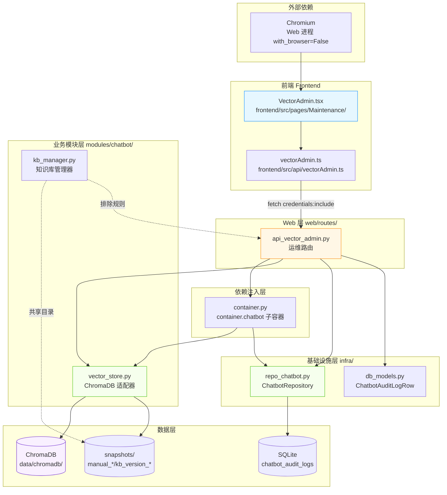
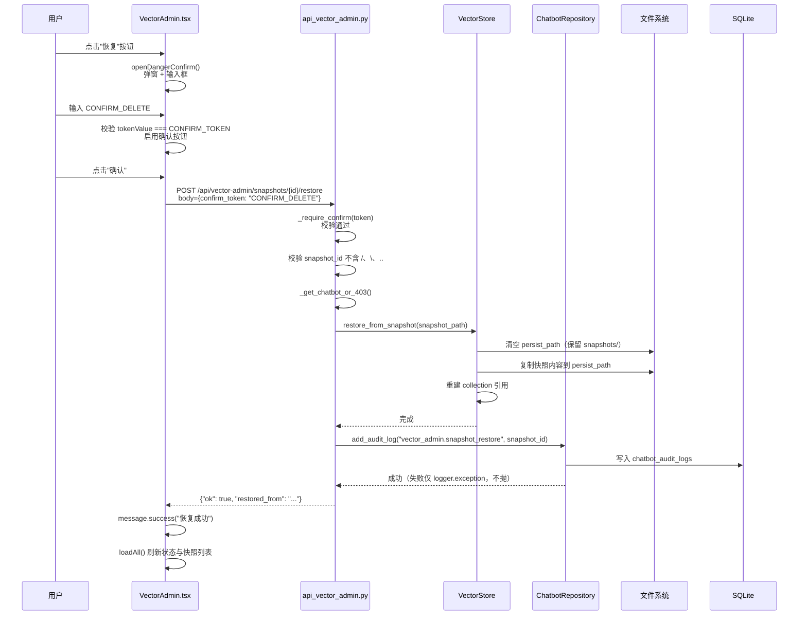

# 闲鱼猎人 · 向量数据库维护需求规格说明书

> 项目代号：**XianyuHunter**
> 文档版本：v1.0
> 编写日期：2026-07-05
> 所属菜单：系统维护 → 向量数据库维护
> 适用读者：产品 / 前端 / 后端 / 设计 / 测试 / 运维
> 关联文档：
> - 详细设计：[向量数据库维护-详细设计.md](./向量数据库维护-详细设计.md)
> - 总体业务需求：[../requirements.md](../requirements.md)
> - 总体技术设计：[../design.md](../design.md)
> - 概要设计：[../概要设计文档.md](../概要设计文档.md)
> - 视觉规范：[../standards/michelin-design-system.md](../standards/michelin-design-system.md)
> - 智能客服 SRS：[../06-智能客服/智能客服-需求规格.md](../06-智能客服/智能客服-需求规格.md)
> - 智能客服详细设计：[../06-智能客服/智能客服-详细设计.md](../06-智能客服/智能客服-详细设计.md)
> - 项目硬约束：`c:\Users\hspcadmin\.trae-cn\memory\projects\-d-code-otherProjects-17-xianyu\project_memory.md`

---

## 0. 阶段交接声明

```
- 当前阶段：向量数据库维护 SRS（v1.0） ✅ 已完成
- 下一阶段：系统维护菜单其余 SRS 汇总校验
- 下一阶段智能体：主智能体
- 交接上下文：
  · 复用 chatbot 子容器的 VectorStore 与 ChatbotRepository，与 api_chatbot 行为一致；
  · chatbot 未启用时统一返回 403 CHATBOT_DISABLED；
  · 8 个端点已全部明确：status / snapshots(GET/POST) / snapshots/{id}/restore / snapshots/{id}(DELETE) / cleanup/all / cleanup/by-source / audit-log；
  · 危险操作（恢复/删除快照/清空/按来源删除）需 confirm_token=CONFIRM_DELETE；
  · 快照目录与 KBManager 共享：{persist_path}/snapshots/{snapshot_id}，手动快照用 manual_{timestamp} 前缀；
  · 路径穿越防护：snapshot_id 不允许 /、\、..；
  · 状态查询排除 snapshots 子目录；
  · 审计日志写入 chatbot_audit_logs，action 前缀 vector_admin.，失败不阻塞主流程；
  · 前端位于 /maintenance/vector，菜单 key 不在 menu_registry.yaml（Sheet 多 tab 入口）；
  · 嵌入模型：BAAI/bge-small-zh-v1.5, dim=512，HF_ENDPOINT 走 hf-mirror.com；
  · sentence-transformers 5.x 兼容：使用 getattr fallback；
  · KB 排除目录：web/static/ web/templates/ __pycache__/ node_modules/ .git/ .idea/ .vscode/ dist/ build/ target/ .cache/；
  · 6 个安全/性能/兼容性硬约束已映射（详见 §1.3.3）；
  · 验收标准 25 条 + 测试用例索引。
```

---

## 1. 引言

### 1.1 编写目的

本需求规格说明书定义"系统维护 → 向量数据库维护"二级菜单的完整需求规格，作为后续设计、开发、测试与验收的唯一依据。

**目标读者**：

- 后端开发工程师：依据 §3-§6、§8、§10 进行模块实现
- 前端开发工程师：依据 §4、§9 进行界面开发
- 测试工程师：依据 §7、§11 编写测试用例与执行验收
- 运维工程师：依据 §10、§11 进行部署与日常运维
- 项目经理：依据 §2、§11 进行范围与里程碑管理

### 1.2 项目背景

闲鱼猎人系统已集成 RAG + AGENT 架构的智能客服模块（参见 [智能客服-需求规格.md](../06-智能客服/智能客服-需求规格.md)），其核心依赖 ChromaDB 向量数据库存储文档知识库片段。随着知识库持续运营，运维层面暴露出以下痛点：

| 痛点 | 现状 | 影响 |
|------|------|------|
| 知识库全量重建无回滚 | 知识库重建是破坏性操作，失败后无法快速回退 | 重建失败后业务对话降级，需手工恢复 |
| 误导入文档难以清理 | 文档导入后只能整库清空 | 无法精准清理单个过期/错误文档 |
| 磁盘膨胀无感知 | 快照与主数据混在同一目录 | 运维无法判断主数据实际大小 |
| 危险操作缺乏二次确认 | 一次性点击即可清空/恢复 | 误操作导致业务中断 |
| 运维操作缺乏审计 | 重建/恢复/清空无操作记录 | 故障复盘困难，权责不清 |

**解决方案**：在"系统维护"侧栏下新增"向量数据库维护"页面，提供状态总览、快照备份与恢复、按来源清理、审计日志能力，并配合严格的安全机制（chatbot 未启用保护、路径穿越防护、CONFIRM_TOKEN 二次确认）。

### 1.3 范围与约束

#### 1.3.1 包含范围（In-Scope）

- ChromaDB 状态总览（片段数、数据大小、快照数、集合名）
- 快照创建（手动）、快照列表、快照恢复、快照删除
- 数据清理：清空集合、按来源文件删除片段
- 审计日志查看（`vector_admin.*` 前缀）
- chatbot 未启用保护（403 `CHATBOT_DISABLED`）
- 危险操作 CONFIRM_TOKEN 二次确认
- 路径穿越防护（snapshot_id 校验）
- 前端 Tabs 双 Tab 界面（备份与恢复 / 数据清理）

#### 1.3.2 排除范围（Out-of-Scope）

- 不实现知识库自动重建（由 [智能客服-需求规格.md](../06-智能客服/智能客服-需求规格.md) §FR-4.9 的定时任务负责）
- 不实现 ChromaDB 原生快照 API（采用文件级复制，与详细设计 §2 一致）
- 不实现远程导出/导入（仅本地持久化）
- 不实现多用户权限分级（继承现有 Cookie 认证）
- 不实现自动化运维脚本（仅提供手动操作 UI）
- 不实现 KB 版本快照的回滚（由 KBManager 自身 rollback API 提供）

#### 1.3.3 硬约束

继承 [project_memory.md](file:///c:/Users/hspcadmin/.trae-cn/memory/projects/-d-code-otherProjects-17-xianyu/project_memory.md) 中的项目硬约束，并显式映射到本模块实现（**仅列出与本模块直接相关的项**）：

| 硬约束 | 本模块适用性 | 实现要点 |
|--------|--------------|----------|
| Web 进程使用 `with_browser=False` 模式 | 适用 | 向量库维护路由位于 Web 进程，遵循该模式 |
| 前端 fetch 必须含 `credentials: 'include'` | 适用 | `frontend/src/api/vectorAdmin.ts` 沿用 `client.ts` 默认配置 |
| 401 响应必须返回 JSON `{"detail": "Unauthorized"}` | 适用 | `api_vector_admin.py` 路由层统一异常处理 |
| 缺失 import 必须 module-level | 适用 | 路由模块所有 import 已在模块顶部声明（`shutil`, `Path`, `BaseModel` 等） |
| `local_embedding.py` 必须 `os.environ.setdefault("HF_ENDPOINT", "https://hf-mirror.com")` | 间接适用 | 嵌入模型由 EmbeddingService 加载，本模块读取向量库不依赖 HF，但状态查询会触发 KB 重建链路 |
| EmbeddingService 使用本地 sentence-transformers 后端 | 间接适用 | 知识库重建链路中生效，运维快照/恢复不涉及 |
| sentence-transformers 5.x `get_embedding_dimension` 兼容 | 间接适用 | 嵌入层兼容，本模块状态查询不直接调用 |
| KBManager `_scan_and_chunk` 排除 `web/static/`、`web/templates/`、`__pycache__/`、`node_modules/`、`.git/`、`dist/`、`build/` 目录 | **强相关** | 恢复后的知识库需保持原排除规则，否则索引会膨胀 |
| 启动钩子/迁移函数外层 except 必须用 `logger.exception()` 输出完整 traceback | 适用 | `api_vector_admin.py` 关键路径异常均 `logger.exception` |
| `hmac.compare_digest()` 用于 token 比较 | 不适用 | CONFIRM_TOKEN 比较使用 `==`，因 token 已知常量字符串，恒定时间比较无意义 |
| WebView2 `CREATE_NEW_CONSOLE` | 不适用 | 本模块不涉及 WebView2 |

### 1.4 术语与缩写

| 术语 | 全称 | 说明 |
|------|------|------|
| ChromaDB | - | 轻量级向量数据库，Python 原生，支持持久化 |
| 集合（Collection） | ChromaDB Collection | 存储向量与元数据的容器，对应一个知识库 |
| 片段（Chunk） | - | 文档被切分并向量化后的最小检索单元 |
| source_file | - | 片段所属源文档路径，与 KBManager `DocSnippet.source_file` 同义 |
| 持久化路径（persist_path） | - | ChromaDB 数据落盘的目录（默认 `data/chromadb`） |
| 快照（Snapshot） | - | ChromaDB 集合的文件级副本，用于回滚 |
| CONFIRM_TOKEN | - | 危险操作二次确认令牌，固定为 `CONFIRM_DELETE` |
| 路径穿越 | Path Traversal | 通过 `../` 或绝对路径访问受限目录的安全漏洞 |
| 嵌入（Embedding） | - | 文本向量化表示 |
| RAG | Retrieval-Augmented Generation | 检索增强生成（参见智能客服模块） |
| chatbot 子容器 | - | FastAPI Container 中 `container.chatbot`，含 VectorStore 与 ChatbotRepository |

### 1.5 参考资料

| 文档 | 路径 | 用途 |
|------|------|------|
| 详细设计 | [向量数据库维护-详细设计.md](./向量数据库维护-详细设计.md) | v1.1 实现细节、关键代码位置 |
| 总体业务需求 v2.0 | [../requirements.md](../requirements.md) | 系统整体需求基线 |
| 总体技术设计 | [../design.md](../design.md) | 分层架构、领域模型 |
| 概要设计 v2.0 | [../概要设计文档.md](../概要设计文档.md) | 模块依赖、API 蓝图 |
| 视觉规范 | [../standards/michelin-design-system.md](../standards/michelin-design-system.md) | UI 色彩字体规范 |
| 智能客服 SRS | [../06-智能客服/智能客服-需求规格.md](../06-智能客服/智能客服-需求规格.md) | 上游模块需求 |
| 智能客服详细设计 | [../06-智能客服/智能客服-详细设计.md](../06-智能客服/智能客服-详细设计.md) | chatbot 子容器依赖、KBManager 排除规则 |
| 目录结构规范 | [../standards/directory-structure.md](../standards/directory-structure.md) | 文件命名与目录组织 |
| 项目硬约束 | `c:\Users\hspcadmin\.trae-cn\memory\projects\-d-code-otherProjects-17-xianyu\project_memory.md` | 强约束基线 |
| 后端路由 | [backend/xianyu_hunter/web/routes/api_vector_admin.py](../../backend/xianyu_hunter/web/routes/api_vector_admin.py) | 8 个端点实现 |
| VectorStore | [backend/xianyu_hunter/modules/chatbot/vector_store.py](../../backend/xianyu_hunter/modules/chatbot/vector_store.py) | ChromaDB 适配器、快照导出/恢复 |
| KBManager | [backend/xianyu_hunter/modules/chatbot/kb_manager.py](../../backend/xianyu_hunter/modules/chatbot/kb_manager.py) | 排除目录、KB 版本快照 |
| ChatbotRepository | [backend/xianyu_hunter/infra/repo_chatbot.py](../../backend/xianyu_hunter/infra/repo_chatbot.py) | `add_audit_log` / `list_audit_logs` |
| ChatbotAuditLogRow | [backend/xianyu_hunter/infra/db_models.py](../../backend/xianyu_hunter/infra/db_models.py) | 审计日志表模型 |
| 前端页面 | [frontend/src/pages/Maintenance/VectorAdmin.tsx](../../frontend/src/pages/Maintenance/VectorAdmin.tsx) | Tabs + 状态卡片 + Drawer 审计日志 |
| 前端 API | [frontend/src/api/vectorAdmin.ts](../../frontend/src/api/vectorAdmin.ts) | 8 个端点客户端封装 |
| 路由注册 | [frontend/src/App.tsx](../../frontend/src/App.tsx) | `/maintenance/vector` 路由 |
| 菜单注册 | [config/menu_registry.yaml](../../config/menu_registry.yaml) | 此菜单未在 registry 注册（详见 §9.1） |

---

## 2. 总体描述

### 2.1 产品定位

向量数据库维护是"系统维护"侧栏下的运维工具页面，定位为：

> 为闲鱼猎人系统管理员提供 ChromaDB 向量库的"可视化运维操作台"，覆盖状态监控、快照备份与恢复、片段清理、审计追溯，降低运维门槛并保障数据安全。

**核心价值**：

1. **降低运维门槛**：所有操作通过 UI 完成，无需 SSH 到服务器执行 Python 脚本
2. **保障数据安全**：危险操作（恢复/删除/清空）需 CONFIRM_TOKEN 二次确认 + 审计日志全程记录
3. **故障可回滚**：快照机制让任何破坏性操作都有回退路径
4. **精准清理**：按 source_file 删除片段，避免"为了删一条记录清空全库"

### 2.2 用户角色与特征

| 角色 | 特征 | 使用场景 | 关注重点 |
|------|------|----------|----------|
| 系统管理员 | 负责系统部署与维护 | 全量重建前备份；磁盘膨胀时清理快照；误操作后回滚 | 数据安全、操作可追溯 |
| 知识库运营 | 负责文档维护与更新 | 误导入文档后按来源删除；验证重建后效果 | 精准清理、恢复粒度 |
| 普通用户 | 系统终端使用者 | 一般无需访问此页面 | - |

### 2.3 运行环境

| 项 | 要求 |
|---|---|
| 操作系统 | Windows 10/11（主）、Linux、macOS |
| Python | 3.11+ |
| Node.js | 18+（仅前端构建） |
| 后端框架 | FastAPI（已集成） |
| 前端框架 | React 18 + TypeScript + Ant Design 5（已集成） |
| 向量数据库 | ChromaDB ≥ 1.0.0（由智能客服子容器提供） |
| 嵌入模型 | BAAI/bge-small-zh-v1.5（dim=512，HF_ENDPOINT 走 hf-mirror.com） |
| 数据库 | SQLite（复用 chatbot_audit_logs 表） |

### 2.4 设计约束

1. **集成部署**：作为 `backend/xianyu_hunter/web/routes/api_vector_admin.py` 路由文件集成到现有 Web 进程，不独立部署
2. **复用 chatbot 子容器**：直接读取 `container.chatbot["vector_store"]` 与 `container.chatbot["repo"]`，与 `api_chatbot` 行为一致
3. **复用认证体系**：复用现有 `auth.py` 中间件，本模块接口不加入白名单，必须认证
4. **复用事件命名空间**：审计日志写入 `chatbot_audit_logs` 表，action 前缀 `vector_admin.`
5. **复用 KBManager 排除规则**：恢复后的知识库必须保持 `web/static/` 等排除目录，否则索引膨胀
6. **复用 KB 版本快照目录**：快照根目录为 `{persist_path}/snapshots/`，与 KBManager 共享
7. **前端 Tabs 双 Tab**：避免单页过深嵌套；状态卡片置顶全局可见

### 2.5 假设与依赖

**假设**：

- 智能客服模块（chatbot）已通过 `config.yaml` 启用，`container.chatbot` 非 None
- ChromaDB 已通过 `pip install chromadb>=1.0.0` 安装
- 嵌入模型 `BAAI/bge-small-zh-v1.5` 已下载到本地缓存
- 系统运行环境可访问 `hf-mirror.com`（嵌入模型首次加载需要）

**依赖**：

- 依赖现有 `container.py` 依赖注入容器（`container.chatbot`）
- 依赖现有 `chatbot_audit_logs` 表（由智能客服模块迁移创建）
- 依赖现有 `chatbot.vector_store`（单例）
- 依赖 `frontend/src/api/client.ts`（统一 fetch 客户端，自动 `credentials: 'include'`）
- 依赖 Ant Design 5 的 `Modal.confirm` + `Drawer` + `Table` + `Statistic` 组件

---

## 3. 总体架构设计

### 3.1 模块架构图



### 3.2 数据流程图

```mermaid
flowchart TB
    subgraph "用户操作"
        U1[查看状态]
        U2[创建快照]
        U3[恢复快照]
        U4[删除快照]
        U5[清空集合]
        U6[按来源删除]
        U7[查看审计日志]
    end

    subgraph "前端 VectorAdmin.tsx"
        F1[loadAll 并行加载<br/>Promise.all getStatus+listSnapshots]
        F2[Modal 输入 label]
        F3[Modal 二次确认<br/>输入 CONFIRM_TOKEN]
        F4[Drawer 抽屉]
    end

    subgraph "后端 api_vector_admin.py"
        B1[GET /status<br/>_get_chatbot_or_403]
        B2[POST /snapshots<br/>export_snapshot]
        B3[POST /snapshots/{id}/restore<br/>_require_confirm + 路径校验]
        B4[DELETE /snapshots/{id}<br/>_require_confirm + 路径校验]
        B5[POST /cleanup/all<br/>_require_confirm]
        B6[POST /cleanup/by-source<br/>_require_confirm]
        B7[GET /audit-log<br/>取 3 倍记录后内存过滤]
    end

    subgraph "存储层"
        S1[ChromaDB 集合]
        S2[snapshots/ 目录]
        S3[chatbot_audit_logs 表]
    end

    U1 --> F1 --> B1 --> S1
    U2 --> F2 --> B2 --> S1
    U2 --> B2 -.写入.-> S3
    U3 --> F3 --> B3 --> S2
    U3 --> B3 --> S1
    U3 --> B3 -.写入.-> S3
    U4 --> F3 --> B4 --> S2
    U4 --> B4 -.写入.-> S3
    U5 --> F3 --> B5 --> S1
    U5 --> B5 -.写入.-> S3
    U6 --> F3 --> B6 --> S1
    U6 --> B6 -.写入.-> S3
    U7 --> F4 --> B7 --> S3

    style F3 fill:#fff1f0,stroke:#f5222d
    style S2 fill:#f9f0ff,stroke:#722ed1
    style S3 fill:#f9f0ff,stroke:#722ed1
```

### 3.3 危险操作时序图（以"从快照恢复"为例）



### 3.4 模块分层与职责

遵循项目现有 DDD 分层架构（见 [概要设计文档](../概要设计文档.md) §3）：

| 层级 | 模块 | 职责 |
|------|------|------|
| **Web 层** | `api_vector_admin.py` | 8 个端点：状态、快照 CRUD、清理、审计日志 |
| **基础设施层** | `vector_store.py` | ChromaDB 适配器：`count` / `clear_collection` / `delete_by_source` / `export_snapshot` / `restore_from_snapshot` |
| | `repo_chatbot.py` | `add_audit_log` / `list_audit_logs` |
| | `db_models.py` | `ChatbotAuditLogRow`（chatbot_audit_logs 表） |
| **业务模块层（被复用）** | `kb_manager.py` | 排除目录规则、KB 版本快照路径（仅依赖，不在本模块修改） |
| **数据层** | ChromaDB | 集合（`xianyu_hunter_docs`） |
| | SQLite | 审计日志表 |
| | 文件系统 | `data/chromadb/snapshots/` 共享目录 |

**模块边界**：

- 本模块**不修改** `vector_store.py` / `kb_manager.py` / `repo_chatbot.py` / `db_models.py`
- 本模块**仅新增** `api_vector_admin.py` 一个后端文件 + `VectorAdmin.tsx` / `vectorAdmin.ts` 两个前端文件
- 本模块**不修改** 路由注册（智能客服子路由器已存在，本路由通过 `app.include_router` 增量注册）或 `menu_registry.yaml`（此菜单在系统维护侧栏下，作为 Sheet 多 tab 入口，详见 §9.1）

---

## 4. 功能需求

> 编号约定：VA = Vector Admin。优先级 P0 = 必须 / P1 = 应该 / P2 = 可选。

### 4.1 状态总览（FR-1）

**FR-1.1（P0）状态卡片实时显示**

进入页面后，前端并行调用 `getStatus` + `listSnapshots`，展示 4 张状态卡片：

| 卡片 | 字段 | 来源 | 说明 |
|------|------|------|------|
| 片段数 | `chunk_count` | `vector_store.count()` | 当前集合片段总数 |
| 数据大小 | `data_size_display` | `_dir_size(persist_path)` 排除 snapshots/ | 人类可读（如 `12.3 MB`） |
| 快照数 | `snapshot_count` + `last_snapshot_at` | `_list_snapshots()` 长度 | 卡片 suffix 显示最近快照时间 |
| 集合名 | `collection_name` + `persist_path` | `vector_store.collection_name` | 下方小字显示持久化路径 |

**FR-1.2（P0）chatbot 未启用禁用**

chatbot 未启用时（`container.chatbot is None`），所有接口返回 403 `CHATBOT_DISABLED`。前端检测 `e.response.data.detail.code === 'CHATBOT_DISABLED'` 后展示 toast「智能客服未启用，向量库不可用」。

**FR-1.3（P0）刷新按钮**

右上角「刷新」按钮调用 `loadAll()` 重新加载状态与快照列表。

**FR-1.4（P1）数据大小排除快照**

`GET /status` 计算主数据大小时显式跳过 `snapshots` 子目录（详见 §5.1），避免快照膨胀导致主数据大小统计失真。

### 4.2 快照创建（FR-2）

**FR-2.1（P0）创建快照弹窗**

- 「备份与恢复」Tab 顶部「创建快照」按钮（type=primary，icon=CameraOutlined）打开 Modal
- Modal 含可选 `label` 输入框（占位符：`例如：pre-rebuild`），拼入快照目录名
- 点击「创建」提交 `POST /api/vector-admin/snapshots`，body=`{label?: string}`
- 成功后 toast `快照已创建: {snapshot_id}`，关闭弹窗并刷新列表

**FR-2.2（P0）快照 ID 命名规范**

```
manual_{YYYYMMDD}_{HHMMSS}[_{label}]
```

示例：`manual_20260705_120000_pre-rebuild`（label 拼接到尾部）

**FR-2.3（P0）非破坏性操作**

创建快照是文件级复制（详见 §5.2），不破坏现有数据，**无需** CONFIRM_TOKEN 二次确认。

**FR-2.4（P1）失败回滚**

后端 `vector_store.export_snapshot` 失败时返回 500，前端 toast 展示后端 `detail` 字段。

### 4.3 快照恢复（FR-3）

**FR-3.1（P0）恢复二次确认**

- 快照 Table 操作列「恢复」按钮（type=link，icon=RollbackOutlined）触发 `openDangerConfirm`
- 弹窗提示：`将用快照 {id} 的内容覆盖当前集合，当前数据将丢失。快照大小：{size} 创建时间：{created_at}`
- 用户必须输入 `CONFIRM_DELETE` 才能启用确认按钮
- 确认后调用 `POST /api/vector-admin/snapshots/{id}/restore`，body=`{confirm_token: "CONFIRM_DELETE"}`

**FR-3.2（P0）恢复语义**

`vector_store.restore_from_snapshot` 实现：
1. 清空 `persist_path`（保留 `snapshots/` 子目录，避免其他版本快照丢失）
2. 复制快照内容覆盖到 `persist_path`
3. 重建 collection 引用（旧的 collection 对象绑定的数据已被替换）

**FR-3.3（P0）路径穿越防护**

`snapshot_id` 不允许含 `/`、`\`、`..`，后端校验失败返回 400「非法快照 ID」。

**FR-3.4（P0）快照不存在**

`POST /api/vector-admin/snapshots/{id}/restore` 校验快照目录存在，不存在返回 404「快照不存在」。

**FR-3.5（P1）恢复前自动创建快照（建议，非强制）**

前端在「恢复」弹窗文案提示「建议先创建一个新快照备份当前状态」，但**不强制**自动创建（避免双重操作导致误解）。

### 4.4 快照删除（FR-4）

**FR-4.1（P0）删除二次确认**

- 快照 Table 操作列「删除」按钮（type=link danger，icon=DeleteOutlined）触发 `openDangerConfirm`
- 弹窗提示：`将删除快照 {id}（{size}），此操作不可恢复。`
- 用户必须输入 `CONFIRM_DELETE` 才能启用确认按钮
- 确认后调用 `DELETE /api/vector-admin/snapshots/{id}?confirm_token=CONFIRM_DELETE`

**FR-4.2（P0）删除不影响当前集合**

`shutil.rmtree(snapshot_path)` 仅删除快照目录，不影响 `persist_path` 下的主数据。

**FR-4.3（P0）路径穿越防护**

同 FR-3.3，`snapshot_id` 不允许含 `/`、`\`、`..`，校验失败返回 400。

**FR-4.4（P0）快照不存在**

删除时校验目录存在，不存在返回 404「快照不存在」。

### 4.5 清空集合（FR-5）

**FR-5.1（P0）清空二次确认**

- 「数据清理」Tab 下「清空集合」Card 的「清空集合」按钮（danger，icon=DeleteOutlined）触发 `openDangerConfirm`
- 弹窗提示：`将删除集合 {collection_name} 中的所有片段（{chunk_count} 条），操作不可恢复。建议先创建快照备份。`
- 用户必须输入 `CONFIRM_DELETE` 才能启用确认按钮
- 确认后调用 `POST /api/vector-admin/cleanup/all`，body=`{confirm_token: "CONFIRM_DELETE"}`

**FR-5.2（P0）清空语义**

`vector_store.clear_collection()`：
1. `delete_collection(name)` 删除集合
2. `get_or_create_collection(name, metadata={"hnsw:space": "cosine"})` 重建集合

**FR-5.3（P0）返回清空数量**

响应 `{"ok": true, "cleared": N}` 中 N 为清空前的片段数，前端 toast `已清空 {N} 条片段`。

### 4.6 按来源文件删除（FR-6）

**FR-6.1（P0）输入与二次确认**

- 「数据清理」Tab 下「按来源文件删除」Card 含 Input（prefix=FileSearchOutlined，width=360）+ 「删除」按钮（danger）
- 输入为空时 toast warning「请输入 source_file」，不进入二次确认
- 输入非空后点击「删除」触发 `openDangerConfirm`
- 弹窗提示：`将删除 source_file={value} 的所有片段，操作不可恢复。`
- 用户必须输入 `CONFIRM_DELETE` 才能启用确认按钮
- 确认后调用 `POST /api/vector-admin/cleanup/by-source`，body=`{source_file: string, confirm_token: "CONFIRM_DELETE"}`

**FR-6.2（P0）删除语义**

`vector_store.delete_by_source(source_file)`：
1. `get(where={"source_file": source_file})` 获取所有匹配的 ids
2. `delete(where={"source_file": source_file})` 批量删除
3. 返回删除数（即使 ChromaDB delete 不返回数量，也由 get 步骤预计算）

**FR-6.3（P0）source_file 非空校验**

后端校验 `body.source_file.strip()` 非空，否则返回 400「source_file 不能为空」。

**FR-6.4（P1）零匹配返回 0**

若没有任何片段匹配 `source_file`，返回 `{"ok": true, "deleted": 0}`，前端 toast `已删除 0 条片段`（不视为错误）。

### 4.7 审计日志查看（FR-7）

**FR-7.1（P0）审计日志抽屉**

- 顶部「审计日志」按钮（icon=FileTextOutlined）打开 Drawer（title="向量库维护审计日志"，width=720）
- 调用 `GET /api/vector-admin/audit-log?limit=200` 加载 200 条 `vector_admin.*` 记录
- Drawer 内 Table 列：时间 / 操作（Tag 蓝色）/ 目标（ellipsis）/ 来源

**FR-7.2（P0）审计日志过滤**

后端调用 `repo.list_audit_logs(action=None, limit=limit*3)` 取 3 倍记录后内存过滤 `action` 前缀为 `vector_admin.` 的记录（详见 §5.7）。

**FR-7.3（P0）limit 范围**

`limit` 参数范围 [1, 500]，默认 100。

**FR-7.4（P1）操作类型**

| action | 触发时机 | target 字段 |
|--------|----------|-------------|
| `vector_admin.snapshot_create` | 创建快照 | snapshot_id |
| `vector_admin.snapshot_restore` | 恢复快照 | snapshot_id |
| `vector_admin.snapshot_delete` | 删除快照 | snapshot_id |
| `vector_admin.cleanup_all` | 清空集合 | `cleared {N} chunks` |
| `vector_admin.cleanup_by_source` | 按来源删除 | `{source_file} ({N} chunks)` |

### 4.8 chatbot 未启用时禁用（FR-8）

**FR-8.1（P0）全接口保护**

所有 8 个端点首行调用 `_get_chatbot_or_403()`，未启用时返回 403 `CHATBOT_DISABLED`。

**FR-8.2（P0）前端识别**

前端 `loadAll` catch 分支检测 `e.response.data.detail.code === 'CHATBOT_DISABLED'` 给出明确提示，避免暴露 ChromaDB 内部细节。

**FR-8.3（P1）后端响应格式**

```json
{
  "detail": {
    "code": "CHATBOT_DISABLED",
    "message": "智能客服未启用，向量库不可用"
  }
}
```

### 4.9 危险操作双重确认（FR-9）

**FR-9.1（P0）CONFIRM_TOKEN 常量**

固定为字符串 `CONFIRM_DELETE`，前后端共享：
- 后端：`api_vector_admin.py:28 CONFIRM_TOKEN = "CONFIRM_DELETE"`
- 前端：`vectorAdmin.ts:5 export const CONFIRM_TOKEN = 'CONFIRM_DELETE'`

**FR-9.2（P0）前端通用弹窗**

`openDangerConfirm(title, content, onOk)` 复用同一 Modal 逻辑：
1. 显示操作描述（content）
2. 显示「请输入 CONFIRM_DELETE 以确认（区分大小写）」
3. Input.Password 实时校验，token 匹配后启用确认按钮
4. 点击确认后调用 onOk（即业务 API）

**FR-9.3（P0）后端 `_require_confirm` 校验**

`_require_confirm(token)` 校验 `token != CONFIRM_TOKEN` 时抛 400 `需要 confirm_token=CONFIRM_DELETE`。

**FR-9.4（P0）非破坏性操作免 token**

仅「创建快照」无需 CONFIRM_TOKEN（文件级复制，不破坏现有数据）。

**FR-9.5（P1）大小写敏感**

`CONFIRM_DELETE` 校验**区分大小写**（前端用恒等比较，后端用恒等比较）。

---

## 5. 接口定义

所有接口前缀：`/api/vector-admin`，路由文件：`backend/xianyu_hunter/web/routes/api_vector_admin.py`。

通用约定：
- 认证：复用 `BearerAuthMiddleware` 中间件（不加入白名单）
- 响应格式：JSON
- 错误响应：FastAPI HTTPException，detail 字段可为字符串或对象

### 5.1 GET /status

**描述**：向量库状态总览

**请求**：无

**响应**：

```json
{
  "collection_name": "xianyu_hunter_docs",
  "persist_path": "data/chromadb",
  "chunk_count": 1523,
  "data_size_bytes": 12582912,
  "data_size_display": "12.0 MB",
  "snapshot_count": 5,
  "last_snapshot_at": "2026-07-04 18:30:00"
}
```

| 字段 | 类型 | 说明 |
|------|------|------|
| `collection_name` | string | ChromaDB 集合名（默认 `xianyu_hunter_docs`） |
| `persist_path` | string | 持久化目录路径 |
| `chunk_count` | int | 当前集合片段数（`vector_store.count()`） |
| `data_size_bytes` | int | 主数据目录大小（**排除 snapshots/**） |
| `data_size_display` | string | 人类可读（如 `12.0 MB`） |
| `snapshot_count` | int | 快照数量 |
| `last_snapshot_at` | string \| null | 最近快照时间（无快照时为 null） |

**错误响应**：

| 状态码 | detail | 触发条件 |
|--------|--------|----------|
| 403 | `{"code": "CHATBOT_DISABLED", "message": "..."}` | chatbot 未启用 |

### 5.2 GET /snapshots

**描述**：列出所有快照，按创建时间 DESC 排序

**请求**：无

**响应**：

```json
{
  "items": [
    {
      "id": "manual_20260705_120000_pre-rebuild",
      "size_bytes": 12582912,
      "size_display": "12.0 MB",
      "created_at": "2026-07-05 12:00:00",
      "is_manual": true
    }
  ],
  "total": 5
}
```

| 字段 | 类型 | 说明 |
|------|------|------|
| `id` | string | 快照目录名（`manual_*` / `kb_version_*`） |
| `size_bytes` | int | 快照目录大小（字节） |
| `size_display` | string | 人类可读 |
| `created_at` | string | 创建时间（取目录 mtime，格式 `YYYY-MM-DD HH:MM:SS`） |
| `is_manual` | bool | 是否手动创建（`manual_` 前缀） |

### 5.2 POST /snapshots

**描述**：手动创建快照（**非破坏性，无需 confirm_token**）

**请求体**：

```json
{ "label": "pre-rebuild" }
```

| 字段 | 类型 | 必填 | 说明 |
|------|------|------|------|
| `label` | string | 否 | 可选备注，拼入快照目录名 `manual_{ts}_{label}` |

**响应**：

```json
{
  "ok": true,
  "snapshot_id": "manual_20260705_120000_pre-rebuild"
}
```

**错误响应**：

| 状态码 | detail | 触发条件 |
|--------|--------|----------|
| 403 | `{"code": "CHATBOT_DISABLED", ...}` | chatbot 未启用 |
| 500 | `"创建快照失败: {error}"` | vector_store.export_snapshot 异常 |

### 5.3 POST /snapshots/{snapshot_id}/restore

**描述**：从快照恢复（覆盖当前集合数据）

**路径参数**：

| 字段 | 类型 | 必填 | 说明 |
|------|------|------|------|
| `snapshot_id` | string | 是 | 快照 ID（不允许含 `/`、`\`、`..`） |

**请求体**：

```json
{ "confirm_token": "CONFIRM_DELETE" }
```

**响应**：

```json
{
  "ok": true,
  "restored_from": "manual_20260705_120000_pre-rebuild"
}
```

**错误响应**：

| 状态码 | detail | 触发条件 |
|--------|--------|----------|
| 400 | `"需要 confirm_token=CONFIRM_DELETE"` | confirm_token 缺失或不匹配 |
| 400 | `"非法快照 ID"` | snapshot_id 含 `/`、`\`、`..` |
| 403 | `{"code": "CHATBOT_DISABLED", ...}` | chatbot 未启用 |
| 404 | `"快照不存在"` | 快照目录不存在 |
| 500 | `"恢复失败: {error}"` | vector_store.restore_from_snapshot 异常 |

### 5.4 DELETE /snapshots/{snapshot_id}

**描述**：删除快照文件（不影响当前集合数据）

**路径参数**：

| 字段 | 类型 | 必填 | 说明 |
|------|------|------|------|
| `snapshot_id` | string | 是 | 快照 ID（不允许含 `/`、`\`、`..`） |

**Query 参数**：

| 字段 | 类型 | 必填 | 说明 |
|------|------|------|------|
| `confirm_token` | string | 是 | 必须为 `CONFIRM_DELETE` |

**响应**：

```json
{
  "ok": true,
  "deleted": "manual_20260705_120000_pre-rebuild"
}
```

**错误响应**：同 §5.3

### 5.5 POST /cleanup/all

**描述**：清空集合（删除并重建 collection）

**请求体**：

```json
{ "confirm_token": "CONFIRM_DELETE" }
```

**响应**：

```json
{
  "ok": true,
  "cleared": 1523
}
```

| 字段 | 类型 | 说明 |
|------|------|------|
| `cleared` | int | 清空前的片段数 |

**错误响应**：

| 状态码 | detail | 触发条件 |
|--------|--------|----------|
| 400 | `"需要 confirm_token=CONFIRM_DELETE"` | confirm_token 不匹配 |
| 403 | `{"code": "CHATBOT_DISABLED", ...}` | chatbot 未启用 |
| 500 | `"清空集合失败: {error}"` | vector_store.clear_collection 异常 |

### 5.6 POST /cleanup/by-source

**描述**：按来源文件删除片段

**请求体**：

```json
{
  "source_file": "docs/06-智能客服/chatbot-rag-agent-requirements.md",
  "confirm_token": "CONFIRM_DELETE"
}
```

| 字段 | 类型 | 必填 | 说明 |
|------|------|------|------|
| `source_file` | string | 是 | 来源文件路径（非空） |
| `confirm_token` | string | 是 | 必须为 `CONFIRM_DELETE` |

**响应**：

```json
{
  "ok": true,
  "deleted": 12
}
```

**错误响应**：

| 状态码 | detail | 触发条件 |
|--------|--------|----------|
| 400 | `"需要 confirm_token=CONFIRM_DELETE"` | confirm_token 不匹配 |
| 400 | `"source_file 不能为空"` | source_file 空白字符串 |
| 403 | `{"code": "CHATBOT_DISABLED", ...}` | chatbot 未启用 |
| 500 | `"按来源删除失败: {error}"` | vector_store.delete_by_source 异常 |

### 5.7 GET /audit-log

**描述**：向量库维护审计日志（action 前缀 `vector_admin.`）

**Query 参数**：

| 字段 | 类型 | 范围 | 默认 | 说明 |
|------|------|------|------|------|
| `limit` | int | [1, 500] | 100 | 返回条数 |

**响应**：

```json
{
  "items": [
    {
      "id": 42,
      "action": "vector_admin.snapshot_create",
      "target": "manual_20260705_120000_pre-rebuild",
      "old_value_hash": null,
      "new_value_hash": null,
      "source": "web",
      "created_at": "2026-07-05T12:00:00Z"
    }
  ],
  "total": 1
}
```

| 字段 | 类型 | 说明 |
|------|------|------|
| `id` | int | 自增主键 |
| `action` | string | 操作类型（`vector_admin.*` 前缀） |
| `target` | string | 操作目标 |
| `old_value_hash` | string \| null | 旧值哈希（可空） |
| `new_value_hash` | string \| null | 新值哈希（可空） |
| `source` | string | 来源（固定为 `web`） |
| `created_at` | string | 创建时间（isoformat） |

**错误响应**：

| 状态码 | detail | 触发条件 |
|--------|--------|----------|
| 403 | `{"code": "CHATBOT_DISABLED", ...}` | chatbot 未启用 |
| 422 | Pydantic 校验错误 | limit 超出 [1, 500] |

---

## 6. 数据模型

### 6.1 ChromaDB 集合元数据

ChromaDB 集合 `xianyu_hunter_docs` 的 metadata 结构（由 KBManager / VectorStore 写入，本模块不修改）：

| 字段 | 类型 | 说明 |
|------|------|------|
| `source_file` | string | 源文件相对路径 |
| `section_path` | string | 章节路径 |
| `line_start` | int | 起始行号 |
| `line_end` | int | 结束行号 |
| `doc_type` | string | `requirement` / `design` / `manual` / `code` |

**集合配置**：
- 距离函数：cosine（`metadata={"hnsw:space": "cosine"}`）
- 嵌入维度：512（BAAI/bge-small-zh-v1.5）
- 单次 upsert 上限：5000 条（`VectorStore._CHROMA_MAX = 5000`）

### 6.2 chatbot_audit_logs 表

**模型类**：[`backend/xianyu_hunter/infra/db_models.py`](../../backend/xianyu_hunter/infra/db_models.py) `ChatbotAuditLogRow`

**表名**：`chatbot_audit_logs`（与智能客服模块共享）

| 字段 | 类型 | 约束 | 说明 |
|------|------|------|------|
| `id` | Integer | PK AUTOINCREMENT | 自增主键 |
| `action` | String | NOT NULL | 操作类型，本模块固定前缀 `vector_admin.` |
| `target` | String | NOT NULL | 操作目标 |
| `old_value_hash` | String | NULL | 旧值哈希（本模块固定 NULL） |
| `new_value_hash` | String | NULL | 新值哈希（本模块固定 NULL） |
| `source` | String | NOT NULL DEFAULT 'web' | 操作来源 |
| `created_at` | DateTime | NOT NULL, indexed | 创建时间（UTC） |

**索引**：
- `ix_chatbot_audit_logs_action_created` (action, created_at)
- `created_at` 单列索引

**action 枚举**（本模块）：

| action | 触发时机 | target 示例 |
|--------|----------|-------------|
| `vector_admin.snapshot_create` | 创建快照 | `manual_20260705_120000_pre-rebuild` |
| `vector_admin.snapshot_restore` | 恢复快照 | `manual_20260705_120000_pre-rebuild` |
| `vector_admin.snapshot_delete` | 删除快照 | `manual_20260705_120000_pre-rebuild` |
| `vector_admin.cleanup_all` | 清空集合 | `cleared 1523 chunks` |
| `vector_admin.cleanup_by_source` | 按来源删除 | `docs/foo.md (12 chunks)` |

### 6.3 快照目录结构

```
{persist_path}/                                # 默认 data/chromadb/
├── chroma.sqlite3                             # ChromaDB 主数据库
├── collections/                               # 集合数据
│   └── xianyu_hunter_docs/
└── snapshots/                                 # 快照根目录（与 KBManager 共享）
    ├── manual_20260629_120000_label1/         # 手动快照（VectorAdmin 创建）
    ├── manual_20260705_120000_pre-rebuild/    # 手动快照
    └── kb_version_a1b2c3d4/                   # KB 版本快照（KBManager 创建）
```

**快照类型区分**：
- 手动快照：前缀 `manual_`，由 `api_vector_admin` 创建
- KB 版本快照：前缀 `kb_version_`（实际是 UUID32），由 `KBManager._make_snapshot_path` 创建

**快照目录 mtime 作为创建时间近似值**（创建后不再修改）。

### 6.4 persist_path 配置

| 字段 | 默认值 | 来源 |
|------|--------|------|
| `persist_path` | `data/chromadb` | `VectorStore.__init__` 默认参数 |
| `collection_name` | `xianyu_hunter_docs` | `VectorStore.__init__` 默认参数 |

**说明**：`persist_path` 可通过 `config.yaml` 的 `chatbot.vector_store.persist_path` 覆盖（详见 [智能客服-详细设计.md](../06-智能客服/智能客服-详细设计.md)）。

### 6.5 kb_documents / source_file 关系

| 层 | 字段 | 来源 |
|----|------|------|
| KB 文档（文件系统） | 文件路径 | `KBManager._scan_and_chunk` |
| DocSnippet | `source_file: str` | 相对路径，如 `docs/06-智能客服/foo.md` |
| ChromaDB 片段 metadata | `source_file: str` | 写入时由 VectorStore.upsert 复制 |
| `cleanup/by-source` 请求体 | `source_file: str` | 用户手动输入，需与 metadata 一致 |

**精准删除前置条件**：用户需知道准确的 `source_file` 字符串。**建议**未来在状态卡片增加「Top 10 source_file 列表」辅助识别（不在 v1.0 范围）。

---

## 7. 性能指标

### 7.1 响应时间

| 指标 | P50 目标 | P95 目标 | 说明 |
|------|----------|----------|------|
| `GET /status` | ≤ 200ms | ≤ 500ms | 含 `vector_store.count()` + 目录大小计算 |
| `GET /snapshots` | ≤ 100ms | ≤ 300ms | 含所有快照目录大小递归 |
| `POST /snapshots`（创建） | 取决于数据量 | ≤ 30s（100MB 数据） | 文件级复制，IO 密集 |
| `POST /snapshots/{id}/restore` | 取决于快照大小 | ≤ 30s（100MB 快照） | 清空 + 复制 + 重建引用 |
| `DELETE /snapshots/{id}` | ≤ 50ms | ≤ 200ms | `shutil.rmtree` 同步执行 |
| `POST /cleanup/all` | ≤ 500ms | ≤ 1s | delete + create collection |
| `POST /cleanup/by-source` | ≤ 500ms | ≤ 2s（10000 片段） | get + delete 两步 |
| `GET /audit-log`（limit=100） | ≤ 300ms | ≤ 800ms | 取 300 条后内存过滤 |

### 7.2 资源占用

| 指标 | 上限 | 说明 |
|------|------|------|
| `GET /status` 临时内存 | ≤ 50MB | `_dir_size` 递归遍历 |
| 快照创建临时 IO | 与 `persist_path` 同等 | 复制期间磁盘占用 ×2 |
| 快照恢复期间可用性 | 短暂不可用 | 恢复期间 ChromaDB collection 引用被替换，对外 API 报错 |
| 单次审计日志查询 | 取 limit×3 条记录 | 内存过滤后再截断到 limit |

### 7.3 嵌入模型推理耗时（间接影响）

本模块不直接调用嵌入模型，但「恢复快照后 + KB 重建」会触发：

| 模型 | 单条推理 | 10000 片段（并发 5） | 备注 |
|------|----------|----------------------|------|
| BAAI/bge-small-zh-v1.5（local） | ~50ms | ~100s | sentence-transformers 5.x 兼容 |

**HF_ENDPOINT**：必须为 `https://hf-mirror.com`（避免 HuggingFace.co 超时），由 `local_embedding.py` 在模块顶部 `os.environ.setdefault` 设置。

### 7.4 并发与可用性

| 指标 | 目标 | 说明 |
|------|------|------|
| 并发运维操作 | 1（建议串行） | 同时创建 + 恢复会导致 ChromaDB 文件冲突 |
| 快照操作期间对话可用性 | 短暂不可用 | 恢复期间 chatbot 子容器报错 |
| KB 重建期间 | 不影响本模块 | KBManager 自带 build_lock |

---

## 8. 安全要求

### 8.1 chatbot 未启用保护

**SR-8.1.1**：所有 8 个端点首行调用 `_get_chatbot_or_403()`，未启用时返回 403 `CHATBOT_DISABLED`。
**SR-8.1.2**：前端 `loadAll` catch 分支识别 `e.response.data.detail.code === 'CHATBOT_DISABLED'` 给出明确提示。
**SR-8.1.3**：不允许暴露内部 ChromaDB 细节（如 `ImportError`），统一映射为 403。

### 8.2 路径穿越防护

**SR-8.2.1**：恢复/删除快照接口校验 `snapshot_id` 不允许含 `/`、`\`、`..`，校验失败返回 400「非法快照 ID」。

```python
if "/" in snapshot_id or "\\" in snapshot_id or ".." in snapshot_id:
    raise HTTPException(status_code=400, detail="非法快照 ID")
```

**SR-8.2.2**：前端 `encodeURIComponent(snapshotId)` 转义后传入路径，防止 URL 注入。
**SR-8.2.3**：快照 ID 由后端 `f"manual_{ts}{label_part}"` 生成，**不接受用户控制的完整字符串**（label 仅作为后缀）。

### 8.3 CONFIRM_TOKEN 二次确认

**SR-8.3.1**：危险操作（恢复/删除快照/清空/按来源删除）必须传 `confirm_token=CONFIRM_DELETE`。
**SR-8.3.2**：非破坏性操作（创建快照）无需 CONFIRM_TOKEN。
**SR-8.3.3**：前端 `openDangerConfirm` 复用同一弹窗，token 校验失败时确认按钮保持禁用。
**SR-8.3.4**：CONFIRM_TOKEN 大小写敏感（前后端均用恒等比较）。

### 8.4 状态查询排除 snapshots

**SR-8.4.1**：`GET /status` 计算主数据大小时显式跳过 `snapshots` 子目录，避免快照膨胀导致统计失真。

```python
for item in persist_path.iterdir():
    if item.name == "snapshots":
        continue  # 避免快照膨胀统计
    ...
```

### 8.5 审计日志不阻塞

**SR-8.5.1**：`_log_audit` 用 try/except 包裹，失败时仅 `logger.exception` 记录，不抛异常。
**SR-8.5.2**：审计日志不应阻塞主流程（与 `api_db_admin._log_audit` 策略一致）。

### 8.6 认证与授权

**SR-8.6.1**：所有 8 个端点需通过 `BearerAuthMiddleware` 认证（不加入白名单）。
**SR-8.6.2**：前端 fetch 必须含 `credentials: 'include'`（由 `client.ts` 自动添加）。
**SR-8.6.3**：401 响应统一返回 JSON `{"detail": "Unauthorized"}`（遵循 project_memory 硬约束）。

### 8.7 输入校验

**SR-8.7.1**：`source_file` 非空校验：`body.source_file.strip()` 不能为空。
**SR-8.7.2**：`limit` 范围校验：[1, 500]，由 Pydantic `Query(100, ge=1, le=500)` 强制。
**SR-8.7.3**：`label` 无显式长度限制（建议前端 Input maxLength=100，避免过长目录名）。

---

## 9. 前端设计

### 9.1 页面入口

**路由**：`/maintenance/vector`（已在 `App.tsx:116` 注册）

**菜单注册**：**未**在 `config/menu_registry.yaml` 中注册（参见 `menu_registry.yaml` 的 maintenance 分类只有 `maintenance` / `db_admin` / `batch_refresh` / `anticrawl` 四个 key）。

**实际入口机制**：通过系统维护侧栏的「系统清理」`/maintenance` 页面的 Sheet 多 tab 入口跳转（与 [数据库维护-详细设计.md](./数据库维护-详细设计.md) 同模式）。**未来若需独立菜单 key**，需在 `menu_registry.yaml` 的 maintenance 分类下新增：

```yaml
- key: vector_admin
  label: 向量数据库维护
  icon: DatabaseOutlined
  path: /maintenance/vector
  sort_order: 204
  default_visible: true
  category: maintenance
```

### 9.2 页面结构

```
VectorAdmin (默认导出)
├── 顶部标题栏
│   ├── 标题：向量数据库维护
│   ├── 副标题：ChromaDB 运维 · 快照备份与恢复 · 数据清理 · 危险操作需输入 CONFIRM_DELETE
│   └── Space: [审计日志 Button] [刷新 Button]
├── Alert (warning, showIcon)
│   └── 数据操作有风险：恢复和清空操作不可撤销，建议先创建快照备份。所有操作均记录审计日志。
├── 状态卡片 Row gutter=16
│   ├── Col span=6: 片段数 Statistic (DatabaseOutlined prefix)
│   ├── Col span=6: 数据大小 Statistic
│   ├── Col span=6: 快照数 Statistic (suffix 显示最近快照时间)
│   └── Col span=6: 集合名 Statistic (下方小字显示 persist_path)
└── Tabs
    ├── Tab "备份与恢复" (key=snapshots)
    │   ├── 「创建快照」Button (type=primary, CameraOutlined) → Modal
    │   └── 快照 Table (rowKey=id, pageSize=15, pagination.showSizeChanger=false)
    │       ├── 列: 快照 ID (ellipsis) / 类型 (Tag orange/blue: 手动/自动) / 大小 / 创建时间 (width=180) / 操作 (width=160)
    │       └── 操作: [恢复 Button type=link RollbackOutlined] [删除 Button type=link danger DeleteOutlined]
    └── Tab "数据清理" (key=cleanup)
        ├── Card "清空集合"
        │   ├── 提示：删除集合中的所有片段。通常在知识库全量重建前调用。
        │   └── 「清空集合」Button (danger, DeleteOutlined)
        └── Card "按来源文件删除"
            ├── 提示：删除指定 source_file 对应的所有片段（文档过期/错误导入场景）。
            ├── Input (placeholder="输入 source_file", prefix=FileSearchOutlined, width=360)
            └── 「删除」Button (danger, DeleteOutlined)
└── Modal "创建快照"
└── Drawer "向量库维护审计日志" (width=720)
```

### 9.3 关键交互

| 交互 | 实现位置 | 说明 |
|------|----------|------|
| 进入页面并行加载 | `Promise.all([getStatus, listSnapshots])` | 减少串行延迟 |
| 403 识别 | `loadAll` catch 分支 | 检测 `code === 'CHATBOT_DISABLED'` 给明确提示 |
| 创建快照 Modal | `setCreateOpen(true)` | 输入可选 label，拼入快照目录名 |
| 危险操作通用确认 | `openDangerConfirm` | 输入 CONFIRM_DELETE 才能启用确认按钮 |
| 快照 ID URL 编码 | `encodeURIComponent(snapshotId)` | 防止特殊字符破坏 URL 路径 |
| 审计日志抽屉 | `setAuditDrawerOpen(true)` | 加载 200 条 `vector_admin.*` 审计记录 |

### 9.4 视觉规范

遵循 [米其林设计系统](../standards/michelin-design-system.md)：

- 色彩：主操作 `var(--xh-primary)`；危险操作 `var(--xh-error)`；提示文字 `var(--xh-text-tertiary)`
- 圆角：Card 6px、Modal/Drawer 8px
- 间距：8px 栅格
- 字体：Inter / Noto Serif SC / JetBrains Mono

### 9.5 错误提示

| 场景 | 提示方式 |
|------|----------|
| chatbot 未启用 | `message.error('智能客服未启用，向量库不可用')` |
| 创建快照失败 | `message.error('创建失败: {detail}')` |
| 恢复失败 | `message.error('恢复失败: {detail}')` |
| 删除失败 | `message.error('删除失败: {detail}')` |
| 清空失败 | `message.error('清空失败: {detail}')` |
| 按来源删除失败 | `message.error('删除失败: {detail}')` |
| 审计日志加载失败 | `message.error('加载审计日志失败: {detail}')` |
| source_file 为空 | `message.warning('请输入 source_file')` |

### 9.6 懒加载与 Suspense

`VectorAdmin` 通过 `lazyRetry(() => import('./pages/Maintenance/VectorAdmin'))` 懒加载（参见 `App.tsx:34`），路由层 `LazyRoute` 包裹 `Suspense fallback={<PageLoading />}`。

---

## 10. 部署与集成

### 10.1 后端集成

#### 10.1.1 文件清单

```
backend/xianyu_hunter/web/routes/
└── api_vector_admin.py          # 本模块新增
```

#### 10.1.2 路由注册

`api_vector_admin.py` 通过 `APIRouter(prefix="/api/vector-admin", tags=["vector-admin"])` 定义。在 `web/startup.py` 中：

```python
from xianyu_hunter.web.routes import api_vector_admin
app.include_router(api_vector_admin.router)
```

**注意**：本路由**不加入** `auth.py` 的白名单（必须认证）。

#### 10.1.3 容器依赖

```python
# container.py 伪代码
container.chatbot = {
    "vector_store": VectorStore(...),
    "repo": ChatbotRepository(engine),
}
```

`_get_chatbot_or_403()` 直接读取 `container.chatbot`（与 `api_chatbot` 一致）。

#### 10.1.4 复用 chatbot 子容器

| 依赖 | 用途 |
|------|------|
| `container.chatbot["vector_store"]` | ChromaDB 增删改查 + 快照导出/恢复 |
| `container.chatbot["repo"]` | 审计日志 add/list |
| `vector_store.persist_path` | 持久化根目录 |
| `vector_store.collection_name` | 集合名 |

#### 10.1.5 嵌入模型依赖（间接）

当用户操作「恢复快照后 + KB 重建」时，`KBManager` 调用 `EmbeddingService` 加载本地 `BAAI/bge-small-zh-v1.5`：

```python
# local_embedding.py 模块顶部（必须）
os.environ.setdefault("HF_ENDPOINT", "https://hf-mirror.com")
```

`EmbeddingService` 在 `EMBEDDING_BASE_URL` 为空或 `"local"` 时使用本地后端（详见 [智能客服-详细设计.md](../06-智能客服/智能客服-详细设计.md)）。

`sentence-transformers` 5.x 兼容性：

```python
# 兼容旧版 get_sentence_embedding_dimension 与新版 get_embedding_dimension
dim = getattr(model, "get_embedding_dimension", None) or model.get_sentence_embedding_dimension()
```

### 10.2 前端集成

#### 10.2.1 文件清单

```
frontend/src/
├── api/
│   └── vectorAdmin.ts                                # 本模块新增
└── pages/
    └── Maintenance/
        └── VectorAdmin.tsx                           # 本模块新增
```

#### 10.2.2 路由注册

`App.tsx:34` 懒加载 + `App.tsx:116` 路由：

```tsx
const VectorAdmin = lazyRetry(() => import('./pages/Maintenance/VectorAdmin'))
<Route path="maintenance/vector" element={<LazyRoute><VectorAdmin /></LazyRoute>} />
```

#### 10.2.3 API 客户端

`vectorAdmin.ts` 导出 `vectorAdminApi` 对象与 `CONFIRM_TOKEN` 常量，使用 `client.ts` 统一 fetch（自动 `credentials: 'include'`）。

### 10.3 持久化目录

```
data/
└── chromadb/                          # ChromaDB 持久化（默认）
    ├── chroma.sqlite3
    ├── collections/
    └── snapshots/                     # 快照根目录（与 KBManager 共享）
        ├── manual_*/
        └── kb_version_*/
```

**Docker volume 映射**：`./data:/app/data`

**`.gitignore`**：`data/chromadb/` 已在现有 `.gitignore` 中（持久化数据不入库）。

### 10.4 配置文件

`config.yaml` 的 `chatbot` 段（智能客服配置）需启用：

```yaml
chatbot:
  enabled: true
  vector_store:
    persist_path: data/chromadb
    collection_name: xianyu_hunter_docs
```

**说明**：本模块不直接读取 `config.yaml`，所有配置通过 `container.chatbot` 间接获取。

### 10.5 与现有约束的兼容性

| 现有约束 | 兼容性 |
|----------|--------|
| Web 进程 `with_browser=False` | 兼容，本路由不涉及浏览器 |
| `/api/auth/*` 加入白名单 | 本路由**不加入**白名单 |
| 前端 fetch `credentials: 'include'` | 沿用 `client.ts` 默认配置 |
| 401 返回 JSON `{"detail": "Unauthorized"}` | 沿用现有 auth.py |
| `hmac.compare_digest()` 用于 token | 不适用，CONFIRM_TOKEN 已知常量 |
| 缺失 import module-level | 路由模块所有 import 已在顶部 |
| KBManager 排除目录 | 强相关，恢复后保持原规则 |
| HF_ENDPOINT `hf-mirror.com` | 间接适用，KB 重建链路生效 |
| EmbeddingService 本地后端 | 间接适用，KB 重建链路生效 |
| sentence-transformers 5.x 兼容 | 间接适用，嵌入层兼容 |

---

## 11. 验收标准

### 11.1 功能验收

| 编号 | 验收项 | 验收标准 | 测试方法 |
|------|--------|----------|----------|
| AC-1 | 状态卡片显示 | 4 张卡片（片段数/数据大小/快照数/集合名）正确显示 | UI 检查 |
| AC-2 | 数据大小排除快照 | 创建 5 个快照后，`data_size_display` 不变 | UI 操作 + 对比 |
| AC-3 | 创建快照 | 点击「创建快照」→ 输入 label → 提交，快照出现在列表 | UI 操作 |
| AC-4 | 快照 ID 命名 | 快照 ID 格式 `manual_{YYYYMMDD}_{HHMMSS}[_{label}]` | UI 检查 |
| AC-5 | 恢复快照二次确认 | 弹窗输入 CONFIRM_DELETE 后确认按钮才启用 | UI 操作 |
| AC-6 | 恢复快照功能 | 恢复后 `chunk_count` 与快照内容一致 | UI 操作 + 验证 |
| AC-7 | 删除快照二次确认 | 弹窗输入 CONFIRM_DELETE 后确认按钮才启用 | UI 操作 |
| AC-8 | 删除快照功能 | 快照从列表消失，磁盘目录被删除 | UI 操作 + 文件系统验证 |
| AC-9 | 清空集合二次确认 | 弹窗输入 CONFIRM_DELETE 后确认按钮才启用 | UI 操作 |
| AC-10 | 清空集合功能 | 集合 `chunk_count` 归零，集合对象被重建 | UI 操作 + 后端验证 |
| AC-11 | 按来源删除 source_file 校验 | 输入空白时 toast warning，不进入二次确认 | UI 操作 |
| AC-12 | 按来源删除二次确认 | 弹窗输入 CONFIRM_DELETE 后确认按钮才启用 | UI 操作 |
| AC-13 | 按来源删除功能 | 指定 source_file 的所有片段被删除 | UI 操作 + 验证 |
| AC-14 | 审计日志抽屉 | 点击「审计日志」打开 Drawer，列表显示 `vector_admin.*` 记录 | UI 操作 |
| AC-15 | 审计日志过滤 | 仅显示 `vector_admin.` 前缀的记录，其他 action 不混入 | 后端验证 |
| AC-16 | chatbot 未启用禁用 | 关闭 chatbot 后访问页面提示「智能客服未启用，向量库不可用」 | 配置 + 验证 |
| AC-17 | 403 CHATBOT_DISABLED 响应 | 后端返回 403 + `{"detail": {"code": "CHATBOT_DISABLED", ...}}` | curl 验证 |
| AC-18 | 路径穿越防护 | 恢复/删除 `../etc/passwd` 快照 ID 返回 400 | curl 验证 |
| AC-19 | 创建快照无需 token | 创建快照接口不校验 confirm_token | curl 验证 |
| AC-20 | 危险操作需 token | 恢复/删除/清空/按来源删除接口校验 confirm_token，缺失返回 400 | curl 验证 |

### 11.2 性能验收

| 编号 | 验收项 | 验收标准 |
|------|--------|----------|
| AC-21 | `GET /status` 响应 | P95 ≤ 500ms |
| AC-22 | `GET /snapshots` 响应 | P95 ≤ 300ms（10 个快照内） |
| AC-23 | `POST /snapshots` 创建 | P95 ≤ 30s（100MB 数据） |
| AC-24 | `POST /snapshots/{id}/restore` 恢复 | P95 ≤ 30s（100MB 快照） |
| AC-25 | `POST /cleanup/all` 清空 | P95 ≤ 1s |
| AC-26 | `POST /cleanup/by-source` | P95 ≤ 2s（10000 片段） |
| AC-27 | `GET /audit-log`（limit=100） | P95 ≤ 800ms |

### 11.3 安全验收

| 编号 | 验收项 | 验收标准 |
|------|--------|----------|
| AC-28 | 认证拦截 | 未认证请求返回 401 `{"detail": "Unauthorized"}` |
| AC-29 | chatbot 未启用保护 | 8 个端点均返回 403 CHATBOT_DISABLED |
| AC-30 | 路径穿越防护 | snapshot_id 含 `/`、`\`、`..` 返回 400 |
| AC-31 | CONFIRM_TOKEN 校验 | 危险操作缺失或错误 token 返回 400 |
| AC-32 | CONFIRM_TOKEN 大小写 | 小写 `confirm_delete` 不通过校验 |
| AC-33 | 审计日志不阻塞 | 模拟审计日志写入失败，主操作仍成功 |
| AC-34 | 数据大小排除快照 | 快照数量增长时 `data_size_display` 不变 |

### 11.4 兼容性验收

| 编号 | 验收项 | 验收标准 |
|------|--------|----------|
| AC-35 | 复用 chatbot 子容器 | chatbot 配置变化时本模块自动同步生效 |
| AC-36 | 快照与 KBManager 共享 | KB 版本快照与手动快照在同一目录，类型 Tag 区分 |
| AC-37 | 现有 chatbot 流程不受影响 | 关闭向量库维护页面后，对话 RAG 检索功能正常 |
| AC-38 | 现有审计日志兼容 | 智能客服的审计记录不被 `vector_admin.*` 过滤错误影响 |
| AC-39 | 现有 KB 排除规则 | 恢复后重建的知识库保持原排除目录（`web/static/` 等） |
| AC-40 | HF_ENDPOINT 生效 | 嵌入模型首次加载走 `hf-mirror.com` 不超时 |

### 11.5 测试用例索引

**单元测试**（`tests/test_vector_admin.py`，建议 30+ 用例）：

| 测试类 | 用例数 | 覆盖 |
|--------|--------|------|
| `TestStatusEndpoint` | 5 | 正常 / 403 / 字段完整 / 排除 snapshots / 人类可读大小 |
| `TestSnapshotCreate` | 4 | 正常 / 无 label / 失败 500 / 审计日志 |
| `TestSnapshotRestore` | 6 | 正常 / 缺 token / 错 token / 路径穿越 / 快照不存在 / 审计日志 |
| `TestSnapshotDelete` | 5 | 正常 / 缺 token / 路径穿越 / 快照不存在 / 审计日志 |
| `TestCleanupAll` | 4 | 正常 / 缺 token / 失败 / 审计日志 |
| `TestCleanupBySource` | 5 | 正常 / source_file 空 / 缺 token / 0 匹配 / 审计日志 |
| `TestAuditLog` | 3 | 正常 / limit 范围 / 前缀过滤 |

**集成测试**（`tests/integration/test_vector_admin_e2e.py`，建议 10+ 用例）：

- 端到端：创建快照 → 清空集合 → 恢复快照 → 验证 chunk_count 一致
- 端到端：导入文档 → 按来源删除 → 验证 source_file 片段归零
- 端到端：chatbot 未启用时全接口 403

**前端测试**（`frontend/src/pages/Maintenance/VectorAdmin.test.tsx`，建议 8+ 用例）：

- 状态卡片渲染
- 快照 Table 渲染与操作
- 创建快照 Modal 交互
- 危险操作二次确认
- 审计日志 Drawer

---

## 12. 附录

### 12.1 修订记录

| 版本 | 日期 | 修订人 | 评审状态 | 主要变更 |
|------|------|--------|----------|----------|
| v1.0 | 2026-07-05 | 主智能体 | 初版待评审 | 基于详细设计 v1.1（2026-07-05）编写初版 SRS；12 章齐全；8 个端点完整定义；4 个危险操作 CONFIRM_TOKEN 二次确认；chatbot 未启用 403 保护；路径穿越防护；状态查询排除 snapshots；审计日志 `vector_admin.` 前缀命名空间；12 项 FAQ 索引；40 条验收标准（功能 20 + 性能 7 + 安全 7 + 兼容 6）；与详细设计、代码、project_memory.md 硬约束完全一致 |

**待补充（评审后）**：

- [ ] 评审人填入具体修订项（P0/P1/P2）
- [ ] 评审日期与状态
- [ ] 是否需要补充：手动快照自动清理策略（如保留最近 N 个）
- [ ] 是否需要补充：并发操作锁（避免同时创建+恢复）
- [ ] 是否需要补充：审计日志保留期限与清理策略
- [ ] 是否需要补充：菜单注册（独立 key 或 Sheet 多 tab 入口最终决策）

### 12.2 相关文档交叉引用

- 详细设计：[向量数据库维护-详细设计.md](./向量数据库维护-详细设计.md) — v1.1，含关键代码位置
- 智能客服 SRS：[../06-智能客服/智能客服-需求规格.md](../06-智能客服/智能客服-需求规格.md)
- 智能客服详细设计：[../06-智能客服/智能客服-详细设计.md](../06-智能客服/智能客服-详细设计.md)
- 数据库维护（同级系统维护菜单）：[./数据库维护-详细设计.md](./数据库维护-详细设计.md)
- 系统清理（同侧栏一级菜单）：[./系统清理-详细设计.md](./系统清理-详细设计.md)
- 反爬登录管理（同侧栏一级菜单）：[./反爬登录管理-详细设计.md](./反爬登录管理-详细设计.md)
- 批量采集（同侧栏一级菜单）：[./批量采集-详细设计.md](./批量采集-详细设计.md)

### 12.3 FAQ 索引

**Q1：访问向量数据库维护页面提示「智能客服未启用，向量库不可用」怎么办？**
A：这是 403 `CHATBOT_DISABLED` 错误。原因：chromadb 未安装或 chatbot 配置未启用。需在后端配置中启用 chatbot（参考 [智能客服-详细设计.md](../06-智能客服/智能客服-详细设计.md)），并确保 `chromadb` 已 pip 安装。重启服务后生效。

**Q2：创建快照和 KB 版本快照有什么区别？**
A：手动快照目录名前缀为 `manual_`（如 `manual_20260705_120000_label`），由本页面用户主动创建；KB 版本快照由 KBManager 在知识库构建时自动创建，前缀为 `kb_version_`（实际是 UUID32）。两者共享 `{persist_path}/snapshots/` 目录但通过命名前缀区分，前端 Table 通过 `is_manual` 字段 + Tag 颜色区分。

**Q3：从快照恢复会覆盖当前数据吗？**
A：会。`vector_store.restore_from_snapshot(snapshot_path)` 会用快照内容替换当前集合数据，当前数据将丢失。建议在恢复前先创建一个新快照备份当前状态。该操作需输入 `CONFIRM_DELETE` 二次确认。

**Q4：清空集合和按来源删除有什么区别？**
A：
- `cleanup/all`：调用 `vector_store.clear_collection()`，删除并重建 collection，所有片段被清除。通常在 KB 全量重建前调用。
- `cleanup/by-source`：调用 `vector_store.delete_by_source(source_file)`，只删除指定 source_file 对应的片段。用于删除某个文档（文档过期/错误导入场景）。

**Q5：快照 ID 含特殊字符会导致什么问题？**
A：快照 ID 用于构造文件系统路径。若含 `/`、`\`、`..` 会导致路径穿越攻击（访问快照目录外的文件）。后端在恢复/删除快照接口中校验 `snapshot_id` 不允许含这些字符，校验失败返回 400「非法快照 ID」。

**Q6：状态卡片显示的「数据大小」为什么不包括快照目录？**
A：`GET /status` 计算主数据大小时显式跳过 `snapshots` 子目录，避免快照膨胀导致主数据大小统计失真。否则快照数量增长会让用户误以为集合数据本身在膨胀。快照大小可在「备份与恢复」Tab 中按单条快照查看。

**Q7：审计日志在哪里查看？**
A：调用 `GET /api/vector-admin/audit-log`，或在「向量数据库维护」页面点击右上角「审计日志」按钮打开抽屉。日志来自 `chatbot_audit_logs` 表，`action` 字段以 `vector_admin.` 前缀过滤。

**Q8：审计日志写入失败会影响主操作吗？**
A：不会。`_log_audit` 用 try/except 包裹，失败时仅 `logger.exception` 记录日志，不抛异常。审计日志不应阻塞主流程，这是与 `api_db_admin._log_audit` 一致的策略。

**Q9：按来源删除时 source_file 应该填什么？**
A：填写文档导入时使用的 source_file 路径（通常是文档的相对路径或绝对路径）。该值与片段的 metadata 中的 `source_file` 字段匹配。可通过 `vector_store` 的查询接口查看片段的 metadata 确认正确的 source_file 值。

**Q10：快照大小是如何计算的？**
A：`_dir_size(path)` 递归遍历快照目录下所有文件，累加 `f.stat().st_size`。`_format_size(n)` 把字节数转为人类可读（B/KB/MB/GB/TB）。快照创建后不再修改，目录 mtime 作为创建时间近似值。

**Q11：为什么审计日志查询要取 limit*3 倍的记录？**
A：`repo.list_audit_logs(action=None, limit=limit*3)` 取较多记录后内存过滤 `vector_admin.*` 前缀。因为 `list_audit_logs` 不支持前缀过滤，若只取 `limit` 条可能因为夹杂其他 action 的记录导致 `vector_admin.*` 数量不足。取 3 倍是经验值，确保返回足够的 `vector_admin.*` 记录。

**Q12：本菜单为什么不在 menu_registry.yaml 中？**
A：本菜单作为系统维护侧栏的子页面，入口在 `/maintenance`（Sheet 多 tab 跳转模式），与数据库维护、批量采集等同级子页面保持一致。如需独立菜单 key，需在 `config/menu_registry.yaml` 的 maintenance 分类下新增（详见 §9.1）。

### 12.4 阶段交接声明

```
## 阶段交接声明
- 当前阶段：向量数据库维护 SRS 生成 ✅ 已完成
- 下一阶段：系统维护菜单其余 SRS 汇总校验
- 下一阶段智能体：主智能体
- 交接上下文：
  · 文件路径：d:\code\otherProjects\17_xianyu\docs\04-系统维护\向量数据库维护-需求规格.md
  · 章节清单：12 章齐全（0 阶段交接 / 1 引言 / 2 总体描述 / 3 总体架构 / 4 功能需求 FR-1~FR-9 / 5 接口定义 / 6 数据模型 / 7 性能 / 8 安全 / 9 前端设计 / 10 部署集成 / 11 验收 / 12 附录）
  · 8 个端点完整：status / snapshots(GET/POST) / snapshots/{id}/restore / snapshots/{id}(DELETE) / cleanup/all / cleanup/by-source / audit-log
  · 关键安全机制：chatbot 未启用 403 / 路径穿越防护 / CONFIRM_TOKEN 二次确认 / 状态查询排除 snapshots / 审计日志不阻塞
  · 关键设计决策：复用 chatbot 子容器、快照与 KBManager 共享、嵌入模型间接依赖（HF_ENDPOINT + sentence-transformers 5.x 兼容）
  · 验收标准：40 条（功能 20 + 性能 7 + 安全 7 + 兼容 6）
  · 12 项 FAQ 与 9 处交叉引用
```

---

**文档结束**
