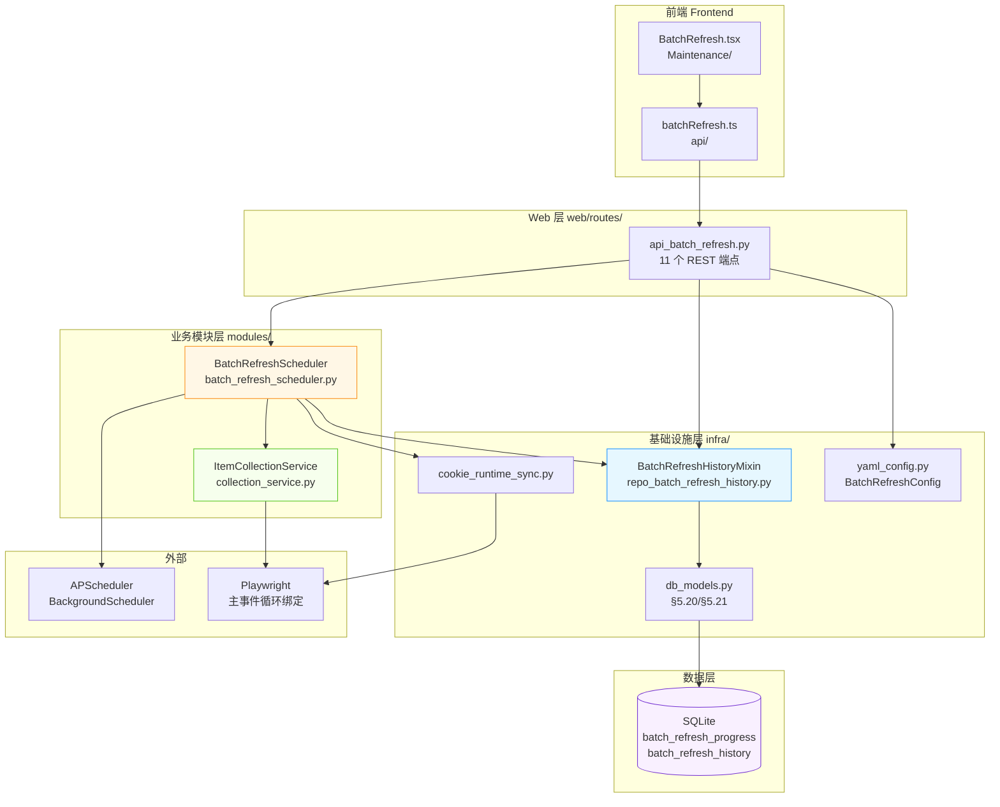
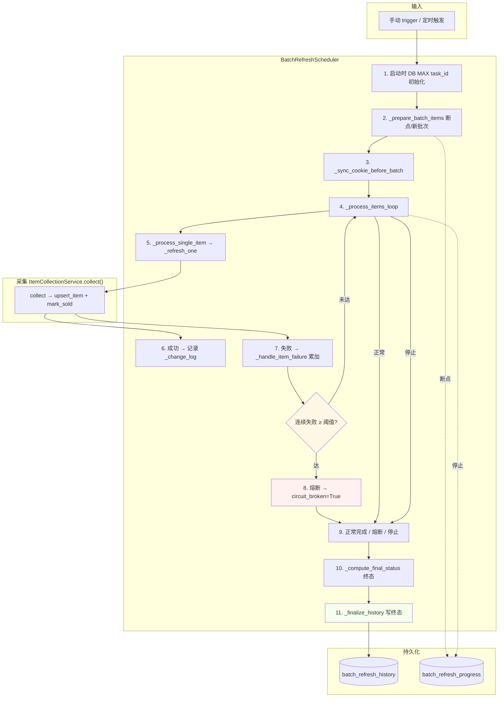
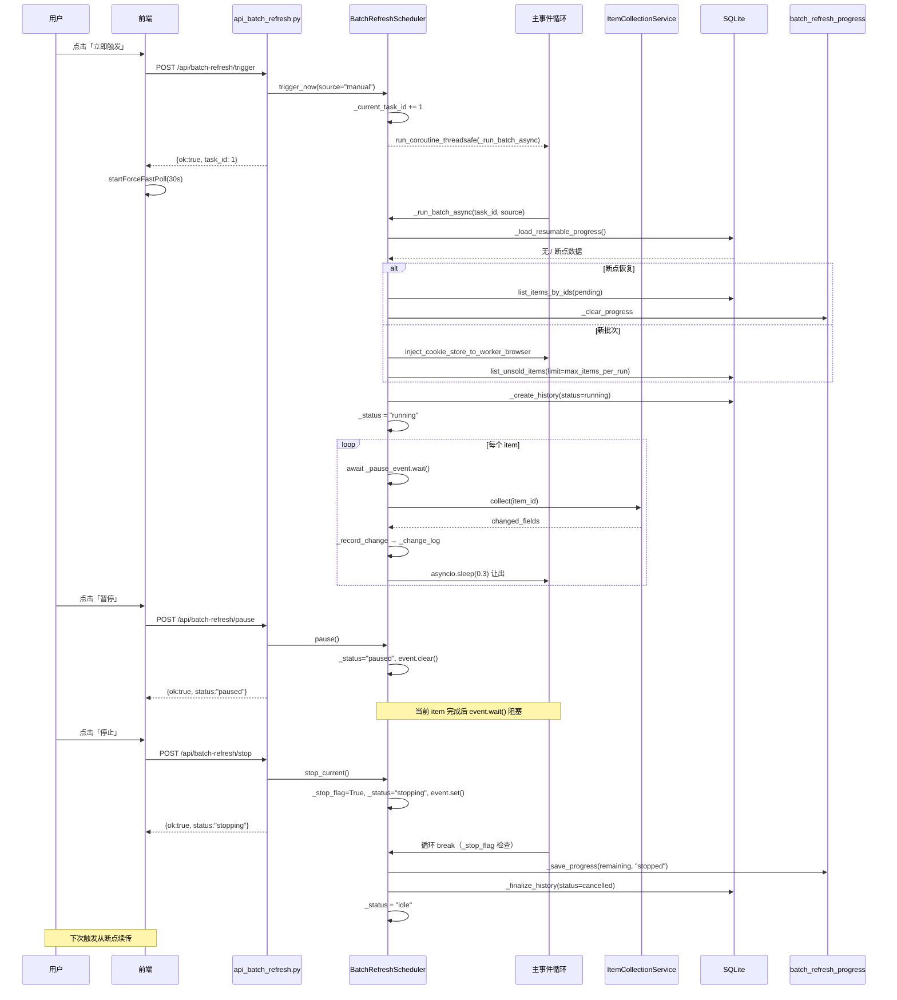

# 闲鱼猎人 · 系统维护 → 批量采集 需求规格说明书

> 项目代号：**XianyuHunter**
> 文档版本：v1.0
> 编写日期：2026-07-05
> 适用读者：产品 / 前端 / 后端 / 测试 / 运维
> 关联文档：
> - [需求规格说明书](../requirements.md) — 总体业务需求
> - [技术设计文档](../design.md) — 总体技术设计
> - [概要设计文档](../概要设计文档.md) — 模块/数据/接口总体设计
> - [米其林视觉规范](../standards/michelin-design-system.md) — 色彩/字体/间距 Token
> - [批量采集-详细设计.md](./批量采集-详细设计.md) — 本菜单详细设计 v1.1/2026-07-05
> - [项目硬约束](c:/Users/hspcadmin/.trae-cn/memory/projects/-d-code-otherProjects-17-xianyu/project_memory.md) — 跨模块硬约束基线

---

## 0. 阶段交接声明

```
- 当前阶段：批量采集 需求规格（v1.0）✅ 已完成
- 下一阶段：系统维护菜单其余 SRS 汇总校验（系统清理、数据库维护、反爬登录管理、向量数据库维护）
- 下一阶段智能体：主智能体
- 下一阶段技能：code-reviewer（交叉一致性核查）
- 交接上下文：
  · 菜单注册：key=batch_refresh / path=/batch-refresh / sort_order=202 / category=maintenance
  · 状态机：idle / running / paused / stopping / unavailable（共 5 态）
  · 调度器主流程拆分：_prepare_batch_items / _sync_cookie_before_batch / _process_items_loop /
    _process_single_item / _handle_item_failure / _compute_final_status / _create_history /
    _append_error / _finalize_history / _finalize_history_on_exception
  · 失败语义：circuit_broken=True 熔断（剩余记为 skipped，history.status=failed），与用户停止 cancelled 严格区分
  · 统一采集：_refresh_one 走 ItemCollectionService.collect()，返回 result.changed_fields
  · 配置项：interval_minutes(1-1440) / enabled / history_retention_days(0-3650, 默认 90, 0=永不清理) /
    max_consecutive_failures（构造注入，默认 3）
  · task_id 全局自增：调度器启动时 get_max_batch_refresh_task_id() 初始化
  · 错误消息累积：_MAX_ERROR_MESSAGES=50，FIFO 丢弃；单条 error 截断 500 字符
  · 前端 forceFastPoll：trigger/控制操作后立即 3s 高频轮询，30s 兜底超时
  · 资源调度优化：每个 item 后 await asyncio.sleep(_YIELD_INTERVAL=0.3) 让出主事件循环
  · 关键路由：/api/batch-refresh/{status,trigger,config,pause,resume,stop,history,history/stats,history/{id}}
  · 关键表：batch_refresh_progress（断点）/ batch_refresh_history（终态持久化）
```

---

## 1. 引言

### 1.1 编写目的

本需求规格说明书定义"闲鱼猎人"项目"系统维护 → 批量采集"二级菜单的完整需求规格，作为后续开发、测试、验收的唯一基线。

**目标读者**：
- 后端开发工程师：依据 §3-§6、§8、§10 进行模块实现与重构
- 前端开发工程师：依据 §4、§9 进行界面开发与轮询策略实现
- 测试工程师：依据 §7、§11 编写测试用例与执行验收
- 运维/产品：依据 §2、§10 进行部署与范围管理

### 1.2 项目背景

闲鱼猎人是一个闲鱼自动捡漏与抢单工具，已具备任务管理、商品采集、AI 评估、自动下单、多渠道通知等完整能力（详见 [requirements.md](../requirements.md) 与 [概要设计文档.md](../概要设计文档.md)）。系统迭代过程中"商品中心"积累了大量在售商品数据，但这些数据的"已售状态"与"价格/标题等字段"在发布后可能发生变化，需要一个**轻量、可控、可恢复**的后台任务定期刷新。

| 痛点 | 现状 | 影响 |
|------|------|------|
| 已售商品未及时下线 | 任务评估仍引用已售商品，浪费评估预算 | 用户感知"系统推荐的都已售" |
| 字段变更未补全 | 卖家主动改价/改描述后，数据陈旧 | 错过低价机会、误判价值 |
| 手动刷新无通道 | 现有 [官方采集弹窗](file:///d:/code/otherProjects/17_xianyu/frontend/src/pages/OfficialCollection) 需逐个触发 | 大量商品时不可行 |
| 异常无可观测性 | 失败被静默吞掉，无历史可查 | 故障排查只能凭经验 |
| 资源竞争无序 | 采集与主业务抢 Playwright 资源 | 抢单时浏览器卡顿 |

**解决方案**：在系统维护菜单新增"批量采集"二级菜单，基于 APScheduler `BackgroundScheduler` + 异步事件循环绑定，提供"定时调度 + 手动触发 + 暂停/继续/停止 + 断点续传 + 完整执行历史 + 历史清理"的全套能力。

### 1.3 范围与约束

#### 1.3.1 包含范围（In-Scope）

- 调度器：APScheduler `BackgroundScheduler` 定时调度（默认 30 分钟）
- 手动触发：前端"立即触发"按钮
- 任务控制：暂停 / 继续 / 停止 三个立即响应端点
- 状态机：5 态（idle / running / paused / stopping / unavailable）
- 进度持久化：`batch_refresh_progress` 表（断点续传）
- 变更检测：单商品字段差异检测，写入内存 `_change_log`（上限 1000 条，FIFO）
- 失败熔断：连续失败达阈值（默认 3 次）后熔断当前批次
- 资源调度：每商品后 `await asyncio.sleep(0.3)` 让出事件循环
- 配置热更新：仅 `enabled` 与 `interval_minutes` 走 PATCH 端点
- 执行历史：`batch_refresh_history` 表持久化，含分页查询、详情、清理
- 前端：Tabs 双 Tab（当前执行 / 执行历史）+ 详情 Drawer + 智能轮询
- 菜单注册：[menu_registry.yaml](../../config/menu_registry.yaml) 中 `key=batch_refresh`

#### 1.3.2 排除范围（Out-of-Scope）

- 不实现分布式调度（单机单实例；多实例会重复触发，task_id 仍自增不冲突）
- 不实现用户自定义 Cron 表达式（仅 `interval_minutes` 间隔，范围 1-1440）
- 不采集商品评估/卖家画像（只刷新 `items` 表基础字段）
- 不实现通知推送（本模块不发送通知；变更触发由任务调度器侧的通知订阅负责）
- 不实现历史快照/回滚（仅按天清理 + 手动删除单条）
- 不暴露 WebSocket 推送（前端走 HTTP 轮询）

#### 1.3.3 硬约束

继承 [project_memory.md](c:/Users/hspcadmin/.trae-cn/memory/projects/-d-code-otherProjects-17-xianyu/project_memory.md) 中的全部项目硬约束，并显式映射到本菜单实现：

| 硬约束 | 本菜单适用性 | 实现要点 |
|--------|--------------|----------|
| Web 进程必须 `with_browser=False` | 适用 | 批量采集使用全局 Playwright 浏览器，复用主进程；不在子进程开新浏览器 |
| 认证白名单（`/api/auth/cookie` 等） | **不适用** | `/api/batch-refresh/*` 加入认证保护，由 `BearerAuthMiddleware` 拦截 |
| 前端 fetch 必须含 `credentials: 'include'` | 适用 | `frontend/src/api/batchRefresh.ts` 沿用全局 `client` 封装 |
| htmx 用官方 `<meta>` 配置 credentials | 不适用 | 本菜单前端用 AntD + axios/fetch，不用 htmx |
| 401 返回 JSON `{"detail":"Unauthorized"}` | 适用 | `api_batch_refresh.py` 路由不重复鉴权；中间件统一返回 |
| `hmac.compare_digest()` 用于 token 比较 | 不适用 | 本菜单无 token 字符串比较；认证完全交给中间件 |
| 敏感字段（token 长度等）不日志 | 适用 | 错误消息截断 500 字符；不记录 cookie 完整值 |
| token 写失败触发 `logging.warning()` | 不适用 | 本菜单无 token 写 |
| 缺失 import 必须 module-level | 适用 | `batch_refresh_scheduler.py` / `repo_batch_refresh_history.py` 全部模块级 import |
| DB 必须在 `task_id` 等字段加索引 | 适用 | `batch_refresh_progress.task_id` / `batch_refresh_history.task_id`、`started_at`、`status` 全部加索引（见 §6.2/§6.3） |
| COUNT 查询用 CASE WHEN 聚合 | 不直接适用 | 本菜单历史列表走 SQLAlchemy `func.count()`；概览统计 `count_batch_refresh_history_by_status` 走 `group_by` 聚合 |
| 冗余 in-function import 移到 module-level | 适用 | `api_batch_refresh.py` 中 `get_config` / `BatchRefreshHistoryRow` 已在函数内做延迟 import 规避循环依赖，注释中说明原因 |
| `run_migrations()` 内多个迁移块各自 try/except | 适用 | 迁移新增 `batch_refresh_progress` / `batch_refresh_history` 表的迁移块必须独立 try/except，不得被外层吞掉 |
| 启动钩子（`_on_startup`）/迁移函数/初始化函数关键路径的外层 except 用 `logger.exception()` | 适用 | `cleanup_batch_refresh_history_on_startup()` 与 `BatchRefreshScheduler.__init__` 的 task_id 初始化异常必须用 `logger.exception()` 或显式 `logger.warning(f"...{e}")` 并说明；**当前代码中 `__init__` 的 task_id 初始化降级路径使用 `logger.warning` 是有意为之**（首次启动无历史表时不阻断启动） |
| WebView2/Playwright 子进程用 `CREATE_NEW_CONSOLE` | 适用 | 复用主进程 Playwright 浏览器，配置与现有保持一致 |
| WebView2 `webview.start()` `private_mode=False` | 不适用 | 本菜单不涉及 WebView2 |

### 1.4 术语与缩写

| 术语 | 全称 | 说明 |
|------|------|------|
| 批量采集 | Batch Refresh | 定时刷新在售商品详情，检测已售状态与字段变更 |
| 调度器 | Scheduler | `BatchRefreshScheduler` 实例，基于 APScheduler `BackgroundScheduler` |
| 主事件循环 | Main Event Loop | FastAPI 启动时的事件循环；Playwright 绑定此循环 |
| 状态机 | State Machine | `idle` / `running` / `paused` / `stopping` / `unavailable` |
| 断点续传 | Resumable Progress | 暂停/停止后未处理 item 持久化到 `batch_refresh_progress`，下次触发从断点继续 |
| 熔断 | Circuit Breaker | 连续失败达阈值后提前终止当前批次（历史 `status=failed`） |
| 变更检测 | Change Detection | 对比采集前后字段差异，写入变更日志（供前端展示） |
| 资源调度优化 | Event Loop Yield | 每个 item 后 `asyncio.sleep(0.3)` 让出主事件循环 |
| 任务控制立即返回 | Immediate Control Return | pause/resume/stop 仅修改内存标志，实际在当前 item 完成后生效 |
| 任务 ID | task_id | 全局自增（从 DB MAX 初始化），跨进程重启不重置 |
| 历史记录 | Batch Refresh History | 每次执行的完整统计，持久化到 `batch_refresh_history` 表 |
| 错误累积 | Error Accumulation | 单批次错误消息聚合到 `error_messages` 字段（JSON 数组，上限 50 条） |

### 1.5 参考资料

| 文档 / 文件 | 用途 |
|-------------|------|
| [requirements.md](../requirements.md) | 系统整体需求基线 |
| [design.md](../design.md) | 总体技术设计 |
| [概要设计文档.md](../概要设计文档.md) | 架构总览与模块依赖 |
| [批量采集-详细设计.md](./批量采集-详细设计.md) | v1.1/2026-07-05 当前详细设计基线 |
| [michelin-design-system.md](../standards/michelin-design-system.md) | 色彩/字体/间距 Token |
| [project_memory.md](c:/Users/hspcadmin/.trae-cn/memory/projects/-d-code-otherProjects-17-xianyu/project_memory.md) | 跨模块硬约束 |
| [menu_registry.yaml](../../config/menu_registry.yaml) | 菜单注册：key=batch_refresh, sort_order=202, category=maintenance |
| [backend/xianyu_hunter/web/routes/api_batch_refresh.py](../../backend/xianyu_hunter/web/routes/api_batch_refresh.py) | 11 个 REST 端点实现 |
| [backend/xianyu_hunter/modules/batch_refresh_scheduler.py](../../backend/xianyu_hunter/modules/batch_refresh_scheduler.py) | 调度器主类与流程拆分 |
| [backend/xianyu_hunter/infra/repo_batch_refresh_history.py](../../backend/xianyu_hunter/infra/repo_batch_refresh_history.py) | 历史仓储（`BatchRefreshHistoryMixin`） |
| [backend/xianyu_hunter/modules/collection_service.py](../../backend/xianyu_hunter/modules/collection_service.py) | 统一采集服务（`ItemCollectionService.collect()`） |
| [frontend/src/pages/Maintenance/BatchRefresh.tsx](../../frontend/src/pages/Maintenance/BatchRefresh.tsx) | 主组件（CurrentBatchPanel + HistoryPanel + DetailContent） |
| [frontend/src/api/batchRefresh.ts](../../frontend/src/api/batchRefresh.ts) | 前端 API 客户端与类型定义 |
| [config/config.yaml](../../config/config.yaml) `batch_refresh` 段 | 配置文件默认值 |

---

## 2. 总体描述

### 2.1 产品定位

批量采集菜单是闲鱼猎人系统的"低优先级后台维护工具"，定位为：

> 在不抢占主业务资源的前提下，定期自动刷新在售商品的详情、检测已售状态、补全字段变更，并提供完整的执行历史供用户追溯。

**核心价值**：
1. **轻量可控**：定时调度 + 手动触发双通道，全程可视可干预
2. **失败熔断**：连续失败自动熔断，避免对异常浏览器的无效消耗
3. **断点续传**：暂停/停止不丢进度，下次触发从断点继续
4. **历史可追溯**：每次执行的完整统计与错误消息永久化
5. **资源友好**：每商品后 `await asyncio.sleep(0.3)` 让出主事件循环，不阻塞 API 响应

### 2.2 用户角色与特征

| 角色 | 特征 | 使用场景 | 关注重点 |
|------|------|----------|----------|
| 日常使用者 | 已配置任务的活跃用户 | 早晨登录发现一批新低价 | 触发手动刷新 + 暂停/继续 |
| 排查者 | 怀疑数据陈旧或异常 | 看到"已售"未及时更新 | 历史筛选 + 详情 Drawer |
| 运维/管理员 | 长期未清理历史 | 关心磁盘占用 | 清理 30 天前 / 清空全部 |
| 调优者 | 关注系统性能 | API 响应慢 | 调整 `interval_minutes`、禁用调度器 |

### 2.3 运行环境

| 项 | 要求 |
|---|---|
| 操作系统 | Windows 10/11（主）、Linux、macOS |
| Python | 3.11+ |
| Node.js | 18+（仅前端构建） |
| 后端框架 | FastAPI（已集成） |
| 前端框架 | React 18 + TypeScript + Ant Design 5 |
| 调度器 | APScheduler 3.x `BackgroundScheduler` |
| 浏览器 | 复用主进程 Playwright 浏览器（cookie 同步后注入） |
| 数据库 | SQLite（复用现有 [db_models.py](../../backend/xianyu_hunter/infra/db_models.py) §5.20/§5.21） |
| 启动参数 | `XH_WITH_SCHEDULER=1` 启用调度器；`batch_refresh.enabled=true` 注册 job |

### 2.4 设计约束

1. **APScheduler 集成**：参照 [cookie_sync_scheduler.py](../../backend/xianyu_hunter/modules/cookie_sync_scheduler.py) 的 `BackgroundScheduler` 模式（项目已有先例）
2. **绑定主事件循环**：因 `collector.detail()` 依赖 Playwright，必须在主事件循环中执行 async 采集；通过 `run_coroutine_threadsafe` 跨线程提交
3. **统一采集逻辑**：`_refresh_one` 走 `ItemCollectionService.collect()`，与手动刷新/官方采集复用同一合并写库逻辑
4. **配置热更新最小化**：仅 `enabled` 与 `interval_minutes` 走 PATCH 端点；`batch_size` / `max_items_per_run` 走任务编辑器
5. **状态机五态**：调度器内存状态（5 态）与历史记录终态（4 态）是两套独立字段，分别用于实时控制与历史查询
6. **认证复用**：由 `BearerAuthMiddleware` 统一拦截，路由内部不再做 token 校验
7. **菜单注册**：单一事实源 [menu_registry.yaml](../../config/menu_registry.yaml)；前端通过 `/api/menu` 动态拉取

### 2.5 假设与依赖

**假设**：
- 用户已登录闲鱼账号且 Cookie 完整（22 个完整集）
- 主事件循环持续运行（FastAPI 进程未退出）
- 单机单实例部署（多实例会重复触发同一批次，task_id 仍单调递增但会产生重复采集）
- 用户可接受定时刷新带来的"新数据延迟 ≤ 30 分钟"

**依赖**：
- 依赖现有 [container.py](../../backend/xianyu_hunter/container.py) 依赖注入容器
- 依赖现有 [config.py](../../backend/xianyu_hunter/config.py) 配置加载机制
- 依赖现有 [db_models.py](../../backend/xianyu_hunter/infra/db_models.py) §5.20/§5.21 表结构
- 依赖现有 [collection_service.py](../../backend/xianyu_hunter/modules/collection_service.py) 统一采集
- 依赖现有 [auth.py](../../backend/xianyu_hunter/web/middleware/auth.py) 中间件
- 依赖现有 [cookie_runtime_sync.py](../../backend/xianyu_hunter/web/services/cookie_runtime_sync.py) Cookie 同步

---

## 3. 总体架构设计

### 3.1 模块架构图



### 3.2 数据流程图



### 3.3 关键时序图：手动触发 → 暂停 → 续传



### 3.4 模块分层与职责

遵循项目 DDD 分层架构：

| 层级 | 模块 / 文件 | 职责 |
|------|-------------|------|
| **Web 层** | `api_batch_refresh.py` | 11 个 REST 端点（status/trigger/config/pause/resume/stop/history×5） |
| **业务模块层** | `batch_refresh_scheduler.py` | 调度器主类（`BatchRefreshScheduler`）与流程拆分（11 个方法） |
| | `collection_service.py` | 统一采集（`ItemCollectionService.collect()`）—— 复用，不在本菜单范围 |
| **基础设施层** | `repo_batch_refresh_history.py` | `BatchRefreshHistoryMixin`：save/get/update/list/count/cleanup/delete/get_max_task_id |
| | `db_models.py` §5.20/§5.21 | `BatchRefreshProgressRow` / `BatchRefreshHistoryRow` |
| | `yaml_config.py` | `BatchRefreshConfig`（enabled/interval/batch_size/max_items/history_retention） |
| | `cookie_runtime_sync.py` | Cookie 同步（每批次调用一次） |
| **数据层** | SQLite `batch_refresh_progress` | 断点续传（批次结束清理） |
| | SQLite `batch_refresh_history` | 终态历史（持久化 90 天默认） |

---

## 4. 功能需求

> 编号约定：BR = Batch Refresh Module。优先级 P0/P1 = 必须 / 应该。

### 4.1 定时调度（FR-1 / BR-1）

**FR-1.1 APScheduler 集成**
- 调度器基于 `APScheduler.schedulers.background.BackgroundScheduler`
- 启动时通过 `start(main_loop)` 注入主事件循环引用
- 注册 job `id="batch_refresh"`，`trigger="interval"`，`minutes=interval_minutes`
- **首次执行延迟 10 秒**：给浏览器/collector 初始化留时间，避免首次采集因浏览器未就绪而连续失败触发熔断

**FR-1.2 启动条件**
- 同时满足两个条件才注册 job：
  1. 启动 Web 服务时设置环境变量 `XH_WITH_SCHEDULER=1`
  2. 配置文件中 `batch_refresh.enabled=true`
- 任一条件不满足：调度器不启动，前端 `status=unavailable`

**FR-1.3 跨线程提交**
- `BackgroundScheduler` 线程通过 `asyncio.run_coroutine_threadsafe` 把 async 协程提交到主事件循环
- `future.result(timeout=_BATCH_TIMEOUT=3600)` 等待结果；超时则释放线程
- **为什么不能在本线程创建事件循环**：`collector.detail()` 依赖 Playwright，Playwright 绑定 FastAPI 启动时的主事件循环

### 4.2 手动触发（FR-2 / BR-2）

**FR-2.1 立即触发**
- 前端 `POST /api/batch-refresh/trigger` 调用 `scheduler.trigger_now(source="manual")`
- `_current_task_id += 1` 后返回正整数 task_id
- 通过 `run_coroutine_threadsafe` 异步提交到主事件循环
- API 响应 < 500ms；前端 `startForceFastPoll()` 立即开启 30s 高频轮询兜底

**FR-2.2 409 防重入**
- `trigger_now()` 内部检查 `is_running()`：若已有批次在 `running/paused/stopping`，直接返回 -1
- 路由层将 -1 映射为 HTTP 409 + 错误提示"已有批量采集任务正在运行，请稍后重试"

**FR-2.3 503 调度器未启动**
- 调度器未注册时（`XH_WITH_SCHEDULER≠1` 或 `enabled=false`）返回 503
- 错误提示："批量采集调度器未启动（需 XH_WITH_SCHEDULER=1 且 batch_refresh.enabled=true）"

### 4.3 状态机（FR-3 / BR-3）

5 态定义：

| 状态 | 含义 | 转换条件 |
|------|------|----------|
| `idle` | 空闲，无批次在运行 | 批次结束（正常/熔断/停止）→ `finally: _status="idle"` |
| `running` | 执行中，正在采集商品 | trigger / resume |
| `paused` | 已暂停，等待 resume | `pause()` |
| `stopping` | 停止中，等待当前 item 完成后 break | `stop_current()` |
| `unavailable` | 调度器未启动 | `XH_WITH_SCHEDULER≠1` 或 `enabled=false` |

**状态转换图**：

```
                 trigger                pause
  idle ───────────────────> running ──────────> paused
   ↑                            │                  │
   │                            │ 熔断(circuit)   │ resume
   │                            ↓                  ↓
   │                       (break)              running
   │                            │                  │
   │                            │ stop             │ stop
   │                            ↓                  ↓
   └───────────────────────── stopping <───────────┘
       (all done / stop_flag / circuit_broken)
                              set event → break

unavailable: 调度器未启动（XH_WITH_SCHEDULER≠1 或 batch_refresh.enabled≠true）
```

**FR-3.1 状态读取**
- `get_status()` 始终返回 5 态之一；调度器为 None 时返回 `unavailable`
- `control_available = _status in ("running", "paused")`：用于前端控制按钮禁用

**FR-3.2 非法转换保护**
- `pause()` 仅在 `running` 态可调用；其他态返回 False → 路由 409
- `resume()` 仅在 `paused` 态可调用；其他态返回 False → 路由 409
- `stop_current()` 仅在 `running/paused` 态可调用；其他态返回 False → 路由 409

### 4.4 暂停 / 继续 / 停止（FR-4 / BR-4）

**FR-4.1 暂停（pause）**
- 立即更新 `_status="paused"` 并 `_pause_event.clear()`（event 在 `_run_batch_async` 中创建）
- 实际暂停在 `await self._pause_event.wait()` 处阻塞
- **不持久化进度**：暂停本身不写 `_save_progress`，仅停止时才持久化
- API 响应 < 500ms

**FR-4.2 继续（resume）**
- 立即更新 `_status="running"` 并 `_pause_event.set()`
- 阻塞点恢复执行
- 仅 `paused` 态可继续

**FR-4.3 停止（stop）**
- 立即更新 `_stop_flag=True`、`_status="stopping"`、`_pause_event.set()`（解除暂停阻塞）
- 主循环检查到 `_stop_flag` 后 break
- `_save_progress(remaining, "stopped")` 持久化未处理 item
- 历史 `status=cancelled`，`_stop_flag` 区分用户停止（cancelled）与熔断（failed）

**FR-4.4 立即返回语义**
- 三个端点均立即返回（<500ms），实际暂停/停止在当前 item 处理完成后生效
- **为什么这样做**：保证当前 item 的数据库写入完整（`upsert_item` / `mark_sold` / `sync_item_display_from_detail` 完整执行），避免数据不一致

### 4.5 进度持久化与断点续传（FR-5 / BR-5）

**FR-5.1 进度表（batch_refresh_progress）**
- 同一时刻最多只有一条记录（单批次运行）
- 字段：`id` / `task_id` / `pending_item_ids` (JSON 数组) / `total` / `processed` / `status` / `created_at` / `updated_at`
- `status` 取值：`paused` / `running`（进程异常退出残留）/ `done`（仅声明未使用）
- 索引：`ix_batch_refresh_progress_task_id`

**FR-5.2 续传加载（`_load_resumable_progress`）**
- `SELECT * FROM batch_refresh_progress WHERE status IN ('paused', 'running') ORDER BY created_at DESC LIMIT 1`
- 解析 `pending_item_ids` JSON 数组
- 返回 `{task_id, pending_item_ids, total, processed}`

**FR-5.3 续传执行（`_prepare_batch_items`）**
- 有续传记录时：`list_items_by_ids(pending_ids)` 拉取完整 item dict
- **过滤已售商品**：暂停期间可能被其他流程标记为已售，避免重复采集
- 调用 `_clear_progress()` 清理旧记录
- 无续传记录时：走新批次路径（`_sync_cookie_before_batch` + `list_unsold_items`）

**FR-5.4 进度保存（`_save_progress`）**
- 触发场景：仅停止时（`_stop_flag=True` 后循环 break）
- 删除同 `task_id` 的旧记录（避免重复）后插入新记录
- `pending_item_ids` 仅保留有 `id` 字段的项

**FR-5.5 进度清理（`_clear_progress`）**
- 批次正常完成时调用 `DELETE FROM batch_refresh_progress`（无 WHERE）
- 避免旧记录干扰下次续传

### 4.6 变更检测（FR-6 / BR-6）

**FR-6.1 统一采集**
- `_refresh_one(item_id, existing_item)` 调用 `ItemCollectionService(self._container).collect()`，`mode=CollectionMode.OFFICIAL_FULL`
- 超时：`asyncio.wait_for(..., timeout=_DETAIL_TIMEOUT=60.0)`
- 返回值：`result.changed_fields: list[str]`（可能为空列表表示无变化）

**FR-6.2 错误语义**
- `result.ok=False` 或 `CollectionError(status_code=410)`（商品已下架）：返回 `None`（记为 skipped）
- `CollectionError` 其它 status_code：抛出，由 `_handle_item_failure` 处理
- 正常返回：`result.changed_fields`（非空时记录到 `_change_log`）

**FR-6.3 变更日志（`_change_log`）**
- 内存列表，单条结构：`{item_id, changed_fields, timestamp}`
- **内存上限 `_MAX_CHANGE_LOG=1000`**，FIFO 丢弃最旧
- `get_status()` 仅返回最近 50 条（避免响应体过大）
- 变更日志**不持久化**，进程重启后清空

**FR-6.4 字段差异对比（`_diff_fields`）**
- 字符串字段（`title`/`seller_id`/`region`/`thumb_url`）：`None` 与 `""` 视为等价
- 整数字段（`want_cnt`/`view_cnt`/`is_sold`）：`int(old or 0) != int(new or 0)` 视为变更
- 价格字段（`price`）：`float(old or 0) != float(new or 0)` 视为变更
- 单独实现而非用 `dict` 比较的原因：DB 返回类型可能与 `new_row` 不一致（Decimal/float 等）

### 4.7 失败熔断（FR-7 / BR-7）

**FR-7.1 失败累加（`_handle_item_failure`）**
- 单商品失败时 `counters.failed += 1` / `counters.consecutive_failures += 1`
- `_append_error(item_id, str(e), now)` 累积到内存 `error_messages`
- 未达阈值：返回 False，继续下一轮
- 达阈值：标记 `circuit_broken=True`，剩余商品记为 `skipped`，返回 True 跳出主循环

**FR-7.2 熔断阈值**
- `_fail_pause_threshold=3`（构造函数注入，可配置）
- 熔断触发时：`processed_count = success + failed + skipped`，`remaining_count = total - processed_count`，`skipped += remaining_count`

**FR-7.3 终态映射（`_compute_final_status`）**

| 终态 | 触发条件 | `consecutive_failures` |
|------|----------|------------------------|
| `completed` | 正常完成（无熔断、无 stop_flag） | 0 |
| `cancelled` | 用户停止（`_stop_flag=True`） | 0 |
| `failed` | 连续失败熔断（`circuit_broken=True`） | 触发熔断时的连续失败次数 |

**FR-7.4 与停止的区分**
- `cancelled` vs `failed` 是两套独立语义：
  - `cancelled` = 用户主动停止，进度已持久化可续传
  - `failed` = 系统检测到异常主动熔断，未处理商品记为 skipped

### 4.8 执行历史持久化与查询（FR-8 / BR-8）

**FR-8.1 历史表创建（`_create_history`）**
- 批次开始时插入 `status=running` 的记录
- 返回主键 ID 存到 `_current_history_id`
- 写入失败返回 None，不阻断批次执行（历史是辅助功能）

**FR-8.2 历史表更新（`_finalize_history`）**
- 批次结束时根据终态更新
- 字段：`completed_at` / `status` / `success` / `failed` / `skipped` / `total` / `consecutive_failures` / `duration_ms` / `error_messages`
- `error_messages` 仅在有错误时序列化 JSON（避免空数组占用空间）
- `duration_ms = (completed_at - started_at).total_seconds() * 1000`

**FR-8.3 异常兜底（`_finalize_history_on_exception`）**
- `future.result(timeout=_BATCH_TIMEOUT)` 抛 `TimeoutError` 时协程可能仍在运行
- 兜底更新为 `failed`，追加 `_batch_timeout` 错误消息
- 防止历史记录永久停留在 `running` 状态

**FR-8.4 历史查询（`GET /api/batch-refresh/history`）**
- 查询参数：`task_id` / `status` / `trigger_source` / `start` / `end` / `order_by` / `order_dir` / `limit` / `offset`
- 排序字段白名单：`started_at` / `task_id` / `status` / `duration_ms`（防 SQL 注入）
- 响应：`{items, total, limit, offset, status_counts}`
- `status_counts` 为按状态聚合的字典，供前端概览卡片

**FR-8.5 历史详情（`GET /api/batch-refresh/history/{id}`）**
- 返回单条记录（`error_messages` JSON 字符串已解析为 list）
- 404：记录不存在

**FR-8.6 历史统计（`GET /api/batch-refresh/history/stats`）**
- 按 `task_id` 聚合：`{task_id, run_count, last_run_at, total_success, total_failed}`
- 用于"检查某 task_id 执行过几次"

### 4.9 历史清理（FR-9 / BR-9）

**FR-9.1 启动时自动清理**
- `cleanup_batch_refresh_history_on_startup()` 在 Web 启动时调用
- 根据 `history_retention_days` 配置清理超过此天数的记录
- `days=0` 时不清理（与 `history_retention_days=0` 语义一致）

**FR-9.2 手动按天清理（`DELETE /api/batch-refresh/history?days=N`）**
- `days>0`：走 `cleanup_old_batch_refresh_history(days)`，与启动清理逻辑一致
- `days=0`：直接 `DELETE FROM` 表内所有记录（前端"清空全部"按钮使用）
- `days` 范围 0-3650
- 响应：`{ok:true, deleted: <int>}`

**FR-9.3 单条删除（`DELETE /api/batch-refresh/history/{id}`）**
- 按主键删除单条
- 404：记录不存在

**FR-9.4 保留天数**
- 默认 `history_retention_days=90`（90 天平衡排查需求与磁盘占用）
- 范围 0-3650；0=永不清理

### 4.10 配置热更新（FR-10 / BR-10）

**FR-10.1 可热更新字段**
- `enabled`：仅修改 `_config.enabled` 标志位
- `interval_minutes`：修改后立即 `scheduler.reschedule_job("batch_refresh", trigger="interval", minutes=...)`

**FR-10.2 不可热更新字段**
- `batch_size` / `max_items_per_run` / `history_retention_days` 走任务编辑器 / 全局配置
- 前端表单只暴露 `enabled` 与 `interval_minutes`

**FR-10.3 调度器未启动时**
- `PATCH /api/batch-refresh/config` 仍允许更新全局 config 单例
- 下次启动时按新配置生效

**FR-10.4 校验**
- `interval_minutes` 范围 1-1440（Pydantic `Field(ge=1, le=1440)`）
- 校验失败返回 422

### 4.11 资源调度优化（FR-11 / BR-11）

**FR-11.1 事件循环让出**
- 每个 item 处理后 `await asyncio.sleep(_YIELD_INTERVAL=0.3)`
- 位置在主循环 `await self._pause_event.wait()` 与 `_process_single_item` 之后

**FR-11.2 为什么需要**
- 批量采集是低优先级后台任务，sleep 让出控制权给主业务请求
- 避免在大量商品采集时阻塞 API 响应
- 不在 `finally` 中执行（避免暂停阻塞时也 sleep）

### 4.12 task_id 全局自增（FR-12 / BR-12）

**FR-12.1 初始化**
- `BatchRefreshScheduler.__init__` 时调用 `container.repo.get_max_batch_refresh_task_id()`
- 无记录时返回 0，调度器据此 `+1` 作为首个 task_id
- **历史表首次创建或查询失败时降级到 0**，不影响启动（注释明确说明是有意为之）

**FR-12.2 跨进程持久化**
- 跨进程重启不重置：每次启动从 DB 重新加载
- 手动触发（`trigger_now`）与定时触发（`_run_batch_job`）均先 `+=1` 再使用
- 保证 task_id 单调递增

**FR-12.3 业务标识**
- task_id 是业务字段（progress 表 / history 表 / 日志均引用）
- 必须在调度器内存中维护以便 `trigger_now` 立即返回给前端
- **不用 DB 自增**：避免前端轮询期间无主键可读

### 4.13 错误消息累积（FR-13 / BR-13）

**FR-13.1 累积规则（`_append_error`）**
- 单条结构：`{item_id, error, timestamp}`
- `item_id` 特殊值：`_batch_timeout` 表示批次整体超时
- `error` 截断 500 字符（避免超长堆栈）
- `timestamp` ISO 字符串

**FR-13.2 FIFO 丢弃**
- 上限 `_MAX_ERROR_MESSAGES=50`
- 超限时切片保留尾部 49 条 + 新条 = 50 条
- 避免 JSON 字段无限膨胀

**FR-13.3 持久化**
- 批次结束时 `_finalize_history` 序列化为 JSON 写入 `error_messages` 字段
- 无错误时为 NULL（避免空数组占用空间）

---

## 5. 接口定义

所有接口前缀：`/api/batch-refresh`，认证由 `BearerAuthMiddleware` 统一处理（路由内部不再校验 token）。

### 5.1 GET /status

**响应字段**：

| 字段 | 类型 | 说明 |
|------|------|------|
| `status` | string | `idle` / `running` / `paused` / `stopping` / `unavailable` |
| `last_run_at` | string \| null | 上次执行开始时间 ISO 字符串 |
| `last_result` | object \| null | `{success, failed, skipped, stopped}` |
| `change_log` | array | 最近 50 条变更日志 |
| `enabled` | bool | 定时调度是否启用 |
| `interval_minutes` | int | 调度间隔（分钟） |
| `progress` | object \| null | `{task_id, current, total, current_item_id, started_at, elapsed_ms}` |
| `control_available` | bool | 是否允许 pause/resume/stop（`status in (running, paused)`） |

调度器未启动时返回 `status=unavailable`，但 `enabled` / `interval_minutes` 仍从全局 config 读取。

### 5.2 PATCH /config

**请求体（`BatchRefreshConfigPatch`）**：

| 字段 | 类型 | 必填 | 范围 | 说明 |
|------|------|------|------|------|
| `interval_minutes` | int \| null | 否 | 1-1440 | 修改后立即 `reschedule_job` |
| `enabled` | bool \| null | 否 | - | 仅修改标志位 |

**响应**：

```json
{
  "ok": true,
  "enabled": true,
  "interval_minutes": 30,
  "batch_size": 50,
  "max_items_per_run": 100
}
```

### 5.3 POST /trigger

**响应**：

```json
{"ok": true, "task_id": 1}
```

**错误码**：
- 503：调度器未启动
- 409：已有批次在运行

### 5.4 POST /pause

**响应**：`{"ok": true, "status": "paused"}`

**错误码**：
- 503：调度器未启动
- 409：当前状态不允许暂停（仅 `running` 态可暂停）

### 5.5 POST /resume

**响应**：`{"ok": true, "status": "running"}`

**错误码**：
- 503：调度器未启动
- 409：当前状态不允许继续（仅 `paused` 态可继续）

### 5.6 POST /stop

**响应**：`{"ok": true, "status": "stopping"}`

**错误码**：
- 503：调度器未启动
- 409：当前状态不允许停止（仅 `running/paused` 态可停止）

### 5.7 GET /history

**查询参数**：

| 参数 | 类型 | 必填 | 默认值 | 说明 |
|------|------|------|--------|------|
| `task_id` | int \| null | 否 | - | 按 task_id 精确过滤 |
| `status` | string \| null | 否 | - | `running` / `completed` / `cancelled` / `failed` |
| `trigger_source` | string \| null | 否 | - | `manual` / `scheduler` |
| `start` | string \| null | 否 | - | 起始时间 ISO8601（按 `started_at` 过滤） |
| `end` | string \| null | 否 | - | 结束时间 ISO8601 |
| `order_by` | string | 否 | `started_at` | `started_at` / `task_id` / `status` / `duration_ms` |
| `order_dir` | string | 否 | `desc` | `asc` / `desc` |
| `limit` | int | 否 | 20 | 1-200 |
| `offset` | int | 否 | 0 | ≥0 |

**响应**：

```json
{
  "items": [BatchRefreshHistoryItem, ...],
  "total": 12,
  "limit": 20,
  "offset": 0,
  "status_counts": {"completed": 12, "failed": 1}
}
```

### 5.8 GET /history/stats

**响应**：

```json
{
  "items": [
    {"task_id": 1, "run_count": 3, "last_run_at": "2026-07-05T10:00:00Z", "total_success": 100, "total_failed": 5}
  ],
  "count": 1
}
```

### 5.9 GET /history/{history_id}

**响应**：`BatchRefreshHistoryItem`（`error_messages` 已解析为 list）

**错误码**：404：历史记录不存在

### 5.10 DELETE /history/{history_id}

**响应**：`{"ok": true}`

**错误码**：404：历史记录不存在

### 5.11 DELETE /history?days=N

**查询参数**：

| 参数 | 类型 | 必填 | 范围 | 说明 |
|------|------|------|------|------|
| `days` | int | 是 | 0-3650 | 0=清空全部；>0=清理 N 天前 |

**响应**：

```json
{"ok": true, "deleted": 5}
```

---

## 6. 数据模型

### 6.1 BatchRefreshConfig（YAML 配置）

定义在 [yaml_config.py](../../backend/xianyu_hunter/infra/yaml_config.py) §BatchRefreshConfig：

| 字段 | 类型 | 默认值 | 范围 | 说明 |
|------|------|--------|------|------|
| `enabled` | bool | `true` | - | 总开关 |
| `interval_minutes` | int | `30` | - | 定时触发间隔（分钟） |
| `batch_size` | int | `50` | - | 每批从 DB 拉取的最大商品数（分页控制） |
| `max_items_per_run` | int | `100` | - | 单次运行最多采集的商品数 |
| `history_retention_days` | int | `90` | 0-3650 | 启动时清理 N 天前记录（0=永不清理） |

### 6.2 batch_refresh_progress 表（BatchRefreshProgressRow）

定义在 [db_models.py](../../backend/xianyu_hunter/infra/db_models.py) §5.20。同批次运行仅一条记录，批次结束清理。

| 字段 | 类型 | 说明 |
|------|------|------|
| `id` | int | 自增主键 |
| `task_id` | int | 批次任务 ID（自增，每次 trigger +1） |
| `pending_item_ids` | Text | 未处理 item_id 列表（JSON 数组字符串） |
| `total` | int | 批次总商品数 |
| `processed` | int | 已处理数量（默认 0） |
| `status` | string | `paused` / `stopped` / `running`（异常残留）/ `done` |
| `created_at` | datetime | 记录创建时间 |
| `updated_at` | datetime | 记录更新时间（onupdate 自动更新） |

**索引**：`ix_batch_refresh_progress_task_id`

### 6.3 batch_refresh_history 表（BatchRefreshHistoryRow）

定义在 [db_models.py](../../backend/xianyu_hunter/infra/db_models.py) §5.21。持久化每次执行的完整记录。

| 字段 | 类型 | 说明 |
|------|------|------|
| `id` | int | 自增主键 |
| `task_id` | int | 全局自增任务 ID（从 DB MAX 初始化） |
| `trigger_source` | string | `manual` / `scheduler` |
| `started_at` | datetime | 开始时间 |
| `completed_at` | datetime \| null | 完成时间（running 状态时为 NULL） |
| `total` | int | 总商品数 |
| `success` | int | 成功数 |
| `failed` | int | 失败数 |
| `skipped` | int | 跳过数（含熔断后剩余） |
| `status` | string | `running` / `completed` / `cancelled` / `failed` |
| `error_messages` | Text \| null | JSON 数组字符串，每条 `{item_id, error, timestamp}`，上限 50 条 |
| `consecutive_failures` | int | 触发熔断时的连续失败次数（仅 `failed` 状态） |
| `duration_ms` | int \| null | 执行耗时毫秒（completed_at - started_at） |
| `created_at` | datetime | 记录创建时间 |

**索引**：
- `ix_batch_refresh_history_task_id`
- `ix_batch_refresh_history_started_at`
- `ix_batch_refresh_history_status`

### 6.4 状态机枚举

**调度器内存状态**（`_status`，5 态）：

```python
# 取自 scheduler 内存
_scheduler_status: Literal["idle", "running", "paused", "stopping", "unavailable"]
```

**历史记录终态**（`batch_refresh_history.status`，4 态）：

```python
# 取自历史表
history_status: Literal["running", "completed", "cancelled", "failed"]
```

**触发来源**（`trigger_source`，2 态）：

```python
trigger_source: Literal["manual", "scheduler"]
```

两套状态字段是**独立**的：前者表示调度器实时状态（用于控制端点判断），后者表示历史批次终态（用于历史查询）。前端在 Tab1 看 `_status`，Tab2 看 `history.status`。

---

## 7. 性能指标

### 7.1 响应时间

| 指标 | P50 目标 | P95 目标 | 说明 |
|------|----------|----------|------|
| `GET /status` | ≤ 30ms | ≤ 80ms | 仅内存读取，无 DB 查询 |
| `POST /trigger` | ≤ 50ms | ≤ 200ms | `trigger_now` 立即返回（<500ms） |
| `PATCH /config` | ≤ 50ms | ≤ 150ms | 修改 config + reschedule_job |
| `POST /pause/resume/stop` | ≤ 30ms | ≤ 100ms | 仅修改内存标志 + event |
| `GET /history` | ≤ 80ms | ≤ 200ms | 单次分页查询 + 状态聚合 |
| `GET /history/{id}` | ≤ 30ms | ≤ 80ms | 单条查询 |
| `DELETE /history/{id}` | ≤ 30ms | ≤ 100ms | 单条删除 |
| `DELETE /history?days=N` | ≤ 100ms | ≤ 500ms | N 较小时走单条 SQL；N 较大时按 `started_at < cutoff` 批量删除 |

### 7.2 吞吐量

| 指标 | 目标值 | 控制机制 |
|------|--------|----------|
| 单批次并发 | 1（顺序处理） | 主循环 `for idx, item in enumerate(items)` 串行 |
| 调度间隔 | 默认 30 分钟（可配 1-1440） | APScheduler `interval` 触发器 |
| 单商品采集 | ≤ 60 秒 | `_DETAIL_TIMEOUT=60.0` |
| 单批次整体 | ≤ 1 小时 | `_BATCH_TIMEOUT=3600`（Future.result 超时） |
| 让出间隔 | 0.3 秒 | `_YIELD_INTERVAL=0.3` |

### 7.3 资源占用

| 指标 | 上限 | 说明 |
|------|------|------|
| 内存：`_change_log` | ≤ 1000 条记录 | 内存上限，FIFO 丢弃最旧 |
| 内存：`_current_errors` | ≤ 50 条记录 | 内存上限，FIFO 丢弃最旧 |
| DB：`batch_refresh_progress` | ≤ 1 条记录 | 单批次运行，结束后清理 |
| DB：`batch_refresh_history` | 默认保留 90 天 | `history_retention_days=90`；0=永不清理 |
| 单商品采集 CPU/IO | 与手动刷新一致 | 复用 `ItemCollectionService.collect()` |

### 7.4 连续失败阈值

- `_fail_pause_threshold=3`（构造注入）
- 连续失败达 3 次：剩余商品记为 `skipped`，批次结束，历史 `status=failed`
- 设计目标：浏览器实例异常时及时熔断，避免持续无效请求消耗系统资源

### 7.5 事件循环让出

- 每个 item 后 `await asyncio.sleep(_YIELD_INTERVAL=0.3)`
- 目的：批量采集是低优先级后台任务，让出控制权给主业务请求
- 效果：避免在大量商品采集时阻塞 API 响应

### 7.6 默认保留天数

- `history_retention_days=90`（90 天平衡排查需求与磁盘占用）
- 启动时 `cleanup_batch_refresh_history_on_startup()` 自动清理
- 设为 0 = 永不清理（用户主动配置）

### 7.7 数据库索引

- `batch_refresh_progress.task_id` 索引：加速断点续传加载
- `batch_refresh_history.task_id` 索引：加速按 task_id 过滤
- `batch_refresh_history.started_at` 索引：加速按时间范围筛选与默认排序
- `batch_refresh_history.status` 索引：加速按状态过滤与状态聚合

---

## 8. 安全要求

### 8.1 认证与授权

- **SR-8.1.1**：所有 `/api/batch-refresh/*` 端点必须通过 `BearerAuthMiddleware` 认证；路由内部不再做 token 校验
- **SR-8.1.2**：401 响应统一 JSON `{"detail":"Unauthorized"}`（由中间件返回）
- **SR-8.1.3**：调度器未启动时（`XH_WITH_SCHEDULER≠1`）调用 trigger/pause/resume/stop 返回 503，**不绕过认证**
- **SR-8.1.4**：前端 `client.ts` 全局封装确保 `credentials:'include'`，避免 Cookie 丢失

### 8.2 异步任务并发安全

- **SR-8.2.1**：单实例约束：`trigger_now` 内部检查 `is_running()` 防重入（已 running/paused/stopping 返回 -1 → 409）
- **SR-8.2.2**：状态机保护：pause/resume/stop 在非法状态下返回 False → 409，不修改任何状态
- **SR-8.2.3**：进度表并发：`batch_refresh_progress` 同一时刻最多一条记录（单批次运行）
- **SR-8.2.4**：task_id 跨进程一致：从 DB MAX 初始化保证多实例部署时仍单调递增（虽然单实例推荐）

### 8.3 状态机合法性

- **SR-8.3.1**：5 态转换受类型保护（`_status` 字段强类型 + `is_running`/`pause`/`resume`/`stop_current` 显式校验）
- **SR-8.3.2**：非法转换返回 409，**不**静默忽略（如 running 态调用 resume 返回 409）
- **SR-8.3.3**：`finally: _status = "idle"` 保证异常路径下也回到稳定状态

### 8.4 危险操作二次确认

- **SR-8.4.1**：前端「停止」按钮无二次确认（操作可恢复：从断点续传）
- **SR-8.4.2**：前端「清空全部历史」按钮使用 `Popconfirm` 二次确认（`title="确认清空全部历史记录？此操作不可恢复。"`）
- **SR-8.4.3**：前端「清理 30 天前」按钮使用 `Popconfirm` 二次确认
- **SR-8.4.4**：前端「删除单条历史」按钮使用 `Popconfirm` 二次确认
- **SR-8.4.5**：清空全部按钮的 `okButtonProps={{ danger: true }}` 视觉强化

### 8.5 SQL 注入防护

- **SR-8.5.1**：`order_by` 字段白名单（`started_at` / `task_id` / `status` / `duration_ms`），非法值降级为默认 `started_at`
- **SR-8.5.2**：`status` / `trigger_source` 字段用 Pydantic `pattern` 正则校验（`^(running|completed|cancelled|failed)$` / `^(manual|scheduler)$`）
- **SR-8.5.3**：所有 SQL 走 SQLAlchemy ORM 参数化，无字符串拼接
- **SR-8.5.4**：`days` 范围校验（`ge=0, le=3650`）防止恶意请求

### 8.6 敏感字段保护

- **SR-8.6.1**：错误消息截断 500 字符（避免超长堆栈泄露内部路径）
- **SR-8.6.2**：`error_messages` 字段不记录 Cookie 完整值（仅记录 `str(e)` 异常信息）
- **SR-8.6.3**：调度器日志（`logger.warning` / `logger.error`）不记录 cookie / token 等敏感字段

### 8.7 数据库迁移约束

- **SR-8.7.1**：新增 `batch_refresh_progress` / `batch_refresh_history` 表的迁移块必须独立 `try/except`，**不得**被 `run_migrations()` 外层 try/except 吞掉
- **SR-8.7.2**：迁移失败必须用 `logger.exception()` 输出完整 traceback（遵循 project_memory 硬约束）
- **SR-8.7.3**：启动时 `cleanup_batch_refresh_history_on_startup()` 失败不应阻断启动（清理失败仅记日志）

---

## 9. 前端设计

### 9.1 页面结构

```
frontend/src/pages/Maintenance/BatchRefresh.tsx
├── BatchRefresh (默认导出)
│   ├── 顶部标题栏（CloudDownloadOutlined + 标题 + 副标题）
│   └── Tabs activeKey=usePersistentState('xh.batchRefresh.activeTab', 'current')
│       ├── Tab 1: 'current' → <CurrentBatchPanel />
│       └── Tab 2: 'history' → <HistoryPanel />
│
├── CurrentBatchPanel (Tab 1: 当前执行)
│   ├── 顶部工具栏（副标题 + 自动刷新开关 + 刷新状态按钮）
│   ├── 状态 Alert（unavailable/running/paused/stopping 各一种）
│   ├── 进度条 Card（仅 inProgress 时显示）
│   ├── 状态概览 Card（4 列 Statistic）
│   ├── Row gutter=16
│   │   ├── Col span=10
│   │   │   ├── 配置热更新 Card（保存按钮在 extra）
│   │   │   │   └── Form：enabled 开关 + interval_minutes InputNumber(1-1440)
│   │   │   └── 任务控制 Card
│   │   │       ├── 立即触发（block，仅空闲可用，触发后开启 forceFastPoll）
│   │   │       ├── Row：暂停 + 继续（各占一半）
│   │   │       └── 停止（block，danger，running/paused 可用）
│   │   └── Col span=14
│   │       └── 变更日志 Card（最近 50 条 Table）
│
├── HistoryPanel (Tab 2: 执行历史)
│   ├── 概览卡片 Row（4 列 Statistic：总/已完成/已取消/已失败）
│   ├── 筛选 Card
│   │   ├── Task ID InputNumber
│   │   ├── 状态 Select（执行中/已完成/已取消/已失败）
│   │   ├── 来源 Select（手动/定时）
│   │   ├── RangePicker 时间范围
│   │   ├── 查询 + 重置
│   │   └── 清理 30 天前 + 清空全部 + 刷新
│   ├── 历史记录 Table
│   │   ├── 列：Task ID / 状态 / 来源 / 开始 / 完成 / 耗时 / 总数 / 成功失败跳过 / 操作
│   │   ├── 排序：task_id / status / started_at / duration_ms
│   │   └── 操作：详情（Drawer） + 删除（Popconfirm）
│   └── 详情 Drawer（width=640，destroyOnClose）
│
└── DetailContent (详情抽屉内容)
    ├── 基本信息 Card（ID/Task ID/状态/来源/时间/耗时/连续失败次数）
    ├── 采集统计 Card（总数/成功/失败/跳过 + 进度条）
    └── 错误/警告消息 Card（item_id + 时间 + 错误内容，滚动列表）
```

### 9.2 Tabs 双 Tab 设计

**Tab 1：当前执行**
- 路径：`activeKey='current'`
- 持久化：`usePersistentState('xh.batchRefresh.activeTab', 'current')` —— 切换 Tab 后刷新页面仍保持上次选择
- 主要内容：状态/进度/控制/配置/变更日志

**Tab 2：执行历史**
- 路径：`activeKey='history'`
- 主要内容：概览/筛选/历史列表/详情

### 9.3 智能轮询策略

**频率自适应**：
```typescript
const fast = forceFastPoll
  || (status != null && ['running', 'paused', 'stopping'].includes(status.status))
const interval = fast ? 3000 : 10000
timerRef.current = setInterval(() => loadStatus(true), interval)
```

- `running/paused/stopping` 时 3s 高频轮询，便于观察进度
- 其他状态 10s 低频轮询，减少不必要的网络请求
- `forceFastPoll` 强制 3s 高频（trigger/控制操作后立即开启）

**forceFastPoll 30s 兜底**：
- trigger/pause/resume/stop 后立即 3s 轮询
- status 进入运行/暂停/停止态后自动解除
- **30s 兜底超时**：单个商品采集 + `asyncio.sleep(0.3)` 一般 < 30s 能切到 running，超时仍未变化则认为后端启动失败，自动恢复低频轮询避免持续无意义请求

**静默刷新**：
- `loadStatus(true)` 自动轮询时不显示 loading
- 避免 UI 闪烁（仅手动点击"刷新状态"显示 loading）

### 9.4 表单 dirty 标记

```typescript
const formDirtyRef = useRef(false)

<Form
  onValuesChange={() => { formDirtyRef.current = true }}
>

// loadStatus 中
if (!formDirtyRef.current) {
  form.setFieldsValue({ enabled, interval_minutes })
}
```

- 用户编辑配置后标记 dirty
- 避免轮询拉取的状态覆盖未保存的编辑值
- 保存成功后清除 dirty 标记，让后续轮询可以同步后端值

### 9.5 详情 Drawer

- 宽度 640px
- `destroyOnClose`：关闭时销毁内容，重新打开时重新加载详情
- 三段式：基本信息 / 采集统计 / 错误消息列表
- 错误消息：滚动列表（maxHeight 360px），每条左红边强调
- 错误消息为空时显示「本次执行未记录错误消息」

### 9.6 历史筛选持久化

```typescript
const [filterStatus, setFilterStatus] = usePersistentState(
  'xh.batchRefresh.history.filterStatus', undefined
)
const [filterSource, setFilterSource] = usePersistentState(
  'xh.batchRefresh.history.filterSource', undefined
)
```

- 刷新页面后保留上次筛选条件
- 与 ErrorLogs 页面风格一致
- Task ID 与时间范围**不**持久化（每次进入页面重新输入）

### 9.7 配置 Form 字段

- **仅暴露 `enabled` 与 `interval_minutes`**（热更新白名单）
- `interval_minutes` InputNumber：min=1, max=1440, addonAfter="分钟"
- `enabled` Switch：checkedChildren="开", unCheckedChildren="关"
- 提示文本：「仅支持运行时热更新启用状态与触发间隔。如需修改 batch_size / max_items_per_run，请前往任务编辑器 Step 6 的「批量采集配置」弹窗」

### 9.8 变更字段中文映射

```typescript
const FIELD_LABELS: Record<string, string> = {
  title: '标题',
  price: '价格',
  seller_id: '卖家',
  region: '地区',
  thumb_url: '缩略图',
  want_cnt: '想要数',
  view_cnt: '浏览数',
  is_sold: '已售状态',
}
```

- 变更日志 Tag 优先显示中文（无匹配时回退到字段名）
- 颜色统一 `orange`（高亮变更）

### 9.9 视觉规范

- 遵循 [米其林设计系统](../standards/michelin-design-system.md)：
  - 标题色 `var(--xh-text-primary)`
  - 副标题色 `var(--xh-text-tertiary)`
  - Tag 状态颜色按 antd 语义：processing/warning/orange/success/default
- 加载/错误/空态：使用 antd `Spin` / `message.error` / `locale={{ emptyText: '...' }}`
- 统计数值颜色：成功 `#52c41a` / 取消 `#fa8c16` / 失败 `#ff4d4f`

---

## 10. 部署与集成

### 10.1 启动流程

```
┌────────────────────────────────────────────────────────┐
│ Web 启动 (__main__.py / web/startup.py)                  │
│                                                          │
│  1. 加载配置 yaml_config.BatchRefreshConfig            │
│  2. 初始化 Database / Repository                        │
│  3. run_migrations()  # 新增 progress/history 表迁移     │
│  4. cleanup_batch_refresh_history_on_startup()          │
│     - 按 history_retention_days 清理过期历史             │
│  5. 启动 FastAPI 主事件循环                              │
│  6. 实例化 BatchRefreshScheduler(config, ...)            │
│     - 初始化 _current_task_id = get_max_task_id()       │
│  7. (若 XH_WITH_SCHEDULER=1 且 enabled=true)            │
│     scheduler.start(main_loop)                          │
│     - BackgroundScheduler 注册 job 'batch_refresh'     │
│     - next_run_time = now + 10s                         │
│  8. 调度器按 interval_minutes 触发                       │
└────────────────────────────────────────────────────────┘
```

### 10.2 APScheduler 集成

**为什么用 BackgroundScheduler**：
- 参照 [cookie_sync_scheduler.py](../../backend/xianyu_hunter/modules/cookie_sync_scheduler.py) 项目先例
- 在独立线程运行，不阻塞 FastAPI 主事件循环
- 跨线程执行通过 `asyncio.run_coroutine_threadsafe` 提交到主事件循环

**run_coroutine_threadsafe 跨线程提交**：
```python
future = asyncio.run_coroutine_threadsafe(
    self._run_batch_async(task_id, source), self._main_loop
)
try:
    future.result(timeout=_BATCH_TIMEOUT)
except Exception as e:
    logger.error(...)
    self._finalize_history_on_exception(task_id, e)
```

- 同步线程（BackgroundScheduler）等待异步结果
- 超时（3600s）则释放线程
- 异常时兜底更新历史记录

### 10.3 绑定主事件循环的必要性

**collector.detail() 依赖 Playwright**：
- Playwright Python SDK 绑定调用时所在的事件循环
- 必须在 FastAPI 启动时创建的主事件循环中调用
- 不能在 BackgroundScheduler 线程的临时事件循环中调用
- 因此 `_run_batch_async` 必须由 `run_coroutine_threadsafe` 提交到主循环

### 10.4 Cookie 同步

**每批次同步一次**（`_sync_cookie_before_batch`）：
- 走 [cookie_runtime_sync.py](../../backend/xianyu_hunter/web/services/cookie_runtime_sync.py) `inject_cookie_store_to_worker_browser`
- 为什么每批次只同步一次：Cookie 同步涉及磁盘 I/O 与浏览器 IPC，每商品都同步会显著拖慢采集；同批次内 Cookie 通常不会中途失效
- 同步失败仅记日志与错误累积，不阻断批次（后续 `_refresh_one` 会再次校验）

### 10.5 与现有模块集成

| 集成点 | 文件 | 改动 |
|--------|------|------|
| 路由注册 | `web/startup.py` | `app.include_router(api_batch_refresh.router)` |
| 调度器实例 | `web/startup.py` `get_batch_refresh_scheduler()` | 模块级变量，启动时创建 |
| 启动清理 | `web/startup.py` `cleanup_batch_refresh_history_on_startup()` | 启动时调用 |
| 配置加载 | `infra/yaml_config.py` `get_config().batch_refresh` | 复用现有 config 单例 |
| 仓储 | `infra/repository.py`（继承 `BatchRefreshHistoryMixin`） | 复用 `engine` / `session` |
| 统一采集 | `modules/collection_service.py` `ItemCollectionService.collect()` | 复用，不修改 |
| 菜单注册 | `config/menu_registry.yaml` | `key=batch_refresh` 已存在（行 155-161） |
| 前端 API | `frontend/src/api/batchRefresh.ts` | 11 个端点封装 |
| 前端页面 | `frontend/src/pages/Maintenance/BatchRefresh.tsx` | 主组件 |
| 前端路由 | `frontend/src/App.tsx` | `/batch-refresh` 路由 |

### 10.6 启动参数

| 环境变量 | 值 | 说明 |
|----------|-----|------|
| `XH_WITH_SCHEDULER` | `1` | 启用调度器（启动 Web 时） |

| 配置项 | 默认值 | 范围 | 说明 |
|--------|--------|------|------|
| `batch_refresh.enabled` | `true` | - | 总开关 |
| `batch_refresh.interval_minutes` | `30` | 1-1440 | 触发间隔 |
| `batch_refresh.batch_size` | `50` | - | 每批分页大小 |
| `batch_refresh.max_items_per_run` | `100` | - | 单次最多采集数 |
| `batch_refresh.history_retention_days` | `90` | 0-3650 | 历史保留天数（0=永不清理） |

### 10.7 数据库迁移

`run_migrations()` 新增以下迁移块（**必须各自 try/except**）：

```python
# 迁移块 1：batch_refresh_progress 表
try:
    BatchRefreshProgressRow.__table__.create(engine, checkfirst=True)
    logger.info("batch_refresh_progress 表已就绪")
except Exception:
    logger.exception("batch_refresh_progress 表创建失败")  # 必须 logger.exception

# 迁移块 2：batch_refresh_history 表
try:
    BatchRefreshHistoryRow.__table__.create(engine, checkfirst=True)
    logger.info("batch_refresh_history 表已就绪")
except Exception:
    logger.exception("batch_refresh_history 表创建失败")
```

**注意**：外层 `run_migrations()` **禁止**用统一 try/except 吞掉异常（遵循 project_memory 硬约束）。每个迁移块独立 try/except + `logger.exception()`。

---

## 11. 验收标准

### 11.1 功能验收

| 编号 | 验收项 | 验收标准 | 测试方法 |
|------|--------|----------|----------|
| AC-1 | 菜单入口 | 侧边栏"系统维护"分组下显示"批量采集"菜单，点击进入 `/batch-refresh` | UI 检查 |
| AC-2 | 状态显示 unavailable | 关闭 `XH_WITH_SCHEDULER` 或 `enabled=false` 时显示「调度器未启动」Alert | 配置 + UI 验证 |
| AC-3 | 手动触发 | 点击「立即触发」返回 `{ok:true, task_id:N}`，状态变为 running | UI 操作 |
| AC-4 | 409 防重入 | 批次运行中再次点击「立即触发」返回 409 错误提示 | UI 操作 |
| AC-5 | 暂停 | running 态点击「暂停」立即返回，状态变 paused，当前 item 完成后阻塞 | UI 操作 |
| AC-6 | 继续 | paused 态点击「继续」立即返回，状态变 running | UI 操作 |
| AC-7 | 停止 | running/paused 态点击「停止」立即返回，状态变 stopping，循环 break 后变 idle | UI 操作 |
| AC-8 | 断点续传 | 停止后下次触发自动从断点继续（`GET /status` 显示 `current>0`） | UI 操作 + 验证 |
| AC-9 | 进度条 | inProgress 时显示进度条 + 当前 item_id + 已耗时 | UI 检查 |
| AC-10 | 变更日志 | inProgress 时显示最近 50 条变更，含 item_id/变更字段/时间 | UI 检查 |
| AC-11 | 配置热更新 | 修改 `interval_minutes` 后保存，APScheduler 立即重排（log 可见） | UI 操作 + 日志 |
| AC-12 | 配置仅白名单 | `batch_size` / `max_items_per_run` 不在前端 Form 中 | UI 检查 |
| AC-13 | 历史查询 | 执行历史 Tab 显示分页表格，支持 task_id/状态/来源/时间筛选 | UI 操作 |
| AC-14 | 历史排序 | 点击列头按 task_id/status/started_at/duration_ms 排序 | UI 操作 |
| AC-15 | 历史详情 | 点击「详情」打开 Drawer，显示基本信息/采集统计/错误消息 | UI 操作 |
| AC-16 | 单条删除 | 点击「删除」弹出 Popconfirm，确认后调用 DELETE，返回已删除 | UI 操作 |
| AC-17 | 清理 30 天前 | 点击「清理 30 天前」弹出 Popconfirm，确认后清理 | UI 操作 |
| AC-18 | 清空全部 | 点击「清空全部」弹出红色 Popconfirm，确认后清空 | UI 操作 |
| AC-19 | 熔断 | 注入连续 3 次失败（模拟），批次历史 `status=failed`，`consecutive_failures=3` | 单元/集成测试 |
| AC-20 | cancelled vs failed | 用户停止 → status=cancelled；熔断 → status=failed（独立语义） | 单元测试 |
| AC-21 | 熔断剩余记 skipped | 连续失败后剩余商品记为 skipped，总数 = success+failed+skipped | 单元测试 |
| AC-22 | 任务控制立即返回 | pause/resume/stop 三个端点 P99 ≤ 100ms | 性能测试 |
| AC-23 | task_id 全局自增 | 多次重启后 task_id 单调递增（从 DB MAX 初始化） | 集成测试 |
| AC-24 | 错误消息累积 | 单批次错误超 50 条后 FIFO 丢弃最旧；单条 error 截断 500 字符 | 单元测试 |
| AC-25 | 进度持久化 | 停止时 `batch_refresh_progress` 写入未处理 item_id 列表 | DB 验证 |
| AC-26 | 启动时自动清理 | `cleanup_batch_refresh_history_on_startup()` 按 `history_retention_days` 清理 | DB 验证 |
| AC-27 | 资源调度优化 | 每个 item 后 `asyncio.sleep(0.3)` 让出事件循环 | 性能测试 |
| AC-28 | 路由表 | 菜单 key=batch_refresh / path=/batch-refresh / sort_order=202 / category=maintenance | 配置文件验证 |

### 11.2 性能验收

| 编号 | 验收项 | 验收标准 |
|------|--------|----------|
| AC-29 | `GET /status` P95 | ≤ 80ms |
| AC-30 | `POST /trigger` P95 | ≤ 200ms |
| AC-31 | `POST /pause/resume/stop` P95 | ≤ 100ms |
| AC-32 | `GET /history` P95 | ≤ 200ms |
| AC-33 | 单商品采集超时 | 60s 超时（`_DETAIL_TIMEOUT`） |
| AC-34 | 单批次整体超时 | 3600s 超时（`_BATCH_TIMEOUT`） |
| AC-35 | 让出间隔 | 0.3s（`_YIELD_INTERVAL`） |
| AC-36 | 内存 `_change_log` 上限 | 1000 条，FIFO 丢弃 |

### 11.3 异常场景验收

| 编号 | 验收项 | 验收标准 |
|------|--------|----------|
| AC-37 | 调度器未启动 | trigger/pause/resume/stop 返回 503 |
| AC-38 | 状态非法转换 | paused 态调用 pause 返回 409 |
| AC-39 | 历史不存在 | `GET /history/{不存在id}` 返回 404 |
| AC-40 | 清理全部 | `DELETE /history?days=0` 清空所有记录 |
| AC-41 | 清理按天 | `DELETE /history?days=30` 清理 30 天前 |
| AC-42 | Cookie 同步失败 | 批次继续，仅记日志与累积错误 |
| AC-43 | 商品已下架 | `CollectionError(410)` → skipped，历史 success+1 skipped+1 |
| AC-44 | 进程异常退出 | 重启后从残留 `running` 进度续传 |
| AC-45 | `_batch_timeout` | Future.result 超时时历史兜底为 failed，error 含 `_batch_timeout` |
| AC-46 | `cleanup_batch_refresh_history_on_startup` 失败 | 不阻断启动，仅记日志 |

### 11.4 测试用例索引

| 测试类型 | 文件 | 用例数 | 覆盖范围 |
|----------|------|--------|----------|
| 单元测试 | `tests/modules/test_batch_refresh_scheduler.py` | ≥ 20 | 调度器状态机、流程拆分、错误累积、熔断 |
| 单元测试 | `tests/infra/test_repo_batch_refresh_history.py` | ≥ 10 | save/get/update/list/count/cleanup/delete/get_max_task_id |
| 单元测试 | `tests/web/test_api_batch_refresh.py` | ≥ 15 | 11 个端点的请求/响应/错误码 |
| 集成测试 | `tests/integration/test_batch_refresh_e2e.py` | ≥ 8 | 完整流程：trigger → running → pause → resume → stop → 续传 → 历史查询 |
| 前端测试 | `frontend/src/pages/Maintenance/BatchRefresh.test.tsx` | ≥ 10 | Tabs 切换、轮询策略、forceFastPoll、dirty 标记、Popconfirm |

---

## 12. 附录

### 12.1 修订记录

| 版本 | 日期 | 作者 | 变更说明 |
|------|------|------|----------|
| v1.0 | 2026-07-05 | 主智能体（trae-cn） | 初版：基于详细设计 v1.1/2026-07-05 编写 12 章节完整 SRS（0 阶段交接 / 1 引言 / 2 总体描述 / 3 总体架构 / 4 功能需求 FR-1~FR-13 / 5 接口定义 5.1~5.11 / 6 数据模型 / 7 性能指标 / 8 安全要求 / 9 前端设计 / 10 部署与集成 / 11 验收标准 AC-1~AC-46 / 12 附录） |

### 12.2 相关文档交叉引用

| 主题 | 文档 |
|------|------|
| 总体业务需求 | [requirements.md](../requirements.md) |
| 总体技术设计 | [design.md](../design.md) |
| 总体概要设计 | [概要设计文档.md](../概要设计文档.md) |
| 详细设计 | [批量采集-详细设计.md](./批量采集-详细设计.md) |
| 视觉规范 | [michelin-design-system.md](../standards/michelin-design-system.md) |
| 硬约束基线 | [project_memory.md](c:/Users/hspcadmin/.trae-cn/memory/projects/-d-code-otherProjects-17-xianyu/project_memory.md) |
| 菜单注册 | [menu_registry.yaml](../../config/menu_registry.yaml) §key=batch_refresh（行 155-161） |
| 数据模型 | [db_models.py](../../backend/xianyu_hunter/infra/db_models.py) §5.20/§5.21 |
| 统一采集 | [collection_service.py](../../backend/xianyu_hunter/modules/collection_service.py) |
| 调度器先例 | [cookie_sync_scheduler.py](../../backend/xianyu_hunter/modules/cookie_sync_scheduler.py) |
| Cookie 同步 | [cookie_runtime_sync.py](../../backend/xianyu_hunter/web/services/cookie_runtime_sync.py) |
| 反爬登录管理 SRS | [反爬登录管理-详细设计.md](./反爬登录管理-详细设计.md) |
| 系统清理 SRS | [系统清理-详细设计.md](./系统清理-详细设计.md) |
| 数据库维护 SRS | [数据库维护-详细设计.md](./数据库维护-详细设计.md) |
| 向量数据库维护 SRS | [向量数据库维护-详细设计.md](./向量数据库维护-详细设计.md) |

### 12.3 FAQ 索引

| 编号 | 问题 | 简答 | 详细 |
|------|------|------|------|
| Q1 | 状态显示 `unavailable` 是什么意思？ | 调度器未启动 | 需 `XH_WITH_SCHEDULER=1` 且 `batch_refresh.enabled=true` |
| Q2 | 触发批量采集返回 409 怎么办？ | 已有批次在运行 | 需先停止当前批次 |
| Q3 | 暂停后能立即看到状态变化吗？ | 能 | API 立即返回；实际暂停在当前 item 完成后生效 |
| Q4 | 停止后未处理的商品会丢失吗？ | 不会 | 持久化到 `batch_refresh_progress` 表，下次触发续传 |
| Q5 | 变更日志最多保留多少条？ | 1000 | 内存上限，FIFO 丢弃最旧；GET /status 返回最近 50 条 |
| Q6 | 连续失败几次会熔断？ | 3 次（默认） | `_fail_pause_threshold=3`，可配置 |
| Q7 | 每个商品处理间隔多久？ | 0.3 秒 | 资源调度优化，让出事件循环 |
| Q8 | 单次批次最长执行多久？ | 1 小时 | `_BATCH_TIMEOUT=3600`，超时则历史兜底 failed |
| Q9 | 修改 `interval_minutes` 立即生效吗？ | 是 | PATCH /config 后 reschedule_job 立即重排 |
| Q10 | 批量采集会触发通知吗？ | 不会 | 通知由任务调度器侧订阅；本模块不发送 |
| Q11 | 断点续传时如何处理已售商品？ | 过滤 | `_load_resumable_progress` 过滤 `is_sold=True` |
| Q12 | 为什么任务控制端点能立即返回？ | 避免不一致 | 仅修改内存标志，实际在当前 item 完成后生效 |
| Q13 | 执行历史会保留多久？ | 默认 90 天 | `history_retention_days=90`；0=永不清理 |
| Q14 | task_id 跨进程重启会重置吗？ | 不会 | 从 DB MAX(task_id) 初始化 |
| Q15 | error_messages 上限多少？ | 50 条 | FIFO 丢弃最旧；单条截断 500 字符 |
| Q16 | history.status 有哪些值？ | 4 种 | running / completed / cancelled / failed |
| Q17 | 触发后为什么前端立即高频轮询？ | 兜底 | `startForceFastPoll` 强制 3s 高频，30s 兜底 |
| Q18 | 调度器未启动时 PATCH /config 会怎样？ | 仍允许 | 更新全局 config 单例，下次启动生效 |
| Q19 | cancelled 与 failed 的区别？ | 用户/系统 | cancelled=用户停止；failed=系统熔断（独立语义） |
| Q20 | 为什么用 BackgroundScheduler 而非 AsyncIOScheduler？ | 复用模式 | 参照 cookie_sync_scheduler.py 项目先例；保持调度器与采集解耦 |

### 12.4 关键术语速查

| 术语 | 一句话定义 |
|------|------------|
| 状态机 | 5 态（idle/running/paused/stopping/unavailable），调度器内存状态 |
| 终态 | 4 态（running/completed/cancelled/failed），历史表字段 |
| 触发来源 | 2 种（manual/scheduler），写入 `trigger_source` 字段 |
| 断点 | `batch_refresh_progress` 表中未处理的 item_id 列表 |
| 熔断 | 连续失败达阈值后提前终止当前批次，剩余记为 skipped |
| 让出 | `asyncio.sleep(0.3)` 让出主事件循环给主业务请求 |
| 立即返回 | pause/resume/stop 仅修改内存标志，<500ms 响应 |
| 兜底 | `_finalize_history_on_exception` 处理 future.result 超时 |

### 12.5 阶段交接声明

```
## 阶段交接声明
- 当前阶段：批量采集 SRS 生成 ✅ 已完成
- 下一阶段：系统维护菜单其余 SRS 汇总校验
- 下一阶段智能体：主智能体
- 下一阶段技能：code-reviewer（交叉一致性核查）
- 交接上下文：
  · 文件路径：d:\code\otherProjects\17_xianyu\docs\04-系统维护\批量采集-需求规格.md
  · 章节清单：0 阶段交接 / 1 引言 / 2 总体描述 / 3 总体架构 / 4 功能需求（FR-1~FR-13）
    / 5 接口定义（5.1~5.11）/ 6 数据模型 / 7 性能指标 / 8 安全要求 / 9 前端设计
    / 10 部署与集成 / 11 验收标准（AC-1~AC-46）/ 12 附录（修订记录/交叉引用/FAQ/术语）
  · 关键设计决策摘要：
    1. 状态机：5 态内存状态（_status）与 4 态历史终态（history.status）独立维护
    2. 任务控制立即返回：pause/resume/stop 仅修改内存标志 + event，保证当前 item 写入完整
    3. 失败语义双轨：cancelled=用户停止（可续传），failed=系统熔断（剩余记 skipped）
    4. 资源调度：每商品后 await asyncio.sleep(0.3) 让出主事件循环
    5. task_id 全局自增：从 DB MAX(task_id) 初始化，跨进程重启不重置
    6. 错误消息累积：_MAX_ERROR_MESSAGES=50，FIFO 丢弃最旧，单条截断 500 字符
    7. 前端 forceFastPoll：trigger/控制后 30s 高频兜底，避免持续无意义请求
    8. 进度持久化：batch_refresh_progress 单条记录，批次结束清理
    9. 配置热更新最小化：仅 enabled/interval_minutes 走 PATCH 端点
    10. SQL 注入防护：order_by 白名单 + status/trigger_source 正则校验
    11. 硬约束：run_migrations 独立 try/except + logger.exception() 完整 traceback
    12. 跨模块集成：与 ItemCollectionService、cookie_runtime_sync、yaml_config 复用
```

---

**文档结束**
