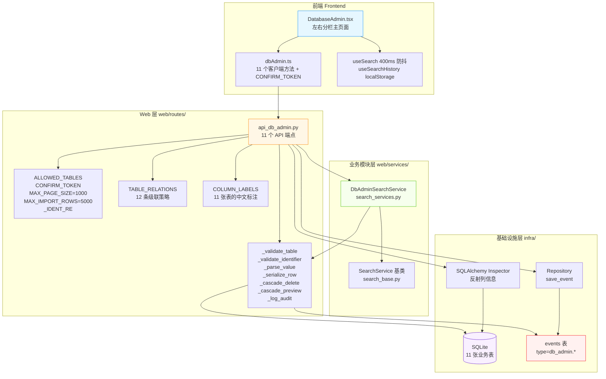
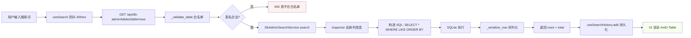
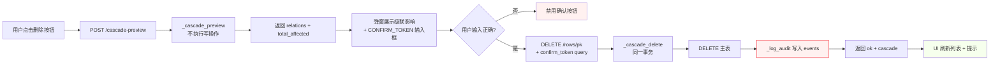
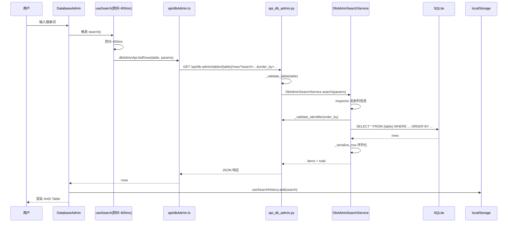
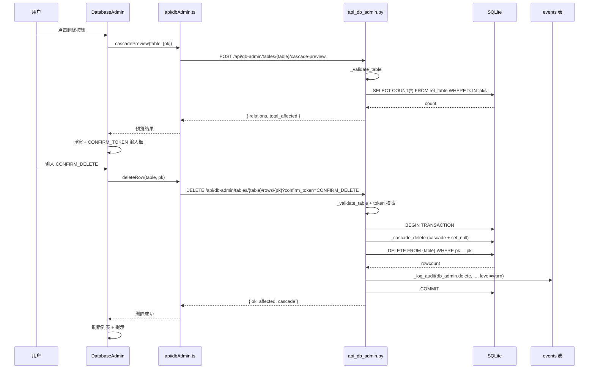

# 闲鱼猎人 · 系统维护 → 数据库维护 需求规格说明书

| 项 | 内容 |
|---|---|
| 文档版本 | v1.0 |
| 文档日期 | 2026-07-05 |
| 文档状态 | 初版 |
| 所属项目 | 闲鱼猎人（XianyuHunter） |
| 所属菜单 | 系统维护 → 数据库维护 |
| 文档类型 | 需求规格说明书（SRS） |
| 关联路由 | 前端 `/maintenance/db`；后端 `/api/db-admin/*` |
| 配套文档 | [数据库维护-详细设计.md](./数据库维护-详细设计.md)（v1.1 / 2026-07-05） |

---

## 目录

- [0. 阶段交接声明](#0-阶段交接声明)
- [1. 引言](#1-引言)
  - [1.1 编写目的](#11-编写目的)
  - [1.2 项目背景](#12-项目背景)
  - [1.3 范围与约束](#13-范围与约束)
  - [1.4 术语与缩写](#14-术语与缩写)
  - [1.5 参考资料](#15-参考资料)
- [2. 总体描述](#2-总体描述)
  - [2.1 产品定位](#21-产品定位)
  - [2.2 用户角色与特征](#22-用户角色与特征)
  - [2.3 运行环境](#23-运行环境)
  - [2.4 设计约束](#24-设计约束)
  - [2.5 假设与依赖](#25-假设与依赖)
- [3. 总体架构](#3-总体架构)
  - [3.1 模块架构图](#31-模块架构图)
  - [3.2 数据流程图](#32-数据流程图)
  - [3.3 关键时序图](#33-关键时序图)
  - [3.4 模块分层与职责](#34-模块分层与职责)
- [4. 功能需求](#4-功能需求)
  - [FR-1 业务表白名单浏览](#fr-1-业务表白名单浏览)
  - [FR-2 动态表结构反射](#fr-2-动态表结构反射)
  - [FR-3 行级查询与文本搜索](#fr-3-行级查询与文本搜索)
  - [FR-4 单行/批量新增·编辑·删除](#fr-4-单行批量新增编辑删除)
  - [FR-5 CSV/JSON 导入与导出](#fr-5-csvjson-导入与导出)
  - [FR-6 审计日志](#fr-6-审计日志)
  - [FR-7 应用层级联删除策略](#fr-7-应用层级联删除策略)
  - [FR-8 双重确认机制](#fr-8-双重确认机制)
  - [FR-9 搜索历史持久化](#fr-9-搜索历史持久化)
  - [FR-10 行数限制 1000/5000](#fr-10-行数限制-10005000)
- [5. 接口定义](#5-接口定义)
  - [5.1 元数据 API](#51-元数据-api)
  - [5.2 数据查询 API](#52-数据查询-api)
  - [5.3 CRUD API](#53-crud-api)
  - [5.4 导入/导出 API](#54-导入导出-api)
  - [5.5 审计日志 API](#55-审计日志-api)
  - [5.6 错误响应约定](#56-错误响应约定)
- [6. 数据模型](#6-数据模型)
  - [6.1 11 张业务表清单](#61-11-张业务表清单)
  - [6.2 TABLE_RELATIONS 级联策略](#62-table_relations-级联策略)
  - [6.3 events 表 db_admin.* type 约定](#63-events-表-db_admin-type-约定)
  - [6.4 _serialize_row 行为约定](#64-_serialize_row-行为约定)
  - [6.5 COLUMN_LABELS 中文语义标注](#65-column_labels-中文语义标注)
- [7. 性能指标](#7-性能指标)
- [8. 安全要求](#8-安全要求)
  - [8.1 标识符白名单正则](#81-标识符白名单正则)
  - [8.2 SQL 注入防护](#82-sql-注入防护)
  - [8.3 confirm_token 二次确认](#83-confirm_token-二次确认)
  - [8.4 级联影响预览](#84-级联影响预览)
  - [8.5 DDL 拒绝与主键约束](#85-ddl-拒绝与主键约束)
- [9. 前端设计](#9-前端设计)
  - [9.1 整体布局](#91-整体布局)
  - [9.2 行内编辑 Modal](#92-行内编辑-modal)
  - [9.3 搜索历史小药丸](#93-搜索历史小药丸)
  - [9.4 批量删除确认弹窗](#94-批量删除确认弹窗)
  - [9.5 CSV/JSON 切换与 Insert 模式](#95-csvjson-切换与-insert-模式)
  - [9.6 审计日志抽屉](#96-审计日志抽屉)
- [10. 部署与集成](#10-部署与集成)
  - [10.1 数据库与 ORM 集成](#101-数据库与-orm-集成)
  - [10.2 ALLOWED_TABLES 静态配置](#102-allowed_tables-静态配置)
  - [10.3 与 SearchService 解耦](#103-与-searchservice-解耦)
  - [10.4 菜单注册](#104-菜单注册)
- [11. 验收标准](#11-验收标准)
  - [11.1 功能验收](#111-功能验收)
  - [11.2 安全验收](#112-安全验收)
  - [11.3 性能验收](#113-性能验收)
  - [11.4 测试用例索引](#114-测试用例索引)
- [12. 附录](#12-附录)
  - [12.1 修订记录](#121-修订记录)
  - [12.2 相关文档交叉引用](#122-相关文档交叉引用)
  - [12.3 FAQ 索引](#123-faq-索引)

---

## 0. 阶段交接声明

```
- 当前阶段：需求规格说明书（v1.0 初版） ✅ 已完成
- 下一阶段：概要设计同步校验（侧栏菜单 metadata / 权限中间件适配）
- 下一阶段智能体：主智能体
- 下一阶段技能：xianyu-hunter-dev（项目级增量开发技能）
- 交接上下文：
  · 本文档为「系统维护 → 数据库维护」二级菜单的首版 SRS，与《数据库维护-详细设计.md》v1.1 完全对齐；
  · 菜单 key=db_admin、path=/maintenance/db、sort_order=201、category=maintenance（menu_registry.yaml 已落盘）；
  · 后端 11 张业务表白名单通过 ALLOWED_TABLES 静态配置 + ORM Inspector 反射，禁止修改表结构；
  · 所有 SQL 走参数化绑定；列名/order_by 匹配 ^[A-Za-z_]\w*$ 正则（ASCII 模式）；
  · 危险操作（删除/批量删除/导入）必须 confirm_token=CONFIRM_DELETE；
  · 审计日志统一写入 events 表（type 前缀 db_admin.、stage=db_admin），可在「实时日志」页回溯；
  · 行级查询复用 DbAdminSearchService（search_services.py），保持与 SearchBase 慢查询埋点一致；
  · 前端搜索 400ms 防抖（useSearch），历史关键词持久化到 localStorage（namespace=db_admin）；
  · 不引入 DDL 能力：表结构由 SQLAlchemy ORM 集中管理（init_db 自动迁移）；
  · 硬约束继承：project_memory.md 的 401 JSON / hmac.compare_digest / 模块级 import / CREATE_NEW_CONSOLE 等；
  · 关键风险：联合主键的表不支持在线编辑（仅单主键表可 CRUD），需在 UI 与 API 错误码中显式说明；
  · 待与「智能客服」「权限模块」SRS 模板对齐风格；后续菜单 SRS 汇总校验时复用本结构。
```

---

## 1. 引言

### 1.1 编写目的

本需求规格说明书定义"闲鱼猎人"系统维护菜单下"数据库维护"二级模块的完整需求规格，作为后续设计、开发、测试与验收的唯一依据。

**目标读者**：

- 后端开发工程师：依据 §3-§6、§8、§10 进行模块实现（与详细设计文档 [数据库维护-详细设计.md](./数据库维护-详细设计.md) 配合使用）
- 前端开发工程师：依据 §4、§9 进行界面开发
- 测试工程师：依据 §7、§11 编写测试用例与执行验收
- 项目经理：依据 §2、§11 进行范围与里程碑管理

### 1.2 项目背景

闲鱼猎人（XianyuHunter）是面向个人买家的闲鱼自动捡漏与抢单系统，已具备任务管理、商品采集、AI 评估、自动下单、多渠道通知等完整能力（见 [requirements.md](../requirements.md) 与 [概要设计文档.md](../概要设计文档.md)）。

随着系统持续运行，业务数据沉淀在本地 SQLite 中，目前运维痛点如下：

| 痛点 | 现状 | 影响 |
|------|------|------|
| 错误数据需手工修正 | 缺在线 CRUD 入口，只能 `sqlite3` 直连 | 误操作风险高、不可审计 |
| 跨表影响不透明 | 任务/商品/订单等表间存在强外键 | 删除一行可能级联影响数张表 |
| 数据导入导出无统一工具 | 第三方 DB 工具权限过大 | 易误操作系统表（`sqlite_master`） |
| 缺乏操作审计 | 现有 events 表无统一写入规范 | 出错后无法回溯 |
| 配置/账号维护依赖脚本 | 部分清理操作走临时 Python 脚本 | 流程不可复用 |

**解决方案**：在「系统维护」菜单下新增"数据库维护"二级页面，作为「轻量级 Navicat」：仅允许操作 ORM 已声明的 11 张业务表，禁止 `sqlite_master` 等系统表；所有 DML 写入 events 审计日志；危险操作需要 `confirm_token` 双重确认；行级查询委托 `DbAdminSearchService` 复用慢查询埋点。

### 1.3 范围与约束

#### 1.3.1 包含范围（In-Scope）

- 11 张业务表（tasks / items / sellers / evaluations / orders / events / task_links / task_deps / notifications / accounts / proxies）的在线 CRUD
- 动态表结构反射（SQLAlchemy Inspector）生成编辑表单
- 行级查询、文本列子串搜索、列级排序
- 单行/批量删除、应用层级联策略（cascade / set_null）
- CSV / JSON 导入与导出
- 审计日志（写入 events 表，type 前缀 `db_admin.*`）
- 双重确认（`confirm_token=CONFIRM_DELETE`）
- 搜索历史持久化（localStorage namespace=`db_admin`）
- 级联影响预览（删除前调用 `/cascade-preview`）
- 与现有前端 / 后端 / 菜单注册体系无缝集成

#### 1.3.2 排除范围（Out-of-Scope）

- **不实现 DDL（建表 / 删表 / 改字段）**：表结构由 SQLAlchemy ORM 集中管理（`init_db` 自动迁移），如需调整表结构应改后端 ORM 定义（`backend/xianyu_hunter/infra/db_models.py`）后重启
- **不实现联合主键表的编辑/删除**：代码中 `len(pk_cols) != 1` 时返回 400，本系统 11 张业务表均为单主键
- **不实现数据加密 / 脱敏**：仅做业务字段编辑，敏感字段（如 accounts.cookies）需用户自行处理
- **不提供 SQL 控制台 / Raw Query 入口**：仅通过白名单 + 参数化查询保护数据库
- **不实现定时清理任务**：脏数据清理走「系统清理」菜单
- **不实现多人协作 / 行级锁**：单机部署，DB 写入走 SQLite 串行事务

#### 1.3.3 硬约束

继承 [project_memory.md](file:///c:/Users/hspcadmin/.trae-cn/memory/projects/-d-code-otherProjects-17-xianyu/project_memory.md) 中的项目硬约束，并显式映射到本模块实现：

| 硬约束 | 本模块适用性 | 实现要点 |
|--------|--------------|----------|
| Web 进程使用 `with_browser=False` 模式 | 适用 | 数据库维护接口不依赖浏览器 |
| 认证白名单（`/api/auth/cookie` 等） | **不适用** | 本模块接口 **不加入** 白名单，必须通过现有 `auth.py` 认证 |
| 前端 fetch 必须含 `credentials: 'include'` | 适用 | `frontend/src/api/dbAdmin.ts` 复用 `client.ts` 默认配置 |
| htmx 用官方 `<meta>` 配置 credentials | 不适用 | 本模块前端使用 AntD + React fetch，不使用 htmx |
| 401 响应必须返回 JSON `{"detail": "Unauthorized"}` | 适用 | 路由层不重写认证错误处理，依赖现有 auth.py |
| 后端 token 比较使用 `hmac.compare_digest()` | 不适用 | 本模块无 token 比较逻辑 |
| 敏感字段（token 长度等）不日志 | 适用 | 审计日志不记录 accounts.cookies 等敏感字段的明文值 |
| token 写失败触发 `logging.warning()` | 不适用 | 本模块无 token 写入 |
| 缺失 import 必须 module-level | 适用 | `api_db_admin.py` 顶部已模块级 import；`re` / `bindparam` 延迟导入仅用于避免循环依赖，已在 [数据库维护-详细设计.md](./数据库维护-详细设计.md) §8 说明 |
| DB 索引策略（`task_id` / `seller_id` / `first_seen` / `publish_time` / `created_at` 及复合索引） | 适用 | 11 张业务表继承 [db_models.py](file:///d:/code/otherProjects/17_xianyu/backend/xianyu_hunter/infra/db_models.py) 的索引策略 |
| COUNT 查询用 CASE WHEN 聚合减少 DB 调用 | 部分适用 | `/tables` 端点对 11 张表循环 `SELECT COUNT(*)`，因表数固定为 11 且 ORM 已建索引，单次成本可接受（详见 [数据库维护-详细设计.md](./数据库维护-详细设计.md) §5.1） |
| WebView2 子进程使用 `CREATE_NEW_CONSOLE` | 不适用 | 本模块不涉及 WebView2 |
| `run_migrations()` 关键路径外层 except 用 `logger.exception()` | 不适用 | 本模块无迁移逻辑 |
| 启动钩子外层 except 用 `logger.exception()` 保留 traceback | 适用 | `_log_audit` 失败时用 `logger.exception("写入审计日志失败")`（见 [数据库维护-详细设计.md](./数据库维护-详细设计.md) §7.6） |

### 1.4 术语与缩写

| 术语 | 全称 / 说明 |
|------|------|
| DML | Data Manipulation Language，INSERT / UPDATE / DELETE |
| DDL | Data Definition Language，CREATE / ALTER / DROP（**本模块不支持**） |
| 表白名单 | ALLOWED_TABLES，11 张业务表静态元组 |
| 标识符白名单 | `_IDENT_RE = ^[A-Za-z_]\w*$`（re.ASCII），列名/排序字段必须匹配 |
| 双重确认 | confirm_token=CONFIRM_DELETE，删除/批量删除/导入必填 |
| 审计日志 | 写入 events 表，type 前缀 `db_admin.*`，stage 固定 `db_admin` |
| 级联 | cascade（删除关联行） / set_null（外键置 NULL） |
| Inspector | SQLAlchemy 的 `inspect(engine)` API，运行时反射表结构 |
| expanding bindparam | `bindparam("pks", expanding=True)`，SQLAlchemy 支持 IN 列表参数化 |
| SearchService | 复用 [search_services.py](file:///d:/code/otherProjects/17_xianyu/backend/xianyu_hunter/web/services/search_services.py) 的 `DbAdminSearchService`，统一慢查询埋点 |
| _validate_identifier | 后端工具函数，校验列名/排序字段防 ORDER BY 注入 |
| _serialize_row | 后端工具函数，Row → dict，datetime → ISO 字符串 |
| useSearch | React Hook，400ms 防抖 + 取消过时请求 |
| useSearchHistory | React Hook，localStorage 持久化历史关键词 |

### 1.5 参考资料

| 文档 | 路径 | 用途 |
|------|------|------|
| 详细设计 v1.1 | [数据库维护-详细设计.md](./数据库维护-详细设计.md) | 接口定义、级联策略、关键代码位置（**本 SRS 与其保持 1:1 对齐**） |
| 总体需求 v2.0 | [../requirements.md](../requirements.md) | 系统整体需求基线 |
| 概要设计 v2.0 | [../概要设计文档.md](../概要设计文档.md) | 36 个 API 路由、11 张数据表、技术选型 |
| 技术设计 v2.0 | [../design.md](../design.md) | 分层架构、Evaluator 设计、状态机 |
| 米其林设计系统 | [../standards/michelin-design-system.md](../standards/michelin-design-system.md) | UI 设计规范、色彩字体系统 |
| 后端路由 | [backend/xianyu_hunter/web/routes/api_db_admin.py](file:///d:/code/otherProjects/17_xianyu/backend/xianyu_hunter/web/routes/api_db_admin.py) | 11 个 API 端点 + 工具函数 |
| 搜索 Service | [backend/xianyu_hunter/web/services/search_services.py](file:///d:/code/otherProjects/17_xianyu/backend/xianyu_hunter/web/services/search_services.py) | `DbAdminSearchService` 复用 |
| ORM 模型 | [backend/xianyu_hunter/infra/db_models.py](file:///d:/code/otherProjects/17_xianyu/backend/xianyu_hunter/infra/db_models.py) | 11 张业务表 DDL 与索引 |
| 前端页面 | [frontend/src/pages/Maintenance/DatabaseAdmin.tsx](file:///d:/code/otherProjects/17_xianyu/frontend/src/pages/Maintenance/DatabaseAdmin.tsx) | 主页面实现 |
| 前端 API | [frontend/src/api/dbAdmin.ts](file:///d:/code/otherProjects/17_xianyu/frontend/src/api/dbAdmin.ts) | 11 个客户端方法 + `CONFIRM_TOKEN` 常量 |
| 共享类型 | [frontend/src/api/types.ts](file:///d:/code/otherProjects/17_xianyu/frontend/src/api/types.ts)（§数据库维护） | `DbColumn` / `DbSchema` / `CascadePreviewResponse` 等 |
| 菜单注册 | [config/menu_registry.yaml](file:///d:/code/otherProjects/17_xianyu/config/menu_registry.yaml) | `db_admin` 菜单元数据 |
| 项目硬约束 | [project_memory.md](file:///c:/Users/hspcadmin/.trae-cn/memory/projects/-d-code-otherProjects-17-xianyu/project_memory.md) | 21 条项目级硬约束 |

---

## 2. 总体描述

### 2.1 产品定位

「数据库维护」是闲鱼猎人系统维护菜单下的二级页面，定位为：

> 一款**轻量级 Navicat**，面向个人运维场景的 11 张业务表在线 CRUD 工具。

**核心价值**：

1. **安全可控**：表白名单 + 标识符白名单 + 参数化 SQL，杜绝注入；双重确认防止误删
2. **级联透明**：删除前预览级联影响（cascade / set_null），明确告知关联行数
3. **审计可追溯**：所有 DML 写入 events 表，可在「实时日志」页回溯
4. **免维护**：动态反射表结构，ORM 变更后无需修改本模块代码

### 2.2 用户角色与特征

| 角色 | 特征 | 使用场景 | 关注重点 |
|------|------|----------|----------|
| **普通用户** | 单机部署使用者，发现数据异常 | 修正误配置的商品价格、清理测试任务 | 操作安全、影响范围 |
| **运维用户** | 负责系统维护与故障排查 | 清理无效账号/代理、导出对账数据 | 审计日志、批量效率 |
| **二次开发者** | 理解 ORM 表结构与外键关系 | 调试级联行为、排查外键冲突 | 表关系、字段语义 |

### 2.3 运行环境

| 项 | 要求 |
|---|---|
| 操作系统 | Windows 10/11（主）、Linux、macOS |
| Python | 3.11+（与主系统一致） |
| Node.js | 18+（仅前端构建） |
| 后端框架 | FastAPI（已集成） |
| 前端框架 | React 18 + TypeScript + Ant Design 5（已集成） |
| 数据库 | SQLite（与主系统一致，复用现有 engine） |
| 浏览器 | Chrome / Edge / Firefox 最新版（Web 客户端） |

### 2.4 设计约束

1. **集成部署**：作为 `backend/xianyu_hunter/web/routes/api_db_admin.py` 路由文件集成到现有后端，不独立部署
2. **复用 ORM**：表结构由 [db_models.py](file:///d:/code/otherProjects/17_xianyu/backend/xianyu_hunter/infra/db_models.py) 统一管理，本模块不引入 DDL 能力
3. **复用 SearchService**：行级查询委托 `DbAdminSearchService`（[search_services.py](file:///d:/code/otherProjects/17_xianyu/backend/xianyu_hunter/web/services/search_services.py)），保持慢查询埋点一致
4. **复用认证体系**：复用现有 [auth.py](file:///d:/code/otherProjects/17_xianyu/backend/xianyu_hunter/web/middleware/auth.py) 中间件
5. **复用事件总线**：所有 DML 写入 events 表，type 前缀 `db_admin.*`（与现有事件命名规范一致）
6. **菜单注册**：复用 [menu_registry.yaml](file:///d:/code/otherProjects/17_xianyu/config/menu_registry.yaml) 单一事实源
7. **前端独立页面**：在侧边栏 `maintenance` 分类下新增「数据库维护」菜单项

### 2.5 假设与依赖

**假设**：
- 用户已通过现有 Cookie 认证（[auth.py](file:///d:/code/otherProjects/17_xianyu/backend/xianyu_hunter/web/middleware/auth.py)）登录
- 系统 11 张业务表已通过 `init_db()` 创建完成
- 浏览器 localStorage 可用（搜索历史持久化）

**依赖**：
- 依赖现有 [container.py](file:///d:/code/otherProjects/17_xianyu/backend/xianyu_hunter/container.py) 依赖注入容器
- 依赖现有 [container.repo](file:///d:/code/otherProjects/17_xianyu/backend/xianyu_hunter/container.py) 提供 `engine` / `save_event`
- 依赖 [search_base.py](file:///d:/code/otherProjects/17_xianyu/backend/xianyu_hunter/web/services/search_base.py) 的 `SearchParams` / `SearchService` 基类
- 依赖 [useSearch.ts](file:///d:/code/otherProjects/17_xianyu/frontend/src/hooks/useSearch.ts) 与 [useSearchHistory.ts](file:///d:/code/otherProjects/17_xianyu/frontend/src/hooks/useSearchHistory.ts) 公共 Hook
- 无新增第三方依赖

---

## 3. 总体架构

### 3.1 模块架构图



### 3.2 数据流程图

#### 3.2.1 行级查询流程



#### 3.2.2 删除流程（含级联预览）



### 3.3 关键时序图

#### 3.3.1 行级查询时序



#### 3.3.2 级联删除时序



### 3.4 模块分层与职责

遵循项目现有分层架构（见 [概要设计文档.md](../概要设计文档.md) §3）：

| 层级 | 模块 | 职责 |
|------|------|------|
| **Web 层** | `api_db_admin.py` | 11 个 API 路由 + 工具函数 |
| | `_validate_table` | 表名白名单校验 |
| | `_validate_identifier` | 列名/排序字段白名单正则校验 |
| | `_parse_value` | 按列类型转换 JSON 输入值为 Python 对象 |
| | `_serialize_row` | SQLAlchemy Row → JSON-safe dict（datetime → ISO） |
| | `_get_columns` | SQLAlchemy Inspector 反射列元数据 |
| | `_cascade_delete` | 应用层级联删除/置空 |
| | `_cascade_preview` | 删除前级联影响预览 |
| | `_log_audit` | 审计日志写入 events 表 |
| **业务模块层** | `DbAdminSearchService` | 行级查询，委托 SearchService 基类做分页/埋点 |
| | `SearchService 基类` | 分页/慢查询埋点/响应结构（统一复用） |
| **基础设施层** | `container.repo.engine` | SQLAlchemy 引擎 |
| | `container.repo.save_event` | 事件持久化（写入 events 表） |
| **数据层** | SQLite | 11 张业务表（tasks/items/.../proxies） |
| | events 表 | 审计日志载体（type 前缀 `db_admin.*`） |
| **前端层** | `DatabaseAdmin.tsx` | 页面主组件、左右分栏布局、Modal/Drawer 编排 |
| | `dbAdmin.ts` | 11 个 API 客户端方法 + `CONFIRM_TOKEN` 常量 |
| | `useSearch` Hook | 400ms 防抖 + 取消过时请求 |
| | `useSearchHistory` Hook | localStorage 持久化（namespace=`db_admin`） |

---

## 4. 功能需求

### FR-1 业务表白名单浏览

**FR-1.1 表列表端点**
- 调用 `GET /api/db-admin/tables` 返回表白名单及行数
- 返回格式：`{"tables": [{"name": "tasks", "rows": 12}, ...]}`
- 仅返回 `ALLOWED_TABLES` 中的 11 张表，**不返回** `sqlite_master` / `sqlite_sequence` 等系统表

**FR-1.2 表中文名映射**
- 前端 `TABLE_LABELS` 字典维护 11 张表的中文名（如 `tasks` → "任务"）
- 侧边栏显示中文名 + 英文表名 + 行数
- `COLUMN_LABELS` 字典维护 100+ 个字段的中文语义标注（业务含义+数据类型+使用场景+约束条件）

**FR-1.3 行数统计容错**
- 某张表在白名单中但 DB 中无对应表（如 ORM 迁移短暂不同步）时，返回 `rows=0` 而非 500
- 实现：循环 `SELECT COUNT(*) FROM {tbl}` 用 `try/except SQLAlchemyError` 包裹

### FR-2 动态表结构反射

**FR-2.1 反射列信息**
- 通过 SQLAlchemy `inspect(engine).get_columns(table)` 反射表结构
- 返回字段：`name` / `type` / `nullable` / `default` / `primary_key` / `label`
- 调用 `GET /api/db-admin/tables/{table}/schema` 获取

**FR-2.2 主键识别**
- 通过 `inspect(engine).get_pk_constraint(table)` 获取主键列
- 仅支持单主键表（`len(pk_cols) == 1`）；联合主键返回 400

**FR-2.3 中文 label 注入**
- 反射时从 `COLUMN_LABELS[table][col_name]` 注入中文语义标注
- 缺省时 `label=""`（前端展示原列名）

**FR-2.4 不做 DDL**
- 本模块不提供建表/删表/改字段能力
- 表结构变更需改 [db_models.py](file:///d:/code/otherProjects/17_xianyu/backend/xianyu_hunter/infra/db_models.py) 后重启（`init_db` 自动迁移）

### FR-3 行级查询与文本搜索

**FR-3.1 分页查询**
- 调用 `GET /api/db-admin/tables/{table}/rows`
- Query 参数：`limit`（1-1000，默认 50）/ `offset`（≥ 0，默认 0）/ `order_by`（列名，倒序加 `-` 前缀）/ `search`（子串）
- 返回：`table` / `total` / `limit` / `offset` / `rows[]`

**FR-3.2 文本列搜索**
- `search` 参数对所有文本列（包含 `CHAR` / `TEXT` / `VARCHAR` / `CLOB` 关键字）做 `LIKE %q%`
- 数字/日期列自动跳过，避免类型转换异常
- 实现：`CAST(col AS TEXT) LIKE :search` OR 拼接

**FR-3.3 排序**
- `order_by` 必须匹配 `^[A-Za-z_]\w*$` 正则（ASCII 模式）
- 倒序通过 `-` 前缀指定（如 `-created_at`）
- 列名必须在表 schema 中存在（`get_columns` 已验证）
- 实现：在 `DbAdminSearchService` 中校验后拼接为 `ORDER BY {col} DESC/ASC`

**FR-3.4 行数限制**
- 单次查询 `MAX_PAGE_SIZE=1000`（防止 SELECT * FROM 大表拖垮 UI 与 DB）
- 前端默认 `PAGE_SIZE=50`（UI 翻页友好）

**FR-3.5 前端防抖**
- 搜索框输入触发 `useSearch` Hook 400ms 防抖
- 切换表 / 翻页 / 排序变化时立即触发（不走防抖）
- 快速输入仅保留最后一次请求（`requestId` 机制）

### FR-4 单行/批量新增·编辑·删除

**FR-4.1 新增单行（POST /rows）**
- 请求体：`{"values": {"col1": val1, "col2": val2, ...}}`
- 仅保留真实存在的列（白名单 + 过滤无效字段）
- 主键冲突返回 409
- 写入成功立即写入审计日志 `db_admin.create`（level=info）

**FR-4.2 按主键更新（PATCH /rows/{pk_value:path}）**
- `pk_value` 通过路径传入（支持 String/Integer 主键）
- 主键字段不可更新（`if k == pk_col["name"]: continue`）
- 更新行数为 0 时返回 404
- 写入成功立即写入审计日志 `db_admin.update`（level=info）

**FR-4.3 单行删除（DELETE /rows/{pk}）**
- Query 参数必填：`confirm_token=CONFIRM_DELETE`
- 不传或传错返回 400
- 删除前级联处理（见 FR-7），所有操作在同一事务
- 删除成功写入审计日志 `db_admin.delete`（level=warn）

**FR-4.4 批量删除（POST /rows/batch-delete）**
- 请求体：`{"ids": [pk1, pk2, ...], "confirm_token": "CONFIRM_DELETE"}`
- 单次最多 1000 个 ID
- 主键冲突/外键冲突返回 409
- 删除成功写入审计日志 `db_admin.batch_delete`（level=warn）

**FR-4.5 主键约束**
- `len(pk_cols) != 1` 时返回 400（仅支持单主键表）
- 联合主键的表暂不支持在线编辑（场景少见且容易出错）

**FR-4.6 值类型转换**
- `_parse_value(raw, col_type)` 按列类型转换：
  - `INT` → `int(raw)`
  - `FLOAT` / `REAL` / `DOUBLE` / `NUMERIC` / `DECIMAL` → `float(raw)`
  - `BOOL` → bool / `'1'` / `'true'` / `'yes'` / `'on'` → True
  - `DATETIME` / `TIMESTAMP` → `datetime.fromtimestamp(...)` 或 `datetime.fromisoformat(...)`
  - `JSON` / `TEXT` → 字符串 / `json.dumps(..., ensure_ascii=False)`
- 类型转换失败返回 400

### FR-5 CSV/JSON 导入与导出

**FR-5.1 导出 CSV**
- 调用 `GET /api/db-admin/tables/{table}/export?format=csv`
- 返回 `StreamingResponse`，`text/csv; charset=utf-8`
- CSV 首行加 UTF-8 BOM（`\ufeff`），让 Excel 自动识别编码
- 流式 yield 避免大表导出内存峰值
- 文件名格式：`{table}_{YYYYMMDD_HHMMSS}.csv`

**FR-5.2 导出 JSON**
- 调用 `GET /api/db-admin/tables/{table}/export?format=json`
- 返回 NDJSON 风格（每行一个 JSON 记录，前后 `[\n` / `\n]\n`，行间 `,\n`）
- 流式 yield 降低内存峰值
- 文件名格式：`{table}_{YYYYMMDD_HHMMSS}.json`

**FR-5.3 导入 CSV/JSON**
- 调用 `POST /api/db-admin/tables/{table}/import`
- 请求体：`{"rows": [[...], [...]], "headers": [...] | null, "mode": "insert" | "replace", "confirm_token": "CONFIRM_DELETE"}`
- `headers` 缺省时按 schema 列顺序
- `mode=insert` 遇主键冲突跳过（计入 `skipped`）
- `mode=replace` 走 `INSERT OR REPLACE`（覆盖同名主键，风险较高）
- 单次最多 `MAX_IMPORT_ROWS=5000` 行
- 返回：`{"ok": true, "total": N, "inserted": N, "skipped": N, "errors": [前 20 条]}`
- 错误信息：列数不匹配、单行写入失败（前 20 条）
- 导入失败/部分成功时仍写入审计日志 `db_admin.import`（level=warn）

**FR-5.4 前端上传**
- CSV：弹窗 Tabs "CSV 格式" / "JSON 格式"
- CSV 解析：前端 `parseCSV` 简单实现（支持引号转义），去 UTF-8 BOM
- JSON 解析：`JSON.parse` 后取首行 keys 作为 headers
- 当前前端 `import` 模式走 `'insert'`（未暴露 `replace` 切换，因 replace 风险较高）

### FR-6 审计日志

**FR-6.1 写入约定**
- 所有 DML 操作通过 `_log_audit` 写入 events 表
- `type`：`db_admin.{action}`，如 `db_admin.create` / `db_admin.delete` / `db_admin.delete_failed`
- `stage`：固定为 `db_admin`
- `level`：info（成功创建/更新）/ warn（成功删除/批量删除/导入）/ err（失败）
- `message`：`db_admin.{action} {table}` 或 `db_admin.{action} {table} pk={pk_value}`
- `payload`：JSON 字符串，含 `action` / `table` / `pk` / `detail` 四个字段

**FR-6.2 操作 type 清单**

| 操作 | type | level | payload 内容 |
|------|------|-------|------------|
| 新增成功 | `db_admin.create` | info | `{values}` |
| 新增失败 | `db_admin.create_failed` | err | `{error, values}` |
| 更新成功 | `db_admin.update` | info | `{values}` |
| 更新失败 | `db_admin.update_failed` | err | `{error}` |
| 删除成功 | `db_admin.delete` | warn | `{cascade}` 影响行数 |
| 删除失败 | `db_admin.delete_failed` | err | `{error}` |
| 批量删除成功 | `db_admin.batch_delete` | warn | `{requested, affected, cascade}` |
| 批量删除失败 | `db_admin.batch_delete_failed` | err | `{error, count}` |
| 导入 | `db_admin.import` | info / warn | `{mode, total, inserted, skipped, errors}` |

**FR-6.3 失败容错**
- `_log_audit` 写入失败不抛异常（审计日志不应阻塞主流程）
- 用 `try/except` 包裹，失败时 `logger.exception("写入审计日志失败")` 输出完整 traceback（遵循 project_memory 硬约束）

**FR-6.4 审计日志查询**
- 调用 `GET /api/db-admin/audit-log?limit=100`（1-500）
- 查询 `events` 表 `type LIKE 'db_admin.%'`，按 id DESC 排序
- 返回字段：`id` / `type` / `level` / `message` / `payload` / `created_at`
- 前端「审计日志」按钮触发抽屉展示

### FR-7 应用层级联删除策略

**FR-7.1 为什么在应用层做**
1. SQLite 建表时未声明 `ON DELETE CASCADE`（SQLAlchemy 默认不生成），补建需 `ALTER TABLE`
2. 应用层可精确控制策略（cascade vs set_null），并返回每张表的影响行数
3. 审计日志可记录级联细节

**FR-7.2 级联策略表**
见 [§6.2](#62-table_relations-级联策略)，12 条策略定义在 `TABLE_RELATIONS`

**FR-7.3 执行顺序**
```
1. _cascade_delete(conn, table, [pk_val])
   - 遍历 TABLE_RELATIONS[table]
   - 校验 rel_table 也在 ALLOWED_TABLES 白名单内（防御性）
   - cascade: DELETE FROM {rel_table} WHERE {fk} IN :pks
   - set_null: UPDATE {rel_table} SET {fk} = NULL WHERE {fk} IN :pks
   - 使用 bindparam("pks", expanding=True) 支持 IN 列表
2. DELETE FROM {table} WHERE {pk_col} = :pk
3. _log_audit(action="delete", table=table, pk_value=pk_val, detail={"cascade": cascade_affected})
```

**FR-7.4 事务原子性**
- 所有级联 + 主表删除在 `engine.begin()` 同一事务中执行
- 任一失败整体回滚，不留半成品

**FR-7.5 防御性白名单**
- 关联表 `rel_table` 必须在 `ALLOWED_TABLES` 内，否则 `continue` 跳过
- 防止 `TABLE_RELATIONS` 配置错误导致系统表被修改

### FR-8 双重确认机制

**FR-8.1 常量定义**
- 后端 `CONFIRM_TOKEN = "CONFIRM_DELETE"`（api_db_admin.py L60）
- 前端 `CONFIRM_TOKEN = 'CONFIRM_DELETE'`（dbAdmin.ts L12）— **与后端保持一致**
- 区分大小写

**FR-8.2 触发场景**
- 单行删除（DELETE /rows/{pk}）— Query 参数
- 批量删除（POST /rows/batch-delete）— Body 字段
- 导入（POST /tables/{table}/import）— Body 字段

**FR-8.3 前端交互**
- 弹窗（`Modal.confirm`）展示主键 + 级联影响
- 用户必须输入 `CONFIRM_DELETE` 才能启用「确认删除」按钮
- 通过 `modal.update` 动态切换 `okButtonProps.disabled`
- 区分大小写，未输入时按钮 disabled

**FR-8.4 后端校验**
- 错误返回 400：`{"detail": "需要 confirm_token=CONFIRM_DELETE"}`
- 不传 query/body 字段时 Pydantic / FastAPI 自动 422

### FR-9 搜索历史持久化

**FR-9.1 命名空间**
- `useSearchHistory({ namespace: 'db_admin' })`
- localStorage key: `xh_search_history_db_admin`
- 与其他模块（chatbot / items / logs）的历史互不干扰

**FR-9.2 行为约定**
- 搜索成功且关键词非空时调用 `add(search.trim())`
- 去重：同一关键词只保留最近一次
- 最近优先：新搜索插入列表头部
- 容量限制：最多 20 条（`MAX_HISTORY_ITEMS = 20`）

**FR-9.3 渲染小药丸**
- 前端 `history.map(kw => <Tag onClick={() => { setSearch(kw); setPage(1) }}>{kw}</Tag>)`
- 点击小药丸复用历史关键词并触发查询
- 提供「清空」按钮

**FR-9.4 降级容错**
- localStorage 不可用（隐私模式 / 配额满）时静默降级
- 数据损坏时 catch 后保持空历史
- 写入失败时仅内存保留

### FR-10 行数限制 1000/5000

**FR-10.1 单次查询上限 1000**
- `MAX_PAGE_SIZE = 1000`
- 限制：避免 `SELECT *` 大表拖垮 UI 与 DB
- 体现：单行删除/批量删除上限 1000（与查询一致）

**FR-10.2 单次导入上限 5000**
- `MAX_IMPORT_ROWS = 5000`
- 限制：避免一次性大量写入导致 UI 卡顿
- 超出返回 400：`{"detail": "单次最多导入 5000 行"}`

**FR-10.3 硬编码常量**
- 两个常量均定义在 `api_db_admin.py` 顶部
- 调整需修改源码并重新部署（详见 [数据库维护-详细设计.md](./数据库维护-详细设计.md) FAQ-Q7）

---

## 5. 接口定义

所有接口前缀：`/api/db-admin`，路由文件：`backend/xianyu_hunter/web/routes/api_db_admin.py`。

> 完整参数与响应格式见 [数据库维护-详细设计.md](./数据库维护-详细设计.md) §5；本节聚焦于契约级定义。

### 5.1 元数据 API

#### 5.1.1 GET `/api/db-admin/tables`

**描述**：列出可管理的表及其记录数（侧边栏树数据）。

**响应**：
```json
{
  "tables": [
    {"name": "tasks", "rows": 12},
    {"name": "items", "rows": 348},
    {"name": "sellers", "rows": 56}
  ]
}
```

**错误响应**：
- 不适用（白名单固定 11 张表，循环内 `try/except SQLAlchemyError` 兜底）

#### 5.1.2 GET `/api/db-admin/tables/{table}/schema`

**描述**：表结构（列名、类型、是否主键、是否可空、默认值、中文 label）。

**Path 参数**：
- `table`：表名（必须在 `ALLOWED_TABLES` 内）

**响应**：
```json
{
  "table": "tasks",
  "columns": [
    {
      "name": "id",
      "type": "VARCHAR",
      "nullable": false,
      "default": null,
      "primary_key": true,
      "label": "任务ID（UUID，系统自动生成，全局唯一标识）"
    }
  ]
}
```

**错误响应**：
- `400`：`{"detail": "表 'xxx' 不在维护白名单中"}`

#### 5.1.3 POST `/api/db-admin/tables/{table}/cascade-preview`

**描述**：删除前级联影响预览（不执行实际操作）。

**Path 参数**：
- `table`：表名

**请求体**：
```json
{"ids": ["uuid-1", "uuid-2", 123]}
```

**响应**：
```json
{
  "table": "tasks",
  "relations": [
    {
      "table": "items",
      "fk": "task_id",
      "action": "cascade",
      "count": 30,
      "description": "将删除 items.task_id 中 30 条关联记录"
    },
    {
      "table": "sellers",
      "fk": "seller_id",
      "action": "set_null",
      "count": 5,
      "description": "将置空外键 sellers.seller_id 中 5 条关联记录"
    }
  ],
  "total_affected": 35
}
```

**错误响应**：
- `400`：表不在白名单 / 联合主键 / ids 为空
- `404`：表无列

### 5.2 数据查询 API

#### 5.2.1 GET `/api/db-admin/tables/{table}/rows`

**描述**：分页查询表数据（委托 `DbAdminSearchService`）。

**Path 参数**：
- `table`：表名

**Query 参数**：

| 参数 | 类型 | 默认 | 范围 | 说明 |
|------|------|------|------|------|
| `limit` | int | 50 | 1-1000 | 单次返回行数 |
| `offset` | int | 0 | ≥ 0 | 偏移量 |
| `order_by` | string | - | `^[A-Za-z_]\w*$` | 列名，倒序加 `-` 前缀如 `-created_at` |
| `search` | string | - | - | 文本列子串搜索（数字/日期列跳过） |

**响应**：
```json
{
  "table": "tasks",
  "total": 128,
  "limit": 50,
  "offset": 0,
  "rows": [
    {"id": "uuid-1", "name": "任务1", "keyword": "佳能RP", "created_at": "2026-07-01T10:00:00+00:00"}
  ]
}
```

**错误响应**：
- `400`：表不在白名单 / 非法 order_by 标识符
- `404`：表存在但无列

### 5.3 CRUD API

#### 5.3.1 POST `/api/db-admin/tables/{table}/rows`

**描述**：新增一行（主键冲突返回 409）。

**请求体**：
```json
{"values": {"keyword": "佳能RP", "mode": "auto"}}
```

**响应**：
```json
{"ok": true, "table": "tasks"}
```

**错误响应**：
- `400`：表不在白名单 / values 为空
- `409`：主键冲突 / 唯一约束冲突 / 外键冲突

#### 5.3.2 PATCH `/api/db-admin/tables/{table}/rows/{pk_value:path}`

**描述**：按主键更新一行（主键字段不可更新）。

**Path 参数**：
- `table`：表名
- `pk_value`：主键值（路径参数，支持 String/Integer）

**请求体**：
```json
{"values": {"name": "新任务名", "cron": "*/5 * * * *"}}
```

**响应**：
```json
{"ok": true, "affected": 1}
```

**错误响应**：
- `400`：表不在白名单 / 联合主键 / 没有可更新字段
- `404`：主键不存在
- `409`：更新失败

#### 5.3.3 DELETE `/api/db-admin/tables/{table}/rows/{pk_value:path}`

**描述**：删除单行（含级联处理）。

**Query 参数**：
- `confirm_token`：必填，必须为 `CONFIRM_DELETE`

**响应**：
```json
{
  "ok": true,
  "affected": 1,
  "cascade": {
    "items.task_id:cascade": 30,
    "sellers.seller_id:set_null": 5
  }
}
```

**错误响应**：
- `400`：表不在白名单 / 联合主键 / confirm_token 错误
- `404`：主键不存在
- `409`：删除失败

#### 5.3.4 POST `/api/db-admin/tables/{table}/rows/batch-delete`

**描述**：批量删除（含级联处理），上限 1000 行/次。

**请求体**：
```json
{
  "ids": ["uuid-1", "uuid-2", 123],
  "confirm_token": "CONFIRM_DELETE"
}
```

**响应**：
```json
{
  "ok": true,
  "requested": 3,
  "affected": 3,
  "cascade": {
    "items.task_id:cascade": 90
  }
}
```

**错误响应**：
- `400`：表不在白名单 / 联合主键 / confirm_token 错误 / ids 为空 / 超过 1000 行
- `409`：批量删除失败

### 5.4 导入/导出 API

#### 5.4.1 GET `/api/db-admin/tables/{table}/export?format=csv|json`

**描述**：导出表数据为 CSV 或 JSON（流式输出，不限制行数上限）。

**Query 参数**：
- `format`：必填，枚举 `csv` / `json`

**响应**：
- `text/csv; charset=utf-8`（CSV，含 UTF-8 BOM `\ufeff`）
- `application/json`（JSON，NDJSON 风格）
- `Content-Disposition: attachment; filename="{table}_{timestamp}.{format}"`

**错误响应**：
- `400`：表不在白名单 / format 不合法

#### 5.4.2 POST `/api/db-admin/tables/{table}/import`

**描述**：导入二维数组（CSV/JSON 前端解析后传入）。

**请求体**：

| 字段 | 类型 | 说明 |
|------|------|------|
| `rows` | `list[list[Any]]` | 二维数组 |
| `headers` | `list[str] \| null` | 可选，自定义列名映射，缺省按列顺序 |
| `mode` | string | `insert`（跳过主键冲突）/ `replace`（INSERT OR REPLACE） |
| `confirm_token` | string | 必须为 `CONFIRM_DELETE` |

**响应**：
```json
{
  "ok": true,
  "total": 100,
  "inserted": 85,
  "skipped": 10,
  "errors": ["第 23 行列数不匹配", "第 45 行失败: ..."]
}
```

**错误响应**：
- `400`：表不在白名单 / confirm_token 错误 / rows 为空 / 超过 5000 行 / mode 不合法 / 未知列名

### 5.5 审计日志 API

#### 5.5.1 GET `/api/db-admin/audit-log?limit=100`

**描述**：数据库维护相关审计日志（来自 events 表，type 前缀 `db_admin.*`）。

**Query 参数**：
- `limit`：默认 100，范围 1-500

**响应**：
```json
{
  "items": [
    {
      "id": 1234,
      "type": "db_admin.delete",
      "level": "warn",
      "message": "db_admin.delete tasks pk=uuid-1",
      "payload": "{\"action\": \"delete\", \"table\": \"tasks\", \"pk\": \"uuid-1\", \"detail\": {\"cascade\": {...}}}",
      "created_at": "2026-07-05T10:00:00+00:00"
    }
  ]
}
```

**错误响应**：
- 不适用（认证通过即可查询）

### 5.6 错误响应约定

本模块错误响应统一遵循 FastAPI + 项目规范：

| HTTP 状态 | 触发场景 | 响应体 |
|-----------|----------|--------|
| `400 Bad Request` | 表不在白名单 / 联合主键 / confirm_token 错误 / values 为空 / 列数不匹配 / mode 不合法 / 未知列名 | `{"detail": "..."}` |
| `404 Not Found` | 主键不存在 / 表存在但无列 | `{"detail": "..."}` |
| `409 Conflict` | 主键冲突 / 唯一约束冲突 / 外键冲突 / 写入失败 | `{"detail": "写入失败: ..."}` |
| `500 Internal Server Error` | 未预期异常 | `{"detail": "Internal Server Error"}` |
| `401 Unauthorized` | 未通过现有 auth.py 认证（由 auth 中间件返回） | `{"detail": "Unauthorized"}`（遵循 project_memory 硬约束） |

---

## 6. 数据模型

### 6.1 11 张业务表清单

11 张业务表与 [db_models.py](file:///d:/code/otherProjects/17_xianyu/backend/xianyu_hunter/infra/db_models.py) 一一对应：

| 表名 | 中文名 | 主键类型 | 说明 |
|------|--------|----------|------|
| `tasks` | 任务 | UUID | 用户配置的监控任务 |
| `items` | 商品 | String | 闲鱼商品记录 |
| `sellers` | 卖家 | String | 卖家画像信息 |
| `evaluations` | 评估记录 | int | 商品评估结果 |
| `orders` | 订单 | String | 下单记录 |
| `events` | 事件日志 | int | 系统事件（含审计日志） |
| `task_links` | 任务关联 | int | 任务-商品/卖家多对多关联 |
| `task_deps` | 任务依赖 | int | 任务间依赖关系 |
| `notifications` | 业务通知 | int | 系统通知 |
| `accounts` | 闲鱼账号 | int | 多账号管理 |
| `proxies` | 代理池 | int | 代理服务器管理 |

> 注：表 DDL / 索引策略见 [db_models.py](file:///d:/code/otherProjects/17_xianyu/backend/xianyu_hunter/infra/db_models.py)，本模块不重复定义。

### 6.2 TABLE_RELATIONS 级联策略

12 条级联策略定义在 `api_db_admin.py` `TABLE_RELATIONS`：

| 主表 | 关联表 | 外键 | 策略 | 说明 |
|------|--------|------|------|------|
| `tasks` | `items` | `task_id` | cascade | 删任务 → 级联删该任务下的商品 |
| `tasks` | `orders` | `task_id` | cascade | 删任务 → 级联删该任务的订单 |
| `tasks` | `events` | `task_id` | cascade | 删任务 → 级联删该任务的事件 |
| `tasks` | `task_links` | `task_id` | cascade | 删任务 → 级联删该任务的关联 |
| `tasks` | `task_deps` | `task_id` | cascade | 删任务 → 级联删该任务作为依赖方的记录 |
| `tasks` | `task_deps` | `depends_on` | cascade | 删任务 → 级联删该任务作为被依赖方的记录 |
| `items` | `evaluations` | `item_id` | cascade | 删商品 → 级联删该商品的评估 |
| `items` | `orders` | `item_id` | cascade | 删商品 → 级联删该商品的订单 |
| `items` | `events` | `item_id` | cascade | 删商品 → 级联删该商品的事件 |
| `sellers` | `items` | `seller_id` | set_null | 删卖家 → 保留商品但断开卖家引用 |
| `sellers` | `orders` | `seller_id` | set_null | 删卖家 → 保留订单但断开卖家引用 |
| `sellers` | `evaluations` | `seller_id` | set_null | 删卖家 → 保留评估但断开卖家引用 |

**设计原则**：
1. 业务核心实体（tasks/items/sellers）被删时级联删除所有依赖数据，避免产生无法追溯的孤立记录
2. sellers 被删时对 items/orders/evaluations 采用 set_null，因为卖家消失后商品/订单/评估仍有独立查看价值
3. 叶子表（events/notifications/task_links/task_deps）无下游依赖，直接删除

### 6.3 events 表 db_admin.* type 约定

events 表结构详见 [db_models.py](file:///d:/code/otherProjects/17_xianyu/backend/xianyu_hunter/infra/db_models.py) §5.6。本模块写入约定：

| 字段 | 本模块约定值 |
|------|-------------|
| `type` | `db_admin.{action}` 格式，如 `db_admin.create` / `db_admin.delete` / `db_admin.delete_failed` |
| `stage` | 固定为 `db_admin` |
| `level` | `info`（成功创建/更新）/ `warn`（成功删除/批量删除/导入）/ `err`（失败） |
| `message` | `db_admin.{action} {table}` 或 `db_admin.{action} {table} pk={pk_value}` |
| `payload` | JSON 字符串，含 `action` / `table` / `pk` / `detail` 四个字段 |
| `task_id` | NULL（数据库维护不属于任何任务） |
| `created_at` | 自动填充（UTC） |

### 6.4 _serialize_row 行为约定

`_serialize_row(row: dict, columns: list[dict]) -> dict` 行为：

```python
for col in columns:
    name = col["name"]
    v = row.get(name)
    if isinstance(v, datetime):
        out[name] = v.isoformat()  # datetime → ISO 字符串
    else:
        out[name] = v  # 其他类型透传
return out
```

**关键约定**：
- `datetime` → ISO 字符串（前端可解析）
- `date` / `time` 同理
- 其他类型透传（int / str / bool / None / dict / list）
- `dict` / `list` 由 `json.dumps(..., ensure_ascii=False)` 处理（在前端展示时）

### 6.5 COLUMN_LABELS 中文语义标注

`COLUMN_LABELS: dict[str, dict[str, str]]` 维护 11 张表共 100+ 个字段的中文语义标注，标注格式：

```
"{字段名}（{业务含义}，{数据类型特征}，{使用场景}，{约束条件}）"
```

**示例**（tasks 表）：

| 字段名 | 中文标注 |
|--------|----------|
| `id` | 任务ID（UUID，系统自动生成，全局唯一标识） |
| `name` | 任务名称（用户自定义，如「佳能RP镜头监控」） |
| `keyword` | 搜索关键词（闲鱼商品搜索词，如「佳能RP 镜头」） |
| `min_price` | 最低价格（元，价格筛选下限，NULL=不限） |
| `cron` | Cron表达式（调度频率，默认*/1 * * * *即每分钟执行） |
| `mode` | 抢单模式（confirm=需确认/auto=自动下单/manual=仅监控） |
| `status` | 任务状态（running=运行中/paused=已暂停/stopped=已停止/completed=已完成） |

**标注原则**：
- 专业规范、简洁易懂
- 便于开发/分析人员理解字段用途
- 包含业务含义 + 数据类型 + 使用场景 + 约束条件

**缺省处理**：未标注字段返回 `""`，前端展示原列名。

---

## 7. 性能指标

| 指标 | 目标值 | 测量方式 |
|------|--------|----------|
| 单表 schema 反射 | ≤ 50ms | `inspect(engine).get_columns()` 11 张表各 1 次 |
| 单表行数查询 | ≤ 100ms | 1000 行内表 COUNT(*)，走 PK 索引 |
| 单表行级查询（50 行） | ≤ 200ms | SQLite 文本列 LIKE 子串搜索 |
| 单表行级查询（1000 行） | ≤ 800ms | `MAX_PAGE_SIZE` 上限场景 |
| 单行删除（含级联） | ≤ 500ms | 删除 1 条 tasks，级联 30 条 items |
| 批量删除（100 行） | ≤ 2s | 含级联策略 |
| 导入 1000 行 CSV | ≤ 5s | `_parse_value` + `engine.begin()` 逐行事务 |
| 导入 5000 行 CSV | ≤ 30s | 接近 `MAX_IMPORT_ROWS` 上限 |
| 导出 1000 行 CSV | ≤ 1s | 流式 yield |
| 导出 5000 行 JSON | ≤ 3s | NDJSON 流式输出 |
| 审计日志写入 | ≤ 20ms | 单次 `save_event` 走 events 表 INSERT |
| `GET /audit-log` 100 条 | ≤ 200ms | events 表 `LIKE 'db_admin.%' ORDER BY id DESC` |
| 并发查询 | 5 并发不报错 | SQLite 串行事务自然限流 |

**性能基线参考**：本模块所有数据操作均在本地 SQLite 上执行，无网络 IO；性能瓶颈主要在 SQL 复杂度（如 LIKE 搜索）和事务提交次数（如逐行导入）。

---

## 8. 安全要求

### 8.1 标识符白名单正则

**正则**：`^[A-Za-z_]\w*$`（re.ASCII 模式）

**作用**：校验列名 / 排序字段，防止 ORDER BY 列名注入

**示例**：
- 合法：`id` / `created_at` / `user_id_2`
- 非法：`id; DROP TABLE` / `id--` / `1name` / `name with space`

**实现**：`_validate_identifier(name, kind)` 校验失败返回 400 `{"detail": "非法 {kind} 标识符: {name!r}"}`

### 8.2 SQL 注入防护

**三层防护**：

1. **表白名单**：`_validate_table` 校验 `table in ALLOWED_TABLES`，禁止操作系统表
2. **标识符白名单**：`_validate_identifier` 校验列名/排序字段
3. **参数化绑定**：
   - 所有 WHERE 条件用 `:param` 绑定（如 `WHERE id = :pk`）
   - IN 列表用 `bindparam("pks", expanding=True)`（如 `WHERE id IN :pks`）
   - **禁止** f-string 拼接用户输入到 SQL

**示例（不安全 → 安全）**：

```python
# 不安全（拼接）
sql = f"SELECT * FROM {table} WHERE name = '{user_input}'"

# 安全（参数化 + 白名单）
sql = f"SELECT * FROM {table} WHERE name = :name"  # table 已 _validate_table
result = conn.execute(text(sql), {"name": user_input})
```

### 8.3 confirm_token 二次确认

**适用场景**：删除 / 批量删除 / 导入

**机制**：
- 客户端必须传 `confirm_token=CONFIRM_DELETE` 才执行
- 后端硬编码常量 `CONFIRM_TOKEN = "CONFIRM_DELETE"`
- 前端弹窗必须让用户输入此值才能启用确认按钮

**防御价值**：
- 防止误操作（前端按钮误点）
- 防止脚本恶意调用（无 token 拒绝）
- 防止 CSRF 攻击（token 不在 URL 中，降低泄露风险）

**错误响应**：`400 {"detail": "需要 confirm_token=CONFIRM_DELETE"}`

### 8.4 级联影响预览

**触发时机**：删除 / 批量删除弹窗打开时

**机制**：
- 调用 `POST /cascade-preview` 获取 `relations` + `total_affected`
- 前端弹窗展示每个关联表的图标（🗑 cascade / ✂ set_null）+ 行数 + 描述
- 用户必须看到影响范围后才能输入 confirm_token

**防御价值**：
- 避免误删后才发现"原来还会级联 30 条商品"
- 用户主动决策高风险操作

### 8.5 DDL 拒绝与主键约束

**DDL 拒绝**：
- 本模块不提供建表/删表/改字段能力
- 表结构由 SQLAlchemy ORM 集中管理
- 防止前端绕过 ORM 校验导致下次启动失败

**主键约束**：
- `len(pk_cols) != 1` 时返回 400「仅支持单主键表的更新/删除/批量删除」
- 联合主键的表暂不支持在线编辑（场景少见且容易出错）

**防御价值**：
- 单主键表的路径参数 `pk_value` 可直接定位行
- 联合主键的表需复合 WHERE 条件，编辑场景容易出错

---

## 9. 前端设计

### 9.1 整体布局

采用 AntD `Layout` 左右分栏布局：

```
┌──────────────────────────────────────────────────────────┐
│  [Header]  数据库维护         [审计日志]  [刷新]            │
│  [Alert]   数据操作有风险 · 建议先导出备份                   │
├──────────┬───────────────────────────────────────────────┤
│  Sider   │  Content                                       │
│  220px   │  ┌─────────────────────────────────────────┐  │
│          │  │ 工具栏：[新增][批量删除(N)][导入][导出CSV]  │  │
│ [搜索框]  │  │         [导出JSON][查看表结构][搜索框][查询] │  │
│          │  └─────────────────────────────────────────┘  │
│ ▸ 任务   │  ┌─────────────────────────────────────────┐  │
│   tasks  │  │ [历史药丸] [历史药丸] [清空]              │  │
│   12 行  │  └─────────────────────────────────────────┘  │
│          │  ┌─────────────────────────────────────────┐  │
│ ▸ 商品   │  │ [Table]                                  │  │
│   items  │  │   ☐ 列1(PK) 列2(类型) ... [操作]           │  │
│   348 行 │  │   ☐ 数据行...                            │  │
│   ...    │  │   分页: 1 2 3 ...                        │  │
│          │  └─────────────────────────────────────────┘  │
└──────────┴───────────────────────────────────────────────┘
```

**关键设计**：
- Sider 选中项：背景 `#fff5e6` + 左边框 `3px solid #FF6200`
- AntD Tag 颜色：err=red / warn=orange / info=green
- 米其林设计系统 token（`--xh-bg-container` / `--xh-border` / `--xh-text-tertiary`）—— 见 [michelin-design-system.md](../standards/michelin-design-system.md)

### 9.2 行内编辑 Modal

**触发**：点击行「编辑」按钮

**布局**：
- 标题：`编辑 → tasks`（或 `新增 → tasks`）
- 宽度：680px
- 表单：`<Form layout="vertical" preserve={false}>`

**动态表单项**（`<ColumnFormFields>`）：
- `inferFormType(colType)` 推断表单组件类型：
  - INT/FLOAT/REAL/DOUBLE/NUMERIC → `<InputNumber>`
  - BOOL → `<Switch>`
  - DATETIME/TIMESTAMP → datetime 输入
  - TEXT/JSON/CLOB → `<TextArea rows={3}>` placeholder="JSON 字符串"
  - 其他 → `<Input>`
- 主键列：update 模式 `disabled`，insert 模式允许手工指定
- 标签：`<Tooltip title={col.label}> + 中文 label + PK Tag + 类型`

**提交处理**（`handleSubmitEdit`）：
- 过滤空字符串/undefined（让后端走 nullable 语义）
- create 模式调 `createRow`，update 模式调 `updateRow`
- 成功后 `loadRows()` + `loadTables()` 刷新

### 9.3 搜索历史小药丸

**渲染位置**：工具栏下方，仅 `history.length > 0` 时显示

**样式**：AntD `Tag`，可点击，hover 高亮

**行为**：
- 点击药丸 → `setSearch(kw); setPage(1)`（不调 `doSearch`，由 `useSearch` 自动触发）
- 「清空」按钮 → `clear()` 清空 localStorage

**降级**：localStorage 不可用时静默降级（无历史记录）

### 9.4 批量删除确认弹窗

**触发**：点击「批量删除(N)」按钮

**弹窗内容**：
```
⚠ 确认批量删除 N 行？
将删除当前选中的 N 行记录，操作不可恢复。
┌─────────────────────────────────────┐
│ [级联影响预览区域]                       │
│ ⚠ 关联影响：共 35 条关联数据将被处理       │
│ 🗑 将删除 items.task_id 中 30 条关联记录  │
│ ✂ 将置空外键 sellers.seller_id 中 5 条...  │
└─────────────────────────────────────┘
请输入 CONFIRM_DELETE 以确认（区分大小写）：
[Password input]
[取消] [确认删除 (disabled)]
```

**级联预览调用**：
- 弹窗打开时先 `await dbAdminApi.cascadePreview(table, ids)`
- `preview.relations.length > 0` → 黄色提示
- `preview.relations.length === 0` → 绿色提示「无关联数据，可安全删除」
- 加载失败 → 灰色提示「级联预览加载失败」（不阻塞后续操作）

**输入联动**：
- `Input.Password.onChange` 实时更新 `tokenValue`
- `modal.update` 动态切换 `okButtonProps.disabled = tokenValue !== CONFIRM_TOKEN`

### 9.5 CSV/JSON 切换与 Insert 模式

**导入弹窗**：
- Tabs：CSV 格式 / JSON 格式
- CSV 提示：「CSV 列顺序需与表头一致；首行为表头（列名），后续每行一条记录」
- JSON 提示：「JSON 为对象数组，例如：`[{"id":"1","name":"a"}]`」

**上传处理**（`processImportFile`）：
1. `file.text()` 读文本
2. 根据扩展名判断格式
3. JSON：`JSON.parse` → 取首行 keys 作为 headers → `Object.keys` 重组为二维数组
4. CSV：`parseCSV` 简单解析（支持引号转义、去 UTF-8 BOM）→ 跳过首行表头
5. 校验非空 / 至少 2 行
6. 弹窗确认：标题「确认导入」+ 内容「将向表 tasks 导入 N 行」+ 选项「跳过冲突」
7. 调 `importRows(rows, headers, 'insert')`（前端当前未暴露 replace 切换）

**Replace 模式说明**：
- 后端 `mode='replace'` 走 `INSERT OR REPLACE`，风险较高（覆盖同名主键）
- 前端未暴露 `replace` 切换，因需要二次确认（待产品决策）
- 后端 `ImportBody.mode` 仍支持，前端扩展时复用

### 9.6 审计日志抽屉

**触发**：点击「审计日志」按钮

**Drawer 宽度**：720px

**表格列**：
| 时间 | 操作 | 级别 | 详情 |
|------|------|------|------|
| `2026-07-05 10:00:00` | `db_admin.delete` (blue tag) | `warn` (orange tag) | `db_admin.delete tasks pk=uuid-1` |
| `2026-07-05 09:30:00` | `db_admin.create_failed` (red tag) | `err` (red tag) | ... |

**加载**：`loadAuditLog(200)` 取最近 200 条

**分页**：`pageSize: 20`

---

## 10. 部署与集成

### 10.1 数据库与 ORM 集成

- **数据库**：SQLite（与主系统一致，复用 `container.repo.engine`）
- **表结构**：11 张业务表由 [db_models.py](file:///d:/code/otherProjects/17_xianyu/backend/xianyu_hunter/infra/db_models.py) 定义
- **索引**：表 schema 已在 [db_models.py](file:///d:/code/otherProjects/17_xianyu/backend/xianyu_hunter/infra/db_models.py) 中声明（含 `task_id` / `seller_id` / `first_seen` / `publish_time` / `created_at` 及复合索引）
- **迁移**：通过 `init_db()` 自动创建（`create_all`）
- **本模块不引入 DDL 能力**：表结构变更需改 ORM 定义后重启

### 10.2 ALLOWED_TABLES 静态配置

**位置**：`api_db_admin.py` L45-57

```python
ALLOWED_TABLES: tuple[str, ...] = (
    "tasks", "items", "sellers", "evaluations", "orders",
    "events", "task_links", "task_deps", "notifications",
    "accounts", "proxies",
)
```

**设计要点**：
- 与 [db_models.py](file:///d:/code/otherProjects/17_xianyu/backend/xianyu_hunter/infra/db_models.py) 中 `__tablename__` 一一对应
- 故意不包含 `sqlite_master` / `sqlite_sequence` 等系统表
- 新增业务表需同步更新白名单 + `COLUMN_LABELS` + `TABLE_RELATIONS`（如涉及级联）

### 10.3 与 SearchService 解耦

**行级查询**（`GET /rows`）委托 `DbAdminSearchService`：

- `DbAdminSearchService` 位于 [search_services.py](file:///d:/code/otherProjects/17_xianyu/backend/xianyu_hunter/web/services/search_services.py) L131
- 复用 `SearchService` 基类（[search_base.py](file:///d:/code/otherProjects/17_xianyu/backend/xianyu_hunter/web/services/search_base.py)）的：
  - 分页契约
  - 慢查询埋点
  - 响应结构
- 延迟导入 `_validate_identifier` / `_serialize_row`（避免循环依赖）
- `_validate_table` 由路由层提前调用（service 不再重复校验）

**解耦价值**：
- 统一慢查询埋点（与其他 3 个搜索接口一致）
- 复用 `SearchParams` 基类的字段定义
- 路由层代码更简洁

### 10.4 菜单注册

**位置**：[config/menu_registry.yaml](file:///d:/code/otherProjects/17_xianyu/config/menu_registry.yaml) L148-154

```yaml
- key: db_admin
  label: 数据库维护
  icon: DatabaseOutlined
  path: /maintenance/db
  sort_order: 201
  default_visible: true
  category: maintenance
```

**前端集成**：
- 路由：`/maintenance/db` → 懒加载 `DatabaseAdmin.tsx`
- 侧边栏位置：`maintenance` 分类下，排在「系统清理」之后（sort_order=201）
- 图标：`DatabaseOutlined`（与「数据查看」分类下表的「表结构」图标一致）

**前后端共享**：菜单元数据通过 `/api/menu` 动态拉取，无需改后端代码即可调整菜单。

---

## 11. 验收标准

### 11.1 功能验收

| 编号 | 验收项 | 验收标准 | 测试方法 |
|------|--------|----------|----------|
| AC-1 | 表列表端点 | `GET /api/db-admin/tables` 返回 11 张表及行数 | 单元测试 + curl |
| AC-2 | 表结构端点 | `GET /schema` 返回列名/类型/主键/可空/默认值/中文 label | 单元测试 + 反射验证 |
| AC-3 | 动态表单渲染 | 选中表后自动生成 11 种类型的编辑表单（INT/FLOAT/BOOL/DATETIME/TEXT 等） | UI 操作 |
| AC-4 | 行级查询 | 搜索 / 排序 / 分页正常工作，50 行/页 | UI 操作 + 计时 |
| AC-5 | 文本列搜索 | 搜索词对所有文本列做 LIKE 子串匹配，数字/日期列自动跳过 | 单元测试 |
| AC-6 | 排序 | `order_by=created_at` / `order_by=-created_at` 正常返回 | 单元测试 |
| AC-7 | 新增单行 | 提交 values 写入数据库，审计日志 `db_admin.create` | 集成测试 |
| AC-8 | 更新单行 | 提交 values 更新数据库，审计日志 `db_admin.update`，主键不可更新 | 集成测试 |
| AC-9 | 删除单行 | 删除 1 条 tasks，级联删除 30 条 items + 5 条 orders + ... | 集成测试 + 级联影响验证 |
| AC-10 | 批量删除 | 删除 100 行，审计日志 `db_admin.batch_delete` | 集成测试 |
| AC-11 | CSV 导出 | 下载文件 UTF-8 BOM 头，Excel 直接打开不乱码 | UI 操作 + 编码验证 |
| AC-12 | JSON 导出 | NDJSON 风格，浏览器下载有效 JSON | UI 操作 |
| AC-13 | CSV 导入 | 上传 1000 行 CSV，insert 模式成功 950 / 跳过 50（主键冲突） | 集成测试 |
| AC-14 | JSON 导入 | 上传 500 行 JSON，insert 模式成功 | 集成测试 |
| AC-15 | 审计日志写入 | 任何 DML 操作后在 events 表可查到对应 type=db_admin.* 记录 | 数据库验证 |
| AC-16 | 审计日志查询 | `GET /audit-log` 返回 db_admin.* 类型条目，按 id DESC | 单元测试 |
| AC-17 | 级联预览 | 删除前展示每张关联表的行数和策略（cascade / set_null） | UI 操作 |
| AC-18 | 双重确认弹窗 | 必须输入 CONFIRM_DELETE 才能启用确认按钮（区分大小写） | UI 操作 |
| AC-19 | 后端 confirm_token 校验 | 不传 / 传错返回 400 | 单元测试 |
| AC-20 | 搜索历史持久化 | 关闭浏览器后再次打开，历史关键词仍在 | UI 操作 + localStorage 验证 |
| AC-21 | 搜索防抖 | 400ms 内连续输入仅触发最后一次请求 | UI 操作 + 计时 |
| AC-22 | 联合主键拒绝 | 不支持的表返回 400「仅支持单主键表的更新」 | 单元测试 |
| AC-23 | 非法标识符拒绝 | `order_by=id; DROP TABLE` 返回 400「非法 order_by 标识符」 | 单元测试 |
| AC-24 | 非白名单表拒绝 | `GET /api/db-admin/tables/sqlite_master/rows` 返回 400 | 单元测试 |

### 11.2 安全验收

| 编号 | 验收项 | 验收标准 |
|------|--------|----------|
| AC-25 | SQL 注入防护 | 构造恶意输入（如 `' OR 1=1 --`）无法绕过参数化 |
| AC-26 | 标识符注入防护 | ORDER BY 列名注入尝试失败 |
| AC-27 | 事务原子性 | 删除主表失败时，级联操作回滚（不留半成品） |
| AC-28 | 审计日志完整 | 失败操作也记录（`db_admin.delete_failed`） |
| AC-29 | 认证拦截 | 未登录请求返回 401 `{"detail": "Unauthorized"}` |
| AC-30 | 防御性白名单 | `TABLE_RELATIONS` 中关联表不在白名单时自动跳过 |

### 11.3 性能验收

| 编号 | 验收项 | 验收标准 |
|------|--------|----------|
| AC-31 | 行级查询延迟 | 单表 50 行查询 ≤ 200ms |
| AC-32 | 批量删除延迟 | 100 行批量删除 ≤ 2s |
| AC-33 | CSV 导入延迟 | 1000 行导入 ≤ 5s |
| AC-34 | 导出延迟 | 5000 行 CSV 导出 ≤ 3s |
| AC-35 | 审计日志查询 | 100 条 `GET /audit-log` ≤ 200ms |
| AC-36 | 并发安全 | 5 并发查询不报错（SQLite 串行事务） |

### 11.4 测试用例索引

| 测试类型 | 覆盖模块 | 测试用例数（参考） | 备注 |
|----------|----------|---------------------|------|
| 单元测试 | `api_db_admin.py` 工具函数（_validate_table / _validate_identifier / _parse_value / _serialize_row） | ≥ 10 | 见 [数据库维护-详细设计.md](./数据库维护-详细设计.md) §8 关键代码位置 |
| 单元测试 | `DbAdminSearchService` 行级查询 | ≥ 5 | 覆盖 search/order_by/分页 |
| 集成测试 | 11 个 API 端点 | ≥ 22 | 覆盖正常路径 + 错误路径 |
| 集成测试 | 级联删除事务原子性 | ≥ 3 | 覆盖 cascade + set_null + 失败回滚 |
| 端到端测试 | DatabaseAdmin.tsx 页面 | ≥ 5 | 覆盖新增/编辑/删除/导入/导出全流程 |
| 安全测试 | SQL 注入 / 标识符注入 | ≥ 5 | 构造恶意输入验证防护 |
| 性能测试 | 11.3 性能验收 | ≥ 6 | 与上表对应 |

---

## 12. 附录

### 12.1 修订记录

| 版本 | 日期 | 修订内容 | 作者 |
|------|------|----------|------|
| v1.0 | 2026-07-05 | 初版：定义 11+ 章节完整 SRS，与 [数据库维护-详细设计.md](./数据库维护-详细设计.md) v1.1 保持 1:1 对齐；覆盖 11 个 API 端点 + 11 张业务表白名单 + 12 条级联策略 + 双重确认 + 审计日志 + 行数限制 1000/5000 + 搜索历史持久化 | 子智能体（general_purpose_task） |

**下一版本规划**（v1.1+）：
- 增加 `import` 模式 `replace` 前端切换（需产品决策）
- 补充账号/代理表的特殊展示（如 `accounts.cookies` 脱敏）
- 完善导入大文件时的进度条（当前无进度反馈）

### 12.2 相关文档交叉引用

| 主题 | 文档 | 章节 |
|------|------|------|
| 系统整体需求 | [../requirements.md](../requirements.md) | §1 项目背景与目标 / §2 范围与约束 |
| 系统架构 | [../概要设计文档.md](../概要设计文档.md) | §3 模块划分 / §5 数据结构与接口定义 |
| 技术设计 | [../design.md](../design.md) | §2 架构总览 / §3 分层架构 |
| UI 设计规范 | [../standards/michelin-design-system.md](../standards/michelin-design-system.md) | §2 色彩系统 / §3 字体系统 / §4 间距系统 |
| 详细设计 | [./数据库维护-详细设计.md](./数据库维护-详细设计.md) | §5 接口定义 / §6 数据结构 / §7 业务逻辑 |
| 后端路由 | [api_db_admin.py](file:///d:/code/otherProjects/17_xianyu/backend/xianyu_hunter/web/routes/api_db_admin.py) | L1-940 |
| 搜索 Service | [search_services.py](file:///d:/code/otherProjects/17_xianyu/backend/xianyu_hunter/web/services/search_services.py) | L117-211 `DbAdminSearchService` |
| ORM 模型 | [db_models.py](file:///d:/code/otherProjects/17_xianyu/backend/xianyu_hunter/infra/db_models.py) | 11 张业务表 DDL |
| 前端页面 | [DatabaseAdmin.tsx](file:///d:/code/otherProjects/17_xianyu/frontend/src/pages/Maintenance/DatabaseAdmin.tsx) | L1-874 |
| 前端 API | [dbAdmin.ts](file:///d:/code/otherProjects/17_xianyu/frontend/src/api/dbAdmin.ts) | L1-98 |
| 前端类型 | [types.ts](file:///d:/code/otherProjects/17_xianyu/frontend/src/api/types.ts) | L676-736 数据库维护类型 |
| 菜单注册 | [menu_registry.yaml](file:///d:/code/otherProjects/17_xianyu/config/menu_registry.yaml) | L148-154 `db_admin` 菜单 |
| 公共 Hook | [useSearch.ts](file:///d:/code/otherProjects/17_xianyu/frontend/src/hooks/useSearch.ts) | 400ms 防抖 + 取消过时请求 |
| 公共 Hook | [useSearchHistory.ts](file:///d:/code/otherProjects/17_xianyu/frontend/src/hooks/useSearchHistory.ts) | localStorage 持久化 |
| 智能客服 SRS | [../06-智能客服/智能客服-需求规格.md](../06-智能客服/智能客服-需求规格.md) | 11+ 章节 SRS 模板参考 |
| 权限模块 SRS | [../07-权限模块/权限模块-需求规格.md](../07-权限模块/权限模块-需求规格.md) | 侧栏菜单 SRS 风格参考 |

### 12.3 FAQ 索引

> 与 [数据库维护-详细设计.md](./数据库维护-详细设计.md) §9 FAQ 保持一致（FAQ 详细答案见详细设计文档）。

| 编号 | 问题 | 简答 |
|------|------|------|
| Q1 | 为什么不能在数据库维护页面修改表结构（增删字段）？ | 表结构由 ORM 管理，详见 [详细设计 FAQ-Q1](./数据库维护-详细设计.md#9-常见问题-faq) |
| Q2 | 删除任务时为什么会同时删除 items/orders/events 等表的数据？ | `TABLE_RELATIONS` 定义了级联策略，详见 §6.2 |
| Q3 | 删除卖家后为什么商品/订单的 seller_id 变成 NULL？ | `sellers` 表对 items/orders/evaluations 采用 set_null 策略 |
| Q4 | 为什么在应用层做级联删除而不是用 SQLite 的 ON DELETE CASCADE？ | 三原因：1) 补建需 ALTER TABLE；2) 精确控制策略；3) 审计日志可记录 |
| Q5 | 导入时 insert 和 replace 模式有什么区别？ | insert 遇主键冲突跳过；replace 走 INSERT OR REPLACE 覆盖 |
| Q6 | 导出 CSV 用 Excel 打开乱码怎么办？ | CSV 含 UTF-8 BOM 头，Excel 应自动识别编码 |
| Q7 | 单次查询/导入的行数限制是多少？ | 查询 1000 / 导入 5000，硬编码常量 |
| Q8 | 如何查看数据库维护的审计日志？ | `GET /audit-log` 或前端「审计日志」按钮 |
| Q9 | 联合主键的表能在数据库维护页面编辑吗？ | 不能，代码中 `len(pk_cols) != 1` 时返回 400 |
| Q10 | 为什么 order_by 参数不能传任意字符串？ | 防止 ORDER BY 列名注入，走 `^[A-Za-z_]\w*$` 正则 |
| Q11 | 批量删除最多能删多少行？ | 单次最多 1000 行（`MAX_PAGE_SIZE`） |
| Q12 | 如何防止误删 sqlite_master 等系统表？ | `ALLOWED_TABLES` 白名单仅含 11 张业务表 |

---

**文档结束**
