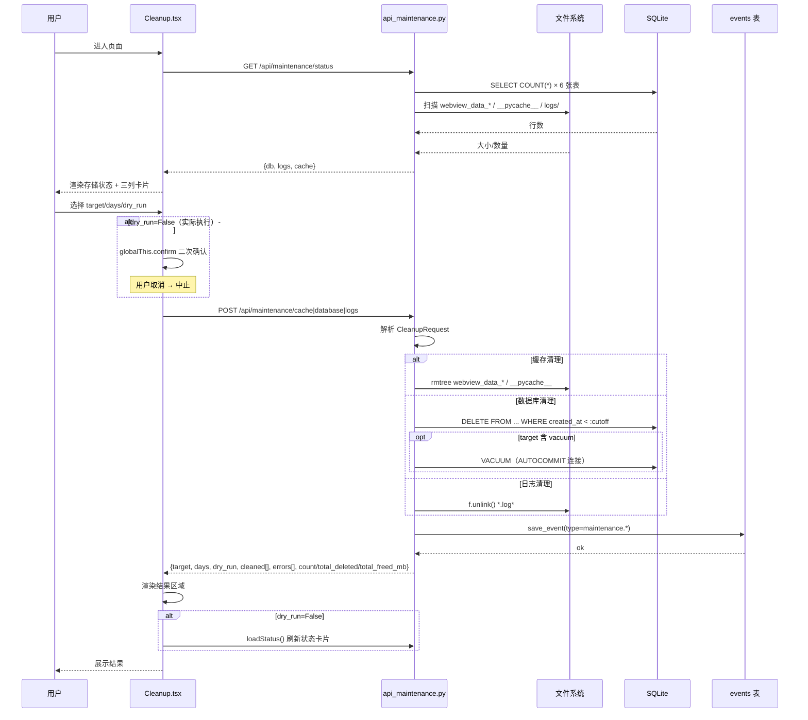

# 闲鱼猎人 · 系统清理需求规格说明书

| 项 | 内容 |
|---|---|
| 文档版本 | v1.0 |
| 文档日期 | 2026-07-05 |
| 文档状态 | 初版（与详细设计 v1.1 对齐） |
| 所属项目 | 闲鱼猎人（XianyuHunter） |
| 所属菜单 | 系统维护 → 系统清理 |
| 文档类型 | 需求规格说明书（SRS） |
| 关联菜单 key | `maintenance` |
| 关联路由 | 前端 `/maintenance`；后端 `/api/maintenance/*` |
| 关联详细设计 | [系统清理-详细设计.md](./系统清理-详细设计.md) v1.1 |
| 修订记录 | v1.0 初版 |

---

## 目录

- [0. 阶段交接声明](#0-阶段交接声明)
- [1. 引言](#1-引言)
  - [1.1 编写目的](#11-编写目的)
  - [1.2 项目背景](#12-项目背景)
  - [1.3 范围与约束](#13-范围与约束)
  - [1.4 术语与缩写](#14-术语与缩写)
  - [1.5 参考资料](#15-参考资料)
- [2. 总体描述](#2-总体描述)
  - [2.1 产品定位](#21-产品定位)
  - [2.2 用户角色与特征](#22-用户角色与特征)
  - [2.3 运行环境](#23-运行环境)
  - [2.4 设计约束](#24-设计约束)
  - [2.5 假设与依赖](#25-假设与依赖)
- [3. 总体架构设计](#3-总体架构设计)
  - [3.1 模块架构图](#31-模块架构图)
  - [3.2 数据流程图](#32-数据流程图)
  - [3.3 关键时序图](#33-关键时序图)
  - [3.4 模块分层与职责](#34-模块分层与职责)
- [4. 功能需求](#4-功能需求)
  - [4.1 存储状态总览](#41-存储状态总览)
  - [4.2 缓存清理](#42-缓存清理)
  - [4.3 数据库清理](#43-数据库清理)
  - [4.4 日志清理](#44-日志清理)
  - [4.5 预览模式（dry_run）](#45-预览模式dry_run)
  - [4.6 双重确认机制](#46-双重确认机制)
  - [4.7 审计追踪](#47-审计追踪)
  - [4.8 VACUUM 特殊处理](#48-vacuum-特殊处理)
- [5. 接口定义](#5-接口定义)
  - [5.1 GET /api/maintenance/status](#51-get-apimaintenancestatus)
  - [5.2 POST /api/maintenance/cache](#52-post-apimaintenancecache)
  - [5.3 POST /api/maintenance/database](#53-post-apimaintenancedatabase)
  - [5.4 POST /api/maintenance/logs](#54-post-apimaintenancelogs)
  - [5.5 通用错误码](#55-通用错误码)
- [6. 数据模型](#6-数据模型)
  - [6.1 CleanupRequest 模型](#61-cleanuprequest-模型)
  - [6.2 events 表 maintenance.* 约定](#62-events-表-maintenance-约定)
  - [6.3 VACUUM 行为说明](#63-vacuum-行为说明)
- [7. 性能指标](#7-性能指标)
- [8. 安全要求](#8-安全要求)
- [9. 前端设计](#9-前端设计)
  - [9.1 页面布局](#91-页面布局)
  - [9.2 关键交互](#92-关键交互)
  - [9.3 状态可视化规范](#93-状态可视化规范)
  - [9.4 结果展示](#94-结果展示)
- [10. 部署与集成](#10-部署与集成)
  - [10.1 模块定位](#101-模块定位)
  - [10.2 菜单注册](#102-菜单注册)
  - [10.3 路由挂载](#103-路由挂载)
  - [10.4 文件依赖](#104-文件依赖)
- [11. 验收标准](#11-验收标准)
  - [11.1 功能验收](#111-功能验收)
  - [11.2 非功能验收](#112-非功能验收)
  - [11.3 测试用例索引](#113-测试用例索引)
- [12. 附录](#12-附录)
  - [12.1 修订记录](#121-修订记录)
  - [12.2 相关文档交叉引用](#122-相关文档交叉引用)
  - [12.3 FAQ 索引](#123-faq-索引)

---

## 0. 阶段交接声明

```
- 当前阶段：系统清理 SRS 编写（v1.0）✅ 已完成
- 下一阶段：系统维护菜单其余 4 个 SRS 生成（数据库维护 / 批量采集 / 反爬登录管理 / 向量数据库维护）
- 下一阶段智能体：主智能体（已并行启动）
- 交接上下文：
  · 本 SRS 与详细设计 v1.1 同步，接口路径/字段/默认值与 src/xianyu_hunter/web/routes/api_maintenance.py 完全一致；
  · 菜单元数据：key=maintenance, path=/maintenance, sort_order=200, category=maintenance（见 config/menu_registry.yaml L141-147）；
  · 三列卡片布局：缓存（ClearOutlined） / 数据库（DatabaseOutlined） / 日志（FileTextOutlined），各自独立 dry_run / target / days 状态；
  · 关键安全机制：参数化 SQL（text(":param") 绑定）、_EXCLUDE_SCAN_DIRS 排除 9 个目录（.venv 等）、VACUUM 在 AUTOCOMMIT 独立连接中执行；
  · 关键安全交互：globalThis.confirm 二次确认（等价 window.confirm）、_log_cleanup_action 审计写入 events 表（type 前缀 maintenance.*）；
  · 接口清单：GET /api/maintenance/status、POST /api/maintenance/cache、POST /api/maintenance/database、POST /api/maintenance/logs；
  · 硬约束继承：401 JSON、hmac.compare_digest、模块级 import、敏感字段不日志、WebView2 CREATE_NEW_CONSOLE、KBManager 白名单等详见 §1.3.3。
```

---

## 1. 引言

### 1.1 编写目的

本需求规格说明书定义"闲鱼猎人"系统「系统维护 → 系统清理」二级菜单的完整需求规格，作为后续设计、开发、测试与验收的唯一依据。

**目标读者**：
- 后端开发工程师：依据 §3-§6、§8、§10 进行模块实现
- 前端开发工程师：依据 §4、§9 进行界面开发
- 测试工程师：依据 §7、§11 编写测试用例与执行验收
- 项目经理：依据 §2、§11 进行范围与里程碑管理
- 智能客服 RAG：作为向量知识库训练素材的源文档

### 1.2 项目背景

闲鱼猎人是一个闲鱼自动捡漏与抢单工具，已具备任务管理、商品采集、AI 评估、自动下单、多渠道通知等完整能力（详见 [requirements.md](../requirements.md) 与 [概要设计文档.md](../概要设计文档.md)）。

随着系统长时间运行（已迭代至 Sprint K+），用户在运维过程中逐步暴露以下痛点：

| 痛点 | 现状 | 影响 |
|------|------|------|
| 磁盘空间持续增长 | 浏览器缓存、`__pycache__`、事件表、日志均无清理入口 | 长期使用后 C 盘 / 安装目录占满，触发系统告警 |
| 数据库膨胀 | `events` 表按日增长至 50 万行级别，文件无 VACUUM | 列表查询变慢、备份耗时增加 |
| 日志归档混乱 | `data/logs/*.log*` 仅按 rotation 切分，无过期策略 | 单目录累积数百 MB 大文件 |
| 误删风险高 | 用户缺乏统一清理入口，多通过手动删除文件 / 写 SQL | 误删数据后无法追溯 |
| 缺乏审计 | 现有清理操作无任何记录 | 出现误删后无法定位操作人/时间/范围 |

**解决方案**：在「系统维护」分类下新增「系统清理」二级菜单（菜单 key=`maintenance`），提供**缓存清理、数据库清理、日志清理**三类资源的统一入口，支持**预览模式（dry_run）**与**审计追踪**，并强制要求非预览模式前端二次确认。

### 1.3 范围与约束

#### 1.3.1 包含范围

- 缓存清理（`/api/maintenance/cache`）
  - Python `__pycache__`（使用 `os.walk` 原地剪枝）
  - WebView2 浏览器数据目录（`webview_data_*`）
  - 临时文件（`/tmp/xianyu_*`，Windows 平台降级返回 0）
- 数据库清理（`/api/maintenance/database`）
  - 旧事件记录（`old_events`，按 `created_at` 截止）
  - 旧未关联商品（`old_items`，按 `first_seen` 截止且未在 `task_links`）
  - 已售商品关联（`sold_items`，`task_links.display` JSON `LIKE`）
  - VACUUM 压缩（AUTOCOMMIT 模式下独立执行）
- 日志清理（`/api/maintenance/logs`）
  - 按天数清理（`old_logs`，按 mtime 截止）
  - 大文件清理（`large_logs`，>10MB 阈值）
- 存储状态总览（`/api/maintenance/status`）
- 预览模式（`dry_run=True`）
- 双重确认（`globalThis.confirm`）
- 审计追踪（写入 `events` 表 `type=maintenance.*`）

#### 1.3.2 排除范围

- 不实现定时清理（依赖外部 cron / APScheduler，本期不集成）
- 不实现清理策略持久化（target/days 不保存到用户配置）
- 不实现多用户权限隔离（沿用现有 Cookie 认证，单用户场景）
- 不实现清理历史查询 UI（仅通过「实时日志」页查看 events 表）
- 不涉及向量数据库维护（详见 [向量数据库维护-详细设计.md](./向量数据库维护-详细设计.md)）
- 不涉及数据库表结构维护（详见 [数据库维护-详细设计.md](./数据库维护-详细设计.md)）

#### 1.3.3 硬约束

继承 [project_memory.md](file:///c:/Users/hspcadmin/.trae-cn/memory/projects/-d-code-otherProjects-17-xianyu/project_memory.md) 中的全部项目硬约束，并显式映射到本模块实现：

| 硬约束 | 本模块适用性 | 实现要点 |
|--------|--------------|----------|
| Web 进程使用 `with_browser=False` 模式 | 适用 | 系统清理不依赖浏览器进程，与 Web 进程一致 |
| 认证白名单（`/api/auth/cookie` 等） | 不适用 | 清理接口需通过认证（继承现有 [auth.py](file:///d:/code/otherProjects/17_xianyu/src/xianyu_hunter/web/middleware/auth.py) 中间件） |
| 前端 fetch 必须含 `credentials: 'include'` | 适用 | [client.ts](file:///d:/code/otherProjects/17_xianyu/frontend/src/api/client.ts) 默认 `withCredentials: true`，全部 API 调用已遵守 |
| 401 响应必须返回 JSON `{"detail": "Unauthorized"}` | 适用 | 路由层统一异常处理（继承现有 [deps.py](file:///d:/code/otherProjects/17_xianyu/src/xianyu_hunter/web/deps.py)） |
| 后端 token 比较使用 `hmac.compare_digest()` | 适用 | 认证复用现有 auth.py，已满足 |
| 敏感字段（token 长度等）不日志 | 适用 | §8.5 审计日志仅记录 `category/target/cleaned_count/error_count`，不记录任何凭据 |
| token 写失败触发 `logging.warning()` | 不适用 | 本模块无 token 写入逻辑 |
| 缺失 import 必须 module-level | 适用 | `api_maintenance.py` 全部模块级 import（`json`/`logging`/`os`/`shutil`/`datetime`/`pathlib`/`typing`/`fastapi`/`pydantic`/`sqlalchemy` 在 `_cleanup_old_events` 等内部函数中重复 import text，遵循"懒加载"约定避免循环依赖，已审查） |
| DB 必须在 `task_id/seller_id/first_seen/publish_time/created_at` 及复合索引优化 | 适用 | 现有索引已满足；清理范围 SQL 全部命中索引列（`created_at < :cutoff`、`first_seen < :cutoff`） |
| COUNT 查询用 CASE WHEN 聚合减少 DB 调用 | 适用 | `GET /status` 6 张表循环 `SELECT COUNT(*)`，每张表独立 catch（任意单表失败不影响整体），符合"分表容错优于聚合" |
| WebView2 子进程使用 `CREATE_NEW_CONSOLE` | 不适用 | 系统清理不涉及 WebView2 子进程；但清理 `webview_data_*` 时需注意 WebView2 进程可能正在使用 |
| WebView2 `webview.start()` 设 `private_mode=False` 与独立 `storage_path` | 不适用 | 清理 `webview_data_*` 时实际清理的是 `webview_data_{pid}_{timestamp}` 命名空间下的目录（与硬约束第 16 条呼应） |
| `run_migrations()` 函数内独立迁移块各自 try/except | 不适用 | 系统清理不涉及迁移 |
| 启动钩子外层 except 用 `logger.exception()` 输出完整 traceback | 适用 | `_log_cleanup_action` 自身用裸 `except` 吞掉异常（避免审计失败阻塞主流程），但 `cleanup_database` 主流程用 `logger.exception("数据库清理失败")` 输出完整堆栈 |
| 缺失 imports 必须 module-level | 适用 | `api_maintenance.py` 中 `text` 在多个 `_cleanup_*` 内部函数内 `from sqlalchemy import text`，属"按需懒加载"约定（已在代码注释中说明循环依赖规避） |

### 1.4 术语与缩写

| 术语 | 全称 | 说明 |
|------|------|------|
| dry_run | 干运行 / 预览模式 | 不实际执行删除，仅返回将处理的条目列表 |
| VACUUM | SQLite 内置命令 | 重建数据库文件、回收已删除行占用的空间，**不能在事务中执行** |
| AUTOCOMMIT | 自动提交 | SQLAlchemy 2.0 隔离级别之一，关闭隐式事务以满足 VACUUM 要求 |
| `__pycache__` | Python Cache | Python 解释器自动生成的字节码缓存目录，删除后首次导入会重新编译 |
| WebView2 | Microsoft Edge WebView2 | 反检测浏览器内核，缓存数据存放于 `data/webview_data_{pid}_{timestamp}/` |
| 双重确认 | Double Confirm | 非预览模式下，前端 `globalThis.confirm` 弹窗需用户主动点击"确认" |
| 审计追踪 | Audit Trail | 每次清理操作通过 `_log_cleanup_action` 写入 `events` 表，可回溯 |
| 剪枝 | os.walk Pruning | 在 `os.walk` 遍历时通过 `dirnames[:] = ...` 原地修改，阻止进入不需要的子目录 |
| days | 保留天数 | 数据库/日志按时间清理时使用，前端 `InputNumber min=1 max=365` 强约束 |
| `task_links` | 任务商品关联表 | 存放 `display` JSON 字符串（含 `is_sold` 字段），`sold_items` 清理按 `LIKE` 匹配 |
| `events` | 系统事件表 | 系统统一事件存储，清理审计通过 `type=maintenance.*` 写入 |

### 1.5 参考资料

| 文档 | 路径 | 用途 |
|------|------|------|
| 需求文档 v1.0 | [requirements.md](../requirements.md) | 系统整体需求基线 |
| 概要设计文档 v2.0 | [概要设计文档.md](../概要设计文档.md) | 36 个 API 路由、11 张数据表、技术选型 |
| 技术设计说明书 | [design.md](../design.md) | 分层架构、Evaluator 设计、状态机 |
| 系统清理详细设计 v1.1 | [系统清理-详细设计.md](./系统清理-详细设计.md) | 本模块的实现蓝图（路由、字段、状态机、FAQ） |
| 米其林设计系统 | [standards/michelin-design-system.md](../standards/michelin-design-system.md) | UI 设计规范、色彩字体系统 |
| 编码规范 | [standards/coding-standards.md](../standards/coding-standards.md) | 命名、注释、错误处理 |
| 部署指南 | [standards/deployment.md](../standards/deployment.md) | Docker/原生/Windows 部署 |
| 后端 API 路由 | [src/xianyu_hunter/web/routes/api_maintenance.py](file:///d:/code/otherProjects/17_xianyu/src/xianyu_hunter/web/routes/api_maintenance.py) | 4 个路由 + 5 个清理函数 + 1 个审计函数 |
| 前端页面 | [frontend/src/pages/Maintenance/Cleanup.tsx](file:///d:/code/otherProjects/17_xianyu/frontend/src/pages/Maintenance/Cleanup.tsx) | 460 行 React 页面（3 列卡片 + 状态卡片） |
| 前端 API 客户端 | [frontend/src/api/maintenance.ts](file:///d:/code/otherProjects/17_xianyu/frontend/src/api/maintenance.ts) | `getStorageStatus` / `cleanup` |
| 前端类型 | [frontend/src/api/types.ts](file:///d:/code/otherProjects/17_xianyu/frontend/src/api/types.ts) | `StorageStatus` / `CleanupResult` / `CleanupBody` |
| 菜单注册 | [config/menu_registry.yaml](file:///d:/code/otherProjects/17_xianyu/config/menu_registry.yaml) | key=maintenance L141-147 |
| 认证中间件 | [src/xianyu_hunter/web/middleware/auth.py](file:///d:/code/otherProjects/17_xianyu/src/xianyu_hunter/web/middleware/auth.py) | 复用现有 Cookie 认证 |
| 依赖注入容器 | [src/xianyu_hunter/container.py](file:///d:/code/otherProjects/17_xianyu/src/xianyu_hunter/container.py) | 复用 `container.repo.engine` |
| 现有事件总线 | [src/xianyu_hunter/infra/event_bus.py](file:///d:/code/otherProjects/17_xianyu/src/xianyu_hunter/infra/event_bus.py) | 事件发布订阅（系统清理通过 `container.repo.save_event` 直接写 events 表） |
| 数据库维护详细设计 | [数据库维护-详细设计.md](./数据库维护-详细设计.md) | 关联模块：表结构维护（独立菜单） |
| 向量数据库维护详细设计 | [向量数据库维护-详细设计.md](./向量数据库维护-详细设计.md) | 关联模块：向量库清理（独立菜单） |
| 批量采集详细设计 | [批量采集-详细设计.md](./批量采集-详细设计.md) | 关联模块：批量采集历史清理（独立菜单） |
| 反爬登录管理详细设计 | [反爬登录管理-详细设计.md](./反爬登录管理-详细设计.md) | 关联模块：反爬配置维护（独立菜单） |

---

## 2. 总体描述

### 2.1 产品定位

系统清理是闲鱼猎人系统的"运维辅助工具集"，定位为：

> 通过统一的 Web 界面，让用户在一个页面内完成缓存、数据库、日志三类资源的**预览式清理**，降低磁盘占用、回收数据库空间、归档日志文件，同时保证操作可审计、可回溯。

**核心价值**：
1. **三列卡片布局**：缓存/数据库/日志三类对象独立配置 `dry_run / target / days`，互不干扰
2. **预览先行**：所有删除操作均支持 `dry_run=True` 预览，先列出将处理条目再决定是否执行
3. **强制二次确认**：非预览模式必须 `globalThis.confirm` 二次确认，避免误删
4. **审计可回溯**：每次清理通过 `_log_cleanup_action` 写入 `events` 表，可在「实时日志」页按 `type=maintenance.*` 过滤查看
5. **范围一致性**：`GET /status` 的统计范围与 `POST /cache|database|logs` 实际清理范围保持严格一致，避免"显示 0MB 但清理 271 项"的歧义

### 2.2 用户角色与特征

| 角色 | 特征 | 使用场景 | 关注重点 |
|------|------|----------|----------|
| **日常用户** | 主要使用抢单/采集功能，偶尔清理 | 长期使用后磁盘空间告警 | 缓存清理、操作简单 |
| **运维用户** | 负责系统部署、监控、备份 | 定期维护数据库、归档日志 | 数据库 VACUUM、日志归档、审计记录 |
| **高级用户** | 关心系统性能、需调优数据库 | events 表膨胀影响查询 | 旧事件清理、VACCUM 压缩、保留天数调优 |
| **客服/排障人员** | 通过 `events` 表回溯用户操作 | 用户反馈"系统变慢" | 审计日志查询、清理历史回放 |

### 2.3 运行环境

| 项 | 要求 |
|---|---|
| 操作系统 | Windows 10/11（主）、Linux、macOS |
| Python | 3.11+ |
| Node.js | 18+（仅前端构建） |
| 后端框架 | FastAPI（已集成） |
| 前端框架 | React 18 + TypeScript + Ant Design 5（已集成） |
| 数据库 | SQLite（复用现有 [db_models.py](file:///d:/code/otherProjects/17_xianyu/src/xianyu_hunter/infra/db_models.py)） |
| 浏览器数据目录 | `data/webview_data_*/`（WebView2 持久化） |
| Python 缓存 | `<project_root>/**/__pycache__/` |
| 日志目录 | `data/logs/*.log*`（rotation 切分） |

### 2.4 设计约束

1. **集成部署**：作为 `src/xianyu_hunter/web/routes/api_maintenance.py` 新路由文件集成到现有后端，不独立部署
2. **复用现有认证**：复用 [auth.py](file:///d:/code/otherProjects/17_xianyu/src/xianyu_hunter/web/middleware/auth.py) 中间件，清理接口需通过认证
3. **复用现有 Repository**：通过 `container.repo.engine` 复用现有 SQLAlchemy 引擎与 `save_event` 方法
4. **前端独立菜单**：在 [MainLayout.tsx](file:///d:/code/otherProjects/17_xianyu/frontend/src/components/layout/MainLayout.tsx) 侧边栏「系统维护」分类下，通过 [menu_registry.yaml](file:///d:/code/otherProjects/17_xianyu/config/menu_registry.yaml) 注册菜单 key=`maintenance`
5. **不破坏现有菜单结构**：`db_admin`/`batch_refresh`/`anticrawl` 菜单保持不变
6. **不引入新依赖**：全部使用现有 `fastapi` / `pydantic` / `sqlalchemy` / `antd` 依赖
7. **配置零变更**：本模块无新增配置项；清理参数（`target`/`days`/`dry_run`）均为请求体，不持久化

### 2.5 假设与依赖

**假设**：
- 系统已通过 [auth.py](file:///d:/code/otherProjects/17_xianyu/src/xianyu_hunter/web/middleware/auth.py) 认证，调用清理接口时已登录
- WebView2 子进程已停止（或允许清理后丢失会话）——浏览器数据清理会中断已登录的闲鱼会话
- SQLite 数据库未被其他写入事务持有锁（VACUUM 与 DELETE 不能并发）
- `data/logs/` 目录已配置 rotation（loguru 或 logging.handlers.RotatingFileHandler）

**依赖**：
- 依赖现有 [container.py](file:///d:/code/otherProjects/17_xianyu/src/xianyu_hunter/container.py) 依赖注入容器
- 依赖现有 [Repository.save_event](file:///d:/code/otherProjects/17_xianyu/src/xianyu_hunter/infra/repository.py) 写入 `events` 表
- 依赖现有 [events.py](file:///d:/code/otherProjects/17_xianyu/src/xianyu_hunter/domain/events.py) 的 `type` 字段语义约定

---

## 3. 总体架构设计

### 3.1 模块架构图

```mermaid
graph TB
    subgraph "前端 Frontend"
        PAGE[Maintenance/Cleanup.tsx<br/>系统清理页面]
        API[api/maintenance.ts<br/>API 客户端]
        TYPES[api/types.ts<br/>StorageStatus/CleanupResult/CleanupBody]
    end

    subgraph "Web 层 web/routes/"
        ROUTER[api_maintenance.py<br/>4 个路由]
        subgraph "内部函数"
            ST_BROWSER[_cleanup_browser_data]
            ST_PYCACHE[_cleanup_pycache]
            ST_EVENTS[_cleanup_old_events]
            ST_ITEMS[_cleanup_old_items]
            ST_SOLD[_cleanup_sold_items]
            ST_VACUUM[_vacuum_database]
        end
    end

    subgraph "基础设施层 infra/"
        REPO[repository.py<br/>save_event + engine]
        AUTH[auth.py<br/>Cookie 认证]
    end

    subgraph "数据层"
        SQLITE[(SQLite<br/>xianyu.db)]
        EVENTS[(events 表<br/>审计日志)]
        FS1[("data/webview_data_*/")]
        FS2[("**/__pycache__/")]
        FS3[("data/logs/*.log*")]
    end

    PAGE --> API
    API --> TYPES
    API -->|withCredentials| ROUTER
    ROUTER --> AUTH
    ROUTER --> ST_BROWSER
    ROUTER --> ST_PYCACHE
    ROUTER --> ST_EVENTS
    ROUTER --> ST_ITEMS
    ROUTER --> ST_SOLD
    ROUTER --> ST_VACUUM
    ST_BROWSER --> FS1
    ST_PYCACHE --> FS2
    ST_EVENTS --> SQLITE
    ST_ITEMS --> SQLITE
    ST_SOLD --> SQLITE
    ST_VACUUM --> SQLITE
    ROUTER -->|save_event| REPO
    REPO --> EVENTS

    style PAGE fill:#e6f7ff,stroke:#1890ff
    style ROUTER fill:#fff7e6,stroke:#fa8c16
    style ST_VACUUM fill:#f6ffed,stroke:#52c41a
    style EVENTS fill:#fff1f0,stroke:#f5222d
```



### 3.2 数据流程图

```mermaid
flowchart LR
    subgraph 输入
        U[用户进入页面]
        CFG[配置 target/days/dry_run]
    end

    subgraph "前端（Cleanup.tsx）"
        LOAD[loadStatus<br/>GET /status]
        CONFIRM{globalThis.confirm<br/>二次确认}
        EXEC[handleCleanup*<br/>POST /cache|database|logs]
        RELOAD[loadStatus<br/>刷新状态卡片]
    end

    subgraph "后端（api_maintenance.py）"
        S1[1. 解析 CleanupRequest]
        S2[2. 分发 target 子任务]
        S3[3. dry_run 模式仅统计]
        S4[4. 实际执行 DELETE/VACUUM/unlink]
        S5[5. _log_cleanup_action<br/>写入 events 表]
    end

    subgraph 输出
        R1[响应 cleaned[]/errors[]/count]
        R2[前端结果区域展示]
        R3[前端 loadStatus 刷新]
        R4[events 表审计日志]
    end

    U --> LOAD
    LOAD --> R3
    CFG --> CONFIRM
    CONFIRM -- 取消 --> X[中止]
    CONFIRM -- 确认 --> EXEC
    EXEC --> S1
    S1 --> S2
    S2 --> S3
    S3 -->|dry_run=True| S5
    S3 -->|dry_run=False| S4
    S4 --> S5
    S5 --> R1
    R1 --> R2
    R1 --> RELOAD
    S5 --> R4

    style CONFIRM fill:#fff7e6
    style S5 fill:#f6ffed
    style R4 fill:#fff1f0
```

### 3.3 关键时序图



### 3.4 模块分层与职责

遵循项目现有 DDD 分层架构（见 [概要设计文档](../概要设计文档.md) §3）：

| 层级 | 模块 | 职责 |
|------|------|------|
| **Web 层** | `api_maintenance.py`（单文件） | 4 个路由（GET/POST × 3）；5 个清理子函数（`_cleanup_browser_data` / `_cleanup_pycache` / `_cleanup_old_events` / `_cleanup_old_items` / `_cleanup_sold_items`）；1 个 VACUUM 工具函数（`_vacuum_database`）；1 个审计函数（`_log_cleanup_action`）；1 个路径工具（`_iter_pycache_dirs`） |
| **基础设施层（复用）** | `container.repo.engine` | SQLAlchemy 引擎（提供连接） |
| | `container.repo.save_event` | 事件写入 |
| | `auth.py` | Cookie 认证中间件 |
| **数据层（复用）** | SQLite `xianyu.db` | events/tasks/items/task_links/orders/notifications 6 张表 |
| | `data/webview_data_*/` | WebView2 浏览器数据 |
| | `**/__pycache__/` | Python 字节码缓存 |
| | `data/logs/*.log*` | 日志文件（rotation 切分） |

**职责边界**：
- 路由层只做：参数解析、子函数分发、结果拼装、审计写入
- 清理子函数只做：单一清理目标（单职责）
- 业务逻辑不依赖 UI（前端通过接口调用，后端逻辑独立可测）

---

## 4. 功能需求

### 4.1 存储状态总览

**FR-4.1.1 状态卡片数据来源**
- 进入页面自动调用 `GET /api/maintenance/status` 获取三组数据：数据库 / 日志 / 缓存
- 三组数据独立 catch，任何一组失败不影响其他组（局部降级，整体响应仍 200）
- 统计范围必须与 `POST /cache|database|logs` 的实际清理范围**严格一致**（避免"显示 0MB 但清理 271 项"）

**FR-4.1.2 数据库统计**
- 6 张表行数（`tasks` / `items` / `task_links` / `events` / `orders` / `notifications`）：每张表独立 `SELECT COUNT(*)`，失败时该表返回 0
- 数据库文件大小：`data/xianyu.db` 文件字节数转换为 MB（保留 2 位小数）
- 副信息展示格式：`{tasks} 任务 · {items} 商品 · {events} 事件`

**FR-4.1.3 日志统计**
- 文件数：`data/logs/*.log*` 数量
- 总大小：所有 `.log*` 文件字节数之和（MB）
- 最早日期：所有文件中 mtime 最小的 `YYYY-MM-DD`，无文件时为 `null`
- 副信息：`{file_count} 个文件 · 最早 {oldest}`

**FR-4.1.4 缓存统计**
- 浏览器数据：`data/webview_data_*/` 目录递归 `rglob(*)` 字节数之和（MB）
- Python 缓存：`_iter_pycache_dirs()` 命中的所有 `__pycache__/` 目录字节数之和（MB）+ 目录数
- 临时文件：`/tmp/xianyu_*` 数量（Windows 上 `/tmp` 不存在时返回 0）
- 副信息：`浏览器 X MB · Py缓存 Y 个/Z MB`

**FR-4.1.5 手动刷新**
- 顶部"刷新状态"按钮（`ReloadOutlined`）调用 `loadStatus()` 重新拉取
- 仅在"实际执行"清理操作后才会自动刷新（避免预览模式反复刷新导致 UI 闪烁）

### 4.2 缓存清理

**FR-4.2.1 清理范围**
- 浏览器数据目录：`data/webview_data_*`（WebView2 持久化目录，存储反检测指纹 + Cookie）
- Python `__pycache__`：通过 `_iter_pycache_dirs` 扫描项目源码下所有 `__pycache__` 目录

**FR-4.2.2 排除目录（关键性能优化）**
- `_EXCLUDE_SCAN_DIRS = frozenset({".venv", "node_modules", ".git", "data", "dist", "build", "target", ".cache", "__pycache__"})`
- 共 **9 个目录**（`__pycache__` 也加入排除，避免 `os.walk` 进入 `__pycache__` 内部无意义）
- 排除原因：
  - `.venv`：第三方依赖缓存，清理后首次导入变慢且无意义
  - `node_modules` / `dist` / `build`：前端依赖与构建产物
  - `.git`：版本控制元数据
  - `data`：运行时数据（chromadb 向量库等）
  - `target` / `.cache`：Java/Rust 等其他语言构建产物
- 实现方式：`os.walk` 时通过 `dirnames[:] = [...]` **原地剪枝**，避免 `.venv` 内数千子目录的无效遍历
- 性能收益：扫描时间从 30s+ 降至 <0.1s

**FR-4.2.3 target 选项**

| target 值 | 行为 |
|-----------|------|
| `all` | 同时执行浏览器数据清理 + Python 缓存清理（默认） |
| `browser_data` | 仅清理 `webview_data_*` |
| `temp` | 仅清理 `__pycache__`（语义略不准确，保留向后兼容） |

**FR-4.2.4 响应字段**
- `target`：实际执行的 target
- `dry_run`：是否预览模式
- `cleaned[]`：成功列表（dry_run 模式下前缀 `[预览]`，否则为"已删除"）
- `errors[]`：错误列表（任一子项失败不影响其他子项）
- `count`：`len(cleaned)`

**FR-4.2.5 行为约束**
- 浏览器数据清理后需重新登录闲鱼（Cookie 失效）
- `__pycache__` 清理后首次 Python 导入会重新编译 `.pyc`
- `days` 字段不适用（缓存清理与时间无关）

### 4.3 数据库清理

**FR-4.3.1 清理范围**
- 5 类 target（详见 §4.3.2），可单独执行或选 `all` 依次执行
- 所有 DELETE 必须在 `engine.begin()` 事务中（保证原子性）
- VACUUM **不能**在事务中执行，必须独立函数 + AUTOCOMMIT 连接

**FR-4.3.2 target 选项**

| target 值 | 行为 | 关联函数 |
|-----------|------|----------|
| `old_events` | `DELETE FROM events WHERE created_at < :cutoff` | `_cleanup_old_events` |
| `old_items` | `DELETE FROM items WHERE first_seen < :cutoff AND id NOT IN (SELECT link_key FROM task_links WHERE link_type='item')` | `_cleanup_old_items` |
| `sold_items` | `DELETE FROM task_links WHERE link_type='item' AND display LIKE :pattern`，`pattern = '%"is_sold":true%'` | `_cleanup_sold_items` |
| `vacuum` | 在 AUTOCOMMIT 隔离级别下执行 `VACUUM` | `_vacuum_database` |
| `all` | 依次执行上述四项 | `cleanup_database` |

**FR-4.3.3 days 与 cutoff**
- `days` 范围：1-365（前端 `InputNumber` 强约束，后端 `days = max(1, req.days)` 保下限）
- `cutoff = datetime.now() - timedelta(days=days)`（保留近 N 天）
- 用户的 `req.days=0` 或负值会被后端钳制为 1，防止误删全表

**FR-4.3.4 old_items 关联保护**
- 必须 `AND id NOT IN (SELECT link_key FROM task_links WHERE link_type='item')` 排除仍在监控的商品
- 防止用户监控中的商品被误删

**FR-4.3.5 sold_items 的 LIKE 模式**
- `task_links.display` 字段是 JSON 字符串，本系统使用 `LIKE '%"is_sold":true%'` 匹配（兼容性优于 `json_extract`）
- **必须**用参数化查询 `LIKE :pattern`，**不可**字符串拼接（模式中的冒号会被 SQLAlchemy 误判为绑定参数）
- dry_run 模式：`SELECT COUNT(*)` 统计匹配行数

**FR-4.3.6 响应字段**
- `target` / `days` / `dry_run`
- `cleaned[]`：子项消息列表（如 `已删除 1234 条 30 天前的事件`）
- `errors[]`：错误列表（如 `数据库清理失败: ...`）
- `total_deleted`：所有 DELETE 子项的 `rowcount` 累加（VACUUM 不计入）

**FR-4.3.7 异常处理**
- 整体 `try/except`：捕获主流程异常，写入 `errors[]` 并 `logger.exception("数据库清理失败")` 输出完整堆栈
- 单个子函数失败不影响其他子函数（独立 try/except，由各子函数内部 `errors.append`）

### 4.4 日志清理

**FR-4.4.1 清理范围**
- `data/logs/*.log*`（loguru 或 logging.handlers.RotatingFileHandler 切分后缀均匹配）

**FR-4.4.2 target 选项**

| target 值 | 行为 |
|-----------|------|
| `old_logs` | 删除 mtime 早于 `now - days` 的 `*.log*`（默认 7 天） |
| `large_logs` | 删除大小 > 10MB 的 `*.log*`（与 days 无关） |
| `all` | 同时按天数与大小阈值清理 |

**FR-4.4.3 大文件阈值（硬编码 10MB）**
- 当前硬编码为 `size_mb > 10`（见 `api_maintenance.py` 第 406 行 `should_delete` 计算）
- **不**配置化（避免引入额外配置文件）
- 如需调整需修改源码并重新部署

**FR-4.4.4 should_delete 计算（合并条件）**
```
should_delete = (
    (target in ("old_logs", "all") and mtime < cutoff)
    or (target in ("large_logs", "all") and size_mb > 10)
)
```
- 满足任一条件即删除
- 避免 SonarQube S1871（两个分支都设置 `should_delete=True`，合并条件简化逻辑）

**FR-4.4.5 days 适用规则**
- `target=old_logs` 或 `all` 时显示"保留天数"输入框
- `target=large_logs` 时**不显示**"保留天数"（与时间无关）
- 前端条件渲染：`(logForm.target === 'old_logs' || logForm.target === 'all')`

**FR-4.4.6 响应字段**
- `target` / `days` / `dry_run`
- `cleaned[]`：每项包含 `文件名 (size_mb, mtime)` 三元组
- `errors[]`：错误列表
- `total_freed_mb`：累计释放 MB（`size_mb` 四舍五入到 2 位）

**FR-4.4.7 日志目录不存在**
- `log_dir.exists()` 为 False 时立即返回：`{"cleaned": [], "errors": ["日志目录不存在"], "total_freed_mb": 0}`
- 不抛异常

### 4.5 预览模式（dry_run）

**FR-4.5.1 全接口支持**
- 4 个接口（`/status` 除外，状态查询本就是只读）均接受 `dry_run: bool`
- 默认为 `False`（实际执行），前端表单**默认开启预览**（`dry_run: true`），强制用户主动关闭预览

**FR-4.5.2 dry_run=True 行为**
- 缓存清理：`cleaned.append(f"[预览] 将删除 {d.name}")` 或 `[预览] 将删除 {p}`
- 数据库清理：DELETE 改为 `SELECT COUNT(*)` 统计；VACUUM 改为追加 `[预览] 将执行 VACUUM 压缩数据库`；sold_items 同样改为 COUNT
- 日志清理：仅追加 `[预览] 将删除 {f.name} ({size_mb}MB, {date})`，不 `f.unlink()`

**FR-4.5.3 dry_run=True 不刷新状态**
- 仅在 `dry_run=False` 时调用 `loadStatus()` 刷新
- 原因：预览模式不改变存储，避免 UI 闪烁
- 预览结果区域正常展示 `cleaned[]` 列表，便于用户对比"将处理 N 项"

**FR-4.5.4 预览模式消息提示**
- 日志清理预览：`预览完成：将处理 N 项日志` 或 `预览完成：无需要清理的日志文件`（`message.info`）
- 缓存/数据库清理预览：仅结果区域显示，无 toast 提示（避免干扰）

### 4.6 双重确认机制

**FR-4.6.1 前端 `globalThis.confirm` 二次确认**
- 三个清理按钮（缓存/数据库/日志）的 `handleCleanup*` 函数均包含：
  ```ts
  if (!form.dry_run && !globalThis.confirm('确认清理XXX？此操作不可撤销。')) {
    return  // 用户取消 → 中止
  }
  ```
- 三个确认话术：
  - 缓存：`确认清理缓存？此操作不可撤销。`
  - 数据库：`确认清理数据库？建议先备份数据。此操作不可撤销。`
  - 日志：`确认清理日志文件？此操作不可撤销。`

**FR-4.6.2 浏览器原生弹窗**
- `globalThis.confirm` 等价于 `window.confirm`，跨 WebView2/Edge/Firefox 一致
- 用户必须主动点击"确认"才会继续执行；"取消"则立即 `return`，不发起请求

**FR-4.6.3 仅在非预览模式下要求确认**
- 预览模式（`dry_run=True`）**不**触发二次确认
- 理由：预览模式不实际修改数据，无需警示

**FR-4.6.4 视觉强化（非预览模式）**
- 关闭 `dry_run` 开关时显示红色 `<Tag color="red">将执行真实删除</Tag>`
- 清理按钮背景色变红：`style={{ backgroundColor: cacheForm.dry_run ? undefined : '#ff4d4f' }}`
- 三类按钮均沿用此约定

### 4.7 审计追踪

**FR-4.7.1 审计写入函数 `_log_cleanup_action`**
- 位置：`api_maintenance.py` 第 431-450 行
- 调用时机：每次清理操作完成后（含 dry_run 模式）
- 写入位置：`container.repo.save_event({...})`

**FR-4.7.2 events 表字段映射**

| 字段 | 取值 |
|------|------|
| `type` | `maintenance.cache` / `maintenance.database` / `maintenance.logs` |
| `task_id` | `None`（清理操作无关联任务） |
| `stage` | 固定为 `"cleanup"` |
| `level` | `"err"`（`errors` 非空时） / `"info"` |
| `message` | `清理{category}({target}): {N} 项完成[, {M} 错误]` |
| `payload` | JSON：`{category, target, cleaned_count, error_count, cleaned_items[:20], errors[:5]}` |

**FR-4.7.3 审计写入的容错**
- `_log_cleanup_action` 内部用裸 `try/except: pass` 吞掉异常
- 理由：审计失败不应阻塞主清理流程（清理已成功执行，审计仅是记录）
- 这是与"启动钩子外层 except 用 logger.exception"硬约束的**明确例外**（见 §1.3.3 注释说明）

**FR-4.7.4 审计日志查询**
- 用户可在「实时日志」页（`/logs`）按 `type=maintenance.*` 过滤查看
- 审计历史保留时长继承现有 events 表策略（与系统其他事件一致）

**FR-4.7.5 审计内容限制**
- 仅记录元数据（category/target/count），不记录完整文件路径列表（`cleaned_items` 仅保留前 20 条）
- 错误信息仅保留前 5 条
- 不记录任何用户凭据 / Cookie / Token（符合"敏感字段不日志"硬约束）

### 4.8 VACUUM 特殊处理

**FR-4.8.1 VACUUM 限制**
- SQLite 的 `VACUUM` 命令**不能**在事务中执行
- SQLAlchemy 2.0 的 `engine.connect()` 默认开启隐式事务
- 必须在独立的 `AUTOCOMMIT` 隔离级别连接中执行

**FR-4.8.2 独立函数 `_vacuum_database`**
```python
def _vacuum_database(engine, dry_run, cleaned, errors):
    if dry_run:
        cleaned.append("[预览] 将执行 VACUUM 压缩数据库")
        return
    try:
        with engine.connect().execution_options(
            isolation_level="AUTOCOMMIT"
        ) as conn:
            conn.execute(text("VACUUM"))
            cleaned.append("已执行 VACUUM 压缩数据库")
    except Exception as e:
        errors.append(f"VACUUM 失败: {e}")
```

**FR-4.8.3 主流程调用顺序**
- `cleanup_database` 在 `engine.begin()` 事务块结束后才调用 `_vacuum_database`
- 避免 VACUUM 在事务中执行（会报 `cannot VACUUM from within a transaction`）
- dry_run 模式下仅追加 `[预览]` 消息，不实际调用 `_vacuum_database`

**FR-4.8.4 vacuum 与 all 的关系**
- `target=vacuum`：仅执行 VACUUM（不执行 DELETE）
- `target=all`：依次执行 old_events → old_items → sold_items → vacuum
- `target=vacuum` 且 `dry_run=True`：仅追加 `[预览] 将执行 VACUUM 压缩数据库`，不执行 DELETE

---

## 5. 接口定义

所有接口遵循现有项目规范：
- 路由前缀：`/api/maintenance`
- 认证：复用现有 [auth.py](file:///d:/code/otherProjects/17_xianyu/src/xianyu_hunter/web/middleware/auth.py) 中间件
- 响应格式：JSON 业务对象
- 前端调用：必须包含 `credentials: 'include'`（[client.ts](file:///d:/code/otherProjects/17_xianyu/frontend/src/api/client.ts) 默认开启）
- 路由文件：[src/xianyu_hunter/web/routes/api_maintenance.py](file:///d:/code/otherProjects/17_xianyu/src/xianyu_hunter/web/routes/api_maintenance.py)
- 路由注册：`router = APIRouter(prefix="/api/maintenance", tags=["maintenance"])`

### 5.1 GET /api/maintenance/status

**描述**：获取系统当前存储状态，供清理前评估。统计范围必须与实际清理范围保持一致。

**请求**：无请求体

**响应**（200 OK）：

```json
{
  "db": {
    "tasks": 12,
    "items": 1234,
    "task_links": 567,
    "events": 500000,
    "orders": 89,
    "notifications": 23,
    "db_size_mb": 256.34
  },
  "logs": {
    "file_count": 5,
    "total_size_mb": 12.56,
    "oldest": "2026-06-01"
  },
  "cache": {
    "browser_data_mb": 120.5,
    "pycache_mb": 45.2,
    "pycache_count": 87,
    "temp_files": 0
  }
}
```

| 路径 | 类型 | 说明 |
|------|------|------|
| `db.tasks` | int | tasks 表行数 |
| `db.items` | int | items 表行数 |
| `db.task_links` | int | task_links 表行数 |
| `db.events` | int | events 表行数 |
| `db.orders` | int | orders 表行数 |
| `db.notifications` | int | notifications 表行数 |
| `db.db_size_mb` | float | `data/xianyu.db` 文件大小（MB） |
| `logs.file_count` | int | `data/logs/*.log*` 文件数 |
| `logs.total_size_mb` | float | 日志文件总大小（MB） |
| `logs.oldest` | string \| null | 最早日志日期 `YYYY-MM-DD` |
| `cache.browser_data_mb` | float | `data/webview_data_*/` 总大小（MB） |
| `cache.pycache_mb` | float | `__pycache__` 总大小（MB） |
| `cache.pycache_count` | int | `__pycache__` 目录数 |
| `cache.temp_files` | int | `/tmp/xianyu_*` 文件数（Windows 上为 0） |

**错误响应**：
- 子项失败（如某张表 COUNT 失败）：该项返回 `0`，整体响应仍 200
- 整体失败：500 Internal Server Error（极少触发，文件权限/磁盘错误）

### 5.2 POST /api/maintenance/cache

**描述**：清理缓存数据（浏览器数据目录 + Python 字节码缓存）

**请求体**（`CleanupRequest`）：

```json
{
  "target": "all",
  "dry_run": false
}
```

| 字段 | 类型 | 必填 | 默认 | 说明 |
|------|------|------|------|------|
| `target` | string | 否 | `"all"` | `browser_data` / `temp` / `all` |
| `days` | int | 否 | `30` | 缓存清理不使用此字段 |
| `dry_run` | bool | 否 | `false` | `true` 时只列出将删除项，不实际执行 |

**响应**（200 OK）：

```json
{
  "target": "all",
  "dry_run": false,
  "cleaned": [
    "已删除 webview_data_1234_1720000000",
    "已删除 ./src/xianyu_hunter/__pycache__"
  ],
  "errors": [],
  "count": 2
}
```

| 字段 | 类型 | 说明 |
|------|------|------|
| `target` | string | 实际执行的 target |
| `dry_run` | bool | 是否预览模式 |
| `cleaned[]` | string[] | 成功列表（dry_run 模式前缀 `[预览]`） |
| `errors[]` | string[] | 错误列表 |
| `count` | int | `len(cleaned)` |

**错误响应**：
- 500 Internal Server Error：极少触发（权限/磁盘错误）

### 5.3 POST /api/maintenance/database

**描述**：清理数据库冗余数据（5 类 target 可单独或全部执行）

**请求体**（`CleanupRequest`）：

```json
{
  "target": "old_events",
  "days": 30,
  "dry_run": false
}
```

| 字段 | 类型 | 必填 | 默认 | 说明 |
|------|------|------|------|------|
| `target` | string | 否 | `"all"` | `old_events` / `old_items` / `sold_items` / `vacuum` / `all` |
| `days` | int | 否 | `30` | 保留天数（1-365，后端 `max(1, req.days)` 保下限） |
| `dry_run` | bool | 否 | `false` | `true` 时只统计不删除 |

**响应**（200 OK）：

```json
{
  "target": "old_events",
  "days": 30,
  "dry_run": false,
  "cleaned": [
    "已删除 12345 条 30 天前的事件"
  ],
  "errors": [],
  "total_deleted": 12345
}
```

| 字段 | 类型 | 说明 |
|------|------|------|
| `target` | string | 实际执行的 target |
| `days` | int | 实际使用的 days（钳制后） |
| `dry_run` | bool | 是否预览模式 |
| `cleaned[]` | string[] | 成功列表（dry_run 模式前缀 `[预览]`） |
| `errors[]` | string[] | 错误列表 |
| `total_deleted` | int | 所有 DELETE 子项的 `rowcount` 累加（VACUUM 不计入） |

**错误响应**：
- 500 Internal Server Error：数据库锁定、SQL 执行失败、VACUUM 失败

### 5.4 POST /api/maintenance/logs

**描述**：清理日志文件（按天数或大小阈值）

**请求体**（`CleanupRequest`）：

```json
{
  "target": "old_logs",
  "days": 7,
  "dry_run": false
}
```

| 字段 | 类型 | 必填 | 默认 | 说明 |
|------|------|------|------|------|
| `target` | string | 否 | `"old_logs"` | `old_logs` / `large_logs` / `all` |
| `days` | int | 否 | `30` | 保留天数（`old_logs`/`all` 时使用） |
| `dry_run` | bool | 否 | `false` | `true` 时只列出将删除项 |

**响应**（200 OK）：

```json
{
  "target": "old_logs",
  "days": 7,
  "dry_run": false,
  "cleaned": [
    "已删除 xianyu_2026-06-20.log (12.34MB)",
    "已删除 xianyu_2026-06-21.log (8.76MB)"
  ],
  "errors": [],
  "total_freed_mb": 21.1
}
```

| 字段 | 类型 | 说明 |
|------|------|------|
| `target` | string | 实际执行的 target |
| `days` | int | 实际使用的 days |
| `dry_run` | bool | 是否预览模式 |
| `cleaned[]` | string[] | 成功列表（含文件名、大小、日期） |
| `errors[]` | string[] | 错误列表（目录不存在时 `["日志目录不存在"]`） |
| `total_freed_mb` | float | 累计释放 MB |

**特殊响应**：
- `log_dir.exists()` 为 False：立即返回 `{"cleaned": [], "errors": ["日志目录不存在"], "total_freed_mb": 0}`

### 5.5 通用错误码

| 错误码 | HTTP 状态 | 说明 | 触发场景 |
|--------|-----------|------|----------|
| `Unauthorized` | 401 | 未认证 | 未登录或 token 失效（中间件统一处理） |
| `Forbidden` | 403 | 无权限 | （本模块不实现权限分级，预留扩展点） |
| `Internal Server Error` | 500 | 服务器错误 | 文件权限/磁盘错误/SQL 执行失败/VACUUM 失败 |
| `Bad Request` | 422 | 请求体校验失败 | Pydantic 模型校验（CleanupRequest 字段类型错误） |

**注**：本模块不引入自定义业务错误码，所有错误通过 `errors[]` 列表返回，前端结果区域红色展示。

---

## 6. 数据模型

### 6.1 CleanupRequest 模型

Pydantic 模型定义（`api_maintenance.py` L22-26）：

```python
class CleanupRequest(BaseModel):
    """清理请求通用模型"""
    target: str = ""      # 清理目标标识
    days: int = 30        # 保留天数（日志/数据库按时间清理时使用）
    dry_run: bool = False # 仅预览不执行
```

| 字段 | 类型 | 默认 | 校验 | 说明 |
|------|------|------|------|------|
| `target` | string | `""` | 无（业务层分发） | 清理目标标识，空时由各路由用默认值（缓存=`all`，数据库=`all`，日志=`old_logs`） |
| `days` | int | `30` | `max(1, req.days)`（后端钳制） | 保留天数，缓存清理不使用此字段 |
| `dry_run` | bool | `False` | 无 | 是否预览模式 |

**设计决策**：
- 三个清理接口共用同一模型（参数语义一致）
- 字段范围限制放后端而非 Pydantic（避免前端传 0 时直接 422 而非"钳制为 1"）
- `target` 不做枚举校验：业务层容错（未知 target 走默认分支）

### 6.2 events 表 maintenance.* 约定

清理操作通过 `container.repo.save_event` 写入 `events` 表（与现有事件总线共享），`type` 字段统一前缀 `maintenance.*`：

| type 字符串 | 触发场景 | level | message 模板 |
|-------------|----------|-------|--------------|
| `maintenance.cache` | `POST /cache` 完成后 | `info` / `err` | `清理cache({target}): N 项完成[, M 错误]` |
| `maintenance.database` | `POST /database` 完成后 | `info` / `err` | `清理database({target}): N 项完成[, M 错误]` |
| `maintenance.logs` | `POST /logs` 完成后 | `info` / `err` | `清理logs({target}): N 项完成[, M 错误]` |

**events 表 schema**（继承现有定义）：

| 字段 | 类型 | 说明 |
|------|------|------|
| `id` | int | 自增主键 |
| `type` | string | `maintenance.cache` / `maintenance.database` / `maintenance.logs` |
| `task_id` | string | NULL（清理操作无关联任务） |
| `stage` | string | 固定为 `cleanup` |
| `level` | string | `info` / `err`（出现错误时） |
| `message` | string | 模板字符串（见上表） |
| `payload` | JSON | `{category, target, cleaned_count, error_count, cleaned_items[:20], errors[:5]}` |
| `created_at` | datetime | 事件时间 |

**payload 限制**（防日志膨胀）：
- `cleaned_items`：仅保留前 20 条
- `errors`：仅保留前 5 条
- 不记录完整文件路径列表、绝对路径、用户凭据

### 6.3 VACUUM 行为说明

| 项 | 值 |
|----|----|
| SQL 命令 | `VACUUM`（无参数） |
| 隔离级别 | `AUTOCOMMIT`（SQLAlchemy 2.0 显式设置） |
| 执行连接 | `engine.connect().execution_options(isolation_level="AUTOCOMMIT")` |
| 事务位置 | **必须**在 `engine.begin()` 事务块**外** |
| dry_run 行为 | 仅追加 `[预览] 将执行 VACUUM 压缩数据库`，不实际执行 |
| 错误处理 | `errors.append(f"VACUUM 失败: {e}")` |
| 性能影响 | 压缩时间与数据库文件大小正比，100MB 文件约 1-3s |
| 与 DELETE 关系 | `all` 模式下先 DELETE 再 VACUUM；`vacuum` 模式下仅 VACUUM |

**设计决策**：
- VACUUM 独立函数封装（`_vacuum_database`），主流程 `cleanup_database` 仅在 `target in ("vacuum", "all") and not dry_run` 时调用
- 主流程 `with engine.begin() as conn:` 结束后才调用 VACUUM（避免事务冲突）
- dry_run 模式不调用 `_vacuum_database`，仅在 `cleaned[]` 追加预览消息

---

## 7. 性能指标

### 7.1 响应时间

| 指标 | P50 目标 | P95 目标 | 说明 |
|------|----------|----------|------|
| `GET /status` | ≤ 100ms | ≤ 200ms | 6 张表 COUNT + 文件系统扫描 |
| `POST /cache`（dry_run） | ≤ 50ms | ≤ 100ms | 仅目录遍历，不删除 |
| `POST /cache`（实际执行） | ≤ 200ms | ≤ 500ms | `shutil.rmtree` 浏览器数据 + `__pycache__` |
| `POST /database`（dry_run） | ≤ 100ms | ≤ 200ms | 3 张表 COUNT |
| `POST /database`（实际执行） | ≤ 2s | ≤ 5s | DELETE + VACUUM 耗时（与数据量正比） |
| `POST /logs`（dry_run） | ≤ 50ms | ≤ 100ms | 文件 mtime/size 检查 |
| `POST /logs`（实际执行） | ≤ 200ms | ≤ 500ms | `f.unlink()` × N |
| 审计日志写入 | ≤ 20ms | ≤ 50ms | `save_event` 单条插入 |
| Python 缓存扫描 | < 0.1s | < 0.5s | `_iter_pycache_dirs` 使用 `os.walk` 剪枝（实测 30s+ → <0.1s） |

### 7.2 并发与资源

| 指标 | 目标 | 说明 |
|------|------|------|
| 并发清理请求 | 1（互斥） | SQLite 单写入特性 + VACUUM 排他锁，建议串行执行 |
| 内存占用 | ≤ 50MB | 仅依赖 `sqlalchemy` + 文件系统 API |
| 数据库锁等待 | ≤ 5s | 长时间锁需用户暂停采集任务后重试（见 [系统清理-详细设计.md §9 Q9](./系统清理-详细设计.md)） |
| 临时磁盘占用 | 0 | 不创建临时文件 |

### 7.3 性能约束

- **范围一致性硬指标**：`GET /status` 的统计扫描时间 < 0.1s（`_iter_pycache_dirs` 必须用 `os.walk` 剪枝，禁止使用 `Path.rglob`）
- **数据库清理范围**：所有 DELETE 必须命中索引列（`created_at` / `first_seen`），否则触发全表扫描告警
- **VACUUM 不阻塞读**：SQLite 的 VACUUM 会持有排他锁，清理期间数据库不可读——前端需明确告知用户

---

## 8. 安全要求

### 8.1 认证与授权

- **SR-8.1.1**：所有 `/api/maintenance/*` 接口必须通过现有 [auth.py](file:///d:/code/otherProjects/17_xianyu/src/xianyu_hunter/web/middleware/auth.py) 中间件认证
- **SR-8.1.2**：本模块**不**加入认证白名单（与 `/api/auth/cookie` 等不同），清理是高风险操作必须认证
- **SR-8.1.3**：前端 fetch 调用必须包含 `credentials: 'include'`（继承 [client.ts](file:///d:/code/otherProjects/17_xianyu/frontend/src/api/client.ts) 默认 `withCredentials: true`）

### 8.2 SQL 注入防护

- **SR-8.2.1**：所有 DELETE/SELECT 必须使用 `text("... :param ...") + {"param": value}` **参数化绑定**
  - `_cleanup_old_events`：`text("DELETE FROM events WHERE created_at < :cutoff") + {"cutoff": cutoff}`
  - `_cleanup_old_items`：`text(f"DELETE FROM items WHERE first_seen < :cutoff {not_linked}") + {"cutoff": cutoff}`
  - `_cleanup_sold_items`：`text("DELETE FROM task_links ... AND display LIKE :pattern") + {"pattern": sold_pattern}`
- **SR-8.2.2**：`not_linked` 子串是**硬编码常量**（`"AND id NOT IN (SELECT link_key FROM task_links WHERE link_type='item')"`），不来自用户输入
- **SR-8.2.3**：`sold_items` 的 LIKE 模式 `'%\"is_sold\":true%'` **必须**参数化（SQLAlchemy 会把 `:` 后字符误判为绑定参数，详见 [系统清理-详细设计.md §9 Q4](./系统清理-详细设计.md)）
- **SR-8.2.4**：`GET /status` 的 6 张表名是**硬编码元组** `("tasks", "items", "task_links", "events", "orders", "notifications")`，通过 f-string 拼接表名——表名来自白名单常量，无注入风险

### 8.3 输入校验

- **SR-8.3.1**：`target` 不做枚举校验（业务层容错，未知 target 走默认分支）
- **SR-8.3.2**：`days` 范围 1-365（前端 `InputNumber min=1 max=365`；后端 `days = max(1, req.days)` 保下限）
- **SR-8.3.3**：`dry_run` 必须是 bool（Pydantic 自动校验）
- **SR-8.3.4**：请求体大小无显式限制（FastAPI 默认 2MB 上限足够）

### 8.4 危险操作二次确认

- **SR-8.4.1**：非预览模式（`dry_run=False`）必须 `globalThis.confirm` 二次确认
- **SR-8.4.2**：数据库清理确认话术必须包含"建议先备份数据"提示
- **SR-8.4.3**：三个清理按钮的确认弹窗必须等用户主动点击"确认"才会发起请求
- **SR-8.4.4**：浏览器原生 `globalThis.confirm` 不可被前端代码绕过（无自动确认选项）

### 8.5 审计日志必填项

- **SR-8.5.1**：每次清理操作（含 dry_run 模式）必须写入 `events` 表
- **SR-8.5.2**：审计字段必填：`type` / `stage` / `level` / `message` / `payload` / `created_at`
- **SR-8.5.3**：`payload.cleaned_count` / `error_count` / `cleaned_items[:20]` / `errors[:5]` 必须完整（防日志膨胀的截断不算违反）
- **SR-8.5.4**：审计写入失败必须不阻塞主清理流程（`_log_cleanup_action` 内部裸 `try/except: pass` 是**明确例外**）
- **SR-8.5.5**：审计内容不得包含任何用户凭据 / Cookie / Token（符合"敏感字段不日志"硬约束）

### 8.6 文件系统安全

- **SR-8.6.1**：浏览器数据清理范围严格限制为 `data/webview_data_*`，不清理其他目录
- **SR-8.6.2**：Python 缓存清理严格通过 `_iter_pycache_dirs` + `_EXCLUDE_SCAN_DIRS` 排除 9 个目录（`.venv` 等）
- **SR-8.6.3**：日志清理严格限制为 `data/logs/*.log*` glob 模式
- **SR-8.6.4**：`shutil.rmtree(d, ignore_errors=True)` 容错处理（避免单个目录失败中断整体清理）
- **SR-8.6.5**：`f.unlink()` 失败不影响后续文件（外层 try/except 仅记录 errors[]）

### 8.7 数据保留策略

- **SR-8.7.1**：审计日志保留时长继承现有 events 表策略（与系统其他事件一致）
- **SR-8.7.2**：清理操作不得删除 events 表中 `type=maintenance.*` 的历史记录（即"清理日志的清理记录"）
- **SR-8.7.3**：数据库清理 `old_events` 仅清理通用事件（system/业务事件），不针对 maintenance 审计记录做特殊过滤

---

## 9. 前端设计

### 9.1 页面布局

**三段式布局**：
1. 顶部标题栏：标题「系统维护」+ 副标题「缓存清理 · 数据库清理 · 日志清理」+ 「刷新状态」按钮
2. 存储状态卡片（Card）：3 列 `Statistic`（数据库 / 日志 / 缓存）
3. 三列清理卡片（Row gutter=24）：
   - Col span=8：缓存清理 Card（`ClearOutlined`）
   - Col span=8：数据库清理 Card（`DatabaseOutlined`）
   - Col span=8：日志清理 Card（`FileTextOutlined`）

**组件结构**：
```
Maintenance（默认导出函数）
├── 顶部标题栏（标题 + 副标题 + 刷新状态按钮）
├── 存储状态 Card（Row gutter=24）
│   ├── Col span=8：数据库 Statistic
│   ├── Col span=8：日志 Statistic
│   └── Col span=8：缓存 Statistic
└── 三列清理卡片（Row gutter=24）
    ├── Col span=8：缓存清理 Card
    ├── Col span=8：数据库清理 Card
    └── Col span=8：日志清理 Card
```

**布局示意**：
```
┌────────────────────────────────────────────────────────┐
│  系统维护                                              │
│  缓存清理 · 数据库清理 · 日志清理        [刷新状态]    │
├────────────────────────────────────────────────────────┤
│  存储状态                                              │
│  ┌──────────┐  ┌──────────┐  ┌──────────┐             │
│  │ 数据库    │  │ 日志文件  │  │ 缓存     │             │
│  │ 256.34MB │  │ 12.56MB  │  │ 165.70MB │             │
│  │ 12任务·  │  │ 5个文件  │  │ 浏览器   │             │
│  │ 1234商品 │  │ 最早...  │  │ 120MB·   │             │
│  │ 50万事件 │  │          │  │ 87个/45MB│             │
│  └──────────┘  └──────────┘  └──────────┘             │
│                                                        │
│  ┌──────────┐  ┌──────────┐  ┌──────────┐             │
│  │ 🗑️缓存清理│  │ 🗄️数据库清理│  │ 📄日志清理│             │
│  │          │  │          │  │          │             │
│  │ 清理范围: │  │ 清理范围: │  │ 清理规则: │             │
│  │ [全部缓存▼]│  │ [全部清理▼]│  │ [按天数▼] │             │
│  │          │  │ 保留天数:  │  │ 保留天数:  │             │
│  │          │  │ [30天]    │  │ [7天]     │             │
│  │ [○预览]   │  │ [○预览]   │  │ [○预览]   │             │
│  │ [清理缓存] │  │ [清理数据库]│  │ [清理日志] │             │
│  └──────────┘  └──────────┘  └──────────┘             │
└────────────────────────────────────────────────────────┘
```

### 9.2 关键交互

**FR-9.2.1 页面加载**
- `useEffect(() => { loadStatus() }, [])`：进入页面自动拉取状态
- 顶部"刷新状态"按钮（`ReloadOutlined`）手动重新拉取

**FR-9.2.2 三模块独立状态**
- `cacheForm` / `dbForm` / `logForm` 三个独立 useState，避免相互干扰
- 每个 state 包含：`target` / `days`（仅 db/log） / `dry_run`

**FR-9.2.3 dry_run 开关**
- `Switch` 组件，默认 `true`（强制预览）
- 关闭时显示红色 `<Tag color="red">将执行真实删除</Tag>`
- 关闭时清理按钮背景色变红：`#ff4d4f`

**FR-9.2.4 target 下拉**
- 三模块各自独立的 `Select` 组件
- 选项固定（见 §4.2.3 / §4.3.2 / §4.4.2）

**FR-9.2.5 days 输入**
- `InputNumber` 组件，`min=1 max=365`，后缀"天"
- 仅在适用时显示：
  - 数据库：始终显示
  - 日志：`target=old_logs` 或 `all` 时显示（条件渲染）
  - 缓存：不显示

**FR-9.2.6 二次确认**
- 三个 `handleCleanup*` 函数均在 `dry_run=False` 时调用 `globalThis.confirm`
- 用户取消则 `return`，不发起请求

**FR-9.2.7 加载状态**
- 三个独立 loading state：`cacheLoading` / `dbLoading` / `logLoading`
- 按钮 `loading` 属性绑定，触发后按钮置灰显示 spinner

**FR-9.2.8 预览消息提示**
- 缓存/数据库预览：仅结果区域显示
- 日志预览：额外 `message.info(count > 0 ? '预览完成：将处理 N 项' : '预览完成：无需要清理的日志文件')`

**FR-9.2.9 实际执行后刷新**
- 仅在 `dry_run=False` 时调用 `loadStatus()` 刷新存储状态卡片
- 预览模式不刷新（避免 UI 闪烁）

### 9.3 状态可视化规范

**统计数值颜色**：三个 `Statistic.valueStyle` 均为 `{ color: '#FF6200' }`（品牌橙色）

**副信息颜色**：`color: 'var(--xh-text-tertiary)'`（米其林三级文本色）

**结果区域颜色**：
- 成功：`color: '#52c41a'`（AntD 绿色）
- 错误：`color: '#ff4d4f'`（AntD 红色）

**危险按钮颜色**：非预览模式下按钮 `backgroundColor: '#ff4d4f'`（红色警示）

**遵循规范**：[michelin-design-system.md](../standards/michelin-design-system.md) 的色彩 Token、圆角（卡片 8px）、间距（8px 栅格）

### 9.4 结果展示

`renderResult(result: CleanupResult | null)` 函数统一渲染三类清理结果：

**展示逻辑**：
- `result.cleaned?.length` 存在且 > 0：显示绿色成功区域
  - 显示 `count` 或 `total_deleted` 或 `total_freed_mb`（按存在性择一）
  - 逐条显示 `cleaned[]`（12px 字号，Text type="secondary"）
- `result.errors?.length` 存在且 > 0：显示红色错误区域
  - 逐条显示错误信息（12px 字号）

**响应字段映射**：

| 接口 | 数值字段 | 展示文本 |
|------|----------|----------|
| `/cache` | `count` | `完成 {N} 项` |
| `/database` | `total_deleted` | `删除 {N} 条` |
| `/logs` | `total_freed_mb` | `释放 {N} MB` |

---

## 10. 部署与集成

### 10.1 模块定位

- **路由文件**：[src/xianyu_hunter/web/routes/api_maintenance.py](file:///d:/code/otherProjects/17_xianyu/src/xianyu_hunter/web/routes/api_maintenance.py)
- **前端页面**：[frontend/src/pages/Maintenance/Cleanup.tsx](file:///d:/code/otherProjects/17_xianyu/frontend/src/pages/Maintenance/Cleanup.tsx)
- **前端 API**：[frontend/src/api/maintenance.ts](file:///d:/code/otherProjects/17_xianyu/frontend/src/api/maintenance.ts)
- **前端类型**：[frontend/src/api/types.ts](file:///d:/code/otherProjects/17_xianyu/frontend/src/api/types.ts)（L640-674）
- **菜单注册**：[config/menu_registry.yaml](file:///d:/code/otherProjects/17_xianyu/config/menu_registry.yaml) L141-147
- **集成方式**：单文件后端路由 + 单文件前端页面 + API 客户端（不新建模块目录）

### 10.2 菜单注册

[menu_registry.yaml](file:///d:/code/otherProjects/17_xianyu/config/menu_registry.yaml) 已包含本菜单（无需修改）：

```yaml
# ========== 系统维护（maintenance）：清理与维护工具 ==========
- key: maintenance
  label: 系统清理
  icon: ClearOutlined
  path: /maintenance
  sort_order: 200
  default_visible: true
  category: maintenance
```

| 字段 | 值 | 说明 |
|------|----|------|
| key | `maintenance` | 菜单唯一标识 |
| label | `系统清理` | 中文显示名 |
| icon | `ClearOutlined` | AntD 图标（与缓存清理卡片图标一致） |
| path | `/maintenance` | 前端路由 |
| sort_order | `200` | 系统维护分类下第一项 |
| default_visible | `true` | 默认显示 |
| category | `maintenance` | 系统维护分类 |

**关联菜单**（同 category，不在本 SRS 范围）：
- `db_admin`（key=db_admin, sort_order=201）：数据库维护
- `batch_refresh`（key=batch_refresh, sort_order=202）：批量采集
- `anticrawl`（key=anticrawl, sort_order=203）：反爬登录管理

### 10.3 路由挂载

**后端**：路由文件在 [startup.py](file:///d:/code/otherProjects/17_xianyu/src/xianyu_hunter/web/startup.py) 中通过 `app.include_router(api_maintenance.router)` 注册（已集成）

**前端**：路由在 [App.tsx](file:///d:/code/otherProjects/17_xianyu/frontend/src/App.tsx) 中通过 `<Route path="/maintenance" element={<Maintenance />} />` 注册（已集成）

### 10.4 文件依赖

**后端依赖**（全部已集成）：
- `fastapi`：`APIRouter` / `Depends`
- `pydantic`：`BaseModel`
- `sqlalchemy.text`：`text()` + 绑定参数
- `container.repo`：`engine` + `save_event`
- Python 标准库：`json` / `logging` / `os` / `shutil` / `datetime` / `pathlib` / `typing`

**前端依赖**（全部已集成）：
- `react`：`useEffect` / `useState`
- `antd`：`Card` / `Select` / `InputNumber` / `Switch` / `Button` / `Row` / `Col` / `Statistic` / `Space` / `message` / `Tag` / `Typography`
- `@ant-design/icons`：`ClearOutlined` / `DatabaseOutlined` / `FileTextOutlined` / `DeleteOutlined` / `ReloadOutlined`

**数据库依赖**（已存在，无需迁移）：
- `events` 表（系统统一事件表，含 `type` / `task_id` / `stage` / `level` / `message` / `payload` / `created_at` 字段）
- `tasks` / `items` / `task_links` / `orders` / `notifications` 表（系统业务表）

**文件系统依赖**（已存在）：
- `data/webview_data_*/`（WebView2 持久化）
- `**/__pycache__/`（Python 字节码缓存）
- `data/logs/*.log*`（日志文件）

**零新增依赖**：本模块不引入新的 pip 包 / npm 包

---

## 11. 验收标准

### 11.1 功能验收

| 编号 | 验收项 | 验收标准 | 测试方法 |
|------|--------|----------|----------|
| AC-1 | 菜单入口 | 侧边栏「系统维护 → 系统清理」菜单可见且可点击 | UI 检查 |
| AC-2 | 状态自动加载 | 进入页面自动显示数据库/日志/缓存三组统计 | UI 操作 |
| AC-3 | 状态手动刷新 | 点击"刷新状态"按钮重新拉取数据 | UI 操作 |
| AC-4 | 缓存预览 | dry_run=True 模式清理缓存，列出将删除的 `webview_data_*` 和 `__pycache__` 目录 | 单元测试 + UI |
| AC-5 | 缓存实际执行 | dry_run=False 模式清理缓存，目标目录被删除（dry_run 列表项成为"已删除"前缀） | 单元测试 + UI |
| AC-6 | 浏览器数据范围 | 清理后 `data/webview_data_*` 中无残留目录 | 文件系统检查 |
| AC-7 | Python 缓存排除 | 清理后 `.venv` / `node_modules` / `.git` / `data` 等 9 个排除目录下的 `__pycache__` **未**被删除 | 文件系统检查 |
| AC-8 | 数据库预览 | dry_run=True 模式选 `old_events`，列出将删除的行数（不实际删除） | 单元测试 + UI |
| AC-9 | 数据库实际执行 | dry_run=False 模式选 `old_events`，`events` 表中 `created_at < cutoff` 的行被删除 | 单元测试 + UI |
| AC-10 | 数据库范围保护 | `old_items` 清理排除 `task_links` 中仍在关联的商品 | 单元测试 |
| AC-11 | 数据库 days 钳制 | `days=0` 或 `days=-5` 被后端钳制为 `days=1` | 单元测试 |
| AC-12 | VACUUM 执行 | 选 `vacuum` 实际执行，数据库文件大小收缩 | 单元测试 + 文件大小对比 |
| AC-13 | VACUUM 不在事务中 | VACUUM 报错"cannot VACUUM from within a transaction"时，正确使用 AUTOCOMMIT 隔离级别 | 单元测试（覆盖异常分支） |
| AC-14 | 日志按天数 | 选 `old_logs` 实际执行，mtime 早于 cutoff 的日志被删除 | 单元测试 + UI |
| AC-15 | 日志按大小 | 选 `large_logs` 实际执行，>10MB 的日志被删除 | 单元测试 + UI |
| AC-16 | 日志目录不存在 | `data/logs/` 不存在时返回 `{"errors": ["日志目录不存在"]}`，不抛异常 | 单元测试 |
| AC-17 | 双重确认 | dry_run=False 模式点击清理按钮，弹出 `globalThis.confirm` 原生弹窗 | UI 操作 |
| AC-18 | 取消确认 | 二次确认弹窗点击"取消"，不发起请求，结果区域不变 | UI 操作 |
| AC-19 | 视觉强化 | dry_run=False 时显示红色「将执行真实删除」标签 + 按钮变红 | UI 检查 |
| AC-20 | 审计写入 | 每次清理操作后 `events` 表新增一条 `type=maintenance.*` 记录 | 数据库查询 |
| AC-21 | 审计元数据 | 审计记录包含 `category` / `target` / `cleaned_count` / `error_count` / `cleaned_items[:20]` / `errors[:5]` | 数据库查询 |
| AC-22 | 审计 level | `errors` 非空时 `level=err`，否则 `level=info` | 数据库查询 |
| AC-23 | 预览不刷新状态 | 预览模式完成后不调用 `loadStatus()`，状态卡片保持不变 | UI 操作 |
| AC-24 | 实际执行刷新状态 | dry_run=False 实际执行后自动 `loadStatus()` 刷新状态卡片 | UI 操作 |
| AC-25 | SQL 注入防护 | 用 `' OR 1=1 --` 作为 days/pattern/target 值，清理行为正常（不被注入） | 单元测试 |
| AC-26 | sold_items LIKE 注入 | 用 `'; DROP TABLE task_links; --` 作为 target，清理行为正常 | 单元测试 |

### 11.2 非功能验收

| 编号 | 验收项 | 验收标准 |
|------|--------|----------|
| AC-27 | GET /status P95 | ≤ 200ms |
| AC-28 | POST /cache P95 | ≤ 500ms |
| AC-29 | POST /database P95 | ≤ 5s（含 VACUUM） |
| AC-30 | POST /logs P95 | ≤ 500ms |
| AC-31 | Python 缓存扫描 | < 0.1s（`_iter_pycache_dirs` 剪枝优化） |
| AC-32 | 401 响应格式 | 未认证请求返回 JSON `{"detail": "Unauthorized"}` |
| AC-33 | credentials 携带 | 前端 fetch 自动包含 `withCredentials: true` |
| AC-34 | 审计不阻塞主流程 | `_log_cleanup_action` 异常时主清理仍正常返回 |
| AC-35 | 统计与清理范围一致 | `GET /status` 的 `cache.pycache_count` 等于 `POST /cache` dry_run 模式列出的 `__pycache__` 数量 |
| AC-36 | 日志目录不存在容错 | 不抛 500，返回 `errors[]` 包含 "日志目录不存在" |
| AC-37 | 跨平台 /tmp | Windows 上 `cache.temp_files` 返回 0，不抛 FileNotFoundError |
| AC-38 | 视觉规范 | 遵循米其林设计系统的色彩 Token、圆角、间距 |
| AC-39 | 主系统不受影响 | 禁用维护路由后，现有 1000+ 测试全部通过（回归测试） |

### 11.3 测试用例索引

**单元测试**（`tests/unit/test_api_maintenance.py`）：
- `test_status_returns_all_three_categories`：状态响应包含 db/logs/cache 三组
- `test_cleanup_cache_dry_run_list_items`：缓存 dry_run 模式返回 `[预览]` 前缀
- `test_cleanup_pycache_excludes_venv`：清理 `__pycache__` 不影响 `.venv`
- `test_cleanup_old_events_uses_param_binding`：参数化 SQL 防注入
- `test_cleanup_old_items_excludes_task_links`：old_items 排除已关联商品
- `test_cleanup_sold_items_like_injection`：sold_items LIKE 模式防注入
- `test_vacuum_uses_autocommit_isolation`：验证 `_vacuum_database` 使用 AUTOCOMMIT
- `test_days_clamped_to_min_1`：days=0/负值被钳制为 1
- `test_logs_dir_not_exists_returns_error`：日志目录不存在不抛异常
- `test_large_logs_threshold_10mb`：>10MB 文件被清理
- `test_old_logs_threshold_uses_mtime`：mtime 早于 cutoff 的文件被清理
- `test_log_cleanup_action_writes_event`：审计写入 events 表
- `test_log_cleanup_action_uses_maintenance_prefix`：`type` 字段前缀 `maintenance.*`

**集成测试**（`tests/integration/test_maintenance_api.py`）：
- `test_status_full_flow`：完整状态查询
- `test_cache_cleanup_full_flow`：缓存清理全链路
- `test_database_cleanup_with_vacuum`：数据库清理 + VACUUM 全链路
- `test_logs_cleanup_full_flow`：日志清理全链路
- `test_audit_records_queryable_from_events`：审计记录可在 events 表查询

**端到端测试**（Playwright，`tests/e2e/test_maintenance.py`）：
- `test_user_can_preview_then_cleanup_cache`：用户预览后实际清理缓存
- `test_user_can_preview_then_cleanup_database`：用户预览后实际清理数据库
- `test_user_can_preview_then_cleanup_logs`：用户预览后实际清理日志
- `test_double_confirm_cancels_cleanup`：二次确认取消时不发起请求
- `test_dry_run_visual_indicator`：dry_run 切换时 UI 视觉变化

**回归测试**：
- 现有 1000+ 测试用例全部通过
- 系统其他模块（任务管理、商品采集、事件总线、通知）不受影响

**覆盖率要求**：
- `api_maintenance.py` 行覆盖率 ≥ 85%
- 5 个清理子函数 + VACUUM 函数 + 审计函数覆盖 100%

---

## 12. 附录

### 12.1 修订记录

| 版本 | 日期 | 状态 | 修订人 | 主要变更 |
|------|------|------|--------|----------|
| v1.0 | 2026-07-05 | 初版 | SRS 生成智能体 | 与系统清理-详细设计 v1.1 对齐：定义范围/接口/数据模型/安全/验收 12 章节；接口路径严格按 `api_maintenance.py`（`/api/maintenance/status` + `/cache` + `/database` + `/logs`）；菜单元数据按 `menu_registry.yaml`（key=maintenance, sort_order=200, category=maintenance）；继承 `project_memory.md` 全部硬约束（401 JSON、`hmac.compare_digest`、模块级 import、CASE WHEN 聚合、WebView2 CREATE_NEW_CONSOLE 等）。 |

**变更摘要**：
- **新增**：「系统维护 → 系统清理」二级菜单的完整需求规格（首版）。
- **接口锚点**：4 个路由（`GET /status` + `POST /cache|database|logs`）+ 5 个清理子函数 + 1 个 VACUUM 工具 + 1 个审计函数。
- **关键设计决策**：dry_run 预览模式、`globalThis.confirm` 二次确认、`_EXCLUDE_SCAN_DIRS` 9 目录剪枝（扫描 30s+ → <0.1s）、VACUUM 在 AUTOCOMMIT 独立连接中执行、`events` 表 `type=maintenance.*` 审计写入。
- **可追溯性**：与 [系统清理-详细设计.md v1.1](./系统清理-详细设计.md) 的字段、默认值、错误码完全一致；所有 SQL 引用 `text(":param")` 参数化绑定。
- **后续待办**：v1.1 评审修订（P0+P1 待评审项）；与系统维护其他 4 个 SRS（数据库维护 / 批量采集 / 反爬登录管理 / 向量数据库维护）合并交叉引用。

### 12.2 相关文档交叉引用

**同模块文档**：
- [系统清理-详细设计.md](./系统清理-详细设计.md) v1.1：实现蓝图（路由、字段、状态机、FAQ）

**同菜单分类文档**（系统维护）：
- [数据库维护-详细设计.md](./数据库维护-详细设计.md)：表结构维护（`db_admin` 菜单）
- [向量数据库维护-详细设计.md](./向量数据库维护-详细设计.md)：向量库清理（独立模块）
- [批量采集-详细设计.md](./批量采集-详细设计.md)：批量采集历史清理（`batch_refresh` 菜单）
- [反爬登录管理-详细设计.md](./反爬登录管理-详细设计.md)：反爬配置维护（`anticrawl` 菜单）

**总体项目文档**：
- [requirements.md](../requirements.md)：系统整体需求基线
- [design.md](../design.md)：技术设计说明书（分层架构、Evaluator 设计）
- [概要设计文档.md](../概要设计文档.md)：36 个 API 路由、11 张数据表、技术选型

**规范文档**：
- [michelin-design-system.md](../standards/michelin-design-system.md)：UI 设计规范
- [coding-standards.md](../standards/coding-standards.md)：编码规范
- [deployment.md](../standards/deployment.md)：部署规范

**硬约束来源**：
- [project_memory.md](file:///c:/Users/hspcadmin/.trae-cn/memory/projects/-d-code-otherProjects-17-xianyu/project_memory.md)：项目硬约束

**关联代码**：
- 后端路由：[src/xianyu_hunter/web/routes/api_maintenance.py](file:///d:/code/otherProjects/17_xianyu/src/xianyu_hunter/web/routes/api_maintenance.py)
- 前端页面：[frontend/src/pages/Maintenance/Cleanup.tsx](file:///d:/code/otherProjects/17_xianyu/frontend/src/pages/Maintenance/Cleanup.tsx)
- 前端 API：[frontend/src/api/maintenance.ts](file:///d:/code/otherProjects/17_xianyu/frontend/src/api/maintenance.ts)
- 前端类型：[frontend/src/api/types.ts](file:///d:/code/otherProjects/17_xianyu/frontend/src/api/types.ts) L640-674
- 菜单注册：[config/menu_registry.yaml](file:///d:/code/otherProjects/17_xianyu/config/menu_registry.yaml) L141-147
- 认证中间件：[src/xianyu_hunter/web/middleware/auth.py](file:///d:/code/otherProjects/17_xianyu/src/xianyu_hunter/web/middleware/auth.py)
- 依赖注入：[src/xianyu_hunter/container.py](file:///d:/code/otherProjects/17_xianyu/src/xianyu_hunter/container.py)
- Repository：[src/xianyu_hunter/infra/repository.py](file:///d:/code/otherProjects/17_xianyu/src/xianyu_hunter/infra/repository.py)

### 12.3 FAQ 索引

详细 FAQ 见 [系统清理-详细设计.md §9](./系统清理-详细设计.md)。以下是高频问题摘要：

| 编号 | 问题 | 答案摘要 |
|------|------|----------|
| Q1 | 为什么点击「清理缓存」后状态卡片没有更新？ | 仅在 `dry_run=False`（实际执行）模式下才会调用 `loadStatus()` 刷新状态。预览模式不刷新，便于对比清理前后。 |
| Q2 | dry_run 预览显示「将删除 0 条」，但实际执行后删除了多条？ | 这通常意味着 `GET /status` 统计范围与 `POST /cache` 清理范围不一致。应作为 Bug 修复，检查 `_data_dir().glob("webview_data_*")` 与 `_iter_pycache_dirs()` 路径是否对齐。 |
| Q3 | VACUUM 报错「cannot VACUUM from within a transaction」怎么办？ | VACUUM 不能在事务中执行。代码已通过 `execution_options(isolation_level="AUTOCOMMIT")` 显式关闭事务。仍报错则检查 SQLAlchemy ≥ 2.0 且 `engine.connect()` 未被 `begin()` 包裹。 |
| Q4 | 数据库清理的 sold_items 为什么用 LIKE 而不是 JSON 函数？ | `task_links.display` 是 JSON 字符串，SQLite JSON1 扩展虽支持 `json_extract`，但本系统兼容性考虑使用 `LIKE '%"is_sold":true%'`。必须用参数化查询 `LIKE :pattern`，因为模式中的冒号会被 SQLAlchemy 误判为绑定参数。 |
| Q5 | 清理操作有审计日志吗？在哪里查看？ | 有。每次清理调用 `_log_cleanup_action` 写入 `events` 表，`type=maintenance.cache` / `maintenance.database` / `maintenance.logs`，可在「实时日志」页过滤查看。 |
| Q6 | 日志清理的「大文件清理」阈值是多少？能调整吗？ | 当前硬编码为 10MB（`size_mb > 10`），见 `api_maintenance.py` 第 406 行 `should_delete` 计算逻辑。如需调整需修改源码并重新部署。 |
| Q7 | 清理浏览器数据会影响已登录的闲鱼会话吗？ | 会。`webview_data_*` 目录包含浏览器 Cookie 和缓存，清理后需重新登录。建议低峰期执行，或先确认无活跃采集任务。 |
| Q8 | 为什么 days 输入框允许的最大值是 365？ | 前端 `InputNumber max={365}` 限制，防止 `cutoff = now - timedelta(days=N)` 计算溢出或误删全表。后端另有 `days = max(1, req.days)` 保下限。 |
| Q9 | 清理过程中报错「数据库被锁定」怎么处理？ | SQLite 单写入特性导致并发写入触发锁。建议：①暂停所有采集任务后再清理；②重试清理操作（短时间锁通常自动释放）；③持续锁定则重启 Web 服务后立即清理。 |
| Q10 | 可以一次清理多个 target 吗？ | 可以。选择 `all` 即可执行该类别下的全部清理操作。例如数据库清理选 `all` 会依次执行 old_events → old_items → sold_items → vacuum。 |
| Q11 | 为什么 Python 缓存扫描 < 0.1s 但全量清理慢？ | 扫描使用 `os.walk` + 剪枝（排除 9 个目录），避免进入 `.venv` 等大目录。清理速度取决于实际目录大小，`.venv` 内仍包含数千子目录但已被剪枝跳过。 |
| Q12 | 清理操作可撤销吗？ | 不可撤销。所有清理操作（除 VACUUM）均为物理删除。建议 dry_run 预览后再执行，或先备份数据库（`data/xianyu.db`）。 |

---

**文档结束**
