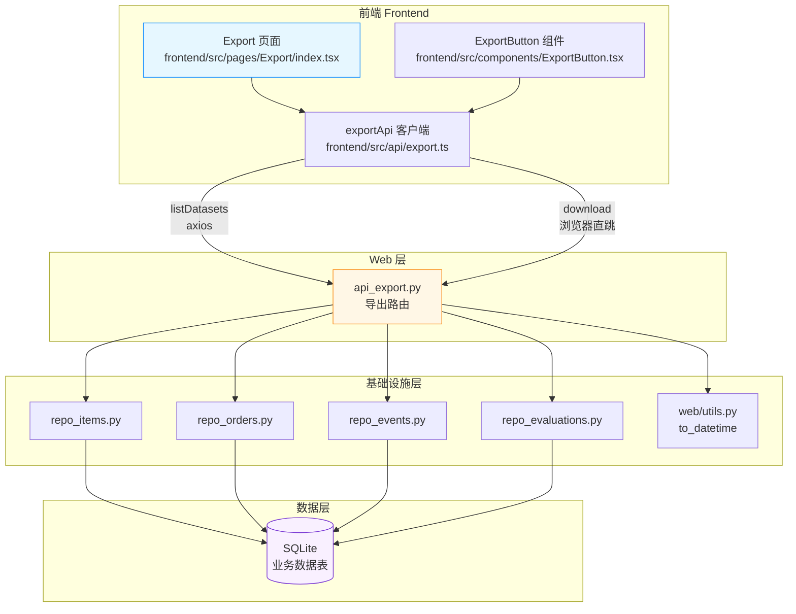

# 闲鱼猎人 · 数据导出 需求规格说明书

| 项 | 内容 |
|---|---|
| 文档版本 | v1.0 |
| 文档日期 | 2026-07-05 |
| 文档状态 | 与代码 v1.0 实现同步 |
| 所属项目 | 闲鱼猎人（XianyuHunter） |
| 所属菜单 | 其他（侧边栏「其他」→「数据导出」） |
| 关联路由 | 前端 `/export`；后端 `/api/export`、`/api/export/{dataset}` |
| 文档类型 | 需求规格说明书（SRS） |
| 关联文档 | [数据导出-详细设计.md](./数据导出-详细设计.md) |

---

## 目录

- [1. 引言](#1-引言)
  - [1.1 编写目的](#11-编写目的)
  - [1.2 项目背景](#12-项目背景)
  - [1.3 范围与约束](#13-范围与约束)
  - [1.4 术语与缩写](#14-术语与缩写)
  - [1.5 参考资料](#15-参考资料)
- [2. 总体描述](#2-总体描述)
  - [2.1 产品定位](#21-产品定位)
  - [2.2 用户角色与特征](#22-用户角色与特征)
  - [2.3 运行环境](#23-运行环境)
  - [2.4 设计约束](#24-设计约束)
  - [2.5 假设与依赖](#25-假设与依赖)
- [3. 总体架构设计](#3-总体架构设计)
  - [3.1 模块架构图](#31-模块架构图)
  - [3.2 数据流程图](#32-数据流程图)
  - [3.3 模块分层与职责](#33-模块分层与职责)
- [4. 功能需求](#4-功能需求)
  - [4.1 入口与页面布局](#41-入口与页面布局)
  - [4.2 数据集定义](#42-数据集定义)
  - [4.3 筛选条件](#43-筛选条件)
  - [4.4 CSV 导出](#44-csv-导出)
  - [4.5 列定义预览](#45-列定义预览)
  - [4.6 与 ExportButton 的关系](#46-与-exportbutton-的关系)
  - [4.7 错误处理与兜底](#47-错误处理与兜底)
  - [4.8 国际化与可达性](#48-国际化与可达性)
- [5. 接口定义](#5-接口定义)
  - [5.1 列定义预览接口](#51-列定义预览接口)
  - [5.2 CSV 导出接口](#52-csv-导出接口)
  - [5.3 前端 API 客户端契约](#53-前端-api-客户端契约)
- [6. 数据模型](#6-数据模型)
  - [6.1 数据集与列定义](#61-数据集与列定义)
  - [6.2 字段类型映射](#62-字段类型映射)
- [7. 性能指标](#7-性能指标)
- [8. 安全要求](#8-安全要求)
- [9. 验收标准](#9-验收标准)
  - [9.1 功能验收](#91-功能验收)
  - [9.2 性能验收](#92-性能验收)
  - [9.3 兼容性验收](#93-兼容性验收)
  - [9.4 代码质量验收](#94-代码质量验收)
- [10. 附录](#10-附录)
  - [10.1 DATASET_FILTERS 筛选字段矩阵](#101-dataset_filters-筛选字段矩阵)
  - [10.2 CSV 格式规范示例](#102-csv-格式规范示例)
  - [10.3 错误码与状态码](#103-错误码与状态码)
  - [10.4 关键文件清单](#104-关键文件清单)

---

## 1. 引言

### 1.1 编写目的

本需求规格说明书定义"闲鱼猎人"项目中"数据导出"二级菜单（属于"其他"菜单分组）的完整需求规格，作为后续设计、开发、测试与验收的唯一依据。

**目标读者**：
- 后端开发工程师：依据 §3-§6、§8、§9.1-§9.3 进行接口实现
- 前端开发工程师：依据 §4.1-§4.7、§5.3 进行页面与 API 客户端实现
- 测试工程师：依据 §9.1-§9.4 编写测试用例与执行验收
- 产品/项目经理：依据 §2、§9.1 进行范围与里程碑管理

### 1.2 项目背景

闲鱼猎人是一个闲鱼自动捡漏与抢单工具，已具备任务管理、商品采集、AI 评估、自动下单、多渠道通知等完整能力。系统在持续运行中产生大量业务数据：

| 数据类型 | 用途 | 数量级 |
|---|---|---|
| 商品列表（items） | 任务采集的原始数据，含价格、卖家、发布时间 | 每日数千~数万行 |
| 评估记录（evaluations） | AI 评估的中间结果与最终决策 | 与 items 1:1 |
| 订单记录（orders） | 抢单成功/失败的订单 | 每日数十~数百行 |
| 事件日志（events） | 系统运行事件，含风控/通知/异常 | 每日数千行 |

**用户痛点**：
1. **缺乏离线分析手段**：业务数据全部存储在 SQLite 中，无法用 Excel/第三方 BI 工具做离线复盘、趋势分析
2. **嵌入式 ExportButton 局限**：仅能在当前业务页按上下文过滤导出，无法跨数据集或自定义复杂筛选
3. **列定义不透明**：用户不知道每个数据集具体有哪些字段，导出后才发现列缺失
4. **Excel 中文乱码**：用户期望导出 CSV 直接在 Excel/Numbers 打开，但缺 BOM 头时中文会乱码

**解决方案**：提供"数据导出"独立菜单页面，支持 4 个数据集完整筛选条件 + 列定义预览 + UTF-8 BOM CSV 输出。

### 1.3 范围与约束

#### 1.3.1 包含范围

- 4 个数据集（items / evaluations / orders / events）的 CSV 导出
- 任务 ID、时间范围、订单状态、事件等级、行数上限 5 个筛选维度
- 列定义预览接口（导出前确认字段）
- 与现有 ExportButton 组件共存
- 认证授权与基础错误处理

#### 1.3.2 排除范围

- **不实现** Excel 原生格式（.xlsx）：仅导出 CSV，依赖 Excel/Numbers/WPS 打开
- **不实现** 导出任务异步化与进度推送：CSV 生成同步完成，单次响应返回完整文件
- **不实现** 用户级数据隔离：当前单用户场景，所有通过认证的用户可导出全量数据
- **不实现** 导出历史记录与定时导出
- **不实现** 字段自定义选择：列定义固定，不暴露列选择 UI
- **不实现** 大数据量分片/分页导出：受单次响应 50000 行上限限制

#### 1.3.3 硬约束

继承 [project_memory.md](file:///c:/Users/hspcadmin/.trae-cn/memory/projects/-d-code-otherProjects-17-xianyu/project_memory.md) 中的全部项目硬约束，并显式映射到本模块实现：

| 硬约束 | 本模块适用性 | 实现要点 |
|--------|--------------|----------|
| Web 进程使用 `with_browser=False` 模式 | 适用 | 导出模块不依赖浏览器 |
| 认证白名单（`/api/auth/cookie` 等） | 适用 | `/api/export` **不加入** 白名单，必须认证 |
| 前端 fetch 必须含 `credentials: 'include'` | 适用 | `frontend/src/api/client.ts` 已配置 `withCredentials: true` |
| 401 响应必须返回 JSON `{"detail": "Unauthorized"}` | 适用 | 复用现有认证中间件 |
| 后端 token 比较使用 `hmac.compare_digest()` | 适用 | 复用现有 auth.py |
| 敏感字段（token 长度等）不日志 | 适用 | 导出路由仅记录 dataset/limit/行数，不记录筛选值 |
| 缺失 import 必须 module-level | 适用 | `api_export.py` 全部模块级 import |
| DB 索引优化 COUNT 查询 | 适用 | 4 个数据集的查询列均有索引（task_id、created_at、status、level） |
| COUNT 查询用 CASE WHEN 聚合 | 不适用 | 本模块不返回 count，仅返回 rows |

### 1.4 术语与缩写

| 术语 | 全称 | 说明 |
|------|------|------|
| 数据集 | Dataset | 可导出的业务数据集合，本系统有 items/evaluations/orders/events 4 个 |
| 列定义 | Column Definition | 数据集包含的字段列表，顺序即 CSV 列顺序 |
| 筛选 | Filter | 导出前对数据行的过滤条件（task_id/time/status/level/limit） |
| BOM | Byte Order Mark | UTF-8 文件头标识 `\ufeff`，让 Excel 正确识别 UTF-8 编码 |
| URL 直跳 | Direct URL Navigation | 浏览器原生 GET 请求触发文件下载，绕过 axios |
| 流式响应 | Streaming Response | FastAPI `StreamingResponse` 流式输出 CSV 文本 |

### 1.5 参考资料

| 文档 | 路径 | 用途 |
|------|------|------|
| 详细设计文档 | [docs/05-其他/数据导出-详细设计.md](./数据导出-详细设计.md) | 本文档配套详细设计 |
| 总体需求 | [docs/requirements.md](file:///d:/code/otherProjects/17_xianyu/docs/requirements.md) | 系统整体需求基线 |
| 概要设计 | [docs/概要设计文档.md](file:///d:/code/otherProjects/17_xianyu/docs/概要设计文档.md) | 系统架构与模块划分 |
| 目录结构规范 | [docs/standards/directory-structure.md](file:///d:/code/otherProjects/17_xianyu/docs/standards/directory-structure.md) | 文档目录与命名规范 |
| 部署指南 | [docs/standards/deployment.md](file:///d:/code/otherProjects/17_xianyu/docs/standards/deployment.md) | 部署与运行 |
| 后端导出路由 | [src/xianyu_hunter/web/routes/api_export.py](file:///d:/code/otherProjects/17_xianyu/src/xianyu_hunter/web/routes/api_export.py) | 后端实现 |
| 前端导出页面 | [frontend/src/pages/Export/index.tsx](file:///d:/code/otherProjects/17_xianyu/frontend/src/pages/Export/index.tsx) | 前端实现 |
| 前端 API 客户端 | [frontend/src/api/export.ts](file:///d:/code/otherProjects/17_xianyu/frontend/src/api/export.ts) | API 客户端 |
| ExportButton 组件 | [frontend/src/components/ExportButton.tsx](file:///d:/code/otherProjects/17_xianyu/frontend/src/components/ExportButton.tsx) | 嵌入式导出按钮 |
| 认证中间件 | [src/xianyu_hunter/web/middleware/auth.py](file:///d:/code/otherProjects/17_xianyu/src/xianyu_hunter/web/middleware/auth.py) | 认证与白名单 |
| 时间工具 | [src/xianyu_hunter/web/utils.py](file:///d:/code/otherProjects/17_xianyu/src/xianyu_hunter/web/utils.py) | `to_datetime` / `parse_iso_datetime` |
| 菜单元数据 | [config/menu_registry.yaml](file:///d:/code/otherProjects/17_xianyu/config/menu_registry.yaml) | 侧边栏菜单一事实源 |

---

## 2. 总体描述

### 2.1 产品定位

"数据导出"是闲鱼猎人系统的**业务数据离线分析入口**，定位为：

> 将系统持续产生的商品、评估、订单、事件四类业务数据按用户自定义筛选条件导出为 Excel/Numbers 友好的 CSV 文件，供用户离线复盘、趋势分析与归档。

**核心价值**：
1. **跨数据集统一入口**：一个页面覆盖全部 4 类业务数据，避免在多个业务页之间来回切换
2. **完整筛选条件**：相比嵌入式 ExportButton，提供 task_id / 时间范围 / 状态 / 等级 / 行数上限全维度筛选
3. **编码无忧**：UTF-8 BOM + 标准 CSV，Excel/Numbers/WPS 打开零乱码
4. **零数据访问层冗余**：完全复用现有 Repository 查询方法
5. **低资源占用**：浏览器原生下载，绕过 JS 堆内存

### 2.2 用户角色与特征

| 角色 | 特征 | 使用场景 | 关注重点 |
|------|------|----------|----------|
| 运维/分析人员 | 关注系统运行数据 | 复盘失败订单、排查异常事件 | 时间范围、状态/等级筛选 |
| 业务运营 | 关注商品采集质量 | 离线分析某任务下所有商品 | task_id 筛选、大批量导出 |
| 二次开发者 | 关注 AI 评估效果 | 分析评估分数分布与拒绝原因 | evaluations 数据集 |
| 故障排查者 | 关注系统异常 | 导出当日 error 事件 | events.level=error + 当日范围 |

### 2.3 运行环境

| 项 | 要求 |
|---|---|
| 操作系统 | Windows 10/11（主）、Linux、macOS |
| Python | 3.11+ |
| Node.js | 18+（仅前端构建） |
| 后端框架 | FastAPI（已集成） |
| 前端框架 | React 18 + TypeScript + Ant Design 5（已集成） |
| 数据库 | SQLite（复用现有 db_models.py） |
| 浏览器 | Chrome / Edge ≥ 90（主）、Firefox ≥ 88、Safari ≥ 14 |

### 2.4 设计约束

1. **集成部署**：作为 `src/xianyu_hunter/web/routes/api_export.py` 集成到现有 Web 层
2. **复用现有 Repository**：items/orders/evaluations/events 查询均通过现有 `repo_*.py`，不新增 DAO
3. **复用认证体系**：复用 `auth.py` 中间件，导出接口在白名单外
4. **零前端新依赖**：仅使用 Ant Design 5 与 dayjs（已存在），不引入新库
5. **独立菜单页面**：在侧边栏"其他"分组下提供独立 `/export` 路由，与 ExportButton 共存
6. **CSV 优先**：首版仅实现 CSV 格式，不引入 .xlsx 生成依赖
7. **同步流式响应**：单次请求返回完整 CSV，使用 FastAPI StreamingResponse（实际为单次 StringIO 包装）

### 2.5 假设与依赖

**假设**：
- 用户已登录并持有有效 token（cookie 或 Bearer header）
- 用户使用支持 UTF-8 BOM 解析的现代电子表格软件（Excel 2016+ / Numbers / WPS）
- 单次导出数据量不超过 50000 行（超出建议分多次按时间范围导出）
- 浏览器允许文件下载（默认行为）

**依赖**：
- 现有 `ItemsMixin.list_items` / `OrdersMixin.list_orders` / `EventsMixin.list_events`
- 现有 `ItemRow` / `OrderRow` / `EventRow` / `EvaluationRow` ORM 模型
- 现有 `web.utils.to_datetime` 时间解析工具
- 现有 FastAPI Query 校验机制
- 现有 `BearerAuthMiddleware` 认证中间件

---

## 3. 总体架构设计

### 3.1 模块架构图



### 3.2 数据流程图

```mermaid
flowchart TB
    subgraph 输入
        U[用户进入 /export 页面]
    end

    subgraph "前端 Export Page"
        S1[1. useEffect 拉取列定义]
        S2[2. 渲染 4 张数据集卡片]
        S3[3. 用户填写筛选条件]
        S4[4. 点击导出按钮]
        S5[5. 构造 ExportParams<br/>仅含非空字段]
        S6[6. globalThis.location.href<br/>= buildUrl]
    end

    subgraph "后端 API"
        R1[1. 认证中间件校验]
        R2{2. dataset 合法?}
        R3[3. 按 dataset 分发查询分支]
        R4[4. Repository 查询]
        R5[5. _filter_by_time<br/>Python 端时间过滤]
        R6[6. _build_csv_response<br/>生成 UTF-8 BOM CSV]
        R7[7. StreamingResponse 返回]
    end

    subgraph 输出
        F[浏览器触发文件下载<br/>xh-{dataset}-{YYYYMMDD-HHMMSS}.csv]
    end

    U --> S1
    S1 -->|GET /api/export| R1
    R1 --> R2
    R2 -->|返回列定义 JSON| S2
    S2 --> S3
    S3 --> S4
    S4 --> S5
    S5 --> S6
    S6 -->|GET /api/export/{dataset}?<br/>task_id=...&start=...&end=...&status=...&level=...&limit=...| R1
    R1 --> R2
    R2 --> R3
    R3 --> R4
    R4 --> R5
    R5 --> R6
    R6 --> R7
    R7 --> F

    style S6 fill:#fff7e6
    style R6 fill:#f6ffed
    style F fill:#f9f0ff
```

### 3.3 模块分层与职责

遵循项目现有分层架构：

| 层级 | 模块 | 职责 |
|------|------|------|
| **Web 层** | `api_export.py` | 暴露 2 个端点：列定义预览 + CSV 导出；按 dataset 分发到 4 条查询分支；时间过滤；CSV 生成 |
| **基础设施层** | `repo_items.py` `repo_orders.py` `repo_events.py` `repo_evaluations.py` | 已有 Repository 查询方法（**不新增 DAO**） |
| | `web/utils.py` | `to_datetime` 时间解析（aware datetime，与行内时间字段比较无 TypeError） |
| **前端 API 层** | `api/export.ts` | `exportApi` 对象：listDatasets / buildUrl / download |
| **前端 UI 层** | `pages/Export/index.tsx` | 4 张数据集卡片 + 筛选表单 + 导出按钮 |
| | `components/ExportButton.tsx` | 嵌入式导出按钮（Items / Evaluations 页） |

---

## 4. 功能需求

### 4.1 入口与页面布局

**FR-4.1.1 菜单入口**
- 侧边栏"其他"分组下新增"数据导出"菜单项
- 图标：`CloudDownloadOutlined`
- 路由：`/export`
- 菜单元数据来源：`config/menu_registry.yaml`（`key=export`、`category=other`、`sort_order=302`）

**FR-4.1.2 页面结构**
- 页面标题"数据导出"+ 副标题说明（CSV Excel/Numbers 友好，含 UTF-8 BOM）
- 4 张数据集卡片（Row + Col，xs=24 / lg=12，每行 2 张）
- 加载态：AntD `Spin` 居中，tip="加载数据集..."

**FR-4.1.3 卡片组件树**
每张卡片包含：
- 头部：主题色图标 + 中文标题 + Tag（数据集 key）
- 描述段落（来自后端 `_DATASET_DESCRIPTIONS`）
- 列定义预览：Tag 列表，按后端返回顺序展示
- 筛选表单：依 `DATASET_FILTERS` 显隐对应控件
  - 任务 ID 输入框（Input，allowClear，size=small）
  - 时间范围 RangePicker（showTime，YYYY-MM-DDTHH:mm:ss）
  - 订单状态输入框（仅 orders 卡片）
  - 事件等级输入框（仅 events 卡片）
  - 行数上限 InputNumber（min=1，max=50000，默认 5000）
- 操作区：「导出 CSV」主按钮（Button，type=primary，icon=DownloadOutlined）

**FR-4.1.4 主题色映射**
| 数据集 | 中文标题 | 主题色 |
|---|---|---|
| items | 商品列表 | `#1677ff`（蓝） |
| evaluations | 评估记录 | `#722ed1`（紫） |
| orders | 订单记录 | `#fa8c16`（橙） |
| events | 事件日志 | `#13c2c2`（青） |

### 4.2 数据集定义

**FR-4.2.1 4 个数据集**

| 数据集 key | 中文标题 | 列数 | 默认排序字段 | 描述 |
|---|---|---|---|---|
| `items` | 商品列表 | 11 | `first_seen` 倒序 | 商品列表（含价格、卖家、发布时间） |
| `evaluations` | 评估记录 | 8 | `created_at` 倒序 | 评估记录（含评分、风险等级、拒绝原因） |
| `orders` | 订单记录 | 10 | `created_at` 倒序 | 订单记录（含订单号、价格、状态、时间） |
| `events` | 事件日志 | 8 | `created_at` 倒序 | 事件日志（含类型、等级、消息） |

**FR-4.2.2 列定义来源**
- 单一事实源：后端 `api_export.py` 的 `_DATASET_COLUMNS` 字典
- 列顺序：与代码中数组顺序完全一致，不按字母重排
- 前端通过 `GET /api/export` 拉取并展示

**FR-4.2.3 各数据集列定义（详见详细设计 §5.2-§5.5）**
- items：id, task_id, title, price, publish_time, region, seller_id, want_cnt, view_cnt, first_seen, last_seen
- evaluations：id, item_id, seller_id, score, risk_level, dimension_scores, reject_reasons, created_at
- orders：id, task_id, item_id, seller_id, order_no, price, status, confirmed_at, paid_at, created_at
- events：id, type, task_id, item_id, stage, level, message, created_at

### 4.3 筛选条件

**FR-4.3.1 筛选字段矩阵（DATASET_FILTERS）**

| 数据集 | task_id | time | status | level |
|---|---|---|---|---|
| items | ✅ | ✅ | ❌ | ❌ |
| evaluations | ✅ | ✅ | ❌ | ❌ |
| orders | ✅ | ✅ | ✅ | ❌ |
| events | ✅ | ✅ | ❌ | ✅ |

**FR-4.3.2 各筛选字段规范**

| 字段 | 控件 | 类型 | 必填 | 默认 | 校验 |
|---|---|---|---|---|---|
| `task_id` | Input（allowClear） | string | 否 | 空 | 自由文本，留空不过滤 |
| `time` | RangePicker（showTime） | `[Dayjs, Dayjs]` | 否 | 空 | 输出 `YYYY-MM-DDTHH:mm:ss`，闭区间 |
| `status` | Input（allowClear） | string | 否 | 空 | 仅 orders；如 `succeeded`/`failed`/`pending`/`takeover_pending` |
| `level` | Input（allowClear） | string | 否 | 空 | 仅 events；如 `info`/`warning`/`error` |
| `limit` | InputNumber | int | 否 | 5000 | min=1，max=50000，空值回退 5000 |

**FR-4.3.3 时间范围字段映射**

| 数据集 | 时间过滤字段 |
|---|---|
| items | `first_seen` |
| evaluations | `created_at` |
| orders | `created_at` |
| events | `created_at` |

**FR-4.3.4 筛选条件保留**
- 4 个数据集的筛选条件分别存于 `filters` state，切换卡片不会丢失输入
- 切换数据集卡片：各自的输入保留

### 4.4 CSV 导出

**FR-4.4.1 导出流程**
1. 用户填写筛选条件
2. 点击"导出 CSV"按钮
3. 前端构造 `ExportParams`（仅包含非空 trim 字段）
4. `globalThis.location.href = buildUrl(dataset, params)` 浏览器直跳
5. 后端认证 → 校验 dataset → 查询 → 时间过滤 → CSV 生成 → StreamingResponse
6. 浏览器原生下载文件

**FR-4.4.2 CSV 编码规范**
- 字符编码：UTF-8
- BOM 头：`\ufeff`（写入 StringIO 开头）
- 兼容性：Excel / Numbers / WPS / Google Sheets
- 媒体类型：`text/csv; charset=utf-8`

**FR-4.4.3 CSV 文件命名**
- 规则：`xh-{dataset}-{YYYYMMDD-HHMMSS}.csv`
- 示例：`xh-items-20260705-103045.csv`
- 时间戳取服务端 `datetime.now()`

**FR-4.4.4 CSV 空值处理**
| 情况 | CSV 单元格内容 |
|---|---|
| 字段缺失 | 空字符串 `""` |
| 字段为 `None` | 空字符串 `""` |
| 字段为 `0` / `False` | 原值 |
| 时间字段为 `None` | 空字符串 |
| 整行被时间过滤跳过 | 不写入 |

**FR-4.4.5 特殊字段序列化**
- `dimension_scores` / `reject_reasons`：直接 `str(dict)`/`str(list)`（含 Python 单引号，非标准 JSON）
- `publish_time` / 时间字段：`str(datetime)`（如 `2026-07-05 10:30:45`）

**FR-4.4.6 URL 直跳导出（核心设计）**
- 使用 `globalThis.location.href = buildUrl(...)` 而非 axios blob 下载
- 原因：
  1. CSV 流式响应由浏览器原生处理，避免大文件 blob 占用 JS 堆内存
  2. 自动触发浏览器下载 UI，无需手写 `saveAs` 逻辑
  3. 同源请求自动携带 `xh_token` cookie，无需额外 header
- 局限：浏览器原生下载无法捕获 HTTP 错误响应，失败时浏览器会显示错误页

**FR-4.4.7 导出反馈**
- 触发后立即 `message.success('正在导出 XX...')`
- 成功/失败回调无法获取（URL 直跳限制）

### 4.5 列定义预览

**FR-4.5.1 接口调用**
- 进入页面时 `useEffect` 自动调用 `exportApi.listDatasets()`
- 接口：`GET /api/export`（不带任何参数）

**FR-4.5.2 数据展示**
- 在每张卡片头部下方以 Tag 列表展示字段顺序
- 顺序与 CSV 实际列顺序一致
- 帮助用户在导出前确认字段

**FR-4.5.3 拉取失败兜底**
- 接口失败时使用静态列定义兜底（见详细设计 §11.2）
- 保证页面仍可渲染

### 4.6 与 ExportButton 的关系

**FR-4.6.1 ExportButton 组件定位**
- 嵌入式按钮，挂在其他业务页工具栏
- 提供"当前页上下文一键导出"能力
- 已在 Items 页（`ItemList.tsx`）和 Evaluations 页（`Evaluations/index.tsx`）中嵌入

**FR-4.6.2 差异对比**

| 维度 | ExportButton（嵌入式） | ExportPage（独立页面） |
|---|---|---|
| 路由 | 无（嵌入其他页面） | `/export` |
| 入口 | 业务页工具栏 | 侧边栏"其他"→"数据导出" |
| 筛选来源 | 调用方传入 params | 用户在页面表单中自由填写 |
| 列定义预览 | 不展示 | 展示（Tag 列表） |
| 行数上限 | 不暴露（默认 5000） | 暴露 InputNumber，1~50000 可调 |
| 时间范围选择 | 不暴露（调用方传入） | 暴露 RangePicker（含 showTime） |
| 适用场景 | 业务页"我正在看 X，导出当前 X" | 跨数据集 / 复杂筛选 / 大批量导出 |

**FR-4.6.3 共用底层**
- 两者均通过 `exportApi.download(dataset, params)` 触发下载
- 最终命中同一后端路由 `GET /api/export/{dataset}`
- CSV 生成逻辑完全一致

### 4.7 错误处理与兜底

**FR-4.7.1 错误场景与响应**

| 场景 | 触发位置 | HTTP 状态码 | 响应体 | 前端表现 |
|---|---|---|---|---|
| 未认证 | 认证中间件 | 401 | `{"detail":"Unauthorized"}` | axios 拦截器跳转 `/login?redirect=...` |
| 数据集 key 非法 | 路由 export_dataset | 400 | `{"detail":"未知数据集 xxx，可用: ['items', 'evaluations', 'orders', 'events']"}` | 浏览器显示错误页 |
| limit 超出范围 | FastAPI Query 校验 | 422 | FastAPI 自动生成的校验错误体 | 浏览器显示错误页 |
| 列定义接口失败 | 前端 useEffect | - | - | 使用静态列定义兜底 |
| 导出 URL 触发后服务端错误 | 浏览器 | - | - | 浏览器显示错误页，前端 `message.success` 已先弹出 |

**FR-4.7.2 空数据处理**
- 查询结果为空时，CSV 仅包含表头一行（无数据行）
- 仍返回 200 OK 并触发下载
- 前端**不**预先检查行数，避免额外 count 查询

**FR-4.7.3 超限提示**
- 前端 `InputNumber` 通过 `min`/`max` 限制输入范围
- 后端 `Query(5000, ge=1, le=50000)` 兜底校验
- 超出返回 422

### 4.8 国际化与可达性

**FR-4.8.1 国际化（i18n）**
- 首版仅中文（与项目其他页一致）
- 文案集中在 `frontend/src/pages/Export/index.tsx` 组件内，未抽离 i18n 文件
- 后续接入 i18n 框架时需统一提取

**FR-4.8.2 可达性（a11y）**
- 复用 Ant Design 5 组件的默认可达性能力
- 筛选控件需含 label 或 placeholder 描述
- 主按钮需有明确 aria-label

**FR-4.8.3 暗色主题**
- 复用 `ThemeContext`（亮/暗双主题）
- 卡片背景、文字、按钮颜色自动适配
- CSV 导出本身不受主题影响

---

## 5. 接口定义

### 5.1 列定义预览接口

#### GET `/api/export`

**描述**：列出可导出的数据集及列定义

**认证**：需要（不在 `PUBLIC_PREFIXES` 白名单）

**请求参数**：无

**响应**（200 OK）：

```json
{
  "datasets": [
    {
      "key": "items",
      "columns": ["id", "task_id", "title", "price", "publish_time", "region",
                  "seller_id", "want_cnt", "view_cnt", "first_seen", "last_seen"],
      "description": "商品列表（含价格、卖家、发布时间）"
    },
    {
      "key": "evaluations",
      "columns": ["id", "item_id", "seller_id", "score", "risk_level",
                  "dimension_scores", "reject_reasons", "created_at"],
      "description": "评估记录（含评分、风险等级、拒绝原因）"
    },
    {
      "key": "orders",
      "columns": ["id", "task_id", "item_id", "seller_id", "order_no",
                  "price", "status", "confirmed_at", "paid_at", "created_at"],
      "description": "订单记录（含订单号、价格、状态、时间）"
    },
    {
      "key": "events",
      "columns": ["id", "type", "task_id", "item_id", "stage",
                  "level", "message", "created_at"],
      "description": "事件日志（含类型、等级、消息）"
    }
  ]
}
```

**字段说明**：

| 字段 | 类型 | 说明 |
|---|---|---|
| `datasets` | array | 数据集列表（顺序固定为 items/evaluations/orders/events） |
| `datasets[].key` | string | 数据集标识（`items`/`evaluations`/`orders`/`events`） |
| `datasets[].columns` | string[] | 列定义数组（顺序即 CSV 列顺序） |
| `datasets[].description` | string | 中文描述（来自 `_DATASET_DESCRIPTIONS`） |

**错误响应**：
- 401 Unauthorized：未携带 token 或 token 无效
  ```json
  {"detail": "Unauthorized"}
  ```

### 5.2 CSV 导出接口

#### GET `/api/export/{dataset}`

**描述**：导出指定数据集为 CSV 文件

**认证**：需要

**路径参数**：

| 参数 | 类型 | 必填 | 说明 |
|---|---|---|---|
| `dataset` | string | 是 | 数据集 key，必须 ∈ `{items, evaluations, orders, events}` |

**Query 参数**：

| 参数 | 类型 | 必填 | 默认值 | 校验规则 | 说明 |
|---|---|---|---|---|---|
| `task_id` | string | 否 | None | - | 按任务 ID 过滤（items/orders/events 支持；evaluations 通过 items 间接关联） |
| `start` | string | 否 | None | ISO 格式（如 `2026-06-01T00:00:00`） | 起始时间（含），按对应时间字段过滤 |
| `end` | string | 否 | None | ISO 格式 | 截止时间（含），按对应时间字段过滤 |
| `status` | string | 否 | None | - | 订单状态过滤（仅 orders 数据集生效） |
| `level` | string | 否 | None | - | 事件等级过滤（仅 events 数据集生效） |
| `limit` | int | 否 | 5000 | `ge=1`、`le=50000` | 最大导出行数 |

**响应**：
- **200 OK**：返回 `StreamingResponse`，`media_type="text/csv; charset=utf-8"`
  - 响应头：`Content-Disposition: attachment; filename="xh-{dataset}-{YYYYMMDD-HHMMSS}.csv"`
  - 响应体：UTF-8 BOM + CSV 文本流
- **400 Bad Request**：`dataset` 不在白名单
  ```json
  { "detail": "未知数据集 xxx，可用: ['items', 'evaluations', 'orders', 'events']" }
  ```
- **422 Unprocessable Entity**：`limit` 超出 `ge=1`/`le=50000` 范围（FastAPI 自动返回）
- **401 Unauthorized**：未携带 token 或 token 无效
  ```json
  { "detail": "Unauthorized" }
  ```

### 5.3 前端 API 客户端契约

`frontend/src/api/export.ts` 暴露 `exportApi` 对象：

| 方法 | 签名 | 说明 |
|---|---|---|
| `listDatasets` | `() => Promise<{ datasets: ExportDatasetInfo[] }>` | 拉取列定义 |
| `buildUrl` | `(dataset, params?) => string` | 构造导出 URL（不触发下载） |
| `download` | `(dataset, params?) => void` | 触发浏览器直跳下载（`globalThis.location.href`） |

**TypeScript 类型定义**：

```typescript
export type ExportDataset = 'items' | 'evaluations' | 'orders' | 'events'

export interface ExportDatasetInfo {
  key: ExportDataset
  columns: string[]
  description: string
}

export interface ExportParams {
  /** 按任务 ID 过滤（items/orders/events 支持） */
  task_id?: string
  /** 起始时间 ISO 格式（如 2026-06-01T00:00:00） */
  start?: string
  /** 截止时间 ISO 格式 */
  end?: string
  /** 订单状态过滤（仅 orders） */
  status?: string
  /** 事件等级过滤（仅 events） */
  level?: string
  /** 最大导出行数（默认 5000，上限 50000） */
  limit?: number
}
```

---

## 6. 数据模型

### 6.1 数据集与列定义

数据集与列定义完全由后端 `api_export.py` 的 `_DATASET_COLUMNS` 字典单一事实源定义，**前端不维护副本**（仅保留静态列定义作为拉取失败兜底）。

```python
# 伪代码示意（src/xianyu_hunter/web/routes/api_export.py）
_DATASET_COLUMNS: dict[str, list[str]] = {
    "items": ["id", "task_id", "title", "price", "publish_time", "region",
              "seller_id", "want_cnt", "view_cnt", "first_seen", "last_seen"],
    "evaluations": ["id", "item_id", "seller_id", "score", "risk_level",
                    "dimension_scores", "reject_reasons", "created_at"],
    "orders": ["id", "task_id", "item_id", "seller_id", "order_no",
               "price", "status", "confirmed_at", "paid_at", "created_at"],
    "events": ["id", "type", "task_id", "item_id", "stage",
               "level", "message", "created_at"],
}
```

### 6.2 字段类型映射

| 数据集 | 列 | 类型 | 来源 |
|---|---|---|---|
| items | id | TEXT | ItemRow.id |
| items | task_id | TEXT | ItemRow.task_id |
| items | title | TEXT | ItemRow.title |
| items | price | REAL | ItemRow.price |
| items | publish_time | DATETIME | ItemRow.publish_time |
| items | region | TEXT | ItemRow.region |
| items | seller_id | TEXT | ItemRow.seller_id |
| items | want_cnt | INTEGER | ItemRow.want_cnt |
| items | view_cnt | INTEGER | ItemRow.view_cnt |
| items | first_seen | DATETIME | ItemRow.first_seen（时间过滤字段） |
| items | last_seen | DATETIME | ItemRow.last_seen |
| evaluations | id | INTEGER | EvaluationRow.id |
| evaluations | item_id | TEXT | EvaluationRow.item_id |
| evaluations | seller_id | TEXT | EvaluationRow.seller_id |
| evaluations | score | INTEGER | EvaluationRow.score |
| evaluations | risk_level | TEXT | EvaluationRow.risk_level |
| evaluations | dimension_scores | JSON | EvaluationRow.dimension_scores |
| evaluations | reject_reasons | JSON | EvaluationRow.reject_reasons |
| evaluations | created_at | DATETIME | EvaluationRow.created_at（时间过滤字段） |
| orders | id | TEXT | OrderRow.id |
| orders | task_id | TEXT | OrderRow.task_id |
| orders | item_id | TEXT | OrderRow.item_id |
| orders | seller_id | TEXT | OrderRow.seller_id |
| orders | order_no | TEXT | OrderRow.order_no |
| orders | price | REAL | OrderRow.price |
| orders | status | TEXT | OrderRow.status |
| orders | confirmed_at | DATETIME | OrderRow.confirmed_at |
| orders | paid_at | DATETIME | OrderRow.paid_at |
| orders | created_at | DATETIME | OrderRow.created_at（时间过滤字段） |
| events | id | INTEGER | EventRow.id |
| events | type | TEXT | EventRow.type |
| events | task_id | TEXT | EventRow.task_id |
| events | item_id | TEXT | EventRow.item_id |
| events | stage | TEXT | EventRow.stage |
| events | level | TEXT | EventRow.level |
| events | message | TEXT | EventRow.message |
| events | created_at | DATETIME | EventRow.created_at（时间过滤字段） |

---

## 7. 性能指标

### 7.1 响应时间

| 指标 | P50 目标 | P95 目标 | 说明 |
|---|---|---|---|
| 列定义接口 `GET /api/export` | ≤ 30ms | ≤ 80ms | 纯静态字典返回 |
| CSV 导出（5000 行） | ≤ 500ms | ≤ 1.5s | 含 Repository 查询 + Python 端过滤 + CSV 生成 |
| CSV 导出（50000 行极限） | ≤ 3s | ≤ 6s | 大量行的 SQL + Python 处理 |

### 7.2 资源占用

| 指标 | 上限 | 说明 |
|---|---|---|
| 单次导出内存占用 | ≤ 50MB | 50000 行 × 约 1KB/行 |
| CSV 文件大小 | 视数据而定 | UTF-8 BOM 3 字节 + 表头 + 数据行 |
| 浏览器 JS 堆内存 | 0 增量 | URL 直跳不占用 JS blob 内存 |

### 7.3 吞吐量

| 指标 | 目标值 | 控制机制 |
|---|---|---|
| 并发导出请求 | ≥ 3（单机） | FastAPI 默认并发；当前无显式限流 |
| 单数据集查询耗时 | ≤ 500ms | Repository 索引 + LIMIT 限制 |

---

## 8. 安全要求

### 8.1 认证与授权

- **SR-8.1.1**：`/api/export` 与 `/api/export/{dataset}` **不加入** `PUBLIC_PREFIXES` 白名单，必须通过 `BearerAuthMiddleware` 认证
- **SR-8.1.2**：token 比较使用 `hmac.compare_digest()`（遵循项目硬约束，复用 auth.py）
- **SR-8.1.3**：401 响应必须返回 JSON `{"detail": "Unauthorized"}`（遵循项目硬约束）
- **SR-8.1.4**：路径 token 校验优先级：Authorization header（`Bearer xxx`） > `xh_token` cookie

### 8.2 数据安全

- **SR-8.2.1**：用户级数据隔离**未实现**，所有通过认证的用户可导出全量数据（本地工具场景设计权衡）
- **SR-8.2.2**：导出日志仅记录 `dataset` / `limit` / 实际行数，**不记录** `task_id` / `start` / `end` / `status` / `level` 等筛选值（避免业务信息泄露到日志）
- **SR-8.2.3**：敏感字段（token、cookie）不写入导出内容（不在数据模型范围内）
- **SR-8.2.4**：`dimension_scores` / `reject_reasons` 按数据库原值导出（Python 字面量），不含敏感凭据

### 8.3 输入校验

- **SR-8.3.1**：`dataset` 路径参数必须 ∈ `{items, evaluations, orders, events}`，否则返回 400
- **SR-8.3.2**：`limit` 参数必须 `1 ≤ limit ≤ 50000`，否则 FastAPI 返回 422
- **SR-8.3.3**：`start` / `end` 必须是 ISO 格式（FastAPI 自动校验），否则返回 422
- **SR-8.3.4**：`task_id` / `status` / `level` 为自由文本，无格式校验

### 8.4 输出安全

- **SR-8.4.1**：响应头 `Content-Disposition: attachment` 强制浏览器下载而非渲染
- **SR-8.4.2**：CSV 不包含任何脚本或 HTML 注入向量（仅纯文本）
- **SR-8.4.3**：BOM 仅用于编码识别，不含可执行内容

---

## 9. 验收标准

### 9.1 功能验收

| 编号 | 验收项 | 验收标准 | 测试方法 |
|---|---|---|---|
| AC-1 | 菜单入口 | 侧边栏"其他"分组下显示"数据导出"菜单 | UI 检查 |
| AC-2 | 页面渲染 | 进入 `/export` 页面，4 张数据集卡片正确展示 | UI 操作 |
| AC-3 | 列定义预览 | 卡片头部 Tag 列表展示列定义，顺序与后端一致 | 人工验证 |
| AC-4 | items 导出 | 填写 task_id，点击导出，下载 `xh-items-{ts}.csv` | UI 操作 + 文件检查 |
| AC-5 | evaluations 导出 | 按 task_id 导出，CSV 含正确 item_id 关联的评估记录 | UI 操作 + 数据验证 |
| AC-6 | orders 导出 | 填写 status=failed + 时间范围，下载仅含失败订单的 CSV | UI 操作 + 数据验证 |
| AC-7 | events 导出 | 填写 level=error + 当日范围，下载 error 事件 CSV | UI 操作 + 数据验证 |
| AC-8 | 时间范围闭区间 | 边界时间值的数据被保留（`≤` 包含） | 数据验证 |
| AC-9 | 行数上限默认 5000 | 不填写 limit 时后端按 5000 处理 | 网络抓包 |
| AC-10 | 行数上限校验 | 填写 100000 触发前端 `InputNumber` 限制 | UI 操作 |
| AC-11 | 列定义接口失败兜底 | 模拟接口失败，页面仍可渲染且卡片显示静态列定义 | 网络拦截 |
| AC-12 | UTF-8 BOM | 导出 CSV 用 Excel 打开中文不乱码 | 文件检查 |
| AC-13 | CSV 列顺序 | 列顺序与 `_DATASET_COLUMNS` 完全一致 | 文件检查 |
| AC-14 | 空数据导出 | 筛选无结果时 CSV 仅含表头 | UI 操作 |
| AC-15 | 文件名时间戳 | 文件名格式 `xh-{dataset}-{YYYYMMDD-HHMMSS}.csv` | 文件检查 |
| AC-16 | 数据集 key 非法 | 手工访问 `/api/export/unknown` 返回 400 | API 测试 |
| AC-17 | ExportButton 共存 | Items 页 ExportButton 仍可正常导出 | UI 操作 |
| AC-18 | ExportButton 与独立页一致 | ExportButton 导出的 CSV 与独立页同条件导出结果一致 | 数据对比 |

### 9.2 性能验收

| 编号 | 验收项 | 验收标准 |
|---|---|---|
| AC-19 | 列定义接口响应 | P95 ≤ 80ms |
| AC-20 | 5000 行导出 | P95 ≤ 1.5s |
| AC-21 | 50000 行导出 | P95 ≤ 6s |
| AC-22 | 单次导出内存 | ≤ 50MB |

### 9.3 兼容性验收

| 编号 | 验收项 | 验收标准 |
|---|---|---|
| AC-23 | Chrome 120+ | 完整功能可用 |
| AC-24 | Edge 120+ | 完整功能可用 |
| AC-25 | Firefox 115+ | 完整功能可用（视觉不强制一致） |
| AC-26 | 暗色主题 | 卡片背景与文字对比度 ≥ AA |
| AC-27 | 移动端 | 360px 宽度下卡片不溢出 |
| AC-28 | Excel 2016+ | UTF-8 BOM 解析正确，中文不乱码 |
| AC-29 | Numbers | UTF-8 BOM 解析正确 |
| AC-30 | WPS | UTF-8 BOM 解析正确 |

### 9.4 代码质量验收

- [ ] D1 `npx tsc --noEmit` 通过
- [ ] D2 `npx eslint src/pages/Export src/api/export.ts src/components/ExportButton.tsx` 0 报错
- [ ] D3 `npx vitest run` 全部通过（新增 ExportButton 5 用例 + ExportPage 8 用例）
- [ ] D4 后端 `pytest tests/test_export.py -v` 全部通过（新增 8 用例）
- [ ] D5 SonarQube 扫描无新增 Block / Critical
- [ ] D6 主系统回归测试：禁用 ExportButton 与 Export 页面后，现有测试全部通过

---

## 10. 附录

### 10.1 DATASET_FILTERS 筛选字段矩阵

| 数据集 | task_id | time | status | level | limit |
|---|---|---|---|---|---|
| items | ✅ | ✅ | ❌ | ❌ | ✅ |
| evaluations | ✅（通过 items 间接） | ✅ | ❌ | ❌ | ✅ |
| orders | ✅ | ✅ | ✅ | ❌ | ✅ |
| events | ✅ | ✅ | ❌ | ✅ | ✅ |

**说明**：
- `task_id`：items / orders / events 直接 SQL 端过滤；evaluations 通过 items 表间接过滤
- `time`：所有数据集都支持，分别按 `first_seen`（items）/ `created_at`（其余 3 个）过滤
- `status`：仅 orders 支持，对应 `OrderRow.status`
- `level`：仅 events 支持，对应 `EventRow.level`
- `limit`：所有数据集都支持，最大 50000，默认 5000

### 10.2 CSV 格式规范示例

#### items CSV 示例

```csv
id,task_id,title,price,publish_time,region,seller_id,want_cnt,view_cnt,first_seen,last_seen
123456,t_001,iPhone 13 128G,2999.0,2026-06-20 10:00:00,杭州,seller_abc,15,328,2026-06-21 09:12:33,2026-06-25 14:00:01
789012,t_001,AirPods Pro,899.0,2026-06-22 11:30:00,北京,seller_def,42,891,2026-06-22 11:35:00,2026-06-25 14:00:01
```

#### evaluations CSV 示例（dimension_scores 字段）

```csv
id,item_id,seller_id,score,risk_level,dimension_scores,reject_reasons,created_at
1001,123456,seller_abc,85,low,{'price': 90, 'demand': 80, 'seller': 85, 'risk': 85},[],2026-06-21 09:15:00
1002,789012,seller_def,42,high,{'price': 50, 'demand': 30, 'seller': 60, 'risk': 30},['价格偏高', '卖家评分低'],2026-06-22 11:40:00
```

### 10.3 错误码与状态码

| 错误码 | HTTP 状态 | 说明 | 处理策略 |
|---|---|---|---|
| UNAUTHORIZED | 401 | 未认证 | 前端跳转 `/login?redirect=/export` |
| UNKNOWN_DATASET | 400 | dataset 不在白名单 | 浏览器显示错误页（URL 直跳） |
| LIMIT_OUT_OF_RANGE | 422 | limit 超出 1~50000 | 浏览器显示错误页（URL 直跳） |
| INVALID_TIME_FORMAT | 422 | start/end 非 ISO 格式 | 浏览器显示错误页（URL 直跳） |
| LIST_DATASETS_FAILED | - | 列定义接口失败 | 静态列定义兜底 |

### 10.4 关键文件清单

| 类型 | 路径 |
|---|---|
| **需求** | `docs/05-其他/数据导出-需求规格.md`（本文档） |
| **设计** | `docs/05-其他/数据导出-详细设计.md` |
| **前端页面** | `frontend/src/pages/Export/index.tsx` |
| **前端 API 客户端** | `frontend/src/api/export.ts` |
| **前端 API 出口** | `frontend/src/api/index.ts`（`export { exportApi }` 与类型导出） |
| **前端 ExportButton** | `frontend/src/components/ExportButton.tsx` |
| **前端路由** | `frontend/src/App.tsx`（`<Route path="export">`） |
| **前端侧边栏菜单** | `frontend/src/components/layout/MainLayout.tsx`（COMMAND_ITEMS 第 107 行） |
| **菜单元数据** | `config/menu_registry.yaml`（`key=export`、`category=other`） |
| **后端路由** | `src/xianyu_hunter/web/routes/api_export.py` |
| **后端路由注册** | `src/xianyu_hunter/web/app.py`（第 243 行 `app.include_router(api_export.router)`） |
| **认证中间件** | `src/xianyu_hunter/web/middleware/auth.py` |
| **时间工具** | `src/xianyu_hunter/web/utils.py`（`to_datetime` / `parse_iso_datetime`） |
| **Items 仓储** | `src/xianyu_hunter/infra/repo_items.py`（`list_items`） |
| **Orders 仓储** | `src/xianyu_hunter/infra/repo_orders.py`（`list_orders`） |
| **Events 仓储** | `src/xianyu_hunter/infra/repo_events.py`（`list_events`） |
| **Evaluations 仓储** | `src/xianyu_hunter/infra/repo_evaluations.py` |
| **ORM 模型** | `src/xianyu_hunter/infra/db_models.py`（`ItemRow` / `OrderRow` / `EventRow` / `EvaluationRow`） |
| **领域模型** | `src/xianyu_hunter/domain/{item,order,events,evaluation}.py` |
| **测试 - 前端** | `frontend/src/pages/Export/__tests__/index.test.tsx`（待新建） |
| **测试 - 后端** | `tests/test_export.py`（待新建） |

---

## 阶段交接声明

```
- 当前阶段：数据导出 需求规格说明书（v1.0）✅ 已完成
- 下一阶段：等待用户决策（可选：验收测试 / 部署 / 新需求迭代）
- 下一阶段智能体：视用户决策而定（验收测试可用 general_purpose_task）
- 下一阶段技能：视用户决策而定（验收测试可用 webapp-testing）
- 交接上下文：
  1. 文档完整性：§1-§10 全部完成，含 4 类用户场景、10 个章节、18+18+12+6 项验收标准、5 类关键文件清单
  2. 与代码 v1.0 同步：4 个数据集、2 个 API、5 个筛选字段、行数上限 1~50000、UTF-8 BOM CSV、URL 直跳导出
  3. 硬约束映射：认证白名单外、401 JSON、hmac.compare_digest、模块级 import 等项目硬约束全部映射到本模块
  4. 复用现有：ItemsMixin.list_items / OrdersMixin.list_orders / EventsMixin.list_events / EvaluationRow
  5. 与 ExportButton 共存：两者共用 exportApi.download 底层，CSV 生成逻辑完全一致
  6. 未决项：用户级数据隔离（当前未做，本地工具场景权衡）、导出进度推送（未做）
```

---

> **文档结束**。任何数据集定义、接口参数、筛选条件、性能指标的变更必须先更新本文档与 [数据导出-详细设计.md](./数据导出-详细设计.md)，再修改代码。
