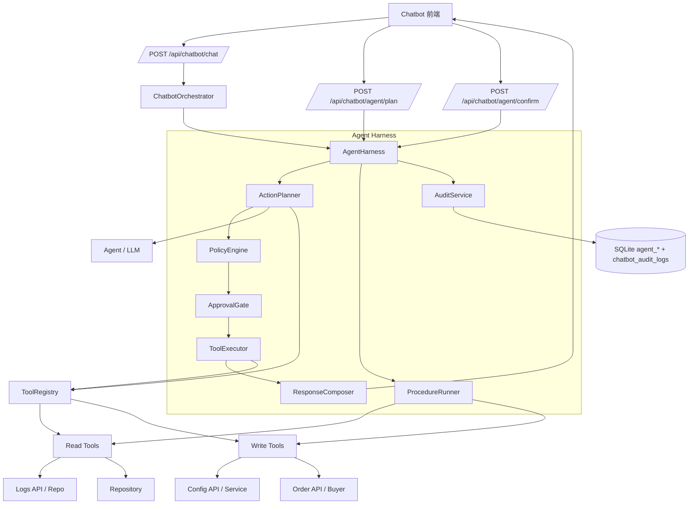
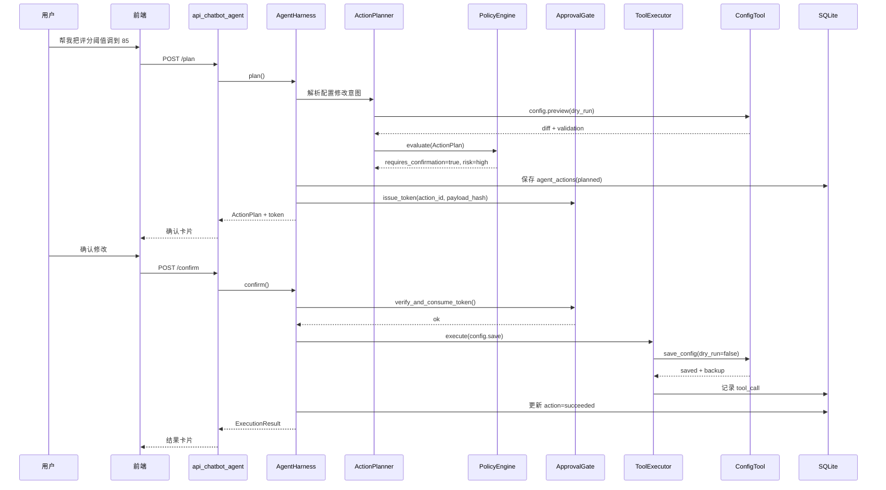
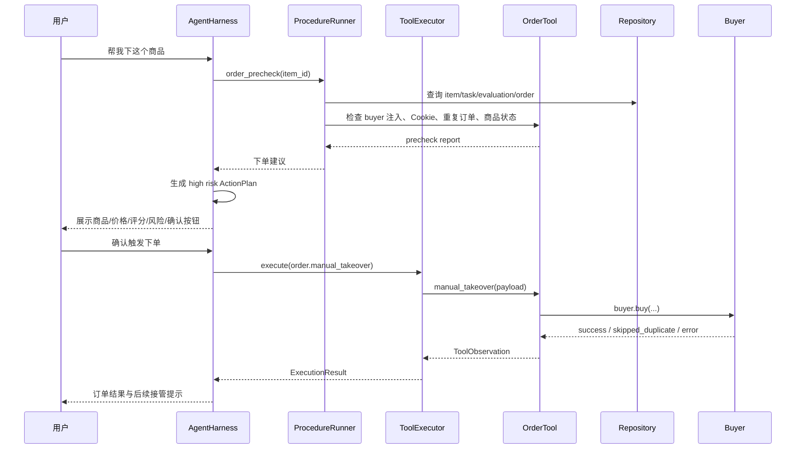
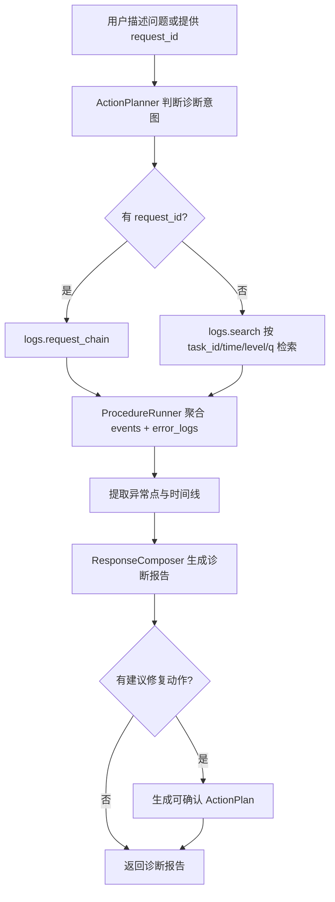
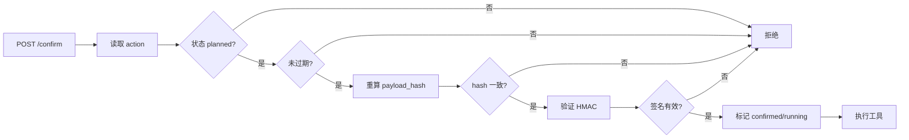

# 智能客服 Agent Harness 重构概要设计说明书

| 项 | 内容 |
|---|---|
| 文档版本 | v1.0 |
| 文档日期 | 2026-07-01 |
| 文档状态 | 初稿 |
| 所属项目 | 闲鱼猎人（XianyuHunter） |
| 文档类型 | 概要设计说明书（SDD） |
| 上游文档 | [智能客服-AgentHarness重构-需求规格.md](./智能客服-AgentHarness重构-需求规格.md) |
| 设计方案 | 增量 Harness 层 |
| 风险策略 | 写操作默认二次确认后执行 |

---

## 1. 引言

### 1.1 编写目的

本文档基于 Agent Harness 重构需求规格说明书，定义智能客服从现有 RAG/FAQ/只读 Agent 升级为可控执行智能体的概要设计。文档覆盖系统分层、模块边界、核心数据模型、接口契约、关键流程、安全控制、审计与测试策略，作为后续详细设计和编码实施依据。

本概要设计采用“增量 Harness 层”方案：保留现有智能客服对话链路，在 `ChatbotOrchestrator` 与工具执行之间增加 `AgentHarness`。模型仍负责理解、规划和解释；Harness 负责结构化计划、策略判断、确认门、工具执行、审计和结果汇总。

### 1.2 设计原则

1. **增量兼容**：不破坏现有 `/api/chatbot/chat`、RAG、FAQ、只读工具调用和会话历史。
2. **后端确认门**：二次确认必须在后端生效，前端确认卡片只做交互展示。
3. **模型不直接写业务**：LLM 输出只作为计划候选，必须转换成 `ActionPlan` 后由 Harness 校验。
4. **工具元数据驱动**：工具权限、风险、确认、超时、回滚能力均由元数据声明。
5. **审计优先**：所有计划、确认、取消、执行、失败和策略拦截都可追溯。
6. **可扩展**：新增工具或 Procedure 不修改 Agent 主循环，只注册工具和策略。

### 1.3 与现有设计关系

本设计是现有 [智能客服-概要设计.md](./智能客服-概要设计.md) 的增强版，不替代原 RAG/Agent 问答架构。原设计中的知识库、FAQ、上下文、SSE、配置页继续保留；新增设计聚焦执行型 Agent 的治理能力。

---

## 2. 总体架构

### 2.1 分层架构

```text
┌─────────────────────────────────────────────────────────────┐
│ 前端层                                                       │
│ Chatbot 页面 · ActionPlan 确认卡片 · 诊断报告卡片 · 工具管理页 │
├─────────────────────────────────────────────────────────────┤
│ Web 层                                                       │
│ api_chatbot.py · api_chatbot_agent.py · api_chatbot_config.py │
├─────────────────────────────────────────────────────────────┤
│ Harness 层（新增）                                           │
│ agent_harness.py · action_planner.py · policy_engine.py       │
│ approval_gate.py · tool_executor.py · procedure_runner.py     │
│ audit_service.py · response_composer.py                       │
├─────────────────────────────────────────────────────────────┤
│ 现有智能客服业务层                                           │
│ orchestrator · agent · rag_engine · faq_matcher · context     │
│ tool_registry · tools/read-only                              │
├─────────────────────────────────────────────────────────────┤
│ 业务能力适配层（新增工具）                                    │
│ config_tools · order_tools · log_tools · diagnose_procedures  │
├─────────────────────────────────────────────────────────────┤
│ 基础设施层                                                   │
│ repo_chatbot · repository · ai_usage · event_bus · logger     │
├─────────────────────────────────────────────────────────────┤
│ 数据层                                                       │
│ SQLite chatbot_* / agent_* · ChromaDB · run.stdout.log        │
└─────────────────────────────────────────────────────────────┘
```

### 2.2 核心组件关系



### 2.3 运行模式

| 模式 | 触发入口 | 行为 |
|---|---|---|
| 普通问答 | `/api/chatbot/chat` | 沿用现有 FAQ/RAG/Agent 流程。 |
| 只读诊断 | `/api/chatbot/chat` 或 `/api/chatbot/agent/procedures/{name}/run` | Harness 调用只读工具，直接返回诊断报告。 |
| 写操作计划 | `/api/chatbot/chat` 或 `/api/chatbot/agent/plan` | Harness 生成待确认 `ActionPlan`，不执行写入。 |
| 确认执行 | `/api/chatbot/agent/confirm` | 校验 token 与 payload hash，通过后执行工具并审计。 |
| 取消动作 | `/api/chatbot/agent/cancel` | 标记动作取消，记录审计，不执行业务写入。 |

---

## 3. 模块设计

### 3.1 `agent_harness.py`

**职责**：执行型 Agent 的总控入口，连接计划、策略、确认、执行和审计。

**核心接口**：

```python
class AgentHarness:
    async def plan(self, request: PlanRequest) -> HarnessResult:
        """生成回答、诊断报告或待确认 ActionPlan。"""

    async def confirm(self, request: ConfirmRequest) -> ActionExecutionResult:
        """确认并执行待确认动作。"""

    async def cancel(self, action_id: str, user_id: str) -> ActionCancelResult:
        """取消待确认动作。"""

    async def get_action(self, action_id: str, user_id: str) -> AgentAction:
        """查询动作详情与执行状态。"""
```

**设计要点**：

- `AgentHarness` 不直接调用业务 API，所有业务能力通过 `ToolExecutor`。
- `plan()` 返回三类结果：`answer`、`diagnostic_report`、`action_plan`。
- `confirm()` 必须重新加载数据库中的 action，校验状态、过期时间、用户、session 和 payload hash。
- 任意异常转为结构化错误，并交给 `AuditService` 记录。

### 3.2 `action_planner.py`

**职责**：把用户自然语言意图转换为结构化计划。

**输入**：

- 用户消息
- 会话上下文
- RAG 检索结果
- 可用工具元数据
- 当前系统状态摘要

**输出**：

- `ActionPlan`：写操作待确认计划
- `DiagnosticPlan`：诊断 Procedure 执行计划
- `AnswerPlan`：普通回答计划

**设计要点**：

- LLM 只能输出 JSON 结构候选，候选必须通过 Pydantic 校验。
- 如果 JSON 校验失败，降级为普通 RAG 回答，不执行工具。
- `ActionPlanner` 不决定是否允许执行，只生成候选计划。
- 对配置修改等常见意图优先使用规则解析，LLM 作为兜底。

### 3.3 `policy_engine.py`

**职责**：对计划做权限、风险和安全策略判断。

**策略维度**：

| 维度 | 判断依据 |
---|---|
| 工具开关 | 工具是否启用，是否在当前配置允许列表。 |
| 权限 | 当前用户是否具备 `read`、`diagnose`、`write_config`、`order`、`admin`。 |
| 风险 | 工具 `risk_level` 与 payload 内容综合判断。 |
| 确认 | `requires_confirmation` 是否为 true，风险是否至少 medium。 |
| Prompt Injection | 用户输入是否命中注入模式。 |
| 数据敏感性 | payload 或 observation 是否包含敏感字段。 |

**输出**：

```python
class PolicyDecision(BaseModel):
    allowed: bool
    requires_confirmation: bool
    risk_level: Literal["low", "medium", "high", "critical"]
    reasons: list[str]
    blocked_code: str | None = None
```

**设计要点**：

- `critical` 工具默认 `allowed=false`，除非管理员显式开启。
- 命中 Prompt Injection 且计划包含写工具时，直接阻断。
- 写工具即使工具元数据误配为无需确认，策略层也强制确认。

### 3.4 `approval_gate.py`

**职责**：生成、校验和消费二次确认 token。

**确认 token 设计**：

```text
confirmation_token = base64url(
  action_id + "." + expires_at + "." + hmac_sha256(secret, canonical_payload)
)
```

`canonical_payload` 包含：

- action_id
- user_id
- session_id
- tool_name
- payload_hash
- expires_at

**设计要点**：

- token 默认 5 分钟过期。
- token 一次性使用，确认成功后 action 状态变为 `running` 或 `succeeded`。
- payload 执行前重新计算 hash，hash 不一致则拒绝执行。
- 使用 `hmac.compare_digest()` 比较签名。

### 3.5 `tool_executor.py`

**职责**：统一执行工具、超时控制、脱敏、错误包装和 observation 收集。

**执行流程**：

1. 从 `ToolRegistry` 获取工具实例和元数据。
2. 校验工具启用状态。
3. 对 payload 做 schema 校验。
4. 执行工具，应用 `asyncio.timeout(tool.timeout_sec)`。
5. 对结果做敏感字段脱敏。
6. 写入 `agent_tool_calls`。
7. 返回 `ToolObservation`。

**设计要点**：

- 只读工具可在 plan 阶段执行。
- 写工具只能在 confirm 阶段执行。
- 工具异常不击穿 Harness，统一返回 `success=false`。
- 工具返回给 LLM 的 observation 必须是脱敏版本。

### 3.6 `procedure_runner.py`

**职责**：执行多步骤诊断流程。

**Procedure 定义**：

```python
class ProcedureDefinition(BaseModel):
    name: str
    description: str
    input_schema: dict
    steps: list[ProcedureStep]
    output_schema: dict
    failure_policy: Literal["continue", "stop"]
```

**首批 Procedure**：

| Procedure | 关键步骤 |
---|---|
| `task_not_running` | 解析 task_id → 查任务状态 → 查调度事件 → 查依赖 → 汇总建议 |
| `order_failed` | 查商品 → 查评估 → 查订单 → 查 buyer 前置条件 → 查错误日志 |
| `login_cookie_invalid` | 查 Cookie 状态 → 查 AUTH/WAF 事件 → 查最近错误 → 给出修复步骤 |
| `config_anomaly` | 查当前配置 → 查最近审计 → 运行 preview 校验 → 给出回滚建议 |
| `ai_budget_issue` | 查 AI 配置 → 查用量 → 查 LLM 错误 → 给出降级建议 |

**设计要点**：

- Procedure 只由结构化步骤组成，不由 LLM 自由决定工具顺序。
- 步骤失败默认继续，诊断报告标记“不完整”。
- Procedure 可输出修复动作建议，但修复动作仍进入 `ActionPlan` 确认流程。

### 3.7 `audit_service.py`

**职责**：记录计划、确认、取消、执行、失败、策略拦截和工具调用审计。

**审计目标**：

- 用户能查“刚才 Agent 做了什么”。
- 管理员能查“谁通过 Agent 改了配置或触发下单”。
- 测试能断言写操作未确认前未执行。

**设计要点**：

- 继续保留 `chatbot_audit_logs`，新增更细粒度 `agent_*` 表。
- 对敏感 payload 只保存脱敏 JSON 和 hash。
- 每条审计记录关联 `request_id`，便于 `/api/logs/request/{request_id}` 聚合。

### 3.8 `response_composer.py`

**职责**：把计划、诊断结果或执行 observation 转为用户可读响应。

**输出类型**：

- 普通 Markdown 回答
- ActionPlan 卡片数据
- DiagnosticReport 卡片数据
- ExecutionResult 卡片数据

**设计要点**：

- 不把原始工具 JSON 直接展示给用户。
- 高风险动作必须展示影响范围和失败可能。
- 诊断报告必须包含证据摘要，不输出完整敏感日志。

---

## 4. 工具体系设计

### 4.1 工具元数据

现有 `BaseTool` 增加元数据字段，保持向后兼容。

```python
class ToolMetadata(BaseModel):
    name: str
    description: str
    category: Literal["read", "diagnose", "config", "order", "task", "admin"]
    permissions: list[str]
    risk_level: Literal["low", "medium", "high", "critical"]
    requires_confirmation: bool
    dry_run_supported: bool = False
    rollback_supported: bool = False
    timeout_sec: int = 5
    enabled: bool = True
```

兼容策略：

- 旧工具未声明 `risk_level` 时默认为 `low`。
- 旧工具 `permissions=["read"]` 时默认不需要确认。
- 新增写工具必须声明非 read 权限，缺省 `requires_confirmation=true`。

### 4.2 工具分类

| 分类 | 工具示例 | 执行阶段 |
---|---|---|
| read | `task_status.get`、`eval_score.get`、`config_value.get` | plan 可执行 |
| diagnose | `logs.search`、`logs.request_chain` | plan 可执行 |
| config | `config.preview`、`config.save`、`config.rollback` | preview 可执行，save/rollback 需 confirm |
| order | `order.precheck`、`order.manual_takeover` | precheck 可执行，manual_takeover 需 confirm |
| task | `task.status_update`、`task.pause`、`task.resume` | 需 confirm |
| admin | `db.cleanup`、`vector.rebuild`、`tunnel.toggle` | 默认禁用或需 confirm |

### 4.3 首批新增工具

| 工具 | 权限 | 风险 | 确认 | 底层复用 |
---|---|---|---|---|
| `config.preview` | read | low | 否 | `api_config.preview_config` 逻辑 |
| `config.save` | write_config | high | 是 | `api_config.save_config` 逻辑 |
| `config.rollback` | write_config | high | 是 | `api_config.rollback_config` 逻辑 |
| `logs.search` | diagnose | low | 否 | `repo.list_events` / `/api/logs/search` |
| `logs.request_chain` | diagnose | low | 否 | `repo.list_events_by_request` + `repo.list_error_logs` |
| `order.precheck` | read | low | 否 | `repo.get_item`、`repo.find_order_by_task_item`、CookieStore |
| `order.manual_takeover` | order | high | 是 | `api_orders.manual_takeover` 逻辑或 `Buyer.buy` 服务 |

### 4.4 写工具执行约束

- 写工具不得出现在普通 OpenAI function calling schema 中。
- `ToolRegistry.get_openai_schemas()` 默认只返回 read/diagnose 工具。
- 写工具仅通过 `ToolExecutor.execute_confirmed()` 调用。
- 写工具执行前必须存在 `agent_actions.status="confirmed"` 或 `running`。

---

## 5. 数据模型设计

### 5.1 新增表

#### 5.1.1 `agent_actions`

记录用户可确认动作。

| 字段 | 类型 | 说明 |
|---|---|---|
| id | TEXT PK | action_id，UUID32 或 `act_` 前缀 |
| session_id | TEXT | 关联客服会话 |
| user_id | TEXT | 默认 `default`，预留多用户 |
| title | TEXT | 动作标题 |
| tool_name | TEXT | 工具名 |
| risk_level | TEXT | low/medium/high/critical |
| status | TEXT | planned/confirmed/running/succeeded/failed/cancelled/expired |
| payload_json | TEXT | 脱敏 payload |
| payload_hash | TEXT | 原始 payload canonical JSON 的 SHA256 |
| diffs_json | TEXT | 配置或状态变更 diff |
| impact_json | TEXT | 影响说明 |
| rollback_json | TEXT | 回滚信息 |
| confirmation_expires_at | DATETIME | token 过期时间 |
| confirmed_at | DATETIME | 确认时间 |
| executed_at | DATETIME | 执行开始时间 |
| finished_at | DATETIME | 执行结束时间 |
| result_json | TEXT | 脱敏执行结果 |
| error_code | TEXT | 失败错误码 |
| request_id | TEXT | 全局流水号 |
| created_at | DATETIME | 创建时间 |
| updated_at | DATETIME | 更新时间 |

索引：

- `ix_agent_actions_session_created(session_id, created_at)`
- `ix_agent_actions_status_created(status, created_at)`
- `ix_agent_actions_request_id(request_id)`

#### 5.1.2 `agent_action_steps`

记录 Procedure 或多工具执行步骤。

| 字段 | 类型 | 说明 |
|---|---|---|
| id | INTEGER PK | 自增 |
| action_id | TEXT | 关联 agent_actions.id，可为空用于纯诊断 |
| procedure_name | TEXT | Procedure 名称 |
| step_name | TEXT | 步骤名 |
| tool_name | TEXT | 调用工具 |
| status | TEXT | pending/running/succeeded/failed/skipped |
| input_hash | TEXT | 输入 hash |
| output_json | TEXT | 脱敏输出 |
| error_message | TEXT | 错误摘要 |
| duration_ms | INTEGER | 耗时 |
| created_at | DATETIME | 创建时间 |

索引：

- `ix_agent_action_steps_action(action_id, id)`
- `ix_agent_action_steps_procedure(procedure_name, created_at)`

#### 5.1.3 `agent_tool_calls`

记录每次工具调用。

| 字段 | 类型 | 说明 |
|---|---|---|
| id | INTEGER PK | 自增 |
| action_id | TEXT | 关联动作，可为空 |
| session_id | TEXT | 会话 |
| tool_name | TEXT | 工具名 |
| permissions_json | TEXT | 权限快照 |
| risk_level | TEXT | 风险快照 |
| success | INTEGER | 0/1 |
| duration_ms | INTEGER | 耗时 |
| input_hash | TEXT | 输入 hash |
| output_hash | TEXT | 输出 hash |
| error_code | TEXT | 错误码 |
| request_id | TEXT | 流水号 |
| created_at | DATETIME | 创建时间 |

索引：

- `ix_agent_tool_calls_tool_created(tool_name, created_at)`
- `ix_agent_tool_calls_session_created(session_id, created_at)`
- `ix_agent_tool_calls_request_id(request_id)`

#### 5.1.4 `agent_policy_events`

记录策略判断、阻断和风险升级。

| 字段 | 类型 | 说明 |
|---|---|---|
| id | INTEGER PK | 自增 |
| session_id | TEXT | 会话 |
| action_id | TEXT | 动作 |
| event_type | TEXT | allowed/blocked/risk_upgraded/confirmation_required |
| reason_code | TEXT | 原因码 |
| message | TEXT | 说明 |
| request_id | TEXT | 流水号 |
| created_at | DATETIME | 创建时间 |

### 5.2 与现有表关系

| 现有表 | 关系 |
---|---|
| `chatbot_sessions` | `agent_actions.session_id` 关联会话。 |
| `chatbot_messages` | ActionPlan 可作为 assistant 消息 metadata 保存。 |
| `chatbot_audit_logs` | 保留旧审计，Agent 执行动作同步写摘要审计。 |
| `events` / `error_logs` | 通过 request_id 与 Agent 动作关联。 |
| `orders` | 下单工具执行后读取或写入订单状态。 |
| `tasks` / `items` / `evaluations` | 下单前置检查和诊断工具读取。 |

### 5.3 迁移策略

- 新增表通过 `Base.metadata.create_all(engine)` 创建。
- 已有数据库使用 `_migrate_add_column` 风格补建缺失列。
- 不修改现有 `chatbot_*` 表字段，避免影响已上线客服功能。
- `ChatbotRepository` 可扩展 Agent CRUD，也可新增 `AgentRepository`；推荐新增 `AgentRepository`，降低 `repo_chatbot.py` 文件膨胀。

---

## 6. API 设计

### 6.1 路由文件

新增 `src/xianyu_hunter/web/routes/api_chatbot_agent.py`，前缀 `/api/chatbot/agent`。

### 6.2 端点清单

| 方法 | 路径 | 用途 |
---|---|---|
| POST | `/plan` | 生成普通回答、诊断报告或 ActionPlan |
| POST | `/confirm` | 确认并执行动作 |
| POST | `/cancel` | 取消动作 |
| GET | `/actions/{action_id}` | 查询动作状态 |
| GET | `/tools` | 查询工具目录 |
| GET | `/procedures` | 查询 Procedure 目录 |
| POST | `/procedures/{name}/run` | 运行诊断 Procedure |

### 6.3 请求响应模型

#### `POST /plan`

请求：

```json
{
  "session_id": "uuid32-or-null",
  "message": "帮我把评分阈值调到85",
  "mode": "auto"
}
```

响应：

```json
{
  "type": "action_plan",
  "session_id": "uuid32",
  "action": {
    "id": "act_xxx",
    "title": "修改评估通过分",
    "tool_name": "config.save",
    "risk_level": "high",
    "requires_confirmation": true,
    "summary": "将 eval.pass_score 从 80 调整为 85",
    "diffs": [],
    "impact": [],
    "expires_at": "2026-07-01T18:05:00+08:00"
  },
  "confirmation_token": "opaque-token"
}
```

#### `POST /confirm`

请求：

```json
{
  "action_id": "act_xxx",
  "confirmation_token": "opaque-token"
}
```

响应：

```json
{
  "action_id": "act_xxx",
  "status": "succeeded",
  "result": {
    "ok": true,
    "backup": "config.yaml.bak.20260701-180110",
    "restart_required": true
  },
  "audit_event_id": 123
}
```

### 6.4 SSE 扩展

现有 `/api/chatbot/chat` SSE 增加事件：

| event | data |
---|---|
| `action_plan` | ActionPlan 卡片数据 |
| `action_required` | 需要确认的提醒 |
| `diagnostic_report` | 诊断报告 |
| `tool_observation` | 脱敏工具结果摘要 |
| `action_result` | 执行结果 |

兼容性：旧前端忽略未知 SSE event，不影响普通聊天。

---

## 7. 关键流程

### 7.1 配置修改流程



### 7.2 智能下单流程



### 7.3 日志诊断流程



### 7.4 确认 token 校验流程



---

## 8. 集成设计

### 8.1 容器集成

当前 `container.chatbot` 是 dict 子容器，新增 Harness 组件继续放入该 dict。

```python
agent_repo = AgentRepository(container.repo.engine)
tool_registry = ToolRegistry(...)
policy_engine = PolicyEngine(config=cfg.agent_harness)
approval_gate = ApprovalGate(secret=settings.app_secret)
tool_executor = ToolExecutor(tool_registry, agent_repo)
procedure_runner = ProcedureRunner(tool_executor, definitions=...)
audit_service = AuditService(agent_repo, chatbot_repo, event_bus)
agent_harness = AgentHarness(
    planner=ActionPlanner(agent, rag_engine, tool_registry),
    policy_engine=policy_engine,
    approval_gate=approval_gate,
    tool_executor=tool_executor,
    procedure_runner=procedure_runner,
    audit_service=audit_service,
)

return {
    ...
    "agent_repo": agent_repo,
    "agent_harness": agent_harness,
}
```

### 8.2 Orchestrator 集成

`ChatbotOrchestrator` 增加可选 `agent_harness` 依赖。

- 普通问答仍走现有流程。
- 当 `intent.suggested_action` 属于 `config_update`、`order_request`、`diagnose` 时，转交 Harness。
- Harness 返回 `action_plan` 时，Orchestrator 以 SSE `action_plan` 事件输出。
- Harness 不可用时，降级为现有 RAG 回答。

### 8.3 路由注册

在 `startup.py` 注册：

```python
from xianyu_hunter.web.routes import api_chatbot_agent

app.include_router(api_chatbot_agent.router)
```

### 8.4 配置扩展

在 `ChatbotConfig` 下增加：

```yaml
chatbot:
  agent_harness:
    enabled: true
    confirmation_ttl_sec: 300
    allow_write_tools: true
    allow_order_tools: true
    allow_admin_tools: false
    max_action_payload_bytes: 20000
    prompt_injection_block_write: true
```

---

## 9. 安全设计

### 9.1 写操作隔离

- 普通 Agent function calling schema 只暴露 read/diagnose 工具。
- 写工具不进入 LLM 可直接调用列表。
- 写工具只能由 `ToolExecutor.execute_confirmed()` 调用。
- `execute_confirmed()` 必须要求 action 状态已确认。

### 9.2 脱敏策略

脱敏分三层：

1. 工具返回层：`ToolRegistry` / `ToolExecutor` 递归脱敏。
2. 审计存储层：保存 redacted payload 和 hash。
3. 前端展示层：确认卡片和诊断报告不展示完整敏感值。

敏感 key 包括：`api_key`、`openai_key`、`cookie`、`token`、`password`、`secret`、`webhook_url`、`authorization`、`bearer`。

### 9.3 权限失败

权限失败返回结构化错误：

```json
{
  "code": "AGENT_POLICY_DENIED",
  "message": "当前能力需要 order 权限，已阻止执行",
  "reasons": ["tool_permission_denied"]
}
```

### 9.4 审计不可绕过

- `AgentHarness.confirm()` 在执行前后都写审计。
- `ToolExecutor` 每次工具调用都写 `agent_tool_calls`。
- 写审计失败时，写工具不得继续执行，返回 `AUDIT_WRITE_FAILED`。

---

## 10. 错误处理与降级

| 场景 | 处理 |
---|---|
| Planner 输出非法 JSON | 降级为普通 RAG 回答，记录 `planner_parse_failed`。 |
| 策略阻断 | 返回阻断说明，不执行工具。 |
| confirmation_token 过期 | action 标记 expired，返回重新生成计划提示。 |
| payload hash 不一致 | 拒绝执行，记录高风险审计。 |
| 工具超时 | action 标记 failed，返回可重试建议。 |
| 配置 preview 校验失败 | 不生成确认 token，直接展示校验错误。 |
| 下单前置检查失败 | 不生成下单确认卡，展示修复步骤。 |
| 审计写入失败 | 阻断写工具执行。 |
| Harness 初始化失败 | `/api/chatbot/chat` 降级回旧 RAG/FAQ 流程。 |

---

## 11. 前端概要设计

### 11.1 ActionPlan 确认卡片

字段：

- 标题
- 风险等级 tag
- 动作摘要
- diff 表格
- 影响说明
- 可回滚说明
- 过期倒计时
- 确认/取消按钮

交互：

- 确认按钮调用 `/api/chatbot/agent/confirm`。
- 取消按钮调用 `/api/chatbot/agent/cancel`。
- 过期后按钮禁用，提示重新生成计划。
- 执行中显示 loading，不允许重复点击。

### 11.2 诊断报告卡片

字段：

- 诊断结论
- 检查项
- 时间线
- 证据摘要
- 建议动作
- 可确认修复入口

### 11.3 工具管理页

位置：现有智能客服配置页新增“Agent Harness”Tab。

展示：

- 工具名
- 分类
- 权限
- 风险等级
- 是否启用
- 是否需要确认
- 最近调用成功率

---

## 12. 测试策略

### 12.1 单元测试

| 模块 | 测试重点 |
---|---|
| `PolicyEngine` | 权限、风险升级、Prompt Injection 阻断 |
| `ApprovalGate` | token 签发、过期、篡改、一次性消费 |
| `ActionPlanner` | 配置修改解析、非法 JSON 降级 |
| `ToolExecutor` | 超时、异常、脱敏、写工具确认门 |
| `ProcedureRunner` | 成功、部分失败、权限不足 |

### 12.2 集成测试

- `/api/chatbot/agent/plan` 生成配置修改 ActionPlan。
- 未确认前配置文件不变化。
- `/confirm` 后配置写入并返回 backup。
- 重复 confirm 被拒绝。
- 下单前置检查失败时不生成可执行下单动作。
- request_id 日志诊断返回脱敏报告。

### 12.3 回归测试

- 现有 `tests/test_chatbot_*` 继续通过。
- 禁用 `chatbot.agent_harness.enabled` 后，现有 RAG/FAQ 对话不受影响。
- 旧前端忽略新增 SSE event 时不报错。

---

## 13. 实施分期

| 阶段 | 范围 | 交付物 |
---|---|---|
| Phase 1 | Harness 骨架、ActionPlan、PolicyEngine、ApprovalGate、AgentRepository | 可生成和确认空动作，审计闭环可用 |
| Phase 2 | 配置 preview/save/rollback 工具、确认卡片 | 可通过 Agent 安全修改配置 |
| Phase 3 | 日志 search/request_chain 工具、诊断报告卡片 | 可读取后台日志并输出诊断报告 |
| Phase 4 | 下单 precheck/manual_takeover 工具 | 可确认后触发手动抢单 |
| Phase 5 | ProcedureRunner 与工具管理页 | 支持任务、登录、抢单、配置异常诊断 |

---

## 14. 关键风险与对策

| 风险 | 对策 |
---|---|
| 写工具绕过确认门 | 写工具不暴露给 LLM，ToolExecutor 强制检查 action 状态。 |
| 前端伪造确认请求 | token 绑定 payload_hash、user_id、session_id，后端 HMAC 校验。 |
| 配置修改影响自动下单 | risk=high，确认卡展示影响说明和 diff。 |
| 下单失败原因复杂 | 先做 `order.precheck`，失败不生成下单动作。 |
| repo_chatbot 文件继续膨胀 | 新增 `AgentRepository`，只复用 engine，不塞进 `repo_chatbot.py`。 |
| 诊断日志泄露敏感字段 | 工具层和展示层双重脱敏。 |
| 现有客服功能被影响 | Harness 可配置禁用，Orchestrator 可降级到旧流程。 |

---

## 15. 阶段交接声明

- 当前阶段：Agent Harness 重构概要设计。
- 下一阶段：详细设计。
- 推荐详细设计重点：
  1. `AgentRepository` 表结构与 CRUD 方法。
  2. `ActionPlan` / `PolicyDecision` / `ToolObservation` Pydantic 模型。
  3. `ApprovalGate` HMAC token 细节与测试用例。
  4. `config.preview/save/rollback` 和 `logs.request_chain` 工具实现细节。
  5. 前端 ActionPlan 卡片状态机。

---

**文档结束**
