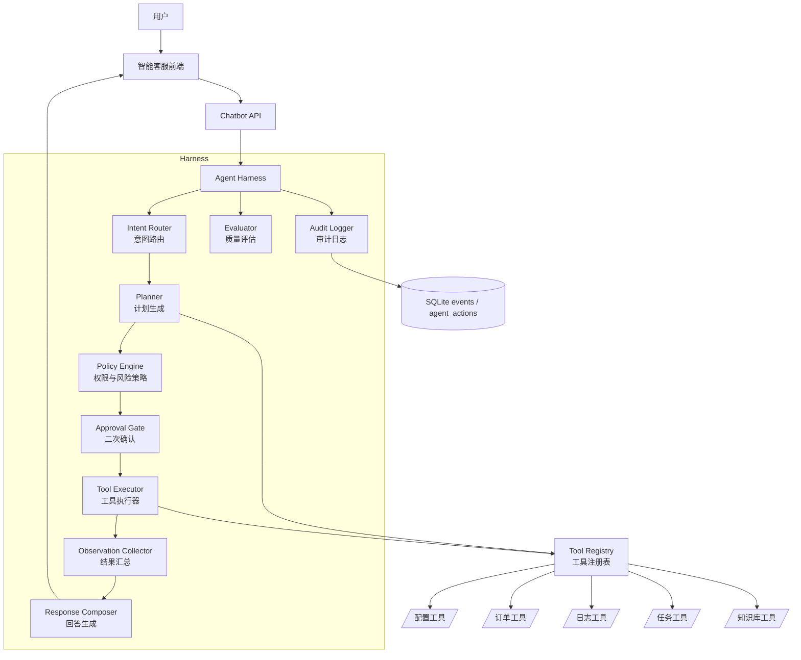

# 智能客服 Agent Harness 重构需求规格说明书

| 项 | 内容 |
|---|---|
| 文档版本 | v1.1 |
| 文档日期 | 2026-07-02 |
| 文档状态 | 评审更新稿 |
| 所属项目 | 闲鱼猎人（XianyuHunter） |
| 文档类型 | 需求规格说明书（SRS） |
| 重构目标 | 将现有 RAG/FAQ 智能客服升级为 Agent Harness 架构的系统执行智能体 |
| 高风险动作策略 | 默认二次确认后执行 |

---

## 1. 编写目的

本文档定义智能客服从“问答助手”升级为“Agent Harness 架构智能体”的产品需求、能力边界、执行流程、安全治理、扩展机制与验收标准。文档面向产品、后端、前端、测试和运维，作为后续概要设计、详细设计与实现验收的依据。

本次重构不推翻现有智能客服模块，而是在现有 RAG、FAQ、上下文、工具注册表和 SSE 对话能力上增加 Harness 层，使客服能够在可控边界内帮助用户：

- 修改系统参数
- 智能下单或触发手动抢单流程
- 读取后台日志与 request_id 链路
- 诊断任务、登录、配置、下单、反爬等问题
- 通过插件式工具扩展后续能力

---

## 2. 背景与竞品参考

### 2.1 当前系统基础

现有系统已具备以下基础：

- 智能客服模块：`src/xianyu_hunter/modules/chatbot/`
- Agent 工具注册表：`src/xianyu_hunter/modules/chatbot/tool_registry.py`
- 只读工具：任务状态、评估分数、配置值、错误日志、帮助检索
- 配置 API：`/api/config/preview`、`/api/config/save`、`/api/config/rollback`
- 订单 API：`/api/orders/manual-takeover`、订单状态更新、接管确认/取消
- 日志 API：`/api/logs/search`、`/api/logs/stream`、`/api/logs/request/{request_id}`
- 事件与错误日志仓储，支持 request_id 链路追踪

当前短板是：Agent 工具主要为只读查询，缺少统一的计划生成、权限判断、风险分级、二次确认、执行审计和动作回滚模型。随着“改参数”“下单”“诊断问题”等能力加入，必须在模型与业务动作之间增加 Harness 控制层。

### 2.2 同类产品参考

| 产品 | 参考能力 | 对本项目启示 |
|---|---|---|
| Zendesk AI | 官方强调 AI agents 可处理复杂多步流程，并跨业务系统执行动作；同时强调知识、质量监控和 AI 治理。参考：https://www.zendesk.com/service/ai/ | 智能客服不应停留在 FAQ，应具备跨系统工具调用、结果学习、日志与质量闭环。 |
| Intercom Fin | Fin 支持多知识源、数据连接器、Tasks、Procedures、模拟测试、答案检查和人工转接。参考：https://www.intercom.com/help/en/articles/7120684-fin-ai-agent-explained | 需要把“任务/流程”沉淀成可维护的 Procedure，而不是把复杂流程写进 Prompt。 |
| Salesforce Agentforce | 官方强调构建、测试、部署、管理和编排 AI agents，并支持 guardrails、Actions、API、Flow 与可观测生命周期。参考：https://www.salesforce.com/agentforce/ | 需要 Agent 生命周期管理、工具目录、策略引擎、测试沙箱和可观测审计。 |
| Freshworks Freddy AI Agent | 官方描述 AI agent 可连接后台系统处理退款、更新订单、查询库存、修改客户资料，并在必要时转人工。参考：https://www.freshworks.com/freshdesk/omni/freddy-ai-agent/ | “能行动”是客服智能体的核心价值，但行动必须连接后台系统并受认证、确认和审计约束。 |

### 2.3 产品定位

重构后的智能客服定位为：

> 面向闲鱼猎人系统的对话式运维与业务执行智能体。它能理解用户意图，检索知识，读取实时系统状态，生成可解释行动方案，并在用户确认后调用受控工具完成配置修改、下单触发、日志诊断和问题修复建议。

---

## 3. 范围定义

### 3.1 包含范围

- Agent Harness 核心架构
- 工具注册、工具分类、权限模型和风险分级
- 二次确认式写操作流程
- 配置参数修改能力
- 智能下单/手动抢单触发能力
- 后台日志读取与链路诊断能力
- 问题诊断 Procedure
- 执行审计、回滚建议和事件记录
- 前端确认卡片、执行计划卡片、诊断报告卡片
- 扩展工具接入规范
- 用户沙箱模式：多用户与 SKILL 执行环境隔离、配置覆盖层、资源配额、快照与重置
- SKILL 安装功能：包格式、获取渠道、签名校验、试运行、版本管理、命名空间、卸载机制

### 3.2 排除范围

- 不允许模型绕过 Harness 直接写数据库、写配置文件、调用浏览器或执行 shell。
- 不实现全自动无确认下单。
- 不实现自动支付。系统只触发当前已有的抢单/接管流程，并提示用户完成必要的人工确认。
- 不处理闲鱼平台售后、退款、账号申诉等平台级问题。
- 不开放任意代码执行工具。
- 不把敏感凭据、Cookie、API Key、完整 Webhook 暴露给模型或前端。

### 3.3 高风险动作默认策略

采用“二次确认后执行”：

1. Agent 可以读取上下文、生成计划、说明风险和影响。
2. 涉及配置写入、下单、订单状态变更、任务启停等动作时，Agent 只能创建待确认动作。
3. 前端展示确认卡片，用户明确点击确认后，后端 Harness 执行动作。
4. 用户确认前，任何写操作不得落库、写盘或触发浏览器自动化。
5. 所有确认和执行结果必须记录审计事件。

---

## 4. 用户角色

| 角色 | 主要诉求 | 典型问题 |
|---|---|---|
| 新手用户 | 快速上手、少理解配置细节 | “帮我把抢单阈值调得保守一点” |
| 进阶用户 | 参数调优、策略解释、批量处理 | “为什么这个商品没下单，帮我诊断并给出建议” |
| 运维用户 | 查日志、定位异常、恢复服务 | “刚才任务失败了，帮我看 request_id 的链路” |
| 管理员 | 控制风险、审计行为、扩展工具 | “谁通过客服改过配置，改了哪些字段” |
| 开发者 | 扩展 Agent 能力 | “我要新增一个库存查询工具，怎么接入 Harness” |

---

## 5. 总体架构

### 5.1 架构原则

- 模型负责理解、规划和解释，Harness 负责校验、审批和执行。
- 所有工具通过注册表暴露，禁止隐式调用业务函数。
- 写操作必须具备 dry_run、diff、风险等级、确认 token 和审计记录。
- 同一套工具接口既服务对话，也服务测试和后台审计。
- 能力按 Procedure 扩展，避免把复杂业务流程堆进 Prompt。

### 5.2 Agent Harness 组件



### 5.3 与现有模块关系

| 现有模块 | 重构后定位 |
|---|---|
| `orchestrator.py` | 对话编排入口，调用 Harness 生成计划和响应 |
| `agent.py` | 保留为 LLM 决策适配器，但不直接执行写工具 |
| `tool_registry.py` | 升级为工具元数据中心，区分 read/write/diagnose/order/admin |
| `tools/*` | 保留只读工具，新增写工具必须走审批 |
| `api_chatbot.py` | 增加 plan、confirm、action status 等接口 |
| `api_config.py` | 作为配置工具的底层执行 API，优先复用 preview/save/rollback |
| `api_orders.py` | 作为下单工具的底层执行 API，优先复用 manual-takeover |
| `api_logs.py` | 作为日志诊断工具的底层执行 API，复用 search/stream/request chain |

---

## 6. 功能需求

### 6.1 Agent Harness 基础能力

| 编号 | 需求 | 优先级 |
|---|---|---|
| FR-AH-01 | 系统必须新增 Agent Harness 层，统一处理意图识别、计划生成、权限校验、确认、执行、审计和响应。 | P0 |
| FR-AH-02 | Harness 必须支持工具元数据：name、description、category、permissions、risk_level、requires_confirmation、timeout_sec、rollback_supported、dry_run_supported。 | P0 |
| FR-AH-03 | Harness 必须把模型输出的动作计划转换为结构化 ActionPlan，不允许直接执行模型生成的自然语言命令。 | P0 |
| FR-AH-04 | Harness 必须支持只读工具直接执行，写工具生成待确认动作。 | P0 |
| FR-AH-05 | Harness 必须支持 Procedure：把多步诊断或执行流程沉淀为可测试、可维护的步骤模板。 | P1 |
| FR-AH-06 | Harness 必须在每次工具调用后收集 observation，并由 Response Composer 汇总为用户可读结果。 | P1 |

### 6.2 二次确认与动作执行

| 编号 | 需求 | 优先级 |
|---|---|---|
| FR-AC-01 | 写操作必须先返回待确认 ActionPlan，包含动作摘要、影响范围、风险等级、diff、可回滚性、过期时间。 | P0 |
| FR-AC-02 | 前端必须展示确认卡片，用户点击确认后才调用执行接口。 | P0 |
| FR-AC-03 | 每个待确认动作必须生成一次性 confirmation_token，默认 5 分钟过期。 | P0 |
| FR-AC-04 | confirmation_token 必须绑定 user_id、session_id、action_id、payload_hash，防止重放或篡改。 | P0 |
| FR-AC-05 | 用户取消动作时，系统必须记录取消事件，不执行任何业务写入。 | P1 |
| FR-AC-06 | 执行失败时，系统必须返回失败原因、已执行步骤、回滚状态和下一步建议。 | P0 |

### 6.3 修改系统参数

| 编号 | 需求 | 优先级 |
|---|---|---|
| FR-CFG-01 | 用户可用自然语言要求调整配置，例如“把评估通过分调到 85”“把通知免打扰设到晚上 11 点到早上 8 点”。 | P0 |
| FR-CFG-02 | Agent 必须先识别目标配置项、当前值、建议值和变更原因。 | P0 |
| FR-CFG-03 | 配置变更必须调用 dry_run/preview，展示 diff 和校验结果。 | P0 |
| FR-CFG-04 | 用户确认后，Harness 调用配置保存能力，并记录备份文件名。 | P0 |
| FR-CFG-05 | 高风险配置项必须提示影响范围，例如自动下单阈值、反爬频率、账号/Cookie、通知 Webhook、AI Key。 | P0 |
| FR-CFG-06 | 敏感字段不得展示原值，diff 中仅显示 `<REDACTED>` 或末 4 位。 | P0 |
| FR-CFG-07 | 写入后必须提示是否需要重启 run 调度器，复用现有 `restart_required` 与 `restart_note`。 | P1 |
| FR-CFG-08 | 用户可要求“恢复刚才的配置”，Agent 应引导调用 rollback 或 restore-backup。 | P1 |

### 6.4 智能下单

| 编号 | 需求 | 优先级 |
|---|---|---|
| FR-ORD-01 | 用户可要求 Agent 对某个商品、评估结果或任务结果发起下单建议。 | P0 |
| FR-ORD-02 | Agent 必须先读取商品、任务、评估分、风险等级、价格、是否重复下单、登录态等前置条件。 | P0 |
| FR-ORD-03 | 下单前必须展示确认卡片，包含商品标题、价格、任务、评分、风险、预期动作、可能失败原因。 | P0 |
| FR-ORD-04 | 用户确认后，Harness 调用现有 `/api/orders/manual-takeover` 或对应服务方法。 | P0 |
| FR-ORD-05 | 如果 `buyer` 未注入、Cookie 过期、商品已售、浏览器锁不可用，Agent 必须解释失败原因并给出修复步骤。 | P0 |
| FR-ORD-06 | 下单成功后必须返回订单状态，并提示用户是否需要在闲鱼 App 完成后续支付或确认。 | P0 |
| FR-ORD-07 | 不允许 Agent 自动确认支付成功；支付成功状态变更仍需用户确认或现有业务流程触发。 | P0 |
| FR-ORD-08 | 重复下单必须幂等跳过，并向用户展示已有订单信息。 | P0 |

### 6.5 后台日志读取与诊断

| 编号 | 需求 | 优先级 |
|---|---|---|
| FR-LOG-01 | 用户可要求 Agent 查询后台日志，例如“刚才为什么失败”“帮我看这个 request_id”。 | P0 |
| FR-LOG-02 | Agent 必须支持按关键字、level、task_id、stage、request_id、时间范围查询日志。 | P0 |
| FR-LOG-03 | Agent 必须支持 request_id 链路聚合，读取 events 与 error_logs 的完整调用链。 | P0 |
| FR-LOG-04 | Agent 输出诊断报告时必须包含时间线、异常点、根因判断、证据摘要和建议动作。 | P0 |
| FR-LOG-05 | 日志中的 token、cookie、api_key、authorization、webhook 等敏感内容必须脱敏。 | P0 |
| FR-LOG-06 | Agent 可建议下一步操作，但涉及写操作仍需进入确认流程。 | P0 |
| FR-LOG-07 | 前端应支持“把本次诊断结果复制/导出”为 Markdown。 | P2 |

### 6.6 问题诊断 Procedure

| 编号 | Procedure | 输入 | 输出 | 优先级 |
|---|---|---|---|---|
| FR-DIAG-01 | 任务不执行诊断 | task_id 或任务名 | 调度状态、任务状态、最近日志、依赖关系、建议 | P0 |
| FR-DIAG-02 | 抢单失败诊断 | item_id、order_id、task_id 或时间范围 | 商品状态、评估结果、买家模块状态、错误日志、建议 | P0 |
| FR-DIAG-03 | 登录/Cookie 失效诊断 | 无或账号标识 | Cookie 有效性、反爬事件、最近登录错误、修复步骤 | P0 |
| FR-DIAG-04 | 配置异常诊断 | 配置项或症状描述 | 当前配置、最近变更、校验结果、回滚建议 | P1 |
| FR-DIAG-05 | AI 预算/模型异常诊断 | 无 | 用量、预算、模型配置、API 错误、降级建议 | P1 |
| FR-DIAG-06 | 通知失败诊断 | 渠道名或时间范围 | 渠道配置脱敏摘要、发送错误、重试建议 | P1 |

### 6.7 扩展能力

| 编号 | 需求 | 优先级 |
|---|---|---|
| FR-EXT-01 | 新工具必须通过统一工具注册接口接入，不允许在 Agent Prompt 中硬编码业务动作。 | P0 |
| FR-EXT-02 | 新工具必须声明权限和风险等级，缺省风险为 high，缺省要求确认。 | P0 |
| FR-EXT-03 | 新 Procedure 必须包含步骤、输入 schema、输出 schema、失败策略和测试样例。 | P1 |
| FR-EXT-04 | 工具和 Procedure 必须支持开关配置，管理员可禁用某类能力。 | P1 |
| FR-EXT-05 | 后续可扩展能力包括任务启停、批量采集、通知测试、数据库维护、知识库重建、远程访问开关。 | P2 |

### 6.8 用户沙箱模式

用户沙箱模式为多用户场景与第三方 SKILL 扩展提供执行环境隔离，确保不同用户、不同 SKILL 之间的数据可见性、工具执行上下文与配置变更互不污染。沙箱是 Harness 在 `user_id` 维度之上的强隔离执行边界。

| 编号 | 需求 | 优先级 |
|---|---|---|
| FR-SB-01 | 系统必须支持按 `user_id` 建立独立沙箱上下文（sandbox_id），沙箱内 ActionPlan、agent_actions、工具调用、诊断报告均按 sandbox_id 作用域隔离，跨沙箱默认不可见。 | P0 |
| FR-SB-02 | 沙箱必须限制工具可见性：沙箱用户只能看到管理员授权的工具子集，未授权工具不出现在 plan 候选与 `/tools` 返回中。 | P0 |
| FR-SB-03 | 沙箱内的写操作（配置修改、下单、任务变更）默认生成"建议型 ActionPlan"，配置类变更基于沙箱覆盖层计算 diff，不直接落盘到全局 `config.yaml`。 | P0 |
| FR-SB-04 | 沙箱必须提供资源配额：单用户最大并发待确认动作数、单位时间工具调用次数、诊断报告保留条数、SKILL 临时存储上限，超额返回 `SANDBOX_QUOTA_EXCEEDED`。 | P0 |
| FR-SB-05 | 沙箱必须提供独立临时配置覆盖层（sandbox config overlay）：用户在沙箱内的 `config.preview` 基于覆盖层计算 diff，仅当管理员显式"提升"后才合并到全局配置并走标准确认流程。 | P1 |
| FR-SB-06 | 沙箱内日志、订单、任务查询必须按用户可见范围过滤；跨用户数据默认不可见，管理员可显式授权跨域只读，授权行为需审计。 | P0 |
| FR-SB-07 | 沙箱必须支持快照与重置：管理员可对某用户沙箱做快照、回滚到快照、清空沙箱临时数据（覆盖层、临时动作、SKILL 试运行产物），操作需 admin 权限并审计。 | P1 |
| FR-SB-08 | 沙箱生命周期必须可配置：空闲超时自动卸载、手动启停、最大存活时长，超时未活动自动卸载并保留审计摘要。 | P1 |
| FR-SB-09 | 沙箱内 SKILL 执行必须继承沙箱作用域，SKILL 注册的工具默认只能在所属沙箱内调用；SKILL 工具调用全局工具时需显式授权。 | P0 |
| FR-SB-10 | 沙箱不可绕过：任何工具调用必须携带 sandbox_id，ToolExecutor 校验 sandbox_id 与 user_id 绑定关系，不匹配则拒绝并记录 `sandbox_binding_violation`。 | P0 |
| FR-SB-11 | 沙箱必须对 LLM 上下文做隔离：会话历史、RAG 检索片段、工具 observation 不得跨沙箱串扰，ContextManager 按 sandbox_id 分区管理。 | P0 |
| FR-SB-12 | 沙箱卸载时必须保留审计记录与已确认执行的全局副作用，仅清理临时数据；卸载后该 sandbox_id 不可复用。 | P0 |

### 6.9 SKILL 安装功能

SKILL 是 Agent 能力的可分发扩展包，封装工具定义、Procedure、Prompt 片段、元数据与测试样例。SKILL 安装功能定义其获取渠道、安装流程、版本管理、权限验证、冲突处理与卸载机制，所有 SKILL 工具必须在用户沙箱内执行。

| 编号 | 需求 | 优先级 |
|---|---|---|
| FR-SK-01 | 系统必须定义 SKILL 包格式：manifest（name、version、author、permissions、risk_level、dependencies）、tools 定义、procedures 定义、prompt 片段、test_cases。 | P0 |
| FR-SK-02 | SKILL 获取渠道必须至少支持：本地文件导入、官方市场 URL 安装、已安装列表重装；不支持任意匿名 URL 安装，市场地址需在白名单内。 | P0 |
| FR-SK-03 | SKILL 安装前必须校验签名与 manifest 完整性，签名校验失败一律拒绝安装并记录 `skill_signature_invalid` 审计事件。 | P0 |
| FR-SK-04 | SKILL 安装前必须向管理员展示权限清单、风险等级、依赖 SKILL 与将注册的工具/Procedure 列表，管理员确认后才能写入。 | P0 |
| FR-SK-05 | SKILL 必须在指定沙箱内进行安装试运行（dry-run）：执行 manifest 声明的 test_cases，全部通过才允许正式注册到 ToolRegistry。 | P0 |
| FR-SK-06 | SKILL 工具与 Procedure 必须使用命名空间前缀（`<skill_name>.<tool_name>`），避免与系统工具或其它 SKILL 冲突；冲突时拒绝安装并提示。 | P0 |
| FR-SK-07 | 同名 SKILL 多版本共存时，必须明确默认版本；切换默认版本需管理员确认并审计，旧版本保留可回滚。 | P1 |
| FR-SK-08 | SKILL 升级必须保留旧版本，支持回滚；升级失败自动回滚到上一个可用版本，并记录 `skill_upgrade_rolled_back`。 | P1 |
| FR-SK-09 | SKILL 卸载必须清理 ToolRegistry 与 ProcedureRunner 中的注册项，保留历史审计与工具调用记录，不得删除已产生的 agent_actions。 | P0 |
| FR-SK-10 | SKILL 工具继承 SKILL 的权限与风险声明，PolicyEngine 以最严格策略合并（系统策略与 SKILL 声明取严）。 | P0 |
| FR-SK-11 | SKILL 不得自行声明 admin/critical 权限；此类声明一律降级为 high 并强制确认，或拒绝安装。 | P0 |
| FR-SK-12 | SKILL 安装、升级、卸载、启用、禁用、切默认版本均必须产生审计事件，记录操作人、SKILL 名、版本、前后状态。 | P0 |
| FR-SK-13 | SKILL 的 prompt 片段必须经过 Prompt Injection 校验，命中注入模式的 SKILL 拒绝安装并记录 `skill_prompt_injection`。 | P0 |
| FR-SK-14 | 管理员可全局禁用 SKILL 安装能力（`agent_harness.allow_skill_install=false`），禁用时所有 SKILL 安装相关接口返回 403。 | P1 |
| FR-SK-15 | SKILL 必须声明所需系统资源与外部依赖（网络、文件路径、子进程），未声明的资源访问在沙箱中被拒绝。 | P1 |

---

## 7. 权限与风险分级

### 7.1 权限类型

| 权限 | 说明 | 是否默认启用 | 是否需要确认 |
|---|---|---|---|
| read | 查询状态、配置、日志、知识库 | 是 | 否 |
| diagnose | 多工具读取并生成诊断报告 | 是 | 否 |
| write_config | 修改配置文件或动态配置 | 否 | 是 |
| order | 触发下单或接管流程 | 否 | 是 |
| mutate_task | 启停任务、改任务状态 | 否 | 是 |
| sandbox | 建立/卸载/快照/重置用户沙箱、提升沙箱配置到全局 | 否 | 是 |
| skill_install | 安装/升级/卸载/启停 SKILL、切换默认版本 | 否 | 是 |
| admin | 数据库维护、清理、远程访问开关 | 否 | 是 |

### 7.2 风险等级

| 风险等级 | 定义 | 示例 | 策略 |
|---|---|---|---|
| low | 只读或可忽略副作用 | 查询帮助、查询任务状态 | 可直接执行 |
| medium | 影响局部行为，可回滚 | 修改普通展示配置、打日志标签 | 需要确认 |
| high | 影响业务执行、资金、账号或系统稳定性 | 修改自动下单阈值、触发下单、启停任务、安装已签名 SKILL、沙箱配置提升到全局 | 需要确认并展示风险 |
| critical | 可能造成数据丢失、凭据暴露或不可逆操作 | 删除数据库、清空日志、导出敏感数据、安装未签名 SKILL、沙箱重置清空已确认动作 | 默认禁用，需管理员开启 |

---

## 8. 接口需求

### 8.1 新增 API

| 方法 | 路径 | 用途 |
|---|---|---|
| POST | `/api/chatbot/agent/plan` | 根据用户消息生成 ActionPlan 或诊断计划 |
| POST | `/api/chatbot/agent/confirm` | 确认并执行待确认动作 |
| POST | `/api/chatbot/agent/cancel` | 取消待确认动作 |
| GET | `/api/chatbot/agent/actions/{action_id}` | 查询动作状态与结果 |
| GET | `/api/chatbot/agent/tools` | 查询可用工具、权限、风险等级 |
| POST | `/api/chatbot/agent/procedures/{name}/run` | 运行指定诊断 Procedure |
| POST | `/api/chatbot/agent/sandboxes` | 为指定 user_id 创建沙箱上下文 |
| GET | `/api/chatbot/agent/sandboxes` | 查询沙箱列表与状态 |
| DELETE | `/api/chatbot/agent/sandboxes/{sandbox_id}` | 卸载沙箱（保留审计，清理临时数据） |
| POST | `/api/chatbot/agent/sandboxes/{sandbox_id}/snapshot` | 对沙箱打快照 |
| POST | `/api/chatbot/agent/sandboxes/{sandbox_id}/reset` | 回滚到快照或清空临时数据 |
| POST | `/api/chatbot/agent/sandboxes/{sandbox_id}/promote` | 将沙箱配置覆盖层提升到全局（走确认流程） |
| POST | `/api/chatbot/agent/skills/install` | 安装 SKILL（本地导入或市场 URL） |
| GET | `/api/chatbot/agent/skills` | 查询已安装 SKILL 列表与版本 |
| GET | `/api/chatbot/agent/skills/{skill_name}` | 查询 SKILL 详情、manifest 与注册项 |
| DELETE | `/api/chatbot/agent/skills/{skill_name}` | 卸载指定 SKILL |
| POST | `/api/chatbot/agent/skills/{skill_name}/enable` | 启用 SKILL |
| POST | `/api/chatbot/agent/skills/{skill_name}/disable` | 禁用 SKILL |
| POST | `/api/chatbot/agent/skills/{skill_name}/upgrade` | 升级 SKILL 到指定版本 |
| POST | `/api/chatbot/agent/skills/{skill_name}/default` | 切换默认版本 |
| GET | `/api/chatbot/agent/skills/{skill_name}/versions` | 查询 SKILL 历史版本 |

### 8.2 ActionPlan 结构

```json
{
  "action_id": "act_20260701_001",
  "session_id": "chat_abc",
  "title": "修改评估通过分",
  "summary": "将 eval.pass_score 从 80 调整为 85",
  "risk_level": "high",
  "requires_confirmation": true,
  "tool_name": "config.update",
  "payload": {
    "path": "eval.pass_score",
    "old_value": 80,
    "new_value": 85
  },
  "diffs": [
    {"path": "eval.pass_score", "op": "modify", "old": "80", "new": "85"}
  ],
  "impact": [
    "评分低于 85 的商品将不再自动进入抢单流程",
    "可能降低下单数量，提高保守程度"
  ],
  "rollback": {
    "supported": true,
    "method": "config.rollback"
  },
  "expires_at": "2026-07-01T18:05:00+08:00"
}
```

### 8.3 执行结果结构

```json
{
  "action_id": "act_20260701_001",
  "status": "succeeded",
  "started_at": "2026-07-01T18:01:10+08:00",
  "finished_at": "2026-07-01T18:01:11+08:00",
  "result": {
    "ok": true,
    "backup": "config.yaml.bak.20260701-180110",
    "restart_required": true
  },
  "audit_event_id": 12345
}
```

---

## 9. 前端需求

### 9.1 对话页增强

- 用户发送消息后，若返回普通回答，沿用现有聊天气泡。
- 若返回 ActionPlan，展示确认卡片。
- 确认卡片必须展示动作标题、风险等级、影响范围、diff、确认/取消按钮。
- 高风险动作按钮文案必须明确，例如“确认修改配置”“确认触发下单”，不能只写“确定”。
- 动作执行中展示步骤进度和日志摘要。
- 执行完成后展示结果卡片和可追踪事件 id。

### 9.2 诊断报告卡片

诊断报告必须包含：

- 问题摘要
- 检查项列表
- 证据时间线
- 判断结果
- 建议操作
- 可执行修复动作入口

### 9.3 工具与权限可视化

管理员配置页应展示：

- 已注册工具列表
- 工具分类、权限、风险等级
- 是否启用
- 是否需要确认
- 最近调用次数和失败次数

---

## 10. 数据与审计

### 10.1 新增表建议

| 表 | 用途 |
|---|---|
| `agent_actions` | 记录 ActionPlan、状态、确认人、执行结果 |
| `agent_action_steps` | 记录多步骤 Procedure 的每一步输入输出 |
| `agent_tool_calls` | 记录每次工具调用、耗时、成功/失败 |
| `agent_policy_events` | 记录策略拦截、权限不足、确认过期等事件 |
| `agent_sandboxes` | 记录沙箱上下文：sandbox_id、user_id、状态、配额、生命周期 |
| `agent_sandbox_overlays` | 记录沙箱配置覆盖层：未提升到全局的临时配置 diff |
| `agent_sandbox_snapshots` | 记录沙箱快照：覆盖层与临时动作的不可变副本 |
| `agent_skills` | 记录已安装 SKILL：name、version、manifest、签名、状态、默认版本标记 |
| `agent_skill_installations` | 记录 SKILL 安装/升级/卸载/启停事件：操作人、前后状态、审计 |

### 10.2 审计字段

每个动作必须记录：

- action_id
- session_id
- user_id
- sandbox_id（沙箱模式必填，非沙箱模式为空）
- tool_name
- risk_level
- payload_hash
- redacted_payload
- confirmation_status
- confirmed_at
- executed_at
- result_status
- error_code
- request_id
- skill_name（SKILL 工具调用时必填，记录来源 SKILL 与版本）

---

## 11. 安全要求

| 编号 | 需求 | 优先级 |
|---|---|---|
| SR-01 | 写工具不得出现在普通 LLM function calling schema 中，除非 Harness 已生成待确认动作。 | P0 |
| SR-02 | 所有写操作必须验证 confirmation_token。 | P0 |
| SR-03 | confirmation_token 必须一次性使用。 | P0 |
| SR-04 | payload 执行前必须重新计算 hash，防止确认后被篡改。 | P0 |
| SR-05 | 工具返回给 LLM 的数据必须脱敏。 | P0 |
| SR-06 | 日志诊断不得输出完整 cookie、token、api_key、authorization、webhook。 | P0 |
| SR-07 | Prompt Injection 命中时，Harness 必须降级为只读回答或拒绝执行动作。 | P0 |
| SR-08 | critical 风险工具默认禁用。 | P0 |
| SR-09 | 用户权限不足时，Agent 必须解释不可执行原因，不得诱导绕过权限。 | P0 |
| SR-10 | 所有执行动作必须写入审计事件，且审计事件不得被普通客服工具删除。 | P0 |
| SR-11 | 沙箱隔离不可绕过：ToolExecutor 必须校验 sandbox_id 与 user_id 绑定，未绑定或跨沙箱调用一律拒绝。 | P0 |
| SR-12 | 沙箱配置覆盖层不得直接落盘全局配置；提升到全局必须走标准确认流程并审计。 | P0 |
| SR-13 | SKILL 必须签名校验通过且 Prompt Injection 校验通过后才允许安装；未签名 SKILL 一律拒绝。 | P0 |
| SR-14 | SKILL 工具不得声明 admin/critical 权限，PolicyEngine 对 SKILL 工具取最严格策略合并。 | P0 |
| SR-15 | SKILL 卸载不得删除已产生的 agent_actions 与审计记录，仅清理 ToolRegistry 注册项。 | P0 |
| SR-16 | SKILL 工具的执行结果在进入 LLM 前必须脱敏，脱敏策略与系统工具一致。 | P0 |

---

## 12. 非功能需求

| 类别 | 指标 |
|---|---|
| 响应性能 | 只读工具 P95 <= 2s；配置 preview P95 <= 2s；日志诊断首屏 P95 <= 5s |
| 稳定性 | 单个工具失败不得中断整个对话；Procedure 应返回部分诊断结果 |
| 可观测性 | 每次工具调用必须记录 request_id、耗时、结果、错误码 |
| 可维护性 | 新增工具不应修改 Agent 主循环，只需注册工具和策略 |
| 可测试性 | 每个 Procedure 至少有 3 个测试样例：成功、失败、权限不足 |
| 兼容性 | 禁用 Agent Harness 后，现有 RAG/FAQ 客服仍可工作 |

---

## 13. 验收标准

### 13.1 基础 Harness

| 编号 | 验收标准 |
|---|---|
| AC-01 | 用户询问“帮我把评分阈值调到 85”，系统返回配置修改计划而不是直接保存。 |
| AC-02 | 配置修改计划展示 old/new diff、风险等级和影响说明。 |
| AC-03 | 用户取消后，配置文件未变化，并产生 action_cancelled 审计事件。 |
| AC-04 | 用户确认后，配置写入成功，返回备份文件名和是否需要重启。 |
| AC-05 | confirmation_token 过期后再次确认返回 409 或 400，不执行动作。 |

### 13.2 智能下单

| 编号 | 验收标准 |
|---|---|
| AC-06 | 用户要求“帮我下这个商品”，系统先展示商品、价格、评分、风险和确认按钮。 |
| AC-07 | 未确认前不得调用 buyer.buy 或 `/api/orders/manual-takeover`。 |
| AC-08 | Cookie 过期时，下单计划不得执行，并提示重新登录。 |
| AC-09 | 商品已存在订单时，返回 skipped_duplicate，不重复下单。 |
| AC-10 | 下单失败时，返回失败原因和日志证据。 |

### 13.3 日志诊断

| 编号 | 验收标准 |
|---|---|
| AC-11 | 用户提供 request_id 后，Agent 返回完整链路摘要。 |
| AC-12 | 诊断报告包含异常点、证据、根因判断和建议。 |
| AC-13 | 日志中的敏感字段均被脱敏。 |
| AC-14 | Agent 建议的修复动作必须进入二次确认流程。 |

### 13.4 扩展性

| 编号 | 验收标准 |
|---|---|
| AC-15 | 新增一个只读工具时，无需修改 Agent 主循环即可在工具列表中出现。 |
| AC-16 | 新增一个写工具时，默认 requires_confirmation=true。 |
| AC-17 | 禁用某工具后，Agent 不再规划该工具动作。 |
| AC-18 | Procedure 单测能覆盖成功、失败、权限不足三类路径。 |

### 13.5 用户沙箱模式

| 编号 | 验收标准 |
|---|---|
| AC-19 | 为 user_A 创建沙箱后，user_B 的 `/tools` 与 plan 候选不包含 user_A 沙箱授权外的工具。 |
| AC-20 | 沙箱内的配置修改基于覆盖层计算 diff，全局 `config.yaml` 不发生变化。 |
| AC-21 | 跨沙箱工具调用被 ToolExecutor 拒绝，并记录 `sandbox_binding_violation` 审计。 |
| AC-22 | 沙箱超过配额（并发动作或调用频率）时返回 `SANDBOX_QUOTA_EXCEEDED`，不执行超额动作。 |
| AC-23 | 沙箱重置后临时覆盖层与未确认动作被清空，已确认执行的全局副作用与审计保留。 |
| AC-24 | 沙箱空闲超时后自动卸载，sandbox_id 不可复用，审计摘要保留。 |

### 13.6 SKILL 安装功能

| 编号 | 验收标准 |
|---|---|
| AC-25 | 本地导入未签名 SKILL 时，安装被拒绝并记录 `skill_signature_invalid`。 |
| AC-26 | SKILL 安装前展示权限清单与风险等级，管理员未确认前不写入 ToolRegistry。 |
| AC-27 | SKILL 试运行 test_cases 失败时不正式注册，沙箱产物被清理。 |
| AC-28 | SKILL 工具以 `<skill_name>.<tool_name>` 命名空间注册，与系统工具同名时不覆盖。 |
| AC-29 | 卸载 SKILL 后 ToolRegistry 中该 SKILL 工具不可调用，历史 agent_actions 保留可查。 |
| AC-30 | SKILL prompt 片段命中注入模式时拒绝安装，并记录 `skill_prompt_injection`。 |
| AC-31 | 全局禁用 `allow_skill_install` 后，所有 SKILL 安装接口返回 403。 |

---

## 14. 实施优先级建议

| 阶段 | 内容 | 目标 |
|---|---|---|
| Phase 1 | Harness 骨架、工具元数据、ActionPlan、确认接口、审计表 | 建立安全执行底座 |
| Phase 2 | 配置修改工具、日志诊断工具、前端确认卡片 | 实现最高频运维能力 |
| Phase 3 | 智能下单工具、下单前置检查、订单结果解释 | 实现业务执行能力 |
| Phase 4 | Procedure 框架、任务/登录/抢单诊断流程 | 提升复杂问题诊断质量 |
| Phase 5 | 工具管理页、质量评估、批量测试、更多扩展工具 | 形成长期可扩展平台 |
| Phase 6 | 用户沙箱模式、配置覆盖层、资源配额、沙箱管理 API 与前端 | 支撑多用户隔离与 SKILL 执行环境 |
| Phase 7 | SKILL 包格式、安装/签名/试运行、版本管理、卸载、SKILL 管理页 | 形成可分发扩展生态 |

---

## 15. 关键设计约束

- 现有只读工具可以继续通过 function calling 暴露。
- 写工具必须由 Harness 转换成待确认动作后执行。
- ActionPlan 必须是结构化对象，不依赖自然语言解析执行。
- 所有工具结果进入 LLM 前必须脱敏。
- 所有高风险动作必须有人类确认。
- 所有执行动作必须可追溯到会话、用户、工具、payload_hash 和 request_id。
- 下单能力只触发现有受控下单/接管流程，不承诺平台支付完成。
- 沙箱隔离在 ToolExecutor 层强制生效，不得依赖前端或 LLM 自觉遵守。
- 沙箱配置覆盖层不得绕过确认门直接落盘全局配置。
- SKILL 工具必须命名空间化，且必须在用户沙箱内执行；SKILL 不得声明 admin/critical 权限。
- SKILL 安装必须经过签名校验、Prompt Injection 校验与沙箱试运行三道关卡。

---

## 16. 阶段交接声明

- 当前阶段：Agent Harness 重构需求规格说明书编写（含用户沙箱模式与 SKILL 安装功能扩展）。
- 下一阶段：概要设计与详细设计。
- 推荐下一阶段重点：
  1. 定义 `ActionPlan`、`AgentAction`、`ToolMetadata`、`PolicyDecision`、`SandboxContext`、`SkillManifest` 数据模型。
  2. 设计 Harness 与现有 `Agent`、`ToolRegistry`、`Orchestrator` 的调用边界。
  3. 设计沙箱管理器与 SKILL 管理器在 Harness 中的位置及与 ToolExecutor 的协作。
  4. 先实现配置修改和日志诊断，验证确认门和审计闭环。
  5. 再接入智能下单，避免一开始就把最高风险路径作为首个落点。
  6. 沙箱与 SKILL 作为 Phase 6/7 落地，建立在 Harness 安全执行底座稳定之后。

---

**文档结束**
